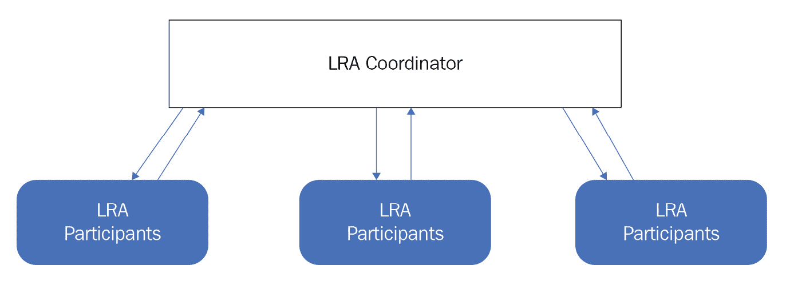

# *第十二章*: MicroProfile LRA 及其 MicroProfile 的未来

您已经到达了这本书的最后一章。恭喜您走到了这一步！在本章的最后，我们将简要讨论新发布的 MicroProfile **长运行操作**（**LRA**），然后看看 MicroProfile 的未来。

在编写这本书的过程中，MicroProfile LRA 1.0 版本发布，以解决微服务事务的需求。正如我们大家所知道的，传统的**事务**是指资金的移动，例如在线支付或从银行取款。在传统应用中，你通常使用**两阶段提交**或**扩展架构**（**XA**）协议来管理事务。然而，这些技术并不适合云原生应用的事务。在本章中，我们将探讨 MicroProfile 如何满足管理云原生事务的需求。我们还将查看云原生应用的交易架构。之后，我们将向您介绍最新的 MicroProfile 平台版本。最后，我们将了解 MicroProfile 的未来路线图以及它与 Jakarta EE 社区的协同。

我们将涵盖以下主题：

+   云原生应用事务

+   使用最新的 MicroProfile 平台版本

+   MicroProfile 的技术路线图

+   MicroProfile 与 Jakarta EE 的协同

到本章结束时，您应该能够使用 MicroProfile LRA 进行云原生应用事务，并描述 MicroProfile 的路线图，这将帮助您为未来设计应用。

# 云原生应用事务

云原生应用程序事务试图确保数据一致性和完整性，类似于传统事务。传统事务通常使用两阶段提交或 XA 协议。两阶段提交协议确保事务更新在所有数据库中提交，或者在失败的情况下完全回滚。它被许多数据库广泛支持。正如其名称所暗示的，此协议由两个阶段组成：**投票** **阶段**和**提交** **阶段**。在投票阶段，事务管理器从参与 XA 资源获得批准或拒绝。在提交阶段，事务管理器通知参与者结果。如果结果是积极的，整个事务将被提交。否则，它将被回滚。此协议非常可靠，并保证数据一致性。缺点是它会锁定资源，可能导致无限期阻塞。因此，它不适合云原生应用程序，因为它们扩展性不好，持有的锁的延迟问题。因此，为云原生应用程序事务建立了**saga 模式**以实现最终数据一致性。MicroProfile LRA 是 saga 模式的实现。在接下来的小节中，我们将更详细地讨论 LRA。

## 使用 MicroProfile LRA 进行云原生应用程序事务

MicroProfile LRA ([`download.eclipse.org/microprofile/microprofile-lra-1.0`](https://download.eclipse.org/microprofile/microprofile-lra-1.0)) 为云原生应用程序事务提供了一种解决方案。它引入了两个主要概念：

+   **LRA 参与者**：LRA 参与者是事务参与者，即云原生应用程序。

+   **LRA 协调器**：LRA 协调器是一个事务协调器，负责管理 LRA 处理和 LRA 参与者。LRA 协调器管理所有 LRAs 并根据 LRA 状态调用 LRA 方法。

以下说明了 LRA 参与者和 LRA 协调器之间的关系：



图 12.1 – LRA 协调器和参与者

如*图 12.1*所示，LRA 参与者向 LRA 协调器注册，然后根据事务状态调用相关的 JAX-RS 方法。我们现在将更详细地讨论 LRA 参与者。

### LRA 参与者

LRA 参与者是涉及事务的 JAX-RS 方法，并在`org.eclipse.microprofile.lra.annotation`包中注解了以下 LRA 注解：

+   `@LRA`：带有此注解的方法将与 LRA 相关联。`@LRA`注解将方法注册到 LRA 协调器。当使用此注解时，以下`LRA.Type`类似于`TransactionAttributeType`枚举，其变体如下：

    a) `REQUIRED`: 使用此类型时，如果方法在 LRA 上下文外部被调用，方法调用将运行在新 LRA 上下文中。否则，它将以相同的上下文运行。

    b) `REQUIRES_NEW`: 使用此类型时，方法调用将始终在新 LRA 上下文中运行。

    c) `MANDATORY`: 使用此类型时，方法调用将在 LRA 上下文内部运行。如果它在 LRA 上下文外部被调用，将返回错误。

    d) `SUPPORTS`: 使用此类型时，如果方法在 LRA 上下文外部被调用，它将在 LRA 上下文外部执行。如果它在 LRA 上下文内部被调用，它将在 LRA 上下文内部执行。

    e) `NOT_SUPPORTED`: 使用此类型时，方法始终在 LRA 上下文外部执行。

    f) `NEVER`: 使用此类型时，如果方法在 LRA 上下文外部被调用，它将在 LRA 上下文外部执行。如果在 LRA 上下文内部调用，方法执行将失败，并返回返回代码`412`。

    g) `NESTED`: 使用此类型时，当方法被调用时，将创建一个新的 LRA，这可以是顶层或嵌套的，具体取决于它是否在 LRA 上下文内部被调用。如果在外部上下文中调用，新的 LRA 将是顶层的。否则，新的 LRA 将是嵌套的。

你可能想知道如何确定方法是否在 LRA 上下文内部被调用。如果存在`LRA_HTTP_CONTEXT_HEADER`头，则表示方法是在 LRA 上下文内部被调用的。

+   `@Complete`: 带有此注解的方法将在 LRA 关闭时被调用。

+   `@Compensate`: 如果 LRA 被取消，将调用带有此注解的方法。

+   `@Forget`: 如果`@Complete`或`@Compensate`方法调用失败，将调用带有此注解的方法。

+   `@Leave`: 带有此注解的方法会导致 LRA 参与者从 LRA 参与中移除。

+   `@Status`: 带有此注解的方法报告相关 LRA 的状态。

+   `@AfterLRA`: 带有此注解的方法将在 LRA 结束时被调用。

`@Compensate`、`@Complete`和`@AfterLRA`注解用于`PUT`操作，而`@Status`注解用于`GET`操作，`@Forget`用于`DELETE`操作。让我们通过这个代码片段进一步解释这些注解：

```java
    @LRA(value = LRA.Type.REQUIRED, end=false)
    @POST
    @Path("/book")
    public Response  bookHotel(@HeaderParam
      (LRA_HTTP_CONTEXT_HEADER) String lraId)   {
        // code
    }
    @Complete
    @Path("/complete")
    @PUT
    public Response completeBooking(@HeaderParam       (LRA_HTTP_CONTEXT_HEADER) String lraId,         String userData) {
        //code
    }
    @Compensate
    @Path("/compensate")
    @PUT
    public Response cancelBooking(@HeaderParam       (LRA_HTTP_CONTEXT_HEADER) String lraId,         String userData) {
        //code
    }
```

在代码片段中，当`bookHotel()`方法在 LRA 内部被调用时，此方法将以相同的 LRA 上下文运行。如果它在 LRA 上下文外部被调用，该方法将以新的上下文运行。此方法可能会调用另一个服务。如果此方法成功，将调用`completeBooking()`方法。否则，将调用`cancelBooking()`方法。你可能想知道哪个服务调用`completeBooking()`和`cancelBooking()`方法。这是 LRA 协调器的职责，它将确保调用相应的方法。在下一节中，我们将讨论如何将 LRA 的 API 提供给你的 Maven 和 Gradle 项目。

## 使 MicroProfile LRA 可用

要使用 MicroProfile LRA API，您需要使这些 API 可用于您的应用程序。如果您创建 Maven 项目，您可以直接将以下内容添加到您的 `pom.xml` 中：

```java
<dependency>
  <groupId>org.eclipse.microprofile.lra</groupId>
  <artifactId>microprofile-lra-api</artifactId>
  <version>1.0</version>
</dependency>
```

或者，如果您创建 Gradle 项目，您需要添加以下依赖项：

```java
dependencies {
  providedCompile org.eclipse.microprofile.lra     :microprofile-lra-api:1.0
}
```

通过这种方式，您已经学会了如何在您的云原生应用程序中执行事务。恭喜！您现在已经了解了所有 MicroProfile 规范。在下一节中，让我们讨论如何最好地使用最新的 MicroProfile 平台版本。

# 使用最新的 MicroProfile 平台版本

在 *第二章*，“MicroProfile 如何适应云原生应用程序开发？”，我们提到了 MicroProfile 平台版本及其内容。到目前为止，最新的 MicroProfile 平台版本是 MicroProfile 4.1，可以在 [`download.eclipse.org/microprofile/microprofile-4.1/`](https://download.eclipse.org/microprofile/microprofile-4.1/) 找到。

MicroProfile 4.1 是建立在 MicroProfile 4.0 之上的，MicroProfile Health 从 3.0 更新到 3.1。MicroProfile 4.1 与以下 Jakarta EE 8 规范保持一致：

+   Jakarta 上下文和依赖注入 2.0

+   Jakarta 注解 1.3、Jakarta RESTful Web 服务 2.1

+   Jakarta JSON-B 1.0

+   Jakarta JSON-P 1.1

+   Jakarta 注解 1.3

它还包括以下 MicroProfile 规范：

+   配置 2.0

+   容错 3.0

+   健康性 3.1

+   JWT 传播 1.2

+   指标 3.0

+   OpenAPI 2.0

+   OpenTracing 2.0

+   Rest 客户端 2.0

如果您想为您的云原生应用程序使用 MicroProfile 4.1 的一些规范，您需要遵循以下步骤：

1.  使 MicroProfile 4.1 的 API 可用于编译您的云原生应用程序。

1.  如果您构建 Maven 项目，请在您的 `pom.xml` 中添加以下依赖项，以便将 API 供您的云原生应用程序使用：

    ```java
    <dependency>
        <groupId>org.eclipse.microprofile</groupId>
        <artifactId>microprofile</artifactId>
        <version>4.1</version>
        <type>pom</type>
        <scope>provided</scope>
    </dependency>
    ```

    或者，为您的 Gradle 项目指定以下依赖项：

    ```java
    dependencies {
    providedCompile org.eclipse.microprofile   :microprofile:4.1
    }
    ```

1.  选择一个 MicroProfile 4.1 实现来运行您的云原生应用程序。

    Open Liberty 被用作兼容实现来发布 MicroProfile 4.1。如 *第七章*，“使用 Open Liberty、Docker 和 Kubernetes 的 MicroProfile 生态系统”中提到的，Open Liberty 是一个非常轻量级且性能优异的运行时，用于支持 MicroProfile 规范。它也是一个可组合的运行时。在您的 `server.xml` 中指定以下 MicroProfile 4.1 功能会导致 MicroProfile 4.1 的实现被加载：

    ```java
    <feature>microProfile-4.1</feature>
    ```

1.  要使用独立规范，例如 MicroProfile GraphQL、MicroProfile 上下文传播、MicroProfile 反应式消息传递和 MicroProfile LRA，您需要指定前几章中提到的相关 API Maven 依赖项，然后在您的 `server.xml` 中包含相应的功能元素，如下所示。以下行引入了 MicroProfile GraphQL 1.0 的实现：

    ```java
    <feature>mpGraphQL-1.0</feature>
    ```

    这行代码启用了 MicroProfile Context Propagation 1.2 的支持：

    ```java
    <feature>mpContextPropagation-1.2</feature>
    ```

    这行代码引入了 MicroProfile Reactive Messaging 1.0 的实现：

    ```java
    <feature>mpReactiveMessaging-1.0</feature>
    ```

    这行代码启用了 MicroProfile LRA 1.0 的 MicroProfile LRA 参与者：

    ```java
    <feature>mpLRA-1.0</feature>
    ```

    这行代码启用了 MicroProfile LRA 1.0 的 MicroProfile LRA 协调器：

    ```java
    <feature>mpLRACoordinator-1.0</feature>
    ```

    从 20.0.0.12-beta 版本开始，Open Liberty beta 驱动程序提供了对 MicroProfile LRA 1.0 的支持。

通过这些，你已经获得了关于 MicroProfile 的最新信息。在下一节中，我们将讨论 MicroProfile 的未来路线图。

# MicroProfile 的技术路线图

MicroProfile 用于定义开发云原生应用的编程模型。它有助于使用不同的云基础设施技术建立良好的生态系统。这些云基础设施技术包括一些云原生框架，如 Kubernetes、Jaeger、Prometheus、Grafana 和 OpenTelemetry。Kubernetes、Jaeger、Prometheus 和 Grafana 是成熟的技术，你可能已经了解它们。你可能对 OpenTelemetry 了解不多。OpenTelemetry 是来自 **云原生计算基金会** (**CNCF**) 的新沙盒项目，我们将花一些时间对其进行简要解释。

## 采用 OpenTelemetry 的 MicroProfile

**OpenTelemetry** ([`opentelemetry.io/`](https://opentelemetry.io/)) 是由 **OpenTracing** ([`opentracing.io/`](https://opentracing.io/)) 和 **OpenCensus** ([`opencensus.io/`](https://opencensus.io/)) 合并而成的一个新的 CNCF 可观测性框架。由于 MicroProfile OpenTracing，如 *第六章* 中所述，*观察和监控云原生应用* 基于 OpenTracing，OpenTelemetry 最终必然会被 MicroProfile 采用。

MicroProfile 社区投入了大量精力来研究如何在 MicroProfile 中利用 OpenTelemetry。一个建议是继续支持 OpenTracing API，但其实现采用 OpenTelemetry，通过以下代码片段将 OpenTelemetry 追踪器转换为 OpenTracing 追踪器：

```java
io.opentracing.Tracer tracer =   TracerShim.createTracerShim(openTelemetryTracer);
```

通过追踪器转换，当前的 MicroProfile OpenTracing 应该能够继续工作。然而，OpenTracing 追踪器 API 将不再维护，因为社区已经转向开发 OpenTelemetry API。最终目标是暴露 OpenTelemetry 的追踪器 API (`io.opentelemetry.api.trace.Tracer`)。MicroProfile 社区正在努力寻找采用 OpenTelemetry 的最佳方式。

你可能知道 OpenTelemetry 也提供了指标支持。我们需要将 OpenTelemetry 指标拉入 MicroProfile 吗？这是一个悬而未决的问题。让我们在下一节中讨论 MicroProfile Metrics 的未来路线图。

## MicroProfile Metrics 的未来是什么？

**MicroProfile 度量指标**，在第*6 章*中解释，*观察和监控云原生应用*，基于**Dropwizard** ([`www.dropwizard.io/en/latest/`](https://www.dropwizard.io/en/latest/))，这是一个用于开发操作友好、高性能、RESTful Web 服务的 Java 框架。Dropwizard 在过去几年中非常受欢迎。然而，最近，**Micrometer** ([`micrometer.io/`](https://micrometer.io/))获得了更多的动力，并成为了一个突出的度量指标框架。MicroProfile 度量指标规范团队正在研究如何在保持当前 API 与 Micrometer 或 Dropwizard 兼容的同时采用 Micrometer。

如前所述，OpenTelemetry 也包含度量指标支持。另一个建议是让 MicroProfile 度量指标与 OpenTelemetry 度量指标对齐。如果 OpenTelemetry 度量指标是未来的新度量标准，MicroProfile 应该采用 OpenTelemetry 度量指标。因此，MicroProfile 提供了两个度量指标候选方案供选择。现在，问题出现了：*你应该选择哪一个*？这取决于哪一个将成为主流。理想的情况是 Micrometer 与 OpenTelemetry 集成。如果 Micrometer 与 OpenTelemetry 度量指标集成良好，采用 Micrometer 将自然与 OpenTelemetry 度量指标对齐。也许 MicroProfile 度量指标应该等待 OpenTelemetry 度量指标稳定下来，然后确定采用哪个框架。

除了现有的 MicroProfile 规范之外，MicroProfile 社区也对新的倡议感兴趣，例如 gRPC。

## 采用 gRPC

除了当前 MicroProfile 规范的演变之外，社区还感兴趣于采用新技术以提供更好的云原生应用支持。一个潜在的新规范是 gRPC。

**gRPC** ([`grpc.io/`](https://grpc.io/))是一个现代高性能**远程过程调用**（RPC）框架，可以在任何环境中运行。为了使 gRPC 在云原生应用中更容易使用，如果它能与 CDI、JAX-RS 等集成，那就太好了。如果 MicroProfile 采用 gRPC 创建一个新的规范 MicroProfile gRPC，这个规范将能够与其他 MicroProfile 规范紧密且无缝地工作。

既然我们已经讨论了规范更新，我们将讨论 MicroProfile 与 Jakarta EE 版本的对齐。

## MicroProfile 与 Jakarta EE 对齐

MicroProfile 采用了几个 Jakarta EE 技术，例如 CDI、JAX-RS、JSON-B、JSON-P 和 Common Annotations。MicroProfile 4.0 和 4.1 与 Jakarta EE 8 版本对齐。本书基于 MicroProfile 4.1 版本。MicroProfile 与 Jakarta EE 一直保持着非常紧密的合作。MicroProfile 中的大多数主要参与者也参与了 Jakarta EE。MicroProfile 和 Jakarta EE 形成了一个非常适合开发云原生应用的生态系统。它们始终保持同步并且相互兼容非常重要。Jakarta EE 9.1（[`jakarta.ee/release/9.1/`](https://jakarta.ee/release/9.1/））于 2021 年发布，这为 MicroProfile 与此版本一起工作添加了一个要求，以便最终用户可以使用这两个框架的 API。由于这个要求，我们将在下一节讨论 MicroProfile 5.0，该版本计划与 Jakarta EE 9.1 对齐。

## 将 MicroProfile 5.0 与 Jakarta EE 9.1 对齐

MicroProfile 5.0 的重点是与 Jakarta EE 9.1 对齐。包括 Config、容错、Rest 客户端、健康、度量、OpenTracing、OpenAPI 和 JWT 传播在内的八个组件规范需要更新，以便与 Jakarta EE 9.1 对齐。其中一些规范在它们的 API 中并不直接依赖于 Jakarta 规范，但它们的 **技术兼容性工具包**（**TCKs**）会引入 Jakarta 规范。对于这些规范，只需要进行小版本更新。为了使所有 MicroProfile 规范都能与 Jakarta 9.1 一起工作，独立发布下的规范，如 Reactive Streams Operators、Reactive Messaging、LRA、GraphQL 和 Context Propagation，都需要更新以与 Jakarta EE 9.1 对齐。

除了与 Jakarta EE 对齐之外，一些 MicroProfile 规范扩展了当前的 Jakarta 规范。由于这些 MicroProfile 规范是在 Java EE 停滞不前时创建的，因此这些 MicroProfile 规范成为 Jakarta 规范可能是正确的时间，这样其他 Jakarta 规范就可以从中受益。让我们看看那些规范。

### 将一些 MicroProfile 规范迁移到 Jakarta EE

一些 Jakarta EE 规范，例如**Jakarta NoSQL**（GitHub 仓库：[https://github.com/eclipse-ee4j/nosql](https://github.com/eclipse-ee4j/nosql)），将受益于 MicroProfile Config 进行配置。如果 Jakarta EE 依赖于 MicroProfile，这将创建一个循环依赖，因为 MicroProfile 与 Jakarta EE 规范保持一致。另一个问题是，Jakarta EE 规范传统上更仔细地维护向后兼容性，而 MicroProfile 规范有时会引入向后不兼容的更改。因此，Jakarta EE 规范直接依赖于 MicroProfile 规范可能存在一些问题。为了解决这个问题，提出了一个新的提案，**Jakarta Config**，以与 MicroProfile Config 合作。Jakarta Config（GitHub 仓库：[`github.com/eclipse-ee4j/config`](https://github.com/eclipse-ee4j/config)）可能成为 Jakarta EE 的核心。Jakarta Config 的目标是包含在 Jakarta Core Profile 中，以便其他配置文件和 MicroProfile 可以依赖于这个规范。

除了与 Jakarta EE 保持一致之外，MicroProfile 还在尝试采用**长期支持**（**LTS**）Java 版本，如 Java 11 和 Java 17。

你可能还记得 MicroProfile 中的两个版本：平台和独立。MicroProfile 社区需要查看独立版本中包含的规范，以确定是否是时候将一些规范移回平台版本桶中。MicroProfile 社区需要改进的另一个领域是最终用户体验。MicroProfile 社区将继续改进其入口页面([`microprofile.io/`](https://microprofile.io/))。

我们简直不敢相信这本书已经接近尾声。还有这么多主题需要涵盖。有关 MicroProfile 的更多信息，请访问[`microprofile.io/`](https://microprofile.io/)。如果您想了解与 MicroProfile 相关的任何内容，请访问 Open Liberty 指南([`openliberty.io/guides/`](https://openliberty.io/guides/))。

# 摘要

就这样，我们来到了这本书的结尾。让我们回顾一下你所学到的内容。在这本书中，我们学习了如何使用 Jakarta REST、JSON-P、JSON-B、CDI 和 MicroProfile Rest Client 创建云原生应用；然后使用 MicroProfile Config、容错、Open API 和 JWT Propagation 增强云原生应用；最后使用 MicroProfile Health、Metrics 和 Open Tracing 监控云原生应用。然后我们了解了 MicroProfile 生态系统，包括 Open Liberty、Docker、Kubernetes 和 Istio。在覆盖了所有技术之后，我们查看了一个利用不同 MicroProfile 技术的端到端项目。之后，我们讨论了部署和第二天操作。然后我们研究了独立的规范：MicroProfile GraphQL、MicroProfile Context Propagation 和 MicroProfile Reactive Messaging。

在本章的最后，我们讨论了 MicroProfile LRA 1.0 的最新版本。然后，我们讨论了 MicroProfile 的未来路线图，接着是与其 Jakarta EE 对齐的计划。本章的要点是 MicroProfile 和 Jakarta EE 是相互补充的，它们共同构成了一个支持云原生应用程序的伟大生态系统。

我们希望您喜欢阅读这本书，并学会了如何使用 MicroProfile 的惊人特性来帮助您进行云原生应用程序的开发、部署和管理。如果您想为 MicroProfile 做出贡献，请点击 microprofile.io 网站上的**加入讨论**链接（[`microprofile.io/`](https://microprofile.io/))以表达您加入邮件列表的兴趣。
