# 1

# 进入软件设计模式

每个软件架构师或开发者通常都会面临结构化代码的挑战——如何开发一个可持续的代码结构，就像艺术家绘制他们的画作一样。本章将带我们进入编写程序代码的旅程。您将探索代码结构和组织背后的挑战。我们将从面向对象编程的支柱——APIE 的早期阶段开始探讨这个主题。我们还将回顾 SOLID 原则，以获得对设计模式的理解清晰。

在本章中，我们将涵盖以下主题：

+   代码——从符号到程序

+   检查面向对象编程和 APIE

+   理解 SOLID 设计原则

+   设计模式的重要性

+   回顾设计模式解决的问题

到本章结束时，您将回顾基本的编程概念，这些概念将构成本书其余部分的基础。

# 技术要求

您可以在 GitHub 上找到本章的代码文件，链接为[`github.com/PacktPublishing/Practical-Design-Patterns-for-Java-Developers/tree/main/Chapter01`](https://github.com/PacktPublishing/Practical-Design-Patterns-for-Java-Developers/tree/main/Chapter01)。

# 代码——从符号到程序

人类语言是富有成效的、丰富的、多彩的，远远超出了单词本身可能表达的内容。可以用名词、动词和形容词来精确地表达一个时刻或动作。相比之下，机器不能理解人类能够创造出的复杂结构或表达。

机器语言是有限的、定义明确的、极其具体的，并且是简化的。它的目标是提供精确的表达意图，这正是它被设计的目的。这与人类语言的目的形成对比，人类语言的目的仅仅是沟通，而不一定是具体的内容。

机器的意图可以通过定义明确的指令或一系列指令来表达。这意味着机器理解这些指令。这些指令必须在执行时以某种形式提供给机器。每种机器通常都有一组指令。基于这种指令集，机器可以执行所需的指令，如下所示：

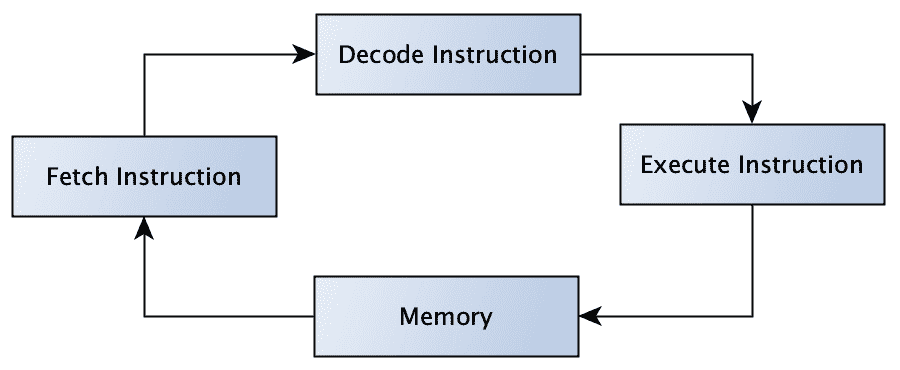

图 1.1 – CPU 内部的简化指令周期（指令来自内存，结果存储）

让我们探索一条单独的指令。指令可以被理解为给处理器的命令。处理器是机器的心脏，或者说是过程排序和执行的中心。机器可能包含一个或多个处理器。这取决于其设计，但无论如何，总有一个起主导作用。为了进一步简化，我们只考虑一个——也就是说，考虑一个只有**中央处理单元**（**CPU**）的系统，该系统专门用于执行程序。

CPU 是一种执行包含计算机程序指令的设备。CPU 必须包含如前图所示的指令集，以处理请求的操作。

由于指令的形式可能完全不同，取决于 CPU，因此没有定义的标准。这促进了不同的 CPU 平台，这并不一定是坏事，并有助于进化。然而，事实仍然是，指令对人们来说不易阅读。

我们已经说过，机器可以执行指令集合，理想情况下是一个连续的流程。指令的流程可以简化为内存中的队列，其中一条指令进入，另一条离开。CPU 扮演着与这种内存循环工作的解释者的角色（正如我们在*图 1.1*中看到的）。好的，所以 CPU 进行了解释，但随着指令被添加到内存中，它们从何而来，如何创建这样的流？

让我们收集一些想法。在大多数情况下，机器指令来自编译器。

什么是编译器？编译器可以看作是一个 CPU 或特定平台的程序，它将文本转换为目标操作。我们用来调用程序和结果的文本可以命名为机器码。以下图示说明了这一点：


图 1.2 – 从源代码通过编译器程序到其结果的简化平台特定流程

机器码是机器理解的一种低级语言，由按顺序处理的指令组成（见*图 1.1*）；程序被编译、执行和运行。

在 Java 的情况下，没有机器码：

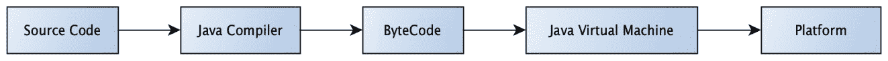

图 1.3 – Java 程序通过编译器到其平台执行的简化流程

源代码由 Java 编译器编译成字节码。字节码运行在**Java 虚拟机**（**JVM**）中（见*图 1.3*）。在这种情况下，JVM 充当字节码和 CPU 上实际执行指令之间的接口。JVM 模拟字节码指令。它通过 JVM 的一部分**即时编译器**（**JIT**）来完成这项工作。JIT 编译器将字节码指令转换为本地处理器指令。JVM 是一个特定平台的解释器，类似于直接编译的代码（见*图 1.2*）。JVM 还提供了额外的功能，如内存管理和垃圾回收，这使得 Java 平台如此强大。所有这些功能都允许开发者一次编写代码，编译成字节码，并在支持的平台上运行——这被称为**一次编写，到处运行**（**WORA**）。

在前一次探索的背景下，Java 是一种高级语言，它被翻译成低级语言。Java 提供了从计算机功能细节中的强大抽象。它允许程序员为复杂挑战创建更简单的程序。

在这一点上，我们开始共同探索标准化解决方案的旅程。在本书的后面部分，我们将回顾如何创建具有较少内存需求的可维护和可扩展的代码。我们将一起讨论不同类型的设计模式，这些模式可以帮助我们使日常工作变得可理解、透明，并且更有趣。

# 检查面向对象编程（OOP）和 APIE

在上一节中，我们学习了如何将用高级语言编写的程序转换成由 CPU 处理的机器指令。高级语言通过遵循语言实现的细节来提供一个表达所需想法的框架。这些语言通常提供许多整洁的结构或语句，这些结构或语句不会限制想象力。在**面向对象编程**（**OOP**）语言中，核心载体的表示是通过对象的概念来呈现的。本书专注于 Java 语言。Java 是一种具有额外功能的完全面向对象的语言。面向对象语言究竟意味着什么？在计算机科学中，这意味着程序关注类的概念，其中这些类的实例代表一个对象。接下来，我们将重复 OOP 范式的重点，并处理一些基本概念。

这些术语可以用**抽象、多态、继承和封装**（**APIE**）的缩写来表示。APIE 字母表示 OOP 语言的四个基本支柱。让我们按相反的顺序分别检查每个词 - 因此，EIPA。动机是为了使我们对 OOP 概念的理解更加清晰。

## 只暴露所需的内容 - 封装

按照相反的顺序，首先是封装 - 让我们从它开始。面向对象的语言，包括 Java，与类这一概念一起工作。想象一下，一个类就像一辆车。类提供了所有可以静态类型或对象特定的字段 - 也就是说，在对象在分配的内存中实例化之后启动。在类或对象方法的概念上，这一概念是相似的。方法可能属于一个类或其实例 - 在考虑的例子中，属于一辆车。任何方法都可以在对象或类字段上工作，并改变车辆的内部状态或字段值（见 *示例 1.1*）：

```java
public class Vehicle {
    private boolean moving;
    public void move(){
        this.moving = true;
        System.out.println("moving...");
    }
    public void stop(){
        this.moving = false;
        System.out.println("stopped...");
    }
}
```

示例 1.1 - 车辆类隐藏内部状态（移动）

我们可以将封装应用于车辆的例子。我们想象一辆真实的车辆——只有一辆。在这样的想象车辆中，所有内部元素和内部函数都隐藏在驾驶员视线之外。它只暴露其提供的功能，例如方向盘，驾驶员可以控制。这就是封装的一般原则。实例的状态可以通过公开的方法或字段进行更改或更新；其他一切对外界都是隐藏的。使用方法修改实例的内部数组或数组集合是一种相当好的做法。但我们在本书的后面会重复这一点。到目前为止，这只是一个好的提示。

## 不可避免的发展——继承

在上一节中，我们创建了一个想象中的车辆类实例。我们封装了所有不应向驾驶员公开的功能。这意味着驾驶员可能不知道发动机是如何工作的，只知道如何使用它。

本节专门讨论继承属性，我们将在以下示例中展示。假设车辆的发动机损坏了。我们该如何更换它？目标是用一台功能正常的发动机来替换现有的发动机。以这种方式工作的发动机可能并不一定相同，尤其是如果车辆型号已经有一些市场上无法获得的旧部件。

我们所做的是从创建新发动机所需的所有属性和函数中派生出来的。关于类，新的替换模块将在类层次结构中成为子类。

虽然发动机可能不是完美的复制品，并且没有相同的唯一对象标识符，但它将匹配所有父属性。

有了这些，我们已经描述了面向对象编程中继承的第二大支柱——在现有子类之上创建新类的功能。然而，软件设计师应该警惕第四大支柱——封装，以及子类依赖于其超类实现细节所引起的任何违规行为。

## 需求行为——多态性

第三个概念是多态性。稍加想象，这可以理解为“多种形式”。那么，这在这里意味着什么呢？

对于前面描述的车辆，它可以定义为以多种方式执行特定动作的能力。这意味着，在车辆的情况下，其他方法`move`的运动可能会根据输入或实例的状态而有所不同。

Java 允许两种类型的多态性，它们在运行时行为上有所不同。我们将详细讨论这两种类型。

### 方法重载

这种类型被称为静态多态性。这意味着正确的方法是在程序编译期间解决的——所以，在编译时。Java 提供了两种类型的方法重载：

+   改变输入参数类型：

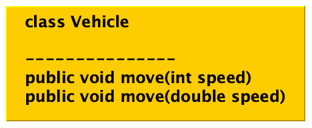

图 1.4 – 通过更改输入类型重载 Vehicle 类的方法

+   改变方法参数的数量：

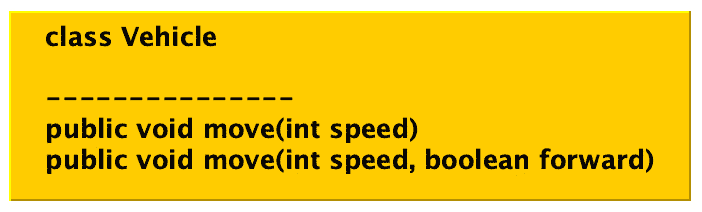

图 1.5 – 通过改变参数数量来重载 Vehicle 类的方法

现在，让我们看看多态的第二种类型。

### 方法重写

这有时被称为动态多态。这意味着执行的方法在运行时已知。重写的方法通过引用属于该对象实例的引用来调用。让我们通过一个简单的例子来说明这一点。考虑一个父类`Vehicle`（参见*图 1**.6*和*示例 1.2*）中名为`move`的方法：

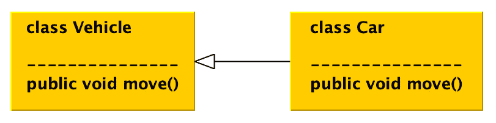

图 1.6 – 父类和子类重写 move 方法之间的关系

我们打算创建一个子类`Car`，具有类似名称的`move`方法。子类提供略微不同的功能，因为`Car`实例比父实例`Vehicle`移动得更快：

```java
public class Vehicle {
    public void move(){
        System.out.println("moving...");
    }
}
public class Car extends Vehicle {
    @Override
    public void move(){
        System.out.println("moving faster.");
    }
}
Vehicle vehicle = new Car();
vehicle.move();
output: moving faster...
```

示例 1.2 – Vehicle 变量持有 Car 实例的引用，并在运行时执行适当的 move 方法（参见图 1.6）

我们将在*第三章*中更详细地讨论这个主题，*使用创建型设计模式*。

## 标准特性 – 抽象

最后要覆盖的字母（但在缩写 APIE 中的第一个字母）引导我们到达迄今为止未指定的抽象支柱。这个概念的关键是不断去除具体或个别细节，以达到对象目的的泛化。

为了获得这个概念的最佳体验，让我们以车辆为例来探讨这个背景。我们并不打算描述属于一组车辆的具体汽车型号。我们的目标是定义一个所有考虑的车辆类型都可以在我们的努力中包含的通用功能。有了这样的知识，我们创建一个合适的抽象，一个可以在构建特定模型类时继承的抽象类（参见*示例 1.3*）。

这种方法使我们能够将精力集中在泛化和抽象车辆特性上。这可以对我们减少代码和提高可重用性产生积极影响。

在 Java 中，可以通过两种方式实现抽象：

+   带有抽象方法的抽象类（参见*示例 1.3*和*图 1**.7*）：

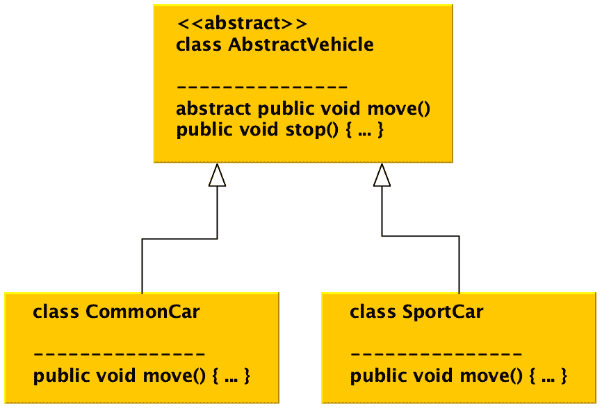

图 1.7 – 带有 CommonCar 实现和 SportCar 类的 AbstractVehicle 类

```java
public abstract class AbstractVehicle {
    abstract public void move();
    public void stop(){
        System.out.println("stopped...");
    }
}
public class CommonCar extends AbstractVehicle{
    @Override
    public void move() {
        System.out.println("move slow...");
    }
}
public class SportCar extends AbstractVehicle{
    @Override
    public void move() {
        System.out.println("move fast...");
    }
}
```

示例 1.3 – 使用抽象类概念提取通用功能，而不提供特定的实现

+   使用接口（参见*示例 1.4*和*图 1**.8*）和通用抽象方法：

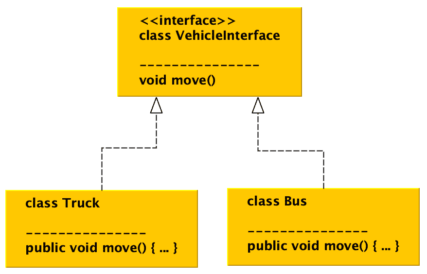

图 1.8 – 使用接口实现的抽象概念

```java
public interface VehicleInterface {
    void move();
}
public class Truck implements VehicleInterface{
    @Override
    public void move() {
        System.out.println("truck moves...");
    }
}
public class Bus implements VehicleInterface{
    @Override
    public void move() {
        System.out.println("bus moves...");
    }
}
```

示例 1.4 – 使用 Java 接口进行类似的功能提取

这两种抽象概念可以结合使用（见图*1.9*）：

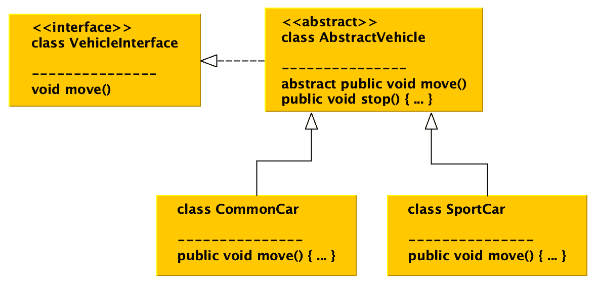

图 1.9 – 两种抽象概念的组合

抽象类和接口在代码结构的设计中都有其位置。它们的使用取决于需求，但两者都对代码的可维护性产生了非常积极的影响，并有助于设计模式的使用。

## 将部分粘接到 APIE

前几节提到的每个支柱的动机是通过一组给定的概念将结构引入代码。这些支柱是定义明确的且相互补充的。让我们仅考察一个单元，即`Vehicle`类及其实例。实例逻辑和数据通过方法封装并暴露给外部世界。车辆特性可以继承，以便可以指定新的车辆设计，例如新车型。公开的方法可以提供基于模型的行为和传入参数的内部实例状态变化。当我们对新的车辆进行概念化时，我们总能概括其行为并使用抽象类或接口提取它。

让我们考察`Vehicle`类开发中的泛化过程。当准备定义新的车辆模型时，我们总能概括其特性并使用抽象类或接口提取它。让我们看一下以下图表：

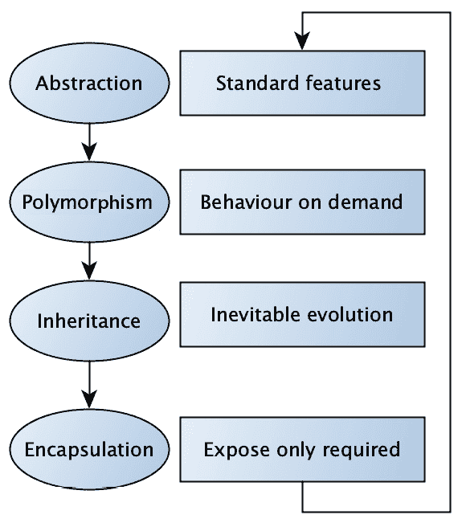

图 1.10 – 将 APIE 视为一个持续改进的过程

尽管这四个支柱看似微不足道，但遵循它们是极其困难的，正如我们将在以下章节中继续展示的那样。

到目前为止，在本节中，我们学习了 OOP 的四个基本支柱，并考察了这些原则如何影响代码设计。接下来，我们将学习更多关于可持续代码设计概念的知识。让我们继续到下一节。

# 理解 SOLID 设计原则

在前几节中，我们介绍了结构化工作的概念。通过示例详细阐述了 APIE 的开发支柱。您已经对面向对象原则中的类实例概念有了基础的理解，以及我们如何创建不同类型的特定对象：

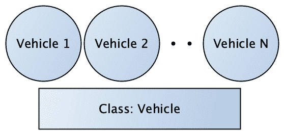

图 1.11 – 车辆 N，其中 N 是一个正整数，代表车辆类的一个实例

类可以被实例化，使得一个实例成为一个对象。对象必须适应空闲内存。我们说对象分配内存空间。当考虑 Java 时，分配的内存是物理系统内存内的虚拟空间。

顺便提一下 - 我们之前讨论了 JVM 的存在，它是为所需平台编译的字节码的解释器（参见 *图 1.3*）。我们提到了其他 JVM 功能，其中之一是内存管理。换句话说，JVM 负责分配虚拟内存空间。这个虚拟内存空间可以用来分配一个类的实例。这个虚拟内存及其碎片由 JVM 负责处理，未使用的对象通过选定的垃圾收集算法进行清理，但这超出了本书的范围，将是进一步研究的主题（参见 *参考文献 1*）。

每个程序员，尽管一开始可能并不明显，都扮演着软件设计师的角色。程序员通过编写代码来创建代码。代码承载着一种思想，这种思想根据输入的文本被语义地转化为行动。

随着时间的推移，软件开发已经经历了许多阶段，许多关于软件维护和可重用性的文章已经被撰写并发表。软件开发的一个里程碑可能被认为是 2000 年，当时罗伯特·C·马丁发表了关于 *设计原则和设计模式* 的论文（参见 *参考文献 2*）。这篇论文回顾和检查了软件开发设计和实现的技术。这些技术后来在 2004 年被简化为记忆法缩写 SOLID。

SOLID 原则的目标是帮助软件设计师使软件及其结构更加可持续、可重用和可扩展。在接下来的章节中，我们将检查 SOLID 缩写中隐藏的每个单独的术语。

## 单一职责原则（SRP） - 发动机只是一个发动机

第一原则是一个定义良好的类目标。我们可以这样说，每个类应该只有一个存在的理由。也就是说，它只对功能的一部分有意图和责任。这个类应该封装这个程序的部分。让我们用一个例子来说明这一点。想象一下之前的车辆及其抽象的例子。我们现在通过 `Engine` 和 `VehicleComputer` 类扩展这个类，如下所示：

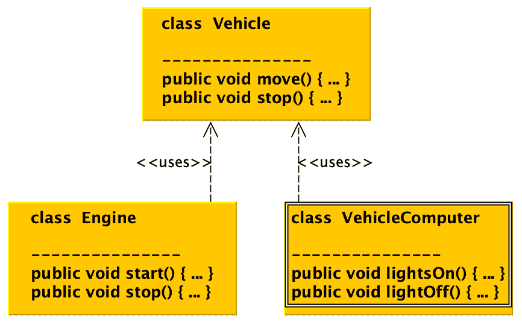

图 1.12 – 使用 `Engine` 和 `VehicleComputer` 实现的 `Vehicle` 类实例，但发动机功能不会干扰灯光

发动机可以启动和停止，但 `Engine` 类的实例不能控制车辆灯光，例如。灯光控制是车辆计算机类实例的责任。

## 开放封闭原则（OCP）

这个原则指出，正在考虑的类或实体应该是开放的，可以扩展，但对修改应该是封闭的。它与已经提到的概念相辅相成。让我们以一个例子来阐述这一点，在这个例子中，我们考虑`Car`和`Truck`类。这两个类都继承了`Vehicle`接口。它们都认为车辆实体有一个`move`方法。

如果不考虑适当的抽象，不尊重 OCP（开闭原则），代码在类不易重用或难以处理时可能会遇到意外的困难（参见*示例 1.5*）：

```java
public interface Vehicle {}
public class Car implements Vehicle{
    public void move(){}
}
public class Truck implements Vehicle {
    public void move(){}
}
-- usage --
List<Vehicle> vehicles = Arrays.asList(new Truck(), new 
    Car());
vehicles.get(0).move() // ERROR, NOT POSISBLE!
```

示例 1.5 – 虽然`Truck`和`Car`都被视为实体，但它们继承了`Vehicle`接口，`move`方法符合规范，这导致在扩展或执行时出现问题

在这种情况下，对当前示例的修正非常简单（参见*示例 1.6*）：

```java
public interface Vehicle {
    void move();    // CORRECTION!
}
--- usage ---
List<Vehicle> vehicles = Arrays.asList(new Truck(), new 
    Car());
vehicles.get(0).move() // CONGRATULATION, ALL WORKS!
```

示例 1.6 – `Vehicle`接口提供了一个移动抽象方法

显然，随着代码的演变，不遵守原则会导致意外的挑战。

## Liskov 替换原则（LSP） – 类的可替换性

前几节讨论了继承和抽象作为 OOP（面向对象编程）的两个关键支柱。对于那些仔细阅读的人，给定父-子关系的类层次结构，一个子类可以被其父类替换或表示，反之亦然，这不会令人惊讶（参见*示例 1.7*）。让我们看看`CarWash`的例子，你可以清洗任何车辆：

```java
public interface Vehicle {
    void move();
}
public class CarWash {
    public void wash(Vehicle vehicle){}      
}
public class Car implements Vehicle{
    public void move(){}
}
public class SportCar extends Car {}
--- usage ---
CarWash carWash = new CarWash();
carWash.wash(new Car());
carWash.wash(new SportCar());
```

示例 1.7 – 一个`CarWash`示例，其中任何车辆类型都可以由类层次结构中的适当类实例替换

这意味着相似类型的类可以类似地行动，并替换原始类。这个说法最早是在 1988 年由 Barbara Liskov 在主题演讲中提出的（参见*参考文献 3*）。该会议专注于数据抽象和层次结构。这个说法基于类实例和接口分离的可替换性。让我们看看接口分离。

## 接口分离原则（ISP）

这个原则指出，一个类的任何实例都不应该被迫依赖于未使用或在其抽象中的方法。它还提供了如何构建接口或抽象类的指导。换句话说，它控制了如何将预期的方法划分为更小、更具体的实体。客户端可以透明地使用这些实体。为了指出一个恶意实现，考虑`Car`和`Bike`作为`Vehicle`接口的子类，它们共享所有抽象方法（参见*示例 1.8*）：

```java
public interface Vehicle {
    void setMove(boolean moving);
    boolean engineOn();
    boolean pedalsMove();
}
public class Bike implements Vehicle{
    ...
    public boolean engineOn() {
        throw new IllegalStateException("not supported");
    }
    ...
}
public class Car implements Vehicle {
    ...
    public boolean pedalsMove() {
        throw new IllegalStateException("not supported");
    }
}
--- usage ---
private static void printIsMoving(Vehicle v) {
    if (v instanceof Car) { 
        System.out.println(v.engineOn());}
    if(v instanceof Bike) 
        {System.out.println(v.pedalsMove());}
}
```

示例 1.8 – 继承方法抽象的多种实现

一些具有敏锐眼光的人可能已经注意到，这种软件开发方向通过不必要的操作（例如异常）对软件灵活性产生负面影响。补救措施基于对 ISP 的严格遵守，以一种非常透明的方式进行。考虑两个额外的接口，`HasEngine`和`HasPedals`，以及它们各自的功能（参见*示例 1.9*）。这一步迫使`printIsMoving`方法进行重载。整个代码对客户端来说是透明的，并且不需要任何特殊处理来确保代码稳定性，以异常为例（如*示例 1.8*所示）：

```java
public interface Vehicle {
    void setMove(boolean moving);
}
public interface HasEngine {
    boolean engineOn();
}
public interface HasPedals {
    boolean pedalsMove();
}
public class Bike implements HasPedals, Vehicle {...}
public class Car implements HasEngine, Vehicle {...}
--- usage --- 
private static void printIsMoving(Vehicle v){
    // no access to internal state
}
private static void printIsMoving(Car c) {
    System.out.println(c.engineOn());
}
private static void printIsMoving(Bike b) {
    System.out.println(b.pedalsMove());
}
```

示例 1.9 – 根据目的将功能拆分为更小的单元（接口）

引入了两个接口，`HasEngine`和`HasPedals`，它们强制方法代码重载和透明性。

## 依赖倒置原则（DIP）

每个程序员，或者更确切地说，软件设计师，在其职业生涯中都会面临层次结构类组合的挑战。以下 DIP 是一个关于如何接近它的非常简单的指南。

原则建议低级类不应该了解高级类。相反，这意味着高级类，即位于上面的类，不应该了解较低层次的基本类（参见*示例 1.10*，`SportCar`类）：

```java
public interface Vehicle {}
public class Car implements Vehicle{}
public class SportCar extends Car {}
public class Truck implements Vehicle {}
public class Bus implements Vehicle {}
public class Garage {
    private List<Vehicle> parkingSpots = new ArrayList<>();
    public void park(Vehicle vehicle){
        parkingSpots.add(vehicle);
    }
}
```

示例 1.10 – 车库实现依赖于车辆抽象，而不是层次结构中的具体类

这也意味着特定功能的实现不应该依赖于特定类，而应该依赖于它们的抽象（参见*示例 1.10*，`Garage`类）。

# 设计模式的重要性

前几节介绍了两种互补的软件开发方法——APIE 和 SOLID 概念。开始显现的是，代码以透明形式存在可以因多种原因而有益，因为每个程序员通常，如果不是总是，都会面临设计一段扩展或修改现有代码的挑战。

一位智者曾经说过，“*通往地狱的道路是持续的技术债务无知之路...*。”任何减缓或阻止应用程序开发的事情都可以被认为是技术债务。用编程语言来翻译，这意味着即使是一小部分，如果现在不重要，那么将来也会重要。这也意味着代码的可读性和目的对于应用程序逻辑至关重要，因为可以验证各种假设（例如，应用程序操作）。

无法执行面向业务的应用程序测试可以被认为是错误开发趋势的第一个迹象。这可能会在验证期间需要使用不同的模拟技术。这种方法很容易变成提供假阳性结果。这通常可以归因于代码结构的杂乱，迫使程序员使用模拟。

虽然 SOLID 和 APIE 概念提出了几个原则，但它们仍然不能保证项目代码库不会开始腐烂。遵守这些原则使这变得困难，但仍然有空间，因为并非所有概念都提供了处理腐烂所需框架。

软件随着时间的推移可能会腐烂的长篇故事可能有很多，但一个不变的事实是，有一种方法可以避免它或让它腐烂。这种治疗方法被一种称为**设计模式**的想法所涵盖。设计模式的概念不仅涵盖了代码库的可读性和其目的，还提高了验证所需业务假设的能力。

定义它的背后是什么想法可以让我们更清晰？设计模式的概念可以被描述为一套可重用的编码方法，这些方法解决了在应用开发过程中遇到的最常见问题。这些方法与之前提到的 APIE 或 SOLID 概念一致，并且对带来透明度、可读性和可测试性对开发路径产生了极大的积极影响。简单来说，设计模式的概念为访问软件设计中的常见挑战提供了一个框架。

# 检查设计模式解决哪些挑战

深吸一口气，思考编写程序的动力。程序是用编程语言编写的，在我们的例子中是 Java，它是一种人类可读的形式，用于解决特定的挑战。让我们从不同的角度来审视它。

我们可以声明编写程序被视为一个目标。在大多数情况下，目标有其原因，由已知的需要或需求定义。期望和限制被定义。当目标已知时，每个行动都是选择以实现它的目标。目标被评估、组织，并放置在目标的环境中，其中目标意味着一个解决所需挑战的工作程序。想象一下前几节中提到的所有困难。

日复一日，提出的是新的解决方案，而不是一个透明的解决方案。每一天，另一个局部成功使项目得以维持，尽管表面上看起来一切都很顺利。

目前，大多数团队遵循 SCRUM 框架。想象一下，当团队遵循 SCRUM 框架（见*参考 4*）并且应用开发开始偏离目标时的情况。日常站立会议有时运行得顺利：提到发现了一个基本错误。几天后，这个错误被成功修复，并得到了热烈的掌声。有趣的是，这种通知的频率正在增长——更多的修正，更多的掌声。但这真的意味着项目正在朝着目标前进吗？这真的意味着应用程序运行正常吗？让我们看看答案。

有一个更黑暗的一面——待办事项随着功能和技术债务的增长。技术债务并不一定是一件糟糕的事情。技术债务可以刺激项目，在概念验证阶段尤其有用。技术债务的问题在于它没有被认识到、被忽视，并且评估不佳——甚至更糟糕的是，当技术债务开始被标记为新功能时。

尽管产品待办事项应该是一个整体，但它开始由两个不同且不幸不兼容的部分组成——业务和冲刺待办事项（主要是技术债务）。当然，团队正在处理来自规划会议的冲刺待办事项，但随着技术债务的增加，留给产品相关业务功能的空间越来越少。通过这种方式观察到的趋势可能导致在每次新的冲刺规划会议期间出现极其棘手的情况，那时应该分配开发资源。让我们暂时停下来，回顾一下团队由于技术债务而无法推动产品前进的情况。

SCRUM 方法的价值观可以简化为勇气、专注、决心、尊重和开放。这些价值观并不特定于 SCRUM 框架。因为团队的动机是交付产品，它们听起来都非常合理和公平。

现在，让我们刷新一下对团队所达到状态的记忆。这是一个团队无法推动项目前进，并且在定义和适当整合技术部门方面挣扎的状态。这意味着团队正在做它的工作，但可能偏离了实现其最终目标。每一次讨论都极其困难，因为正确解决和描述问题的难度很大，原因有很多。可能看起来开发者可能会失去他们的沟通语言，并开始互相误解。我们可以看到，软件的熵增加了，因为一致性没有得到保持。项目开始腐烂，不可避免地浪费的开发时间增加。

让我们再深呼吸一下，一起思考如何防止这种情况。必须有可能识别这些趋势。通常，每个团队都有一些共性：团队在知识方面并不总是同质化的，但这不应该阻止我们识别学习曲线的退化。

项目学习曲线可以帮助我们识别一个烂项目。而不是逐步向目标改进，团队经历了充满技术修复和解决方案的局部成功。这些成功甚至不符合敏捷开发（SCRUM）的价值观，逐步改进似乎不太可能。解决方案可能不会被看作是改进，因为它针对特定的运动，可能违反了所使用技术的规范。在解决方案期间，团队可能不会获得任何适用于未来的有用知识。这很快就可以被视为由于无法提供业务元素或仅提供部分元素而错失的商业机会。

除了学习曲线的退化，还可以识别出其他症状。这可以描述为无法测试业务功能。项目代码变得难以处理，依赖关系失控，这也会损害代码的可读性、可测试性和，当然，程序员的纪律。软件设计师的日常目标可以简化为关闭工单。

为了避免达到这种状态，本书将在以下章节中通过介绍和质疑不同类型的设计模式，为解决最常见的常见问题提供一些指导。这些设计模式与前面提到的面向对象（OOP）和 APIE 的基本支柱一致，并促进 SOLID 原则。

此外，设计模式可以突出任何误解的方向，并强制执行**不要重复自己**（DRY）原则。因此，项目中的代码重复较少，可测试性更高，更有趣。

这就结束了本章的内容。

# 摘要

在我们开始研究设计模式之旅之前，让我们快速总结一下。本章扩展或改进了我们对于各个领域的理解。这些领域从不同的角度影响程序代码：

+   代码透明度和可读性

+   解决复杂挑战的能力

+   遵循 SOLID 和面向对象（OOP）原则

+   代码的可测试性（可以验证代码的目的）

+   易于扩展和修改

+   支持持续重构

+   代码是自我解释的

程序代码已经编写完成——做得好。下一章将带我们了解实现平台的概述——在我们的案例中，是 Java 平台。我们将更详细地了解如何运行程序以及这意味着什么。

# 问题

1.  Java 代码是如何被解释到平台上的，又是如何解释的？

1.  APIE 这个缩写代表什么？

1.  Java 语言允许哪些类型的多态？

1.  哪个原则帮助软件设计师产生可维护的代码？

1.  OCP 代表什么？

1.  在设计模式方面应该考虑什么？

# 进一步阅读

+   《垃圾回收手册：自动内存管理的艺术》，作者：Anthony Hosking，J. Eliot B. Moss，Richard Jones，CRC Press，ISBN-13：978-1420082791，ISBN-10：9781420082791，1996 年。

+   《设计原则与设计模式》，作者：Robert C. Martin，Object Mentor，2000 年。

+   *主旨演讲 - 数据抽象和层次结构*，芭芭拉·利斯科夫，[`dl.acm.org/doi/10.1145/62139.62141`](https://dl.acm.org/doi/10.1145/62139.62141)，1988 年。

+   SCRUM 框架，[`www.scrum.org/`](https://www.scrum.org/)，2022 年。
