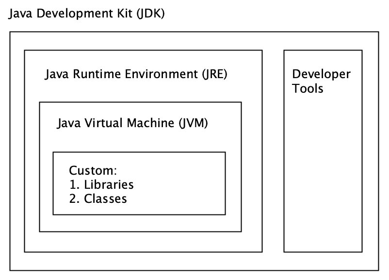
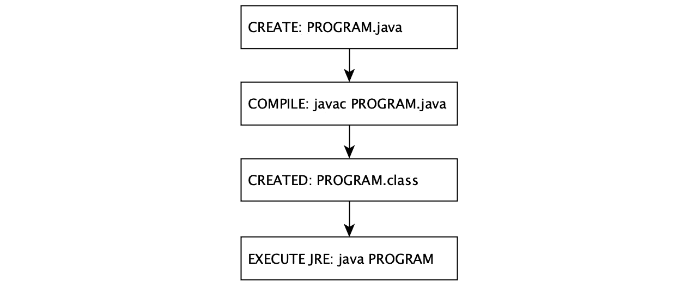
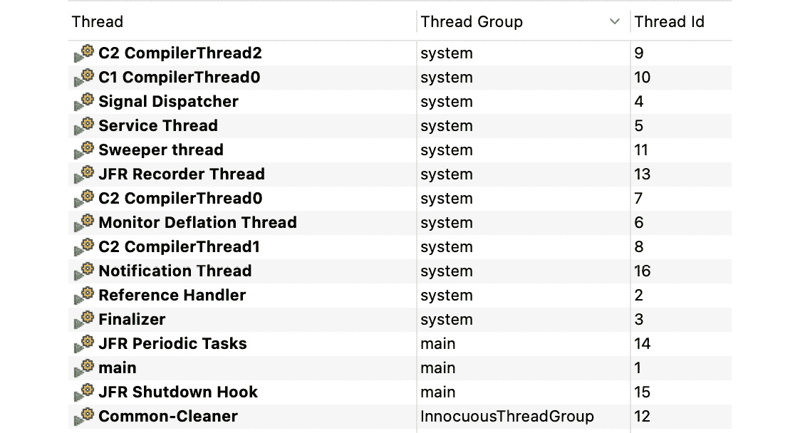
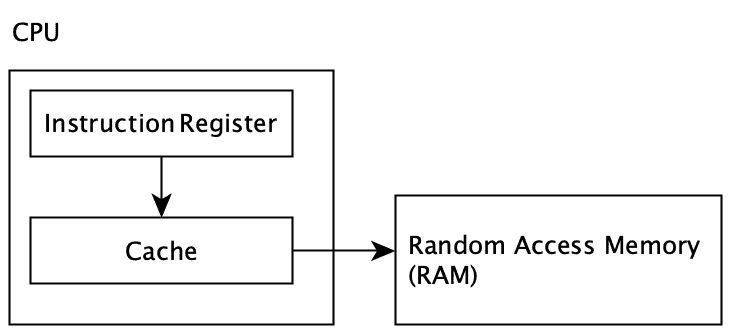
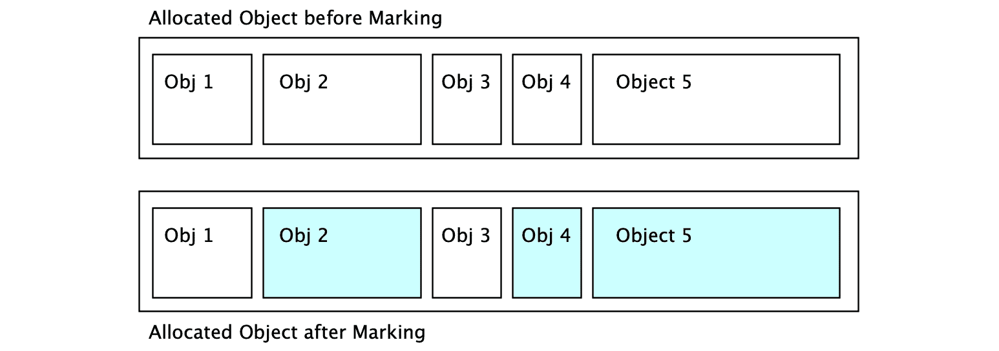
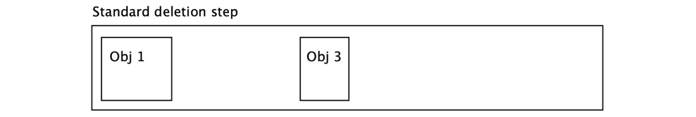
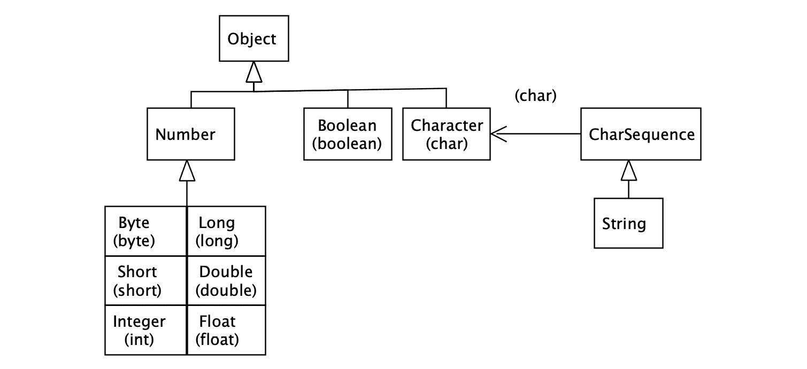
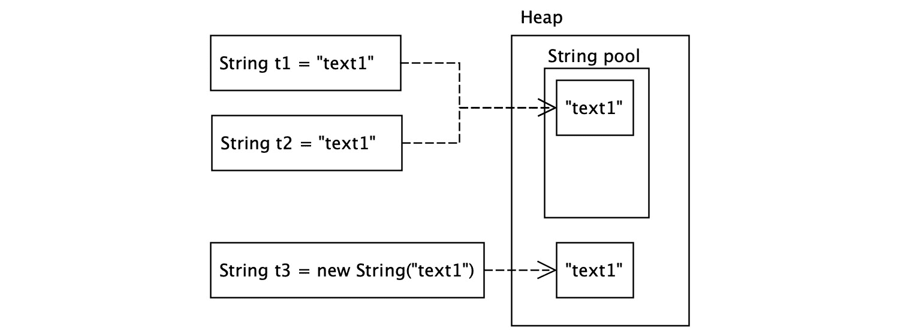
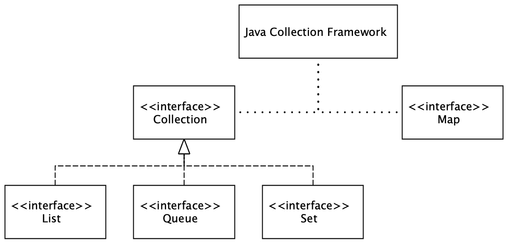

# 2

# 探索 Java 平台的设计模式

多年前，由于缺乏合适的**应用程序编程接口**（**API**）设计，一些非凡的事情开始发生。在早期使用**万维网**（**WWW**）的时候，应用开发的走向有些模糊不清。一方面，行业对处理大量数据库事务或开发特定专有硬件和软件有强烈的需求。另一方面，不清楚需要什么样的应用程序来推动需求的发展，以及这样的应用程序应该如何维护。

在本章中，我们将从内存利用的角度为理解设计模式的价值做好准备。我们将通过以下主题来实现这一点：

+   Java 的兴起和简要历史事实

+   Java 平台内部的工作原理

+   探索 Java 内存区域分配和管理

+   通过垃圾收集维护分配的堆内存

+   在平台上运行第一个程序

+   Java 平台的线程特性

+   检查核心 Java API 及其在软件设计中的价值

+   探索 Java 平台模块系统的重要性

+   探索新的有用平台增强功能

+   介绍 Java 并发

到本章结束时，你将对 Java 平台上的内存分配、平台保证、核心 API 等有良好的理解。结合上一章的内容，这些主题将形成一个良好的基础，以便你可以带着对设计模式益处的充分认识开始学习。

# 技术要求

本章的代码文件可在 GitHub 上找到，链接为[`github.com/PacktPublishing/Practical-Design-Patterns-for-Java-Developers/tree/main/Chapter02`](https://github.com/PacktPublishing/Practical-Design-Patterns-for-Java-Developers/tree/main/Chapter02)。

# 敲响 Java 的大门

在 20 世纪 90 年代初，Sun Microsystems 的一个小团队成立，目的是探索新的领域。团队从考虑扩展当时可用的 C++特性开始。其中一个目标是为小型智能设备引入新一代软件。软件的可重用性是这一目标的一部分。小型智能设备，如机顶盒，内存有限，必须明智地使用其资源。内存，以及其他因素，如复杂性、易出错的程序，以及可能詹姆斯·高斯林的语言扩展尝试，最终导致了 C++想法的放弃。为了避免与 C++的斗争，创造了一种新的语言，称为**Oak**。由于商标问题，新创建的语言 Oak 被更名为 Java。

第一个公开的 Java 版本 1.0a.2，连同 HotJava 浏览器，于 1995 年在 SunWorld 会议上由 Sun Microsystems 的科学总监 John Gage 宣布。他参与了将 Java 语言从小型硬件设备的语言重新定位为 WWW 应用程序的平台。在这些早期日子里，Java 被用作网站的一部分，使用一种称为 applet 的技术。Java applet 是小型沙盒，由具有有限访问权限的框架定义，并能够在本地**Java 虚拟机**（**JVM**）上执行 Java 字节码。Applet 位于网络浏览器中或作为独立应用程序；它们是支持 Java 的一个基本原则——**一次编写，到处运行**（**WORA**）的非常强大的工具。然而，由于许多问题（如安全和稳定性），applet 技术被标记为移除（Java SE 17）。

Java 平台由三个主要部分组成（*图 2.1*）：



图 2.1 – Java 开发工具包架构

这些部分如下：

+   一个 JVM

+   **Java SE（标准版）运行时环境**（**JRE**）

+   **Java SE 开发工具包**（**JDK**）

让我们开始一段激动人心的旅程，通过平台本身及其各个部分。

# 探索 Java 平台模型和功能

历史已经证明，预期的方向可以演变或改变：Java 是一个很好的例子，也不例外。从其原始目的来看，它已经从智能设备的平台转变为整个 Web 解决方案的平台，但它的开发并没有停止在这里。多年来，Java 已经成为应用开发中最广泛使用的语言之一。这可以被视为基本硬件独立性的副作用。它极大地发展了一套可用的工具，并得到了一个充满活力的社区的积极响应。

让我们逐个回顾平台（从*图 2.1*）的各个部分，这将有助于我们更好地理解编写代码。

## JDK

JDK 是一个提供开发和分析 Java 应用程序所需工具和库的软件开发环境。JDK 提供了一组基本库、函数和程序，用于将编写的代码编译成字节码。JDK 包含运行应用程序所需的 JRE。JDK 还提供了一些非常实用的工具，例如以下示例：

+   `jlink`：这有助于生成自定义 JRE

+   `jshell`：这是一个方便的**读取-评估-打印-循环**（**REPL**）工具，用于尝试 Java 语言

+   `jcmd`：这是一个实用程序，可以向活动的 JVM 发送诊断命令

+   `javac`：这是一个 Java 编译器，它读取具有`.java`后缀的输入文件，并生成具有`.class`后缀的 Java 类文件

+   `java`：这执行 JRE

+   其他：位于 JDK `bin`目录中

代码被编写（*示例 2.1*）并存储在`.java`文件中，使用`javac`命令进行编译：

```java
public class Program {
    public static void main(String... args){
        System.out.println("Hello Program!");
    }
}
```

示例 2.1 – 简单的 Java 程序作为一个可执行类，也可以直接运行而不需要编译步骤，因为 Java SE 11 (*参考 26*)

接下来，可以创建并编译一个包含字节码的类（*示例 2.2*）。使用 `java` 命令运行文件以运行 JRE：

```java
...
public static void main(java.lang.String...);
descriptor: (Ljava/lang/String;)V
flags: (0x0089) ACC_PUBLIC, ACC_STATIC, ACC_VARARGS
Code:
stack=2, locals=1, args_size=1
        0: getstatic     #7      // Field java/lang/
            System.out:Ljava/io/PrintStream;
        3: ldc           #13       // String Hello Program!
...
```

示例 2.2 – 由 Java 程序显示的编译程序的字节码示例

## JRE

JRE 是 JDK 的一部分，或者它可以作为针对目标操作系统的独立程序进行分发。要运行扩展名为 `.class` 的文件或 **Java 归档**（**JAR**）文件，目标系统必须包含适当的 JRE 版本。与 JDK 不同，JRE 只包含运行程序所需的最小组件集合，例如以下内容：

+   核心库和属性文件：例如，`rt.jar` 和 `charset.jar`

+   Java 扩展文件：可能位于 `lib` 文件夹中的附加库

+   安全相关文件：证书、策略等

+   字体文件

+   特定于操作系统的工具

JRE 包含 JVM 和精确两种类型的编译器：

+   **客户端编译器**：快速加载而不进行优化。它旨在快速运行指令以获得结果。通常用于独立程序。

+   **服务器编译器**：加载的代码会经过额外的检查以确保代码稳定性。还有努力产生高度优化的机器代码以提供更好的性能。它支持更好的统计信息，以便运行由 **即时**（**JIT**）编译器执行的机器代码优化（*图 2.2*）。

## JVM

JDK 和 JRE 都包含 JVM（*参考 6*）。JVM 是平台相关的。这意味着每个系统平台都需要使用专用版本。好吧，但 JVM 究竟做什么，以及如何做？

虽然有多个版本的 JVM，甚至来自多个供应商，但 JVM 本身是由一个必须遵循的规范定义的。参考实现由 OpenJDK 表示。实际上，OpenJDK 是几个较小的开源项目的集合，这些项目甚至可能具有不同的开发动态，但 OpenJDK 发布包含每个计划的版本。

![图 2.2 – JVM 的关键部分图 2.2 – JVM 的关键部分 OpenJDK JVM 实现包括一个称为 **HotSpot**（*参考 7*）的 JIT 编译器。HotSpot 是 JVM 的一部分，其责任是运行时编译。换句话说，JIT 编译器在运行时将提供的字节码转换为本地系统指令。这个过程有时被称为 **动态转换**。由于 JVM 的这些动态转换能力，Java 应用程序有时被称为系统平台无关，并使用 WORA 这个缩写。这个陈述需要稍微抽象一下，因为需要 JVM 系统实现来将字节码转换为本地指令。除了 JVM JIT 编译器外，它还包括具有各种算法的垃圾收集器、类加载器、Java 内存实现模型以及带有库的**Java 本地接口**（**JNI**）（如图 2**.2*所示）。每个 JVM 提供者都必须遵循规范。这保证了字节码不仅会被相应地创建，而且会被执行并正确地转换为机器指令。这意味着不同的供应商可能提供具有略微不同指标或优化（如垃圾收集器动态）的不同 JVM 实现。这些供应商包括 IBM、Azul、Oracle 等。供应商的多样性可以被认为是 Java 平台演化的主要推动因素之一。新功能通过**JDK 增强提案**（**JEP**）进行扩展或修改，其中每个供应商都可以做出贡献或获得非常详细的概述。总结一下，JVM 需要记住的责任如下：+   加载链接+   初始化类和接口+   程序指令执行 JVM 定义了多个不同区域，每个程序都会使用到（*示例 2.2*）。让我们逐个查看它们，一个区域一个区域（*图 2**.2*）。这可以增强我们对设计模式及其方法，如 Builder 或 Singleton 模式的价值的理解。

图 2.3 – 程序编译和执行的简化方案

一切始于书面文本，代表存储在`.java`文件中的程序。文件将被编译（*图 2.3*）并运行（*图 2**.4*），线程将被启动。启动启动了运行 JRE 的系统进程，JVM 作为 JRE 的一部分运行。



图 2.4 – 程序.java 执行示例背后的场景事件启动的线程（Java 飞行记录器）

在对流程有一个大致的了解后，我们首先将类加载到内存中。

### 类加载器加载区域

类加载器子系统位于**随机存取存储器**（**RAM**）中，负责将类加载到内存中。加载步骤包括子步骤和类在运行时的首次运行。链接是将类或接口准备为运行时环境的过程，这可能包括内部依赖项，例如。平台提供内部函数或自定义函数；为了管理所有这些功能，平台提供专门的类加载器：

+   `BOOTPATH`（属性）。

+   `lib/ext`目录，它是 JRE 安装的一部分。

+   `main`方法并运行来自服务类或模块路径的类。

+   `ClassLoader` 可以用来定义动态加载到 JVM 中的自定义类的过程。可以使用用户定义的类目标。类可以位于网络上，存储在文件中的加密状态，或者通过网络下载并在运行时生成。

类加载器按顺序工作。顺序由一个层次结构表示。这意味着每个子类必须引用其父类。这自动定义了二进制类的搜索顺序。

当一个类存在于 RAM 中时，Java 平台会采取行动使该类可供运行时环境使用。Java 平台在幕后运行多个进程，将相关的类数据移动到其他区域，例如栈、堆等。接下来让我们看看栈区域。

### 栈区域

栈区域（*图 2**.2*）在运行时为每个线程保留。这是一个用于存储方法引用的小区域。当一个线程执行一个方法时，为该方法创建一个条目并将其移动到栈顶。这种项目被称为栈帧，它引用局部变量的字段、操作数的栈和一个常量池以识别适当的方法。当方法正常执行时（即没有引发任何异常）会移除栈帧。这意味着局部原始变量，如 `boolean`、`byte`、`short`、`char`、`int`、`long`、`float` 和 `double` 也存储在这里，因此它们对第二个线程不可见。每个线程可以传递一个副本，但这并不共享原始数据。

### 堆区域

堆是所有类的实例和数组所在分配的内存。堆在启动时分配，并由所有 JVM 启动的线程共享。分配的内存由自动管理系统进程自动回收，也称为**垃圾回收**（**GC**）。局部变量可以包含对对象的引用。引用的对象位于堆中。

### 方法区域

方法区域是所有由 JVM 启动的线程共享的。该区域在 JVM 启动时分配。它包含每个类的运行时数据，例如常量池、字段和方法数据、构造函数和方法的代码。提到的不太熟悉的概念可能是常量池。常量池是在将类加载到方法区域的过程中创建的。它包含字符串和原始常量的初始值、引用类的名称以及其他执行加载的类所需的数据，包括编译时已知的常量和必须在运行时解析的字段引用。

### 程序计数器

**程序计数器**（**PC**）寄存器是内存中的另一个重要预留区域。它包含创建的程序计数器列表。每个线程的开始都会创建一个 PC 记录，包含特定线程当前执行的指令的地址。该地址指向方法区。唯一的例外是原生方法，它将地址设置为未定义。

### 原生方法栈

为每个单独的线程启动一个原生方法栈记录。其功能是通过 JNI 提供对原生方法的访问。JNI 与底层系统资源一起操作。不当使用可能导致两种异常状态：

+   第一个异常出现在线程需要更多栈空间时。在这种情况下，会抛出`StackOverflowError`错误，程序崩溃，执行状态高于 1。

+   第二种情况代表尝试向栈中添加更多条目。程序结果是一个`OutOfMemoryError`错误。这是由于尝试动态扩展已完全分配的内存空间。内存不足，无法为新线程分配新的栈空间。

我们已经检查了加载和执行程序所需的所有区域，我们将了解数据所在区域及其相互关联的方式。逐渐变得明显的是，为了在运行时实现程序的可稳定性和可维护性，有必要以反映潜在限制的方式设计软件，因为预留区域对应于各个区域。

让我们更详细地看看 Java 平台是如何为每个新创建的对象提供可用内存空间的。

# 回顾 GC 和 Java 内存模型

我们之前提到 JIT 编译器是 JVM 的一部分（*图 2.2*）。为了刷新一下 JIT 编译器的概念，它负责将字节码转换为系统特定的原生指令。这些指令处理程序可用的基本内存和 I/O 资源。为了正确组织这些指令，Java 平台需要一套规则来保证程序，即字节码，在运行时必须由 JIT 编译器转换为相同的最终状态。因为 Java 平台不直接使用物理内存，而是使用虚拟和缓存的视图，内存管理必须透明。该模型必须提供所需的保证，并被称为**Java 内存模型**（**JMM**）。

## JMM

JMM 描述了线程如何通过访问分配的内存（*图 2.2*）相互交互。单线程程序的执行可能看起来很明显，因为指令以某种顺序处理，没有外部影响，线程是隔离的。在单线程的情况下（参见*示例 2.2*中的`main`方法和*图 2.4*中的`main`线程），每次执行指令时都会修改运行区域；没有惊喜。当程序启动多个线程时，情况就改变了。JMM 强制执行其关于可靠 Java 程序执行的保证。JMM 定义了一组规则，用于可能指令顺序更改和由不同线程之间在内存中共享对象引起的执行限制。JMM 严格遵循这些规则的事实，使得 JIT 优化无需担心代码不稳定（保持一致状态）。

规则可以很容易地重新表述，只要线程的执行不违反程序顺序，每个动作都可以更改。基本上，这意味着程序保持一致状态。

对象的锁定或释放由程序顺序控制，每个线程共享修改数据的相应内存视图。内存视图表示由堆表示的已分配物理内存的部分，因为每个创建的对象都位于堆内。

JMM 的一个重要保证被称为 happens-before。它指出，为了保持程序顺序，一个动作总是发生在另一个动作之前。为了更好地理解这条规则，有必要描述系统内存的工作方式，并简要介绍内存的一般类型以及 CPU 如何适应读取值和执行机器指令的过程。

让我们从 CPU 开始。每个 CPU 都包含自己的指令寄存器。JIT 编译器编译的机器代码有一个对可用指令集的引用。CPU 包含一个内部缓存，用于存储主 RAM 中的数据副本。CPU 与保留的 RAM 进行通信。一个 CPU 可以同时运行多个平台线程（取决于 CPU 的类型）。这种实现的结果会修改线程堆栈或堆中的 RAM 状态。然后，运行 Java 应用程序的专用 RAM 被复制到 CPU 缓存中，并由 CPU 寄存器使用（*图 2.5*）。



图 2.5 – CPU 和内存交互

仔细观察的人可能已经注意到，由于内存差异，程序可能会面临由查看程序内存引起的不可预测的困难。当多个线程试图在不加小心处理的情况下更新或读取变量的特定值时，这可能导致以下问题之一：

+   **竞态条件**：当两个线程以非同步方式尝试访问相同的值时，就会发生这种情况。

+   **值更新可见性**：在多个线程之间共享的变量更新尚未传播到主内存，因此其他线程得到旧值。

为了应对这些挑战，让我们分析一个对变量的实际访问。已知的是，每个值都位于分配的 RAM 堆中。显然，更新每个变量的状态可能会带来一些惩罚，因为每个指令都必须走完整个旅程（*图 2.5*）。在大多数情况下，这也不是必要的。一个很好的例子是隔离方法的实现（*示例 2.2*）。然而，在某些情况下，需要从内存中获取变量的实际值，为此 Java 平台引入了`volatile`关键字。在变量前使用`volatile`关键字为变量提供了一个保证，即当另一个线程请求值时，它会检查主内存中的当前值。这意味着使用`volatile`关键字提供了一种 happens-before 的保证，并且每个线程都能看到其真实值。值得注意的是，由于使用`volatile`提供了一定程度的内存同步，因此应谨慎使用。它的使用与由主内存访问引起的性能限制相关。

在多个线程之间共享变量值的另一种方法是使用`synchronized`关键字。它的使用为方法或变量提供了一个保证，即每个参与者，即线程，都会被告知这些方法。显然，使用`synchronized`的主要缺点是所有线程都会被告知对方法或变量的访问，这反过来又会因为内存同步而导致性能下降。与`volatile`一样，`synchronized`保证了 happens-before。

JMM 是明亮且新鲜的；我们提到每个新对象都位于堆中（*图 2.2*）。我们对 JRE 架构的大致情况很熟悉，我们知道大多数 Java 程序似乎是多线程的——Java 平台遵循一组规则，以便进程强制程序的正确顺序以实现一致性。

## GC 和自动内存管理

尽管 Java 平台可能给人留下底层内存无限的印象，但这并不正确，我们将在下一节中探讨这一点。到目前为止，我们已经探讨了变量在多个线程之间的可见性工作原理以及如何在物理内存中引用值。JMM 只是整个故事的一部分——让我们继续调查。

我们已经知道 Java 平台使用自动内存管理过程来维护堆分配的内存。这个过程的一部分是一个在守护线程后台运行的程序。它被称为垃圾回收器（*参考 5*），在幕后默默运行，回收和压缩未使用的内存。这是堆中对象动态分配的一个优点。另一个可能不那么明显的优点是能够处理递归数据结构，例如列表或映射。

垃圾回收（GC）大约在 1959 年由约翰·麦卡锡发明。目标是简化 Lisp 中的手动内存管理。从那时起，GC 经历了大规模的发展，并发明了各种 GC 技术（*参考 1*）。即使在各种 GC 方法的发展之后，安全规则仍然是最重要的。GC 永远不应该恢复包含活动引用的活对象存储库。

虽然开发者不必担心内存回收，但了解底层过程可以非常有用，以避免意外的应用程序失败，因为系统内存总是有限的。原因在于，即使 GC 已经到位，仍然可能编写永远不会加载对象的代码，这意味着应用程序可能会因为`OutOfMemoryError`错误而崩溃。

GC 过程的目标是保持堆干净整洁，准备好分配新的对象。堆区域被划分为更小的段，如图*图 2.6*所示：


图 2.6 – 简化的堆结构分为晋升段

众所周知，大多数对象将被分配并放置在伊甸园内存中，并且不会在第二次清理中存活。在执行 Minor GC 之后，所有存活的对象都被移动到其中一个存活空间（用**S0**和**S1**表示）。次要 GC 轮次也会检查**S0**和**S1**字段，并在其中一个存活位置可能为空的时候将它们分散到其他地方。对象存活了；许多 Minor GC 已经移动到**老年代**。堆还包含一个永久部分。永久部分包含 JVM 描述类、静态方法和私有变量所需的元数据，并在运行时填充。这个区域以前被称为**永久代**（**Permgen**）。它从主堆内存中分离出来，没有加载，并且需要配置。这个缺点经常由于内存需求不足而导致应用程序不稳定。Java SE 8 引入了 MetaSpace，取代了 Permgen 概念。MetaSpace 解决了空间配置问题，因为它可以自动增长，此外，垃圾也可以被回收。

GC 基本上分为两个步骤，称为 Minor 和 Major GC。这些步骤是基于持久性的建议 – 即，长期引用：

+   **Minor GC**：当没有引用到对象时，对象被标记为不可达，年轻代区域被回收，内存可以进行压缩。

+   **Major/Full GC**：一个已经经历了几次 Minor GC 并移动到老年代堆区的对象。经过一段时间后，它不再引用任何其他对象，没有其他对象引用它，它准备被删除。Full GC 比 Minor GC 少见，并且有一个较长的暂停（停止世界）。

GC 过程可以用三个步骤简化：

1.  在第一步中，GC 标记不可达的对象（**图 2.7**.7）：



图 2.7 – 第一收集标记步骤识别堆中的未使用对象

1.  在第二步中，移除链接，空间保持空闲，就像它之前一样（**图 2.8**）：



图 2.8 – 通过删除标记对象释放内存

1.  第三步称为压缩（**图 2.9**）。它将内存重新组织成更大的部分，因此当程序尝试分配更大的对象时，空间已经准备好。这使得所有对象的内存分配速度大大加快，不仅因为空闲空间，还消除了扫描空闲内存帧的需要：


图 2.9 – 压缩释放的内存以便在帧中分配更大的对象

在对 JMM 和 GC 的任务有了新的认识之后，还有一个与两者都相关的重要概念。引用类型的概念是一种告诉平台如何处理堆空间中特定分配部分的方式 – 更具体地说，如何帮助平台的内部分析过程。引用类型被添加以帮助 GC 评估变量的目的。这意味着加快是否收集变量的决策。引用类型的概念是一个整洁的工具，与设计模式相结合，以及之前更新的主题，使事情更有意义。每个程序的目标是尽可能快地运行。这意味着即使是垃圾收集过程也会导致暂停，所以它必须尽可能快。因此，内部平台过程也必须尽可能快。所以，无论使用哪种 GC 算法，当数据集较小时，过程会快得多。引用类型也有助于保持分配的内存新鲜和干净。平台提供了以下类型，按其抵抗 GC 的能力排序：

+   **强引用**：最常见的引用类型 – 不需要指定。

+   `var obj = new WeakReference<Object>();` – 这是向 GC 算法发出信号，在下一个 GC 周期回收内存。这主要用于程序初始化阶段或缓存。

+   `OutOfMemoryError`错误。

+   **虚引用**：这代表最弱类型的引用。这种引用会尽快被收集，这意味着没有进一步的分析或提升到另一个级别。当 GC 周期运行时，此类类型的变量会立即被回收。

在开始 Java API 之旅之前，让我们快速总结一下我们新获得的知识。

引用在 GC 过程中扮演着重要角色。它们告诉垃圾收集器如何处理特定的变量。Java 内存模型提供了关于变量值如何读取、更新或删除的必要保证。我们探讨了值在分配内存中的存储、内存分段及其与底层系统的关系。所有这些新信息都有助于我们进行更好的软件设计和 API 使用。

# 检查核心 Java API

JDK 提供了一套用于创建、编译和运行所需 Java 程序的工具。我们学习了该程序如何使用基本资源来提供所需的结果。我们还检查了在设计此类程序时必须考虑的许多限制。通过使内部类集合分组到 API 中可用，JDK 为软件设计师提供了工具。上一节探讨了如何通过外部 API 扩展 JDK，这些 API 可以根据需要添加（在*JRE*部分中讨论过）。

在本节中，我们将详细讨论我们用于设计模式的最重要基本 API。

Java 是一种面向对象的语言，具有许多其他特性和扩展。官方基本 Java API 可以在`java.*`包中找到（如*表 2.1*所示）。

| **子包** | **描述** |
| --- | --- |
| `java.io.*` | 通过数据流、序列化和文件系统与系统 I/O 相关 |
| `java.lang.*` | Java 语言自动导入的基本类 |
| `java.math.*` | 与整数（`BigInteger`）和小数（`BigDecimal`）的任意精度算术相关的类 |
| `java.net.*` | 与网络协议和通信相关的 API |
| `java.nio.*` | 作为数据容器和其他非阻塞包的缓冲定义概述 |
| `java.security.*` | 用于 Java 安全框架的类和接口 |
| `java.text.*` | 提供用于处理带有文本、数字和日期的格式化消息的类 |
| `java.time.*` | 日历、日期、时间、瞬间和持续时间的 API |
| `java.util.*` | 作为集合框架、字符串解析、扫描类、随机数生成器、Base64 编码器和解码器以及一些其他杂项实用工具 |

表 2.1 – Java 17 SE 中可用的 java.*包

每个新创建的类都可以自动访问位于`java.lang.*`包中的公共类和接口，这些类和接口位于`java.base`模块中。由于一切都是对象，这意味着每个类都有一个`Object`实例。

## 原始数据类型和包装类

Java 还提供了一组称为字面量的原始类型（*参考 4*），称为字面量（*表 2.2*）。字面量和`Object`实例之间的一个区别是，每个字面量在内存中都有一个定义良好的大小。相比之下，`Object`实例的大小可能根据需求而变化。Java 的字面量类型是有符号的，如果你在处理数据缓冲操作，这将非常有用记住。

| **大小** | **字面量名称** | **范围** |
| --- | --- | --- |
| 1 位(*) | `boolean` | `true`或`false` |
| 1 字节 | `byte` | -128 到 127 |
| 2 字节 | `short` | -32,768 到 32,767 |
| 2 字节 | `char` | \u0000 到\uffff |
| 4 字节 | `int` | -2³¹ 到 2³¹-1 |
| 4 字节 | `float` | -3.4e38 到 3.4e38 |
| 8 字节 | `long` | -2⁶³ 到 2⁶³-1 |
| 8 字节 | `double` | -1.7e308 到 1.7e308 |

表 2.2 – 原始类型及其大小；（*）布尔类型的大小未精确定义

原始类型位于栈区（参见图 2**.2*）并且每个字面量都包含一个包装对象（*图 2**.10*）。



图 2.10 – 数据类型包装继承与字面量与 String 类型关联

封装围绕字面量值启动。这意味着字面量存储在栈区，而包装对象位于堆中。封面提供了额外的功能。以`Integer`类为例，它提供了以下方法：`byteValue`、`doubleValue`和`toString`。这些方法可以在特定的设计模式中调用以实现预期的目标并避免不必要的内存污染。这与仅提供值原生实现的字面量形成对比。

Java 平台自动将字面量分配给适当的包装类等。这一事实不仅有其光明的一面，也有其阴暗的一面，即所谓的自动装箱问题（*示例 2.3*）。这正好发生在原始类型被转换为包装类型时。这可能导致非常频繁的垃圾回收，这可能意味着大量的停止世界事件：

```java
Int valueIntLiteral = 42;
Integer valueIntWrapper = valueIntLiteral;
```

示例 2.3 – 在幕后创建新的 Integer 包装器的自动装箱示例

当处理字面量数字时，记住一个具有较小字节大小的字面量（*表 2.2*）可以自动分配给一个具有较大大小的字面量（*示例 2.4*）。反过来，由于内存栈区中精确分配的字节大小，这会导致编译错误：

```java
byte byteNumber = 1;
short shortNumber = byteNumber;
int intNumber = shortNumber;
```

示例 2.4 – 字面量自动装箱

我们已经检查了编号以及 Java 平台上的自动提交方式。布尔字面量是`true`或`false`，在内存中以 1 位表示。

最后尚未提到的特定字面量是`char`及其覆盖字符。让我们仔细看看，因为它也与基本的`String`对象有关。

## 使用 String API

`String`实例不是字面量。在 Java 中，字符串表示为一个对象，由字符序列定义。几乎不可能编写任何程序而不使用字符串。除了 Java 可执行文件需要将`String`字段作为`main`方法的输入之外，变量名也以字符串的形式表示。在 Java 中，字符串是不可变的。这意味着对其值的任何操作，如连接，都将创建一个新的字符串。更准确地说，无法更改其当前值。字符串是 Java 平台的基本类。

存储字符串值的一种常见方式是使用字符串池。字符串池只存储固有值（*图 2**.11*）。这意味着只能有一个不同的常量值存在。这种方法在内存效率方面更为高效，包括耗时的字符串操作。



图 2.11 – 字符串池是堆内存的一部分，字符串对象像其他对象一样驻留在堆中

您还可以使用`String`构造函数直接在堆中存储字符串 – 例如，`new String`。在这种情况下，链接不是指向字符串池中已存在的等效值（在*示例 2.5*中由`t3`表示），因为它位于不同的堆内存空间中。如果您强制在池字符串中进行搜索，可以使用`intern`方法（*示例 2.5*中的`t4`）：

```java
String t1="text1";
String t2="text1";
String t3= new String("text1");
String t4 = t3.intern();
```

输出：

```java
1 == t2 => true
t1 == t3 => false
t3 == t4 => false
t1 == t4 => true
```

示例 2.5 – 比较不同的字符串值赋值方式

在 String 类上使用`+`运算符可能会导致连接或程序可维护性非常低效。为了防止字符串污染，Java 平台在其 API 中提供了`StringBuilder`类。`StringBuilder`防止存储临时值，并且只存储执行其内部`toString`方法创建的结果，该方法在堆空间中创建一个新的`String`对象（*示例 2.6*）。`StringBuilder`还引入了 Java SDK 中的创建型设计模式和其实施及使用：

```java
String t5 = new StringBuilder()
        .append("value")
        .append(42)
        .toString();
String t6 = "value42";
```

输出：

```java
t5 == t6 => false
```

示例 2.6 – StringBuilder 默认在堆空间中创建一个新的字符串对象

我们了解到 String 对象是如何创建的，以及它们存储在哪个堆内存中。这些新获得的信息可以帮助我们在选择合适的设计模式或它们的组合时做出决策，以避免内存的误用。因为字符串在底层是一个字符数组，原始类型 `char[]`，所以数组不是原始的——实际上，它是一个对象。让我们更仔细地考察这个概念，因为它对于 Java 语言和平台也是至关重要的。

## 介绍数组

为了更好地理解 Java 集合框架，首先，我们将探讨一个重要概念，即数组。在 Java 中，数组通过一系列相同类型的按位置索引元素序列来表示。字段是基于索引的。任何在运行时尝试从不存在位置获取元素的尝试都会导致 `ArrayIndexOutOfBoundsException` 异常。数组字段作为对象分配并存储在堆空间中。这意味着在空间不足的情况下，会抛出 `OutOfMemoryError` 异常。由于内存分配，每个数组都需要一个定义的大小。使用字面量进行简单的字段分配相对内存效率较高（*示例 2.8*）：

```java
int[]     array1;        
byte[][]  array2;        
Object[]  array3;        
Collection<?>[] array4;
```

示例 2.8 – 多种数组分配方法

数组允许我们存储实现接口类或一系列抽象类的元素。字段变量声明不会创建或分配一个新的字段；变量包含一个字段引用（*示例 2.9*）：

```java
int[] a1 = {1,2,3,4};
a1[0] = a1.length;
int e1 = a1[0];
a1.length == 4 => TRUE 
a1 instanceof Object => TRUE
```

示例 2.9 – 数组的初始化、赋值和验证

由于字段可能具有精确的要求和有限的辅助方法，其使用往往被忽视。然而，它可以帮助强制执行开放-封闭原则，该原则假设代码的可维护性。

字段通常被集合或映射结构所取代，这些结构提供了额外的辅助方法。让我们更深入地探讨这个主题。

## 发现集合框架

与字段不同，高级集合提供了自动调整大小的功能。这意味着所需的基本表示将被复制，而之前的版本将变得适合进行垃圾回收。Java 集合框架包括 `List`（*表 2.3*）、`Set`（*表 2.4*）、`Queue`（*表 2.5*）和 `Map` 接口，以及多个实现（*图 2**.12*）。实现可能因供应商而异，但所有实现都必须符合基本规范。



图 2.12 – Java 集合框架接口之间的依赖关系

集合的含义位于 `java.base` 模块及其 `java.util` 包中。该包包含最常用的实现，具有已知的时间复杂度行为。空间复杂度不是非常相关，因为框架自带自动调整大小的功能。当涉及到设计模式的选择时，时间复杂度可以发挥更重要的作用，因为这可能会显著惩罚所提出程序的响应。为了评估 O-符号的时间复杂度，使用 O-符号来突出上限，并必须使用最坏情况的程序来获得它。

为了评估时间复杂度的影响，我们可以通过一些很好的例子，例如选择正确数据结构的重要性。让我们从列表结构（*表 2.3*）开始，它允许使用索引访问每个元素。

| **名称** | **包含** | **添加** | **获取** | **移除** | **数据结构** |
| --- | --- | --- | --- | --- | --- |
| `ArrayList` | O(n) | O(1) | O(1) | O(n) | 数组 |
| `LinkedList` | O(n) | O(1) | O(n) | O(1) | 链表 |

表 2.3 – 按提供的操作及其时间复杂度排序的所选 List 接口实现

有时算法要求您验证数据结构中元素的存在，并添加或移除新的元素。对于这些情况，让我们看看 `Set` 接口的实现（*表 2.4*）。

| **名称** | **包含** | **添加** | **移除** | **数据结构** |
| --- | --- | --- | --- | --- |
| `HashSet` | O(1) | O(1) | O(1) | 哈希表 |
| `TreeSet` | O(log n) | O(log n) | O(log n) | 红黑树 |

表 2.4 – 按提供的操作和时间复杂度排序的所选 Set 接口实现

集合组提供的最后一个接口是 `Queue`（*图 2**.12*）。当您只需要处理第一个或最后一个元素时，这种数据结构非常有用（*表 2.5*）。

| **名称** | **峰值** | **提供** | **轮询** | **大小** | **数据结构** |
| --- | --- | --- | --- | --- | --- |
| `PriorityQueue` | O(1) | O(log n) | O(log n) | O(1) | 优先堆 |
| `ArrayDequeue` | O(1) | O(1) | O(1) | O(1) | 数组 |

表 2.5 – 提供的操作及其时间复杂度的所选 Queue 接口实现

当涉及到实现 `Map` 接口时，重要的是要记住考虑哪种类型的映射实现。映射表示键值对的结构。键和值都是 `Object` 类的子类。除了在映射的定义或初始化中不能使用字面量之外，还需要正确实现 `hashCode` 和 `equals` 对象方法。这一要求基于识别正确桶以解决潜在的映射冲突的需要。这种冲突可能导致时间复杂度偏离我们的预期（*表 2.6*）：

| **名称** | **包含键** | **通过键获取** | **通过键移除** | **数据结构** |
| --- | --- | --- | --- | --- |
| `HashMap` | O(1) | O(1) | O(1) | 哈希表 |
| `LinkedHashMap` | O(1) | O(1) | O(1) | 哈希表，链表 |

表 2.6 – 通过提供的操作选择 Map 接口实现及其时间复杂度

集合框架使用了一种高度行为性的迭代器设计模式来遍历考虑的元素。那些有敏锐眼光的人肯定已经注意到，没有适当的数学基础，集合框架中的任何功能都是不可能实现的。使用设计模式的主要原因之一是将或创建业务逻辑所使用的正确结构。让我们简要地看一下一些基本的数学特性。

## Math API

Java 通过提供`Math`类的静态实现来揭示基本的数学函数。最终意味着这个类不能被扩展，这包括不情愿的更改或替换基本函数。`Math`类（*示例 2.10*）位于`java.lang`包中，这意味着它可以直接使用，无需导入：

```java
Double sin = Math.sin(90);
double abs = Math.abs(-10);
double sqrt = Math.sqrt(2);
```

示例 2.10 – 使用`Math`类提供的常用数学函数

虽然`Math`类使用了`random`方法，但它只得到一个`double`结果。`Random`类位于`java.util`包中，不仅为类型提供了更多可定制的功能，也为所需的范围提供了更多可定制的功能（*示例 2.11*）：

```java
Random randomNumberWithRange = new Random();
int upperBound = 10;
int randomIntInRange = randomNumberWithRange.
nextInt(upperBound);
double randomDoubleInRange = randomNumberWithRange.
nextDouble(upperBound);
```

示例 2.11 – 在一个范围内生成随机数（0 – 上限）

Java 的`Math`类在这里也被使用，类似于任何超出标准数学运算能力所需的计算。在遵循函数式编程方法时，使用`Math`类的方法可能会有所帮助。

# 函数式编程与 Java

在上一章中，我们学习了并演示了面向对象编程（**OOP**）的关键原则（APIE）。在过去的几十年里，Java 平台随着商业和开发社区的需求而发展。平台通过实现一个使用树函数组合来提供所需结果的 API 来应对这一挑战。这与传统的循环方法以及一系列命令式命令的集合方法形成对比。这种方法导致更大的代码库达到了预期的目标。

从 Java SE 8 开始，平台提供了一种流式 API（*参考 15*）。它位于`java.util.stream`包中，与由输入和错误（`System.out`、`System.in`和`System.err`）表示的 Java 数据流无关。Stream API 引入了对元素序列应用操作的能力。有两种类型的中间操作可以编辑或检查数据，以及终端操作。终端操作可能提供一个单一的结果或无返回值。中间操作可以连接，但终端操作终止流。元素序列是惰性评估的，也可以并行执行。默认情况下，执行并行流使用的是公共**Fork/Join 框架**执行服务。Fork/Join 模型可以被认为是一种在 20 世纪 60 年代初形成的并行设计模式（*参考 17*）。

尽管该平台允许您编程功能类型，但面向对象的概念仍然存在，并随后是强类型要求。这为 Stream API 提供了安全性，即原始元素类型保持不变或必须由中间操作或终端操作正确强制执行 – 否则，平台将引发编译错误。提醒一下，没有 Java SE 5 中泛型类型的引入，这些功能都不可能实现。泛型（*参考 4*）允许我们通过类型标志来参数化类或接口，以保持编译安全（*参考 2*）。

中间操作或终端操作是匿名函数或函数式接口的实现。它们代表一小块代码，正式称为 lambda。让我们更详细地解释一下 lambda 的概念。

## 引入 lambda 和函数式接口

Lambda 概念被引入以实现元素操作。Lambda 基本上将数据视为代码或函数视为方法。Lambda 依赖于匿名类概念 – 即，只有一个执行动作的方法的类。Java 包含了一组已实现的函数式接口或现成的函数。类使用`@FunctionalInterface`注解进行标注，这是一个从 Java SE 8 开始可用的标签。它告诉平台，特定接口只包含一个抽象方法，可以用来实例化匿名类，如*表 2.7*所示。这也意味着接口可能包含一些属于类的默认或静态函数。

| **名称** | **输入** **参数** | **返回** **类型** | **抽象** **方法** | **描述** |
| --- | --- | --- | --- | --- |
| `Supplier<T>` | - | T | `get` | 返回类型为<T>的值 |
| `Consumer<T>` | T | - | `accept` | 消费类型为<T>的值 |
| `Function<T, R>` | T | R | `apply` | 消费类型为<T>的值并应用一个具有返回类型<R>的转换 |
| `Predicate<T>` | T | 布尔值 | `test` | 消费类型为<T>的输入并返回布尔结果 |

表 2.7 – 自 Java SE 8 以来在 JDK 中可用的基本函数式接口

## 在 lambda 表达式中使用功能接口

我们发现每个 lambda 表达式都是惰性加载的，这意味着代码是在需要时评估的，而不是在编译时，并且可能由终端操作关闭（*示例 2.12*）：

```java
List<String> list = Arrays.asList("one", "two", 
    "forty_two");
list.forEach(System.out::println);
```

示例 2.12 – 将 List 接口的元素转换为流，并对每个 Consumer 类型实例应用终端操作

我们可以将不同的中间函数链接在一起（*示例 2.13*）并使用终端操作关闭流，或将流传递给另一个方法或对象：

```java
Predicate<Integer> numberTest = new Predicate<Integer>() {
    @Override
    public boolean test(Integer e) {
        return e > 2;
    }
};
String result = Stream.of(1,2,3, 42)
        //.filter(e -> e > 2) //Anonymous class example
        .filter(numberTest)
        .map(e -> "element" + e)
        .collect(Collectors.joining(","));
System.out.println("result: " + result);
```

示例 2.13 – 命名和匿名功能接口的高级组合

lambda 表达式流 API 在代码组合中扮演着重要的角色。它可以想象成一个生产线，输入对象进入其中，并得益于一系列调整，返回预期的结果或结束操作。由于 lambda 表达式是惰性评估的，这意味着生产线有一个开关。换句话说，Stream API 可以被认为是语法上最重要的突破之一。

# 掌握 Java 模块系统

使用像 Java 这样的高阶编程语言的主要目的之一是代码重用。语言的基本构建块是根据 APIE 原则的类概念。Java 可以将这些类本地化到由特定包名定义的组中。包概念封装了一组类。类可以为其内部字段和方法提供不同级别的可见性。Java 指定了以下可见性级别：`public`、默认、`private` 和 `protected`。关键字用于在不同包之间减少可见性以管理它们的交互。在应用程序域中共享包的方法是将其保持为公共的——也就是说，对每个人都是可见的。

Java 多年来一直在使用类路径的概念。类路径是一个特殊的地方，类加载器在这里加载其类。然后，在运行时使用这些加载的类（在 *图 2.2* 中表示为 **类加载器子系统**）。

然而，这个概念并不为存储的包或类提供任何保证。多年来，这个概念被认为是不好的、脆弱的和容易出错的。一个很好的例子是尝试打包一个包含具有类似包结构和类名的不同版本库的 JAR 可执行文件。类路径没有区别，类可以被不同版本覆盖。

突破随着 Java SE 9 的发布而来。JSR-376，以前是 Jigsaw 项目的核心（*参考 3*），已成为平台的一个共同部分。JSR-376 实现了 **Java 平台模块系统**（**JPMS**）（*示例 2.14*）：

```java
$ java –list-modules          
java.base@17     
java.compiler@17 
java.datatransfer@17
<more>
```

示例 2.14 – 列出特定版本的可用 JDK 模块

此外，平台已根据模块进行迁移（*示例 2.15*）：

```java
$ java –describe-module java.logging
java.logging@17
exports java.util.logging
requires java.base mandated
provides jdk.internal.logger.DefaultLoggerFinder with 
    sun.util.logging.internal.LoggingProviderImpl
<more> 
```

示例 2.15 – 描述 java.logging 模块。java.base 模块自动存在，因为它包含核心平台和语言功能。

JMPS 提供了一个强大的包封装概念，它定义了应用在包级别的交互 (*示例 2.16*)。应用可以被划分为只能检测 API 或服务的模块。JMPS 支持包级别的依赖构建，并提高了正在开发的应用的维护性、可靠性和安全性：

```java
Module java.logging {
    exports java.util.logging;
    provides jdk.internal.logger.DefaultLoggerFinder with
        sun.util.logging.internal.LoggingProviderImpl;
}
```

示例 2.16 – 模块-info.class 描述符示例，暴露给外部使用的包

使用 JPMS 不是强制性的。Java 平台使用 JMPS，但如果应用尚未准备好，可以使用未命名的模块。在这种情况下，所有包或类都将属于这种未命名的模块。原则上，未命名的模块从类路径中读取每个可读的模块或类，而不反映 JPMS 要求的任何包级别限制。这样，就实现了与先前开发的应用的兼容性，并且软件设计者对代码库的故障没有疑问——也就是说，JPMS 被禁用了。

虽然 JPMS 在应用可持续性、安全性和可重用性方面具有巨大的潜力，但它通常没有被使用，因为它会间接地施加压力，要求正确配置底层的 JPMS 并使用一种强制 SOLID 原则的设计模式。

当使用 JMPS 时，平台确保开发的应用不包含任何循环依赖。在幕后，JPMS 创建了一个无环的模块图（而不是类路径的情况）。

通过创建模块描述符文件，平台提供了一组指令，可用于将模块的某些部分暴露给外部世界。

让我们创建一个简单的模块示例，以消除对 JPMS 使用的任何疑虑 (*示例 2.17*)。到目前为止的讨论可以克服最初的困难：

```java
module-example
├── example
│   └── ExampleMain.java
└── module-info.java
```

示例 2.17 – 使用 OpenJDK 17 开发的模块 example 的文件夹结构

我们创建一个合适的可执行类，`ExampleMain.java`，以及一个模块描述符，`module-info.java` (*示例 2.18*)。这样，我们告诉平台使用 JPMS：

```java
// file module-info.java
module module.example {
    exports example;
}
// file ExampleMain.java
package example;
public class ExampleMain {
    public static void main(String[] args) {
        System.out.println("Welcome to JMPS!");
    }
}
```

示例 2.18 – 由示例 2.17 中的文件结构引入的简单模块示例

示例展示了如何将项目分割成包含它们自己的描述符、`module-info.java` 文件的模块 (*示例 2.17*)。此描述符定义了通过依赖关系或模块内部暴露与其他模块的交互。JPMS 确保包括可见性在内的限制得到维护：

```java
$ javac -d ./out ./module-example/module-info.java 
    ./module-example/example/ExampleMain.java
$ jar –create -file module-example.jar -C ./out .
$ java –module-path ./module-example.jar –module 
    module.example/example.ExampleMain
```

输出：

```java
   Welcome to JMPS!

$ java –module-path ./module-example.jar –describe-module 
    module.example
```

输出：

```java
module.example
exports example
requires java.base mandated
```

示例 2.19 – 编译示例 2.17 的步骤，包括输出，以及编译结果后的模块描述符检查（示例 2.18）

JPMS 对平台来说是一个重大变化，尽管它通过提供定义包结构清晰性的能力为软件设计师开辟了新的视野，但它并不总是受到欢迎或被理解。这可能是由于在设计系统时需要考虑的额外要求，这些要求本质上与 APIE 或 SOLID 原则的知识相关。

JPMS 与 Stream API 以及 lambda 一起，可能被认为是 Java SE 11 版本中解决的一些重大变化——Java SE 11 是 8 版本之后的下一个**长期支持**（**LTS**）版本。让我们进一步探讨一些从 Java SE 11 到下一个由发布 17 呈现的 LTS 版本的变化。

# 快速回顾 Java 从 11 到 17+ 的特性

本版本更新展示了性能和优化改进。在本节中，我们将检查那些对特定设计模式及其结构的使用非常有用的改进。这相当于平台增强，可以提高代码可读性、平台使用或语法增强。

## lambda 参数的局部变量语法（Java SE 11，JEP-323）

Java 常常因为变量使用中的标准代码量而受到批评；Java SE 10 引入了一个新的关键字，`var`。这个关键字背后的推导是局部类型变量。它本质上要求值类型从新创建的引用实例中获取（*示例 2.20*）。使用流 `boxed` 函数展示了装饰者模式，它将流值包装在所需类型中：

```java
Consumer<Integer> consumer = (var number) -> {
    var result = number + 1;
    System.out.println("result:" + result);
};
IntStream.of(1, 2, 3).boxed().forEach(consumer);
```

示例 2.20 – 在 lambda 表达式和流中使用局部类型推断以减少样板代码

虽然 lambda 已经允许隐式类型定义，例如，使用注解是不可能的。

## Switch 表达式（Java SE 14，JEP-361）

软件设计师长期以来一直抱怨 switch 命令的使用存在一些不一致性，例如控制流问题。尽管这个增强与所有控制流完全兼容，但它引入了新的 switch 标签形式，`case CONSTANT->`。扩展还允许使用更多的常量，使整个 switch 表达式更加紧凑。最后一个改进是 switch 表达式能够返回其计算值（*示例 2.21*）。这对设计模式的实现有非常积极的影响，因为例如，行为类型需要精确的控制流（*参考 8*）：

```java
Var inputNumber = 42;
String textNumber = switch (inputNumber){
    case 22,42 -> String.valueOf(inputNumber);
    default -> throw new RuntimeException("not allowed");
};
System.out.printf("""
        number:'%s'
        %n""", textNumber);
```

示例 2.21 – 使用简单的文本块进行紧凑的 switch 表达式和带有返回控制流的用法

## 文本块（Java SE 15，JEP-378）

许多时候，你需要创建具有特定格式的多行文本。之前使用多个转义序列和字符并不实用，因为它可能不可预测。文本块扩展引入了一个字面量，允许你以可预测的方式表示一个字符串（参见*示例 2.21*中的`System.out.printf`方法，以及*参考 9*）。

## instanceof 的模式匹配（Java SE 16，JEP-394）

以前，需要重新输入一个已经验证为正值的值类型。这增加了代码库，有时甚至对代码的稳定性产生负面影响，即使在设计模式时也是如此。这个平台扩展消除了需要后置转换的需求，变量可以直接使用正确的类型（*示例 2.22*，*参考 10*）：

```java
Object obj = "text";
if(obj instanceof String s){
    System.out.println(s.toUpperCase());
}
```

示例 2.22 – 使用 instanceof 与直接类型方法

## 记录（Java SE 16，JEP-395）

`record` 类类型非常有用，因为它的声明非常简单，可以携带程序业务逻辑所需的所有数据。记录携带不可变数据。它们提供了已实现的 `hashCode` 和 `equals` 方法。这意味着设计的软件不需要提供额外的代码（*示例 2.23*，*参考 11*）：

```java
private record Example(int number, String text){
    private String getTogether(){
        return number + text;
    }
}
```

示例 2.23 – 新的记录类类型可能对代码减少产生非常积极的影响，因为它提供了生成的方法

## 密封类（Java SE 17，JEP-409）

这些是获得对类和接口、或类扩展和接口实现的控制的非常优雅的增强（*参考 12*）。封闭类为软件设计师提供了对超类的广泛访问，而无需扩展它。它们克服了广泛使用的包访问修饰符的限制，之前需要完全实现抽象方法。示例展示了如何定义一个用于扩展的开放类，使用 `non-sealed` 关键字（*示例 2.24*）：

```java
public sealed interface Vehicle permits Car, Bus {
    void start();
    void stop();
}
public non-sealed class Car extends NormalEngine implements 
    Vehicle {
    public String toString(){
        return "Car{running="+ super.running +'}';
    }
}
```

示例 2.24 – 接口方法的实现由抽象类 NormalEngine 提供

密封类强制控制可能的扩展（*示例 2.25*），因为它们为软件提供了潜在的安全，以防止不想要的软件设计更改：

```java
Public class Motorbike implements Vehicle{
    public void start() {}
    public void stop() {}
}
```

这是编译输出：

```java
Motorbike.java:2: error: class is not allowed to extend 
sealed class: Vehicle (as it is not listed in its permits 
clause)
```

示例 2.25 – 密封类强制控制增强

密封类也带来了一些潜在问题，因为软件设计师必须决定新创建的类将如何被使用，指示是否允许类扩展，关键字是未密封的（*示例 2.25*），或者使用 `final` 关键字（*示例 2.26*）锁定：

```java
Public final class Bus extends SlowEngine implements 
    Vehicle {}
```

示例 2.26 – 需要决定类的行为，并且 Bus 类示例被锁定，不允许任何扩展

虽然这看起来可能是一个可能的缺点，但它从可维护性和设计模式的角度提供了软件开发中的更大清晰度。这减少了潜在的接口或类错误。

## 默认使用 UTF-8 编码（Java SE 18，JEP-400）

多年来，编码不明确导致了问题。编码问题不易检测，并且在不同系统平台上不可预测地出现。这个增强统一了所有内容，并强制使用 UTF-8 作为默认编码（*参考 13*）。

## switch 的模式匹配（Java SE 18，第二次预览，JEP-420）

`instanceof`字段（JEP-394）和 switch case 表达式（JEP-361）的改进使得代码库的压缩和通过在非常紧凑、命令导向的命令语句中使用`instanceof`来移除之前不必要的 if-else 结构变得更加容易：类型服务（*示例 2.27*，*参考 14*）：

```java
Object variable = 42;
String text = switch (variable){
    case Integer i -> "number"+i;
    default -> "text";
};
```

示例 2.27 – 压缩的 switch 语句，具有隐式类型匹配

在审查了最重要的语法改进之后，我们可以安全地开始深入探讨平台的主要优势之一。是的，它是并发框架。

# 理解 Java 并发

在本章的开头，已经展示了即使运行一个简单的程序（*示例 2.2*和*图 2**.3*）也会导致多个线程的具体化（*图 2**.4*）。这意味着通过执行`main`方法创建的程序线程并没有创建属于该程序的任何其他线程。Java 平台因其能够执行并发或并行任务而闻名且价值巨大。

我们了解到线程是如何以及在哪里存储它们的变量，以及为什么在堆中同步对象可能会导致不希望或意外的程序行为。在本节中，我们将探讨主线程使用可用 CPU 的可能性。

软件设计师考虑使用任何并发设计模式的动机可能是对更好的应用程序响应性或吞吐量的日益增长的需求。

尽管平台已经包含了`Thread`类和`java.lang`包，但 Java 并发特性，如`java.util.concurrent`包，它是`java.base`模块的一部分。

让我们更仔细地看看。

## 从基本线程到执行器

平台的基本构建元素是线程。线程由`Thread`类的实例表示。使用`new`关键字初始化的对象仍然不会创建平台线程。该对象提供了一个名为`start`的方法，该方法需要显式使用（*示例 2.28*）：

```java
public class Multithreaded Program {
    public static void main(String[] args) {
        var t = new Thread(() -> {
            while(true){System.out.println("Welcome 
                Thread!");}
        });
        t.setDaemon(true);
        t.start();
    }
}
```

示例 2.28 – 一个在 JVM 停止后立即结束的守护线程的简单程序

虽然看起来平台可以创建不受限制的`Thread`实例，但这种说法是不正确的。每个新创建的线程实例不仅占用堆空间或分配栈空间，而且通过 Java 运行时分区（*图 2**.2*）与基本系统线程（处理周期）相连。这意味着不受控制的线程启动可能会由于资源不可用、内存不足等原因导致系统错误异常。

Java 平台创建的系统线程的最大数量可能因硬件以及 JVM 配置而异。Java 的 `Thread` 类可能将 `Runnable` 接口视为包装器，线程接受其实现。`Runnable` 接口是另一个函数式接口，需要实现一个运行方法。从 Java SE 8 的 `Runnable` 接口开始，实例可以作为匿名函数传递给执行器服务。

Java 平台允许你运行一个线程，甚至可以在主程序终止后仍然存活，这在许多情况下是一个不情愿的条件，应该谨慎考虑，因为它可能会阻塞其他核心资源或持续运行。

重要的是要记住，只有当所有运行中的线程都是守护线程时，JVM 才会终止 (*示例 2.28*)。

由于主程序新创建的每个线程都是非守护线程，默认情况下，当示例程序在没有显式守护标志的情况下运行时，JVM 仍然是一个活跃进程，直到基本系统将其销毁。

它允许你管理不受控制的线程创建，并让软件设计者控制程序的资源和行为。Java SE 5 引入了 `ExecutorService` 和 `ThreadFactory` 接口，其中多个实现展示了使用类似名称的创建型设计模式工厂。`ThreadFactory` 接口只包含一个 `newThread` 方法，它返回一个 `Thread` 实例。此方法逻辑可以容纳新线程的创建，并设置组、线程优先级和守护标志。它还消除了新线程调用的数量。`ThreadFactory` 可以由 `ExecutorService` 服务 (*示例 2.30*)。

一些最常用的执行器静态方法名称如下：

+   `newSingleThreadExecutor()`

+   `newSingleThreadExecutor(ThreadFactory threadFactory)`

+   `newCachedThreadPool()`

+   `newCachedThreadPool(ThreadFactory threadFactory)`

Java SE 5 提出了一个关于未来的概念，一个具有泛型类型 `<T>` 的 `Future` 接口。`Future` 接口可以被视为一个异步计算，它提供结果。

Java 平台提供了两个不同的接口，可以携带线程逻辑。

## 执行任务

Java 平台从一开始就提供了线程概念，由 `Runnable` 接口和 `Thread` 类表示 (*示例 2.29*)：

```java
ExecutorService executorService = 
    Executors.newSingleThreadExecutor();
var runnable = new Runnable(){
    @Override
    public void run() {
        System.out.println("Welcome Runnable");
    }
};
executorService.execute(runnable);
executorService.execute(() -> System.out.println("Welcome 
    Runnable"));
```

示例 2.29 – 向执行器服务提供 `Runnable` 接口实现的多种方法，实现和匿名类

商业需求以及社区期望共同创造了一个用于反应式编程或执行多个异步回调任务的平台。截至 Java SE 5，该平台提供了一个 `Callable` 接口。`Callable` 接口被认为是一个函数式接口。它只包含一个带有必需返回类型 `<T>` 的抽象方法调用。由于计算是不确定的，它可能引发必须正确处理的异常。`Callable` 实现可以发送到执行器，启动的计算被封装到未来结果中。

`Future` 实例是基础系统在后台执行的计算工作。该接口提供了一个 `get` 方法（*示例 2.30*），可以用来检索结果。使用此方法会暂停当前线程，直到有结果可用。由于当前线程的暂停，此方法应谨慎使用，因为它可能会造成性能损失：

```java
var futureCallable = executorService.submit(callable);
Future<String> futureCallableAnonymous = executor.submit(() 
    -> "Welcome to Future");
System.out.println("""
        futureCallable:'%s',
        futureCallableAnonymous:'%s'
        """.formatted(futureCallable.get(), 
            futureCallableAnonymous.get()));
```

示例 2.30 – 向执行器服务提供 Callable 实例的不同方法，实现或匿名类

这与 `Runnable` 接口形成对比，因为 `Callable` 接口提供了一个 `Future` 实例作为临时结果。`Callable` 异常处理请求也相关，因为它可能导致逻辑执行或工作线程被中断。在这种情况下，有必要将此转移到由 `Future` 接口表示的临时结果。

# 摘要

在本章中，我们为理解内部 Java 平台建立了一个良好的知识库。我们了解了静态分配的数组或方法与对象实例之间的区别。我们研究了适当数据同步的需要以及 Java 内存管理的工作原理和平台提供的保证。我们现在理解了堆内存、分段和维护的重要性。我们也已经发现了一些常用的设计模式，这意味着当我们开始实现任何设计模式或集合时，我们将意识到以下内容：

+   平台如何处理字段或变量

+   内存管理的重要性

+   特定程序错误退出状态及其原因

+   Java 平台提供的核心 API

+   如何利用函数式编程特性

+   Java 平台提供了哪些新增强功能，以使应用设计模式更加容易

+   如何应对 Java 并发挑战

我们在前两章中建立了一个坚实的知识库。现在，我们将按模式逐一介绍。下一章将带我们进入创建型设计模式的旅程。创建型设计模式增强了我们对代码结构和如何创建可持续解决方案的认识。让我们开始吧。

# 问题

1.  构成 Java 平台的是哪些元素？

1.  静态类型语言意味着什么？

1.  Java 语言字面量是什么？

1.  在 Java 内存管理概念中，谁负责内存回收？

1.  Java 集合框架中有哪些集合？

1.  `Map`存储了哪些类型的元素？

1.  从`Set`中检索元素的时间复杂度是多少？

1.  验证`ArrayList`中元素存在的时间复杂度是多少？

1.  在 Stream API 的`filter`方法中使用了哪种功能接口？

1.  在 Stream API 中元素是如何评估的？

# 进一步阅读

+   *《垃圾回收手册：自动内存管理的艺术》*，安东尼·霍斯金斯，埃利奥特·B·莫斯，理查德·琼斯，CRC 出版社，ISBN-13：978-1420082791，ISBN-10：9781420082791，1996 年

+   Java 泛型：[`docs.oracle.com/javase/tutorial/java/generics/index.html`](https://docs.oracle.com/javase/tutorial/java/generics/index.html)

+   JPMS（JSR 376）：[`openjdk.java.net/projects/jigsaw/spec/`](https://openjdk.java.net/projects/jigsaw/spec/)

+   Java 教程：[`docs.oracle.com/javase/tutorial/java`](https://docs.oracle.com/javase/tutorial/java)

+   Java GC 基础：[`www.oracle.com/webfolder/technetwork/tutorials/obe/java/gc01/index.html`](https://www.oracle.com/webfolder/technetwork/tutorials/obe/java/gc01/index.html)

+   JVM 规范，Java SE 17 版：[`docs.oracle.com/javase/specs/jvms/se17/html/index.html`](https://docs.oracle.com/javase/specs/jvms/se17/html/index.html)

+   OpenJDK，HotSpot 运行时概述：[`openjdk.java.net/groups/hotspot/docs/RuntimeOverview.html`](https://openjdk.java.net/groups/hotspot/docs/RuntimeOverview.html)

+   JEP 361：Switch 表达式：[`openjdk.java.net/jeps/361`](https://openjdk.java.net/jeps/361)

+   JEP 378：文本块：[`openjdk.java.net/jeps/378`](https://openjdk.java.net/jeps/378)

+   JEP 394：`instanceof`的匹配模式：[`openjdk.java.net/jeps/394`](https://openjdk.java.net/jeps/394)

+   *JEP 395：记录*：[`openjdk.java.net/jeps/395`](https://openjdk.java.net/jeps/395)

+   *JEP 409：密封类*：[`openjdk.java.net/jeps/409`](https://openjdk.java.net/jeps/409)

+   *JEP 400：默认 UTF-8*：[`openjdk.java.net/jeps/400`](https://openjdk.java.net/jeps/400)

+   *JEP 420：switch 的匹配模式（第二次预览）*：[`openjdk.java.net/jeps/420`](https://openjdk.java.net/jeps/420)

+   `java.util.stream`包：[`docs.oracle.com/javase/8/docs/api/java/util/stream/package-summary.html`](https://docs.oracle.com/javase/8/docs/api/java/util/stream/package-summary.html)

+   *JEP 300：启动单文件源代码程序*：[`openjdk.java.net/jeps/330`](https://openjdk.java.net/jeps/330)

+   *《多处理器系统设计》*，秋季计算机会议，梅尔文·E·康威（1963 年）。第 139-146 页。

# 第二部分：使用 Java 编程实现标准设计模式

设计模式通常被分为三个著名的类别：创建型、行为型和结构型。本部分将探索并展示每个类别中的设计模式。它将通过实际的真实世界案例展示每个设计模式所解决的问题类型。

本部分包含以下章节：

+   *第三章*, *使用创建型设计模式*

+   *第四章*, *应用结构设计模式*

+   *第五章*, *行为设计模式*
