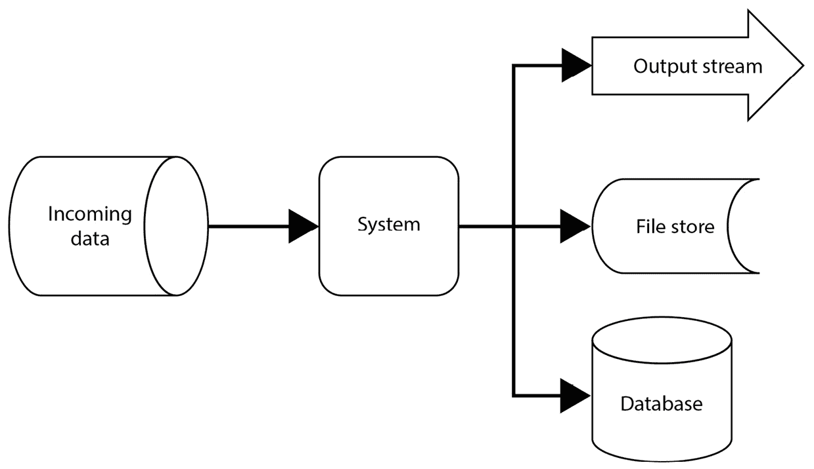
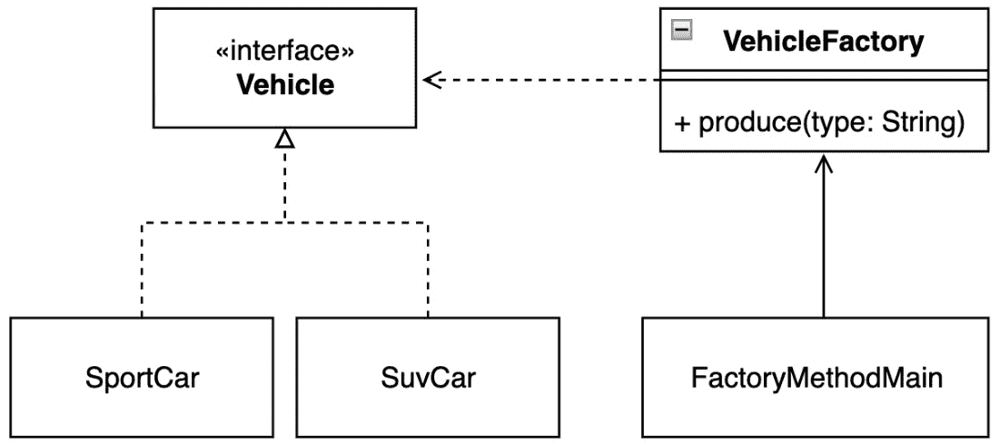
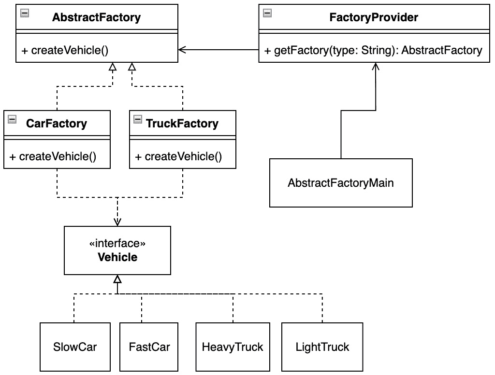
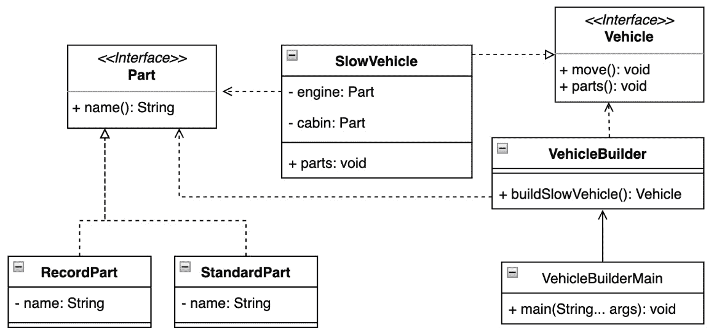
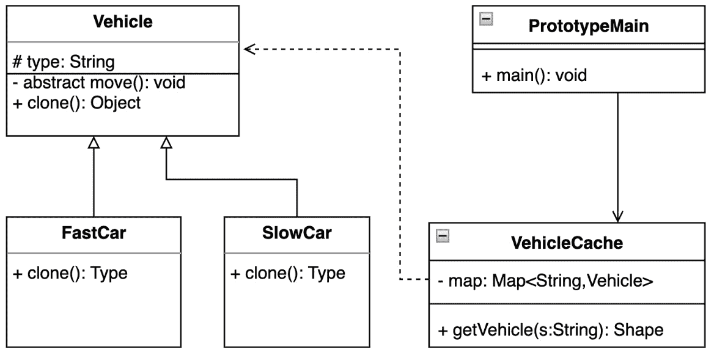
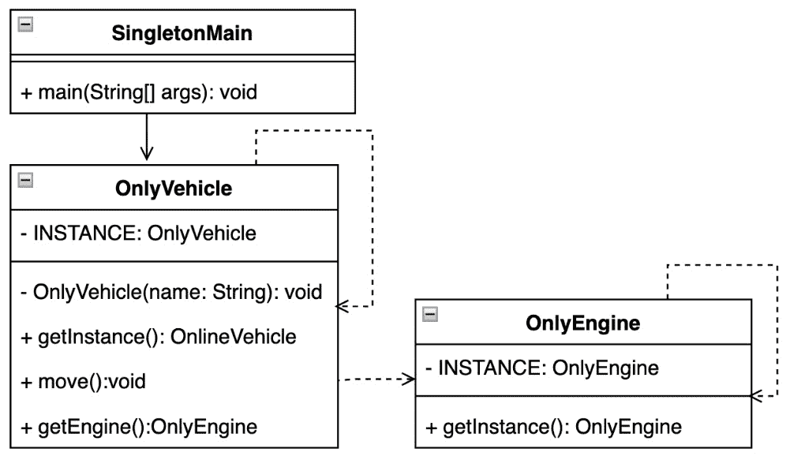
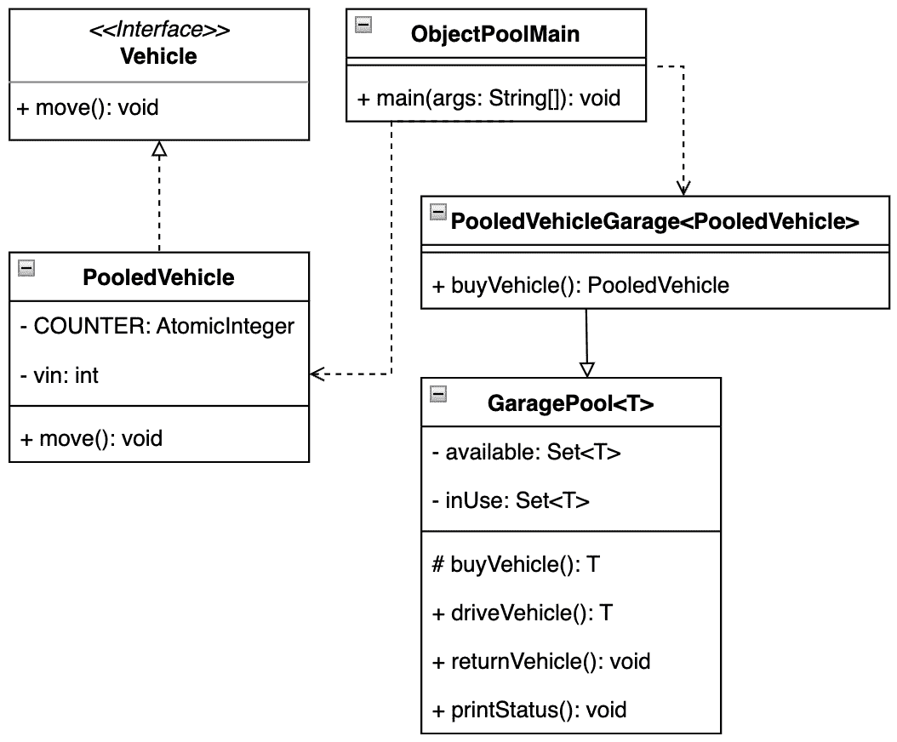
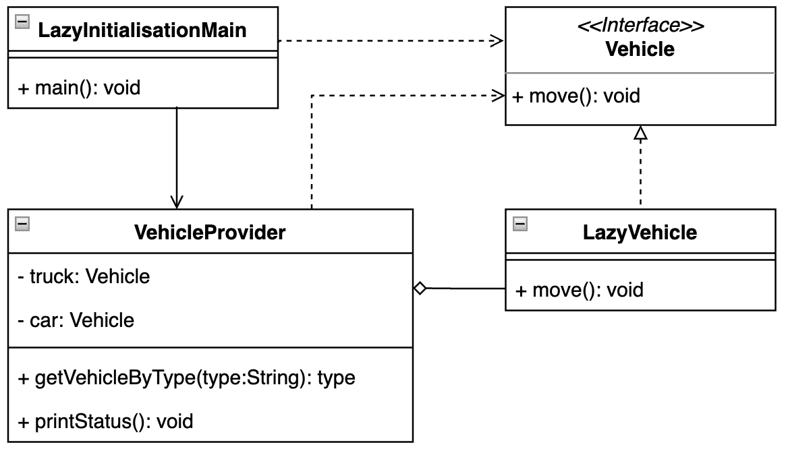
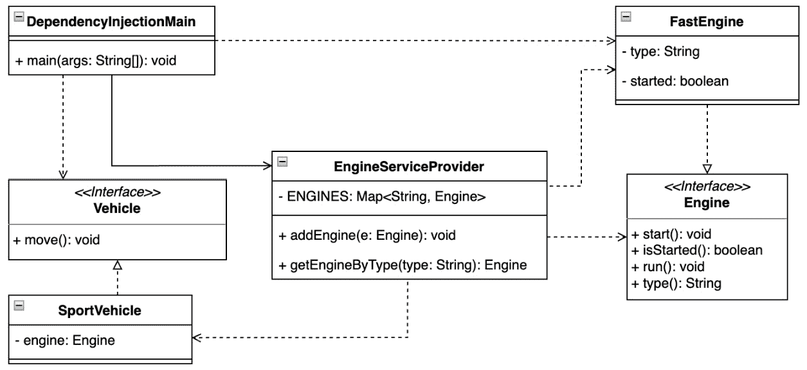

# 第三章：使用创建型设计模式进行工作

在过去的几十年里，IT 社区经历了从之前孤立的系统到分布式或混合解决方案的巨大转变。这些方法为软件开发带来了新的可能性。

分布式解决方案可能看起来可以满足遗留系统的迁移需求，但现实可能并非如此。所需的重构可能会因为职责划分或紧密耦合的逻辑和业务规则的重构以及许多太晚发现而无法反应的未知隐藏逻辑而引起额外的问题。

在本章中，我们将探讨创建型设计模式。这些模式在软件组成中起着至关重要的作用。它们对于实现代码库的可维护性或可读性非常有用。创建型设计模式试图遵循所有之前提到的原则或**不要重复自己**（**DRY**）的方法。让我们以下列顺序深入了解具体的模式：

+   应用工厂方法模式

+   在封装中实例化额外的工厂，使用抽象工厂模式

+   使用建造者模式创建不同配置的对象实例

+   避免使用原型模式重复复杂的配置

+   使用单例模式检查只有一个实例的存在

+   通过使用对象池模式使用预准备的对象来加快运行时

+   根据按需初始化模式控制实例

+   使用依赖注入模式减少对象实例

到本章结束时，你将建立起如何编写可维护的代码以创建可以驻留在 JVM 堆或栈上的对象的坚实基础。

# 技术要求

你可以在 GitHub 上找到本章的代码文件，网址为[`github.com/PacktPublishing/Practical-Design-Patterns-for-Java-Developers/tree/main/Chapter03`](https://github.com/PacktPublishing/Practical-Design-Patterns-for-Java-Developers/tree/main/Chapter03)。

# 所有这一切都始于一个成为对象的类

在 Java 中，每个对象都必须首先由一个类来描述。让我们简要介绍一个常见的软件应用理论场景。这些场景通常分为以下几部分：



图 3.1 – 从宏观角度看的常见应用数据处理

进入的输入数据流（即信息流）已被应用程序接受。应用程序处理输入并创建结果。结果被存储并受到系统所需的目标处理。

这样的系统具有在多种条件下满足几个不同过程的能力。结果以多种方式存储，例如数据库或文件，或者可能嵌入到预期的输出流中，如网页，以向用户显示信息。

系统充当 incoming information flow 的水库，将其处理并存储在数据库中，并提供结果。大多数时候，一切都是紧密耦合和相互关联的。

耦合在不同的层面上发生，而软件设计师并没有注意到。紧密的连贯性存在于类、对象甚至包之间。在许多方面，可以通过更强大的硬件来纠正应用性能的弱点。系统的演变大致上是一个对 1965 年发布的摩尔定律的统计观察，该定律于 1965 年发布。

摩尔定律指出，每年，每块集成电路的组件数量都会翻倍。该定律在 1975 年进行了修订，指出组件数量每*两*年翻倍。尽管关于该定律有效性的辩论可能会变得有争议，但当前的趋势（以及硬件升级所需的速度）表明，进行另一次审查的时间即将到来。在全球范围内，可能没有必要加快硬件升级（已经非常快）的速度，因为这可能对信息处理速度没有影响。这一观察结果针对的是软件应用的功能需求，更多地关注实现算法的质量和复杂性。

由于物理限制，可能无法持续增加对象的实例化速率，因为此类信息必须物理存储在内存中。这意味着在未来的几十年里，我们可以预期提高软件和设计效率的压力会增加。为了使应用逻辑清晰，需要清楚地了解应用的工作方式，以及应用如何向关键 JVM 区域提供支持，即方法栈和堆，然后是通过栈区域（如图 2.2 所示）的线程利用率。

由于当前软件应用的趋势集中在映射、转换或管理大量数据上，因此值得研究、理解和学习如何处理常见场景的创建型设计模式。尽管《设计模式：可复用面向对象软件的基础》（**GoF**）一书的时代已经过去，但进化是不可避免的，挑战仍然存在。在许多情况下，通过适当的抽象，初始的创建型设计模式是适用的。创建对象和类实例，以及填充 JVM 的预期部分，可能会极大地影响计算和性能成本，以及加强业务逻辑的清晰性。

在下一节中，我们将讨论对象创建的不同可能性。我们还将考虑最近添加的 Java 语法特性和可能性，这应该会减少源代码的冗长。让我们从一个最常见的模式开始。

# 基于输入创建对象的工厂方法模式

此模式的主要目的是集中化特定类型的类实例化。该模式将创建确切类类型的决策留给客户端在运行时决定。工厂方法设计模式在 GoF 的书中进行了描述。

## 动机

工厂方法模式强制将代码与其创建新实例的责任分离，也就是说，该方法提供了预期的结果。工厂隐藏了一个基于泛型抽象的应用程序类层次结构，并引入了一个公共接口。它透明地将实例化逻辑与代码的其他部分分离。通过引入公共接口，客户端在运行时可以自由地决定特定的类实例。

该模式通常在应用程序的早期阶段使用，因为它易于重构，并提供高清晰度。

虽然这可能会引入一点复杂性，但模式很容易遵循。

## 在 JDK 中查找

工厂方法模式经常在 Java 集合框架中用于构建所需类型。框架实现位于 `java.base` 模块的 `java.util` 包中。此包包含 `Set`、`List` 和 `Map` 的不同实现。尽管 `Map` 类型是 Java 集合框架的有效成员，但它不继承 `Collection` 接口，因为它实现 `Map.Entry` 来存储元素元组、键和值。`Set`、`List` 和 `Map` 的每个实现都提供了重载的 `of` 工厂方法来创建实例。

`Collections` 类是一个实用工具类。它包含创建特定集合的几个工厂方法，例如单个项目的列表、映射或集合。工厂方法模式使用的另一个有用示例是 `Executors` 实用工具类，该类位于 `java.base` 模块的 `java.util.concurrent` 包中。`Executors` 类定义了静态方法，如 `newFixedThreadPool`。

## 示例代码

让我们想象一个简单直接且易于在现实世界中应用的示例，使用合适的抽象。目标是设计一个跟踪车辆生产的应用程序。公司很可能提供不同类型的车辆。每辆车都可以用其自身的对象来表示。为了绘制意图，我们创建了一个**统一建模语言**（**UML**）类图以保持清晰度（*图 3**.2*）：



图 3.2 – 车辆生产跟踪示例

目标工厂旨在生产两种不同类型的车辆，并且应用程序能够即时满足这些愿望（*示例 3.1*）：

```java
public static void main(String[] args) {
    System.out.println("Pattern Factory Method: Vehicle
        Factory 2");
    var sportCar = VehicleFactory.produce("sport");
    System.out.println("sport-car:" + sportCar);
    sportCar.move();
}
```

这里是输出：

```java
Pattern Factory Method: Vehicle Factory 2
sport-car:SportCar[type=porsche 911]
SportCar, type:'porsche 911', move
```

示例 3.1 – VehicleFactory 根据输入参数生产同一“家族”的车辆

我们不是将此类车辆类型的创建分散到多个地方，而是创建一个工厂。工厂抽象集中了整个车辆组合过程，并仅暴露一个入口点，允许客户端创建所需的车辆类型（如*示例 3.2*所示）。工厂只实现一个静态方法，因此保持其构造函数为私有是有意义的，因为工厂实例是不希望的：

```java
final class VehicleFactory {
private VehicleFactory(){}
    static Vehicle produce(String type){
        return switch (type) {
            case "sport" -> new SportCar("porsche 911");
            case "suv" -> new SuvCar("skoda kodiaq");
            default -> throw new
                IllegalArgumentException("""
            not implemented type:'%s'
                """.formatted(type));
        };
    }
}
```

示例 3.2 – VehicleFactory 类公开了静态工厂方法来生产实现 Vehicle 接口的对象实例

所展示的`switch`表达式可能使用模式匹配方法来简化代码，而不是传统的`switch-label-match`结构。应用程序提供了多种车辆实现（*示例 3.3*）：

```java
interface Vehicle {
    void move();
}
```

示例 3.3 – 考虑到的每种车辆都通过 Vehicle 接口继承方法抽象

由于另一个平台语法改进，`records`类型，现在可以选择类封装的级别，通过 SOLID 原则的反射。这取决于软件架构师打算允许车辆实例改变其内部状态的程度。让我们首先看看标准的 Java 类定义方法（*示例 3.4*）：

```java
class SuvCar implements Vehicle {
    private final String type;
    public SuvCar(String t){
        this.type = t;
    }
    @Override
    public void move() {...}
}
```

示例 3.4 – SuvCar 允许添加可能包含可变状态的内部字段

软件架构师有机会使用`record`类来创建所需车辆的不可变实例，以及随后的`hashCode`和`equals`方法，然后是`toString`实现：

```java
record SportCar(String type) implements Vehicle {
    @Override
    public void move() {
        System.out.println("""
        SportCar, type:'%s', move""".formatted(type));
    }
}
```

示例 3.5 – 被认为是不可变的 SportCar

最近引入的`record`功能在减少潜在样板代码的同时，仍然允许实现内部功能（如前一章的*Records (Java SE 16, JEP-395)*部分所述）。

## 结论

工厂方法有一些限制。其中最重要的一点是它只能用于特定家族的对象。这意味着所有类都必须保持相似的性质或共同的基础。一个类与基类之间的偏差可能会在代码和应用之间引入强烈的耦合。

需要考虑的点可能与方法本身有关，因为它可能是静态的或属于实例（如前一章在*栈区域*和*堆区域*部分所述）。这取决于软件设计师的决定。

创建了一个家族的对象。让我们研究如何处理具有共同属性的工厂家族。

# 使用抽象工厂模式从不同的家族创建对象

此模式引入了一个工厂抽象，而不需要定义特定的类（或应该实例化的类）。客户端请求一个适当的工厂来实例化对象，而不是尝试创建它。抽象工厂模式在 GoF 的书中被提及。

## 动机

将应用程序模块化可能是一个挑战。软件设计者可以通过避免向类中添加代码来保持封装性。动机是将工厂逻辑与应用程序代码分离，以便它可以提供适当的工厂来生成所需的对象。抽象工厂提供了一种标准化的方式来创建所需工厂的实例，并将该实例提供给客户端使用。客户端使用生成的工厂来实例化对象。抽象工厂提供了一个接口，用于创建工厂和对象，而不指定它们的类。该模式通过隔离参与者和内部人员的逻辑，隐式支持 SOLID 原则和可维护性。应用程序与其产品的创建、组合和表示方式无关。

## 在 JDK 中找到它

抽象工厂方法模式可以在 JDK 的`java.xml`模块的`java.xml`包中找到。抽象工厂模式可以在`DocumentBuilderFactory`抽象类及其静态`newInstance`方法的表示和实现中找到。该工厂使用查找服务来找到所需的构建器实现。

## 示例代码

考虑到虽然车辆有一些共同特性，但它们的制造需要不同类型的流程（*图 3**.3*）：



图 3.3 – 使用抽象工厂模式制造不同类型的车辆

在这种情况下，我们创建多个负责特定对象的工厂。尽管这些类属于不同的家族，但它们确实有一些共同属性。一个重要特性是每个工厂都可以实现自己的初始化序列，同时共享通用逻辑。示例需要正确的`CarFactory`实例来创建一个`SlowCar`对象（*示例 3.6*）：

```java
public static void main(String[] args) {
    ...
    AbstractFactory carFactory =
         FactoryProvider.getFactory("car");
     Vehicle slowCar = carFactory.createVehicle("slow");
        slowCar.move();
}
```

这里是输出：

```java
Pattern Abstract Factory: create factory to produce
vehicle...
slow car, move
```

示例 3.6 – 客户端决定需要哪种车辆类型

游戏的一个关键元素是工厂提供者；它根据传入的参数区分创建哪个工厂（*示例 3.7*）。提供者实现为一个实用工具，因此其类是最终的，构造函数是私有的，因为不需要实例。当然，实现可能根据需求而有所不同：

```java
final class FactoryProvider {
private FactoryProvider(){}
    static AbstractFactory getFactory(String type){
        return switch (type) {
            case "car" -> new CarFactory();
            case "truck" -> new TruckFactory();
            default -> throw new IllegalArgumentException
                ("""         this is %s
                 """.formatted(type));
        };
    }
}
```

示例 3.7 – 工厂提供者类定义了对象家族的特定工厂的配置和实例化方式

组中的每个工厂都共享通用逻辑或特性，以在代码库中保持 DRY（不要重复自己）方法：

```java
abstract class AbstractFactory {
    abstract Vehicle createVehicle(String type);
}
```

示例 3.8 – 抽象工厂类提供了可能需要特定工厂实现的通用逻辑或方法

这些单独的工厂可以实现额外的逻辑来区分应该提供哪种产品，类似于以下示例中的`TruckFactory`和`CarFactory`实现（*示例 3.9*）：

```java
class TruckFactory extends AbstractFactory {
    @Override
    Vehicle createVehicle(String type) {
        return switch(type) {
            case "heavy" -> new HeavyTruck();
            case "light" -> new LightTruck();
            default -> throw new IllegalArgumentException
                ("not implemented");
        };
    }
}
```

示例 3.9 – TruckFactory 类代表特定的抽象工厂实现

## 结论

抽象工厂模式在产品之间提供一致性。使用超级工厂可能导致客户端运行时出现不稳定，因为请求的产品可能会由于实现不正确而抛出异常或错误，因为这种信息是在运行时才知道的。另一方面，抽象工厂模式促进了可测试性。抽象工厂可以自由地表示与其实现一起出现的许多其他接口。该模式提供了一种处理产品的方法，而不依赖于它们的实现，这可以提高应用程序代码的关注点分离。它可以使用接口或抽象类。客户端变得独立于对象的组合和创建方式。

封装工厂和代码分离的好处可以被视为一种限制。抽象工厂必须通过一个或多个参数来控制，以正确地定义依赖关系。为了提高所需工厂的代码可维护性，考虑之前讨论的*密封类*增强（参见前一章中的*密封类（Java SE 17，JEP-409）*部分）可能是有用的。密封类可以对代码库的稳定性产生积极影响。

让我们在下一节中考察如何自定义对象创建过程。

# 使用建造者模式实例化复杂对象

建造者模式有助于将复杂对象的构建与其代码表示分离，以便相同的组合过程可以重用来创建不同配置的对象类型。建造者设计模式被早期识别，并成为 GoF 书籍的一部分。

## 动机

建造者模式背后的主要动机是在不污染构造函数的情况下构建复杂实例。它有助于将创建过程分解成特定的步骤，甚至可以将其拆分。对象的组合对客户端是透明的，并允许创建同一类型的不同配置。建造者由一个单独的类表示。它可以帮助在需要时透明地扩展构造函数。该模式有助于封装并强制执行与之前讨论的 SOLID 设计原则相关的实例化过程的清晰度。

## 在 JDK 中找到它

建造者模式在 JDK 内部是一种常用的模式。一个很好的例子是创建表示字符串的字符序列。例如，`StringBuilder`和`StringBuffer`位于`java.base`模块的`java.lang`包中，默认情况下对每个 Java 应用程序都是可见的。字符串构建器提供了多个重载的连接方法，这些方法接受不同类型的输入。这种输入与已创建的字节序列连接。另一个例子可以在`java.net.http`包中找到，它由`HttpRequest.Builder`接口及其实现或`java.util.stream`包中的`Stream.Builder`接口表示。如前所述，建造者模式非常常用。值得注意的是`Locale.Builder`和`Calendar.Builder`，它们使用 setter 方法存储最终产品的值。这两个都可以在`java.based`模块的`java.util`包中找到。

## 示例代码

建造者是模式的关键元素，在创建`Vehicle`实例期间持有所需的字段值，更确切地说，是对象的引用（*图 3**.4*）：



图 3.4 – 如何使用建造者模式透明地创建新车辆

建造者模式的整体责任是创建车辆（*示例 3.10*）：

```java
public static void main(String[] args) {
    System.out.println("Builder pattern: building
        vehicles");
    var slowVehicle = VehicleBuilder.buildSlowVehicle();
    var fastVehicle = new FastVehicle.Builder()
                        .addCabin("cabin")
                        .addEngine("Engine")
                        .build();
    slowVehicle.parts();
    fastVehicle.parts();
}
```

这里是输出：

```java
Builder pattern: building vehicles
SlowVehicle,engine: RecordPart[name=engine]
SlowVehicle,cabin: StandardPart{name='cabin'}
FastVehicle,engine: StandardPart{name='Engine'}
FastVehicle,cabin: RecordPart[name=cabin]
```

示例 3.10 – 建造者模式可以根据需求以几种方式实现

建造者模式可以通过不同的方法实现。一种方法是将所有建造者逻辑封装并隐藏，直接提供产品而不暴露实现细节：

```java
final class VehicleBuilder {
    static Vehicle buildSlowCar(){
        var engine = new RecordPart("engine");
        var cabin = new StandardPart("cabin");
        return new SlowCar(engine, cabin);
    }
}
```

示例 3.11 – `VehicleBuilder`隐藏逻辑以提供特定实例

或者，建造者可能成为要创建实例的类的组成部分。在这种情况下，可以决定应该将哪个元素添加到新创建的特定实例中：

```java
class FastCar implements Vehicle {
    final static class Builder {
        private Part engine;
        private Part cabin;
        Builder(){}
        Builder addEngine(String e){...}
        Builder addCabin(String c){...}
        FastCar build(){
            return new FastCar(engine, cabin);
        }
    }
    private final Part engine;
    private final Part cabin;
    ...
    @Override
    public void move() {...}
    @Override
    public void parts() {...}
}
```

示例 3.12 – `FastVehicle.Builder`被表示为一个静态类，需要实例化，并提供最终结果定制的可能性

两种示例方法都是根据 SOLID 原则实现的。建造者模式是抽象、多态、继承和封装（APIE）原则的一个很好的例子，并且非常易于重构、扩展或验证属性。

## 结论

建造者模式通过将复杂创建与业务逻辑分离，有助于强制执行单一职责原则。它还提高了代码可读性和 DRY（Don't Repeat Yourself）原则，因为实例化是可扩展且易于用户理解的。建造者模式是一种常用的设计模式，因为它减少了“代码异味”和构造函数污染。它还提高了可测试性。代码库有助于避免具有不同表示形式的多个构造函数，其中一些从未被使用过。

在实现模式时，另一个值得考虑的好点是使用 JVM 的堆或栈——更具体地说，是创建模式的静态或动态分配表示。这个决定通常由软件设计师自己回答。

并非总是有必要揭示构建过程。下一节将介绍对象克隆的简单性。

# 使用原型模式克隆对象

原型模式解决了创建具有复杂实例化过程的对象新实例的困难，因为其过程过于繁琐且不理想，可能会导致不必要的子类化。原型是一种非常常见的模式，并在 GoF 的书中进行了描述。

## 动机

当需要创建重量级对象且工厂方法不受欢迎时，原型设计模式非常有用。新创建的实例是从其父实例克隆的，因为父实例充当原型。实例之间相互独立，可以定制。实例逻辑不会暴露给客户端，也不能由客户端贡献。

## 在 JDK 中查找

在 JDK 的各个包中有很多使用原型模式的例子。集合框架成员实现了继承自`Cloneable`接口所需的`clone`方法。例如，`ArrayList.clone()`方法的执行会逐字段创建实体的浅拷贝。另一个原型实现可以是`java.util`包中的`Calendar`类。对重写方法的克隆也用于`Calendar`实现本身，因为它有助于避免对已配置的实例进行不希望的修改。这种用法可以在`getActualMinimum`和`getActualMaximum`方法中找到。

## 示例代码

当生产中只有少数几种车辆型号时，没有必要通过工厂或构建器不断建立新对象，这实际上可能导致代码行为难以控制，因为内部属性可能会发生变化。想象一下车辆生产的早期阶段，其中每个新迭代都需要进行等量比较以跟踪进度（*图 3**.5*）：



图 3.5 – 从原型创建新实例

在这种情况下，创建一个已经设计好的车辆的精确副本作为其原型更容易：

```java
public static void main(String[] args) {
    Vehicle fastCar1 = VehicleCache.getVehicle("fast-car");
    Vehicle fastCar2 = VehicleCache.getVehicle("fast-car");
    fastCar1.move();
    fastCar2.move();
    System.out.println("equals : " + (fastCar1
        .equals(fastCar2)));
}
```

这里是输出：

```java
Pattern Prototype: vehicle prototype 1
fast car, move
fast car, move
equals : false
fastCar1:FastCar@659e0bfd
fastCar2:FastCar@2a139a55
```

示例 3.13 – 可以从现有实例克隆出新的车辆

实例可以根据需要重新创建（分别，克隆）。`Vehicle`抽象类为每个新的原型实现提供了一个基础，并提供了克隆细节：

```java
abstract class Vehicle implements Cloneable{
    protected final String type;
    Vehicle(String t){
        this.type = t;
    }
    abstract void move();
    @Override
    protected Object clone() {
        Object clone = null;
        try{
        clone = super.clone();
        } catch (CloneNotSupportedException e){...}
        return clone;
    }
}
```

示例 3.14 – 车辆抽象类必须实现`Cloneable`接口并引入克隆方法实现

每个车辆实现都需要扩展父`Vehicle`类：

```java
class SlowCar extends Vehicle {
    SlowCar(){
        super("slow car");
    }
    @Override
    void move() {...}
}
```

示例 3.15 – 由 SlowCar 类提供的车辆接口特定实现和移动方法实现

原型模式引入了一个内部缓存，收集可用的 `Vehicle` 类型原型（*示例 3.16*）。所提出的实现实现了一个静态方法，使缓存作为一个工具工作。将其构造函数设为私有是有意义的：

```java
final class VehicleCache {
private static final Map<String, Vehicle> map =
    Map.of("fast-car", new FastCar(), "slow-car", new
        SlowCar());
private VehicleCache(){}
    static Vehicle getVehicle(String type){
        Vehicle vehicle = map.get(type);
        if(vehicle == null) throw
        new     IllegalArgumentException("not allowed:" +
            type);
        return (Vehicle) vehicle.clone();
    }
}
```

示例 3.16 – VehicleCache 存储了对已准备的原型的引用，这些原型可以被克隆

这些示例表明，客户端每次都使用基原型的相同副本进行工作。这个副本可以根据需求进行定制。

## 结论

原型模式对于动态加载或避免通过引入不必要的抽象（称为**子类化**）来增加代码库的复杂性是有用的。这并不意味着克隆不需要实现接口，但克隆可以减少暴露需求或使实例化过程过于复杂。原型正确地封装了那些不打算被触摸或修改的实例的复杂逻辑。软件设计者应该意识到这样的代码库很容易变成遗留代码。另一方面，一个模式可以推迟并支持代码库的迭代更改。

对象的多个实例并不总是希望的，有时甚至是不希望的。在下一节中，我们将学习如何确保在运行时只有一个唯一的类实例存在。

# 使用单例模式确保只有一个实例

单例对象为其实例提供透明和全局访问，并确保只有一个实例存在。单例模式在行业需求提出得很早，并在 GoF 的书中被提及。

## 动机

客户端或应用程序想要确保在运行时只有一个实例存在。一个应用程序可能需要多个对象实例，这些实例都使用一个独特的资源。这个事实引入了不稳定性，因为任何这些对象都可以访问这样的资源。单例确保只有一个实例，为所有客户端提供全局访问点，在运行 JVM 的期望范围内。

## 在 JDK 中找到它

使用单例的最佳例子是一个正在运行的 Java 应用程序，或者更确切地说，是运行时。它在 `Runtime` 类中，其方法 `getRuntime` 位于 `java.base` 模块的 `java.lang` 包中。该方法返回与当前 Java 应用程序关联的对象。运行时实例允许客户端向运行中的应用程序添加，例如，关闭钩子。

## 示例代码

以下示例建议一个只运行一辆车及其引擎的应用程序（*图 3**.6*）：



图 3.6 – 单例模式如何表示一个引擎

换句话说，这意味着在 JVM 中必须存在特定类型的引擎和车辆的一个实例：

```java
public static void main(String[] args) {
    System.out.println("Singleton pattern: only one
        engine");
    var engine = OnlyEngine.getInstance();
    var vehicle = OnlyVehicle.getInstance();
    vehicle.move();
    System.out.println("""
        OnlyEngine:'%s', equals with vehicle:'%s'"""
        .formatted(engine, (vehicle.getEngine()
            .equals(engine))));
}
```

这里是输出结果：

```java
Pattern Singleton: only one engine
OnlyVehicle, move
OnlyEngine:'OnlyEngine@7e9e5f8a', equals with
    vehicle:'true'
```

示例 3.17 – OnlyEngine 和 OnlyCar 在运行时只有一个实例

确保对象实例唯一性的方法有多种。`OnlyEngine` 类的实现引入了可能的单例实现，其实例在需要时才会懒加载（*示例 3.18*）。`OnlyEngine` 类实现了通用的 `Engine` 接口。其实现提供了一个静态的 `getInstance` 方法作为透明的入口点：

```java
interface Engine {}
class OnlyEngine implements Engine {
    private static OnlyEngine INSTANCE;
    static OnlyEngine getInstance(){
        if(INSTANCE == null){
            INSTANCE = new OnlyEngine();
        }
    return INSTANCE;
    }
    private OnlyEngine(){}
}
```

示例 3.18 – `OnlyEngine` 类检查其实例的存在 – 懒加载

实现单例的另一种方法是创建一个属于类本身的 `static` 字段，并向潜在客户端公开 `getInstance` 入口点（*示例 3.19*）。值得注意的是，在这种情况下，构造函数变为私有：

```java
class OnlyVehicle {
    private static OnlyVehicle INSTANCE = new
        OnlyVehicle();
    static OnlyVehicle getInstance(){
        return INSTANCE;
}
    private OnlyVehicle(){
        this.engine = OnlyEngine.getInstance();
    }
    private final Engine engine;
    void move(){
       System.out.println("OnlyVehicle, move");
   }
    Engine getEngine(){
        return engine;
    }
}
```

示例 3.19 – `OnlyVehicle` 类将其实例作为属于类的静态字段提供

在多线程环境中，懒加载的单例模式实现可能会成为一个挑战，因为必须同步 `getInstance` 方法以获取唯一的实例。一种可能性是将单例创建为一个 `enum` 类（*示例 3.20*）：

```java
enum OnlyEngineEnum implements Engine {
    INSTANCE;
    }
    ...
    private OnlyVehicle(){
    this.engine = OnlyEngineEnum.INSTANCE;
}
...
```

示例 3.20 – 使用 `OnlyEngineEnum` 单例枚举类方法

## 结论

单例是一个相对简单的设计模式，尽管在多线程环境中使用时可能会变得复杂，因为它保证了所需对象只有一个实例。当强制执行单一责任原则时，该模式可能会受到挑战，因为类实际上负责实例化自己。另一方面，单例模式确保客户端可以全局访问分配的资源，防止意外初始化或销毁对象。该模式应谨慎使用，因为它以所需类实例化的方式创建了紧密耦合的代码，这可能导致可测试性问题。该模式还抑制了其他子类，使得任何扩展几乎都不可能。

创建实例并不总是好的方法。让我们看看如何按需进行。

# 使用对象池模式提高性能

对象池模式实例化了可用的对象，并限制了它们的初始化时间。所需的实例可以在需要时重新创建。对象池可以代表一个基础条件集，基于这些条件可以创建新的实例，或者限制它们的创建。

## 动机

与在代码库中不断创建新的对象实例相比，对象池通过提供已初始化并准备好使用的对象，为管理应用程序或客户端性能提供了一个封装的解决方案。该模式将构建逻辑与业务代码分离，并有助于管理应用程序的资源性能方面。它不仅可以帮助管理对象的生命周期，还可以在创建或销毁时进行验证。

## 在 JDK 中查找

对象池模式的一个很好的例子是 `java.util.concurrent` 包中找到的 `ExecutorService` 接口，以及 `util` 工厂中 `Executors` 类提供的实现，该实现处理适当的执行器实例，例如 `newScheduledThreadPool` 方法。

## 样本代码

当前示例介绍了一个场景，其中车库包含一定数量的汽车，司机可以驾驶（*图 3**.7*）：



图 3.7 – 遵循对象池模式的车库

当没有汽车可用时，车库实现了一种逻辑，即购买一辆新车以保持所有司机忙碌：

```java
public static void main(String[] args) {
    var garage = new PooledVehicleGarage();
    var vehicle1 = garage.driveVehicle();
    ...
    vehicle1.move();
    vehicle2.move();
    vehicle3.move();
    garage.returnVehicle(vehicle1);
    garage.returnVehicle(vehicle3);
    garage.printStatus();
    var vehicle4 = garage.driveVehicle();
    var vehicle5 = garage.driveVehicle();
    vehicle4.move();
    vehicle5.move();
    garage.printStatus();
}
```

这里是输出：

```java
Pattern Object Pool: vehicle garage
PooledVehicle, move, vin=1
PooledVehicle, move, vin=2
PooledVehicle, move, vin=3
returned vehicle, vin:1
returned vehicle, vin:3
Garage Pool vehicles available=2[[3, 1]] inUse=1[[2]]
PooledVehicle, move, vin=3
PooledVehicle, move, vin=1
Garage Pool vehicles available=0[[]] inUse=3[[3, 2, 1]]
```

示例 3.21 – 车库实例中的池化车辆有助于降低对象成本

模式的一个核心元素是池抽象，因为它包含管理实体所需的所有逻辑。一个选项是创建一个抽象车库池类（*示例 3.22*），其中包含所有同步机制。这些机制是必要的，以避免潜在的代码不稳定和不一致性：

```java
abstract class AbstractGaragePool<T extends Vehicle> {
    private final Set<T> available = new HashSet<>();
    private final Set<T> inUse = new HashSet<>();
    protected abstract T buyVehicle();
    synchronized T driveVehicle() {
        if (available.isEmpty()) {
            available.add(buyVehicle());
        }
        var instance = available.iterator().next();
        available.remove(instance);
        inUse.add(instance);
        return instance;
    }
    synchronized void returnVehicle(T instance) {...}
    void printStatus() {...}
}
```

示例 3.22 – 抽象车库池提供了正确管理元素所需的所有逻辑

车库池限制了可能的实例类型。一个类被 `Vehicle` 抽象绑定（*示例 3.23*）。该接口提供了客户端使用的常用函数。在以下示例中，`AbstractGaragePool` 的实现代表客户端：

```java
interface Vehicle {
    int getVin();
    void move();
}
```

示例 3.23 – 车辆接口需要由 PooledVehicle 实现

除了实现函数外，`PooledVehicle` 类还提供了一个私有计数器（*示例 3.24*）。计数器属于一个类，因此被标记为 `static` 和 `final`。该计数器统计车库池购买的实例数量：

```java
class PooledVehicle implements Vehicle{
    private static final AtomicInteger COUNTER = new
        AtomicInteger();
    private final int vin;
    PooledVehicle() {
        this.vin = COUNTER.incrementAndGet();
    }
    @Override
    public int getVin(){...}
    @Override
    public void move(){..}
}
```

示例 3.24 – PooledVehicle 类实现还保留了创建的实例数量

## 结论

提高客户端性能有助于减少昂贵的对象实例化时间（如我们在 *示例 3.21* 中所见）。对象池在只需要短期对象的情况下也非常有用，因为它们有助于通过无控制的实例减少内存碎片。值得提及的是，车库示例中看到的内部缓存模式的实现。

虽然该模式非常高效，但正确选择集合结构也会对其性能产生重大影响。它可以减少搜索并节省时间。

另一个积极的结果可以考虑对垃圾收集过程和内存压缩的影响，因为分析活动对象可能会导致需要分析的对象更少。

并非总是有必要将所有内容存储在内存中以供以后重用。让我们看看如何推迟对象初始化过程，并避免内存污染。

# 使用延迟初始化模式按需初始化对象

此模式的目的是将所需类实例的创建推迟到客户端实际请求时。

## 动机

尽管近年来操作内存急剧增长，但我们上一章了解到 JVM 为堆分配了定义明确的特定大小的内存。当堆耗尽且 JVM 无法分配任何新对象时，会导致内存溢出错误。懒处理可以对这种堆污染产生相当积极的影响。由于延迟实例，它有时也被称为异步加载。在网页按需生成而不是在应用程序初始化过程中生成的 Web 应用程序中，此模式非常有用。它也在成本较高的相关对象操作的应用程序中有其位置。

## 在 JDK 中查找

可以使用 `ClassLoader` 加载在应用程序启动时未在运行时链接的类的动态加载示例来演示懒初始化。类可以通过类策略预先加载或延迟加载。某些类，如 `ClassNotFoundException`，通过 `java.base` 模块隐式加载。它们支持位于 `java.lang` 包及其 `forName` 方法中的类实现。方法的实现由内部 API 提供。懒初始化的类可能是应用程序需要预热时间的原因。例如，`Enum` 类是一种特殊类型的静态最终类，充当常量，并且会预先加载。

`->` 指的是将加载步骤放入类加载器并填充适当的方法区域，正如我们在上一章所学。

## 示例代码

懒初始化示例的基本思想是创建的车辆按需初始化，或者当已经创建时，向客户端提供一个引用（*图 3**.8*）：



图 3.8 – 如何使用懒加载模式按需创建车辆

只有当客户端真正需要时，这些车辆才存在。在这种情况下，会创建特定的车辆实例。当车辆已经存在于提供者上下文中时，则重用该实例：

```java
public static void main(String[] args) {
    System.out.println("Pattern Lazy Initialization: lazy
        vehicles");
    var vehicleProvider = new VehicleProvider();
    var truck1 = vehicleProvider.getVehicleByType("truck");
    vehicleProvider.printStatus();
    truck1.move();
    var car1 = vehicleProvider.getVehicleByType("car");
    var car2 = vehicleProvider.getVehicleByType("car");
    vehicleProvider.printStatus();
    car1.move();
    car2.move();
    System.out.println("ca1==car2: " + (car1.equals
       (car2)));
}
```

这里是输出：

```java
Pattern Lazy Initialization: lazy vehicles
lazy truck created
status, truck:LazyVehicle[type=truck]
status, car:null
LazyVehicle, move, type:truck
lazy car created
status, truck:LazyVehicle[type=truck]
status, car:LazyVehicle[type=car]
LazyVehicle, move, type:car
LazyVehicle, move, type:car
ca1==car2: true
```

示例 3.25 – 池化车辆的示例实现

`VehicleProvider` 类的实现将字段视为私有。如果需要，这些字段持有所需车辆的引用。提供者封装了决策和实例化逻辑。可能的实现之一可能使用 `switch-label-match` 构造（*示例 3.26*）、`switch` 表达式等。值得注意的是，在此示例中，`VehicleProvider` 类需要一个包作用域的实例，因此其构造函数是 `private` 包，不对其他包公开：

```java
final class VehicleProvider {
    private Vehicle truck;
    private Vehicle car;
    VehicleProvider() {}
    Vehicle getVehicleByType(String type){
        switch(type){
        case "car":
            ...
            return car;
        case "truck":
            if(truck == null){
                System.out.println("lazy truck created");
                truck = new LazyVehicle(type);
            }
            return truck;
        default:
            ...
    }
    void printStatus(){...}
}
```

示例 3.26 – VehicleProvider 隐藏了可能的实体实例化逻辑，使其对客户端不可见

为了强制实现可能延迟初始化的对象的可扩展性，每个实体都实现了`Vehicle`抽象：

```java
interface Vehicle {
    void move();
}
record LazyVehicle(String type) implements Vehicle{
    @Override
    public void move() {
        System.out.println("LazyVehicle, move, type:" +
            type);
    }
}
```

示例 3.27 – 使用 record 强制不可变性实现车辆抽象和可能的 LazyVehicle 实现

这种方法强制执行持续的车辆进化，而不需要对供应商逻辑进行复杂的更改。

## 结论

懒初始化设计模式可以帮助保持应用程序内存小。另一方面，不当的使用可能会导致不希望的延迟，因为对象可能过于复杂而难以创建，并且运行时间较长。

下一个部分展示了如何将逻辑注入客户端，由新创建的车辆实例表示。

# 使用依赖注入模式减少类依赖

这种模式将类（*作为*服务）的初始化与客户端（*使用*服务）的初始化分开。

## 动机

依赖注入模式在需要将特定对象（服务）的实现与使用其公开服务、方法等的目标对象（客户端）分离时被广泛使用。当需要创建客户端实例时，服务可用。该模式允许您消除任何硬编码的依赖。这些服务是在客户端创建过程之外实例化的。这意味着两者之间是松散连接的，可以强制执行 SOLID 原则。实现依赖注入有三种方式：

+   **构造函数依赖注入**：通过构造函数的初始化，将预期服务提供给客户端。

+   **注入方法**：客户端通过接口正常暴露方法。该方法向客户端提供依赖。供应商对象使用方法将服务注入客户端。

+   `public`属性。

## 在 JDK 中查找

使用依赖注入模式的良好例子是`ServiceLoader`实用类。它位于`java.base`模块和其`java.util`包中。`ServiceLoader`实例在应用启动时尝试在运行时查找服务。一个服务被认为是由相关服务提供者或提供者实现的良好定义的接口表示。应用程序代码能够在运行时区分所需的提供者。值得注意的是，`ServiceLoader`与经典的`classpath`配置一起工作，或者可以无缝地与 Java 平台模块系统（在第*第二章*，*发现 Java 平台设计模式*中讨论）一起使用。

在过去，依赖注入是 Java EE 范围的一部分，而不是经典 JDK。这意味着该功能在 Java 平台上可用。由于 JDK 的发展，依赖注入功能被移动到 `@Inject`、`@Named`、`@Scope` 或 `@Qualifier` 注解。这些注解允许在运行时将类转换为托管对象，从而可以区分所需提供者的实现。

## 样本代码

一个示例展示了简化后的依赖注入模式，以便获得一般经验。这是一个非常简单的实现；实际上，它描绘了之前提到的 API 在幕后是如何工作的。让我们想象一个场景，其中预期的车辆实例需要一个引擎（*图 3**.9*）：



图 3.9 – 将引擎作为服务注入到车辆实例中

特定的引擎构建逻辑与车辆相关代码分离（*示例 3.28*）：

```java
1 public static void main(String[] args) {
2     System.out.println("Pattern Dependency Injection:
          vehicle and engine");
3     EngineServiceProvider.addEngine(new FastEngine
          ("sport"));
4     Engine engine =
        EngineServiceProvider.getEngineByType("sport");
5     Vehicle vehicle = new SportVehicle(engine);
6     vehicle.move();
7 }
```

这里是输出：

```java
Pattern Dependency Injection: vehicle and engine
FastEngine, started
FastEngine, run
SportCar, move
```

示例 3.28 – 从车辆之外单独创建 FastEngine 实例，然后将引擎添加到构建的 SportVehicle 中

当`FastEngine`实例完全就绪（已启动、已验证等）时使用。所需类型的车辆可以独立构建，无需依赖任何引擎逻辑。使用`EngineServiceProvider`（*示例 3.29*）为`SportVehicle`提供引擎实例：

```java
final class EngineServiceProvider {
    private static final Map<String, Engine> ENGINES = new
        HashMap<>();
    ...
    static Engine getEngineByType(String t){
        return ENGINES.values().stream()
                .filter(e -> e.type().equals(t))
                .findFirst().orElseThrow
                    (IllegalArgumentException::new);
    }
}
```

示例 3.29 – EngineServiceProvider 注册已实例化的可重用服务

`SportVehicle` 类实现 `Vehicle` 接口（*示例 3.30*）以反映 SOLID 设计原则中提到的开放-封闭方法：

```java
interface Vehicle {
    void move();
}
class SportVehicle implements Vehicle{
    private final Engine engine;
    SportVehicle(Engine e) {...}
    @Override
    public void move() {
        if(!engine.isStarted()){
            engine.start();
    }
        engine.run();
        System.out.println("SportCar, move");
    }
}
```

示例 3.30 – SportVehicle 类实现 Vehicle 接口，并包含为提供的 Engine 实例提供的附加内部逻辑

重要的是要注意，尽管在某个地方创建了特定的 `Engine` 类型（*示例 3.31*）实例（`FastEngine`），但在实例化 `SportVehicle` 对象时需要其存在（*示例 3.28*，第 5 行）：

```java
interface Engine {
    void start();
    boolean isStarted();
    void run();
    String type();
}
class FastEngine implements Engine{
    private final String type;
    private boolean started;
    FastEngine(String type) {
        this.type = type;
    }
    ...
}
```

示例 3.31 – FastEngine 类实现的 Engine 接口和由 EngineServiceProvider 提供的接口

在所描述的示例中的关键玩家对象是 `EngineServiceProvider`。它提供对已创建的所需 `Engine` 实例的引用，并将它们分布到业务代码中。这意味着任何需要处理 `Engine`（类似于 `SportVehicle` 实例）的客户端，将通过 `EngineServiceProvider` 暴露的链接获得正确的实例访问权限。

所展示的简单示例可以很容易地通过 `ServiceProvider` 工具类实例转换为另一个示例。更改非常微小（*示例 3.32*）：

```java
public static void main(String[] args) {
    System.out.println("Pattern Dependency Injection
       Service Loader: vehicle and engine");
    ServiceLoader<Engine> engineService =
        ServiceLoader.load(Engine.class);
    Engine engine = engineService.findFirst()
        .orElseThrow();
    Vehicle vehicle = new SportVehicle(engine);
    vehicle.move();
}
```

示例 3.32 – ServiceLoader 提供了用于实例化 SportVehicle 类型的 Engine 接口的可用实现

在标准的类路径利用中，Java 平台要求服务提供者在`META-INF`文件夹和`services`子文件夹中注册。文件名由包和服务的接口名称组成，文件包含可用的服务提供者。

Java 平台模块系统简化了配置步骤。相关模块为（并为目标模块提供和使服务实现可用），正如我们在*第二章**，发现 Java 平台设计模式*中提到的。

## 结论

依赖注入模式确保客户端不知道所使用服务的实例化。客户端可以通过通用接口访问服务。这使得代码库更容易测试。它还简化了代码库的可测试性。依赖注入是各种框架（如 Spring 和 Quarkus）广泛使用的模式。Quarkus 使用 Jakarta 依赖注入规范。依赖注入模式符合 SOLID 和 APIE 面向对象编程原则，因为它提供了接口的抽象。代码不依赖于实现，而是通过接口与服务进行通信。依赖注入模式强制执行 DRY 原则，因为它不需要不断启动服务。

# 摘要

创建型设计模式在软件应用设计中扮演着非常重要的角色。它们有助于根据基本的面向对象原则，透明地集中管理对象实例化逻辑。示例表明，每种模式可能有多种实现方式。这是因为实现决策可能取决于其他软件架构因素。这些因素考虑了 JVM 堆和栈的使用、应用程序运行时间或业务逻辑封装。

隐式使用设计模式进行创作，促进了 DRY（Don't Repeat Yourself）方法，这对应用开发有积极影响，并减少了代码库的污染。应用程序变得可测试，软件架构师有一个框架来确认 JVM 内存在预期对象。当识别出逻辑问题时，这一点尤为重要，这可能是异常或意外结果。一个良好的代码库有助于快速找到根本原因，甚至可能不需要调试。

在本章中，我们学习了如何使用透明工厂方法模式创建特定家族的对象。抽象工厂模式展示了创建不同工厂类型的封装方式。并非所有所需信息总是同时存在，而建造者模式介绍了一种处理这种复杂对象组合挑战的方法。原型模式展示了不向客户端暴露实例逻辑的方法，而单例模式确保了在运行时只有一个实例。对象池设计模式揭示了如何在运行时提高内存使用效率，而延迟实例化模式展示了如何将对象延迟到需要时再创建。依赖注入模式展示了在创建新对象时实例的可重用性。

创造性设计模式不仅使创建新实例的过程更加清晰，而且在许多情况下，它们还可以帮助决定正确的代码结构（反映所需业务逻辑的代码结构）。最后提到的三个模式不仅解决了创建对象的问题，还解决了它们在高效内存使用中的可重用性问题。我们讨论的例子展示了如何实现创造模式，并了解了每个模式的差异和目的。

下一章将讨论结构设计模式。这个模式将帮助我们根据最常见的场景来组织我们的代码。让我们继续前进。

# 问题

1.  创造性设计模式解决了哪些挑战？

1.  哪些模式可能有助于减少对象初始化成本？

1.  利用单例设计模式的关键原因是什么？

1.  哪个模式有助于减少构造函数污染？

1.  你如何隐藏复杂的实例化逻辑，使其对客户端不可见？

1.  是否有可能减少实例化应用程序的内存占用？

1.  哪个设计模式适用于创建特定家族的对象？

# 进一步阅读

+   *《设计模式：可复用面向对象软件元素》* by Erich Gamma, Richard Helm, Ralph Johnson, and John Vlissides, Addison-Wesley, 1995

+   *《设计原则与设计模式》* by Robert C. Martin, Object Mentor, 2000

+   *《集成电路上的更多组件》* by Gordon E. Moore, Electronics Magazine, 1965-04-19

+   *Oracle 教程：泛型*：[`docs.oracle.com/javase/tutorial/java/generics/index.html`](https://docs.oracle.com/javase/tutorial/java/generics/index.html)

+   *Quarkus 框架*：[`quarkus.io/`](https://quarkus.io/)

+   *Spring 框架*：[`spring.io/`](https://spring.io/)

+   *Jakarta 依赖注入*：[`jakarta.ee/specifications/dependency-injection/`](https://jakarta.ee/specifications/dependency-injection/)

+   *《代码整洁之道》* by Robert C. Martin, Pearson Education, Inc, 2009

+   *《有效 Java – 第三版》* by Joshua Bloch, Addison-Wesley, 2018
