# 5

# 行为设计模式

代码可维护性在跨行业的应用中起着关键作用，但仅仅停留在那里并不再深入是不公平的。这意味着跳过运行时代码的行为，这会影响物理和虚拟内存的使用。使用行为模式的主要动机是对象之间的透明通信，换句话说，是提高内存分配的效率。利用行为模式提高了通信的灵活性，并有助于通过单个对象或多个对象之间交换信息来完成一项任务。结构设计模式有时似乎接近行为模式，但正如我们将看到的那样，每个案例的目的略有不同。让我们深入了解以下内容：

+   使用缓存模式限制昂贵的初始化

+   使用责任链模式处理事件

+   使用命令模式将信息转化为行动

+   使用解释器模式为上下文赋予意义

+   使用迭代器模式检查所有元素

+   利用中介者模式进行信息交换

+   使用备忘录模式恢复所需状态

+   使用空对象模式避免空指针异常状态

+   使用观察者模式让所有相关方保持知情

+   使用管道模式处理实例阶段

+   使用状态模式改变对象行为

+   使用策略模式改变对象行为

+   使用模板模式标准化流程

+   使用访问者模式根据对象类型执行代码

到本章结束时，你将有一个很好的基础来理解程序行为的重要性，这不仅涉及资源利用，而且从 SOLID 设计原则的角度来看。

# 技术要求

你可以在 GitHub 上找到本章的代码文件，地址为[`github.com/PacktPublishing/Practical-Design-Patterns-for-Java-Developers/tree/main/Chapter05`](https://github.com/PacktPublishing/Practical-Design-Patterns-for-Java-Developers/tree/main/Chapter05)。

# 使用缓存模式限制昂贵的初始化

缓存模式在传统的**四人帮**（**GoF**）列表中找不到。然而，由于行业需求和资源使用，它已被确定为常用的方法，并获得了重要性。

## 动机

缓存模式支持元素重用。它不会根据需求创建新元素，而是重用存储在缓存中的已创建元素。它将频繁需要的数据存储在快速访问存储中，以提高性能。从缓存中读取数据比实例化新实体要快，因为获取所需元素的操作复杂度较低。

## 在 JDK 中找到它

`java.base` 模块及其 `java.lang` 包为原始类型提供包装类。对于 double、float、integer、byte 或 character 类型，`valueOf` 方法使用缓存机制来减少频繁请求的值所占用的内存空间并提高性能。

## 示例代码

让我们通过创建一个 `Vehicle` 类来想象以下缓存示例。它包含对其内部系统的引用（*图 5**.1*）：

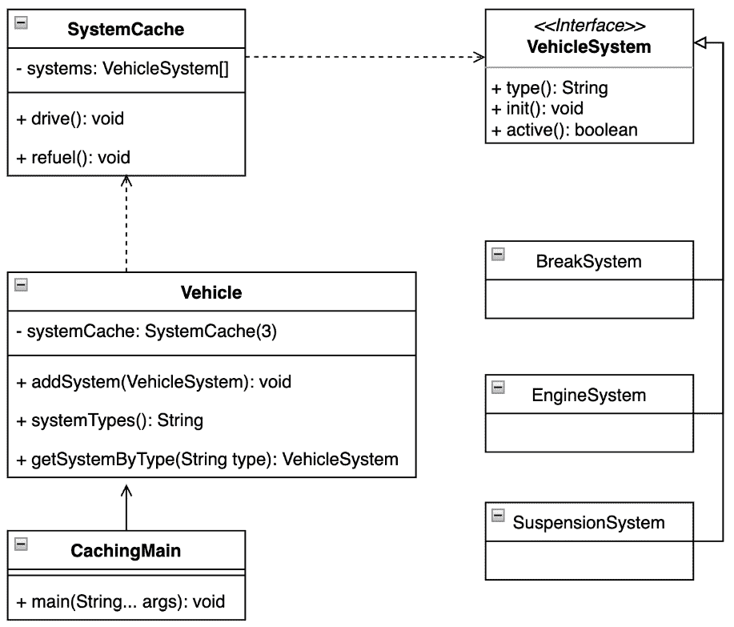

图 5.1 – 显示考虑的 VehicleSystem 类型的 UML 类图，用于 Vehicle 类

这意味着车辆被精确定义且不会改变。当客户端请求特定的系统时，它总是启动与对象相对应的那个。此模式还强制控制存储过程（*示例 5.1*）：

```java
public static void main(String[] args) {
    System.out.println("Caching Pattern, initiated vehicle
        system");
    var vehicle = new Vehicle();
    vehicle.init();
    var suspension = new SuspensionSystem("suspension");
    vehicle.addSystem(suspension);
    System.out.printf("Systems types:'%s%n",
        vehicle.systemTypes());
    var suspensionCache =
        vehicle.getSystemByType("suspension");
    System.out.printf("Is suspension equal? '%s:%s'%n",
        suspension.equals(suspensionCache),
            suspensionCache);
    vehicle.addSystem(new EngineSystem("engine2"));
}
```

这里是输出：

```java
Caching Pattern, initiated vehicle system
Vehicle, init cache:'break':'BreakSystem@adb0cf77',
  'engine':'EngineSystem@a0675694'
Systems types:''break':'BreakSystem@adb0cf77','engine'
  :'EngineSystem@a0675694','suspension':'Suspension
    System@369ef459'
Is suspension equal? 'true:SuspensionSystem@369ef459'
SystemCache, not stored:EngineSystem@6c828066
```

示例 5.1 – 缓存模式提供保证，始终获取所需元素并控制存储

换句话说，没有必要创建另一个实例，如 `EngineSystem`，来访问其功能。这些对象访问或程序行为很容易导致不希望出现的情况。

车辆的 `SystemCache` 只考虑特定类型的实例，并且也受大小的限制（*示例 5.2*）：

```java
class SystemCache {
    private final VehicleSystem[] systems;
    private int end;
...
    boolean addSystem(VehicleSystem system) {
        var availableSystem = getSystem(system.type());
        if (availableSystem == null && end <
            systems.length) {
            systems[end++] = system;
            return true;
        }
        return false;
    }
   VehicleSystem getSystem(String type) {…}
    ...
}
```

示例 5.2 – SystemCache 实例提供确保程序稳定性的功能，并可能提供额外的保证

## 结论

例子（来自 *图 5**.1*）显示实现缓存很简单。当客户端需要重复访问同一组元素时，这可能是一个好主意。这可能会对性能产生积极影响。

这些元素中的一些可能负责程序的运行时行为。让我们在下一节中深入了解这一点。

# 使用责任链模式处理事件

责任链模式有助于避免将处理逻辑绑定到触发事件的发送者。这种模式是由 GoF 的书中确定的。

## 动机

程序接收一个初始触发事件。每个链式处理程序决定是否处理请求或将其传递给下一个处理程序而不做出响应。一个模式可以由一系列处理对象处理的命令对象组成。一些处理程序可以作为调度器，能够将命令发送到不同的方向以形成一个责任树。

责任链模式允许你构建一个实现链，在该链中，在调用链中的下一个处理程序之前或之后执行某个操作。

## 在 JDK 中查找

`java.logging` 模块包括 `java.util.logging` 包，其中包含一个 `Logger` 类，用于记录应用程序组件消息。记录器可以串联，并且记录的消息只由所需的 `Logger` 实例处理。

JDK 中提供的另一个示例是`DirectoryStream`类，它包含在`java.base`模块中，位于`java.nio`包中。这个类负责遍历整个目录，并包含一个嵌套的过滤器接口。该接口提供了一个`accept`方法。链式过滤器的实际表示取决于目录是否需要处理或排除。

## 示例代码

让我们考察一个示例，说明如何使用职责链设计模式来响应来自驱动系统的触发事件（*示例 5.3*）：

```java
   System.out.println("Pattern Chain of Responsibility, vehicle 
      system initialisation");
    var engineSystem = new EngineSystem();
    var driverSystem = new DriverSystem();
    var transmissionSystem = new TransmissionSystem();
    driverSystem.setNext(transmissionSystem);
    transmissionSystem.setNext(engineSystem);
    driverSystem.powerOn();
}
```

这里是输出：

```java
Pattern Chain of Responsibility, vehicle system initialisation
DriverSystem: activated
TransmissionSystem: activated
EngineSystem, activated
```

示例 5.3 – DriverSystem 实例启动通过链式实例传播的 powerOn 事件

创建的系统链的行为是透明的，并且每个系统都适当地封装了逻辑。提供的通用抽象`VehicleSystem`实例定义了功能，每个元素必须完成的功能，以及后续元素应该如何链式连接（*示例 5.4*）：

```java
sealed abstract class VehicleSystem permits DriverSystem,
    EngineSystem, TransmissionSystem {
    ...
    protected VehicleSystem nextSystem;
    protected boolean active;
       ...
    void setNext(VehicleSystem system){
        this.nextSystem = system;
    }
    void powerOn(){
        if(!this.active){
            activate();
        }
        if(nextSystem != null){
            nextSystem.powerOn();
        }
    }
}
```

示例 5.4 – 封闭类使用提供了额外的稳定性和控制

客户端接收一个框架，说明在构建链时可以考虑哪些类（*图 5**.2*）：

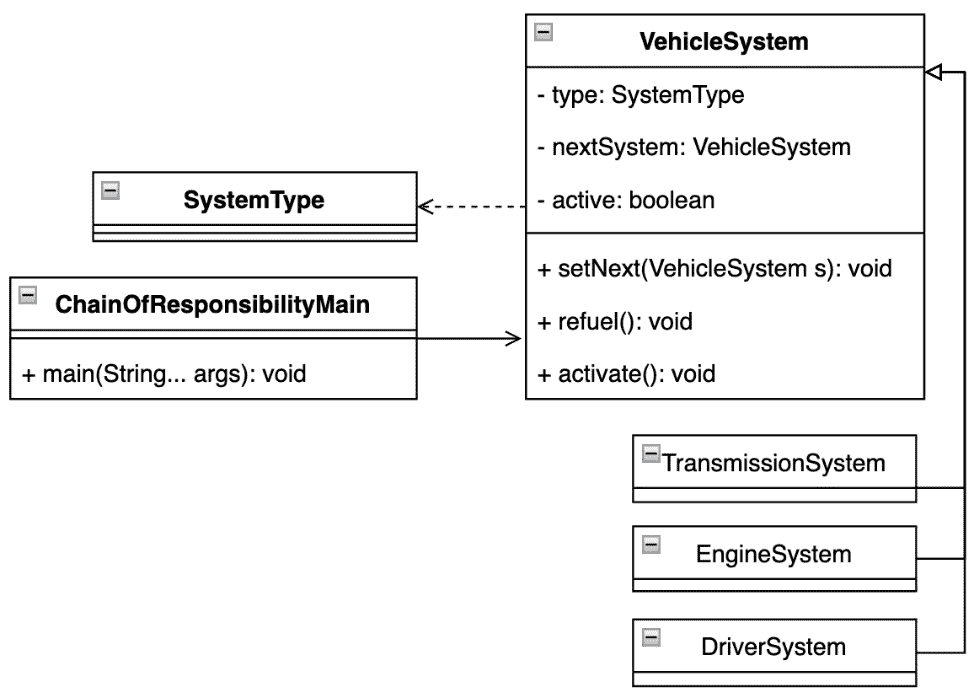

图 5.2 – UML 类图显示参与 powerOn 事件的元素

## 结论

职责链模式表明，影响程序运行行为的传入事件可以导致创建多个对象。操作符被封装，并且根据 SOLID 原则，逻辑被适当隔离。使用此模式，客户端有机会动态决定哪些处理器应参与事件处理。因此，它是安全框架或类似应用的热门候选。

连接的处理器可以在运行时向客户端发出多个命令。让我们更详细地探讨命令响应。

# 使用命令模式将信息转化为行动

命令模式有时也被称为动作。命令模式封装了触发的事件作为一个对象，允许客户端进行操作。这种模式在 GoF 的书中被早期识别和描述。

## 动机

命令模式指定命令接口的哪些实例在接收客户端上执行哪些动作。命令对象可以被参数化以更详细地定义一个动作。命令可以包括一个回调函数来通知其他人事件的发生。有时，命令可以被视为面向对象的回调函数的替代品。新创建的命令对象可以根据启动它的事件具有不同的动态。客户端可以根据已安排的场景对其进行反应。

## 在 JDK 中查找

JDK 中提供了很好的示例，来自 `java.base` 模块中的 `Callable` 和 `Runnable` 接口以及 `java.util.concurrent` 包。每个接口的实现都是基于已知场景进行执行的。

命令模式的其它用途可以在 `java.desktop` 模块中的 `javax.swing` 包以及实现 `Action` 接口的一个类中找到。

## 示例代码

以下示例展示了如何使用定义良好的命令来控制 `Driver` 对象（*示例 5.5*）：

```java
public static void main(String[] args) {
    System.out.println("Pattern Command, turn on/off
        vehicle");
    var vehicle = new Vehicle("sport-car");
    var driver = new Driver();
    driver.addCommand(new StartCommand(vehicle));
    driver.addCommand(new StopCommand(vehicle));
    driver.addCommand(new StartCommand(vehicle));
    driver.executeCommands("start_stop");
}
```

这里是输出：

```java
Pattern Command, turn on/off vehicle
START:Vehicle{type='sport-car', running=true}
STOP:Vehicle{type='sport-car', running=false}
START:Vehicle{type='sport-car', running=true}
```

示例 5.5 – 触发的 start_stop 事件被 Driver 实例转换成动作

命令被适当封装，可能包含与不同客户端交互的额外逻辑，或者可能决定执行步骤（*示例 5.6*）：

```java
sealed interface VehicleCommand permits StartCommand,
    StopCommand {
    void process(String command);
}
record StartCommand(Vehicle vehicle) implements
    VehicleCommand {
    @Override
    public void process(String command) {
        if(command.contains("start")){ ... }
}
```

示例 5.6 – 为了保留预期的命令设计，可以采用密封类的概念

随着驱动器功能的演变，命令可以透明地扩展（*图 5**.3*）：

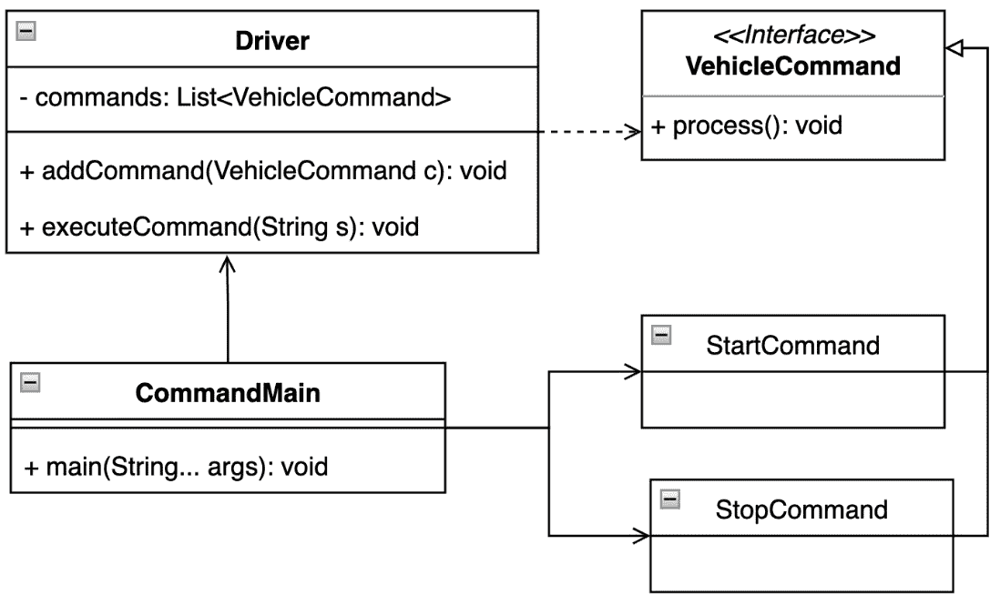

图 5.3 – 展示哪些命令可以被视为驱动器的 UML 类图

## 结论

一个简单的示例（*图 5**.3*）展示了命令模式的价值。命令对象与逻辑分离，可能包含额外的有价值信息。命令有其自己的生命周期，并使得实现可以触发另一个事件的回调函数变得容易。

以文本形式表示这些命令可能很棘手。以下部分展示了客户端如何理解它们。

# 使用解释器模式为上下文赋予意义

解释器模式将字符序列解释为期望的动作。由于其用于 SQL 语句翻译而被早期识别，并在 GoF 的书中进行了更详细的描述。

## 动机

解释器模式定义了两种类型的对象，它们指向特定的字符序列。它们是终端和非终端动作或操作，可以在考虑的字符序列上执行。这些操作代表了使用的计算机语言，并具有自己的语义。给定句子的句法树——字符序列——是复合模式的实例，用于评估和解释客户端程序的意义。

## 在 JDK 中查找

`java.base` 模块包含 `java.util.regex` 包和 `Pattern` 类。这个类代表了正则表达式的编译。特定的语义应用于字符序列以验证所需的匹配。

另一个例子来自类似的模块和 `java.text` 包。抽象的 `Format` 类实现用于表示与位置敏感的信息，如日期、数字格式等。

## 示例代码

让我们创建一个简单的字符串数学公式。该公式包含来自不同传感器的值及其对结果的影响。结果表示公式的最终值（*示例 5.7*）：

```java
public static void main(String[] args) {
    System.out.println("Pattern Interpreter, sensors
        value");
    var stack = new Stack<Expression>();
    var formula = "1 - 3 + 100 + 1";
    var parsedFormula = formula.split(" ");
    var index = 0;
    while (index < parsedFormula.length ){
        var text = parsedFormula[index++];
        if(isOperator(text)){
            var leftExp = stack.pop();
            var rightText = parsedFormula[index++];
            var rightEpx = new IntegerExpression
                (rightText);
            var operatorExp = getEvaluationExpression(text,
                left, right);
            stack.push(operatorExp);
        } else {
            var exp = new IntegerExpression(text);
            stack.push(exp);
        }
    }
    System.out.println("Formula result: " +
        stack.pop().interpret());
}
```

这里是输出：

```java
Pattern Interpreter, math formula evaluation
Formula result: 99
```

示例 5.7 – 解析器将数学字符串公式转换为适当的表达式类型

基本元素是接口及其 `interpret` 方法。`1 - 3 + 100 + 1` 公式按顺序评估，最后一个元素包含结果。每个表达式都被封装，解释器可以方便地扩展（*图 5**.4*）：

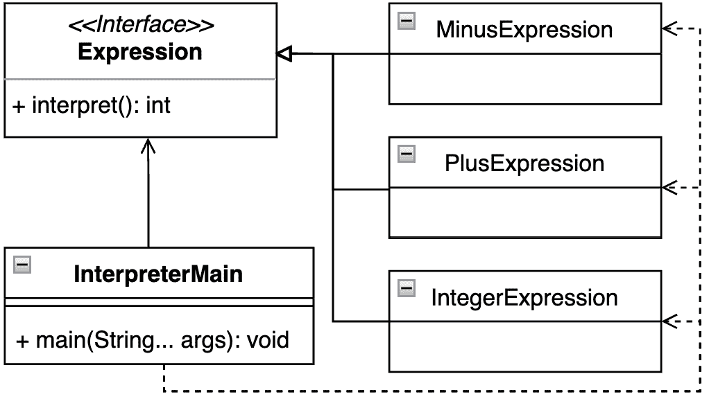

图 5.4 – UML 类图显示哪些参与者需要用于评估

## 结论

解释器模式是一种强大的设计模式，其中客户端需要处理具有已知语义的命令的文本表示。它允许您创建一个由类层次结构表示的语法，该语法可以轻松扩展，甚至可以在运行时动态修改。

下一节将向我们展示如何遍历命令集合。让我们深入探讨。

# 使用迭代器模式检查所有元素

这种迭代器模式可以接近于指向所需位置的游标抽象。由于数组构造是一个常用的结构类型，这种模式很快就被识别出来。它被认为是 GoF 书籍中包含的核心模式之一。

## 动机

迭代器模式定义了一种透明的方式来遍历对象集合，而无需暴露或了解任何对象的内部细节。为了在元素之间移动，迭代器模式使用迭代函数。

## 在 JDK 中查找

`java.base` 模块包含多个迭代器模式的实现。第一个实现可以被认为是位于 `java.util` 包中的集合框架提供的实现。`Iterator` 接口的实现遍历集合，而不了解元素的成员资格。

另一个可以考虑的例子是 `BaseStream` 接口及其 `iterator` 方法提供的迭代器。此类来自类似的模块和 `java.util.stream` 包，即流 API。它表示终端操作。

## 样本代码

每个车辆都有几个共同的部分。以下示例展示了使用迭代器模式遍历它们的用法（*示例 5.8*）：

```java
public static void main(String[] args) {
    System.out.println("Iterator Pattern, vehicle parts");
    var standardVehicle = new StandardVehicle();
    for(PartsIterator part = standardVehicle.getParts();
        part.hasNext();){
        var vehiclePart = part.next();
        System.out.println("VehiclePart name:" +
            vehiclePart.name());
    }
}
```

这里是输出：

```java
Iterator Pattern, vehicle parts
VehiclePart name:engine
VehiclePart name:breaks
VehiclePart name:navigation
```

示例 5.8 – 为了保留预期的命令设计，可以采用密封类的概念

该车辆可以提供一个通用的抽象车辆，用于处理迭代器（*示例 5.9*）：

```java
interface PartsIterator {
    boolean hasNext();
    VehiclePart next();
}
```

示例 5.9 – 一个程序可以实现具有不同动态的不同迭代器

客户端可以单独遍历所有元素。这种迭代器的实现可以被视为具体实现的一个嵌套类（*示例 5.10*）：

```java
sealed interface Vehicle permits StandardVehicle {
    PartsIterator getParts();
}
final class StandardVehicle implements Vehicle {
    private final String[] vehiclePartsNames = {"engine",
        "breaks", "navigation"};
    private class VehiclePartsIterator implements
        PartsIterator {
        ...
    }
    @Override
    public PartsIterator getParts() {
        return new VehiclePartsIterator();
    }
}
```

示例 5.10 – 一个程序可以实现具有不同动态的不同迭代器

样本程序的行为对客户端是透明的，它提供了一个框架来扩展车辆的预期实现，以及一种导航它们的方式（*图 5**.5*）：

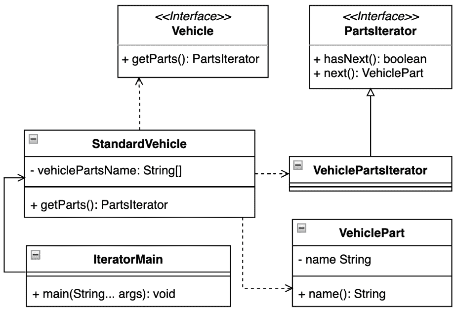

图 5.5 – 代表为 StandardVehicle 设计的部件集合的 UML 类图

## 结论

迭代器模式的优点是它可以非常通用地实现 – 无需了解正在考虑的元素类型。迭代器遍历它们而不在运行时触及它们的内部表示。结合另一个模式，它可以在运行时更改策略或仅考虑特定的对象类型。

下一个部分将探讨特定对象类型之间的运行时通信 – 让我们开始吧。

# 利用中介者模式进行信息交换

在不同类型的应用程序中，一个常见的场景是管理需要交换信息以维持流程的客户端之间的通信。这个模式被早期识别，并且是 GoF 书籍的核心模式之一。

## 动机

中介者模式代表一个对象，一个中间人，它定义了对象组内对象之间相互作用的规则。中介为客户端通信建立了一个自由连接。客户端可以通过中介明确地相互引用。这样，通信可以被调节。

## 在 JDK 中查找

虽然一开始可能不明显，但中介者模式可以在 `java.base` 模块和 `java.util.concurrent` 包中轻松找到。`ExecutorService` 类定义了一个 `submit` 方法。其父类 `Executor` 公开了 `execute` 方法。这些方法可以用来传递 `Callable` 或 `Runnable` 接口的实现，这些实现之前被称为命令模式的实现。

## 示例代码

与其他示例相比，以下示例相当简单，但它展示了处理器如何维护车辆传感器通信（*示例 5.11*）：

```java
record Sensor(String name) {
    void emitMessage(String message) {
        VehicleProcessor.acceptMessage(name, message);
    }
}
public static void main(String[] args) {
    System.out.println("Mediator Pattern, vehicle parts");
    var engineSensor = new Sensor("engine");
    var breakSensor = new Sensor("break");
    engineSensor.emitMessage("turn on");
    breakSensor.emitMessage("init");
}
```

这里是输出：

```java
Mediator Pattern, vehicle parts
Sensor:'engine', delivered message:'turn on'
Sensor:'break', delivered message:'init'
```

示例 5.11 – 通信由一个 VehicleProcessor 实例处理

示例的核心元素是 `VehicleProcessor` 实例，它获取所有发出的消息并能对它们做出反应（*图 5**.6*）：

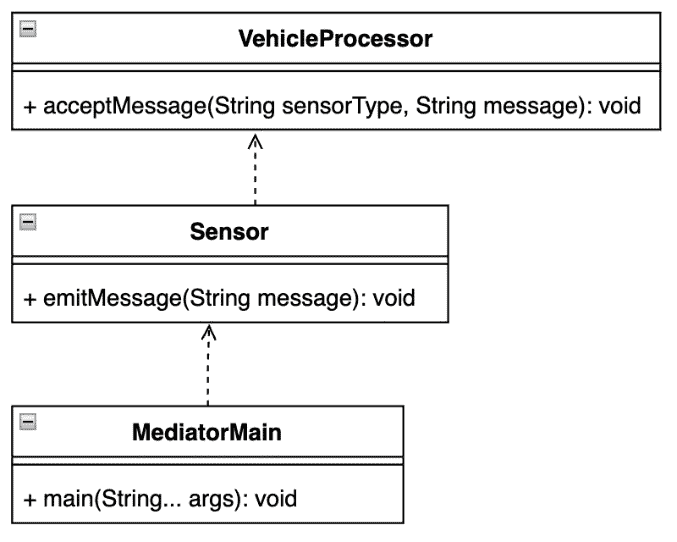

图 5.6 – 强调通过处理器进行的通信的 UML 类图

## 结论

中介者模式引入了隔离不同对象之间复杂通信的能力。参与的对象数量可能在运行时变化。该模式提供了一种封装和解耦的方式，允许所有客户端相互通信。

通信可以导致各种状态。在下一节中，我们将探讨如何记住和恢复它们。

# 使用备忘录模式恢复所需状态

有时，考虑保留关于对象状态的最小信息，以便继续或恢复它，可能是有用的。备忘录模式提供了这种功能，并在 GoF 的书中进行了描述。

## 动机

在不破坏封装的情况下，需要捕获和外部化对象的内部状态，即备忘录，以便对象可以稍后恢复到该状态。备忘录模式提供了一个客户端函数，可以在需要时恢复对象的所需状态，即备忘录。

## 在 JDK 中查找

`java.base` 模块及其 `java.util` 包中包含的 `Date` 类是对备忘录模式的一个很好的实现。类的实例代表时间线上的一个特定点，可以通过引用日历或时区将日期恢复到该时间线。

## 示例代码

让我们看看车辆空调的例子。控制器为我们提供了几个设置驾驶舱温度的选项，这也意味着驾驶员可以恢复已选状态（*示例 5.12*）：

```java
 public static void main(String[] args) {
    System.out.println("Memento Pattern, air-condition
        system");
    var originator = new AirConditionSystemOriginator();
    var careTaker = new AirConditionSystemCareTaker();
    originator.setState("low");
    var stateLow = originator.saveState(careTaker);
    originator.setState("medium");
    var stateMedium = originator.saveState(careTaker);
    originator.setState("high");
    var stateHigh = originator.saveState(careTaker);
    System.out.printf("""
            Current Air-Condition System state:'%s'%n""",
                originator.getState());
    originator.restoreState(careTaker.getMemento(stateLow));
    System.out.printf("""
            Restored position:'%d', Air-Condition System
                state:'%s'%n""", stateLow,
                    originator.getState());
}
```

这是输出：

```java
Memento Pattern, air-condition system
Current Air-Condition System state:'high'
Restored position:'0', Air-Condition System state:'low'
```

示例 5.12 – 每个状态都被记住，驾驶员可以按需恢复

扮演备忘录提供者角色的 `AirConditionSystemCareTaker` 实例包含指向已使用状态的链接（*示例 5.13*）：

```java
final class AirConditionSystemCareTaker {
    private final List<SystemMemento> memory = new
        ArrayList<>();
     ...
    int add(SystemMemento m) {... }
    SystemMemento getMemento(int i) {... }
}
```

示例 5.13 – 每个状态都通过一个标识符记住，以便恢复

`AirConditionSystemOriginator` 实例考虑创建备忘录状态，并从备忘录对象中恢复先前的状态。客户端需要记住提供的状态标识符，以便向保管人请求备忘录状态（*示例 5.14*）：

```java
final class AirConditionSystemOriginator {
    private String state;
    ...
    int saveState(AirConditionSystemCareTaker careTaker){
        return careTaker.add(new SystemMemento(state));
    }
    void restoreState(SystemMemento m){
        state = m.state();
    }
}
```

示例 5.14 – 发起者持有可变状态并更新保管人

程序允许客户端仅对几个考虑的状态进行操作，而不创建任何其他实例（*图 5**.7*）：

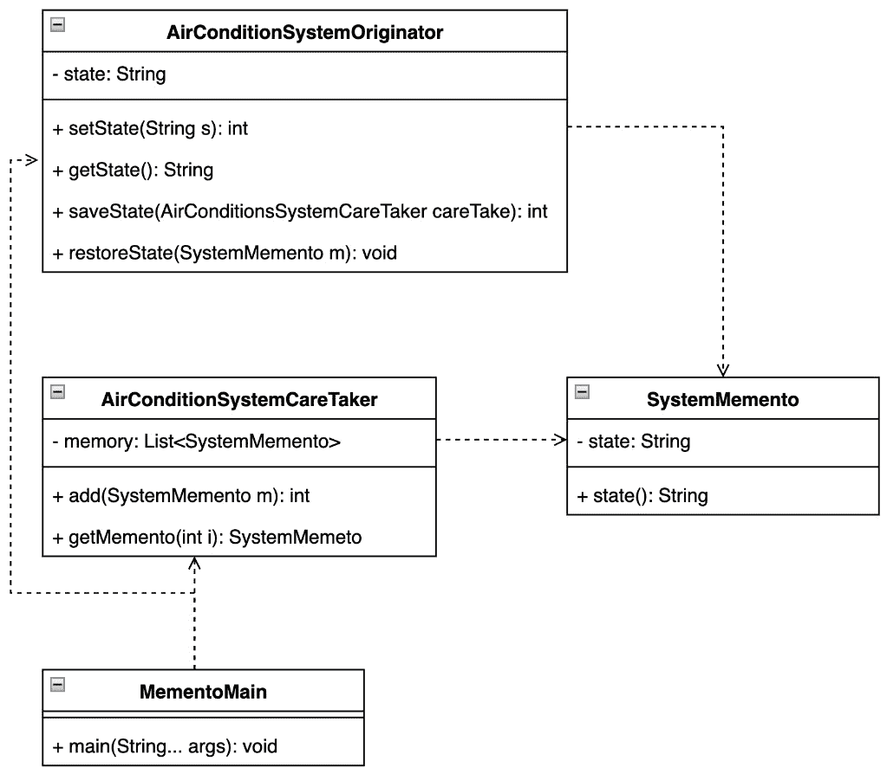

图 5.7 – 显示只涉及少数类的 UML 类图

## 结论

当程序需要执行任何撤销操作或回滚时间线时，备忘录模式非常有用。它提供了透明的实现和逻辑分离，以强制代码库的可持续性。

让我们看看程序按预期运行，并在下一节中对其进行检查。

# 使用空对象模式避免空指针异常状态

空对象模式提供了一种优雅地处理未识别对象的方法，而不会导致意外的或未定义的程序行为。

## 动机

与使用 Java 的 `null` 构造来表示对象不存在相比，考虑引入空对象模式。空对象被认为属于特定对象家族。该对象实现了预期的接口，但实现其方法不会引起任何操作。与使用未定义的空引用相比，这种方法的优势在于空对象非常可预测，并且没有副作用：它什么也不做。它还试图消除令人不快的空指针异常。

## 在 JDK 中找到它

传统上提到的 `java.base` 模块和位于 `java.util` 包中的 `Collection` 框架定义了 `Collections` 工具类。该类包含一个内部私有 `EmptyIterator` 类，用于提供无元素的迭代器实例。

另一个很好的例子可以在 `java.io` 模块和包中找到。抽象类 `InputStream` 定义了 `nullInputStream` 方法，该方法提供零字节的输入流。

## 示例代码

让我们更仔细地检查空对象模式的使用。今天的车辆包含大量不同类型的传感器。为了利用 Stream API 的更多功能，定义一个包含传感器类型且程序可以透明响应的空对象非常有用（*示例 5.15*）：

```java
public static void main(String[] args) {
    System.out.println("Null Object Pattern, vehicle
        sensor");
    var engineSensor = VehicleSensorsProvider
        .getSenorByType("engine");
    var transmissionSensor = VehicleSensorsProvider
        .getSenorByType("transmission");
    System.out.println("Engine Sensor: " + engineSensor);
    System.out.println("Transmission Sensor: " +
        transmissionSensor);
}
```

这是输出：

```java
Null Object Pattern, vehicle sensor
Engine Sensor: Sensor{type='engine'}
Transmission Sensor: Sensor{type='not_available'}
```

示例 5.15 – 客户端收到信息，请求的传感器作为 NullSensor 实例不可用

`VehicleSensorProvider` 实例总是返回预期类型的结果，实现该模式非常简单（*图 5**.8*）：

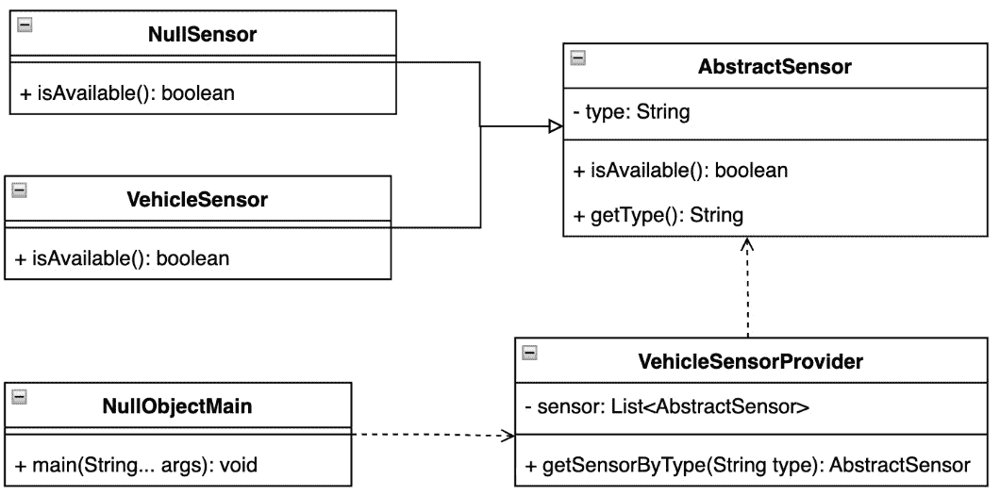

图 5.8 – 显示类型维护中使用的关系的 UML 类图

## 结论

例子表明，该模式不仅可以提高代码库的可维护性，还可以减少不想要的运行时状态，例如空指针异常。

可以使用我们将在下一节中探讨的方法来解决未定义的程序状态。

# 使用观察者模式保持所有相关方的信息

观察者模式有时也被称为生产者-消费者模式。再次强调，这是一个非常常见的用例，它出现在各种应用程序中，因此被 GoF 的书中提到。

## 动机

一个模式代表对象之间的直接关系。一个对象扮演生产者的角色。生产者可能有许多客户，信息需要发送给这些客户。这些对象有时被称为接收者。当观察者改变其状态时，所有已注册的客户端都会被通知这一变化。换句话说，对象发生的任何变化都会导致观察者被通知。

## 在 JDK 中找到它

观察者模式是 JDK 模块中另一种相当常用的模式。一个例子是来自 `java.base` 模块和 `java.util` 包的 `Observer` 接口。尽管接口已经被弃用，但它们仍然通过编译器实现中的 `Observable` 类被使用。

## 示例代码

让我们检查车辆不同位置的温控情况。`VehicleSystem` 实例应始终通知所有相关方关于每个系统可以调整到的温度目标（*示例 5.16*）：

```java
public static void main(String[] args) {
    System.out.println("Observer Pattern, vehicle
        temperature senors");
    var temperatureControlSystem = new VehicleSystem();
    new CockpitObserver(temperatureControlSystem);
    new EngineObserver(temperatureControlSystem);
    temperatureControlSystem.setState("low");
}
```

这里是输出：

```java
Observer Pattern, vehicle temperature senors
CockpitObserver, temperature:'11'
EngineObserver, temperature:'4'
```

示例 5.16 – 每个子系统根据全局设置调整其温度

`SystemObserver` 抽象类不仅使用密封类的构造来表示正在考虑的子系统，还提供了一个构建预期子系统的基本模板（*示例 5.17*）：

```java
sealed abstract class SystemObserver permits
    CockpitObserver, EngineObserver {
    protected final VehicleSystem system;
    public SystemObserver(VehicleSystem system) {
        this.system = system;
    }
    abstract void update();
}
```

示例 5.17 – 新增的子系统遵循通用模板以确保可维护性

每个实例都包含一个指向控制温度目标的主体系统的引用（*图 5**.9*）：

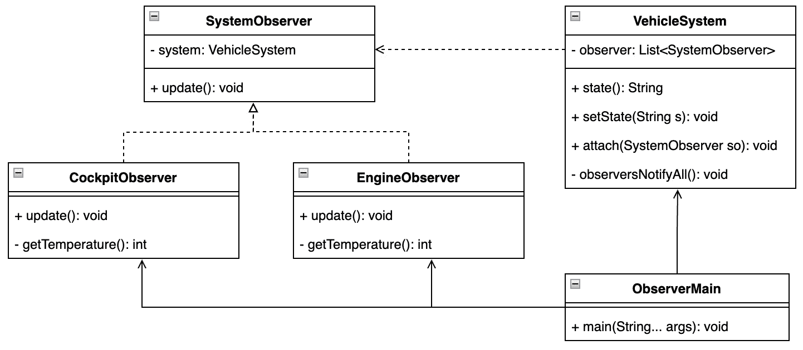

图 5.9 – 一个 UML 类图强调了系统之间的关系

## 结论

观察者模式是另一个非常强大的模式：它允许客户端在不改变或理解实现的情况下，让所有利益相关者保持知情。该模式正确地封装并解耦了逻辑，并允许在运行时使用可配置的过程。

下一个部分展示了如何单独解决链接过程。

# 使用管道模式处理实例阶段

管道模式可以为改善多个下游操作的组织做出重大贡献。

## 动机

此模式通过提供初始输入并传递处理后的输出以供后续阶段使用，在一系列阶段中改进数据处理。处理元素被安排在一个连续的管道中，以便一个的输出是另一个的输入，类似于物理管道的工作方式。管道模式可以在连续成员之间提供某种类型的缓冲，由对象实例表示。通过这些管道流动的信息通常是记录流。

## 在 JDK 中查找

管道模式最明显的例子是 `Stream` 接口及其实现。该接口是 Stream API 的一部分，与 `java.base` 模块和 `java.util.stream` 包一起分发。

## 示例代码

让我们想象一系列需要在车辆中执行的过程，定义它们，并将它们按顺序排列。然后我们初始化一个 `SystemElement` 容器，该容器收集每个过程的结果信息（*示例 5.18*）：

```java
public static void main(String[] args) {
    System.out.println("Pipeline Pattern, vehicle turn on
        states");
    var pipeline = new PipeElement<>(new EngineProcessor())
            .addProcessor(new BreakProcessor())
            .addProcessor(new TransmissionProcessor());
    var systemState = pipeline.process(new
        SystemElement());
    System.out.println(systemState.logSummary());
}
```

这里是输出：

```java
Pipeline Pattern, vehicle turn on states
engine-system,break-system,transmission-system
```

示例 5.18 – 每个过程的结果都被考虑在最终总结中

基本结构是`PipeElement`，它不仅定义了输入类型，还定义了输出。此外，它还定义了信息处理的顺序（*示例 5.19*）：

```java
class PipeElement<E extends Element, R extends Element> {
    private final Processor<E, R> processor;
   ...
    <O extends Element> PipeElement<E, O> addProcessor
        (Processor<R, O> p){
        return new PipeElement<>(input -> p.process
            (processor.process(input)));
    }
    R process(E inputElement){
        return processor.process(inputElement);
    }
}
```

示例 5.19 – `addProcessor`方法定义了处理器过程方法执行的顺序

每个处理器实现都可以被视为一个功能接口构造，并且可以根据需要更改`Element`实现，而不会破坏管道基础代码（*图 5**.10*）：

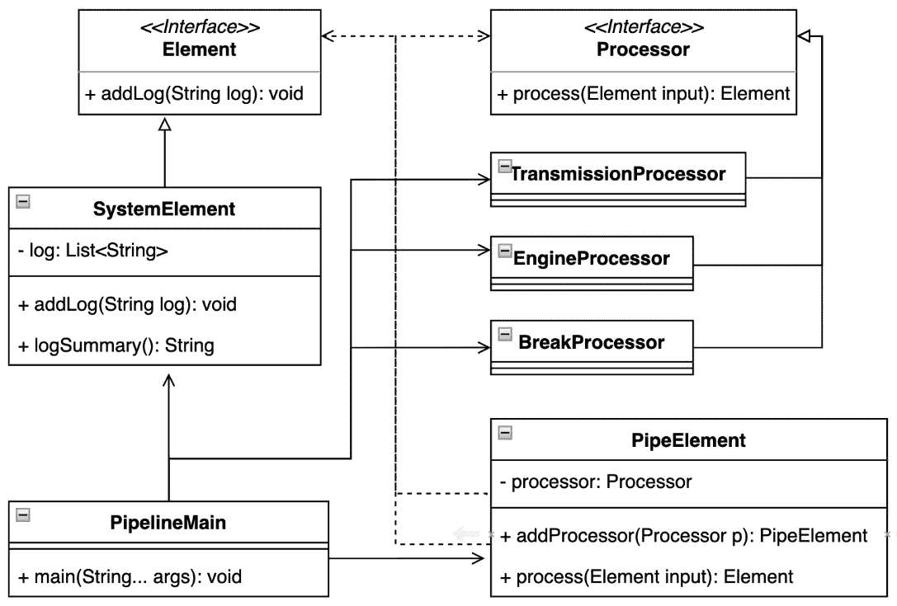

图 5.10 – 显示如何维护管道类型安全的 UML 类图

## 结论

所展示的示例显示了清晰分离过程以贡献最终结果的优点。管道模式有潜力创建复杂的操作序列，这些序列可以轻松测试，并且可以动态更改。

让我们在下一节中探讨每个预期元素如何改变其状态。

# 使用状态模式改变对象行为

行为状态模式定义了基于对象内部状态的突变来影响对象内部过程的过程。这个模式是 GoF（设计模式：可复用面向对象软件的基础）一书的一部分。

## 动机

可以将对象状态视为代表有限机器的概念。一个模式允许对象在其内部状态改变时改变其行为。状态模式强制对象使用特定的类来描述其内部状态，并将对这些状态的响应映射到特定的实例。

## 在 JDK 中查找

状态模式的使用可以在`jlink`插件的实现、`jdk.jlink`模块以及`jdk.tools.jlink.plugin`包中找到。接口插件定义了一个嵌套枚举类`State`，其值是对所讨论状态的引用。

## 示例代码

以下示例考虑了每辆车都有不同的、被良好识别的状态（*示例 5.20*）：

```java
public static void main(String[] args) {
    System.out.println("State Pattern, vehicle turn on
        states");
    ...
    var initState = new InitState();
    var startState = new StartState();
    var stopState = new StopState();
    vehicle.setState(initState);
    System.out.println("Vehicle state2:" +
        vehicle.getState());
    vehicle.setState(startState);
    System.out.println("Vehicle state3:" +
        vehicle.getState());
    vehicle.setState(stopState);
    System.out.println("Vehicle state4:" +
        vehicle.getState());
}
```

这里是输出：

```java
State Pattern, vehicle turn on states
Vehicle state2:InitState{vehicle=truck}
Vehicle state3:StartState{vehicle=truck}
Vehicle state4:StopState{vehicle=truck}
```

示例 5.20 – 车辆状态被很好地封装并从客户端逻辑中分离出来

考虑到的每个`Vehicle`状态都可以独立且正确地与客户端逻辑分离（*图 5**.11*）：

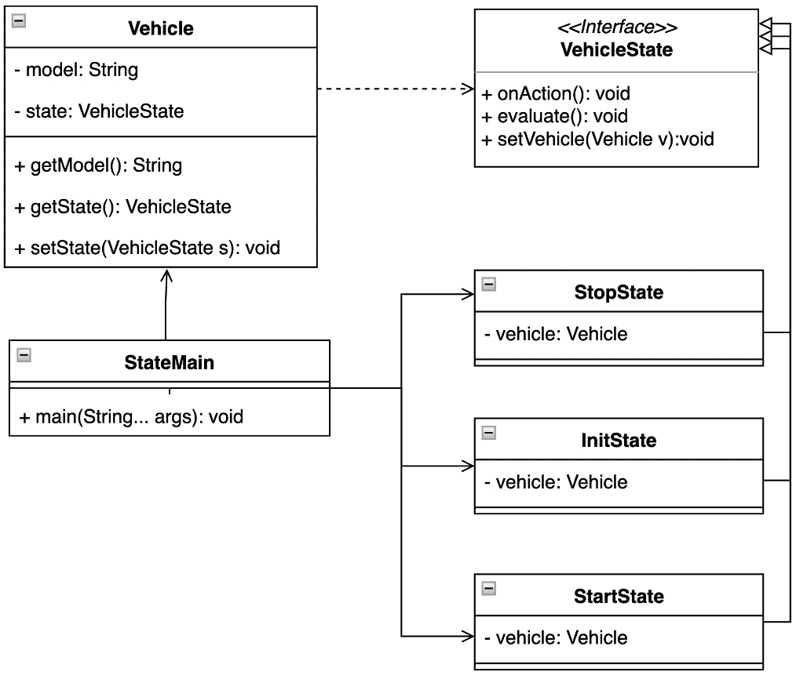

图 5.11 – 显示考虑到的状态之间关系的 UML 类图

## 结论

状态模式展示了将状态具体表示为对象的专用实例的优点。这不仅提高了可测试性，而且极大地促进了底层代码的可维护性，因为每个状态都被清晰地封装，并符合 SOLID 概念中的单一职责原则。程序执行对客户端来说是透明的，无需实现任何额外的异常处理逻辑。

每个状态都可以对应于特定的程序行为或运行时交互。让我们在下一节深入探讨这个问题。

# 使用策略模式改变对象行为

策略模式有时也被称为策略模式，因为它在特定情况或状态下为运行时执行建立了精确的步骤。这个模式是 GoF 书籍的一部分。

## 动机

策略模式代表了一组算法，其中每个算法都得到了适当的封装。它定义了特定对象可以响应的算法的可互换性。这种策略允许算法独立于使用它的客户端进行更改，并允许客户端在运行时选择最合适的一个。换句话说，代码允许客户端附加各种策略对象，这些对象会影响程序的行为。

## 在 JDK 中找到它

策略模式是另一种常用的模式，人们往往没有意识到它的使用。`java.base`模块的`Collection`框架和`java.util`包实现了`Comparator`类。这个类通常用于排序目的，例如`Collections.sort()`方法的实现。

另一种可能更广泛使用的实现是 Stream API 中引入的`map`或`filter`方法，这也来自`java.base`模块，但在`java.util.stream`包中。

## 示例代码

假设一个驾驶员拥有多种驾驶执照，这些执照是针对特定类型的车辆所需的。每种车辆都需要略微不同的驾驶策略（*示例 5.21*）：

```java
public static void main(String[] args) {
    System.out.println("Strategy Pattern, changing
        transport options");
    var driver = new VehicleDriver(new CarStrategy());
    driver.transport();
    driver.changeStrategy(new BusStrategy());
    driver.transport();
    driver.changeStrategy(new TruckStrategy());
    driver.transport();
}
```

这里是输出：

```java
Strategy Pattern, changing transport options
Car, four persons transport
Bus, whole crew transport
Truck, transporting heavy load
```

示例 5.21 – VehicleDriver 实例可以在运行时更改运输策略

`VehicleDriver`实例仅持有当前使用的`TransportStrategy`实例的引用（*示例 5.22*）：

```java
class VehicleDriver {
    private TransportStrategy strategy;
    VehicleDriver(TransportStrategy strategy) {
        this.strategy = strategy;
    }
    void changeStrategy(TransportStrategy strategy){
        this.strategy = strategy;
    }
    void transport(){
        strategy.transport();
    }
}
```

示例 5.22 – VehicleDriver 实例通过可见方法与策略进行通信

客户端可以在运行时决定使用哪种策略。每个策略都得到了适当的封装（*图 5**.12*）：

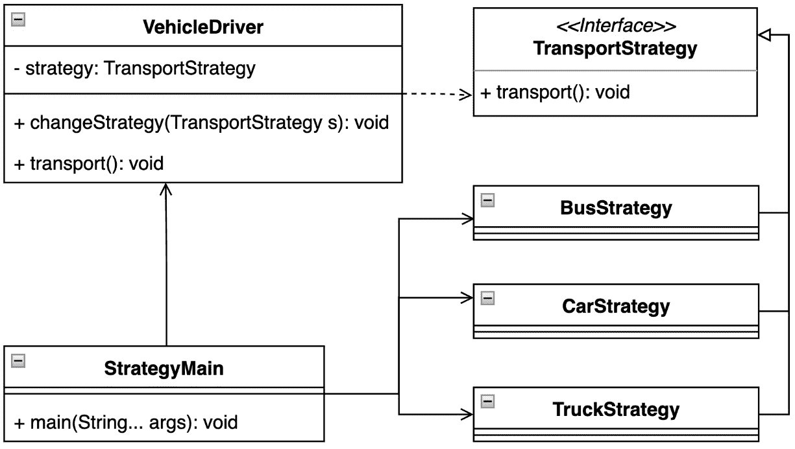

图 5.12 – 显示如何简单地定义新策略的 UML 类图

## 结论

这个简单的例子展示了在行动中一个很好地隔离的战略模式。驾驶员可以根据提供的车辆类型改变他们的能力。这种模式将逻辑与代码库的其他部分分离的能力使其非常适合实现不应向客户端暴露的复杂算法或操作。

许多跑步活动都有一个一般的基础。让我们在下一节探讨如何处理这种情况。

# 使用模板模式标准化流程

模板方法模式统一了密集操作的泛化与模板方法。模板模式被早期认可，并被认为是 GoF 书籍的一部分。

## 动机

模板方法模式基于识别类似使用的步骤。这些步骤定义了一个算法的骨架。每个操作都可以将其步骤推迟到特定的子类。模板方法引入子类来重新定义算法的某些部分，而不改变其结构。模板可以用来按所需顺序执行内部方法。

## 在 JDK 中查找

Java 使用位于 `java.base` 模块和 `java.io` 包中的 I/O API 定义的输入或输出字节流。`InputStream` 类包含一个重载的 `read` 方法，它代表一个字节处理模板。这与定义重载 `write` 方法的 `OutputStream` 类类似的方法。

模板模式在 `Collection` 框架中也有另一种用途，该框架位于同一模块和 `java.util` 包中。抽象的 `AbstractList`、`AbstractSet` 和 `AbstractMap` 类使用不同的模板实现了 `indexOf` 和 `lastIndexOf` 方法 – 例如，`AbstractList` 使用 `ListIterator`，与常见的 `Iterator` 接口实现相比。

## 示例代码

让我们看看模板方法模式如何简化创建一个新的传感器（*示例 5.23*）：

```java
public static void main(String[] args) {
    System.out.println("Template method Pattern, changing
        transport options");
    Arrays.asList(new BreaksSensor(), new EngineSensor())
            .forEach(VehicleSensor::activate);
}
```

这是输出：

```java
Template method Pattern, changing transport options
BreaksSensor, initiated
BreaksSensor, measurement started
BreaksSensor, data stored
BreaksSensor, measurement stopped
EngineSensor, initiated
EngineSensor, measurement started
EngineSensor, data stored
EngineSensor, measurement stopped
```

示例 5.23 – 模板提供了对每个传感器都有效的通用激活步骤

`VehicleSensor` 抽象类通过定义一个最终的 `activate` 方法（*示例 5.24*）来表示示例的核心元素：

```java
abstract sealed class VehicleSensor permits BreaksSensor,
    EngineSensor {
    abstract void init();
    abstract void startMeasure();
    abstract void storeData();
    abstract void stopMeasure();
    final void activate(){
        init();
        startMeasure();
        storeData();
        stopMeasure();
    }
}
```

示例 5.24 – `activate()` 模板方法定义了每个实现的步骤

换句话说，模板方法模式还描述了一种扩展车辆传感器库的方法（*图 5**.13*）：

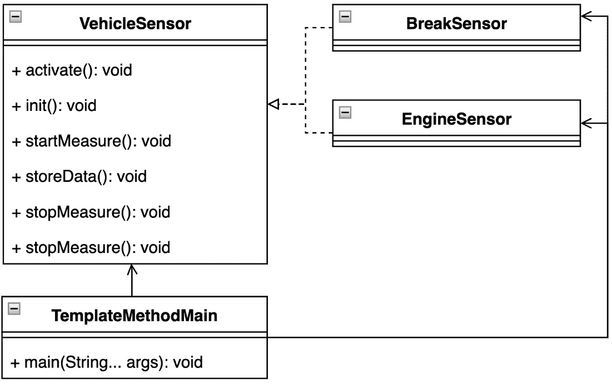

图 5.13 – 突出显示添加新传感器的简单性的 UML 类图

## 结论

模板方法模式展示了它在通用动作方面的巨大优势。它无缝地将内部逻辑与客户端分离，并为执行动作提供了透明和通用的步骤。维护代码库或在其中发现潜在问题都很容易。

运行时环境可能很复杂。始终了解哪些实例存在是很好的。我们将在下一节中了解如何做到这一点。

# 使用访问者模式根据对象类型执行代码

访问者模式引入了算法执行与相关对象实例的分离。此模式在 GoF 的书中被提及。

## 动机

访问者模式允许客户端在不改变它正在工作的类的实例的情况下定义一个新的操作。此模式提供了一种将底层代码与对象结构分离的方法。这种分离实际上提供了在不修改其结构的情况下向现有对象添加新操作的能力。

## 在 JDK 中查找

访问者模式的用法可以在`java.base`模块和`java.nio.file`包中找到。`Files`实用类使用的`FileVisitor`接口及其`walkFileTree`方法使用了一种模式来遍历目录结构和相关文件。

## 示例代码

车辆的安全通常依赖于其传感器的稳健性。示例展示了如何确保每个特定传感器的存在（*示例 5.25*）：

```java
public static void main(String[] args) {
    System.out.println("Visitor Pattern, check vehicle
        parts");
    var vehicleCheck = new VehicleCheck();
    vehicleCheck.accept(new VehicleSystemCheckVisitor());
}
```

这里是输出：

```java
Visitor Pattern, check vehicle parts
BreakCheck, ready
BreakCheck, ready, double-check, BreaksCheck@23fc625e
EngineCheck, ready
EngineCheck, ready, double-check, EngineCheck@3f99bd52
SuspensionCheck, ready
SuspensionCheck, ready, double-check,
    SuspensionCheck@4f023edb
VehicleCheck, ready
VehicleCheck, ready, double-check, VehicleCheck@3a71f4dd
```

示例 5.25 – 客户端也双重检查每个传感器的存在

`VehicleSystemCheackVisitor`类定义了`visit`方法的重载实现。每个特定的传感器实例可以通过重载`visit`方法简单地考虑（*示例 5.26*）：

```java
class VehicleSystemCheckVisitor implements  CheckVisitor{
    @Override
    public void visit(EngineCheck engineCheck) {
        System.out.println("EngineCheck, ready");
        visitBySwitch(engineCheck);
    }
   private void visitBySwitch(SystemCheck systemCheck){
        switch (systemCheck){
        case EngineCheck e -> System.out.println
            ("EngineCheck, ready, double-check, " + e);
        ...
        default -> System.out.println(
           "VehicleSystemCheckVisitor, not implemented");
     }
   }
  ....
}
```

示例 5.26 – 在`instanceof`概念中应用模式匹配可以强制代码可维护性

每个系统检查都正确地注册了预期的传感器，并增加了对车辆安全系统的信心（*图 5**.14*）：

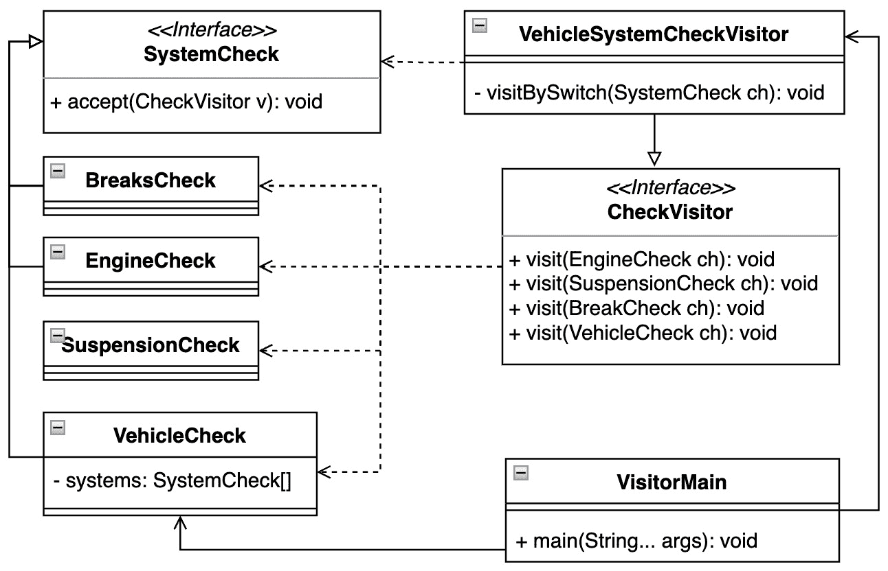

图 5.14 – 车辆传感器及其抽象的 UML 类图

## 结论

这个例子展示了`VehicleCheck`系统如何确保每个部件的存在。每个控制都是自包含的，可以根据需要轻松添加或删除新控制。缺点是它需要为每种类型的控制创建一个专用实例。这也意味着至少有两个类在层次结构中引用相似的状态。另一个优点或缺点是，当在运行时可能发现的新的元素被添加时，该模式不会导致编译失败。可以通过利用新添加的具有模式匹配的`switch`语句和其他一些改进来克服潜在的重复，并确保类型安全——遵循维护 Liskov 替换原则，而标准访问者模式违反了这一原则。*示例 5.26*展示了`visitBySwitch`方法，该方法接受`SystemCheck`对象作为输入。

在探讨了访问者模式之后，我们来到了本章的结尾——让我们简要总结一下我们学到了什么。

# 概述

在本章中，我们学习了运行时环境的重要性以及程序执行的动态特性。行为设计模式可以改善程序与 Java 平台内部部分的交互。JIT 编译器可以更好地处理运行时的动态字节码转换，或者垃圾收集器可以执行更有效的内存回收。

大多数这些设计模式都符合 SOLID 原则——只有访问者模式留下了一些思考的空间。然而，最近添加到 Java 平台上的改进可以帮助克服这一点。无论是密封类、`switch`语句、模式匹配增强还是记录，该平台为加强程序的不可变性和代码稳定性以及简化设计模式的使用提供了坚实的基础。其中一些可能直接可用，例如工厂方法和`switch-case`语句增强。

在本章中，我们通过示例学习了如何在运行时解决问题。我们探讨了如何处理链式任务并指挥所需的演员。公式解释器将文本转换为对象，我们弄清楚了如何遍历它们。中介模式集中了对象之间的复杂通信。我们学习了如何使用空对象模式避免空指针异常，并给未定义的对象赋予类型。

管道公式按顺序处理一组客户端。我们探讨了如何改变特定演员的状态，并回顾了如何使用观察者模式来监控这些变化。我们最后学习到的模式是访问者模式，它展示了如何根据对象类型执行特定操作。

通过从行为模式中获得的知识，我们为单线程程序的完整生命周期增添了缺失的一块。这包括对象的创建、与这些对象一起工作的编程结构，以及在运行时这些对象之间的动态行为和通信。

尽管预期的程序从主线程开始，可能需要是单线程的，但 Java 平台以及大多数业务需求都不是单线程的。任务的共享性质使其适合多线程通信。这可以通过各种框架来实现。正如我们将在下一章中看到的，我们可以探索一些常见的并发模式来解决这方面的最常见挑战。让我们来点刺激的！

# 问题

1.  标准访问者模式违反了哪个原则？

1.  哪个模式帮助我们遍历集合中的元素而无需知道其类型？

1.  是否存在一种模式允许我们在运行时改变实例的行为？

1.  哪个模式有助于在运行时透明地识别未定义的状态？

1.  Java Stream API 最常用的模式有哪些？

1.  是否有方法可以在运行时通知所有集群客户端？

1.  哪个模式可以用来实现回调？

# 进一步阅读

+   《设计模式：可复用面向对象软件元素》由埃里希·伽玛、理查德·赫尔姆、拉尔夫·约翰逊和约翰·弗利西斯，Addison-Wesley，1995 年出版

+   《设计原则与设计模式》由罗伯特·C·马丁，Object Mentor，2000 年出版

+   *JEP-358: 有益的* *NullPointerExceptions* ([`openjdk.org/jeps/358`](https://openjdk.org/jeps/358))

+   *JEP-361: Switch* *表达式* ([`openjdk.org/jeps/361`](https://openjdk.org/jeps/361))

+   *JEP-394: 为* *instanceof* *提供* *模式匹配* ([`openjdk.org/jeps/394`](https://openjdk.org/jeps/394))

+   *JEP-395:* *记录* ([`openjdk.org/jeps/395`](https://openjdk.org/jeps/395))

+   *JEP-405: 密封* *类* ([`openjdk.org/jeps/405`](https://openjdk.org/jeps/405))

+   *JEP-409: 密封* *类* ([`openjdk.org/jeps/409`](https://openjdk.org/jeps/409))

# 第三部分：其他重要模式和反模式

这一部分涵盖了构建高度并发应用程序的设计原则和模式。它还讨论了几个反模式，即针对给定挑战的不适当的软件设计解决方案。

这一部分包含以下章节：

+   *第六章*, *并发设计模式*

+   *第七章*, *理解常见反模式*
