# 第六章：并发设计模式

前面的章节在创建型、结构型和行为型模式中提出的设计关注基代码。它们的主要焦点是可维护的基代码，该代码在主单应用程序线程中运行。换句话说，生成的字节码按照定义的顺序执行，以实现预期的结果。

现在，随着硬件的巨大改进，业务需求已经将 GoF 书籍描述的应用程序期望在多年的并发和并行世界中越来越多地转移。这已经通过硬件的巨大改进而实现。

Java 平台从一开始就在底层提供了并发功能。任务控制器的 Flight Recorder 工具帮助收集有关线程行为的数据点，并以可视化的方式显示它们，提高我们对应用程序动态的认识。在本章中，我们将检查信息技术行业中最常见的场景：

+   使用活动对象模式解耦方法执行

+   使用异步方法调用模式进行非阻塞任务

+   使用 balking 模式延迟执行直到前一个任务完成

+   使用双重检查锁定模式提供唯一的对象实例

+   通过读写锁模式有目的地进行线程阻塞

+   使用生产者-消费者模式解耦执行逻辑

+   使用调度器模式执行隔离的任务

+   使用线程池模式有效利用线程

到本章结束时，我们将为理解 Java 平台的并发可能性并开始有效地应用它们建立一个坚实的基础。

# 技术要求

您可以在 GitHub 上找到本章的代码文件：[`github.com/PacktPublishing/Practical-Design-Patterns-for-Java-Developers/tree/main/Chapter06`](https://github.com/PacktPublishing/Practical-Design-Patterns-for-Java-Developers/tree/main/Chapter06)。

# 使用活动对象模式解耦方法执行

活动对象设计模式通过运行自己的控制线程来分离和延迟方法执行与方法调用。

## 动机

活动对象模式向应用程序引入了一个透明并发模型。它创建并启动一个内部线程来执行所需的逻辑，临界区。一个活动对象实例公开一个公共接口，客户端可以使用它来运行封装的临界区。一个外部、由客户端发起的事件被排队并准备执行。执行步骤由内部调度器执行。结果可以通过回调风格传递给适当的处理程序。

## 示例代码

让我们介绍一个带有无线电系统的移动车辆示例（*示例 6.1*）：

```java
public static void main(String[] args) throws Exception {
    System.out.println("Active Object Pattern, moving
        vehicle");
    var sportVehicle = new SportVehicle("super_sport");
    sportVehicle.move();
    sportVehicle.turnOnRadio();
    sportVehicle.turnOffRadio();
    sportVehicle.turnOnRadio();
    sportVehicle.stopVehicle();
    sportVehicle.turnOffRadio();
    TimeUnit.MILLISECONDS.sleep(400);
    System.out.println("ActiveObjectMain, sportVehicle
    moving:" + sportVehicle.isMoving());
}
```

这里是输出：

```java
Active Object Pattern, moving vehicle
MovingVehicle:'super_sport', moving
MovingVehicle:'super_sport', radio on
MovingVehicle:'super_sport', moving
MovingVehicle:'super_sport', stopping, commands_active:'3'
MovingVehicle:'super_sport', stopped
ActiveObjectMain, sportVehicle moving:false
```

示例 6.1 – SportVehicle 实例允许客户端通过其公共方法创建事件

新创建的抽象类`MovingVehicle`定义了公共方法 – `move`、`turnOnRadio`、`turnOffRadio`和`stopVehicle`。除了控制线程外，该类还定义了一个用于接收事件的条件队列（*示例 6.2*）：

```java
abstract class MovingVehicle {
    private static final AtomicInteger COUNTER = new
       AtomicInteger();
    private final BlockingDeque<Runnable> commands;
    private final String type;
    private final Thread thread;
    private boolean active;
    MovingVehicle(String type) {
        this.commands = new LinkedBlockingDeque<>();
        this.type = type;
        this.thread = createMovementThread();
    }
   …
  private Thread createMovementThread() {
    var thread = new Thread(() -> {
        while (active) {
            try {
                var command = commands.take();
                command.run();
               ...
        }
    });
    thread.setDaemon(true);
    thread.setName("moving-vehicle-" +
        COUNTER.getAndIncrement());
    return thread;
   …
}
```

示例 6.2 – MovingVehicle 包含一个用于调度事件的主动标志

队列中的事件根据内部周期接收和触发。`LinkedBlockingDeque`提供了从顶部或底部插入或删除元素的功能，这在车辆需要停止时很有用。`StopVehicle`事件比收音机有优先级（*示例 6.3*）：

```java
abstract class MovingVehicle {
  ...
  void turnOffRadio() throws InterruptedException {
    commands.putLast(() -> {...});
  }
  void stopVehicle() throws InterruptedException {
    commands.putFirst(() -> {...});
  }
  ...
}
```

示例 6.3 – 条件性地将接收的事件添加到队列中

`SportVehicle`实例的生命周期不会干扰主应用程序线程。它是可预测的，并且不会阻塞应用程序（*图 6**.1*）：

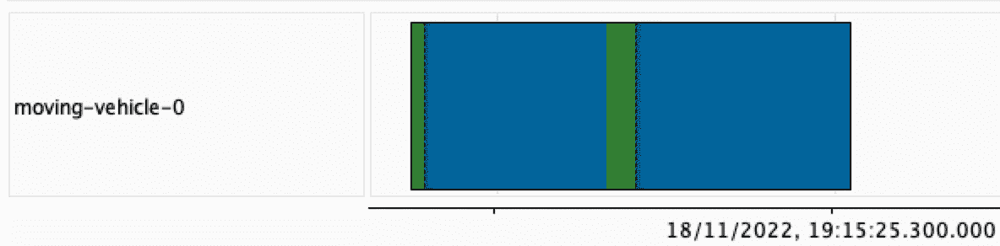

图 6.1 – 移动车辆线程显示了命令的顺序

示例中引入的组件无缝协作（*图 6**.2*）：

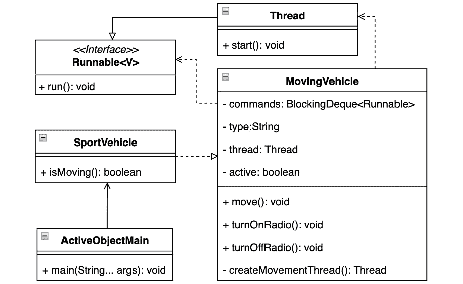

图 6.2 – UML 类图显示了 SportVehicle 类与 Java 并发特性的关系

## 结论

一个良好发展的主动对象模式尊重 SOLID 设计方法，因为它封装了关键部分，并且只暴露所需的控制接口。实例不会干扰应用程序，整个方法可以推广到期望的级别。主动对象可以是一个将并发模型引入应用程序的好候选者，但有一些挑战需要记住。其中之一是可能的应用程序线程数量，大量线程可能会使应用程序变得脆弱或导致不稳定，因为它依赖于可用资源。

让我们在下一节中探索事件的异步特性。

# 使用异步方法调用模式的无阻塞任务

异步方法调用模式是一种解决不惩罚主进程线程可能耗时任务的方法。

## 动机

异步方法调用模式引入了通过回调从异步运行的任务接收结果的能力，而不会阻塞主进程线程。该模式展示了处理所需任务类型的线程模型和并行级别。任务结果由专门的回调处理程序处理，并无论任务执行时间如何，都提供给主进程。这些处理程序可能已经属于主进程。

## 示例代码

让我们看看几个车辆温度传感器的简单场景，这些传感器需要向驾驶员提供结果，即客户端（*示例 6.4*）：

```java
public static void main(String[] args) throws Exception {
    System.out.println("Async method invocation Pattern,
        moving vehicle");
    var sensorTaskExecutor = new
        TempSensorExecutor<Integer>();
    var tempSensorCallback = new TempSensorCallback();
    var tasksNumber = 5;
    var measurements = new ArrayList<SensorResult
       <Integer>>();
    System.out.printf("""
                AsyncMethodMain, tasksNumber:'%d' %n""",
                    tasksNumber);
    for(int i=0; i<tasksNumber; i++) {
        var sensorResult = sensorTaskExecutor.measure(new
            TempSensorTask(), tempSensorCallback);
        measurements.add(sensorResult);
    }
    sensorTaskExecutor.start();
    AsyncMethodUtils.delayMills(10);
    for(int i=0; i< tasksNumber; i++){
        var temp = sensorTaskExecutor.stopMeasurement
            (measurements.get(i));
        System.out.printf("""
                AsyncMethodMain, sensor:'%d'
                    temp:'%d'%n""", i, temp);
    }
```

这里是输出：

```java
Async method invocation Pattern, moving vehicle
AsyncMethodMain, tasksNumber:'5'
SensorTaskExecutor, started:5
...
TempSensorTask,n:'4' temp:'5', thread:'thread-3'
TempSensorTask,n:'3' temp:'26', thread:'thread-0'
TemperatureSensorCallback, recorded value:'26',
  thread:'main'
AsyncMethodMain, sensor:'0' temp:'26'
…
```

示例 6.4 – 示例任务 temp:26 在线程-0 线程中异步执行

监控所有结果的 `TempSensorCallback` 实例位于 `main` 进程线程中（*图 6**.3*）：

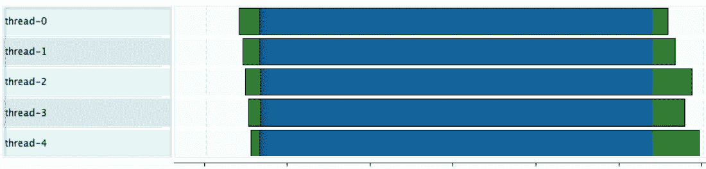

图 6.3 - 温度传感器回调实例异步调用，因此不同线程的完成时间不同

`TempSensorTask` 实例由自定义的 `TempSensorExecutor` 实例处理，它不仅提供了对启动线程的控制，还可以通过提供任务引用来终止特定传感器的长时间运行测量。`TempSensorExecutor` 实例公开了一个测量公共方法，该方法提供了一个长时间运行任务的 `TempSensorResult` 实例（*示例 6.5*）：

```java
class TempSensorExecutor<T> implements SensorExecutor<T> {
    ...
    @Override
    public SensorResult<T> measure(Callable<T> sensor,
        SensorCallback<T> callback) {
        var result = new TempSensorResult<T>(callback);
        Runnable runnable = () -> {
            try {
                result.setResult(sensor.call());
            } catch (Exception e) {
                result.addException(e);
            }
        };
        var thread = new Thread(runnable, "thread-" +
            COUNTER.getAndIncrement());
        thread.setDaemon(true);
        threads.add(thread);
        return result;
    }
}
```

示例 6.5 – 每个新的特定于线程的长期测量都会将结果传递给回调处理程序

处理由多个温度传感器提供的信息的性质显然是并行的。异步方法调用模式提供了一组非常小的类来解决这个挑战（*图 6**.4*）：

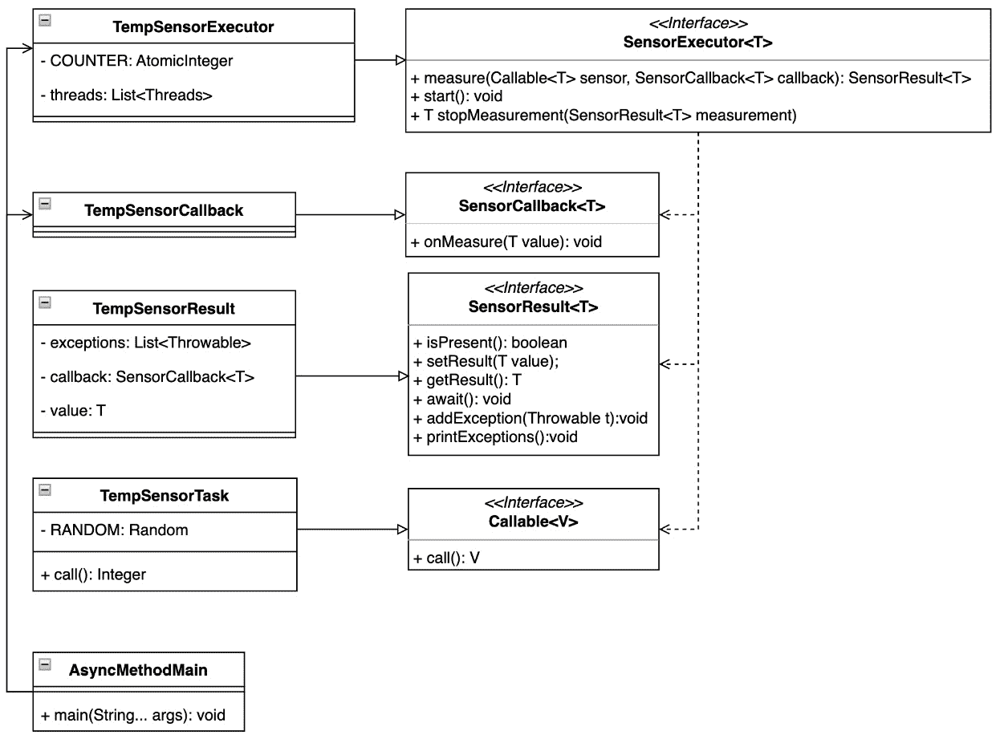

图 6.4 – UML 类图展示了如何从温度传感器获取数据

## 结论

给出的示例清楚地说明了如何通过初步与主处理线程分离来处理长时间运行的任务。换句话说，这不是由延迟引起的。Java 平台提供了多种选项来创建这种模式。其中之一是使用 `Callable` 接口，并通过其 `submit` 方法将实例发送到 `ExecutorService`。`submit` 方法返回一个实现 `Future` 接口的结果。`Future` 与示例 `TempSensorResult` 实例有相似之处，但不提供需要不同处理的回调函数。另一种可能性是使用 `CompletableFuture`，它不仅公开了 `supplyAsync` 方法，还提供了许多其他有用的函数。所有提到的建议都可以在 `java.base` 模块和 `java.util.concurrent` 包中找到。

下一个部分将展示如何延迟任务的执行，直到前一个任务完成；让我们开始吧。

# 使用 balking 模式延迟执行直到前一个任务完成

有时需要考虑任务状态的变化，以便正确执行下一个任务并实现目标。

## 动机

尽管实例的可变性不是一个理想的状态，特别是在并发领域，但依赖对象状态的能力可能会很有用。当多个线程试图获取一个对象以执行其临界区时，可以通过对象状态来限制这种情况。状态可以决定是否使用处理时间来协调可用的资源。例如，一辆车在没有运动的情况下不能停止。

## 样本代码

考虑一个`Vehicle`实例共享两组驾驶员的例子。尽管有多个小组，但一次只能有一辆车运行（**示例 6.6**）：

```java
public static void main(String[] args) throws Exception {
    System.out.println("Balking pattern, vehicle move");
    var vehicle = new Vehicle();
    var numberOfDrivers = 5;
    var executors = Executors.newFixedThreadPool(2);
    for (int i = 0; i < numberOfDrivers; i++) {
        executors.submit(vehicle::drive);
    }
    TimeUnit.MILLISECONDS.sleep(1000);
    executors.shutdown();
    System.out.println("Done");
}
```

这是输出：

```java
Balking pattern, vehicle move
Vehicle state:'MOVING', moving, mills:'75',
  thread='Thread[pool-1-thread-2,5,main]'
Vehicle state:'STOPPED' stopped, mills:'75',
  thread='Thread[pool-1-thread-2,5,main]'
Vehicle state:'MOVING', moving, mills:'98',
  thread='Thread[pool-1-thread-1,5,main]'
…
```

示例 6.6 – 驾驶员小组由 ExecutorService 提供的线程表示

双重检查锁定模式提供了一种解决方案，其中任务的临界区基于由`VehicleState`枚举表示的`Vehicle`实例状态执行（**示例 6.7**）：

```java
class Vehicle {
    synchronized void driveWithMills(int mills) throws
        InterruptedException {
        var internalState = getState();
        switch (internalState) {
            case MOVING -> System.out.printf("""
                    Vehicle state:'%s', vehicle in move,
                        millis:'%d', thread='%s'%n""",
                           state, mills, Thread
                             .currentThread());
            case STOPPED -> startEngineAndMove(mills);
            case null -> init();
        }
}
...
```

示例 6.7 – 使用 synchronized 关键字使驾驶员小组知道车辆实例是否准备好使用

驾驶员小组线程被阻塞，每次只有一个线程处于活动状态（**图 6.5**）：

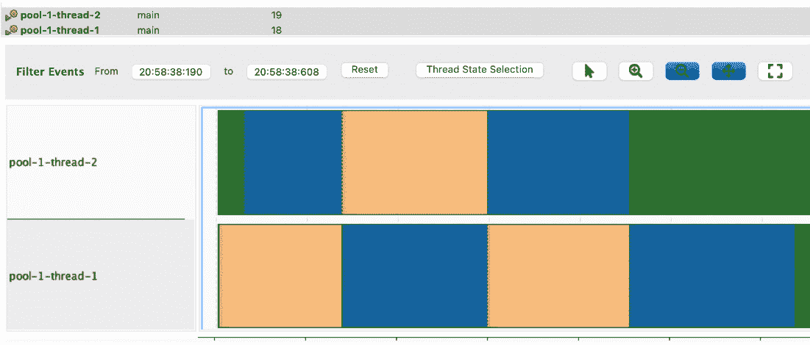

图 6.5 – 蓝色和绿色代表小组活动，而其他部分被阻塞

所提供的示例需要创建非常少的类，这些类被清晰地封装（**图 6.6**）：

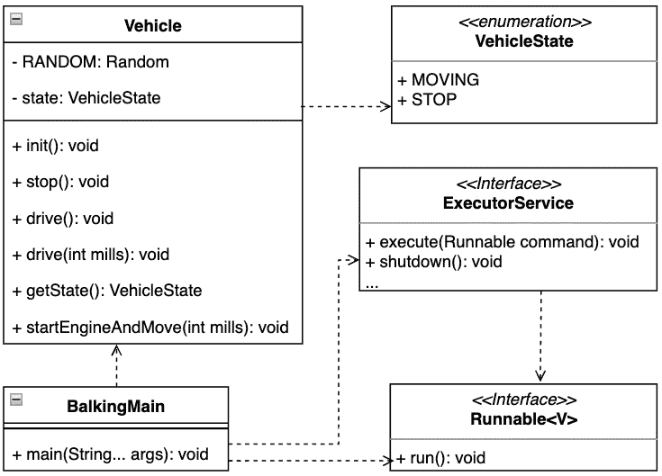

图 6.6 – UML 类图显示了两个最需要的自定义类，Vehicle 和 VehicleState

## 结论

在 Java 平台上实现双重检查锁定模式很简单。为了正确处理对象状态的不确定性，需要牢记 Java 内存模型。考虑使用原子类型（例如`AtomicInteger`和`AtomicBoolean`），这些类型自动带有 happens-before 保证。这种保证是 Java 内存模型的一部分，用于在交互线程之间保持内存一致性，正如我们在*第二章*中学习的，*探索 Java 平台以设计模式*。另一个可以考虑的选项是`volatile`关键字，它提供了线程间等值可见性的保证。

下一个部分将检查保证实例的唯一性 – 让我们开始吧。

# 提供一个具有双重检查锁定模式的独特对象实例

双重检查锁定模式解决了在运行时应用程序只需要特定类的一个实例的问题。

## 动机

Java 平台默认是多线程的，正如我们在*第二章*中学习的，*发现 Java 平台的设计模式*。不仅仅是垃圾收集线程负责主程序的生命周期。不同的框架引入了额外的线程模型，这可能会对类机构的进程产生意想不到的影响。双重检查锁定模式确保在运行时只有一个类的实例。在多线程环境中，这种状态可能变得具有挑战性，因为它可能取决于其实现。

## 示例代码

让我们用一个简单的`Vehicle`实例来演示在多线程环境中双重检查锁定模式的重要性。示例展示了单例模式的两种不同实现。`VehicleSingleton`由于多个线程访问`getInstance`方法而期望保持其承诺（*示例 6.8*）：

```java
public static void main(String[] args) {
    System.out.println("Double checked locking pattern,
        only one vehicle");
    var amount = 5;
    ExecutorService executor = Executors
        .newFixedThreadPool(amount);
    System.out.println("Number of executors:" + amount);
    for (int i = 0; i < amount; i++) {
        executor.submit(VehicleSingleton::getInstance);
        executor.submit(VehicleSingletonChecked
           ::getInstance);
    }
    executor.shutdown();
}
```

这里是输出：

```java
Double checked locking pattern, only one vehicle
Number of executors:5
VehicleSingleton, constructor thread:'pool-1-thread-1'
hashCode:'1460252997'
VehicleSingleton, constructor thread:'pool-1-thread-5'
hashCode:'1421065097'
VehicleSingleton, constructor thread:'pool-1-thread-3'
hashCode:'1636104814'
VehicleSingletonChecked, constructor thread:'pool-1-thread-
2' hashCode:'523532675'
```

示例 6.8 – VehicleSingleton 构造函数已被多次调用，这通过多次实例化违反了给定的承诺（参见 hashCode 值）

`Executors.newFixedThreadPool`提供的`ExecutorService`实例接收多个`Runnable`接口的实例。`Runnable`方法的实现代表了两种情况下`getInstance`方法调用的临界区（*图 5.5*）：

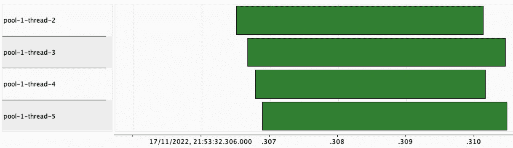

图 6.7 – 所有池线程持续执行 getInstance 方法，而 VehicleSingletonCheck 只被创建一次

两种实现方式在`getInstance`方法实现的非常小的细节上有所不同（*示例 6.9*）：

```java
public static VehicleSingleton getInstance(){
    if (INSTANCE == null){
        INSTANCE = new VehicleSingleton();
    }
    return INSTANCE;
}
...
static VehicleSingletonChecked getInstance() {
    if (INSTANCE == null) {
        synchronized (VehicleSingletonChecked.class) {
            if (INSTANCE == null) {
                INSTANCE = new VehicleSingletonChecked();
            }
        }
    }
    return INSTANCE;
}
```

示例 6.9 – VehicleSingletonChecked 的 getInstance 方法的实现使用 synchronized 关键字来确保线程栈帧状态

在这两种情况下，UML 图保持不变（*图 6.8*）：

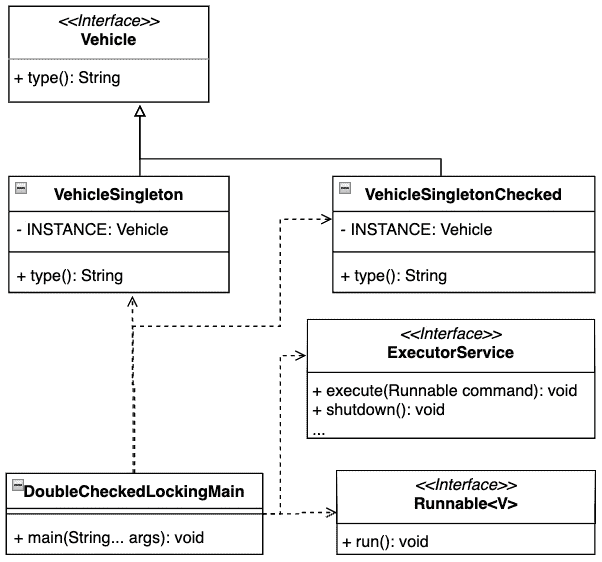

图 6.8 – UML 类图没有突出显示双重检查单例模式的实现细节

## 结论

这个例子展示了一种实现双重检查锁定模式的方法。Java 平台也可以通过使用`Enum`构造来强制执行双重检查锁定模式，它只提供一个元素 – 它的`INSTANCE`对象，这是期望的类型。

下一个部分将演示如何处理锁定独占性。

# 通过读写锁模式使用有目的的线程阻塞

并发应用程序可能会考虑仅为了更新特定实例的信息而授予临界区独占访问权限。这个特定的挑战可以通过使用读写锁模式来解决。

## 动机

读写锁模式引入了锁获取的自然排他性。此上下文用于区分是否可以执行临界区。换句话说，由于任何读者的目标都是获取尽可能准确和最新的值，因此写入操作在本质上优先于读取操作。在底层，这意味着当写入线程修改数据时，所有读者都会被阻塞，而当写入线程完成任务时，读者会被解除阻塞。

## 样本代码

假设车辆内部有多个传感器需要关于温度值的准确信息，但只有一个能够更新温度值的温度设备（*示例 6.10*）：

```java
public static void main(String[] args) throws Exception {
    System.out.println("Read-Write Lock pattern, writing
        and reading sensor values");
    ReentrantReadWriteLock readWriteLock = new
        ReentrantReadWriteLock();
    var sensor = new Sensor(readWriteLock.readLock(),
        readWriteLock.writeLock());
    var sensorWriter = new SensorWriter("writer-1",
        sensor);
    var writerThread = getWriterThread(sensorWriter);
    ExecutorService executor = Executors.newFixedThreadPool
        (NUMBER_READERS);
    var readers = IntStream.range(0, NUMBER_READERS)
            .boxed().map(i -> new SensorReader("reader-"
               + i, sensor, CYCLES_READER)).toList();
    readers.forEach(executor::submit);
    writerThread.start();
    executor.shutdown();
}
```

这是输出：

```java
Read-Write Lock pattern, writing and reading sensor values
SensorReader read, type:'reader-2', value:'50,
thread:'pool-1-thread-3'
SensorReader read, type:'reader-0', value:'50,
thread:'pool-1-thread-1'
SensorReader read, type:'reader-1', value:'50,
thread:'pool-1-thread-2'
SensorWriter write, type:'writer-1', value:'26',
thread:'pool-2-writer-1'
SensorReader read, type:'reader-2', value:'26,
thread:'pool-1-thread-3'
...
```

示例 6.10 – 运行其自身线程的`SensorWriter`实例获得对`Sensor`实例的独占访问

读取器可以连续读取传感器值而不会被阻塞。当写入者介入时，情况发生了变化 – 此时，读取者会被阻塞并必须等待`SensorWriter`实例完成（*图 6**.9*）：

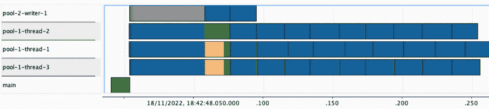

图 6.9 – 突出显示当读取线程被阻塞时写入锁排他性的线程活动

临界区由两个方法`writeValue`和`readValue`提供服务。这两个方法都属于`Sensor`类（*示例 6.11*）：

```java
class Sensor {
    ...
    int getValue() {
        readLock.lock();
        int result;
        try {  result = value; … } finally {  readLock.
          unlock(); }
        return result;
    }
    void writeValue(int v) {
        writeLock.lock();
        try { this.value = v; ...} finally {
            writeLock.unlock();}
    }
}
```

示例 6.11 – 当获取写锁时，读锁被暂停

重要的是要注意，锁实例位于执行的主线程中，并由`ExecutorService`实例提供的线程获取（*图 6**.10*）：


图 6.10 – 读写锁模式的 UML 类图

## 结论

读写锁非常强大，并且可以非常积极地促进应用程序的稳定性。它清楚地分离了参与者与驱动逻辑的临界区代码。根据请求，每个示例类都可以根据 SOLID 设计原则进行泛化或调整。

JDK 定义了另一种值得考虑的交换传感器值的方法。`java.base`模块包中的`java.util.concurrent`包含`Exchanger`类，它提供了所需的同步保证。

让我们考察另一个常见的模式，其中实例被广播到目标。

# 使用生产者-消费者模式解耦执行逻辑

常见的工业场景表示在不会阻塞主应用程序线程的情况下产生和消费值。生产者-消费者模式通过解耦逻辑和分离行来帮助解决这一挑战。

## 动机

一个常见的工业场景涉及在不阻塞主执行线程的情况下产生和消费值。生产者-消费者模式正是为了应对这一挑战而设计的，通过解耦逻辑并分离目标接收者。

## 示例代码

另一种场景是，车辆从多个来源产生多个事件，这些事件需要被广播并传递给消费者（*示例 6.12*）：

```java
public static void main(String[] args) throws Exception{
    System.out.println("Producer-Consumer pattern,
        decoupling receivers and emitters");
    var producersNumber = 12;
    var consumersNumber = 10;
    var container = new EventsContainer(3);
    ExecutorService producerExecutor =
        Executors.newFixedThreadPool(4, new
            ProdConThreadFactory("prod"));
    ExecutorService consumersExecutor = Executors.
        newFixedThreadPool(2, new ProdConThreadFactory
            ("con"));
    IntStream.range(0, producersNumber)
            .boxed().map(i -> new EventProducer(container))
            .forEach(producerExecutor::submit);
    IntStream.range(0, consumersNumber)
            .boxed().map(i -> new EventConsumer(i,container))
            .forEach(consumersExecutor::submit);
    TimeUnit.MILLISECONDS.sleep(200);
    producerExecutor.shutdown();
    consumersExecutor.shutdown();
}
```

这里是输出：

```java
Producer-Consumer pattern, decoupling mess
VehicleSecurityConsumer,event:'Event[number=0, source=pool-
prod-0]', number:'0', thread:'pool-con-0'
VehicleSecurityConsumer,event:'Event[number=1, source=pool-
prod-3]', number:'1', thread:'pool-con-1'
VehicleSecurityConsumer,event:'Event[number=3, source=pool-
prod-1]', number:'2', thread:'pool-con-0'
VehicleSecurityConsumer,event:'Event[number=2, source=pool-prod-2]', number:'3', thread:'pool-con-1'
...
```

示例 6.12 – 与生产者相比，消费者在数量上较少，不仅在数量上，而且在可用资源上

每个 `ExecutorService` 实例都使用 `ProdConThreadFactory` 对象类型来提供有意义的线程名称（*图 6**.11*）：

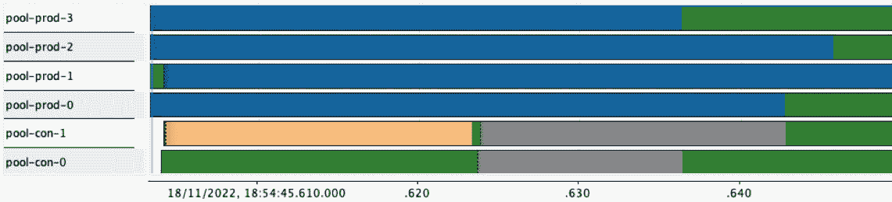

图 6.11 – 消费者数量较少，有时可能因为事件存储已满而被阻塞

参与类是解耦的，并准备好扩展（*图 6**.12*）：

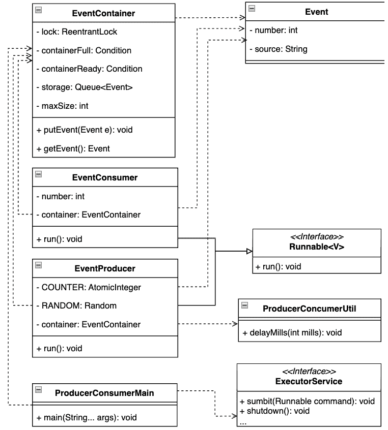

图 6.12 – UML 类图显示了事件类与 Java 平台内部的关系

## 结论

在分布式系统领域，生产者-消费者方法被广泛使用。它有利于清楚地分离和定义事件发送者和接收者组。根据所需的线程模型，这些组可以放置在不同的线程中。

JDK 19 版本带来了新增加的虚拟线程概念。虚拟线程通过引入类似线程的框架和包装器来尝试简化核心平台线程的使用。虚拟线程包装器由 JVM 调度，通过使用新添加的执行器在可用的平台线程上运行，例如，`Executors.newVirtualThreadPerTaskExecutor`。这种方法满足生产者-消费者模式，其中生产者是使用新的虚拟线程执行器应用程序，平台消耗已调度的虚拟线程。

让我们在下一节更详细地揭示调度器方法。

# 使用调度器模式执行隔离的任务

一个表现确定性的应用程序在其成功中可以发挥关键作用。调度器模式可以帮助实现预期的目标。

## 动机

尽管调度器有时设计得不好，无法让应用程序保持忙碌，但它们的主要目的是重要的。在需要系统表现出可预测性的微服务或分布式方法中，使用模式的必要性更为明显。一般的目标是确定何时执行特定任务，以便合理地使用底层资源或为在站点可靠性工程中描述的所需资源创建预算估计。

## 示例代码

以下示例将带我们进入温度测量。每辆车都包含机械或数字形式的温度传感器。温度传感器在车辆运行中起着关键作用（**示例 6.13**）：

```java
public static void main (String [] args) throws Exception {
    System.out.println("Scheduler pattern, temperature
        measurement");
    var scheduler = new CustomScheduler(100);
    scheduler.run();
    for (int i=0; i < 15; i++){
        scheduler.addTask(new SensorTask(
            "temperature-"+i));
    }
    TimeUnit.SECONDS.sleep(1);
    scheduler.stop();
}
```

这里是输出结果：

```java
Scheduler pattern, providing sensor values
SensorTask, type:'temperature-0'
,activeTime:'58',thread:'scheduler-1'
SensorTask, type:'temperature-1',
activeTime:'65',thread:'scheduler-1'
SensorTask, type:'temperature-2',
activeTime:'75',thread:'scheduler-1'
...
CustomScheduler, stopped
```

示例 6.13 – CustomScheduler 实例每隔 100 毫秒从阻塞队列中执行一个 SensorTask 实例

`CustomerScheduler` 展示了一个简单的实现，该实现管理执行过程（**图 6.14**）：


图 6.13 – 每个任务执行都分配了 100 毫秒的时间窗口

调度器实例化准备了一个带有活动标志的线程来控制生命周期（**示例 6.14**）：

```java
CustomScheduler  { ...
    CustomScheduler(int intervalMillis) {
    this.intervalMills = intervalMillis;
    this.queue = new ArrayBlockingQueue<>(10);
    this.thread = new Thread(() -> {
        while (active){
            try {
                var runnable = queue.poll(intervalMillis,
                    TimeUnit.MILLISECONDS);
                 ...
                 var delay = intervalMillis – runnable
                    .activeTime();
                TimeUnit.MILLISECONDS.sleep(delay);
            } catch (InterruptedException e) {  throw new
                RuntimeException(e); }
        }
        System.out.println("CustomScheduler, stopped");
    }, "scheduler-1");
}
...
```

示例 6.14 – CustomScheduler 确保时间窗口得到维护

创建简单调度器的任务很简单，但除此之外，还要牢记线程模型——即在何处以及如何执行（**图 6.14**）：

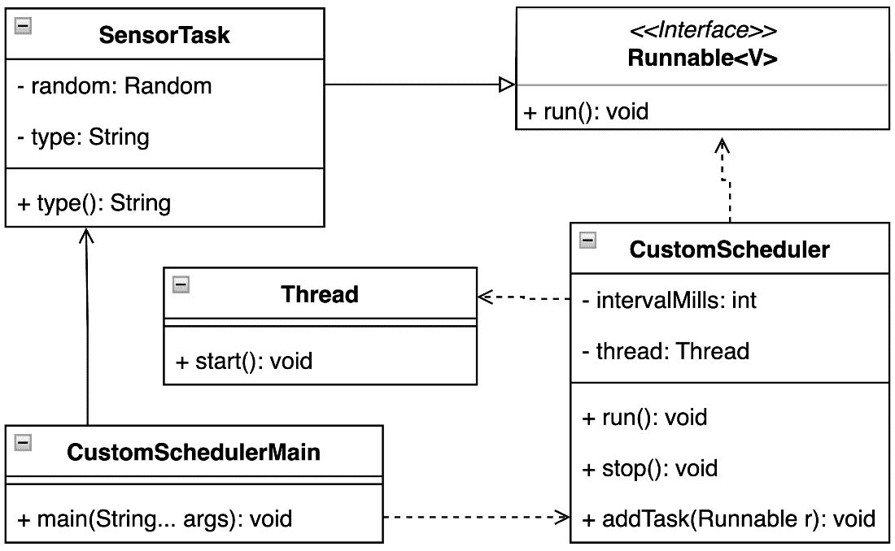

图 6.14 – UML 类图突出了 CustomScheduler 线程模型

在调度模式的情况下，提及第二个示例是公平的。第二个示例使用了内置的 JDK 函数及其定制。规划过程完全由平台管理。应用程序示例再次类似于第一个示例，温度测量（**示例 6.15**）：

```java
public static void main(String[] args) throws Exception {
    System.out.println("Pooled scheduler pattern ,
        providing sensor values");
    var pool = new CustomScheduledThreadPoolExecutor(2);
    for(int i=0; i < 4; i++){
        pool.scheduleAtFixedRate(new SensorTask
           ("temperature-"+i), 0, 50,
                TimeUnit.MILLISECONDS);
    }
    TimeUnit.MILLISECONDS.sleep(200);
    pool.shutdown();
}
```

这里是输出结果：

```java
Pooled scheduler pattern, providing sensor values
POOL: scheduled task:'468121027', every MILLS:'50'
POOL, before execution, thread:'custom-scheduler-pool-0',
task:'852255136'
...
POOL: scheduled task:'1044036744', every MILLS:'50'
SensorTask, type:'temperature-1',
activeTime:'61',thread:'custom-scheduler-pool-1'
SensorTask, type:'temperature-0',
activeTime:'50',thread:'custom-scheduler-pool-0'
POOL, after execution, task:'852255136', diff:'56'
POOL, before execution, thread:'custom-scheduler-pool-0',
task:'1342170835'
SensorTask, type:'temperature-2'
,activeTime:'71',thread:'custom-scheduler-pool-0'
...
POOL is going down
```

示例 6.15 – 间隔设置为 100 毫秒，SensorTask 实例在每个迭代中重复使用

扩展的 `CustomScheduledThreadPoolExecutor` 实例可以通过覆盖 `beforeExecute` 或 `afterExecute` 等可用方法提供基于任务执行的信息。使用 JDK 内部机制可以轻松地在线程之间扩展 `SensorTask` 实例（**图 6.15**）：

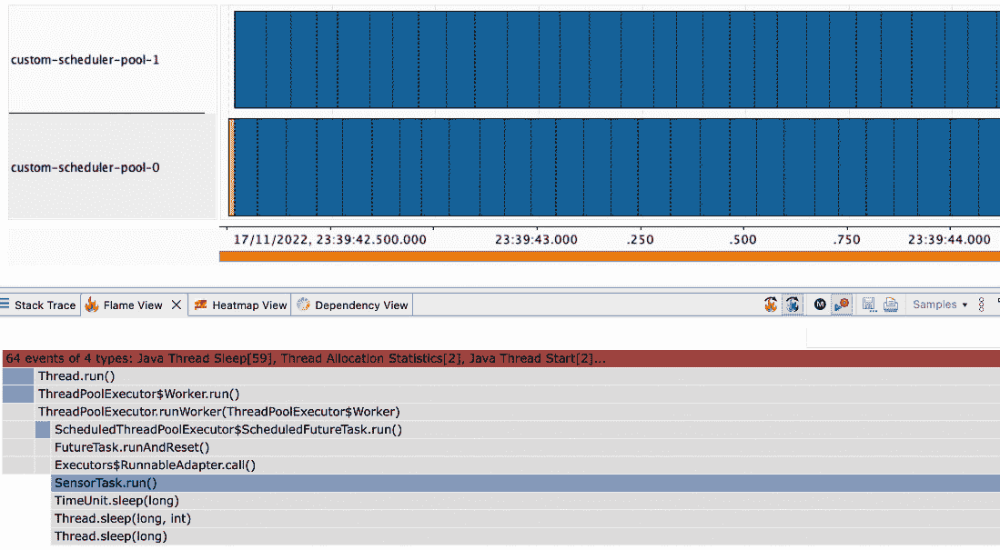

图 6.15 – CustomScheduledThreadPoolExecutor 实例简化了线程管理以及其他 JDK 内部机制的管理

利用 JDK 内部机制进行调度不需要您创建定制的解决方案，同时可以更好地了解调度周期（**图 6.16**）：

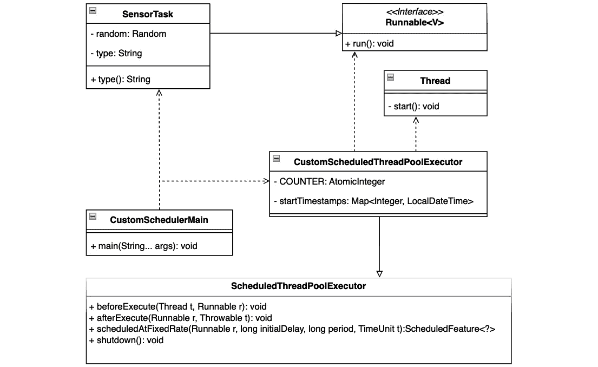

图 6.16 – UML 类图显示了创建具有所有内部机制的定制调度器所需的最小努力

## 结论

两个预设示例展示了调度器模式可能的用途。使用 JDK 内部功能有许多需要考虑的优点。它赋予平台更高效使用和优化可用资源的能力，例如我们在*第二章**，*《发现 Java 平台设计模式》*中了解到的动态 JIT 翻译。

# 使用线程池模式有效利用线程

并非每次任务都需要创建一个新的线程，因为这可能导致资源使用不当。线程池模式可能是解决这一挑战的好方法。

## 动机

短暂的任务不需要每次运行时都创建一个新的线程，因为每个线程的实例化都与底层资源的分配相关。浪费资源可能会导致应用程序吞吐量或性能惩罚。线程池模式描述了一种更好的选择，它定义了执行关键部分所需的可重用线程的数量。特定的工作者可以透明地操作需要执行的关键部分代码上方。

## 示例代码

让我们再次想象一下通过具有不同测量动态的传感器进行的温度测量（*示例 6.16*）：

```java
public static void main (String[] args) throws Exception{
    System.out.println("Thread-Pool pattern, providing
        sensor values");
    var executor = Executors.newFixedThreadPool(5);
    for (int i=0; i < 15; i++){
        var task = new TemperatureTask("temp" + i);
        var worker  = new SensorWorker(task);
        executor.submit(worker);
    }
    executor.shutdown();
}
```

这里是输出：

```java
Thread-Pool pattern, providing sensor values
TemperatureTask, type:'temp3', temp:'0', thread:'pool-1-
thread-4'
TemperatureTask, type:'temp4', temp:'7', thread:'pool-1-
thread-5'
TemperatureTask, type:'temp2', temp:'15', thread:'pool-1-
thread-3'
TemperatureTask, type:'temp1', temp:'20', thread:'pool-1-
thread-2'
..
```

示例 6.16 – 线程池按需运行工作温度测量任务

线程池有助于使用和管理创建的线程，以确保始终有任务可以处理。这有利于应用程序的行为，并便于根据可用资源进行规划（*图 6**.17*）：

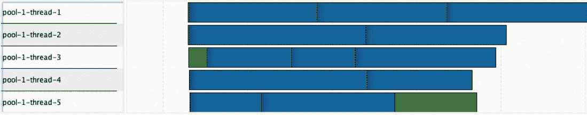

图 6.17 – 线程池的行为展示了创建的线程的使用

核心示例元素是`SensorWorker`。工作器实现了`Runnable`接口，并负责`TemperatureTask`的评估（*示例 6.17*）：

```java
class SensorWorker implements Runnable {
    ...
    @Override
    public void run () {
        try {task.measure();} catch (InterruptedException
            e) {...}
    }
}
```

示例 6.17 – SensorTask 实例可以为围绕其的任务评估提供额外的逻辑

示例实现不需要引入任何额外的自定义类类型来引入并发（*图 6**.16*）：

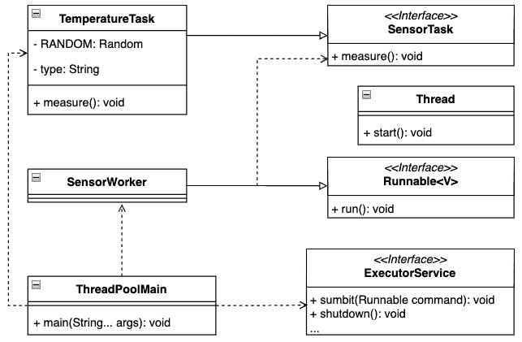

图 6.18 – UML 类图突出显示 Java 平台提供了所有所需的线程池元素

## 结论

线程池模式可以提供另一种引入并发到应用程序的可接受方式。它不仅支持继承`Runnable`接口的类类型的执行，还支持`Callable`接口。使用`Callable`接口允许您通过`Future`接口创建一个结果。将`Callable`实例执行到`Future`类型实例的结果是，关键部分的执行是由控制线程异步完成的。换句话说，产生结果所需的时间是未知的。

线程池模式也是另一种 SOLID 方法，可以正确地构建您的代码库，以确保可维护性和资源利用。

让我们简要总结本章学到的经验教训。

# 摘要

本章演示了一些解决并发问题的最常用方法。它还展示了先前获得知识的重要性，并发应用程序开发需要更多的精确性和纪律，以实现预期的结果，类似于在*第二章*中讨论的 Java 平台内部知识，*发现 Java 平台的设计模式*。

每个目前采用的模式都迫使创建一个可持续的、清洁的应用代码库。其中许多明显遵循并使用了讨论的开发方法，如 APIE 或 SOLID。

Java 平台的演变倾向于简化如何接近平台并发能力的方法。本章的一些部分已经提到了一个很好的例子。像`CompletableFuture`或`Executors`实用工具这样的功能已经存在了一段时间，但即将推出的功能可能值得考虑。虚拟线程的初步目标是提高应用程序吞吐量，同时合理利用底层资源，并仍然保持线程便利性，如调试和提供相关的堆栈帧。另一方面，结构并发试图提供一个框架，以简单设计回调，同时使用命令式代码风格。除了尝试提高应用程序吞吐量或简化并发框架使用的即将推出的功能外，我们不应忘记由`record`类型提供的实例不可变性。由于相等性，`record`类型提供了一种强大的状态合约。实例不可变性在线程交互中可以发挥关键作用。

整个应用程序开发有时会偏离预期的目标。在这种情况下，已经识别出一些常见的症状。这些信号可能会引起我们注意，重新考虑开发方向。

我们将在下一章中涉及其中的一些。

# 问题

1.  双重检查单例模式解决了哪些挑战？

1.  使用 JDK 创建所需线程池的最佳方式是什么？

1.  哪个并发设计模式反映了实例处理下一步的变异性？

1.  处理可重复任务的最佳模式是什么？

1.  哪种模式有助于分离调度逻辑和事件处理？

# 进一步阅读

+   《*设计模式：可复用面向对象软件元素*》由 Erich Gamma、Richard Helm、Ralph Johnson 和 John Vlissides 著，Addison-Wesley，1995 年

+   《*设计原则与设计模式*》由 Robert C. Martin 著，Object Mentor，2000 年

+   *JEP-425: 虚拟* *线程*，[`openjdk.org/jeps/425`](https://openjdk.org/jeps/425)

+   *JSR-428: 结构化并发（**孵化器**）* ([`openjdk.org/jeps/428`](https://openjdk.org/jeps/428))

+   《*企业应用架构模式*》由 Martin Fowler 著，Pearson Education, Inc，2003 年

+   《*有效 Java，第三版*》由 Joshua Bloch 著，Addison-Wesley，2018 年

+   *JDK 17: 类* *Exchanger* ([`docs.oracle.com/en/java/javase/17/docs/api/java.base/java/util/concurrent/Exchanger.html`](https://docs.oracle.com/en/java/javase/17/docs/api/java.base/java/util/concurrent/Exchanger.html))

+   *JDK 17: 类* *CompletableFuture* ([`docs.oracle.com/en/java/javase/17/docs/api/java.base/java/util/concurrent/CompletableFuture.html`](https://docs.oracle.com/en/java/javase/17/docs/api/java.base/java/util/concurrent/CompletableFuture.html))

+   *JDK 17: 类* *Executors* ([`docs.oracle.com/en/java/javase/17/docs/api/java.base/java/util/concurrent/Executors.html`](https://docs.oracle.com/en/java/javase/17/docs/api/java.base/java/util/concurrent/Executors.html))

+   *Java 任务* *控制* ([`wiki.openjdk.org/display/jmc`](https://wiki.openjdk.org/display/jmc))

# 答案

1.  双重检查单例模式解决的问题是在运行中的 JVM 中确保只有一个类实例存在，以避免可能的泄漏

1.  位于`java.base`模块和`java.util.concurrent`包中的`Executors`实用工具的使用

1.  拒绝模式依赖于实例状态

1.  调度器模式

1.  生产者-消费者模式是最常见的并发设计模式之一，具有清晰分离和处理的逻辑
