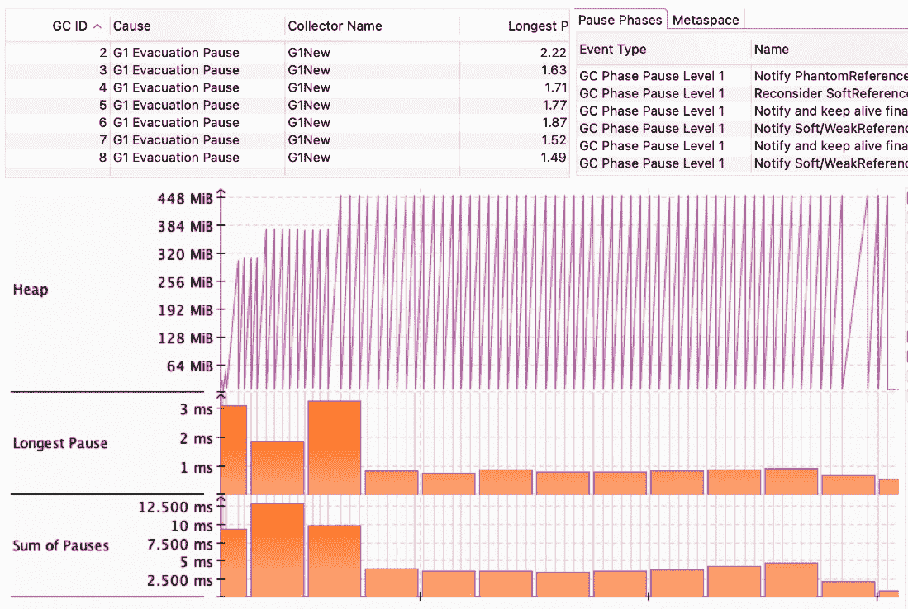
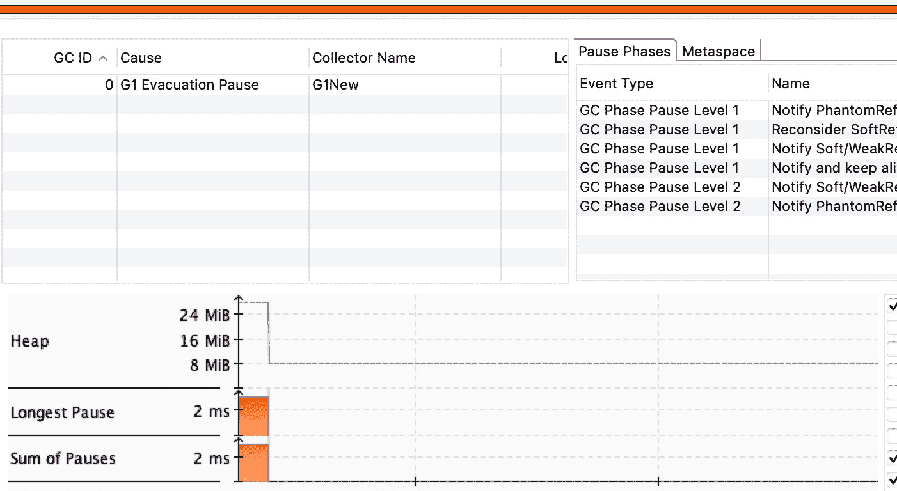
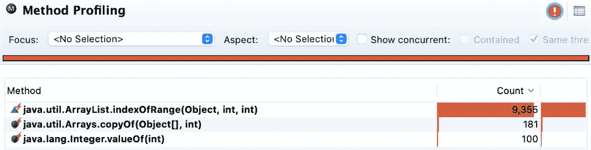
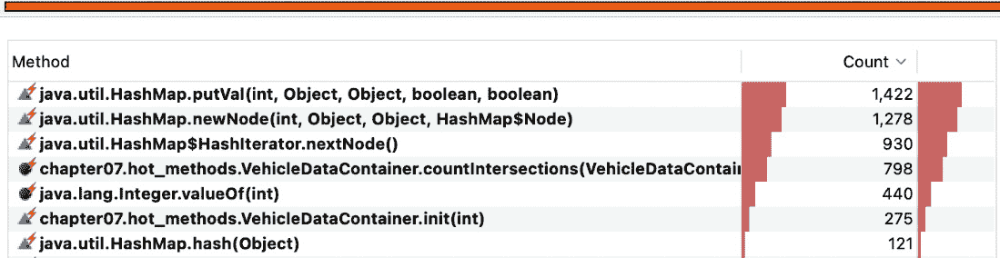

# 7

# 理解常见反模式

在前几章中，我们探讨了想象中与车辆相关的应用的*绿色工作路径*。在本章中，车辆的抽象将保持为一个辅助元素，因为人们可能比其他抽象更容易想象出受车辆启发的应用。一辆车及其所有部件，是一个容易理解的概念。

让我们快速回顾一下设计模式的重要性以及它们如何有助于组织的成功。

梅尔文·E·康威说，应用程序的设计和实现强烈反映了组织的内部沟通。这个说法在今天仍然具有同等的相关性，尤其是在许多项目使用敏捷方法的情况下。自动构建、持续集成或测试以及随后的自动化部署在将应用程序交付到生产中起着关键作用。任何被忽视或意外的限制都可能限制或损害应用程序的主要目标。

在本章中，我们将回顾一些识别偏离主要目标迹象的重要领域，以便您能够拥有功能性强、可维护和透明的应用程序。缺乏这些品质可能会在多个层面上对应用程序的功能产生负面影响。运行时可能会受损，这可能导致不可预测的成本。错误可能隐藏在应用程序架构中，不允许扩展性和可维护性。这些问题也可能反复出现，并需要在每个案例中都需要专业的关注。

我们将专注于以下领域：

+   什么是反模式以及如何识别它们

+   检查典型的软件反模式

+   理解软件架构反模式

到本章结束时，您将能够识别和理解一些应该注意的反模式迹象。

# 技术要求

您可以在 GitHub 上找到本章的代码文件，链接为[`github.com/PacktPublishing/Practical-Design-Patterns-for-Java-Developers/tree/main/Chapter07`](https://github.com/PacktPublishing/Practical-Design-Patterns-for-Java-Developers/tree/main/Chapter07)。

# 什么是反模式以及如何识别它们

一个人可能将反模式定义为优秀设计模式或良好实践的完全相反。尽管这可能看起来是底线，但它忽略了导致软件实践被称为反模式的具体背景和行动顺序。换句话说，它没有解释为什么反模式是一系列高度风险、无效和反生产性的步骤。理解这些步骤很重要，因为它们允许创建一个可重复的过程来获得类似的结果，只是为了验证其模糊性。底线是，这些步骤可能会限制有效地解决问题的能力。让我们更深入地探讨一下理论。

## 理论原则挑战

由于多种原因，反模式可能会在软件开发过程中自然出现。它们可能是由于业务逻辑的变化、技术迁移或信息缺失。事实仍然是，反模式确实存在，简单来说，由于团队规模、沟通问题等，它们可能是开发过程的一部分。

关键问题是如何识别它们。在*第一章*《进入软件设计模式》中，我们提到了违反 APIE 和 SOLID 设计原则的负面影响；这可能是考虑源代码重构响应的信号。另一种现象可能是不尊重**CAP 定理**（**一致性**、**可用性**和**分区容错性**）。开发时间可能已经投入到试图同时实现这三个属性，这是不可能的。这样的尝试可能被视为重新思考开发策略的强烈信号。

虽然 APIE 和 SOLID 的原则通常被认为是常识，但事实并非如此，尤其是在创建敏捷方法和完成任务方面。开发可能会倾向于产生持续的技术债务。这个词“持续”非常重要，因为这种债务的积累可能会导致非常不愉快的后果。

## 将技术债务作为瓶颈收集

技术债务是一个有趣的概念，因为它需要软件应用及其目标的上下文才能理解。技术债务包含一些可能一开始并不明显的属性，但可能导致严重的应用瓶颈。让我们想象一个汽车生产线，它是由多个在并行运行的各种动态下的过程组成的集合。生产线应以车辆的形式交付预期的结果。如果存在瓶颈的积累，那么结果将无法实现。这种汽车生产线的抽象相当简单，但将其应用于运行中的软件可能更困难，因为软件依赖于底层技术、平台和硬件。

Java 平台有一些必须考虑的注意事项。基本上，规则是开发者尊重平台，平台尽力为运行中的软件提供服务。

## 不恰当地挤压 Java 平台的能力

在*第二章*，*《发现 Java 平台设计模式》*中，我们讨论了诸如类型和内存模型等重要主题；不考虑这些可能被视为反模式。作为 Java 平台多线程特性的提醒，我们可以提到 Java 内存模型，它保证在多线程环境中应用程序对值的可见性。另一个可能变成反模式的是在主应用程序执行线程旁边运行的垃圾回收算法。因为 Java 应用程序与最终分配的内存空间（堆）一起工作，垃圾收集器试图确保仍有足够数量的堆内存可供使用。

获得的知识帮助我们避免与任何反模式相关的最常见误解之一：**不想要的自动装箱**，即编译器在原始类型和包装类之间自动执行转换。

自动装箱的影响初看并不明显，可能直到你的应用程序面临关键负载时才会被发现。让我们看看聚合传感器值的情况，其中每个传感器值都需要经过验证以识别警报。警报当然是由关键值的出现引起的。警报系统并行启动多个线程以验证传递的值（*示例 7.1*）：

```java
record Sensor(int value) {}
class SensorAlarmWorker implements Runnable {
    ...
    @Override
    public void run() {
        ....
        while (active) {
            ..
            Collection<Sensor> set = provider.values();
            for (Sensor e : set) {
                SensorAlarmSystemUtil.evaluateAlarm
                  (provider, e.value(), measurementCount);}
            ...
       }
    }
}
```

示例 7.1 – SensorAlarmWorker 实例尝试通过读取 Sensor 实例值来识别警告信号

车辆传感器警报系统显然必须分析其各种传感器提供的海量数据，以识别关键信号。自动装箱问题往往非常明显，因为它会导致密集和非确定性的垃圾回收（*图 7**.1*）：



图 7.1 – 繁重的垃圾回收导致明显的延迟

虽然垃圾回收的根本原因似乎已经解决，但它可能会意外出现。*示例 7.1*介绍了`Sensor`记录类，它以原始`int`类型持有整数值。当原始类型的值在传递给需要使用`Integer`包装类的`evaluateAlarm`方法时自动装箱，问题就会显现出来。让我们对`Sensor`值类型进行一行修正（*示例 7.2*）：

```java
....
static void evaluateAlarm(Map<Integer, Sensor> storage,
    Integer criticalValue, long measurementNumber) {
...
record Sensor(Integer value) {}
```

示例 7.2 – 将 Sensor 字段值更改为 Integer 类型，并与方法输入类型相对应

这次更改对整个应用程序产生了相当显著的影响，导致垃圾回收的发生非常有限。换句话说，消除了由于停止世界事件（正如我们在*第二章**，*《发现 Java 平台设计模式》*中了解到）引起的不必要的延迟，从而加快了整个应用程序的运行速度：



图 7.2 – 由于应用程序没有创建不必要的短生命周期对象，垃圾收集压力消失了

有时可以通过代码审查识别出自动装箱，这在移除代码异味反模式中起着至关重要的作用。

Java 平台包含许多有用的工具，如果使用不当，可能会导致不希望的状态。让我们在下一节中看看这些工具中的一些。

## 选择合适的工具

下一个例子乍一看可能似乎与代码异味相去甚远。Java 平台包含非常有用的工具，如果它们被正确选择和使用，可以为应用程序提供良好的服务。集合框架提供了一个很好的例子，说明了谨慎选择的重要性。第二章，“发现 Java 平台的设计模式”，回顾了常用集合类型的各个方面。这使我们看到，错误的集合选择可能会导致由于底层资源的消耗而形成瓶颈。这种问题在小数据量下可能不明显，但在更大的负载下出现，并击中应用程序的非常特定的部分。这种现象可以称为**繁忙方法**或**热点方法**（图 7.3）。



图 7.3 – 计算时间受繁忙方法执行限制

在这里，应用程序的计算工作集中在一种极其繁忙的方法执行上。`ArrayList`的`O(n)`时间复杂度与`HashSet`实例的`O(1)`时间复杂度（图 7.4）：



图 7.4 – 收集交换导致所需的计算工作分布

修正结果导致更大的应用程序吞吐量，这对于试图在旅途中评估收集数据的车辆数据分析器来说是非常理想的。

虽然代码异味并不明显，但我们之所以发现它，是因为我们使用了正确的工具。让我们总结一下从前几节中我们可以学到的东西。

## 代码异味反模式的结论

在本章中，我们发现任何试图挑战理论原则的尝试都会导致一个被称为代码异味反模式。

我们回顾了一个案例，其中未知的代码异味对应用程序的目标构成了威胁。我们讨论了在尝试解决瓶颈之前，需要在其上下文中理解每个瓶颈。在不理解重要细节的情况下移除这种瓶颈可能会导致另一个反模式和重构的无限循环，正如所展示的示例（图 7.1 和图 7.3）所示。

另一种无效的做法是在没有解决潜在的技术债务的情况下优化代码库，这可能会导致应用吞吐量下降的问题，也可能导致不希望的行为。

在继续探讨一些最著名的软件反模式之前，让我们做一些最后的考虑。任何反模式都可能是由于迁移过程中产生了技术债务，包括错误的信息。它们的出现可能是由于选择了不正确的平台工具或对 Java 编程语言背后的理论缺乏认识。由于这个话题可能会引起争议，我将留给你们自己得出结论。

# 检查典型的软件反模式

关于这个主题的文献充满了各种各样的反模式，其中一些有着非常有趣的名字，尽管它们的影响远非有趣。有时，反模式可能是由于在向同事提供经过测试、结构良好和可维护的代码时缺乏纪律。今天在这个领域中经常使用的一个术语是**清洁代码**。以下几节将探讨一些在代码库中可以找到的常见反模式，特别是方法实现中的反模式。

## 意面代码

多个因素可能导致应用程序代码库看起来非常无结构：这是代码恶臭的第一个迹象。在这种情况下，最著名的反模式之一，**意面代码**往往会出现。由于接口仍然保持一致，意面代码可能仍然被忽视，但它们的实现将包含长方法，具有相互关联的依赖关系（*示例 7.3*）：

```java
class VehicleSpaghetti {
    void drive(){
        /*
          around 100 lines of code
          heavily using the if-else construct
         */
    ...
```

示例 7.3 – 一个不清晰的 drive()方法，其中包含从引擎控制到刹车检查的所有逻辑

处于这种状态时，几乎不可能扩展应用程序或验证其功能。有时，这样的代码可能成为遗留代码，人们随后会以此为借口。这样的借口不会有助于应用程序的成功；解决方案在于重构和清理代码库。

## 剪贴板编程

这种反模式可能是最常见的之一，其中以前开发的代码被用来应对下一个挑战。这看起来像是一种聪明的代码重用，但它可能很快就会变成一个维护噩梦，因为初始的实现条件被完全忽视了。这是一个问题，尤其是当初始代码已经存在反模式倾向并且忽略了前几章中提到的原则时。为了提供良好的保护，应该明智地重用已经生成的代码。

## 块

这种模式可以在许多较老的单一系统中识别出来。如今，开发者会声称这个问题已经得到了解决。但事实并非如此确定。甚至框架也无法抵御这种反模式。一个包含最基本的神圣类集合或仅包含一个，即上帝类的包，也可能表现出这种反模式。这种反模式通常存在于被称为控制器的类中，它们控制着应用程序的整个行为。这样的控制器积累了大量具有不同功能的不同方法，意味着关注点的分离最终可能会被遗忘（*示例 7.4*）：

```java
class VehicleBlob {
    void drive(){}
    void initEngine(){}
    ...
    void alarmOilLevel(){}
    void runCylinder() {}
    void checkCylinderHead(){}
    void checkWaterPump(){}
}
```

示例 7.4 – VehicleBlob 实例尝试控制每个可能的部分

关于代码库假设可维护性的反论可能被认为是无效的，因为这样的代码可能难以测试，甚至可能无法测试。当单例设计模式被过度使用时，也可能出现类似的问题。一旦识别出 blob 反模式，就是开始思考在为时已晚之前通过重构源代码创建简单图表的大好时机。

## 火山熔岩流

清洁代码有时被用作一个深层次的术语。如今，直接将概念验证应用程序投入生产而不做进一步思考已成为一种常见的做法。当出现不兼容或可扩展性问题，这种反模式就会出现。概念验证验证了一个可能的解决方案，但这并不保证它已经根据常见的开发原则和技术为生产做好了准备。这种反模式可以通过出现长期实现类来识别，随着时间的推移，其目的已经消失，但每个人都害怕删除它们，因为可能会影响系统。这种反模式是以火山熔岩命名的，火山熔岩是一种热液，它沿着火山流下直到着火。在微服务、分布式系统和云解决方案的时代，共享功能，如库或解决方案的例子，可以考虑。当这种模式在开发过程中出现时，可能就是重新评估代码库设计的大好时机，也许可以绘制一些图表，并应用结论来减轻火灾的可能性。

## 功能分解

由于使用了现代框架以及反模式在过程语言领域的知名度更高，功能分解反模式可能看起来已经过时。但现实可能略有不同，因为许多遗留系统在没有充分理解代码库和业务逻辑的情况下进行了迁移。识别这种反模式是微不足道的，因为不可能不注意到包含许多具有单一职责、缺乏抽象和高度内聚的类的代码库。这种反模式的根本原因可能是对面向对象编程的基本原则理解不足或对应用程序目标的误解。解决方案是根据所需的抽象级别重构代码库，同时牢记编程原则。

## 船锚

有时，一个应用程序或新开发的软件可能继承了一个过时的抽象，这变得不再必要。这种抽象可能成为瓶颈，不仅因为它需要维护，而且因为它可以很容易地在代码库中广泛复制。最坏的情况可能是这种抽象在共享库或应用程序模块中的大量使用。这种反模式可能会加速应用程序代码库在各个层面的退化。

一种减轻这种情况的简单方法是在心中牢记 SOLID 设计和 APIE 原则，以允许持续重构。这使可以利用之前学到的设计模式。

## 结论

能够识别和描述一些常见的偏离已知原则和方法的偏差，为任何项目带来价值。在本小节中，我们研究了反模式并提出了保持代码库可维护和可读性的解决方案。本节最后一点是关于方法、字段和类的适当命名，这可以显著提高可读性和可维护性，并限制对 API 使用的误解。适当的命名也很重要，因为它允许对 UML 图有一个良好的理解。下一节将带我们更深入地了解源代码架构。

# 理解软件架构反模式

对类、包和模块组成的清晰理解不仅对应用程序本身至关重要，正如我们在*第二章*中学习的，“发现 Java 平台设计模式”，对平台也是如此。多亏了 JIT 编译器处理的字节码的动态翻译，Java 平台收集了有关其优化的关键信息。糟糕的代码质量和软件架构可能导致延迟、不正确的内存使用或崩溃。让我们了解可能的障碍。

## 金锤

在一段时间内应用一种经过验证的方法，而不探索替代方案，很容易变成遗留代码。难以接受其他提议或迁移的事实可能是因为一组特定的方法，也称为“黄金锤”反模式，其中开发者认为，当某事物已经连续几年运行良好时，没有必要调查对其进行的更改是否会有益。

可扩展性不仅受到前面提到的 CAP 定理的惩罚，还可能因为几乎无法在设计模块或应用程序部分之间使用而受到影响。

在你的应用架构中使用特定供应商的产品并不一定是问题。挑战在于，应用程序的开发完全依赖于供应商提供的功能和能力，而没有评估自身的功能。

一种可能的解决方案是重新评估当前的开发方法，并通过有效研究解决方案来允许改进。

## 持续过时

改进是不可避免的。今天，产品可以利用自动化部署或持续集成支持，以及各种不同的测试场景。改进的速度正在迅速增加。一个很好的例子是 Java 平台，它最近将其发布周期缩短到 6 个月。这一事实可能导致反模式的出现，因为需要重构，但另一方面，它对消除以前的缺点有巨大的影响。

持续过时反模式可以通过无法使用持续集成和交付将项目推进到下一阶段来轻松识别（*示例 7.5*）：

```java
interface VehicleCO {
    void checkEngine();
    void initSystem();
    void initRadio(); /* never used */
    void initCassettePlayer(); /* never used */
    void initMediaSystem(); /* actual logic */
}
```

示例 7.5 – VehicleCO 抽象包含需要测试的过时方法

当然，持续交付和集成的概念并不提供任何关于代码库清晰度的保证，因为它们需要遵循开发纪律。持续关注清洁代码的审查、面向对象原则和适当的模式可以大大减少持续过时的发生，并对整个应用程序架构产生重大影响。

## 输入修补

虽然一开始可能并不明显，但输入修补反模式相当常见。一个很好的例子是几个相互连接的服务，直到其中一个开始偏离其功能才进行测试。一个快速的临时解决方案产生了更多副作用，由于禁用测试而导致的长期延迟才被认识到。各种服务已经应用了比其他服务更多的补丁，因此禁用了更多测试。事实仍然是，那些禁用的测试对于维护应用程序的完整性至关重要。

解决方案可能是保持测试纪律，确保测试输入和输出有效且更新，而不是关闭必要的测试。

## 在雷区工作

完全的单一应用程序时代已经过去了。当前应用程序的分布式特性要求应用测试以实现持续交付和重构。尽管一个应用程序可能包含针对已知问题的测试，但无法保证完全的完整性。如果对应用程序进行了增强但未进行测试，会发生什么？即使是代码库中微小的贡献也可能变成一场噩梦——与这样的代码库合作就像在雷区中行走。解决问题的方案非常明显：需要进行重构。通过简化的测试将受影响的部分隔离以获得稳定性，应用所有学到的知识，并逐渐继续扩展测试库。

## 模糊的观点

在微服务和分布式系统设计方法的时代，这种反模式可能会对最终结果造成重大损害。这种反模式的持续存在可能导致洋葱架构方法，其中关注点的分离和其他 SOLID 原则成为理论而不是实践。这种反模式的一个指标是创建不明确的服务，随后是实体，用于在层之间传递冗余信息，使总体架构不明确。在早期阶段，这种反模式可以通过所提供的设计模型不支持任何 SOLID 应用程序设计原则来识别，因为这些模型由于信息不完整或模型和潜在软件设计中的不明确和重叠视角而存在。解决方案可以通过使用建模技术，如 UML，来确保视觉清晰性和源代码透明度来有效执行。

## 鬼火

这种反模式不能完全忽视。如果你能发现一些预料之外突然出现又消失的特征，就可以识别出这种反模式。这种反模式是极其复杂的抽象和实现不必要的类所导致的结果。Java 平台上有一些框架可以提供无用的功能。我们可以将 AspectJ 和 AOP 视为很好的例子，因为它们的使用可能直接导致了神秘的副作用。解决方案是重新审视和理解类层次结构以及生命周期。

## 死胡同

IT 行业的发展似乎势不可挡，随着越来越多的技术改进方法和程序的出现。因此，对系统架构中先前构建的非更新组件的依赖可能是有害的，并且可能比预期的更难移除。以 Java 版本迁移为例，继续使用旧版本不仅会失去支持，还会增加维护成本。尝试扩展应用程序也可能导致许多与应用程序可测试性相关的问题。

尽管这种死胡同反模式可以转变为可接受的软件设计，但建议考虑替代方案，因为这样做可能会带来重大成本。

## 结论

列出的并非所有反模式都是完全不好的（例如，参见黄金锤或死胡同），但通常，任何反模式在接受和记录之前都应该重新评估。

Java 是一种非常强大的语言和平台，不仅因为它允许使用实例突变，还因为它使实体能够保持其状态并保持不可变。在并发应用程序的情况下，应特别注意代码库的状态，因为这些应用程序不仅需要对软件工程师透明，还需要对 Java 平台透明，正如我们在*第二章*，“发现 Java 平台的设计模式”中所学到的。并发环境一方面带来了许多可能性和性能改进，但另一方面，它可能导致对某些设计模式（如双重检查锁定模式）的误用，这归因于对平台（而不是使用该平台的框架）的误解。

缺乏测试覆盖率、编码纪律、信息或能力也可能显著导致反模式的出现。从代码库架构的角度来看，验证正确实现的函数可能变得不可能，或者对模拟或调试造成额外复杂性。一般来说，透明的代码架构是成功应用程序的关键之一。让我们回顾一下我们所学的所有内容。

# 摘要

了解反模式和它们的识别方法可以对应用程序的可行性产生重大影响，尤其是在分布式系统方面。本章已表明，如果对 Java 平台及其工具了解不够充分，可能会导致意外结果，例如在副线程上运行的垃圾收集算法承受巨大压力，以及错失优化机会。认识到 Java 平台的并发特性可以导致适当的代码结构，但同时也需要正确使用不可变性以实现持续的应用程序开发，即重构。

由于大多数反模式的一个根本原因就是缺乏测试，因此测试环境可能是确定反模式发生或重构需求的最佳起点。编译后的测试代码不位于部署代码中，这使得测试代码成为未来探索和理解应用程序行为的最佳起点。

Java 平台和其他使用的库变化迅速，维护应用程序代码库的关键之一是正确使用开闭原则。它使持续重构成为可能，这对于健康代码库的演变至关重要。

反模式是应用程序生命周期的一部分。它们存在，并且可以以各种形式存在，以促进进步。可能不值得完全移除它们；可能更好的方法是要理解它们，并使代码库达到期望的状态，同时持续解决已知的限制。在整个应用程序的开发周期中，将进行改进，编写代码将变成一个愉快的体验，许多挑战都将得到解决。

虽然 Java 平台仍面临挑战，但它仍然是一块美丽的软件，它同时使用了数学、统计学和概率科学！

恭喜您成功完成这本书。因为每个结束都带来一个新的开始，我鼓励您保持灵感和渴望，并在编码或设计软件中享受很多乐趣！保持您的思想开放，让它成为有价值信息的来源。

诚挚地，米罗·温格纳（Miro Wengner）！

# 进一步阅读

+   《*设计模式：可重用面向对象软件的元素*》由埃里希·伽玛（Erich Gamma）、理查德·赫尔姆（Richard Helm）、拉尔夫·约翰逊（Ralph Johnson）和约翰·弗利斯（John Vlissides）著，Addison-Wesley，1995

+   《*设计原则与设计模式*》由罗伯特·C·马丁（Robert C. Martin）著，Object Mentor，2000

+   《*反模式：重构软件、架构和危机项目*》由威廉·J·布朗（William J. Brown）、拉斐尔·C·马尔维乌（Raphael C. Malveau）、海斯·W·麦科密克三世（Hays W. McCormick III）和托马斯·J·莫布里（Thomas J. Mowbray）著，约翰·威利与 Sons, Inc, 1998

+   《*CAP 十二年后：规则如何改变*》，[`www.infoq.com/articles/cap-twelve-years-later-how-the-rules-have-changed`](https://www.infoq.com/articles/cap-twelve-years-later-how-the-rules-have-changed)，2012

+   《*凤凰项目：一部关于 IT、DevOps 和帮助您的业务获胜的小说*》由吉恩·金（Gene Kim）、凯文·贝赫（Kevin Behr）和乔治·斯帕福德（George Spafford）著，IT 革命出版社，2016

+   《*委员会如何发明？*》由梅尔文·爱德华·康威（Melvin Edward Conway）著，Datamation 14，第 5 页，第 28-31 页，1968

+   《*任务控制* 项目》，[`github.com/openjdk/jmc`](https://github.com/openjdk/jmc)

# 评估

# 第一章 – 进入软件设计模式

1.  编译器将 Java 代码编译成字节码，分别由 JVM 和 JRE 执行（参见图 1.3）。

1.  它指的是抽象、多态、继承和封装。

1.  方法重写和方法重载。

1.  SOLID 原则：单一职责原则、开闭原则、里氏替换原则、接口隔离原则和依赖倒置原则。

1.  程序应该对扩展开放，对修改封闭。

1.  设计模式代表了常用问题和解决方案的集合，以产生可维护的软件。

# 第二章 – 发现 Java 平台的设计模式

1.  **Java 虚拟机**（**JVM**）、**Java 运行时环境**（**JRE**）和**Java 开发工具包**（**JDK**）。

1.  Java 是一种静态类型语言，这意味着任何值在可以分配给值之前都需要声明。

1.  3. 原始类型：`boolean`、`byte`、`short`、`char`、`int`、`float`、`long`和`double`。

1.  垃圾收集器。

1.  `Queue`、`Set`和`List`。

1.  键值对。

1.  在 O-notation O(1)。

1.  在 O-notation O(n)。

1.  `Predicate<T>`的返回类型是原始类型，`boolean`。

1.  Java Stream API 中的元素流是延迟评估的。

# 第三章 – 与创建型设计模式一起工作

1.  创建型设计模式通过将其委托给应用程序的负责部分来帮助抽象对象实例化过程。

1.  2. 为了减少创建新对象的成本，可以考虑使用依赖注入、延迟初始化和对象池模式。

1.  JVM 中只需要存在一个实例。

1.  建造者模式有助于创建类似对象类型的配置，同时减少构造函数的数量。

1.  应该考虑工厂方法模式或抽象工厂模式，因为两者都可以在不向客户端暴露逻辑的情况下组合复杂对象。

1.  对象池设计模式引入了一个已创建和可重用对象的缓存，而不是分配和销毁新实例。

1.  创建特定家族对象最有用的模式是工厂方法模式。

# 第四章 – 应用结构设计模式

1.  1. 结构设计模式定义了对象之间的通信。这些模式支持实现灵活性和透明性。

1.  GoF 作者组描述的结构设计模式包括适配器、桥接、组合、代理、享元、外观和装饰器模式。

1.  组合结构设计模式，同时也保证了对象处理的统一性。

1.  标记模式，充分意识到其缺点。

1.  代理模式需要考虑，因为适配器和外观模式有略微不同的目的。

1.  桥接模式。

# 第五章 – 行为设计模式

1.  在*第一章*中探讨的 Liskov 替换原则，*进入软件* *设计模式*。

1.  迭代器模式。

1.  是的 – 策略模式。

1.  这是空对象模式，它提供了此类状态的类型，并限制了空指针异常的原因。

1.  这可以是管道模式，`map()`和`filter()`方法的策略模式，或者空对象模式。

1.  可以通过使用观察者模式来通知所有客户端，该模式还透明地控制条件。

1.  可以使用命令模式。命令由一个唯一的对象表示。对象允许客户端传递参数，并且可以轻松调用回调函数。

# 第六章 – 并发设计模式

1.  双重检查单例模式解决的问题是在运行中的 JVM 中确保只有一个类实例存在，以避免可能的泄漏。

1.  使用位于`java.base`模块和`java.util.concurrent`包中的`Executors`实用程序。

1.  阻塞模式取决于实例状态

1.  调度模式

1.  生产者-消费者模式是其中最常见的一种并发设计模式，其逻辑被明确分离和解决
