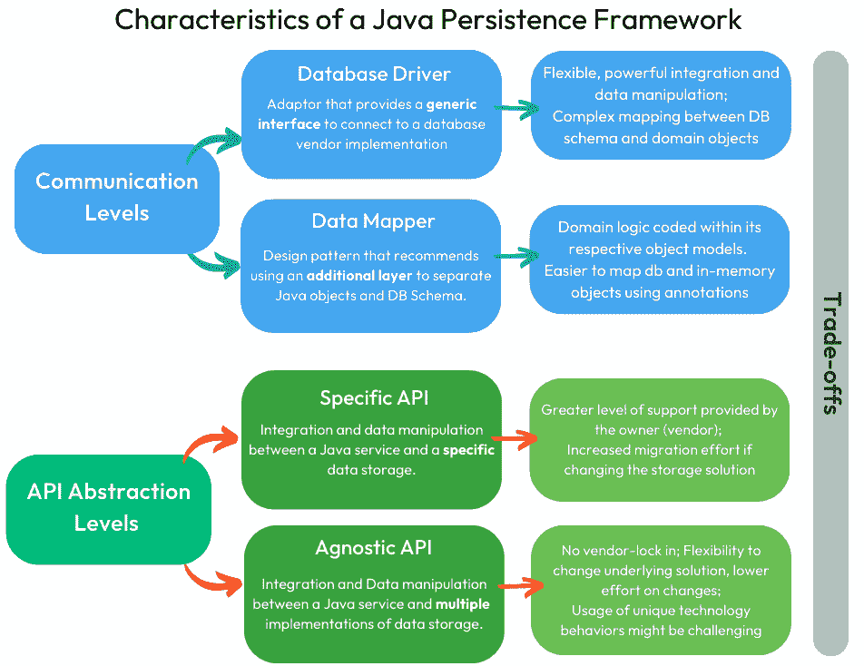
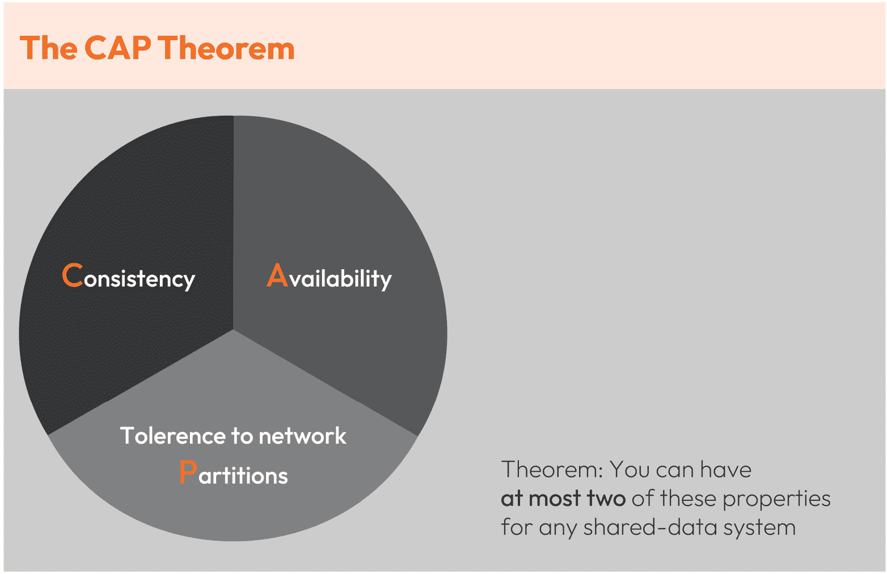

# 第一章：数据存储的历史——从洞穴到云端

数据：一个关键、改变生活、根本的资产，它支持人类的生存和进化。数千年来（是的，数千年！），数据存储解决方案已经演变并支持人类，使我们能够以简单、易于维护和可搜索的方式“记住”和分享知识。数据转化为信息，进而转化为知识。从过去学习并规划未来的能力高度受到我们今天在系统中管理数据的方式的影响。

软件工程师是这一过程的催化剂：我们的责任是通过软件工程定义和交付解决方案，以解决人们的问题——这些解决方案大多围绕大规模或小规模的数据操作。在理解了持久性在软件工程中的重要性之后，你就可以将你解决方案的持久性提升到下一个层次。

在本章中，我们将探讨现代时代，数据库已经成为我们应用程序和整个地球的支柱。我们将涵盖以下主题：

+   数据库为何存在？数据库的历史

+   Java 持久性框架的特点

+   云对有状态解决方案的影响

+   探索分布式数据库系统的权衡——对 CAP 定理及其超越的探讨

本章首先为你提供对数据存储技术过去和当前状态的理解，然后转向更高级的主题。这将为你提供一个更好的工作基础。你将学习数据存储技术如何应对市场的云迁移心态。最后，你将熟悉诸如**领域驱动设计**（**DDD**）等实践，这些实践与良好的持久性开发实践完美结合，以及分布式世界中分布式数据系统面临的挑战，例如 CAP 定理。

# 数据库为何存在？

没有深入研究人类历史，就不可能全面理解数据库。人类渴望在时间流逝中保存知识，这使得写作成为最持久的技术之一。回顾过去，它最初被用于寺庙和洞穴，这可以被认为是人类第一个非计算数据库。

今天，行业强调准确和详尽的记录信息。事实上，越来越多的人获得技术访问权限并加入全球信息网络的结果反映在研究上，表明数据量每两年翻一番。

现代数据库的历史始于 1960 年，当时查尔斯·巴科曼为计算机设计了第一个数据库，即**集成数据存储**，或**IDS**，它是 IBM 的**信息管理系统**（**IMS**）的前身。

在那之后的十年，大约在 1970 年，数据库历史上最重大的事件之一发生，当时 E. F. Codd 发表了其论文《大型共享数据库的数据关系模型》，创造了**关系数据库**这一术语。

最后，在数据存储方面的下一个，也许是最新的突破是 NoSQL，它指的是任何非关系型数据库。有人说**NoSQL**代表*Non-SQL*，而另一些人则说它代表*Not Only SQL*。

NoSQL 数据库为一些最受欢迎的在线应用程序提供动力。以下是一些：

+   **谷歌**：谷歌使用 NoSQL Bigtable 为 Google Mail、Google Maps、Google Earth 和 Google Finance 提供服务

+   **Netflix**：Netflix 喜欢 NoSQL 数据库的高可用性，并使用 SimpleDB、HBase 和 Cassandra 的组合

+   **优步**：优步使用 Riak，这是一个具有灵活键值存储模型的分布式 NoSQL 数据库

+   **领英**：领英构建了自己的 NoSQL 数据库，名为 Espresso，这是一个面向文档的数据库

## 处理数据的挑战

数据库系统的演变在几十年中由关键里程碑所标记。在早期，当存储成本高昂时，挑战在于找到减少信息浪费的方法。减少价值一百万美元的信息就是一个重大的成就。

你知道吗？

在数据库时代的黎明时期，兆字节的成本曾经高达约 500 万美元！

[`ourworldindata.org/grapher/historical-cost-of-computer-memory-and-storage`](https://ourworldindata.org/grapher/historical-cost-of-computer-memory-and-storage)

现在，兆字节的成本不再是挑战，因为我们生活在一个 0.001 美元/MB 的成本时代。随着时间的推移和存储成本的降低，减少重复数据的手段开始对应用程序的响应时间产生负面影响。规范化以及减少数据重复、多个连接查询和大量数据尝试并没有起到太大的帮助。

对这一模型提出挑战并不令人惊讶。正如备受尊敬和尊敬的书籍《软件架构基础》的作者所指出的（[`www.amazon.com/dp/1492043451/`](https://www.amazon.com/dp/1492043451/)），没有明确的解决方案；相反，我们面临的是许多解决方案，每个解决方案都伴随着其自身的优点和缺点。

显然，这一点也适用于数据库。

*在数据存储解决方案方面，没有一种适合所有情况的解决方案*。

在 2000 年代，新的存储解决方案，如 NoSQL 数据库，开始变得流行，架构师有更多的选择。这并不意味着 SQL 不再相关，而是说架构师现在必须应对选择每个问题的正确范例的复杂性。

随着数据库领域经历了这些阶段，应用程序的场景也发生了变化。讨论转向了采用微服务架构风格的动机和挑战，这使我们回到了多种持久性策略。传统上，架构包括关系型数据库解决方案，通常有一个或两个实例（考虑到其增加的成本）。现在，随着新的存储解决方案的成熟，架构解决方案开始包括基于 NoSQL 数据库的持久性，扩展到多个运行实例。在多个服务中存储数据，这些服务组成一个更广泛解决方案的可能性，为具有多语言持久性的潜在新解决方案提供了一个良好的环境。

**多语言持久性**是指计算机应用程序可以使用不同的数据库类型，利用各种引擎系统更适合处理不同问题的这一事实。复杂的应用程序通常涉及不同类型的问题，因此为每一项工作选择合适的工具可能比试图使用单一解决方案解决问题的所有方面更有效率。

在分析最近时期的大部分解决方案时，现实情况使我们开发者、架构师面临选择的复杂性。我们如何处理数据，必须考虑一个具有多种数据类型的场景？为了清楚起见，我们正在谈论混合和匹配数百种可能的解决方案。最佳途径是通过学习持久性基础、最佳实践和范式来做好准备。最后，意识到无论我们多么渴望一个快速、可扩展、高度可用、精确且**一致**的解决方案——我们现在知道，根据 CAP 定理，一个在本书后面章节讨论的概念，这可能是不可能的。

接下来，我们将我们的关注点具体缩小到 Java 应用程序中的持久性。

# Java 持久性框架的特点

让我们掌握 Java 语言和可用的多个数据库之间的差异概念。Java 是一种**面向对象编程**（**OOP**）语言，自然提供了诸如继承、封装和类型等特性，这些特性支持创建良好的代码。不幸的是，并非所有这些特性都得到数据库系统的支持。

因此，当整合语言和数据库范式时，它们的一些独特优势可能会丢失。当我们观察到在内存对象和数据库模式之间的所有数据操作中，都应该有一些数据映射和转换时，这种复杂性变得明显。定义一个首选方法或提供一个隔离层是至关重要的。在 Java 中，通过使用框架来整合这两个世界的最系统化方式是使用框架。框架的类型和类别由它们的**通信级别**和**提供的 API 动态性**决定。在*图 1.1*中，观察这两个概念的关键方面：

图 1.1 – 关于 Java 持久性框架不同特性的考虑

+   **通信级别**：定义代码与数据库或面向对象范式之间的无关性。代码可以被设计得与两个领域中的一个更相似。为了澄清，考虑两种常见的将 Java 应用程序与数据库集成的途径 – 直接使用数据库驱动程序或依赖映射模式：

    +   直接采用驱动程序（例如，JDBC 驱动程序）意味着更接近数据库领域空间的工作。一个易于工作的数据库驱动程序通常是面向数据的。一个缺点是需要更多的样板代码，以便能够将数据库模型和 Java 领域对象之间所有操作的数据进行映射和转换。

    +   映射模式提供了使用完全相反的方法将数据库结构映射到 Java 对象的可能性。在诸如 Hibernate 和 Panache 这样的映射框架的上下文中，主要目标是更紧密地与面向对象范式对齐，而不是主要关注数据库。虽然提供了减少样板代码的好处，但它作为权衡，需要与持续存在的对象关系阻抗不匹配及其随之而来的性能影响共存。这个主题将在后续章节中更详细地介绍。

+   **API 抽象级别**：在数据操作和其他数据库交互期间，为了在 Java 和数据库之间进行某些级别的翻译，开发者依赖于特定的 Java API。为了阐明 API 的抽象级别，例如，你可以问：“一个特定的数据库 API 支持多少种不同的数据库类型？”当使用 SQL 作为关系数据库集成的标准时，开发者可以使用一个 *单一 API* 并将其与 *所有* 关系数据库版本集成。有两种类型的 API：

    +   特定 API 可能会提供来自供应商的更准确的更新，但这同时也意味着，如果你想要切换到不同的数据库（例如，Morphia 或 Neo4j-OGM – **OGM** 代表 **对象** **图** **映射器**），任何依赖于该 API 的解决方案都需要进行更改。

    +   一个无差别的 API 更灵活，可以与许多不同类型的数据库一起使用，但管理每个数据库的更新或特定行为可能更具挑战性

代码设计– DDD 与面向数据

在著名的书籍《代码整洁之道》中，作者被称为 Uncle Bob，他提出面向对象编程语言具有隐藏数据以展示其行为的优势。沿着同样的思路，我们看到领域驱动设计（DDD），它提出了在整个领域代码和相关通信中使用通用语言的建议。实现这一建议可以通过使用面向对象的概念来完成。在《面向数据编程》中，Yehonathan Sharvit 建议通过赋予数据相关性并将其视为“一等公民”来简化复杂性。

幸运的是，有几个框架可以帮助我们应对提供高性能持久层所面临的挑战。尽管我们理解更多的选择会带来选择的悖论，但无需担心——这本书是软件工程师可以用来学习如何在软件架构中评估多个视角的有用资源，特别是数据存储集成和数据操作空间中的细节。

到目前为止，我们已经探讨了人类为解决一个基本问题而设计的各种方法：以确保长期性和作为支持我们进化的知识库的方式高效地存储数据。随着技术的进步，多种持久策略已经提供给软件架构师和开发者，包括关系型和无结构的方法，如 NoSQL。持久性选项的多样性导致了软件设计中的新挑战；毕竟，检索、存储和使数据可用也经历了应用层的创新。自那时起，至今，持久性框架为架构师提供了不同的策略，使得设计与底层数据库技术紧密相关或更加动态和无关紧要。

我们这次数据库历史之旅的下一站是云时代。让我们探讨云服务如何影响应用程序以及数据现在可以存储的方式和位置。

# 云对有状态解决方案的影响

当涉及到数据库时，专业人士除了需要基础设施和软件架构的视角外，还需要具备运营视角。在解决方案的架构和所需合规性方面，有几个因素需要考虑，例如网络、安全、云备份和升级。

幸运的是，我们可以利用云服务。作为一个与技术相关的概念，云已经被**国家标准与技术研究院**（**NIST**）定义为一种模型，它通过网络按需提供共享的计算资源，这些资源可以快速提供。

你可能已经在技术社区中听到过一个笑话，说“云只是别人的电脑”。然而，我们认为云不仅仅是这样；我们更喜欢以下这样的看法：

云是别人的问题。

采用云服务的主要目标是外包非核心业务功能给其他人。这样，我们可以专注于我们的核心竞争力。

小贴士

随着你阅读这本书，你会注意到使用了几个缩写。在本章中，我们主要指的是以下云服务提供类型：**基础设施即服务**（**IaaS**）、**平台即服务**（**PaaS**）和**软件即服务**（**SaaS**）。

尽管你可能觉得云服务最终可能是解决你经历过的许多技术问题的解决方案，但请记住，委托的责任和任务也有可能与你预期的截然不同——例如，服务崩溃或成本激增。由于我们正在讨论“将问题委托给他人”的行为，以下是三种类型的云服务（三种“委托”方式）及其相应的目标受众：

+   **IaaS**：基础设施不是你的问题。目标受众是从事运营方面工作的人，例如 SREs。

+   **PaaS**：基础设施和运营不是你的问题。主要的目标受众是软件工程师。

+   **SaaS**：基础设施、运营和软件都不是你的问题。在这种情况下，目标受众是最终用户，他们不一定知道如何编码。

正如我们在这章中之前指出的，*每个解决方案的权衡都必须考虑*。以选择 PaaS 云服务为例：这种模型以更高的抽象层次为代价，换取了更高的价格标签。

那么，关于数据存储的云服务怎么办呢？正如 Dan More 在《97 Things Every Cloud Engineer Should Know》一书中所指出的（[`www.amazon.com/dp/1492076732`](https://www.amazon.com/dp/1492076732)），数据库也可以用作托管云服务。查看托管数据库服务时，你可以考虑其他人（供应商）将提供一项服务，以抽象化大部分（在某些情况下，全部）数据库基础设施和管理任务。

**数据库即服务**（**DBaaS**）是一种流行的云服务类型，允许用户从多个地区运行的不同数据库类型中选择。

当我们需要探索各种架构持久化解决方案并委托复杂性时，云服务可以很有帮助。它们已被广泛采用，并证明在满足这一目的方面是有效的。

随着云服务和微服务架构的采用，分布式解决方案变得越来越普遍。因此，架构师必须处理与数据完整性相关的新挑战，以及必须满足此类要求的应用程序中数据不一致的意外发生。

# 探索分布式数据库系统的权衡——对 CAP 定理及其超越的探讨

如果要描述完美的**分布式数据库系统**（**DDBS**），它肯定是一个高度可扩展、提供完美一致数据且在管理方面不需要过多关注的数据库（例如备份、迁移和网络管理）。不幸的是，埃里克·布赖尔提出的 CAP 定理表明这是不可能的。

注意

到目前为止，还没有数据库解决方案能够提供总数据一致性、高可用性和可扩展性等特性的理想组合。

有关详细信息，请参阅：*迈向健壮的分布式系统*。PODC. 7\. 10.1145/343477.343502 (https://www.researchgate.net/publication/221343719_Towards_robust_distributed_systems)。

**CAP 定理**是理解 DDBS 不同属性之间权衡的一种方式。埃里克·布赖尔在 2000 年分布式计算原理（**PODC**）研讨会上推测，在创建 DDBS 时，“对于任何共享数据系统，你最多只能拥有这些属性中的两个，”指的是属性**一致性**、**可用性**和**对网络分区的容错性**。

图 1.2 – 受埃里克·布赖尔主题演讲启发的表示

注意

*迈向健壮的分布式系统*。有关埃里克·布赖尔工作的更多信息，请参阅布赖尔，埃里克。（2000），演讲：[`people.eecs.berkeley.edu/~brewer/cs262b-2004/PODC-keynote.pdf`](https://people.eecs.berkeley.edu/~brewer/cs262b-2004/PODC-keynote.pdf)。

CAP 定理中描述的三个特性可以描述如下：

+   **一致性**：保证分布式集群中的每个节点返回相同的、最新的、成功的写入。

+   **可用性**：每个非失败节点在合理的时间内对所有的读取和写入请求返回响应。

+   **分区容错性**：系统即使在网络分区的情况下也能继续运行并保持其一致性保证。换句话说，即使在崩溃、磁盘故障、数据库、软件和操作系统升级、停电和其他因素下，服务仍在运行。

换句话说，我们可以选择和选择的 DDBS 只会是**CA**（一致且高度可用）、**CP**（一致且容错）或**AP**（高度可用且容错）。

小贴士

正如书中《软件架构基础：工程方法》所强调的，良好的软件架构需要处理权衡。这又是需要考虑的一个权衡点([`www.amazon.com/Fundamentals-Software-Architecture-Engineering-Approach-ebook/dp/B0849MPK73/`](https://www.amazon.com/Fundamentals-Software-Architecture-Engineering-Approach-ebook/dp/B0849MPK73/))。

通过考虑 CAP 定理，我们就可以将这一新知识应用于决策过程中，帮助我们选择 SQL 和 NoSQL。例如，传统的数据库管理系统（DBMS）在（主要）提供**原子性、一致性、隔离性和持久性**（**ACID**）属性时表现良好；然而，在分布式系统中，为了实现更高的可用性和更好的性能，可能需要放弃一致性和隔离性。这通常被称为为了可用性牺牲一致性。

在 CAP 理念提出后的近 12 年后，麻省理工学院的 Seth Gilbert 和 Nancy Lynch 发表了一些研究，对布赖尔定理进行了形式化的证明。然而，另一位数据库系统架构和实现方面的专家也对可扩展和分布式系统进行了一些研究，为现有的定理增加了对一致性和延迟权衡的考虑。

2012 年，Daniel Abadi 教授发表了一项研究，指出 CAP 已被“越来越误解和误用，造成了重大损害”，导致不必要的**分布式数据库管理系统**（**DDBMS**）创建受限，因为 CAP 只针对某些类型的故障提出了限制——而不是在正常操作期间。

Abadi 的论文《现代分布式数据库系统设计中的一致性权衡》提出了一种新的公式，**性能和一致性弹性能力**（**PACELC**），认为可以通过使用弹性来管理一致性和性能之间的权衡。论文中引用的以下问题阐明了主要思想：“如果存在分区（P），系统如何权衡可用性和一致性（A 和 C）；否则（E），当系统在没有分区的情况下正常运行时，系统如何权衡延迟（L）和一致性（C）？”

根据 Abadi 的说法，分布式数据库可以在某些条件下既高度一致又高度性能，但只有当系统能够通过使用弹性根据网络条件调整其一致性级别时。

到这一点，构建数据库系统的复杂性，尤其是分布式数据库，已经变得非常清晰。作为负责评估和选择 DDBS 以及在其之上设计解决方案的专业人士，对这些研究中讨论的概念有基本理解，对于做出明智的决策是一个宝贵的基石。

# 摘要

任何软件应用程序都高度依赖于其数据库，因此给它应有的关注是很重要的。在本章中，我们探讨了数据存储的有趣历史，从其早期到云计算的现代化时代。在整个旅程中，我们见证了数据存储演变对软件工程领域的影响，以及 Java 框架是如何演变以支持多语言解决方案的。作为经验丰富的软件工程师，了解数据及其有效管理和操作的重要性对我们至关重要。

此外，我们还讨论了关系型数据库的挑战，例如数据冗余和规范化，以及如何出现 NoSQL 数据库来处理非结构化数据需求。我们介绍了 CAP 定理，并提到了额外的研究，如 PACELC，来解释实现分布式数据存储解决方案的挑战。

随着我们继续阅读本书，我们将深入了解高级架构和开发实践、挑战以及权衡，这些是你必须了解的，以便为现在及以后你将与之合作的每个解决方案提供最佳持久层，相关于数据持久性。在查看数据库与 Java 之间的历史、动机和关系之后，准备好在下一章中探索不同类型的数据库及其优缺点。
