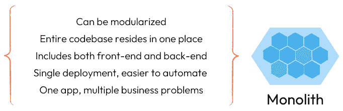
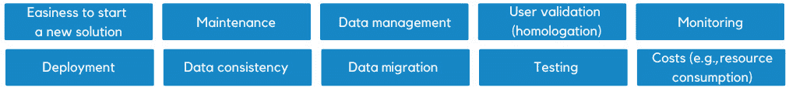
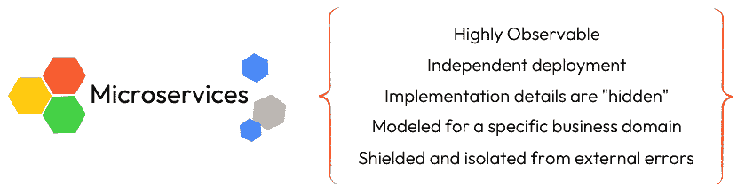
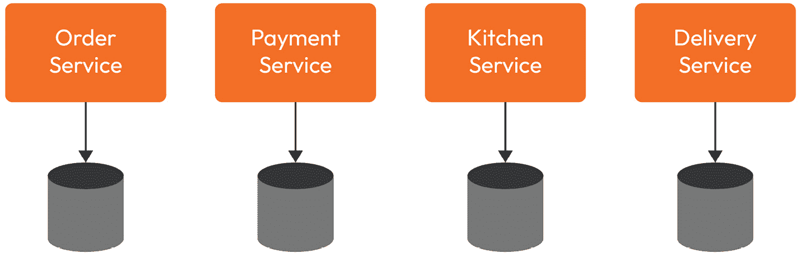
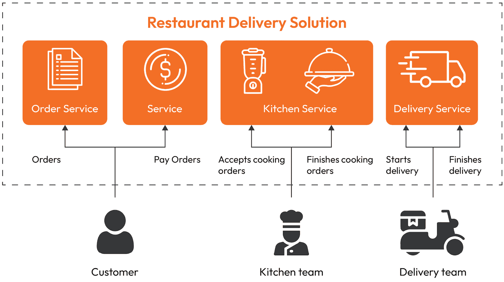
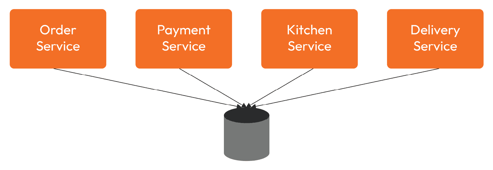
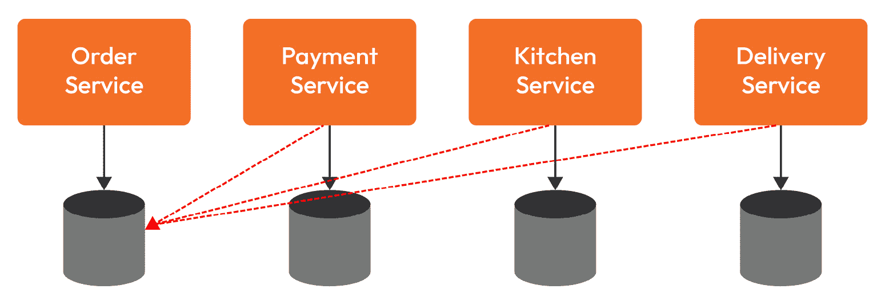

# 3

# 探索架构策略和云使用

在本章中，我们将从服务的角度深入探讨架构的话题。具体来说，我们将探讨单体架构和微服务架构之间的关系，并考虑每种方法的优缺点。我们还将检查使用事件驱动架构作为整合这些服务的方法。除了提供技术基础外，我们还将旨在提供战略性和情境性的见解，了解这些概念是如何相互结合的，以及为什么它们推动了各种云服务提供的采用。

在这本书中，我们的目标不仅是提供技术 Java 持久化概念的坚实基础，还要提供战略性和情境性的见解，了解这些想法是如何相互关联的，以及为什么它们有助于各种云服务提供的日益普及。

本章将在以下部分涵盖上述主题：

+   云对软件架构设计的影响

+   设计模式 – 软件架构师的基本构建块

+   单体架构

+   微服务架构

到本章结束时，你将更深入地理解整体解决方案架构如何影响数据集成设计，以及使用本地和云解决方案组合的优缺点，从而产生混合和/或多云模型。

# 云对软件架构设计的影响

虽然我们可以从深入研究多个架构主题的具体细节开始——包括单体、微服务、SOA、事件驱动和事件溯源——但我们将采取不同的方法。我们将首先为您提供对这些模式及其在软件设计中的重要性有更深入的理解。有了这个背景，将有助于拓宽您的视野。让我们更详细地探讨一些设计模式。

## 设计模式 – 软件架构师的基本构建块

在过去的几十年里，正如 Martin Fowler 明智地所说：“*在一种实际情境中有用的想法，可能会在其他情境中也有用*”，我们已经识别并分享了“*在一种实际情境中有用的想法，可能会在其他情境中也有用*”：

全世界技术爱好者分享的想法、经验和解决方案的持续流动，汇聚成一个丰富的知识库，推动和加速技术进化。

模式描述了不同级别的解决方案，从代码级别的实践到应用级别的实践。在数百种模式中，我们将突出设计模式、企业应用模式和软件架构模式的实践，以帮助我们构建一个坚实的持久化层。

**四人帮**（**GoF**）设计模式和**面向服务的架构**（**SOA**）模式是最近出现的微服务架构和事件驱动架构模式的重要基础。

近年来广受欢迎的微服务架构是一种将软件系统设计为一系列小型、独立可部署服务的架构方法。这种架构模式基于 SOA 的核心思想——模块化和关注点分离，但将其推向了更深的层次。

人们常常采用他们实际上并不需要的解决方案，因为他们缺乏分析趋势和应对技术炒作的能力。重要的是要记住，目标应该是使用可用的技术来识别解决特定问题的最佳方案，而不是简单地针对云原生微服务或其他流行解决方案的交付。关键在于理解如何使用适当的技术来解决一系列商业问题。

考虑技术趋势——一些需要注意的事项

判断特定趋势是否适合您场景的常见方法是参考其*技术采用生命周期*。它提供了市场采用洞察，有助于您了解该主题当前的成熟度；换句话说，采用特定解决方案的人越多，出现的成功案例就越多。不仅如此，还有恐怖故事、采用挑战、优缺点、推荐等等也会出现。从更广阔的角度来看，不同的成熟度群体提供了更多关于接受该技术的市场细分领域的理解。

我们现在明白，模式是一组构建块，可以用来实现特定的商业目标。有数百种模式覆盖了应用解决方案的多个层次和方面，并且可以从先前模式的概念中派生出新的模式。重要的是要记住，模式可以组合并用于不同的方式来应对不同的目标。例如，一个 Java 服务可以为它的持久层采用存储库模式，基于微服务架构的最佳实践进行构建，使用企业集成模式与其他服务通信，遵循 12 因子应用的推荐进行云原生应用的构建，并采用设计模式以实现自动化管道交付。

考虑到这一点，让我们深入探讨不同架构选项（如微服务和单体应用）的优缺点，同时考虑基本需求和特性。

## 单体架构

建立解决方案的传统方式是使用**单体**应用，这些是大型、独立的软件系统，作为单一、统一的单元构建，所有组件都包含在单个包中，并一起编译、管理和部署：

图 3.1 – 单体应用特性

这意味着前端和后端都包含在同一个工件中，必须一起编译、管理和部署。虽然这种方法可以使得最初开发和维护应用程序变得更容易，但随着团队的扩大，代码的维护变得更加复杂，部署更新变得更加具有挑战性和耗时。

在性能方面，可扩展性受到影响，因为很难升级或降级特定的功能或组件。

定义数据库和单体之间的关系并不复杂。有些人选择开发存储和消费来自多个数据库的数据的单体，这进一步增加了维护的复杂性。

惊讶的是，使用单体架构可以创建模块化应用程序。这些应用程序可以以模块化的方式设计，每个模块负责一组特定的功能，并且独立于其他模块开发。

接下来，为了验证其成熟度，让我们参考广泛的市场采用和反馈。根据 2022 年的趋势报告[2]，模块化单体架构方法已经跨越了鸿沟，在早期多数群体中得到了广泛采用。

与每个架构设计一样，这种方法有其优点和缺点。我们可以从多个角度分析其好处，包括但不限于可维护性、部署流程和频率、验证流程、自动化管道等。*图 3.2* 显示了在设计应用程序时需要分析的关键主题，这些主题可能导致在应用程序生命周期的每个阶段都需要不同水平和成本的努力。有些人优先考虑长期利益，如易于维护。其他人可能更喜欢采用更容易、更快的启动策略：

图 3.2 – 应用设计过程中的决策点

最佳选择将取决于每个业务需求。就单体架构风格而言，其特性已被证明可能成为组织的一个重大障碍，尤其是在应用程序随着多个开发团队和众多功能的增长而变得更加复杂时。在这种环境下，对应用程序的更改和添加变得成本高昂，扩展变得困难。

面对由 SOA 方法启发的单体设计的缺点，微服务概念应运而生。微服务提出将组件/模块解耦成更小的服务，每个服务都有其独特的职责。

尽管微服务涉及管理更多的故障点，但成功的实施允许获得以下好处：独立团队、变更、部署以及生态系统中每个服务的扩展，而不会影响其他微服务。这是在维护每个个体服务完整性的原则下实现的。让我们进一步探讨这个主题，并更仔细地检查细节。

## 微服务架构

微服务导向架构引入了创建彼此解耦且根据其业务领域建模的应用程序的想法。这些应用程序通过不同的协议和多种通信模式（如 REST、GRPC 和异步事件等）以及集成模式进行集成。使用微服务导向架构可以促进更快、更频繁的交付，并引入一种语言无关的生态系统。

微服务架构具有解耦且独立于构成更广泛解决方案的其他微服务的服务。正如 Sam Newman 在他的书《Building Microservices》中所言，从*图 3.3*中可以隐含地了解微服务的概念和行为：

图 3.3 – 微服务特征

架构师和开发者不仅应该考虑微服务架构的核心特征，还应该考虑可能导致项目风险极大的关键要素，如下所述：

+   **集成延迟**：在单体应用中，组件通过内存直接通信，而不是通过网络。与微服务场景相比，结果是通信更快。然而，随着服务数量和架构复杂性的增加，性能问题和延迟的风险也会增加——可能成为一个灾难性的问题。为了减轻这种风险，将适当的监控和管理服务调用响应时间的阈值作为良好实践，包括客户端服务自行处理此类问题的能力。一个建议和良好实践是在客户端微服务中具备容错能力。例如，客户端应该能够重试之前失败的调用，有适当的回退机制（而不是因为错误而关闭），并且一旦请求的服务恢复正常运行，能够重新建立自身。

+   **职责分离**：注意后端和前端组件的职责分离。一个前端可能依赖于多个后端服务。前端解决方案必须实施，以便在请求的后端服务之一失败的情况下，只有特定的相关功能会中断其正常功能——所有其他前端组件应继续正常工作，确保为最终用户提供最佳可能体验。

+   **多语言环境陷阱**: 微服务架构对语言和框架是中立的。因此，您的环境可能成为多语言的。从架构和技术领导的角度来看，在评估要使用的科技时要节俭，以免最终使用缺乏所需人员维护技术的服务。范围定义和微服务大小应被视为此类定义的措施。

+   **服务大小和责任**: 确定一个微服务的大小和范围可能需要在解耦之旅开始时投入时间和精力。记住，在衡量服务范围和大小时要仔细考虑单一责任（**SOLID**）原则。

+   **遗忘的服务**: 管理挑战之一是避免在生产环境中存在孤儿应用程序。通过为每个服务建立一支团队，包括在生产阶段，尽量减少没有所有者的服务。这样，面对意外问题或新的变更请求时，将更容易确定和定义谁应该负责这些任务。

+   **细粒度仓库**: 避免将项目拆分成过多的仓库，因为这种过度粒度化可能会在仓库数量超过公司合作者数量时变得难以管理。

## 微服务采用常见陷阱

微服务架构的采用带来了多重影响和挑战，正如我们现在所知道的，正如在《软件架构基础：工程方法》一书中所述（[`www.amazon.com/dp/B08X8H15BW`](https://www.amazon.com/dp/B08X8H15BW)），一切都有权衡——而且**微服务**也不例外。

虽然最初被认为是一种有希望的方法，但微服务之旅已被证明比更广泛的科技行业估计的要复杂，尤其是对于小型团队。随着其采用的增加，我们也观察到更多关于各种设计问题和失误的报告。为了避免常见陷阱，重要的是要注意以下错误。

### 不当地将领域拆分成微服务

将业务问题映射到领域，以及将领域映射到微服务时，很容易出错，尤其是在开始采用微服务方法时。这种领域导致需要向多个服务发出请求才能检索到相关的一组业务数据，而不是通过单个请求有效地提供。换句话说，在数据检索和查询方面，不正确的范围定义可能导致复杂的代码实现和性能不佳的解决方案。

以下是一些有助于您找到正确路径的指南：

+   利益相关者和业务专家参与领域定义的过程，因为他们可以就领域边界提供有价值的输入

+   微服务应该有明确的范围；负责一个“事物”并能做好；具有易于组合的功能（换句话说，就是具有内聚性）；能够独立部署和扩展；并且记住，单体架构由于所有处理都在内存中进行，没有在微服务集成期间增加额外的网络延迟，因此更有可能表现出更高的性能。

通常来说，跨域服务集成可以依赖于多种策略，例如以下几种：

+   使用 API 网关来回路由请求，并从多个源中过滤、转换和聚合一个客户端请求中的请求数据

+   在服务之间进行数据去规范化，这可能导致数据重复，但以更高效的数据检索和查询为代价，依赖于事件驱动架构等技术来减少检索数据所需的请求数量，或者拥有能够异步过滤、聚合、丰富并提供访问相关数据的基于事件驱动的服务

### 自动化差距

随着开发团队被拆分成更小、数量更多的组，它们开始更频繁地交付更多服务。这些服务的生命周期操作不应阻碍它们的快速演变潜力。“持续集成和持续部署”（**CI/CD**）是微服务领域的最佳实践，对于管理跨多个部署环境部署的多个服务至关重要，这些环境从本地机器到云服务不等。

### 采用团队希望尽可能多的语言和技术

决定编程语言无疑是众多引人入胜的话题之一。尽管程序员喜欢炫耀那些能让他们写出超短“Hello World”示例的编程语言，并以此为基础做出决定，但时至今日，我们还没有遇到过任何一个项目是以将文本输出到某种控制台、终端或甚至编写 HTML 作为核心业务目标的。

像服务编程语言这样的关键决策不应仅基于示例代码的行数或行简单性。

### 一个应用程序必须成为微服务，因为它很大

请认识到，并非每个大型应用程序*都需要*成为微服务。这里有一个我们希望您熟悉的有趣指标：*每行代码的成本*。

([`medium.com/swlh/stop-you-dont-need-microservices-dc732d70b3e0`](https://medium.com/swlh/stop-you-dont-need-microservices-dc732d70b3e0)).

链接中提到的成本包括计算资源和人力，包括组织流程可能经历的潜在变化，以及潜在的新的软件解决方案，如容器和容器编排器。

与单体架构（monolith）的对应物不同，在微服务架构（microservices architecture）中，代码规模越小，每行代码的成本就越高，因为服务存在所涉及的一切和每个人仍然都是必需的。遗憾的是，一个成功交付的微服务只是解决实际业务问题所需的一部分。

### 没有充分利用独立微服务的扩展性

可扩展性是微服务的一个关键优势。然而，考虑是否单独扩展组件是有意义的很重要。在某些情况下，一起扩展整个系统可能更有效。想想看：是否只扩展更广泛解决方案中独特的、较小的部分是有意义的？

### 数据不一致

微服务依赖于数据，就像任何其他分布式数据库一样，它们都受到 CAP 定理的影响。这意味着每次你必须更新多个服务时，你将在应用程序中增加一层复杂性。

一种处理这个问题的方法是通过采用 SAGA 模式。然而，这个额外的复杂性层可能会对你的数据整体一致性产生负面影响。

### 从微服务开始

通常，假设你的项目将基于微服务是不明智的。这可能导致未来出现大问题，尤其是在领域定义方面。小错误可能导致服务之间出现多个错误的相互依赖和紧密耦合。这就是为什么许多专家建议在处理关系型数据时使用连接，在处理如 MongoDB 这样的 NoSQL 数据库时使用子文档。

虽然连接（joins）是关系型数据库中一个强大的功能，它允许我们通过外键（foreign keys）将不同表中的数据结合起来，但在 NoSQL 数据库中，尤其是在处理大数据集时，连接可能会变得低效且耗时。这是因为连接需要执行多个查询，可能会导致大量的网络流量和资源消耗。

此外，NoSQL 数据库根据应用程序的访问模式和用法进行了查询性能优化。

因此，通常建议对数据进行建模，以最小化连接的需求，并使用反规范化（denormalization）和嵌入（embedding）技术将相关数据组合成单个文档。

然而，在某些情况下，对于 NoSQL 数据库来说，连接可能是必要的。在这些情况下，NoSQL 数据库提供了不同的方法来执行连接，例如在 MongoDB 中使用`$lookup`或 MapReduce，这些方法旨在更有效地与 NoSQL 数据模型协同工作。

小贴士 - 采用微服务时常见的错误参考

没有必要因为这里提出的挑战而感到气馁；当架构被正确使用并在有利的情况下使用时，它非常适合。关键是，*没有圣杯或银弹*。

如果你想继续了解采用微服务时的常见错误，请参考以下阅读推荐：Ebin John 的《停止，你不需要微服务》([`medium.com/swlh/stop-you-dont-need-microservices-dc732d70b3e0`](https://medium.com/swlh/stop-you-dont-need-microservices-dc732d70b3e0))和 Sam Newman 的《我应该使用微服务吗？》([`www.oreilly.com/content/should-i-use-microservices/`](https://www.oreilly.com/content/should-i-use-microservices/))。

我们迄今为止概述了单体和微服务架构的概念，探讨了三种主要的云交付模型：IaaS、PaaS 和 SaaS，并了解到它们可以组合起来以最佳满足组织的需要。

接下来，让我们进一步探讨云部署模型，以及拥有多个云部署选项如何帮助团队缩短开发周期、填补知识空白，并使团队能够更有效地应用他们的知识和努力。

# 倾向于现代有状态解决方案的云部署策略

云部署模型允许应用程序依赖于具有按需使用、弹性、容错性、可测量访问和其他基本方面的基础设施。让我们来看看部署模型策略，例如公有云和私有云，如何通过混合和多云模型推导出两种组合，以及如何最佳地利用可用的云部署策略来高效地交付有状态应用程序。

## 为什么混合和多云模型很重要

在寻求更好的灵活性、访问供应商特定功能、集成选项和降低成本的过程中，云部署模型的组合已经开始被更频繁地使用。组织开始结合公有和私有部署模型，并从私有云和公有云服务中受益，采用**混合云**模型。另一种策略是**多云**模型，当需要从不同供应商运行或消费相同类型的服务时使用。

当你结合公有云和私有云，并利用多个供应商提供的类似云服务时，你正在使用一个**混合多云****部署模型**。

注意

注意，最佳的部署模型并不是名字中单词数量最多的那个——最佳的模型是解决你组织现有问题的那个。

由于现有技术和解决方案的种类繁多，团队不可能在每种技术上都具备专业知识。难以组建一个在专业知识方面足够多元化的团队，这导致两种可能性：一个管理不善和维护不佳的基础持久化基础设施，或者开发者可用的选项受限。

由于数据管理是如此关键的业务组件，因此不应被忽视。这就是我们可以与我们云故事联系起来之处：*我们的业务是否可以将数据存储管理的责任委托给他人？* 在这一点上，我们理解混合和多云模型可以提供几种类型云计算资源的轻松扩展和缩减。*如果我们有一个具有* *这样能力的数据库…*

结果我们发现确实有一个——它被称为**数据库即服务**（**DBaaS**）。

除了能够快速启动和运行一切之外，使用 DBaaS，还可能将复杂的任务如监控、版本维护、安全补丁维护、灾难恢复和备份委托出去。除此之外，它还使得采用团队中尚无专业人员的存储技术成为可能，从而便于为每种场景选择最佳解决方案。然而，如果需要直接访问运行数据库的服务器或对传输和存储的敏感数据进行完全控制，DBaaS 则不是一个可行的解决方案。目前市场上可用的 DBaaS 提供示例包括 Amazon RDS、AWS Aurora MySQL、Microsoft Azure SQL Database、ScyllaDB 和 MongoDB Atlas。

在架构解决方案时，这正是你得到两者之最佳之处：通过使用解耦和独立的服务，你可以在适合的地方依赖公共云服务，如 DBaaS 提供的服务，专门用于特定需要的服务，而对于无法处理公共云提供服务的服务的，则依赖本地数据存储解决方案。

在这些不同的部署模型中，分布式服务，服务集成是一个需要考虑的关键架构方面。

# 分布式系统及其对数据系统的影响

微服务是大拼图中的一小部分：每个组件只有在整个拼图拼好之后才能发挥其真正的价值。可靠性、弹性和可伸缩性这些品质不应在每个单独的服务级别上被考虑，而实际上，对于所提出的集成解决方案；毕竟，我们同意马丁·福勒的观点，即集成应被视为对业务具有战略意义。

*“基于微服务的解决方案的性能仅与其各个组件高效沟通的能力相当。”*

## 示例 - 架构食品配送解决方案

在分布式架构中，处理跨服务的数据集成可能会很困难。因此，我们将通过一个简单的例子来探讨围绕集成的架构概念和错误——一个基于微服务的食品配送网站解决方案。缩小范围，讨论考虑以下内容：

+   微服务后端层

+   微服务数据存储

+   跨服务集成

接下来，让我们看看这个解决方案最初是如何作为一个微服务架构起草的，以及这些服务的集成如何极大地影响数据管理和一致性。

## 基本场景

在早期开发阶段，它可能看起来像是一个非问题场景。对于食品配送的例子，想象一个解决方案，如图*图 3**.4*所示，由四个微服务组成，每个微服务都有自己的持久性和数据存储策略：**订单服务**、**支付服务**、**厨房服务**和**配送服务**。该图表示了微服务，每个微服务都有自己的持久存储。

图 3.4 – 食品配送服务的表示

这个示例的“快乐路径”是这样的：每当客户创建并支付新的*订单*时，厨房就会烹饪并把它送到配送团队，配送团队随后将订单送到客户手中。*图 3**.5*展示了从创建到配送的新订单流程，其中业务流程在四个独立的微服务之间处理。

图 3.5 – 食品配送业务的需求

从技术角度来看，这个业务需求可以这样描述：

1.  **订单服务**：记录新的订单 0001

1.  **支付服务**：

    1.  记录订单 0001 所需的付款

    1.  记录订单 0001 的成功付款

1.  **厨房服务**：

    1.  通知订单 0001 的到来

    1.  记录订单 0001 正在准备中

    1.  记录订单 0001 已准备好配送

1.  **配送服务**：

    1.  通知订单 0001 已准备好发送给客户

    1.  记录 0001 的配送已完成

要掌握这个看似简单的业务需求的细微差别，我们必须深入了解技术细节，并探索各种障碍和潜在解决方案。

这个解决方案是否可以是单体架构？是的，可以。然而，配送服务，尤其是那些跨越多个客户/订单提供者/配送提供者的服务，是基于一个广泛的业务需求列表构建的，这些需求在用于学习目的的简单示例中没有涵盖。现实世界中的配送服务，如 Uber Eats 和 DoorDash 的架构解决方案和业务需求，是复杂、现实场景的好例子。

这个解决方案的微服务有一个独立的数据库，这不仅符合微服务的理念，而且也带来了良好的封装水平，减少了因变更（例如，模式变更）引起的错误数量。

## 围绕中心数据集成的挑战

尽管所有四个服务都被设计成**独立**的，但它们都围绕一个关键功能运作：**订单**。并且出现了关于这个数据的问题：*如何在四个服务之间管理和处理订单数据*？

### 微服务的共享数据库

一些服务可以利用数据存储作为这些服务的集成层，拥有一个单一的模式，不仅包含订单详情，还包括支付、厨房和配送信息。不幸的是，这是一个不可取的解决方案，被称为共享数据库（也称为集成数据库）。*图 3.6*显示，在这种情况下，所有服务都依赖于一个单一的模式来维护订单信息：

图 3.6 – 共享数据库反模式

在先前的例子中，服务实现可能看起来很简单，因为它不需要处理集成方面。然而，解决方案中增加了多个问题，并破坏了设计原则：

+   微服务应该是解耦和独立的。

+   瓶颈和性能影响，以及意外的异常，如锁异常。

+   由于边界上下文不受尊重，涉及多个业务领域。

+   数据库的更改可能需要更改所有服务。

+   对同一数据进行操作的多项服务可能会导致不一致。

+   更高的错误和故障风险。例如，对某个服务所做的更改，其他所有服务都没有预料到。

考虑到上述问题以及更多问题，很容易看出这不是一个好的选择。

### 双写反模式

为了避免上述问题，我们可能会考虑拥有独立的服务，每个服务都有自己的数据库。然而，在这个解决方案中，服务在其数据库中不保留订单的副本，但它们也应该在它们的数据库和订单服务数据库中更新订单状态。

在*图 3.6*中，观察订单服务是独立的，并在其数据存储中维护订单数据。然而，其他服务依赖于在其自己的数据库中复制订单数据，并在两个数据库中维护订单状态——它们自己的和订单服务的：

图 3.7 – 双写反模式

亲爱的读者，这又是一个反模式：*双写*反模式。它带来了很高的可能性导致数据不一致和完整性问题，因为它无法确保两次写入都能成功完成，或者都不完成，就像在单一事务中一样。这在处理分布式数据系统、使用专用于分析的独占数据存储、实施专用的搜索索引工具和设计事件驱动解决方案（例如，将相同的数据写入数据库和 Kafka）等场景中是一个常见的错误。

首先明确，我们在分布式架构的数据访问和管理方面指出了两个红旗：

+   第一，一个服务不应直接更改任何由其他服务拥有和消费的数据，如图 3.7 中的箭头所示，其中所有服务都在修改订单服务的数据库中的数据

+   第二点是，一个服务**不应**负责或对多个数据存储解决方案（包括但不限于*图 3.5*中所示的服务间，以及*图 3.6*中所示的不同数据存储类型）的数据持久性和一致性进行操作和维护。

在*第十章*和*第十一章*中，深入探讨了反模式、用例以及数据集成的潜在解决方案和策略。目前，只需意识到在分布式数据服务集成中存在可能导致性能瓶颈、数据不一致和可靠性损失的反模式就足够了。

到目前为止，我们更好地理解了为什么集成是提供基于现代微服务解决方案的关键架构方面。接下来，让我们看看另一种通过依赖事件驱动架构进行异步数据集成的方式来整合分布式服务。

### 揭示数据集成中的变更数据捕获

服务集成可以是同步的或异步的，可以使用不同的机制和形式，例如基于文件、共享数据库、基于消息、基于 API（例如 REST、SOAP）、事件驱动等。为了本书的目的，我们将考虑**事件驱动架构**（**EDA**）的方面，因为它使得使用如**变更数据捕获**这样的数据集成模式成为可能。

事件驱动模式相关的技术被创建出来，以便数据库——即使是传统的数据库——能够拥有新的能力：发出事件。您读对了；传统的关系型数据库（以及其他数据库）可以超越基础功能，并允许开发者依赖变更数据捕获。

使用变更数据捕获，数据库操作可以被捕获并由解决方案的数据库和微服务之外的组件作为事件发出。有了这个，开发者可以创建能够对上述数据事件或“通知”做出反应和响应的事件驱动服务。

如您所预期的那样，EDA 并非全是阳光和玫瑰。当涉及多个服务和大量事件时，在这种架构风格中理解整个业务流程中发生的事情可能会相当令人不知所措。故障排除也可能极其复杂，因为跟踪过程不是线性的，并且不会在唯一的交易中发生。当与 EDA 一起工作时，请忘记自动回滚。

尽管每个提到的挑战都可以被解决或减轻，但请注意，这些只是 EDA 潜在缺点列表中的一部分；因此，不要忘记对特定场景进行评估，并验证 EDA 是否是最佳解决方案。

了解 EDA 提供的集成优势对于在不破坏模式、最佳实践和推荐的情况下集成您的服务至关重要，并且对于确保您能够获得异步、高度可扩展集成的益处至关重要。

# 摘要

在这一点上，我们已经探讨了云计算技术对软件架构设计的影响以及设计模式作为软件架构师构建块的重要性。我们比较了单体架构和微服务架构，揭示了它们的优缺点。

我们还探讨了云部署策略，如混合云和多云模型，以及这些策略如何与如 DbaaS 之类的托管服务相结合，以加快有状态解决方案的开发和交付。另一方面，我们也发现了我们在分布式系统中如何集成数据可以直接影响数据管理和使用。当集成分布式有状态服务时，我们现在知道我们必须谨慎使用如共享数据库和“双重写入”之类的反模式。

在本章末尾，我们揭示了 Change Data Capture 在 EDA 中用于数据集成的潜力，这通过增加架构复杂性（更多组件和技术）来换取完全解耦和异步的集成。

在讨论了架构和部署模型选择之后，我们将进一步深入探讨利用设计模式进行云原生应用数据管理的策略，基于本章奠定的基础。
