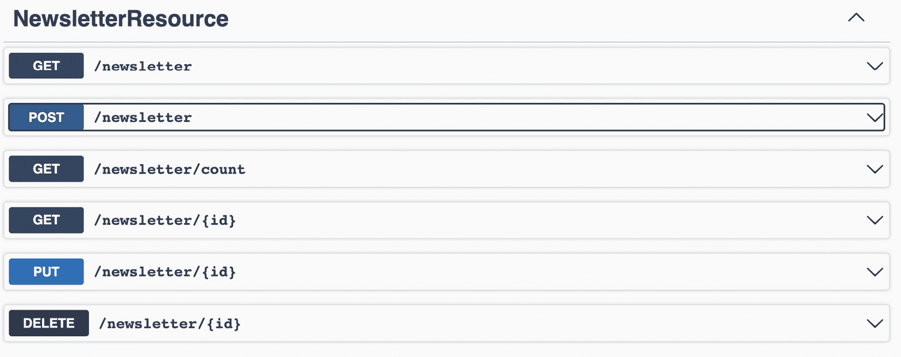

# 5

# Jakarta EE 和 JPA – 状况

Java，无论是语言还是平台，在提供有效的开发体验和创建高性能的持久化应用方面都取得了显著进步。当检查 Java 数据库集成能力和开发体验的演变时，这些显著的改进变得显而易见：回顾一下 `1.1` 的引入，并将其与 **Jakarta 企业版**（**Jakarta EE**）、**MicroProfile** 提供的最现代体验进行比较。

本章介绍了 Java 进化和持续增长的主要推动者——Jakarta EE（以前称为 Java EE）和 Eclipse MicroProfile 的现在和未来。一方面，Eclipse 基金会和 Jakarta EE 针对企业组织对稳定性和可靠性的需求。另一方面，有 Eclipse MicroProfile，它具有快速交互和持续创新。同时，Jakarta EE 平台也在不断发展和采用全面的 MicroProfile 技术。所有这些都在你阅读的同时发生，因此现在是时候最终理解开放社区正在发生的事情，以及从数据解决方案的角度可以期待什么了。

寻求提供可扩展企业解决方案的 Java 工程师，这些解决方案能够平滑地启用分布式架构，通常依赖于一个能够支持云原生和传统解决方案的平台。在商业世界中，鉴于 Java 的长期采用，经常需要灵活的技术，这些技术能够在不放弃提供新的云原生解决方案机会的情况下，最大限度地发挥现有技术和基础设施的潜力。在这种情况下，Jakarta EE 平台是一个很好的选择。

Jakarta EE 的规范非常庞大，影响了整个 Java 社区；重要的是要强调，如果你在使用 Spring、Micronaut 或 Quarkus，即使间接地，你也在使用 Jakarta EE。在本章中，我们将检查 Jakarta EE 覆盖的规范。

本章我们将涵盖以下主题：

+   Jakarta EE 概述

+   框架揭晓——反射与非反射解决方案

+   **Java 持久化 API**（**JPA**）状况

+   Quarkus 和 Panache 云原生运行时带来的 JPA 力量

+   一般 JPA 相关性能考虑

# 技术要求

对于本章，你需要以下内容：

+   Java 17

+   Git

+   Maven

+   任何首选的集成开发环境（IDE）

本章的代码可以在以下 GitHub 仓库中找到：

[`github.com/PacktPublishing/Persistence-Best-Practices-for-Java-Applications/tree/main/chapter-05`](https://github.com/PacktPublishing/Persistence-Best-Practices-for-Java-Applications/tree/main/chapter-05)

# Jakarta EE 概述

Jakarta EE 的核心是其一系列规范，每个规范都针对企业架构的特定方面。这些通常被称为“EE 规范”的规范旨在涵盖企业应用程序开发中遇到的各种用例。它们提供了实施关键功能的标准化方法和指南，确保在不同实现之间具有互操作性和可移植性。

Jakarta EE 规范满足企业架构的广泛需求，包括以下方面：

+   **Web 应用程序**: Jakarta Servlet 规范提供了一个平台无关的 API，用于构建 Web 应用程序。它定义了如何处理 Web 请求和响应，允许开发者创建动态、交互式、安全的基于 Web 的解决方案。

+   **企业集成**: Jakarta 消息（JMS）规范提供了一个消息系统，使分布式应用程序组件之间的通信无缝。它确保了可靠和异步的信息交换，促进了不同系统之间的集成。

+   **持久性**: JPA 规范通过提供一个 **对象关系映射**（ORM）框架简化了数据库访问和操作。它允许开发者使用 Java 对象与关系数据库进行交互，抽象了底层的 SQL 操作。我们还可以包括 Jakarta Bean Validation 规范来定义由注解驱动的 Java 约束；此外，新的规范正在出现以支持 NoSQL 和 **领域驱动设计**（DDD）存储库。

+   **依赖注入（DI）**: Jakarta 上下文依赖注入（CDI）规范通过管理对象创建、连接和生命周期管理来促进松散耦合并推动模块化开发。它使得在应用程序中轻松集成不同的组件成为可能，增强了可维护性和可测试性。

+   **安全**: Jakarta 安全规范提供了一套全面的 API 和服务，用于保护企业应用程序。它提供了身份验证、授权和数据保护机制，帮助开发者构建安全的应用程序并保护敏感信息。

+   **RESTful 网络服务**: Jakarta RESTful 网络服务（JAX-RS）规范简化了使用 **表示状态转换**（REST）架构风格开发网络服务的过程。它提供了一套注解和 API，用于构建可扩展、轻量级和互操作的网络 API。

下面的图表展示了 Jakarta EE 10 API 的概述，其中你可以看到大量可以帮助你作为软件工程师的规范；图表的另一个区域与配置文件相关。目前，根据你的需求，你可以使用三个配置文件：


图 5.1 – Jakarta EE 10 规范

这些只是 Jakarta EE 中广泛规范的一小部分示例。每个规范都针对特定需求，确保开发者拥有解决各种企业架构挑战的工具和指南。

通过遵循 Jakarta EE 规范，开发者可以在不同的应用程序服务器和供应商之间创建可移植的应用程序，从而实现灵活性和可扩展性。这些规范促进了互操作性和兼容性，使得与其他系统和服务的无缝集成成为可能。

这些规范将帮助您了解现代概念、方法和架构模型。在 Jakarta EE 10 API 中，我们有 CDI Lite 规范，其目标是减少反射，但反射有什么问题呢？在下一节中，我们将更详细地讨论这个问题。

# 框架揭晓——反射与非反射解决方案

Java 框架对于简化并加速应用程序开发至关重要，它们通过提供可重用组件、预定义结构和标准方法来实现这一点。这些框架封装了常见功能性和设计模式，使开发者能够专注于业务逻辑，而不是底层实现细节。

Java 编程和许多 Java 框架中的一个基本概念是反射。反射允许程序在运行时动态地检查和修改其结构和行为。它提供了一种检查和操作类、接口、方法和字段的方法，即使它们在编译时未知。

反射对开发者来说至关重要，以下列出了一些原因：

+   **动态代码执行**：反射允许开发者动态地实例化类、调用方法和访问字段。这种灵活性使得创建灵活、可扩展和可定制的应用程序成为可能。例如，Spring 和 Hibernate 等框架严重依赖反射来动态创建和连接依赖项、执行数据映射和处理应用程序行为的各个方面。

+   **元数据提取**：反射允许提取与类、方法和字段关联的元数据。这些元数据可能包括诸如注解、修饰符、泛型类型和方法签名等信息。通过分析这些元数据，开发者可以实现高级应用程序功能和行为。例如，JUnit 等框架使用反射根据注解发现和执行测试用例。

+   **框架和注解**：Java 框架通常利用注解，即在类、方法或字段上添加的标记，以提供额外信息或配置特定行为。例如，Spring、JPA 和 Java Servlet 等框架广泛使用注解和反射来简化配置和定制。反射允许框架在运行时扫描和处理这些注解，实现自动配置、依赖注入（DI）和**面向切面编程**（AOP）。

然而，尽管反射提供了卓越的灵活性和功能，但它可能会影响 Java 应用程序在启动时的性能。检查类和动态加载元数据的过程可能会引入显著的开销，尤其是在快速启动时间至关重要的无服务器或云原生环境中。

这为什么很重要？Java 应用的原生编译

一个很好的例子是创建原生可执行 Java 应用程序，其中开发者使用 **Java 虚拟机**（**JVM**）如 GraalVM（Oracle）和 Mandrel（Red Hat）来编译这些应用程序并生成原生二进制文件。这个过程基于**即时**（**AOT**）编译，导致在运行时无法使用某些行为——包括反射。AOT 编译器在构建时进行静态代码分析以创建原生可执行文件，这意味着通过动态加载（如反射、**Java 原生接口**（**JNI**）或代理）完成的任何处理都代表了这个用例的潜在问题。

为了解决这个问题，Quarkus 和 Micronaut 等框架采用了另一种被称为**构建时**或**编译时**的方法。这些框架不是依赖于**运行时**反射，而是利用注解在构建过程中捕获必要的元数据。这样做消除了运行时昂贵的反射操作，并提供了更快的启动时间和改进的性能。

下一个图表说明了这两种方法是如何工作的，其中使用反射时，Java 会实时读取注解和任何元数据，从而在读取时提供更多的灵活性和可插拔性；这需要更多的内存和预热时间。我们可以在构建时读取这些信息，这样在启动时可以获得更好的预热并节省更多内存；然而，我们失去了反射的灵活性。通常，这是一个权衡分析的点：


图 5.2 – 运行时与构建时读取 Java 注解

反射是 Java 编程和框架中的一个强大机制。它允许动态代码执行、元数据提取以及利用注解进行配置和定制。虽然反射可能在特定场景中影响启动性能，但 Quarkus 和 Micronaut 等框架已经引入了构建时反射作为解决方案，允许开发者利用注解的好处而不牺牲性能。这种由 CDI Lite 启用的方法，促进了在无服务器和云原生环境中高效使用 Java。

Jakarta EE 平台持续进化 – CDI Lite

基于迄今为止突出显示的需求和影响，作为版本 10 发布的雅加达 EE 平台对 CDI 规范进行了更改，以适应许多有助于此场景的行为。CDI Lite 规范提供了这些框架所需的行为，旨在提供 CDI 的轻量级版本。CDI Lite 利用 *编译时反射* 来消除与完整 CDI 实现相关的运行时开销，使其适用于资源受限的环境和无服务器架构。

开发者在开发 Java 应用程序时可以选择使用反射或采用无反射方法的框架。此比较表将探讨这两个 Java 框架的关键方面，如注解读取、预热灵活性和封装。

|  | **反射** | **无反射** |
| --- | --- | --- |
| 读取 Java 注解 | 实时 | 构建 |
| 预热（框架启动时所需额外时间） | 启动速度慢 | 启动速度快 |
| 灵活性 | 实时插拔性 | 构建时限制 |
| 封装 | 强封装 | Java 封装的限制更多 |

表 5.1 – 反射与无反射解决方案比较

当我们谈论应用程序时，我们不确定架构风格，如微服务或单体，或者我们将使用实时或构建时 Java 应用程序；然而，对于大多数解决方案，我们将使用任何持久化引擎。现在让我们更详细地讨论最成熟的雅加达持久化规范：JPA。

# JPA 状态

JPA 是一个关键的雅加达 EE 规范，也是企业应用中最成熟的数据规范。它为 Java 中的 ORM 提供了一种标准化且稳健的方法，使开发者能够无缝地与关系数据库交互。

当与 Java 应用程序和关系数据库之间的集成工作时，需要考虑以下几个方面：

+   **配置管理**：如何将配置外部化，以便根据部署的环境（开发、生产等）轻松且安全地更改。

+   **连接处理**：不正确处理与数据库的连接可能导致额外的处理时间，因为这是昂贵的。这一需求与有效管理数据库的打开、关闭和跟踪连接以使用资源并避免有太多打开和空闲连接或应用程序可用连接不足的要求相关。

+   **将类映射到数据库表**：正如我们在前面的章节中看到的，映射对象可以以多种方式实现，并提供更高或更低级别的灵活性和抽象。

+   **映射类之间的关系**：面向对象编程（OOP）引入了层次等概念，这在关系数据库模式中是不可用的。根据这些类配置的方式，数据管理可能会具有更高的复杂性和维护成本。

+   **事务管理**：在应用层管理事务，并确保原子性和回滚。

+   **代码生成**：开发者可以编写纯 SQL 查询或依赖抽象来加快开发速度。目前，一些框架可以抽象出大多数基本的 CRUD 查询。不幸的是，如果误用，代码生成可能会导致查询缓慢和对私有方法正确使用的限制。

+   **获取策略**：允许以最佳方式检索数据，以充分利用内存消耗，并且当正确使用时，可以带来性能提升，因为数据仅在需要时才会从数据库中检索。这与 Hibernate 上可用的众所周知的延迟/预取模式相关。

+   **解耦业务逻辑和技术方面**：根据他们的目标，开发者可以创建极其灵活和定制的代码（例如，使用 JDBC），以换取对数据持久化层和业务逻辑层之间代码耦合的负面影响。

考虑到 Java 开发者的这些反复需求以及创建可重复的、易于广泛采用的优秀实践的可能性，JPA 规范自其创建以来已经发展。

以下图表显示了 JPA 作为 Jakarta EE 世界中最成熟的持久化规范；多个供应商和框架使用它，我们还可以应用多种持久化模式，如 Active Record、Repository 和 Mapper：


图 5.3 – JPA 时间线和景观

当与 Spring 和 Quarkus 等框架结合使用时，JPA 提供了实现不同设计方法（包括 Active Record、Mapper 和 Repository 模式）的灵活性。让我们深入了解这些设计方法，并探讨 JPA 如何通过反射或构建时读取注解来操作。

## JPA 和数据库映射模式

当使用 JPA 进行开发时，开发者通常采用三种设计选项：Active Record、Mapper 和 Repository。请注意，由于 JPA 具有映射实体及其相互关系、抽象基本数据库操作和异常处理机制等功能，采用这些模式变得更加简单。让我们更深入地了解一下：

+   **使用 JPA 的 Active Record**：在这种方法中，领域模型类封装了持久化逻辑，遵循 Active Record 模式。它简化了数据库操作，因为领域类是活跃的参与者，并直接负责处理 CRUD 操作和关系。

当依赖 JPA 时，可以通过使用 JPA 注解如`@Entity`来注解领域类，将其标记为持久化实体。领域类还可以注解为`@Table`，这将定义与该实体对应的数据库表，该表应映射到该实体。这些注解的元数据使 JPA 能够将对象属性映射到相应的数据库列。

+   **Mapper**：根据 Mapper 模式，领域模型和持久化逻辑应该通过新的专用 mapper 类进行分离。

JPA 与 Spring 和 Quarkus 等框架结合使用，允许开发者配置和管理这些 mapper。mapper 处理领域对象和数据库表之间的转换，从领域模型中抽象出持久化细节。JPA 的`EntityManager`和`EntityManagerFactory`类提供了执行数据库操作所需的 API，而 mapper 类则促进了数据库和领域模型之间的映射。

+   **Repositories**：Repository 模式建议在应用程序领域层和数据访问层之间引入一层抽象。

在使用 JPA 进行开发时，开发者可以定义充当合同并指定可用 CRUD 操作和查询的仓库接口。JPA 的`EntityManager`类是执行查询和管理事务的底层机制，它使数据访问高效且可扩展。

例如，Spring Data JPA 和 Quarkus 等框架支持仓库，并且可以根据定义的接口自动生成必要的实现代码。

当考虑使用框架来实现设计模式时，我们应该意识到其优缺点。我们将深入探讨一个详细的代码示例，但在那之前，让我们检查需要注意的事项。

根据应用用例和需求，了解底层发生的事情以及你的应用程序将从你选择的框架中继承的限制是很重要的。例如，当使用 Active Record 与 Panache 和 Quarkus 一起使用时，你的实体可能扩展了`PanacheEntity`类。使用 Repository 时，可能扩展了`JpaRepository`，这是一个通用的 Spring Data JPA 接口。通过了解所选框架的实现细节，你可以更好地识别你选择将应用程序代码与框架紧密耦合的地方，通过使用专用的注解或依赖项。你会知道是否以及到什么程度会违反**关注点分离**（**SoC**）的原则，或者例如，在需要迁移到不同的持久化框架时所需的额外工作量。

在第四章中学到的优缺点在这里同样适用：Active Record 将比 Repository 更简单，而采用 Repository 可以比 Active Record 带来更好的 SoC，从而提高可维护性和可测试性。

我们将深入一个全面的代码示例，以阐明在框架提供的便利性和遵循众所周知的编码最佳实践之间权衡的细节。

# 使用 Quarkus 和 Panache 云原生运行时的 JPA 力量

为了展示现代持久化框架如何使开发者能够依赖他们对 JPA 的了解，让我们来看看 Quarkus 和 Panache，以及使用加速开发速度开发云原生 Java 服务的体验。在这个背景下，我们将评估设计模式实现的关键方面、自动生成的持久化代码，以及在设计解决方案时需要考虑的一些潜在缺点。

您可以跟随操作或创建一个全新的项目来尝试以下代码。如果您还没有使用过 Quarkus 和 Panache，您可能会注意到与传统的应用服务器相比，轻量级运行时的开发体验有相当大的差异，以及使用 Panache 编写简单的 CRUD 场景的简单性。

关于如何创建项目的详细信息可以在项目的仓库中找到：[`github.com/architects4j/mastering-java-persistence-book-samples/edit/main/chapter-05/README.md`](https://github.com/architects4j/mastering-java-persistence-book-samples/edit/main/chapter-05/README.md)。现在，让我们深入探讨。

我们将要看到的微服务将用于管理*书籍*和*杂志*，我们将使用 JPA 探索两种不同的数据库设计模式：仓库模式和活动记录模式。

## 设置新服务

由于我们将依赖持久化和 REST 端点（通过 Quarkus 启动页面轻松生成）的功能，项目需要依赖项来处理这些功能。有趣的是，大部分艰苦的工作将由框架自动生成，而这些框架实际上基于众所周知的规范和技术，如 RESTEasy、JSON-B、Hibernate ORM、Hibernate Validator、Panache 和 JDBC。

基础存储将由 H2 内存数据存储处理，这对于学习目的应该是很有用的，因为它不需要安装外部数据库或使用 Docker 来启动一个数据库实例。然而，请记住，H2 不建议用于生产环境。

第一个差异出现在 Quarkus 项目的配置（`src/main/resources/application.properties`）中，因为开发者可以依赖一个单一的属性配置文件来将`h2`作为数据库类型，将`memory`作为 JDBC URL。这种方法使得在不修改任何代码的情况下（例如，从 H2 到 PostgreSQL、MariaDB 或其他数据库）更改底层数据库技术。

另一个积极方面是，这种配置风格依赖于 Eclipse MicroProfile Configuration 规范，该规范提供了对基于应用程序运行环境的属性覆盖的即插即用支持——换句话说，这就是如何在生产环境中的敏感数据（如用户名和密码）保持机密性，并且不在应用程序级别直接配置。

属性配置可以设置如下：

```java
quarkus.datasource.db-kind=h2quarkus.datasource.username=username-default
quarkus.datasource.jdbc.url=jdbc:h2:mem:default
quarkus.datasource.jdbc.max-size=13
quarkus.hibernate-
  orm.dialect=org.hibernate.dialect.H2Dialect
quarkus.hibernate-orm.database.generation=create
quarkus.hibernate-orm.log.sql=true
```

## 持久化实体和数据库操作

基础设施准备就绪后，接下来创建项目实体。从现在开始，我们将检查两个模式，你可以观察到`Book`实体使用 Active Record 实现，而`Magazine`使用 Repository 模式。

`Book`类如下所示。请注意，尽管它带来了`@Entity`注解，但没有额外的属性级注解。此外，`Book`实体“知道”其数据库操作，例如如何通过名称和书籍发布搜索书籍：

```java
@Entitypublic class Book extends PanacheEntity {
    public String name;
    public int release;
    public int edition;
    public static List<Book> findByName(String name) {
        return list("name", name);
    }
    public static List<Book> findByRelease(int year) {
        return list("release", year);
    }
}
```

正如你接下来会看到的，`Magazine`类使用经典的 JPA 注解，如`@Entity`和`@id`（到目前为止，太阳下无新事）。`Book`实体不需要`@id`注解的原因是它从它扩展的类`PanacheEntity`继承了这种能力。`PanacheEntity`通过继承处理多个操作，包括`id`属性：

```java
@Entitypublic class Magazine {
    @Id
    @GeneratedValue
    public Long id;
    public String name;
    public int release;
    public int edition;
}
```

与使用 Active Record 实现的类不同，其中数据库操作将在实体本身进行，`Magazine`类需要额外的类来进行此类数据操作——一个`Repository`类。`MagazineRepository`类必须实现基本数据库过程，以及查询（如`Book`类中可用的`find by release and name`）。由于我们使用`PanacheRepository`类，我们可以在基本操作上节省一些时间，因为 Panache 稍后会自动生成它们。

这里展示了`MagazineRepository`代码：

```java
@ApplicationScopedpublic class MagazineRepository implements
  PanacheRepository<Magazine> {
    public List<Magazine> findByName(String name) {
        return list("name", name);
    }
    public List<Magazine> findByRelease(int year) {
        return list("release", year);
    }
}
```

## 暴露 REST 端点以进行数据操作

最后，为了通过我们迄今为止检查的类来操作数据，应用程序暴露了 REST API。端点是`BookResource`和`MagazineResource`，它们应该暴露与`Book`和`Magazine`相同的数据库操作，以便我们可以评估每种方法使用的差异。可以提到的第一个差异是，虽然我们不需要注入任何内容就可以使用`BookResource`端点，但要操作`Magazine`实体，开发者必须注入相应的`repository`类。

首先，观察`BookResource`端点如何允许与使用 Active Record 实现的实体`Book`进行交互。你会注意到一个负面方面是端点与 Active Record 之间存在更紧密的耦合。作为一个积极点，注意它如何使应用程序更简单，层次更少。

`BookResource` 类包括以下内容：

+   三个 `GET` 端点：`findAll`、`findByName` 和 `findByYear`

+   一个 `POST` 和一个 `DELETE` 方法

代码如下所示：

```java
@Path("/library")@Consumes(MediaType.APPLICATION_JSON)
@Produces(MediaType.APPLICATION_JSON)
public class BookResource {
    @GET
    public List<Book> findAll() {
        return Book.listAll();
    }
    @GET
    @Path("name/{name}")
    public List<Book> findByName(@PathParam("name") String
      name) {
        return Book.findByName(name);
    }
    @GET
    @Path("release/{year}")
    public List<Book> findByYear(@PathParam("year") int
      year) {
        return Book.findByRelease(year);
    }
    @POST
@Transactional
    public Book insert(Book book) {
        book.persist();
        return book;
    }
    @DELETE
    @Path("{id}")
    @Transactional
    public void delete(@PathParam("id") Long id) {
        Book.deleteById(id);
    }
}
```

在前面的代码中，请注意 `Book` 实体已经提供了执行数据库操作的方法。

现在，让我们转向 `MagazineResource` 端点，它涵盖了仓库模式。请注意，尽管这是一个简单的示例项目，但在现实生活中，随着架构的侵蚀，它将增加业务需求的复杂性和时间。这让我们想起了*第四章*，在那里我们讨论了更多关于层及其权衡的内容，所以那个可以单独帮助我们分解问题的层可能会对更复杂的代码产生更大的影响。随着应用程序的扩展和采用额外的层，如服务层，或者采用六边形模型，仔细分析权衡并密切关注持久化层的设计变得至关重要。

这里是 `MagazineResource` 端点的实现：

```java
@Path("/magazines")@Consumes(MediaType.APPLICATION_JSON)
@Produces(MediaType.APPLICATION_JSON)
public class MagazineResource {
    @Inject
    MagazineRepository repository;
    @GET
    public List<Magazine> findAll() {
        return repository.listAll();
    }
    @GET
    @Path("name/{name}")
    public List<Magazine> findByName(@PathParam("name")
      String name) {
        return repository.findByName(name);
    }
    @GET
    @Path("release/{year}")
    public List<Magazine> findByYear(@PathParam("year") int
      year) {
        return repository.findByRelease(year);
    }
    @POST
    @Transactional
    public Magazine insert(Magazine magazine) {
        this.repository.persist(magazine);
        return magazine;
    }
    @DELETE
    @Path("{id}")
    @Transactional
    public void delete(@PathParam("id") Long id) {
        repository.deleteById(id);
    }
}
```

在前面的类中需要注意的关键点如下：

+   开发者需要注入 `MagazineRepository` 端点的一个实例。

+   开发者必须实现所需的类和方法，从而获得对底层实现的更高控制度和定制度，以及更好的 SoC（分离关注点）代码，在领域实体和数据库集成之间。

到目前为止，应用程序已准备就绪，所有操作都可通过 REST 访问，并且可以通过开发者定义的方法和 Panache 提供的内置方法正确地操作数据。

## 更快的开发速度——自动端点生成

Panache 允许在标准场景下实现更快的开发速度，结合了我们之前看到的 Active Record 的好处以及基于 Panache 实体的自动生成 REST 端点。`quarkus-hibernate-orm-rest-data-panache` Quarkus 扩展提供了以下功能，而不是之前使用的 `quarkus-hibernate-orm-panache` 扩展。

与之前的方法相比，开发者交付一个完全可用的 CRUD 服务的速度非常明显，与传统的 EE 应用服务器相比更是如此。通过以下步骤，开发者应该能够在几分钟内创建一个完整的 *通讯录* CRUD。

考虑到现有项目，可以创建一个新的 `Newsletter` 类，如下所示：

```java
@Entitypublic class Newsletter extends PanacheEntity {
   public String author;
   public String headline;
}
```

它依赖于 Active Record 实现。在此基础上，它结合了 Quarkus 和 Panache 的能力，基于 Panache 实体自动生成 REST 端点。

要达到之前示例中提到的相同结果，以下 REST 操作应该是可用的：

+   三个 `GET` 资源：`findAll`、`findById` 和 `getCount`

+   `POST`、`PUT` 和 `DELETE` 方法，分别用于插入、更新和删除通讯录

要实现这个目标，所需的就是一个新的接口，该接口扩展了 `PanacheEntityResource` 接口。该接口指示 Panache 实体是 `id` 属性类型：

```java
import io.quarkus.hibernate.orm.rest.data.panache.PanacheEntityResource;public interface NewsletterResource extends PanacheEntityResource<Newsletter, Long> {
}
```

就这样！如果使用 dev 模式运行 Quarkus，开发者应该已经能够通过刷新页面并检查 `swagger-ui` 页面和新端点来简单地验证结果，如图所示：



图 5.4 – 由 Panache 自动生成的新的端点

现在，请注意，当选择走这条路时，所有属性都被配置为公共属性。使用这种方法时，你需要权衡的是：除非你添加额外的代码来处理私有属性的使用，否则你将选择开发速度，完全放弃封装、没有访问控制、增加代码耦合（因为类别的更改可能会导致其他类别的潜在更改），以及有限的控制和数据完整性（属性可以被直接修改）。

你可能会认为这就像将属性配置为私有并添加公共的 getter 和 setter 一样简单。确实如此——这基本上是相同的。但你会以相同的方式（因为 setter 仍然是公共的）缺乏封装，使用“愚蠢”的 getter 和 setter。此外，这正是 Panache（在撰写本文时的当前版本）在幕后所做的事情：它生成 `getter` 和 `setter` 属性，并将这些属性的每个使用都重写为相应的 `getter` 和 `setter` 属性。

Panache 非常强大，并允许开发者在编写查询时也变得更加高效，例如可以使用如下代码：`Newsletter.find("order by author")`，或者`Newsletter.find("author = ?1 and headline = ?2", "karina", "Java lives!")`，或者更好的是，`Newsletter.find("author", "karina")`。

你已经看到了 Java 开发者可以从现代运行时技术中获得惊人的体验，以及从头开始创建一个全新的有状态服务是多么有效，同时依靠现有的 JPA 知识。接下来，我们将稍微转向另一个话题，强调大多数曾经使用过 JPA 的开发者和架构师通常面临的问题的考虑因素：性能和可伸缩性。

# 通用 JPA 相关性能考虑因素

以下考虑不仅适用于 Panache，也适用于基于 JPA 的应用程序。为了帮助识别或进行性能调整过程，你始终可以依赖框架的能力来输出正在执行的 DDL（数据库 SQL 操作）和数据库操作统计信息。例如，Hibernate 提供了多个配置参数，如`show_sql`、`generate_statistics`、`jdbc.batch_size`、`default_batch_fetch_size`和`cache.use_query_cache`。在接下来的段落中，你将找到围绕此类配置的考虑。现在，检查这里如何将一些配置应用于我们刚刚创建的示例 Quarkus 应用程序。这些属性允许记录 DDL 和统计信息：

```java
quarkus.hibernate-orm.log.sql=truequarkus.hibernate-orm.statistics=true
quarkus.hibernate-orm.metrics.enabled=true
quarkus.log.level=DEBUG
```

注意，在生产环境中不应使用详尽的日志配置，因为它会直接影响应用程序性能；此外，可以单独配置应用程序日志类别，仅输出所需的内容。例如，前面的统计配置可以帮助你识别慢速执行的 DDL。以下是一个你可以为每个数据库操作获取的信息示例：

`2023-06-19 02:10:25,402 DEBUG [org.hib.sta.int.StatisticsImpl] (executor-thread-1) HHH000117: HQL: SELECT COUNT(*) FROM dev.a4j.mastering.data.Newsletter, time: 1ms,` `rows: 1`

如果你担心性能，请确保你的代码（无论是由于映射还是查询解析）在幕后不会*自动生成性能低下的 SQL 查询*，在不需要时*检索不必要的信息*，或者*自动生成过多的查询*而不是运行一个更适合的单个查询。

除了与持久性相关的 Java 代码本身之外，还可以通过设置应用程序启动时打开的连接数、连接池大小（以便可以重用打开的连接）以及应用程序（通过你选择的框架和类）如何识别和清理空闲或未关闭的连接来微调你的 JPA 数据源连接。

另一个需要考虑的项目是批量操作。假设每份通讯可以包含几篇文章，作者可以一次性创建一份新的通讯和 50 篇文章。在这种情况下，而不是在应用程序和数据库之间来回 51 次以创建所有文章和通讯，只需执行一次操作即可完成所有操作。同样适用于查询数据。

对于查询密集型应用程序，专注于创建可以更好地执行的特定 SQL 查询，如果应用程序需要多次查询执行，建议在应用程序配置中微调批量获取大小。JDBC 批量操作是定义单次数据库往返中可以执行多少操作的好方法。

对于具有大量插入操作的应用程序，也可以使用批量插入，确保避免长时间运行的事务或每次“flush”操作时花费额外的时间（因为`EntityManager`将不得不一次性处理大量对象的插入）。对于大多数微调配置，评估每个应用程序上最佳配置的最佳方式是执行负载测试并比较结果。然而，在查询数据的上下文中，请记住，缓存常用查询有助于减少数据库访问次数并提高性能。

在 JPA 上下文中，关于缓存，有两种类型的缓存：一级缓存和二级缓存。一级缓存与`EntityManager`缓存（会话缓存）中包含的对象相关。它允许应用程序在访问会话中最近访问或操作的对象时节省时间。

当与扩展到许多运行实例的分布式应用程序一起工作时，考虑使用允许使用共享缓存的二级缓存可能是有益的。请记住，缓存功能并不适用于所有场景，尽管它可能导致显著更好的性能，但它将要求对如何微调缓存解决方案有良好的理解。

最后，微调缓存解决方案意味着提供适当的缓存失效（以确保缓存数据与底层数据库的当前数据保持一致），适当的缓存同步（因为可能有多个缓存提供程序实例），驱逐策略等。在存在实时或最新数据的场景中，考虑缓存使用带来的挑战以及引入的数据过时可能性。

这就带我们结束了 Quarkus 和 JPA 的旅程，在这个过程中，我们看到了 JPA 中的 Active Record 和 Repository 模式。我们可以看到 Active Record 是多么简单，但与此同时，我的实体知道并执行数据库操作。因此，它有两个职责。当我们谈论重定向或任何不需要巨大业务复杂性的集成函数时，这是可以的。

# 摘要

总之，Jakarta EE 是一个强大的平台，它提供了一套全面的规范、API 和工具，用于开发企业应用程序。在持久化层，Jakarta EE 凭借其成熟的 JPA 规范而闪耀，该规范提供了一种标准化的 ORM 方法。使用 JPA，开发者可以利用 Active Record 和 Repository 等设计模式来简化并优化他们的数据访问操作。

当与 Quarkus 框架结合使用时，Jakarta EE 中的 JPA 在实践上展示了其能力。以其快速的启动时间和高效的资源利用而闻名的 Quarkus，通过无缝集成 JPA 来提升开发体验。开发者可以利用 Active Record 模式，使他们的领域模型类直接处理持久化操作。或者，他们可以采用 Repository 模式，该模式引入了一个抽象层，以实现灵活和可扩展的数据访问。通过在 Quarkus 中利用 JPA，开发者可以高效地与关系型数据库交互，确保数据完整性，并在他们的 Jakarta EE 应用程序中实现最佳性能。

总体而言，凭借其成熟的 JPA 规范，结合 Quarkus 框架的 Jakarta EE，赋予了开发者构建强大且高效的持久化层的力量。Jakarta EE 对持久化的标准化方法与 Quarkus 的简化开发体验相结合，为创建可扩展且高性能的企业应用程序开辟了无限可能。但 NoSQL 呢？Jakarta EE 是否支持它？是的，它支持；接下来的章节将介绍如何使用 Java 处理几种 NoSQL 数据库类型，如键值、文档和图。
