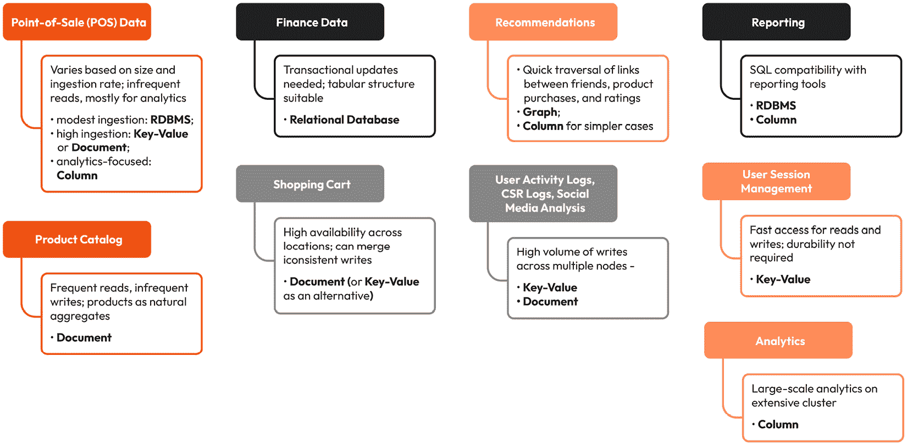
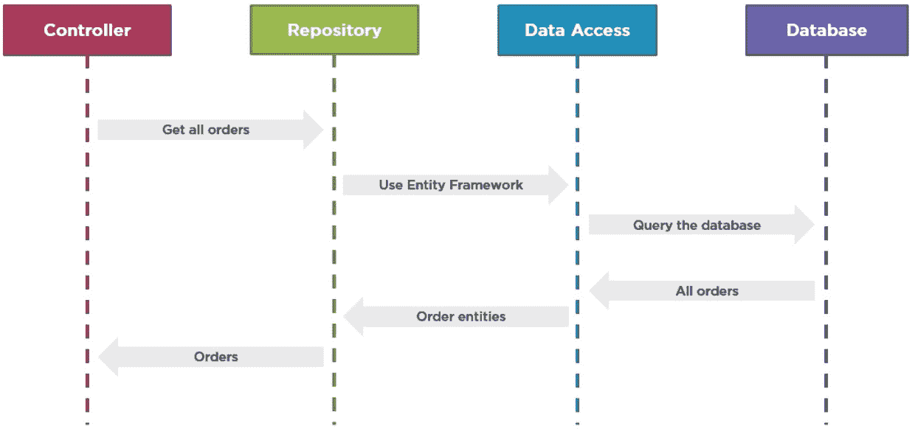
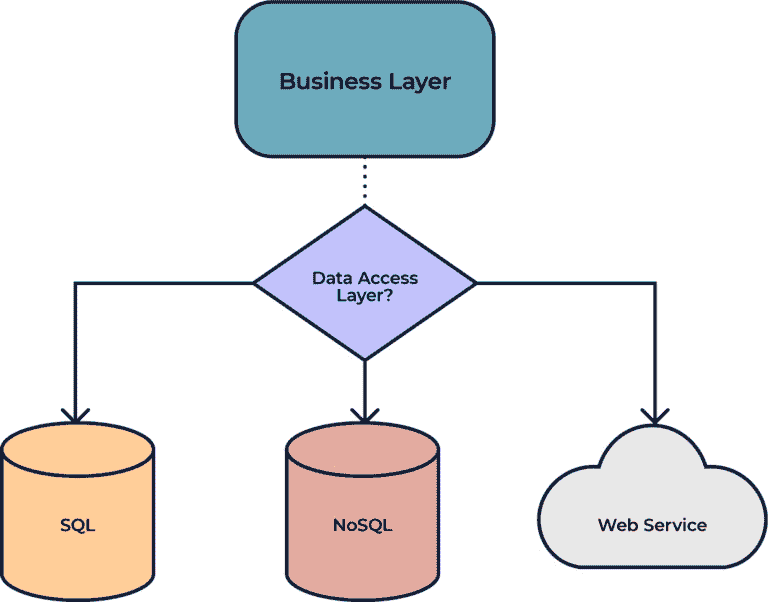

# 9

# 持久化实践 – 探索多语言持久化

软件开发已经变得更加复杂，需要更多的集成，我们需要同时创新来使我们的生活更轻松。一个好的选择是利用多语言持久化来利用几个数据库。

当我们谈论持久化解决方案时，大约有 400 种，它们具有不同的类型、结构和特定行为，这些行为在特定情况下是有意义的。多语言持久化的哲学是使用工具来找到正确的解决方案。

本章将介绍多语言持久化的原理以及如何使用 Java 来实现它。

我们将讨论以下主题：

+   多语言持久化的权衡

+   理解**领域驱动设计**（DDD）和 Jakarta

+   Jakarta Data

# 技术要求

本章的技术要求如下：

+   Java 17

+   Git

+   Maven

+   任何首选的 IDE

本章的源代码可在[`github.com/PacktPublishing/Persistence-Best-Practices-for-Java-Applications/tree/main/chapter-09`](https://github.com/PacktPublishing/Persistence-Best-Practices-for-Java-Applications/tree/main/chapter-09)找到。

# 多语言持久化的权衡

多语言持久化是一种数据存储方法，其中使用多种类型的数据库来满足应用程序内的不同需求。术语**多语言**指的是使用各种语言或工具，在这个上下文中，它指的是使用多种类型的数据库。

在传统的单体应用程序中，通常使用单个数据库来存储所有数据类型。然而，随着应用程序变得更加复杂，这种方法可能会变得不那么有效。然而，多语言持久化允许开发者根据可扩展性、数据结构和查询需求等因素为每个用例选择最佳的数据库。

例如，一个社交媒体平台可能会使用文档数据库 MongoDB 来存储用户资料和活动流，使用图数据库 Neo4j 来分析社交关系，以及使用关系数据库 MySQL 来管理交易和支付。

通过利用多个数据库，多语言持久化可以帮助提高应用程序的性能、可扩展性和灵活性。然而，它也带来了在多个系统之间管理数据一致性、迁移和备份的额外复杂性。

多语言的理念总是好的，并为应用程序提供了几个机会。核心思想是合理的：在最佳场景下利用数据库是极好的。但是，即使有多语言持久化，也存在权衡，就像任何软件架构决策一样。

更多的数据库也意味着更大的成本和基础设施知识来处理特定的持久化解决方案。请留意这一点。

在 Java 中，更多的数据库意味着应用程序中更多的依赖项，这可能会*加剧 jar-hell 的头痛*。微服务方法将帮助您在这种情况下，*其中您环境中的每个数据库都有自己的接口*；它还有助于将技术从业务中隔离出来。

从代码设计角度来看，有端口和适配器模式，或者六边形模型，您可以在其中将应用程序的核心逻辑与持久化层隔离开来。然而，正如提到的，更多的层意味着更多的代码，这意味着对可维护性和错误的担忧。

从简单的三层开始，如**模型-视图-控制器**（**MVC**）架构模式，并将它们隔离开来是一个良好的开始，例如从单体而不是微服务开始。当需要时，就去做，并重构代码。

有时，我们只需要这些层中的某些层来满足我们的应用程序；从足够的架构开始是一个管理架构风险的绝佳方式。

识别从/到业务层的抽象，并尽可能避免将其与持久化层耦合，对于进化式架构至关重要。

常识和实用主义是定义每个场景最佳模式的最佳公式。作为建议，将软件视为一个长期项目；我们不需要在第一天就设计一个复杂的 Netflix 风格的架构。

基于最佳实践，享受、利用和探索数据库以充分利用您的系统是可能的。在以下图中，基于 James Serra 的文章《什么是多语言持久性？》([`www.jamesserra.com/archive/2015/07/what-is-polyglot-persistence/`](https://www.jamesserra.com/archive/2015/07/what-is-polyglot-persistence/))，您可以获得更多关于哪种数据库最适合或是一个给定场景的良好候选者的上下文。它描述了推荐使用哪种类型的数据库来满足列出的用例的常见和关键需求：



图 9.1 – 用例和数据库类型

这些是基于类型的数据库使用的一些可能性；当我们谈论 NoSQL 时，请记住，在某些类别中，有一些有意义的特定行为，值得使用。

对于长期应用程序，迁移是可能的。隔离可以帮助您在多语言之旅中。下一节将介绍**DDD**，它对持久化层的影响以及 Jakarta 如何帮助我们在这段旅程中。

# 理解 DDD 和 Jakarta

DDD 是一种软件开发方法，它侧重于理解问题域并在代码中对它进行建模。DDD 基于这样的理念，即问题域应该是开发的主要焦点，并且软件应该被设计成反映底层域概念和流程。

DDD 区分了战略设计和战术设计。战略设计指的是软件的整体架构和组织，而战术设计指的是单个组件和模块的详细设计。

在战略设计中，DDD 强调定义一个清晰且一致的领域模型的重要性，该模型代表问题域中的业务概念和流程。此模型应独立于任何特定技术或实现，并基于对领域深入的理解。战略设计还涉及定义边界上下文和具有明确边界的特定领域区域，这些区域与其他领域部分分别建模。

另一方面，战术设计专注于单个组件和模块的设计和实现细节。DDD 使用诸如聚合、实体、值对象和存储库等模式和技巧来在战术设计中建模和操作领域对象。

DDD 可以显著影响软件应用的各个层次，包括表示层、应用层、领域层和持久层。以下是 DDD 如何应用于并影响每一层的简要概述：

+   **表示层**：DDD 通过提供清晰且一致的领域模型来影响表示层，该模型可用于指导用户界面和用户交互的设计。表示层应反映领域模型。它应提供一个用户友好的界面，使用户能够从领域角度以有意义的方式与应用程序交互。

+   **应用层**：DDD 通过提供一组清晰且一致的服务和操作，这些服务和操作反映了领域中的业务流程和工作流，从而影响应用层。应用层的设计应支持领域模型，并提供一层抽象，使领域层能够专注于业务逻辑而不是实现细节。

+   **领域层**：DDD 对领域层的影响最为显著，领域层是应用的核心。在领域层，DDD 强调使用丰富且表达力强的语言来建模领域的重要性，这种语言反映了业务概念和流程。领域层的设计应独立于任何特定技术或实现，并专注于封装业务逻辑和领域知识。

+   **持久层**：DDD 还可以通过提供将领域对象映射到数据库的清晰且一致的方式来影响持久层。DDD 强调存储库，它为领域层和持久层之间提供了一层抽象。存储库使领域层能够专注于业务逻辑而不是数据库访问，并提供了一种确保领域对象一致且可靠地持久化和检索的方法。

总体而言，领域驱动设计（DDD）可以显著影响软件应用的设计和架构，并有助于确保应用专注于问题域而不是实现细节。DDD 可以通过提供清晰和一致的领域模型以及一系列设计模式和技巧，帮助创建更易于维护和可扩展的软件，使其能够适应不断变化的企业需求。

存储库模式是一种设计模式，它为域层和持久层之间提供了一个抽象层。存储库模式封装了访问和持久化领域对象的逻辑。它提供了一种确保领域对象一致和可靠地存储和检索的方法。

使用存储库，域层可以被设计成独立于持久层。它可以专注于使用丰富和表达性强的语言来建模业务流程和工作流。存储库模式可以通过使域层专注于业务逻辑和领域知识，而不是数据库访问和查询等实现细节，从而对持久层产生重大影响。

存储库模式通常在域层实现为一个接口，在持久层有一个具体的实现。存储库接口定义了一组用于存储、检索和查询领域对象的方法。具体的实现提供了使用所选持久化技术（如关系型或 NoSQL 数据库）的实际方法实现。

存储库模式的一个关键好处是它使域层能够与持久层解耦，使应用更加模块化且易于维护。通过分离关注点和封装逻辑，存储库模式可以确保应用更加灵活且能够适应不断变化的需求。

存储库模式通常与**数据访问对象**（**DAO**）模式相比较，这是另一种用于访问和持久化数据的模式。存储库与 DAO 之间的主要区别在于，存储库被设计用来封装访问和持久化领域对象的逻辑。相比之下，DAO 被设计用来封装访问和持久化数据的通用逻辑。以下图显示了从控制器开始到数据库，然后返回控制器的序列。



图 9.2 – 控制器到数据库的序列

换句话说，DAO 通常关注底层细节，如数据库连接、事务和 SQL 语句。相比之下，仓库关注领域模型的更高层次关注点。虽然这两种模式都可以用于持久化，但仓库模式通常被认为更符合 DDD 的原则，因为它提供了一种确保持久化层设计以支持领域模型和业务逻辑的方法。

数据从哪里来？我们不需要知道数据库的来源，无论是来自 SQL、NoSQL 还是 Web 服务。客户端需要知道。

下图展示了这个想法，其中我们有一个业务层注入持久化层，并且数据源来自哪里很重要；它可能来自所有这些来源同时。



图 9.3 – DDD 仓库表示

让我们看看一些代码，以探索 Jakarta Data 在发布仓库功能的第一个版本中的功能。与 MicroStream 一样，我们将从 Java SE 开始，然后将应用程序迁移到 Jakarta EE。我们将使用`Developer`和`Airplane`实体创建两个 CRUD 操作，其中第二个将处理简单的分页代码。

# Jakarta Data

在软件世界中，设计一个具有多个数据库系统的应用程序是其中最难的事情之一。幸运的是，有一个规范使得在 Java 中实现多语言持久化变得更加容易。这是一个持久化无关的 API，可以无缝连接到不同类型的数据库和存储源。Jakarta Data 提供的 API 使得方便访问数据技术成为可能，使得 Java 开发者能够将持久化和模型关注点划分为不同的特性。例如，可以创建一个具有查询方法的仓库接口，该接口将由框架实现。

探索无知的（agnostic）设计模式是 Jakarta Data 的目标之一；本规范的第一个特性是 DDD 仓库模式。仓库的目标是便于多语言持久化而不影响业务。

从依赖关系开始，从现在起，我们只会添加 API；然后，我们将开始解释实现。所以，我们将包含 Jakarta Data 依赖项：

```java
<dependency>    <groupId>jakarta.data</groupId>
    <artifactId>jakarta-data-api</artifactId>
    <version>${data.version}</version>
</dependency>
```

我们将创建`Developer`和`Airline`实体。在 Jakarta Data API 中，我们必须使用`@Entity`和`@Id`分别定义实体及其 ID。嘿，要不要添加其他字段？这取决于实现方式；例如，在 JPA 中，这已经足够了，而在 Jakarta NoSQL 中，我们需要使用`@Column`注解来标识其他字段：

```java
@Entitypublic class Developer {
    @Id
    private String nickname;
    private String name;
    private String city;
    private String language;
}
@Entity
public class Airplane {
    @Id
    private String model;
    private String manufacturer;
    private String nationality;
    private int seats;
}
```

我们有了实体；下一步是使用仓库的持久化层。一旦我们有两个不同的实体，我们将创建两个独立的仓库。

此接口提供了用户不需要实现的方法；供应商将实现它们。第一个与 `Developer` 实体相关，并使用最基本的仓库：`CrudDataRepository`。此外，还有一个使用查询的方法，你可以使用约定创建不需要实现查询；供应商将实现它们。

`DeveloperRepository` 是开发者仓库，一个扩展了 `CrudDataRepository` 的接口。现在我们将介绍几个方法；此外，我们将创建一个查询，使用 `findByLanguage` 方法按语言查找：

```java
@Repositorypublic interface DeveloperRepository extends
  CrudRepository<Developer, String> {
    List<Developer> findByLanguage(String language);
}
```

下一步是 `Airplane` 仓库，所以我们有了我们的 `Hangar`，但是等等！它应该是 `AirplaneRepository` 吗？我们有一个使用 `Repository` 后缀的约定。然而，你可以使用实体的集合，例如 `Garage` 用于汽车集合或 `Team` 用于球员集合。

`Hangar` 接口扩展了不同的接口，这次是 `PageableRepository`。这是一个专门化的接口，它使得分页资源成为可能。它使用查询方法，并返回一个 `Page` 接口来处理飞机信息的一小部分：

```java
@Repositorypublic interface Hangar extends
  PageableRepository<Airplane, String> {
    Page<Hangar> findByManufacturer(String manufacturer,
      Pageable pageable);
}
```

最后，我们有两个代码仓库都准备好了执行。从 `Developer` 仓库开始，我们将创建开发者，通过 ID 查找他们，通过 ID 删除他们，并使用我们创建的方法，即按语言查询：

```java
public class App {    public static void main(String[] args) {
        try (SeContainer container =
         SeContainerInitializer.newInstance().initialize()) {
            DeveloperRepository repository = container
              .select(DeveloperRepository.class).get();
            Developer otavio = Developer.builder()
                    .name("Otavio Santana")
                    .city("Salvador")
                    .nickname("ptavopkava")
                    .language("Java")
                    .build();
            Developer kvarel4 = Developer.builder()
                     .name("Karina Varela")
                    .city("Brasília")
                    .nickname("kvarel4")
                    .language("Java")
                    .build();
            repository.save(otavio);
            repository.save(kvarel4);
            Optional<Developer> developer = repository
              .findById(otavio.getNickname());
            List<Developer> java = repository
              .findByLanguage("Java");
            System.out.println("Java developers: " + java);
            repository.delete(otavio);
        }
    }
```

下一步是在我们的 Hangar 中执行分页资源，并使用分页。一旦我们添加了几架飞机，我们将包含大小为两个元素的分页。在现实世界中，这个数字更为可观。它将根据区域和上下文而变化；通常在 10 到 100 之间：

```java
try (SeContainer container =  SeContainerInitializer.newInstance().initialize()) {
        Hangar hangar = container
          .select(Hangar.class).get();
        Airplane freighters = Airplane.builder()
         .model("Freighters")
                .manufacturer("Boeing")
                .nationality("United States")
                .seats(149)
                .build();
        Airplane max = Airplane.builder().model("Max")
                .manufacturer("Boeing").nationality("United
                 States")
                .seats(149)
                .build();
        Airplane nextGeneration = Airplane.builder()
                 .model("Next-Generation 737")
                .manufacturer("Boeing").nationality("United
                 States")
                .seats(149)
                .build();
        Airplane dreamliner = Airplane.builder()
                .model("Dreamliner")
                .manufacturer("Boeing").nationality("United
                 States")
                .seats(248)
                .build();
        hangar.saveAll(List.of(freighters, max,
          nextGeneration));
        Pageable pageable = Pageable.ofSize(1)
                .sortBy(Sort.asc("manufacturer"));
        Page<Airplane> page = hangar.findAll(pageable);
        System.out.println("The first page: " +
          page.content());
        Pageable nextPageable = page.nextPageable();
        Page<Airplane> page2 =
          hangar.findAll(nextPageable);
        System.out.println("The second page: " +
          page2.content());
    }
```

我们都在 Java SE 上运行；让我们继续到下一个阶段，即将相同的代码推送到 `MicroProfile` 以创建一个微服务。在第八章*第八章*中，我们解释了 CDI 引擎/核心；我们将遵循相同的原理——复制/粘贴相同的代码，并更改访问权限，使其成为一个 REST 资源而不是 Java SE 应用程序：

```java
@ApplicationScoped@Consumes(MediaType.APPLICATION_JSON)
@Produces(MediaType.APPLICATION_JSON)
@Path("developers")
public class DeveloperResource {
    private final DeveloperRepository repository;
    @Inject
    public DeveloperResource(DeveloperRepository
     repository) {
        this.repository = repository;
    }
    @GET
    public List<Developer> getDevelopers() {
        return this.repository.findAll()
         .collect(Collectors.toUnmodifiableList());
    }
    @GET
    @Path("{id}")
    public Developer findById(@PathParam("id") String id) {
        return this.repository.findById(id)
        .orElseThrow(() -> new WebApplicationException
         (Response.Status.NOT_FOUND));
    }
    @PUT
    public Developer insert(Developer developer) {
        return this.repository.save(developer);
    }
    @DELETE
    @Path("{id}")
    public void deleteById(@PathParam("id") String id) {
        this.repository.deleteById(id);
    }
}
```

我们展示了纯 API，但关于实现呢？为了展示选项的数量，我们有一个仓库，它展示了在我们的 `git` 远程中对每个示例的特定行为的实现。你可以尝试，运行，并感受供应商和持久化解决方案之间的差异。

# 摘要

多语言持久化是大多数企业应用进步的好路径。使用这种方法，可以探索 SQL、NoSQL 或任何持久化解决方案。然而，与任何架构决策一样，要注意权衡；一个抽象可以确保数据库的选择不会影响业务视角。

雅加达数据（Jakarta Data）有助于标准化行为和代码模式。它帮助我们利用多种持久化解决方案构建一个功能宇宙。它是提高 Java 数据持久化模式能力的一个有前景的解决方案，并且欢迎帮助和反馈；加入我们，让使用这个工具的工作生活变得更加便捷。

现在是时候在架构层面探索那些允许我们探索现代云导向解决方案中最佳数据集成模式的集成实践了。
