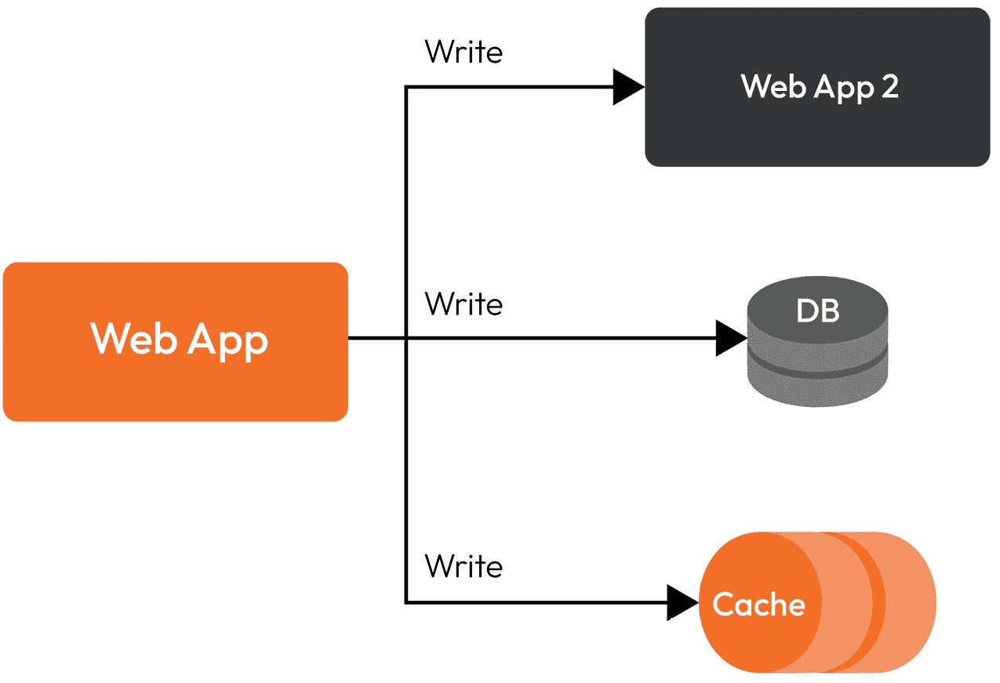

# 10

# 架构分布式系统 – 挑战和反模式

在今天的数字景观中，对可扩展和可靠系统的需求导致了分布式系统的广泛应用。这些由相互连接的组件组成的复杂网络被设计用来处理跨多台机器或节点的海量数据处理、存储和通信。然而，设计分布式系统伴随着独特的挑战和陷阱。

构建分布式系统的目标是实现高可用性、容错性、更好的性能和可扩展性，同时将工作负载分布在多个节点上。然而，这些系统的复杂性往往会产生各种挑战，架构师和开发者必须克服。从确保数据一致性和同步到管理网络延迟和优化性能，在设计分布式系统时应该考虑众多因素。

在设计分布式系统时，一个关键的挑战是实现适当的数据一致性。维护不同节点间数据的完整性和一致性至关重要，但随着系统规模的扩大，这变得越来越具有挑战性。确保给定数据块的副本都被正确且同时更新是一项重大挑战，通常需要实施复杂的同步机制。

另一个挑战在于管理网络延迟和通信开销。在分布式系统中，节点通过网络相互通信，消息穿越网络所需的时间可能会引入延迟和瓶颈。架构师必须仔细设计通信协议并选择合适的网络技术以最小化延迟并最大化系统性能。

可扩展性是设计分布式系统时必须考虑的关键因素。随着对资源和处理能力的需求增长，系统应通过无缝添加更多节点来实现水平扩展。在保持性能和避免瓶颈的同时实现这种可扩展性是一项复杂的任务，需要周密的规划和架构决策。

尽管存在这些挑战，架构师还必须意识到可能损害分布式系统有效性和可靠性的常见反模式。反模式是反复出现的、被认为是不太理想或反生产力的设计或实现实践。这些可能包括网络拥塞、单点故障、不适当的负载均衡或过度依赖中央协调器。识别和避免这些反模式对于确保分布式系统成功运行至关重要。

在本章中，我们将探讨在讨论分布式系统时现代架构的陷阱：

+   数据集成和分布式事务

+   双写反模式

+   微服务和共享数据库

+   最终一致性问题的挑战

我们将深入探讨架构师在设计分布式系统时面临的挑战，并探讨在过程中可能出现的常见反模式。通过理解这些挑战并避免陷阱，架构师和开发者可以创建出既稳健又高效的分布式系统，以满足现代应用的需求。通过最佳实践和实际见解，我们旨在为您提供构建分布式系统和有效减轻潜在风险的知识和工具。

# 数据集成和分布式事务

数据集成对于构建分布式系统至关重要，在这些系统中，不同的数据源必须被协调并可供各种系统组件访问。随着数据和分布式节点规模的增加，与数据集成相关的挑战变得更加复杂。在此背景下，一个关键考虑因素是分布式事务的协调。

维护数据完整性对于分布式事务至关重要，并确保系统表现得好像它在一个集中式数据库上执行单个事务。分布式事务是指必须在多个节点上原子执行的相关的数据库操作。在数据分布在不同的节点上的分布式系统中，确保这些操作的一致性和隔离性变得复杂。

下图展示了数据被整合到两个服务中，每个服务都有一个数据库。在这个阶段，需要协调以保证数据一致性和安全性：

图 10.1：分布式系统中的事务工作流程

然而，在规模上实现分布式事务一致性带来了重大挑战。在集中式数据库中通常保证的**原子性、一致性、隔离性和持久性**（**ACID**）属性，由于网络延迟、节点故障和并发问题，在分布式节点上执行变得更加困难。

解决这些挑战的一种方法是通过使用分布式事务协议，如**两阶段提交**（**2PC**）或**三阶段提交**（**3PC**）。这些协议协调分布式事务中多个节点之间的提交或回滚决策。然而，这些协议存在局限性，包括如果协调节点不可用，会增加延迟和故障脆弱性。以下图示了 2PC 的序列：

图 10.2：2PC 示意图

另一种方法是采用更宽松的一致性模型，如最终一致性或乐观并发控制。这些模型以牺牲严格的一致性保证为代价，换取更高的可扩展性和可用性。当实时一致性不是严格必需时，这些模型可以通过允许暂时不一致和异步解决冲突来表现更好。

此外，分布式数据集成通常涉及处理具有不同模式和格式的异构数据源。数据转换和映射变得至关重要，以确保来自不同来源的数据可以有效地组合和处理，这通常伴随着性能成本。为了创建分布式系统的一致视图，可以使用诸如**提取**、**转换**和**加载**（**ETL**）或数据虚拟化等方法来组合来自各种来源的数据。

分布式事务系统需要谨慎的设计决策来平衡一致性、可扩展性和性能之间的权衡。在设计大规模数据集成时，考虑数据一致性需求、延迟、容错性和性能因素是至关重要的。理解不同事务模型的特点和限制，并采用适当的数据集成技术，可以帮助架构师和开发者解决与分布式数据集成相关的复杂性，并确保系统的可靠性和效率。

总结来说，在分布式系统中进行大规模数据集成需要解决分布式事务的挑战以及维护多个节点之间的一致性。架构师和开发者在设计分布式事务系统时必须考虑一致性保证、可扩展性和性能之间的权衡。组织可以通过采用适当的交易协议、一致性模型和数据集成技术，有效地管理和集成大规模数据到他们的分布式系统中。

分布式数据库具有挑战性，因此我们应该利用最佳架构来最小化陷阱。接下来，我们将讨论在管理一个不信任的系统时记录的错误，这个错误特别与双写过程相关，以及为什么应该避免它。

# 双写反模式

双写是一种软件开发模式或方法，其中数据在实时同时写入两个或更多独立的系统或数据库。双写的目的是确保在不同目的或需要额外数据的多个系统中保持数据的一致性和同步。以下图示展示了这一操作，其中单个 Web 应用多次写入数据库、缓存和第二个应用程序。

图 10.3：双写操作

虽然双写对于数据集成和同步可能看起来很方便，但它通常被认为是一种反模式。但如果一个更新成功而另一个失败会发生什么？以下是一些为什么双写可能成为问题的原因：

+   **复杂性和耦合**: 实施双向写入会在不同系统之间引入复杂性和紧密耦合。它增加了维护开销，并使系统更加脆弱，容易出错。任何一个系统的任何更改或更新都可能需要在双向写入过程中涉及的所有其他系统中进行相应的更改。

+   **性能开销**: 双向写入会对系统产生显著的性能影响。在实时同步写入多个系统可能会引入延迟并降低整体系统性能。随着涉及系统的数量增加，性能影响变得更加明显，可能导致用户体验下降。

+   **不一致性和故障**: 双向写入不能保证所有系统之间的一致性。在写入过程中出现的故障，如网络问题或系统故障，可能导致不同系统之间数据状态不一致。处理这些故障和解决不一致性可能具有挑战性且耗时。

+   **数据完整性挑战**: 使用双向写入维护数据完整性变得更加复杂。确保所有涉及的系统都正确且同时更新，没有任何数据丢失或损坏，需要实施复杂的机制，如分布式事务。这些机制增加了复杂性，并可能进一步影响性能。

+   **可扩展性限制**: 随着系统的增长，双向写入的可扩展性变得越来越具有挑战性。随着设计和数据量的增加，同步所有系统写入的开销变得更加难以有效管理。将双向写入扩展到处理高吞吐量场景可能需要额外的基础设施和优化努力。

不要仅仅依赖双向写入，让我们探索其他集成和同步数据的选择。以下是一些推荐的替代方案：

+   **ETL**: 使用 ETL 流程，可以从源系统中提取数据，将其转换为适当的格式，然后加载到目标系统中。这种方法允许系统之间有更多的灵活性和解耦，可以根据需要执行数据转换和映射。

+   **事件驱动架构**: 采用事件驱动架构可以帮助异步地在系统之间传播数据更改或事件。它解耦了系统，并允许更灵活和可扩展的数据集成。当数据发生变化时，会发布事件，已订阅的感兴趣系统可以相应地做出反应。

+   **消息队列**: 利用消息队列可以提供可靠和可扩展的数据集成和同步机制。系统可以向队列发布消息，而订阅系统可以以自己的节奏消费它们，确保异步和解耦的通信。

通过采用这些替代方法，组织可以在避免双重写入陷阱的同时实现数据集成和同步。这些方法提供了更多的灵活性、可扩展性和可维护性，从而能够更好地管理分布式数据系统。

不幸的是，双重写入是我们作为分布式架构师面临的最常见的反模式，这是一个错误。现在，让我们转到第二个主题：微服务与共享数据库。

# 微服务与共享数据库

微服务架构的使用越来越受欢迎，因为它允许你创建可扩展和灵活的系统。这种方法涉及将应用程序分解成更小、独立的微服务，这些服务可以单独开发、部署和扩展。然而，尽管它有诸多优点，但在多个服务之间共享数据库可能会带来挑战和不利因素。

下图展示了一个示例，其中三个应用程序共享同一个数据库。从短期来看，我们可以想象这将节省我们一些电力资源，但从长远来看，我们开始质疑代价。如果我们创建了一个不一致的数据事件，我们如何知道哪个应用程序包含错误？我们可能还会遇到安全问题，如未经授权的数据访问：

图 10.4：微服务中的共享数据库

多个微服务共享数据库可以引入几个挑战和不利因素。这包括数据耦合和依赖、性能瓶颈、缺乏自主权和所有权、数据完整性和一致性问题和可扩展性和部署灵活性限制。由于共享数据而导致的紧密耦合可能会减慢开发速度并阻碍单个服务的灵活性和自主性。对数据库资源的竞争可能导致性能下降，尤其是在多个服务同时访问同一数据库时。共享数据库也模糊了所有权界限，使得难以确定负责数据相关问题的服务。确保数据完整性和一致性在多个服务向同一数据库写入时变得复杂，并且可能会出现冲突和不一致。将数据库扩展以适应来自众多服务的负载变得具有挑战性，并且由于必要的模式更改和迁移影响其他服务，部署新服务或进行更改可能会变得复杂。

+   **数据耦合和依赖**：在多个微服务之间共享数据库会在服务之间引入紧密耦合。数据库模式或数据模型的变化可能会影响多个服务，需要协调和同步的努力。这可能会减慢开发速度并阻碍单个服务的灵活性和自主性。

+   **性能瓶颈**：当多个服务访问相同的共享数据库时，对数据库资源的竞争可能会成为瓶颈。来自各种服务的增加流量和并发请求可能导致性能下降，因为数据库成为争用点。随着来自多个服务的负载必须得到适应，扩展数据库变得更加具有挑战性。

+   **缺乏自主权和所有权**：微服务架构强调单个服务的自主权和所有权。共享数据库模糊了所有权的界限，因为多个服务都可以访问并修改相同的数据。这可能会造成混淆，并使确定负责数据相关问题或错误的负责服务变得更加容易。

+   **数据完整性和一致性**：当多个服务写入同一数据库时，维护数据完整性变得更加复杂。涉及多个服务时，协调事务和管理并发变得更加复杂。确保一致性和在服务之间执行业务规则可能具有挑战性，因为可能会出现冲突和数据不一致。

+   **可扩展性和部署灵活性**：共享数据库可能会限制微服务的可扩展性和部署灵活性。随着系统的增长，由于多个服务带来的负载增加，扩展数据库变得更加具有挑战性。此外，部署新服务或更改现有服务变得更加复杂，因为它们可能需要数据库模式更改或影响其他服务的数据迁移。

以下图表展示了几个服务之间的隔离情况，其中每个服务都有一个专用的数据库，并对其负责。所有应用程序之间的通信将通过 API 进行；没有任何应用程序会直接与另一个应用程序的数据库进行通信：

图 10.5：每个微服务都有自己的数据库

为了应对这些挑战，为每个微服务使用一个数据库是可取的。这种方法提供了许多优势，如下所述：

+   **服务自主权和隔离**：每个微服务都有一个专用的数据库，提供独立性和隔离性。每个服务可以选择最适合其需求的数据库技术或模式。服务可以独立发展，而不会影响其他服务，从而实现更快的开发、部署和可扩展性。

+   **简化数据管理**：每个微服务使用单个数据库，使数据管理变得更加简单。它减少了协调工作，并允许服务选择最合适的数据存储技术或方法。服务完全控制其数据，包括模式更改、迁移和优化。

+   **改进的性能和可伸缩性**：专用数据库使服务能够水平扩展和独立扩展。服务可以选择针对其特定工作负载优化的数据库，确保高效的数据访问和处理。每个服务可以处理其数据库负载，提高性能和可伸缩性。

+   **清晰的拥有权和责任**：每个微服务拥有单独的数据库确保了清晰的拥有感和责任感。每个服务对其数据负责，这使得故障排除和问题解决变得更加容易。此外，它还增强了系统的可维护性和可支持性。

+   **简化的数据一致性和完整性**：使用专用数据库维护数据一致性和完整性变得更加容易管理。服务可以在其数据库内强制执行自己的业务规则和事务边界。这减少了管理分布式事务的复杂性，并减轻了数据一致性问题。

在微服务架构中，服务之间的集成应理想地通过事件进行，并且通常被认为是一种安全最佳实践，避免直接访问或修改其他服务的数据库。通过依赖事件进行通信并在每个服务的数据库周围保持严格的边界，您可以增强安全性并保护系统中的敏感数据。

以下是为什么事件和避免直接数据库访问可以促进安全性的原因：

+   **有限的攻击面**：访问其他服务的数据库会增加攻击面。将服务的数据库上下文暴露给其他服务引入了潜在的安全漏洞，如注入攻击或未经授权访问敏感数据。使用事件作为通信机制，您可以限制服务数据的暴露，并降低未经授权访问的风险。

+   **数据隔离**：微服务架构中的每个服务都有其特定的上下文和边界。通过避免直接访问其他服务的数据库，您可以保持数据隔离，并防止对数据库进行未经授权的读取或写入操作。这种隔离确保只有负责特定数据上下文的服务才能操纵或访问该数据，增强安全性和数据隐私。

+   **关注点的分离**：微服务架构强调关注点的分离，其中每个服务专注于其特定的领域。允许服务访问彼此的数据库可能会模糊这些边界，并引入潜在的数据不一致或未经授权的修改。通过依赖事件，服务可以在不破坏各自数据库封装和所有权的情况下进行通信和交换相关数据。

+   **审计和合规性**：为每个服务维护独立的数据库上下文简化了审计和合规性要求。有了专用数据库，跟踪和监控特定服务上下文内的数据访问和修改变得更加容易。它支持符合监管标准，并简化了识别和调查与安全相关的问题或违规行为。

** Saga 设计模式**用于长时间运行和分布式事务。它允许一系列本地事务，每个事务都在特定服务的上下文中，参与跨多个服务的协调和一致操作。Saga 模式允许在无需直接数据库访问的情况下，在服务之间进行通信并维护数据一致性。

在 Saga 模式下，参与事务的每个服务执行其部分并发出事件以指示其任务的完成或进度。其他对事务感兴趣的服务会监听这些事件并相应地继续其任务。Saga 模式通过依赖事件和协调的本地事务序列，确保数据一致性，而无需直接暴露或修改其他服务的数据库。

通过采用事件驱动架构并利用 Saga 模式，微服务可以安全地通信并保持数据一致性，同时坚持隔离、有限接触面和关注点分离的原则。这种方法增强了安全性并最小化了与直接访问其他服务数据库相关的风险，从而实现了一个更稳健、更安全的微服务生态系统。

在分布式架构中使用一些良好的实践可以减少陷阱和挑战的数量，但并不能消除它们。在持久化系统中保持一致性是一个永恒的挑战。然而，有一点我们需要理解和接受：**最终一致性**。在下一节中，我们将更详细地讨论这一点。

# 最终一致性问题

在分布式系统中，最终一致性是一个模型，其中数据更新不会立即同步到所有节点。相反，允许存在暂时的不一致性，并且更新会逐渐传播，直到系统收敛到一个一致的状态。

在最终一致性中，系统中的不同节点可能在任何给定时间点对数据有不同的看法。这主要是由于网络延迟、通信延迟和并发更新。然而，最终一致性确保系统达到一个一致的状态，所有节点都收敛到相同的数据。

为了解决与最终一致性相关的挑战和潜在问题，可以采用几种技术和机制：

+   当同时对同一数据进行多个更新时，可能会发生**冲突**。为了确保一致性，使用冲突解决机制来确定如何解决这些冲突。不同的技术，包括最后写入者胜出和应用定义的冲突解决策略，可以解决冲突更新。

+   **读取修复**：读取修复是一种在读取操作期间更新或同步数据以修复不一致性的技术。当读取操作遇到不一致或过时的数据时，它会触发一个修复过程，从其他节点检索数据的最新版本并更新本地副本，确保最终一致性。

+   **反熵机制**：反熵机制积极检测和解决分布式系统中的不一致性。这些机制定期比较节点间的数据，并启动同步过程以确保一致性。反熵工具的例子包括默克尔树、八卦协议和向量时钟。

+   **法定多数系统**：法定多数系统确定在分布式系统中达到一致性所需的协议级别。通过定义法定多数和法定多数的大小，系统可以确保在更新或操作被认为是一致性之前，必须有一定数量的节点同意。这有助于防止由于部分更新或故障导致的不一致性。

+   **补偿操作**：在冲突或不一致的更新无法自动解决的情况下，可以采用补偿操作。补偿操作是逆转或补偿错误或不一致更新的操作或过程。这些操作有助于恢复系统的一致性。

+   **幂等性**：设计幂等的操作可以帮助减轻不一致性。在编程和数学中，幂等性是某些操作的性质，即无论你执行多少次，你都会得到相同的结果。它确保即使由于通信延迟或重试而多次使用操作，结果仍然相同，从而防止不一致性。

如果你熟悉 NoSQL 数据库，你会记得**BASE**代表**基本上可用**，其中数据值可能会随时间变化，但最终会达到一致性。这种最终一致性是我们必须考虑的数据建模概念，以满足多个水平扩展性，并且我们可以利用从 NoSQL 数据库中学到的知识。我们可以看到一些之前提到的技术被用于这个数据库引擎上，例如 Cassandra 作为读取修复。

需要注意的是，最终一致性并不适用于所有场景。需要严格实时一致性的系统或处理关键数据的系统可能需要更关键的致性模型。然而，对于许多分布式系统来说，最终一致性在可用性、性能和数据完整性之间找到了一个平衡点。

实施和管理最终一致性需要仔细考虑系统的需求，使用适当的冲突解决策略，并选择反熵机制。通过采用这些技术，分布式系统可以有效地处理临时不一致性，并在一段时间内逐渐收敛到一致状态。

# 摘要

总之，设计分布式系统提出了独特的挑战，必须仔细解决以确保系统的成功和有效性。在本章中，我们探讨了某些挑战，例如双写和具有共享数据库的微服务，并讨论了为什么它们可能成为问题。

尽管最初对数据一致性有吸引力，但双写可能会引入复杂性、性能开销和数据完整性挑战。同样，微服务之间共享数据库可能会导致数据耦合、性能瓶颈和自主性受损。这些陷阱强调了仔细考虑替代方案的重要性，例如事件驱动架构和每个微服务使用单个数据库，以促进可扩展性、独立性和可维护性。

我们还强调了最终一致性作为分布式系统模型的重要性。虽然它允许临时数据不一致，但最终一致性平衡了可用性、性能和数据完整性。诸如冲突解决、读取修复、反熵机制、法定人数系统、补偿操作和幂等性等技术有助于解决任何挑战并确保最终一致性。

此外，文档成为分布式架构的一个关键方面。良好的文档提供了对系统、其组件及其交互的全面概述。它使开发、维护和现代化过程中的理解、协作和决策更加顺畅。

下一章将深入探讨现代化策略和数据集成。我们将探讨现有系统的现代化方法，利用数据集成技术，并深入研究促进平稳过渡和有效利用分布式架构的各种模式和技术的各种方法。
