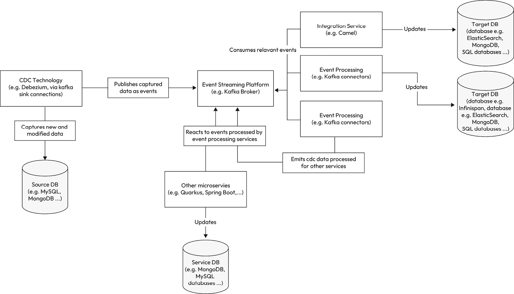

# 第十一章：现代化策略和数据集成

在当今快节奏和以数据驱动型的世界中，企业不断努力跟上不断发展的技术景观。现代化已成为各行业组织的重点，旨在提高效率、敏捷性和竞争力。现代化的一个关键方面是数据集成，它在利用数据的力量进行明智决策中发挥着关键作用。通过采用现代化策略、避免反模式和利用现代云服务，企业可以释放其数据的全部潜力，并在市场上获得竞争优势。

现代化策略包括一系列旨在将遗留系统、流程和基础设施升级以适应当代技术进步的方法。这些策略涉及将传统的本地系统转变为基于云的架构，利用微服务和容器以增加可扩展性和敏捷性，并采用 DevOps 实践以简化开发和部署流程。最终目标是使整个 IT 景观现代化，确保其能够跟上数字时代的需求。

然而，现代化努力可能会面临挑战，组织必须警惕可能阻碍进步的反模式。反模式是常见的陷阱或无效实践，可能会妨碍现代化项目的成功。一个值得注意的反模式是缺乏适当的数据集成，孤岛化的数据源和不同的系统阻碍了获取有价值见解的能力。企业越来越多地采用**变更数据捕获**（**CDC**）技术来克服这一挑战。CDC 允许组织捕获和传播实时数据变化，实现不同系统之间近乎瞬时的更新和同步。通过实施 CDC，组织可以确保其数据集成工作高效、准确且及时。

反模式是一种反复出现的解决方案或方法，它最初看起来是解决问题的正确方式，但最终会导致负面后果或次优结果。

云计算已经彻底改变了 IT 景观，为组织提供了前所未有的可扩展性、灵活性和成本效益。云原生技术，如无服务器计算和容器化，使组织能够构建高度可扩展和具有弹性的应用程序，以适应波动的工作负载和不断变化的企业需求。通过将遗留系统迁移到云，企业可以利用云提供商提供的强大基础设施、托管服务和高级分析能力。此外，现代化策略可以从利用现代云服务中获得显著的好处。

在本章中，我们将探讨更多关于以下主题的内容：

+   应用现代化策略

+   避免与数据存储相关的反模式和不良实践

+   CDC 模式简介

+   采用云技术和云服务

现代化策略和数据集成在现代商业景观中至关重要。通过拥抱现代化，避免诸如数据集成不良等反模式，并利用现代云服务的力量，组织可以释放其数据的真正潜力，推动创新，并保持竞争优势。现代化之旅需要周密的规划，深入了解组织的目标，并致力于利用尖端技术。有了正确的方法，企业可以应对现代化的复杂性，为成功的数字化转型铺平道路。

# 应用程序现代化策略

应用程序现代化策略包括更新和转换现有的遗留应用程序，以满足现代数字景观的需求。遗留系统通常以过时的技术和僵化的工作流程为特征，可能会阻碍组织进行创新、快速响应市场需求以及充分利用新兴技术的潜力。通过实施应用程序现代化策略，企业可以重振其软件资产，增强可扩展性，提高性能，并增加敏捷性。

过早优化总是危险的；认为*单体*等同于*遗留*是一种错误。作为软件工程师，我们需要了解业务需求和上下文。记住，任何解决方案中都不包括单体和微服务架构风格。

应用程序现代化有几种方法，每种方法都有其优势和考虑因素。让我们探讨一些常见的策略以及如何有效地应用它们：

+   重宿主或迁移，涉及在不进行重大代码更改的情况下将现有应用程序迁移到现代基础设施。这种策略提供了更快的迁移速度，最小化中断。重平台化通过利用云原生功能或服务，如可扩展性和托管数据库，来优化应用程序的性能。关键是确保在迁移到新基础设施时保持兼容性和配置调整——例如，云平台如**亚马逊网络服务**（**AWS**）、**微软 Azure**和**谷歌云平台**（**GCP**）。

+   重构主要关注改进现有应用程序的代码库、结构和架构。这种策略涉及进行重大的代码更改，优化性能，增强可扩展性，并采用模块化或微服务架构。目标是使应用程序与现代化开发实践保持一致，例如采用容器化、解耦组件以及利用新的框架或库。

+   重建，也称为重写，涉及从头开始，同时保留原始应用程序的功能和业务逻辑。这种策略允许利用现代开发框架、工具和架构模式。然而，它需要仔细规划，这可能耗时且资源密集。分析现有应用程序的优势和劣势，以确保新应用程序能够有效满足业务需求至关重要。

+   替换策略涉及完全用现成的商业软件包或**软件即服务（SaaS**）解决方案来替换遗留应用程序。当现有应用程序不再满足业务需求，且采用预构建解决方案比投资于现代化遗留系统更经济时，这种方法是合适的。

当出现特定的组织触发因素或挑战时，实施遗留现代化策略至关重要。让我们检查考虑现代化的常见原因，作为遗留技术堆栈：

+   通常运行在过时的技术之上，这些技术不再受支持或与现代软件组件不兼容。这可能导致安全漏洞、维护成本增加和有限的集成能力。现代化有助于缓解这些风险，并确保应用程序保持可行和安全。

+   可能需要帮助来处理不断增长的工作负载并交付最佳性能。现代化使应用程序能够水平或垂直扩展，利用基于云的资源，并采用现代架构模式，从而提高性能和可伸缩性。

+   由于其单体结构和僵化的工作流程，常常阻碍敏捷开发方法和 DevOps 实践的采用。应用现代化推崇模块化设计、微服务和容器化，使组织能够拥抱敏捷方法，快速迭代，并更频繁地部署变更。

+   可能无法提供现代化的用户体验或跟上行业标准，因为用户期望不断演变，竞争者持续创新。现代化策略可以提升应用程序的用户界面，引入新功能，并利用如**人工智能（AI**）、**机器学习（ML**）或移动平台等新兴技术。

对于希望适应、创新并在数字时代保持竞争力的组织来说，应用现代化策略至关重要。选择适当的现代化方法可以最小化对您的业务/组织的影响。但在开始这一现代化过程之前，审查需求和目标，以了解是否必要。特别是当我们谈论持久层时，重构可能是一个风险和相当大的成本；它比在**集成开发环境（IDE**）中进行代码重构更为简单。那么，让我们谈谈数据中的那些反模式。

# 避免与数据存储相关的反模式和不良实践

几种常见的反模式和不良实践可能会阻碍应用程序持久层的性能、可扩展性和可维护性。理解反模式和有害实践之间的区别对于准确识别和缓解这些问题至关重要。

反模式在软件开发中很常见，可能源于设计决策不佳、理解不足或遵循过时的实践。持久层中的反模式可能包括以下内容：

+   **对象关系阻抗不匹配**：当应用程序代码中使用的面向对象（**OO**）模型与数据库中使用的关联模型之间存在显著脱节时，就会发生这种反模式。它可能导致过度映射和转换逻辑、性能下降以及维护数据一致性复杂性增加。为了避免这种反模式，考虑使用提供应用程序代码和数据库之间无缝集成的**对象关系映射**（**ORM**）框架，以减少阻抗不匹配。

+   **在表示层中进行数据访问**：这种反模式涉及在表示层直接执行数据访问操作，例如在用户界面组件中。它违反了**关注点分离**（**SoC**）的原则，导致代码紧密耦合、维护和测试困难以及可重用性降低。虽然很少推荐，但直接从表示层检索数据有一些好的用途。为了解决这个问题，遵循分层架构模式（如**模型-视图-控制器（MVC）**或**模型-视图-视图模型（MVVM）**），其中数据访问操作在单独的数据访问层中执行。

+   **在循环中查询数据库**：这种反模式发生在应用程序在循环中执行单个数据库查询而不是使用批量操作时。它导致数据库往返次数过多、网络开销增加和性能下降。为了避免这种情况，使用批量处理、批量插入或更新以及缓存机制来优化查询，以最小化数据库交互次数。

另一方面，不良实践指的是通常被认为效率低下、次优或损害软件整体质量的行动或习惯。与反模式不同，不良实践可能不是重复的解决方案，而是应该避免的具体行动或选择。持久层中不良实践的例子包括以下内容：

+   **缺乏连接池**：未能利用连接池可能导致性能问题，尤其是在高流量应用程序中。为每个请求或操作打开和关闭数据库连接可能会导致资源争用、增加开销和降低可扩展性。实现数据库驱动程序或框架提供的连接池技术来高效管理连接是至关重要的。

+   **未使用预编译语句或参数化查询**：通过直接连接用户输入或动态值来构建 SQL 查询可能会使应用程序面临 SQL 注入攻击。使用预编译语句或参数化查询至关重要，这可以确保用户输入被视为数据而不是可执行代码，从而降低安全风险。

为了避免持久层中的反模式和不良实践，请考虑以下方法：

+   **教育和培训开发者**：确保开发者对最佳实践、设计模式和现代持久化方法有扎实的理解。提供培训课程、研讨会或资源，以更新他们对行业标准和新兴技术的了解。

+   **遵循设计原则和模式**：应用设计原则，如 **SOLID**（代表 **单一职责、开闭原则、里氏替换原则、接口隔离原则、依赖倒置**），并使用适当的设计模式，如 **数据访问对象**（**DAO**）、仓库或 ORM 模式。这些原则和模式促进了 SoC、模块化和可维护性。

+   **使用 ORM 或查询构建器**：采用提供抽象层以处理数据库交互的 ORM 框架或查询构建器。如 Hibernate、**Entity Framework**（**EF**）或 Sequelize 等 ORM 工具可以帮助减少对象关系阻抗不匹配，并高效处理数据访问操作。

+   **实现连接池**：利用数据库驱动程序或框架提供的连接池技术来高效管理和重用数据库连接。连接池有助于避免为每个请求建立新连接的开销，提高性能和可扩展性。

+   **清理用户输入并使用预编译语句**：始终过滤和清理用户输入，并避免直接将动态值连接到 SQL 查询中。相反，利用数据库 API 提供的预编译语句或参数化查询。这种方法通过将用户输入视为漏洞而不是可信输入，防止 SQL 注入攻击和许多用户输入错误。

+   **执行代码审查和重构**：定期进行代码审查，以识别反模式、不良实践和改进领域。鼓励持续改进的文化，让开发者能够提供反馈、提出改进建议并对代码进行重构，以符合最佳实践。

+   **测试和基准性能**：实施彻底的单元测试和集成测试以验证数据访问操作的正确性。进行性能测试和基准测试以识别瓶颈并优化查询执行时间。例如，JMeter 或 Gatling 等工具可以帮助模拟负载并测量性能指标。

+   **保持更新并参与社区**：了解持久技术及其框架的最新进展、更新和最佳实践。通过论坛、会议或在线社区与开发社区互动，分享经验，向他人学习，并发现新技术。

采用这些实践并保持对代码质量和性能优化的主动方法可以显著减少持久层中反模式和不良做法的发生，从而实现更健壮、可维护和可扩展的应用程序。谈到良好的做法，在接下来的会话中，我们将探讨最现代的一个，即 CDC，以及它如何帮助你在持久层之旅中。

# CDC 模式简介

**变更数据捕获**（**CDC**）是一种用于跟踪和捕获数据库中数据变更的技术。它使组织能够识别、捕获和传播数据变更，几乎在实时进行，提供了一种可靠且高效的数据集成和同步方法，跨越不同的系统。

下图展示了使用 CDC 模式的一个示例，其中我们有一个触发事件的源，基于此事件，每个订阅者导致两个数据库目标：

图 11.1 – CDC 架构表示

CDC 的过程涉及监控和捕获在数据库级别发生的变化，如插入、更新和删除，并将这些作为单独的事件发出。而不是不断轮询整个数据库以查找变更，CDC 机制仅跟踪和捕获修改后的数据，减少不必要的开销并提高性能。

让我们来看看 CDC 的一些其他优势：

+   **实时数据集成**：CDC 使组织能够几乎在实时捕获和传播数据变更，确保集成系统可以访问最新的信息。这种实时数据集成允许更准确的报告、分析和决策。

+   **提高数据一致性**：通过在不同系统间捕获和同步数据变更，CDC 有助于保持数据一致性和完整性。在一个设计中进行的更新可以自动反映在其他系统中，消除了手动数据输入或批量处理的需求。

+   **降低延迟**：CDC 显著减少了数据变化与在其他系统中可用性之间的延迟。这在需要及时访问最新数据的场景中尤为重要，例如在金融交易、库存管理或实时分析中。

+   **最小化对源系统的影响**：与传统基于批处理的数据集成方法不同，CDC 通过增量捕获变更而不是提取和加载大型数据集来减少对源系统的影响。它减少了源系统的负载并避免了性能下降。

+   **高效的数据复制**：CDC 使数据库或系统之间的数据复制变得高效。它只捕获和传输变更的数据，减少网络带宽需求并提高复制性能。

CDC 在以下场景中具有优势：

+   **数据仓库和商业智能（BI）**：CDC 促进了操作数据库与数据仓库或数据湖的集成，确保分析、交易处理和报告系统可以访问最新的数据。它使组织能够根据最新的信息做出数据驱动的决策。

+   **微服务和事件驱动架构（EDA）**：在 EDA 中，一个微服务的变更会触发其他微服务的操作。通过实时捕获数据变更，CDC 允许微服务对最新的数据更新做出反应和处理，确保系统的一致性。

+   **数据同步和复制**：当多个数据库或系统需要相互同步并保持最新状态时，CDC 提供了一个高效机制来捕获和传播变更。这在涉及分布式系统、多站点部署或为**灾难恢复（DR**）目的进行数据复制的情况下尤其相关。

+   **遗留系统集成**：CDC 可用于将遗留系统与现代应用程序或数据库集成。通过从遗留系统捕获变更并将它们传播到现代系统，组织可以利用新技术的能力，同时保持现有系统的功能。

虽然 CDC 在许多场景中可能非常有用，但也有一些情况可能不适合使用 CDC。以下是一些 CDC 可能不是最佳选择的情况：

+   **不频繁或影响低的数据变更**：如果您的系统中的数据变更不规律或对下游系统的影响很小，实施 CDC 可能会引入不必要的复杂性。在这种情况下，传统的基于批处理的数据提取和加载过程可能就足够了。

+   **小型或简单应用程序**：对于数据源有限且集成要求简单的应用程序，实施 CDC 的开销可能超过了其带来的好处。CDC 在具有多个系统和数据库的复杂、大规模环境中具有优势。

+   **严格的实时要求**：尽管 CDC 提供了近实时数据集成，但它可能不适合需要立即或亚秒级数据传播的场景。其他方法，如事件源或流平台，可能更合适。

+   **高频和高量数据变更**：如果你的系统经历极高频或大量的数据变更，实施 CDC 可能会给源数据库和基础设施带来负担。在这种情况下，考虑其他能够有效处理规模的数据集成技术可能更有效率。

+   **数据安全和合规问题**：当数据安全或合规法规严格禁止或限制数据复制或移动时，CDC 可能不推荐使用。在实施 CDC 之前，评估和遵守数据治理和合规要求至关重要。

+   **成本和资源限制**：CDC 的实施通常需要额外的基础设施、监控和维护开销。如果你有预算限制或有限的资源来管理和支持 CDC，其他数据集成方法可能更可行。

+   **功能有限的遗留系统**：一些遗留系统可能需要更多的功能或能力来支持 CDC。在这种情况下，将这些系统的 CDC 机制进行改造可能具有挑战性或不切实际。考虑替代集成方法或探索现代化遗留系统的选项。

+   **缺乏集成需求**：如果你的系统不需要与其他系统或数据库集成，并且作为一个独立应用程序运行，没有数据同步，那么 CDC 可能不是必需的。评估集成需求并评估 CDC 是否为你的用例增加价值。

记住——是否使用 CDC 取决于你的系统需求、复杂性和特性。在实施 CDC 之前，彻底分析你的用例，考虑其优缺点，并评估替代数据集成技术是至关重要的。

总结来说，CDC 是一种强大的技术，用于在近实时捕获和传播数据变更。其好处包括以下内容：

+   实时数据集成

+   提高数据一致性

+   降低延迟

+   最小化对源系统的影响

+   高效的数据复制

CDC 在数据仓库、微服务、EDA、数据同步、复制和遗留系统集成中特别有价值。

这是一项巨大的工作，好消息是我们可以与他人一起完成；公共云服务提供的选择增多，可以为我们提供很多帮助，尤其是在更多地关注业务和委托非核心任务方面。当我们谈论云中的服务时，有一个是隐含的：DBaaS，我们不需要成为专家或在我们身边有专家；让我们在下一节中更深入地探讨它。

# 采用云技术和云服务

云服务为应用程序的持久层提供了众多优势，提供了增强的数据库体验，并减轻了组织在管理和维护方面的各种任务。在此背景下，一个特定的服务是**数据库即服务（DBaaS**），它允许用户利用数据库的力量，而无需广泛的专家知识或基础设施管理。

DBaaS 是传统的；设置和管理数据库涉及大量工作，包括硬件配置、软件安装、配置和持续维护。然而，DBaaS 将这些责任转移到了**云服务提供商（CSP**），使用户能够更多地关注其应用程序开发和业务逻辑。

这里有一些云服务，尤其是 DBaaS，如何使持久层受益的方法：

+   **简化数据库管理**：DBaaS 抽象了管理数据库的复杂性，使得开发者和团队能够更容易地处理持久层。**服务提供商（SPs**）处理数据库安装、打补丁和升级等任务，减轻了用户这些耗时且有时容易出错的活动。

+   **可扩展性和性能**：云服务提供垂直扩展（增加单个实例的资源）或水平扩展（添加更多模型以分散负载）的能力。这种可扩展性确保数据库能够处理不断增长的工作负载，并提供最佳性能以满足应用程序的需求。

+   **自动备份和恢复**：云服务提供商（CSPs）通常提供自动数据库备份和恢复机制。这确保了定期进行备份，降低了数据丢失的风险。此外，在灾难或故障发生时，云提供商可以促进快速有效的恢复，最小化停机时间并确保数据可用性。

+   **高可用性（HA）和容错性（FT）**：云服务通常提供内置机制以在数据库系统中实现高可用性和容错性。这些机制包括自动故障转移、复制和地理分布式的数据中心。这些功能有助于确保数据库即使在硬件故障或网络中断的情况下也能保持可访问性和弹性。

+   **安全和合规性**：云服务提供商（CSPs）优先考虑安全性，并投资于强大的基础设施和数据保护措施。他们实施行业标准的安全实践、加密机制和合规性认证。这使得组织能够从提供商的专业知识中受益，并专注于确保其数据的安全性和合规性，而无需自己构建和维护这些措施。

+   **成本效益**：使用云服务作为持久层可以具有成本效益，消除了投资昂贵硬件基础设施的需求，并减少了持续维护和运营成本。云服务提供商通常提供与实际使用相匹配的定价模式，允许组织根据其消耗的资源付费，而不是进行重大前期投资。

通过利用云服务，组织可以将管理数据库的责任转移出去，专注于其核心业务目标。“别人的电脑”这个笑话突出了将数据库相关问题委托给云服务提供商的优势。SP 负责升级数据库、备份和恢复、数据分区、确保可伸缩性、释放资源以及简化内部管理这些方面的复杂性。

云服务，尤其是 DBaaS，使组织能够利用强大、可伸缩和高度可用的数据库，而无需广泛的专家知识或基础设施管理。通过简化管理、增强可伸缩性、自动备份和恢复、高可用性、安全措施和成本效益，云服务为现代应用程序的持久层提供了一个有价值的解决方案。

# 摘要

在这本书中，我们探讨了应用程序现代化的各个方面，重点关注策略、反模式和利用现代云服务来增强应用程序持久层的方法。我们强调了采用现代化策略的重要性，以跟上技术发展的步伐，并满足用户和业务不断变化的需求。

我们讨论了避免持久层中的反模式和不良做法的重要性，因为这些做法可能会阻碍应用程序的性能、可维护性和可伸缩性。开发者可以通过了解这些反模式和它们的影响，以及通过实施最佳实践，如适当的设计原则、ORM 框架和连接池，来确保持久层的健壮和高效。

我们还探讨了 CDC 概念及其在跨系统捕获和传播数据变化方面的好处。CDC 实现了实时数据集成、改进数据一致性和高效的数据复制，使其在各种场景中成为一种有价值的技巧，例如数据仓库、微服务架构和数据同步。

此外，我们深入探讨了云服务的优势，特别是 DBaaS 在简化数据库管理、增强可伸缩性、提供自动备份和恢复、确保高可用性和容错性以及解决安全和合规性问题。通过利用 DBaaS，组织可以将数据库相关任务委托给云服务提供商，并专注于其核心目标。

随着本书的结束，我们已经涵盖了与应用程序现代化、持久层优化以及利用云服务相关的根本概念和实践。以下章节总结了我们的讨论，提供了关键要点和最终考虑事项，以指导你的应用程序现代化之旅。

记住——紧跟新兴技术，遵循最佳实践，以及拥抱云服务，这些都能赋予你构建现代、高效和可扩展的应用程序的能力，以满足当今动态数字景观的需求。通过采取主动的现代化方法并利用云服务的力量，你可以在技术不断演变的世界上为你的应用程序的成功定位。
