一只兔子跃然纸上

**消息传递**或**消息队列**是应用程序或组件之间的一种通信方式。得益于消息队列，这些应用程序可以在处理各自任务时保持完全独立。消息通常是小型请求、回复、状态更新，甚至是仅仅信息。消息队列提供了一个临时的地方让这些消息停留，允许应用程序根据需要发送和接收它们。

RabbitMQ 是一个开源的消息代理，作为独立应用程序的中介或中间人，为它们提供了一个共同的平台来通信。RabbitMQ 主要使用基于 Erlang 的 **高级消息队列协议**（**AMQP**）的实现，它支持诸如集群和消息的复杂路由等高级功能。

本章包括有关如何开始使用 RabbitMQ 以及它为何会惠及架构的信息。本书通过一个虚构的出租车公司，**完整汽车**（**CC**），来展示他们如何将 RabbitMQ 集成到架构中。本章展示了如何安装和配置 RabbitMQ，使其易于启动和运行。

本章将涵盖以下主题：

+   解释消息队列

+   发现 AMQP 和 RabbitMQ

+   在现实生活中使用 RabbitMQ

+   探索消息队列的好处

+   RabbitMQ 场景

+   准备使用 RabbitMQ

让我们开始吧！

# 第二章：技术要求

本章的代码文件可以在 GitHub 上找到：[`github.com/PacktPublishing/RabbitMQ-Essentials-Second-Edition/tree/master/Chapter01`](https://github.com/PacktPublishing/RabbitMQ-Essentials-Second-Edition/tree/master/Chapter01)。

# 解释消息队列

烟雾信号、信使、信鸽和信号旗：如果这是一个谜语，那么“**信息**”这个词会立刻浮现在脑海中。人类始终有连接的需求，寻找新的方法来克服不同需要沟通的人群之间的距离带来的挑战。人类在现代技术的帮助下已经走了很长的路，但本质上，基础仍然如此。发送者、接收者和信息是所有通信基础设施的核心。

软件应用也有同样的需求；系统需要相互通信和发送信息。它们有时需要确保发送的信息已经到达目的地，有时它们需要立即收到回应。在某些情况下，它们甚至可能需要收到多个回应。基于这些不同的需求，系统之间出现了不同的通信风格。

AMQP，RabbitMQ 的默认协议，将在下一节中解释。

# 发现 AMQP 和 RabbitMQ

消息队列是一种单向通信风格，它为系统之间提供异步交互。随着本章继续描述消息队列的工作方式，其优势将变得明显。关于请求-响应消息交换模式的背景信息将阐明 RabbitMQ 的工作原理。

## 请求-响应消息交换模式

存在许多种消息交换模式，但请求-响应式是最常见的。一个系统作为客户端，与另一个远程系统交互，该系统作为服务器。客户端发送数据请求，服务器响应请求，如下面的图所示：

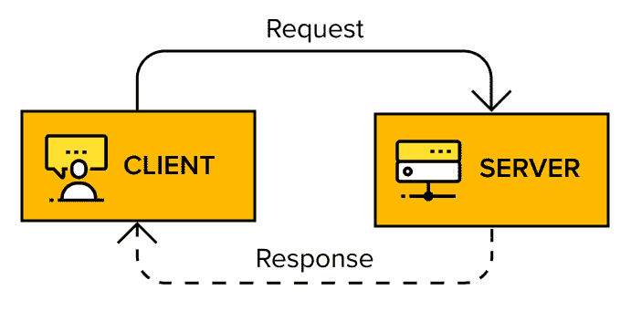

图 1.1：客户端与服务器之间的请求-响应交互

当客户端必须立即得到响应或希望服务立即完成任务时，例如在打电话给餐厅预订桌子时，会使用请求-响应式：

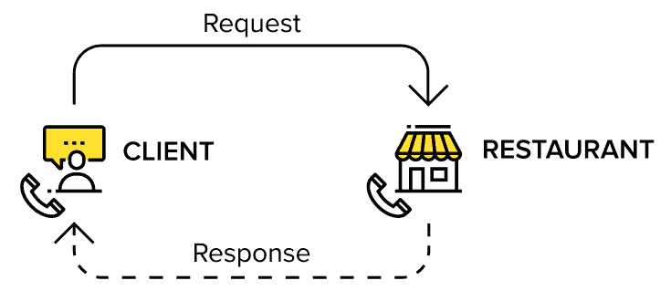

图 1.2：客户端与餐厅之间的请求-响应

无论其形式是远程过程调用、Web 服务调用还是资源消费，模型都是相同的：一个系统向另一个系统发送消息并等待远程方的响应。系统以点对点的方式相互通信，其中事件和进程同时发生或具有依赖性或与时间相关的事件；客户端与服务器之间的交互是**同步**的。

一方面，这种请求-响应式风格为开发者提供了一个简单的编程模型，因为所有事情都是按程序发生的。另一方面，双方之间的紧密耦合对整个系统的架构产生了深远的影响，因为它难以演进，难以扩展，也难以独立发布。

## 消息队列交换模式

消息队列是一种单向交互风格，其中一个系统通过消息异步地与另一个系统交互，通常通过消息代理。在异步通信模式下，请求系统不需要等待答案或要求返回信息；无论发生什么情况，它都会继续处理。这种交互的最常见例子是电子邮件。关键是，异步通信不涉及等待响应以继续处理。事实上，可能没有响应，或者发送响应可能需要一些时间。无论哪种情况，系统都不会依赖于响应来继续进程。

消息单向流动，从发布者到代理，最后到消费者：


图 1.3：基于消息队列的单向交互的基本组件

系统和应用程序同时扮演消息发布者（生产者）和消息消费者（订阅者）的角色。发布者将消息发布给一个代理，他们依赖这个代理将数据传递给目标消费者。如果需要响应，它将通过相同的机制在某个时间点到达，但方向相反（消费者和生产者的角色将互换）。

## 松散耦合架构

消息队列方法的一个大优点是系统之间变得松散耦合。它们不需要知道网络上其他节点的位置；仅仅一个名字就足够了。因此，系统可以独立地发展，不会相互影响，因为消息传递的可靠性委托给了代理。

以下图表展示了发布者和消费者之间的松散耦合：

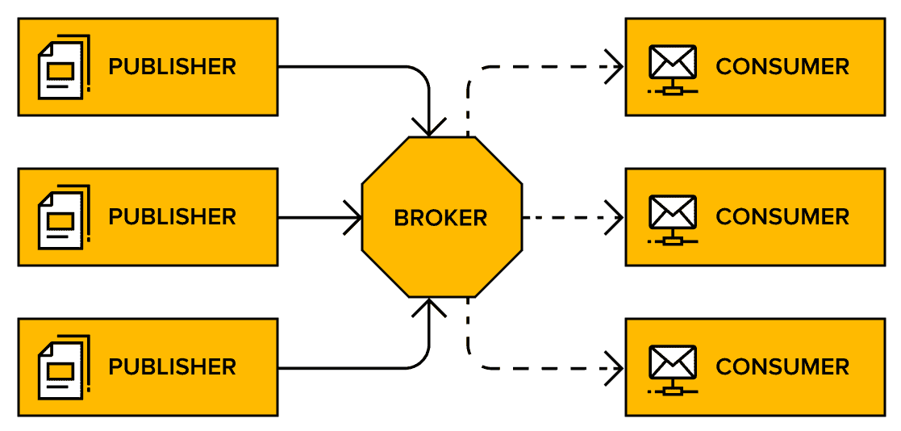

图 1.4：消息队列实现松散耦合架构

如果系统因任何原因关闭，系统的另一部分仍然可以运行，它们之间应该发送的消息将等待在队列中。

通过消息队列表示的架构允许以下功能：

+   发布者或消费者可以逐个更新，而不会相互影响。

+   每一方的性能都不会影响另一方。

+   发布者或消费者允许失败而不会相互影响。

+   发布者和消费者实例的数量可以根据需要扩展，以独立地适应它们的工作负载。

+   消费者和发布者之间的技术混合。

这种方法的主要缺点是程序员不能依赖于程序性编程的心理模型，其中事件一个接一个地发生。在消息传递中，事情是随着时间的推移发生的。系统必须被编程来处理这种情况。

如果这一切有点模糊不清，可以参考一个众所周知的协议，**简单邮件传输协议**（**SMTP**）。在这个协议中，电子邮件被发布（发送）到 SMTP 服务器。这个初始服务器随后存储并转发电子邮件到下一个 SMTP 服务器，依此类推，直到到达收件人的电子邮件服务器。此时，消息将在收件箱中排队，等待消费者取走（通常是通过 POP3 或 IMAP）。在 SMTP 中，发布者不知道电子邮件何时会被投递，或者是否最终会被投递。在投递失败的情况下，发布者会在稍后得知问题。

唯一确定的事实是，代理已经成功接收了最初发送的消息。整个过程可以在以下图表中看到：

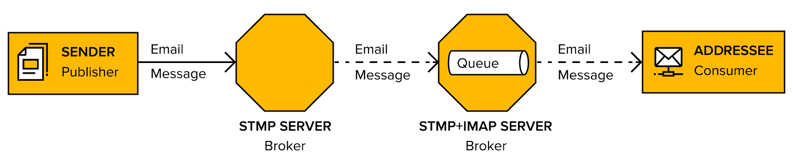

图 1.5：将电子邮件基础设施作为消息队列的类比

此外，如果需要响应，它将使用相同的交付机制异步到达，但发布者和消费者的角色相反。

在确立了这些基本概念之后，现在是深入探讨本书将使用的消息协议——AMQP 的最佳时机。

## 了解 AMQP

**AMQP**是一个开放标准协议，它定义了系统如何交换消息。该协议定义了一套规则，这些规则需要由将要相互通信的系统遵循。除了定义消费者/生产者和代理之间的交互外，它还定义了交换的消息和命令的表示。AMQP 真正实现了互操作性，因为它指定了消息的线格式，没有留给特定供应商或托管平台任何解释的空间。由于它是开源的，AMQP 社区非常活跃，并在多种语言中实现了代理和客户端实现。

RabbitMQ 基于 AMQP 0-9-1 规范构建，但提供了支持 AMQP 1.0 的插件。

可以在[`www.rabbitmq.com/resources/specs/amqp0-9-1.pdf`](http://www.rabbitmq.com/resources/specs/amqp0-9-1.pdf)下载 AMQP 0-9-1 规范。

以下列出了 AMQP 的核心概念，这些概念将在后续章节中详细解释：

+   **代理或消息代理**：代理是一段软件，它从应用程序或服务接收消息，并将它们传递给另一个应用程序、服务或代理。

+   **虚拟主机，vhost**：虚拟主机存在于代理中。它是将使用相同 RabbitMQ 实例的应用程序分离的一种方式，类似于代理内部的一个逻辑容器；例如，将工作环境分离到开发在一个 vhost 上和预发布在另一个 vhost 上，而不是设置多个代理。用户、交换、队列等都在一个特定的 vhost 上隔离。连接到特定 vhost 的用户无法访问另一个 vhost 上的任何资源（队列、交换等）。用户可以对不同的 vhost 有不同的访问权限。

+   **连接**：应用程序（发布者/消费者）和代理之间的物理网络（TCP）连接。当客户端断开连接或发生系统故障时，连接将被关闭。

+   **通道**：通道是连接中的一个**虚拟连接**。它重用连接，无需重新授权和打开新的 TCP 流。当发布或消费消息时，是在通道上完成的。可以在单个连接中建立多个通道。

+   **交换**：交换实体负责应用消息的路由规则，确保消息达到最终目的地。换句话说，交换确保接收到的消息最终进入正确的队列。消息最终进入哪个队列取决于交换类型定义的规则。一个队列至少需要绑定到一个交换，才能接收消息。路由规则包括直接（点对点）、主题（发布订阅）、广播（多播）和头部交换。

+   **队列**：队列是一系列项目；在这种情况下，是消息。队列存在于代理中。

+   **绑定**：绑定是代理中交换机和队列之间的虚拟链接。它使得消息可以从交换流向队列。

以下图表展示了 AMQP 中一些概念的整体概述：

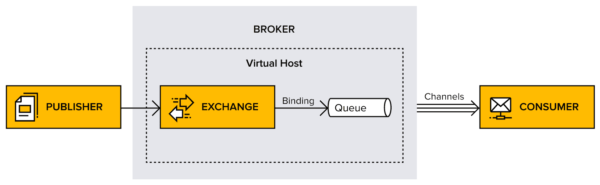


本书详细展示的开源代理是从头开始构建以支持 AMQP 的，但 RabbitMQ 也支持许多其他协议，例如 MQTT、HTTP 和 STOMP。

现在，是时候将焦点转向 RabbitMQ 了。

## RabbitMQ 代理

RabbitMQ 是 AMQP 代理的 Erlang 实现。它实现了 AMQP 的 0-9-1 版本，并添加了协议允许的自定义扩展。选择 Erlang 是因为它内在的支持构建高度可靠和分布式应用的能力。实际上，Erlang 被用于运行几个大型电信系统中的电信交换机，并报告了整个系统的九个九的可用性（这意味着每年只有 32 毫秒的停机时间）。Erlang 能够在任何操作系统上运行。

对于数据持久性，RabbitMQ 依赖于 Erlang 的内存/文件持久化嵌入式数据库 Mnesia。Mnesia 存储有关用户、交换、队列、绑定等信息。队列索引存储消息位置以及消息是否已投递的信息。消息存储在队列索引或消息存储中，这是一个在所有队列之间共享的键值存储。

对于集群，它主要依赖于 Erlang 固有的集群能力。RabbitMQ 可以通过添加插件轻松扩展。例如，可以通过这种机制在 RabbitMQ 上部署基于 Web 的管理控制台。

可以使用插件来扩展核心代理功能。RabbitMQ 有许多可用的插件，如果需要，也可以开发插件：[`www.rabbitmq.com/plugins.html`](https://www.rabbitmq.com/plugins.html)。

RabbitMQ 可以设置在单个独立实例上，或者作为多个服务器上的集群：

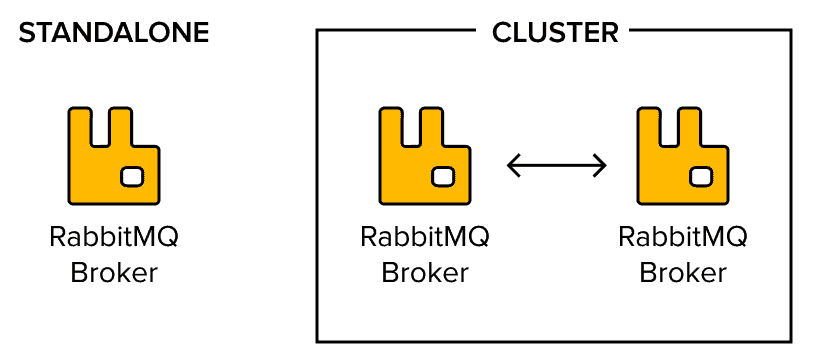

图 1.7：独立实例，或作为多个服务器上的集群

RabbitMQ 代理可以使用不同的技术，如联邦和铲子，连接在一起，以形成跨代理的智能消息路由的消息拓扑，并具有跨越多个数据中心的容量。

以下截图显示了位于世界各地不同位置的 RabbitMQ 代理之间的联邦：

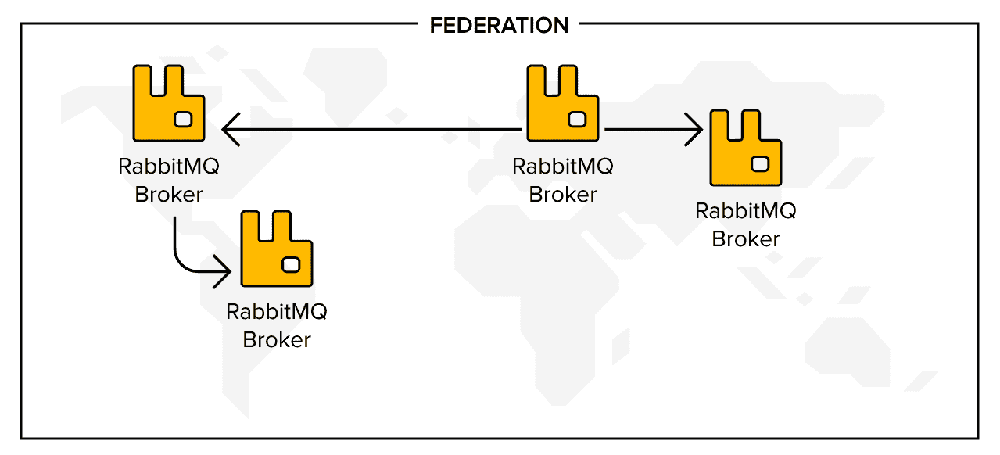

图 1.8：参与各种拓扑的 RabbitMQ 代理

**RabbitMQ 通过插件支持 AMQP 1.0**。

AMQP 1.0 于 2011 年底发布，在 AMQP 的开发和维护转移到 OASIS 之后。AMQP 在 0-9-1 和 1.0 之间经历了大幅修订。这次修订如此剧烈，以至于一些核心概念，如交换，不再存在。因此，AMQP 1.0 是一个与 0-9-1 不同的协议，但没有真正令人信服的理由去采用它。它并不比 0-9-1 更强大，有些人也会争论说，它失去了最初使其具有吸引力的关键方面。

因此，RabbitMQ 在何时何地被使用？下一节将描述一些常见的 RabbitMQ 使用案例。

# 在现实生活中使用 RabbitMQ

RabbitMQ 最常见的使用案例是单生产者、单消费者队列。想象它就像一个管道，一个应用程序将消息放入管道的一端，另一个应用程序读取从另一端出来的消息。消息按照先入先出的顺序交付。这些消息可能是命令或包含重要数据。这听起来很简单，但这种类型的架构可以应用在哪里？现在是时候了解何时以及为什么消息队列会发光了！

## 微服务之间的消息队列

消息队列通常用于微服务之间，但这意味着什么？

微服务架构风格将应用程序划分为小的服务，完成的应用程序是其微服务的总和。服务之间并不严格连接。相反，它们使用，例如，消息队列来保持联系。一个服务异步地将消息推送到队列，当消费者准备好时，这些消息被发送到正确的目的地。

微服务架构通常与单体架构进行比较和对比，在单体架构中，整个系统被捆绑在一起成为一块软件。一个应用程序不仅负责特定的任务；它实际上执行完成特定功能所需的每一步。单体在系统中进行通信，因为所有部分都在同一个进程中运行。这个系统高度耦合，因为每个功能都依赖于其他功能。

在一个基于单体架构风格构建的网店示例中，一个系统处理所有功能，包括库存、支付、评论和评分等，如下所示：

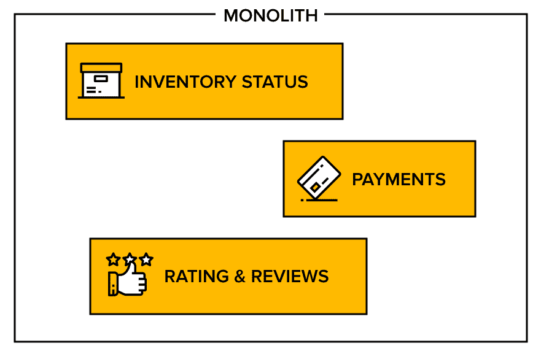

图 1.9：采用单体架构风格构建的网店

建立在微服务架构之上的在线商店，另一方面意味着系统的每个部分都是一个独立的活动。一个微服务处理评论和评分。然后是库存，然后是支付，等等，如下面的图所示：


图 1.10：一种微服务架构风格，其中每个部分都专注于单一的业务能力

请求和响应的每一对都是独立通信的。这被称为无状态通信。虽然涉及许多微服务，但它们并不直接相互依赖。

RabbitMQ 的另一个典型用例是作为任务队列，我们将在下一节中介绍。

## 事件和任务

事件是通知，告诉应用程序何时发生了某事。一个应用程序可以订阅来自另一个应用程序的事件，并通过为自己创建和处理任务来响应。一个典型的用例是当 RabbitMQ 作为处理 **慢** 操作的任务队列时。

让我们看看两个这样的例子：

+   想象一个社交媒体应用程序，例如 Instagram。每次有人发布一条新帖子时，网络（关注者）都需要了解新的帖子。这可能是一个非常耗时的操作。数百万的人可能同时尝试执行相同的任务。应用程序可以使用消息队列，在每条帖子到达时将其任务排队。当工作者收到请求时，它会检索发送者的关注者列表，并更新他们。

+   作为另一个例子，考虑一个发送数千封电子邮件给数千用户的电子邮件新闻通讯工具。在一个可能的场景中，许多用户同时触发大量消息。电子邮件新闻通讯工具需要能够处理这种消息量。所有这些电子邮件都可以添加到一个推送队列中，并给工作者提供发送给谁以及发送什么的指令。每封电子邮件都会逐个处理，直到所有电子邮件都发送完毕。

下面的图显示了任务队列，其中消息首先进入队列，然后被处理。然后，新任务被添加到另一个队列中：

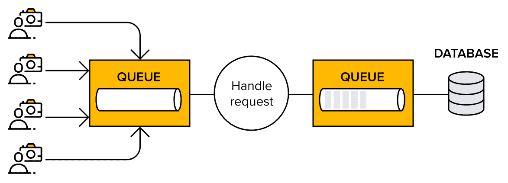

图 1.11：事件和任务队列

通过这样，我们已经查看并回顾了两个典型用例。在每一个用例中，RabbitMQ 的优势都显而易见。我们将在下一节中通过探索消息队列的优势使其更加明显。

# 探索消息队列的优势

在分布式系统中，各种应用程序之间的通信起着重要作用。有许多可以使用消息队列的例子，所以让我们突出消息队列在微服务架构中的某些特性和优势：

+   **开发和维护变得简单**：将应用程序分割成多个服务允许分离责任，并给开发者提供了在任意选择的任何语言中为特定服务编写代码的自由。这将更容易维护编写的代码并对系统进行更改；当更新单个认证方案时，只需为测试添加认证模块的代码，而不会干扰任何其他功能。

+   **故障隔离**：故障可以隔离到单个模块，因此不会影响其他服务。例如，一个报告服务暂时无法使用的应用程序不会影响认证或支付服务。作为另一个例子，对报告服务进行更改仍然允许客户执行基本交易，即使他们无法查看报告。

+   **提高速度和生产力**：不同的开发者可以同时在不同的模块上工作。除了加快开发周期外，微服务和消息队列的使用也对测试阶段产生了影响。这是因为每个服务都可以单独测试，以确定整个系统的就绪状态。

+   **提高可扩展性**：微服务还允许随意轻松地进行扩展。如果消息队列在增长，可以添加更多消费者。只需向一个服务添加新组件，而无需更改任何其他服务，这很容易做到。

+   **易于理解**：由于微服务架构中的每个模块都代表一个单一的功能，因此了解任务的相关细节很容易。例如，为单个服务聘请顾问不需要他们了解整个系统。

现在已经拥有了足够的知识去冒险，所以现在是深入到为本书其余部分设定场景的 RabbitMQ 场景公司的最佳时机。

# 一个 RabbitMQ 场景

CC 是一家具有巨大潜力的新出租车公司。今天，公司只有两名出租车司机和两名开发者，但他们希望在即将到来的这一年里大幅扩张。CC 已经用 Ruby 构建了一个网站，并从后端开始，也是用 Ruby 编写的，用于在数据库中存储 CC 的行程。CC 还有一些用 Python 编写的脚本，用于生成路线报告。

到目前为止，CC 的系统运行如下：

+   公司的网站和博客运行在 Ruby 上。

+   存储路线数据（如行程的起点和终点）的富互联网应用程序是用 Ruby 编写的。

+   有一个后台办公室向司机发送路线更新，是用 Ruby 编写的。

+   使用多个临时的 Python 脚本提取和发送数据以生成路线报告。

+   出租车应用程序是用 Python 编写的。

以下是对旧架构的说明：

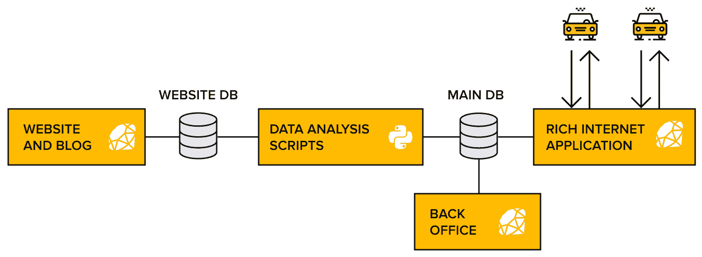

图 1.12：CC 软件架构

为什么 CC 在已经繁忙的环境中考虑添加 RabbitMQ？主要原因是 CC 希望向客户提供一项新功能——他们想构建一个处理即时预订的出租车应用程序。CC 还希望能够轻松扩展。计划是构建一个应用程序，用户可以通过智能手机预订汽车，接收预订确认，并查看汽车接近行程的起点。

由于 CC 已经在不同的语言中拥有一些服务，并且由于 CC 希望能够轻松扩展，他们决定使用现成的面向消息的中间件，如 RabbitMQ，以实现应用程序、客户端和后端之间的异步通信。

随着 CC 对 RabbitMQ 的知识和使用的增加，他们将在环境中发现新的机会来利用它。现在，让我们跟随 CC，看看它在与 RabbitMQ 合作的第一步。

# 准备安装 RabbitMQ

要开始，需要完成以下三个安装和配置步骤：

+   安装 RabbitMQ 代理

+   安装管理插件（Web UI）

+   配置 vhost 和用户

让我们从安装代理程序开始！

## 安装代理程序

CC 在其生产服务器上运行 Ubuntu Linux。一位开发者有 macOS 和 Linux，而另一位则是全部 Windows。这种异构性对 RabbitMQ 来说不是问题，因为它可以在所有这些操作系统上本地运行。

RabbitMQ 为所有支持的操作系统提供完整的在线安装指南，可以在以下位置找到：[`www.rabbitmq.com/download.html`](http://www.rabbitmq.com/download.html)。本书包含 Debian/Ubuntu 的安装说明，其中 RabbitMQ 是从`apt`仓库安装的。它还包含本章后面的 Docker 安装说明。

### Ubuntu 上的 RabbitMQ 安装

安装 RabbitMQ 所需的步骤相对较少。它们如下：

1.  更新 Ubuntu。

1.  下载并安装仓库密钥。

1.  确保密钥在仓库中。

1.  从软件仓库安装 RabbitMQ。

在开始下载过程之前，请确保 Ubuntu 是最新的。请确保操作系统正在使用所有软件的最新版本，因为过时的依赖项会创建安全漏洞。

运行`apt update`命令以下载已安装软件的最新版本：

```java
apt upgrade
```

RabbitMQ 需要几个软件包。通过运行以下命令来验证系统上是否有`curl`、`apt-transport-https`和`GnuPG`：

```java
sudo apt install curl gnupg -y
sudo apt install apt-transport-https
```

`-y`选项接受这些依赖项的任何许可证。Ubuntu 会安装所有必需的子包。

通过运行以下任何命令来发现操作系统的名称：

+   `cat /etc/os-release`

+   `lsb_release -a`

+   `hostnamectl`

版本名称是非技术性的。之前的名称包括`focal`和`bionic`。Ubuntu 默认不包含 RabbitMQ，因此在继续之前必须将其添加到仓库密钥中。在终端中执行以下命令集：

```java
curl -fsSL https://github.com/rabbitmq/signing-keys/releases/download/2.0/rabbitmq-release-signing-key.asc 
sudo apt-key add -
sudo tee /etc/apt/sources.list.d/bintray.rabbitmq.list <<EOF
deb https://dl.bintray.com/rabbitmq-erlang/debian [os release name] erlang
deb https://dl.bintray.com/rabbitmq/debian [os release name] main
EOF
```

这些命令在添加代理和 Erlang 的适当操作系统包之前，会下载密钥并将其添加到存储库列表中。

RabbitMQ 是用 Erlang 编写的，这是一种功能语言，它为创建分布式网络提供了强大的内置支持。开发者维护了一个列表，列出了语言的最小版本，这些版本适用于代理的最新支持版本。在撰写本文时，RabbitMQ 3.8 支持 Erlang 21.3 到 23。

现在，RabbitMQ 可以正确安装了。

虽然使用 RabbitMQ 并非绝对必要，但鼓励探索这种强大的语言和平台。您可以在 [`www.erlang.org/`](http://www.erlang.org/) 上了解更多关于 Erlang 的信息。或者，您可以考虑将 Elixir 作为 Erlang **虚拟机**（**VM**）的可选语言。您可以在 [`elixir-lang.org`](http://elixir-lang.org) 上了解更多信息。

运行以下命令来安装 RabbitMQ：

```java
sudo apt install -y rabbitmq-server
sudo apt install librabbitmq-dev 
```

`librabbitmq-dev` 库包括一个用于与代理交互的客户端。然而，服务器可能只是唯一的要求。

### RabbitMQ 在 Docker 上的安装

Docker 容器允许分离和控制资源，而不会风险损坏操作系统。有关安装 Docker 的说明，请参阅官方网站：[`docs.docker.com/get-docker/`](https://docs.docker.com/get-docker/)。安装 Docker 后，拉取 RabbitMQ 镜像：

```java
docker pull rabbitmq
```

使用合理的默认值运行代理：

```java
docker run -d --hostname my-rabbit --name my-rabbit -p 5672:5672 -p 15672:15672 -e RABBITMQ_ERLANG_COOKIE='cookie_for_clustering' -e RABBITMQ_DEFAULT_USER=user -e RABBITMQ_DEFAULT_PASS=password  --name some-rabbit rabbitmq:3-management
```

需要创建一个 Docker 容器，以便可以从 `localhost` 访问它，并启用管理控制台。这将在稍后被发现。

### 启动 RabbitMQ

从存储库安装 RabbitMQ 服务器也会安装一套用于首次启动服务器的命令行工具。这是通过执行以下命令完成的：

```java
rabbitmq-server start 
```

服务器在前台启动。要将代理作为服务运行，请使用以下命令：

```java
sudo systemctl enable rabbitmq-server
sudo systemctl start rabbitmq-server
sudo systemctl status rabbitmq-server 
```

`systemctl` 命令也可以用于管理 Ubuntu 中的服务。最终命令的输出应显示代理正在运行。如果未显示，请参阅 RabbitMQ 文档 ([`www.rabbitmq.com/troubleshooting.html`](https://www.rabbitmq.com/troubleshooting.html))。

### 下载示例代码

下载本书的所有示例代码文件。它们可以从 [`www.packtpub.com`](http://www.packtpub.com) 购买。如果您在其他地方购买了此书，请访问 [`www.packtpub.com/support`](http://www.packtpub.com/support) 并注册，以便将文件直接通过电子邮件发送给您。

### 验证 RabbitMQ 代理是否正在运行

现在，通过使用 `status service` 命令来验证 RabbitMQ 代理实际上是否正在运行。

在终端中写下以下行：

```java
$ sudo service rabbitmq-server status
  rabbitmq-server.service - RabbitMQ broker
   Loaded: loaded (/lib/systemd/system/rabbitmq-server.service; enabled; vendor preset: enabled)
  Drop-In: /etc/systemd/system/rabbitmq-server.service.d
           └─10-limits.conf, 90-env.conf
   Active: active (running) since Mon 2019-04-29 13:28:43 UTC; 1h 43min ago
  Process: 27474 ExecStop=/usr/lib/rabbitmq/bin/rabbitmqctl shutdown (code=exited, status=0/SUCCESS)
 Main PID: 27583 (beam.smp)
   Status: "Initialized"
    Tasks: 87 (limit: 1121)
   CGroup: /system.slice/rabbitmq-server.service
           ├─27583 /usr/lib/erlang/erts-10.2.2/bin/beam.smp -W w -A 64 -MBas ageffcbf -MHas ageffcbf -MBlmbcs 512 -MHlmbcs 512 -MMmcs 30 -P 1048576 -t 5000000 
           ├─27698 /usr/lib/erlang/erts-10.2.2/bin/epmd -daemon
           ├─27854 erl_child_setup 1000000
           ├─27882 inet_gethost 4
           └─27883 inet_gethost 4

Apr 29 13:28:42 test-young-mouse-01 rabbitmq-server[27583]:   ##  ##
Apr 29 13:28:42 test-young-mouse-01 rabbitmq-server[27583]:   ##  ##      RabbitMQ 3.7.14\. Copyright (C) 2007-2019 Pivotal Software, Inc.
Apr 29 13:28:42 test-young-mouse-01 rabbitmq-server[27583]:   ##########  Licensed under the MPL.  See https://www.rabbitmq.com/
Apr 29 13:28:42 test-young-mouse-01 rabbitmq-server[27583]:   ######  ##
Apr 29 13:28:42 test-young-mouse-01 rabbitmq-server[27583]:   ##########  Logs: /var/log/rabbitmq/rabbit@test-young-mouse-01.log
Apr 29 13:28:42 test-young-mouse-01 rabbitmq-server[27583]:                     /var/log/rabbitmq/rabbit@test-young-mouse-01_upgrade.log
Apr 29 13:28:42 test-young-mouse-01 rabbitmq-server[27583]:               Starting broker...
Apr 29 13:28:43 test-young-mouse-01 rabbitmq-server[27583]: systemd unit for activation check: "rabbitmq-server.service"
Apr 29 13:28:43 test-young-mouse-01 systemd[1]: Started RabbitMQ broker.
Apr 29 13:28:43 test-young-mouse-01 rabbitmq-server[27583]:  completed with 9 plugins.
```

包安装文件的默认文件夹是 `/etc/rabbitmq` 用于配置文件，`/usr/lib/rabbitmq` 用于应用程序文件，`/var/lib/rabbitmq` 用于数据文件 (`mnesia`)。

查看 RabbitMQ 的运行进程，找到正在运行的服务包装器和 Erlang VM（也称为 BEAM），如下所示：

```java
$ pgrep -fl rabbitmq
27583 beam.smp

$ ps aux | grep rabbitmq
ubuntu   10260  0.0  0.1  14856  1004 pts/0    S+   15:13   0:00 grep --color=auto rabbitmq
rabbitmq 27583  0.5  8.5 2186988 83484 ?       Ssl  13:28   0:36 /usr/lib/erlang/erts-10.2.2/bin/beam.smp -W w -A 64 -MBas ageffcbf -MHas ageffcbf -MBlmbcs 512 -MHlmbcs 512 -MMmcs 30 -P 1048576 -t 5000000 -stbt db -zdbbl 128000 -K true -- -root /usr/lib/erlang -progname erl -- -home /var/lib/rabbitmq -- -pa /usr/librabbitmq/lib/rabbitmq_server-3.7.14/ebin  -noshell -noinput -s rabbit boot -sname rabbit@test-young-mouse-01 -boot start_sasl -config /etc/rabbitmq/rabbitmq -kernel inet_default_connect_options [{nodelay,true}] -sasl errlog_type error -sasl sasl_error_logger false -rabbit lager_log_root "/var/log/rabbitmq" -rabbit lager_default_file "/var/log/rabbitmq/rabbit@test-young-mouse-01.log" -rabbit lager_upgrade_file "/var/log/rabbitmq/rabbit@test-young-mouse-01_upgrade.log" -rabbit enabled_plugins_file "/etc/rabbitmq/enabled_plugins" -rabbit plugins_dir "/usr/lib/rabbitmq/plugins:/usr/lib/rabbitmq/lib/rabbitmq_server-3.7.14/plugins" -rabbit plugins_expand_dir "/var/lib/rabbitmq/mnesia/rabbit@test-young-mouse-01-plugins-expand" -os_mon start_cpu_sup false -os_mon start_disksup false -os_mon start_memsup false -mnesia dir "/var/lib/rabbitmq/mnesia/rabbit@test-young-mouse-01" -kernel inet_dist_listen_min 25672 -kernel inet_dist_listen_max 25672
rabbitmq 27698  0.0  0.1   8532  1528 ?        S    13:28   0:00 /usr/lib/erlang/erts-10.2.2/bin/epmd -daemon
rabbitmq 27854  0.0  0.1   4520  1576 ?        Ss   13:28   0:00 erl_child_setup 1000000
rabbitmq 27882  0.0  0.1   8264  1076 ?        Ss   13:28   0:00 inet_gethost 4
rabbitmq 27883  0.0  0.1  14616  1808 ?        S    13:28   0:00 inet_gethost 4

```

有可能，当 RabbitMQ 运行时，一个名为`epmd`的进程也在运行。这是 Erlang 端口映射器守护进程，负责协调集群中的 Erlang 节点。即使集群中的 RabbitMQ 应用程序没有运行，它也会启动。

注意，默认情况下，代理服务配置为在 Linux 主机启动时自动启动。

跳过安装和配置 RabbitMQ 的麻烦，并使用托管 RabbitMQ 解决方案。CloudAMQP 是托管 RabbitMQ 集群的最大提供商：[www.cloudamqp.com](https://www.cloudamqp.com/)。

## 安装管理插件（Web UI）

RabbitMQ 默认不安装管理控制台，但本例中使用的可选基于 Web 的插件使得查看正在运行的 RabbitMQ 实例变得容易。

Debian 软件包安装了几个脚本。其中之一是`rabbitmq-plugins`。它的目的是允许我们安装和删除插件。使用它来安装管理插件，如下所示：

```java
$ sudo rabbitmq-plugins enable rabbitmq_management 
Enabling plugins on node rabbit@host:
rabbitmq_management
The following plugins have been configured:
 rabbitmq_consistent_hash_exchange
 rabbitmq_event_exchange
 rabbitmq_federation
 rabbitmq_management
 rabbitmq_management_agent
 rabbitmq_shovel
 rabbitmq_web_dispatch
Applying plugin configuration to rabbit@host...
The following plugins have been enabled:
  rabbitmq_management
  rabbitmq_management_agent
  rabbitmq_web_dispatch

```

是的，就这么简单！

使用 Web 浏览器通过导航到`http://<hostname>:15672`来访问管理控制台的主页，如下面的截图所示：

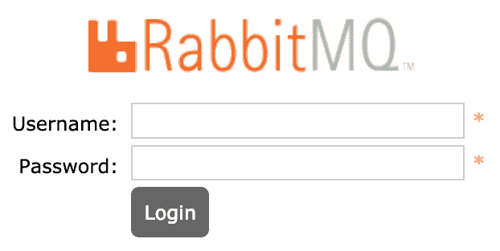

图 1.13：管理控制台的登录屏幕

请继续关注下一集——创建和配置用户！

## 配置用户

Debian 软件包安装的脚本之一是`rabbitmqctl`，这是一个用于管理 RabbitMQ 节点并用于配置代理所有方面的工具。使用它来配置代理中的管理员用户，如下所示：

```java
$ sudo rabbitmqctl add_user cc-admin taxi123
Adding user "cc-admin" ...

$ sudo rabbitmqctl set_user_tags cc-admin administrator
Setting tags for user "cc-admin" to [administrator] ...
```

默认情况下，RabbitMQ 附带一个使用 guest 密码认证的 guest 用户。将其密码更改为其他密码，如下所示：

```java
$ sudo rabbitmqctl change_password guest guest123
```

返回管理控制台登录屏幕，我们可以使用用户名`cc-admin`和密码`taxi123`登录。

欢迎屏幕提供了对代理内部结构的概述，如下面的截图所示：

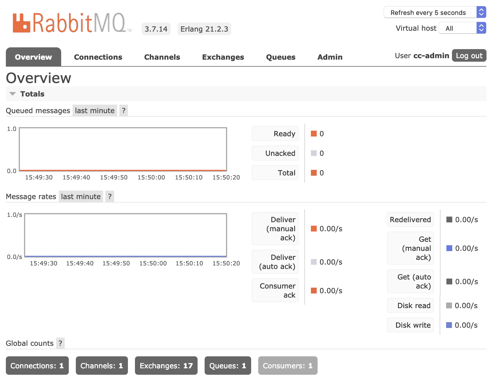

图 1.14：管理控制台的主仪表板

注意，在此阶段，`cc-admin`用户无法在任何 vhost 中检查任何交换机或队列。目前，必须创建另一个用户用于开发目的，以便应用程序可以连接到 RabbitMQ。

创建名为`cc-dev`的用户，如下所示：

```java
$ sudo rabbitmqctl add_user cc-dev taxi123
Adding user "cc-dev" ...
```

如本章前面所讨论的，RabbitMQ 支持 vhosts 的概念，这是不同用户可以有不同的访问权限的地方。CC 开发环境将有一个 vhost，也称为 vhost。在未来的任何其他环境中（如 QA 环境）创建的任何内容都将与 vhost 中的内容隔离。在 RabbitMQ 的后续版本（3.7+）中，可以对每个 vhost 的队列数量和并发客户端连接数设置限制。

创建一个名为`cc-dev-vhost`的 vhost，如下所示：

```java
$ sudo rabbitmqctl add_vhost cc-dev-vhost
Adding vhost "cc-dev-vhost" ...
```

这将创建一个用户和一个用于开发的虚拟主机。

### 配置专用虚拟主机

RabbitMQ 自带一个默认的虚拟主机`/`，访客用户对其拥有完全权限。虽然这对于快速测试来说很方便，但建议创建一个专门的虚拟主机来保持关注点的分离，这样就可以完全删除虚拟主机并从头开始，而不会产生意外的后果。

目前，`cc-admin`和`cc-dev`用户都没有在`cc-dev-vhost`上执行任何操作的权限。你可以通过授予虚拟主机完全权限来修复这个问题，如下所示：

```java
$ sudo rabbitmqctl set_permissions -p cc-dev-vhost cc-admin ".*" ".*" ".*"
Setting permissions for user "cc-admin" in vhost "cc-dev-vhost" ... $ sudo rabbitmqctl set_permissions -p cc-dev-vhost cc-dev ".*" ".*" ".*"
Setting permissions for user "cc-dev" in vhost "cc-dev-vhost" ...
```

为了回顾刚才所做的工作，大部分命令都很直接，但`".*" ".*" ".*"`部分看起来有点神秘，所以让我们来分析一下。

这是对考虑的虚拟主机的三个权限组合，它为考虑的用户和虚拟主机在指定的资源上授予了**配置**、**写入**和**读取**权限。资源包括交换和队列，由匹配其名称的正则表达式指定。在这种情况下，通过`.*`正则表达式请求的任何资源都是允许的。

授予的实际命令取决于资源类型和授予的权限。有关 RabbitMQ 支持的完整访问控制策略列表，请参阅[`www.rabbitmq.com/access-control.html`](http://www.rabbitmq.com/access-control.html)。

作为所有命令行的替代方案，转向管理控制台的用户管理功能。点击控制台的“管理员”标签，然后在“用户”标签中点击`cc-dev`用户，查看以下截图所示的信息。从命令行设置的整个用户配置在管理控制台中可见，并可进行编辑：

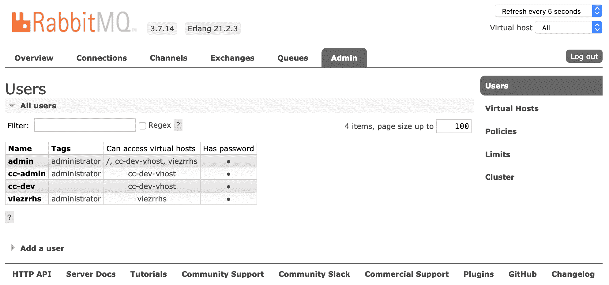

图 1.15：从 RabbitMQ 管理控制台进行用户管理

通过在管理控制台中点击特定用户的名称，可以找到单个用户的详细信息：

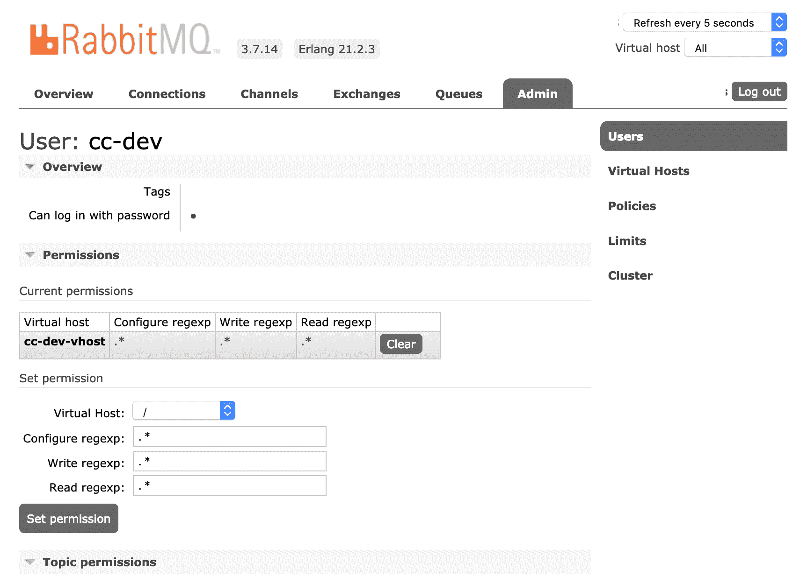

图 1.16：管理控制台中单个用户的详细信息

RabbitMQ 代理和管理插件（Web UI）已安装，并已配置虚拟主机和用户。

# 摘要

本章探讨了消息传递的架构和设计承诺，包括 AMQP 和 RabbitMQ 如何实现这些承诺。此外，还发现了出租车代理机构 Complete Car 决定在其软件环境中引入 RabbitMQ 的原因。最后，安装了一个 RabbitMQ 代理，并为它配置了用户和多个虚拟主机。在掌握了消息队列和 RabbitMQ 的基本理解之后，下一章将在此基础上构建，并探讨 Complete Car 出租车应用程序背后的架构。

是时候动手编写代码了。转向下一章，开始构建一个由 RabbitMQ 驱动的应用程序！
