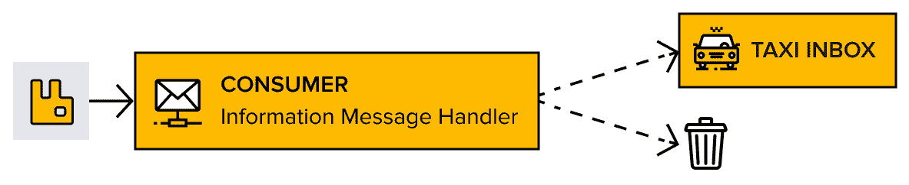
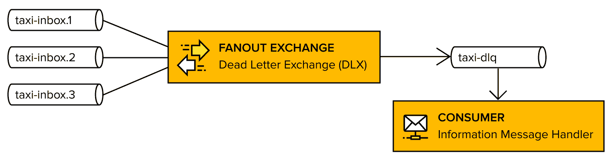
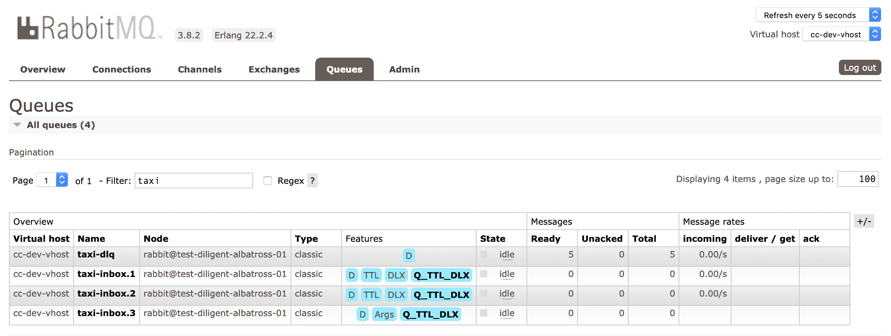
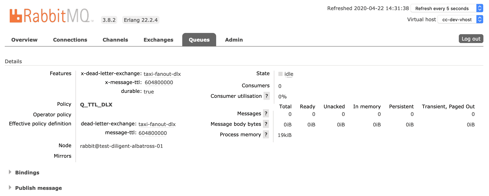
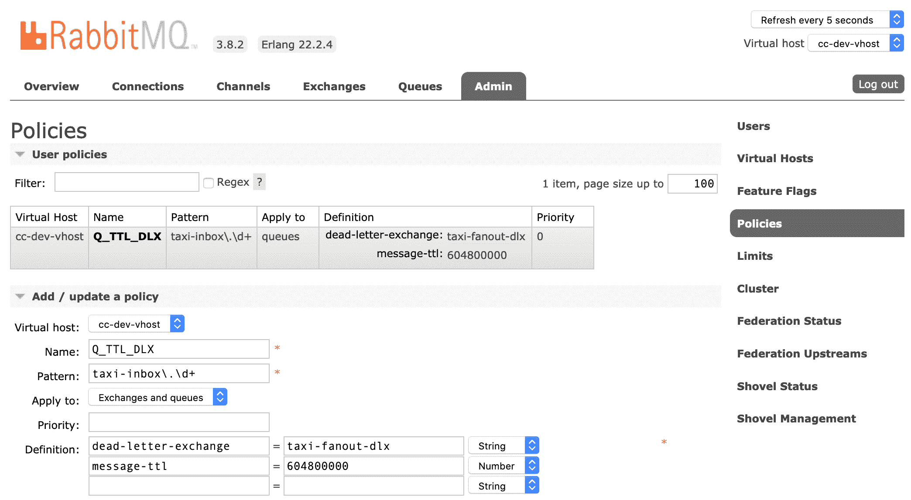
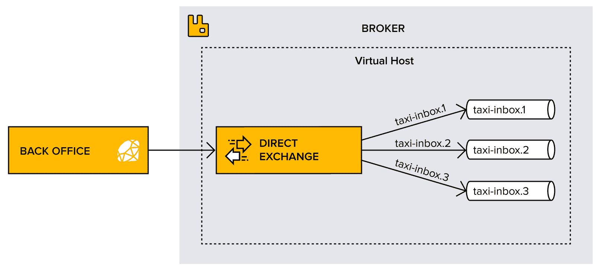
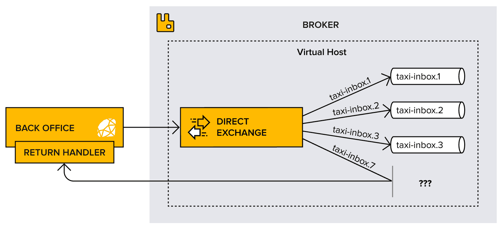
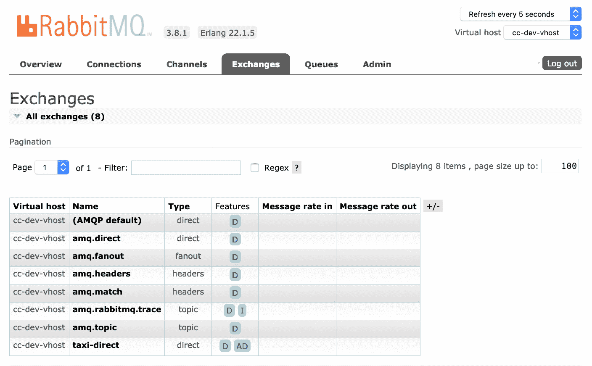

调整消息投递

消息最终陷入队列中会发生什么？它们会消失吗？防止消息无声无息地被丢弃的最佳方法是什么？在本章中，我们将彻底回答这些问题，详细探讨消息**存活时间**（**TTL**）和死信交换机及队列。本章还将涵盖如果使用强制标志无法将消息路由到特定队列时，代理应该如何反应。此外，本章将解释策略和默认交换机。

期待了解以下主题的重要信息：

+   处理死信

+   强制投递

# 技术要求

本章的代码文件可以在 GitHub 上找到：[`github.com/PacktPublishing/RabbitMQ-Essentials-Second-Edition/tree/master/Chapter04`](https://github.com/PacktPublishing/RabbitMQ-Essentials-Second-Edition/tree/master/Chapter04)。

# 处理死信

在**Complete Car**（**CC**）公司，一切进行得非常顺利。随着越来越多的司机加入公司，驾驶员信息消息功能越来越受欢迎。经过几个月的活动，一个事实变得明显：并非所有出租车司机每天都登录应用程序，这导致消息在出租车收件箱队列中堆积。

尽管数据量对系统没有害处，但消息在队列中滞留，可能永远无法处理的想法并不令人满意。想象一下，一名出租车司机在休假几周后登录，被大量过时的消息淹没——这是 CC 公司竭力避免的负面用户体验。

CC 决定通过指定新规则来解决这个问题：一周后，任何未送达的消息将以以下两种方式之一进行处理：

+   如果是重要信息消息，将会通过电子邮件发送给用户。

+   如果是关于当前交通状况或其他重要信息的消息，将会被丢弃：



图 4.1：发送重要信息消息，丢弃其他消息

开发者查看 RabbitMQ 提供的消息过期选项，并列出以下可以实施的可能选项：

+   标准 AMQP 消息过期属性，用于已发布消息

+   允许用户为每个队列定义消息 TTL 的定制 RabbitMQ 扩展

+   允许用户为队列本身定义 TTL 的定制 RabbitMQ 扩展

第一个选项很有趣，因为它是一个标准的 AMQP 选项；然而，在阅读更多关于它在 RabbitMQ 中如何支持的内容后，我们发现这些消息只有在达到队列头部或开始位置时才会被丢弃。即使它们已经过期，消息仍然会留在队列中，这会违背他们试图实现的目的。CC 也排除了最后一个选项，因为他们不希望删除队列。这让我们只剩下了第二个选项，即为每个出租车收件箱队列配置一个由 RabbitMQ 强制执行的 TTL，无论队列是否正在被消费。

这一切看起来都很顺利，但消息过期后实际上会发生什么呢？CC 希望消费这些重要的消息以便通过电子邮件发送。那么我们如何实现这一点呢？这正是 RabbitMQ 的**死信交换**（**DLX**）发挥作用的地方。

死信是指无法投递的消息，这可能是因为目标无法访问，或者因为消息已过期。在 CC 的情况下，达到其 TTL 的消息将变成死信。

RabbitMQ 提供了自动将这些死信路由到特定交换机的选项，这被称为 DLX。由于 CC 希望接收发送到该交换机的消息，他们必须将其绑定到一个队列上，消费它，并处理接收到的消息。这个队列充当**死信队列**（**DLQ**），死信的最终目的地。

以下图表说明了 CC 打算推出的整体 DLX 架构：



图 4.2：死信处理架构

达到其 TTL 的消息将通过死信交换机重路由到 **taxi-****dlx** 队列，并由消费者最终处理。

注意，当消息过期时，它们会使用在它们被投递到出租车收件箱队列时的原始路由键发布到 DLX。此行为可以被修改，因为 RabbitMQ 允许定义在消息发布到 DLX 时使用的特定路由键。默认设置对 CC 来说很合适，因为原始路由键是他们用来找出出租车 ID 的有趣信息。因此，DLX 交换机被构建为一个扇出，以便将所有消息路由到 DLQ，无论它们的原始路由键可能是什么。

战斗计划已经准备好了。现在是时候实施它了！

## 重构队列

实施此架构的第一步是配置出租车队列，使其具有一周的期望 TTL 和等于 `taxi-dlx` 的死信交换机。

通过使用 RabbitMQ 扩展 AMQP，这可以通过在声明队列时分别定义 `'x-message-ttl'` 和 `"x-dead-letter-exchange"` 参数来实现。在 TTL 过期后发布的消息将被重路由到具有给定 `x-dead-letter-routing-key` 的交换机。

很有诱惑直接跳到代码编辑器，并通过以下参数修改第三章，*向多个出租车司机发送消息*中编写的 Ruby 代码：

```java
# Declare a queue for a taxi inbox 1
queue1 = channel.queue('taxi-inbox.1', 
  durable: true, 
  arguments:{
    'x-message-ttl'=> 604800000, 
    'x-dead-letter-exchange'=> 'taxi-dlx', 
    'x-dead-letter-routing-key'=> 'taxi-inbox.1'
  }
)
```

然而，这在几个层面上都是错误的。主要问题是声明将从没有参数的队列更改为具有三个参数的队列。记住，在第二章，*创建出租车应用程序*中，队列（或交换）的声明只有在所有使用的参数都相同的情况下才是幂等的。声明中的任何差异都会产生异常，并将立即终止通道。

做一个习惯，确保在声明现有队列和交换时始终使用相同的属性/参数。任何差异都会导致错误并终止通道。

另一个问题是在出租车司机登录时才会应用这个更改。这是出租车队列被声明的时候；然而，它不会满足将过期规则应用于所有现有队列，而不依赖于用户操作的要求。最后，还需要考虑的是，如果这些属性在队列声明级别进行配置，则对其中任何一个的任何更改都需要我们删除并重新创建所有队列。显然，TTL 和 DLX 配置是跨切面关注点，应该以更全局的方式配置。这是否可能呢？

答案是肯定的！RabbitMQ 在策略的概念中提供了一个简单而优雅的解决方案来解决这个问题。RabbitMQ 支持定义特定行为的策略，并且可以将这些策略应用于队列或交换。策略不仅在与队列或交换声明时应用，还可以应用于现有的队列或交换。

队列消息的 TTL 和死信交换都可以通过策略进行配置，但只能有一个策略应用于一个队列或交换。因此，CC 将创建一个结合了 TTL 和 DLX 设置的策略，并将其应用于所有出租车收件箱队列。这不能通过 AMQP 协议或使用 RabbitMQ 客户端来实现。相反，RabbitMQ 提供的强大命令行工具是实现所需策略的最佳方式。

通过以下单个命令行操作实现了对现有队列的重构策略：

```java
$ sudo rabbitmqctl set_policy -p cc-dev-vhost Q_TTL_DLX "taxi\.\d+" '{"message-ttl":604800000, "dead-letter-exchange":"taxi-dlx"}' 
--apply-to queues
```

让我们花点时间来分析前面的命令：

+   `sudo rabbitmqctl set_policy`: 命令的这一部分使用了`set_policy`控制命令。

+   `-p cc-dev-vhost`: 命令的这一部分将消息应用于开发虚拟主机。

+   `Q_TTL_DLX`: 命令的这一部分命名了策略，使其明显与队列 TTL 和死信交换相关。

+   `"taxi\.\d+"`: 命令的这一部分使用了一些正则表达式，通过选择名称来仅将整个命令应用于出租车队列。

+   `'{"message-ttl":604800000, "dead-letter-exchange":"taxi-dlx"}'`：此命令部分使用了一个由七天毫秒 TTL 和 DLX 名称组成的策略定义。

+   `--apply-to queues`：此命令部分确保此策略仅应用于队列，这与正则表达式有些重复，但作为安全网的作用是通过对类型而不是名称选择 RabbitMQ 实体。

准备运行此命令？别急——必须创建`taxi-dlx`交换机并将其绑定到`taxi-dlq`队列。立即应用此策略意味着将有七天时间来部署缺失的交换机和队列。当然，这足够多了，但聪明的开发者不喜欢在无法避免的情况下与时间赛跑。

不要立即运行此命令，而是花时间创建处理死信的基础设施，并在应用`"Q_TTL_DLX"`策略之前将其部署到应用中。

策略现在已经设置好了，现在是时候添加一些代码来创建缺失的交换机和队列。

## 承担消息

必须创建必要的基础设施来处理过期消息。需要声明死信队列以及新的死信扇出交换机。这些需要相互绑定。

需要执行以下操作：

+   声明`taxi-dlq`队列。

+   声明`taxi-dlx`扇出交换机。

+   将`taxi-dlq`绑定到`taxi-dlx`扇出交换机。

+   创建一个订阅`taxi-dlq`队列的订阅者，该订阅者消费并发送死信邮件。

要实现此行为，只需添加以下代码中的交换机和队列以创建交换机并将队列绑定到它：

1.  首先声明两个队列，`x-message-ttl`设置为`604800000`：

```java
queue1 = channel.queue('taxi-inbox.1', durable: true,
  arguments: {'x-message-ttl'=> 604800000, 'x-dead-letter-exchange'=> 'taxi-dlx'})

queue2 = channel.queue('taxi-inbox.2', durable: true,
  arguments: {'x-message-ttl'=> 604800000, 'x-dead-letter-exchange'=> 'taxi-dlx'})
```

1.  声明一个扇出交换机`taxi-fanout`：

```java
exchange = channel.fanout('taxi-fanout')
```

1.  将两个队列绑定到交换机：

```java
queue1.bind(exchange, routing_key: "")
queue2.bind(exchange, routing_key: "")
```

1.  声明一个死信队列，`taxi-dlq`：

```java
taxi_dlq = channel.queue('taxi-dlq', durable: true)
```

1.  声明一个死信扇出交换机，`taxi-dlx`：

```java
dlx_exchange = channel.fanout('taxi-dlx')
```

1.  现在`taxi-dlx`需要绑定到`taxi-dlq`：

```java
taxi_dlq.bind(dlx_exchange, routing_key: "")
```

1.  最后，发布一条消息：

```java
exchange.publish("Hello! This is an information message!",   key: "")
```

如您所见，这只是一个标准的扇出交换机声明，以及相关的队列声明和绑定。在第三章实现公共地址系统时使用了相同的逻辑，*向多个司机发送消息*。

为了进一步简化问题，确保在发生异常时记录足够的环境数据。始终考虑在必要时执行特定异常的取证分析所需的信息。

在将此代码部署到应用服务器后，请注意死信交换机和队列已正确创建。现在，是时候设置`"Q_TTL_DLX"`策略，如下代码所示：

```java
$ sudo rabbitmqctl set_policy 
-p cc-dev-vhost Q_TTL_DLX "taxi-inbox\.\d+ " '{"message-ttl":604800000, "dead-letter-exchange":"taxi-dlx"}' --apply-to queues

Setting policy "Q_TTL_DLX" for pattern "taxi-inbox\.\d+ " to "{\"message-ttl\":604800000, \"dead-letter-exchange\":\"taxi-dlx\"}" with priority "0" ...
...done.
```

运行此脚本后，使用管理控制台查看用户收件箱队列定义中发生了什么变化。

以下截图显示了这些队列中的几个：



图 4.3：Q_TTL_DLX 策略应用于所有出租车队列

以下屏幕截图演示了 Q_TTL_DLX 策略已应用于出租车队列，而其他队列，如`taxi-dlq`，则未受到影响：



图 4.4：Q_TTL_DLX 策略应用于 taxi-inbox.1 队列

在管理界面中，点击“管理员”标签页，然后点击“策略”标签页（在右侧）。注意以下屏幕截图中的自定义策略：



图 4.5：Q_TTL_DLX 策略在管理员视图中

在这个阶段，任何将在出租车队列中停留超过 7 天的消息都将被无情地移动到`taxi_dlq`，被消费，可能被发送电子邮件，并真正地被埋葬！但是，对于在政策实施之前创建的现有消息应该怎么办呢？

很遗憾，对于这个问题没有现成的解决方案，因此必须采取一种相对激进的措施，清除所有非空且没有活跃订阅者的队列。这很粗糙，但这是摆脱当前状况的唯一方法。此外，这是一个可以通过简单的脚本轻松实现的解决方案。

到目前为止，`rabbitmqctl`脚本已被用于管理 RabbitMQ 代理。下一步需要安装一个新脚本，该脚本包含在第一章中安装的管理控制台，即“A Rabbit Springs to Life”。这个名为`rabbitmqadmin`的脚本可以通过简单地浏览管理界面中的特定 URL 来下载，即`http://localhost:15672/cli/`。在遵循显示的下载说明后，将脚本安装在一个对所有用户都可用的地方（在 Linux 机器上通常是`/usr/local/bin`）。

关于`rabbitmqadmin`脚本的更多信息可以在[`www.rabbitmq.com/management-cli.html`](http://www.rabbitmq.com/management-cli.html)找到。

以下代码展示了如何创建一个脚本，该脚本将删除所有无消费者的非空队列：

```java
#!/bin/bash

queues_to_purge=`rabbitmqctl list_queues -p cc-dev-vhost name messages_ready consumers | grep "taxi\.[[:digit:]]\+[[:space:]]\+[1-9][[:digit:]]*[[:space:]]\+0" | awk '{ print $1}'`

for queue in $queues_to_purge ; do
    echo -n "Purging $queue ... "
    rabbitmqadmin -V cc-dev-vhost -u cc-admin -p taxi123 purge queue name=$queue
done
```

注意，`rabbitmqctl`和`rabbitmqadmin`都被用来达到目标，前者具有以易于解析的方式列出队列特定属性的能力，而后者具有清除队列的能力。在以超级用户身份执行此脚本后，RabbitMQ 代理的状态适合使用，TTL 和 DLX 策略将长期保持这种状态！

CC 现在希望在完成行程后的几分钟内向所有完成出租车行程的客户发送调查问卷。让我们看看如何使用死信交换和 TTL 在 RabbitMQ 中延迟消息投递。

### 使用 RabbitMQ 的延迟消息

在使用此功能完成工作后，后台意识到他们可以发布具有固定延迟的消息，这样消费者就不会立即看到它们。这对于他们的调查来说是一个完美的功能，因为调查应该在行程完成后 5 分钟发送给客户。AMQP 协议没有原生的延迟队列功能，但可以通过组合消息 TTL 功能和死信功能轻松模拟。

延迟消息插件适用于 RabbitMQ 3.5.3 及更高版本的 RabbitMQ。延迟消息插件为 RabbitMQ 添加了一个新的交换机类型。通过向消息添加延迟头，可以延迟通过该交换机路由的消息。您可以在[`github.com/rabbitmq/rabbitmq-delayed-message-exchange`](https://github.com/rabbitmq/rabbitmq-delayed-message-exchange)上了解更多关于插件的信息。

当司机标记行程已完成后，CC 决定将调查请求消息发布到一个延迟队列。所有调查请求消息都被设置为在 TTL（生存时间）为 5 分钟后过期。然后，消息的路由键被更改为与目标队列名称相同。这意味着调查请求消息将最终进入应该发送调查请求的队列。

以下是一个 CC 会使用的代码示例。消息首先被发送到名为`work.later`的`DELAYED_QUEUE`。在 300,000 毫秒后，消息被标记为死信并路由到名为`work.now`的`DESTINATION_QUEUE`：

1.  我们首先分配变量：

```java
DELAYED_QUEUE='work.later'
DESTINATION_QUEUE='work.now'
```

1.  之后，我们定义发布方法。这里发生了很多事情：

+   首先，声明延迟队列`DELAYED_QUEUE`，并将`x-dead-letter-exchange`设置为默认队列。

+   通过`x-dead-letter-routing-key`参数设置为`DESTINATION_QUEUE`来设置用于死信消息的路由键。

+   消息延迟的毫秒数在消息 TTL 的`x-message-ttl`参数中指定。

1.  最后，将消息发布到默认交换机，其中`DELAYED_QUEUE`用作路由键：

```java
def publish
  channel = connection.create_channel

  channel.queue(DELAYED_QUEUE, arguments: {
    'x-dead-letter-exchange' => '', 
    'x-dead-letter-routing-key' => DESTINATION_QUEUE,
    'x-message-ttl' => 300000
  })

  channel.default_exchange.publish 'message content', routing_key: DELAYED_QUEUE
    puts "#{Time.now}: Published the message"
    channel.close
end
```

1.  然后我们定义订阅方法并处理消息：

```java
def subscribe
  channel = connection.create_channel
  q = channel.queue DESTINATION_QUEUE, durable: true
  q.subscribe do |delivery, headers, body|
    puts "#{Time.now}: Got the message"
  end
end
```

1.  最后，我们调用这两个方法：

```java
subscribe()
publish()
```

就这样！调查请求功能已实现。但，当然，立即提出了新的功能请求。后台希望能够向单个司机发送消息，并确保所有司机，包括没有 RabbitMQ 出租车收件箱的司机，都能收到消息。让我们看看 RabbitMQ 中的消息强制投递。

# 强制投递

到目前为止，CC 的后台团队一直只依赖电子邮件与*个人*司机互动。CC 最近添加了第三章“向多个出租车司机发送消息”中讨论的由 RabbitMQ 驱动的系统，允许后台向所有司机发送信息消息。他们现在想探索从后台服务向个别司机发送消息的可能性。此外，如果可能的话，CC 希望没有在 RabbitMQ 上设置收件箱队列的司机能够立即收到电子邮件消息。

在消息架构方面，这是一个已知领域——在第二章“创建出租车应用程序”中，为客户端到出租车消息实现了完全相同的模型，如下所示：



图 4.6：后台团队将使用出租车直接交换来发送给司机的直接消息

使用了直接交换。唯一的不同之处在于，与主应用程序不同，后台在发送消息之前不会创建和绑定出租车队列。相反，后台必须以某种方式检测到不存在此类队列，并将消息的投递回退到电子邮件。

不清楚的是如何实现这些要求的第二部分：后台如何检查队列的存在？AMQP 规范没有指定直接的方法来做这件事。RabbitMQ 管理插件公开了一个 REST API，可以用来检查队列的存在，这是一个诱人的方法，但不是 AMQP 默认提供的，这是首选的方法。此外，这可能会使过程暴露于检查-行动类型的竞争条件。

事实上，队列可以在确认它不存在后由另一个进程创建。深入研究 AMQP 规范可以发现一个更优雅处理此问题的功能，即强制投递。`mandatory`字段是 AMQP 规范的一部分，它告诉 RabbitMQ 如果消息无法路由到队列时如何反应。

考虑到当 AMQP 规范没有提供支持所需功能的方法时，可以使用 RabbitMQ 的管理 REST API。您可以在 RabbitMQ 代理上访问 REST API 文档，网址为`http://localhost:15672/api/`。

当消息在一个设置了`mandatory`标志为`true`的交换上发布时，如果消息无法投递到队列，它将被 RabbitMQ 返回。消息无法投递到队列的原因可能是没有队列绑定到交换，或者没有绑定队列具有与交换的路由规则匹配的路由键。在当前情况下，这意味着没有出租车收件箱队列绑定到与出租车 ID 匹配的路由键。

返回消息的技巧是 RabbitMQ 不会同步地将它们作为发布操作的响应返回：它是异步返回的。这意味着对于开发者来说，必须将特定的消息处理器注册到 RabbitMQ，以便接收返回的消息。

这导致以下图中展示的整体架构：



图 4.7：一个专门的处理器负责处理返回的消息

发布到不存在队列的消息会被返回到返回处理器。现在，这个处理器负责确保信息消息以某种方式到达司机——例如，通过电子邮件。

在实现新的后台发送器之前，将先描述默认交换的类型。

## RabbitMQ 的默认交换

每次创建队列时，它都会自动绑定到默认交换，其队列名称作为路由键。通过使用队列名称作为路由键向默认交换发布消息，消息最终会到达指定的队列。这也是将在以下代码示例的“实现后台发送器”部分中添加的内容。

这神秘的默认交换是什么？它是一个名为`""`（一个空字符串）的直接且持久的交换，由 RabbitMQ 为每个虚拟主机自动创建。

为了在管理控制台中使默认交换可见，其空字符串名称被渲染为 AMQP 默认值，如下面的截图所示：



图 4.8：默认交换是几个内置交换之一

如您所见，对于每个虚拟主机，都会自动创建许多其他预定义的交换。它们很容易识别，因为它们的名称以 amq 开头。这些交换仅用于测试和原型设计目的，因此在生产环境中无需使用它们。

向默认交换发送消息是到达特定队列的便捷方式；然而，不要过度使用这种模式。因为它会在生产者和消费者之间创建紧密耦合，因为生产者会知道特定的队列名称。

解释到这里，现在是时候添加必要的代码来构建后台请求的这个功能了，该功能是在没有现有收件箱队列的驱动程序中实现的。

## 实现后台发送器

CC 的后台现在正在添加对发送给没有出租车收件箱队列的司机的消息的支持，以及返回的消息。Ruby 客户端库等库优雅地支持此功能。以下是需要支持强制将消息发送到出租车收件箱并处理可能返回的消息的代码。

首先，需要 `bunny` 客户端库，然后设置一个连接和一个通道到 RabbitMQ，如 第二章 所述，*创建出租车应用程序*：

```java
require "bunny"
 connection = Bunny.new ENV["RABBITMQ_URI"]

 connection.start
 channel = connection.create_channel
```

然后，声明一个默认交换：

```java
exchange = channel.default_exchange
```

创建了一个返回处理程序，用于处理返回的消息：

```java
exchange.on_return do |return_info, properties, content|
  puts "A returned message!"
end
```

接下来，声明一个持久的邮箱队列——在这个例子中，命名为 `taxi-inbox.100`：

```java
queue = channel.queue("taxi-inbox.100", durable: true)
```

订阅来自 RabbitMQ 的消息并向开发者发送简单通知。在此阶段，会发送一封电子邮件，但请注意，这个例子故意保持简短，不包括实际发送电子邮件的方法：

```java
queue.subscribe do |delivery_info, properties, content|
  puts "A message is consumed."
end
```

消息通过 `routing_key` 发布以针对具有 `mandatory` 标志设置为 `true` 的特定出租车。由于这个队列已被创建并存在，这条消息不应该被返回：

```java
exchange.publish("A message published to a queue that does exist, it should NOT be returned", :mandatory => true, :routing_key => queue.name)
```

另一条强制消息被发布，但这次是到一个随机队列。这条消息将被返回并由返回处理程序处理：

```java
exchange.publish("A message published to a queue that does not exist, it should be returned", :mandatory => true, :routing_key => "random-key")
```

最后，关闭连接：

```java
connection.close
```

之前的代码示例包括一条发布到已存在的队列的消息，而另一条消息是发布到一个具有随机键名的队列，一个不存在的队列。更多代码示例可以在 [`rubybunny.info/articles/exchanges.html`](http://rubybunny.info/articles/exchanges.html) 找到。

就这些！功能已准备好上线。消息异步返回，无需正确处理。

# 摘要

本章包含了有关消息 TTL 的信息，探讨了在查看其他关于调整消息投递的重要主题时如何使用消息属性名称过期值。信息还描述了使用死信交换和队列的使用。然后，本章探讨了如何使用默认交换以及如何发送强制消息。

CC 正在成长为一个正规公司，其平台也在不断推出新功能以满足司机、客户和后台工作人员的需求。

到目前为止，只讨论了与 RabbitMQ 的异步交互，这是有意义的，因为它是消息传递的核心前提。话虽如此，也可以执行同步操作，下一章将演示这一点。下一章将包括有关出租车与客户之间直接交互的信息。下一个功能发布将包括哪些内容？唯一找到答案的方法是继续阅读！
