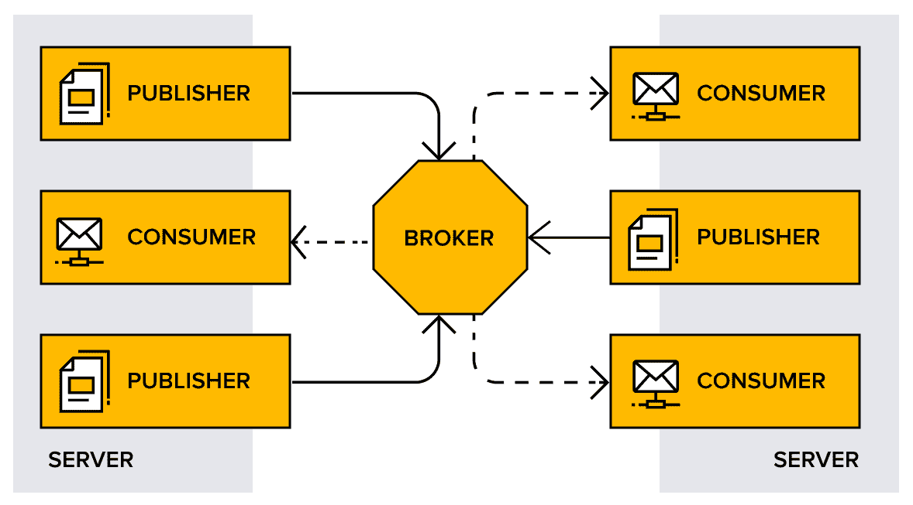
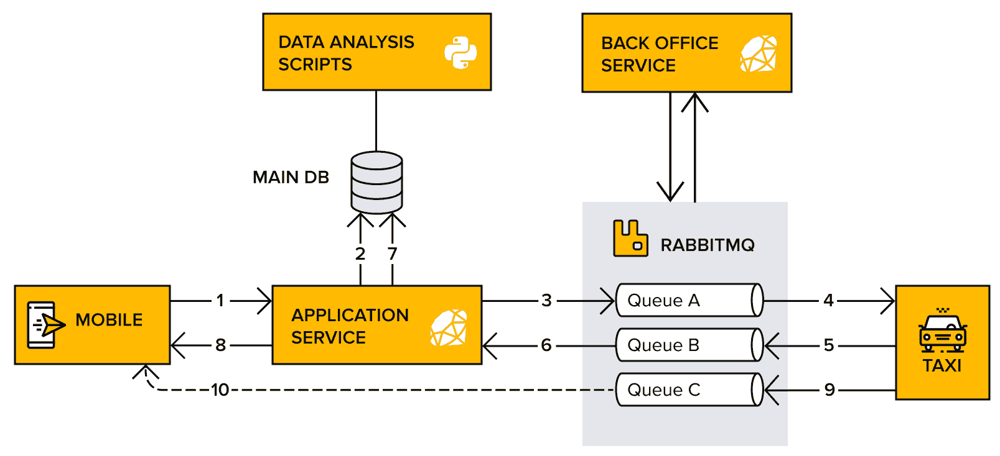
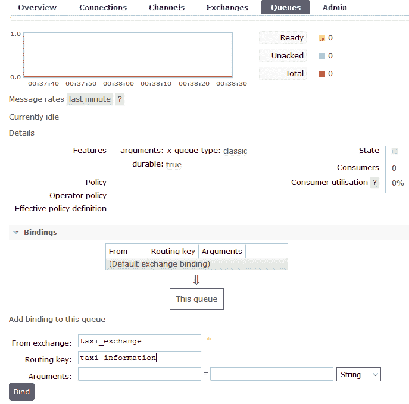
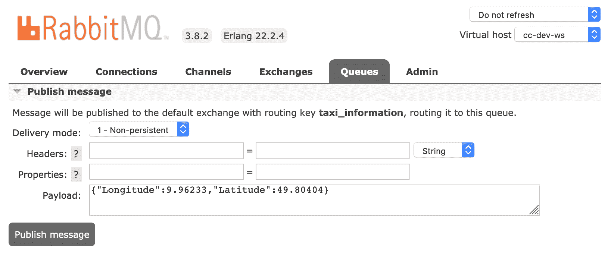
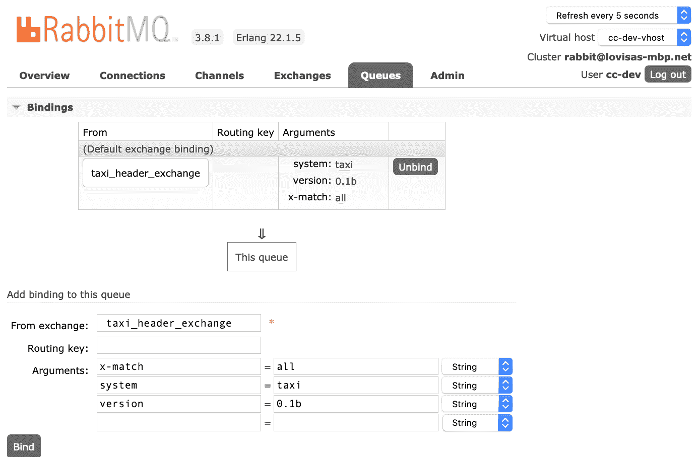

消息路由

到目前为止，本书中所有的消息交互都是单向的，从消息发布者流向消费者。如果消费者想要通知发布者处理已完成并发送响应，或者出租车司机想要确认出租车预订请求，会怎样呢？

本章涵盖了出租车应用系统架构中的步骤 5 到 10，其中出租车司机响应客户并确认预订请求。出租车将其当前位置发布到一个队列中。客户的应用程序通过 WebSockets 连接到代理，并订阅位置更新，这些更新直接来自出租车。

将介绍**远程过程调用（RPC**）请求-响应概念，以及如何将响应路由回消费者。自**高级消息队列协议（AMQP）0-9-1**以来，代理提供了四种交换类型。本章还将展示如何实现最后一种，即头部交换。

让我们深入以下主题：

+   向发布者发送响应

+   回复队列和 RPC

+   创建数据分析服务

# 技术要求

本章的代码文件可以在 GitHub 上找到，地址为[`github.com/PacktPublishing/RabbitMQ-Essentials-Second-Edition/tree/master/Chapter05`](https://github.com/PacktPublishing/RabbitMQ-Essentials-Second-Edition/tree/master/Chapter05)。

# 向发布者发送响应

诚然，到目前为止，我们与 RabbitMQ 的所有交互都是单向的异步交互。同样，与服务交互的客户端通常期望收到响应。在响应阶段反转发布者和消费者的角色需要客户端充当发布者，而服务充当消费者。

如第*2*章中所示，*创建出租车应用*，并如图所示，使用不同的队列来处理请求和响应：



图 5.1：使用消息队列执行请求-响应交互

在以下图中，*图 5.2*，我们可以看到以下内容：

+   当出租车司机确认预订请求时，会向消息代理发送包含司机信息的信息（5）。

+   应用程序服务接收消息（6），将信息存储在数据库中（7），并通过移动应用程序确认预订，最终显示给客户（8）。

+   在这一点上，出租车需要持续与客户分享其当前位置。这是通过每分钟向位置队列发送汽车的纬度和经度来实现的（9）。应用程序的客户端使用通过 RabbitMQ 的 WebSocket 连接订阅当前位置队列（10）。

**完整汽车**（**CC**）的架构如下所示，以供参考：



图 5.2：CC 的主要应用架构

让我们看看 WebSockets 是如何实现的。

## RabbitMQ 中的 WebSockets

RabbitMQ 是一个多协议消息代理。本节探讨了 **单文本导向消息协议**（**STOMP**）以及如何使用 RabbitMQ 来构建交互式 Web 应用程序。Web STOMP RabbitMQ 插件使得通过互联网使用 STOMP 成为可能，通过使用 WebSocket 在客户端（如网页浏览器）和通过 Web 服务器代理之间发送实时数据。该插件允许用户在服务器上存储或处理数据时获得高度交互的用户体验。

首先启用 Web STOMP 插件。

### 启用 Web STOMP 插件

与 RabbitMQ 管理插件一样，RabbitMQ 默认不嵌入 Web STOMP 插件，而是将其作为选项提供。必须启用并安装适当的 RabbitMQ 插件，并且必须创建一个具有适当权限的 **虚拟主机**（**vhost**）。

运行以下 Debian 软件包脚本以安装 Web STOMP 插件：

```java
rabbitmq-plugins enable rabbitmq_web_stomp
```

为了安全起见，在公开暴露的虚拟主机上至少创建一个具有有限权限的用户。运行以下代码以创建新的虚拟主机：

```java
$ sudo rabbitmqctl add_vhost cc-dev-ws
Adding vhost "cc-dev-ws" ...
```

接下来，为 `cc-dev` 用户和 `cc-dev-ws` 虚拟主机添加用户权限：

```java
$ sudo rabbitmqctl set_permissions -p cc-dev-ws cc-dev ".*" ".*" ".*"
Setting permissions for user "cc-dev" in vhost "cc-dev-ws" ..
```

新的虚拟主机已创建，并且对 `cc-dev` 用户可访问。在为出租车设置新队列以发布当前位置之前，应配置一些基本的安全选项。

### 使用 SSL 保护 Web STOMP

Web STOMP 使用互联网，在 CC 的应用中，除非得到适当的安全保护，否则信息容易受到窃听。由于大多数客户端发送代理 **统一资源定位符**（**URL**）、用户名和密码信息，因此需要额外的安全层。

幸运的是，可以通过配置文件告诉 RabbitMQ 使用 **安全套接字层**（**SSL**）。为了安全起见，CC 团队将在配置文件中添加以下行以设置证书：

```java
ssl_options.cacertfile = /path/to/tls/ca_certificate.pem

ssl_options.certfile = /path/to/tls/server_certificate.pem

ssl_options.keyfile = /path/to/tls/server_key.pem

ssl_options.verify = verify_peer

ssl_options.fail_if_no_peer_cert = true 

stomp.default_user = guest

stomp.default_pass = guest

stomp.implicit_connect = true
```

为了使设置生效，必须重新启动代理并更改默认用户名和密码。脚本包含代理 URL，这可能会给服务器带来不希望的简单访问。

### 创建并发布 GPS 数据到队列

现在，CC 团队将创建一个队列，出租车将发送当前位置，这次使用 `rabbitmqadmin` 并运行以下命令来创建名为 `taxi_information` 的队列：

```java
rabbitmqadmin declare queue name=taxi_information durable=true vhost=cc-dev-ws
```

添加一个名为 `taxi_exchange` 的交换机，如下所示：

```java
rabbitmqadmin declare exchange name=taxi_exchange type=direct vhost=cc-dev-ws
```

由于命令行工具不允许将队列绑定到交换，请使用 RabbitMQ 管理界面使用 `taxi_information` 路由键将 `taxi_information` 队列绑定到 `taxi_exchange` 交换。

CC 团队将登录，转到队列部分，并将此信息添加到绑定部分，如图所示：



图 5.3：通过 RabbitMQ 管理界面将绑定添加到队列

建立队列后，出租车应用程序可以与代理通信。此代码未提供，因为它几乎与第二章中的代码相同，*创建出租车应用程序*。相反，以下图表显示了如何通过管理控制台发布消息，这通常用于测试目的：



图 5.4：将 GPS 坐标发送到 RabbitMQ

消费者现在可以订阅来自`taxi_information`队列的**全球定位系统**（**GPS**）数据。

### 通过 WebSockets 订阅 GPS 和司机信息

客户端可以使用移动客户端通过 WebSockets 接收位置数据，如图 5.2 所示。

客户端移动应用程序使用 JavaScript 和 HTML，这得益于 React Native 或 Angular NativeScript 等工具，它们是两个持续获得关注的跨平台框架。

CC 团队使用内容分发网络将 StompJs 库([stomp.umd.min.js](https://stomp-js.github.io/guide/stompjs/using-stompjs-v5.html))导入到应用程序中，如下所示：

```java
<script src=”https://cdn.jsdelivr.net/npm/@stomp/stompjs@5.0.0/bundles/stomp.umd.min.js”></script>
```

然后，CC 包含一些代码，以便从队列中接收更新。

首先，声明并配置`stompClient`变量。代理 URL 应以`ws://`或`wss://`开头。示例中的`reconnectDelay`变量设置为`200`毫秒，这意味着在断开连接后 200 毫秒将进行重试，如下所示：

```java
let stompClient;

const stompConfig = {
  connectHeaders: {
   login: username,
    passcode: password,
    host: 'cc-dev-ws' 
  },
  brokerURL: brokerURL,
  debug: function (str) {
    console.log('STOMP: ' + str);
  },
  reconnectDelay: 200,
  onConnect: function (frame) {
    const subscription =
stompClient.subscribe('/queue/taxi_information',       
    function (message) {
      const body = JSON.parse(message.body);
      const latitude = body.latitude;
      const longitude = body.longitude;
    });
  }
};
```

然后，创建实例并将其连接，如下所示：

```java
stompClient = new StompJs.Client(stompConfig);
stompClient.activate();
```

CC 团队将创建一个回调来处理传入的消息，并直接订阅到`taxi_information`队列。用户名、密码和代理 URL 必须更改。

代理 URL 必须包含 Web STOMP 端口，默认为`15674`。

快乐时光！客户现在将知道出租车的大致位置，无论是乘车前还是乘车过程中。

现在，让我们看看另一种从消费者那里接收回复的方法。

# 回复队列和 RPC

CC 应用程序现在可以在发布者和消费者之间良好地通信，但如果一个函数需要在远程计算机上运行并等待结果呢？在服务中硬编码交换和路由键以发布响应是不可能的，因为这会过于不灵活。解决方案是让请求消息携带响应应发送的位置坐标，这是一种常见的称为 RPC 的模式。

应用程序服务调用出租车应用程序中驻留的特定函数，出租车将结果发送给最终用户。请求消息携带应发送响应的队列名称。AMQP 协议支持这种机制。客户端可以存储必须发送响应的位置的队列名称。

当 RabbitMQ 将消息传递给消费者时，它将更改`reply-to`属性。服务器可以通过向默认交换发送带有`reply-to`属性路由键的消息来从发布者回复消息。

对于`reply-to`机制，可以使用任何类型的队列，但在实践中，以下两种方法被使用：

+   **为每个请求-响应交互创建一个短暂队列**。这种方法使用客户端创建的专用、自动删除、非持久的、服务器端命名的队列，具有以下优点：

+   由于它是专用的，没有其他消费者可以从中获取消息。

+   它可以自动删除；一旦回复被消费，就不再需要它。

+   不需要它是持久的；请求-响应交互并不打算长期存在。

+   服务器生成一个唯一的名称，从而减轻了客户端需要想出唯一命名方案的负担。

+   **使用针对客户端的特定永久`reply-to`队列**。这种方法使用非专用、非自动删除、非持久的客户端端命名的队列，具有以下优点：

+   同样不需要它是持久的，原因如前所述。

+   不需要它是专用的——每个请求-响应交互将使用不同的消费者。

使用永久队列的困难在于关联响应与请求。这是通过`CorrelationId`消息属性完成的，该属性从请求消息携带到响应消息。该属性允许客户端识别要处理的正确请求。

永久队列比使用每个请求的短暂队列更有效，因为创建和删除是昂贵的操作。

RabbitMQ 客户端库提供了简化与请求关联的响应的原始操作。

这就完成了通过`reply-to`将路由回选项信息到响应队列的信息。为了继续，CC 团队将通过连接数据分析服务来发现 RabbitMQ 提供的第四种交换类型。

# 创建数据分析服务

CC 希望能够分析传入的数据。该系统分析不同地区的出租车请求，发现重要模式，并找出高峰请求时间。项目经理指派团队构建一个能够并行运行同一服务的多个版本的系统，以便在更新期间优雅地演进服务。

团队成员表示，可以使用主题交换并将路由键结构化为`{service_name}{version}`。他们的想法在当前系统中是可行的；然而，RabbitMQ 通过头部交换提供了对这个问题的更优雅的解决方案。

头部交换机允许根据消息的头部路由消息，这些头部是存储在消息属性中的自定义键值对。自定义键值对引导消息到正确的队列或队列。采用这种方法，消息及其路由信息都是自包含的，保持一致，因此更容易作为一个整体进行检查。

这个添加在 CC 的架构中工作得非常完美，只需团队将队列绑定到头部交换机并带有适当头部的消息发送即可。首先打开命令行 shell 并执行以下命令：

1.  创建一个名为 `taxi_headers_exchange` 的新头部交换机，如下所示：

```java
rabbitmqadmin declare exchange name=taxi_header_exchange type=headers --vhost cc-dev
```

CC 团队将设置一个队列以接收来自出租车的信息。

1.  创建一个名为 `taxi_information_with_headers` 的新队列，如下所示：

```java
rabbitmqadmin declare queue --name=taxi_information_with_headers durable=true --vhost cc-dev
```

在管理控制台中，将新队列绑定到 `taxi_header_exchange` 头部交换机，如图下所示：



图 5.5：在管理控制台中将队列绑定到交换机

通过设置 x-match 为 all，这意味着只有当 system = taxi 且 version = 0.1b 时，RabbitMQ 才会将发送到 taxi_header_exchange 的消息路由到 taxi_information_with_headers 队列。否则，系统将丢弃该消息。要匹配的头部值可能是 String、Number、Boolean 或 List 类型。由于键值对充当键，因此不需要路由键。

x-match 参数指定是否所有头部都必须匹配或只需一个。该属性可以有两个不同的值——any 或 all，如下所述：

+   all 是默认值，这意味着所有头部对（键，值）都必须匹配。

+   any 表示至少有一个头部对必须匹配。

由于数据分析服务是用 Python 编写的，我们将暂时放弃 Ruby。幸运的是，在 Python 中连接和发布消息与在 Ruby 中非常相似，因此没有很大的学习曲线需要克服。

注意，RabbitMQ 推荐的 Python 库是 `pika` ([`pypi.org/project/pika/`](https://pypi.org/project/pika/))。信息可以按照以下方式发送到新队列：

1.  开始导入客户端库 `pika` 和 `json`：

```java
import pika
import json
```

1.  设置连接到 RabbitMQ 的凭据：

```java
credentials = pika.PlainCredentials("cc-dev", "taxi123")
parameters = pika.ConnectionParameters(
  host="127.0.0.1",
  port=5672,
  virtual_host="cc-dev-ws", 
  credentials=credentials)
```

1.  断言连接已建立，并尝试在连接上打开一个通道。将头部版本值设置为 `0.1b`，系统值设置为 `taxi`。发布一个带有给定 GPS 位置的消息到 `taxi_header_exchange`。

```java
conn = pika.BlockingConnection(parameters)
assert conn.is_open
try:
  ch = conn.channel()
  assert ch.is_open
  headers = {"version": "0.1b", "system": "taxi"}
  properties = pika.BasicProperties(content_type='application/json',
headers=headers)
  message = {"latitude": 0.0, "longitude": -1.0}
  message = json.dumps(message)
  ch.basic_publish(
    exchange="taxi_header_exchange",  
    body=message,
    properties=properties, routing_key="")
finally:
  conn.close()
```

由于 `x-match=all`，两个头部值都必须嵌入到消息属性中。交换机确保在将消息路由到 `taxi_information_with_headers` 队列之前，system 和 version 与管理控制台中指定的值匹配。

# 摘要

随着 CC 的用户和客户对系统越来越熟悉，他们开始要求更多的功能。现在 CC 应用程序能够通过 WebSockets 连接到代理，并订阅直接从出租车发送的位置更新。位置信息正在流动，CC 的应用程序运行良好，并提供了更复杂的功能。

本章进一步演示了如何通过回复队列在 RabbitMQ 中使用 RPC。引入了头部交换，以构建能够并行运行同一服务多个版本的系统，允许在更新期间优雅地演进。CC 系统在这一章中还有一项令人兴奋的添加，那就是将数据分析集成到系统中，以发现重要的用户模式和其它洞察。因此，头部交换得到了解释。

下一章涵盖了 CC 必须了解的前瞻性生产现实。重要的话题，如联盟功能和集群，以及健康检查和警报，即将出现。
