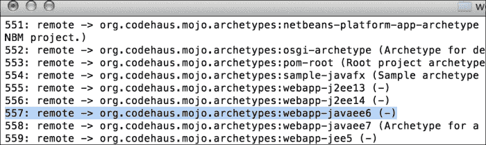
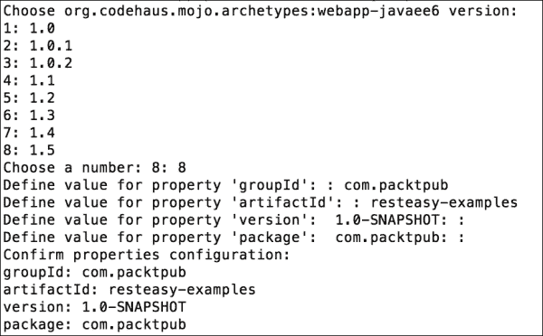
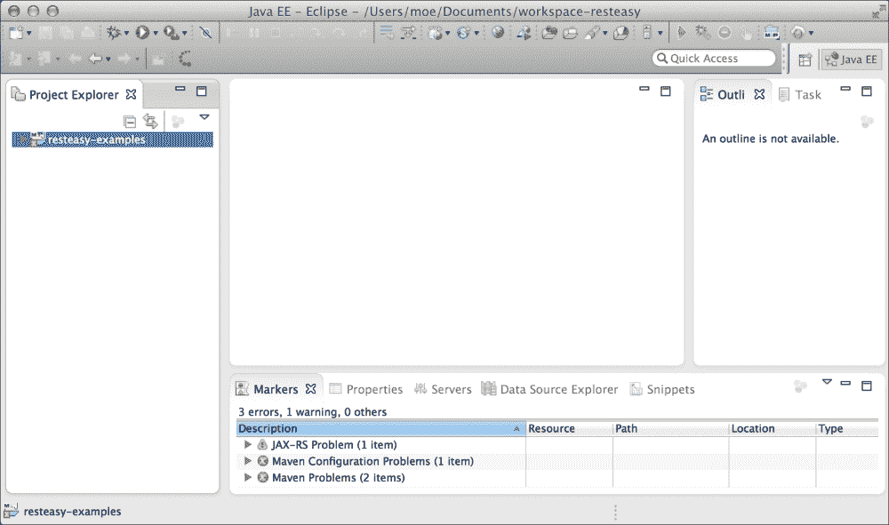
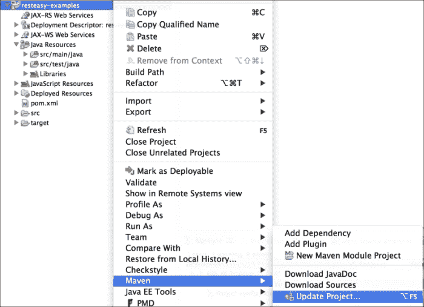
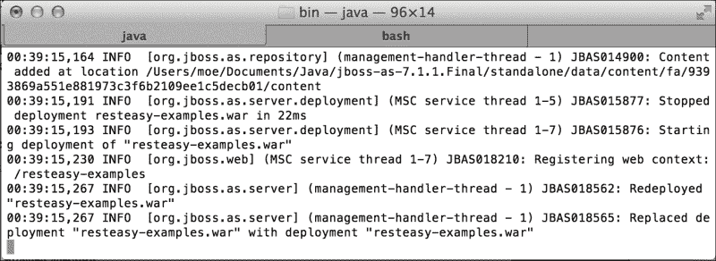
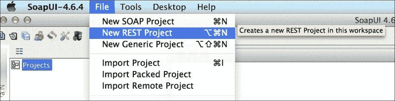
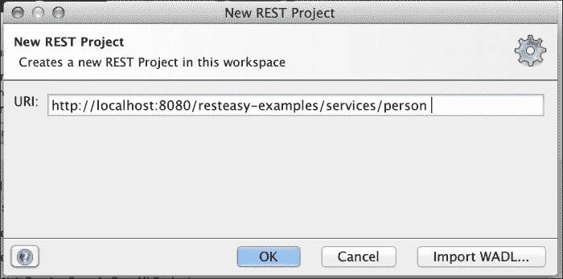
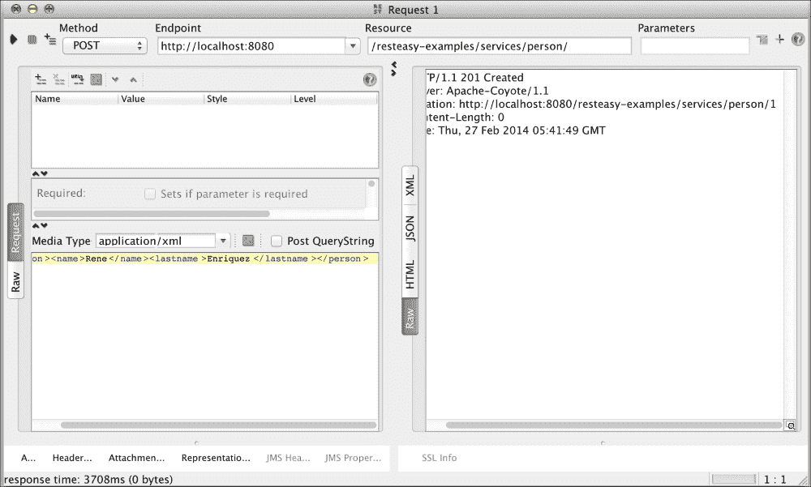
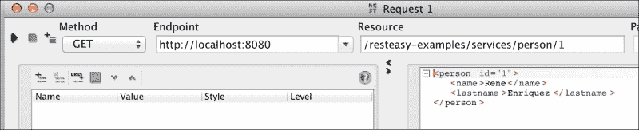

# 第一章. 环境设置

我们非常欢迎您加入我们旅程的第一章。让我们给您一个关于您在这里将实现什么的想法。阅读本章后，您将拥有设置用于与 RESTful Web 服务一起工作的开发环境所需的基本和启发性的知识。然后，您将熟悉与它相关的一个非常基础的项目开发。此外，到本章结束时，您将非常清楚地了解如何使用 RESTful Web 服务创建应用程序以及如何实现这一点。本章将以非常简单和全面的方式为您提供与这类 Web 服务一起工作的信息。

在本章中，我们将涵盖以下主题：

+   安装开发环境

+   创建我们的第一个 RESTful Web 服务应用程序

+   测试 RESTful Web 服务

# 下载工具

首先，我们必须获取我们的工作工具，以便我们能够动手编写代码。这里指定的工具在全球范围内被广泛使用，但您可以选择您自己的工具。记住，“工具不能造就艺术家”。无论您使用 Windows、MAC OS X 还是 Linux，都有适用于每个操作系统的工具。

让我们简要解释每个工具的用途。我们将使用 Eclipse 作为我们的 IDE，JBoss AS 7.1.1.Final 作为我们的应用服务器，Maven 来自动化构建过程，以及 SoapUI 作为测试我们创建的 Web 服务功能的工具。此外，我们建议您安装最新版本的 JDK，即 JDK 1.7.x。为了帮助您，我们已经获取并包含了您需要使用的链接，以获取实现第一个示例所需的软件。每个链接都提供了关于每个工具的更多信息，如果您对它们不熟悉，这些信息可能会很有用。

## 下载链接

以下工具必须下载：

+   Eclipse IDE for Java EE Developers 4.3([`www.eclipse.org/downloads/`](http://www.eclipse.org/downloads/))

+   JBoss AS 7.1.1 Final([`www.jboss.org/jbossas/downloads/`](http://www.jboss.org/jbossas/downloads/))

+   Apache Maven 3.1.1 或更高版本([`maven.apache.org/download.cgi`](http://maven.apache.org/download.cgi))

+   SoapUI 4.6 或更高版本([`www.soapui.org/`](http://www.soapui.org/))

+   JDK 1.7.x([`www.oracle.com/technetwork/java/javase/downloads/jdk7-downloads-1880260.html`](http://www.oracle.com/technetwork/java/javase/downloads/jdk7-downloads-1880260.html))

# 创建基础项目

为了使构建我们的示例项目的过程更加简单，我们将使用 Maven。这款出色的软件可以瞬间创建一个基础项目，我们的项目可以轻松编译和打包，无需依赖于特定的 IDE。

Maven 使用存档来创建特定类型的项目。存档是之前创建的项目模板；它们允许我们从 Java 桌面应用程序到多模块项目创建各种应用程序，其中 EAR 可以包含多个工件，如 JAR 和 WAR。其主要目标是尽可能快地让用户开始使用，通过提供一个演示 Maven 许多功能的示例项目。如果您想了解更多关于 Maven 的信息，可以通过访问[`maven.apache.org/`](http://maven.apache.org/)来找到更多信息。

然而，我们这里描述的信息已经足够我们继续前进。我们将使用存档来创建一个基本项目；如果我们想更具体一些，我们将使用存档来创建一个 Java 网络应用程序。为此，我们将在终端中输入以下命令行：

```java
mvn archetype:generate

```

当我们在终端中执行此命令行时，我们将获得 Maven 存储库中所有可用的存档。因此，让我们查找我们需要的存档来创建我们的网络应用程序；它的名字是`webapp-javaee6`，属于组`org.codehaus.mojo.archetypes`。我们还可以通过一个代表其 ID 的数字来搜索它；这个数字是`557`，如下面的截图所示。我们建议您通过名称进行搜索，因为数字可能会改变，因为以后可能会添加其他存档：



将出现几个问题；我们必须为每个问题提供相应的信息。Maven 将使用这些信息来创建我们之前选择的存档，如下面的截图所示：



如您可能已经注意到的，每个问题都要求您定义一个属性，每个属性的解释如下：

+   `groupId`：这个属性表示公司的域名反向顺序；这样我们就可以识别代码的所有者是哪个公司

+   `artifactId`：这个属性表示项目的名称

+   `version`：这个属性表示项目的版本

+   `package`：这个属性表示将要添加类的基包名

类名和包名一起构成了类的全名。这个全名允许以独特的方式识别类名。有时，当有多个具有相同名称的类时，包名有助于识别它属于哪个库。

下一步是将项目放入 Eclipse 的工作空间；为此，我们必须通过**文件** | **导入** | **Maven** | **现有 Maven 项目**来将我们的项目导入 Eclipse。

我们应该在 IDE 中看到项目，如下面的截图所示：



在继续之前，让我们修复`pom.xml`文件中发生的问题。

以下代码中显示的错误与来自 Eclipse 和 Maven 集成的错误有关。为了修复这个问题，我们不得不在 `<build>` 标签之后添加 `<pluginManagement>` 标签。

`pom.xml` 文件应如下所示：

```java
<project  
  xsi:schemaLocation="http://maven.apache.org/POM/4.0.0 http://maven.apache.org/xsd/maven-4.0.0.xsd">
  <modelVersion>4.0.0</modelVersion>

  <groupId>com.packtpub</groupId>
  <artifactId>resteasy-examples</artifactId>
  <version>1.0-SNAPSHOT</version>
  <packaging>war</packaging>

  . . .

  <build>
 <pluginManagement>
      <plugins>
        <plugin>
          . . .
        </plugin>
      </plugins>
 </pluginManagement>
  </build>

</project>
```

### 小贴士

**下载示例代码**

您可以从您在 [`www.packtpub.com`](http://www.packtpub.com) 的账户下载您购买的所有 Packt 书籍的示例代码文件。如果您在其他地方购买了这本书，您可以访问 [`www.packtpub.com/support`](http://www.packtpub.com/support) 并注册，以便直接将文件通过电子邮件发送给您。我们还强烈建议您从 GitHub 获取源代码，GitHub 地址为 [`github.com/restful-java-web-services-security`](https://github.com/restful-java-web-services-security)。

这将修复错误，现在我们只需要更新项目中的 Maven 配置，如下面的截图所示：



在刷新项目后，错误应该会消失，因为我们更新 Maven 的配置实际上是在更新我们的项目依赖，例如缺少的库。通过这种方式，我们将它们包含到我们的项目中，错误就会消失。

在 `src/main/webapp` 路径内，让我们创建一个 `WEB-INF` 文件夹。

现在，在 `WEB-INF` 文件夹内，我们将创建一个名为 `web.xml` 的新文件，内容如下：

```java
<?xml version="1.0" encoding="UTF-8"?>
<web-app version="3.0" 

  xsi:schemaLocation="http://java.sun.com/xml/ns/javaee 
  http://java.sun.com/xml/ns/javaee/web-app_3_0.xsd">
</web-app>
```

当您在保护您的应用程序时，这个文件非常有用；这次，我们将不进行任何配置来创建它。目前，`/WEB-INF` 文件夹和 `web.xml` 文件仅定义了 Web 应用程序的结构。

# 首个功能示例

现在我们已经设置好了我们的开发环境，是时候动手编写第一个 RESTful Web 服务了。由于我们使用的是 JBoss，让我们使用 JAX-RS 的 RESTEasy 实现。我们将开发一个非常简单的示例；让我们假设您想实现一个保存和搜索人员信息的服务的功能。

首先，我们创建一个简单的 `Person` 领域类，该类使用 JAXB 注解。JAXB 在 XML 和 Java 之间序列化/反序列化对象。在这个例子中，我们将这些实例存储在内存缓存中，而不是数据库中。在 JEE 中，这通常代表关系数据库中的一个表，每个实体实例对应于该表中的一行，如下面的代码所示：

```java
package com.packtpub.resteasy.entities;

import javax.xml.bind.annotation.XmlAccessType;
import javax.xml.bind.annotation.XmlAccessorType;
import javax.xml.bind.annotation.XmlAttribute;
import javax.xml.bind.annotation.XmlElement;
import javax.xml.bind.annotation.XmlRootElement;

@XmlRootElement(name = "person")
@XmlAccessorType(XmlAccessType.FIELD)
public class Person {

  @XmlAttribute
  protected int id;

  @XmlElement
  protected String name;

  @XmlElement
  protected String lastname;

  public int getId() {
    return id;
  }

  public void setId(int id) {
    this.id = id;
  }

  public String getName() {
    return name;
  }

  public void setName(String name) {
    this.name = name;
  }

  public String getLastname() {
    return lastname;
  }

  public void setLastname(String lastname) {
    this.lastname = lastname;
  }

}
```

接下来，我们在 `com.packtpub.resteasy.services` 包中创建一个新的类 `PersonService`。这个类将有两个方法；一个用于注册新人员，另一个用于通过 ID 搜索人员。这个类将使用内存映射缓存来存储人员信息。

该服务将具有以下实现：

```java
package com.packtpub.resteasy.services;

import java.net.URI;
import java.util.HashMap;
import java.util.Map;

import javax.ws.rs.Consumes;
import javax.ws.rs.GET;
import javax.ws.rs.POST;
import javax.ws.rs.Path;
import javax.ws.rs.PathParam;
import javax.ws.rs.Produces;
import javax.ws.rs.WebApplicationException;
import javax.ws.rs.core.Response;

import com.packtpub.resteasy.entities.Person;

@Path("/person")
public class PersonService {
  private Map<Integer, Person> dataInMemory;
  public PersonService() {
    dataInMemory = new HashMap<Integer, Person>();
  }

  @POST
  @Consumes("application/xml")
  public Response savePerson(Person person) {
    int id = dataInMemory.size() + 1;
    person.setId(id);
    dataInMemory.put(id, person);
    return Response.created(URI.create("/person/" + id)).build();
  }

  @GET
  @Path("{id}")
  @Produces("application/xml")
  public Person findById(@PathParam("id") int id) {
    Person person = dataInMemory.get(id);
    if (person == null) {
      throw new WebApplicationException(Response.Status.NOT_FOUND);
    }
    return person;
  }
}
```

`@Path`注解定义了 URL 中可用的路径，该路径位于此类中编写的功能内部。被`@Post`注解的方法表示它应该执行 HTTP POST 请求。此外，它还注解了`@Consumes`并使用`application/xml`值；这意味着 POST 请求将以包含要保存的人的信息的 XML 格式的字符串执行。另一方面，要从 ID 查找一个人，您必须执行 HTTP GET 请求。URL 必须以与在方法上`@Path`注解中指示的方式相同的方式指示 ID。`@Produces`注解表示我们将以 XML 格式获取响应。最后，请注意，参数 ID，如`@Path`注解中所示，是使用`@PathParam`注解的方法的参数。

最后，我们编写一个将扩展`Application`类并将我们刚刚创建的服务设置为单例的类。这样，信息就不会在每次请求中丢失，我们将在内存中保持它如下所示：

```java
package com.packtpub.resteasy.services;

import java.util.HashSet;
import java.util.Set;

import javax.ws.rs.ApplicationPath;
import javax.ws.rs.core.Application;

@ApplicationPath("/services")
public class MyRestEasyApplication extends Application {

  private Set<Object> services;

  public MyRestEasyApplication() {
    services = new HashSet<Object>();
    services.add(new PersonService());
  }

  @Override
  public Set<Object> getSingletons() {
    return services;
  }
}
```

注意，由于我们已经使用 JAXB 映射了我们的实体，我们的方法以 XML 格式消费和生成信息。

为了在 JBoss 中部署我们的应用程序，我们应在`pom.xml`文件中添加一个依赖项。这个依赖项必须引用 JBoss 插件。我们必须更改`pom.xml`中生成的工件名称。默认值是这个`artifactId`文件，后面跟着版本；例如，`resteasy-examples-1.0-snapshot.war`。我们将将其设置为仅使用`artifactId`文件；在这种情况下，`resteasy-examples.war`。所有这些配置都必须在`pom.xml`中包含、修改和实现，如下面的 XML 代码片段所示：

```java
  <build>
 <finalName>${artifactId}</finalName>
    <pluginManagement>
      <plugins>
        <plugin>
          <groupId>org.jboss.as.plugins</groupId>
          <artifactId>jboss-as-maven-plugin</artifactId>
          <version>7.5.Final</version>
          <configuration>
            <jbossHome>/pathtojboss/jboss-as-7.1.1.Final</jbossHome>
          </configuration>
        </plugin>
        ...
        </plugin>
      </plugins>
    </pluginManagement>
  </build>
```

您应该更改`jbossHome`属性的值，以指定您的 JBoss 安装路径。之后，我们将使用命令行终端；进入项目的目录，并输入`mvn jboss-as:run`。如果在命令执行后对代码进行了任何更改，那么您应该使用以下命令来查看更改：

```java
mvn jboss-as:redeploy

```

运行和重新部署是这个插件的目标。如果您想了解更多关于此插件的目标，您可以访问[`docs.jboss.org/jbossas/7/plugins/maven/latest/`](https://docs.jboss.org/jbossas/7/plugins/maven/latest/)）。这将重新编译所有项目类；然后将其打包以创建`.war`文件。最后，修改将部署到服务器上。如果一切正常，我们应该在终端中看到一条消息，表明部署已成功完成，如下面的截图所示：



本章的源代码可在 GitHub 的以下位置找到：

[`github.com/restful-java-web-services-security/source-code/tree/master/chapter01`](https://github.com/restful-java-web-services-security/source-code/tree/master/chapter01)

## 测试示例 Web 服务

在这个时刻，我们将测试我们刚刚创建的功能。我们将使用 SoapUI 作为我们的测试工具；请确保您使用的是最新版本，或者至少是等于或大于 4.6.x 的版本，因为这个版本提供了更多测试 RESTful Web 服务的功能。让我们先执行以下步骤：

1.  从主菜单开始，让我们通过导航到 **文件** | **新建 REST 项目** 来创建一个新的 REST 项目，如下面的截图所示：

1.  设置我们服务的 URI，如下所示：

1.  然后，让我们从工作区使用 `POST` 方法创建一个新的个人。在 **媒体类型** 字段中，选择 **application/xml**，并使用包含 XML 信息的字符串进行请求，如下面的文本所示：

    ```java
    <person><name>Rene</name><lastname>Enriquez</lastname></person>
    ```

1.  当我们点击 **播放** 按钮，我们应该获得一个显示创建的资源 URI（超链接 "`http://localhost:8080/resteasy-examples/services/person/1`"）的答案，如下面的截图所示：

1.  如果我们在 SoapUI 的 **资源** 文本框中更改 URI 并使用 `GET` 方法，它将显示我们刚刚输入的数据，如下面的截图所示：

恭喜！我们已经开发出了第一个具有两个功能的 RESTful Web 服务。第一个功能是保留人们的信息在内存中，第二个是通过 ID 获取人们的信息。

### 注意

如果您重新启动 JBoss 或重新部署应用程序，所有数据都将丢失。在搜索人们的信息之前，您必须首先保存数据。

# 摘要

在本章中，我们创建了我们的第一个功能应用程序——类似于一个 *hello world* 示例，但功能更接近现实世界。

本章中我们涵盖的基本部分是熟悉我们将要使用的工具。在后面的章节中，我们将假设这些概念已经清楚。例如，当使用 SoapUI 时，我们将逐步前进，因为这是一个将有助于测试我们将要开发的功能的工具。这样，我们将避免编写 Web 服务客户端代码的任务。

现在，我们已经准备好回顾下一章，其中包含 Java 提供的一些安全模型。我们将了解每一个，并学习如何实现它们。
