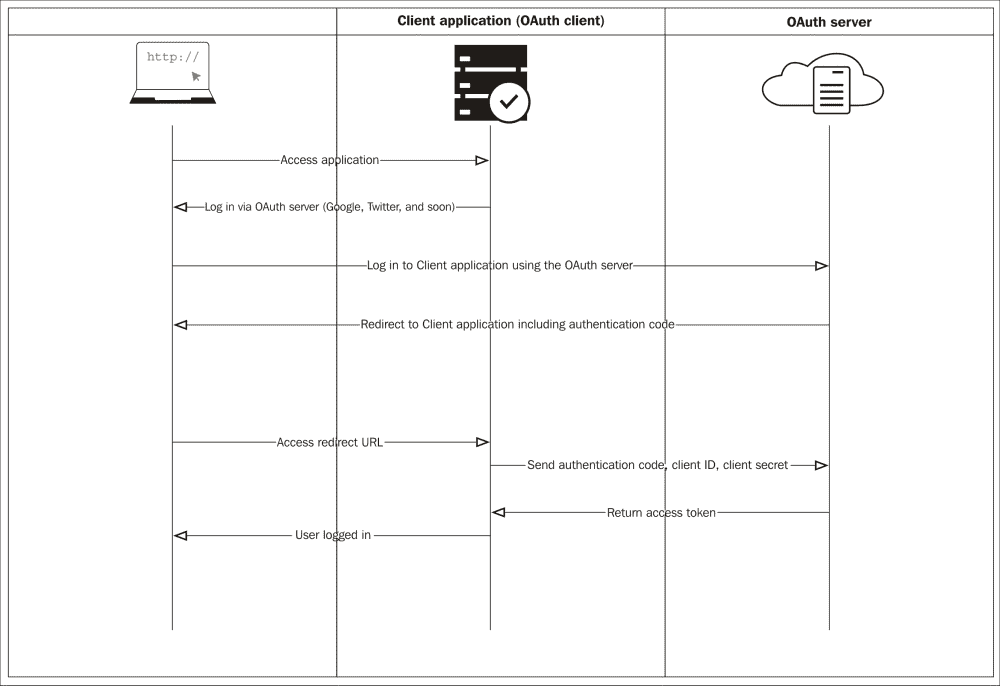
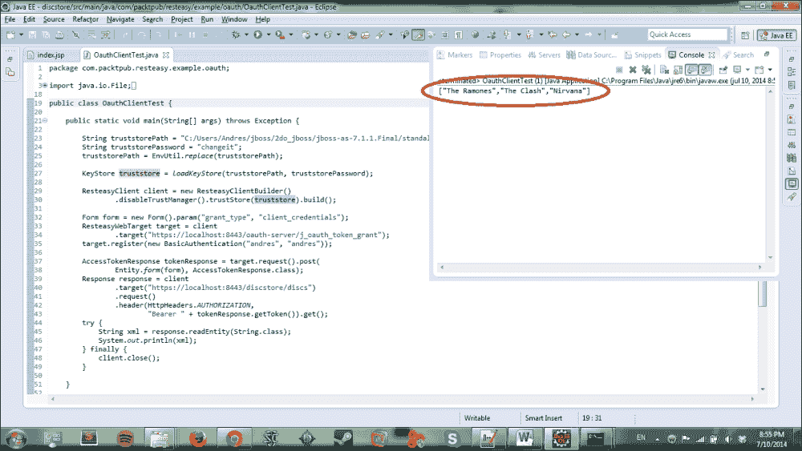
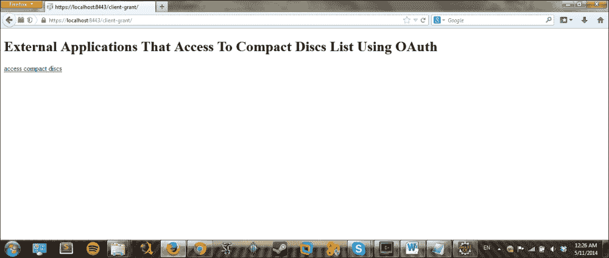
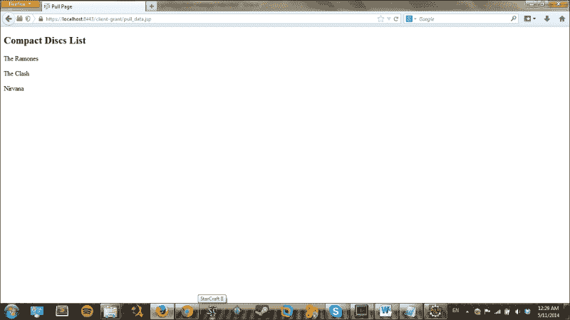
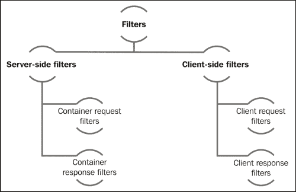

# 第四章 RESTEasy Skeleton Key

欢迎来到第四章！我们希望你在享受这本书，更重要的是，在学习和理解我们所传达和教授的内容。现在是时候前进并沉浸在新的一章中。

一旦阅读了本章，你将具备设计、实现和聚合额外的安全级别到你的 RESTEasy 应用程序中的知识，这一切都使用 OAuth 和 RESTEasy Skeleton Key 以及这些技术的某些特定要求，例如设置 OAuth 服务器。你将通过实际和描述性的应用程序示例来学习，就像我们在前面的章节中所做的那样；我们不会只停留在理论上，而是会实现应用程序并解释实现 OAuth 的具体方法和类。

在本章中，你将了解以下主题：

+   OAuth 和 RESTEasy

+   安全管理的 SSO 配置

+   访问令牌

+   自定义过滤器

+   测试用的 Web 服务客户端

如你可能已经体验过的，如果你在一个或几个社交网络上拥有账户，许多这些社交网络允许你在它们之间共享信息或在所有它们上发布内容。这是一个迹象表明应用程序需要共享信息，并且也使用其他应用程序中的资源。在这个例子中，它可以是你的账户或你的联系名单。这涉及到敏感信息，因此需要保护。此外，对资源的有限权限意味着第三方应用程序只能读取你的联系名单。这为应用程序中一个非常重要、吸引人和有用的功能打开了大门，即代表用户使用资源的容量。当然，你可能想知道后者如何授权使用？好吧，本章将向你展示。那么，让我们开始吧！

# OAuth 协议

这是一个开放协议，允许你从一个站点（服务提供者）安全地授权你的私有资源到另一个站点（消费者），而不必分享你的身份。

一个实际的例子是当你授权一个网站或应用程序使用你手机或社交网络中的联系名单。

# OAuth 和 RESTEasy Skeleton Key

在本节中，我们将回顾与 OAuth 作为认证框架、RESTEasy Skeleton Key 以及它们如何协同工作相关的一些概念。你将检查这些技术的某些功能，并通过一些实际示例的代码来亲自动手。

## 什么是 RESTEasy Skeleton Key？

RESTEasy Skeleton Key 为浏览器和 JAX-RS 客户端提供了一种统一的方式来确保安全。这允许在应用程序和服务网络中安全且可扩展地执行和转发请求，而无需在每次出现请求时与中央认证服务器交互。

## OAuth 2.0 认证框架

这使得第三方应用程序或服务能够代表资源所有者访问 HTTP 资源。它还防止第三方应用程序或服务与所有者的凭证取得联系。这是通过通过浏览器颁发访问令牌和使用直接授权来实现的。

简要解释了这两个概念之后，现在是时候描述它们是如何相互关联的了。RESTEasy 骨架密钥是一个 OAuth 2.0 实现，它使用 JBoss AS 7 安全基础设施来保护 Web 应用程序和 RESTful 服务。

这意味着你可以将 Web 应用程序转换为 OAuth 2.0 访问令牌提供者，你还可以将 JBoss AS 7 安全域转换为中央认证和授权服务器，在那里应用程序和服务可以相互交互。

下面的图表以更好的方式描述了此过程：



### 主要功能

我们希望帮助你理解这些技术并阐明它们的使用目的；这就是为什么我们将命名它们的一些主要功能。通过 OAuth 2.0 和 RESTEasy 骨架密钥，你可以执行以下功能：

+   将基于 servlet 表单认证的 Web 应用程序转换为 OAuth 2.0 提供者。

+   在中央认证服务器上提供分布式**单点登录（SSO**），以便一次登录即可安全地访问域中配置的任何基于浏览器的应用程序。

+   只用一个链接即可从所有配置了单点登录（SSO）的分布式应用程序中注销。

+   使用访问令牌使 Web 应用程序与远程 RESTful 服务交互。

+   使用 OAuth 2.0 对签名访问令牌，并在以后使用这些令牌访问域中配置的任何服务。令牌具有身份和角色映射，并且由于令牌是数字签名的，因此无需在每次请求时都过载中央认证服务器。

你可以在[`docs.jboss.org/resteasy/docs/3.0-beta-2/userguide/html/oauth2.html`](http://docs.jboss.org/resteasy/docs/3.0-beta-2/userguide/html/oauth2.html)找到更多关于这些主题的信息。

我们将讨论最重要的部分，但这可能对你有所帮助。

## OAuth2 实现

我们刚刚回顾了本章将要处理的一些主要概念，但这还远远不够。我们必须实现一个描述性示例，以便我们能够完全理解这些主题。

### 在 JBoss 中更新 RESTEasy 模块

为了不干扰您的 JBoss 配置或其他任何东西，我们将使用另一个全新的 JBoss 实例。我们必须更新一些与 RESTEasy 相关的模块。我们可以非常容易地做到这一点。让我们访问链接 [`resteasy.jboss.org/`](http://resteasy.jboss.org/)；在您的右侧，您将找到一个标题为 **Useful Links** 的面板，其中有一个下载链接。点击它以访问另一个页面，该页面包含许多下载链接。在这个示例中，我们使用 3.0.7.Final 版本。下载此版本以继续前进。

下载并解压后，您将找到一个名为 `resteasy-jboss-modules-3.0.7.Final` 的另一个 `.zip` 文件；此文件包含一些 JAR 文件，这些文件将更新您的 JBoss 模块。因此，解压它，将所有文件夹复制到 `JBOSS_HOME/modules/` 中，并替换所有冲突项。最后一步：我们必须更新 JAR 文件的版本并修改 JBoss 中的模块 XML，以便将 `org.apache.httpcomponents` 设置为使用 `httpclient-4.2.1.jar`、`httpcore-4.2.1.jar` 和 `httpmime-4.2.1.jar`，因为当前最新版本是 4.3.4，这也同样可以正常工作。因此，复制这些 JAR 文件并在 `JBOSS_HOME/modules/org/apache` 文件夹中的 `module.xml` 文件中更新版本。现在，我们已经更新了我们的模块以支持 RESTEasy。

### 在 JBoss 中设置配置

为了使我们的 JBoss 为我们的示例做好准备的下一步，我们必须前往 [`github.com/restful-java-web-services-security/source-code/tree/master/chapter04`](https://github.com/restful-java-web-services-security/source-code/tree/master/chapter04) 并下载 `chapter04` 示例 zip 文件。解压后，您将找到一个名为 `configuration` 的文件夹。这个文件夹包含设置我们的 JBoss 配置所需的文件。因此，复制这些文件并替换位于 `JBOSS_HOME/standalone/configuration` 的 JBoss 中的配置文件夹。

### 实现 OAuth 客户端

为了开发这个示例，我们研究了一个非常有用的示例并将其应用于一个新的项目。这个示例由几个项目组成；每个项目将生成一个 WAR 文件。这个示例的目的是演示 OAuth 的工作原理，并解释您如何在技术层面上实现这项技术。因此，我们将模拟几个事物来创建一个可以应用此实现的环境。完整的代码可以从以下链接下载：

[`github.com/restful-java-web-services-security/source-code/tree/master/chapter04/oauth2-as7-example`](https://github.com/restful-java-web-services-security/source-code/tree/master/chapter04/oauth2-as7-example)

#### oauth-client 项目

首先，我们将创建 `oauth-client` webapp 项目。您可以使用我们在前几章中使用的 Maven 命令，或者您可以使用 Eclipse IDE 来执行此操作。

然后，让我们添加一些依赖项以实现我们的客户端。这些依赖项适用于所有项目。转到`pom.xml`文件，并确保在`<dependencies>`标签内添加以下依赖项：

```java
       <dependency>
            <groupId>org.jboss.spec.javax.servlet</groupId>
            <artifactId>jboss-servlet-api_3.0_spec</artifactId>
            <version>1.0.1.Final</version>
            <scope>provided</scope>
        </dependency>
        <dependency>
            <groupId>org.jboss.resteasy</groupId>
            <artifactId>resteasy-client</artifactId>
            <version>3.0.6.Final</version>
            <scope>provided</scope>
        </dependency>
        <dependency>
            <groupId>org.jboss.resteasy</groupId>
            <artifactId>skeleton-key-core</artifactId>
            <version>3.0.6.Final</version>
            <scope>provided</scope>
        </dependency>
```

让我们从创建包`com.packtpub.resteasy.example.oauth`开始。然后，创建类`public class Loader implements ServletContextListener`，它实现了`ServletContextListener`接口，因为我们将会加载一个密钥存储库并初始化上下文。

让我们在我们的类`private ServletOAuthClient oauthClient`中添加一个字段，它将代表我们的 OAuth 客户端对象。

然后，让我们创建以下代码片段所示的方法：

```java
private static KeyStore loadKeyStore(String filename, String password) throws Exception 
{
KeyStore keyStore = KeyStore.getInstance(KeyStore.getDefaultType());
File keyStoreFile = new File(filename);
FileInputStream keyStoreStream = new FileInputStream(keyStoreFile);
    keyStore.load(keyStoreStream, password.toCharArray());
    keyStoreStream.close();
    return keyStore; 
}
```

此方法接收两个参数，文件名和密码，并创建`KeyStore`对象。它还从接收到的文件名创建一个`FileInputStream`对象，以便它可以使用它来加载`KeyStore`对象，并且它使用接收到的密码作为字符数组。

然后，由于我们的类实现了`ServletContextListener`接口，我们必须覆盖一些方法。第一个要覆盖的方法是`contextInitialized`。让我们这样做：

```java
@Override
 public void contextInitialized(ServletContextEvent sce) {
  String truststoreKSPath = "${jboss.server.config.dir}/client-truststore.ts";
  String truststoreKSPassword = "changeit";
  truststoreKSPath = EnvUtil.replace(truststoreKSPath);
  try {
   KeyStore truststoreKS = loadKeyStore(truststoreKSPath, 
     truststoreKSPassword);
   oauthClient = new ServletOAuthClient();
   oauthClient.setTruststore(truststoreKS);
   oauthClient.setClientId("third-party");
   oauthClient.setPassword("changeit");
   oauthClient.setAuthUrl("https://localhost:8443/oauth-server/login.jsp");
   oauthClient.setCodeUrl("https://localhost:8443/oauth-server/
     j_oauth_resolve_access_code");
   oauthClient.start();
   sce.getServletContext().setAttribute(ServletOAuthClient.class.getName(), oauthClient);
  } catch (Exception e) {
   throw new RuntimeException(e);
  }

 }
```

通过这个方法，我们将完成几件事情。正如你所看到的，我们设置了两个内部变量；一个是设置到我们的`client-truststore.ts`文件路径，另一个是设置密码。确保将文件粘贴到我们在变量中指定的路径（`JBOSS_HOME/standalone/configuration`）。

然后，我们使用在变量中指定的路径和密码加载`KeyStore`对象，通过这种方式获取另一个`KeyStore`对象。

现在，是时候实例化和设置我们的 OAuth 客户端对象的属性了。在之前的代码中，我们设置了以下属性：`trustStore`、`clientId`、`password`、`authUrl`和`codeUrl`。

最后，我们创建客户端以从代码中获取访问令牌。为了完成这个任务，我们使用`start()`方法。同时，我们使用我们刚刚创建的 OAuth 客户端对象设置属性 servlet OAuth 客户端。

为了完成我们的 OAuth 客户端，我们需要覆盖一个名为`public void contextDestroyed(ServletContextEvent sce)`的第二个方法，如下面的代码所示：

```java
@Override
  public void contextDestroyed(ServletContextEvent sce) {
    oauthClient.stop();
  }
```

当 servlet 上下文即将关闭、我们的应用程序正在重新部署等情况发生时，此方法将执行。该方法关闭客户端实例及其所有相关资源。

我们为我们的示例实现了 OAuth 客户端。我们需要另一个资源。这次，我们将创建一个类，作为我们的光盘存储库的数据库客户端。所以，让我们称它为`CompactDiscsDatabaseClient`，并且我们将获取以下两个方法：

+   `public static void redirect(HttpServletRequest request, HttpServletResponse response)`

+   `public static List<String> getCompactDiscs(HttpServletRequest request)`

因此，让我们开始实现第一个方法。这个方法解释如下：

```java
public static void redirect(HttpServletRequest request, HttpServletResponse response) {
ServletOAuthClient oAuthClient = (ServletOAuthClient) request.getServletContext().getAttribute(ServletOAuthClient.class.getName());
    try {
oAuthClient.redirectRelative("discList.jsp", request, response);
    } catch (IOException e) {
      throw new RuntimeException(e);
    }
  }
```

在前面的方法中，我们从请求中获取的`ServletContext`对象中获取`ServletOAuthClient`对象；servlet OAuth 客户端作为名为`ServletOAuthClient`的属性存在于 servlet 上下文中。记住，在我们创建的第一个类中，我们在 servlet 上下文中设置了此属性。

最后，我们通过通过`redirectRelative (String relativePath, HttpServletRequest request, HttpServletResponse response)`方法将浏览器重定向到认证服务器来启动获取访问令牌的过程。

现在，让我们继续使用下一个方法来加载光盘。以下代码表示该方法：

```java
public static List<String> getCompactDiscs(HttpServletRequest request) {

ServletOAuthClient oAuthClient = (ServletOAuthClient) request.getServletContext().getAttribute(
        ServletOAuthClient.class.getName());

ResteasyClient rsClient = new 
ResteasyClientBuilder().trustStore(oAuthClient.getTruststore()).hostnameVerification(ResteasyClientBuilder.HostnameVerificationPolicy.ANY).build();

String urlDiscs = "https://localhost:8443/store/discs";
  try {
String bearerToken = "Bearer" + oAuthClient.getBearerToken(request);

Response response = rsClient.target(urlDiscs).request().header(HttpHeaders.AUTHORIZATION, bearerToken)
          .get();
    return response.readEntity(new GenericType<List<String>>() {
	      });
    } finally {
      rsClient.close();
    }
}
```

让我们检查一下这里的情况。在前面的`getCompactDiscs()`方法中，我们创建了一个`ServletOAuthClient`对象，该对象负责通过将浏览器重定向到认证服务器来启动获取访问令牌的过程。再次，我们从请求的`ServletContext`对象中获取属性。然后，我们使用一个新的`ResteasyClientBuilder()`实例创建一个`ResteasyClient`对象；这个类是创建客户端和允许 SSL 配置的抽象。

我们随后使用`trustStore()`方法设置客户端信任存储库。这个调用将返回一个`KeyStore`对象并设置客户端信任存储库。之后，我们调用`hostnameVerification()`方法，该方法设置用于验证主机名的 SSL 策略。最后，通过使用`build()`方法，我们构建一个新的客户端实例，该实例包含在此客户端构建器中先前指定的整个配置。这将返回一个`ResteasyClient`实例。

让我们继续创建一个内部变量，该变量将保存我们将设置为我们的目标资源的资源 URL。同时，我们还将创建另一个内部变量来保存作为字符串的 bearer 令牌。这个字符串将由单词`Bearer`后跟 servlet OAuth 客户端和请求中的 bearer 令牌组成。

现在，为了创建响应，我们将使用我们刚刚创建的 servlet OAuth 客户端。让我们使用变量`urlDiscs`作为参数，并通过`target()`方法创建一个新的网络资源目标。之后，使用`request()`方法，我们设置对刚刚设置的目标网络资源的请求。

最后，我们通过调用`header()`方法添加一个头，该方法将接收两个参数：第一个参数代表头的名称，第二个参数是头的值。之后，我们调用当前请求的`HTTP GET`方法。

为了澄清，`HttpHeaders.AUTHORIZATION`常量代表当用户想要通过添加一个授权请求头字段与服务器进行身份验证时的特定情况。它是通过在请求中添加一个授权请求头字段来完成的。另一方面，授权字段值由包含请求资源的领域内用户身份验证信息的凭据组成。

一旦创建响应对象，我们使用 `readEntity()` 方法读取消息实体输入流作为指定 Java 类型的实例。这样，我们就可以用我们的光盘示例列表填充列表，以便在网页中展示。这意味着我们已经访问了资源。

如果您想了解更多关于我们在描述的代码块中使用的代码，这里有一些链接作为参考。您可以查看它们，扩展您的知识，并获取更多关于 `RestEasyClient` 和 `RestEasyClientBuilder` 的详细信息。

+   [`www.w3.org/Protocols/rfc2616/rfc2616-sec14.html`](http://www.w3.org/Protocols/rfc2616/rfc2616-sec14.html)

+   [`docs.jboss.org/resteasy/docs/3.0.2.Final/javadocs/org/jboss/resteasy/client/jaxrs/ResteasyClient.html`](http://docs.jboss.org/resteasy/docs/3.0.2.Final/javadocs/org/jboss/resteasy/client/jaxrs/ResteasyClient.html)

+   [`docs.jboss.org/resteasy/docs/3.0.1.Final/javadocs/org/jboss/resteasy/client/jaxrs/ResteasyClientBuilder.html#truststore`](http://docs.jboss.org/resteasy/docs/3.0.1.Final/javadocs/org/jboss/resteasy/client/jaxrs/ResteasyClientBuilder.html#truststore)

#### 光盘存储项目

我们将要创建的下一个项目是 `discstore` 项目；创建项目的步骤与上一个项目相同，您可以使用 Maven 命令或 Eclipse IDE。

在此项目中，我们将创建一个类，该类将创建光盘列表。这个类相当简单，它使用了一些在前几章中已经讨论过的注解。这个类的名称将是 `CompactDiscService`，它将只有一个带有多个注解的方法。让我们从代码开始，我们将在代码块之后添加一个简短的描述：

```java
@Path("discs")
public class CompactDiscService {
  @GET
 @Produces("application/json")
  public List<String> getCompactDiscs() {
    ArrayList<String> compactDiscList = new ArrayList<String>();
    compactDiscList.add("The Ramones");
    compactDiscList.add("The Clash");
    compactDiscList.add("Nirvana");
    return compactDiscList;
  }
}
```

如您所见，`getCompactDiscs()` 方法负责创建一个字符串列表，其中每个项目都将代表一张光盘，这是我们将添加三个项目的示例。

`@Produces` 注解用于指定 MIME 媒体类型，如果应用于方法级别，则这些注解将覆盖在类级别上应用的任何 `@Produces` 注解。如您所知，`@GET` 注解将代表 HTTP 方法 `GET`。同时，`@Path` 注解将帮助我们设置类为资源，其名称将为 `discs`。

所有后端功能都已实现；我们现在需要开发一些其他资源，以便我们的示例能够运行。记住我们在上面的类中指定了一些网页吗？嗯，这正是我们现在要实现的。

#### oauth-server 项目

如前所述，为了创建此项目，您可以使用 Maven 命令或 Eclipse IDE。

为了使此应用程序运行，我们必须创建包含以下内容的 `jboss-web.xml` 文件：

```java
<jboss-web>
    <security-domain>java:/jaas/commerce</security-domain>
    <valve>
        <class-name>org.jboss.resteasy.skeleton.key.as7.OAuthAuthenticationServerValve</class-name>
    </valve>
</jboss-web>
```

最后一件事情：我们需要创建一个 JSON 文件，目的是将我们的证书和安全配置保存在这个服务器上。我们将它命名为`resteasy-oauth`。正如你所见，这个文件并没有什么大不了的；它只是一组属性和值。通过这个文件，我们指定了 KeyStores 和密码、信任存储库路径等等。这个文件将位于本项目的`WEBINF`文件夹中。

```java
{
   "realm" : "commerce",
   "admin-role" : "admin",
   "login-role" : "login",
   "oauth-client-role" : "oauth",
   "wildcard-role" : "*",
   "realm-keystore" : "${jboss.server.config.dir}/realm.jks",
   "realm-key-alias" : "commerce",
   "realm-keystore-password" : "changeit",
   "realm-private-key-password" : "changeit",
   "truststore" : "${jboss.server.config.dir}/client-truststore.ts",
   "truststore-password" : "changeit",
   "resources" : [
      "https://localhost:8443/oauth-client",
      "https://localhost:8443/discstore/"
   ]
}
```

#### webapp/WEB-INF/ jboss-deployment-structure.xml

我们必须在所有项目中配置这个文件，因为我们从 JBoss AS 实例更新了一些模块。在这个文件中，我们必须指定我们的应用程序与 JBoss 某些模块的依赖关系。然后，我们需要使用`<dependencies>`标签内的`<module>`标签明确设置它们，如下所示：

```java
<jboss-deployment-structure>
    <deployment>
        <!-- This allows you to define additional dependencies, it is the same as using the Dependencies: manifest attribute -->
        <dependencies>
            <module name="org.jboss.resteasy.resteasy-jaxrs" services="import"/>
            <module name="org.jboss.resteasy.resteasy-jackson-provider" services="import"/>
            <module name="org.jboss.resteasy.skeleton-key" />
        </dependencies>
    </deployment>
</jboss-deployment-structure>
```

#### 运行应用程序

我们已经解释了每个项目的关键部分，因此为了运行和测试应用程序，你可以从[`github.com/restful-java-web-services-security/source-code/tree/master/chapter04`](https://github.com/restful-java-web-services-security/source-code/tree/master/chapter04)下载本章的示例文件夹。下载 ZIP 文件后，解压它，你将发现有一个名为`OAuthExample`的文件夹。在这个文件夹中，有我们的三个项目。你可以将它们复制并粘贴到你的工作空间中，并使用 Eclipse 导入这些项目。

我们已经提供了你所需的密钥存储库、证书和信任存储库文件，这些文件位于你设置 JBoss `configuration`时粘贴的`configuration`文件夹内。为了确保应用程序正确运行，你可能需要根据`configuration`文件夹内名为`keystoreCommands`的`.txt`文件中的说明更新这些文件。

为了启动我们的应用程序，我们必须部署它。所以，打开一个终端。让我们进入`JBOSS_HOME/bin`并以独立模式启动 JBoss；这意味着如果你在 Windows 上，执行`standalone.bat`，如果你在 Linux 上，执行`./standalone.sh`。然后，打开一个终端并进入工作空间中我们的应用程序文件夹。我们必须执行以下命令：`mvn clean install`，然后对创建的三个项目（`discstore`、`oauth-client`和`oauth-server`）中的每一个执行`mvn jboss-as:deploy`。

我们在`discstore`项目中创建了一个特殊类。这个类包含一个`void main`方法，我们通过这个类来测试我们的应用程序。我们将其命名为`OAuthClientTest`。这个类的代码如下：

```java
public class OauthClientTest {

  public static void main(String[] args) throws Exception {

    String truststorePath = "C:/Users/Andres/jboss/2do_jboss/jboss-as-7.1.1.Final/standalone/configuration/client-truststore.ts";
    String truststorePassword = "changeit";
    truststorePath = EnvUtil.replace(truststorePath);

    KeyStore truststore = loadKeyStore(truststorePath, truststorePassword);

         ResteasyClient client = new ResteasyClientBuilder()
                .disableTrustManager().trustStore(truststore).build();

    Form form = new Form().param("grant_type", "client_credentials");
    ResteasyWebTarget target = client.target("https://localhost:8443/oauth-server/j_oauth_token_grant");
    target.register(new BasicAuthentication("andres", "andres"));

    AccessTokenResponse tokenResponse = target.request().post(Entity.form(form), AccessTokenResponse.class);
    Response response = client.target("https://localhost:8443/discstore/discs")
        .request()
        .header(HttpHeaders.AUTHORIZATION,
            "Bearer " + tokenResponse.getToken()).get();
    try {
      String xml = response.readEntity(String.class);
      System.out.println(xml);
    } finally {
      client.close();
    }

  }
```

我们将首先解释前面的代码，我们有两个变量，`truststorePath` 和 `truststorePassword`。第一个变量引用的是我们位于 JBoss 配置文件夹中的 `client-truststore.ts` 文件路径。你应该更改这个变量的值以便使这个测试工作，所以请放置你配置文件夹的路径。之后，使用我们已解释过的方法 `loadKeyStore ()`，我们使用前面的变量来加载 KeyStore，并将这个值赋给一个名为 `truststore` 的 `KeyStore` 对象。从 `truststore` 中，我们创建了一个名为 `client` 的 `RestEasyClient` 对象。

现在，我们将以编程方式获取访问令牌，这样我们就可以通过使用 HTTPS 调用来从 auth-server 获取访问令牌。然后我们必须使用基本认证来识别我们的用户；结果，我们将为该用户获取一个签名访问令牌。

因此，我们向 auth-server 的上下文根执行一个简单的 `POST` 请求，并在目标 URL 的末尾加上 `j_oauth_token_grant`，因为当我们使用该 URL 并执行带有基本认证的 `POST` 请求时，我们将为特定用户获取一个访问令牌。

之后，我们获得了访问令牌，它是一个简单的字符串。为了调用受令牌认证保护的服务，我们必须构建一个由你的 `HTTPS` 请求的授权头、字符串 `Bearer` 以及最终的访问令牌字符串组成的字符串。这将返回响应对象，因此我们可以读取它并像在测试中那样打印它。在控制台中，你会看到如下截图所示的 CD 列表：



# 安全管理的 SSO 配置

SSO 是一种认证机制。它允许用户通过一次输入凭证即可访问多个系统或应用程序。我们认为你今天可能更经常体验到这一点，因为我们生活在一个社交网络时代，这些服务中的大多数都允许我们使用彼此的凭证来访问多个服务。

在讨论了一些 SSO 的概念之后，让我们尝试实现这个机制。为了实现这一点，我们将使用 JBoss 7 应用程序服务器和我们的早期项目 `secure-demo`。

作为对这个实现的简要介绍，我们想告诉你，我们将与两个文件一起工作；一个文件属于 JBoss，另一个属于我们的应用程序。

属于 JBoss 的文件是 `standalone.xml`。我们将向这个文件添加一些行。在下面的代码行中，让我们在 `virtual-server` 定义中添加 SSO 元素：

```java
<subsystem  default-virtual-server="default-host" native="false">
            <connector name="http" protocol="HTTP/1.1" scheme="http" socket-binding="http"/>
            <virtual-server name="default-host" enable-welcome-root="true">
                <alias name="localhost"/>
                <sso domain="localhost" reauthenticate="false"/>
            </virtual-server>
</subsystem>
```

`reauthenticate` 属性允许我们确定每个请求是否需要重新认证到 `securityReal`。默认值是 `false`。

下一个我们必须编辑的文件是在我们的应用程序中，其名称为`jboss-web.xml`。此外，我们还需要向此文件添加一些代码行。这些代码行将声明管理 SSO 的 valve。换句话说，每个请求都将通过这个 valve，如下面的代码所示：

```java
<jboss-web>
    <security-domain>java:/jaas/other </security-domain>
          <valve>
        <class-name>org.apache.catalina.authenticator.SingleSignOn</class-name>
    </valve>
</jboss-web>
```

就算你忘记了或者删除了它，我们在前面的章节中设置了一个安全域。以下代码块必须在`standalone.xml`文件中存在：

```java
<security-domain name="other" cache-type="default">
    <authentication>
      <login-module code="Remoting" flag="optional">
<module-option name="password-stacking"  value="useFirstPass"/>
      </login-module>
      <login-module code="RealmUsersRoles" flag="required">
<module-option name="usersProperties" value="${jboss.server.config.dir}/application-users.properties"/>
<module-option name="rolesProperties" value="${jboss.server.config.dir}/application-roles.properties"/>
<module-option name="realm" value="ApplicationRealm"/>
<module-option name="password-stacking" value="useFirstPass"/>
      </login-module>
     </authentication>
</security-domain>
```

由于我们正在使用`secure-demo`示例，因此我们只需修改以下内容来配置 SSO。

为了测试这个机制，我们需要另一个应用程序。我们必须在我们的`secure-demo`示例中复制我们刚刚所做的配置。

当我们在其中一个中输入凭据时，由于我们已经应用了 SSO，我们不再需要在其他中输入凭据。我们将在这两个应用程序中进行认证。

# OAuth 令牌通过基本认证

现在，让我们探索并实现一个使用令牌的简短示例。为了构建这个示例，我们将创建一个类。这个类，就像之前的示例一样，将模拟数据库客户端。它将具有相同的方法`getCompactDiscs()`，但我们将在这个示例中修改内部函数。此外，这次它不会接收任何参数。

好的，让我们开始吧！首先，在类中创建两个静态字符串字段。第一个字段将保存 auth-server 中认证的 URL。另一个字段将显示光盘列表的 URL；你可以从之前的示例中重用相同的网页。然后，你应该有如下变量：

```java
private static String urlAuth = "https://localhost:8443/auth-server /j_oauth_token_grant";
private static String urlDiscs = "https://localhost:8443/discstore/discs";
```

然后，让我们创建我们的方法来获取光盘列表。以下代码片段显示了该方法的确切执行方式：

```java
public static List<String> getCompactDiscs() {
  ResteasyClient rsClient = new ResteasyClientBuilder().disableTrustManager().build();
    Form form = new Form().param("grant_type", "client_credentials");
  ResteasyWebTarget resourceTarget = rsClient.target(urlAuth);
    resourceTarget.register(new BasicAuthentication("andres", "andres"));
  AccessTokenResponse accessToken = resourceTarget.request().post(Entity.form(form), AccessTokenResponse.class);
    try {
      String bearerToken = "Bearer " + accessToken.getToken();
      Response response = rsClient.target(urlDiscs).request().header(HttpHeaders.AUTHORIZATION, bearerToken).get();
      return response.readEntity(new GenericType<List<String>>() {
      });
    } finally {
      rsClient.close();
    }
  }
```

是时候检查我们刚刚所做的工作了。作为第一步，我们创建了一个`ResteasyClient`对象。如果你注意到了，我们使用了一些东西来禁用信任管理和主机名验证。这次调用的结果是关闭了服务器证书验证，允许 MITM（中间人）攻击。因此，请谨慎使用此功能。

然后，我们创建一个`form`对象并传入一些参数。这些参数通过`param()`方法传入，分别代表参数名称和参数值。这意味着我们指定了应用程序请求的授权类型，它将是`client_credentials`。

然后，就像我们在之前的示例中所做的那样，让我们创建一个 RESTEasy 网络目标，该目标将针对我们之前设置的 URL 显示光盘列表。记住，这个 URL 是在我们之前创建的静态字段中设置的。这个网络目标将是我们将访问的`resourceTarget`对象。

当我们使用`register()`方法并传入一个`BasicAuthentication`对象时，我们注册了一个自定义 JAX-RS 组件的实例，该实例将在可配置上下文中实例化和使用。

接下来，我们通过向我们的目标执行请求来创建`AccessTokenResponse`类。然后，在同一行中，我们执行一个 POST 请求，以便同步发送我们想要获取的当前请求的实体和响应类型。`Entity.form()`方法从我们之前创建的`form`对象中创建`application/x-www-form-urlencoded`实体。现在，这将返回一个`AccessTokenResponse`对象；我们使用这个对象通过在令牌开头添加单词`Bearer`来构建承载令牌。

最后，让我们通过向`urlDiscs`变量中设置的 URL 执行请求来创建响应对象。我们应该使用`ResteasyClient`对象来定位这个资源，然后执行请求并使用变量`bearerToken`中设置的`bearer`令牌设置`HttpHeaders.AUTHORIZATION`头字段。这样，我们就获得了对目标资源的访问权限；在这种情况下，我们可以看到信息。

由于我们继续使用相同的应用程序业务，我们可以重用前一个示例中的网页。确保将`index.html`和`discsList.jsp`网页包含到你的示例中，路径与前一个示例相同。我们还将使用`jboss-deployment-structure.xml`文件中设置的配置，因为我们正在使用相同的模块依赖项。

我们的`web.xml`文件应该比前一个示例简单，所以可能看起来像以下这样：

```java
<?xml version="1.0" encoding="UTF-8"?>
<web-app 

      xsi:schemaLocation="http://java.sun.com/xml/ns/javaee http://java.sun.com/xml/ns/javaee/web-app_3_0.xsd"
      version="3.0">
    <security-constraint>
        <web-resource-collection>
            <url-pattern>/*</url-pattern>
        </web-resource-collection>
        <user-data-constraint>
            <transport-guarantee>CONFIDENTIAL</transport-guarantee>
        </user-data-constraint>
    </security-constraint>
</web-app>
```

## 运行应用程序

你可以从[`github.com/restful-java-web-services-security/source-code/tree/master/chapter04`](https://github.com/restful-java-web-services-security/source-code/tree/master/chapter04)下载完整的代码和配置。解压文件，你将找到一个名为`token-grant`的文件夹。你必须使用相同的命令部署这个项目。作为一个要求，你必须部署`oauth-server`、`oauth-client`和`discstore`项目。

是时候运行我们的应用程序了。让我们执行前一个示例中做的步骤，OAuth 示例。之后，我们必须打开我们喜欢的浏览器并输入 URL `https://localhost:8443/token-grant/`。这将带我们到以下网页：



好吧，正如你所注意到的，我们重用了相同的网页，只是为了这些示例的目的。然而，有一点小小的不同；当调用不同的网页时，你可以查看我们刚才解释的核心。这将执行一个令牌，我们将通过这个令牌对想要访问的数据进行请求。结果，我们将在网页中读取我们的光盘列表，如下面的截图所示：



最终结果是能够在网页中展示光盘列表的能力。然而，不要忘记发生了什么；我们只是使用请求、使用我们的凭证进行的基本身份验证和表单，获得了访问令牌响应。有了访问令牌响应，我们可以创建响应并使用相应的授权来展示数据。

# 自定义过滤器

简要介绍，JAX-RS 2.0 有两个不同的拦截概念：过滤器（filters）和拦截器（interceptors）。

拦截器是拦截 EJB 方法调用的组件。它们可以用来审计和记录 EJB 何时被访问。这是一个不会在本书中包含的主题，但如果你对它感到好奇并想了解更多，我们提供以下链接作为参考，以便你可以查找：

+   [`docs.oracle.com/javaee/6/tutorial/doc/gkigq.html`](http://docs.oracle.com/javaee/6/tutorial/doc/gkigq.html)

+   [`www.javacodegeeks.com/2013/07/java-ee-ejb-interceptors-tutorial-and-example.html`](http://www.javacodegeeks.com/2013/07/java-ee-ejb-interceptors-tutorial-and-example.html)

过滤器主要用于修改或处理传入和传出的请求或响应头。它们可以在请求和响应处理之前和之后执行。

此外，JAX-RS 2.0 为我们提供了两种过滤器类别：服务器端过滤器（server-side filters）和客户端过滤器（client-side filters）。以下图表展示了这一概念的更好分类：



## 服务器端过滤器

当我们在服务器端时，我们对这些过滤器有另一种分类；容器请求过滤器在 JAX-RS 资源方法被调用之前执行。此外，我们还有容器响应过滤器；你可能已经猜到了，它们在 JAX-RS 资源方法被调用之后执行。然而，这还没有结束；容器请求过滤器还有另一种分类：预匹配和后匹配。

你可以通过`@PreMatching`注解指定一个预匹配的容器请求过滤器，这意味着该过滤器将在 JAX-RS 资源方法与传入的 HTTP 请求匹配之前执行。

容器请求过滤器可以通过执行`abortWith (Response)`方法来终止请求。如果过滤器实现了自定义身份验证协议，它可能想要终止。

一旦资源类方法被执行，JAX-RS 将运行所有容器响应过滤器。这些过滤器允许你在响应被序列化和发送到客户端之前修改输出的响应。

## 客户端过滤器

正如我们已经告诉你的，客户端也有过滤器，并且与服务器端过滤器类似，它们也有两种类型的过滤器：客户端请求过滤器（client request filters）和客户端响应过滤器（client response filters）。客户端请求过滤器在 HTTP 请求通过网络发送到服务器之前执行。另一方面，客户端响应过滤器在从服务器收到响应之后、响应体被组装之前运行。

客户端请求过滤器也能够中止请求，并在不通过服务器发送任何数据的情况下提供响应。客户端响应过滤器能够在将响应对象返回给应用程序代码之前修改响应对象。

## 过滤器的示例用法

在查看了一些关于这个主题的必要理论之后，是时候动手实践了。现在，我们将实现一个示例，以支持我们新的理论知识。所以，让我们开始吧！

我们将实现一个拦截器，该拦截器将根据请求中发送的用户名和密码验证用户的访问权限。您可以从以下链接下载此示例的完整代码：

[`github.com/restful-java-web-services-security/source-code/tree/master/chapter04`](https://github.com/restful-java-web-services-security/source-code/tree/master/chapter04)

我们有光盘存储的主题。因此，以下类将代表我们的服务，并将具有按名称查找光盘和更新光盘信息的函数。这里使用的注解已经在前面章节中研究过，所以您可能会发现以下代码容易理解：

```java
 @Path("/compactDisc-service")
public class CompactDiscService {
  @PermitAll
 @GET
 @Path("/compactDiscs/{name}")
  public Response getCompactDiscByName(@PathParam("name") String name, @Context Request request) {
    Response.ResponseBuilder rb = Response.ok(CompactDiscDatabase.getCompactDiscByName(name));
    return rb.build();
  }

  @RolesAllowed("ADMIN")
 @PUT
 @Path("/compactDiscs/{name}")
  public Response updatePriceByDiscName(@PathParam("name") String name) {
    // Update the User resource
    CompactDiscDatabase.updateCompactDisc(name, 10.5);
    return Response.status(200).build();
  }
}
```

如您所见，我们只创建了两个方法，一个用于按名称检索光盘，另一个用于更新光盘的价格。注解让我们知道，`getCompactDiscByName()`方法对所有用户都是可访问和可执行的；同时，`updatePriceByDiscName()`方法只能由具有`ADMIN`角色的用户访问和执行。

如果您注意到了前面的代码，我们使用了`CompactDiscDatabase`类，该类模拟了一个数据库。我们在前面的示例中也使用了相同的技巧。由于它工作得非常好，我们再次使用它。这个类没有特殊的代码。您可以从以下代码中了解这一点：

```java
public class CompactDiscDatabase {
  public static HashMap<String, CompactDisc> compactDiscs = new HashMap<String, CompactDisc>();

  static {
    CompactDisc ramonesCD = new CompactDisc();
    ramonesCD.setDiscName("Ramones Anthology");
    ramonesCD.setBandName("The Ramones");
    ramonesCD.setPrice(15.0);

    Calendar calendar = Calendar.getInstance();
    calendar.set(1980, 10, 22);
    Date realeaseDate = calendar.getTime();
    ramonesCD.setReleaseDate(realeaseDate);
    compactDiscs.put("Ramones Anthology", ramonesCD);

  }

  public static CompactDisc getCompactDiscByName(String name) {
    return compactDiscs.get(name);
  }

  public static void updateCompactDisc(String name, double newPrice) {
    CompactDisc cd = compactDiscs.get(name);
    cd.setPrice(newPrice);
  }
}
```

这里没有复杂的东西；我们只是创建了一个映射并放入了一个条目。这个条目是一个光盘对象，正如您所看到的。我们有两个静态方法来模拟查询——一个 SELECT 语句和一个 UPDATE 语句。

现在，让我们检查以下代码中的`CompactDisc`类：

```java
@XmlAccessorType(XmlAccessType.NONE)
@XmlRootElement(name = "compactDisc")
public class CompactDisc implements Serializable {
  private static final long serialVersionUID = 1L;

  @XmlElement(name = "discName")
  private String discName;

  @XmlElement(name = "bandName")
  private String bandName;

  @XmlElement(name = "releaseDate")
  private Date releaseDate;

  @XmlElement(name = "price")
  private double price;
//getters and setters
}
```

在这个类中，我们只设置了代表通用光盘属性的字段。使用`@XmlElement`注解将属性映射到从属性名称派生的 XML 元素。

现在，是时候实现过滤器了。在这段简短的介绍之后，我们将向您展示代码，解释我们所做的工作，并解释实现中使用的某些技术概念。准备好了吗？我们开始了！

由于这个类的代码有点长，我们将将其拆分，并在每个代码块之后包含一个简短的描述，如下所示：

```java
@Provider
public class SecurityFilter implements javax.ws.rs.container.ContainerRequestFilter {

  private static final String ADMIN = "ADMIN";
  private static final String RESOURCE_METHOD_INVOKER = "org.jboss.resteasy.core.ResourceMethodInvoker";
  private static final String AUTHORIZATION_PROPERTY = "Authorization";
  private static final String AUTHENTICATION_SCHEME = "Basic";
  private static final ServerResponse ACCESS_DENIED = new ServerResponse("Access denied for this resource", 401,
      new Headers<Object>());
  private static final ServerResponse ACCESS_FORBIDDEN = new ServerResponse("Nobody can access this resource", 403,
      new Headers<Object>());
```

让我们来看看这段代码。第一步，为了实现一个过滤器，我们需要添加注解`@Provider`。当我们把这个注解放在类级别时，我们就把这个类设置为一个过滤器。我们的类名是`SecurityFilter`，正如你所见，它实现了`ContainerRequestFilter`接口。如果你还记得，这个过滤器将在服务器端执行，并在资源方法被调用之前执行。

在我们类的主体开始处，我们设置了一些我们稍后会用到的常量。`AUTHORIZATION_PROPERTY`常量代表一个属性的名称，就像`RESOURCE_METHOD_INVOKER`常量一样。`AUTHENTICATION_SCHEME`常量代表一个字符串。`ACCESS_DENIED`和`ACCESS_FORBIDDEN`常量代表两个不同的服务器响应对象，以便在请求被拒绝或用户权限不足时通知用户请求的结果。

由于我们实现了`ContainerRequestFilter`接口，我们必须重写`filter()`方法。我们的过滤逻辑将放在这个方法中，基于执行请求的用户来过滤请求。

让我们开始。作为第一步，我们使用常量`RESOURCE_METHOD_INVOKER`获取请求的方法。之后，我们将有一个`ResourceMethodInvoker`对象，然后是`Method`对象，如下面的代码所示：

```java
@Override
public void filter(ContainerRequestContext requestContext) {
    ResourceMethodInvoker methodInvoker = (ResourceMethodInvoker) requestContext
        .getProperty(RESOURCE_METHOD_INVOKER);
    Method method = methodInvoker.getMethod();
```

接下来，我们将对`method`进行一些简单的验证。我们将检查方法是否被注解为`@PermitAll`。如果不是，方法将继续，然后我们检查它是否被注解为`@DenyAll`。如果方法被注解为`DenyAll`，那么我们将终止请求，包括常量`ACCESS_FORBIDDEN`，如下面的代码所示：

```java
// Access allowed for all
    if (!method.isAnnotationPresent(PermitAll.class)) {
      // Access denied for all
      if (method.isAnnotationPresent(DenyAll.class)) {
        requestContext.abortWith(ACCESS_FORBIDDEN);
        return;
      }
```

现在，我们必须获取用户名和密码。我们首先获取请求的头部并将其放入一个映射中。然后，我们使用常量`AUTHORIZATION_PROPERTY`作为键来获取授权字符串列表。这个列表将告诉我们用户是否有足够的权限。因此，我们检查列表是否为空或为 null；如果进入`if()`块，我们将终止请求，包括常量`ACCESS_DENIED`，如下面的代码所示：

```java
      final MultivaluedMap<String, String> headersMap = requestContext.getHeaders();

      final List<String> authorizationList = headersMap.get(AUTHORIZATION_PROPERTY);

      if (authorizationList == null || authorizationList.isEmpty()) {
        requestContext.abortWith(ACCESS_DENIED);
        return;
      }
```

这个列表的第一个元素包含编码的用户名和密码作为字符串。因此，我们执行替换操作，消除常量`AUTHENTICATION_SCHEME`中包含的字符串。然后，我们使用`Base64.decodeBase64`解码器对其进行解码，并通过`StringTokenizer`获取分隔的用户名和密码。让我们看看下面的代码：

```java
 final String encodedUserPassword = authorizationList.get(0).replaceFirst(AUTHENTICATION_SCHEME + " ", "");

      String usernameAndPassword = new String(Base64.decodeBase64(encodedUserPassword));

      // Split username and password tokens
      final StringTokenizer tokenizer = new StringTokenizer(usernameAndPassword, ":");
      final String userName = tokenizer.nextToken();
      final String password = tokenizer.nextToken();
```

现在是评估和检查用户是否有足够权限的时候了。首先，让我们检查`method`是否有`@RolesAllowed`注解；如果有，我们使用`method`对象获取允许的角色集合。最后，我们检查常量`ADMIN`是否包含在这个列表中。如果不是，请求将被终止，并且再次包含`ACCESS_DENIED`，如下面的代码所示：

```java
      // Verify user access
 if (method.isAnnotationPresent(RolesAllowed.class)) {
 RolesAllowed rolesAnnotation = method.getAnnotation(RolesAllowed.class);
        Set<String> rolesSet = new HashSet<String>(Arrays.asList(rolesAnnotation.value()));

        // Is user valid?
        if (!isUserAllowed(userName, password, rolesSet)) {
        requestContext.abortWith(ACCESS_DENIED);
          return;
        }
      }
    }
  }

  private boolean isUserAllowed(final String username, final String password, final Set<String> rolesSet) {
    boolean isAllowed = false;

    if (rolesSet.contains(ADMIN)) {
      isAllowed = true;
    }
    return isAllowed;
  }
}
```

# 概述

在本章中，我们研究和实现了分享和保护我们信息最有用和必要的技巧。如今，应用程序之间相互交互的应用已经大幅增加，因为它们想要满足客户、用户等的需求，在此过程中既不妥协数据的安全性，也不妥协数据的完整性。

在本章中，我们研究了多种技术，以确保、限制和授权第三方应用程序使用我们的资源，从关于 OAuth 2.0 认证、单点登录、过滤器和令牌的简要但描述性的概念开始。

通过一个实际示例和真实代码，你见证了如何授权第三方应用程序访问特定资源，以便共享信息并保持对其的控制。此外，我们还检查并使用特定代码实现了近年来最常用的技术之一，尤其是在社交网络领域，即单点登录（Single Sign-On）。现在，你可以将这些概念和技术付诸实践，以构建相互交互的应用程序，选择你想要共享的资源，选择你想要用作单点登录的应用程序，并根据用户和角色过滤某些资源的使用。
