# 第五章：数字签名和消息加密

由于许多系统相互作用以实现其业务目标，我们常常感到有必要与别人公开的服务进行交互。此外，当安全需求扮演重要角色时，我们必须验证我们接收到的信息是否来自我们期望的人，并且它没有在传输过程中被修改。正是在这里，数字签名将发挥重要作用，帮助我们满足这一需求。

此外，我们有时可能需要加密消息体，以防止它被不受欢迎的人拦截后阅读。正是在这里，我们可以利用安全/多用途互联网邮件扩展（Secure/Multipurpose Internet Mail Extensions），或称 S/MIME 标准，这在电子邮件领域被广泛用于公钥（[`en.wikipedia.org/wiki/Public_key`](http://en.wikipedia.org/wiki/Public_key)）、加密（[`en.wikipedia.org/wiki/Encryption`](http://en.wikipedia.org/wiki/Encryption)）和签名（[`en.wikipedia.org/wiki/Digital_signature`](http://en.wikipedia.org/wiki/Digital_signature)）MIME 数据（[`en.wikipedia.org/wiki/MIME`](http://en.wikipedia.org/wiki/MIME)），并且它还提供了适应 HTTP 协议的能力，使我们能够在 RESTful Web 服务中使用它。

在本章中，我们将学习以下内容：

+   签名消息

+   验证签名

+   使用 S/MIME 加密消息体

# 数字签名

现在，数字签名是一种广泛使用的机制。它们主要用于签署数字文档和发行电子发票等。

使用它们的优点包括以下内容：

+   它们允许接收者获得签名者的身份。

+   它们提供了一种能力，可以验证发送的信息自签发以来未被修改。

为了通过 RESTful Web 服务电子签名我们将交换的信息，我们将使用名为**域密钥识别邮件**（DomainKeys Identified Mail，**DKIM**）的认证机制，它允许我们使用 DOSETA 规范规定的规则装饰消息的头部。这种认证机制主要用于电子邮件身份验证；然而，它也可以在其他协议如 HTTP 上工作，正因为如此，我们可以将其集成到 RESTful Web 服务中。因此，我们将注入用于签名的元数据到我们的消息中，这些签名可以被希望消费它们的人验证。

在这个时候，我们将构建一个示例，展示如何签名一条消息，然后剖析它的每个部分来理解其操作。

如果您愿意，您可以使用以下 GitHub 链接下载源代码：

[`github.com/restful-java-web-services-security/source-code/tree/master/chapter05/signatures`](https://github.com/restful-java-web-services-security/source-code/tree/master/chapter05/signatures)

否则，我们将在以下页面中解释它。让我们先创建一个新的项目。打开终端并输入以下内容：

```java
mvn archetype:generate -DgroupId=com.packtpub -DartifactId=signatures -DarchetypeArtifactId=webapp-javaee6 -DarchetypeGroupId=org.codehaus.mojo.archetypes

```

当它要求你输入版本时，将默认值 `1.0-SNAPSHOT` 更改为 `1.0`

现在，我们将生成允许我们加密消息的密钥，并将它们放置在我们的应用程序的类路径中。为此，我们首先将项目导入到 Eclipse IDE 中，然后在项目中创建一个文件夹，我们将要生成的密钥放置在这个文件夹中。在 Eclipse 中，右键单击名为 `signatures` 的新项目，并选择 **新建** | **源文件夹**。

在 **文件夹名称** 字段中，我们将输入 `src/main/resources`，然后点击 **完成** 按钮。

现在，让我们从命令行进入这个目录并执行以下指令：

```java
keytool -genkeypair -alias demo._domainKey.packtpub.com -keyalg RSA -keysize 1024 -keystore demo.jks

```

现在，我们应该为 KeyStore 和我们将用于签名消息的密钥输入一个密码。当它要求你输入密码时，输入 `changeit`，这是我们在这本书的示例中一直使用的相同密码。然后，我们输入如下截图所示的信息：

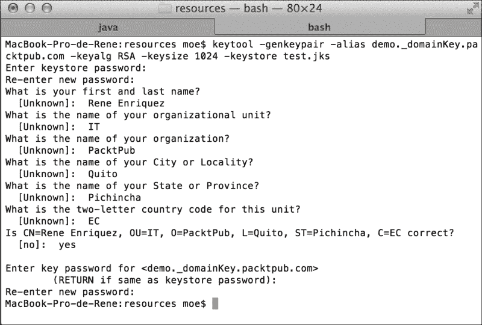

现在，我们将实现一些源代码来签名一个消息。我们首先需要将所需的依赖项添加到 `pom.xml` 文件中。

首先，添加从其中获取工件的自定义 JBoss 存储库，如下代码所示：

```java
<repositories>
  <repository>
    <id>jboss</id>
    <url>http://repository.jboss.org/maven2</url>
  </repository>
</repositories>
```

现在，让我们添加所有我们需要签名消息的依赖项，如下所示：

```java
  <dependencies>
    <dependency>
      <groupId>org.jboss.resteasy</groupId>
      <artifactId>resteasy-jaxrs</artifactId>
      <version>3.0.6.Final</version>
    </dependency>
    <dependency>
      <groupId>org.jboss.resteasy</groupId>
      <artifactId>resteasy-crypto</artifactId>
      <version>3.0.6.Final</version>
    </dependency>
  </dependencies>
```

为了避免类路径中重复的类，我们应该删除以下依赖项：

```java
    <dependency>
      <groupId>javax</groupId>
      <artifactId>javaee-web-api</artifactId>
      <version>6.0</version>
      <scope>provided</scope>
    </dependency>
```

## 更新 RESTEasy JAR 文件

由于我们使用的是 3.0.6.Final 版本来编译项目，因此有必要更新 JBoss 中的现有版本。因此，我们将前往 URL [`sourceforge.net/projects/resteasy/files/Resteasy%20JAX-RS/`](http://sourceforge.net/projects/resteasy/files/Resteasy%20JAX-RS/) 并下载我们刚刚描述的版本。

当我们解压 `.zip` 文件时，我们会找到一个名为 `resteasy-jboss-modules-3.0.6.Final.zip` 的文件。让我们也解压这个文件，然后将所有内容粘贴到我们的目录 `JBOSS_HOME/modules` 中。由于 RESTEasy 模块有依赖项，我们还需要更新它们。因此，在更新 RESTEasy 模块后，我们应该更新模块 `org.apache.httpcomponents`。让我们前往目录 `JBOSS_HOME/modules/org/apache/httpcomponents` 并更新以下工件：

+   将 `httpclient-4.1.2.jar` 更新为 `httpclient-4.2.1.jar`

+   将 `httpcore-4.1.4.jar` 更新为 `httpcore-4.2.1.jar`

此外，我们修改 `module.xml` 文件，因为 JAR 文件的名字不同，如下所示：

```java
<?xml version="1.0" encoding="UTF-8"?>

<!--
 ...
  -->

<module  name="org.apache.httpcomponents">
    <properties>
        <property name="jboss.api" value="private"/>
    </properties>

    <resources>
 <resource-root path="httpclient-4.2.1.jar"/>
 <resource-root path="httpcore-4.2.1.jar"/>
        <resource-root path="httpmime-4.1.2.jar"/>
        <!-- Insert resources here -->
    </resources>

    <dependencies>
        <module name="javax.api"/>
        <module name="org.apache.commons.codec"/>
        <module name="org.apache.commons.logging"/>
        <module name="org.apache.james.mime4j"/>
    </dependencies>
</module>
```

## 应用数字签名

现在我们已经拥有了编译我们项目所需的一切，我们将创建一个非常简单的操作并应用签名。为了实现这一点，让我们在源代码包 `com.packtpub.resteasy.services` 中创建一个名为 `SignedService` 的类，如下截图所示：

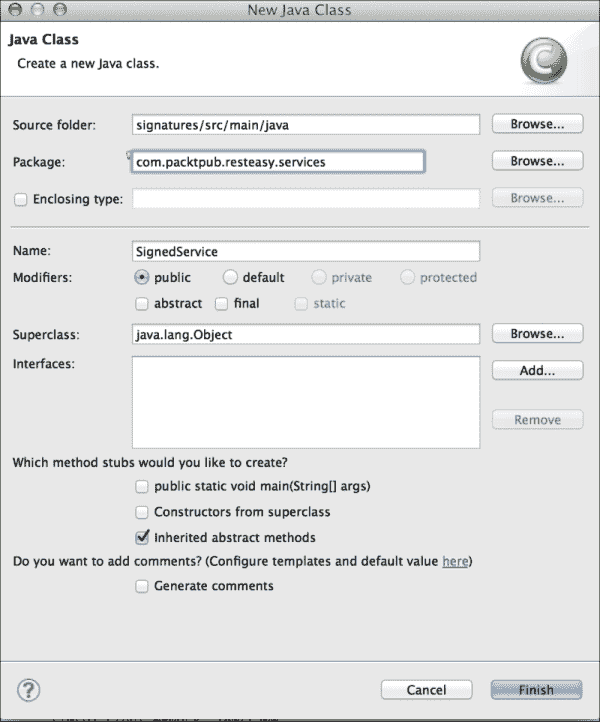

要签名消息，我们从 KeyStore 中取一个密钥并使用它。我们可以通过它们的别名和它们所属的域以独特的方式识别密钥。例如，对于密钥`demo._domainKey.packtpub.com`，别名是`demo`，它所属的域是密钥`packtpub.com`。鉴于我们可以在 KeyStore 中找到多个密钥，RESTEasy 提供了使用注解`@Signed`选择我们想要的密钥的能力。

让我们将以下代码中突出显示的方法添加到类中，并观察注解是如何工作的：

```java
  @POST
  @Produces("text/plain")
 @Signed(selector = "demo", domain = "packtpub.com")
  public String sign(String input) {
    System.out.println("Aplyng signature " + input);
    return "signed " + input;
  }
```

下图以更好的方式展示了如何选择密钥来签名消息：

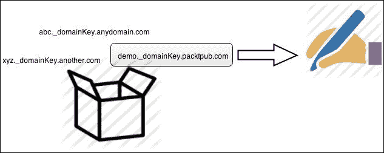

现在，我们将定义在签名资源下的路径将可用，因此让我们按照以下方式注释类：

```java
import javax.ws.rs.Consumes;
import javax.ws.rs.POST;
import javax.ws.rs.Path;

import org.jboss.resteasy.annotations.security.doseta.Signed;

@Path("/signed")
public class SignedService {
...
```

为了使应用程序正常工作，我们将提供信息，以便它可以应用适当的签名。

首先，在`src/main/webapp`文件夹中，我们将创建一个包含空`web.xml`文件的`WEB-INF`文件夹。

让我们从`web.xml`文件开始，它应该看起来如下：

```java
<?xml version="1.0" encoding="UTF-8"?>
<web-app version="3.0" 

  xsi:schemaLocation="http://java.sun.com/xml/ns/javaee 
  http://java.sun.com/xml/ns/javaee/web-app_3_0.xsd">

  <display-name>signatures</display-name>

</web-app>
```

现在，我们首先要做的是告诉我们的应用程序我们想要签名的资源是什么，即包含我们正在签名的方法的类。为此，让我们使用相应的完整类名配置参数`resteasy.resources`，如下所示：

```java
<context-param>
<param-name>resteasy.resources</param-name>
<param-value>com.packtpub.resteasy.services.SignedResource</param-value>
</context-param>
```

接下来，我们将通知我们的应用程序应用签名的密钥的位置（我们之前创建的`.jks`文件）。为此，我们有两个上下文参数可用，`resteasy.doseta.keystore.classpath`和`resteasy.keystore.filename`。让我们使用第一个参数，以便我们的文件看起来如下：

```java
<context-param>
<param-name>resteasy.doseta.keystore.classpath</param-name>
<param-value>demo.jks</param-value>
</context-param>
```

如您所记得，在创建密钥时，我们被要求为 KeyStore 提供密码。我们将使用参数`resteasy.doseta.keystore.password`告诉我们的应用程序这是什么。让我们添加以下内容：

```java
  <context-param>
    <param-name>resteasy.doseta.keystore.password</param-name>
    <param-value>changeit</param-value>
  </context-param>
```

要创建 KeyStore，从中我们将提取允许我们签名消息的密钥，我们必须添加以下参数：

```java
<context-param>
  <param-name>resteasy.context.objects</param-name>
  <param-value>org.jboss.resteasy.security.doseta.KeyRepository : org.jboss.resteasy.security.doseta.ConfiguredDosetaKeyRepository</param-value>
</context-param>
```

最后，我们应该添加 RESTEasy servlet，如下所示：

```java
  <servlet>
    <servlet-name>Resteasy</servlet-name>
    <servlet-class>org.jboss.resteasy.plugins.server.servlet.HttpServletDispatcher</servlet-class>
  </servlet>
  <servlet-mapping>
    <servlet-name>Resteasy</servlet-name>
    <url-pattern>/*</url-pattern>
  </servlet-mapping>
```

在这里，我们展示了在添加所有必需信息后`web.xml`文件应该如何看起来：

```java
<?xml version="1.0" encoding="UTF-8"?>
<web-app version="3.0" 

  xsi:schemaLocation="http://java.sun.com/xml/ns/javaee 
  http://java.sun.com/xml/ns/javaee/web-app_3_0.xsd">
<web-app>
  <display-name>signatures</display-name>
  <context-param>
    <param-name>resteasy.resources</param-name>
    <param-value>com.packtpub.resteasy.services.SignedService</param-value>
  </context-param>
  <context-param>
    <param-name>resteasy.doseta.keystore.classpath</param-name>
    <param-value>demo.jks</param-value>
  </context-param>
  <context-param>
    <param-name>resteasy.doseta.keystore.password</param-name>
    <param-value>changeit</param-value>
  </context-param>
  <context-param>
    <param-name>resteasy.context.objects</param-name>
    <param-value>org.jboss.resteasy.security.doseta.KeyRepository : org.jboss.resteasy.security.doseta.ConfiguredDosetaKeyRepository</param-value>
  </context-param>
  <servlet>
    <servlet-name>Resteasy</servlet-name>
    <servlet-class>org.jboss.resteasy.plugins.server.servlet.HttpServletDispatcher</servlet-class>
  </servlet>
  <servlet-mapping>
    <servlet-name>Resteasy</servlet-name>
    <url-pattern>/*</url-pattern>
  </servlet-mapping>
</web-app>
```

现在，让我们通过执行以下命令生成 WAR 文件：

```java
mvn install

```

然后，我们将生成的工件复制到 JBoss 部署目录。

## 测试功能

现在，打开 SoapUI，测试是否如以下截图所示，web 服务按预期运行：

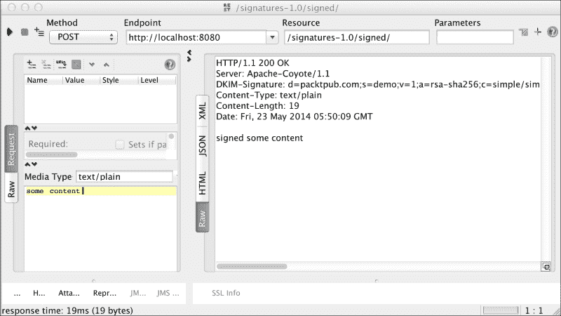

如您在响应中看到的，我们获得了用于签名消息的`DKIM-Signature`头。此头的完整内容如下：

```java
DKIM-Signature: d=packtpub.com;s=demo;v=1;a=rsa-sha256;c=simple/simple;bh=lc+ECoAqpQCB4ItWLUomBv34m3F9G0pkIBAI8Z/yWcQ=;b=AlJY6iiCtdCnHrJa+Of9aRgBXeIp7V7cEG7eyUp0CRbD9wjFodbQGRQjhfwDgd1WIBzVLIWelTdI85BlGl3ACNcMLBjPv2iBBjo+78e/9HcYs81YNlPRAAj6jzymA/+jkmpTVcthWaEEyoPJJBAI5FvP33zH7etfkFaGX+bwer0=
```

从整个字符串中，对我们来说重要的是以下内容：

+   `d=`: 这是域，在实现方法时指示的值。

+   `a=`：这是 RESTEasy 用来签名消息的算法。在这种情况下，我们使用 RSA，因为它是目前框架唯一支持的算法。

其他参数并不重要，它们只是为了一个签名的消息。

现在，为了验证签名的真实性，我们将创建一个类，我们将从这个类中进行验证。

我们将使用 JUnit；因此，首先在 `pom.xml` 文件中添加相应的依赖项，如下面的代码片段所示：

```java
    <dependency>
      <groupId>junit</groupId>
      <artifactId>junit</artifactId>
      <version>4.8.2</version>
      <scope>test</scope>
    </dependency>
```

现在，让我们创建一个新的源文件夹名为 `scr/test/java`，并在其中创建一个名为 `com.packtpub.resteasy.services.test` 的包。在包内部，让我们使用以下内容创建一个名为 `SignedServiceTest` 的类：

```java
import javax.ws.rs.client.Entity; 
import javax.ws.rs.client.Invocation; 
import javax.ws.rs.client.WebTarget; 
import javax.ws.rs.core.Response;  
import junit.framework.Assert;  
import org.jboss.resteasy.client.jaxrs.ResteasyClient; 
import org.jboss.resteasy.client.jaxrs.ResteasyClientBuilder; 
import org.jboss.resteasy.security.doseta.DosetaKeyRepository; 
import org.jboss.resteasy.security.doseta.Verification; 
import org.jboss.resteasy.security.doseta.Verifier; 
import org.junit.Test;

public class SignedServiceTest {

  @Test
  public void testVerification() {
    // Keys repository
    DosetaKeyRepository repository = new DosetaKeyRepository();
    repository.setKeyStorePath("demo.jks");
    repository.setKeyStorePassword("changeit");
    repository.start();
    // Building the client
  ResteasyClient client = new ResteasyClientBuilder().build();
    Verifier verifier = new Verifier();
    Verification verification = verifier.addNew();
    verification.setRepository(repository);
    WebTarget target = client
             .target(
      "http://localhost:8080/signatures-1.0/signed");
    Invocation.Builder request = target.request();
    request.property(Verifier.class.getName(), verifier);
    // Invocation to RESTful web service
    Response response = request.post(Entity.text("Rene"));
    // Status 200 OK
    Assert.assertEquals(200, response.getStatus());
    System.out.println(response.readEntity(String.class));
    response.close();
    client.close();
  }
}
```

如果一切顺利，我们将看到测试结果是一个绿色的条形，如下面的截图所示：

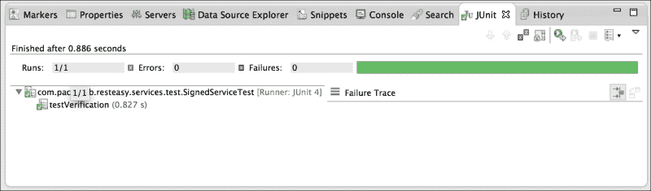

## 使用注解验证签名

验证资源是否签名的更简单方法是使用注解。这种解决方案主要适用于你必须满足的签名流。

例如，想象一下，Packt Publishing 公司的员工可以通过一个系统申请增加他们的电脑的 RAM。为了将这些请求视为有效，它们必须由提出请求的人签名。我们的意思是，我们只需要请求被签名，才能被认为是有效的，如下面的图所示：

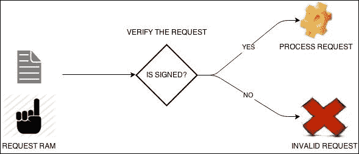

对于这个例子，我们将向我们的 `SignedService` 类添加两种方法；第一个方法将允许我们发送请求，如下所示：

```java
  @POST
  @Path("ram")
  @Signed(selector = "demo", domain = "packtpub.com")
  @Consumes("text/plain")
  public String requestRam(int numberOfGB) {
    return numberOfGB + "-GB";
  }
```

为了满足业务需求，我们将使用 `@Verify` 注解，在其中我们可以对签名添加限制。目前，我们只需要验证请求是否已签名。

以下是一个方法，展示了老板用来批准或拒绝为员工 PC 增加内存的复杂逻辑：

```java
@Verify
@POST
@Path("verifier")
@Produces("text/plain")
public String processRequestRam (String input) {
  int numberOfGbRequested = Integer.valueOf(input.split("-")[0]);
  if (numberOfGbRequested > 4) {
    return "deny";
  } else {
    return "accepted";
  }
}
```

现在，让我们在 JBoss 上部署应用程序，并使用 SoapUI 进行测试。正如我们提到的，为了处理请求，请求必须经过签名。因此，首先对 `processRequestRam` 方法发送一个不带签名的请求，如下面的截图所示：

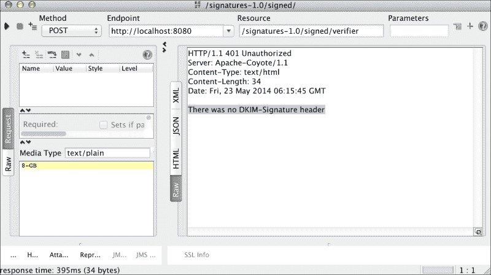

对于应用程序能够被处理来说，最重要的是它来自公司域，在这种情况下，是 `packtpub.com`。之后，老板对申请进行严格的分析，并做出判断，以确定申请是否被批准或拒绝。

对于这个例子，我们将删除我们之前创建的方法，并向我们的 `SignedService` 类添加两种方法；第一个方法将允许我们发送请求，如下所示：

```java
@POST
@Signed(selector = "demo", domain = "packtpub.com")
@Consumes("text/plain")
public Response requestRAM(int numberOfGB) {
  return Response.seeOther(
    URI.create("/signed/" + "GB:" + numberOfGB)).build();
}
```

输出清楚地显示了错误。请求无法处理，因为没有包含验证签名的信息的 `DKIM-Signature` 标头。这意味着这些头信息不存在，因为它们之前没有被签名。

为了成功处理请求，我们将调用一个签名的 Web 服务。我们将添加带有签名信息的头，并再次调用`processRequestRam`方法。

让我们先调用`requestRam`操作，如下截图所示：

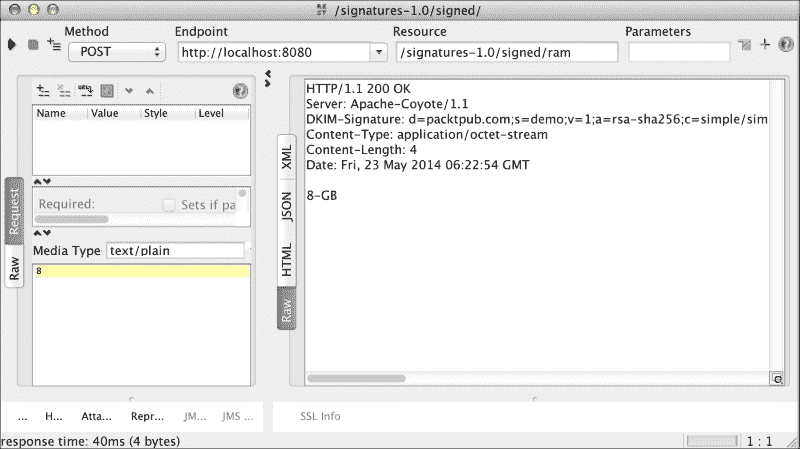

由于这个回调，我们将获得以下值：

```java
DKIM-Signature: d=packtpub.com;s=demo;v=1;a=rsa-sha256;c=simple/simple;bh=uA6n2udZlWdx+ouwCEeeyM6Q48KH0EWa2MnfBwMP+vM=;b=T0drw9QWud7rs1w//5384hs8GCatJKzmljIhgiTrHWdVx/IhCVl915yycchN+hQ+ljUaS6bPtLYo/ZNspcv2LtAe/tKTPpng4RWlr52k0TqnV3XX2KvJ7kBOpEU2Rg6f6lBOJT5v+o0iV05ObagfzKDfQ9o09WpZjQKcBG+/xvE=

RESPONSE: 8 GB
```

让我们继续前进！现在，我们将使用这些值发出请求。从 SoapUI 中，让我们调用`processRequestRam`操作，并关注请求编辑器的左下角；那里有一个名为**Header**的选项。让我们选择这个选项，并点击**+**符号。现在，我们必须输入`DKIM-Signature`头，并放置相应的值。同时，别忘了发送请求参数`8-GB`，这是`requestRam`操作的响应，如以下截图所示：

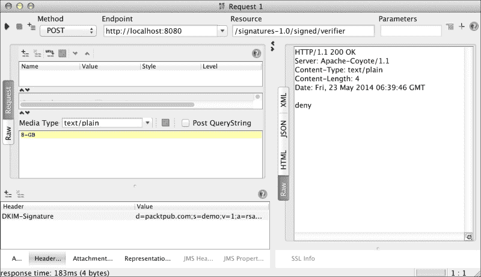

如我们所见，请求已成功处理，但老板拒绝了内存增加的请求。现在，我们指出数字签名允许我们验证信息在签名后未被篡改。假设恶意软件拦截了响应，并且不是`8-GB`，而是提供了`12-GB`的值。让我们根据数字签名的理论在 SoapUI 中发出这个请求。这个请求应该是不合法的；然而，我们必须检查：

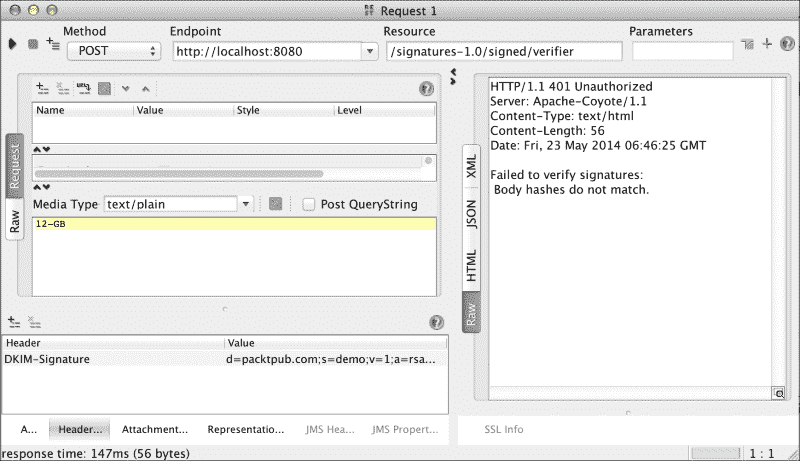

错误信息清楚地表明消息体已被篡改，因此请求未处理，我们收到`HTTP 401 Unauthorized`消息。这证实了之前关于已签名消息完整性的陈述。

然而，RESTEasy 不仅允许我们验证消息已被签名，我们还可以验证签名人是否属于特定域名。在我们的例子中，只有当公司属于`packtpub.com`域名时，才会被认为是有效的。为了执行此类控制，我们将进行以下更改：

```java
@Verify(identifierName = "d", identifierValue = "packtpub.com")
@POST
@Path("verifier")
@Produces("text/plain")
public String processRequestRam(String input) {
  int numberOfGbRequested = Integer.valueOf(input.split("-")[0]);
  if (numberOfGbRequested > 4) {
    return "deny";
  } else {
    return "accepted";
  }
}
```

让我们在 JBoss 中部署应用程序，并再次从 SoapUI 中执行请求：


现在，让我们强制一个故障。我们将假设只有从`itpacktpub.com`域名签名的有效消息。因此，让我们应用以下更改：

```java
@Verify(identifierName = "d", identifierValue = "itpacktpub.com")
@POST
@Path("verifier")
@Produces("text/plain")
public String processRequestRam(String input) {
  int numberOfGbRequested = Integer.valueOf(input.split("-")[0]);
  if (numberOfGbRequested > 4) {
    return "deny";
  } else {
    return "accepted";
  }
}
```

让我们在 JBoss 中再次部署应用程序，并从 SoapUI 中执行请求：

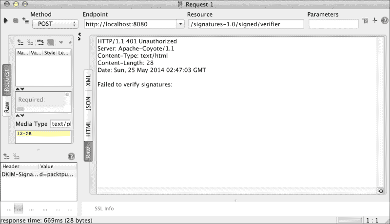

如我们所预期，这次请求失败了。显然，这是因为签名无法验证，因为消息是用`packtpub.com`域名签名的，而不是我们在`processRequestRam`操作中设置的`itpacktpub.com`域名。

突然，你可能会想知道为什么识别出的名称的值是`d`。正如我们之前提到的，字母`d`代表域。RESTEasy 文档对每个参数的说明稍微详细一些。在这里，我们向您展示文档中关于 JBoss 相关主题的一个示例：

*这里是一个 DKIM-Signature 头部示例的外观：*

*DKIM-Signature: v=1;*

*a=rsa-sha256;*

*d=example.com;*

*s=burke;*

*c=simple/simple;*

*h=Content-Type;*

*x=0023423111111;*

*bh=2342322111;*

*b=M232234=*

*如你所见，它是一组以分号分隔的名称值对。虽然了解头部的结构并不那么重要，但以下是每个参数的解释：*

*v: 协议版本。始终为 1。*

*a: 用于哈希和签名的算法。目前 RESTEasy 只支持 RSA 签名和 SHA256 哈希算法。*

*d: 签名者的域。这用于识别签名者以及发现用于验证签名的公钥。*

*s: 域选择器。也用于识别签名者和发现公钥。*

*c: 规范化算法。目前只支持 simple/simple。基本上，这允许你在计算哈希之前转换消息体。*

*h: 签名计算中包含的头部列表，以分号分隔。*

*x: 签名何时过期。这是一个自纪元以来的时间秒的数值长值。允许签名者控制已签名消息的签名何时过期。*

*t: 签名的时间戳。自纪元以来的时间秒的数值长值。允许验证者控制签名何时过期。*

*bh: 消息体的 Base 64 编码哈希值。*

*b: Base 64 编码的签名。*

现在我们有了这些信息，很明显，如果你想检查签名者，而不是使用字母`d`，我们必须使用字母`s`，而不是`packtpub.com`，我们将使用`demo`。一旦应用这些更改，我们的代码应该看起来像以下这样：

```java
@Verify(identifierName = "s", identifierValue = "demo")
@POST
@Path("verifier")
@Produces("text/plain")
public String processRequestRam(String input) {
  int numberOfGbRequested = Integer.valueOf(input.split("-")[0]);
  if (numberOfGbRequested > 4) {
    return "deny";
  } else {
    return "accepted";
  }
}

```

此外，如果你想验证签名者的名称和域，你必须进行一些小的更改。这次，我们将使用`@Verifications`注解；这个注解接收一个`@Verify`注解数组作为参数，这允许我们执行我们之前描述的操作。在这种情况下，我们应该使用`@Verify`注解添加两个控制，我们的代码应该看起来像以下这样：

```java
@Verifications({ 
@Verify(identifierName = "s", identifierValue = "demo"),
@Verify(identifierName = "d", identifierValue = "packtpub.com") })
@POST
@Path("verifier")
@Produces("text/plain")
public String processRequestRam(String input) {
  int numberOfGbRequested = Integer.valueOf(input.split("-")[0]);
  if (numberOfGbRequested > 4) {
    return "deny";
  } else {
    return "accepted";
  }
}
```

一旦我们应用了这些更改，我们就可以使用 SoapUI 进行请求。我们应该得到一个成功的执行结果，如下面的截图所示：

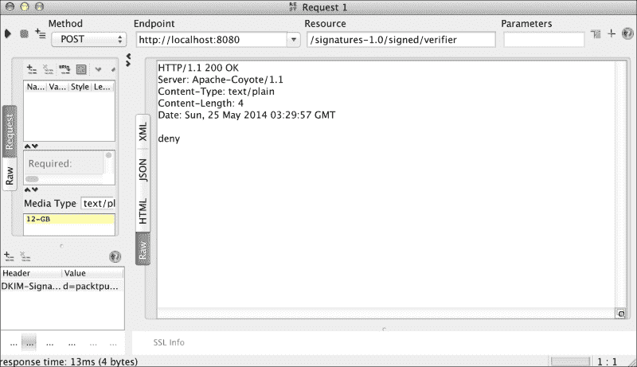

# 消息体加密

在上一章中，我们看到了如何使用 HTTPS 加密完整的 HTTP 消息。现在，我们将解释如何仅加密消息体以及每个过程的区别。我们首先构建一个简单的示例，然后，随着我们对实现进行相应的测试，我们将了解它是如何工作的。

为了不破坏我们之前的工程，我们将构建一个新的。为此，我们将在终端中执行以下命令：

```java
mvn archetype:generate -DgroupId=com.packtpub -DartifactId=encryption -DarchetypeArtifactId=webapp-javaee6 -DarchetypeGroupId=org.codehaus.mojo.archetypes

```

如本章前面所见，当你被要求输入版本号时，将 `1.0-SNAPSHOT` 的默认值更改为 `1.0`。

当然，如果你想的话，你可以从以下 URL 下载所有源代码：

[`github.com/restful-java-web-services-security/source-code/tree/master/chapter05/encryption`](https://github.com/restful-java-web-services-security/source-code/tree/master/chapter05/encryption)

现在，让我们将项目导入到 Eclipse 中，删除 `pom.xml` 文件中的现有默认依赖项，并添加对 `resteasy-jaxrs` 和 `resteasy-crypto` 艺术品的依赖。

`dependencies` 部分应该看起来像以下这样：

```java
  <dependencies>
    <dependency>
      <groupId>org.jboss.resteasy</groupId>
      <artifactId>resteasy-jaxrs</artifactId>
      <version>3.0.6.Final</version>
      <scope>provided</scope>
    </dependency>
    <dependency>
      <groupId>org.jboss.resteasy</groupId>
      <artifactId>resteasy-crypto</artifactId>
      <version>3.0.6.Final</version>
    </dependency>
  </dependencies>
```

现在，让我们在包 `com.packtpub` 内创建一个名为 `EncryptedService` 的类。在这个类中，我们将创建一个非常简单的操作，如下所示：

```java
package com.packtpub;

import javax.ws.rs.GET;
import javax.ws.rs.Path;

@Path("/encrypted")
public class EncryptedService {

  @GET
  public String gretting() {
    return "Hello world";
  }
}
```

为了注册我们应用程序的服务，让我们创建一个名为 `EncryptedApplication` 的类，如下所示：

```java
package com.packtpub;

import java.util.HashSet;
import java.util.Set;

import javax.ws.rs.ApplicationPath;
import javax.ws.rs.core.Application;

@ApplicationPath("/services")
public class EncryptedApplication extends Application {

  private Set<Object> resources = new HashSet<Object>();

  public EncryptedApplication() throws Exception {
    resources.add(new EncryptedService());
  }

  @Override
  public Set<Object> getSingletons() {
    return resources;
  }
}
```

## 测试功能

之后，我们的应用程序应该就绪了。所以，让我们从 SoapUI 执行一个测试，使用 Wireshark 观察流量，如下面的截图所示：

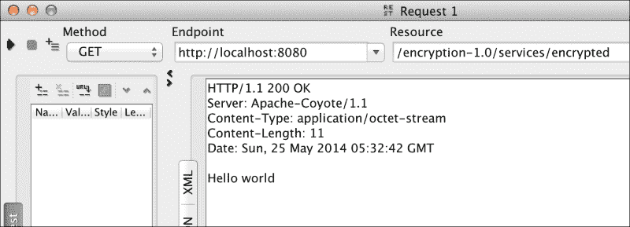

Wireshark 显示以下内容：

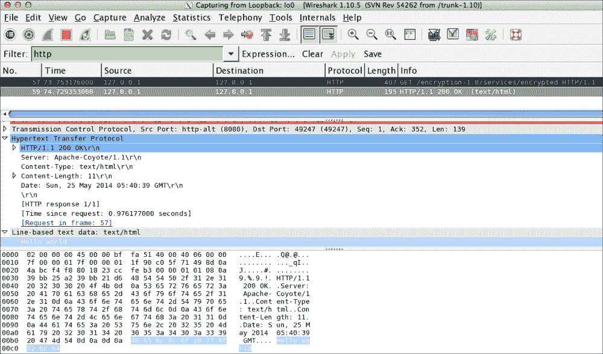

如我们所见，流量分析器显示了所有信息是如何直接传输的，以及它被解释得有多容易。现在，让我们在 JBoss 上启用 HTTPS 来展示整个消息是如何加密的。

## 启用 HTTPS 服务器

因此，首先我们必须创建一个证书 KeyStore。我们可以通过在终端上执行以下命令来实现这一点：

```java
keytool -genkey -alias tomcat -keyalg RSA

```

当它要求你输入密码时，你应该使用 `changeit`，因为我们已经在本书中使用过它。

现在，我们查看 `JBOSS_HOME/standalone/configuration/standalone.xml` 文件，在包含 `<connector name="http"` 的行中，并添加以下内容：

```java
<connector name="https" protocol="HTTP/1.1" scheme="https" 
socket-binding="https" secure="true">
  <ssl/>
</connector>
```

一旦完成这个更改，我们将重新启动应用程序服务器，部署应用程序，并编辑请求。这次，我们将使用端口 8443 和 HTTPS 协议。因此，URL 应该看起来像以下这样：

`https://localhost:8443/encryption-1.0/services/encrypted`

让我们使用 SoapUI 执行请求；现在，我们的流量分析器将显示以下结果：

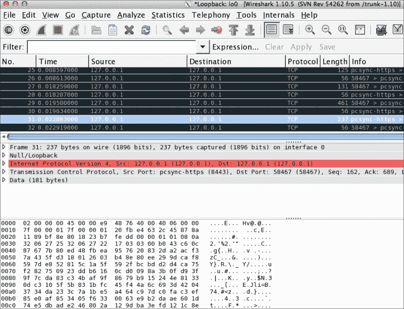

如我们所预期，这次，分析器清楚地显示所有信息都已加密。

在我们的示例中继续前进，我们现在将在 JBoss 中禁用 HTTPS。为此，我们必须删除之前添加的连接器。现在，我们将使用 S/MIME 来仅加密响应的消息体。首先，让我们检查一些将帮助我们理解其工作原理的概念。

S/MIME 来自 Secure MIME。MIME 代表多用途互联网邮件扩展，它不仅帮助我们发送“Hello world”之类的消息，还可以发送视频、音频等更有趣的内容。MIME 与 SMTP 和 HTTP 等电子邮件协议一起工作。这有助于我们处理 RESTful S/MIME Web 服务。另一方面，MIME 为我们提供了以下功能：

+   消息加密

+   验证发送消息的用户身份

+   验证消息信息完整性的能力

由于 S/MIME 与证书一起工作，这是消息发送者信息保存的地方。当接收者收到消息时，他们会观察到消息的所有公开部分。然后，可以使用密钥解密消息。此外，接收者可以访问其内容。如果您想进一步了解 S/MIME，我们建议您访问链接[`datatracker.ietf.org/wg/smime/charter/`](http://datatracker.ietf.org/wg/smime/charter/)。

让我们先做一些修改。首先，我们在应用中创建源文件夹`src/main/resources`；在这个目录中，我们将放置加密消息所需的资源。

然后，我们使用`openssl`生成证书，从控制台进入我们刚刚创建的目录，并在终端上运行以下命令：

```java
openssl req -x509 -nodes -days 365 -newkey rsa:1024 -keyout demokey.pem -out democert.pem

```

现在，我们必须输入如下截图所示的信息：

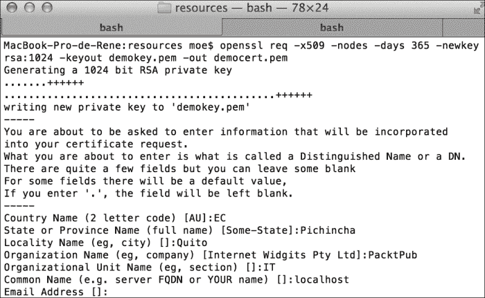

这将生成两个文件：`demokey.pem`，这是一个私钥，以及`democert.pem`，这是我们用来加密消息体的证书。为了表示已签名的响应，RESTEasy 使用`EnvelopedOutput`对象。在以下图中，我们向您展示了 RESTEasy 如何加密消息：

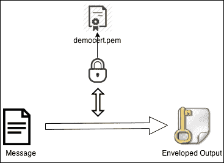

因此，我们必须替换`EncryptedService`类中`gretting()`方法的返回类型。让我们将字符串更改为`EnvelopedOutput`，并使用我们之前生成的证书加密消息体。应用这些更改后，我们的方法应如下所示：

```java
@GET
public EnvelopedOutput gretting() throws Exception {
  InputStream certPem = Thread.currentThread()
                       .getContextClassLoader()
                       .getResourceAsStream("democert.pem");
  X509Certificate myX509Certificate = PemUtils.
      decodeCertificate(certPem)
  EnvelopedOutput output = new 
    EnvelopedOutput("Hello world", MediaType.TEXT_PLAIN);
  output.setCertificate(myX509Certificate);
  return output;
}
```

让我们在`pom.xml`文件中进行一些修改。我们将按照以下方式修改`dependencies`部分：

```java
  <dependencies>
    <dependency>
      <groupId>junit</groupId>
      <artifactId>junit</artifactId>
      <version>4.8.1</version>
    </dependency>
    <dependency>
      <groupId>org.jboss.resteasy</groupId>
      <artifactId>resteasy-jaxrs</artifactId>
      <version>3.0.6.Final</version>
      <scope>provided</scope>
    </dependency>
    <dependency>
      <groupId>org.jboss.resteasy</groupId>
      <artifactId>resteasy-jaxb-provider</artifactId>
      <version>3.0.6.Final</version>
      <scope>provided</scope>
    </dependency>
    <dependency>
      <groupId>org.jboss.resteasy</groupId>
      <artifactId>resteasy-crypto</artifactId>
      <version>3.0.6.Final</version>
    </dependency>
  </dependencies>
```

注意我们如何更改了`resteasy-jaxrs`和`resteasy-jaxb-provider`组件的作用域；这是在加密消息时避免重复类所必需的。由于这些组件是应用服务器内的模块，您需要指明我们想要加载它们。为此，我们将修改`pom.xml`文件中的`maven-war-plugin`插件部分，如下所示：

```java
<plugin>
  <groupId>org.apache.maven.plugins</groupId>
  <artifactId>maven-war-plugin</artifactId>
  <configuration>
    <failOnMissingWebXml>false</failOnMissingWebXml>
    <archive>
      <manifestEntries>
        <Dependencies>org.jboss.resteasy.resteasy-jaxb-provider export, org.jboss.resteasy.resteasy-jaxrs export</Dependencies>
      </manifestEntries>
    </archive>
  </configuration>
</plugin>
```

由于 JBoss 版本 7 是一个基于模块的应用服务器，默认情况下，启动时只激活了少数几个模块。如果您想访问其他模块，则需要明确指出这些依赖项。这可以通过`MANIFEST.MF`文件或创建一个名为`jboss-deployment-structure.xml`的文件来完成。

在这种情况下，我们将使用 `maven-war-` 插件选择第一个文件，以指示所需的依赖项。

### 测试功能

现在，让我们再次从 SoapUI 向 URL `http://localhost:8080/encryption-1.0/services/encrypted` 发送请求。

这次，我们将得到的响应如下截图所示：

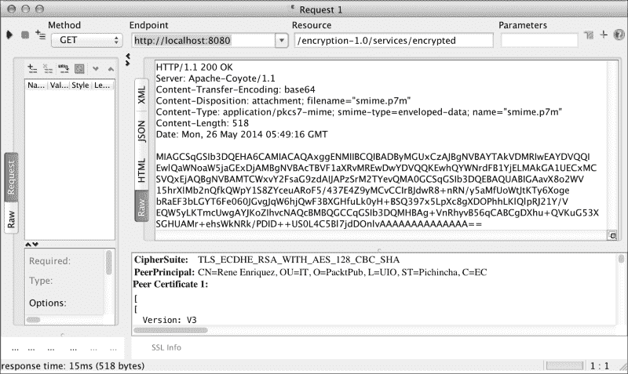

以下是从流量分析器中可以看到的内容：

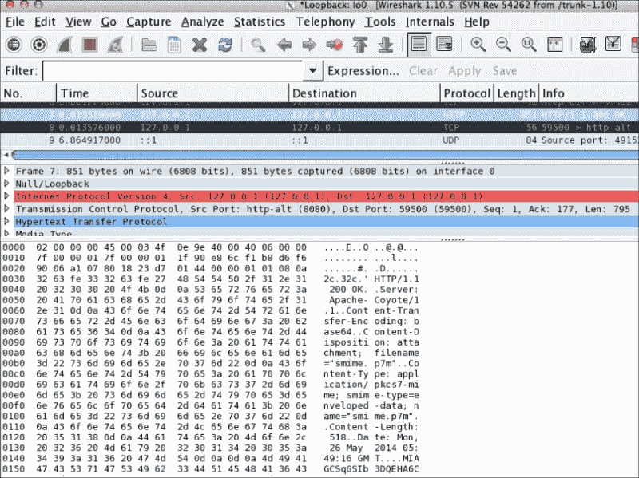

如我们所见，它显示的内容与 SoapUI 的响应非常相似。为了解密内容，我们必须拥有私钥和证书。通过这两个资源，我们可以获取对象 `EnvelopedInput` 并从中获取消息，如图所示：

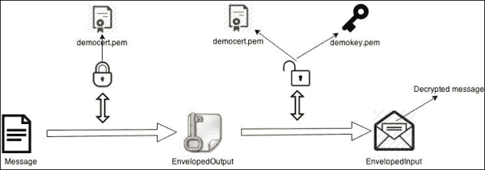

这将通过以下代码中的单元测试进行演示。然而，在继续之前，我们想展示当使用 S/MIME 加密消息时，标题仍然是可读的，但消息体是完全加密的。因此，如果我们没有这些资源，信息就是过时的，无法解释。

现在，我们将编写一个类，使我们能够读取消息体。为此，我们将创建一个新的源文件夹，名为 `src/main/test`。

在这个文件夹中，让我们创建一个名为 `com.packtpub.EncryptedServiceTest` 的类，其内容如下：

```java
package com.packtpub;

import java.security.PrivateKey;
import java.security.cert.X509Certificate;

import javax.ws.rs.client.Client;
import javax.ws.rs.client.WebTarget;

import junit.framework.Assert;

import org.jboss.resteasy.client.jaxrs.ResteasyClientBuilder;
import org.jboss.resteasy.security.PemUtils;
import org.jboss.resteasy.security.smime.EnvelopedInput;
import org.junit.Test;

public class EncryptedServiceTest {

  @Test
  public void testEncryptedGet() throws Exception {
    // LOADING THE CERTIFICATE
    X509Certificate myX509Certificate = PemUtils.decodeCertificate(
        Thread
        .currentThread().getContextClassLoader()
        .getResourceAsStream("democert.pem"));
    // LOADING THE KEY
    PrivateKey myPrivateKey = PemUtils.decodePrivateKey(Thread
        .currentThread().getContextClassLoader()
        .getResourceAsStream("demokey.pem"));
    // CREATING A CLIENT FOR THE WEB SERVICE
    Client client = new ResteasyClientBuilder().build();
    WebTarget target = client.target(
      "http://localhost:8080/encryption-1.0/services/encrypted"
    );
    // RETRIEVING THE RESULT OF METHOD EXECUTION
    EnvelopedInput<?> input = target.request().
            get(EnvelopedInput.class);
    Assert.assertEquals("Hello world",
        input.getEntity(String.class, 
        myPrivateKey, myX509Certificate));
    client.close();
  }

}
```

注意，我们需要私钥和证书来解密消息，以获取由包含消息 `Hello world` 的字符串形成的实体。

当我们运行这个单元测试时，如果一切顺利，我们应该得到一个绿色的条形。这表明，为了解密消息，使用之前的资源（私钥和证书）已经获得了预期的消息。

# 摘要

在本章中，我们处理了数字签名，并学习了如何在 RESTful 网络服务中使用它们。这些天，数字签名经常被使用，因为它们保证了消息的完整性，信息在从发送者传输到接收者的过程中不会被破坏。我们已经知道信息在传输过程中可能会被修改，但在验证签名信息时，接收者可以注意到这一点，并采取他们认为适当的行动。例如，他们可以发送另一个请求以避免处理损坏的信息。在本章的结尾，我们处理了消息体加密，并看到了使用这些加密与 HTTPS 之间的区别。最后，我们看到了接收者如何使用密钥来解析消息体，并根据他们的需求使用信息。
