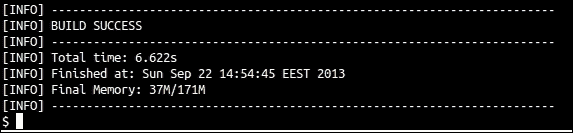

# 第二章。创建 Dropwizard 应用程序

让我们通过创建基于 Dropwizard 的新 RESTful Web 服务应用程序所需的过程。首先，我们需要创建应用程序的结构、文件和文件夹，并获取必要的库。幸运的是，Maven 将为我们处理这些任务。

一旦我们的应用程序结构准备就绪，我们将修改适当的文件，定义应用程序对 Dropwizard 模块的依赖关系，并配置应用程序的可执行包应该如何生成。之后，我们可以继续编写应用程序的代码。

# 生成基于 Maven 的项目

在我们开始编码之前，我们需要执行一些任务，以便正确创建项目结构。我们将使用 Maven 来生成一个默认的、空的项目，然后将其转换为 Dropwizard 应用程序。

## 准备工作

我们的项目将基于 `maven-archetype-quickstart` 架构。架构是 Maven 项目模板，通过使用 `quick-start` 架构，我们将在很短的时间内准备好项目结构（文件夹和文件）。

## 如何操作…

1.  打开终端（Windows 的命令行）并导航到您想要创建应用程序的目录。

1.  通过执行以下命令创建一个新的 Maven 项目（不带换行符）：

    ```java
    $ mvn archetype:generate-DgroupId=com.dwbook.phonebook-DartifactId=dwbook-phonebook-DarchetypeArtifactId=maven-archetype-quickstart-DinteractiveMode=false
    ```

这将在 `dwbook-phonebook` 目录中创建一个空白的 Maven 项目。

### 小贴士

**下载示例代码**

您可以从您在 [`www.packtpub.com`](http://www.packtpub.com) 的账户下载您购买的所有 Packt 书籍的示例代码文件。如果您在其他地方购买了这本书，您可以访问 [`www.packtpub.com/support`](http://www.packtpub.com/support) 并注册，以便将文件直接通过电子邮件发送给您。

## 工作原理…

Dropwizard 是基于 Maven 的，因此我们在其中包含了 Dropwizard 的核心依赖项的新 Maven 项目中创建了一个新项目。

到目前为止，`dwbook-phonebook` 目录的结构如下所示：


`src/` 文件夹将包含我们的应用程序的主要类，而所有测试类都将放置在 `test/` 目录下。

注意 Maven 已经将 `pom.xml` 放在了应用程序的根目录下。**项目对象模型**（**POM**）是一个包含有关项目配置和依赖项重要信息的 XML 文件。这是我们需要编辑的文件，以便为我们的项目添加 Dropwizard 支持。

# 配置 Dropwizard 依赖项和构建配置

我们刚刚创建了一个示例应用程序概要。接下来，我们需要编辑项目的配置文件`pom.xml`，并定义我们的应用程序所依赖的 Maven 模块。我们正在构建一个 Dropwizard 应用程序，而 Dropwizard 基于 Maven，所以我们需要的一切都在 Maven Central Repository 中。这意味着我们只需要提供模块的 ID，Maven 就会负责下载并将这些模块包含到我们的项目中。

接下来，我们需要为我们的项目添加构建和打包支持。我们将使用`maven-shade`插件，这将允许我们将我们的项目及其依赖项完全打包成一个单一的独立 JAR 文件（胖 JAR），它可以直接分发和执行。

## 如何做到这一点...

执行以下步骤以配置 Dropwizard 依赖项并构建配置：

1.  我们需要通过添加包含所有 Dropwizard 模块快照的 Maven 仓库来配置我们的 POM。然后，Maven 将能够在构建我们的项目时自动获取所需的模块。在`pom.xml`中的`<dependencies>`部分找到并添加以下条目：

    ```java
    <repositories>
            <repository>
                <id>sonatype-nexus-snapshots</id>
                <name>Sonatype Nexus Snapshots</name>
                <url>http://oss.sonatype.org/content/repositories/snapshots</url>
            </repository>
       </repositories>
    ```

1.  要定义依赖项，在`<dependencies>`部分内添加以下代码：

    ```java
    <dependency><groupId>io.dropwizard</groupId><artifactId>dropwizard-core</artifactId><version>0.7.0-SNAPSHOT</version></dependency>
    ```

1.  要配置构建和打包过程，在`pom.xml`中的`<project>`部分找到并插入以下条目：

    ```java
      <build>
        <plugins>
          <plugin>
            <groupId>org.apache.maven.plugins</groupId>
            <artifactId>maven-compiler-plugin</artifactId>
            <version>3.1</version>
            <configuration>
              <source>1.7</source>
              <target>1.7</target>
              <encoding>UTF-8</encoding>
            </configuration>
          </plugin>
          <plugin>
            <groupId>org.apache.maven.plugins</groupId>
            <artifactId>maven-shade-plugin</artifactId>
            <version>1.6</version>
            <configuration>
              <filters>
                <filter>
                  <artifact>*:*</artifact>
                  <excludes>
                    <exclude>META-INF/*.SF</exclude>
                    <exclude>META-INF/*.DSA</exclude>
                    <exclude>META-INF/*.RSA</exclude>
                  </excludes>
                </filter>
              </filters>
            </configuration>
            <executions>
              <execution>
                <phase>package</phase>
                <goals>
                  <goal>shade</goal>
                </goals>
                <configuration>
                  <transformers>
                    <transformerimplementation="org.apache.maven.plugins.shade.resource.ManifestResourceTransformer">
                <mainClass>com.dwbook.phonebook.App</mainClass>
                    </transformer>
                  </transformers>
                </configuration>
              </execution>
            </executions>
          </plugin>
        </plugins>
      </build>
    ```

## 它是如何工作的...

我们刚刚告诉 Maven 构建我们的应用程序所需知道的一切。Maven 将从 Maven Central Repository 获取 Dropwizard 核心模块，并在打包（由于`mvn package`命令）应用程序时将其包含在构建路径中。

此外，我们使用`maven-shade`插件添加了构建和打包支持，并指定了我们的应用程序的主类（`pom.xml`中的`<mainClass>`部分），这有助于将 Dropwizard 应用程序及其依赖项打包成一个单一的 JAR 文件。我们还指示`maven-compiler-plugin`为 Java 1.7 版本构建应用程序（检查`maven-compiler plugin`配置部分的 target 和 source 元素）。

### 排除数字签名

`maven-shade`配置中的`<excludes>`部分指示 Maven 排除所有引用的已签名 JAR 文件的数字签名。这是因为 Java 否则会在运行时将它们视为无效，从而阻止我们的应用程序执行。

# 使用 Dropwizard 的“Hello World”

我们的项目依赖项现在已设置在`pom.xml`文件中，我们可以开始构建我们的应用程序。Maven 已经在我们`App.java`文件中创建了应用程序的入口点类，即`App`类。然而，其默认内容更适合于一个普通的 Java 应用程序，而不是基于 Dropwizard 的。

## 如何做到这一点...

让我们看看打印`Hello World`消息使用 Dropwizard 所需的步骤：

1.  在`App.java`文件中，添加以下导入语句：

    ```java
    import org.slf4j.Logger;
    import org.slf4j.LoggerFactory;
    import io.dropwizard.Application;
    import io.dropwizard.Configuration;
    import io.dropwizard.setup.Bootstrap;
    import io.dropwizard.setup.Environment;
    ```

1.  修改`App`类的定义，如下一步所示。这个类需要扩展`Application <Configuration>`。

1.  通过在`App`类的定义之后将其声明为静态最终成员，为我们的应用程序添加一个日志记录器：

    ```java
    public class App extends Application<Configuration> {
      private static final Logger LOGGER =LoggerFactory.getLogger(App.class);
    ```

1.  通过添加以下代码实现`Service`类的抽象方法`initialize()`和`run()`：

    ```java
      @Override
      public void initialize(Bootstrap<Configuration> b) {}
      @Override
      public void run(Configuration c, Environment e) throwsException {
        LOGGER.info("Method App#run() called");
        System.out.println( "Hello world, by Dropwizard!" );
      }
    ```

1.  最后，修改`main()`方法，添加必要的代码来实例化我们的 Dropwizard 服务：

    ```java
      public static void main( String[] args ) throws Exception{
            new App().run(args);
          }
    ```

1.  在`dwbook-phonebook`目录内，通过执行以下命令来构建应用程序：

    ```java
    $ mvn package

    ```

此命令的输出将包含`[INFO] BUILD SUCCESS`行，表明项目已成功构建，如下面的截图所示：



Maven 使用 shade 插件生成了可执行的 Fat JAR，它位于`target/directory`目录下，名为`dwbook-phonebook-1.0-SNAPSHOT.jar`。你可以像运行任何可执行 JAR 文件一样使用`java -jar`命令来运行它，如下所示：

```java
$ java -jar target/dwbook-phonebook-1.0-SNAPSHOT.jar server

```

通常，你会在终端看到很多条目，包括一个错误。第一行是我们包含的`#run()`方法的提示信息。随后是一个警告信息，指出我们的应用程序没有配置健康检查，但这是我们将在本书后面处理的事情。

下一个记录的条目表明，嵌入在我们 Dropwizard 应用程序中的 Jetty 服务器正在启动并监听 8080 端口的传入请求。8081 端口也用于管理目的。你还会看到一个错误，指出找不到任何资源类（`ResourceConfig`实例不包含任何根资源类），这是合理的，也是绝对正常的，因为我们还没有创建和配置任何 REST 资源。


## 它是如何工作的…

我们刚才所做的只是添加了在 Dropwizard 应用程序中所需的最小代码量。正如你所看到的，我们的应用程序的入口点类需要扩展`io.dropwizard.Application`类，并实现`initialize(Bootstrap<Configuration>)`和`run(Configuration, Environment)`方法。`initialize`方法负责引导，可能加载额外的组件，并通常准备应用程序的运行环境。

在这个阶段，我们只是打印一个`Hello`消息，所以我们在`run()`方法中只包含了一个`println()`语句。

由`mvn`包命令生成的 JAR 文件的执行导致 Dropwizard 打印了**Hello World!**问候语，因为`public static void main`触发了`public void run`方法中的相关代码。

## 还有更多…

为了执行 JAR 文件，我们在命令中添加了 `server` 参数。在 `public static void main` 中，我们调用了 `public void run` 方法，并将命令行参数传递给它。Dropwizard 只有一个预配置的命令（尽管我们能够配置额外的命令），即 `server` 命令，它启动内嵌的 HTTP 服务器（Jetty）以运行我们的服务。在我们的例子中，在 `run()` 方法中的代码执行之后，显示了一个带有异常的错误，因为 Jetty 找不到任何 REST 资源来提供服务。

### 日志记录

Dropwizard 由 Logback 支持，并为我们的日志记录提供了 SLF4J 实现。在 `App.java` 文件中，我们导入了必要的 `Logger` 和 `LoggerFactory` 类，以便构建一个我们可以用于日志记录需求的 `Logger` 实例。

### 默认 HTTP 端口

Dropwizard 的内嵌 Jetty 服务器默认会尝试绑定到端口 8080 和 8081。端口 8080 由服务器用于处理应用程序的传入 HTTP 请求，而 8081 由 Dropwizard 的管理界面使用。如果在您的系统上运行了其他使用这些端口中的任何一个的服务，当尝试运行此示例时，您将看到 `java.net.BindException` 异常。

之后，我们将看到如何配置您的应用程序以使用另一个端口来接收请求，但到目前为止，请确保这个端口可用。
