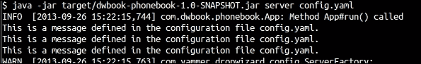
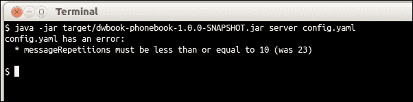

# 第三章。配置应用程序

到目前为止，我们已经为 Dropwizard 应用程序创建了一个简单的模板。我们的应用程序在启动时会向终端打印一条消息。

通常，每个现代应用程序都依赖于一系列配置设置，这些设置定义了它的运行方式。例如，一旦我们的应用程序增长并需要与数据库交互，我们就应该以某种方式使用（至少）用户名和密码来建立数据库连接。当然，我们可以在应用程序内部硬编码这些设置，但这并不高效，因为即使是微小的更改也要求重新构建它。存储此类或类似信息的适当方式是使用外部配置文件。

# 将应用程序的配置外部化

使用配置文件需要适当的应用程序逻辑来加载和解析它。幸运的是，Dropwizard 内置了我们将要使用的功能，以便外部化我们的应用程序配置。

## 如何做…

1.  在与`pom.xml`文件相同的目录下创建一个名为`config.yaml`的新 YAML 文件。这将是我们的应用程序的配置文件。我们将添加两个配置参数：启动时打印的消息以及打印的次数。为了做到这一点，请将以下代码添加到`config.yaml`中：

    ```java
    message: This is a message defined in the configuration file config.yaml.
    messageRepetitions: 3
    ```

1.  现在我们有了配置文件，但我们需要解析它。让我们在`com.dwbook.phonebook`包中创建一个新的类`PhonebookConfiguration`，通过添加以下代码：

    ```java
    package com.dwbook.phonebook;

    import com.fasterxml.jackson.annotation.JsonProperty;
    import io.dropwizard.Configuration;

    public class PhonebookConfiguration extends Configuration {
      @JsonProperty
      private String message;

      @JsonProperty
      private int messageRepetitions;

      public String getMessage() {
        return message;
      }

      public int getMessageRepetitions() {
        return messageRepetitions;
      }
    }
    ```

    ### 注意

    如你所见，它是一个简单的类，包含两个成员属性，分别以我们的配置设置命名，以及它们的 getter 方法。

1.  要使用此类作为我们的配置代理，修改我们的主`App`类的声明，使其扩展`Application<PhonebookConfiguration>`类而不是`Application<Configuration>`：

    ```java
    public class App extends Application<PhonebookConfiguration> {
    ```

1.  类似地，更新`configuration`到`PhonebookConfiguration`在`App#initialize()`方法的声明中：

    ```java
    @Override

    public void initialize(Bootstrap<PhonebookConfiguration> b) {}
    ```

1.  `App#run()`方法在其定义中也需要相同的修改，但我们还将进一步修改此方法，以便从配置类中检索要打印的消息：

    ```java
    public void run(PhonebookConfiguration c, Environment e)
         throws Exception {
        LOGGER.info("Method App#run() called");
        for (int i=0; i < c.getMessageRepetitions(); i++) {
          System.out.println(c.getMessage());
      }
    }
    ```

1.  打包（`mvn package`）并运行应用程序，并指定配置文件：

    ```java
    $ java -jar target/dwbook-phonebook-1.0-SNAPSHOT.jar server config.yaml
    ```

    在应用程序启动期间，你将在终端中看到消息打印了三次，如下截图所示：

    

此外，就像前面的例子一样，你还会看到一个异常，指出找不到资源类（`ResourceConfig`实例不包含任何根资源类）。这是因为我们在应用程序中还没有注册任何 REST 资源。我们将在下一章中处理这个问题。

## 它是如何工作的…

你应该看到我们的配置文件被自动解析。实际上，`PhonebookConfiguration` 类是用配置文件中指定的值实例化的。

当配置文件作为命令行参数传递时，Dropwizard 会解析它并创建你的服务配置类的实例。我们将所需的配置参数作为`PhonebookConfiguration`类的私有成员添加，并使用`@JsonProperty`注解它们，以便 Dropwizard 可以解析它们。为了使这些属性对我们应用程序的服务类可访问，我们还需要为这些参数添加公共 getter 方法。

## 还有更多...

将应用程序的配置外部化有许多优点。使用 Dropwizard，你可以轻松地存储和读取你希望为应用程序使用的任何类型的属性（配置设置），只需将 YAML 属性映射到配置类的属性即可，无需花费太多精力。

### Dropwizard 的配置参数

Dropwizard 提供了大量的配置参数，例如嵌入式 Jetty 监听的端口和日志级别。虽然这个列表相当长，无法在此详尽介绍，但它可以在官方 Dropwizard 网站上找到，链接为[`www.dropwizard.io/manual/core/#configuration-defaults`](http://www.dropwizard.io/manual/core/#configuration-defaults)。

### YAML

根据其官方网站的描述([`www.yaml.org`](http://www.yaml.org))，YAML 是一种人性化的数据序列化标准。它的语法相当简单，这也是 YAML 被广泛接受的原因。YAML 文件由扩展名`.yaml`和`.yml`标识；两者都是有效的，尽管`.yml`似乎最近更受欢迎。

# 验证配置设置

虽然将应用程序的配置外部化是好事，但我们不应总是完全依赖它。Dropwizard 已经为我们提供了保障，并且我们有适当的工具来在应用程序启动时验证配置属性。这是因为我们可以为配置属性使用约束注解，例如包含在`javax.validation.constraints`或`org.hibernate.validator.constraints`包中的那些注解。

我们将限制消息重复的次数为 10；如果提供的数字大于 10，则输入被视为无效。

## 如何做到这一点...

让我们通过以下步骤来验证配置设置：

1.  更新`PhonebookConfiguration`中`messageRepetitions`属性的定义，使用`@Max`注解标注该属性（你还需要导入`javax.validation.constraints.Max`）：

    ```java
    @JsonProperty
    @Max(10)
    private int messageRepetitions;
    ```

1.  以类似的方式，定义`message`属性不应为空，使用`@NotEmpty (org.hibernate.validator.constraints.NotEmpty)`注解标注该属性：

    ```java
    @JsonProperty
    @NotEmpty
    private String message;
    ```

1.  编辑`Config.yaml`文件，并为`messageRepetitions`属性指定一个大于 10 的值。

1.  重新打包并再次运行应用程序。应用程序将拒绝启动，你将在终端上看到以下截图所示的错误信息：

## 它是如何工作的…

验证相关的注解强制 Dropwizard 验证我们配置文件中声明的每个属性的值。如果验证约束不满足，相关的错误信息将打印在终端上，并且应用程序将不会启动。

## 还有更多…

现在你有一个在应用程序启动时映射到配置对象上的工作配置文件。此外，除了检查配置参数的有效性之外，你还可以为每个参数提供一个默认值。

### 指定默认参数

你可以像在声明时初始化变量一样轻松地指定配置参数的默认值。这样，可选参数可以省略，并且在运行时可以具有默认值，即使它们没有包含在应用程序的配置文件中。

让我们添加一个额外的参数，我们将初始化它，命名为`additionalMessage`，以及它的 getter 方法：

```java
@JsonProperty
private String additionalMessage = "This is optional";
public String getAdditionalMessage() {
  return additionalMessage;
}
```

如果你运行应用程序并指定了一个不包含`additionalMessage`属性的配置文件，那么当你尝试从代码的其他部分访问该属性时，将返回此属性的默认值，例如，如果你在`App#run()`方法内部使用`c.getAdditionalMessage()`。这样，你可以为你的应用程序提供可选参数。
