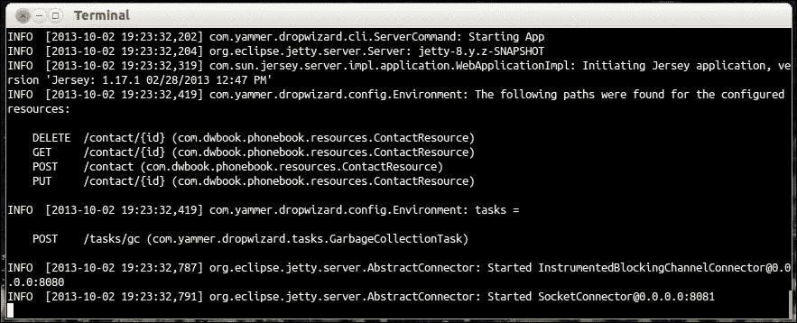
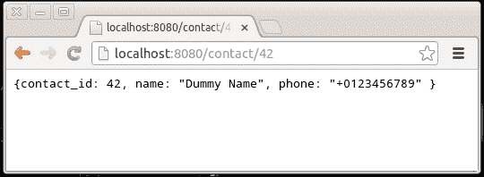

# 第四章 创建和添加 REST 资源

到目前为止，我们的应用程序实际上并没有做很多事情。这是因为它缺少配置的 REST 资源。REST 资源是人们可以称之为实体的东西，在我们的案例中，是一组 URI 模板，具有共同的基 URL，人们可以使用常见的 HTTP 方法与之交互。

# 创建资源类

我们正在构建一个电话簿应用程序，因此我们需要实现存储和管理联系人的必要功能。我们将创建电话簿服务的资源类。此类将负责处理 HTTP 请求并生成 JSON 响应。资源类最初将提供检索、创建、更新和删除联系人的端点。

请注意，我们目前还没有处理结构化数据或与数据库交互，因此从我们的应用程序传输到和从应用程序传输的联系人相关信息不遵循特定的格式。

## 如何做到这一点...

创建资源类的以下步骤：

1.  创建一个新的包，`com.dwbook.phonebook.resources,`并在其中添加一个`ContactResource`类。

1.  导入所需的包，`javax.ws.rs.*`和`javax.ws.rs.core.*.wdasdasd`：

    ```java
    import javax.ws.rs.*;
    import javax.ws.rs.core.*;
    ```

1.  通过使用`@Path`注解指定资源的 URI 模板，并使用`@Produces`注解指定响应`Content-Type`头：

    ```java
    @Path("/contact")
    @Produces(MediaType.APPLICATION_JSON)
    public class ContactResource {
      // code...
    }
    ```

1.  为了添加一个将返回存储联系人信息的方法的步骤，创建`#getContact()`方法。此方法将返回一个`javax.ws.rs.core.Response`对象，这是一种简单但有效的方式来操作发送给执行请求的客户端的实际 HTTP 响应。添加`@GET`和`@PATH`注解，如以下代码片段所示。这将使方法绑定到`/contact/{id}`的 HTTP GET 请求。URI 的`{id}`部分代表一个变量，并通过`@PathParam`注解绑定到同一方法的`int id`参数：

    ```java
      @GET
      @Path("/{id}")
      public Response getContact(@PathParam("id") int id) {
        // retrieve information about the contact with theprovided id
        // ...
        return Response
            .ok("{contact_id: " + id + ", name: \"Dummy Name\",phone: \"+0123456789\" }")
            .build();
      }
    ```

1.  同样，我们需要实现创建、删除和更新联系人的适当方法。创建联系人的`#createContact()`方法将绑定到`/contact` URI 的 HTTP POST 请求。由于我们的基本 URI 没有附加任何内容，因此此方法不需要使用`@Path`注解。此方法也将返回一个`Response`对象，就像我们所有资源的方法一样，表示已创建新的联系人：

    ```java
    @POST
    public Response createContact(
        @FormParam("name") String name,
        @FormParam("phone") String phone) {
      // store the new contact 
      // ...
      return Response
          .created(null)
          .build();
    }
    ```

1.  对于删除现有联系人，HTTP 客户端需要向特定联系人的 URI 发送 HTTP DELETE 请求。因此，相应方法的 URI 将与检索单个联系人的 URI 完全相同。将`#deleteContact()`方法添加到我们的资源类中，如以下代码片段所示。我们还需要表明请求的 URI 不再包含内容：

    ```java
    @DELETE
    @Path("/{id}")
    public Response deleteContact(@PathParam("id") int id) {
      // delete the contact with the provided id
      // ...
      return Response
          .noContent()
          .build();
    }
    ```

1.  现有联系人的更新通常是通过向联系人的端点发送 HTTP PUT 请求来完成的。`#updateContact()` 方法将处理此类请求并指示更新成功，返回适当的 `Response` 对象：

    ```java
    @PUT
    @Path("/{id}")
    public Response updateContact(
        @PathParam("id") int id,
        @FormParam("name") String name,
        @FormParam("phone") String phone) {
      // update the contact with the provided ID
      // ...
      return Response
            .ok("{contact_id: "+ id +", name: \""+ name +"\",phone: \""+ phone +"\" }")
            .build();
      }
    ```

1.  通过修改 `App` 类中的 `run` 方法并通过 `JerseyEnvironment#register()` 方法将实现的资源添加到我们的 Dropwizard 应用程序环境中，如以下代码所示。您还需要在 `App.java` 文件顶部添加一个导入语句来导入 `ContactResource` 类（导入 `com.dwbook.phonebook.resources.ContactResource`）。您还应该看到，为了访问我们的应用程序的 Jersey 环境，您可以使用 `Environment#jersey()` 方法：

    ```java
    public void run(PhonebookConfiguration c, Environment e) 
          throws Exception {
        // ...
        // Add the resource to the environment
        e.jersey().register(new ContactResource());
      }
    ```

1.  使用 `mvn package` 重建应用程序并运行 `java -jar target/dwbook-phonebook-1.0-SNAPSHOT.jar server config.yaml`。您将看到一条消息，指示我们的（基于 Jersey 的）Dropwizard 应用程序正在启动，以及配置的资源列表，在这种情况下，是我们在 `com.dwbook.phonebook.resources.ContactResource` 类中定义的资源。

1.  将您的浏览器指向 `http://localhost:8080/contact/100` 并查看结果；它将生成一个 ID 为 100 的虚拟 JSON 表示，这是您在 URL 中提供的（一个路径参数，它将适用于任何整数）。

服务正在运行并监听传入的请求。您可以通过在终端中按 *Ctrl* + *C* 来关闭它。几秒钟后，服务将停止。

## 它是如何工作的...

资源类是 RESTful Web 服务最重要的部分，因为它是定义您希望公开的资源及其 URI 的地方。

`@Produces` 注解定义了类方法生成的响应的内容类型。尽管它定义了 HTTP `Content-Type` 头的值，但它也用于指示 Jackson 将表示转换为适当的格式，在这种情况下是 JSON；因此有 `MediaType.APPLICATION_JSON` 的定义。如果我们想返回 XML 文档作为响应，我们应该使用 `MediaType.APPLICATION_XML`。

我们使用 `@Path` 注解来定义 URI 模板。通过应用它并将其提升到类的级别，我们定义了资源的基 URI 将是 `/contact`。我们还使用了此注解来指定 `#getContact` 方法，指定了 `/{id}` 模板。这导致触发 `#getContact` 执行的完整 URI 是 `/contact/{id}`。

URI 的 `{id}` 部分是一个路径参数，我们使用 `@PathParam` 注解将其映射到 `int id` 参数。`PathParam` 使用路径参数的名称作为其参数，在这种情况下是 `id`。

Jersey 将拦截每个传入的 HTTP 请求并尝试将其与定义的 URI 模板匹配，以找到要调用的资源类方法。

通常，在类级别定义基本 URI 是一个好习惯，并且还可以为每个方法定义更具体的 URI 模板。

为了配置我们的应用程序使用我们创建的资源，我们必须在 `App` 类的 `#run()` 方法初始化后将其添加到执行环境中。

## 更多内容…

表示是一个实体；可以引用的东西。表示可以创建、更新、删除和返回。REST 资源是接受此类操作的 HTTP 请求的端点。

我们为 `#getContact()` 方法使用了 `@GET` 注解。这意味着该方法绑定到，并且仅绑定到 HTTP GET 动词。我们使用这个动词是因为我们返回了关于实体的数据，但没有以任何方式修改它。

### HTTP 动词 – RESTful 约定

通常，RESTful Web 服务使用四种基本的 HTTP 方法（动词）映射到 CRUD 操作：

+   POST 用于创建资源

+   PUT 用于更新资源

+   DELETE 用于删除资源

+   GET 用于返回资源的表示

GET 是一个幂等操作；如果给定相同的输入，它将在任何情况下返回相同的结果，而不会修改请求实体。

### 小贴士

您可以使用适当的注解（例如 `@POST`、`@PUT`、`@DELETE` 和 `@GET`）将 HTTP 动词映射到资源方法（例如，`#getContact()`）。

### HTTP 响应代码

除了 CRUD 操作映射到特定的 HTTP 方法之外，另一个重要的 RESTful Web 服务设计原则是根据请求和触发的操作结果使用特定的响应代码。

根据这个约定，当新实体成功创建时，我们的应用程序会响应，表示 HTTP 响应状态代码为 `201 Created`。

类似地，当实体成功删除时，我们的应用程序会发送 `204 No Content` 代码。`204 No Content` 代码也可以在其他情况下使用，当我们发送给客户端的响应不包含实体时，而不仅仅是在我们删除资源的情况下。

对于大多数情况，当我们的应用程序在响应 GET 请求时返回数据，`200 OK` 响应代码就足够了。

我们在我们的实现中使用了响应类，以便在我们的应用程序响应中包含特定的响应代码。

### 响应类

`javax.ws.rs.Response` 类，我们所有方法都返回其实例，提供了一套 `ResponseBuilder` 方法，我们可以使用这些方法来构建返回给执行 HTTP 请求到我们服务的客户端的数据。

`Response#ok()` 方法接受一个 `Object` 实例作为参数，然后根据我们的服务响应格式（由 `@Produces` 注解定义）相应地进行序列化。使用此方法将返回 `HTTP 200 OK` 响应代码给客户端。

`Response#noContent()` 方法返回一个 HTTP `204 No Content` 响应代码给客户端，表示没有内容适用于此请求。

另一方面，`Response#created()`方法用于发送一个`201 Created`响应代码，并附带新创建资源的 URI。URI（或 null）可以作为参数传递给此方法，并将其用作响应的`Location`头部的值。

`Response`类有多个类似的有用方法，但它还允许我们设置自定义响应代码，而无需使用预定义方法之一。为此，你可以通过提供适当的响应代码来使用`Response#status()`方法，如下例所示：

```java
Response.status(Status.MOVED_PERMANENTLY);

```

此外，我们可以使用`ResponseBuilder#entity()`方法来设置适当响应负载。`#entity()`方法接受`Object`作为参数，并以类似于`Response#created()`方法的方式处理它：

```java
Response.status(Status.MOVED_PERMANENTLY).entity(new Object());

```

应该注意的是，所有这些方法都返回一个`ResponseBuilder`实例，并且也可以进行链式调用。为了构建`Response`对象，我们必须使用`ResponseBuilder#build()`方法。
