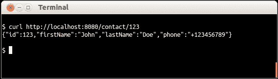
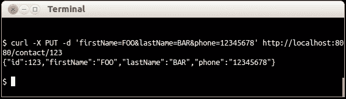
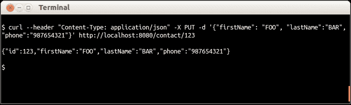

# 第五章。表示 – RESTful 实体

我们的 Web 服务现在通过利用`Response`类来响应产生输出的请求。我们注意到这个类有一些方法接受一个对象作为参数。

# 创建表示类

我们将创建由我们的应用程序的 REST 资源产生的表示。一个简单的 Java 类就是 Jersey 所需的一切，因此它将把该类视为 RESTful 表示。

由于我们的 Web 服务需要以 JSON 格式生成与联系人相关的信息，一个示例响应将类似于以下代码：

```java
{ id: 1, firstName: "John", lastName: "Doe", phone: "+123-456-789" }
```

我们将围绕这个 JSON 字符串构建我们的表示类。该类将具有必要的属性（`id`、`firstName`、`lastName`和`phone`）以及它们的 getter 方法。

## 如何做到这一点…

执行以下步骤以创建表示类：

1.  创建一个名为`com.dwbook.phonebook.representations`的新包，并在其中创建一个`Contact`类。

1.  将上述联系人属性作为 final 成员添加，并实现它们的 getter 和构造函数：

    ```java
    package com.dwbook.phonebook.representations;

    public class Contact {
      private final int id;
      private final String firstName;
      private final String lastName;
      private final String phone;

      public Contact() {
        this.id = 0;
        this.firstName = null;
        this.lastName = null;
        this.phone = null;
      }

      public Contact(int id, String firstName, String lastName,String phone) {
        this.id = id;
        this.firstName = firstName;
        this.lastName = lastName;
        this.phone = phone;
      }

      public int getId() {
        return id;
      }
      public String getFirstName() {
        return firstName;
      }
      public String getLastName() {
        return lastName;
      }
      public String getPhone() {
        return phone;
      }
    }
    ```

## 它是如何工作的…

联系人的表示类现在已准备就绪。所需的一切只是一个具有与我们要生成应用程序的 JSON 对象相同属性的普通 Java 类。然而，为了使其工作，需要适当的公共 getter 方法。

我们的属性被声明为 final，以便是不可变的，因此我们也创建了一个相应初始化属性的构造函数。

这个类的实例现在可以用作我们基于 Jersey 的 REST 资源的输出。Jackson 将透明地处理从 POJO 到 JSON 的转换。

## 更多内容…

任何 POJO 都可以用作表示。Jackson 根据每个类的 getter 方法和它们的返回类型递归地构建 JSON 字符串。

### Jackson Java JSON 处理器

Jackson 是一个强大的开源 JSON 数据绑定/解析器/处理器，它简化了将普通 Java 对象转换为 JSON 格式以及相反的过程。Jersey 使用 Jackson 来满足其转换需求，并且是`dropwizard-core`模块的一部分；因此，它已经包含在我们的项目设置中。

### JSON 数组

任何`java.util.List`类型的实例都将被转换为 JSON 数组。例如，如果我们想为联系人存储多个电话号码，我们将在表示类中声明`private final List<String> phoneNumbers`（对类构造函数和 getter 的适当修改）。

这将导致以下格式的 JSON 表示：

```java
{ id: 1, firstName: "John", lastName: "Doe", phoneNumbers: ["+123-456-789", "+234-567-890", "+345-678-901"] }
```

### 忽略属性

你可以通过在其 getter 上添加`@JsonIgnore`注解来防止一个属性成为 JSON 表示的一部分。

这将导致 Jackson 忽略一个否则会被视为 JSON 属性的 getter 方法。

# 通过 Resource 类提供表示

考虑我们之前实现的`ContactResource#getContact()`方法。我们使用`Response#ok(Object entity)`方法来构建要发送给客户端的响应，并将其作为参数传递给`String`，如下面的代码所示：

```java
return Response.ok("{id: " + id + ", name: \"Dummy Name\", phone: \"+0123456789\" }").build();
```

现在，我们已经准备好了`Representation`类，我们将利用它并将其实例传递给`#ok()`方法。

## 如何做到这一点...

执行以下步骤以通过资源类学习表示的提供：

1.  根据以下代码相应地更新`ContactResource#getContact()`方法，以便在`#ok()`方法中传递`Contact`对象而不是`String`，您需要首先导入`Contact`类（`import com.dwbook.phonebook.representations.Contact`）：

    ```java
    @GET
    @Path("/{id}")
    public Response getContact(@PathParam("id") int id) {
      // retrieve information about the contact with the provided id
      // ...
        return Response
        .ok( new Contact( id, "John", "Doe", "+123456789") )
        .build();
    }
    ```

1.  接下来，修改方法的签名，将`name`变量拆分为`firstName`和`lastName`，以便与`Contact`类保持一致：

    ```java
      @PUT
      @Path("/{id}")
      public Response updateContact(
          @PathParam("id") int id,
          @FormParam("firstName") String firstName,
          @FormParam("lastName") String lastName,
          @FormParam("phone") String phone) {
        // update the contact with the provided ID
        // ...
        return Response
            .ok( new Contact(id, firstName, lastName, phone) )
            .build();
      }
    ```

1.  重新构建（`mvn package`）并再次运行应用程序：

    ```java
    $ java -jar target/dwbook-phonebook-1.0-SNAPSHOT.jar server config.yaml
    ```

1.  导航到`http://localhost:8080/contact/123`或向同一 URL 执行 PUT 请求。您将看到服务器发送给我们的请求的响应是我们传递给`Response#ok()`方法的对象的 JSON 表示。

## 它是如何工作的...

我们通过使用`Response#ok()`方法定义发送给客户端的响应，该方法接受一个对象作为参数。到目前为止，我们一直直接传递 JSON 字符串。这不是一种高效的方式，因为我们的应用程序将处理实际的对象（`Contact`实例），而且没有理由手动创建它们的 JSON 表示，当 Jackson 可以自动完成时。

## 还有更多...

我们现在正在使用我们的`representation`类来将其属性映射到我们正在生成的响应。我们还可以使用相同的类来映射我们的输入参数。例如，我们可以修改`ContactResource#updateContact()`和`ContactResource#createContact()`方法，使其期望一个`Contact`对象作为参数，而不是显式使用其每个属性。

### 使用 cURL 执行 HTTP 请求

使用您的浏览器，您只能执行 GET 请求。为了有效地测试我们的应用程序，我们需要一个能够使用 POST、PUT 和 DELETE 方法执行 HTTP 请求的工具。cURL ([`curl.haxx.se/`](http://curl.haxx.se/))是一个命令行工具，我们可以用它更好地理解示例。您可以从[`curl.haxx.se/download.html`](http://curl.haxx.se/download.html)下载它，选择与您的平台兼容的包。

执行 GET 请求与 cURL 一样简单。以下示例将调用`#getContact()`方法：

```java
$ curl  http://localhost:8080/contact/123

```



您在第二行看到的 JSON 字符串是服务器的响应。

为了执行一个用于更新联系人的 PUT 请求，我们需要使用 `-X` 标志后跟方法名称（即 `curl -X PUT` …）。为了在请求中向服务器发送数据，在这种情况下是联系人的信息，同时使用 `-d` 标志以及数据。请注意，由于 `#updateContact()` 方法的参数映射到请求参数（使用 `@FormParam`），我们需要以 URL 编码的形式发送数据。请看下面的截图：



如果我们想看到包含请求和响应头部的详细输出，可以使用 `-v`（长名称 --verbose）标志。此外，如果我们需要设置请求头部的值，可以使用 `-H`（长名称 --header）标志，后跟头部信息：

```java
$ curl --header "Content-Type: application/json" http://localhost:8080/contact/1

```

# 将请求数据映射到表示形式

当前通过在 `#createContact()` 和 `#updateContact()` 方法的签名中提及每个属性（注解）来读取 Web 服务属性的方式是可以的；然而，在大量输入数据的情况下，它并不高效。想象一下，如果我们需要在 `Contact` 类中添加几个额外的属性。我们还需要更新方法签名，使它们变得不那么易读，最终难以管理。通常，我们更喜欢直接将请求数据映射到表示形式。为了实现这一点，我们将相应地更新相关方法，删除属性并添加一个 `contact` 实例。Jackson 将处理其余部分。

## 如何操作...

执行以下步骤以映射请求数据：

1.  更新 `ContactResource#createContact()` 方法，用单个 `contact` 对象替换其参数：

    ```java
    @POST
    public Response createContact(Contact contact) {
      // store the new contact 
      // ...
      return Response
          .created(null)
          .build();
    }
    ```

1.  更新 `ContactResource#updateContact()` 方法，用单个 `contact` 对象替换其参数：

    ```java
    @PUT
    @Path("/{id}")
    public Response updateContact(
        @PathParam("id") int id,
        Contact contact) {
      // update the contact with the provided ID
        // ...
      return Response
          .ok(new Contact(id, contact.getFirstName(), contact.getLastName(), contact.getPhone()))
          .build();
    }
    ```

1.  重新构建并再次运行应用程序。现在，应用程序能够处理 `/contact` 和 `/contact/{id}` 端点的 HTTP POST 和 PUT 请求，请求体中包含 JSON 字符串而不是命名参数。请注意，请求的 `Content-Type` 头部将被设置为 `application/json`。

## 它是如何工作的...

通过在处理请求的方法（即带有 Jersey 注解绑定到 URI 的方法）上声明 `Contact` 实例作为参数，我们强制 Jersey 解析请求体并将其反序列化（使用 Jackson）为 `Contact` 对象。

在上一个示例中执行的 PUT 请求现在可以通过向服务器发送 JSON 数据并设置适当的头部来执行，如下面的代码行所示：

```java
$ curl --header "Content-Type: application/json" -X PUT -d '{"firstName": "FOO", "lastName":"BAR", "phone":"987654321"}' http://localhost:8080/contact/123

```



如果在 `http://localhost:8080/contact` 上执行 POST 请求，请求体包含 JSON 数据 `{"firstName": "Alexandros", "lastName": "Dallas", "phone": "+3012345678"}`，并且 `Content-Type` 报头为 `application/json`，那么在 `#createContact()` 方法中的 `contact` 对象将根据这些属性进行初始化，这得益于 Jackson 以及其适当的 JAX-RS 实体提供者。实体提供者是处理包含在 HTTP 请求中的有效负载并将其转换为对象的组件。这与当 `resource` 方法返回一个对象并将其转换为 JSON 对象时发生的转换类似。
