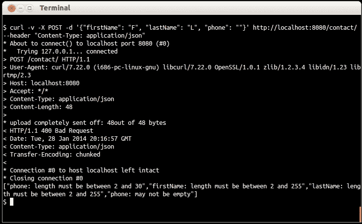

# 第七章：验证 Web 服务请求

到目前为止，我们有一个生成 JSON 表示的 RESTful Web 服务，并且还能够存储和更新联系人信息。但在实际存储或更新联系人信息之前，我们需要确保提供的信息是有效且一致的。

# 添加验证约束

为了验证联系人，我们首先需要定义什么是有效的联系人。为此，我们将修改表示类，通过 Hibernate Validator 注解的形式为其成员添加约束。

## 如何做到这一点...

我们有`Contact`类，其实例必须有一个名字、一个姓氏和一个电话号码才能被认为是有效的。此外，这些值的长度必须在特定的限制范围内。让我们按顺序逐步了解应用这些约束的必要步骤。

修改`Contact`表示类，为其成员添加适当的注解（首先导入`org.hibernate.validator.constraints.*`）：

1.  更新`firstName`变量的声明，添加必要的注解以指示这是一个必填属性（不应为空），其长度应在 2 到 255 个字符之间。

    ```java
    @NotBlank @Length(min=2, max=255)
    private final String firstName;
    ```

1.  以类似的方式，对`lastName`属性应用相同的约束。

    ```java
    @NotBlank @Length(min=2, max=255)
    private final String lastName;
    ```

1.  `phone`字段不应超过 30 位数字，因此相应地修改相关注解的值。

    ```java
    @NotBlank @Length(min=2, max=30)
    private final String phone;
    ```

## 它是如何工作的...

验证约束的声明是基于注解的。这使我们能够直接将我们想要的验证规则添加到表示类的成员中。

Hibernate Validator 是`dropwizard-core`模块的一部分，因此我们不需要在`pom.xml`中声明任何额外的依赖。

## 还有更多...

验证对象的标准方法是使用标准的**Bean Validation API**（**JSR 303**）。对于我们的验证需求，我们使用**Hibernate Validator**，它是`Dropwizard-core`模块的一部分，也是 JSR 303 的参考实现。使用 Hibernate Validator，我们可以声明字段约束，如`@NotBlank`和`@Length`，甚至创建和使用我们自己的自定义约束以满足我们的需求（您可以参考 Hibernate Validator 的文档，链接为[`docs.jboss.org/hibernate/stable/validator/reference/en-US/html_single/#validator-customconstraints`](http://docs.jboss.org/hibernate/stable/validator/reference/en-US/html_single/#validator-customconstraints)）。

### 约束注解列表

字段约束的完整列表可在 Hibernate Validator 包导航器中找到，链接为[`docs.jboss.org/hibernate/stable/validator/reference/en-US/html_single/#section-builtin-constraints`](http://docs.jboss.org/hibernate/stable/validator/reference/en-US/html_single/#section-builtin-constraints)。

# 执行验证

我们刚刚定义了什么是有效的注解。现在，我们必须修改我们的资源类的代码，以验证每个 POST 和 PUT 请求是否包含一个有效的`Contact`对象，基于此创建或更新联系信息。

## 如何操作…

让我们通过以下步骤查看我们的资源类需要修改什么：

1.  首先，我们需要导入一些将帮助我们进行验证的类。

    ```java
    import java.util.Set;
    import javax.validation.ConstraintViolation;
    import javax.util.ArrayList;
    import javax.validation.Validator;
    import javax.ws.rs.core.Response.Status;
    ```

1.  添加一个最终成员`validator`，并更新构造方法以初始化它。

    ```java
    private final ContactDAO contactDao;  private final Validator validator;
      public ContactResource(DBI jdbi, Validator validator) {
     contactDao = jdbi.onDemand(ContactDAO.class);    this.validator = validator;
      }
    ```

1.  在`App`类中，修改`#run()`方法，以便在初始化`ContactResource`时将环境的`validator`作为参数传递，同时包含 jDBI。

    ```java
    // … // Add the resource to the environmente.jersey().register(new ContactResource(jdbi, e.getValidator()));// …
    ```

1.  更新`ContactResource#createContact()`方法，并在将其插入数据库之前检查联系信息是否有效。

    ```java
      @POST
      public Response createContact(Contact contact) throws URISyntaxException {
        // Validate the contact's data
        Set<ConstraintViolation<Contact>> violations = validator.validate(contact);
        // Are there any constraint violations?
        if (violations.size() > 0) {
          // Validation errors occurred
          ArrayList<String> validationMessages = new ArrayList<String>();
          for (ConstraintViolation<Contact> violation : violations) {
    validationMessages.add(violation.getPropertyPath().toString() +": " + violation.getMessage());
         }
         return Response
              .status(Status.BAD_REQUEST)
              .entity(validationMessages)
              .build();
        }
        else {
          // OK, no validation errors
          // Store the new contact
          int newContactId = contactDao.createContact(contact.getFirstName(),
            contact.getLastName(), contact.getPhone());
          return Response.created(new URI(String.valueOf(newContactId))).build();
        }
      }
    ```

1.  类似地，更新`ContactResource#updateContact()`方法。

    ```java
      @PUT
      @Path("/{id}")
      public Response updateContact(@PathParam("id") int id, Contact contact) {
        // Validate the updated data
        Set<ConstraintViolation<Contact>> violations = validator.validate(contact);
        // Are there any constraint violations?
        if (violations.size() > 0) {
          // Validation errors occurred
          ArrayList<String> validationMessages = new ArrayList<String>();
          for (ConstraintViolation<Contact> violation : violations) {
    validationMessages.add(violation.getPropertyPath().toString() +": " + violation.getMessage());
          }
          return Response
                .status(Status.BAD_REQUEST)
                .entity(validationMessages)
                .build();
        }
        else {
          // No errors
          // update the contact with the provided ID
          contactDao.updateContact(id, contact.getFirstName(),
              contact.getLastName(), contact.getPhone());
          return Response.ok(
              new Contact(id, contact.getFirstName(), contact.getLastName(),
              contact.getPhone())).build();
        }
      }
    ```

1.  从命令行构建并运行应用程序，以便对我们刚刚实现的验证机制进行一些测试。

1.  使用`curl`，向`http://localhost:8080/contact/`执行一个 HTTP POST 请求，发送将触发验证错误的联系信息，例如长度小于 2 个字符的`firstName`和`lastName`，以及一个空值的`phone`字段，如下面的 JSON 字符串所示：

    ```java
    {"firstName": "F", "lastName": "L", "phone": ""}.
    #> curl -v -X POST -d '{"firstName": "F", "lastName": "L", "phone": ""}' http://localhost:8080/contact/ --header "Content-Type: application/json"
    ```

    

你将看到响应是一个**HTTP/1.1 400 错误请求**错误，响应负载是一个包含以下错误消息的 JSON 数组：

```java
< HTTP/1.1 400 Bad Request

< Date: Tue, 28 Jan 2014 20:16:57 GMT

< Content-Type: application/json

< Transfer-Encoding: chunked

< 

* Connection #0 to host localhost left intact

* Closing connection #0

["phone: length must be between 2 and 30","firstName: length must be between 2 and 255","lastName: length must be between 2 and 255","phone: may not be empty"]

```

## 工作原理…

在映射到`/contact` URI 的 POST 请求的`ContactResource#createContact()`方法中，我们使用了环境的`javax.validation.Validator`实例来验证接收到的`contact`对象。

验证器的`#validate()`方法返回一个`Set<ConstraintViolation<Contact>>`实例，其中包含发生的验证错误（如果有的话）。我们检查列表的大小以确定是否存在任何违规行为。如果有，我们将遍历它们，提取每个错误的验证消息，并将其添加到一个`ArrayList`实例中，然后我们将作为响应返回这个实例，并附带**HTTP 状态码 400 – 错误请求**。

由于我们的资源类生成 JSON 输出（已在类级别上通过`@Produces`注解声明），`ArrayList`实例将因 Jackson 而转换为 JSON 数组。

## 更多内容…

如你所见，为了测试和展示我们创建的端点的 POST 请求，我们需要一个 HTTP 客户端。除了 cURL 之外，还有一些非常好的、有用的 HTTP 客户端工具可用（例如适用于 Google Chrome 的 Postman，可在[`chrome.google.com/webstore/detail/postman-rest-client/fdmmgilgnpjigdojojpjoooidkmcomcm`](https://chrome.google.com/webstore/detail/postman-rest-client/fdmmgilgnpjigdojojpjoooidkmcomcm)），这些工具可以帮助我们，我们将在下一章中创建自己的工具。

### `@Valid`注解

我们可以用在 `#createContact` 方法上注解 `contact` 对象为 `@Valid` 来代替使用 `validator` 对象验证输入对象，如下代码所示：

```java
public Response createContact(@Valid Contact contact)
```

当一个对象被注解为 `@Valid` 时，验证会递归地在该对象上执行。这将导致在方法被调用时立即触发验证。如果发现 `contact` 对象无效，则将自动生成默认的 **HTTP 422 – Unprocessable entity** 响应。虽然 `validator` 对象更强大且可定制，但使用 `@Valid` 注解是一种替代的简单直接的方式来验证传入的请求。这避免了需要向调用者返回一个更详细的自定义验证错误信息，而是发送一个通用的错误信息。

# 跨字段验证

有时候需要在对象的多个字段（属性）上执行验证。我们可以通过实现自定义验证注解并应用类级别约束来实现这一点。

幸运的是，有一个更简单的方法可以实现这一点。Dropwizard 提供了 `io.dropwizard.validation.ValidationMethod` 注解，我们可以在表示类的 `boolean` 方法中使用它。

## 如何实现…

以下是向 `contact` 对象添加跨字段验证所需的步骤。我们将检查联系人的全名不是 John Doe：

1.  在 `Contact` 类中添加一个名为 `#isValidPerson()` 的新方法。

    ```java
    public boolean isValidPerson() {
      if (firstName.equals("John") && lastName.equals("Doe")) {
        return false;
      }
      else {
        return true;
      }
    }
    ```

1.  然后，我们需要确保当这个方法被 Jackson 序列化时，其输出永远不会包含在输出中。为此，使用 `@JsonIgnore` 注解 (`com.fasterxml.jackson.annotation.JsonIgnore`) 注解 `#isValidPerson()` 方法。

1.  最后，使用 `@ValidationMethod` (`io.dropwizard.validation.ValidationMethod`) 注解相同的验证方法，并在验证失败的情况下提供错误信息。

    ```java
    @ValidationMethod(message="John Doe is not a valid person!")
    ```

## 它是如何工作的…

当触发验证时，`#isValidPerson()` 方法将与我们放置的自定义验证代码一起执行。如果方法返回 true，则表示隐含的约束得到满足。如果方法返回 false，则表示违反了约束，验证错误信息将是与 `ValidationMethod` 注解一起指定的那个。

你可以在类中创建任意数量的跨字段验证方法。然而，请注意，每个自定义验证方法都必须返回 `boolean` 类型，并且其名称必须以 `is` 开头。
