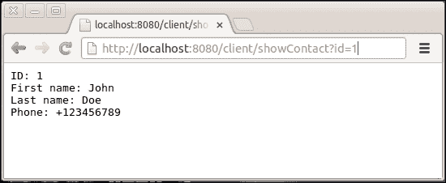
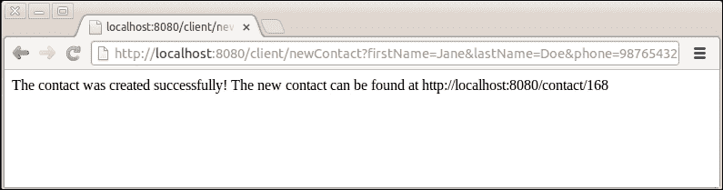
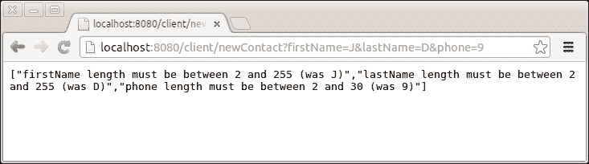

# 第八章. 网络服务客户端

我们的服务已经准备好了并且功能正常，但我们需要一个接口来实际使用它。当然，通过使用网络浏览器，我们能够执行 HTTP GET 请求，但不能执行更复杂的请求，如 POST。我们需要创建一个 HTTP 客户端来处理这些请求。

此外，在许多情况下，你可能需要让你的网络服务调用其他网络服务，然后在将信息返回给调用者之前执行额外的处理。

# 为我们的应用程序构建客户端

Dropwizard 包含了 Jersey 和 Apache HTTP 客户端。我们将使用 Jersey 客户端来创建我们的网络服务客户端。

## 准备工作

将`dropwizard-client`模块添加到你的`pom.xml`文件的依赖项部分，以便为我们的项目添加网络服务客户端支持：

```java
<dependency><groupId>io.dropwizard</groupId><artifactId>dropwizard-client</artifactId><version>0.7.0-SNAPSHOT</version></dependency>
```

## 如何操作...

我们将创建一个新的资源类，它将监听并接受来自我们的网络浏览器的 HTTP GET 请求，然后调用`Contact`资源的适当方法并以人类友好的格式呈现响应。让我们看看实现这一目标所需的步骤：

1.  在`com.dwbook.phonebook.resources`包中创建`ClientResource`类。类似于`ContactResource`类，我们首先应该导入所需的`javax.ws.rs`注解、我们将要使用的表示类，以及如以下代码片段所示所需的 Jersey 客户端类。

    ```java
      package com.dwbook.phonebook.resources;

      import javax.ws.rs.*;
      import javax.ws.rs.core.*;
      import com.dwbook.phonebook.representations.Contact;
      import com.sun.jersey.api.client.*;

      public class ClientResource { }
    ```

1.  将客户端资源类的上下文路径设置为`/client/`，通过在新建的类中添加适当的注解来逻辑上分离客户端和服务的 URI。

    ```java
      @Path("/client/") 
      public class ClientResource { }
    ```

1.  由于我们的客户端将被人类使用，我们需要一个对人类友好的响应类型，例如`text/plain`，因此我们将使用`MediaType.TEXT_PLAIN`。通过在我们的类中添加`@Produces`注解来定义它。

    ```java
      @Produces(MediaType.TEXT_PLAIN)
      @Path("/client/")
      public class ClientResource { }
    ```

1.  为了对其他网络服务（在这种情况下，我们的服务，`ContactResource`类）进行调用，我们需要在我们的资源类中有一个`Client`实例作为成员。这将在初始化期间提供，因此我们需要一个适当的构造函数。

    ```java
    private Client client;
      public ClientResource(Client client) {
        this.client = client;
      }
    ```

1.  在我们的应用程序的入口类中实例化客户端，并通过在`App#run()`方法中添加几行代码将新的资源添加到环境中。当然，我们首先需要导入`com.sun.jersey.api.client.Client`、`io.dropwizard.client.JerseyClientBuilder`以及我们刚刚创建的`com.dwbook.phonebook.resources.ClientResource`类。

    ```java
      // build the client and add the resource to the environment
      final Client client = new JerseyClientBuilder(e).build("REST Client");
      e.jersey().register(new ClientResource(client));
    ```

## 它是如何工作的...

现在我们已经有了准备好的客户端资源。这个资源包含一个 Jersey `Client`对象作为成员，我们可以使用它通过构建`WebResource`对象（使用`Client#resource()`方法）并在它们之间进行交互来对特定的 URL 执行 HTTP 请求。

## 还有更多...

大多数时候，尤其是在大型应用中，客户端与后端服务是解耦的，形成一个独立的应用。后端服务通常执行更复杂和密集的任务，通常将它们独立于客户端进行管理和扩展是好的实践。

# 与我们的服务交互

我们将继续添加必要的 `ClientResource` 类方法，绑定到 GET 请求，以便它们可以很容易地通过浏览器触发。我们需要添加创建、更新、删除和检索联系人的方法，我们将通过执行适当的 HTTP 请求来触发它们。

## 如何做到这一点...

1.  将 `#showContact()` 方法添加到 `ClientResource` 类中，使用 `@QueryParam` 注解将查询 `String` 参数 `id` 绑定为输入。

    ```java
      @GET
      @Path("showContact")
      public String showContact(@QueryParam("id") int id) {
        WebResource contactResource = client.resource("http://localhost:8080/contact/"+id);
        Contact c = contactResource.get(Contact.class);
        String output = "ID: "+ id 
            +"\nFirst name: " + c.getFirstName() 
            + "\nLast name: " + c.getLastName() 
            + "\nPhone: " + c.getPhone();
        return output;
      }
    ```

1.  创建 `#newContact()` 方法。此方法将接受 `Contact` 对象的属性作为参数，并通过对 `ContactResource` 服务执行适当的 HTTP 请求来创建一个新的联系人。

    ```java
      @GET
      @Path("newContact")
      public Response newContact(@QueryParam("firstName") String firstName, @QueryParam("lastName") String lastName, @QueryParam("phone") String phone) {
        WebResource contactResource = client.resource("http://localhost:8080/contact");
        ClientResponse response = contactResource.type(MediaType.APPLICATION_JSON).post(ClientResponse.class, new Contact(0, firstName, lastName, phone));
        if (response.getStatus() == 201) {
          // Created
          return Response.status(302).entity("The contact was created successfully! The new contact can be found at " + response.getHeaders().getFirst("Location")).build();
        }
        else {
          // Other Status code, indicates an error
          return Response.status(422).entity(response.getEntity(String.class)).build();
        }
      }
    ```

1.  更新联系人的 `#updateContact()` 方法将与之前的类似。

    ```java
    @GET
      @Path("updateContact")
      public Response updateContact(@QueryParam("id") int id, @QueryParam("firstName") String firstName, @QueryParam("lastName") String lastName, @QueryParam("phone") String phone) {
        WebResource contactResource = client.resource("http://localhost:8080/contact/" + id);
        ClientResponse response = contactResource.type(MediaType.APPLICATION_JSON).put(ClientResponse.class, new Contact(id, firstName, lastName, phone));
        if (response.getStatus() == 200) {
          // Created
          return Response.status(302).entity("The contact was updated successfully!").build();
        }
        else {
          // Other Status code, indicates an error
          return Response.status(422).entity(response.getEntity(String.class)).build();
        }
      }
    ```

1.  以类似的方式，让我们添加删除联系人的方法，`#deleteContact()`。

    ```java
    @GET
      @Path("deleteContact")
      public Response deleteContact(@QueryParam("id") int id) {
        WebResource contactResource = client.resource("http://localhost:8080/contact/"+id);
        contactResource.delete();
        return Response.noContent().entity("Contact was deleted!").build();
      }
    ```

1.  现在，你可以构建并运行应用程序，以查看我们到目前为止所做的工作。

## 如何工作…

将你的浏览器指向 `http://localhost:8080/client/showContact?id=1`。客户端将对 `http://localhost:8080/contact/1` 执行 HTTP GET 请求，解析联系人的 JSON 表示，并生成其纯文本摘要。



为了执行 HTTP 请求，我们必须首先使用客户端的 `#resource(String)` 方法创建一个 `WebResource` 实例（因为 RESTful Web 服务都是关于资源和 HTTP 动词）。将 `WebResource` 视为特定 Web 服务端点的代理。

`WebResource` 类的 `#get()` 方法接受我们将用于解析和映射响应的类作为参数，这也会是其返回类型。

对于 HTTP POST 请求，我们使用通用的 HTTP 响应类 `ClientResponse`，我们可以使用 `#getStatus()` 方法提取响应的状态码。此外，我们还可以使用 `#getHeaders()` 方法提取其头信息。

注意，对于 POST 和 PUT 请求，我们也在设置请求数据的媒体类型（`WebResource#type()`）。

如果你将你的网络浏览器指向 `http://localhost:8080/client/newContact?firstName=Jane&lastName=Doe&phone=98765432`，我们的客户端会将这些数据发送到 `ClientResource`，这将创建一个新的联系人并返回其位置给客户端。然后客户端会显示如下截图中的新联系人的 URL：



同样，我们可以通过客户端请求适当的 URL 来更新联系。URL `http://localhost:8080/client/updateContact?id=1&firstName=Alex&lastName=Updated&phone=3210465` 将触发对联系服务的 PUT 请求，最终更新 `id` 等于 1 的联系。

如您可能已经猜到的，URL `http://localhost:8080/client/deleteContact?id=1` 将发送相关的 HTTP DELETE 请求到联系服务，删除由给定 `id` 标识的联系。

## 还有更多…

注意，在创建新联系时出现验证错误的情况下，这些错误会通知客户端。我们的客户端检查 POST 请求的状态码，如果它不等于 `201`（表示实体已被创建），则将响应解析为字符串并展示给用户。

例如，导航到 `http://localhost:8080/client/newContact?firstName=J&lastName=D&phone=9`。由于我们已经设置了约束，指出 `firstName`、`lastName` 和 `phone` 的长度应大于 2，因此您将看到以下截图中的验证错误：


