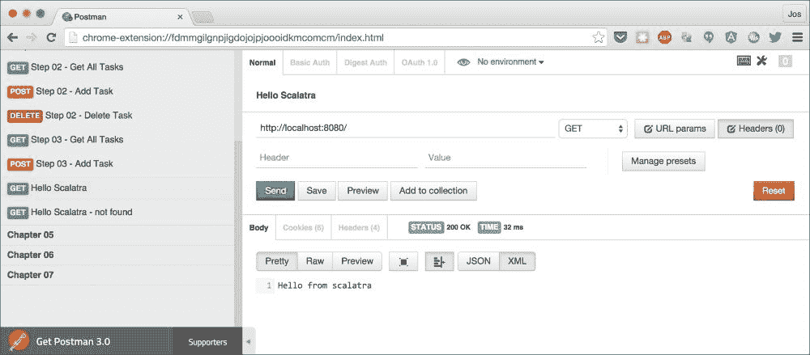
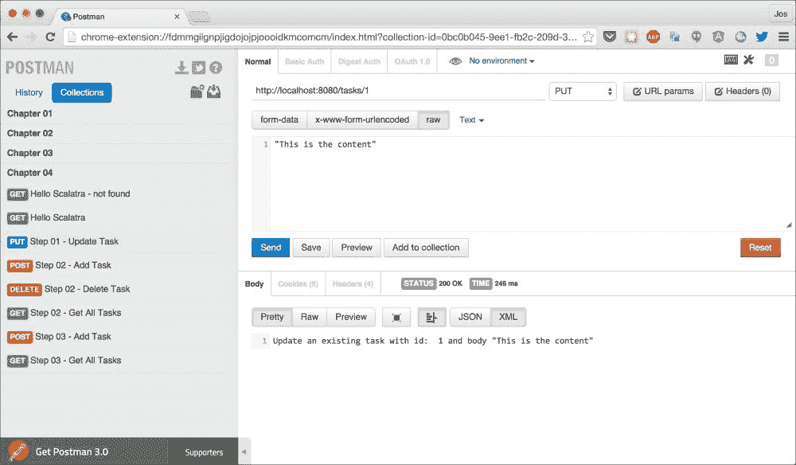
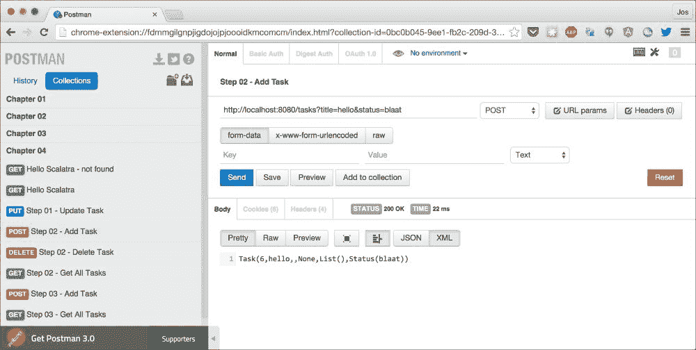
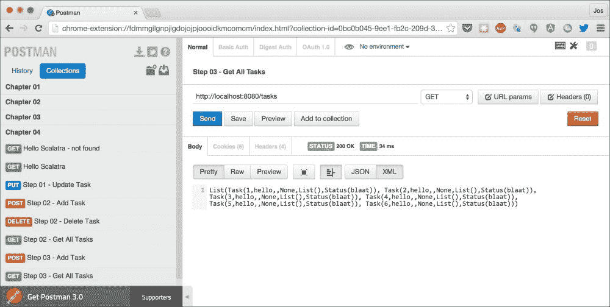
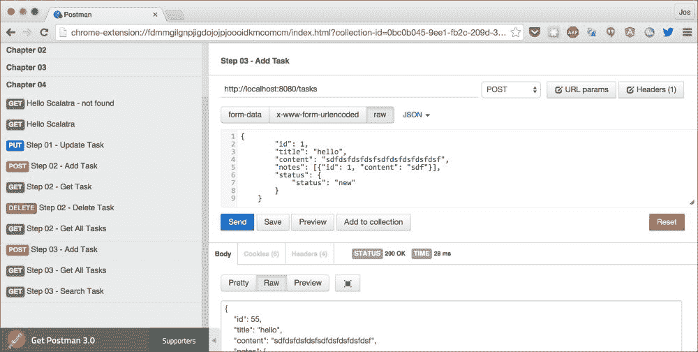
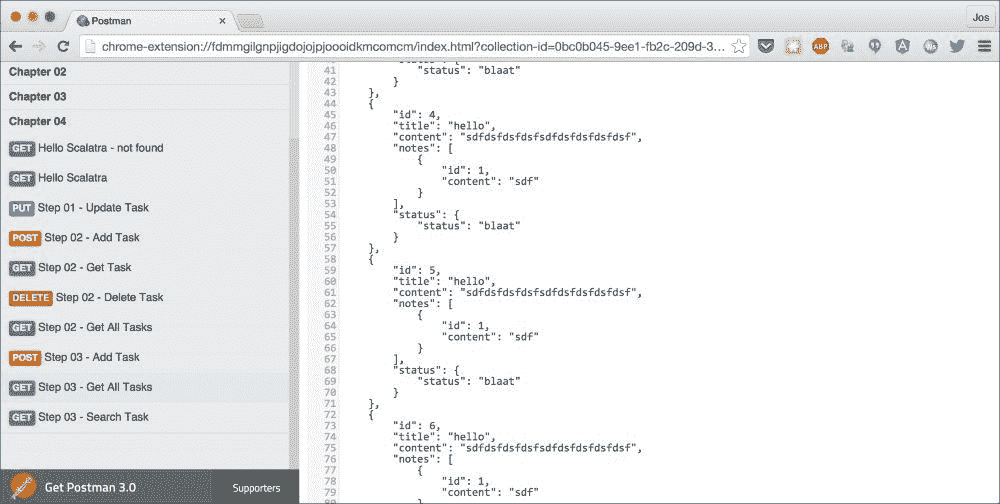
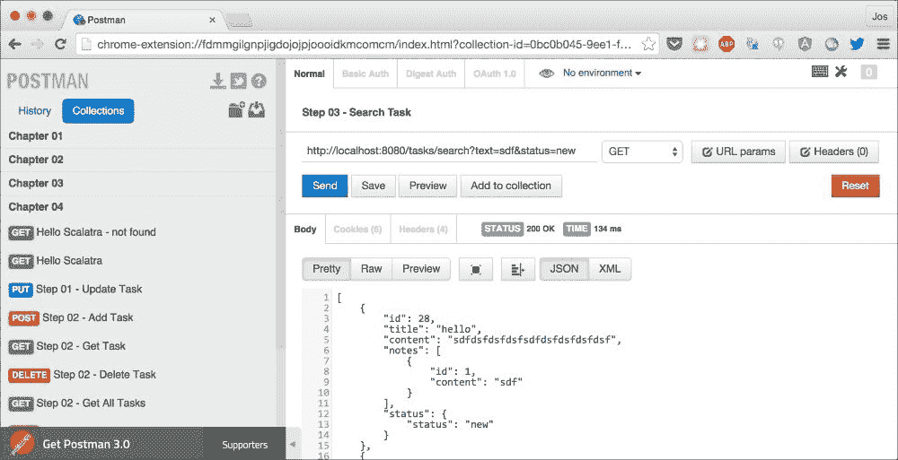
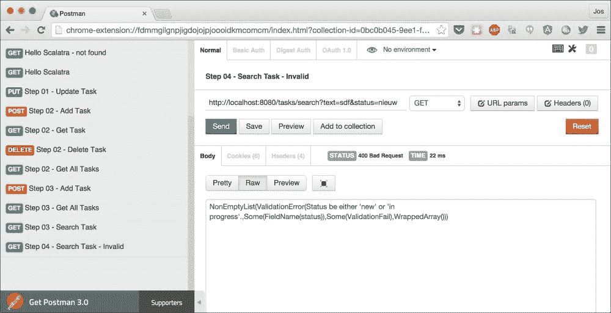

# 第四章：使用 Scalatra 创建简单的 REST 服务

在前面的章节中，您学习了如何使用使用函数式、类似 Scala 语言的方法的框架来创建 REST 服务。Finch 使用了一种非常基于函数式编程的方法，而 Unfiltered 使用模式匹配。在本章中，我们将探索一个 Scala 框架，Scalatra，其主要目标是简单性。

在本章中，我们将通过以下示例解释 Scalatra 的功能：

+   **第一个 Scalatra 服务**：我们将创建一个简单的 Scalatra 服务，展示您如何快速启动。

+   **动词和路径处理**：Scalatra 提供了一系列构造，您可以使用它们来定义路由。一个路由可以匹配特定的 HTTP 动词和路径，并在匹配时返回特定的响应。

+   **添加对未来的支持和简单验证**：在其标准配置中，Scalatra 是同步工作的。在本部分，我们将向您展示如何添加对未来的支持，并添加一些基本的验证。

+   **转换到和从 JSON，并支持高级验证**：在本章的最后部分，我们将探讨 JSON 支持，并解释 Scalatra 如何支持更高级的验证传入请求的方式。

首先，让我们快速了解一下 Scalatra 是什么，以及它的目标是什么。

# Scalatra 简介

Scalatra 是一个小巧的 Scala Web 框架，它试图保持简单。它提供了一套指南和辅助类，用于创建完整的 Web 应用程序。在本章中，我们将重点关注它为创建 REST 服务提供的支持。

Scalatra 在设计时考虑了多个原则（来自 Scalatra 主页）：

> *从小处着手，逐步构建：从一个小的核心开始，并为常见任务提供大量易于集成的功能。*
> 
> *自由：允许用户自由选择对正在构建的应用程序最有意义的结构和库。*
> 
> *坚实但不过于僵化：使用坚实的基组件。例如，servlets 可能不是酷的，但它们非常稳定，并且有一个庞大的社区支持。同时，通过使用新技术和方法来推进 Web 应用程序开发的状态。*
> 
> *热爱 HTTP：拥抱 HTTP 及其无状态特性。当人们自欺欺人地认为一些不真实的事情时，他们会陷入麻烦 - 花哨的服务器端技巧来营造状态性的错觉并不适合我们。*

正如您在本章中看到的，Scalatra 的主要目标是保持简单。

# 您的第一个 Scalatra 服务

要使我们的第一个 Scalatra 服务运行起来，我们需要采取一些额外的步骤。原因是 Scalatra 被设计为在 servlet 容器（例如 Tomcat 或 Jetty）中运行。虽然这对于测试和生产环境来说效果很好，但它不允许我们进行快速原型设计或轻松地从 SBT 或 IDE 中运行。幸运的是，您也可以以编程方式启动 Jetty servlet 容器，并从那里运行 Scalatra 服务。因此，在本节中，我们将：

+   首先展示运行 Scalatra 所需的依赖项

+   以这种方式设置 Jetty，使其能够运行我们的 Scalatra REST 服务

+   创建一个简单的 Scalatra 服务，以响应特定的 `GET` 请求

首先，让我们看看 Scalatra 的依赖项。你可以在 `sources` 目录下的 `project` 目录中的 `Dependencies.scala` 文件中找到这些依赖项。对于 Scalatra（以及 Jetty），我们定义以下内容：

```java
  lazy val scalatraVersion = "2.3.0"
  val backendDeps = Seq(
   "org.scalatra"      %% "scalatra"          % scalatraVersion,
   "ch.qos.logback"    %  "logback-classic"   % "1.1.3",
   "org.eclipse.jetty" %  "jetty-webapp"      % "9.2.10.v20150310"  
  )
```

这个 `Seq` 中的第一个依赖项引入了所有必需的 Scalatra 库，第二个依赖项允许我们定义 Jetty 的日志记录方式和内容，最后一个依赖项是必需的，这样我们才能从我们的项目中以编程方式启动 Jetty。

定义了这些依赖项之后，我们可以创建一个嵌入式的 Jetty 服务器，我们可以使用它来提供我们的 REST 服务。这个启动器的代码可以在 `chapter4/package.scala` 文件中找到：

```java
  object JettyLauncher {

    def launch(bootstrapClass: String): Server = {

      // define the servlet context, point to our Scalatra servlet
      val context = new WebAppContext()
      context.setContextPath "/"
      context.setResourceBase("src/main/webapp")
      context.setInitParameter(ScalatraListener
                              .LifeCycleKey, bootstrapClass)
      context.addEventListener(new ScalatraListener)
      context.addServlet(classOf[DefaultServlet], "/")

      // create a server and attach the context
      val server = new Server(8080)
      server.setHandler(context)

      // add a lifecycle listener so to stop the server from console
      server.addLifeCycleListener(new AbstractLifeCycleListener() {
        override def lifeCycleStarted(event: LifeCycle): Unit = {
          println("Press <enter> to exit.")
          Console.in.read.toChar
          server.stop()
        }
      })

      // start and return the server
      server.start
      server.join
      server
    }
  }
```

我们不会深入探讨这段代码，因为它实际上与 Scalatra 并无太大关联。这里要理解的主要是，我们定义了一个名为 `launch` 的函数，它接受一个启动类名称作为参数（稍后会有更多介绍），并且我们使用 `addEventListener` 函数添加了一个 `ScalatraListener` 实例。一旦 Jetty 服务器启动完成，`ScalatraListener` 将被调用，并使用提供的 `bootstrapClass` 启动 Scalatra 服务。

现在我们已经创建了一种启动我们的 Scalatra 服务的方法，让我们看看最基础的示例（源代码可以在 `HelloScalatra.scala` 文件中找到）：

```java
package org.restwithscala.chapter4.gettingstarted

import org.restwithscala.chapter4.JettyLauncher
import org.scalatra.{ScalatraServlet, LifeCycle}
import javax.servlet.ServletContext

// run this example by specifying the name of the bootstrap to use
object ScalatraRunner extends App {
  JettyLauncher.launch(
      "org.restwithscala.chapter4.gettingstarted.ScalatraBootstrap")
}

// used by jetty to mount the specified servlet
class ScalatraBootstrap extends LifeCycle {
  override def init(context: ServletContext) {
    context mount (new HelloScalatra, "/*")
  }
}

// the real servlet code
class HelloScalatra extends ScalatraServlet  {

  notFound {
    "Route not found"
  }

  get("/") {
    "Hello from scalatra"
  }
}
```

让我们从头到尾浏览这个文件。在顶部，我们定义了一个名为 `ScalatraRunner` 的对象。通过这个对象，我们通过调用之前看到的 `JettyLauncher` 上的 `launch` 方法来启动我们的 REST 服务。我们还向启动器传递了 `ScalatraBootstrap` 类的名称，这样我们之前看到的 `ScalatraListener` 就可以在 Jetty 启动完成后调用 ScalatraBootstrap 的 `init` 方法。在 `ScalatraBootstrap` 类中，我们实现了 `init` 方法，并使用它来实例化我们的 REST 服务（在这个例子中，它被称为 `HelloScalatra`），并通过调用 mount 使其对外界可用。在本章的每个示例中，我们都会使用这种方法。在 `HelloScalatra` 类中，我们最终看到了 REST 服务的定义。在这种情况下，我们定义了一个路由，当它收到 `/` 路径上的 `GET` 请求时，返回 `Hello from scalatra`。如果没有路由匹配，`notFound` 函数将被触发，返回一个 `404` 消息，表明“路由未找到”。

剩下的工作就是测试这两个场景。从源代码目录中，运行 `sbt runCH04-HelloScalatra`。这应该会显示类似于以下内容的输出：

```java
$ sbt runCH04-HelloScalatra
[info] Loading project definition from /Users/jos/dev/git/rest-with-scala/project
[info] Set current project to rest-with-scala (in build file:/Users/jos/dev/git/rest-with-scala/)
[info] Running org.restwithscala.chapter4.gettingstarted.ScalatraRunner 
20:42:09.020 [run-main-0] INFO  org.eclipse.jetty.util.log - Logging initialized @31722ms
20:42:09.536 [run-main-0] INFO  org.eclipse.jetty.server.Server - jetty-9.2.10.v20150310
20:42:09.940 [run-main-0] INFO  o.e.j.w.StandardDescriptorProcessor - NO JSP Support for /, did not find org.eclipse.jetty.jsp.JettyJspServlet
20:42:10.015 [run-main-0] INFO  o.scalatra.servlet.ScalatraListener - The cycle class name from the config: org.restwithscala.chapter4.gettingstarted.ScalatraBootstrap
20:42:10.304 [run-main-0] INFO  o.scalatra.servlet.ScalatraListener - Initializing life cycle class: ScalatraBootstrap
20:42:10.643 [run-main-0] INFO  o.e.j.server.handler.ContextHandler - Started o.e.j.w.WebAppContext@78dac2c7{/,file:/Users/jos/dev/git/rest-with-scala/src/main/webapp,AVAILABLE}
20:42:10.924 [run-main-0] INFO  o.e.jetty.server.ServerConnector - Started ServerConnector@15f336ae{HTTP/1.1}{0.0.0.0:8080}
20:42:10.925 [run-main-0] INFO  org.eclipse.jetty.server.Server - Started @33637ms
Press <enter> to exit.

```

到目前为止，我们可以按 *Enter* 键停止服务器，或者启动 Postman 来测试我们的服务。在 Postman 中，你会找到一个针对本章的请求集合；让我们只测试这个请求（`hello scalatra`），它返回我们的 `Hello from scalatra` 消息，这样我们就可以知道一切是否按预期工作：



如前一个屏幕截图所示，Scalatra 的响应正如我们所期望的，因此我们的基本 Scalatra 设置工作正确。

# 动词和路径处理

现在我们已经运行了基本的 Scalatra REST 服务，让我们看看一个更复杂的例子，我们将用它来探索 Scalatra 的一些更多功能。在我们查看代码之前，让我们从 Postman 发起一个请求。首先，通过控制台调用`sbt runCH04-runCH04Step1`来启动服务器，它将显示类似以下内容：

```java
$ sbt runCH04-runCH04Step1
[info] Loading project definition from /Users/jos/dev/git/rest-with-scala/project
[info] Set current project to rest-with-scala (in build file:/Users/jos/dev/git/rest-with-scala/)
[info] Running org.restwithscala.chapter4.steps.ScalatraRunnerStep1 
10:51:40.313 [run-main-0] INFO  o.e.jetty.server.ServerConnector - Started ServerConnector@538c2499{HTTP/1.1}{0.0.0.0:8080}
10:51:40.315 [run-main-0] INFO  org.eclipse.jetty.server.Server - Started @23816ms
Press <enter> to exit.

```

接下来，打开 Postman，从文件夹`chapter-04`中选择`request Step 01 – Update Task`并发送到服务器。这个请求将模拟创建一个新的任务，并通过回显它接收到的部分信息来响应：



如前一个屏幕截图所示，我们的服务器正在运行，并返回包含更新任务的消息。接下来，我们将逐步分析这个 Scalatra 服务的代码：

```java
package org.restwithscala.chapter4.steps

import javax.servlet.ServletContext

import org.restwithscala.chapter4.JettyLauncher
import org.scalatra.{NotFound, BadRequest, ScalatraServlet, LifeCycle}

import scala.util.{Failure, Success, Try}

// run this example by specifying the name of the bootstrap to use
object ScalatraRunnerStep1 extends App {
  JettyLauncher.launch(
    "org.restwithscala.chapter4.steps.ScalatraBootstrapStep1")
}

class ScalatraBootstrapStep1 extends LifeCycle {
  override def init(context: ServletContext) {
    context mount (new ScalatraStep1, "/*")
  }
}

class ScalatraStep1 extends ScalatraServlet  {

  notFound { "Route not implemented" }

  post("/tasks") { s"create a new task with body ${request.body}"}
  get("/tasks") { "Get all the tasks" }
  get("/tasks/:id") {
    Try { params("id").toInt }  match {
      case Success(id) => s"Get task with id: ${params("id")} "
      case Failure(e) => BadRequest(reason = "Can't parse id")
    }
  }
  delete("/tasks/:id") { s"Delete task with id: ${params("id")} "}
  put("/tasks/:id") { s"Update an existing task " +
    s"with id:  ${params("id")} " +
    s"and body ${request.body}"}
}
```

如前节所述，我们需要调用`JettyLauncher`并定义一个`ScalatraBootstrapStep1`类来运行我们的服务。在这个例子中，有趣的代码位于`ScalatraStep1`类中，它定义了我们可以从 REST 客户端调用的多个路由。

### 提示

当你查看本章中的路由时，你会注意到更通用的路由位于`ScalatraServlet`类的顶部。原因是 Scalatra 试图从底部开始匹配传入的请求，然后向上移动。因此，在定义路由时，请注意将最通用的路由放在顶部，最具体的路由放在底部。

在`ScalatraStep1`类中，我们定义了多个路由。让我们看看其中的一些：

```java
  get("/tasks/:id") {
    Try { params("id").toInt }  match {
      case Success(id) => s"Get task with id: ${params("id")} "
      case Failure(e) => BadRequest(reason = "Can't parse id")
    }
  }
  ...
  put("tasks/:id") { s"Update an existing task " +
    s"with id:  ${params("id")} " +
    s"and body ${request.body}"}
```

在这里，我们可以看到两个路由。`get("/tasks/:id")`匹配类似`/tasks/12`的 URL 上的`GET` HTTP 请求。当请求被发送时，我们使用`params`函数获取路径段值，并尝试将其转换为整数。如果成功，我们只返回一个字符串；如果不成功，我们返回 HTTP 错误`BadRequest`。`put("tasks/:id")`路由匹配`PUT` HTTP 请求，并始终返回一个字符串，该字符串包含使用`params`函数提供的 ID，并显示通过`request.body`值可以访问的发送的消息体。除了`params`函数外，Scalatra 还提供了一个`multiParams`函数。使用`multiParams`函数，你不会得到一个单独的字符串，而是一个`Seq[String]`实例。如果你想要访问具有多个值的请求参数，这特别有用。例如，如果我们匹配`/task/search?status=new,old`，我们可以通过调用`multiParams("status")`来获取包含 new 和 old 的`Seq[String]`。

除了直接匹配路径元素外，Scalatra 还支持多种匹配 HTTP 请求的方式。下表显示了如何在 Scalatra 中匹配特定的 HTTP 动词和路由：

| 构建 | 描述 |
| --- | --- |
| `get("/")`, `post("/")`, `put("/")`, `delete("/")` 和其他 HTTP 动词。 | Scalatra 允许您匹配特定的 HTTP 动词。Scalatra 支持以下 HTTP 动词，您可以直接在路由定义中使用：`options`、`get`、`head`、`post`、`put`、`delete`、`trace`、`connect` 和 `patch`。 |
| `get("/full/path")` | 匹配特定路径上的请求的最基本方法是指定要匹配的完整路径。这只会匹配提供的路径完全匹配的情况。在这种情况下，`"/full/path"`将匹配，而`"/full/path/something"`则不会匹配。 |
| `get("/path/:param")` | 如示例所示，您还可以通过在路径段前加冒号来从路径中提取变量。这将匹配类似于`"/path/12"`和`"path/hello"`的路径。 |
| `get("""^\/tasks\/(.*)""".r)` | 您还可以使用正则表达式在 Scalatra 中匹配特定路径。要访问匹配的组，您可以使用`params("splat")`调用或通过`multiParams("splat")`函数调用。 |
| `get("/*/*")` | Scalatra 还支持使用通配符。您可以通过`params("splat")`调用或通过`multiParams("splat")`函数调用来访问匹配的参数。 |
| `get("/tasks", condition1, condition2)` | 您可以通过提供条件来进一步微调匹配。条件是一个返回`True`或`False`的函数。如果所有条件都返回`True`，则路由匹配并执行。例如，您可以使用类似`post("/tasks", request.getHeader("headername") == "headerValue")`的代码。 |

在我们进入下一节之前，让我们快速了解一下如何访问请求的所有属性。到目前为止，我们已经看到了`params`、`multiParams`和`request.body`来访问某些部分。Scalatra 还公开了请求的其他部分。以下表格显示了 Scalatra 公开的辅助函数和请求属性的完整概述（请注意，您可以将这些请求属性轻松用作路由中的条件）：

| 函数 | 描述 |
| --- | --- |
| `requestPath` | 这返回与路由匹配的路径。 |
| `multiParams(key)` | 这返回请求参数（或匹配路径段）的值作为 `Seq[String]`。 |
| `Params(key)` | 这返回请求参数（或匹配路径段）的值作为字符串。 |
| `request.serverProtocol` | 这返回一个`HttpVersion`对象，可以是`Http11`或`Http10`。 |
| `request.uri` | 这是以 `java.net.URI` 形式的请求 URI。 |
| `request.urlScheme` | 这返回一个 `Scheme` 对象，可以是 `Http` 或 `Https`。 |
| `request.requestMethod` | 这返回一个`HttpMethod`对象，例如`Get`、`Post`或`Put`。 |
| `request.pathInfo` | 这返回请求的路径信息，如果没有路径信息则返回空字符串。 |
| `Request.scriptName` | 这返回请求的 servlet 路径部分作为字符串。 |
| `Request.queryString` | 这返回请求的查询字符串，如果没有查询字符串则返回空字符串。 |
| `Request.multiParameters` | 这返回一个映射，包含此请求的所有参数作为`MultiMap`。这包含查询字符串中的参数和任何已提交的表单数据。 |
| `request.headers` | 这返回所有头部作为`Map[String, String]`对象。 |
| `request.header(key)` | 从请求中获取特定的头部并返回一个`Option[String]`。 |
| `request.characterEncoding` | 如果存在，这返回请求的字符编码和一个`Option[String]`。 |
| `request.contentType` | 如果存在，这获取请求的内容类型并返回一个`Option[String]`。 |
| `request.contentLength` | 这获取内容的长度并返回一个`Option[Long]`。 |
| `request.serverName` | 这返回完整路径的服务器名称部分和一个字符串。 |
| `request.serverPort` | 这返回服务器端口号作为整数。 |
| `request.referrer` | 这尝试从请求中获取引用并返回一个`Option[String]`。 |
| `request.body` | 这返回请求的正文作为字符串。 |
| `request.isAjax` | 检查请求是否为 AJAX 请求。它通过检查`X-Requested-With`头部的存在来完成此操作。 |
| `request.isWrite` | 检查请求是否不是安全请求（参见 RFC 2616）。 |
| `request.multiCookie` | 这返回一个映射，包含此请求的所有 cookie 作为`MultiMap`。 |
| `request.cookies` | 这返回所有 cookie 作为`Map[String, String]`。 |
| `request.inputStream` | 这获取请求的`inputStream`，可以用来读取正文。注意，当你调用`request.body`时，这个`inputStream`已经被消耗了。 |
| `request.remoteAddress` | 这尝试获取客户端的 IP 地址，并以字符串形式返回。 |
| `request.locale` | 这返回请求中的`Locale`值。 |

如你所见，Scalatra 封装了所有你期望的正常请求属性和属性，并通过一些辅助函数或作为可用请求值上的属性使它们易于访问。

现在我们已经探讨了 Scalatra 的基本功能，并看到了我们如何匹配 HTTP 动词和路径，接下来我们将查看下一节中的一些更高级的功能。

# 添加对 future 和简单验证的支持

在本节中，我们将为 Scalatra 添加对 future 的支持，并展示验证传入请求的一些初步步骤。为了异步工作，Scalatra 需要一些额外的依赖项。本示例所需的依赖项完整列表如下：

```java
  lazy val scalatraVersion = "2.3.0"
  val backendDeps = Seq(
      "org.scalatra" %% "scalatra" % scalatraVersion,
      "ch.qos.logback"% "logback-classic" % "1.1.3",
      "org.eclipse.jetty" %  "jetty-webapp" % "9.2.10.v20150310",
      "com.typesafe.akka" %% "akka-actor" % "2.3.4"
```

如从依赖关系中所见，Scalatra 使用 Akka ([`akka.io`](http://akka.io))来异步处理请求。然而，你不需要了解太多关于 Akka 的知识就可以让一切正常运行。在下面的代码片段中，我们展示了连接所有移动部件所需的基本粘合剂：

```java
package org.restwithscala.chapter4.steps

import javax.servlet.ServletContext

import akka.actor.ActorSystem
import org.restwithscala.chapter4.JettyLauncher
import org.restwithscala.common.model.{Status, Task}
import org.restwithscala.common.service.TaskService
import org.scalatra._
import org.slf4j.LoggerFactory

import scala.concurrent.{Future, ExecutionContext}
import scala.util.{Failure, Success, Try}

object ScalatraRunnerStep2 extends App {
  JettyLauncher.launch(
       "org.restwithscala.chapter4.steps.ScalatraBootstrapStep2")
}

class ScalatraBootstrapStep2 extends LifeCycle {

  val system = ActorSystem()

  override def init(context: ServletContext) {
    context.mount(new ScalatraStep2(system), "/*")
  }

  override def destroy(context: ServletContext) {
    system.shutdown()
  }
}

class ScalatraStep2(system: ActorSystem) extends ScalatraServlet 
                                            with FutureSupport {

  protected implicit def executor: ExecutionContext 
                                      = system.dispatcher
  val Log = LoggerFactory.getLogger(this.getClass)

  ...
}
```

在这个代码片段中，我们使用之前看到的 JettyLauncher 来启动 Jetty 服务器，并指定当 Jetty 启动时要启动的 Scalatra 引导类。在这个示例的引导中，我们采取了一些额外的步骤：

```java
class ScalatraBootstrapStep2 extends LifeCycle {

  val system = ActorSystem()

  override def init(context: ServletContext) {
    context.mount(new ScalatraStep2(system), "/*")
  }

  override def destroy(context: ServletContext) {
    system.shutdown()
  }
}
```

当这个类被实例化时，我们创建一个新的 Akka，`ActorSystem`，这是 Akka 所必需的。我们将这个系统传递给我们的 Scalatra 路由（`ScalatraStep2`）的构造函数，这样我们就可以从那里使用它。在这个引导类中，我们还重写了 `destroy` 函数。当 Jetty 服务器关闭时，这将优雅地关闭 `ActorSystem` 并清理任何打开的资源。

在我们查看处理路由的代码之前，我们首先使用 Postman 进行一些调用，以便更好地理解我们的路由需要做什么。因此，使用 `sbt runCH04-runCH04Step2` 命令启动这部分的服务器：

```java
$ sbt runCH04-runCH04Step2
[info] Loading project definition from /Users/jos/dev/git/rest-with-scala/project
[info] Set current project to rest-with-scala (in build file:/Users/jos/dev/git/rest-with-scala/)
[info] Running org.restwithscala.chapter4.steps.ScalatraRunnerStep2 
17:46:00.339 [run-main-0] INFO  org.eclipse.jetty.util.log - Logging initialized @19201ms
17:46:00.516 [run-main-0] INFO  org.eclipse.jetty.server.Server - jetty-9.2.10.v20150310
17:46:01.572 [run-main-0] INFO  o.e.jetty.server.ServerConnector - Started ServerConnector@5c3c276c{HTTP/1.1}{0.0.0.0:8080}
17:46:01.572 [run-main-0] INFO  org.eclipse.jetty.server.Server - Started @20436ms
Press <enter> to exit.

```

现在通过使用本章的 **Step 02 – Create Task** 请求创建多个任务：



要获取所有已存储任务的概览，请使用 **Step 02 – Get All Tasks** 请求：



如您从两个截图中所见，这次我们存储了任务，您可以通过其他 REST 调用来检索它们。这两个路由的代码，以及基于 ID 删除任务的路由代码，将在下面展示：

```java
class ScalatraStep2(system: ActorSystem) extends ScalatraServlet 
                                            with FutureSupport {

  protected implicit def executor: ExecutionContext 
                                      = system.dispatcher
  val Log = LoggerFactory.getLogger(this.getClass)

  before("/*") {
    Log.info(s"Processing request for: ${params("splat")}")
  }

  after(""""^\/tasks\/(.*)"""".r) {
    Log.info(s"Processed request for tasks: ${params("captures")}")
  }

  notFound {
    "Route not implemented"
  }

  post("/tasks") {
    new AsyncResult() { 
      // we use a AsyncResult since we access the parameters
      override val is  = {
        // convert provided request parameters to a task and store it
        val createdTask = TaskService.insert(Task( -1,
          params.getOrElse("title", 
                          halt(status = 400, 
                               reason="Title is required")), request.body, None, List.empty, Status(params.getOrElse("status", "new"))))

        // the result is a Future[Task]; map this to a string
        createdTask.map(_.toString)
      }
    }
  }

  get("/tasks") {
      // directly return Future since we don't access request
      TaskService.all.map(_.toString) }

  delete("/tasks/:id") {
    new AsyncResult() {
      override val is = Try { params("id").toLong } match {
        case Success(id) => TaskService.delete(id).map(_.toString)
        case Failure(e) => Future{BadRequest(
                       reason = s"Can't parse id: ${e.getMessage}")}
      }
    }
  }
}
```

让我们遍历这个代码片段，看看发生了什么。让我们从包含路由的定义和类中的第一个语句开始：

```java
class ScalatraStep2(system: ActorSystem) extends ScalatraServlet 
                                            with FutureSupport {

  protected implicit def executor: ExecutionContext 
                                      = system.dispatcher
```

这次，除了从 `ScalatraServlet` 继承之外，我们还混合了 `FutureSupport` 特质。当我们混合这个特质时，我们为 Scalatra 添加了对 futures 的支持。这个特质还要求我们定义一个 `ExecutionContext` 实例。在这个例子中，我们使用了 Akka 提供的默认 `ExecutionContext`。当然，您也可以定义并配置一个自己的。

### 小贴士

`ExecutionContext` 被程序用来异步执行逻辑，并让开发者能够更精细地控制线程。例如，您可以通过将一个 `Runnable` 实例传递给 `execute` 方法来执行一段代码。Scalatra 和 Akka 隐藏了 `ExecutionContext` 的所有使用细节，但是开发者需要指定要使用哪个 `ExecutionContext` 以及如何配置它。

现在我们已经配置了最后一部分，我们可以查看异步运行的调用。我们将首先查看的路线是 `get("/tasks")` 路由：

```java
  get("/tasks") {
      // directly return future since we don't access request
      TaskService.all.map(_.toString) }
```

此路由非常简单。它调用 `TaskService.all` 函数，该函数返回一个 `Future[List[Task]]`，我们通过 `map` 函数将其转换为 `Future[String]`。内部，Scalatra 将在此请求之上运行 Akka，并等待，非阻塞地等待 `Future` 完成。一旦完成，Scalatra 将将字符串返回给客户端。好事是，你不需要做任何事情。只需返回一个 `Future` 对象，Scalatra 就知道如何处理一切，因为我们添加了 `FutureSupport`。在这个示例中，我们只是在 `Future` 中返回一个字符串。Scalatra 还支持许多其他你可以使用的返回类型：

| 类型 | 描述 |
| --- | --- |
| `ActionResult` | `ActionResult` 类型是一个类，你可以设置返回的状态、主体和头部。Scalatra 提供了大量标准 `ActionResult`，你可以使用——`OK`、`Created`、`Accepted` 等等。要查看完整概述，请查看 `ActionResult.scala` 文件的源代码。 |
| `Array[Byte]` | 如果未设置，响应的内容类型将被设置为 application/octet-stream，并且返回字节数组。 |
| `NodeSeq` | 如果未设置，响应的内容类型将被设置为 `text/HTML`，并且 `NodeSeq` 实例将被转换为字符串并返回。 |
| `Unit` | 如果你没有指定任何内容，Scalatra 假设你已经自己设置了响应对象中的正确值。 |
| `Any` | 如果未设置，响应的内容类型将被设置为 `text/plain`，并且将在对象上调用 `toString` 方法，然后返回结果。 |

注意，你可以通过覆盖 `renderResponse` 函数来覆盖此功能或添加新功能。

现在让我们看看 `delete("/tasks/:id")` 路由：

```java
  delete("/tasks/:id") {
    new AsyncResult() {
      override val is = Try { params("id").toLong } match {
        case Success(id) => TaskService.delete(id).map(_.toString)
        case Failure(e) => Future{BadRequest(
                       reason = s"Can't parse id: ${e.getMessage}")}
      }
    }
  }
```

`TaskService.delete` 服务返回一个 `Future[Option[Task]]`，我们将其转换为 `Future[String]`，就像我们在之前的代码片段中所做的那样。这里的主要区别是我们不直接返回一个 `Future`，而是将代码块包裹在一个 `AsyncResult` 对象中。我们需要这样做的原因是我们从请求中访问值。我们使用 `params("id")` 从 URL 路径中获取值。如果你从请求中访问任何信息，你需要将其包裹在一个 `AsyncResult` 对象中，以避免时序问题和奇怪的异常。

### 提示

当处理 futures 或添加新的复杂路由时，通常在实际操作中添加一些日志来查看请求处理前后的情况是非常有用的。Scalatra 通过你可以在类中定义的 `before("path")` 和 `after("path")` 函数来支持这一点。在这个例子中，我们通过指定一个 `before(/*)` 函数来记录每个请求，并在对由正则表达式定义的特定路径发出的请求之后记录一些附加信息：`after(""""^\/tasks\/(.*)"""".r).`

现在让我们继续一些简单的验证。看看以下来自 `POST` 方法的代码：

```java
       val createdTask = TaskService.insert(Task( -1,
          params.getOrElse("title", 
                          halt(status = 400, 
                               reason="Title is required")), request.body, None, List.empty, Status(params.getOrElse("status", "new"))))

          // the result is a Future[Task]; map this to a string
          createdTask.map(_.toString)
      }
```

你在这里看到的是我们可以使用 `getOrElse` 在参数上检查它是否提供，如果没有提供，我们可以抛出一个错误或者添加一个默认值。

### 小贴士

注意，我们在这里使用了 Scalatra 的一个特殊构造——`halt`。当这个函数被调用时，Scalatra 将立即停止处理请求并返回指定的 HTTP 响应。除了 `halt` 之外，Scalatra 还提供了一个 `pass` 函数，它可以用来在当前路由内部停止处理，并尝试查看是否有其他可能匹配的路由。

这只是一些基本的简单验证。在下一节中，我们将探讨添加验证的更高级方法。

# 高级验证和 JSON 支持

对于最后的示例，我们将向服务添加 JSON 支持和一些更高级的验证。要测试本节中的示例，请运行 `sbt runCH04-runCH04Step3`。

## 添加 JSON 支持

让我们从添加 JSON 支持开始。首先，将以下依赖项添加到 SBT 构建文件中：

```java
"org.json4s"   %% "json4s-jackson" % "3.2.9",
"org.scalatra" %% "scalatra-json" % scalatraVersion,
```

添加 JSON 支持只需要几个简单的步骤。首先，将我们路由的类定义更改为以下内容：

```java
class ScalatraStep3(system: ActorSystem) extends ScalatraServlet
                  with FutureSupport
                  with JacksonJsonSupport {
```

在添加了 `JacksonJsonSupport` 特性之后，我们接下来需要在配置文件中添加以下行以启用自动 JSON 解析：

```java
protected implicit val jsonFormats: Formats = DefaultFormats
```

现在，我们只需要通知路由我们想要使用 JSON。为此，我们使用 `before()` 函数，并设置以下内容：

```java
  before("/*") {
    contentType = formats("json")
}
```

到这一点，我们只需返回我们的案例类，Scalatra 将自动将它们转换为 JSON。例如，对于获取所有任务的服务，它看起来像这样：

```java
  get("/tasks") {
      TaskService.all // we use json4s serialization to json.
  }
```

在我们查看 Postman 并查看请求之前，我们需要采取最后一步，以便我们也可以存储传入的 JSON 消息。让我们看看 `post("/tasks")` 函数：

```java
  post("/tasks") {
    new AsyncResult() { 
      override val is  = {
        // convert provided request parameters to a task and store it
        TaskService.insert(parsedBody.extract[Task])
      }
    }
  }
```

让我们看看实际效果。打开 Postman，使用 **Step 03 – Add Task** 请求添加一些任务：



如你所见，我们发送的正文是一个描述任务的 JSON 消息。检索消息的方式基本上相同。在 Postman 中，你可以使用 **Step 03 – Get All Tasks** 请求来做这件事：



在这里，你可以看到你刚刚添加的任务被返回。

## 高级验证

现在我们已经添加了 JSON 支持，让我们看看本章的最后一部分，并探讨如何向 Scalatra 路由添加更高级的验证。首先，我们需要在我们的 `sbt` 构建文件中添加一个额外的依赖项（`scalatra-commands`）。到这一点，我们的依赖项应该看起来像这样：

```java
lazy val scalatraVersion = "2.3.0"
val backendDeps = Seq(
    "org.scalatra" %% "scalatra" % scalatraVersion,
    "org.scalatra" %% "scalatra-json" % scalatraVersion,
    "org.scalatra" %% "scalatra-commands" % scalatraVersion,
    "org.json4s"   %% "json4s-jackson" % "3.2.9",
    "ch.qos.logback"    %  "logback-classic"   % "1.1.3",
    "org.eclipse.jetty" %  "jetty-webapp"      % "9.2.10.v20150310",
    "com.typesafe.akka" %% "akka-actor" % "2.3.4"
)
```

通过使用命令，我们可以向输入参数添加更复杂的验证。为此，我们需要在我们的路由中更改一些设置。首先，我们需要在我们的路由中添加 `CommandSupport`：

```java
class ScalatraStep3(system: ActorSystem) extends ScalatraServlet
                  with FutureSupport
                  with JacksonJsonSupport with CommandSupport {
```

这允许我们使用命令来处理传入的请求。接下来，我们需要指定我们的服务应该处理哪些类型的命令。由于在这种情况下我们只使用一个命令，我们将`CommandType`设置为`SearchTaskCommand`（关于这个文件的内容稍后讨论）：

```java
override type CommandType = SearchTasksCommand
```

让我们更仔细地看看在这个例子中我们将使用的命令和验证：

```java
object SearchCommands {

  object SearchTasksCommand {
   implicit def createSearchParams(cmd: SearchTasksCommand):  
                SearchParams = 
                SearchParams(cmd.status.value.get, cmd.text.value)
  }

  class ValidStatusValidations(b: FieldDescriptor[String]) {

    def validStatus(message: String = 
        "%s be either 'new' or 'in progress'.") = 
        b.validateWith(_ =>
               _ flatMap { new PredicateValidatorString.contains(_),
                                  message).validate(_) }
    )
  }

  /**
   * Params only command parses incoming parameters
   */
  class SearchTasksCommand extends ParamsOnlyCommand {
    implicit def statusValidator(b: FieldDescriptor[String]) 
                      = new ValidStatusValidations(b)

    val text: Field[String] = asTypeString
    val status: Field[String] =  
                asTypeString.
                    notBlank.
                    minLength(3).
                    validStatus()
  }

}
```

在这个对象的底部，我们定义了一个`SearchTasksCommand`类。这个命令将处理传入的参数（因为我们扩展了`ParamsOnlyCommand`），并检查传入的参数是否有效。在这种情况下，我们不验证文本参数，但期望`status`参数通过`notBlank`、`minLength`和自定义的`validStatus`验证器进行验证。在这个对象中，我们还定义了`SearchTaskCommand`类和`SearchParams`案例类之间的隐式转换，我们可以在我们的服务中使用它。这使得我们的路由中的代码更加简洁，正如我们稍后将会看到的。

我们还在这个对象中定义了一个自定义验证器——`ValidStatusValidations`类。这个类接受一个`FieldDescriptor`作为输入，并定义了一个`validStatus`函数。在`validStatus`函数中，我们使用`FieldDescriptor`的`validateWith`函数来验证参数的值。我们可以自己编写这个函数，或者像在这个例子中那样使用`PredicateValidator`。一旦定义了验证，我们通过定义`implicit def statusValidator`转换使其在我们的命令中可用。

Scalatra 自带了一组大量的验证器，您可以使用这里解释的方式使用它们：

| 名称 | 描述 |
| --- | --- |
| `notEmpty` | 这检查提供的字段是否包含值 |
| `greaterThan` | 这尝试将值转换为数字，并检查它是否大于提供的值 |
| `lessThan` | 这尝试将值转换为数字，并检查它是否小于提供的值 |
| `greaterThanOrEqualTo` | 这尝试将值转换为数字，并检查它是否大于或等于提供的值 |
| `lessThanOrEqualTo` | 这尝试将值转换为数字，并检查它是否小于或等于提供的值 |
| `notBlank` | 这删除任何空格，并检查提供的字段是否仍然包含值 |
| `validEmail` | 这检查值是否是有效的电子邮件值 |
| `validAbsoluteUrl` | 这检查值是否是有效的绝对 URL |
| `validUrl` | 这检查值是否是有效的 URL |
| `validForFormat` | 这将值与提供的正则表达式进行比较 |
| `minLength` | 这验证值的长度是否至少是特定数量的字符 |
| `maxLength` | 这验证值的长度是否小于特定数量的字符 |
| `enumValue` | 这检查值是否是提供的值之一 |

现在，我们终于可以在我们的路由中使用这个命令了：

```java
  get("/tasks/search") {
    new AsyncResult() {
      override val is = (command[SearchTasksCommand] >> 
                  (TaskServiceWrapper.WrapSearch(_))).fold (
        errors => halt(400, errors),
        tasks => tasks
      )
    }
  }
```

语法可能有点粗糙，但以下步骤在这里发生：

+   `Command[SearchTasksCommand] >>`意味着我们执行`SearchTasksCommand`类中指定的命令，并调用`>>`右侧的函数

+   在这种情况下提供的函数是`TaskServiceWrapper.wrapSearch()`

+   这个服务的结果是一个`ModelValidation[T]`，我们可以调用`fold`

+   如果我们的验证返回错误，我们将停止调用并返回错误

+   如果我们的验证返回任务，我们就直接返回那些任务

由于我们需要返回一个`ModelValidation[T]`实例，我们在`TaskService`周围创建了一个简单的包装服务：

```java
object TaskServiceWrapper {

  def WrapSearch(search: SearchParams): ModelValidation[Future[List[Task]]] = {
    allCatch.withApply(errorFail) {
      println(search)
      TaskService.search(search).successNel
    }
  }

def errorFail(ex: Throwable) = ValidationError(ex.getMessage, UnknownError).failNel
}
```

在这一点上，当我们调用`/tasks/search` URL 时，Scalatra 将创建命令，执行验证，如果成功，将调用`WrapSearch`函数并返回一组任务。如果在验证过程中发生错误，将返回这些错误。

你可以用 Postman 轻松测试这个。首先，通过**步骤 03 – 添加任务**请求添加一些任务。现在当你调用**步骤 03 – 搜索任务**时，你将只得到一组有效结果：



另一方面，如果你调用**步骤 03 – 搜索任务 – 无效**，你会看到一个错误信息：



在本节中，我们看到了 Scalatra 命令为验证提供的可能性。你可以使用命令做更多的事情，比本节中展示的还要多；对于更多信息，请参阅 Scalatra 命令文档[`www.scalatra.org/2.3/guides/formats/commands.html`](http://www.scalatra.org/2.3/guides/formats/commands.html)。

# 摘要

在本章中，你学习了如何使用 Scalatra 创建 REST 服务。我们看到了你需要一个自定义 Jetty 启动器来运行 Scalatra 独立，因为它被创建为在 servlet 容器内运行。一旦 Scalatra 运行起来，你只需将路由添加到一个类中，它们在运行 Scalatra 时将被自动拾取。记住，但是，路由是从底部开始匹配并向上进行的。Scalatra 还通过使用 Options 提供对请求所有属性的轻松访问和一些基本验证。对于更高级的验证，你可以使用`scalatra-commands`模块，其中你可以自动解析传入的参数并验证一大组验证器。最后，将 JSON 支持添加到 Scalatra 非常简单。你只需要将正确的模块添加到你的构建中并导入转换类。

在下一章中，我们将向你展示如何使用基于 Spray 的 Akka HTTP DSL 创建 REST 服务。
