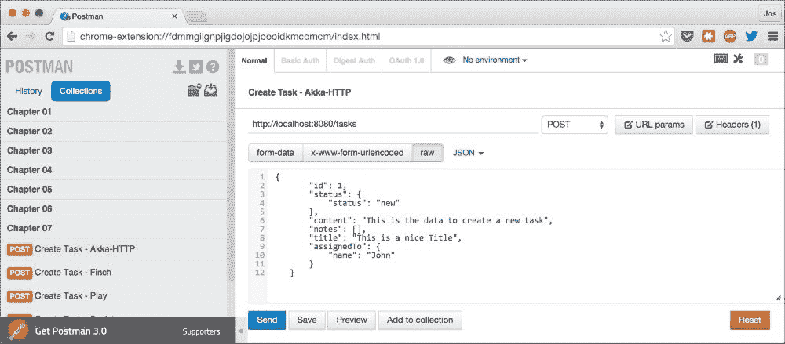

# 第七章 JSON、HATEOAS 和文档

在最后一章中，我们将更深入地探讨 REST 的一些重要部分。我们将从对可用的不同 JSON 库的更深入解释开始，然后我们将探索 HATEOAS 概念，并解释您如何将这一原则应用于本书中解释的框架。

让我们从 JSON 开始。

# 工作与 JSON

对于 Scala，有许多不同的 JSON 框架可供选择。在本章中，我们将探讨四个最重要和最常用的框架。以下表格简要介绍了我们将使用的框架：

| 框架 | 描述 |
| --- | --- |
| Argonaut | Argonaut 是一个功能丰富的 JSON 库，它提供了以函数式方法处理 JSON 的方法。它具有非常广泛的 JSON 遍历和搜索功能。您可以在[`argonaut.io`](http://argonaut.io)了解更多信息。 |
| Json4s | Json4s 是一个提供标准方式解析和渲染 JSON 的库。它在上面的库（如 lift-json 和 Jackson）之上提供了一个标准化的接口。您可以在[`json4s.org/`](http://json4s.org/)了解更多信息。 |
| Play JSON | Play JSON 为 Play 2 框架提供了 JSON 支持。然而，这个库也可以独立使用，并提供了一种非常易于使用的方式来处理 JSON。您可以在[`www.playframework.com/documentation/2.4.x/ScalaJson`](https://www.playframework.com/documentation/2.4.x/ScalaJson)了解更多信息。 |
| spray-json | spray-json 是一个轻量级的 JSON 框架，它提供了一些处理 JSON 的基本功能。它是 Spray 框架的一部分，但也可以独立使用。您可以在[`github.com/spray/spray-json`](https://github.com/spray/spray-json)了解更多信息。 |

对于每个框架，我们将探讨如何完成以下步骤：

+   **从字符串解析为 JSON 对象**：这一步的输入是一个字符串。我们将向您展示如何使用 JSON 框架将这个字符串转换为 JSON 对象。

+   **将 JSON 对象输出为字符串**：当您拥有一个 JSON 对象时，一个常见的需求是将它打印为字符串。所有框架都提供了对这个功能的支持。

+   **手动创建 JSON 对象**：有时，您可能需要手动创建一个 JSON 对象（例如，在序列化复杂对象的一部分时）。在这个步骤中，我们将解释如何做到这一点。

+   **查询 JSON 对象**：在将字符串转换为 JSON 对象后，一个常见的需求是从 JSON 字符串中获取特定值。在这个步骤中，我们将向您展示支持这一功能的多种方式。

+   **将数据转换为和从 case 类**：在前面的章节中，我们已经看到了如何将 case 类转换为 JSON 以及从 JSON 转换为 case 类。所有框架都提供了对这个功能的具体支持，我们将在这一步中探讨它是如何工作的。

在我们查看代码之前，我们首先必须确保我们拥有所有必需的库。每个 JSON 库都可以通过添加单个 SBT 依赖项来添加。以下依赖项集添加了所有库：

```java
  val backendDeps = Seq (
    "io.argonaut" %% "argonaut" % "6.0.4",
    "org.json4s" %% "json4s-native" % "3.2.10",
    "io.spray" %%  "spray-json" % "1.3.2",
    "com.typesafe.play" %% "play-json" % "2.4.0"
  )
```

我们为每个框架解释的第一个步骤是如何将字符串转换为 JSON 对象。对于每个框架，我们将使用以下输入字符串：

```java
  val json = """{
    "id": 1,
    "title": "The Title",
    "content": "This is the data to create a new task",
    "assignedTo": {
      "name": "pietje"
    },
    "notes": [],
    "status": {
      "status": "New"
    }
  }"""
```

您还可以直接从各种库中运行代码。您可以在`chapter7`文件夹中找到源代码，并通过运行 SBT 来运行示例。从 SBT 运行以下命令：

```java
> chapter07/run-main chapter7.json.PlayJson
> chapter07/run-main chapter7.json.Argonaut
> chapter07/run-main chapter7.json.Json4S
> chapter07/run-main chapter7.json. SprayJson

```

现在，让我们看看第一个 JSON 库，Json4s。

## 使用 Json4s

首先，我们将展示如何解析我们刚才看到的字符串值：

```java
  val parsedJson = parse(json);
```

您所需要做的就是调用字符串上的`parse`函数，结果是一个`JValue`对象。如果字符串无法解析，将抛出`ParseException`。打印的结果看起来类似于以下内容：

```java
JObject(List((id,JInt(1)), (title,JString(The Title)), (content,JString(This is the data to create a new task)), (assignedTo,JObject(List((name,JString(pietje))))), (notes,JArray(List())), (status,JObject(List((status,JString(New)))))))
```

如您所见，字符串被解析为一系列 Json4s 特定的类。现在我们已经得到了一个`JValue`对象，我们也可以将其再次转换为字符串：

```java
  pretty(render(parsedJson)); // or compact
```

通过调用`pretty(render(parsedJson))`，您将得到一个`pretty`打印的字符串值。如果您想要一个紧凑的字符串，您可以调用`compact(render(parsedJson))`代替。`pretty`函数的结果如下所示：

```java
{
  "id":1,
  "title":"The Title",
  "content":"This is the data to create a new task",
  "assignedTo":{
    "name":"pietje"
  },
  "notes":[],
  "status":{
    "status":"New"
  }
}
```

下一步是手动创建一个 JSON 对象（一个`JValue`对象）。Json4s 提供了一个非常方便的方式来做到这一点：

```java
val notesList = SeqNote, Note(2, "Note 2"))
  val jsonManually =
    ("id" -> 1) ~
    ("title" -> "title") ~
    ("content" -> "the content") ~
    ("assignedTo" ->
      ("name" -> "pietje")) ~
    ("notes" ->
      notesList.map { note =>
            (("id" -> note.id) ~
             ("content" -> note.content))}) ~
    ("status" ->
      ("status" -> "new"))
```

如您所见，您只需指定键并提供一个值；Json4s 将自动创建相应的 JSON 对象。当我们打印它时，这次使用`compact`函数，我们将看到以下内容：

```java
{"id":1,"title":"title","content":"the content","assignedTo":{"name":"pietje"},"notes":[{"id":1,"content":"Note 1"},{"id":2,"content":"Note 2"}],"status":{"status":"new"}}
```

要查询 JSON 对象，Json4s 提供了两种方法。您可以使用类似于 XPath 的表达式，就像我们在以下代码片段中所做的那样，或者您可以使用一个理解（更多关于这个的信息可以在 Json4s 网站上找到）：

```java
  println(jsonManually \\ "content") // all the content
  println(jsonManually \ "assignedTo" \ "name") // single name

  // allows unboxing

  println(jsonManually \\ "id" \\ classOf[JInt])
```

在这个代码片段中，我们使用`\`和`\\`运算符来遍历 JSON 对象。使用`\`运算符，我们可以选择单个节点，而使用`\\`运算符，我们可以遍历所有子节点。上一个`println`语句的结果如下：

```java
JObject(List((content,JString(the content)), (content,JString(Note 1)), (content,JString(Note 2))))
JString(pietje)
List(1, 1, 2)
```

除了这些运算符之外，Json4s 还提供了一些函数来遍历 JSON 对象。您可以通过查看`MonadicJValue`类来查看可用的函数。我们接下来要查看的最后一个功能是如何将 case 类转换为 JSON 以及从 JSON 转换回来。如果我们已经有了 Json4s JSON 对象，我们可以使用 extract 函数：

```java
  implicit val formats = DefaultFormats
  val task = jsonManually.extract[Task]
```

这的结果是一个`Task`实例。您也可以直接将其序列化为字符串值：

```java
  import org.json4s.native.Serialization
  import org.json4s.native.Serialization.{read, write}
  implicit val autoFormat = Serialization.formats(NoTypeHints)

  val taskAsJson: String = write(task)
  val backToTask: Task = readTask
}
```

使用 Json4s 非常简单。它提供了易于创建、查询和序列化 JSON 的核心功能。接下来是 Argonaut。

## 使用 Argonaut

Argonaut 采用更函数式的方法来创建和解析 JSON，您将在以下示例中看到。我们再次开始，将一个字符串对象转换为 JSON 对象：

```java
 val parsed = json.parse // returns a scalaz disjunction
 val parsedValue = parsed | jString("Error parsing")
```

Argonaut 通过一个 `parse` 函数扩展了字符串对象。这个函数的结果是一个 `\/` 实例：

```java
\/-({"id":1,"status":{"status":"New"},"content":"This is the data to create a new task","notes":[],"title":"The Title","assignedTo":{"name":"pietje"}})
```

这与 `Either` 对象类似，但 `Either` 对象不是偏向右侧或左侧的，而 `\/` 实例是偏向右侧的（这意味着你还可以轻松地在 `for` 语句中使用它）。要从 `\/` 实例中获取值，我们使用 `|` 操作符。

一旦我们有了 JSON 值，我们就可以轻松地将其转换为字符串：

```java
  println(parsedValue.spaces4)
```

这将产生以下输出：

```java
{
    "id" : 1,
    "status" : {
        "status" : "New"
    },
    "content" : "This is the data to create a new task",
    "notes" : [

    ],
    "title" : "The Title",
    "assignedTo" : {
        "name" : "pietje"
    }
}
```

对于更紧凑的输出，你也可以使用 `spaces2` 或 `nospaces`。Argonout 还提供了一种灵活的方式来手动创建 JSON 对象：

```java
  val notesList = ListNote, Note(2, "Note 2"))
  val jsonObjectBuilderWithCodec: Json =
      ("status" := Json("status" := "New")) ->:
      ("notes" := notesList.map(
                  note => Json("id" := note.id, 
                               "content" := note.content)) ) ->:
      ("assignedTo" := Json("name" := "Someone")) ->:
      ("content" := "This is the content") ->:
      ("title" := "The Title") ->:
      ("id" := 1) ->: jEmptyObject
```

Argonaut 提供了一些操作符，你可以使用它们来构建 JSON 对象：

| 操作符 | 描述 |
| --- | --- |
| `->:` | 如果设置了，这个操作符会将给定的值添加到 JSON 对象中。 |
| `->?` | 如果设置了，这个操作符会将给定的可选值添加到 JSON 对象中。 |
| `-->>:` | 这个操作符会将给定的值添加到 JSON 数组中。 |
| `-->>:?` | 如果设置了，这个操作符会将给定的可选值添加到 JSON 数组中。 |

在 Argonaut 网站上，还可以找到创建 JSON 对象的几种替代方法。

使用 Argonaut 查询对象也可以有几种不同的方式。在我们的例子中，我们将使用透镜进行查询：

```java
val innerKey2StringLens = jObjectPL >=>   
    jsonObjectPL("notes") >=>          
      jArrayPL >=>                      
      jsonArrayPL(0) >=>            
        jObjectPL >=>              
        jsonObjectPL("id") >=>         
          jStringPL
```

使用这段代码，我们定义了一个匹配 JSON 对象中特定元素的透镜。我们始终从一个 `jObjectPL` 函数开始，它选择 JSON 对象的根节点。接下来，我们使用 `jsonObjectPL("notes")` 函数来选择 `"notes"` 键的值。通过使用 `jArrayPL`，我们将该值转换为数组，并使用 `jsonArrayPL(0)` 来选择数组的第一个元素。最后，我们再次使用 `JObjectPL` 来将其转换为对象，然后查询 `"id"` 键，并将其最终转换为字符串。现在我们有了透镜，我们可以在特定的 JSON 对象上使用它来提取值（作为一个 `Option[String]` 实例）：

```java
val res = innerKey2StringLens.get(jsonObjectBuilderWithCodec))
```

当然，Argonaut 也支持将数据转换为和从案例类中转换。我们首先必须定义一个编解码器。编解码器定义了案例类如何映射到 JSON 对象的键：

```java
object Encodings {

    implicit def StatusCodecJson: CodecJson[Status] =
      casecodec1(Status.apply, Status.unapply)("status")
    implicit def NoteCodecJson: CodecJson[Note] =
      casecodec2(Note.apply, Note.unapply)("id", "content")
    implicit def PersonCodecJson: CodecJson[Person] =
      casecodec1(Person.apply, Person.unapply)("name")
    implicit def TaskCodecJson: CodecJson[Task] =
      casecodec6(Task.apply, Task.unapply)("id", "title", 
                    "content", "assignedTo", "notes", "status")
  }

  import Encodings._
```

注意，我们使编解码器成为隐式的。这样，当 Argonaut 需要将字符串转换为案例类或反向转换时，它会自动找到它们：

```java
  val task = new Task(
    1, "This is the title", "This is the content",
    Some(Person("Me")),
    ListNote, Note(2, "Note 2")), Status("new"))

  val taskAsJson: Json = task.asJson

  val taskBackAgain: Task =
               Parse.decodeOptionTask
```

当你为特定的案例类定义了编解码器后，只需调用 `asJson` 函数即可将案例类转换为 `Json` 对象。要将 JSON 字符串转换为案例类，我们可以使用 `Parse.decodeOption` 函数（如果想要其他包装器而不是 `Option`，Argonaut 还提供了 `decodeEither` 函数、`decodeValidation` 和 `decodeOr`）。

在 Akka HTTP 的章节中，我们已经提到，为了支持 JSON，我们使用 spray-json 库。在接下来的部分，我们将更深入地探讨这个库。

## 使用 spray-json

spray-json 提供了一种非常简单的方式来处理 JSON 字符串。要将字符串解析为 JSON 对象，只需在字符串值上调用 `parseJson` 即可。

```java
  import spray.json._

  val parsed = json.parseJson
```

当打印时，结果看起来类似于这个：

```java
{"id":1,"status":{"status":"New"},"content":"This is the data to create a new task","notes":[],"title":"The Title","assignedTo":{"name":"pietje"}}
```

当然，我们也可以通过使用`prettyPrint`或`compactPrint`函数将 JSON 对象转换回字符串：

```java
println(parsed.prettyPrint) // or .compactPrint
```

`prettyPrint`的结果看起来类似于这个：

```java
{
  "id": 1,
  "status": {
    "status": "New"
  },
  "content": "This is the data to create a new task",
  "notes": [],
  "title": "The Title",
  "assignedTo": {
    "name": "pietje"
  }
}
```

当您想手动创建一个 JSON 对象时，spray-json 为您提供了许多基本类，您可以使用这些类来完成这个任务（`JsObject`、`JsString`、`JsNumber`和`JsArray`）：

```java
val notesList = SeqNote, Note(2, "Note 2"))
  val manually = JsObject(
    "id" -> JsNumber(1),
    "title" -> JsString("title"),
    "content" -> JsString("the content"),
    "assignedTo" -> JsObject("name" -> JsString("person")),
    "notes" -> JsArray(
      notesList.map({ note =>
        JsObject(
        "id" -> JsNumber(note.id),
        "content" -> JsString(note.content)
        )
      }).toVector),
   "status" -> JsObject("status" -> JsString("new"))
  )
```

结果几乎与我们在本节第一例中看到的是同一个对象：

```java
{"id":1,"status":{"status":"new"},"content":"the content","notes":[{"id":1,"content":"Note 1"},{"id":2,"content":"Note 2"}],"title":"title","assignedTo":{"name":"person"}}
```

我们接下来要查看的下一步是如何查询一个 JSON 对象以获取特定的字段。这是 spray-json 没有提供特定函数或操作符的事情。访问特定字段或值的唯一方法是通过使用`getFields`或`fields`函数：

```java
println(manually.getFields("id"));
println(manually.fields)
```

`getFields`函数返回一个包含当前对象上所有匹配此名称的字段的`Vector`对象。字段函数返回所有字段的`Map`对象。

我们在每个框架中最后要查看的功能是如何使用它将 case 类转换为 JSON 以及再次转换回来。在 Akka HTTP 章节中，我们已经向您展示了如何使用 spray-json 来完成这个操作：

```java
val task = new Task(
    1, "This is the title", "This is the content", 
    Some(Person("Me")),
    ListNote, Note(2, "Note 2")), Status("new"))

  object MyJsonProtocol extends DefaultJsonProtocol {
    implicit val noteFormat = jsonFormat2(Note)
    implicit val personFormat = jsonFormat1(Person)
    implicit val statusFormat = jsonFormat1(Status)
    implicit val taskFormat = jsonFormat6(Task)
  }

  import MyJsonProtocol._
  val taskAsString = task.toJson

  // and back to a task again
  val backToTask = taskAsString.convertTo[Task]
```

我们所做的是扩展`DefaultJsonProtocol`并为我们的每个 case 类定义它们应该如何通过 JSON 进行映射。spray-json 为我们提供了一个非常方便的辅助函数，称为`jsonFormat#(object)`，其中`#`对应于 case 类的参数数量。使用这个函数，我们可以为我们的 case 类定义默认的序列化，就像我们在前面的例子中所做的那样。要使用这些隐式转换，我们只需要将它们引入作用域，然后我们就可以在我们的 case 类上使用`toJson`函数将它们序列化为`Json`，并使用`convertTo`将 JSON 转换回我们的 case 类。

## 使用 Play JSON

最后一个 JSON 库也是我们在前面的章节中提到过的——Play JSON。正如您将在代码中看到的那样，这个库的工作方式与 spray-json 库非常相似。让我们首先看看如何将字符串转换为 JSON 对象：

```java
import play.api.libs.json._
import play.api.libs.functional.syntax._

val fromJson = Json.parse(json)
```

非常简单，只需调用`parse`函数并提供 JSON，结果就是以下 JSON 对象（当打印时）：

```java
{"id":1,"title":"The Title","content":"This is the data to create a new task","assignedTo":{"name":"pietje"},"notes":[],"status":{"status":"New"}}
```

要将 JSON 对象转换为字符串，我们可以直接在 JSON 对象上调用`stringify`函数，或者使用`Json.prettyPrint`函数：

```java
println(Json.prettyPrint(fromJson))
```

`prettyPrint`函数返回以下结果：

```java
{
  "id" : 1,
  "title" : "The Title",
  "content" : "This is the data to create a new task",
  "assignedTo" : {
    "name" : "pietje"
  },
  "notes" : [ ],
  "status" : {
    "status" : "New"
  }
}
```

到目前为止没有什么特别的。创建 JSON 对象的手动方式也是如此。就像 spray-json 一样，Play JSON 为您提供了一个可以用来创建 JSON 对象的基类集合（`JsObject`、`JsNumber`、`JsString`、`JsObject`和`JsArray`）：

```java
// 3\. Create JSON object by hand.
val notesList = SeqNote, Note(2, "Note 2"))
val manually = JsObject(Seq(
  "id" -> JsNumber(1),
  "title" -> JsString("title"),
  "content" -> JsString("the content"),
  "assignedTo" -> JsObject(Seq("name" -> JsString("person"))),
  "notes" -> JsArray(
    notesList.map({ note =>
      JsObject(Seq(
        "id" -> JsNumber(note.id),
        "content" -> JsString(note.content)
      ))
    })),
  "status" -> JsObject(Seq("status" -> JsString("new")))
))
```

现在，让我们转向查询。这是 Play JSON 为我们提供了一些非常实用的操作符的地方：

```java
println(manually \\ "content")
println(manually \ "assignedTo" \ "name")
println((manually \\ "id" )(2))
```

使用`\\`运算符，我们查找完整树中匹配的字段，并将其作为`List`对象返回，而使用单个`\`运算符，我们查找当前对象中的字段。这使得这些运算符非常易于使用，因为你可以从之前的代码片段中看到，这些运算符可以轻松嵌套。当我们查看输出时，我们看到以下内容：

```java
List("the content", "Note 1", "Note 2")
JsDefined("person")
2
```

使用这个库将案例类转换为 JSON 以及从 JSON 转换回来也非常直接。我们首先定义一组隐式转换，只需调用`Json.format[T]`即可：

```java
object Formats {
  implicit val noteFormat = Json.format[Note]
  implicit val statusFormat = Json.format[Status]
  implicit val personFormat = Json.format[Person]
  implicit val taskFormat = Json.format[Task]
}
```

定义了这些隐式转换之后，我们可以使用`toJson`和`fromJson[T]`函数将我们的案例类转换为 JSON，并从 JSON 转换回来：

```java
import Formats._

val task = new Task(
  1, "This is the title", "This is the content", Some(Person("Me")),
  ListNote, Note(2, "Note 2")), Status("new"))

val toJson = Json.toJson(task)
val andBackAgain = Json.fromJsonTask
```

在我们继续下一个主题之前，让我们快速回顾一下这些框架。

## JSON 框架概述

那么，哪个 JSON 框架是最好的呢？当然，一般的回答是这取决于。所有框架都有它们的优缺点。如果我真的必须做出选择，我会说对于简单的 JSON 需求，Json4s 是一个非常好的选择。它提供了一种非常简单的方法从头创建 JSON 对象，有直观的数据查询方式，并允许你轻松地将数据转换为案例类。如果你有更复杂的需求，Argonaut 是一个非常有意思的选择。它提供了一种非常功能化的 JSON 处理方式，并为创建新的 JSON 对象和查询现有的 JSON 对象提供了一些有趣的功能。

# HATEOAS

在第一章中，我们探讨了 RESTful 服务的定义。该定义的一部分是，REST 服务应该使用 HATEOAS，即“作为应用状态引擎的超文本”的缩写。这意味着要真正实现 RESTful，我们的服务不仅需要提供比资源 JSON 表示更多的信息，还应该提供有关应用程序状态的信息。当我们谈论 HATEOAS 时，我们必须处理以下两个主要原则：

+   **超媒体/mime 类型/媒体类型/内容类型**：资源的超媒体描述了资源当前的状态。你可以将其视为一种合同，描述了我们正在处理的资源。因此，我们不是将资源的类型设置为`application/json`，而是定义一个自定义的内容类型，如`application/vnd.restwithscala.task+json`。

+   **链接**：HATEOAS 的第二部分是，资源表示需要包含指向资源其他状态和在该资源上可以执行的操作的链接。

例如，以下代码通过`self`链接提供有关当前响应的信息，并使用媒体类型来指示从这些链接可以期待什么：

```java
{
  "_links" : [ {
    "rel" : "self",
    "href" : "/tasks/123",
    "media-type" : "application/vnd.restwithscala.task+json"
  }, {
    "rel" : "add",
    "href" : "/project/123/note",
    "media-type" : "application/vnd.restwithscala.note+json"
  } ],
  "id" : 1,
  "title" : "This is the title",
  "content" : "This is the content",
  "assignedTo" : {
    "name" : "Me"
  },
  "notes" : [ {
    "id" : 1,
    "content" : "Note 1"
  }, {
    "id" : 2,
    "content" : "Note 2"
  } ],
  "status" : {
    "status" : "new"
  }
}
```

由于媒体类型是资源的一个重要部分，我们不仅需要能够在响应上设置媒体类型，还需要根据传入的媒体类型进行过滤，因为特定端点的不同媒体类型可以有不同的含义。

## 处理媒体类型

现在，让我们回顾一下本书中讨论的框架，看看它们是如何处理媒体类型的。当然，您可以从本书提供的代码中运行所有这些示例。您可以使用以下命令来启动各种服务器：

```java
sbt runCH07-Finch
sbt runCH07-Unfiltered
sbt runCH07-Scalatra
sbt runCH07-akkahttp
sbt runCH07-play

```

我们还提供了一些 Postman 请求，您可以使用这些请求来测试媒体处理是否正常工作。您可以在**第七章**集合中找到这些请求：



我们将要探索的第一个框架是 Finch。

### 使用 Finch 处理媒体类型

要处理 Finch 的媒体类型，我们将创建一个过滤器。这个过滤器以及将一切粘合在一起的代码如下所示：

```java
  val MediaType = "application/vnd.restwithscala.task+json"
  val filter = new SimpleFilter[HttpRequest, HttpResponse] {
    def apply(req: HttpRequest, 
              service: Service[Request, HttpResponse])
                                        : Future[HttpResponse] = {
      req.contentType match {
        case Some(MediaType) => service.apply(req).map({ resp =>
          resp.setContentType(MediaType, "UTF-8")
          resp
        })
        case Some(_) => Future
          {BadRequest(s"Media type not understood, use $MediaType")}
        case None => Future
          {BadRequest(s"Media type not present, use $MediaType")}
      }
    }
  }

  val matchTaskFilter: Matcher = "tasksFilter"
  val createTask = CreateNewTask()
  val createNewTaskFilter = filter andThen createTask

  val taskCreateAPI =
     Post / matchTaskFilter /> createNewTaskFilter
```

您可以通过扩展 `SimpleFilter` 类来创建一个过滤器。这个过滤器提供了对传入的 `HttpRequest` 实例和传出的 `HttpResponse` 实例的访问。在这个过滤器中，我们检查媒体类型是否正确，如果是这样，我们处理请求。如果不正确，我们返回一个 `BadRequest` 响应。为了给客户端一个关于他们正在处理的响应类型的指示，我们还设置了响应对象上的媒体类型。在定义了过滤器之后，我们创建我们的路由并调用 `createNewTaskFilter` 实例，它首先调用 `filter` 实例，然后调用 `createTask` 服务。现在每当收到正确媒体类型的请求时，它都会以正确的方式进行处理。

### 使用 Unfiltered 处理媒体类型

在 Unfiltered 中对媒体类型进行过滤非常容易。我们使用一些基本的 Scala 模式匹配来检查特定路径上的 `POST` 是否包含正确的媒体类型：

```java
val MediaType = "application/vnd.restwithscala.task+json"

case req @ Path("/tasks") => (req, req) match {
  case (req @ POST(_), (RequestContentType(MediaType))) => handleCreateTask(req).map(Ok ~> ResponseHeader("content-type",
                              Set(MediaType)) ~> ResponseString(_))
```

如您所见，我们所做的只是匹配两个请求属性，即动词（`POST`）和请求的内容类型；当它们匹配时，我们处理请求，并在响应上设置正确的头信息。

### 使用 Scalatra 处理媒体类型

在框架列表中接下来要讨论的是 Scalatra。正如我们在讨论 Scalatra 时所看到的，它提供了一种定义特定路径的 `before` 函数和 `after` 函数的方法。我们使用这个功能在 `before` 函数中检查媒体类型是否匹配，并在 `after` 函数中更新内容类型：

```java
before("/tasks") {
    (request.getMethod, request.contentType) match {
      case ("POST", Some(MediaType)) => // do nothing
      case ("POST", _) => halt(status = 400, reason = "Unsupported Mimetype")
      case (_,_) => // do nothing since it isn't a post
    }
  }

  after("/task") {
    request.getMethod match {
      case "POST" => response.setContentType(MediaType)
      case _ => // do nothing since it isn't a post
    }    
  }
```

如您所见，我们使用模式匹配来匹配特定的动词和内容类型。这意味着如果我们有一个 `POST` 动词和正确的内容类型，我们将执行请求。如果动词匹配但内容类型不匹配，我们返回一个错误请求，如果动词不匹配，我们则正常处理它。

### 使用 Akka HTTP 处理媒体类型

使用 Akka HTTP 的媒体类型需要做更多的工作。原因是 Akka HTTP 会从头部提取内容类型并将其添加到实体中。这意味着我们必须检查实体中是否存在特定的内容类型，而不仅仅是检查头部。我们首先定义我们正在寻找的内容类型，以及一个函数，我们可以使用它来转换响应对象并在响应上设置正确的类型：

```java
  val CustomContentType = 
  MediaType.custom("application/vnd.restwithscala.task+json",
                    Encoding.Fixed(HttpCharsets.`UTF-8`))

  def mapEntity(entity: ResponseEntity): ResponseEntity = entity match {
    case HttpEntity.Strict(contentType, data) =>
      HttpEntity.Strict(CustomContentType, data)
    case _ => throw new IllegalStateException(
       "Unexpected entity type")
  }
```

如您所见，`mapEntity`函数接受一个`ResponseEntity`实例作为其参数，并返回一个新的具有正确内容类型的实例。在下一个代码片段中，我们将展示如何检查传入请求的正确内容类型并使用先前定义的函数设置响应：

```java
            post {
                (entity(as[String]) & (extractRequest)) { 
                  (ent, request) =>
                request.entity.contentType() match {
                  case ContentType(MediaType(
                      "application/vnd.restwithscala.task+json")
                      , _) =>
                    mapRequest({ req => req.copy(entity = 
                      HttpEntity.apply(MediaTypes.`application/json`,
                      ent)) }) {
                      (entity(as[Task])) {
                        task => {
                          mapResponseEntity(mapEntity) {
                            complete {
                              TaskService.insert(task)
                            }
                          }
                        }
                      }
                    }
                  case _ => complete(StatusCodes.BadRequest,
                                     "Unsupported mediatype")
                }
            }
          }
```

这里发生了很多事情，所以让我们看看我们在这里使用的指令以及为什么：

1.  首先，我们使用`entity`和`extractRequest`指令提取请求和请求的实体（主体和内容类型）。

1.  接下来，我们匹配实体的`request.entity.contentType`属性，如果匹配，我们创建一个新的实体，其内容类型为`application/json`。我们这样做是为了确保 Akka HTTP 的标准 JSON 到案例类的映射仍然有效。

1.  接下来，我们将实体转换为`Task`实例，调用服务，并创建响应。

1.  在响应返回之前，会调用`mapResponseEntity`函数，该函数将内容类型设置为我们的原始值。

注意，除了使用指令的方法之外，我们还可以重新定义所需的隐式转换，以便 JSON 转换可以与我们的自定义内容类型一起工作。

### 使用 Play 2 处理媒体类型

要在 Play 2 中实现自定义媒体类型，我们将使用`ActionBuilder`方法。使用`ActionBuilder`方法，我们可以改变调用动作的方式。以下代码显示了此示例的`ActionBuilder`方法：

```java
object MediaTypeAction extends ActionBuilder[Request] {

  val MediaType = "application/vnd.restwithscala.task+json"

  def invokeBlockA => Future[Result]) = {
    request.headers.get("Content-Type") match  {
      case Some(MediaType) => {
          block(request)
      }
      case _ => Future{BadRequest("Unsupported mimetype")}
    }
  }
}
```

在这里，我们定义了一种新的动作类型，称为`MediaTypeAction`。当我们使用此动作而不是正常的`Action`类时，首先检查传入消息的内容类型；如果匹配，则处理请求；如果不匹配，则忽略请求并生成`BadRequest`响应。

我们可以使用这种新的`MediaTypeAction`以以下方式：

```java
  def createTask = MediaTypeAction.async((parse.tolerantJson)) { request =>

    val body = request.body.validate[Task]

    // option defines whether we have a JSON body or not.
    body match {
        case JsSuccess(task, _) => TaskService.insert(task).map(
           b => Ok(Json.toJson(b)).as(MediaTypeAction.MediaType))
        case JsError(errors) => Future{BadRequest(errors.mkString("\n"))}
    }
  }
```

如您所见，我们只是用`MediaTypeAction`替换了`Action`，就是这样。当这个动作被调用时，首先执行`MediaTypeAction`中的代码，然后提供代码给`Action`。为了正确地将传入数据转换为 JSON 对象，我们需要对我们处理 JSON 的方式做一些小的修改。我们使用显式的主体解析器（`parse.tolerantJson`）来解析传入的 JSON。使用这个函数，我们不检查提供的内容类型是否为`application/json`，只是转换主体。

在本节的开始部分，我们解释了 HATEOAS 的两个重要部分：媒体类型处理和支持链接。在下一节中，我们将展示一种你可以轻松地向你的案例类添加链接的方法。

## 使用链接

对于链接，我们将在我们的模型中创建一个非常简单的扩展。我们不仅将序列化的案例类发送到 JSON，还在其中添加了一个`_links`对象。这个对象可以包含不同的链接。例如，它不仅可以定义对资源的链接，还可以包含可以在此资源上执行的操作的链接。我们最终希望得到的 JSON 看起来类似于以下内容：

```java
{
  "_links" : [ {
    "rel" : "self",
    "href" : "/tasks/123",
    "media-type" : "application/vnd.restwithscala.task+json"
  } ],
  "id" : 1,
  "title" : "This is the title",
  "content" : "This is the content",
  "assignedTo" : {
    "name" : "Me"
  },
  "notes" : [ {
    "id" : 1,
    "content" : "Note 1"
  }, {
    "id" : 2,
    "content" : "Note 2"
  } ],
  "status" : {
    "status" : "new"
  }
}
```

作为示例，我们将使用 Play JSON，但基本上可以以本章探索的其他 JSON 库中使用相同的方法。我们首先做的是定义链接的外观。为此，我们定义了一个特性和一个案例类：

```java
import org.restwithscala.common.model.{Note, Person, Status, Task}
import play.api.libs.json._
import play.api.libs.functional.syntax._

object PlayJsonLinks extends App {

  trait HasLinks {
    val links: List[Links]
  }

  case class Links(rel: String, href: String, `media-type`: String)
```

当我们创建一个新的`Task`时，我们可以从这个特质扩展以添加链接。正如我们之前解释的，Play JSON 使用隐式值来确定如何将特定类序列化为 JSON。对于这个场景，我们定义以下隐式值：

```java
  trait LowPriorityWritesInstances {

    // use standard writes for the case classes
    implicit val statusWrites = Json.writes[Status]
    implicit val noteWrites = Json.writes[Note]
    implicit val personWrites = Json.writes[Person]
    implicit val taskWrites = Json.writes[Task]
    implicit val linkWrites = Json.writes[Links]

    // and a custom one for the trait
    implicit object hiPriorityWrites extends OWrites[HasLinks] {
      def writes(hi: HasLinks) = Json.obj("_links" -> hi.links)
    }
  }

  /**
   * The write instance which we include
   */
  object WritesInstances extends LowPriorityWritesInstances {
  implicit val taskWithLinksWrites = new Writes[Task with HasLinks] {
      def writes(o: Task with HasLinks) = {
        (implicitly[OWrites[HasLinks]].writes(o)) ++ 
                    taskWrites.writes(o).as[JsObject]
      }
    }
  }
```

这里发生的事情是，我们定义了我们模型各个部分的标准化隐式值，包括我们新的`HasLinks`特质。除此之外，我们还定义了一个非常具体的隐式值，用于匹配扩展了`HasLinks`特质的`Tasks`。因此，当我们对一个扩展了`HasLinks`的`Task`调用`toJson`函数时，`taskWithLinksWrites`将匹配。在`writes`函数中，我们首先转换`Links`对象，并将其与转换后的`Task`组合。

要使用这个功能，我们只需要定义一个新的`Task`并使用`HasLinks`来添加我们拥有的任何链接：

```java
val task = new Task(
    1, "This is the title", "This is the content", 
    Some(Person("Me")), ListNote, 
       Note(2, "Note 2")), Status("new")) with HasLinks {
         val links = 
             List(Links("self",
                        "/tasks/123",        
                        "application/vnd.restwithscala.task+json"))
  }

  // import the implicit convertors
  import WritesInstances._

  println(Json.prettyPrint(Json.toJson(task)))
}
```

现在，在导入正确的隐式值之后，我们可以将带有`HasLinks`的`Task`转换为 JSON，就像我们转换其他对象一样。

# 摘要

在这一章的最后，我们探讨了 REST 的一些重要方面。我们探讨了可以在您的 REST 服务中使用的各种 JSON 库，用于将对象转换为 JSON 以及从 JSON 转换。除此之外，我们还探讨了 REST 的一个非常重要的方面，即 HATEOAS。HATEOAS 最重要的方面是检测和过滤媒体类型（内容类型）以及向资源添加链接以创建自描述 API 的能力。我们看到了如何在本书讨论的框架中检测和处理媒体类型，以及如何使用本章探索的 JSON 框架之一添加链接。

在本节中，我们讨论了向 JSON 响应添加链接，这标志着本书的结束。在各个章节中，我们探讨了 Scala 生态系统中的多个 REST 框架的最重要功能。

在前面的章节中，我们试图向您展示这些框架的最重要功能，并解释如何使用这些功能来创建可扩展的、异步的和可维护的 REST 服务。请记住，这些框架中的每一个都有比我们在这本书中能探索的更多功能。

我希望你在阅读这本书并尝试示例时玩得开心。如果你喜欢它们，请随意使用、扩展并分享结果！
