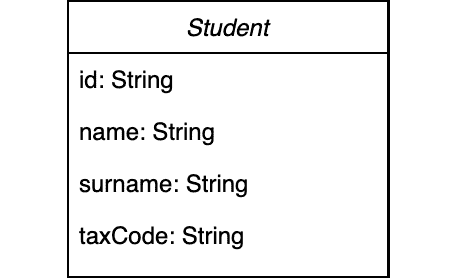
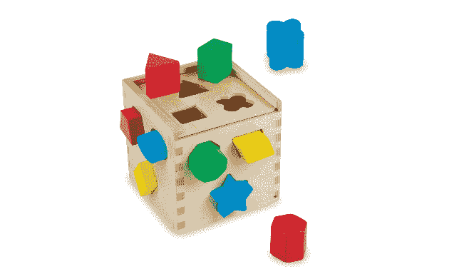
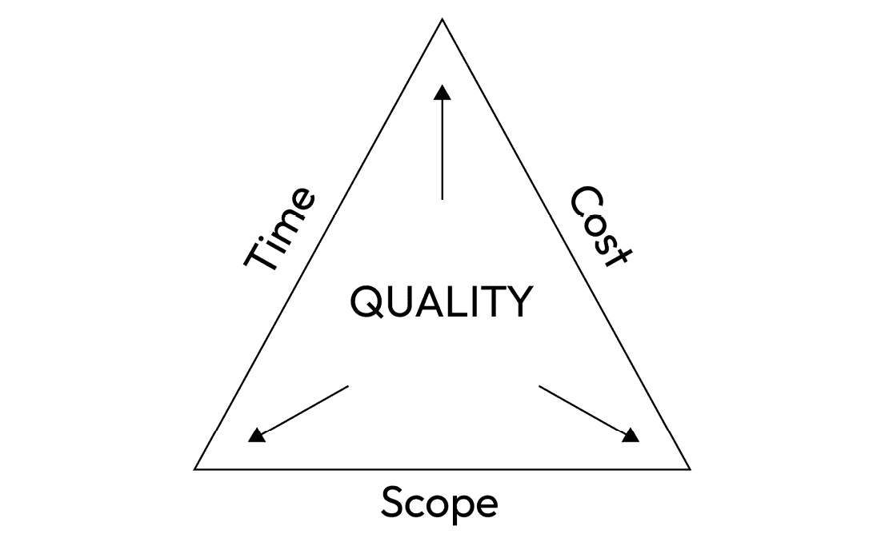

# 2

# 好的编码习惯

在一本关于重构的书里，我认为有必要讨论编写良好的代码。这两个显然紧密相关的方面几乎重叠。缺乏好的代码或稳固的架构是重构的主要原因之一；重构是我们旨在改进方法、类、项目或架构的写作的手段。

为了清楚地了解我们在谈论什么，尝试解释什么是好代码，以及什么是被认为写得不好的代码，这是很重要的。试图定义好代码可能看起来有些过度，因为实际上，它应该——或者应该被视为——某种相当直观的东西。我们应该几乎有*蜘蛛感*，当我们看到难以理解或过于复杂的代码时，会感到刺痛。如果你还没有发展出蜘蛛感，不要担心！它们会随着经验增长（这本书可能有助于你达到那里）。

现在，好的代码通常与*清洁代码*同义，即由罗伯特·C·马丁（我们将在很多地方讨论清洁代码）在同名书中收集的一系列非正式规则。在本章中，我们将尝试从广义上总结清洁代码的含义，其基本原理是什么，以及为什么我们每个人都应该在职业生涯的每一天都努力追求清洁代码。

清洁代码通常与所谓的 SOLID 原则密切相关，计算机科学界在缩写词方面表现出了极大的创造力。但它们也为编写优秀的代码提供了*坚固*（软件开发者喜欢父亲笑话吗？）的基础。

在本章中，我们将涵盖以下主题：

+   什么是好的代码？

+   清洁代码

+   编写 SOLID 代码

+   副作用和可变性

+   坏代码的原因

一个小的免责声明

我并不声称要呈现任何事物的终极真理。我知道我将要写的一些内容可能会引起争议，而且有很多程序员随时准备质疑一切（我说这是好事）。目的是分享我认为每天应该练习的健康习惯，以避免陷入困境，最重要的是，在作为工匠的美丽工艺中找到快乐。

# 好代码的特点

再次，我必须让您失望。我努力寻找一个清晰、精确且被普遍认同的好代码的定义，但很难找到。这是一个高度主观的概念，很大程度上取决于上下文。在网上和教科书中，你可以找到许多略有不同的定义。然而，我坚信有一些基础是我们都可以同意的。我将尝试总结关于好代码的各种解释，并基于我的经验提供一些反馈，仅供参考。

## 好的代码是可读的

显然，这是第一步。非常直观，对吧？嗯，是的，但这正是我经常发现被低估的一个方面。有时我们过于专注于实现最终结果，不惜一切代价交付产品，以至于忘记了接下来会发生什么；我们忘记了——正如之前提到的——代码不仅要对机器说话，而且还要首先对其他程序员说话。而那些其他程序员也是我们未来的自己！快速做事并不是代码缺乏可读性的唯一原因：例如，有时我们可能需要处理性能问题。无论如何，如果你有其他方面要处理，我的小小建议是确保至少在可读性和这些方面之间取得平衡。

要给出可读代码的定义，我们不需要依赖于代码本身。普通语言就足够了。想象一下，此刻你正身处自己的家中，需要组装那些美丽、令人满意、预算低廉的瑞典家具，比如衣柜。而不是我们熟悉的清晰视觉说明，我们发现一段文字如下：

*拿起尺寸为 A x B 的白色木块，我们现在将其称为 L。再拿起一块尺寸为 B x C 的木板，我们将称之为 M。拿起由带有十字形端头的金属棒组成的工具。拿起一个可以插入 L 和 M 孔中的螺丝；它不能太短也不能太长。使用上述工具的十字形端头，顺时针旋转螺丝，使它们不可分割地结合在一起，形成一个单一的局部结构，我们将* *称之为 P。*

这段文字显然是无法理解的。我在写作时遇到了很多困难。不要陷入认为代码与散文语言不同的陷阱。我的意思是，当然，它们是不同的，但在抽象意义上，你应该将它们视为同一件事。想象一下，当你编写代码时，就像在写散文。你应该力求散文写作，以便你的代码尽可能易于阅读。当一段代码即使对不了解项目或只有基本编程技能的人来说也是可读的，那么你就成功了。上一份说明书中的摘录可以重写如下：

*拿起标有“左侧”的木板，并用* *十字螺丝刀* *将其与标有“背面”的木板一起拧紧。*

这段摘录当然可以进一步改进。但起点无疑是可理解的；对我来说是可理解的，对其他人来说也是可理解的，这就是你的代码应该做到的。可读的代码是可以改进和扩展的代码。

## 优秀的代码是可靠的

如果我必须为“可靠”这个词下定义，它让我想起了我的一个朋友，当他们说他们会做某事时，他们会做到，而且只有那件事。不多也不少。所以，将可靠的代码想象成你的朋友，他总是以最好的方式同意帮助你——没有惊喜，就像 Radiohead 曾经唱的那样。我可以给你一个例子，这个不可靠的代码并不遥远，它是我过去遇到的一些事情。例如，想象你有一个在域中代表如下所示的实体：



表 2.1 – 示例实体

`id`和`taxCode`都是 String 类型，在域内是唯一的。这意味着不能有两个学生的`id`或`taxCode`相同。

我还有一个从`Student`接口公开的方法，其编写方式如下：

```java
public String getUniqueIdentifier();
```

显然，这种方法的特征是正确的，因为它没有暴露对象的内部结构。但是，它也可以被命名为`getId()`或`getTaxCode()`，这正是关键所在。在不查看实现的情况下，我们不知道在使用它时会得到`taxCode`还是`id`。当我们实际使用`getUniqueIdentifier()`时，我们会意识到其行为是可变的，并取决于具体的实现。如果我们要在需要特定`taxCode`的支付和发票系统中使用此方法，那么这个方法将是不可靠的。一个可能的解决方案是公开两个单独的 getter 方法，这样我们就可以确切地知道在那个时刻我们正在读取哪些信息。或者，另一个解决方案是公开一个名为`getTaxIdentifier()`的额外方法，它专门返回`taxCode`。这样，你将拥有提供清晰且明确访问每条信息的单独方法，而不暴露内部结构。

## 好的代码不容易被误用

为了轻松解释不可误用的代码的概念，我只需看看我孩子的房间。那里有玩具，有时被称为“蒙台梭利玩具”，涉及将小木块插入一个带有对应正确形状孔的盒子中。如*图 2**.1 所示，不可能将圆柱体放入正方形中，将立方体放入圆中，等等。



图 2.1 – 蒙台梭利玩具的示例

使用方法直观，并提供即时反馈。

我们需要设想以这种方式编写代码和设计组件：我们期望我们的代码执行某些操作，这些操作可能对外部系统或数据库产生影响。不可用的代码可能会引起重大问题——例如，它可能将错误信息写入数据库——或者它可能简单地无法正常工作。当我们提供包括我们的代码、库和设计在内的服务时，我们必须设身处地地考虑那些将集成或使用它们的人。

有几种技术可以使你的代码不易误用，而且确实有关于这个主题的整本书。然而，我想在这里给你提供一些建议，即使不深入研究也能轻松应用。

### 不要过于通用

使你的代码不易误用的一种“技巧”是尽可能避免过于通用的数据类型。像 Integer、String、List 等类型是我们构建程序的基础，并且非常灵活。然而，另一方面，它们有时可能过于通用。让我给你举几个我自己的经验例子：在一个运营在旅游行业的公司中，我们处理一个根据用户搜索返回所有可用航班的业务。由于我们需要表示正在寻求解决方案的成人、儿童和婴儿的数量，我们选择了以下解决方案（为了简单起见，让我们省略对 null 值的处理、可能的默认值初始化等）：

```java
private List<Integer> passengers;
```

因此，例如，如果我们正在为 2 位成人、1 名儿童和 1 名婴儿搜索航班，惯例是将`passengers`作为一个数组进行填充：`[2, 1, 1]`。在我看来，这个选择非常冒险。我们可能会插入比必需的更少的值，例如，只有一个或两个。我们也可以插入更多的值。甚至可以完全省略它们。是的，我们可以引入一些输入验证，但为什么允许输入然后在之后返回错误呢？顺便说一句，如果这是一个库，我就不得不阅读文档来了解如何填充该字段（当然，阅读文档没有错，但它应该是更直观的东西）。相反，将信息划分为更有意义的结构会更为直观：

```java
private Integer adultCount;
private Integer childrenCount;
private Integer infantCount;
```

更清晰，不是吗？

实际上，我们可以更进一步，为我们的需求创建一个专门的架构，这种架构不会导致混淆。就像这样：

```java
public class Passengers {
   private final Integer adultCount;
   private final Integer childrenCount;
   private final Integer infantCount;
   //constructor(s) and getters...
}
```

这将导致拥有一个单一、可理解的字段：

```java
private Passenger passengers;
```

### 使用标准编写良好的代码

使你的代码不易误用的另一种方法是尽可能使用标准。我想到了几个与处理时间相关的例子。如果你需要表示一个日期，选择一个格式，记录你正在使用它，并在整个项目中一致地使用它。我经常看到的事情之一是尝试用 Integer 或甚至 String 来表示时间段或持续时间：

```java
private Integer movieDuration = 150; //movie duration in
                                       minutes
```

从`Duration`类开始，我强烈推荐使用它。它极其灵活，允许你明确地表示时间的长度：

```java
private Duration movieDuration = Duration.of(150,
    ChronoUnit.MINUTES);
```

额外酷的功能：前面的持续时间按照方便的 ISO 标准（ISO-8601）进行序列化，例如`PT2H30M`。

这里的事情很简单：不要重新发明轮子！毕竟，Java 之所以如此普及，也是因为有许多可用的库，所以我建议，当我们解决常见问题时，避免重新创建基本组件，而是依赖语言特性或开源库。我总是问自己的第一件事是：我是第一个遇到这个问题的人吗？答案很少是肯定的。

### 使用单一的数据来源和单一的逻辑来源

最后一条建议：使用单一的数据来源和单一的逻辑来源。我必须承认，单一来源的概念通常很容易解释，但实施起来可能不那么容易。

让我尝试用一个例子来说明我心中的想法。再次想象一下管理一个航班搜索系统。通常，数据可以分为原始数据和派生数据。原始数据基本上是系统无法运行的信息，而派生数据则指的是所有其他信息。在我们的航班搜索示例中，假设我们需要提供其他细节之外的信息，比如从米兰到旧金山的旅行时长。这次旅行包括两段航班：一段从米兰到哥本哈根，另一段从哥本哈根到旧金山。在这个例子中，我们可以将每个单独航班的出发和到达时间视为原始数据。从这些数据中，我们可以推导出旅行的时长以及可能的转机时长。将派生数据作为原始数据管理，例如通过将其存储在数据库中，可能会导致不一致性。尤其是在从大量数据中派生信息——或者当派生过程复杂或涉及某些外部系统时——这种计算的计算成本可能会很高。我建议您谨慎行事，并考虑实施一种称为**延迟计算**的机制。本质上，这种方法涉及仅在需要时计算派生数据，而不是提前计算，并将其保存在缓存中，以便将来可以快速使用。在我们的航班时长示例中，我们会使用航班的出发和到达时间（我们还需要考虑机场位置及其时区）来计算旅行时长，但不会将其存储在数据库中，而最多只存储在短期缓存或类似的东西中。如果我们将其存储在数据库中，实际上，每次航班出发/到达时间改变（在行业术语中，每次有“时间表变更”）时，我们都必须重新计算它，或者我们可能会得到不一致的结果。

正如拥有单一真相来源是一种良好的实践一样，拥有单一逻辑来源也有益。在上面的例子中，例如，我们需要计算从米兰到旧金山的航班时长。虽然这也许不是火箭科学，但也不是一个简单的计算，因为它涉及到不同的时区和所谓的夏令时。这是那些容易被低估的事情之一，而且比你想象的更容易导致生产中的错误（在我写作的时候，有许多航班搜索网站在生产中存在这个错误）。在这种情况下，编写一次函数、彻底测试它，并在整个代码库中一致地使用它是非常有帮助的。这样，我们就不会偏离“不要重复自己”的古老原则（**DRY**）。在这种情况下，你可以在项目中编写一个库、一个服务或只是一个类来处理行程时长，并在需要时使用它。

## 优秀的代码是模块化的

通常，模块化指的是将系统或复杂实体划分为更小、独立的组件或模块的概念。这是一个可以应用于软件之外的原理，并在各个领域和学科中得到应用。让我们考虑一个由单个模块组成的货架单元，这些模块可以轻松组装和拆卸。


图 2.2 – 这种家具由一套相同且可重复使用的模块组成

每个模块都作为一个构建块，您可以根据需要以不同的配置排列它们，以创建不同的货架布局。这种模块化方法允许家具适应不同的空间和不断变化的需求。例如，如图**图 2.2**所示，可以使用相同类型的夹具垂直排列，以适应不同长度的货架。

构成这个货架的组件易于使用，这意味着它们具有清晰的接口和很少的交互点。如果你站在这个货架的设计者和必须组装和维护它的人的角度，你就会明白模块化是至关重要的。如果组装每个货架或夹具的方式不同，或者如果不同货架有不同的夹具，管理就会变得复杂得多，更容易出错。我们将在文本部分中更多地讨论模块化。

### 依赖注入

类通常需要使用其他类。在组织良好的代码中，我们通常用单独的类来解决这些较小的问题。然而，解决问题并不总是只有一种方法，因此以允许我们更改解决这些较小问题的方法来结构化我们的代码可能是有帮助的。这就是依赖注入发挥作用的地方。

我可以给你一个与我们的示例航班搜索系统相关的快速示例。假设我们有一个 `FlightSearcher`，它根据行程和参与人员的描述，返回一些可能的欧洲旅行计划和它们的相关价格。当然，我们是一家盈利公司，所以我们想对原始价格进行加价以从中获利。响应的关键部分将是客户获得的价格，通过一个名为 `FlightPricer` 的组件来计算：

```java
class FlightSearcher {
    private final EuroFlightPricer euroFlightPricer;
    FlightSearcher() {
        this.euroFlightPricer = new EuroFlightPricer();
    }
    Collection<Flight> searchFlights(FlightSearchRequest flightSearchRequest) {
        ...
    }
}
```

很明显，`FlightSearcher` 组件依赖于 `EuroFlightPricer`。从 `EuroFlightPricer` 组件的名称中可以轻易推断出，它处理并返回欧元价格。尽管没有责怪那个在压力下尽可能快地交付此功能以确保公司商业成功的辛勤工作的开发团队，但很明显，硬编码这个依赖并不是一个明智的长期选择。当然，确保代码的简洁性和可读性是有保障的（例如，不需要为构造函数提供任何参数）。然而，如果我们未来要使用另一种货币或任何其他计算逻辑，我们就需要修改现有的代码。解决方案是从外部注入依赖：

```java
class FlightSearcher{
    private final FlightPricer flightPricer;

    FlightSearcher(FlightPricer flightPricer){
        this.flightPricer = flightPricer;
    }
    Collection<Flight> searchFlights(FlightSearchRequest flightSearchRequest){ 
        …
    }
}
```

重要的是要注意，`FlightSearcher` 现在依赖于一个接口。实际上，我们将使用 `FlightPricer` 接口的一个特定实现，这个实现专门用于处理欧元货币：

```java
class EuroFlightPricer implements FlightPricer{
    ...
  @Override
  Collection<Price> getPrices() { ... }
  @Override
  Collection<Discount> getDiscounts() { ... }
}
```

通过依赖注入，我们可以轻松地重新配置 `FlightSearcher` 类。这是因为所有不同的定价类都实现了相同的 `FlightPricer` 接口，使得 `FlightSearcher` 类可以依赖于它。这意味着我们可以使用任何 `FlightPricer` 的实现，使代码更加灵活和适应性强。

这导致了一种使代码更加模块化和适应性的通用技术：如果我们依赖于实现所需功能接口的类，通常最好是依赖于接口本身而不是具体的类。

### 迪米特法则

**迪米特法则**，也称为最小知识原则，有时简称为 **LoD**，是一种软件设计指南，它促进了松散耦合和封装。根据这个原则，一个对象应该对其他对象有有限的知识，并且只应与其直接邻居交互。让我们看看这个原则的一些应用：

+   **避免过度链式调用方法**：不要在单个链中访问多个对象的方法，限制方法调用的数量以保持松散耦合：

    ```java
    // Non-compliant
    String result = object1.getObject2()
        .getObject3().getObject4().getValue();
    ```

    虽然这段代码可以工作，但它有几个潜在问题。首先，它假设每个方法调用都将成功返回一个非空对象，否则，它可能会遇到`NullPointerException`。此外，它将代码紧密耦合到对象层次结构的特定结构。如果结构在未来发生变化，这段代码将需要相应地进行修改。

    ```java
    // Compliant
    Object2 object2 = object1.getObject2();
    Object3 object3 = object2.getObject3();
    Object4 object4 = object3.getObject4();
    String result = object4.getValue();
    ```

    在这个版本中，嵌套对象层次结构是逐步遍历的，每个中间对象都存储在一个单独的变量中。这种方法提高了可读性，改进了错误处理（可以检查空值），并且在对象层次结构结构发生变化时提供了灵活性。

+   **不要通过返回内部对象的引用来暴露对象的内部结构**：相反，提供封装所需功能的高级方法。例如，假设我们必须从存储多种商品的仓库中检索所有书籍：

    ```java
    // Non-compliant
    public List<Item> getItems() {
        return warehouse.getItems();
    }
    ```

    这段代码在技术上是可以的，但调用者被迫检索所有项目，然后过滤以保留书籍。这有几个不愉快的原因：我们查询`Warehouse`以获取所有项目，但我们只需要书籍；调用者必须增加其复杂性以过滤项目；我们必须暴露`Item`的内部结构，以便客户端获取`Item`本身的`Type`，以便它可以应用过滤。我们首先产生的是强耦合。

    ```java
    // Compliant
    public List<Item> getItems(String itemCategory) {
        return warehouse.getItemsByCategory(itemCategory);
    }
    ```

    这样做，我们不让客户端进行所有过滤，我们只查询仓库中的书籍。我们不必暴露`Item`的类型，因为客户端只是请求一个特定的类别。我们应该进一步优化这段代码，例如返回`Book`类而不是`Item`，但目的只是为了提供一个内部结构暴露的示例，所以现在我们先到这里。

+   **避免传递不必要的对象作为方法参数**：如果一个对象需要访问另一个对象，只提供必要的信息或依赖项：

    ```java
    // Non-compliant
    public void processOrder(Order order) {
        shippingService.shipOrder(order);
    }
    ```

    在这段代码中，`shipOrder`方法接收了整个订单，而它只需要订单本身的`items`。最好改变`shipOrder`的签名，使其只接受它们。

    ```java
    // Compliant
    public void processOrder(Order order) {
        shippingService.shipOrder(order.getItems());
    }
    ```

    现在，我们只向`shipOrder`提供必要的信息。

不能说整个开发者社区完全同意迪米特法则（请参阅进一步阅读部分），以至于有些人认为它应该被称为*迪米特的建议*。

### 数据内聚（使相关数据协同工作）

类帮助我们组织事物，但如果我们在一个类中组合太多事物，可能会出现问题。我们应该对此保持警惕，同时，我们也不应该忘记当有道理时将事物组合在一起的好处。

有时候，某些数据自然地相互关联，我们的代码需要一起处理它们。在这种情况下，将它们组合成一个类或类似的结构是有意义的。通过这样做，我们的代码可以专注于代表该组项目的整体概念，而不是总是处理具体细节。这种方法促进了我们代码的模块化，并允许更容易地将需求的变化隔离开来。

相关数据分组的一个例子是价格和货币的组合。在许多应用中，处理金融交易或货币值时，考虑价格金额及其表示的货币是至关重要的。

通过将价格和货币组合成一个类或数据结构，我们可以方便地将这些相关的信息作为一个单一单元来处理。这允许我们在对价格进行计算、转换和其他操作的同时，确保相应的货币被正确地考虑在内。

例如，我们可以创建一个`Price`类，它封装了价格值和货币代码。这个类将提供执行算术运算和货币转换的方法，并确保价格和货币（因此，逻辑都在一个地方，作为一个单一的真实来源）之间的一致性。

另一个相关数据分组示例可能涉及经纬度坐标。当处理基于位置的应用或地图系统时，经纬度值通常一起使用来指定地球表面上的一个特定点。通过将经纬度组合成一个类或数据结构（简单来说：`Point`）并封装经纬度值，我们可以方便地处理和操作地理坐标作为一个统一的单元。再次强调，我们可以执行各种操作，如距离计算、地图功能或查找附近的地点（实际上，许多处理地理计算的库正是这样做）。

### 不要在返回类型中泄露实现细节

为了保持事物的组织性和便于操作，确保每一层抽象都是干净整洁的，并且不透露事物在底层是如何实现的，这一点非常重要。当实现细节泄露时，可能会暴露代码中较低层的某些信息，使得后续的修改或定制变得非常困难。这种情况通常发生在代码返回一个与特定细节紧密相连的类型时。

在我们的假设飞行搜索系统中，让我们考虑这样一个场景，即我们通过传统的 Web 服务调用依赖外部供应商。由于法律要求，我们被迫保留所有请求和响应一段时间。为了解决这个问题，我们在代码库中实现了一个服务来处理这些记录的存储。我们使用一个称为 SkyVault 的云存储系统来完成这项任务：

```java
class PayloadStorageService{
    public SkyVaultClientResponse upload(Payload payload){
    … }
}
```

如我们所见，该类泄露了使用`SkyVault`作为我们的存储服务的信息，并且将客户端绑定到这个选择上。这使得如果我们想切换到不同的存储服务、使用数据库或选择任何其他类型的数据存储时，要改变事情变得极其困难。改变代码将会非常困难。

解决这个问题的方法之一可能是以非常简单的方式抽象化响应：

```java
class PayloadStorageService{
    public UploadResponse upload(Payload payload){ … }
}
```

除了返回类型之外，还有情况是实现过于明显，在库或服务用户和服务本身之间创建了一个紧密的联系。例如，外部系统的实现复杂性被暴露出来，而不是被简化并推到调用者级别：

```java
class PayloadStorageService{
    public boolean exists(Payload payload) { … }
    public UploadResponse overWrite(Payload payload) { … }
    public UploadResponse upload(Payload payload) { … }
    …
}
```

在这种情况下，客户端需要首先检查负载`是否存在`，然后再调用`upload`方法。如果它存在，他们必须使用`overWrite`方法。这个额外的步骤给客户端增加了不必要的复杂性。如果这个复杂性在方法内部本身处理会更好（除非，当然，覆盖现有文件以某种方式对我们特定的情境很重要）。

## 优秀的代码是可重用的

作为工程师，我们经常通过将大问题分解为小问题（古老的*分割与征服*）来解决大问题。而且你知道吗？我们在不同的项目中一次又一次地遇到相同的小问题。所以，如果我们或其他工程师已经找到了这些重复出现的问题之一的解决方案，那么重用它是很有道理的。这节省了我们的时间，并减少了引入错误的机会，因为我们知道这个解决方案已经被尝试和测试过。

可重用性的概念与两个关键实践紧密相关：建立清晰的抽象层和开发模块化代码。通过实现干净的抽象层和模块化我们的代码，我们自然地将解决方案分解为单独的代码组件，这些组件松散地相互连接。这种方法显著提高了代码重用和泛化的便捷性和安全性。

### 编写代码时不要做假设

不要做假设是一般生活中很好的建议——但我不想在这里成为你的生活导师，所以不用担心。

对于假设，并没有一个具体的定义，但我可以给你提供一个我最近遇到的一个例子。想象一下，你负责管理一个电子商务系统，并需要维护购买记录。每一次购买都由一组属性来定义，并且每一次购买都有一个唯一的标识符，称为**ID**。需要注意的是，这个 ID 是一个按顺序递增的数值。例如，如果一个购买有 ID *x*，那么随后的购买将被标识为*x+1*，依此类推。

除了购买管理系统之外，大多数公司都有一个典型的组件，称为报告系统（在我的想象中，我可以听到一匹马嘶鸣，就像电影《弗兰肯斯坦之子》中一样）。这个报告系统依赖于确定购买的相对时间。这种比较的逻辑基础通常是日期字段，如`created_on`或类似的属性。然而，在这个案例中，报告系统假设购买的顺序完全依赖于`id`字段。它假设 ID 越低，购买越新。

现在，让我们考虑一个场景，即购买管理系统的维护者需要迁移数据。对他们来说，改变 ID 生成过程，使用随机字母数字字符串而不是数值递增变得方便。因此，假设 ID 是数值和顺序递增的报告系统不再正确运行。

当代码被重用时，假设可能导致错误，因为重用的代码可能依赖于某些在新环境中未满足或不一致的条件或行为。这些错误可能会以许多不同的方式触发，包括以下几种：

+   **环境差异**：当代码在不同的环境或环境中被重用时，原始实现中做出的假设可能不再成立。底层依赖、数据结构或系统配置可能不同，导致代码行为异常或产生错误的结果。

+   **隐式依赖**：重用的代码可能对外部因素有隐式依赖，例如特定的数据格式、数据库模式或 API 响应。如果这些依赖没有得到适当的理解或沟通，将代码用于不同的环境可能会导致兼容性问题和不预期的故障。

+   **假设的约束**：重用的代码可能会对原始系统的限制或约束做出假设。这些假设可能包括数据大小、操作频率或预期使用模式等因素。如果这些约束在新环境中被超出或未满足，重用的代码可能无法正确处理这些情况，从而导致错误或系统故障。

+   **兼容性问题**：代码重用通常涉及集成不同的组件或库。如果重用的代码依赖于这些组件的特定版本或配置，那么在使用不同版本或替代实现时，可能无法按预期工作。重用代码与其他组件之间的不兼容交互可能会引入错误或导致系统不稳定。

+   **有限的验证**：假设在原始实现中可能没有得到充分的验证。当代码被重用时，存在风险，即这些假设仅在原始用例中有效，但在其他场景中可能不适用。假设验证不足可能导致在代码在不同上下文中重用时出现错误。

### 如果你做出假设，请明确识别它们

我是一个生活在自己矛盾中的人，所以现在我要告诉你：做出假设是至关重要的！重要的是要适时、适量、适当地做出假设。例如，当我们发现自己正在处理一个完全陌生的代码库时，做出假设是至关重要的；否则，我们将在每个类、每一行代码中寻找答案，以解决我们无数的疑问。另一个例子是调试：在修复错误时，首先要做出大量假设，尤其是如果你熟悉代码。相信你的直觉。大多数时候，当有人开始向你解释问题时，你早已知道错误隐藏在哪里。此外，在创建新代码时，假设对于快速有效地构建至关重要。否则，我们可能会陷入困境，试图创建代码来处理每一个可能的使用案例，即使这些案例可能永远不会发生。

有时，做出假设变得必要，或者可以显著简化代码，从而抵消任何缺点。然而，当我们代码中做出假设时，我们必须记住，其他工程师可能并不了解这些假设。为了防止他们无意中受到我们假设的影响，我们需要强制执行这些假设。通常，我们可以采用以下两种方法来实现这一点：

+   使用`create()`方法。

+   **利用错误信号技术**：如果无法使假设万无一失，我们可以实现代码来检测假设被违反的情况，并采用错误信号技术来快速停止执行。

如果你想要更深入地了解这些方面，我推荐在*进一步阅读*部分列出的汤姆·朗的书。

到目前为止，我们已经了解了什么使代码变得良好，其中最重要的是可读性和可靠性。良好的代码应该易于理解且难以出错。它是模块化的，就像一件制作精良的家具，你可以反复使用。当然，有一些辩论和个人偏好的空间，但我认为我们大多数人在这些观点上可以达成一致。现在，让我们继续探讨创建良好代码的另一个重要方法：**清洁代码**。

# 清洁代码

关于清洁代码最著名的书籍是由 Robert C. Martin 所著的《*清洁代码*》。令人惊讶的是，即使是 Martin 本人也难以给出清洁代码的单一定义。似乎在我们开发者中存在多个定义。事实上，在他的书中，Martin 要求几位开发者提供他们自己的“定制”定义，并将它们全部包括在内，以便我们可以自己理解清洁代码的含义。

清洁代码的核心理念是编写易于理解且遵循逻辑和严谨方法的代码。主要目标是高效且有效地创建软件，同时确保代码可读、可适应、可扩展且易于维护。

你可能会争辩说这个定义不是客观的，你是对的！例如，“*可读性*”是非常个人化的（也取决于接近代码的人的资历和技能）。比你想象的更经常的是，我们根据直觉来判断代码。我能理解它吗？那么它就是可读的！从 Bowsell 和 Foucher 的《*可读性基本定理*》一书中重新表述：*代码应该以减少他人理解所需时间的方式精心打造*。

当我们使用“*理解*”这个词时，我们设定了一个非常高的标准。真正理解你的代码，某人应该具备修改、识别错误和掌握它与整个代码库交互的能力。清洁代码不是一套法律或一套规则；它是一种态度，一种我们所有人都应该遵循的心态。

当我在工作中与没有技术背景的人谈论清洁代码时，他们的反应各不相同，但并不太多：从打哈欠到翻白眼，从低头到不耐烦的手势。他们认为有人在谈论他们无法理解的话题，或者提出“改变一个正在工作的事物”或“编写好的代码”，好像除了代码之外，还有其他的东西要么工作要么不工作（而且——让我们面对现实——将重构等实践视为时间和金钱的浪费）。

## 为什么是清洁代码？

正如之前提到的，重构和清洁代码密切相关，因为它们都旨在提高软件的质量和可维护性。

诸如文档和注释之类的东西肯定很重要（我们很快就会谈到），但始终应该自己说明的最关键的事情是你的代码。编写你的代码就像用日常语言交谈一样。让它不仅对现在，而且对未来的你和其他人都容易理解。记住，我们工作的一大部分是维护（这可能不是很有趣，但这是现实）。当你的代码能够为自己说话时，它不仅提高了你的技术技能，也提高了代码的质量。能够清楚地关于你的代码进行沟通，让你能够寻求帮助并获得改进的宝贵建议。清晰的代码不是凭空出现的；它需要投入专门的精力来有效地表达你的意图。目标是编写自解释的代码，组织有序，结构清晰，这样你就不需要用过多的注释来解释其目的。

我已经提到过，你的代码将被别人阅读，无论是另一个人还是你自己。这突出了编写清晰代码的需要，因为它有利于团队合作。理解代码所做的工作、在出现问题时修复它以及添加新功能所需的时间更少。清晰的代码促进了代码的可重用性，使你成为一个更高效的程序员；它简化了维护工作，因为它更容易理解、调试和修改。简单来说，它使团队更快。当同事或经理指责你过于挑剔代码而浪费时间时，你可以使用这个论点（这个事实）！

清晰代码的一个常被低估的方面是感到自己在做的事情很舒适。想象一下，你需要向别人求助并展示一些杂乱无章、摇摇欲坠的东西，一些难以理解且难以解释的东西。这会让人感到尴尬。此外，在我看来，在一个整洁的项目上工作可以提高士气。你会有正确做事的满足感，几乎可以说是一种美。这就是工匠应该做的事情（请原谅这个陈词滥调的比喻）。我们不仅仅是按按钮的人；我们是工匠。让我们始终以我们打算向别人展示代码的方式编写代码（实际上通过同行评审或结对编程向别人展示，这真的很有帮助——我们稍后会谈到这一点）。清晰的代码效果更好，因此满足感不仅在于人们查看你的代码时，还在于他们使用它提供的服务并且它们能正常工作时。

如果你认为你作为程序员的 主要工作是编写代码，那么请重新思考。实际上，你花更多的时间阅读代码、寻找错误、识别问题和找出解决方案。清晰的代码简化了所有这些任务。每个程序员都可以一致同意的一点是，清晰的代码无疑是更好的。

## 清晰代码的一些原则

解释整个“清晰代码”的概念需要一整本书，你知道吗？这本书已经由 Uncle Bob，罗伯特·C·马丁撰写并存在了。然而，我认为向您提供一些亮点会有所帮助，尤其是如果您对这个主题是新手的话。我们稍后会深入探讨这些方面的内容。

### KISS – 尽可能保持简单

**KISS**（即**保持简单，傻瓜**或**保持简单愚蠢**，取决于您想有多大胆）是清晰代码中最古老的规则之一。它敦促程序员尽可能使代码保持简单。避免无谓的复杂化。在编程的世界里，解决一个问题的方法永远不止一种。您可以使用不同的语言和各种命令来完成一项任务。遵循 KISS 原则的程序员总是会问自己是否有更简单的方法来解决特定的问题。

### DRY – 避免重复

计算机科学的主要功能之一是创造酷炫的首字母缩略词。**DRY**（即**不要重复自己**）就是其中之一。它就像 KISS 的一个更具体的版本，强调在清晰代码中函数应该只做一件事情（并且做好）。值得注意的是，与 DRY 代码相反的是被称为**WET**的代码，它代表**我们喜欢打字**或**写两次**。

一个非常简单的 WET 代码示例如下：

```java
public class WETExample {
    public static void main(String[] args) {
        String name = "John";
        System.out.println("Hello, " + name + "!");
        // Some other code...
        System.out.println("Hello, " + name + "!");
    }
}
```

正如您所看到的，在这段代码中，有很多行基本上是相同的。我们必须尽量避免这些重复；继续使用这个双关语，我们必须“干燥”这段“湿润”的代码。

在 DRY 版本中，前面的代码变成了以下内容，没有任何惊喜：

```java
public class DRYExample {
    public static void main(String[] args) {
        String name = "John";
        greetUser(name);
        // Some other code...
        greetUser(name);
    }
    public static void greetUser(String name) {
        System.out.println("Hello, " + name + "!");
    }
}
```

在 DRY 版本中，我们只是将重复的代码隔离在一个单独的方法中。这个例子非常简单，因为重复的行只是一个单行的`sysout`，但这只是为了解释这个概念：想象一下如果有许多行会怎样。这不仅会创建更干净、更易读的代码，还会减少错误悄悄潜入（以及安全问题）的可能性。

### YAGNI – 删除无用的内容

清晰代码原则**YAGNI**（即**你不需要它**）遵循这个简单的想法：开发者只有在实际需要时才应该向代码中添加额外的功能。YAGNI 与敏捷软件开发方法密切相关。根据 YAGNI 原则，您不应该从宏伟的计划开始，而应该逐步构建软件架构，以解决出现的问题。这允许动态和个性化的问题解决。当基本问题得到有效解决而没有不必要的装饰时，就实现了清晰代码。

### 代码应该是可读的，而不是简洁的

代码需要完成其工作并被机器正确解释。但需要理解的不仅仅是机器——其他开发者也应该能够理解代码，尤其是在协作项目中。这就是为什么在软件开发中，可读性总是优先于简洁性。如果代码变得难以理解，那么编写简洁的代码就毫无意义。变量命名是编写干净和可读代码的一个典型例子。

变量应该有一个清楚地传达其目的的名称。以下是一个例子，这个变量在没有必要的背景知识和解释的情况下是晦涩的：

```java
int x;
```

但同时，这个名称更为精确的变量仍然留下了一些疑问：

```java
int elapsed;
```

它应该是经过的时间...，好吧，但测量单位是什么呢？通过使用以下名称来表示相同的变量，其目的就变得明显了：

```java
int elapsedTimeInMillis;
```

我们对变量长度的个人观点是，我更喜欢它们更长而不是太短。找到一个中间点会很理想，但并不总是可能。在这两个极端之间，我倾向于更长的名称，因为它们提高了可读性。然而，需要注意的是，过长的名称有时可能表明潜在的问题。

总结来说，我们快速回顾了什么是 Clean Code。有关于这个主题的整本书、在线课程和公司研讨会...简而言之，围绕这个主题有一个庞大的世界，我不期望这几行文字能涵盖一切。像往常一样，我的邀请是尽可能深入地研究它。仍然有人认为 Clean Code 是一种配件，因为它即使不干净也能工作，所以是浪费时间。我希望我已经传达了这样的概念：事情并不是这样运作的，而且如果方法得当，良好的干净代码会带来许多优势，而所需的努力相对较低。在下一节中，我们将给我们的代码添加另一个形容词：在好和干净之后，我们将看到*SOLID*代码的含义！

# 编写 SOLID 代码

如果软件工程界有什么擅长的事情，那就是想出酷炫的首字母缩略词！这正是迈克尔·费思（Michael Feathers）从罗伯特·C·马丁（Robert C. Martin，又称 Uncle Bob）的一篇论文中汲取灵感，提出了**SOLID 原则**这一术语时所做的事情。在他的文章中，马丁认识到软件会随着时间的推移而发展和变得更加复杂。但他警告说，如果没有良好的设计原则，软件会变得僵化、脆弱且难以操作。这就是 SOLID 原则发挥作用的地方——它们被创造出来就是为了直面这些问题，使软件开发变得更加容易和灵活。

SOLID 代表五个基本的设计原则：

+   **单一职责** **原则**（**SRP**）

+   开放封闭原则

+   李斯克夫替换原则

+   接口隔离原则

+   依赖倒置原则

这些原则被软件工程师广泛采用，并为开发者提供了显著的优势。请注意，与其它章节所解释的不同，SOLID 原则仅适用于面向对象的语言。

## 单一职责原则

单一职责原则（SRP）的本质，正如罗伯特·马丁（Robert Martin）所巧妙地表达的，“*一个类应该只有一个，且仅有一个，改变的理由*。”通过遵循这一原则，每个类都专注于特定的任务，确保软件系统中的每个类、模块或组件都有一个清晰的责任。用更简单的话说，每个类应该解决一个问题。

单一职责原则（SRP）是一个基础概念，大多数开发人员在编写代码时已经使用。它可以应用于各种级别，如类、软件组件或微服务。

通过遵循这一原则，可以带来几个好处：代码更容易测试和维护，软件实现变得更加直接，并且在将来进行更改时有助于防止意外的副作用。

可能提供示例是有价值的：

```java
public class User {
    private String username;
    private String password;
    public User(String username, String password) {
        this.username = username;
        this.password = password;
    }
}
public class UserManager {
    public void saveUserToDatabase() {
        // Code to save the user to the database
        // This method is responsible for persistence
    }
    public void sendEmailToUser(String message) {
        // Code to send an email to the user
        // This method is responsible for email sending
    }
}
```

在这个示例中，`UserManager` 类违反了 SRP，因为它有两个不同的职责：将用户保存到数据库并向用户发送电子邮件。理想情况下，每个类应该只有一个职责。

为了解决 SRP 违规问题，我们可以通过将关注点分离到不同的类中来重构代码。以下是一个可能的重构示例：

```java
public class User {
    private String username;
    private String password;
    public User(String username, String password) {
        this.username = username;
        this.password = password;
    }
}
public class UserRepository {
    public void saveUserToDatabase(User user) {
        // Code to save the user to the database
    }
}
public class EmailService {
    public void sendEmailToUser(User user, String message){
        // Code to send an email to the user
    }
}
```

在这个重构的代码中，`UserRepository` 类负责处理持久化逻辑，而 `EmailService` 类负责处理电子邮件通信。通过将这些关注点分离到不同的类中，我们遵循了单一职责原则（SRP），使代码更易于维护和灵活。

## 开放封闭原则

开放封闭原则背后的概念是，当需要添加新功能时，最好是扩展现有的、经过良好测试的类，而不是修改它们。对类的修改可能会引入问题或错误。目标是能够在不改变原始实现的情况下增强类的行为。

遵循这一原则对于开发易于维护和适应的代码至关重要。一个类如果满足以下条件，则遵循开放封闭原则（OCP）：

+   **开放扩展**：类的行为可以被扩展或增强

+   **禁止修改**：类的源代码保持不变，不能直接修改

初看起来，这两个标准可能看似矛盾，但随着你对这一原则越来越熟悉，你会意识到它并不像最初看起来那么复杂。

为了遵循这些原则并确保你的类可以轻松扩展而不改变代码，你需要使用抽象。继承或允许不同实现的接口通常用于满足这一要求。无论你选择哪种方法，坚持这个原则都很重要，这样你的代码就更容易维护和更新。

假设你为一家销售各种交通方式的旅游电子商务公司工作。关注环境可持续性，你决定显示每种交通方式的二氧化碳排放量。目前，你处理的是飞机和火车。

我们决定使用以下接口和类：

```java
public interface Co2Calculator{
    Integer calculateCo2Tons();
}
public class AirplaneCo2Calculator implements
    Co2Calculator{
    @Override
    public Integer calculateCo2Tons(){
       //...calculates...
    }
}
public class TrainCo2Calculator implements Co2Calculator{
    @Override
    public Integer calculateCo2Tons(){
        //...calculates...
    }
}
```

我们有两个`Co2Calculator`的实现，一个用于飞机，一个用于火车。它们当然都实现了相同的方法。这个接口将在另一个类中使用——让我们称它为`EmissionCalculator`，这样：

```java
public class EmissionCalculator {
    public Integer calculateEmissions(Co2Calculator
        calculator) {
               return calculator.calculateCo2Tons();
    }
}
```

如果我们决定引入新的交通方式，例如`Bus`，这将很容易做到：

```java
public class BusCo2Calculator implements Co2Calculator{
    @Override
    public Integer calculateCo2Tons(){
        //...calculates...
    }
}
```

现有的代码没有任何改动。当我们引入新的交通方式时，我们的`EmissionCalculator`类不需要实现新的逻辑。

## Liskov 替换原则

在五个 SOLID 原则中，Liskov 替换原则可能难以理解。本质上，这个原则表明任何派生类都应该能够在不引起任何问题的前提下替换其父类。简单来说，如果类*A*是类*B*的子类型，我们应该能够用*A*替换*B*，而不会破坏程序的行为。

对于一个非常简单的例子，让我们假设我们必须对车辆进行建模（为了简单起见，我省略了构造函数、获取器和设置器）：

```java
public class Vehicle {
    public void startEngine();
}
public class Airplane extends Vehicle {
    private AirplaneEngine engine;
    @Override
    public void startEngine(){
        engine.start();
    }
}
public class Train extends Vehicle {
    private TrainEngine engine;
    @Override
    public void startEngine(){
        engine.start();
    }
}
```

引入一个新的`Bicycle`实体并使其扩展`Vehicle`类将违反这个原则：

```java
public class Bicycle extends Vehicle {
    @Override
    public void startEngine(){
        throw new UnsupportedOperationException(
            "Bicycles do not have engines!");
    }
}
```

在这段代码中，我们被迫实现`Vehicle`接口的方法，但我们又无法做到，因为你知道，自行车没有引擎！所以我们被迫造成破坏，例如，抛出异常。如果我们不破坏程序的行为，就无法用自行车替换车辆，这违反了 Liskov 原则。

## 接口分离原则

**接口分离原则**（Interface Segregation Principle，ISP）背后的主要思想是拥有许多小的接口，而不是几个大的接口。根据 Martin 的说法，“*创建细粒度接口，使其针对特定客户端。客户端不应被迫实现他们不使用的接口。*”

对于软件工程师来说，这意味着你不应该只是向现有接口添加新方法。相反，从头开始，为每个客户端的需求构建新的接口。使用较小的接口鼓励组合而不是继承，并促进松散耦合。如果一个接口太大，最好是将其分解成更小的接口。这样，实现这些接口的类只需关注它们真正关心的方法。

假设我们有一个常见的交通销售系统，并且我们有以下接口：

```java
public interface FlightManager {
    Long calculateDistance();
    Long calculateEmissions();
    Double calculatePrice();
}
```

这个接口看起来相当大，而且它的名字以“*manager*”结尾过于通用，可能会成为问题（因为它缺乏具体性，并且没有提供关于类或组件的职责或目的的明确信息）。它涵盖了众多不同的事物。如果你要在类中实现它，你将不得不处理许多不同的事情，每件都有其自己的重要性级别。

那么将`FlightManager`接口拆分为三个具体的“计算器”，每个对应一个关注点怎么样？

```java
public interface FlightDistanceCalculator {
    Long calculateDistance();
}
public interface FlightEmissionCalculator {
    Long calculateEmissions();
}
public interface FlightPriceCalculator {
    Double calculatePrice();
}
```

通过这样做，我们可以有更大的灵活性来决定哪些类将实现特定的接口：

```java
public class FlightStatisticsManager implements
    FlightDistanceCalculator, FlightEmissionsCalculator {
    public Long calculateDistance() {
        //implementation here
    }
    public Long calculateEmissions () {
        //implementation here
    }
}
public class FlightPricer implements FlightPriceCalculator{
    public Double calculatePrice() {
        //implementation here
    }
}
```

现在，每个具体的类只实现所需的方法，并且不知道任何不属于其特定关注点的事情。

## 依赖倒置原则

这个原则有助于分离软件组件。基本上，依赖倒置原则建议开发者应该“*依赖于通用概念，而不是具体实现。*”马丁还解释说，“*高层模块不应依赖于低层模块。两者都应依赖于抽象概念。*”此外，“*抽象概念不应依赖于具体细节。细节应依赖于* *抽象概念。*”

遵循这个原则的常见方法之一是使用依赖倒置模式，但这并不是实现它的唯一方式。

为了测试这个原则，让我们假设我们有一个（简化的）`LocationCatalog`类，它处理系统中所有关于位置查询的问题。这个类从数据库存储库中获取“位置字典”：

```java
public class LocationCatalog {
    private final LocationDatabaseRepository
        locationRepository;
    public LocationCatalog() {
        this.locationRepository = new
            LocationDatabaseRepository();
    }
}
```

这段代码将正常工作，允许我们在`LocationCatalog`类中无限制地使用`LocationDatabaseRepository`。

所以现在一切都好吗？还不完全是。问题在于在声明`locationRepository`时，这三个类与新的`LocationDatabaseRepository`类紧密耦合在一起。

这不仅使得测试我们的`LocationCatalog`类变得困难，而且还消除了在需要时轻松替换`LocationDatabaseRepository`类为另一个类的可能性。

为了解决这个问题，让我们通过引入一个更通用的`LocationRepository`接口并将它纳入我们的类中来解耦我们的位置管理器与`LocationDatabaseRepository`：

```java
public interface LocationRepository{ }
public class LocationCatalog{
    private final LocationRepository locationRepository;
    public LocationCatalog (LocationRepository
        locationRepository) {
        this. locationRepository = locationRepository;
    }
}
```

我们已经成功消除了依赖，现在我们有自由选择我们的位置来源，无论是文件、外部服务还是模拟实现（尤其是对于测试目的非常有用）。

现在我们已经为编写良好的代码打下了良好的基础：我们知道它是什么，我们了解 Clean Code，并且我们知道良好的代码也是 SOLID 代码。接下来，让我们考虑代码的可靠性和可靠代码不会产生不期望的效果，也称为副作用。

# 副作用和可变性

当某物不可变时，这意味着一旦创建，其*状态*就不能改变。理解为什么不可变性是好事，需要认识到其对立面——可变性——可能引起的问题。

拥有可变对象或，更一般地说，被迫处理可变性（因此，处理对象的状态）有几个缺点。

一个具有设置函数的可变类很容易被错误配置，导致无效状态；这是对我们之前所说的（“*好代码不易误用*”）的一种补充。如果你允许一个类有一些非常详细和复杂的设置函数，那么它更有可能被误用，最终导致配置错误或无效，这可能导致你的代码出现故障。

可变对象的一个大问题出现在考虑线程安全时，这在多线程或并行编程中是一个关键问题，因为多个线程可以同时访问和修改共享数据。有关线程安全是什么的更多信息，请参阅*进一步阅读*部分。可变对象不是线程安全的，因为它们可以在没有适当同步的情况下被多个线程同时修改，从而导致不可预测的，甚至可能是不正确的行为。

然而，可变性的真正问题出现在函数篡改输入参数时。这就像借钱给朋友。当你借钱时，你不想它被弄乱，因为你可能以后还需要它，或者想把它借给别人（想想一本书、一辆自行车，或者你最喜欢的蝙蝠侠动作人偶）。那个函数持有函数需要的重要信息，但函数完成后，你可能还需要用它做其他事情。

如果一个函数开始改变输入参数，就像刮你的自行车或毁掉你的蝙蝠侠动作人偶。通常，当你将一个对象传递给一个函数时，你期望它是借用的，并且以原样返回。但如果函数继续篡改它，那就不好了。改变输入参数是一个副作用，因为它影响到了函数本身之外的东西。通常，函数通过参数接收输入，并通过返回值返回结果。

对于大多数工程师来说，修改输入参数是一个意外的副作用，可能会导致惊讶和困惑。因此，最好避免篡改借用对象，并坚持使用参数作为输入，使用返回值作为结果的约定。

使代码不易误用的一个好方法是使用不可变对象。在 Java 中具体来说，一个典型的不可变对象可能只包含字段（带有 final 修饰符）、一个构造函数，以及可选的 getter：

```java
public class Student {
    private final String name;
    private final String surname;
    public Student(String name, String surname) {
        this.name = name;
        this.surname = surname;
    }
    public String getName() {
        return name;
    }
    public String getSurname() {
        return surname;
    }
    //... toString(), hashCode(), equals(), etc...
}
```

这个对象确实是不可变的，并且遵循实现不可变性的常见模式。它的所有属性都被声明为`final`，这意味着在初始化后不能被修改。属性通常在构造函数中声明，这可能需要也可能不需要所有这些参数，具体取决于具体要求。这个对象不提供 setter 方法，因为尝试这样做会导致由于`final`字段而引发的编译错误。然而，它确实提供了 getter 来访问属性值，但这可能取决于你的具体需求。应该很明显，一旦创建了此对象，就不能对其进行修改。

当然，使用 Java 记录（在**Java 14**中引入）可以以更简单的方式实现相同的目标，但这超出了这里的范围。目标是推广不可变性；这个实现只是一个例子。下一节我们将介绍建造者模式。

在 Java 中，另一个非常常见的例子是`String`类。`String`对象始终表示相同的字符串。由于`String`是不可变的，一旦创建，`String`对象始终具有相同的值。要向`String`的末尾添加内容，你必须创建一个新的`String`对象：

```java
String s = "a"; // Creates a String object with the value
    "a"
s = s.concat("b"); // Creates a new String object with the
    value "ab"
// The below two operations also result in the creation of
    new String objects:
// s += "b";
// s = s + "b";
```

通常，为了使一个类不可变，遵循以下规则：

+   不要提供任何修改对象状态的方法（即修改器）。

+   确保类不能被扩展（这通常是通过将其设置为`final`来完成的）。

+   将所有字段设置为`final`和`private`。

+   确保对任何可变组件的独占访问：可能发生的情况是，你的类中的一个字段被定义为可变对象。在这种情况下，确保客户端无法获得此对象的引用。在类内部初始化它，并在构造函数和访问器中创建防御性副本。

你可能会争辩说：好吧，但我就有一个必须创建一个对象然后改变它的用例。一个典型的例子是当你必须分步骤创建一个对象并填充其字段时。我的建议是使用建造者模式。

## 建造者模式

构建器是一种在面向对象编程中常用的一种设计模式，用于逐步构建复杂对象。它提供了一种灵活且易于阅读的方式来创建具有多个可选参数或配置的对象。构建器模式将对象的构建与其表示分离，允许相同的构建过程创建对象的多种表示。它通过提供设置各种属性或参数值的方法，为构建对象提供了一个清晰直观的 API。通常，为每个复杂对象创建一个构建器类，它包含设置对象单个属性或配置的方法。构建器累积这些设置，并在请求时构建对象。这种方法使得代码更易于阅读和维护，尤其是在处理具有许多可选参数或配置的对象时。它促进了*流畅*或可链式方法调用的概念，其中每个方法都返回构建器实例本身，从而使得构建语法更简洁、更易于阅读。

让我们使用构建器创建一个“学生”：

```java
public class StudentBuilder {
    private String name;
    private String surname;
    public StudentBuilder() {
        // Default constructor
    }
    public StudentBuilder withName(String name) {
        this.name = name;
        return this;
    }
    public StudentBuilder withSurname(String surname) {
        this.surname = surname;
        return this;
    }
    public Student build() {
        return new Student(name, surname);
    }
}
```

该类提供了一个默认构造函数，它不接受任何参数。`StudentBuilder`类还提供了两个类似设置器的方法：`withName(String name)`和`withSurname(String surname)`。这些方法允许分别设置学生的姓名和姓氏属性。每个类似设置器方法都会更新构建器实例的相应属性，并返回构建器对象本身（`this`）以支持方法链。最后，`build()`方法用于使用在构建器中设置的值构建并返回一个新的`Student`对象。它创建一个新的`Student`实例，其姓名和姓氏来自构建器，并返回构建的对象。使用这个构建器类，你可以逐步构建`Student`对象，根据需要设置姓名和姓氏值。以下是一个示例：

```java
Student student = new StudentBuilder()
    .withName("John")
    .withSurname("Doe")
    .build();
```

这段代码使用构建器模式创建了一个新的`Student`对象，其姓名为`"John"`，姓氏为`"Doe"`。通过链式调用`withName()`和`withSurname()`方法，你可以分别设置姓名和姓氏属性所需的值。最后，`build()`方法使用提供的值构建并返回`Student`对象。

这可能看起来与我们之前提供的信息有些不一致，特别是关于长链调用信息。然而，在我看来，这是一个特殊情况，我们只是在构建一个对象：这里没有逻辑，返回类型始终相同，而替代方案将同样复杂，或者更糟——一系列的“设置”方法和一个具有许多参数的构造函数。

构建器可以以略微不同的方式实现，更重要的是，它可以自动化。你可以选择使用 IDE 插件或元编程库，如 Lombok。我们将在本书后面的章节中讨论这些替代方案。

我希望到目前为止，我已经为您提供了一些小工具来帮助您对抗糟糕的代码；这不是一个详尽的列表，但我希望至少能激发您的兴趣。另外，我一直很好奇的是：为什么会有糟糕的代码存在？假设这不是由于个人的懒惰或不称职，那么让我们快速探讨一些可能的原因，这些原因导致了我们试图解决的问题。

# 糟糕代码的原因

正如我在上一章提到的，我没有意图责怪那些编写糟糕代码的人。我自己也写过糟糕的代码；过去发生过，现在还在发生，将来也还会发生（我甚至可以想象我的同事们读到这些话时正在点头！）。在绝大多数情况下，编写糟糕代码的人并没有意识到这一点，因为我们都是人类，一次只能处理一定数量的任务。在我们心中，我们渴望做好工作，做一些值得骄傲的事情，但在我们的头脑中，我们有截止日期，有压力，我们通常在一个我们不完全控制的生态系统中工作。公司往往是复杂的系统，可能有一些明确的规则（例如，关于要遵循的方法），但他们必须应对一个日益繁忙的世界，有上市时间的压力，以及激烈竞争的需要。事情应该是这样的，而实际上是这样的。作为软件工程师，我们引导或支持公司的工作，并经常发现自己与我们的心态和需求有很大不同。有时，结果是牺牲质量，并经历一点挫折。几乎总是，这会导致有一个糟糕的代码库。但为什么会这样呢？如果我们能识别出一些糟糕代码的常见原因，也许我们就能识别它们并避免它们。

## 截止日期

这肯定是一个有争议的观点。对许多人来说，将截止日期作为糟糕代码的原因只是隐藏懒惰或不称职的借口。并不是没有时间；只是你不愿意付出努力去思考和正确地做事。在某些情况下，这可能是真的。然而，多年来，我经常观察到——虽然我必须说，随着时间的推移，这种情况并不总是如此，程度也较小——管理层和工程师之间存在脱节。通常有一种“推销”解决方案的倾向，而不太关注实际实施所需的时间。结果，开发者最终没有协商截止日期，而是简单地被它所束缚。因此，他们采取了捷径，可能减少了测试、文档和整体质量（违反了一些之前看到的原理，比如保持代码可读性或没有重复）。

在这个问题上，我建议您看看所谓的**项目管理三角形**：



图 2.3 – 项目管理三角形

这就像一个等边三角形，其边代表项目的**范围**、**成本**和**时间**。这三个维度是相互关联的，改变其中一个将会影响三角形的整体形状，这代表质量。此外，由于三角形需要保持等边，很明显，修改可用时间将会降低成本，反之亦然。通过延长可用时间，你可以增加项目范围，但成本也会相应增加。这是一个很好的隐喻，说明了项目，包括软件项目，是如何运作的。

## 破窗理论

这里还有另一件事要考虑：破窗理论。斯坦福大学心理学家菲利普·津巴多进行了一项非常有趣的研究：他在一个高档社区停放了一辆汽车几天，只是观察它。令人惊讶的是，什么都没发生。他等啊等，但没有人碰那辆车。然后，他决定打破一个小窗户看看事情是否会改变。仅仅几个小时后，汽车就被彻底洗劫一空；所有东西都消失了——轮胎、车轮、电子产品、方向盘、座椅、垫子，甚至引擎。留下的只是一辆裸露的、坐在炉渣块上的汽车。

现在，同样的事情也可能发生在代码上。你开始时有一个干净的环境；一切看起来都很不错。但一旦引入了一点点糟糕的代码，事情可能会迅速失控。例如，你忽视了几处代码重复，留下了不一致的格式，并容忍了不一致的变量命名。再次，你可能开始添加代码而不进行适当的测试覆盖，或者由于害怕问题悄悄溜进来而避免升级项目的依赖项。

初始时，这些问题可能看起来微不足道，开发者们优先考虑添加新功能或修复关键错误。其他团队成员注意到了这些被忽视的问题，但也效仿，认为它们不是高优先级。作为开发者，我们已经在犯一些错误了，为什么还要在这个问题上做得正确呢？走捷径和以更简单、更快的方式做事似乎很有吸引力。随着时间的推移，更多的开发者加入项目，代码库变得更大、更复杂。被忽视的问题开始积累，使得代码更难以理解和维护。缺乏一致的约定导致混乱，降低了代码的可读性，并引入了错误。此外，由于现有问题没有得到解决，开发者可能对维护代码质量感到不那么有动力。他们可能会想，“如果已经有了重复的代码片段，再多几个又能造成什么伤害呢？”最终，代码库变成了一团混乱，组织不良、重复且难以阅读的代码。新加入项目的开发者们难以理解它，并且在不无意中引入错误或破坏现有功能的情况下引入更改变得越来越困难。

这就像一个雪球效应，事情很快就会变得相当混乱。这种混乱可能会产生技术债务；你通过开发新功能时的缓慢来偿还技术债务。

## 缺乏代码审查流程

当我们开始编程时，也许是在学校，我们经常是独自一人。你编写代码，以某种方式测试它，然后就这样了。代码和设计只需要对我们有意义，对其他人则不然。

当在团队中工作时，实施代码审查机制是个好主意。**代码审查**是审查和检查代码以提高其质量、识别问题并确保遵守标准的过程——我们将在*第八章*中深入探讨。代码审查还有助于使我们所编写的代码对所有团队成员来说都“一致”且清晰。当缺乏代码审查时，代码可能会受到个人偏好的影响，可能包含错误，或者在性能方面有改进的空间。有些人认为审查过程是业务活动的干扰；有些开发者认为它是自己任务的障碍。当然，有时即使审查也无法解决根深蒂固的问题。然而，它们至少有助于识别可能被专注于解决复杂问题的个人开发者忽略的主要“问题”。这种情况比你想的更常见。

在*第八章*中，我们将介绍**结对编程**实践，这可以作为代码审查的替代方案。

## 缺乏领域或技术知识

有时，糟糕代码背后的原因很简单，那就是从事这项工作的人没有意识到应用程序领域或使用的技术。这些是不同的方面，但 somehow 相关。

当缺乏领域知识时，很容易误解需求或在不正确的位置编写逻辑（可能不知道它已经存在于其他地方）。当代码已经混乱，而我们又不知道自己在做什么时，情况变得更糟。在这种情况下，即使意图纯粹，移除一个显然未使用的`if`语句或更改对象的创建方式也需要仔细考虑（以及足够的测试覆盖率，这是我们稍后将要解决的问题）。

知识差距也可能是纯粹的技术性的。可能有些人是新手，还没有对技术栈有清晰的理解。这通常会导致解决方案过于复杂，或者相反，使用权宜之计和黑客手段。可能会发生的情况是，开发者缺乏某些纪律，以及我们试图在本章中解释的良好实践的常规使用。这些实践——与表面上的看法相反——并不是为了让我们放慢速度，而是实际上使我们能够快速且一致地生成高质量的代码。

我们试图调查一些导致代码质量低下的最常见原因。我意识到我在一定程度上依赖了自己的经验，但我相信这里表达的一些概念是普遍的，值得考虑，例如破窗理论或项目管理三角形。下次当经理要求你在更短的时间内做好某事时，你可能会希望在你的立场上增加一个额外的论据！

# 摘要

谈到重构，理解需要重构的内容至关重要；换句话说，有必要区分好代码和坏代码。在本章中，我们看到了通常所说的好代码，并对其特征进行了概述。当这些特征缺失时，很可能需要进行重构。在讨论好代码时，我们还必须谈论到“清晰代码”；我们讨论了这一主题，并学习了如何识别它以及如何编写它。好代码通常也是 SOLID 代码，我们也简要地提到了它的含义。最后，在理解了好代码之后，我们调查了一些导致坏代码的原因；希望你在发现自己处于描述的任何一种情况时能够保持警觉。

在接下来的章节中，我们将讨论一系列警告信号——你的代码中应该引起你警觉并促使你考虑重构的元素。

# 进一步阅读

+   mscharhag, *Java 中的 ISO 8601 持续时间*: [`www.mscharhag.com/java/iso8601-durations`](https://www.mscharhag.com/java/iso8601-durations)

+   汤姆·朗，*好代码，坏代码*，Manning

+   *别再称之为坏代码*，作者：Joel Spolsky：[`blog.pragmaticengineer.com/bad-code/`](https://blog.pragmaticengineer.com/bad-code/)

+   *抽象泄漏定律*，作者：Joel Spolsky：[`www.joelonsoftware.com/2002/11/11/the-law-of-leaky-abstractions/`](https://www.joelonsoftware.com/2002/11/11/the-law-of-leaky-abstractions/)

+   **什么是清晰代码**？：[`cogut.medium.com/what-does-clean-code-mean-2190e4aed818`](https://cogut.medium.com/what-does-clean-code-mean-2190e4aed818)

+   罗伯特·C·马丁，*清晰代码*，Prentice-Hall 2009

+   罗伯特·C·马丁，*设计原则与设计模式*：[`staff.cs.utu.fi/~jounsmed/doos_06/material/DesignPrinciplesAndPatterns.pdf`](http://staff.cs.utu.fi/~jounsmed/doos_06/material/DesignPrinciplesAndPatterns.pdf)

+   **什么是线程安全性**？：[`en.wikipedia.org/wiki/Thread_safety`](https://en.wikipedia.org/wiki/Thread_safety)

+   **图片中的 SOLID 原则**：[`medium.com/backticks-tildes/the-s-o-l-i-d-principles-in-pictures-b34ce2f1e898`](https://medium.com/backticks-tildes/the-s-o-l-i-d-principles-in-pictures-b34ce2f1e898)

+   *你应该打破迪米特法则*，作者：Ted Kaminski [`www.tedinski.com/2018/12/18/the-law-of-demeter.html`](https://www.tedinski.com/2018/12/18/the-law-of-demeter.html)

# 第二部分：重构和好代码的本质

检查代码，尤其是旧代码，是软件开发者工作的重要组成部分。有一些警告信号，如“红旗”，专业人士应立即注意到。识别和避免这些问题是一项重要的技能，在本节中，我们将了解如何发现它们。

现在我们已经了解了重构是什么以及为什么它很重要，让我们探索一个关键要求。除非你有非常好的测试覆盖率，否则重构是不安全的。我们将了解为什么彻底的测试是至关重要的。

接下来，你实际上如何重构你的代码？有一些常见的技巧可能非常有帮助。我们将学习如何掌握它们。

之后，我们将深入研究元编程。与手动更改代码不同，元编程技术可以自动分析和重构代码。例如，元编程可以生成代码、替换方法调用或动态修改类结构。这使得重构更快，更不容易出错，因为它减少了所需的手动工作量。

最后，我们将讨论静态和动态分析。静态分析涉及在不运行代码的情况下检查代码，并识别诸如代码异味和安全漏洞等问题。另一方面，动态分析涉及通过运行代码来分析代码，有助于找到性能瓶颈和运行时问题，如内存泄漏。

本部分包含以下章节：

+   *第三章*, *代码异味*

+   *第四章*, *测试*

+   *第五章*, *重构技术*

+   *第六章*, *元编程*

+   *第七章*, *静态和动态分析*
