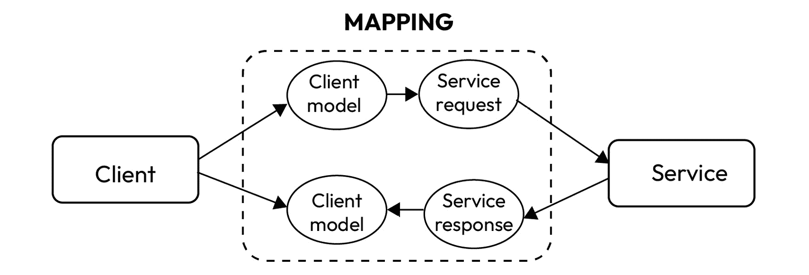

# 6

# 元编程

在一本关于重构的书中，讨论元编程可能显得有些奇怪。在我们看来，与其说是重构本身，不如说讨论元编程及其工具对于编写清洁代码是有益的，而编写清洁代码意味着“预防”重构，这确实与我们的目标仍然相关。

正如我们很快将看到的，元编程涉及编写在程序上工作的程序。在我们的上下文中，我们将支持使用他人编写的框架（优秀软件工程师的第一个美德：懒惰），这些框架可以帮助我们编写更少的代码（我告诉过你！）。

编写更少的代码（或者说，让工具来编写）是件好事：这意味着维护的代码更少，而且那些代码部分由专门的工具负责，这些工具将以最佳方式编写代码。

在本章中，我们将涵盖以下主要主题：

+   什么是元编程？

+   探索编译时和运行时元编程工具

+   Lombok 和 MapStruct

+   评估元编程的利弊

# 什么是元编程？

当我们遇到旨在以各种方式创建、操作或与其他软件交互的软件时，我们正在进行**元编程**。这项技术允许计算机程序将其他程序视为其数据。在我看来，它代表了智者手中的非常强大的工具；就像生活中的每一件事一样，它也有一些缺点，我们稍后会分析。

元编程意味着编写（或者，如我们稍后将看到的，使用）软件，该软件可以设置成执行诸如读取、创建、分析或更改其他程序等操作。它甚至可以在运行时调整自己的代码。这个酷炫的技巧允许开发者用更少的代码编写解决方案，节省时间。此外，它使程序更加灵活，以便它们可以处理新的情况而无需进行全面的重写。

就像任何编程语言一样，掌握元编程的基础知识并采用合理的软件开发实践对于提高应用程序的整体质量至关重要，包括那些采用元编程技术的应用程序。

首先，元编程促进了**代码的可重用性**。它通过允许开发者创建代码生成器和模板来实现这一点，这些模板可以消除代码库中的冗余。这不仅减少了错误的可能性，还简化了维护工作。当代码自动生成时，开发者可以在一个地方进行更改，这些更改将传播到整个代码库。这导致代码更易于维护、更清洁且错误更少。

元编程最吸引人的方面之一是它能够使程序具有动态行为。这种动态行为使软件系统能够在运行时适应不断变化的情况。从实际的角度来看，这意味着程序的行为可以在不进行大量代码修改和重新编译的情况下进行调整或配置。因此，元编程在程序的行为必须灵活、可配置或频繁变化的情况下特别有价值。

此外，元编程对开发者生产力有直接影响。通过自动化重复的编码任务，它允许开发者专注于更高层次的设计和问题解决。这反过来又导致更快的开发周期和更高效的代码库。通过元编程节省的时间和精力可以用于提高软件的整体质量。

元编程不仅限于使代码更高效；它还促进了**领域特定语言**（**DSLs**）的创建。这些 DSLs 被定制为特定的问题域，使得开发者能够更自然、更简洁地表达复杂思想。DSLs 抽象掉了通用编程语言的复杂性，并允许开发者直接与领域的概念进行沟通，显著提高了技术和非技术利益相关者之间的沟通。为了说明这个概念，想象你正在开发一个金融应用程序，你需要计算一笔贷款的利息。在 Java 中，使用通用语言，它可能看起来像这样：

```java
double principal = 10000;
double rate = 0.05;
int years = 3;
double interest = principal * rate * years;
```

在这段 Java 代码中，你正在处理诸如变量类型、运算符和计算等低级细节。

现在，让我们看看 DSL 如何使这更加领域特定：

```java
LoanDSL loan = LoanDSL.builder()
        .principal(10000.0)
        .interestRate(0.05)
        .term(3)
        .build();
double interest = loan.calculateInterest();
```

在这个例子中，`LoanDSL` 是一个专为与金融计算一起工作而设计的领域特定语言（DSL）。它抽象掉了低级细节，提供了一个高级接口，该接口直接与金融领域的概念进行通信，这使得理解和操作更加容易。这可以大大提高开发者和金融领域专家之间的沟通。

最后，元编程有助于构建高效的抽象。这些抽象隐藏了底层实现细节，使得代码更易于理解和维护。通过封装复杂性和仅暴露必要信息，元编程增强了代码库的整体清晰度和可理解性。元编程可以分为两大类：编译时和运行时。让我们尝一尝这两者的滋味。

# 探索编译时元编程工具

编译时元编程涉及在编译阶段发生的代码转换和生成。换句话说，操作、转换或代码生成是在程序执行之前（即在程序执行之前）对程序进行的。宏、代码生成器和注解处理器是 Java 中编译时元编程的常见工具。鉴于本书的主题，编译时元编程将是我们的主要关注点，因为我们认为符合此定义的工具和框架是保持代码清洁的最佳方式。特别是，我们将重点关注代码生成工具：提供基于某些特定规范或模型生成代码的设施（在下一节中，我们将具体关注 Lombok 和 MapStruct）。这些工具生成的代码可以根据程序的具体要求进行定制。

## Lombok

**Project Lombok**（诞生于 2009 年）是一个流行的 Java 库，通过减少样板代码并使代码更简洁来简化 Java 开发。

在 Java 中（至少直到 14 版本引入 `record` 关键字为止），通常需要编写大量的样板代码来完成基本任务，例如定义 getter 和 setter 方法、构造函数以及 `toString()`、`equals()` 和 `hashCode()` 方法。这些样板代码的编写和维护可能很耗时，使得代码库更长且更难阅读。

**Lombok** 通过在编译期间自动生成这些样板代码来解决此问题。这意味着开发者不必自己编写这些重复的代码元素，从而降低了出错的可能性，并使代码库更加简洁。

Lombok 作为一种注解处理器，在编译阶段引入额外的代码来增强你的类。注解处理是在 Java 编译器 5.0 版本中引入的。该概念涉及用户将注解处理器（无论是自行编写的还是从第三方依赖项，如 Lombok 获得的）放置在构建类路径中。在编译过程中，当编译器遇到注解时，它实际上会询问：“类路径中是否有人关心这个 `@Annotation`？”对于回答是的处理器，编译器将控制权委托给他们，以及编译上下文，允许他们执行各自的任务。

Lombok 的注解处理涉及对表示代码的编译器数据结构进行调整，特别是 **抽象语法树**（**AST**）。将 AST 视为计算机程序的路线图。它显示了创建最终程序必须采取的所有必要步骤。在 Java 中，它是在实际程序代码（**字节码**）生成之前创建的。酷的地方在于你可以在 Java 中更改并处理这个 AST。通过这些对编译器 AST 的修改，Lombok 间接影响了最终字节码的生成。为了实现这一功能，Lombok 需要拦截并管理对 Java 编译器的调用，以处理中间代码的生成。这个过程是通过插件来简化的，这些插件可以在你的 **集成开发环境**（**IDE**）中配置，例如 IntelliJ、VS Code 或 Eclipse，或者集成到你的构建自动化工具中，例如 Maven、Gradle 或 Make。重要的是要注意，如果你的 IDE 或构建管理系统与 Lombok 不兼容，可能会导致你的代码在编译时出现问题；无论如何，在大多数最常用的 IDE 的现代版本中，这种情况是不会发生的（它们默认支持 Lombok）。 

正如我们之前所说，Lombok 与一系列非常简单的注解一起工作。让我们看看它的魔法示例。我们将提供基础知识。然而，在 Lombok 官方文档中还有更多内容可以探索，你可以在 *进一步* *阅读* 部分找到它。

### 使用示例开始使用 Lombok

让我们从最基础的 Java 类形式开始：一个 `toString()` 方法，以及经常需要的 `equals()` 和 `hashcode()` 方法来完善整个结构。写这个方法比描述它要快（以下代码故意写得比较长）：

```java
class Person {
    private String name;
    private String surname;
    private Date birthDate;
    public Person() {
    }
    public Person(String name, String surname, Date birthDate) {
        this.name = name;
        this.surname = surname;
        this.birthDate = birthDate;
    }
    public Person(Person anotherPerson) {
        if (anotherPerson == null) {
            throw new NullPointerException("AnotherPerson cannot be null");
        }
        this.name = anotherPerson.getName();
        this.surname = anotherPerson.getSurname();
        this.birthDate = anotherPerson.getBirthDate();
    }
    public String getName() {
        return name;
    }
    public void setName(String name) {
        this.name = name;
    }
    public String getSurname() {
        return surname;
    }
    public void setSurname(String surname) {
        this.surname = surname;
    }
    public Date getBirthDate() {
        return birthDate;
    }
    public void setBirthDate(Date birthDate) {
        this.birthDate = birthDate;
    }
    @Override
    public boolean equals(Object o) {
        if (this == o) return true;
        if (o == null || getClass() != o.getClass()) return false;
        Person person = (Person) o;
        return Objects.equals(name, person.name) && Objects.equals(surname, person.surname) && Objects.equals(birthDate, person.birthDate);
    }
    @Override
    public int hashCode() {
        return Objects.hash(name, surname, birthDate);
    }
    @Override
    public String toString() {
        return "Person{" +
                "name='" + name + '\'' +
                ", surname='" + surname + '\'' +
                ", birthDate=" + birthDate +
                '}';
    }
}
```

应该很容易理解这个类的作用：什么也不做！它有三个字段，都是 `private` 的，三个构造函数（一个不带参数的默认构造函数和一个包含所有字段的构造函数——一个接受相同对象实例的构造函数），每个字段一个 getter 和 setter，`equals` 和 `hashcode` 方法涉及所有字段，最后是一个 `toString` 方法。所有这些代码都是从我的 IDE 生成的；这个类仅仅代表一条信息。在其他语言中，这被称为 **数据类**。仅此而已，我们就有了超过 70 行的代码！让我们看看 Lombok 如何帮助我们。

首先，将 Project Lombok 添加到你的类路径中。如果你使用 Maven，你只需将依赖项添加到你的 `pom.xml` 文件中（我们将在写作时使用最新版本）：

```java
<dependency>
    <groupId>org.projectlombok</groupId>
    <artifactId>lombok</artifactId>
    <version>1.18.30</version>
</dependency>
```

有趣的是，如果你只是开始在代码中输入 Lombok 的注解，一些 IDE，如 IntelliJ IDEA，会建议你将 Lombok 添加到你的类路径中。这真是太顺畅了。

正如我们所说的，Lombok 通过在源代码中添加注解来实现，这些注解实现了被认为是一些*样板代码*的行为。例如，在对象的*复制构造函数*中，我们可以看到一个检查传入参数可能为 null 的`if`语句：

```java
public Person(Person anotherPerson) {
    if (anotherPerson == null) {
        throw new NullPointerException("AnotherPerson cannot be null");
    }
    this.name = anotherPerson.getName();
    this.surname = anotherPerson.getSurname();
    this.birthDate = anotherPerson.getBirthDate();
}
```

这个`if`语句可以用在构造函数参数旁边的`@NonNull`注解来替换：null 检查的形式是一个`if`语句，`if (param == null) throw new NullPointerException("param is marked non-null but is null")`，并将放置在你的方法的开头。在构造函数的情况下，null 检查将直接插入到任何显式的`this()`或`super()`调用之后：

```java
public Person(@NonNull Person anotherPerson) {
    this.name = anotherPerson.getName();
    this.surname = anotherPerson.getSurname();
    this.birthDate = anotherPerson.getBirthDate();
}
```

现在，让我们看看默认构造函数：

```java
public Person() {
}
```

使用`@NoArgsConstructor`注解，我们可以消除默认构造函数。一个没有参数的构造函数将被自动生成。然而，如果由于存在 final 字段而无法实现这一点，编译器将出现错误。除非你显式地使用`@NoArgsConstructor(force = true)`进行注解，否则所有 final 字段都将使用默认值初始化（数值类型为`0`，布尔类型为`false`，引用类型为`null`）。

我们可以消除的第二个构造函数是**所有参数**的构造函数：

```java
public Person(String name, String surname, Date birthDate) {
    this.name = name;
    this.surname = surname;
    this.birthDate = birthDate;
}
```

我们可以用`@AllArgsConstructor`注解来替换这些代码行，该注解生成一个接受你类中每个字段的一个参数的构造函数。

如果任何参数是`final`的，这意味着只有一些字段是必需的：

```java
private final String name;
private String surname;
private Date birthDate;
```

在这种情况下，我们可以使用`@RequiredArgsConstructor`，它为每个需要特定处理的字段生成一个参数的构造函数。这包括所有未初始化的 final 字段，以及任何在声明处未初始化且带有`@NonNull`注解的字段。对于标记为`@NonNull`的字段，还会创建显式的 null 检查。如果任何旨在用于`@NonNull`字段的参数包含 null，构造函数将抛出`NullPointerException`错误。参数的顺序对应于你在类中定义字段的顺序。

Lombok 的下一个特性是对任何字段使用`@Getter`和/或`@Setter`注解，允许 Lombok 自动生成默认的 getter 和 setter 方法：

```java
@Getter @Setter private String name;
@Getter @Setter private String surname;
@Getter @Setter private Date birthDate;
```

默认 getter 方法基本上是检索字段的值，如果字段名为`name`（或字段为布尔类型时为`isName`），则遵循`getName`命名约定。同时，如果字段名为`name`，则使用名为`setName`的默认 setter 方法，返回`void`，并接受与字段相同类型的单个参数。这个 setter 方法只是将字段赋值为提供的值。

同样，你也可以将`@Getter`和/或`@Setter`注解应用于类本身。在这种情况下，就好像你已将相同的注解应用于该类中所有非静态字段。因此，之前的代码片段也可以用以下方式编写：

```java
@Getter
@Setter
class Person {
    private String name;
    private String surname;
    private Date birthDate;
    //other code here...
}
```

默认情况下，生成的 getter 和 setter 方法都是公开的，除非你明确指定`AccessLevel`。你可以使用的访问级别有`PUBLIC`、`PROTECTED`、`PACKAGE`和`PRIVATE`。例如，你可以编写以下内容：

```java
@Setter(AccessLevel.PROTECTED) private String name;
```

可以通过添加`@EqualsAndHashCode`注解来生成`equals`和`hashCode`方法：这允许 Lombok 自动生成`equals(Object other)`和`hashCode()`方法的实现。默认情况下，它包括所有非静态、非瞬态字段。然而，你可以通过注解类型成员使用`@EqualsAndHashCode.Include`或`@EqualsAndHashCode.Exclude`来自定义包含哪些字段（甚至可以指定某些方法的返回结果应被视为）。

或者，你可以通过使用`@EqualsAndHashCode.Include`注解并使用`@EqualsAndHashCode(onlyExplicitlyIncluded = true)`来精确指定你想要包含的字段或方法。

最后但同样重要的是，你有机会通过添加`@ToString`注解来让 Lombok 生成一个`toString`方法。配置选项用于确定是否应包含字段名称。否则，格式遵循一个固定的结构，即类名后跟括号，括号内包含用逗号分隔的字段 - 例如，它看起来像`Person(name=charlie, surname=brown)`。为了提高`toString()`方法输出的清晰度（尽管可能会增加长度），你可以将`includeFieldNames`参数设置为`true`。默认情况下，所有非静态字段都会被打印。如果你希望排除某些字段，你可以用`@ToString.Exclude`注解它们。或者，你可以通过使用`@EqualsAndHashCode.Include`注解并标记每个你想要包含的字段来精确指定要包含的字段或方法，然后使用`@EqualsAndHashCode(onlyExplicitlyIncluded = true)`。

最后，我们的 70 行代码简化为以下内容：

```java
@NoArgsConstructor
@AllArgsConstructor
@Getter
@Setter
@EqualsAndHashCode
@ToString
class Person {
    private String name;
    private String surname;
    private Date birthDate;
    public Person(@NonNull Person anotherPerson) {
        this.name = anotherPerson.getName();
        this.surname = anotherPerson.getSurname();
        this.birthDate = anotherPerson.getBirthDate();
    }
}
```

如果还不够满意？你可以使用`@Data`，这是一个方便的快捷注解，它将`@ToString`、`@EqualsAndHashCode`、`@Getter` / `@Setter`和`@RequiredArgsConstructor`的功能捆绑在一起：

```java
@AllArgsConstructor
@NoArgsConstructor
@Data
class Person {
    private String name;
    private String surname;
    private Date birthDate;
    public Person(@NonNull Person anotherPerson) {
        this.name = anotherPerson.getName();
        this.surname = anotherPerson.getSurname();
        this.birthDate = anotherPerson.getBirthDate();
    }
}
```

如果你想要保留不可变性（而且你绝对应该这样做！），你可以使用`@Value`注解，它是`@Data`的不可变版本。在这种情况下，所有字段默认设置为`private`和`final`，并且不会生成任何 setter。此外，类本身默认设置为`final`，因为强制子类不可变是不可行的。类似于`@Data`注解，它包括有用的`toString()`、`equals()`和`hashCode()`方法生成。每个字段都配备了一个 getter 方法，并且生成一个构造函数来包含所有参数（排除`final`字段，这些字段在字段声明中初始化）。

这只是对 Lombok 注解的一般概述。使用它们的属性（以及也可以通过一个名为`lombok.config`的文件添加到项目中的其他一些配置），可以使 Lombok 的行为更加细致，在单个字段、单个方法或自定义由这个强大的库生成的实现级别上操作。这仅仅是冰山一角。

### Lombok 的构建器

在*第五章*中，我们了解了构建器模式：一种设计模式，通过将对象的构建与其表示分离来帮助构建复杂对象，这使得创建具有各种配置的对象变得更容易。

`@Builder`注解让你几乎不费吹灰之力就为你的类型创建一个*构建器*类。如果我们取上一节末尾编写的`Person`类，并在其上方添加`@Builder`注解，Lombok 将生成一些代码，我们可以用它以以下方式实例化一个`Person`实例：

```java
Person p = Person.builder()
        .name("Luke")
        .surname("Skywalker")
        .birthDate(parseDate("1951-09-25"))
        .build();
```

在这个例子中，你正在使用流畅且易于阅读的构建器模式创建`Person`的一个实例。你使用生成的构建器的方法设置字段的值，然后调用`.build()`来创建最终的实例。

`@Builder`注解还可以处理可选字段和默认值，这使得以可变数量的属性创建对象变得方便。

Lombok 的`@Builder`注解在需要使用许多可选参数构建复杂对象或想要创建不可变对象的情况下特别有用。它消除了编写重复、冗长且易出错的样板代码来构建对象的需求，使代码更加简洁和易于维护。

`@Builder`注解可以为集合参数/字段生成“单一”方法，这些方法接受单个元素而不是整个列表，并将该元素添加到集合中。让我们看看以下示例：

```java
@Builder
class Team {
    private String name;
    @Singular
    private List<String> members;
}
```

注意被放置在集合字段上的 `@Singular` 注解。当你在一个方法或构造函数的参数上使用 `@Singular` 注解，或者在类的字段上使用 `@Singular` 注解时，Lombok 将该构建节点视为一个集合。因此，Lombok 生成两个 **adder** 方法而不是一个 **setter** 方法。第一个 adder 方法允许你向集合添加单个元素，而第二个 adder 方法允许你将另一个集合的所有元素添加到现有集合中。Lombok 不会生成替换整个集合的 setter 方法。此外，Lombok 还为集合生成一个 **clear** 方法。

例如，你可以为之前显示的 `Team` 类编写以下代码：

```java
Team myTeam = Team.builder()
        .member("John")
        .member("Susan")
        .member("Chris")
        .build();
```

或者，你也可以编写以下内容：

```java
var members = List.of("John", "Susan", "Chris");
Team myTeam = Team.builder()
        .members(members)
        .build();
```

你将得到相同的结果。

如果在对象构造过程中没有明确设置特定字段或参数，它将默认为其类型的值，例如 `0`、`null` 或 `false`。当你在一个类中使用 `@Builder` 注解（而不是方法或构造函数）时，你可以在字段上直接定义默认值，并用 `@Builder.Default` 注解它。以下代码是一个示例：

```java
@Builder
class Team {
    private String name;
    @Builder.Default private Long created = System.currentTimeMillis();
    @Singular
    private List<String> members;
}
```

在此示例中，如果创建的字段在对象构造期间未设置，它将默认为 `System.currentTimeMillis()` 的结果，确保它始终有一个有效的时间戳值。

当在句子中使用时，Lombok 的构建功能特别有用，因为它通过流畅和简洁的语法简化了复杂对象的创建，减少了在 Java 中手动实现构建模式的必要性。然而，使用这个库也有一些缺点，我们将在下一节中探讨。

### 关于 Lombok 的优缺点的一些最终考虑

通过减少样板代码，Lombok 有助于提高代码的整洁性和可读性。开发者可以专注于编写他们类的基本业务逻辑，从而使代码库更易于理解和维护。它还减少了在手动编写的样板代码中引入错误的机会。

使用 Lombok，维护代码变得更加简单。当你需要向类中添加或删除字段时，你不必手动更新所有相关方法。Lombok 的注解会在编译期间自动处理这些更改。

大多数现代 IDE 默认支持 Lombok。它们可以识别 Lombok 注解，并提供代码补全、导航和重构辅助，就像代码是手动编写的一样。这确保了开发者有一个无缝的开发体验。

在我们谦逊的观点中，Project Lombok 是 Java 生态系统中的一个宝贵工具，通过自动化生成常见的代码元素、减少样板代码和提高代码可读性来简化代码开发。它允许开发者专注于其类的核心功能，并减少在重复代码中引入错误的机会。这使得 Java 代码更干净、更简洁，更容易维护。

然而，为了给出一个全面和诚实的概述，我们必须强调一些关于 Lombok 的常见批评。让我们从最主观的（几乎是某些人的“直觉”）批评开始：Lombok 独特且有时强制性的做事方式（特别是修改字节码）常常让人觉得它是一种权宜之计。我们将其视为一种聪明、技术合理且创新的解决方案，而不是一种负面的黑客行为。然而，一些开发者仍然将其视为权宜之计，并因此避免使用 Lombok。这是一个合理的观点，但根据我们的经验，Lombok 在生产力方面的优势比对其方法的任何担忧都要重要。我们已经愉快地在现实生活中的项目中使用了多年。

否认这一点是没有用的，因为 Lombok 在编译时作为“额外步骤”介入，这增加了执行此实践的时间。随着代码库的增加，当然，时间也会成比例增加。尽管效率很高，Lombok 团队也在积极进行进一步的改进，但不可否认的是，没有 Lombok 的项目编译速度更快。

也可能存在与不同版本的 Java 兼容性的问题。随着每个版本的更新，Java 可能会改变生成和/或解释 AST 的方式。因此，不能确定 Lombok 能否正确生成代码，或者它是否能够成功。代码可能会停止编译。不幸的是，我们可能只有在升级 Java 之后才会注意到这一点，但事实也是，在 Java 最终版本发布之前，库的新版本就已经发布了。然而，仍然有一个可能性需要考虑。

这种可能性让我们想到了另一个问题，即 Lombok 使得我们编写的代码变得非标准；由于我们需要 Lombok 插件来编译，从某种意义上说，我们正在编写的代码是不合法的。我们总是依赖于 Java“外部”的工具。

在我脑海中最后想到的可能缺陷，在我看来并不是缺陷，而是一些我经常听到的事情。确实，Lombok 大大减少了代码行数，消除了所谓的样板代码，但同样真实的是，所有 IDE 都可以通过几点击就能生成这些样板代码。这是对 Lombok 的一种伪批评。虽然确实，任何值得称道的 IDE 都可以瞬间生成 getter、setter、equals、builders 等，但同样真实的是，所有这些代码都必须维护。我们有多少次在类中添加字段时忘记更新`equals`方法？我们有多少次因为更改了字段的名字或类型而不得不更改 getter 和 setter？使用 Lombok，所有这些错误发生的可能性几乎不存在。

我希望到目前为止我已经给你提供了一些有趣的想法。不幸的是，我没有一个适用于所有这些考虑的万能解决方案。像往常一样，我们建议逐个评估每种情况，并尝试达成团队共识。

在下一节中，我们将介绍另一个可以让你从大量手动工作中解脱出来的库，尤其是在将一种类型转换为另一种类型时，这在几乎所有项目中都是不幸必须做的。MapStruct 将让你摆脱这种负担，或者至少让它更容易。

## MapStruct

虽然这样说并不太好，但作为软件工程师，我们的一部分工作就是将信息从一个地方传输到另一个地方。有时，这种传输仅仅是将一个模型翻译成另一个模型。悲哀但却是事实。

对象映射（有时被称为**对象适配**）是指在不同数据模型之间转换数据的过程，例如从面向对象编程语言中的对象到数据库表，反之亦然。这个过程还包括属于不同子域或甚至应用不同层的对象。另一个经常进行的映射示例是在你必须调用外部服务（例如，通过 HTTP/REST 调用）并将从该服务获得的响应映射到你的对象或模型时。这种情况在以下图中表示：



图 6.1 – 客户端和服务请求模型之间的映射以及返回客户端模型

编写映射代码可能非常无聊，而且容易出错。但如果有这样一个工具，可以以最小的努力完成所有这些繁琐的工作呢？幸运的是，我们确实有相当多的这样的工具，我们首选的是 MapStruct。

**MapStruct** 是一个开源的基于 Java 的代码生成库，它简化了 Java bean（POJO）之间的映射过程。它专门设计用于生成对象之间的映射代码，消除了手动编写此代码的需要，这既耗时又容易出错。MapStruct 的主要目的是提供一个简单高效的方法，在不同的 Java bean 类之间转换数据。

MapStruct 作为一种注解处理器，无缝集成到 Java 编译器中，使其与 Maven 和 Gradle 等命令行构建工具兼容，同样适用于您喜欢的 IDE。虽然 MapStruct 为映射提供了合理的默认值，但它也允许您在需要时配置和实现特定的行为，给您提供灵活性，而不强加严格的约束。

让我们看看 MapStruct 是如何工作的。假设您有以下两个类：

```java
public class Person {
    private String name;
    private String surname;
    private Integer age;
   // getters and setters...
}
public class PersonDTO {
    private String name;
    private String lastName;
    private LocalDate birthDate;
    // getters and setters...
}
```

我们需要将 `PersonDTO` 实例的数据传输到 `Person` 实例。在纯 Java 中完成此操作，我们需要编写以下代码：

```java
public Person from(PersonDTO personDTO) {
    if (personDTO == null) {
        return null;
    }
    Person person = new Person();
    person.setName(personDTO.getName());
    person.setSurname(personDTO.getLastName());
    person.setAge(calculateCurrentAge(personDTO.getBirthDate()));
    return person;
}
private Integer calculateCurrentAge(LocalDate birthDate) {
    return Period.between(birthDate, LocalDate.now()).getYears();
}
```

这只是三个字段就需要很多代码；这很无聊，耗时，且容易出错。

使用 MapStruct，我们只需编写一个接口，然后让它施展魔法：

```java
@Mapper
public interface PersonMapper {
    PersonMapper INSTANCE = Mappers.getMapper(PersonMapper.class);
    @Mapping(source="lastName", target="surname")
    Person personDtoToPerson(PersonDTO personDto);
}
```

存在 `@Mapper` 注解表明该接口是一个映射接口，并在编译过程中触发 MapStruct 处理器的运行。在映射方法本身中，您可以自由选择其名称，并且它应该接受 `source` 对象作为参数，同时返回 `target` 对象。

要处理 `source` 和 `target` 对象中具有不同名称的属性，您可以使用 `@Mapping` 注解来指定所需的配置。当必要时且可行时，将对 `source` 和 `target` 对象中具有不同类型的属性执行类型转换。例如，枚举类型可能被转换为字符串。

值得注意的是，单个接口可以托管多种映射方法，每种方法都将由 MapStruct 自动生成实现。您可以通过 `Mappers` 类获取接口实现的实例。按照惯例，该接口通常包含一个名为 `INSTANCE` 的成员，为客户端提供访问映射实现的方式。

MapStruct 将为您生成所有需要的代码。

您可能已经注意到，我们缺少从 `birthdate` 到 `age` 的映射；由于涉及一点逻辑（从出生日期计算当前年龄），MapStruct 无法自动完成此操作。在这种情况下——以及在任何情况下，我们可能需要它——我们可以实现特定的映射；此外，在这种情况下，方法名称并不重要，因为 MapStruct 将根据参数和返回类型选择正确的方法：

```java
@Mapper
public interface PersonMapper {
    PersonMapper INSTANCE = Mappers.getMapper(PersonMapper.class);
    @Mapping(source="lastName", target="surname")
    @Mapping(source="birthDate", target="age")
    Person personDtoToPerson(PersonDTO personDto);
    default Integer calculateCurrentAge(LocalDate birthDate) {
        return Period.between(birthDate, LocalDate.now()).getYears();
    }
}
```

在方法自动生成的实现中，MapStruct 将选择`calculateCurrentAge`方法，因为它接受一个`LocalDate`参数并返回一个`Integer`值。您也可以在`@Mapping`注解中指定 Java 表达式和其他内容，但我建议阅读文档以深入了解。

有了这些，我们已经看到了 MapStruct 是如何工作的，以及它是如何通过处理耗时任务来使我们的生活变得更轻松的。正如我提到的，这些是静态元编程工具——它们直接在代码上工作。现在，让我们看看运行时元编程工具，它们在运行的程序上工作。

# 探索运行时元编程工具

**运行时元编程**在程序执行时进行操作。它使程序能够在运行时检查和修改自己的代码和数据结构，通常使用反射、动态代码生成和动态代理等技术。了解运行时元编程工具可以帮助您动态地操作和调整正在运行的程序的行为，从而增强软件中的灵活性和定制性。

现在，让我们谈谈反射，因为它是运行时元编程中最常用的功能。

## 反射

**反射**是 Java 等编程语言中的一项功能，允许程序在运行时检查或*反映*其结构、数据和行为。在 Java 中，反射主要用于在运行时检查和操作类、对象、方法、字段和程序的其他元素。

反射允许您在 Java 中执行以下任务：

1.  **检查类**：您可以获取有关类的信息，包括它们的名称、超类、实现的接口、构造函数、方法和字段。

1.  **检查对象**：即使它们的类型在编译时未知，您也可以检查对象的属性和字段。

1.  **调用方法**：即使不知道方法名称，您也可以在对象上调用方法。

1.  **访问字段**：即使不知道字段的名称，您也可以在运行时读取或修改对象内字段的值。

例如，让我们向`Person`类添加以下方法（参见*MapStruct*部分）：

```java
public void greet(){
    System.out.printf("Hello I'm %s%n", name);
}
```

现在，让我们创建另一个使用反射操作它的类：

```java
public class ReflectionExample {
    public static void main(String[] args) throws Exception {
        // Obtain the class object
        Class<?> personClass = Class.forName("com.example.demo3.mapstruct.Person");
        // Create an instance of the Person class
        Object personInstance = personClass.getConstructor(String.class, String.class, Integer.class)
                .newInstance("Alice", "Smith", 30);
        // Access and modify fields using reflection
        Field nameField = personClass.getDeclaredField("name");
        nameField.setAccessible(true); // Bypass private access
                                       // modifier
        String nameValue = (String) nameField.get(personInstance);
        System.out.println("Original Name: " + nameValue);
        nameField.set(personInstance, "Bob");
        // Access and invoke methods using reflection
        Method greetMethod = personClass.getDeclaredMethod("greet");
        greetMethod.invoke(personInstance);
        // Verify the modified name
        String modifiedName = (String) nameField.get(personInstance);
        System.out.println("Modified Name: " + modifiedName);
    }
}
```

在这个例子中，我们执行以下操作：

+   我们使用`Class.forName("com.example.demo3.mapstruct.Person")`获取表示`Person`类的`Class`对象。

+   我们使用构造函数动态创建`Person`类的实例。

+   我们访问私有名称字段，绕过访问修饰符并修改其值。

+   我们使用反射调用`Person`实例的`greet`方法。

+   我们验证名称字段已被成功修改。

请注意，虽然这个示例演示了反射的使用，但在实际使用反射时必须谨慎。反射应谨慎使用，并且你应该意识到与之相关的潜在风险和性能影响。

例如，可能存在安全风险，因为反射可以绕过 Java 的访问控制，允许你访问和修改类的私有成员。虽然这种灵活性可能是有益的，但如果使用不当，也可能引入安全漏洞。未经授权访问敏感数据或操纵程序内部状态可能会发生，这就是为什么采取安全措施防止滥用至关重要的原因。

另一个非常常见的问题是类型安全：反射在低级别操作，并且不提供与传统 Java 代码相同的类型安全级别。这可能导致运行时出现意外的类型错误。例如，你可能会用错误的参数调用方法，错误直到代码运行时才会被发现。这种缺乏编译时检查可能导致难以调试的运行时异常。同时，大多数现代 IDE 在编写代码时会提醒开发者这种风险。

在下一节中，我们还将扩展与干净的代码相关的其他一些挑战，涉及反射。

### 反射与干净的代码

在关于元编程的章节中，我们觉得有责任告诉你关于运行时元编程及其最（不）著名的表现形式——反射的一些内容。但让我们先思考一下，从保持代码库清洁的角度来看，反射涉及哪些方面。

反射与**干净的代码**有时可能存在冲突，因为反射引入了复杂性和潜在的代码可读性问题。然而，当谨慎且深思熟虑地使用时，反射可以以干净和可维护的方式使用。让我们探讨反射如何影响干净的代码原则，以及如何在它们之间取得平衡：

+   **可读性**：干净的代码促进可读性。反射可能会使代码的可读性降低，因为它通常涉及以字符串形式处理类名和方法名，这容易出错，可能导致难以理解的代码。为了减轻这种情况，应彻底记录反射的使用，并提供清晰的注释来解释你的意图。

+   **可维护性**：反射可以使代码更难维护，因为它绕过了 Java 编译器提供的某些编译时检查。如果你使用反射来访问私有成员或执行通过常规方式不允许的操作，可能会导致意外的行为或维护挑战。在可能的情况下，你应该考虑替代方案，例如对代码结构进行必要的修改。

+   **简洁性**：清洁代码鼓励简洁性。作为一个复杂的特性，反射可能会引入不必要的复杂性。确保你的反射使用是合理的，并且没有在不必要的地方引入复杂性是至关重要的。

+   **一致性**：清洁代码追求一致性和统一风格。反射可能导致代码不一致，因为程序的不同部分可能以各种方式访问和操作元素。为了保持一致性，考虑为你的反射使用建立约定和模式。

+   **测试**：清洁代码强调可测试性。反射可能会使编写单元测试变得具有挑战性，因为它允许你绕过封装。你可能需要依赖集成测试或模拟对象，这对于隔离单元测试来说可能不是最佳选择。在可能的情况下，优先设计易于单元测试的代码，而不依赖于过度的反射。

+   **性能**：清洁代码应该是高效的。由于反射的动态特性，它可能会引入性能开销。在使用反射之前，分析你的代码并确保性能影响是可以接受的。在性能关键的应用中，你可能需要探索替代方法。

+   **文档**：清洁代码的目标是完全不需要技术文档，因为代码本身如此清晰，可以自我解释。然而，由于反射降低了可读性（我们刚才说过），清晰文档或注释的需求变得至关重要。在使用反射时，考虑提供全面的文档，解释反射代码的目的、预期行为和潜在风险。

因此，反射是 Java 中一种强大但潜在危险的特性，应该谨慎且少量使用。在决定使用反射时，必须权衡其带来的好处与对代码库增加的复杂性和潜在缺点。如果决定使用反射，应深思熟虑并详尽地记录代码，以保持清晰和透明度。即使在使用反射时，清洁代码的原则也应始终是首要任务，以确保代码库保持可维护性、可读性和效率（尽管如此，值得注意的是，反射通常在许多元编程框架的“幕后”使用）。

现在我们已经了解了什么是元编程，包括其静态和运行时风味，让我们来考虑一下这些非常强大的工具的优缺点。

# 考虑元编程的利弊

元编程和清洁代码是软件开发中的两个基本概念，虽然它们有时似乎相互矛盾，但使用得当的话，它们也可以和谐共存。

元编程本质上涉及在编译或运行时动态操作或生成代码。它提供了自动化重复任务、创建抽象和将灵活性引入软件开发的能力。另一方面，干净的代码是一种编码哲学，强调编写易于阅读、理解和维护的代码。它推崇诸如有意义的命名、消除冗余、小型和专注的函数以及遵守既定的编码规范等原则。

元编程可以通过自动化创建重复的代码结构并减少源代码文件中的杂乱（例如，像我们在 Lombok 的案例中看到的那样消除一些样板代码）来帮助生成干净的代码。

此外，它还可以促进开发隐藏实现细节的抽象，从而产生更干净、更易于维护的代码。

然而，并非所有闪亮的东西都是金子；你必须确保生成的代码是干净的，并遵循干净代码的原则。自动化不应导致杂乱或难以理解的代码。从这个意义上说，使用知名、经过良好测试的框架，拥有坚实的社区和大量文档，可能是正确的做法。我们从不支持重造轮子，永远不；除非是非常小和有限的用例，否则你不太可能发现自己需要从头开始进行元编程。

你还必须平衡自动化的优势与代码的可读性和可理解性，因为元编程可能会引入复杂性。我曾经面对一个返回包含 HTML 网页字符串的 Java 方法！不要陷入那样的悲伤顶峰，确保你的队友（还有不要忘记你未来的自己）只需合理的头痛就能扩展或修改你的软件。我们邀请你与团队讨论每一个元编程选择。避免在代码中过度使用“魔法”，因为这可能会掩盖底层过程的了解。这种不明朗可能会导致错误或不可预测的性能问题。

如果你必须采用元编程，请彻底记录复杂的元编程解决方案，提供清晰的解释以帮助未来的开发者。提供示例并编写注释；用一个词来说，就是仁慈。

话虽如此，我们认为在测试和调试方面，干净代码的优势是显著的，尤其是在处理像 Lombok 和 MapStruct 这样的编译时元编程工具时。这种优势的本质在于，你不仅拥有更干净的代码（例如，Lombok 的使用促进了对象的不可变性），而且代码量更少。尽可能少地编写代码应该是你的首要任务之一。

元编程和清洁代码可以和谐共存。将自动化的优势与灵活性与编写清洁且可维护的代码的承诺相结合，确保软件项目在长期内既高效又可持续。

在讨论元编程的优缺点时，值得提及所谓的**“非原创”**（**NIH**）综合症。NIH 综合症指的是一些开发团队或个人倾向于创建自己的解决方案或工具，而不是采用现有的外部解决方案。即使现有解决方案已经确立、经过验证且易于获取，这种情况也可能发生。

NIH 综合症可能导致几个问题，包括增加的开发时间、重复造轮子，以及错失利用更广泛开发社区的专业知识和贡献的机会。这通常被认为是一种反生产力的行为，许多软件开发社区鼓励在适当的时候采取更开放的心态来采用现有解决方案。

在考虑时间、专业知识、维护以及开源社区中已确立解决方案的可用性等因素时，鼓励团队和开发者权衡在内部构建与使用外部库或框架之间的利弊。

# 摘要

在本章中，我们讨论了元编程：它是什么，它是如何工作的，以及它对清洁代码和重构有何帮助或无帮助。特别是，我们研究了两个涉及元编程的非常流行的库，特别是代码自动生成：Lombok 和 MapStruct。

我们还提醒了您使用反射可能存在的潜在风险，并且一般性地讨论了使用元编程工具的优缺点。

在下一章中，我们将深入探讨静态分析，这是一种不执行代码就检查问题的代码检查方法，以及动态分析，它涉及在代码执行期间评估代码以识别问题。

# 进一步阅读

+   Lombok 的官方文档：[`projectlombok.org/features/`](https://projectlombok.org/features/)

+   *《Lombok：优点、缺点和争议》*，作者 Felix Coutinho [`www.linkedin.com/pulse/lombok-good-bad-controversial-felix-coutinho/`](https://www.linkedin.com/pulse/lombok-good-bad-controversial-felix-coutinho/)

+   MapStruct 的官方网站：[`mapstruct.org/`](https://mapstruct.org/)
