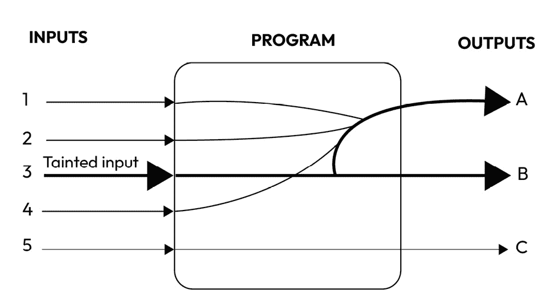

# 7

# 静态和动态分析

在我们走向干净、健壮和可维护的代码的过程中，我们经常需要“看看”我们的软件是如何工作的以及它是如何编写的。在识别代码异味并执行一些重构步骤（实际上，我们永远不应该停止这样做！）之后，扫描我们的代码以查找设计缺陷、安全漏洞等可能是有用的。

这种分析可以直接在代码上执行——也就是说，静态分析——或者在对运行程序执行时进行——也就是说，（无需过多想象）动态分析。

静态和动态分析工具会仔细检查代码以识别问题和低效之处。它们的见解为改进提供了基础，这正是重构发挥作用的地方。

在本章中，我们将讨论以下主题：

+   什么是静态分析？

+   为什么我们需要静态分析？

+   一些静态分析工具

+   什么是动态分析？

+   一些动态分析技术

# 什么是静态分析？

如其名所示，Java（或任何编程语言，实际上）中的**静态分析**指的是在不运行代码的情况下分析源代码的过程。这是一种在代码运行或编译之前用于查找问题、潜在错误、安全漏洞和其他问题的技术。静态分析工具用于此目的（我们很快就会进入这一点）。

进行静态分析有很多原因；让我们看看其中的一些。

## 代码错误或不良实践

我们将要向您展示的第一个可能看起来微不足道，但它是我们扫描代码以寻找问题的主要原因——也就是说，寻找代码中的问题！哪些问题？我们将它们归入通用术语“编码错误”——也就是说，程序员在编写代码时犯的错误（是的，结果证明即使是程序员也会犯错误——无论他们有多少经验，程序员仍然会犯错误。但是，随着他们经验的增加，他们更有可能承认自己的错误！）。这些错误可能导致各种问题，包括崩溃、意外行为和安全漏洞：

+   当程序尝试访问尚未初始化的内存位置时，可能会发生**空指针解引用**，如下所示。这可能导致崩溃和其他意外行为：

    ```java
    String text = null;
    int length = text.length();
    ```

    在这个例子中，我们有一个指向字符串的空引用（`text`），尝试访问其`length()`方法会导致`NullPointerException`。

+   总是返回错误的`if`语句。不可达的代码并无害处，但它可以使代码更难以阅读和维护。一般来说，它是无用的，我们不喜欢无用的代码（除非你写的代码行数越多，你的薪水就越高，但我们不相信这是真的）。以下是一个相同的例子：

    ```java
    public void unreachableCodeExample() {
        boolean condition = someBooleanMethod();
        if (condition) {
            System.out.println("Condition is true.");
            return;
        }
        System.out.println("This line of code is unreachable.");
    }
    private static boolean someBooleanMethod() {
        return true;
    }
    System.out will never be executed. So, you have to refactor your code: you could fix the boolean method if that’s the case or just drop it and delete the if condition.
    ```

+   另一方面，**类转换异常**是 Java 中的运行时异常，当您尝试将对象转换为与对象实际类型不兼容的类型时发生。换句话说，您正在尝试将对象转换为它不是的类型，从而导致异常：

    ```java
    public void classMismatchExample(){
        Object i = 6;
        String s = (String) i; //this will throw an exception
        System.out.println(s);
    }
    ```

    这是一个非常简单的问题，通常在您编写代码时由您的 IDE 检测到，但仍然，这是一个静态分析的例子。

    一些静态分析工具还可以检测一些不良做法；其中最常见的是，一个类实现了`compareTo`方法，但您却在使用`equals`。当您实现`compareTo()`方法时，确保您也重写了`equals()`方法非常重要。这确保了在比较和相等性方面，类对象的一致性：

    ```java
    Person person = new Person();
    Person anotherPerson = new Person();
    if(person.equals(anotherPerson)) {
        System.out.println("They're equal");
    } else {
        System.out.println("They're not equal");
    }
    if(person.compareTo(anotherPerson) == 0) {
        System.out.println("They're equal");
    } else {
        System.out.println("They're not equal");
    }
    ```

    这个方法的结果可能不是我们想要的：

    ```java
    They're not equal
    equals method is not correctly implemented in our Person class, and we’re using the one coming from Object. If our class implements equals on it. To avoid any misbehavior, you could just override equals using compareTo:

    ```

    @Override

    public boolean equals(Object o) {

    如果（this == o）返回 true；

    if (o == null || getClass() != o.getClass()) return false;

    return this.compareTo(o) == 0;

    }

    ```java

    ```

+   最后，对您的代码进行良好的静态分析可以检测到**重复代码**，在我看来，这是我最常见的味道；静态分析工具可以识别重复的代码片段，并将它们标记为开发者的注意（通常，这一步可以直接由您最喜欢的 IDE 完成）。

## 安全性

代码的静态分析对于安全性至关重要，因为它在识别和缓解安全漏洞方面发挥着关键作用。在应用程序或系统执行之前，通过彻底检查源代码，静态分析有助于提高软件的整体安全态势。静态代码分析的一个显著好处是它能够减少安全漏洞，例如**跨站脚本**（**XSS**）和注入攻击，这些是常见且可能具有破坏性的威胁，对数据和应用程序的完整性和机密性以及平稳运行构成威胁。以下是一些更多的好处：

+   **检测 XSS 漏洞**：静态代码分析扫描源代码，查找任何用户输入（如表单字段或 URL 参数）未正确验证或清理的实例。这种细致的检查有助于识别恶意代码注入的潜在入口点。例如，在 Web 应用程序的上下文中，静态分析可以确定用户提供的可能直接包含在 HTML 或 JavaScript 代码中的位置。这些信息对于修复这些问题非常有价值，因为它增加了适当的输入验证和输出编码，从而阻止 XSS 攻击。

+   **缓解注入攻击**：静态分析在检测可能导致注入攻击的漏洞方面非常有效，包括 SQL 注入，这可能会危害数据库和敏感数据。通过分析代码，它可以标记出任何直接在 SQL 查询中使用用户输入而没有适当参数化或转义的实例。然后，开发者可以修改代码，使其使用预定义语句或存储过程，从而有效预防注入攻击。

+   **库和组件漏洞扫描**：我们可以将分析扩展到动态链接库和第三方组件。我们应该定期扫描应用程序使用的库和依赖项中已知的安全漏洞。自动化工具可以帮助识别过时或易受攻击的组件，确保软件依赖于安全和最新的代码。

+   **早期检测和预防**：静态代码分析的一个关键优势是它能够在开发过程的早期阶段检测到漏洞。这种早期检测至关重要，因为在测试或生产等后期阶段解决安全问题可能会花费更多成本并造成更大的破坏。静态分析使开发团队能够在编写代码时解决漏洞，从而降低安全问题进入最终产品的可能性。

通过在根源上解决这些漏洞，组织可以最大限度地减少安全漏洞的可能性以及相关的风险和成本。

## **循环复杂度**

代码的静态分析还可以用来计算并保持代码本身的循环复杂度在可控范围内。让我们试着理解它是什么。简单来说，**循环复杂度**就像计算你通过一段代码的不同路径。如果路径较少且不太复杂，循环复杂度就较低，代码也就更容易阅读和理解。

要降低循环复杂度，你“只需”编写干净的代码，但应用我们在前几章中给出的所有建议，并移除所有你遇到的代码异味。静态分析可以帮助你，例如，检测过长的方法或函数、重复的代码或死代码（即运行时从未使用过的代码）；它还可以帮助你减少决策结构的数量（这是一个大问题：尽量在你的代码中避免尽可能多的`if`语句以降低复杂性）并帮助你避免在方法中设置标志参数。

我们在这里不会过多地探讨这个问题，但我们认为了解如何计算简单方法的循环复杂度通常很有趣。假设你拥有以下代码：

```java
public int calculateSum(int a, int b) {
    if (a > 0) {
        return a + b;
    } else {
        return a - b;
    }
}
```

您可以使用控制流图计算软件程序中函数、模块、方法或类的圈复杂度。绘制`calculateSum`方法的控制流图应该比解释什么是控制流图更容易。它表示了程序所有可能的执行路径，看起来像这样：


图 7.1 – `calculateSum`方法的控制流图

之前的图表示了`calculateSum`方法的控制流图。我们可以看到一个**起始**节点，从这个节点开始有一条边进入一个条件节点；根据条件（**TRUE**或**FALSE**），流程通过一条边或另一条边（**a+b**或**a-b**）。它们都结束在**结束**节点。

要计算圈复杂度，有一个简单的公式：**M = E – N + 2**。在这里，我们有以下内容：

+   **M** 代表圈复杂度

+   **E** 是控制流图中的边数

+   **N** 是控制流图中节点的数量

在我们的例子中，**M = 5 – 5 + 2 =** **2**。

通常，圈复杂度值超过 11 的代码被认为过于复杂，给测试和维护带来挑战。

以下是一些静态分析工具常用的常见圈复杂度值：

+   **1-4**：低复杂度 – 相对容易测试

+   **5-7**：中等复杂度 – 可管理

+   **8-10**：高复杂度 – 建议重构以提高可测试性

+   **11 以上**：非常高的复杂度 – 极具挑战性

代码的复杂度级别也会影响其可测试性。圈复杂度越高，创建全面测试就越困难。圈复杂度值表示达到 100%分支覆盖所需的测试用例数量。

## 异常（处理）情况

Java 程序中的异常并不总是得到应有的处理；由于处理不当而产生的缺陷很常见，并且经常被低估。在 Java 中正确处理异常对于防止程序崩溃、维护数据完整性、提供更好的用户体验、增强调试、提高安全性和保持代码质量至关重要。正确处理的异常有助于软件从错误中优雅地恢复，并在必要时满足法规要求。

静态分析工具可以帮助我们检测一些常见的异常处理不当；我们将在下面看到一些。

考虑以下片段：

```java
Person person = null;
try {
    String name = person.getName(); //throws NPE
} finally {
    throw new IOException();
}
```

如您所见，在`finally`块中抛出了`IOException`；通常，在`finally`块中抛出异常被认为是一个坏味道，因为它可能会隐藏在`try`块中抛出的其他异常。在这种情况下，预期的输出应该是`NullPointerException`。

此外，在 `finally` 块中使用 `return` 语句可能会引起混淆。这条规则的重要性在于，当代码抛出异常时，`return` 语句可以丢弃它。让我们通过稍微修改一下之前的代码片段来看看：

```java
Person person = null;
try {
    String name = person.getName(); //throws NPE
} finally {
    return;
}
```

将 `NullPointerException` 抛出，但包含 `return` 语句的 `finally` 块只是被扫到地毯下。什么也没有发生。

我们接下来要看到的异常处理中的最后一个异味是当我们把一个流关闭到 `finally` 块中，然后发生失败。如果 `close()` 在调用流时失败，并且之后还有其他指令要执行，会发生什么？那些指令将简单地不被执行：

```java
public static void copyFiles(String sourceFileName, String destFileName) {
    InputStream inputStream = null;
    OutputStream outputStream = null;
    try {
        inputStream = Files.newInputStream(Paths.get(sourceFileName));
        outputStream = Files.newOutputStream(Paths.get(destFileName));
        copy(inputStream, outputStream);
    } catch (IOException e) {
        // handling exception
    } finally {
        try {
            inputStream.close();
            outputStream.close();
        } catch (IOException e) {
            throw new RuntimeException(e);
        }
    }
}
```

`copyFiles` 方法将一个文件复制到另一个文件（为了简洁，我们省略了内部复制方法），打开两个流（`inputStream` 和 `outputStream`）。正如您所看到的，在 `finally` 块中，两个流在同一个 `try` 块中被关闭：如果第一个失败，另一个将保持打开状态。

现在我们已经看到了在执行静态代码分析时我们寻找的是什么，让我们了解一些可以帮助我们的工具。像往常一样，将接下来的几节视为深化知识的建议，以便您能够日复一日地提高代码质量。

## 自动静态分析工具

自动静态分析工具，如 SonarQube、Checkstyle、FindBugs 和 PMD，在软件开发过程中发挥着至关重要的作用，帮助开发者保持代码质量，识别潜在问题，并遵守编码标准。这些工具对于确保软件项目不仅功能正确，而且可维护和健壮至关重要。

### SonarQube 和 SonarLint

**SonarQube** 是一款综合性的工具，旨在进行持续代码检查。其主要功能是自动分析代码库，定位潜在问题，如错误、安全漏洞和代码异味。通过无缝集成到 **持续集成和持续部署**（**CI/CD**）流程中，SonarQube 确保每个构建都经过对代码质量的深度检查。这个过程包括识别和报告可能需要改进或关注的区域。

SonarQube 的一个显著特点是它能够执行安全漏洞检测，这在当今软件开发领域中至关重要，因为安全是首要任务。该工具提供了对代码库的整体视角，帮助开发团队在整个开发生命周期中保持高标准的代码质量。此外，SonarQube 还提供历史分析，允许开发者跟踪代码质量随时间的变化。这种历史视角对于评估代码改进的有效性或识别潜在的回归至关重要。

SonarQube 和**SonarLint**经常一起使用，就像*蝙蝠侠*和*罗宾*一样。SonarLint 是一个轻量级的 IDE 扩展，作为 SonarQube 的有价值伴侣，为开发者提供了一种在 IDE 中直接解决代码质量问题的方法。SonarLint 在实时操作，在开发者编写代码时提供即时反馈。通过集成流行的 IDE，如 Eclipse、IntelliJ IDEA 和 Visual Studio，SonarLint 无缝地成为本地开发环境的一部分。

SonarLint 的一个优势在于其语言支持，涵盖了多种编程语言。这种多功能性允许开发者在不同项目和代码库中应用一致的代码质量标准。重要的是，SonarLint 可以配置为与 SonarQube 同步，确保开发者遵守与 SonarQube 执行的集中分析相同的规则集。

从本质上讲，SonarQube 和 SonarLint 携手合作，创建了一个强大的系统，用于维护和提升代码质量。SonarQube 提供集中、全面的分析，而 SonarLint 则将这种分析直接带入开发者的本地环境，使他们能够在编码过程中积极解决问题。这些工具共同为生产高质量、安全且易于维护的代码做出了重大贡献。

### Checkstyle

**Checkstyle**是一个开源工具，用于强制执行 Java 代码的编码标准和约定。它将源代码与一组预定义的规则进行比较，并报告违规情况。Checkstyle 高度可配置，允许开发团队自定义并强制执行他们自己的编码标准。Checkstyle 的一些关键特性如下：

+   **可自定义的规则**：Checkstyle 允许你定义自己的编码规则或使用基于既定编码标准（如 Sun 代码约定、Google Java 风格等）的预定义规则集。你可以定义有关缩进、行长度、变量命名、导入顺序等方面的规则。

+   **集成**：Checkstyle 可以集成到流行的 IDE 和构建系统中，使开发者能够无缝地将代码检查纳入他们的开发工作流程。

+   **持续集成**：它通常集成到**持续集成**（**CI**）管道中，确保在代码更改提交时自动执行代码质量检查。

+   **报告生成**：Checkstyle 生成详细的报告，使开发者能够轻松识别和修复代码违规。

### FindBugs

**FindBugs**是一个用于识别 Java 代码中错误和潜在安全漏洞的静态分析工具。它使用静态分析来检测字节码中的问题，因此在发现仅从源代码中不明显的问题时特别有价值。以下是 FindBugs 的一些关键特性：

+   **错误检测**：它旨在发现各种错误，包括空指针解引用、线程同步问题和性能瓶颈

+   **集成**：与 Checkstyle 一样，FindBugs 可以集成到各种开发环境和 CI/CD 流水线中

+   **用户自定义检查**：开发者可以为特定项目的问题创建自定义的错误检测器

+   **社区支持**：FindBugs 有一个活跃的社区，维护和更新这个工具，确保它保持相关性和有效性

FindBugs 通过查看其字节码来审查您的代码——也就是说，无需访问原始源代码。但由于其分析并不总是完美的，FindBugs 有时会发出并非真正问题的警告。FindBugs 报告的这些虚假警告的比率低于 50%。

### PMD

**PMD** 是一种针对多种编程语言的静态源代码分析器，包括 Java。它专注于代码质量，并识别潜在的问题、冗余和复杂的代码模式。PMD 提供以下关键特性：

+   **多语言支持**：它支持多种语言，而不仅仅是 Java，这使得它在具有多样化代码库的项目中更加灵活

+   **基于规则的分析**：它将源代码与一组预定义的规则进行对比分析，这些规则可以根据项目需求进行自定义

+   **代码重复检测**：PMD 可以检测重复的代码片段，帮助开发者维护更干净、更易于维护的代码

+   **集成**：PMD 可以集成到不同的 IDE 和构建系统中（PMD 为 Visual Studio Code 提供了一个扩展，使得在这个流行的 IDE 中工作的开发者更加方便）

在我们编写代码的地方（IDEs）以及在我们工作时监控系统代码的系统（CI 流水线）中，使用检查代码错误的工具都很重要。这些工具帮助我们尽早发现错误，这非常有帮助。

在我们的代码编写环境（IDE）中，这些工具帮助我们编写代码时发现问题，使得错误出现的可能性降低。

在我们的代码监控系统（CI 流水线）中，这些工具确保我们编写的代码遵循我们设定的规则和标准。这保证了我们代码的质量，并确保我们不会意外地破坏以前正常工作的东西。

这些工具的其中一个优点是确保团队中的每个人都遵循相同的规则。这有助于我们的代码更有组织性，更容易理解，总体上更好。这些工具还节省了我们的时间和金钱。它们帮助我们尽早发现并解决问题，这比等到问题变得难以解决时更便宜、更快。

最后，使用这些工具可以使我们的代码更好，帮助我们更容易地协作，并确保我们的代码安全，避免错误。

通过这样，我们快速地浏览了静态分析，关注了要寻找的内容以及如何寻找。不幸的是，仅静态分析是不够的。干净的代码是一回事——高效的代码是另一回事。在程序运行时分析代码是绝对必要的。

# 什么是动态分析？

当静态分析在代码上执行时，其互补版本，**动态分析**，是在程序运行时进行的。这种方法涉及在执行过程中分析代码，而不仅仅是检查源代码，或者执行静态分析，后者是在不执行代码的情况下检查代码。动态分析提供了关于程序在实际场景中行为的见解，并有助于识别仅通过静态分析可能不明显的问题。

如果你曾经进行过一些单元测试或调试，那么，你已经进行了一些动态分析。但这里还有更多。动态程序分析涉及收集关于程序行为的各种见解，包括理解变量的值赋值、函数调用的顺序和时机、数据结构的操作和修改、内存分配和使用、系统资源的利用以及检测到的错误。这些信息对于识别错误和安全漏洞、提高程序性能、验证程序是否符合其要求以及深入了解程序的操作原理等目的至关重要。

动态程序分析的例子有很多；让我们开始这段旅程。

## 调试

尽管这可能看似微不足道，**调试**是动态程序分析中最广泛使用的技巧；也许这是我们行业中做的最多的一件事——是的，肯定比编写代码或设计架构要多得多。是的，我们知道通过实施一些关于测试的良好习惯（例如**测试驱动开发**（**TDD**））来减少调试的需求应该是最低的，理想情况下为零，但在现实世界中，并不总是能够做到这一点。

由于这是一个如此受欢迎的活动，我们不会过多地讨论调试。然而，我想提醒大家注意一些可能被低估的方面，尤其是在他们职业生涯的初期。

为了有效地调试，首先尝试重现错误；根据经验，这可能是一个困难的阶段，有时甚至比解决方案本身还要困难。这涉及到有人向你解释产生该错误的原因（如果你自己没有注意到），并重现导致问题的相同输入或至少是相同类型的输入。甚至不能保证你能使用调试器：例如，如果你无法在可以使用调试器的环境中重现问题（例如，你的本地主机），你需要使用其他技术，例如日志记录。通过在关键点记录程序的状态，你可以更容易地追踪错误的来源。正如我们已知的那样——这也是整本书的关键目标——重构可以帮助你调试。有时，这看起来可能就像一场游戏，但重构你的代码并使其更简洁可能会帮助你理解正在发生的事情。

虽然性能分析作为一种技术被广泛使用，但我必须指出，哭泣和敲打键盘并不能修复错误；另一方面，不要犹豫去寻求帮助。这也可以是一个非常困难的事情。

## 性能分析

即使是最熟练的开发团队也可能发现，一些代码行一开始并不能达到最佳性能。为了发现提高代码速度的最有效方法，必须对其进行评估、调试和审查。

软件工程师（以及质量保证专业人员）必须采取一些措施来确保他们的代码尽可能快速、流畅且无瑕疵。

**性能分析**是衡量和分析程序运行行为和性能特征的过程。性能分析的主要目标是识别代码中的瓶颈、性能问题和优化区域。这对于提高程序的效率和速度至关重要。性能分析可以应用于各种类型的软件，包括桌面应用程序、Web 应用程序和服务器端软件。

有许多不同的性能分析工具可用，它们可以收集多种类型的数据，如下所示：

+   **CPU 使用情况**：此数据显示了程序正在使用多少 CPU 时间。

+   **内存使用情况**：此数据显示了程序正在使用多少内存。

+   **函数调用频率**：此数据显示了程序中每个函数被调用的频率。

+   **函数执行时间**：此数据显示了程序中每个函数执行所需的时间。

+   **资源使用情况**：此数据显示了程序正在使用多少种不同的系统资源，例如磁盘 I/O 和网络带宽。

一旦收集了剖析数据，就可以进行分析以识别瓶颈。瓶颈是程序中减慢其速度的部分。例如，一个被频繁调用且执行时间较长的函数可能是一个瓶颈。一旦识别出瓶颈，可以通过优化代码来修复它们。例如，瓶颈函数可能被重写以使其更高效。剖析是提高软件性能的有价值工具。它可以用来识别和修复瓶颈，并确保程序高效地使用系统资源。

剖析在各个领域都有实际应用。例如，网络应用程序开发者可以使用剖析器来识别他们应用程序中的性能瓶颈，从而优化代码以实现更快的加载。同样，游戏开发者使用剖析器通过识别和优化游戏中的问题部分来提高帧率。服务器管理员也利用剖析器来定位资源密集型进程，使他们能够减轻服务器的资源负担。

许多工具被用于分析正在运行的 Java 应用程序。有时，这些工具包含在你的 IDE 的插件/扩展中，例如 NetBeans 或 Eclipse。最常用且常见的工具之一是 VisualVM，这是一个集成到**Java 开发工具包**（**JDK**）中的可视化工具，它提供了一系列的剖析、监控和诊断功能，包括 CPU 剖析、内存剖析和线程分析。

**VisualVM**为监控和分析 Java 应用程序提供了一个用户友好的图形界面。它提供了丰富的可视化数据和性能指标，使得识别和解决性能问题变得更加容易。VisualVM 的一个关键特性是其 Java 剖析能力。它允许开发者剖析他们的应用程序以识别瓶颈、内存泄漏和其他与性能相关的问题。你可以执行 CPU 剖析、线程分析和内存剖析，这对于提高 Java 应用程序的效率和可靠性至关重要。

当您的应用程序开始出现异常并且您不知道确切发生了什么（例如，一切开始变慢），最好的机会之一（同时也是最绝望的）就是制作所谓的“堆转储”或“内存转储”。**内存转储**本质上是在某个特定时间点计算机内存（RAM）或特定进程内存的快照。这个快照捕捉了系统或应用程序在创建时的状态。内存转储在多个重要方面发挥作用，包括调试软件错误和崩溃、分析安全事件和恶意软件感染、调查系统崩溃以及优化应用程序中的内存使用。它们有不同的类型，如完整内存转储（用于与硬件相关的问题）、内核内存转储（用于操作系统问题）、进程内存转储（用于特定于应用程序的调试）和迷你转储（用于更小、更易于管理的数据）。内存转储分析对于深入了解系统和软件行为至关重要，并且是解决各种计算问题的基本工具。

VisualVM（类似于其他分析工具）允许您捕获堆转储和线程转储，这对于诊断与内存相关的问题和分析 Java 应用程序中的线程行为至关重要。

## 模糊测试

**模糊测试**，也称为**模糊测试**，是一种自动化的软件测试方法，其中向计算机程序提供非传统、通常随机且无效的数据作为输入。程序的反应会密切监控异常，如崩溃、违反内置代码规则或潜在的内存问题。模糊测试器通常用于评估依赖于结构化输入的软件程序，例如区分有效和无效数据的文件格式或协议。

一个好的模糊测试器会生成部分有效的输入，这些输入“足够有效”以避免被输入解析器立即拒绝，但“足够无效”以揭示未预料到的程序行为，尤其是在可能没有得到充分处理的边缘情况。

在安全环境中，模糊测试最有价值的输入通常是跨越信任边界的数据。**信任边界**是数据或程序执行在不同信任级别之间转换的点，或者是在具有不同权限的实体之间交换数据和命令的点。信任边界可以在系统的不同位置找到，其中所有子系统及其数据具有相同的信任。例如，当应用程序获得提升的权限，如 root 访问时，就会发生执行信任边界。当数据来自不受信任的来源，如用户输入或网络套接字时，就会发生数据信任边界。例如，对于处理来自任何用户的文件上传的代码进行模糊测试比处理仅对特权用户可访问的配置文件的代码更为关键，因为它跨越了信任边界。

每个模糊器都可以归入两个类别之一：

+   **基于变异的模糊器**：这些模糊器从现有的数据样本开始，对它们进行修改以创建新的测试用例。它们首先获取原始输入或测试用例，然后以各种方式对其进行修改，例如更改随机位或值，以查看这些修改是否会在被测试的软件中触发意外的行为或漏洞。基于变异的模糊器擅长发现某些类型的错误或漏洞，尤其是在你有初始有效输入集可以工作的时候。

+   **基于生成的模糊器**：这些模糊器通过理解目标协议或文件格式的结构和规则来构建测试用例。它们不是修改现有的数据样本，而是生成遵循特定格式和逻辑要求的新数据，以进行测试。这些模糊器擅长探索程序或系统的不同方面，因为它们可以根据对协议或文件格式的了解创建广泛的测试用例。

现在，我们将深入探讨这两组内部的子类别。没有普遍认可的模糊分类列表，但我喜欢书中描述的方法 *Fuzzing: Brute Force Vulnerability Discovery*（见 *进一步阅读*），所以我将尝试总结它们。

### 预生成的测试用例

如前所述，**预生成的测试用例**方法，以 PROTOS 框架为例，首先研究一个特定的规范。它涉及理解支持的数据结构和可接受的价值范围。然后，测试用例被精心制作成硬编码的数据包或文件，旨在测试边界条件或挑战规范本身。这些测试用例对于评估规范在各种系统上实施得有多准确非常有价值。虽然这种方法在测试用例创建方面需要大量的前期工作，但其优势在于其可重用性，可以在同一协议或文件格式的多个实现中重复使用。然而，一个限制是模糊测试是有限的，因为没有随机元素；一旦测试用例列表耗尽，模糊测试就结束了。

### 随机

**随机方法**是最简单但效果最差的方法。它涉及向目标投掷伪随机数据，并寄希望于最好的（或最坏的，取决于你的观点）。令人惊讶的是，使用这种技术已经发现了关键软件中的漏洞。挑战的部分是确定由大量随机字节引起的异常或服务器崩溃的原因。使用嗅探器捕获流量对于方便调试至关重要，通常需要大量的调试器和反汇编器时间。调试堆栈溢出可能特别麻烦，因为调用栈被破坏。

### 手动协议变异测试

**手动协议变异测试**甚至比随机模糊测试更不复杂。它不涉及自动模糊器；相反，测试者变成了模糊器。通过向目标应用程序输入不适当的数据，目标是使服务器崩溃或引发不希望的行为。这是一种简单、成本效益高的方法，通常应用于 Web 应用程序，使分析师在审计过程中可以依靠经验和直觉。

我们认为这种方法有时被称为**走廊可用性测试**，尽管可用性测试与测试程序的正确性是不同的。如果你对走廊可用性测试感兴趣，请参阅*进一步* *阅读*部分。

### 变异或暴力测试

**暴力测试**涉及从一个协议或数据格式的有效样本开始，并不断修改该数据包或文件中的每个字节、单词或字符串。虽然这种方法需要最少的前期研究并且相对容易实现，但它效率不高，因为它可能会浪费 CPU 周期在无法解释的数据上。尽管如此，它可以完全自动化，并且依赖于一组已知良好的数据包或文件进行测试。暴力文件格式模糊器示例包括 Windows 的 FileFuzz 和 Linux 的 notSPIKEfile。

### 自动协议生成测试

在**自动协议生成测试**中，测试者最初研究和理解协议规范或文件定义。而不是创建硬编码的测试用例，开发了一种语法来描述协议的操作。在数据包或文件中确定了静态和模糊变量。模糊器通过查看模板、创建模糊数据，然后将更改后的数据发送到目标。这效果如何取决于测试者在解析过程中找到可能导致问题的规范部分的能力。显著的例子是 SPIKE 和 SPIKEfile。然而，这种方法需要时间来创建语法或定义。

我们只是想给你一个大致的概念概述，这些概念我们经常看到被实施，但没有真正“结构化”所做的事情。像往常一样，我们并不声称是详尽的，只是希望激发你对这个主题的一些好奇心。

## 符号执行

**符号执行**是一种程序分析方法，其中程序使用符号输入而不是具体输入来运行。同时，它保留一个路径条件（参见*循环复杂度*部分了解*路径*是什么），每次遇到分支指令时都会演变，封装导致程序中特定点的输入约束。换句话说，它通过用符号值替换实际数据作为输入，并将程序变量值描述为符号表达式来工作。这样，程序的结果被表示为这些符号输入的函数。

为了创建测试，此方法依赖于使用约束求解器解决收集到的约束。符号执行对于查找错误也很有用，因为它在程序运行时检查错误或断言违规，并创建可以触发这些问题的测试输入。

它也被视为一种**白盒模糊测试**，因为你在模糊测试（参见上一节）的同时，还了解程序的工作原理（是的，也包括代码——它介于静态分析和动态分析之间）。

考虑这个非常简单的 Java 方法：

```java
void doSomething() {
    int x = getInput();
    int z = x + 2;
    if (z > 20) {
        throw new RuntimeException();
    } else {
        System.out.println("OK");
    }
}
```

这种方法确实做了某些事情，所以它的名字并没有撒谎，但它并没有做任何有意义的事情。它只是用来解释符号执行是如何在这个方法上工作的。

在常规执行（通常称为“具体”执行）中，程序的操作如下：它读取一个特定的输入值（例如，`10`）并将此值分配给变量`x`。随后，程序执行加法操作（`z = x + 2`）和条件分支，在这种情况下，导致评估结果为假，输出为`OK`。

在符号执行期间，程序的操作方式不同。它读取一个符号值，由一个符号如λ表示，并将此符号分配给变量`x`。然后程序继续进行加法操作，将`z`设置为λ + 2。当它遇到`if`语句时，评估条件为λ + 2 > 20。在这个阶段，符号λ可以取任何值，符号执行通过“分支”分为两条不同的路径。每条路径都保留了分支点的程序状态副本以及路径条件。

在这个例子中，一条路径与`λ + 2 > 20`路径条件相关联，导致执行`if`分支，而另一条路径与`λ + 2 <= 20`路径条件相关联，导致执行`else`分支。这两条路径都可以独立进行符号执行。

当路径达到其结论时，这可能是由于异常（例如，抛出`RuntimeException`）或程序终止，符号执行通过解决它探索的每个路径的路径约束来找出λ的具体值。这些特定值可以被视为现实世界的测试用例，对于诸如错误复现等任务非常有用。在这种情况下，约束求解器会确定要抛出`RuntimeException`，λ需要大于或等于 18。

我们必须承认，这项技术使用得不多，并且存在一些缺点。例如，正如你很容易猜到的，程序的循环复杂度越大，符号执行的复杂性也越大；随着程序复杂性的增加，这项技术根本无法扩展。此外，这种分析技术的效率在很大程度上取决于程序本身的效率。还有其他一些矛盾之处，我邀请你在**进一步阅读**部分观察。

## 污点跟踪

**污点跟踪**，通常被称为**信息流跟踪**或**数据流跟踪**，是一种用于计算机安全和软件分析的技术，用于监控程序或系统内部的数据流动以识别潜在的安全漏洞。污点跟踪通过将数据标记为“污点”，如果它来自不受信任的来源，如用户输入或来自互联网的文件。然后污点跟踪器跟踪这种污点数据在程序中的流动，以识别可能导致安全漏洞的任何操作。污点数据可以包括密码、个人信息或任何不应被未经授权的用户暴露或操作的数据。

这就是污点跟踪通常的工作方式：

1.  **数据标记**：当数据来自外部来源，如用户输入时，污点跟踪系统会将某些数据标记为“污点”或“不可信”。例如，如果用户提供了密码作为输入，那么该密码数据就会被标记为污点。

1.  **数据流监控**：然后系统监控这种污点数据如何在程序中流动。它跟踪污点数据与哪些变量、函数和组件交互。

1.  **违规检测**：污点跟踪机制持续检查污点数据是否以可能危害安全的方式使用。例如，如果污点数据用于数据库查询、通过网络发送或包含在响应中，污点跟踪系统可以将其标记为潜在的安全风险。

1.  **警报生成**：当检测到潜在的安全违规时，系统可以生成警报、记录事件或采取其他预定义的操作来减轻风险。这有助于识别和修复安全漏洞：



图 7.2 – 其中一个可能的输入被标记为受污染（因为它来自不受信任的来源），并且其通过程序的流动被跟踪，直到其可能的输出

例如，可以使用污点跟踪器来识别 Web 应用程序中的 SQL 注入漏洞。当攻击者能够将恶意 SQL 代码注入 Web 应用程序的数据库查询中时，就会发生 SQL 注入漏洞。这可能会允许攻击者读取或修改数据库中的数据，甚至可以在 Web 服务器上执行任意代码。污点跟踪器可以通过标记所有用户输入为受污染来识别 SQL 注入漏洞。然后，污点跟踪器会跟踪这种受污染数据在 Web 应用程序代码中的流动，以识别可能导致 SQL 注入漏洞的任何操作。例如，如果受污染的数据在未经适当清理的情况下用于数据库查询，污点跟踪器会将此标记为潜在漏洞。

稍作偏离——什么是 SQL 注入？

即使它与污点跟踪没有严格的关系，我们认为了解什么是**SQL** **注入**也是值得的。

SQL 注入是一种常见且危险的网络安全攻击，攻击者可以通过注入恶意 SQL 代码来操纵 Web 应用程序的 SQL 查询。这可能会导致未经授权的访问、数据盗窃，甚至数据篡改。但这是如何发生的呢？假设您有一个 Web 应用程序，它通过以下 SQL 查询使用用户输入在数据库中搜索特定用户：

`SELECT * FROM user WHERE username = '``input';`

在这里，输入直接来自`用户`输入，并且应用程序没有正确验证或清理这个`输入`。

攻击者可以通过以下方式利用这个漏洞作为他们的用户名：

`'` `OR '1'='1`

SQL 查询将看起来像这样：

`SELECT * FROM users WHERE username = ''` `OR '1'='1';`

`'1'='1'`条件始终为真，因此查询实际上选择了`users`表中的所有行，允许攻击者绕过任何身份验证并访问所有用户数据。

为了防止 SQL 注入，你应该使用 Java 的**Java 数据库连接**（**JDBC**）API 或一些其他流行的框架（如 Hibernate）提供的参数化查询或预编译语句。以下是您如何重写有漏洞的代码以使其变得安全的方法：

`String userInput =` `getUserInput();`

`String sqlQuery = "SELECT * FROM users WHERE username = ?";`

`PreparedStatement preparedStatement =` `connection.prepareStatement(sqlQuery);`

`preparedStatement.setString(1, userInput);`

`ResultSet resultSet =` `preparedStatement.executeQuery();`

在这个例子中，使用`PreparedStatement`创建了一个参数化 SQL 查询，其中`?`是用户输入的占位符。然后使用`setString`方法安全地将用户输入设置为参数（请注意，没有引号和字符串连接）。查询被执行，结果被安全地处理。

通过使用这种参数化查询，你可以防止 SQL 注入攻击，因为 JDBC 驱动程序将输入作为数据而不是可执行 SQL 代码来处理。这确保了用户输入被安全地处理，并且不会干扰查询的结构。

污点跟踪可用于识别各种其他安全漏洞，例如跨站脚本攻击（XSS）、命令注入和不安全的路径遍历。它还可以用于跟踪敏感数据，如信用卡号和社会安全号码的流动。

使用污点跟踪提供了各种优势，包括能够揭示通过其他测试方法难以或甚至无法识别的软件安全漏洞。这种方法还允许你监控敏感数据流动，有助于减轻数据泄露的风险。此外，它提供了一种建立安全沙箱的方法，有效地将不受信任的代码与受信任组件隔离开来。

尽管如此，污点跟踪也带来了一些挑战。其实现可能很复杂，需要软件安全和污点跟踪的专业知识。它可能会对被监控程序的性能产生影响，并可能导致大量误报，这可能会耗费大量时间进行调查。

值得注意的是，一些编程语言，如 Perl、Ruby 或 Ballerina，原生支持*污点检查*功能，该功能逐个变量进行，形成一个可能受外部输入影响的变量列表。更多信息可以在*进一步阅读*部分找到。

# 摘要

在这一章中，我们为编写和维护干净代码以及高效软件的工具箱添加了另一个工具：代码分析。我们了解到我们可以通过两种方式来完成它：在代码运行之前（静态地）检查代码，以及在代码运行时（动态地）监视代码。我们试图弄清楚在每个分析中应该注意哪些问题，并且我们还找到了一些工具和技术可以帮助我们。

就像我们之前讨论的其他内容一样，这一章节旨在为你提供深入学习的思路。代码分析通常被视为额外的步骤，就像一个可选的过程，但它却是使项目高效且易于维护的关键部分。因此，不要低估它的重要性！

除了进行分析和改进工作的时候，保持日常任务的一定质量水平同样至关重要。通过使用一些简单但有效的方法，你可以用最小的、有针对性的努力产生显著的效果。在下一章中，我们将探讨这些方法中的一些。

# 进一步阅读

+   节点复杂度：[`www.geeksforgeeks.org/cyclomatic-complexity/`](https://www.geeksforgeeks.org/cyclomatic-complexity/)

+   SonarQube 文档：[`docs.sonarsource.com/sonarqube/latest/`](https://docs.sonarsource.com/sonarqube/latest/)

+   PMD 文档：[`pmd.github.io/pmd/index.html`](https://pmd.github.io/pmd/index.html)

+   FindBugs 手册：[`findbugs.sourceforge.net/manual/index.html`](https://findbugs.sourceforge.net/manual/index.html)

+   CheckStyle 简介：[`www.baeldung.com/checkstyle-java`](https://www.baeldung.com/checkstyle-java)

+   开始使用 VisualVM：[`visualvm.github.io/gettingstarted.html`](https://visualvm.github.io/gettingstarted.html)

+   M. Sutton, A. Greene, 和 P. Amini，*Fuzzing: Brute Force Vulnerability Discovery*，由 Addison-Wesley Professional 出版

+   走廊可用性测试：[`www.techopedia.com/definition/30678/hallway-usability-testing`](https://www.techopedia.com/definition/30678/hallway-usability-testing)

+   符号执行的局限性：[`en.wikipedia.org/wiki/Symbolic_execution#Limitations`](https://en.wikipedia.org/wiki/Symbolic_execution#Limitations)

+   编程语言中的污点检查：[`en.wikipedia.org/wiki/Taint_checking`](https://en.wikipedia.org/wiki/Taint_checking)

# 第三部分：进一步学习

除了实际的重构行为之外，保持日常工作中一定水平的质量至关重要。有一些小而强大的方法可以实现这一目标，以最小的、集中的努力产生重大影响。我们将讨论如何格式化代码、管理代码版本以及通过结对编程等技术与他人合作。

在我们涵盖了关于修复类和包的所有内容之后，让我们退后一步，看看大局：架构。即使你的代码很好，如果不同部分之间的交互没有得到妥善管理，事情也可能出错。我们将讨论需要注意的迹象以及如何采取替代措施以确保一切顺利运行。

本部分包含以下章节：

+   *第八章*，*每天打造质量*

+   *第九章*，*超越代码 - 掌握软件架构*
