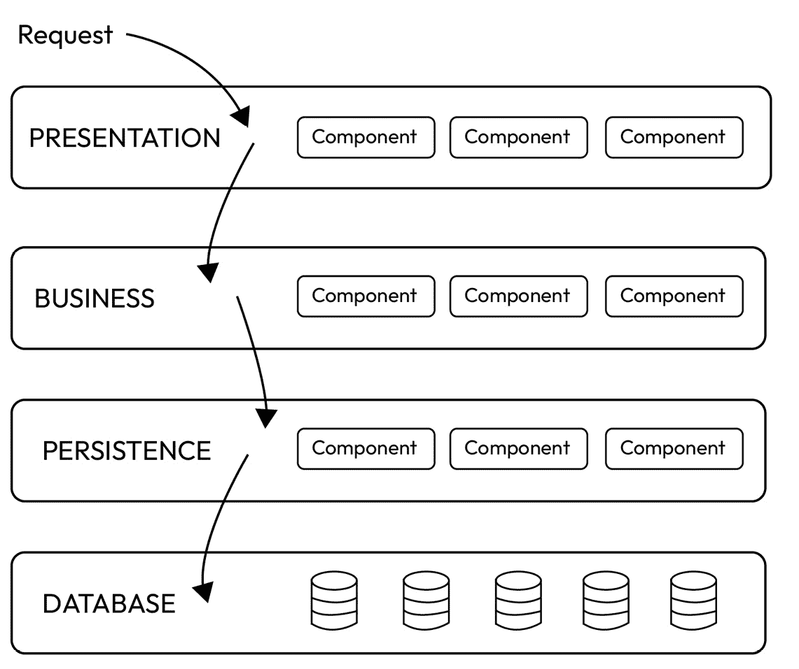
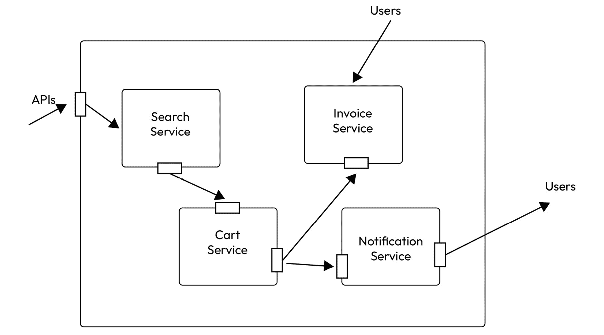
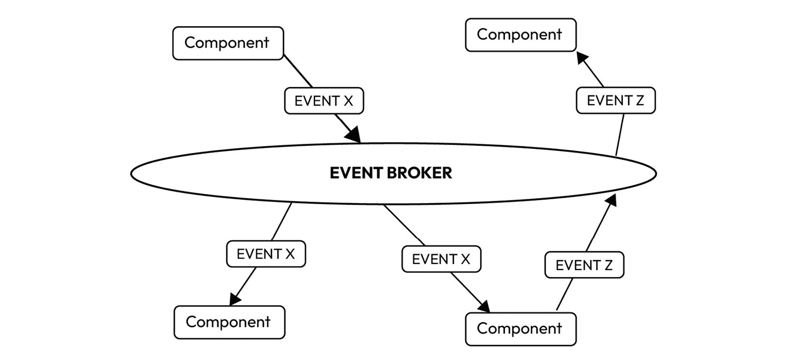
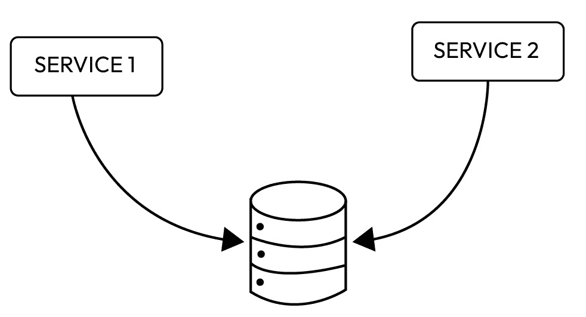
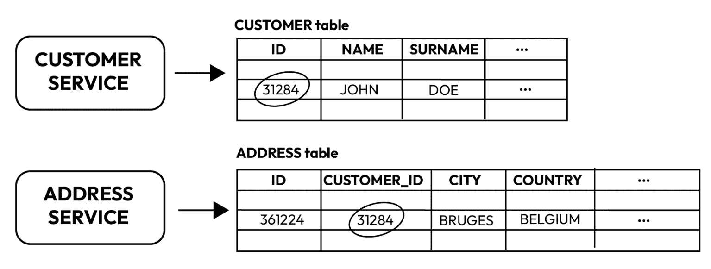
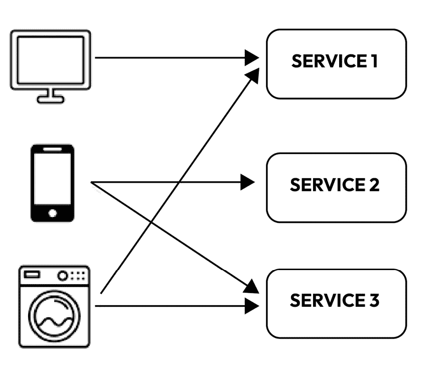
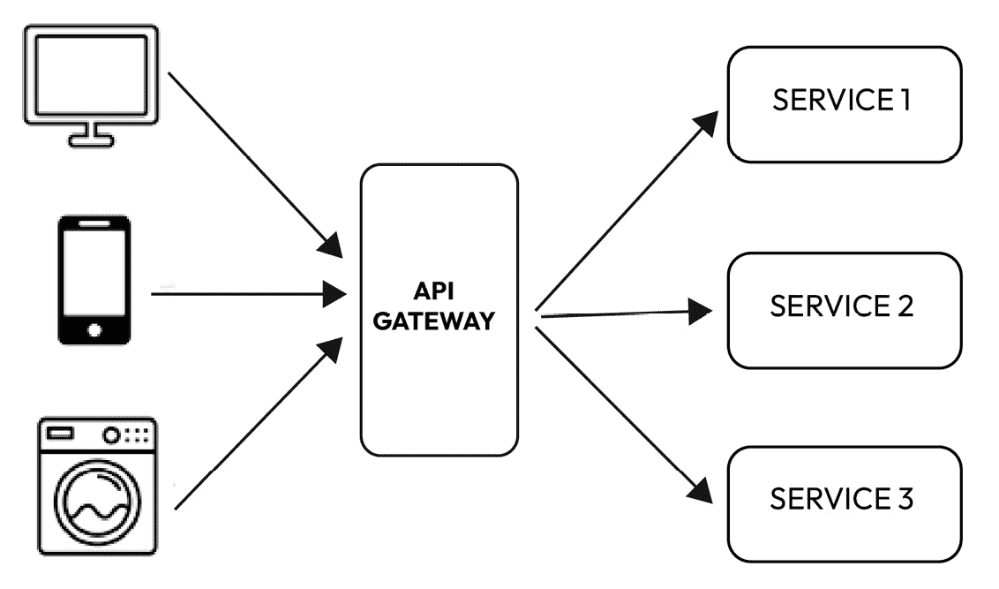
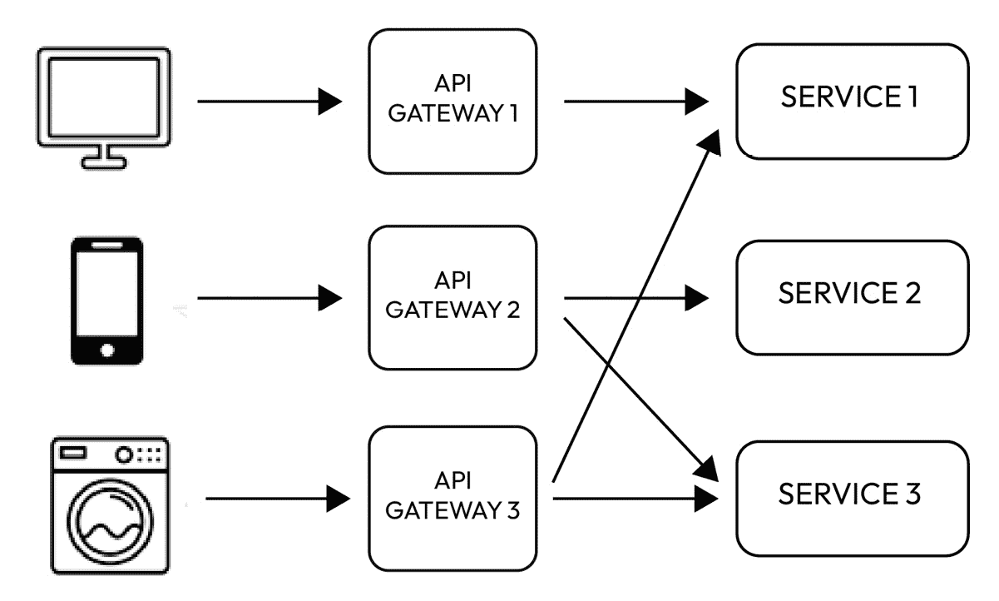

# 9

# 超越代码 - 掌握软件架构

到目前为止，关于为什么和如何不断重构代码的问题应该已经非常清晰了；一般来说，为什么拥有一个干净、可读和易于维护的代码库很重要。但在今天的开发世界中，我们很可能只有一个应用程序、一个组件；更现实的情况是，有各种组件相互交互。如果康威定律确实如此，即一个公司的结构和组织方式反映了其软件系统，那么拥有一个统一且可扩展的生态系统至关重要——不仅强大，而且具有弹性，经常提到的，还要干净。因为即使干净的代码，如果各种服务之间的交互管理不当，也可能导致灾难性的后果。

在本章中，我们将探讨以下主题：

+   什么是架构？

+   架构模式

+   从单体到微服务

+   微服务架构中的坏味道

# 什么是架构？

经过这一段旅程，我们已经意识到编写代码只是我们工作的一小部分。我们需要专注于编写不仅能够工作而且易于阅读和维护的代码。我们已经了解到，我们可以进行许多小的调整来使我们的工作更简单、更流畅。现在，让我们退一步，进一步思考：我们的工作真的只是关于代码吗？编写好的代码（无论这意味着什么）是不是我们唯一需要做好的事情，尽管它广泛而复杂？如果我们提出这个问题，你可以猜到答案：绝不是！就像电影《美食总动员》中厨师古斯塔夫说的，“*任何人都可以烹饪*”，在这里，我们可以改写他的话并说，*任何人都可以编写代码*。实际上，学习编写一些 Java 代码或者甚至在一些更简单的语言中编写代码只需要一点时间。在最近几个月里，与**人工智能**（**AI**）相关的技术爆炸式增长，这实际上可以为我们编写代码。但真正具有挑战性的不仅仅是编写代码或者甚至编写能够协同工作的软件组件，而是要做得好。正如罗伯特·C·马丁所说，“*编写正确的软件* *是困难的*。”

软件架构就像软件系统的蓝图。它是概述软件不同部分如何协同工作的计划。这包括关于如何设计以满足特定目标的决策。它包括诸如不同的软件组件、它们如何相互连接以及组织它们的规则等元素。因此，软件架构基本上是指导软件系统创建的高级设计。

软件系统的架构就像构建它的人所创造的设计或结构。它由系统如何划分为部分（组件）、这些部分如何组织以及它们如何相互通信来决定。用更简单的话说，这就是软件的不同部分是如何组合在一起并协同工作的。这是架构的一个定义，由罗伯特·C·马丁的《Clean Architecture》一书塑造。相反，阅读马丁·福勒的作品，我们得到了另一个（更有趣）的架构定义：经验丰富的开发者对系统设计和项目开始时希望正确做出的决策集体的知识。

我们希望这能让我们对软件架构的含义更加清晰，但也许当我们解释了其目标时，它将变得更加清晰。在目标方面，文献中的观点似乎相当明确：良好的架构可以使事物运行得更好。创建良好架构的原因是为了使开发、部署、运行和维护所包含的软件系统变得更加容易。

## 开发

只要有一个小型的单一团队处理整个项目，人们可能会认为架构并不那么重要；实际上，它被视为几乎是一个障碍。这就是为什么许多项目，尤其是在初创阶段，通常没有适当的架构。然而，随着项目的扩展，应尽快采取行动！事实上，与同一项目、同一模块的不同团队合作是一项挑战；这就需要将模块本身划分为定义良好的部分（“如何”则是另一个完全不同的话题）。仅仅将初始组件划分为多个组件是不够的。这需要谨慎进行，理解这些组件将如何相互交互。否则，存在从单个组件中，不同的组件可能简单地独立发展，各自为政的风险。如果每个人都各走各的路，那么在开发新功能或修复现有问题时将变得困难。如果一个软件系统难以开发，那么它不太可能拥有漫长而健康的使用寿命。因此，系统的架构应该设计得使团队或正在工作的团队的开发变得容易。

## 部署

**可部署性**意味着软件在合理的时间内（理想情况下，只需单击一次）可以轻松且可靠地设置和运行。如果新设置存在问题，应该能够在不太麻烦的情况下回到先前的版本。随着虚拟化和云系统的发展，以及软件系统规模的扩大，确保软件设置高效且可预测，降低系统的整体风险，这是架构师的工作。

不幸的是，很多时候，人们在最初构建系统时并没有考虑如何设置系统。这可能导致设计使得系统易于创建，但真正难以启动和运行。

例如，当开始构建系统时，开发者可能会选择包含一定数量服务和组件的架构。这可能有各种原因看起来是个好主意，比如更平滑的开发和每个组件独立工作。然而，在部署过程中，团队意识到其中一些服务是相互关联的，并且需要相互依赖才能正常工作。因此，部署变得具有挑战性，因为你可能需要部署的不仅仅是单个服务，还有相互关联的服务。如果架构师从一开始就考虑了系统设置，他们可能会选择更少的服务、服务和内部组件的组合，以及更集成的方式来管理连接。

## 系统操作

**系统操作**涉及对计算机系统或软件应用的日常管理和执行。这包括运行软件、监控其性能、应用更新和修复、确保安全、处理备份、协助用户以及处理出现的问题。本质上，这是持续努力保持系统平稳运行并满足用户需求。

架构对系统操作的影响通常被认为不如其对开发、部署和维护的影响显著。大多数操作挑战可以通过增加系统的硬件资源来解决，而无需对软件架构进行重大更改；这种情况相当常见。与人力资源成本相比，硬件的性价比意味着在操作中造成障碍的架构成本并不像阻碍开发、部署和维护的架构那样昂贵。

虽然不良架构对操作的影响容易修复，但这并不意味着它不是一个重要的方面。尽管所谓的“硬件”（通常意味着从像**亚马逊网络服务**（**AWS**）、谷歌或微软这样的公司购买云计算服务）的成本低于人力和时间成本，但这并不意味着它便宜或不重要。与它带来的价值（无论是经济上的还是其他方面的）相比，需要不成比例数量的资源的低效架构应该引起关注。

## 维护

**软件维护**指的是持续管理和更新软件的过程，以确保其持续满足用户需求并保持有效性。这包括进行修改、修复错误、提高性能以及使软件适应环境或用户需求的变化。

在这种情况下，我们可以直接将建筑物的架构与项目可管理性产生的影响进行比较，以理解其影响。想象两座建筑物，两座住宅：一座非常复杂且精致，其种类独一无二；它拥有为特定场合专门创造的特殊美学和技术特征，精选材料，以及独特解决方案。另一座建筑是一座经典的欧洲公寓楼，拥有笔直的立面和相同的窗户，使用常见的坚固材料，与之前遇到的非常相似。如果我要进行更改或解决问题，你认为在哪个建筑中操作会更简单？

在计算机程序的所有部分中，保持其运行是最昂贵的。对新功能和修复错误的持续需求需要人们投入大量时间和精力。保持程序运行的主要成本来自于搜索现有代码和处理风险。搜索代码，如罗伯特·C·马丁在其书籍《Clean Architecture》中所称的**洞穴探险**，需要时间和金钱来找出添加新事物或修复错误的最佳方式。在做出这些更改时，总有可能意外地造成新的问题，这增加了风险和成本。

对于程序如何设置有一个周密的计划，真的可以帮助减少这些成本。如果程序被分成不同的部分，并且每个部分通过稳定的连接保持独立，那么在不意外造成问题的前提下添加新事物会容易得多。这种规划减少了意外问题的风险，并使维护成本降低。

既然我们已经了解了架构是什么以及为什么它很重要，让我们来探索我们可以拥有的主要架构类型。

# 架构模式

在软件中，我们可以以不同的方式组织事物，这些组织结构被称为**软件架构模式**。其中许多已经经过尝试并证明对于解决不同问题非常有效。每个模式都以特定的方式安排事物，以解决软件中的特定问题。

但让我们保持兴趣，不要深入到一个超级长的模式列表中。相反，我们将查看一些最重要和最常用的模式。这样，我们可以理解主要思想，而不会被所有可能性所淹没。

## 分层架构

**分层架构模式**（也称为**N 层架构模式**）可能是最广泛使用的设计方法。它是许多 Java **企业版**（**EE**）应用程序的默认标准，在建筑师、设计师和开发者中广为人知。这种模式与大多数公司典型的沟通和组织设置紧密一致，使其成为开发商业应用的逻辑和常见选择。

在分层架构模式中，组件被组织成水平层，每一层在应用程序中都有特定的角色（例如展示或业务逻辑）。虽然该模式没有规定固定层数，但常见的设置有四层：**展示层**、**业务层**、**持久层**和**数据库层**。有时，为了简化，业务层和持久层会合并。小型应用程序可能只有三层，而大型应用程序可能有五层或更多。

每一层都有其独特的责任。例如，展示层处理用户界面和通信，而业务层执行业务规则。层创建了抽象，简化了任务。展示层专注于显示信息，而不是检索信息。同样，业务层专注于业务逻辑，将数据检索留给持久层，然后持久层将数据传递给业务层进行处理，并最终传递给展示层进行显示：

图 9.1 – 分层架构

分层架构模式在分离组件之间的关注点方面表现出色。每一层只关注其相关的逻辑——展示层关注展示，业务层关注业务，等等。这种分类简化了角色和责任模型，使得开发、测试、治理和维护变得简单。定义的组件接口和有限的范围有助于这种简便性。

值得注意的是，架构中的每一层都被标记为封闭的，这是该模式中的一个关键概念。**封闭层**意味着请求必须通过其下方的直接层才能到达下一层。例如，来自展示层的请求会穿过业务层，然后到达持久层，最后到达数据库层。

单体应用架构

在分层架构中，正如我们所说的，概念涉及将系统的不同组件或功能组织成不同的层。但这些层可以有两种解释方式：

**不同的应用程序/部署**：在这种解释中，每一层被视为一个独立的应用程序或部署。每一层代表一个具有特定责任的独立单元。例如，你可能有展示层、业务逻辑层和数据访问层作为独立的应用程序部署。这种方法促进了模块化，并促进了可扩展性和维护性。

**同一应用内部的组件（单体或 N 层）**：或者，可以将这些层视为同一应用内部的组件。在单体架构或 N 层架构中，不同的层存在于单个应用代码库中。例如，你可以有一个表示层处理用户界面，一个业务逻辑层管理应用规则，一个数据访问层与数据库交互——所有这些都在单个应用的范围内。

这两种解释都是有效的，选择哪一种取决于系统的具体架构设计目标和要求。

## 微服务

关于**微服务**有很多篇幅很长的书籍，现在不可能在这里全部告诉你。然而，我们至少应该给你一个关于这个主题的概述，因为多年来——也许直到今天——它们一直是我们的行业中的主要趋势之一。

**微服务架构**，通常简称为微服务，是一种特定的应用结构方式。在这种架构风格中，大型应用被分解成更小、更独立的组成部分，每个部分都有其独特的责任集。这种方法使得在整体系统中创建更多模块化和可管理的组件成为可能。为了表示这一点，我们可以举一个非常常见的应用的例子，有一个微服务专门用于搜索项目，另一个处理订单，另一个处理会计问题，最后一个处理通过电子邮件、推送等方式通知用户。以下是一个微服务架构的示例：

图 9.2 – 微服务架构的示例

在微服务的背景下，一个应用可以由许多内部微服务组成，每个微服务处理一个特定的功能。当用户发起请求时，微服务协同工作以组合和满足该请求。与所有功能紧密集成到单个大型应用中的单体架构相比，微服务的这种去中心化和模块化特性提供了灵活性、可扩展性和更易于维护。

在这个模式中，理解服务组件的概念至关重要。在微服务架构中，与其将服务视为服务组件，不如考虑服务组件更有益。这些组件的大小可以不同，从单个模块到应用的重要部分。服务组件包含一个或多个模块（即 Java 类），代表一个特定的功能（例如，为特定位置提供交通信息）或一个综合业务应用的独立部分。在微服务架构的背景下，确定服务组件的适当粒度级别是一个重大的挑战。我所认识的人中没有人对这一点完全满意！

微服务架构模式中的另一个基本思想是其分布式特性。在这个框架中，架构内的所有组件彼此完全独立，并通过各种远程访问协议（如**Java 消息服务**（**JMS**）、**高级消息队列协议**（**AMQP**）、**表示状态转换**（**REST**）、**简单对象访问协议**（**SOAP**）、**远程方法调用**（**RMI**）等）进行访问。这种架构模式的分布式特性对于实现显著的扩展性和部署特性至关重要。

在微服务架构中，找到服务组件的正确粒度是一个重大挑战。如果它们过于粗粒度，可能会错过这种模式的好处（部署、可扩展性、可测试性和松散耦合）。另一方面，过于细粒度的组件可能导致服务编排需求，将你的精简微服务架构转变为复杂的**面向服务架构**（**SOA**），增加了复杂性、混乱和成本。

通过寻找诸如从用户界面或**应用程序编程接口**（**API**）层编排服务组件等迹象，可以检测到粒度挑战。对于单个请求的跨服务通信也可能表明粒度不正确或基于业务功能的分区不当。

如果服务组件的编排不受粒度影响而持续存在，这可能表明微服务架构可能不是最佳选择。这种模式的分布式特性使得在组件之间维护单个事务单元具有挑战性，需要复杂的补偿框架进行回滚，给这个简单而优雅的架构增加了不必要的复杂性。

微服务架构提供了许多优势，这些优势显著影响了大型、复杂应用程序的开发和运营：

+   **持续交付和部署**：微服务架构的关键优势之一是它促进了持续交付和部署。这意味着更新、增强或新功能可以无缝集成到应用程序中，而不会干扰其整体功能。

+   **模块化和易于维护**：微服务被设计成小而模块化，便于维护。每个服务都专注于特定的业务能力，这使得理解、更新和调试变得更加直接。

+   **独立部署性**：一个显著的特点是能够独立部署服务。这确保了对特定服务的更改或更新不需要整个应用程序的全面重新部署，从而提高了开发过程的效率。

+   **服务级别的可伸缩性**：微服务使团队能够根据其特定需求独立扩展服务。这种细粒度的可伸缩性优化了资源利用率和响应速度，提高了应用程序的整体性能。

+   **自治团队**：微服务架构促进了团队自治，使不同的团队能够独立地对特定服务进行工作。这种自治简化了开发周期，使团队能够以自己的节奏进行创新和迭代。

+   **新技术实验**：拥抱微服务允许轻松地进行新技术实验和采用。由于服务可以独立构建和部署，团队可以探索和实施尖端工具或框架，而无需彻底翻新整个系统。

+   **增强的故障隔离**：在微服务模型中，故障被隔离到单个服务中，防止一个服务的故障级联并影响整个应用程序。这提高了系统的整体弹性和鲁棒性。

当然，没有技术是完美的，微服务系统也存在一些问题和挑战。让我们深入了解与微服务架构相关的重大挑战和问题：

+   **服务识别**：确定最佳服务集可能是一项艰巨的任务。选择能够有效代表不同业务能力的服务需要仔细考虑和规划。

+   **分布式系统的复杂性**：微服务涉及分布式系统的创建，增加了复杂性的一层。这种复杂性扩展到开发、测试和部署阶段，确保无缝集成和操作带来了挑战。

+   **功能部署的协调**：部署跨越多个服务的功能需要细致的协调。确保各种服务能够和谐地工作以提供统一的功能，需要周密的计划和执行，以避免中断。

+   **决策时机困境**：确定采用微服务架构的最佳时机是一个具有挑战性的决策。知道何时收益大于损失，并将过渡与组织需求相协调需要深思熟虑的评估。

解决这些挑战对于成功实施微服务架构至关重要。

## 事件驱动架构

这是一种常见的架构模式类型，也可以被视为微服务的一个细微差别。简单来说，它涉及设计一个结构，以识别系统中发生的事件——即发生的事情——并通过产生某种结果来做出反应。可以发生的事情的例子可能是无限的：用户注册平台、第三方系统调用我们的某个 webhook，以及在某个过程中的错误发生。对于这些事件中的每一个，一个或多个组件都将监听并对事件本身做出响应。但让我们尽量在定义上更加正式。

**事件**指的是状态的变化，或者更广泛地说，任何可以被应用程序或设备检测和记录的可观察事件。然后，这些事件可以与其他应用程序和设备进行通信和交换。在你的企业中，每个事件——无论是客户请求、库存更新、传感器读数等等——都构成一个事件。

**事件驱动架构**是一种让解耦服务通过事件相互通信的方式，这些事件就像关于变化或更新的小消息。这在现代具有微服务的应用程序中是一种相当常见的方法。

在这种设置中，有三个主要部分：

1.  **事件生产者**：这些是事件的创建者，并将它们发布到路由器；例如，“购买已完成”。

1.  **事件路由器或事件代理**：这些是决定每个事件应该去哪里的组织者。例如，你可以想象“完成购买应该向客户发送电子邮件”。

1.  **事件消费者**：这些是系统中想要了解某些事件的组成部分；例如，一个接收有关完成购买数据的组件，并通过向客户发送电子邮件来做出反应。

好玩的是，这些不同的部分不必相互了解太多。它们只需发送这些小事件消息，其他部分可以选择是否监听和响应。在我们的例子中，完成购买的组件对接下来会发生什么一无所知；它只是发布了一个事件。负责发送电子邮件的消费者不必了解购买完成过程。这使得事情变得灵活，例如，你可以更新支付系统的工作方式，而不会弄乱邮件系统的工作方式。它们就像独立的团队，可以各自为政，而不必总是相互检查。这通常可以转化为两个实际上不同的团队在某种程度上独立工作。

有时，事件也可以被称为消息；这两个术语通常是可互换的。更具体一点的是命令的概念：与定义域内某些数据或实体状态变化的事件不同，命令明确要求执行某些操作。隐含的方面是，在这种情况下，执行动作并发布事件的人意识到之后会发生某些事情。然而，从技术角度来看，几乎没有变化。以下是事件驱动架构的示意图：

图 9.3 – 事件驱动架构

采用事件驱动架构有几个优点：

+   第一点是可能**独立扩展和故障隔离**：通过采用事件驱动架构，独立扩展和管理失败的能力成为一项关键好处。如前所述，这些也是微服务的优势。通过服务的解耦，每个服务仅与事件路由器交互，使它们对其他服务的存在无感知。因此，在某个服务发生故障的情况下，其他服务可以继续无缝地运行。事件路由器充当弹性缓冲区，擅长处理工作负载的激增，并确保整体系统稳定性。

+   **开发更加敏捷**，因为事件驱动模型消除了需要自定义代码轮询、过滤和路由事件的需求。相反，事件路由器自主管理这些任务，自动过滤并将事件推送到消费者。这个过程简化了，显著加快了开发周期，通过最小化生产者和消费者服务之间传统上所需的繁重协调。开发者可以更多地关注实现业务逻辑，而不是处理复杂的事件处理细节。

+   当你有一个充当审计应用程序集中枢纽并建立策略的事件路由器时，你将获得**轻松的审计**。这些策略可以规定访问控制，限制谁可以发布和订阅路由器，并指定用户和资源访问数据的权限。此外，事件路由器还促进了事件在传输和静止状态下的加密，增强了数据安全措施。

+   通常你还会有一些**成本降低**：事件驱动架构基于推送模型，仅在路由器中存在事件时触发操作。这与持续轮询形成对比，导致网络带宽消耗减少，CPU 利用率降低，空闲车队容量减少，以及 SSL/TLS 握手次数减少。结果是，一个更经济高效的系统，通过最小化不必要的操作，提供经济和运营上的好处。

在事件驱动的设置中，事物运作主要有两种方式：发布/订阅模型和事件流模型。

### 发布/订阅模型

**发布/订阅**（Pub/sub）代表**发布者/订阅者**。该系统通过基于事件流订阅的消息框架运行。一旦发生事件或发布，它就会被发送给表示对该特定信息感兴趣的所有订阅者。这种方法保证了相关方及时收到关于正在发生的事件的通知。

### 事件流

与 pub/sub 模型不同，事件流模型涉及在日志中记录事件。在这里，事件消费者不需要订阅事件流；相反，他们有灵活性从流的任何部分读取，并且可以在方便的时候加入流。

存在一些不同类型的事件流，其中主要的有：

+   **事件流处理**：利用 Apache Kafka 等数据流平台来接收事件，并处理或转换事件流

+   **简单事件处理**：一旦发生事件，事件消费者就会立即触发一个动作

Apache Kafka

用于事件流的最广泛使用的工具是 Apache Kafka。Apache Kafka 作为一个强大的分布式数据流平台，被广泛认为是事件处理的一流解决方案。以其多功能性而闻名，该平台在实时管理事件流的流畅流动方面表现出色，包括发布、订阅、存储和处理数据等任务。设计以满足各种用例的需求，Apache Kafka 特别在需要高吞吐量和可扩展性的场景中表现出色。

Apache Kafka 的一个独特特性是它能够高效地处理一系列数据共享任务，而无需复杂的点对点集成。这一特性不仅简化了整体架构，而且在将延迟降低到令人印象深刻的毫秒级方面发挥了关键作用。通过为实时数据处理提供强大的基础，Apache Kafka 使组织能够利用及时洞察和响应式分析的优势。

从本质上讲，Apache Kafka 成为工业和应用程序中不可或缺的工具，在这些领域，信息的快速交换至关重要。其架构不仅支持同时处理大量事件，而且还确保系统可以轻松扩展以满足不断增长的需求。这种灵活性、可扩展性和低延迟处理相结合，使 Apache Kafka 成为寻求可靠且高效解决方案的企业在数据流和事件处理需求中的首选选择。

事件驱动架构的自然演变，特别是采用事件流模式的架构，是响应式架构。

## 响应式架构

近年来，Java 领域出现了一种新的做事方式，被称为**响应式范式**。让我们尝试理解其基本思想。像往常一样，我们不期望你仅通过一本书的一部分就能完全掌握响应式范式。*进一步阅读*部分为你提供了探索更多相关内容的途径！

术语*响应式*在响应式系统领域（不仅限于 Java）中被使用，它是在 2014 年的响应式宣言中提出的，这是社区为了开发响应式和分布式系统而进行的协作努力。宣言强调必须创建的系统：

+   **响应式**：系统对输入做出迅速响应，延迟最小且可预测，以提升用户体验。例如，在遵循响应式原则的 Web 应用程序中，用户界面组件被设计为对用户交互快速更新。例如，当用户点击按钮时，系统会立即响应，提供反馈而不会出现明显的延迟。

+   **弹性**：面对组件故障，系统能够优雅地处理它，最小化对整体系统可用性和响应性的影响。例如，考虑一个微服务架构，其中一个服务因暂时性问题而失败。一个弹性的系统会优雅地处理这个故障，可能通过将请求重定向到服务的替代实例，确保整体系统保持运行（**电路** **断路器模式**）。

电路断路器模式

与弹性概念相关联，值得讨论的是**电路断路器**模式；它是一种设计模式，用于提高系统的弹性。它通过检测和防止重复失败来处理分布式或远程服务中的故障和失败。该模式灵感来源于电气电路断路器，当检测到故障时会自动中断电流的流动，以防止对电气系统的损害。

电路断路器通过包装函数调用（如远程服务调用）并监控故障来工作。当达到一定的故障阈值时，电路断路器“跳闸”，停止允许在该函数上调用指定时间段。在这段时间内，系统可以采取替代行动，例如返回回退响应或在延迟后重试操作。这防止了系统反复尝试调用失败的服务，这可能导致性能下降或系统完全故障。

如果你想在 Java 应用程序中实现熔断器，最常用的库可能是**Hystrix**和**Resilience4j**。由 Netflix 开发，Hystrix 是一个广泛使用的库，用于在 Java 中实现熔断器模式。它为分布式系统提供了**容错性**（**FT**）和**延迟容忍性**（**LT**）功能。Resilience4j 是一个轻量级、模块化的库，用于处理 Java 8+和函数式编程风格的故障。它提供了包括熔断器、速率限制器、重试和隔离舱在内的多个容错模式。如果你使用 Spring Boot，**Spring Cloud Circuit Breaker**提供了一个统一抽象层，用于各种熔断器实现。这个框架提供了一个统一的 API，开发者可以在其应用程序中使用，从而提供了选择与特定应用程序需求最有效匹配的熔断器实现的灵活性。在撰写本文时，支持的实施方案包括 Resilience4j 和 Spring Retry。

+   **弹性**：系统可以适应不断变化的工作负载，保持一致的响应时间。例如，一个弹性的系统可以根据需求自动扩展或缩减其资源。在高峰使用期间，可能会配置额外的服务器实例来处理增加的负载，在需求较低期间可以缩减规模。

+   **消息驱动**：与宣言一致的系统采用消息驱动通信模型。例如，在一个分布式应用程序中，组件通过消息而不是直接方法调用进行通信：而不是同步调用远程服务，遵循消息驱动方法的系统可能会异步发送消息，并在等待响应的同时继续处理其他任务。

反应式架构遵循所有这些指示，强调变化的传播和对系统行为声明性规范的系统行为。在反应式系统中，常用的一种范式是 actor 模型。

### **actor 模型**

我认为值得提及**actor 模型**，因为它确实很有趣，是反应式系统的基础。actor 模型并非新事物：它由卡尔·爱迪生·休伊特在 1973 年作为管理并发计算的理论模型引入。随着软件行业认识到实现并发和分布式应用程序的挑战，其实际相关性变得明显。换句话说：管理线程不再适用，我们也没有更快的 CPU；我们只有拥有更多核心的 CPU！

一个 actor 是一个*自包含的计算单元*，体现了在 actor 模型中区分其的几个关键特征：

1.  **封装状态和逻辑**：演员封装了其状态和部分应用程序逻辑。这种封装确保了演员的内部工作不受直接外部访问的干扰，促进了模块化和可维护的代码。

1.  **异步消息交互**：演员仅通过异步消息进行通信，避免直接方法调用。这种设计选择增强了系统的响应性，因为演员可以在不等待即时响应的情况下独立地继续处理消息。

1.  **唯一的地址和邮箱**：每个演员都有一个唯一的地址，并维护一个用于接收消息的邮箱。地址在系统中作为唯一的标识符，而邮箱为其他演员提供了异步传递消息的机制。

1.  **顺序消息处理**：演员邮箱中的消息按照到达顺序顺序处理。邮箱的默认实现通常采用**先进先出**（**FIFO**）队列，确保消息的可预测和有序执行。

1.  **树状层次结构**：演员系统以层次化的树状结构组织。这种层次结构便于演员的组织，每个演员在更大的系统中都有其特定的位置和角色。

1.  **动态演员操作**：演员可以动态创建其他演员，向系统内的任何演员发送消息，并启动他们自己或他们所创建的演员的终止。这种动态行为允许灵活和自适应的系统架构。

同时编写执行多项任务的程序是棘手的，因为我们必须确保程序的不同部分不会相互干扰。演员模型通过允许我们编写可以独立运行且不涉及这些问题的代码，使得这变得更容易。

我们不必直接要求程序的另一部分执行某事并等待其完成，我们可以发送一条消息并继续进行。这意味着发送消息的部分不需要等待回复。使用此功能的系统通常被称为**非阻塞系统**。

使用消息还有助于防止当程序的多部分同时工作时可能出现的各种问题。消息就像在不同部分之间传递的笔记，它们一个接一个地处理，因此不会产生混淆。

演员模型另一个优点是，如果出现问题，例如程序的一部分没有按预期执行，演员可以向他们的“老板”报告。然后，老板可以决定是修复问题还是从头开始新的尝试。这样，即使过程中出现故障，整个程序也可以保持平稳运行。

在 Java 中，你可以通过使用**Akka**（一个用于构建高度并发、分布式和容错系统的工具包和运行时环境）来利用 Actor 模型。它提供了管理并发的抽象，使得开发可扩展和健壮的应用程序更加容易。在*进一步阅读*部分，有一个关于它的简单教程。

我们已经快速覆盖了几个广泛且相对复杂的概念；其中很多都依赖于现代的非单体架构。现在让我们说几句关于近年来主要趋势之一的话：打破单体！

# 单体架构到微服务架构

**单体架构**指的是一种传统的软件开发方法，其中整个应用程序作为一个单一的、统一的代码库来构建。在单体架构中，应用程序的所有组件和模块都是相互连接和相互依赖的。这意味着用户界面、业务逻辑和数据访问层等代码紧密集成到一个单一的执行单元或部署单元中。

在单体架构中，整个应用程序是在单个代码库中开发和维护的，使其成为一个统一的单元。应用程序内的所有模块和组件都紧密相连，并共享相同的资源，例如数据库和服务器；因此，整个应用程序作为一个单一单元部署，使得更新和发布成为一个协调的过程。单体架构的一个优点是，它通常在整个系统中使用统一的技术栈；主要缺点是，扩展单体应用程序通常涉及复制整个应用程序，这可能不如独立扩展单个组件那么高效。

尽管单体架构多年来一直是标准，并且具有开发部署简单等优势，但它们也带来了挑战，尤其是在应用程序规模和复杂性增长时。从单体架构的转型导致了替代架构模式的采用，其中最常见的是微服务。这已经成为了过去几年的一个口号，有很多关于这个话题的书和文章。我们只是简单地说几句，以免你感到完全未做好准备！

我们的第一条建议是：不要将单体视为必然的邪恶，因为，嗯，这取决于情况。在某些情况下，单体是可以接受的。例如，如果你有一个规模较小、复杂性有限且流量较小的应用程序，管理微服务架构的开销可能超过了潜在的好处，尤其是如果需求变化不大。在这种情况下，单体可能更容易开发和维护。此外，你可能资源有限：微服务通常需要专业知识以及额外的基础设施，这可能对较小的团队来说不可行。从单体到微服务的过渡需要时间、努力，可能还需要额外的资源。如果你的组织在时间、预算或专业知识方面受限，维持单体可能是一个务实的决定。但主要原因可能是你的单体“正好工作”：如果你的单体应用程序稳定、性能良好，并且满足当前和可预见的未来业务需求，那么可能没有充分的理由去经历过渡到微服务的复杂性。

虽然微服务的优势显而易见，但从单体到微服务的过渡也带来了一系列挑战。关于这个论点的书籍已经写了很多，所以我们只给你提供一两个提示：

+   **数据管理**：向微服务架构的过渡在数据管理方面引入了一种范式转变。在单体架构中，数据通常存储和访问在一个统一的数据库中。然而，在微服务架构中，数据分布在多个服务中。这种数据去中心化可能导致确保一致性和维护事务完整性的挑战。组织必须应对数据同步、版本控制和跨服务事务等问题，以避免数据不一致并确保其应用程序的可靠性。

+   **服务通信**：微服务之间的高效通信对于架构的成功至关重要。与单体应用程序不同，其中函数调用可以是内部的，微服务通过网络进行通信。选择适当的通信协议和机制变得至关重要，以促进服务之间的无缝交互。关于同步或异步通信、API 设计和消息格式的决策需要仔细考虑，以优化整个系统的性能和可靠性。

+   **运营复杂性**：转向微服务引入了新的运营复杂性。管理分布式系统涉及协调多个服务的部署和扩展。监控每个服务的健康和性能，为调试目的记录相关信息，并确保系统的整体可靠性成为复杂任务。组织需要强大的工具和实践，如分布式跟踪、日志聚合和监控，以有效应对微服务带来的运营挑战。

+   **文化转变**：除了技术考虑之外，过渡到微服务通常需要在开发团队内部进行文化转变。拥抱 DevOps 思维，即开发团队和运维团队在整个**软件开发生命周期**（**SDLC**）中紧密合作，变得至关重要。**持续集成**和**持续部署**（**CI/CD**）实践需要被采纳，以实现快速和可靠的发布。这种文化转型需要团队成员对自动化、协作和共同责任感的承诺。

每一个先前的观点背后都隐藏着一个充满挑战的世界。这些挑战虽然可以克服，但强调了进行深思熟虑且执行得当的过渡的必要性。

仅用几句话指导你通过采用微服务架构的过渡过程是非常困难的，可能是幼稚的，甚至可能是自大的。我多次参与过这样的过渡项目，这个过程可能需要数年，有时甚至没有完全完成。这是一个漫长的过程，需要极大的关注，尤其是在决定微服务应该有多大时。然而，如果我们发现你参与了这样的过渡（这相当可能！），我们可以提供一些见解，帮助你了解需要注意什么：

+   **逐步采用**：成功过渡到微服务的最佳实践之一是采用逐步变化的策略，而不是突然的大刀阔斧的改革。组织通常发现，通过首先识别和过渡非关键服务来启动迁移过程是明智的。这种分阶段的方法允许团队在最小化对整体系统影响的同时，获得微服务的经验。它还便于在小规模上识别和解决挑战，在处理更关键的组件之前。

+   **有效沟通**：在微服务架构中，服务通过网络进行通信，建立清晰有效的沟通渠道至关重要。组织应定义并坚持使用定义良好的 API，以确保服务之间的无缝交互。这不仅增强了系统的可靠性，还促进了服务的独立性，使团队能够在不影响整个应用程序的情况下发展和更新服务。有效的沟通是实现微服务承诺的模块化和灵活性的基础。

+   **自动化测试**：全面的自动化测试是成功采用微服务的关键。鉴于微服务的分布式特性，彻底的测试对于在开发和部署过程中早期发现问题至关重要。测试套件应涵盖每个微服务的单元测试、集成测试和**端到端**测试。自动化不仅加速了测试过程，还为频繁部署提供了一个安全网，确保对某个服务的更改不会无意中破坏其他服务的功能。考虑采用契约测试。

+   **监控和日志记录**：微服务引入的操作复杂性需要强大的监控和日志记录解决方案。组织应投资于能够实现服务健康、性能指标和潜在问题实时监控的工具。集中式日志记录允许在分布式服务中进行高效的调试和故障排除。主动监控和日志记录不仅有助于维护系统可靠性，还有助于采取主动的方法进行系统优化和性能提升。

+   **文化适应性**：向微服务架构过渡不仅是一个技术转变，也是一个文化转变。培养协作、共同责任和持续学习的文化对于过渡的成功至关重要。团队应该拥抱 DevOps 思维，在这种思维模式下，开发和运维紧密合作，对整个系统有共同的所有感。持续学习和知识共享确保团队能够适应微服务的不断演变，并拥抱它为软件开发带来的敏捷性。

这些最佳实践试图为正在从单体架构过渡到微服务的团队和组织提供路线图。

当你拥有某种微服务架构或，更好的是，在设计它的时候，你会希望意识到一些你可以轻易发现的坏迹象。

# 微服务架构中的不良迹象

就像代码中有 **坏味道** – 隐藏在方法和类之间的问题一样，软件架构中也有与软件组件如何协同工作相关的问题。这些是重复的模式，或者更确切地说，是反模式，当我们看到它们时，我们应该怀疑并采取必要的行动。让我们看看其中一些最常见的问题。

## 共享持久性

“*不要跨流*，”正如《鬼怪猎人》中说的那样。这有点像共享持久性发生的情况。我们谈论共享持久性时，是指两个或更多微服务共享相同持久数据，例如数据库、一个 **Redis** 实例或缓存。这可能会引起一些问题。首先，如果服务 *A* 和 *B* 同时尝试读取和写入相同的数据层，可能会发生同步问题。一个服务读取的内容可能是由另一个服务写入的，反之亦然。

然而，在我看来，最显著的问题是当你需要更改数据结构本身时产生的相互依赖性。例如，简单地更改、添加或从数据库表中删除一列可能会成为一个大问题，可能需要修改两个微服务，即使其中一个不受更改的影响。如果我们想以非常简单而有效的方式表示这种情况，我们会有一个像这样的图：

图 9.4 – 两个（微）服务依赖于相同的数据存储

最明显的解决方案是为每个微服务维护一个独立的数据存储层。这意味着每个微服务拥有自己的数据，并负责提供访问该数据的函数。当有人需要使用这些数据时，他们会使用微服务作为某种 **数据抽象**。他们不需要知道数据存储在哪里或如何存储。特定微服务拥有的数据不应在其他地方重复。

然而，必须注意的是，拥有非共享的数据存储层并不一定意味着每个微服务都有一个单独的数据库。这取决于服务的粒度。例如，如果你有一个处理客户及其送货地址的微服务（例如在电子商务平台上），你可能有一个专门为此服务设计的数据库。客户和地址可能相互关联，因此你可能会有通过外键链接的相关关系表；例如，通过外键。如果你想使你的微服务更加粒化，比如说，一个客户服务和地址服务，你不能有完全分离且无关的数据库。然而，你可以确保客户服务写入 `CUSTOMER` 表，地址服务写入 `ADDRESS` 表。这些表将通过外键相关联，但将保持独立。数据完整性将由关系数据库的性质（**ACID 属性**）保证：

图 9.5 – 两个服务使用同一数据库的不同表，这些表通过 id-customer_id 外键关系相关联

现在，我们已经告诉了你们应该如何做，但我们还需要告诉你们，这并不总是发生，尤其是在从单体系统过渡到微服务的过程中。你们可能需要暂时共享数据存储层。然而，我们的建议是尽可能避免这种情况，并尽快解决这个问题。

## 共享库

**共享持久性**（数据存储）会导致耦合问题，共享库也是如此。我们在本书中讨论的第一件事，并且在研究和工作中通常强调的原则是**不要重复自己**（**DRY**）。只做一次，做好，尽可能多地重用你的代码。这当然是一个值得遵循的箴言，但在架构（尤其是微服务架构）的情况下，必须非常谨慎。

让我们设想有两个服务——两个使用相同共享库的组件，这个库始终由我们编写和管理。如果我们需要对这个库进行修改，我们不仅需要处理库本身的变化，还需要更新微服务中的依赖项，可能还需要更改代码（这取决于我们是否更改了方法签名）。

我们正在讨论的例子只涉及两个微服务和其中一个库。然而，在一个架构中，可能会有许多相互关联的组件：组件 *A* 连接到组件 *B*，而组件 *B* 又连接到组件 *C*，依此类推。修改一个库可能会引发难以控制的连锁反应，触发一系列的重测试、重建和重新部署，这可能会非常昂贵。

我并不是说不要使用共享库。共享库对于避免软件组件之间的代码重复至关重要。以日志记录为例。通常需要自定义逻辑，例如格式化或隐藏敏感数据，如客户详情。现在，想象每个组件都有其独特的实现。考虑如果它不在组件之间相同，那么浪费的开发者时间。聚合日志变得具有挑战性，轻微的实现差异可能导致标签不一致。

如果这种实现散布在代码库的各个地方，那么像最近的`log4j`漏洞这样的问题将带来重大挑战。针对每个微服务或组件修复它需要大量的努力。相反，如果使用内部使用`log4j`的自定义日志库，只需在单个点上采取行动即可解决漏洞。**日志记录**是微服务中的通用功能，使其成为共享库的优秀候选者。其他例子包括安全、监控、异步通信和异常处理。

此外，在代码和外部工具之间添加一个中间层非常有帮助。它保护程序的主要部分免受那些工具变化的影响。这使得添加新功能或修复问题变得更容易。它还使代码更容易阅读，并便于团队协作。经过一年的实践，很明显，这使我们的软件变得更强大、更灵活。

我在这里试图说明的是，虽然良好的架构意味着将应用程序的不同部分解耦，但共享库却恰恰相反。另一方面，它们减少了重复，这是好事！我们必须找到平衡。没有一种适用于所有情况的通用规则。你需要单独考虑每个案例。一般来说，可以说，每当你需要编写不依赖于你正在工作的模块特定主题的代码时，创建共享库都是值得的。前面提到的例子（日志记录、安全、监控等）是可以在不同情况下使用的东西，无论你具体在哪个领域工作。

处理共享库的方式有很多。你可以为每个需要的库设置一个独立的仓库，或者使用一个单一的仓库（称为**单库**；更多内容请参阅*进一步阅读*部分）来存放多个库。关键是要有某种形式的分离。例如，你可以有一个涵盖监控、安全和日志记录项目的单一仓库。每个项目都是自包含的，除了必要的依赖项。

确保用户的决策和逻辑在一个保护性的气泡内是非常重要的；这在编程和创建共享库时尤其关键。**封装**就像一个盾牌，阻止不想要的访问并保护数据不被泄露。这就是为什么在构建共享库时它是一个必须遵守的原则。让我们想象你正在制作一个针对特定公司的库，比如一个将文件存入存储的工具。用户需要与之交互的部分需要以通用的方式设计，避免使用像*S3FileUploader*（因为 S3 是亚马逊的存储服务）这样的名称。但为什么要避免这些名称呢？好吧，想想看：如果你将来想切换到 Azure Blob（这是微软的亚马逊 S3 版本），会发生什么？如果你将事物具体命名为亚马逊，所有用户都必须改变他们的做事方式。所以，最好使用更通用的名称，比如*FileUploader*。相信我，从长远来看，这将节省你大量的时间和工作。

保持你的库代码整洁。尽管许多人可能会为共享库做出贡献，但避免将其变成一个庞大而复杂的东西！在添加新的库之前，要深思熟虑。当你添加一个库时，要考虑它可能会如何改变以及谁会使用它。不要只为自己的需求而创建它；这样会使其他人难以使用或添加。

不要将特定领域的代码放入其中！即使是共享的业务代码可能也不属于那里。即使这意味着每个使用它的组件都必须复制它，一个对所有组件都相同的用户模型仍然是与业务相关的逻辑，不应该在库中。这是因为不同的服务可能需要稍后更改以适应它们特定的业务需求。如果它们都使用相同的模型，那么它可能包含与其他微服务不相关的内容，甚至可能在它们想要重命名或更改一些逻辑时破坏它们。因此，当与单个存储库一起工作时，使用传统的提交来讨论代码中的更改是一个很好的主意。遵循团队中找到的一些提交约定，例如，当你修复某些内容时，以*fix*开始每个提交。这有助于当其他人试图理解存储库的历史、所做的工作以及代码中的位置时。

最后但同样重要的是，当你处理的是一个其他服务的客户端库的共享库时，你可以考虑生成它。与其编写一个共享库来与系统中的 API 交互，不如创建一个 API 规范。这个规范可以用来自动为各种语言和服务生成 API 客户端。我们曾经做过一件非常酷的事情，就是包括并使用一个名为**Feign**的库，这是一个由 Netflix 开发的基于 Java 的声明式 Web 服务客户端。它通过允许开发者使用注解和接口方法定义请求，简化了 RESTful 服务的 HTTP 客户端的创建。Feign 与 Netflix Ribbon 集成以实现负载均衡，支持各种数据格式，并提供回退机制以增强应用程序的健壮性。它在微服务架构中常用，以实现服务之间的有效通信。

## 直接通信

设计良好架构的主要动机之一是希望提高整体系统的灵活性和易于维护。这种灵活性对于适应应用程序中的变化至关重要，包括对单个服务 API 的修改或调整服务之间的通信协议。

然而，当客户端直接与不同的服务通信时，会引发一个挑战。这种直接通信模型削弱了一些良好的架构设计的好处，特别是在灵活性方面。当客户端紧密耦合到其他服务的特定地址时，重新定位或拆分这些服务的能力变得有问题。本质上，服务的地址成为一个固定点，使得在不影响客户端的情况下对系统进行结构更改变得困难。此外，当一个服务公开暴露时，需要持续维护其 API 的向后兼容性，以避免干扰现有客户端。这通常被认为是一个反模式，我们将用以下图表来表示它，其中你可以看到不同类型的设备直接连接到暴露的服务：

图 9.6 – 不同设备对应的不同客户端直接调用服务

避免这种反模式有许多可能的解决方案。让我们看看其中的一些。

### API 网关

**API 网关**是一个服务器或服务，充当一组服务的入口点。其主要作用是为客户端（如移动应用、Web 应用或其他服务）提供一个集中统一的交互点，以与各种组件进行交互。它基本上位于客户端和服务器之间，提供其他基本功能。以下是 API 网关的示意图：

图 9.7 – 不同设备的所有客户端都通过同一个 API 网关

例如，API 网关通常提供**请求路由**：API 网关将来自客户端的传入请求路由到适当的服务（或服务集）。它充当交通警察，根据端点、版本或其他标准等因素将请求导向相关服务。

API 网关可以将来自客户端的**多个请求**聚合为单个请求，以减少客户端和服务之间往返次数，这有利于优化性能和降低延迟。同样，API 网关可以在将响应发送回客户端之前，将来自多个服务的响应**聚合**。这可以减少客户端需要的请求次数，并提高整体系统效率。

**负载均衡**将传入请求分配到服务的多个实例中，以确保最佳资源利用并防止单个实例过载。API 网关可以处理这种负载均衡，以增强系统的可扩展性和可靠性。

API 网关通常集中管理**身份验证和授权**过程。它可以强制执行诸如验证 API 密钥、处理用户身份验证和确保只有授权客户端可以访问特定服务等安全措施。

为了提高性能，API 网关可以实施**缓存**策略。它可以在缓存中存储和检索服务的响应，减少重复计算或获取相同数据的需要。

API 网关通常包括**监控和分析**工具来跟踪微服务的性能和用法。这些信息对于识别瓶颈、优化资源分配和确保系统的整体健康非常有价值。

API 网关可以强制执行对传入 API 请求的**速率限制**，以防止滥用或过度使用资源。这涉及到在指定的时间范围内设置用户或客户端可以发出的最大请求数量。

限制也可以通过**配额**来实现，其中客户端在定义的期间内分配一定数量的资源或请求。与配额相关的是**货币化**的概念：API 网关可以跟踪客户端对 API 的使用情况，并实施基于使用量的计费。这涉及到根据请求数量、传输的数据或其他相关指标向客户端收费。

API 网关模式的替代方案是**后端前端**（**BFF**）模式。

### 后端前端（BFF）

术语*BFF*指的是软件开发中的一种设计模式，其中为每个前端应用程序或用户界面创建一个单独的后端。这种方法在微服务架构的背景下尤其常见，旨在优化前端和后端组件之间的交互。

在传统的 Web 应用程序中，通常有一个后端为各种前端客户端提供数据和功能。然而，随着应用程序变得更加复杂和多样化，涉及不同的平台（Web、移动等）和用户体验，在单个后端中管理所有这些需求可能会变得具有挑战性。

BFF 模式通过为每个前端或客户端类型创建专门的后端服务来解决这一挑战。每个 BFF 都针对相应的前端的具体需求进行定制，提供两个层次之间更高效和有针对性的接口。这允许前端开发者对所需的数据和服务有更多的控制权，而不会受到服务于多个目的的单一后端限制。请注意，BFF 作为一个“代理”，过滤和调整来自共享后端（BE）服务集的请求到特定的前端（FE）客户端。理论上，BFF 不应重复后端业务功能，因为这会损害应用程序的完整性。以下是 BFF 模式的示意图：

图 9.8 – 在 bff 中，我们为每种类型的客户端都有一个网关

与早期图示相比，在这个设置中，每种设备类型都链接到为其需求量身定制的专用 API 网关。这些网关充当一种掩护，隐藏背景中的服务，并使设备与这些服务的直接连接解耦。

使用 bff 模式有几个优点：

+   **专业化**：每个 bff 都可以针对其关联前端的特定需求进行优化，从而带来更好的性能和用户体验

+   **自主性**：前端和后端团队可以更加独立地工作，因为对一方的更改不一定影响另一方，前提是 API 合同得到维护

+   **可扩展性**：不同的前端可能有不同的可扩展性需求，bffs 允许根据个别需求进行更精细的可扩展性规划

+   **灵活性**：bffs 可以适应为特定前端服务的最合适的技术栈和架构选择

需要注意的是，虽然 bff 模式提供了优点，但它也引入了一些复杂性，例如需要管理多个后端服务。前端和后端团队之间的适当沟通和协调，以及遵守定义良好的 API 合同，对于该模式的成功至关重要。

# 摘要

在本章中，我们深入探讨了术语*架构*的含义，并检查了其主要变体。我们看到了为什么拥有一个干净、可维护和可扩展的架构很重要，并且我们提供了一些实现它的提示（确保在*进一步阅读*部分深入挖掘）。我们研究了主要的架构模式，从相对简单的到为更大系统设计的稍微复杂一些的模式。我们还讨论了在尝试打破单体架构时需要注意的事项——从单体架构迁移到微服务架构。说到后者，我们快速浏览了一些你可能遇到的常见坏味道。记住——始终保持你的蜘蛛感活跃！

当你关闭这本书时，请记住，编写好的代码不是一次性的努力，而是一直致力于卓越的持续承诺。像工匠一样行动，不断改进你的代码，以反映你对最佳实践和行业趋势不断发展的理解。

你在这里获得的概念不仅会导致更易读和高效的 Java 代码，而且还将赋予你与同行开发者无缝协作的能力，最终有助于你项目的成功。当你开始你的编码之旅时，让清洁代码的原则和重构的艺术成为你的指南灯，照亮通往软件卓越的道路。

愿你的代码始终保持整洁，你的设计优雅，你在 Java 编程世界的旅程既充实又富有成效。

享受编码的乐趣！

# 进一步阅读

+   Giuseppe Bonocore 著，*Java 软件架构实战*，Packt Publishing Ltd.

+   Robert C. Martin 著，*整洁架构*，Prentice Hall

+   Mark Richards 著，*软件架构模式*，O’Reilly

+   马丁·福勒关于架构的工作：[`martinfowler.com/architecture/`](https://martinfowler.com/architecture/)

+   *单一代码库解释*: [`monorepo.tools/`](https://monorepo.tools/)

+   *Feign 简介*: [`www.baeldung.com/intro-to-feign`](https://www.baeldung.com/intro-to-feign)

+   *Apache Kafka 简介*: [`www.baeldung.com/apache-kafka`](https://www.baeldung.com/apache-kafka)

+   Akka：[`www.baeldung.com/akka-actors-java`](https://www.baeldung.com/akka-actors-java)

+   Sam Newman 著，*从单体到微服务*，O’Reilly
