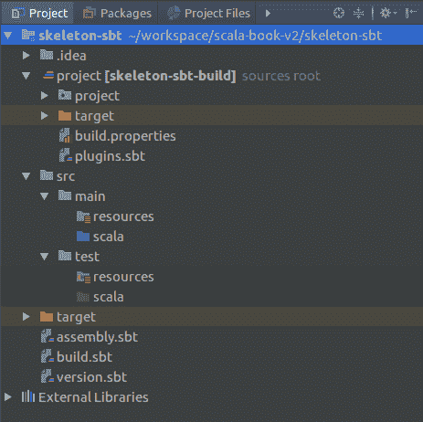
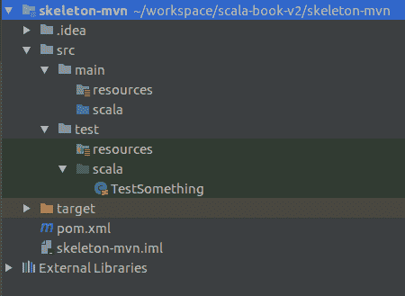

# 现有的设计模式和设置您的环境

在计算机编程的世界里，有多种方式来解决给定的问题。然而，有些人可能会想知道是否有一种正确的方法来实现特定的任务。答案是肯定的；总有一种正确的方法，但在软件开发中，通常有多种正确的方法来实现任务。存在一些因素可以指导程序员找到正确的解决方案，并且根据这些因素，人们往往能够得到预期的结果。这些因素可以定义许多事情——实际使用的语言、算法、生成的可执行文件类型、输出格式以及代码结构。在这本书中，语言已经为我们选择了——Scala。然而，使用 Scala 的方法有很多，我们将重点关注它们——设计模式。

在本章中，我们将解释什么是设计模式以及它们为什么存在。我们将介绍现有的不同类型的设计模式。本书旨在提供有用的示例，以帮助您在学习过程中，能够轻松运行它们是关键。因此，这里将给出一些关于如何正确设置开发环境的要点。我们将讨论的顶级主题如下：

+   什么是设计模式以及它们为什么存在？

+   设计模式的主要类型及其特点

+   选择合适的设计模式

+   在现实生活中设置开发环境

最后一点与设计模式关系不大。然而，始终正确地构建项目是一个好主意，因为这会使未来的工作变得容易得多。

# 设计模式

在深入研究 Scala 设计模式之前，我们必须解释它们实际上是什么，为什么它们存在，以及为什么熟悉它们是值得的。

软件是一个广泛的领域，人们可以用它做无数的事情。乍一看，这些事情大多数都是完全不同的——游戏、网站、手机应用程序以及为不同行业定制的系统。然而，在软件构建方面有许多相似之处。很多时候，无论他们创建的软件类型如何，人们都必须处理类似的问题。例如，计算机游戏和网站可能需要访问数据库。随着时间的推移，通过经验，开发者了解到他们如何根据他们执行的各种任务来结构化他们的代码。

设计模式的正式定义

设计模式是对软件设计中反复出现的问题的可重用解决方案。它不是一个完整的代码片段，而是一个模板，有助于解决特定问题或一系列问题。

设计模式是软件社区经过一段时间积累的最佳实践。它们旨在帮助你编写高效、可读、可测试且易于扩展的代码。在某些情况下，它们可能是由于编程语言表达能力不足而无法优雅地实现目标的结果。这意味着功能更丰富的语言可能甚至不需要设计模式，而其他语言仍然需要。Scala 就是这些丰富语言之一，在某些情况下，它使得某些设计模式变得过时或更简单。我们将在本书中看到它是如何做到这一点的。

编程语言中是否存在某种功能，也使得它能够实现其他语言无法实现的设计模式。反之亦然——它可能无法实现其他语言可以实现的事情。

# Scala 和设计模式

Scala 是一种混合语言，它结合了面向对象和函数式语言的特点。这不仅使它能够保持一些已知的面向对象设计模式的相关性，而且还提供了各种其他方式来利用其特性，以编写既干净、高效、可测试又可扩展的代码。语言的混合特性也使得一些传统的面向对象设计模式变得过时，或者可以通过其他更干净的技术来实现。

# 需要设计模式和它们的益处

在没有有意识地使用设计模式的情况下编写代码是许多软件工程师的做法。然而，最终，他们要么在不经意间使用了某个模式，要么得到的代码在某些方面可以改进。正如我们之前提到的，设计模式有助于编写高效、可读、可扩展和可测试的代码。所有这些特性对于行业中的公司来说都非常重要。

尽管在某些情况下，快速编写原型并尽快推出可能更可取，但通常情况下，软件应该会演变。也许你会有扩展一些编写糟糕的代码的经验，但无论如何，这都是一项具有挑战性的任务，需要花费很长时间，有时甚至觉得重写它会更简单。此外，这也使得向系统中引入错误的可能性大大增加。

代码可读性也是应该被重视的一点。当然，即使使用设计模式，代码也可能难以阅读，但通常来说，设计模式是有帮助的。大型系统通常由许多人共同开发，每个人都应该能够理解正在发生的事情。此外，如果团队成员在编写一个编写良好的软件项目，他们能够更容易、更快地融入团队。

可测试性是防止开发者在编写或扩展代码时引入错误的一个因素。在某些情况下，代码可能编写得如此糟糕，以至于根本无法进行测试。设计模式旨在消除这些问题。

虽然效率通常与算法相关联，但设计模式也可能影响效率。一个简单的例子是一个需要很长时间才能实例化的对象，在应用程序的许多地方使用实例，但可以将其改为单例。你将在本书的后续章节中看到更多具体的例子。

# 设计模式类别

软件开发是一个极其广泛的话题，这导致了许多可以用编程来完成的事情。不同行业和工程团队的需求可能会有很大差异。这些事实导致了众多不同设计模式的发明。此外，存在各种具有不同特性和表达能力的编程语言也进一步促进了这一点。

本书从 Scala 的角度关注设计模式。正如我们之前提到的，Scala 是一种混合语言。这导致了一些著名的设计模式不再需要——一个例子是 null 对象设计模式，它可以简单地用 Scala 的`Option`替换。其他设计模式可以通过不同的方法实现——装饰者设计模式可以使用可堆叠特质实现。最后，一些新的设计模式变得可用，这些模式专门适用于 Scala 编程语言——如蛋糕设计模式、pimp my library 等。我们将关注所有这些，并清楚地说明 Scala 的丰富性如何帮助我们使代码更加简洁和简单。

即使有众多不同的设计模式，它们都可以归纳为以下几类：

+   创建型

+   结构型

+   行为型

+   函数式

+   Scala 特定设计模式

一些特定于 Scala 的设计模式可以被分配到之前的组中。它们可以是现有模式的补充或替代。它们是 Scala 的典型代表，利用了一些高级语言特性或仅在其他语言中不可用的特性。

前三个组包含著名的*四人帮*设计模式。每本设计模式书籍都会涵盖它们，我们也不例外。其余的，即使它们可以被分配到前三个组中，也将是 Scala 和函数式编程语言的特定模式。在接下来的几个小节中，我们将解释所列组的特征，并简要介绍属于它们的设计模式。

# 创建型设计模式

创建型设计模式处理对象创建机制。它们的目的是以适合当前情况的方式创建对象，如果没有这些模式，可能会导致不必要的复杂性和额外知识的需求。创建型设计模式背后的主要思想如下：

+   关于具体类的知识封装

+   隐藏实际创建和对象组合的细节

在本书中，我们将重点关注以下创建型设计模式：

+   抽象工厂设计模式

+   工厂方法设计模式

+   懒加载初始化设计模式

+   单例设计模式

+   对象池设计模式

+   构建者设计模式

+   原型设计模式

以下几节简要定义了这些模式是什么。它们将在本书稍后的部分进行深入探讨。

# 抽象工厂设计模式

这用于封装具有共同主题的一组单独的工厂。当使用时，开发者创建抽象工厂的具体实现，并像在工厂设计模式中一样使用其方法来创建对象。它可以被视为另一层抽象，有助于实例化类。

# 工厂方法设计模式

这种设计模式处理对象的创建，而不需要显式指定实例将具有的实际类——它可能是基于许多因素在运行时决定的某物。这些因素可能包括操作系统、不同的数据类型或输入参数。它给开发者带来了只需调用方法而不是调用具体构造函数的安心。

# 懒加载初始化设计模式

这种设计模式是一种延迟创建对象或评估值的方法，直到第一次需要时。在 Scala 中，它比在 Java 这样的面向对象语言中要简单得多。

# 单例设计模式

这种设计模式将特定类的创建限制为仅一个对象。如果应用程序中的多个类试图使用此类实例，则返回相同的实例给所有人。这是另一种可以通过使用基本 Scala 特性轻松实现的设计模式。

# 对象池设计模式

这种设计模式使用一个已经实例化并准备好使用的对象池。每当有人需要池中的对象时，它就会被返回，用户使用完毕后，它会手动或自动将其放回池中。池的常见用途是数据库连接，通常创建成本高昂；因此，它们一旦创建，就会在请求时提供给应用程序。

# 构建者设计模式

构建者设计模式对于具有许多可能构造参数的对象来说极其有用，否则开发者需要为对象可能创建的不同场景创建许多重写。这与工厂设计模式不同，工厂设计模式旨在实现多态。许多现代库今天都采用这种设计模式。正如我们稍后将会看到的，Scala 可以非常容易地实现这种模式。

# 原型设计模式

这种设计模式允许使用已创建实例的`clone()`方法进行对象创建。在创建特定资源成本高昂或不需要抽象工厂模式的情况下，可以使用它。

# 结构化设计模式

结构设计模式的存在是为了帮助建立不同实体之间的关系，以便形成更大的结构。它们定义了每个组件应该如何构建，以便它具有非常灵活的互联模块，可以在更大的系统中协同工作。结构设计模式的主要特点包括以下内容：

+   使用组合来组合多个对象的实现

+   通过保持高度的灵活性，帮助构建由各种组件组成的大型系统

在这本书中，我们将重点关注以下结构设计模式：

+   适配器设计模式

+   装饰器设计模式

+   桥接设计模式

+   组合设计模式

+   门面设计模式

+   享元设计模式

+   代理设计模式

在我们在这本书的后续部分深入探讨这些模式之前，下一小节将简要介绍这些模式的内容。

# 适配器设计模式

适配器设计模式允许使用另一个接口使用现有类的接口。想象一下，有一个客户端期望你的类公开一个`doWork()`方法。你可能已经在另一个类中准备好了实现，但方法的调用方式不同且不兼容。可能还需要额外的参数。这也可能是一个开发者无法修改的库。这就是适配器通过包装功能并公开所需方法来帮助的地方。适配器对于集成现有组件非常有用。在 Scala 中，可以使用隐式类轻松实现适配器设计模式。

# 装饰器设计模式

装饰器是子类化的灵活替代方案。它们允许开发者在不影响同一类其他实例的情况下扩展对象的功能。这是通过将扩展类的对象包装在一个扩展相同类并覆盖那些需要改变功能的方法的对象中实现的。在 Scala 中，可以使用另一个称为**可堆叠特质**的设计模式来更轻松地构建装饰器。

# 桥接设计模式

桥接设计模式的目的在于将抽象与其实现解耦，以便两者可以独立变化。当类及其功能变化很大时，它很有用。桥接模式让我们想起了适配器模式，但不同之处在于适配器模式用于当某物已经存在且无法更改时，而桥接设计模式用于构建事物时。它帮助我们避免最终产生多个将暴露给客户端的具体类。当我们更深入地探讨这个主题时，你会得到更清晰的理解，但到目前为止，让我们想象我们想要有一个支持多个不同平台的`FileReader`类。桥接模式将帮助我们得到`FileReader`，它将根据平台使用不同的实现。在 Scala 中，我们可以使用自类型来实现桥接设计模式。

# 组合设计模式

组合是一种分区设计模式，它表示一组将被视为单个对象的对象。它允许开发者以统一的方式处理单个对象和组合，并在不复杂化源代码的情况下构建复杂的层次结构。组合的一个例子可以是树结构，其中节点可以包含其他节点，依此类推。

# 门面设计模式

门面设计模式的目的在于通过向客户端提供一个更简单的接口来使用，从而隐藏系统的复杂性和其实施细节。这也帮助代码更易于阅读，并减少外部代码的依赖。它作为简化系统的包装器，当然，它可以与其他之前提到的设计模式一起使用。

# 享元设计模式

享元设计模式提供了一个对象，该对象通过在整个应用程序中共享来最小化内存使用。这个对象应该包含尽可能多的数据。一个常见的例子是文字处理器，其中每个字符的图形表示都与其他相同的字符共享。局部信息只是字符的位置，该位置在内部存储。

# 代理设计模式

代理设计模式允许开发者通过包装其他对象来为它们提供接口。他们还可以提供额外的功能，例如安全性或线程安全性。代理可以与享元模式一起使用，其中对共享对象的引用被包装在代理对象内部。

# 行为设计模式

行为设计模式通过基于对象之间相互交互的具体方式来增加对象之间的通信灵活性。在这里，创建型模式主要描述创建过程中的一个时刻，结构型模式描述一个更多或更少的静态结构，而行为模式描述一个过程或流程。它们简化了这个流程，使其更容易理解。

行为设计模式的主要特点如下：

+   所描述的是一种过程或流程

+   流程被简化并变得易于理解

+   它们完成那些用对象难以或无法实现的任务

在这本书中，我们将关注以下行为设计模式：

+   值对象设计模式

+   空对象设计模式

+   策略设计模式

+   命令设计模式

+   责任链设计模式

+   解释器设计模式

+   迭代器设计模式

+   中介者设计模式

+   备忘录设计模式

+   观察者设计模式

+   状态设计模式

+   模板方法设计模式

+   访问者设计模式

以下小节将简要定义上述行为设计模式。

# 值对象设计模式

值对象是不可变的，它们的相等性不是基于它们的身份，而是基于它们的字段相等。它们可以用作数据传输对象，并且可以代表日期、颜色、金额、数字等。它们的不可变性使它们在多线程编程中非常有用。Scala 编程语言推崇不可变性，值对象是那里自然发生的事物。

# 空对象设计模式

空对象代表值的缺失，并且它们定义了一种中立的行为。这种方法消除了检查`null`引用的需要，并使代码更加简洁。Scala 添加了可选值的概念，这可以完全替代此模式。

# 策略设计模式

策略设计模式允许在运行时选择算法。它定义了一组可互换的封装算法，并向客户端提供了一个公共接口。所选择的算法可能取决于在应用程序运行时确定的多种因素。在 Scala 中，我们可以简单地将一个函数作为参数传递给一个方法，根据函数的不同，将执行不同的操作。

# 命令设计模式

此设计模式代表一个用于存储有关需要在以后某个时间触发的动作信息的对象。信息包括以下内容：

+   方法名称

+   方法的所有者

+   参数值

客户端随后决定由调用者执行哪些命令以及何时执行。这种设计模式可以很容易地使用 Scala 语言中按名称传递参数的功能实现。

# 责任链设计模式

职责链模式是一种设计模式，其中请求的发送者与其接收者解耦。这样，它使得多个对象能够处理请求，并保持逻辑的清晰分离。接收者形成一个链，它们传递请求，如果可能的话，处理它，如果不可以，则将其传递给下一个接收者。在某些变体中，处理程序可能会同时将请求分发给多个其他处理程序。这多少让我们想起了函数组合，在 Scala 中可以通过可堆叠特性设计模式来实现。

# 解释器设计模式

解释器设计模式基于使用具有严格语法的语言来表征已知领域的能力。它为每个语法规则定义类，以便解释给定语言中的句子。这些类很可能会表示层次结构，因为语法通常是分层的。解释器可以用于不同的解析器，例如 SQL 或其他语言。

# 迭代器设计模式

迭代器设计模式是指使用迭代器遍历容器并访问其元素的情况。它有助于将容器与其上执行的操作解耦。迭代器应提供对聚合对象元素的顺序访问，而不暴露迭代集合的内部表示。

# 中介者设计模式

此模式封装了应用程序中不同类之间的通信。不是直接相互交互，对象通过中介进行通信，这减少了它们之间的依赖性，降低了耦合度，并使得整个应用程序更容易阅读和维护。

# 备忘录设计模式

此模式提供了将对象回滚到其先前状态的能力。它通过三个对象实现——**发起者**、**保管者**和**备忘录**。发起者是具有内部状态的对象；保管者将修改发起者，而备忘录是一个包含发起者返回的状态的对象。发起者知道如何处理备忘录以恢复其先前状态。

# 观察者设计模式

此设计模式允许创建发布/订阅系统。有一个特殊对象称为主题，当状态有任何变化时，它会自动通知所有观察者。这种设计模式在各种 GUI 工具包中很受欢迎，通常在需要事件处理的地方。它也与响应式编程相关，响应式编程由如 Akka 之类的库启用。我们将在本书的末尾看到一个例子。

# 状态设计模式

这种设计模式类似于策略设计模式，它使用一个状态对象来封装同一对象的不同的行为。通过避免使用大型条件语句，它提高了代码的可读性和可维护性。

# 模板方法设计模式

此设计模式在方法中定义算法的框架，然后将一些实际步骤传递给子类。它允许开发者在不修改其结构的情况下更改算法的一些步骤。一个例子可能是抽象类中的方法调用其他抽象方法，这些方法将在子类中定义。

# 访问者设计模式

访问者设计模式表示对对象结构中的元素执行的操作。它允许开发者定义一个新操作，而无需更改原始类。Scala 通过将函数传递给方法，可以比纯面向对象方式实现此模式时最小化其冗长性。

# 函数式设计模式

我们将从 Scala 的角度审视所有前面的设计模式。这意味着它们在其他语言中看起来会不同，但它们还没有被专门设计用于函数式编程。函数式编程比面向对象编程更具表现力。它有自己的设计模式，有助于使程序员的编程生活更轻松。我们将重点关注：

+   摩纳哥

+   摩纳哥

+   函子

在我们审视了一些 Scala 函数式编程概念，并且已经了解了这些概念之后，我们将提到一些来自 Scala 世界中的有趣设计模式。

在接下来的几个小节中，将对前面列出的模式进行简要说明。

# 摩纳哥

摩纳哥是一个来自数学的概念。我们将在本书后面部分详细探讨它，包括理解它所需的所有理论。现在，只需记住，摩纳哥是一个具有单个关联二进制运算和单位元素的代数结构。以下是你应该记住的关键词：

+   联合二进制运算。这意味着 `(a+b)+c = a+(b+c)`。

+   单位元素。这意味着 `a+i = i+a = a`。在这里，单位是 `i`。

摩纳哥的重要之处在于它们为我们提供了以相同方式处理许多不同类型值的可能性。它们允许我们将成对操作转换为与序列一起工作；结合性为我们提供了并行化的可能性，而单位元素允许我们知道如何处理空列表。摩纳哥非常适合轻松描述和实现聚合。

# 摩纳哥

在函数式编程中，摩纳哥是表示计算为一系列步骤的结构。摩纳哥对于构建管道、干净地添加副作用操作到一切都是不可变的语言中非常有用，并且用于实现组合。这个定义可能听起来模糊不清，但用几句话解释摩纳哥似乎是一项艰巨的任务。在本书的后面部分，我们将专注于它们，并尝试在不使用复杂数学理论的情况下澄清问题。我们将尝试展示摩纳哥为什么有用以及它们能帮助开发者做什么，只要开发者对它们有很好的理解。

# 函子

拟人来自范畴论，至于单子，解释它们需要时间。我们将在本书的后面部分查看拟人。现在，你可以记住，拟人是一些可以让我们将类型`A => B`的函数提升到类型`F[A] => F[B]`的函数的东西。

# Scala 特定的设计模式

这个组中的设计模式可以被分配到一些之前的组中。然而，它们是特定于 Scala 的，并利用了我们在本书中将要关注的某些语言特性，因此我们决定将它们放在自己的组中。

我们将关注以下内容：

+   镜头设计模式

+   蛋糕设计模式

+   优化我的库

+   可堆叠特性

+   类型类设计模式

+   延迟评估

+   部分函数

+   隐式注入

+   鸭式编程

+   缓存

在我们稍后在本书中详细研究这些模式之前，以下小节将为您提供一些关于这些模式的简要信息。

# 镜头设计模式

Scala 编程语言提倡不可变性。使对象不可变使得犯错误更难。然而，有时需要可变性，而镜头设计模式帮助我们很好地实现这一点。

# 蛋糕设计模式

蛋糕设计模式是 Scala 实现依赖注入的方式。这在现实生活中的应用中相当常见，有许多库帮助开发者实现它。Scala 有一种使用语言特性来实现它的方法，这就是蛋糕设计模式的主要内容。

# 优化我的库

许多时候，工程师需要与库一起工作，这些库被设计得尽可能通用。有时，我们需要对我们自己的用例做更多具体的事情。优化我的库设计模式提供了一种为无法修改的库编写扩展方法的方式。我们也可以用它来为我们自己的库编写。这种设计模式还有助于提高代码的可读性。

# 可堆叠特性

可堆叠特性是 Scala 实现装饰器设计模式的方式。它也可以用来组合函数，并且它基于一些高级的 Scala 特性。

# 类型类设计模式

这种设计模式允许我们通过定义必须由特定类型类的所有成员支持的行为来编写通用代码。例如，所有数字都必须支持加法和减法操作。

# 延迟评估

通常，工程师必须处理一些慢速和/或昂贵的操作。有时，这些操作的结果甚至可能不需要。延迟评估是一种将操作执行推迟到实际需要的技术的技术。它可以用于应用程序优化。

# 部分函数

数学与函数式编程非常接近。因此，一些函数只为所有可能输入值的一个子集定义。一个流行的例子是平方根函数，它只对非负数有效。在 Scala 中，这样的函数可以用来高效地同时执行多个操作或组合函数。

# 隐式注入

隐式注入基于 Scala 编程语言的隐式功能。只要对象存在于特定的作用域中，它们就会在需要时自动注入。它可以用于许多事情，包括依赖注入。

# 鸭式类型

这是一个在 Scala 中可用且与某些动态语言提供的类似的功能。它允许开发者编写需要调用者具有某些特定方法（但不需要实现接口）的代码。当有人使用鸭式类型的函数时，实际上在编译时会检查参数是否有效。

# 缓存

这个设计模式通过记住基于输入的函数结果来帮助优化。这意味着只要函数是稳定的，并且在传递相同的参数时返回相同的结果，就可以记住其结果，并在每次连续相同的调用中简单地返回它们。

# 选择设计模式

正如我们之前看到的，有大量的设计模式。在许多情况下，它们可以组合使用。不幸的是，关于如何选择设计代码的概念，并没有一个确定的答案。有许多因素可能会影响最终的决定，你应该问自己以下问题：

+   这段代码将会相对静态，还是将来会发生变化？

+   我们需要动态决定使用哪些算法吗？

+   我们的代码会被其他人使用吗？

+   我们有一个共同同意的接口吗？

+   如果有的话，我们计划使用哪些库？

+   是否有任何特殊的性能要求或限制？

这绝对不是问题的完整列表。有大量的因素可能会决定我们构建系统的方式。然而，有一个清晰的*规范*是非常重要的，如果似乎有什么缺失，应该首先检查。

在接下来的章节中，我们将尝试给出具体建议，关于何时应该和不应该使用设计模式。它们应该帮助你提出正确的问题，并在编写代码之前做出正确的决定。

# 设置开发环境

本书旨在为您提供可运行的代码示例，以便您进行实验。除了在本书的页面中展示最重要的代码片段外，您还可以通过 Packt Publishing 以及 GitHub 获取代码，以便您方便使用。仓库可以在 [`github.com/nikolovivan/scala-design-patterns-v2`](https://github.com/nikolovivan/scala-design-patterns-v2) 找到。

拥有代码示例意味着能够轻松运行我们提供的任何示例非常重要，并且不要与代码发生冲突。我们将尽力确保代码经过测试并正确打包，但您也应该确保您拥有运行示例所需的一切。

# 安装 Scala

当然，您需要 Scala 编程语言。它需要安装 Java，发展迅速，最新版本可以在 [`www.scala-lang.org/download/`](https://www.scala-lang.org/download/) 找到。安装语言有多种方式，您可以选择最适合您的方式。有关如何在您的操作系统上安装语言的几个提示可以在 [`www.scala-lang.org/download/install.html`](https://www.scala-lang.org/download/install.html) 找到。正如官方 Scala 网站所建议的，最简单的方法是下载一个 IDE（例如 IntelliJ），安装 Scala 插件，它将为您设置一切。我将提供一些在我的职业生涯中证明有用的提示，这些提示使我能够在实验和学习时非常灵活。

# 手动安装 Scala 的提示

您始终可以下载多个 Scala 版本并对其进行实验。我使用 Linux，我的提示也适用于 Mac OS 用户。Windows 用户也可以进行类似的设置。以下是步骤：

1.  在 `/opt/scala-{version}/` 或您喜欢的任何路径下安装 Scala。

1.  使用此命令创建一个符号链接：`sudo ln -s /opt/scala-{version} scala-current`。如果您决定进行实验，这可以使版本切换变得容易得多。

1.  使用以下命令将 Scala 的 `bin` 文件夹路径添加到您的 `.bashrc`（或等效）文件中：

+   `export SCALA_HOME=/opt/scala-current`

+   `export PATH=$PATH:$SCALA_HOME/bin`

现在，如果您已经定义了一个符号链接，并且您决定安装另一个 Scala 版本，您可以简单地重新定义现有的符号链接，然后继续您的工作。

如果您不想手动安装 Scala 或者您发现您经常切换到不同版本的编程语言，SBT 可能是一个更舒适的选择。

# 使用 SBT 安装 Scala 的提示

您还可以使用 SBT 尝试任何 Scala 版本。为此，您应该：

1.  下载并安装 SBT：[`www.scala-sbt.org/download.html`](https://www.scala-sbt.org/download.html)。

1.  打开终端并运行 `sbt`。

1.  在 SBT 壳中，输入`++ 2.12.4`或你想要尝试的任何版本。请注意，如果当前使用的 Scala 版本与你要使用的版本不兼容，你必须修改命令为以下形式——`++ 2.12.4!`。二进制兼容性在 Scala 中非常重要，你应该确保它们使用与它们相同的 Scala 版本编写的库。否则，你可能会遇到麻烦。

1.  输入`console`命令，你将进入一个运行你选择的版本的 Scala 壳。

本书中的所有示例都使用 SBT 或 Maven（根据你的偏好）。它们是构建和依赖管理工具，这意味着你可能甚至不需要做任何额外的事情来安装 Scala。你只需导入一个示例项目，所有的事情都会自动处理。

# Scala 集成开发环境（IDE）

现在有多个 IDE 支持 Scala 的开发。在用于与代码一起工作的 IDE 方面，没有任何偏好。以下是一些最受欢迎的 IDE：

+   IntelliJ

+   Eclipse

+   NetBeans

IntelliJ 目前是 Scala 网站上推荐的，也可能是写作时最常用的 IDE。所有这些 IDE 都使用插件来与 Scala 一起工作，下载和使用它们应该是直接的。

# 依赖管理

在本书中运行大多数示例不需要任何特殊库的额外依赖。然而，在某些情况下，我们可能需要展示如何对 Scala 代码进行单元测试，这需要我们使用测试框架。此外，我们还将展示一些实际使用案例，其中使用了额外的库。如今，处理依赖通常使用专门的工具。它们通常是可互换的，使用哪个工具是个人选择。与 Scala 项目一起使用最流行的工具是 SBT，但 Maven 也是一个选择，还有许多其他工具。前者通常在项目从头开始且 Scala 是主要编程语言时使用。后者在主要使用的语言是 Java，例如，并且我们想要添加用 Scala 编写的模块时可能很有用。

现代 IDE 提供了生成所需构建配置文件的功能，但我们将提供一些通用的示例，这些示例不仅在这里有用，而且在未来的项目中也可能有用。根据你偏好的 IDE，你可能需要安装一些额外的插件才能使一切正常运行，快速进行 Google 搜索应该会有所帮助。

# SBT

**SBT**代表**简单构建工具**，它使用 Scala 语法来定义项目如何构建、管理依赖等。它使用`.sbt`文件来完成这个目的。它还支持基于`.scala`文件的 Scala 代码的设置，以及两者的混合使用。

要下载 SBT，请访问 [`www.scala-sbt.org/1.0/docs/Setup.html`](http://www.scala-sbt.org/1.0/docs/Setup.html) 并按照说明操作。如果您希望获取最新版本，只需在 Google 上搜索并使用返回的结果即可。

以下截图显示了骨架 SBT 项目的结构：



显示主 `.sbt` 文件的内容是很重要的。

`version.sbt` 文件如下所示：

```java
version in ThisBuild := "1.0.0-SNAPSHOT"
```

它包含当前版本，如果发布新版本，则该版本会自动递增。

`assembly.sbt` 文件的内容如下：

```java
assemblyMergeStrategy in assembly := {
   case PathList("javax", "servlet", xs @ _*)         => MergeStrategy.first
   case PathList(ps @ _*) if ps.last endsWith ".html" => MergeStrategy.first
   case "application.conf"                            => MergeStrategy.concat
   case "unwanted.txt"                                => MergeStrategy.discard
   case x =>
     val oldStrategy = (assemblyMergeStrategy in assembly).value
     oldStrategy(x)
 }

 assemblyJarName in assembly := { s"${name.value}_${scalaVersion.value}-${version.value}-assembly.jar" }

 artifact in (Compile, assembly) := {
   val art = (artifact in (Compile, assembly)).value
   art.withClassifier(Some("assembly"))
 }

 addArtifact(artifact in (Compile, assembly), assembly)
```

它包含有关如何构建汇编 JAR 的信息——合并策略、最终 JAR 名称等。它使用一个名为 `sbtassembly` 的插件（[`github.com/sbt/sbt-assembly`](https://github.com/sbt/sbt-assembly)）。

`build.sbt` 文件是包含项目依赖、一些关于编译器的额外信息和元数据的文件。骨架文件如下所示：

```java
organization := "com.ivan.nikolov"

 name := "skeleton-sbt"

 scalaVersion := "2.12.4"

 scalacOptions := Seq("-unchecked", "-deprecation", "-encoding", "utf8")

 javaOptions ++= Seq("-target", "1.8", "-source", "1.8")

 publishMavenStyle := true

 libraryDependencies ++= {
   val sparkVersion = "2.2.0"
   Seq(
     "org.apache.spark" % "spark-core_2.11" % sparkVersion % "provided",
     "com.datastax.spark" % "spark-cassandra-connector_2.11" % "2.0.5",
     "org.scalatest" %% "scalatest" % "3.0.4" % "test",
     "org.mockito" % "mockito-all" % "1.10.19" % "test" // mockito for tests
   )
 }
```

如您所见，这里我们定义了编译某些清单信息和库依赖项所针对的 Java 版本。

我们项目的依赖项定义在我们 SBT 文件的 `libraryDependencies` 部分中。它们具有以下格式：

```java
"groupId" %[%] "artifactId" % "version" [% "scope"]
```

如果我们决定用 `%%` 而不是 `%` 将 `groupId` 和 `artifactId` 分隔开，SBT 将自动使用 `scalaVersion` 并将 `_2.12`（对于 Scala 2.12.*）附加到 `artifactId` 上。这种语法通常用于包含用 Scala 编写的依赖项，因为那里的惯例要求我们将 Scala 版本作为 `artifactId` 的一部分。我们当然可以手动将 Scala 版本附加到 `artifactId` 并使用 `%`。这也适用于导入用不同主要版本的 Scala 编写的库的情况。在后一种情况下，我们需要注意二进制兼容性。当然，并非所有库都会用我们使用的版本编写，因此我们要么彻底测试它们并确保它们不会破坏我们的应用程序，要么更改我们的 Scala 版本，或者寻找替代方案。

显示的依赖项在任何本书的任何地方都不需要（Spark 和 Datastax 的那个）。它们只是用于说明目的，如果不需要，您可以安全地删除它们。

SBT 要求每个语句都在新的一行上，并且如果我们在 `.sbt` 文件中工作，则每个语句与前一个语句之间需要用空白行隔开。当使用 `.scala` 文件时，我们只需用 Scala 编写代码。

依赖项中的 `%%` 语法是一种语法糖，它使用 `scalaVersion` 将库的名称替换掉，例如，在我们的例子中，`scalatest` 将变成 `scalatest_2.12`。

SBT 允许工程师用不同的方式表达相同的内容。一个例子是前面的依赖项——我们不是添加一系列依赖项，而是可以逐个添加。最终的结果将是相同的。SBT 的其他部分也有很多灵活性。有关 SBT 的更多信息，请参阅文档。

`project/build.properties` 文件定义了在 `sbt` 下构建和与应用程序交互时要使用的 `sbt` 版本。它就像以下这样简单：

```java
sbt.version = 1.1.0
```

最后，有一个 `project/plugins.sbt` 文件，它定义了用于使项目启动运行的不同插件。我们之前提到了 `sbtassembly`：

```java
addSbtPlugin("com.eed3si9n" % "sbt-assembly" % "0.14.5")
```

在线有不同插件提供有用的功能。以下是一些常见的可以在该骨架项目的终端中运行的 `sbt` 命令：

+   `sbt`: 这将打开当前项目的 sbt 控制台。所有后续的命令都可以在这里发出，无需使用 `sbt` 关键字。

+   `sbt test`: 这将运行应用程序单元测试。

+   `sbt compile`: 这将编译应用程序。

+   `sbt assembly`: 这将创建应用程序的汇编（一个胖 JAR），可以像其他任何 Java JAR 一样运行。

# Maven

Maven 在名为 `pom.xml` 的文件中保存其配置。它易于支持多模块项目，而对于 `sbt`，则需要做一些额外的工作。在 Maven 中，每个模块都有自己的子 `pom.xml` 文件。

要下载 Maven，请访问 [`maven.apache.org/download.cgi`](https://maven.apache.org/download.cgi)。

以下截图显示了骨架 Maven 项目的结构：



主要的 `pom.xml` 文件比之前的 SBT 解决方案要长得多。让我们分别看看它的各个部分。

通常在 POM 文件的开头有一些关于项目和不同属性的信息：

```java
<modelVersion>4.0.0</modelVersion>
<groupId>com.ivan.nikolov</groupId>
<artifactId>skeleton-mvn</artifactId>
<version>1.0.0-SNAPSHOT</version>
<properties>
    <scala.version>2.12.4</scala.version>
    <scalatest.version>3.0.4</scalatest.version>
    <spark.version>2.2.0</spark.version>
</properties>
```

然后，是依赖项：

```java
<dependencies>
    <dependency>
        <groupId>org.apache.spark</groupId>
        <artifactId>spark-core_2.11</artifactId>
        <version>${spark.version}</version>
        <scope>provided</scope>
    </dependency>
    <dependency>
        <groupId>com.datastax.spark</groupId>
        <artifactId>spark-cassandra-connector_2.11</artifactId>
        <version>2.0.5</version>
    </dependency>
    <dependency>
        <groupId>org.scala-lang</groupId>
        <artifactId>scala-library</artifactId>
        <version>${scala.version}</version>
    </dependency>
    <dependency>
        <groupId>org.scalatest</groupId>
        <artifactId>scalatest_2.12</artifactId>
        <version>${scalatest.version}</version>
        <scope>test</scope>
    </dependency>
    <dependency>
        <groupId>org.mockito</groupId>
        <artifactId>mockito-all</artifactId>
        <version>1.10.19</version>
        <scope>test</scope>
    </dependency>
    <dependency>
        <groupId>junit</groupId>
        <artifactId>junit</artifactId>
        <version>4.12</version>
        <scope>test</scope>
    </dependency>
</dependencies>
```

最后，是构建定义。在这里，我们可以使用各种插件对我们的项目进行不同的操作，并向编译器提供提示。构建定义被 `<build>` 标签包围。

首先，我们指定一些资源：

```java
<sourceDirectory>src/main/scala</sourceDirectory>
<testSourceDirectory>src/test/scala</testSourceDirectory>
<resources>
    <resource>
        <directory>${basedir}/src/main/resources</directory>
    </resource>
</resources>
```

我们使用的第一个插件是 `scala-maven-plugin`，当与 Scala 和 Maven 一起工作时使用：

```java
<plugin>
    <groupId>net.alchim31.maven</groupId>
    <artifactId>scala-maven-plugin</artifactId>
    <version>3.3.1</version>
    <executions>
        <execution>
            <goals>
                <goal>compile</goal>
                <goal>testCompile</goal>
            </goals>
        </execution>
    </executions>
    <configuration>
        <scalaVersion>${scala.version}</scalaVersion>
    </configuration>
</plugin>
```

我们使用的另一个插件是 `maven-assembly-plugin`，用于构建应用程序的胖 JAR：

```java
<plugin>
    <artifactId>maven-assembly-plugin</artifactId>
    <version>3.1.0</version>
    <configuration>
        <appendAssemblyId>false</appendAssemblyId>
        <descriptorRefs>
            <descriptorRef>jar-with-dependencies</descriptorRef>
        </descriptorRefs>
    </configuration>
    <executions>
        <execution>
            <id>make-assembly</id>
            <phase>package</phase>
            <goals>
                <goal>single</goal>
            </goals>
        </execution>
    </executions>
</plugin>
```

完整的 `pom.xml` 文件等同于我们之前提供的 `sbt` 文件。

如前所述，Spark 和 Datastax 依赖项仅用于说明目的。

在 Scala 2.12 中使用 JUnit 运行单元测试

如果你深入研究依赖项，你会看到我们导入了 `junit`，这是一个 Java 测试框架。乍一看，有人可能会认为我们实际上并不需要它。然而，有一个陷阱。快速 Google 搜索如何使用 Maven 运行 Scalatest 单元测试会指向推荐使用 `scalatest-maven-plugin` 的资源。如果我们遵循那些说明并尝试从命令行运行一些测试，我们会得到一个奇怪的错误。这是由于我们使用了 Scala 2.12，而当前的 `scalatest-maven-plugin` 版本与该语言的这个版本不兼容。

就像软件工程中的许多事情一样，我们必须找到解决方案。在这里，我们可以做两件事：

+   使用较旧的 Scala 版本。

+   强制 Maven 运行我们的测试。

    当然，第二个选项更可取。这意味着我们只需要在每个 Scalatest 中做一件事，那就是在每个测试类中添加以下注解：`@RunWith(classOf[JUnitRunner])`，并确保我们的测试类名称中包含单词`Test`。

类似于 SBT，您可以从命令行使用 Maven。本书示例项目中您可能发现最有用的命令将在下一个提示中展示。

有用的 Maven 命令：

+   `mvn clean test`：这会运行应用程序单元测试

+   `mvn clean compile`：这会编译应用程序

+   `mvn clean package`：这会创建一个应用程序的集合（一个胖 JAR），可以像其他 Java JAR 一样运行

# SBT 与 Maven 的比较

在本书中，我们将使用 SBT 和 Maven 进行依赖管理并创建我们的项目。它们可以互换使用，我们的源代码将不依赖于我们选择的构建系统。您可以使用我们提供的框架轻松地将`.pom`文件转换为`.sbt`文件。真正不同的将是依赖项以及它们是如何表达的。

# 摘要

到目前为止，我们已经有了一个关于设计模式意味着什么以及它如何影响我们编写代码方式的大致了解。我们回顾了最著名的设计模式，并概述了它们之间的主要区别。我们看到了在许多情况下，我们可以使用 Scala 的特性来使一个模式变得过时、更简单或与纯面向对象语言的经典案例相比具有不同的实现方式。本书将向您展示 Scala 如何使编写高质量代码变得更加容易。

知道在挑选设计模式时应该寻找什么很重要，您应该已经知道应该注意哪些具体细节以及规范的重要性。

最后但同样重要的是，我们建议您运行本书中的示例，并且我们已经提供了一些应该会使这变得非常简单的提示。在某些情况下，使用 SBT 或 Maven 创建一个完整的解决方案可能过于繁琐且有些不必要，但我们相信这是一个好的实践。此外，我们解释的方法在整个行业中都有应用，并且将超出本书的范围带来益处。

在下一章中，我们将直接进入本书的实践部分，我们将探讨特性和混合组合，它们有什么用途，以及何时何地使用它们。
