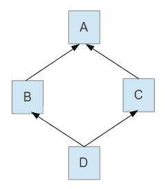

# 特性与混入组合

在深入研究一些实际的设计模式之前，我们必须确保许多 Scala 语言概念对读者来说是清晰的。这些概念中的许多将在实现实际设计模式时被使用，了解可能性、限制和陷阱是使我们能够正确且高效地编写代码的关键因素。尽管这些概念不被视为*官方*设计模式，但它们仍然可以用来编写好的软件。在某些情况下，由于 Scala 的丰富性，一些概念可以通过仅使用语言特性来替代设计模式。毕竟，正如我们之前所说的，设计模式的存在是因为编程语言缺乏功能，不足以完成某些任务。

我们将要探讨的第一个主题是关于特性和混入组合。它们为开发者提供了共享已实现的功能或为应用程序中的类定义接口的可能性。特性与混入组合为开发者提供的许多可能性，对于实现我们将在本书后面关注的一些设计模式非常有用。在本章中，我们将探讨以下主要主题：

+   特性

+   混入组合

+   多重继承

+   线性化

+   测试特性

+   特性对比类

# 特性

你们中很多人可能对 Scala 中的特性有不同的看法。它们不仅可以被视为其他语言中的接口，还可以被视为只有无参构造函数的类。

特性参数

Scala 编程语言非常动态，并且在过去的几年中发展迅速。根据语言创造者的说法，Dotty 项目是 Scala 的未来，它是一个正在测试和实现将参数传递给特性和许多其他功能的地方。其背后的主要思想是语言简化，更多信息可以在[`dotty.epfl.ch`](http://dotty.epfl.ch)和[`scala-lang.org/blog/2017/05/31/first-dotty-milestone-release.html`](https://scala-lang.org/blog/2017/05/31/first-dotty-milestone-release.html)找到。

在接下来的几节中，我们将从不同的角度来探讨特性，并尝试给您一些关于如何使用它们的想法。

# 特性作为接口

特性在其他语言中可以被视为接口，例如 Java。然而，它们允许开发者实现一些或所有的方法。每当特性能量中存在一些代码时，该特性就被称为**混入**。让我们看看以下示例：

```java
trait Alarm {
  def trigger(): String
}
```

在这里，`Alarm`是一个接口。它的唯一方法`trigger`没有任何实现，如果在一个非抽象类中混入，则需要实现该方法。

让我们看看另一个特性示例：

```java
trait Notifier {
  val notificationMessage: String

  def printNotification(): Unit = {
    System.out.println(notificationMessage)
  }

  def clear()
}
```

之前显示的`Notifier`接口实现了一个方法，而`clear`和`notificationMessage`的值必须由将与`Notifier`接口混合的类处理。此外，特性可以要求类在其内部具有特定的变量。这在其他语言中的抽象类中有些类似。

# 将特性与变量混合

正如我们刚才指出的，特性可能要求类具有特定的变量。一个有趣的用例是在将变量传递给类的构造函数时。这将涵盖特性要求：

```java
class NotifierImpl(val notificationMessage: String) extends Notifier {
  override def clear(): Unit = System.out.println("cleared")
}
```

这里的唯一要求是变量具有相同的名称，并且在类定义中由`val`关键字 precede。如果我们不在前面的代码中使用`val`在参数前面，编译器仍然会要求我们实现特性。在这种情况下，我们必须为类参数使用不同的名称，并在类体中有一个`override val notificationMessage`赋值。这种行为的原因很简单：如果我们显式使用`val`（或`var`），编译器将创建一个与参数具有相同作用域的 getter 字段。如果我们只是有参数，只有当参数在构造函数作用域之外使用时，例如在方法中，才会创建一个字段和内部 getter。为了完整性，case 类自动将`val`关键字 *前置* 到参数上。根据我们刚才说的，这意味着当使用`val`时，我们实际上有一个具有给定名称和正确作用域的字段，并且它将自动覆盖特性要求我们做的任何事情。

# 特性作为类

特性也可以从类的角度来理解。在这种情况下，它们必须实现所有方法，并且只有一个不接受任何参数的构造函数。考虑以下示例：

```java
trait Beeper {
  def beep(times: Int): Unit = {
    1 to times foreach(i => System.out.println(s"Beep number: $i"))
  }
}
```

现在，我们实际上可以实例化`Beeper`并调用其方法。以下是一个仅执行此操作的控制台应用程序：

```java
object BeeperRunner {
  val TIMES = 10

  def main (args: Array[String]): Unit = {
    val beeper = new Beeper {}
    beeper.beep(TIMES)
  }
}
```

如预期的那样，在运行应用程序后，我们将在我们的终端中看到以下输出：

```java
Beep number: 1
Beep number: 2
Beep number: 3
Beep number: 4
Beep number: 5
Beep number: 6
Beep number: 7
Beep number: 8
Beep number: 9
Beep number: 10
```

# 扩展类

特性可以扩展类。让我们看看以下示例：

```java
abstract class Connector {
  def connect()
  def close()
}

trait ConnectorWithHelper extends Connector {
  def findDriver(): Unit = {
    System.out.println("Find driver called.")
  }
}

class PgSqlConnector extends ConnectorWithHelper {
  override def connect(): Unit = {
    System.out.println("Connected...")
  }

  override def close(): Unit = {
    System.out.println("Closed...")
  }
}
```

如预期的那样，`PgSqlConnector`将被迫实现抽象类的方法。正如你可以猜到的，我们可能有其他扩展其他类的特性，然后我们可能想要将它们混合在一起。然而，Scala 在某些情况下会设置限制，我们将在本章后面查看组合时看到它将如何影响我们。

# 扩展特性

特性也可以相互扩展。看看以下示例：

```java
trait Ping {
  def ping(): Unit = {
    System.out.println("ping")
  }
}

trait Pong {
  def pong(): Unit = {
    System.out.println("pong")
  }
}

trait PingPong extends Ping with Pong {
  def pingPong(): Unit = {
    ping()
    pong()
  }
}

object Runner extends PingPong {
  def main(args: Array[String]): Unit = {
    pingPong()
  }
}
```

之前的示例很简单，它应该只是让`Runner`对象分别混合两个特性。扩展特性在一种称为**可堆叠特性**的设计模式中很有用，我们将在本书后面的章节中探讨。

# 混合组合

Scala 允许开发者在单个类中扩展多个特性。这增加了实现多重继承的可能性，并在代码编写上节省了大量精力，这在不允许扩展多个类的语言中是必须执行的。在本子主题中，我们将展示如何将特性混合到特定的类中，或者在我们编写代码时使用它们来创建具有特定功能的匿名类。

# 在类中混合特性

首先，让我们修改前一个例子中的代码。这是一个非常简单的修改，它也将确切地展示特性是如何混合的：

```java
object MixinRunner extends Ping with Pong {
  def main(args: Array[String]): Unit = {
    ping()
    pong()
  }
}
```

如前述代码所示，我们可以将多个特性添加到类中。我们在示例中使用对象仅仅是因为主方法。这类似于创建一个没有构造函数参数的类（Scala 中的对象是单例类）。

如何混合特性？

使用以下语法将特性混合到类中：

`extends T1 with T2 with … with Tn`。

如果一个类已经扩展了另一个类，我们只需继续使用`with`关键字添加特性。

如果一个特性方法没有在特性体内部实现，并且我们将它混合到的类不是抽象类，那么这个类将不得不实现该特性。否则，将发生编译错误。

# 组合

在创建时进行组合，给我们提供了创建匿名类而不需要显式定义它们的机会。此外，如果我们想要组合许多不同的特性，创建所有可能性将涉及太多工作，所以这有助于使事情变得更容易。

# 组合简单特性

让我们看看一个例子，其中我们组合了简单的特性，这些特性不扩展其他特性或类：

```java
class Watch(brand: String, initialTime: Long) {
  def getTime(): Long = System.currentTimeMillis() - initialTime
}

object WatchUser {
  def main(args: Array[String]): Unit = {
    val expensiveWatch = new Watch("expensive brand", 1000L) with Alarm with Notifier {
      override def trigger(): String = "The alarm was triggered."
      override def clear(): Unit = {
        System.out.println("Alarm cleared.")
      }
      override val notificationMessage: String = "Alarm is running!"
    }
    val cheapWatch = new Watch("cheap brand", 1000L) with Alarm {
      override def trigger(): String = "The alarm was triggered."
    }
    // show some watch usage.
    System.out.println(expensiveWatch.trigger())
    expensiveWatch.printNotification()
    System.out.println(s"The time is ${expensiveWatch.getTime()}.")
    expensiveWatch.clear()

    System.out.println(cheapWatch.trigger())
    System.out.println("Cheap watches cannot manually stop the alarm...")
  }
}
```

在前面的例子中，我们使用了之前提到的`Alarm`和`Notifier`特性。我们创建了两个手表实例——一个功能丰富且更有用的昂贵实例，另一个是便宜且控制力不足的实例。本质上，它们是匿名类，在实例化时定义。另外，正如预期的那样，我们必须实现我们包含的特性中的抽象方法。我希望这能给你一个关于在我们有更多特性时可能有多少种组合的想法。

仅为了完整性，这里是一个前述程序的示例输出：

```java
The alarm was triggered.
Alarm is running!
The time is 1234567890562.
Alarm cleared.
The alarm was triggered.
Cheap watches cannot manually stop the alarm...
```

如预期的那样，突出显示的时间值在不同的运行中会有所不同。

# 组合复杂特性

在某些情况下，我们可能需要组合更复杂的特性，这些特性扩展了其他特性或类。如果一个特性（以及继承链上的其他特性）明确扩展了特定的类，那么事情将会非常简单，它们不会改变太多。在这种情况下，我们将能够访问超特性的方法。然而，让我们看看如果继承层次结构中的任何特性扩展了特定的类会发生什么。在下一个示例中，我们将使用之前定义的`ConnectorWithHelper`特性。这个特性扩展了抽象的`Connector`类。想象一下，如果我们想拥有另一款非常昂贵的智能手表，它也可以连接到数据库：

```java
object ReallyExpensiveWatchUser {
  def main(args: Array[String]): Unit = {
    val reallyExpensiveWatch = new Watch("really expensive brand", 1000L) with ConnectorWithHelper {
      override def connect(): Unit = {
        System.out.println("Connected with another connector.")
      }
      override def close(): Unit = {
        System.out.println("Closed with another connector.")
      }
    }

    System.out.println("Using the really expensive watch.")
    reallyExpensiveWatch.findDriver()
    reallyExpensiveWatch.connect()
    reallyExpensiveWatch.close()
  }
}
```

看起来一切都很正常；然而，当我们编译时，我们得到以下错误信息：

```java
Error:(36, 80) illegal inheritance; superclass Watch
 is not a subclass of the superclass Connector
 of the mixin trait ConnectorWithHelper
    val reallyExpensiveWatch = new Watch("really expensive brand", 1000L) with ConnectorWithHelper {
^
```

这个错误信息告诉我们，由于`ConnectorWithHelper`特性扩展了`Connector`类，所有使用此特性进行组合的类都必须是`Connector`类的子类。现在让我们想象一下，如果我们想混合另一个也扩展类的特性，但在这个情况下是另一个类。根据前面的逻辑，将需要`Watch`类也应该是其他类的子类。然而，这是不可能的，因为我们一次只能扩展一个类，这就是 Scala 如何限制多重继承以防止发生危险错误的方式。

如果我们想在示例中修复编译问题，我们就必须修改原始的`Watch`类，并确保它是`Connector`类的子类。然而，这可能不是我们想要的，在这种情况下可能需要进行一些重构。

# 使用自类型进行组合

在前面的子节中，我们看到了我们如何在`Watch`类中被迫扩展`Connector`类以正确编译我们的代码。有些情况下，我们可能实际上想强制一个特性被混合到一个已经混合了另一个特性或多个特性的类中。让我们想象一下，我们想要一个能够通知我们的闹钟，无论发生什么：

```java
trait AlarmNotifier {
  this: Notifier =>

  def trigger(): String
}
```

在前面的代码中，我们展示了**自类型**。高亮显示的代码将`Notifier`的所有方法都带到了我们新特性的作用域中，并且它还要求任何混合`AlarmNotifier`类的类也应该混合`Notifier`类。否则，将发生编译错误。相反，我们可以使用`self`，然后通过输入例如`self.printNotification()`来在`AlarmNotifier`内部引用`Notifier`的方法。

以下代码是使用新特性的示例：

```java
object SelfTypeWatchUser {
  def main(args: Array[String]): Unit = {
    // uncomment to see the self-type error.
    // val watch = new Watch("alarm with notification", 1000L) with AlarmNotifier {
    //}
    val watch = new Watch("alarm with notification", 1000L) with AlarmNotifier with Notifier {
      override def trigger(): String = "Alarm triggered."

      override def clear(): Unit = {
        System.out.println("Alarm cleared.")
      }

      override val notificationMessage: String = "The notification."
    }

    System.out.println(watch.trigger())
    watch.printNotification()
    System.out.println(s"The time is ${watch.getTime()}.")
    watch.clear()
  }
}
```

如果我们在前面的代码中注释掉`watch`变量，并取消注释注释的部分，我们会看到一个编译错误，这是由于我们必须也混合`Notifier`类。

在本小节中，我们展示了 self-types 的简单用法。一个特性可以要求混合多个其他特性。在这种情况下，它们只是通过 `with` 关键字分隔。Self-types 是 **蛋糕设计模式** 的关键部分，该模式用于依赖注入。我们将在本书的后面部分看到更多有趣的用例。

# 冲突的特性

有些人可能已经在心中提出了一个问题——如果我们混合了具有相同签名的方法的特性怎么办？我们将在接下来的几节中探讨这个问题。

# 相同签名和返回类型

考虑一个例子，我们想要将两个特性混合到一个类中，并且它们的声明方法相同：

```java
trait FormalGreeting {
  def hello(): String
}

trait InformalGreeting {
  def hello(): String
}

class Greeter extends FormalGreeting with InformalGreeting {
  override def hello(): String = "Good morning, sir/madam!"
}

object GreeterUser {
  def main(args: Array[String]): Unit = {
    val greeter = new Greeter()
    System.out.println(greeter.hello())
  }
}
```

在前面的示例中，问候者总是有礼貌的，并且混合了正式和非正式的问候。在实现时，只需实现一次方法即可。

# 相同签名和不同返回类型的特性

如果我们的问候特性有更多具有相同签名但返回类型不同的方法呢？让我们向 `FormalGreeting` 添加以下声明：

```java
def getTime(): String
```

还需向 `InformalGreeting` 添加以下内容：

```java
def getTime(): Int
```

我们必须在我们的 `Greeter` 类中实现这些方法。然而，编译器不会允许我们定义 `getTime` 两次的消息，这表明 Scala 阻止此类事情发生。

# 相同签名和返回类型的 mixins

在继续之前，先快速提醒一下，mixin 只是一个在内部实现了一些代码的特性。这意味着在下面的示例中，我们不需要在使用它们的类内部实现方法。

让我们看看以下示例：

```java
trait A {
  def hello(): String = "Hello, I am trait A!"
}

trait B {
  def hello(): String = "Hello, I am trait B!"
}

object Clashing extends A with B {
  def main(args: Array[String]): Unit = {
    System.out.println(hello())
  }
}
```

可能正如预期的那样，我们的编译将失败，并显示以下消息：

```java
Error:(11, 8) object Clashing inherits conflicting members:
  method hello in trait A of type ()String and
  method hello in trait B of type ()String
(Note: this can be resolved by declaring an override in object Clashing.)
object Clashing extends A with B {
 ^
```

这条消息很有用，甚至给出了如何解决问题的提示。冲突的方法是多重继承中的问题，但如您所见，我们被迫选择其中一种可用方法。以下是在 `Clashing` 对象中可能的修复方法：

```java
override def hello(): String = super[A].hello()
```

然而，如果我们出于某种原因想要同时使用两个 `hello` 方法怎么办？在这种情况下，我们可以创建其他名称不同的方法，并像前面的示例（`super` 符号）那样调用特定的特性。我们也可以直接使用 `super` 符号来引用方法，而不是将它们包装在方法中。不过，我个人更喜欢将其包装起来，因为否则代码可能会变得混乱。

超类符号

如果在前面的示例中，我们不是使用 `super[A]. hello()`，而是这样做：`override def hello(): String = super.hello()`，会发生什么？

将调用哪个 `hello` 方法，为什么？在当前情况下，它将是 `B` 特性中的那个，输出将是 `Hello, I am trait B!` 这取决于 Scala 中的线性化，我们将在本章后面探讨这个问题。

# 相同签名和不同返回类型的 mixins

预期之中，当方法输入参数的类型或数量不同，形成新的签名时，之前的问题就不存在了。然而，如果我们在我们 traits 中有如下两个方法，问题仍然存在：

```java
def value(a: Int): Int = a // in trait A
def value(a: Int): String = a.toString // in trait B
```

您可能会惊讶地发现，我们之前使用的方法在这里不起作用。如果我们决定只覆盖 `A` 特性中的 `value` 方法，我们将得到以下编译错误：

```java
Error:(19, 16) overriding method value in trait B of type (a: Int)String;
 method value has incompatible type
  override def value(a: Int): Int = super[A].value(a)
               ^
```

如果我们在 `B` 特性中覆盖 `value` 方法，错误将相应地改变。

如果我们尝试同时覆盖它们，错误将如下所示：

```java
Error:(20, 16) method value is defined twice
  conflicting symbols both originated in file '/path/to/traits/src/main/scala/com/ivan/nikolov/composition/Clashing.scala'
  override def value(a: Int): String = super[B].value(a)
```

这表明 Scala 实际上阻止我们做一些在多重继承中可能发生的危险操作。为了完整性，如果您遇到类似问题，有一个解决方案（牺牲混合功能）。它看起来如下：

```java
trait C {
  def value(a: Int): Int = a
}

trait D {
  def value(a: Int): String = a.toString
}

object Example {

  val c = new C {}
  val d = new D {}

  def main (args: Array[String]): Unit = {
    System.out.println(s"c.value: ${c.value(10)}")
    System.out.println(s"d.value: ${d.value(10)}")
  }
}
```

前面的代码使用 traits 作为协作者，但它也失去了使用它们的类也是 trait 类型的实例这一事实，这对于其他操作也可能很有用。

# 多重继承

由于我们可以混合多个 traits，并且它们都有自己的方法实现，我们不可避免地要在前面的章节中提到多重继承。多重继承不仅是一种强大的技术，也是一种危险的技术，一些语言如 Java 甚至决定不允许它。正如我们已经看到的，Scala 允许这样做，但有一些限制。在本小节中，我们将介绍多重继承的问题，并展示 Scala 如何处理这些问题。

# 钻石问题

多重继承受到 **钻石问题** 的困扰。

让我们看一下以下图表：



在这里，**B** 和 **C** 都扩展了 **A**，然后 **D** 扩展了 **B** 和 **C**。这种情况下可能会出现一些歧义。假设有一个原本在 **A** 中定义的方法，但 **B** 和 **C** 都覆盖了它。如果 **D** 调用这个方法，会发生什么？它到底会调用哪一个？

所有的前一个问题都使事情变得模糊，这可能导致错误。让我们尝试在 Scala 中使用 traits 重新创建这个问题：

```java
trait A {
  def hello(): String = "Hello from A"
}

trait B extends A {
  override def hello(): String = "Hello from B"
}

trait C extends A {
  override def hello(): String = "Hello from C"
}

trait D extends B with C {

}

object Diamond extends D {
  def main(args: Array[String]): Unit = {
    System.out.println(hello())
  }
}
```

程序的输出会是什么？以下是输出：

```java
Hello from C
```

如果我们只改变 `D` 特性如下所示：

```java
trait D extends C with B {

}
```

然后，我们程序的输出将如下所示：

```java
Hello from B
```

如您所见，尽管示例仍然存在歧义且容易出错，我们实际上可以确切地知道哪个方法会被调用。这是通过线性化实现的，我们将在下一节更深入地探讨。

# 限制

在专注于线性化之前，让我们指出 Scala 施加的多重继承限制。我们之前已经看到了很多，所以在这里我们只是简单地总结它们。

Scala 多重继承限制

Scala 中多重继承是通过 traits 实现的，并且遵循线性化规则。

在继承层次结构中，如果一个特性显式地扩展了一个类，那么混入这个特性的类也必须是特性父类的子类。这意味着当混入扩展类的特性时，它们都必须有相同的父类。

无法混入定义或声明具有相同签名但不同返回类型的函数的特性。

当多个特性定义了具有相同签名和返回类型的函数时，必须特别小心。在方法被声明并预期实现的情况下，这不是问题，只有一个实现就足够了。

# 线性化

正如我们已经看到的，特性提供了一种多继承的形式。在这种情况下，层次结构不一定是线性的，而是一个需要编译时展开的无环图。线性化所做的就是这个——它为类的所有祖先指定一个单一的线性顺序，包括常规的超类链和所有特性的父链。

我们不需要处理那些不包含代码的特性的线性化。然而，如果我们使用混入（mixins），我们就必须考虑它。以下内容会受到线性化的影响：

+   方法定义

+   变量（包括可变变量—`var`和不可变变量—`val`）

我们之前已经看到了线性化的一个简单例子。然而，如果线性化的规则不清楚，事情可能会变得非常复杂和出乎意料。

# 继承层次结构的规则

在探讨线性化规则之前，我们需要清楚 Scala 中的一些继承规则：

+   在 Java 中，即使一个类没有显式地扩展另一个类，它的超类也将是`java.lang.Object`。在 Scala 中也是如此，等效的基类是`AnyRef`。

+   直接扩展特性和扩展特性超类并使用`with`关键字混入特性之间存在相似性。

在较老的 Scala 版本中，还有一个名为`ScalaObject`的类型，它被隐式添加到所有特性和类中。

使用这些规则，我们可以为所有特性和类始终得到一个规范形式，其中基类使用`extends`指定，然后使用`with`关键字添加所有特性。

# 线性化规则

Scala 中的线性化规则被定义并存在是为了确保有定义的行为。规则如下：

+   任何类的线性化都必须包括它所扩展的任何未修改的线性化类（但不是特性）。

+   任何类的线性化都必须包括它所扩展的任何特性的线性化中的所有类和混入特性，但混入特性并不绑定以与它们在混入的特性中的线性化中出现的相同顺序出现。

+   线性化中的每个类或特性只能出现一次。重复项将被忽略。

在之前的某些例子中，我们已经看到，无法将具有不同基类的特性混入，或者当它们的基类不同时，将特性混入类中。

# 线性化是如何工作的

在 Scala 中，线性化是从左到右列出的，最右侧的类是最一般的，例如，`AnyRef`。在进行线性化时，`Any`也会被添加到层次列表中。这，加上任何类都必须包含其超类线性化的规则，意味着超类线性化将作为类线性化的后缀出现。

让我们通过一些非常简单的类来举一个例子：

```java
class Animal extends AnyRef
class Dog extends Animal
```

这两个类的线性化分别是：

```java
Animal -> AnyRef -> Any
Dog -> Animal -> AnyRef -> Any
```

现在，让我们尝试形式化一个描述如何计算线性化的算法：

1.  从以下类声明开始——`class A extends B with T1 with T2`。

1.  逆序排列列表（除了第一个项目），并丢弃关键字。这样，超类将作为后缀出现——`A T2 T1 B`。

1.  每个元素都被替换为其线性化形式——`A T2L T1L BL`。

1.  使用右结合的连接操作符连接列表元素：`A +: T2L +: T1L +: BL`。

1.  添加标准的`AnyRef`和`Any`类——`A +: T2L +: T1L +: BL +: AnyRef +: Any`。

1.  评估前面的表达式。由于右结合的连接操作，我们从右向左开始。在每一步中，我们移除任何已经出现在右侧的元素。在我们的例子中，当我们到达`BL`时，我们不会添加它所包含的`AnyRef`和`Any`；我们只添加`BL`然后继续。在`T1L`时，我们将跳过添加之前已经添加的任何元素的步骤，以此类推，直到我们到达`A`。

最后，在完成线性化之后，我们将得到一个不包含重复的类和特质的列表。

# 初始化

现在我们知道了线性化过程中发生了什么，我们将理解实例是如何被创建的。规则是，构造函数代码的执行顺序与线性化顺序相反。这意味着，从右到左，首先将调用`Any`和`AnyRef`构造函数，然后调用实际的类构造函数。此外，将先调用超类构造函数，然后调用实际的类或其任何 mixin，因为我们已经提到过，它作为后缀被添加。

记住，我们是从右到左遍历线性化，这也意味着在调用超类构造函数之后，将调用 mixin 特质构造函数。在这里，它们将按照它们在原始类定义中出现的顺序被调用（因为右到左的方向以及它们在创建线性化时顺序被反转）。

# 方法重写

当在子类中覆盖一个方法时，你可能想同时调用原始实现。这是通过在方法名前缀`super`关键字来实现的。开发者还可以控制使用特质类型来限定`super`关键字，从而调用特定特质中的方法。我们在本章前面已经看到了一个这样的例子，其中我们调用了`super[A].hello()`。在那个例子中，我们具有具有相同方法的 mixins；然而，这些方法本身并没有引用`super`，而是只定义了自己的实现。

让我们在这里看一个例子，其中我们实际上在覆盖方法时引用了`super`类：

```java
class MultiplierIdentity {
  def identity: Int = 1
}
```

现在，让我们定义两个特质，分别将原始类中的身份值加倍和三倍：

```java
trait DoubledMultiplierIdentity extends MultiplierIdentity {
  override def identity: Int = 2 * super.identity
}

trait TripledMultiplierIdentity extends MultiplierIdentity {
  override def identity: Int = 3 * super.identity
}
```

正如我们在一些先前的例子中所看到的，我们混合特质的顺序很重要。我们将提供三种实现，首先混合`DoubledMultiplierIdentity`然后是`TripledMultiplierIdentity`。第一个不会覆盖身份方法，这相当于使用以下 super 表示法：`super.identity`。其他两个将覆盖该方法，并将引用特定的父类：

```java
// first Doubled, then Tripled
class ModifiedIdentity1 extends DoubledMultiplierIdentity with TripledMultiplierIdentity

class ModifiedIdentity2 extends DoubledMultiplierIdentity with TripledMultiplierIdentity {
  override def identity: Int = super[DoubledMultiplierIdentity].identity
}

class ModifiedIdentity3 extends DoubledMultiplierIdentity with TripledMultiplierIdentity {
  override def identity: Int = super[TripledMultiplierIdentity].identity
}
// first Doubled, then Tripled
```

让我们像前面代码中展示的那样做同样的事情，但这次，我们首先混合`TripledMultiplierIdentity`然后是`DoubledMultiplierIdentity`。实现与前面的类似：

```java
// first Tripled, then Doubled
class ModifiedIdentity4 extends TripledMultiplierIdentity with DoubledMultiplierIdentity

class ModifiedIdentity5 extends TripledMultiplierIdentity with DoubledMultiplierIdentity {
  override def identity: Int = super[DoubledMultiplierIdentity].identity
}

class ModifiedIdentity6 extends TripledMultiplierIdentity with DoubledMultiplierIdentity {
  override def identity: Int = super[TripledMultiplierIdentity].identity
}
// first Tripled, then Doubled
```

最后，让我们使用我们的类：

```java
object ModifiedIdentityUser {
  def main(args: Array[String]): Unit = {
    val instance1 = new ModifiedIdentity1
    val instance2 = new ModifiedIdentity2
    val instance3 = new ModifiedIdentity3
    val instance4 = new ModifiedIdentity4
    val instance5 = new ModifiedIdentity5
    val instance6 = new ModifiedIdentity6

    System.out.println(s"Result 1: ${instance1.identity}")
    System.out.println(s"Result 2: ${instance2.identity}")
    System.out.println(s"Result 3: ${instance3.identity}")
    System.out.println(s"Result 4: ${instance4.identity}")
    System.out.println(s"Result 5: ${instance5.identity}")
    System.out.println(s"Result 6: ${instance6.identity}")
  }
}
```

这个例子展示了一个多重继承层次结构，我们可以看到与前面图中解释的钻石关系完全一样。在这里，我们有所有可能的混合`DoubledMultiplier`和`TripledMultiplier`的顺序，以及我们如何调用身份基方法。

那么，这个程序的输出会是什么？人们可能会预期，在我们没有覆盖身份方法的情况下，它会调用最右侧特质的身份方法。由于在这两种情况下它们都调用了它们扩展的类的 super 方法，结果应该是`2`和`3`。让我们在这里看看：

```java
Result 1: 6
Result 2: 2
Result 3: 6
Result 4: 6
Result 5: 6
Result 6: 3
```

前面的输出相当令人意外。然而，这正是 Scala 类型系统的工作方式。在多重继承的线性化情况下，对相同方法的调用是从右到左根据特质在类声明中出现的顺序链式调用的。请注意，如果我们没有使用 super 表示法，我们就会打破这个链，正如我们可以在一些先前的例子中看到的那样。

之前的例子相当有趣，证明了了解线性化规则以及线性化是如何工作的重要性。不了解这个特性可能会导致严重的陷阱，这可能导致代码中的关键错误。

我的建议仍然是尽量避免菱形继承的情况，尽管有人可能会争辩说，通过这种方式，可以无缝地实现一些相当复杂的系统，而且不需要编写太多的代码。像前面那样的情况可能会使程序在未来变得非常难以阅读和维护。

你应该知道，线性化在 Scala 中无处不在——不仅在与特性打交道时。这正是 Scala 类型系统的工作方式。这意味着了解构造函数调用的顺序是一个好主意，以避免错误，并且通常，尝试保持层次结构相对简单。

# 测试特性

测试是软件开发的一个重要部分。它确保对某段代码的更改不会导致更改的方法或其他地方出现错误。

有不同的测试框架可以使用，这实际上是一个个人偏好的问题。在这本书中，我们使用了**ScalaTest**([`www.scalatest.org`](http://www.scalatest.org))，因为这是我项目中所使用的；它易于理解、阅读和使用。

在某些情况下，如果一个特性被混合到一个类中，我们可能会测试这个类。然而，我们可能只想测试特定的特性。测试一个没有实现所有方法的特性没有太多意义，所以我们将查看那些已经编写了代码的（混合）。此外，这里我们将展示的单元测试相当简单，但它们只是为了说明目的。我们将在本书的后续章节中探讨更复杂和有意义的测试。

# 使用类

让我们看看之前看到的`DoubledMultiplierIdentity`是如何被测试的。人们会尝试简单地将特性混合到测试类中并测试方法：

```java
class DoubledMultiplierIdentityTest extends FlatSpec with ShouldMatchers with DoubledMultiplierIdentity
```

然而，这不会编译，并会导致以下错误：

```java
Error:(5, 79) illegal inheritance; superclass FlatSpec
 is not a subclass of the superclass MultiplierIdentity
 of the mixin trait DoubledMultiplierIdentity
class DoubledMultiplierIdentityTest extends FlatSpec with ShouldMatchers with DoubledMultiplierIdentity {
^
```

我们之前已经讨论过这个问题，以及一个特性只能混合到与其自身具有相同超类的类中。这意味着为了测试这个特性，我们应该在我们的测试类中创建一个虚拟类，然后使用它：

```java
package com.ivan.nikolov.linearization

import org.scalatest.{ShouldMatchers, FlatSpec}

class DoubledMultiplierIdentityTest extends FlatSpec with ShouldMatchers {

  class DoubledMultiplierIdentityClass extends DoubledMultiplierIdentity

  val instance = new DoubledMultiplierIdentityClass

  "identity" should "return 2 * 1" in {
    instance.identity should equal(2)
  }
}
```

# 将特性混合进来

我们可以通过混合来测试一个特性。有几个地方我们可以这样做——将其混合到测试类中或单独的测试用例中。

# 混合到测试类中

将特性混合到测试类中仅当特性没有显式扩展其他类时才可能，因此特性和测试的超类将是相同的。除此之外，其他一切都是与之前完全相同的。

让我们来测试本章前面提到的`A`特性，它表示`hello`。我们还添加了一个额外的`pass`方法，现在这个特性看起来如下所示：

```java
trait A {
  def hello(): String = "Hello, I am trait A!"
  def pass(a: Int): String = s"Trait A said: 'You passed $a.'"
}
```

这就是单元测试的样子：

```java
package com.ivan.nikolov.composition

import org.scalatest.{FlatSpec, Matchers}

class TraitATest extends FlatSpec with Matchers with A {

  "hello" should "greet properly." in {
    hello() should equal("Hello, I am trait A!")
  }

  "pass" should "return the right string with the number." in {
    pass(10) should equal("Trait A said: 'You passed 10.'")
  }

  it should "be correct also for negative values." in {
    pass(-10) should equal("Trait A said: 'You passed -10.'")
  }
}
```

# 混合到测试用例中

我们还可以将特性分别混合到单个测试用例中。这可能允许我们只为这些测试用例应用特定的定制化。以下是对前面单元测试的不同表示：

```java
package com.ivan.nikolov.composition

import org.scalatest.{FlatSpec, Matchers}

class TraitACaseScopeTest extends FlatSpec with Matchers {
  "hello" should "greet properly." in new A {
    hello() should equal("Hello, I am trait A!")
  }

  "pass" should "return the right string with the number." in new A {
    pass(10) should equal("Trait A said: 'You passed 10.'")
  }

  it should "be correct also for negative values." in new A {
    pass(-10) should equal("Trait A said: 'You passed -10.'")
  }
}
```

如前述代码所示，测试用例与之前的相同。然而，它们各自混合了 `A`。这使我们能够针对需要方法实现或变量初始化的特性应用不同的定制化。这样，我们也可以专注于正在测试的特性，而不是创建其实例。

# 运行测试

在编写测试之后，运行它们以查看是否一切按预期工作是有用的。如果你使用 Maven，只需从项目的根目录运行以下命令，它将执行所有测试：

```java
mvn clean test
```

如果你使用 SBT，则可以使用以下命令触发测试：

```java
sbt test
```

# 特性 versus 类

特性可能与类相似，但也可能非常不同。对于开发者来说，在各种情况下选择使用哪一个可能很困难，但在这里我们将尝试提供一些一般性指南，这些指南应该会有所帮助。

**使用类**：

+   当一种行为根本不会在多个地方重用时

+   当你计划从其他语言使用你的 Scala 代码时，例如，如果你正在构建一个可以在 Java 中使用的库

**使用特性**：

+   当一种行为将在多个不相关的类中重用时。

+   当你想定义接口并希望在 Scala 之外使用它们时，例如，Java。原因是没有任何实现的特性被编译得类似于接口。

# 摘要

在本章中，我们探讨了 Scala 中的特性和混入组合。到现在，你应该对它们是什么以及使用它们可以实现什么有很好的理解。我们还探讨了特性的不同用法示例以及在使用它们时需要注意的事项。我们介绍了使用特性进行多重继承的限制。特性是一个非常强大的概念，但正如我们在多重继承中看到的那样，它们也有其陷阱，因此你应该谨慎使用。线性化被深入讨论，你应该熟悉使用特性进行多重继承时可以期待什么，以及为什么事情会以当前的方式工作。

测试是每个优秀软件项目的必要部分，我们也介绍了如何为特性进行测试。最后，但同样重要的是，我们准备了一些指南，这些指南应该有助于开发者选择在 Scala 中使用特性或类。

在下一章中，我们将花一些时间讨论**统一**。我们将展示为什么它是有用的，以及它如何帮助开发者实现他们的程序。
