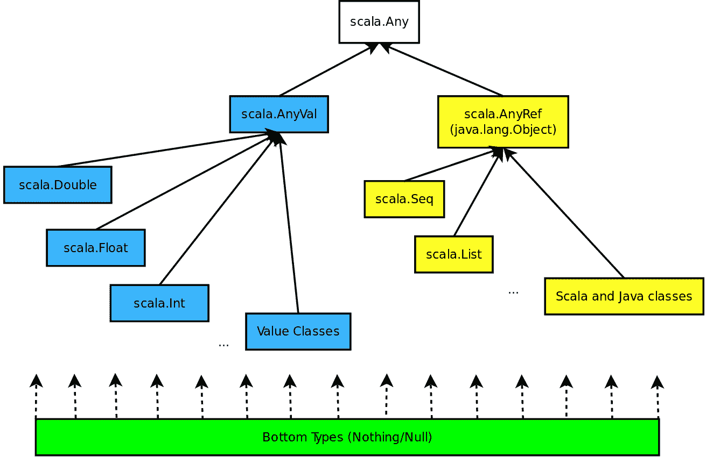

# 统一

能够理解和编写良好的 Scala 代码要求开发者熟悉该语言的不同概念。到目前为止，我们在几个地方提到 Scala 确实具有很强的表达能力。在一定程度上，这是因为有多个编程概念被统一了。在本章中，我们将重点关注以下概念：

+   函数和类

+   代数数据类型和类层次结构

+   模块和对象

# 函数和类

在 Scala 中，每个值都是一个对象。函数是一等值，这也使它们成为各自类的对象。

以下图表显示了 Scala 统一类型系统及其实现方式。它改编自[`www.scala-lang.org/old/sites/default/files/images/classhierarchy.png`](http://www.scala-lang.org/old/sites/default/files/images/classhierarchy.png)，并代表了对该模型（一些类如`ScalaObject`已经消失，如我们之前提到的）的最新看法：



如您所见，Scala 没有 Java 那样的原始类型概念，所有类型最终都是**Any**的子类型。

# 作为类的函数

函数作为类的事实意味着它们可以像值一样自由地传递给其他方法或类。这提高了 Scala 的表达能力，并使其比其他语言（如 Java）更容易实现回调等功能。

# 函数字面量

让我们看看一个示例：

```java
class FunctionLiterals {
  val sum = (a: Int, b: Int) => a + b
}

object FunctionLiterals {

  def main(args: Array[String]): Unit = {
    val obj = new FunctionLiterals
    System.out.println(s"3 + 9 = ${obj.sum(3, 9)}")
  }
}
```

在这里，我们可以看到`FunctionLiterals`类的求和字段实际上被分配了一个函数。我们可以将任何函数分配给一个变量，然后像调用函数一样调用它（本质上是在对象名称或实例后使用括号调用其`apply`方法）。函数也可以作为参数传递给其他方法。让我们向我们的`FunctionLiterals`类添加以下内容：

```java
def runOperation(f: (Int, Int) => Int, a: Int, b: Int): Int = {
  f(a, b)
}
```

然后，我们可以将所需的函数传递给`runOperation`，如下所示：

```java
obj.runOperation(obj.sum, 10, 20)
obj.runOperation(Math.max, 10, 20)
```

# 无语法糖的函数

在前面的示例中，我们只是使用了语法糖。为了确切了解发生了什么，我们将向您展示函数字面量被转换成了什么。它们基本上是`FunctionN`特质的扩展，其中`N`是参数的数量。字面量的实现是通过`apply`方法调用的（每当一个类或对象有`apply`方法时，它可以通过在对象名称或实例后使用括号并传递所需的参数（如果有）来隐式调用）。让我们看看与我们之前示例等效的实现：

```java
class SumFunction extends Function2[Int, Int, Int] {
  override def apply(v1: Int, v2: Int): Int = v1 + v2
}

class FunctionObjects {
  val sum = new SumFunction

  def runOperation(f: (Int, Int) => Int, a: Int, b: Int): Int = f(a, b)
}

object FunctionObjects {

  def main(args: Array[String]): Unit = {
    val obj = new FunctionObjects
    System.out.println(s"3 + 9 = ${obj.sum(3, 9)}")
    System.out.println(s"Calling run operation: ${obj.
    runOperation(obj.sum, 10, 20)}")
    System.out.println(s"Using Math.max: ${obj.runOperation(Math.max,
     10, 20)}")
  }
}
```

# 增强表达能力

如从示例中可以看出，统一类和函数导致表达能力增强，我们可以轻松实现回调、延迟参数评估、集中异常处理等功能，而无需编写额外的代码和逻辑。此外，函数作为类意味着我们可以扩展它们以提供额外功能。

# 代数数据类型和类层次结构

**代数数据类型**（**ADTs**）和类层次结构是 Scala 编程语言中的其他统一方式。在其他函数式语言中，有特殊的方法来创建自定义的代数数据类型。在 Scala 中，这是通过类层次结构以及所谓的 *案例类* 和 *对象* 来实现的。让我们看看 ADT 实际上是什么，有哪些类型，以及如何定义它们。

# ADTs

代数数据类型只是组合类型，它们结合了其他现有类型或仅仅代表一些新的类型。它们只包含数据，并且不包含任何在数据之上作为正常类会包含的功能。一些例子可以包括一周中的某一天或表示 RGB 颜色的类——它们没有额外的功能，只是携带信息。接下来的几个小节将更深入地探讨 ADT 是什么以及有哪些类型。

# 求和 ADTs

求和代数数据类型是我们可以在其中简单地列出类型的所有可能值并为每个值提供一个单独构造函数的类型。作为一个例子，让我们考虑一年中的月份。它们只有 12 个，而且它们不会改变（希望如此）：

```java
sealed abstract trait Month
case object January extends Month
case object February extends Month
case object March extends Month
case object April extends Month
case object May extends Month
case object June extends Month
case object July extends Month
case object August extends Month
case object September extends Month
case object October extends Month
case object November extends Month
case object December extends Month

object MonthDemo {
  def main(args: Array[String]): Unit = {
    val month: Month = February
    System.out.println(s"The current month is: $month")
  }
}
```

运行此应用程序将产生以下输出：

```java
The current month is: February
```

前面的代码中的 `Month` 特质是密封的，因为我们不希望它在当前文件之外被扩展。正如你所见，我们将不同的月份定义为对象，因为没有理由让它们成为单独的实例。值就是它们的样子，它们不会改变。

# 产品 ADTs

在积代数数据类型中，我们无法列出所有可能的值。通常值太多，无法手动编写。我们无法为每个单独的值提供一个单独的构造函数。

让我们思考一下颜色。有不同颜色模型，但其中最著名的一个是 RGB。它结合了主要颜色（红色、绿色和蓝色）的不同值来表示其他颜色。如果我们说每种颜色都可以在 `0` 到 `255` 之间取值，这意味着要表示所有可能性，我们需要有 256³ 个不同的构造函数。这就是为什么我们可以使用积 ADT：

```java
sealed case class RGB(red: Int, green: Int, blue: Int)

object RGBDemo {
  def main(args: Array[String]): Unit = {
    val magenta = RGB(255, 0, 255)
    System.out.println(s"Magenta in RGB is: $magenta")
  }
}
```

现在，我们可以看到对于积 ADTs，我们有一个构造函数用于不同的值。

# 混合 ADTs

混合代数数据类型代表了我们之前描述的求和和积的混合。这意味着我们可以有特定的值构造函数，但这些值构造函数也提供了参数来封装其他类型。

让我们看看一个例子。想象我们正在编写一个绘图应用程序：

```java
sealed abstract trait Shape
case class Circle(radius: Double) extends Shape
case class Rectangle(height: Double, width: Double) extends Shape
```

我们有不同的形状。前面的例子显示了一个求和 ADT，因为我们有特定的 `Circle` 和 `Rectangle` 值构造函数。此外，我们还有一个积 ADT，因为构造函数接受额外的参数。

让我们稍微扩展一下我们的类。当我们绘制形状时，我们需要知道它们的位置。这就是为什么我们可以添加一个 `Point` 类来持有 `x` 和 `y` 坐标：

```java
case class Point(x: Double, y: Double)

sealed abstract trait Shape
case class Circle(centre: Point, radius: Double) extends Shape
case class Rectangle(topLeft: Point, height: Double, width: Double) extends Shape
```

希望这能清楚地说明在 Scala 中 ADT（抽象数据类型）是什么以及它们如何被使用。

# 统一

在所有前面的例子之后，很明显，类层次和 ADT 是统一的，看起来像是同一件事。这为语言增加了高度的灵活性，使得建模比其他函数式编程语言更容易。

# 模式匹配

模式匹配通常与 ADT 一起使用。与使用`if…else`语句相比，它使代码更加清晰、易读，并且更容易扩展。正如你所想象的那样，在某些情况下，这些语句可能会变得相当繁琐，特别是当某个数据类型有多个可能的值时。在某些情况下，模式匹配可以像*枚举*一样使用，就像 Java 中的`switch`语句一样。

# 值的模式匹配

在之前提到的月份示例中，我们只有月份名称。然而，我们可能还想获取它们的数字，因为否则计算机将不知道这一点。以下是这样做的方法：

```java
object Month {
  def toInt(month: Month): Int =
    month match {
      case January => 1
      case February => 2
      case March => 3
      case April => 4
      case May => 5
      case June => 6
      case July => 7
      case August => 8
      case September => 9
      case October => 10
      case November => 11
      case December => 12
    }
}
```

你可以看到我们如何匹配不同的值，并根据它们返回正确的值。以下是现在如何使用这个方法：

```java
System.out.println(s"The current month is: $month and it's number ${Month.toInt(month)}")
```

如预期的那样，我们的应用程序将产生以下内容：

```java
The current month is: February and it's number 2
```

我们指定我们的基本特质为密封的，这保证了没有人会在我们的代码之外扩展它，我们将能够进行详尽的模式匹配。不详尽的模式匹配是有问题的。作为一个实验，如果我们尝试注释掉二月匹配规则并编译，我们将看到以下警告：

```java
Warning:(19, 5) match may not be exhaustive.
It would fail on the following input: February
    month match {
    ^
```

以这种方式运行示例证明了这个警告是真实的，当我们使用`February`作为参数时，我们的代码失败了。为了完整性，我们可以添加一个默认情况：

```java
case _ => 0
```

本小节中展示的例子是可以在 Scala 中使用，以实现 Java 中*枚举*的功能性。

# 产品 ADT 的模式匹配

当用于产品和混合 ADT 时，模式匹配展示了它的真正力量。在这种情况下，我们可以匹配数据类型的实际值。让我们看看我们如何实现一个计算形状面积的功能，如之前定义的那样：

```java
object Shape {
  def area(shape: Shape): Double =
    shape match {
      case Circle(Point(x, y), radius) => Math.PI * Math.pow(radius, 2)
      case Rectangle(_, h, w) => h * w
    }
}
```

在匹配时，我们可以忽略我们不关心的值。对于面积，我们实际上并不需要位置信息。在前面的代码中，我们只展示了两种可能的匹配方式。`_`运算符可以在匹配语句中的任何位置，它将忽略它被放置的值。之后，使用我们的示例就很简单了：

```java
object ShapeDemo {
  def main(args: Array[String]): Unit = {
    val circle = Circle(Point(1, 2), 2.5)
    val rect = Rectangle(Point(6, 7), 5, 6)

    System.out.println(s"The circle area is: ${Shape.area(circle)}")
    System.out.println(s"The rectangle area is: ${Shape.area(rect)}")
  }
}
```

这将产生类似于以下内容的输出：

```java
The circle area is: 19.634954084936208
The rectangle area is: 30.0
```

我们甚至可以在模式匹配期间用常量代替 ADT 构造函数参数中的变量。这使得语言非常强大，并允许我们实现更复杂的逻辑，同时看起来仍然相当不错。你可以尝试使用前面的例子来了解模式匹配实际上是如何工作的。

模式匹配通常与 ADT 一起使用，有助于实现干净、可扩展和详尽的代码。

# 模块和对象

模块是组织程序的一种方式。它们是可互换的、可插入的代码片段，具有定义良好的接口和隐藏的实现。在 Java 中，模块组织在包中。在 Scala 中，模块就像其他一切一样是对象。这意味着它们可以被参数化、扩展，并且可以作为参数传递，等等。

Scala 模块可以提供要求以便被使用。

# 使用模块

我们已经确定在 Scala 中模块和对象也是统一的。这意味着我们可以将整个模块传递到我们的应用程序中。然而，展示模块的实际外观将是有用的。以下是一个示例：

```java
trait Tick {
  trait Ticker {
    def count(): Int
    def tick(): Unit
  }
  def ticker: Ticker
}
```

在这里，`Tick`只是我们模块的一个接口。以下是其实现：

```java
trait TickUser extends Tick {
  class TickUserImpl extends Ticker {
    var curr = 0

    override def count(): Int = curr

    override def tick(): Unit = {
      curr = curr + 1
    }
  }
  object ticker extends TickUserImpl
}
```

`TickUser`特质实际上是一个模块。它实现了`Tick`并包含其内部的代码。我们创建了一个单例对象，它将携带实现。注意对象中的名称与`Tick`中的方法名称相同。这满足了在混入特质时实现它的需求。

同样，我们可以定义另一个接口及其实现如下：

```java
trait Alarm {
  trait Alarmer {
    def trigger(): Unit
  }
  def alarm: Alarmer
}
```

实现将如下所示：

```java
trait AlarmUser extends Alarm with Tick {
  class AlarmUserImpl extends Alarmer {
    override def trigger(): Unit = {
      if (ticker.count() % 10 == 0) {
        System.out.println(s"Alarm triggered at ${ticker.count()}!")
      }
    }
  }
  object alarm extends AlarmUserImpl
}
```

这里有趣的是，我们在`AlarmUser`中扩展了两个模块。这展示了模块如何相互依赖。最后，我们可以如下使用我们的模块：

```java
object ModuleDemo extends AlarmUser with TickUser {
  def main(args: Array[String]): Unit = {
    System.out.println("Running the ticker. Should trigger the alarm
    every 10 times.")
    (1 to 100).foreach {
      case i =>
        ticker.tick()
        alarm.trigger()
    }
  }
}
```

为了让`ModuleDemo`使用`AlarmUser`模块，编译器还要求混入`TickUser`或任何混入`Tick`的模块。这提供了插入不同功能的可能性。

程序的输出将如下所示：

```java
Running the ticker. Should trigger the alarm every 10 times.
Alarm triggered at 10!
Alarm triggered at 20!
Alarm triggered at 30!
Alarm triggered at 40!
Alarm triggered at 50!
Alarm triggered at 60!
Alarm triggered at 70!
Alarm triggered at 80!
Alarm triggered at 90!
Alarm triggered at 100!
```

Scala 中的模块可以像其他任何对象一样传递。它们是可扩展的、可互换的，并且它们的实现是隐藏的。

# 摘要

在本章中，我们专注于统一。我们看到了函数和类、ADT、类层次结构以及模块和对象之间的统一。这使我们能够更加表达性，编写更干净、更高效的代码。我们还介绍了模式匹配是什么以及如何在 Scala 中使用它来编写良好的代码。

本章中涉及的一些概念将在后续章节中非常有用，在这些章节中我们将实现具体的设计模式。仅仅因为 Scala 的表达能力允许这样做，它们也可以用来编写符合定义的设计模式的良好软件，而这违背了需要做额外工作来实现设计模式的需求。

在下一章中，我们将探讨**抽象**和**自类型**以及它们可能有什么用。
