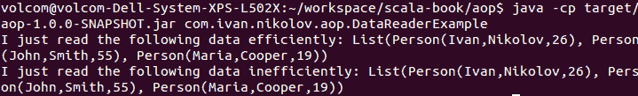
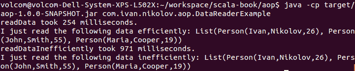
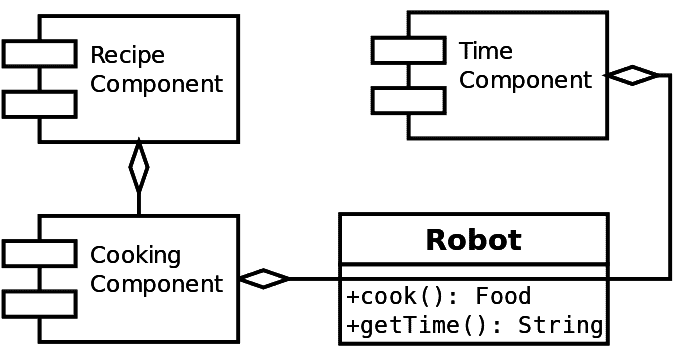
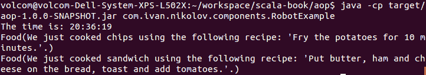

# 面向方面编程与组件

在编程中，我们经常看到在不同方法中重复的源代码片段。在某些情况下，我们可以重构我们的代码并将它们移动到单独的模块中。然而，有时这是不可能的。一些值得注意的例子包括日志记录和验证。面向方面编程在这种情况下很有帮助，我们将在本章结束时对其有一个了解。

组件是可重用的代码片段，提供一系列服务并有一些要求。它们对于避免代码重复以及当然促进代码重用非常有用。在这里，我们将了解如何构建组件以及 Scala 如何使组件的编写和使用比其他语言更简单。

在熟悉面向方面编程和组件的过程中，我们将探讨以下顶级主题：

+   面向方面编程

+   Scala 中的组件

# 面向方面编程

**面向方面编程**（**AOP**）解决了一个常见功能，该功能跨越整个应用程序，但无法使用传统的面向对象技术在一个模块中抽象。这种重复的功能通常被称为*横切关注点*。一个常见的例子是日志记录——通常，日志记录器是在类内部创建的，然后在其方法内部调用这些方法。这有助于调试和跟踪应用程序中的事件，但与实际功能并没有真正的关联。

面向方面编程建议将横切关注点抽象并封装在其自己的模块中。在接下来的几个小节中，我们将探讨 AOP 如何改进代码，以及如何使横切关注点易于扩展。

# 理解应用程序效率

每个程序的一个重要部分是效率。在许多情况下，我们可以计时我们的方法，并找到应用程序中的瓶颈。让我们看看一个示例程序，我们将在之后尝试计时。

我们将看看解析。在许多实际应用中，我们必须以特定格式读取数据并将其解析为代码中的对象。对于这个例子，我们将有一个以 JSON 格式表示的小型人员数据库：

```java
[
  {
    "firstName": "Ivan",
    "lastName": "Nikolov",
    "age": 26
  },
  {
    "firstName": "John",
    "lastName": "Smith",
    "age": 55
  },
  {
    "firstName": "Maria",
    "lastName": "Cooper",
    "age": 19
  }
]
```

为了在 Scala 中表示这个 JSON，我们必须定义我们的模型。它将是简单的，只包含一个类——`Person`。以下是它的代码：

```java
case class Person(firstName: String, lastName: String, age: Int)
```

由于我们将读取 JSON 输入，我们不得不解析它们。市面上有很多解析器，每个人可能都有自己的偏好。在当前示例中，我们使用了 json4s ([`github.com/json4s/json4s`](https://github.com/json4s/json4s))。在我们的`build.sbt/pom.xml`文件中，我们有以下额外的依赖项：

```java
<dependency>
    <groupId>org.json4s</groupId>
    <artifactId>json4s-jackson_2.12</artifactId>
    <version>3.6.0-M2</version>
</dependency>
```

下面的示例显示了`pom.xml`版本的`build.sbt`等效：

```java
"org.json4s" %% "json4s-jackson" % "3.6.0-M2"
```

我们已经编写了一个包含两个方法的类，这些方法解析给定格式的输入文件并返回一个`Person`对象列表。这两个方法做的是完全相同的事情，但其中一个比另一个更高效：

```java
import org.json4s._
import org.json4s.jackson.JsonMethods._

trait DataReader {
  def readData(): List[Person]
  def readDataInefficiently(): List[Person]
}

class DataReaderImpl extends DataReader {
  implicit val formats = DefaultFormats

  private def readUntimed(): List[Person] =
    parse(StreamInput(getClass.getResourceAsStream("/users.json"))).extract[List[Person]]

  override def readData(): List[Person] = readUntimed()

  override def readDataInefficiently(): List[Person] = {
    (1 to 10000).foreach {
      case num =>
        readUntimed()
    }
    readUntimed()
  }
}
```

`DataReader`特质充当一个接口，使用其实现相当直接：

```java
object DataReaderExample {
  def main(args: Array[String]): Unit = {
    val dataReader = new DataReaderImpl
    System.out.println(s"I just read the following data efficiently:
     ${dataReader.readData()}")
    System.out.println(s"I just read the following data inefficiently:
     ${dataReader.readDataInefficiently()}")
  }
}
```

它将产生如下截图所示的输出：



前面的例子很清晰。然而，如果我们想优化我们的代码并查看导致其变慢的原因呢？之前的代码没有给我们这个可能性，所以我们将不得不采取一些额外的步骤来计时并查看我们的应用程序的性能。在以下小节中，我们将展示如何在不使用和在使用 AOP 的情况下完成这项工作。

# 不使用 AOP 计时我们的应用程序

有一种基本的方法来做我们的计时。我们可以在应用程序中的`println`语句周围添加，或者将计时作为`DataReaderImpl`类中的方法的一部分。一般来说，将计时作为方法的一部分似乎是一个更好的选择，因为在某些情况下，这些方法可能在不同的地方被调用，并且它们的性能将取决于传递的参数和其他因素。考虑到我们所说的，这是我们的`DataReaderImpl`类可以被重构以支持计时的方法：

```java
import org.json4s._
import org.json4s.jackson.JsonMethods._

class DataReaderImpl extends DataReader {
 implicit val formats = DefaultFormats

 private def readUntimed(): List[Person] =
  parse(StreamInput(getClass.getResourceAsStream("/users.json")))
  .extract[List[Person]]

 override def readData(): List[Person] = {
   val startMillis = System.currentTimeMillis()
   val result = readUntimed()
   val time = System.currentTimeMillis() - startMillis
   System.err.println(s"readData took ${time} milliseconds.")
    result
 }

 override def readDataInefficiently(): List[Person] = {
   val startMillis = System.currentTimeMillis()
   (1 to 10000).foreach {
     case num =>
      readUntimed()
   }
   val result = readUntimed()
   val time = System.currentTimeMillis() - startMillis
   System.err.println(s"readDataInefficiently took ${time} milliseconds.")
   result
 }
}
```

如你所见，代码变得难以阅读，计时干扰了实际的功能。无论如何，如果我们运行我们的程序，输出将显示问题所在：



我们将在下一小节中看到如何使用面向方面的编程来改进我们的代码。

在前面的例子中，我们使用了`System.err.println`来记录计时。这只是为了示例目的。在实践中，使用日志记录器，例如**slf4j** ([`www.slf4j.org/`](https://www.slf4j.org/))，是推荐的选择，因为你可以有不同的日志级别，并通过配置文件切换日志。在这里使用日志记录器会添加额外的依赖项，并且会分散你的注意力，使其远离重要的材料。

# 使用 AOP 计时我们的应用程序

正如我们所见，将我们的计时代码添加到我们的方法中引入了代码重复，并使得我们的代码难以理解，即使是对于一个小例子。现在，想象一下我们还需要进行日志记录和其他活动。面向方面的编程有助于分离这些关注点。

我们可以将`DataReaderImpl`类恢复到其原始状态，其中它不会进行任何日志记录。然后，我们创建另一个名为`LoggingDataReader`的特质，它从`DataReader`扩展而来，并包含以下内容：

```java
trait LoggingDataReader extends DataReader {

  abstract override def readData(): List[Person] = {
    val startMillis = System.currentTimeMillis()
    val result = super.readData()
    val time = System.currentTimeMillis() - startMillis
    System.err.println(s"readData took ${time} milliseconds.")
    result
  }

  abstract override def readDataInefficiently(): List[Person] = {
    val startMillis = System.currentTimeMillis()
    val result = super.readDataInefficiently()
    val time = System.currentTimeMillis() - startMillis
    System.err.println(s"readDataInefficiently took ${time} milliseconds.")
    result
  }
}
```

这里有趣的是`abstract override`修饰符。它通知编译器我们将进行可堆叠的修改。如果我们不使用这个修饰符，我们的编译将失败，并出现以下错误：

```java
Error:(9, 24) method readData in trait DataReader is accessed from super. It may not be abstract unless it is overridden by a member declared `abstract' and `override'
    val result = super.readData()
                       ^
Error:(17, 24) method readDataInefficiently in trait DataReader is accessed from super. It may not be abstract unless it is overridden by a member declared `abstract' and `override'
    val result = super.readDataInefficiently()
                       ^
```

现在，让我们使用我们新的特质，通过混合组合，这是我们在这本书的早期部分已经介绍过的，在以下程序中：

```java
object DataReaderAOPExample {
  def main(args: Array[String]): Unit = {
    val dataReader = new DataReaderImpl with LoggingDataReader
    System.out.println(s"I just read the following data efficiently:
     ${dataReader.readData()}")
    System.out.println(s"I just read the following data inefficiently:
     ${dataReader.readDataInefficiently()}")
  }
}
```

如果我们运行这个程序，我们会看到，就像之前一样，我们的输出将包含时间信息。

使用面向方面编程的优势是显而易见的——实现不会被其他与之无关的代码所污染。此外，我们可以使用相同的方法添加额外的修改——更多的日志记录、重试逻辑、回滚等。所有这些操作只需创建新的特质，扩展 `DataReader` 并将它们混合在一起，就像之前所展示的那样。当然，我们可以同时应用多个修改，它们将按顺序执行，其执行顺序将遵循我们已熟悉的线性化规则。

# Scala 中的组件

组件是应用程序的组成部分，旨在与其他应用程序的组成部分结合使用。它们应该是可重用的，以便减少代码重复。组件通常具有接口，这些接口描述了它们提供的服务以及它们依赖的服务或其他组件的数量。

在大型应用程序中，我们通常看到多个组件被集成在一起协同工作。描述一个组件提供的服务通常是直接的，并且是通过接口来完成的。然而，集成其他组件有时可能需要开发者做额外的工作。这通常是通过将所需接口作为参数传递来完成的。然而，想象一下，在一个大型应用程序中，我们可能有很多需求；连接这些组件可能需要时间和精力。此外，每次出现新的需求时，我们都必须进行相当多的重构。参数的另一种选择是多重继承；然而，语言需要以某种方式支持它。

在像 Java 这样的语言中，将组件连接起来的流行方式是通过依赖注入。在 Java 中存在一些库，可以在运行时将组件注入到彼此中。

# 使用 Scala 的表达力构建组件

在这本书中，我们已经多次提到 Scala 是一种比简单的面向对象语言更具表达力的语言。我们已经探讨了诸如抽象类型、自类型、统一和混合组合等概念。它们使我们能够创建泛型代码，要求特定的类，并且能够以相同的方式处理对象、类、变量和函数，从而实现多重继承。使用这些组合的不同组合将使我们能够编写我们寻找的模块化代码。

# 实现组件

依赖注入在连接组件方面非常流行。然而，在像 Java 这样的语言中，这意味着我们需要有人使用与我们相同的库。在我们的应用程序中的类中拥有大量的参数也不可接受。这使得犯错误更容易，并将重构和代码扩展变成了一场噩梦。

在下一个子节中，我们将探讨如何使用 Scala 的自类型来创建和组合组件。

# 组件的自类型

例如，让我们想象我们正在尝试构建一个烹饪食物的机器人。我们的机器人将能够查找食谱并烹饪我们要求的菜肴，还能告诉我们时间。我们可以通过简单地创建新的组件来为我们的机器人添加额外的功能。

我们希望我们的代码是模块化的，因此分割功能是有意义的。以下图表显示了我们的机器人将是什么样子以及不同组件之间的关系：



首先，让我们定义不同组件的接口：

```java
trait Time {
  def getTime(): String
}

trait RecipeFinder {
  def findRecipe(dish: String): String
}

trait Cooker {
  def cook(what: String): Food
}
```

我们需要定义`Food`类，在这个例子中，它将非常简单：

```java
case class Food(name: String)
```

完成这些后，我们可以开始创建我们的组件。首先是`TimeComponent`和嵌套类中`Time`的实现：

```java
trait TimeComponent {
  val time: Time

  class TimeImpl extends Time {
    val formatter = DateTimeFormatter.ofPattern("HH:mm:ss")
    override def getTime(): String = s"The time is:
     ${LocalDateTime.now().format(formatter)}"
  }
}
```

现在，我们可以以类似的方式实现`RecipeComponent`。以下是对应的组件代码和实现代码：

```java
trait RecipeComponent {
  val recipe: RecipeFinder

  class RecipeFinderImpl extends RecipeFinder {
    override def findRecipe(dish: String): String = dish match {
      case "chips" => "Fry the potatoes for 10 minutes."
      case "fish" => "Clean the fish and put in the oven for 30 minutes."
      case "sandwich" => "Put butter, ham and cheese on the bread,
       toast and add tomatoes."
      case _ => throw new RuntimeException(s"${dish} is unknown recipe.")
    }
  }
}
```

最后，我们需要实现`CookingComponent`。实际上，它需要一个`RecipeComponent`。以下是实现方式：

```java
trait CookingComponent {
  this: RecipeComponent =>

  val cooker: Cooker

  class CookerImpl extends Cooker {
    override def cook(what: String): Food = {
      val recipeText = recipe.findRecipe(what)
      Food(s"We just cooked $what using the following recipe:
       '$recipeText'.")
    }
  }
}
```

现在，我们已经分别实现了所有组件，并且可以将它们组合起来创建我们的机器人。我们将创建一个机器人将使用的组件注册表，如下所示：

```java
class RobotRegistry extends TimeComponent with RecipeComponent with CookingComponent {
  override val time: Time = new TimeImpl
  override val recipe: RecipeFinder = new RecipeFinderImpl
  override val cooker: Cooker = new CookerImpl
}
```

现在，让我们创建一个`Robot`：

```java
class Robot extends RobotRegistry {
  def cook(what: String) = cooker.cook(what)
  def getTime() = time.getTime()
}
```

使用我们的机器人的示例程序将如下所示：

```java
object RobotExample {
  def main(args: Array[String]): Unit = {
    val robot = new Robot
    System.out.println(robot.getTime())
    System.out.println(robot.cook("chips"))
    System.out.println(robot.cook("sandwich"))
  }
}
```

该程序的示例输出如下截图所示：



在前面的示例中，我们看到了 Scala 实现依赖注入的方式，这种方式易于连接，无需使用额外的库。这非常有用，因为它不会使我们的构造函数变得庞大，我们也不必扩展许多类。此外，我们拥有的组件被很好地分离，可测试，并且清楚地定义了它们的要求。我们还看到了如何使用需要其他组件的组件递归地添加要求。

上述示例实际上是**蛋糕设计模式**的表示。这里的一个优点是，依赖关系的存在是在编译时而不是在运行时评估的，这与流行的 Java 库不同。

蛋糕设计模式也有其缺点，但我们将在这个书中关注所有特性——无论是好是坏。这就是我们将展示如何测试组件的地方。

本章中蛋糕设计模式的示例非常简单。在实际应用中，我们可能会有依赖于其他组件的组件，这些组件又有自己的依赖关系，如此等等。在这种情况下，事情可能会变得复杂。我们将在本书的后面部分以更好的方式、更详细地展示这一点。

# 摘要

在本章中，我们探讨了 Scala 中的面向方面编程。我们现在知道如何将通常不可能移动到模块中的代码分离出来。这将有助于避免代码重复，并使我们的程序通过不同的、专业的模块变得更加出色。

我们还展示了如何使用本书前几章中介绍的技术来创建可重用组件。组件提供接口并具有特定要求，这些要求可以利用 Scala 的丰富性轻松满足。它们与设计模式非常相关，因为它们有相同的目的——使代码更优，避免重复，并且能够轻松测试。

在本书的后续章节中，我们将开始探讨一些具有有用特性和用例的具体设计模式。我们将从*创建型设计模式*开始，因为这些模式是由*GoF*定义的，但当然，从 Scala 的角度来看。
