# 第六章：创建型设计模式

从本章开始，我们将深入研究实际存在的各种设计模式。我们已经提到了了解和能够正确使用不同设计模式的重要性。

可以将设计模式视为解决特定问题的最佳实践或甚至模板。开发者将不得不解决的问题数量是无限的，在许多情况下，必须结合不同的设计模式。然而，基于代码编写以解决程序中某个问题的方面，我们可以将设计模式分为以下主要类别：

+   创建型

+   结构型

+   行为型

本章将专注于**创建型设计模式**，当然，我们将从 Scala 编程语言的角度来审视它们。我们将讨论以下主题：

+   什么是创建型设计模式

+   工厂方法

+   抽象工厂

+   其他工厂设计模式

+   懒初始化

+   单例

+   构造器

+   原型

在正式定义创建型设计模式之后，我们将更详细地分别审视每一个。我们将关注何时以及如何使用它们，何时避免某些模式，当然，还会展示一些相关的例子。

# 什么是创建型设计模式？

如其名所示，创建型设计模式处理对象创建。在某些情况下，在程序中创建对象可能涉及一些额外的复杂性，而创建型设计模式隐藏这些复杂性，以便使软件组件的使用更加容易。对象创建的复杂性可能由以下任何一个原因引起：

+   初始化参数的数量

+   需要的验证

+   获取所需参数的复杂性

前面的列表可能还会进一步扩展，并且在许多情况下，这些因素不仅单独存在，而且以组合的形式存在。

我们将在本章接下来的部分中关注创建型设计模式的各个方面，并希望你能对为什么需要它们以及如何在现实生活中使用它们有一个良好的理解。

# 工厂方法设计模式

工厂方法设计模式的存在是为了封装实际的类实例化。它仅仅提供了一个创建对象的接口，然后工厂的子类决定实例化哪个具体的类。这种设计模式在需要在不同运行时创建不同对象的情况下可能很有用。当对象创建需要开发者传递额外的参数时，这种设计模式也很有帮助。

通过一个例子，一切都会变得清晰起来，我们将在以下小节中提供一个例子。

# 一个示例类图

对于工厂方法，我们将通过数据库的例子来展示。为了使事情简单（因为实际的 `java.sql.Connection` 有很多方法），我们将定义自己的 `SimpleConnection`，并为 `MySQL` 和 `PostgreSQL` 提供具体实现。

连接类的图示如下：

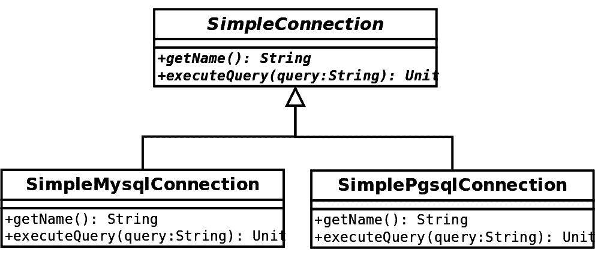

现在，创建这些连接将取决于我们想要使用的数据库。然而，由于它们提供的接口相同，使用它们的方式也将完全一样。实际的创建可能还涉及一些我们想要从用户那里隐藏的额外计算，这些计算在讨论每个数据库的不同常量时将是相关的。这就是我们使用工厂方法设计模式的原因。以下图示显示了我们的其余代码结构：

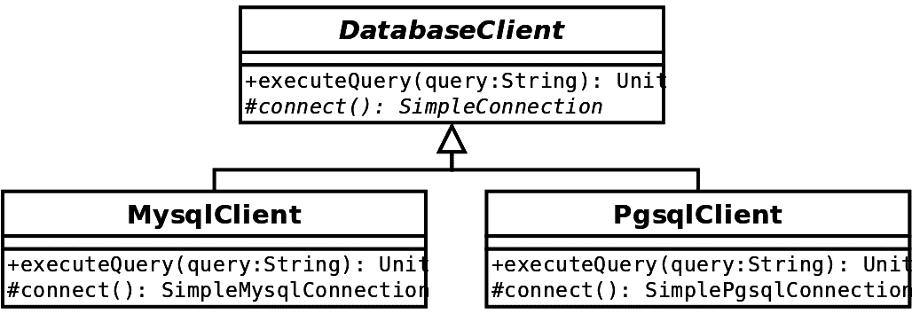

在前面的图中，**MysqlClient** 和 **PgsqlClient** 是 **DatabaseClient** 的具体实现。工厂方法为 **connect**，它在不同客户端返回不同的连接。由于我们进行了重写，代码中的方法签名仍然显示该方法返回一个 **SimpleConnection**，但实际上返回的是具体类型。在图中，为了清晰起见，我们选择显示实际返回的类型。

# 代码示例

从前面的图中可以看出，根据我们使用的数据库客户端，将使用和创建不同的连接。现在，让我们看看前面图的代码表示。首先是 `SimpleConnection` 及其具体实现：

```java
trait SimpleConnection {
  def getName(): String

  def executeQuery(query: String): Unit
}

class SimpleMysqlConnection extends SimpleConnection {
  override def getName(): String = "SimpleMysqlConnection"

  override def executeQuery(query: String): Unit = {
    System.out.println(s"Executing the query '$query' the MySQL way.")
  }
}

class SimplePgSqlConnection extends SimpleConnection {
  override def getName(): String = "SimplePgSqlConnection"

  override def executeQuery(query: String): Unit = {
    System.out.println(s"Executing the query '$query' the PgSQL way.")
  }
}
```

我们在名为 `connect` 的工厂方法中使用这些实现。以下代码片段显示了如何利用 `connect` 并如何在特定数据库客户端中实现它：

```java
abstract class DatabaseClient {
  def executeQuery(query: String): Unit = {
    val connection = connect()
    connection.executeQuery(query)
  }

  protected def connect(): SimpleConnection
}

class MysqlClient extends DatabaseClient {
  override protected def connect(): SimpleConnection = new SimpleMysqlConnection
}

class PgSqlClient extends DatabaseClient {
  override protected def connect(): SimpleConnection = new SimplePgSqlConnection
}
```

使用我们的数据库客户端很简单，如下所示：

```java
object Example {
  def main(args: Array[String]): Unit = {
    val clientMySql: DatabaseClient = new MysqlClient
    val clientPgSql: DatabaseClient = new PgSqlClient
    clientMySql.executeQuery("SELECT * FROM users")
    clientPgSql.executeQuery("SELECT * FROM employees")
  }
}
```

上述代码示例将产生以下输出：

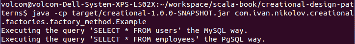

我们看到了工厂方法设计模式是如何工作的。如果我们需要添加另一个数据库客户端，我们只需扩展 `DatabaseClient`，并在实现 `connect` 方法时返回一个扩展 `SimpleConnection` 的类。

前面选择使用抽象类作为 `DatabaseClient` 和特质作为 `SimpleConnection` 只是随机的。我们当然可以用特质替换抽象类。

在其他情况下，由工厂方法创建的对象可能在构造函数中需要参数，这些参数可能依赖于拥有工厂方法的对象的某些特定状态或功能。这正是这种设计模式可以真正发挥作用的地方。

# Scala 的替代方案

就像软件工程中的任何事物一样，这个设计模式也可以使用不同的方法来实现。到底使用哪种方法，实际上取决于应用程序和创建的对象的需求和特定功能。一些可能的替代方案包括以下内容：

+   在构造函数中将所需的组件传递给需要它们的类（对象组合）。然而，这意味着每次请求这些组件时，它们将是特定的实例而不是新的实例。

+   传递一个将创建我们需要的对象的函数。

利用 Scala 的丰富性，我们可以避免这种设计模式，或者我们可以更聪明地创建我们将要使用或暴露的对象，或者工厂方法将要创建的对象。最终，没有绝对的对错。然而，有一种方法可以使事情在用法和维护方面都更简单，这应该根据具体要求来选择。

# 它有什么好处？

与其他工厂一样，对象创建的细节被隐藏了。这意味着如果我们需要改变特定实例的创建方式，我们只需要更改创建它的工厂方法（尽管这可能涉及到很多创建者，这取决于设计）。工厂方法允许我们使用类的抽象版本，并将对象创建推迟到子类。

# 它有什么不好？

在前面的例子中，如果我们有多个工厂方法，我们可能会很快遇到问题。这首先要求程序员实现更多的方法，但更重要的是，它可能导致返回的对象不兼容。让我们通过一个简短的例子来看看这一点。首先，我们将声明另一个特质`SimpleConnectionPrinter`，它将有一个方法，当被调用时打印一些内容：

```java
trait SimpleConnectionPrinter {
  def printSimpleConnection(connection: SimpleConnection): Unit
}
```

现在，我们想要改变我们的`DatabaseClient`并将其命名为不同的名称（`BadDatabaseClient`）。它看起来如下所示：

```java
abstract class BadDatabaseClient {
  def executeQuery(query: String): Unit = {
    val connection = connect()
    val connectionPrinter = getConnectionPrinter()
    connectionPrinter.printSimpleConnection(connection)
    connection.executeQuery(query)
  }

  protected def connect(): SimpleConnection

  protected def getConnectionPrinter(): SimpleConnectionPrinter
}
```

与我们的原始示例相比，这里唯一的区别是我们还有一个工厂方法，我们也会在执行查询时调用它。类似于`SimpleConnection`实现，现在让我们为我们的`SimpleConnectionPrinter`创建两个更多用于 MySQL 和 PostgreSQL 的：

```java
class SimpleMySqlConnectionPrinter extends SimpleConnectionPrinter {
  override def printSimpleConnection(connection: SimpleConnection): Unit = {
    System.out.println(s"I require a MySQL connection. It is: '${connection.getName()}'")
  }
}

class SimplePgSqlConnectionPrinter extends SimpleConnectionPrinter {
  override def printSimpleConnection(connection: SimpleConnection): Unit = {
    System.out.println(s"I require a PgSQL connection. It is: '${connection.getName()}'")
  }
}
```

现在我们可以应用工厂设计模式并创建 MySQL 和 PostgreSQL 客户端，如下所示：

```java
class BadMySqlClient extends BadDatabaseClient {
  override protected def connect(): SimpleConnection = new SimpleMysqlConnection

  override protected def getConnectionPrinter(): SimpleConnectionPrinter = new SimpleMySqlConnectionPrinter
}

class BadPgSqlClient extends BadDatabaseClient {
  override protected def connect(): SimpleConnection = new SimplePgSqlConnection

  override protected def getConnectionPrinter(): SimpleConnectionPrinter = new SimpleMySqlConnectionPrinter
}
```

前面的实现是完全有效的。我们现在可以在一个例子中使用它们：

```java
object BadExample {
  def main(args: Array[String]): Unit = {
    val clientMySql: BadDatabaseClient = new BadMySqlClient
    val clientPgSql: BadDatabaseClient = new BadPgSqlClient
    clientMySql.executeQuery("SELECT * FROM users")
    clientPgSql.executeQuery("SELECT * FROM employees")
  }
}
```

这个例子将产生以下输出：

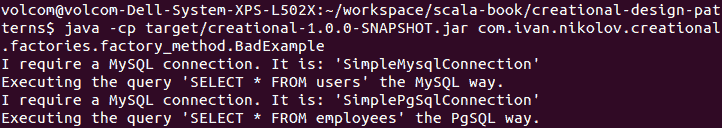

在前面的例子中发生的情况是我们遇到了逻辑错误，并且没有任何通知告诉我们这一点。当需要实现的方法数量增加时，这可能会成为一个问题，错误也容易被犯。例如，我们的代码没有抛出异常，但这个陷阱可能导致难以发现和调试的运行时错误。

# 抽象工厂

抽象工厂是*工厂*模式家族中的另一个设计模式。其目的是与所有工厂设计模式相同——封装对象创建逻辑并隐藏它。不同之处在于它的实现方式。

与工厂方法使用的继承相比，抽象工厂设计模式依赖于对象组合。在这里，我们有一个单独的对象，它提供了一个接口来创建我们需要的类的实例。

# 一个示例类图

让我们继续使用之前的`SimpleConnection`示例。以下图显示了抽象工厂的结构：

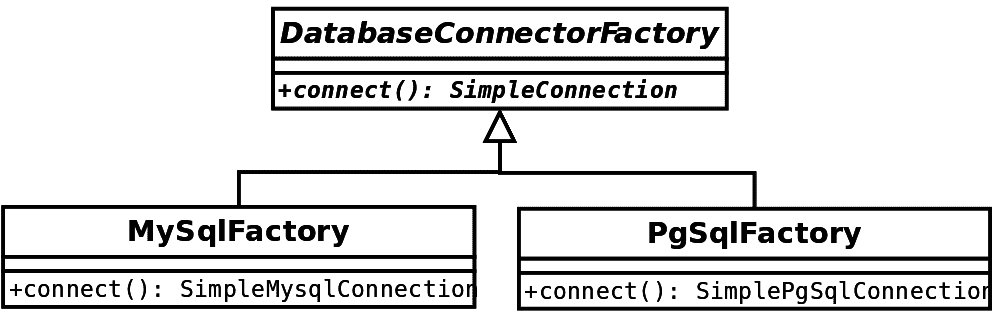

如前图所示，现在我们有一个工厂的层次结构，而不是数据库客户端内部的某个方法。在我们的应用程序中，我们将使用抽象的**DatabaseConnectorFactory**，并且它将根据实际的实例类型返回正确的对象。

# 代码示例

让我们从源代码的角度来看我们的示例。以下代码列表显示了工厂层次结构：

```java
trait DatabaseConnectorFactory {
  def connect(): SimpleConnection
}

class MySqlFactory extends DatabaseConnectorFactory {
  override def connect(): SimpleConnection = new SimpleMysqlConnection
}

class PgSqlFactory extends DatabaseConnectorFactory {
  override def connect(): SimpleConnection = new SimplePgSqlConnection
}
```

我们可以通过将其传递给一个类来使用我们的工厂，该类将调用所需的方法。以下是一个类似于我们之前展示的工厂方法设计模式的示例：

```java
class DatabaseClient(connectorFactory: DatabaseConnectorFactory) {
  def executeQuery(query: String): Unit = {
    val connection = connectorFactory.connect()
    connection.executeQuery(query)
  }
}
```

让我们看看一个使用我们的数据库客户端的示例：

```java
object Example {
  def main(args: Array[String]): Unit = {
    val clientMySql: DatabaseClient = new DatabaseClient(new MySqlFactory)
    val clientPgSql: DatabaseClient = new DatabaseClient(new PgSqlFactory)
    clientMySql.executeQuery("SELECT * FROM users")
    clientPgSql.executeQuery("SELECT * FROM employees")
  }
}
```

以下截图显示了此程序的输出：

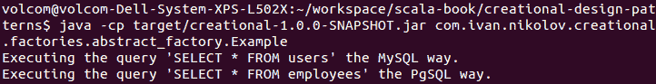

这就是抽象工厂设计模式的工作方式。如果我们需要将另一个数据库客户端添加到我们的应用程序中，我们可以通过添加一个扩展`DatabaseConnectionFactory`的类来实现这一点。这很好，因为它使得重构和扩展变得容易。

# Scala 替代方案

这个设计模式也可以使用不同的方法实现。我们使用对象组合将工厂传递给我们的类的事实表明，我们可以做其他事情——我们只需传递一个函数，因为在 Scala 中，它们是统一的一部分，并且被当作对象一样对待。

# 它适用于什么？

与所有工厂一样，对象的创建细节是隐藏的。当我们想要暴露对象家族（例如，数据库连接器）时，抽象工厂设计模式特别有用。客户端因此与具体类解耦。这个模式通常在不同的 UI 工具包中作为示例展示，其中元素因不同的操作系统而异。它也相当易于测试，因为我们可以向客户端提供模拟而不是实际的工厂。

尽管我们之前提到的不兼容性问题仍然存在，但现在遇到它的难度有所增加。这主要是因为在这里，客户端实际上只需传递一个单独的工厂作为参数，如果我们提供了具体的工厂，那么在编写这些工厂时，所有的事情都已经处理好了。

# 它不适用于什么？

如果我们使用的对象和方法（在我们的例子中是`SimpleConnection`）更改了签名，可能会出现问题。在某些情况下，这种模式也可能不必要地使我们的代码复杂化，使其难以阅读和跟踪。

# 其他工厂设计模式

工厂设计模式有多种不同的变体。不过，在所有情况下，目的通常都是相同的——隐藏创建复杂性。在接下来的小节中，我们将简要介绍两种其他的工厂设计模式——**静态工厂**和**简单工厂**。

# 静态工厂

静态工厂可以表示为一个静态方法，它是基类的一部分。它被调用以创建扩展基类的具体实例。然而，这里最大的缺点之一是，如果添加了基类的另一个扩展，由于静态方法，基类也必须被编辑。让我们从一个动物世界的简单例子来展示：

```java
trait Animal
class Bird extends Animal
class Mammal extends Animal
class Fish extends Animal

object Animal {
  def apply(animal: String): Animal = animal.toLowerCase match {
    case "bird" => new Bird
    case "mammal" => new Mammal
    case "fish" => new Fish
    case x: String => throw new RuntimeException(s"Unknown animal: $x")
  }
}
```

在这里，每次我们添加`Animal`的新扩展时，我们都需要更改`apply`方法来考虑它，尤其是如果我们想要考虑新的类型。

之前的例子使用了`Animal`伴生对象的特殊`apply`方法。我们可以有不同的版本，它将为我们提供一种语法糖，允许我们简单地使用`Animal("mammal")`。这使得使用工厂变得更加方便，因为由于基类，其存在将由好的 IDE 指示。

# 简单工厂

简单工厂比静态工厂更好，因为实际的工厂功能在另一个类中。这消除了每次添加新扩展时修改基类的要求。这与抽象工厂类似，但不同之处在于这里我们没有基工厂类，而是使用一个具体的类。通常，人们从一个简单的工厂开始，随着时间的推移和项目的演变，它逐渐演变为抽象工厂。

# 工厂组合

当然，可以将不同类型的工厂组合在一起。然而，这需要谨慎进行，并且只有在必要时才这么做。否则，过度使用设计模式可能会导致代码质量下降。

# 懒加载

软件工程中的懒加载是指在第一次需要时才实例化一个对象或变量。这种做法背后的理念是推迟或甚至避免一些昂贵的操作。

# 一个示例类图

在其他语言中，例如 Java，懒加载通常与工厂方法设计模式结合使用。这种方法通常检查我们想要使用的对象/变量是否已初始化；如果没有，它将初始化对象，并最终返回它。在连续使用中，已初始化的对象/变量将被返回。

Scala 编程语言内置了对懒加载的支持。它使用了`lazy`关键字。这就是为什么在这种情况下提供类图是毫无意义的。

# 代码示例

让我们看看 Scala 中的懒加载是如何工作的，并证明它确实是懒加载的。我们将查看一个计算圆面积的示例。正如我们所知，公式是`π * r²`。编程语言支持数学常数，但这并不是我们在现实生活中会这样做的方式。然而，如果我们谈论的是一个不太为人所知的常数，或者一个通常围绕某个值波动但每天可能不同的常数，这个例子仍然相关。

在学校，我们被教导π等于 3.14。然而，这确实是正确的，但在那之后还有很多额外的数字，如果我们真的关心精度，我们也需要考虑它们。例如，100 位数字的π看起来是这样的：

```java
3.1415926535897932384626433832795028841971693993751058209749445923078164062862089986280348253421170679
```

因此，让我们创建一个实用工具，当给定圆的半径时，它会返回面积。在我们的实用工具类中，我们将有一个基本的π变量，但我们将允许用户决定他们是否想要精确的面积。如果他们想要，我们将从配置文件中读取 100 位数字的π：

```java
import java.util.Properties

object CircleUtils {
  val basicPi = 3.14
  lazy val precisePi: Double = {
    System.out.println("Reading properties for the precise PI.")
    val props = new Properties()
    props.load(getClass.getResourceAsStream("pi.properties"))
    props.getProperty("pi.high").toDouble
  }

  def area(radius: Double, isPrecise: Boolean = false): Double = {
    val pi: Double = if (isPrecise) precisePi else basicPi
    pi * Math.pow(radius, 2)
  }
}
```

上述代码确实做了我们所说的。根据精度，我们将使用π的不同版本。这里的懒加载是有用的，因为我们可能永远不需要精确的面积，或者我们可能有时需要，有时不需要。此外，从配置文件中读取是一个 I/O 操作，被认为是慢的，并且当多次执行时可能会产生负面影响。让我们看看我们如何使用我们的实用工具：

```java
object Example {
  def main(args: Array[String]): Unit = {
    System.out.println(s"The basic area for a circle with radius 2.5 is ${CircleUtils.area (2.5)}")
    System.out.println(s"The precise area for a circle with radius 2.5 is ${CircleUtils.area (2.5, true)}")
    System.out.println(s"The basic area for a circle with radius 6.78 is ${CircleUtils.area (6.78)}")
    System.out.println(s"The precise area for a circle with radius 6.78 is ${CircleUtils.area (6.78, true)}")
  }
}
```

这个程序的输出将是以下内容：

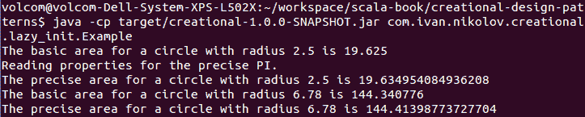

我们可以从我们的示例输出中得出一些观察结果。首先，精度确实很重要，有些行业，包括金融机构、航天工业等，对精度非常重视。其次，在懒加载初始化块中，我们使用了`print`语句，并且它是在我们第一次使用精确实现时打印的。正常值在实例创建时初始化。这表明，Scala 中的懒加载确实是在变量第一次使用时才进行初始化。

# 它有什么好处？

懒加载初始化在初始化一个耗时过长或可能根本不需要的对象或变量时特别有用。有些人可能会说我们可以简单地使用方法，这在某种程度上是正确的。然而，想象一下，我们可能需要在对象的多次调用中从多个方法访问一个懒加载的变量/对象。在这种情况下，将结果存储在某个地方并重复使用它是很有用的。

# 它不适用于什么？

在 Scala 以外的语言中，当在多线程环境中使用懒加载时，需要特别注意。例如，在 Java 中，你需要在一个`synchronized`块中进行初始化。为了提供更好的安全性，*双重检查锁定*是首选的。在 Scala 中没有这样的危险。

# 单例设计模式

单例设计模式确保在整个应用程序中，一个类只有一个对象实例。它在使用的应用程序中引入了全局状态。

单例对象可以使用不同的策略进行初始化——懒加载初始化或急加载初始化。这完全取决于预期的用途、对象初始化所需的时间等因素。

# 一个示例类图

单例是设计模式的一个例子，Scala 编程语言的语法默认支持这些模式。我们通过使用对象关键字来实现这一点。在这种情况下，再次提供类图是不必要的，所以我们将直接进入下一小节的示例。

# 一个代码示例

本例的目的是展示如何在 Scala 中创建单例实例，并理解在 Scala 中实例的确切创建时间。我们将查看一个名为 `StringUtils` 的类，它提供了与字符串相关的不同实用方法：

```java
object StringUtils {
  def countNumberOfSpaces(text: String): Int = text.split("\\s+").length - 1
}
```

使用此类非常简单。Scala 会负责创建对象、线程安全等：

```java
object UtilsExample {
  def main(args: Array[String]): Unit = {
    val sentence = "Hello there! I am a utils example."
    System.out.println(
      s"The number of spaces in '$sentence' is: ${StringUtils.countNumberOfSpaces(sentence)}"
    )
  }
}
```

这个程序的输出将是以下内容：

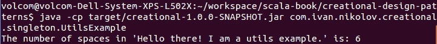

之前的例子很清晰，尽管 `StringUtils` 对象将是一个单例实例，但它更像是一个具有静态方法的类。这实际上就是在 Scala 中定义静态方法的方式。给单例类添加一些状态会更有趣。以下示例正好展示了这一点：

```java
object AppRegistry {
  System.out.println("Registry initialization block called.")
  private val users: Map[String, String] = TrieMap.empty

  def addUser(id: String, name: String): Unit = {
    users.put(id, name)
  }

  def removeUser(id: String): Unit = {
    users.remove(id)
  }

  def isUserRegistered(id: String): Boolean = users.contains(id)

  def getAllUserNames(): List[String] = users.map(_._2).toList
}
```

`AppRegistry` 包含了一个所有当前使用应用程序的用户并发映射。这是我们全局状态，我们有一些方法可以操作它。我们还有一个 `println` 语句，当单例实例创建时将会执行。我们可以在以下应用程序中使用我们的注册表：

```java
object AppRegistryExample {
  def main(args: Array[String]): Unit = {
    System.out.println("Sleeping for 5 seconds.")
    Thread.sleep(5000)
    System.out.println("I woke up.")
    AppRegistry.addUser("1", "Ivan")
    AppRegistry.addUser("2", "John")
    AppRegistry.addUser("3", "Martin")
    System.out.println(s"Is user with ID=1 registered? ${AppRegistry.isUserRegistered("1")}")
    System.out.println("Removing ID=2")
    AppRegistry.removeUser("2")
    System.out.println(s"Is user with ID=2 registered? ${AppRegistry.isUserRegistered("2")}")
    System.out.println(s"All users registered are: ${AppRegistry.getAllUserNames().mkString (",")}")
  }
}
```

让我们运行这个示例，看看最终的输出会是什么：

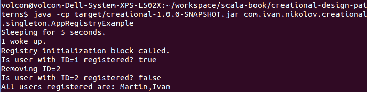

现在，我们的例子展示了一个合适的单例实例，它包含一个全局状态。在实例运行期间，所有应用程序类都可以访问这个状态。从示例代码和我们的输出中，我们可以得出一些结论：

+   Scala 中的单例是懒加载的

+   在创建单例实例时，我们不能向单例类实例提供动态参数

# 它有什么好处？

在 Scala 中，单例设计模式和静态方法以相同的方式进行实现。这就是为什么单例对于创建无状态的实用类非常有用。Scala 中的单例还可以用来构建 ADT（抽象数据类型），这在之前的章节中已经讨论过。

对于 Scala 来说，还有一个严格有效的事实，那就是在 Scala 中，单例（singleton）是默认以线程安全的方式创建的，无需采取任何特殊措施。

# 它有什么坏处？

通常，单例设计模式实际上被认为是反模式。许多人说全局状态不应该像单例类那样存在。有些人说，如果你必须使用单例，你应该尝试重构你的代码。虽然这在某些情况下是正确的，但有时单例也有其合理的使用场景。一般来说，一个经验法则是——如果你能避免使用它们，那么就避免使用。

对于 Scala 单例，还有一点需要特别指出，那就是它们确实只能有一个实例。虽然这是模式的实际定义，但在其他语言中，我们可能有一个预定义的多个单例对象，并可以通过自定义逻辑来控制这一点。

这实际上并不影响 Scala，但仍值得一提。在单例在应用程序中懒加载的情况下，为了提供线程安全，你需要依赖锁定机制，例如，前一小节中提到的双重检查锁定。无论是否是 Scala，应用程序中对单例的访问也需要以线程安全的方式进行，或者单例应该内部处理这个问题。

# 构建设计模式

构建设计模式有助于使用类方法而不是类构造函数来创建类的实例。它在类可能需要多个构造函数版本以允许不同的使用场景的情况下特别有用。

此外，在某些情况下，甚至可能无法定义所有组合，或者它们可能未知。构建设计模式使用一个额外的对象，称为`builder`，来接收和存储在构建最终版本的对象之前的初始化参数。

# 一个示例类图

在本小节中，我们将提供构建模式的类图，包括其经典定义和在其他语言（包括 Java）中的样子。稍后，我们将基于它们更适合 Scala 以及我们对它们的观察和讨论，展示不同版本的代码。

让我们有一个具有不同参数的`Person`类——`firstName`、`lastName`、`age`、`departmentId`等等。我们将在下一小节中展示它的实际代码。创建一个具体的构造函数，尤其是如果这些字段可能不是总是已知或必需的，可能会花费太多时间。这也会使未来的代码维护变得极其困难。

构建模式听起来是个好主意，其类图看起来如下：

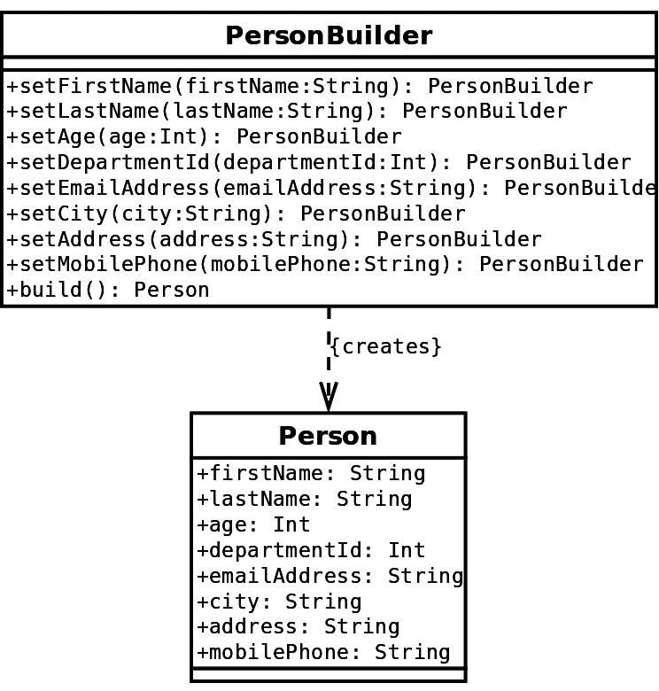

如我们之前提到的，这是纯面向对象语言（非 Scala）中构建模式的样子。它可能有不同的表示形式，其中构建器被抽象化，然后有具体的构建器。对于正在构建的产品也是如此。最终，它们都旨在达到同一个目标——使对象创建更容易。

在下一个小节中，我们将提供代码实现，以展示如何在 Scala 中使用和编写建造者设计模式。

# 代码示例

实际上，我们有三种主要方式可以在 Scala 中表示建造者设计模式：

+   经典的方式，如前面图所示，类似于其他面向对象的语言。实际上，虽然这在 Scala 中是可能的，但这种方式并不推荐。它使用可变性来工作，这与语言的不可变性原则相矛盾。我们将在这里展示它以示完整，并指出使用 Scala 的简单特性实现建造者模式有多容易。

+   使用具有默认参数的案例类。我们将看到两个版本——一个验证参数，另一个不验证。

+   使用泛型类型约束。

在接下来的几个小节中，我们将重点关注这些内容。为了使内容简短明了，我们将在类中减少字段数量；然而，需要注意的是，当字段数量较多时，建造者设计模式才能真正发挥其优势。您可以通过向本书提供的代码示例中添加更多字段来实验。

# 类似 Java 的实现

这种实现直接反映了我们之前图中的内容。首先，让我们看看我们的`Person`类将是什么样子：

```java
class Person(builder: PersonBuilder) {
  val firstName = builder.firstName
  val lastName = builder.lastName
  val age = builder.age
}
```

如前述代码所示，它需要一个建造者，并使用在建造者中设置的值来初始化其字段。建造者代码将如下所示：

```java
class PersonBuilder {
  var firstName = ""
  var lastName = ""
  var age = 0

  def setFirstName(firstName: String): PersonBuilder = {
    this.firstName = firstName
    this
  }

  def setLastName(lastName: String): PersonBuilder = {
    this.lastName = lastName
    this
  }

  def setAge(age: Int): PersonBuilder = {
    this.age = age
    this
  }

  def build(): Person = new Person(this)
}
```

我们的建造者有可以设置`Person`类每个相应字段的方法。这些方法返回相同的建造者实例，这使得我们可以将多个调用链接在一起。以下是我们可以如何使用我们的建造者：

```java
object PersonBuilderExample {
  def main(args: Array[String]): Unit = {
    val person: Person = new PersonBuilder()
      .setFirstName("Ivan")
      .setLastName("Nikolov")
      .setAge(26)
      .build()
    System.out.println(s"Person: ${person.firstName} ${person.lastName}. Age: ${person.age}.")
  }
}
```

这就是如何使用建造者设计模式。现在，我们可以创建一个`Person`对象，并为其提供我们拥有的任何数据——即使我们只有所有可能字段的一个子集，我们也可以指定它们，其余的将具有默认值。如果向`Person`类添加其他字段，无需创建新的构造函数。它们只需通过`PersonBuilder`类提供即可。

# 使用案例类实现

前面的建造者设计模式看起来很清晰，但需要编写一些额外的代码和创建样板代码。此外，它要求我们在`PersonBuilder`类中拥有可变字段，这与 Scala 的一些原则相矛盾。

偏好不可变性

不可变性是 Scala 中的一个重要原则，应该优先考虑。使用案例类的建造者设计模式使用不可变字段，这被认为是一种良好的实践。

Scala 具有案例类，这使得建造者模式的实现变得更加简单。以下是它的样子：

```java
case class Person(
  firstName: String = "",
  lastName: String = "",
  age: Int = 0
)
```

使用此案例类的方式与前面提到的建造者设计模式的使用方式相似：

```java
object PersonCaseClassExample {
  def main(args: Array[String]): Unit = {
    val person1 = Person(
      firstName = "Ivan",
      lastName = "Nikolov",
      age = 26
    )
    val person2 = Person(
      firstName = "John"
    )
    System.out.println(s"Person 1: ${person1}")
    System.out.println(s"Person 2: ${person2}")
  }
}
```

之前的代码比第一个版本更短，更容易维护。它允许开发者以绝对相同的方式使用原始构建器模式，但语法更简洁。它还保持了`Person`类的字段不可变，这是在 Scala 中遵循的良好实践。

选择默认值

构建器设计模式的默认值选择完全取决于开发者。有些人可能更喜欢使用`Option`并在没有指定值时使用`None`。其他人可能会分配一些不同的特殊值。这个选择可以由个人选择、正在解决的问题、工程团队采用的风格指南等因素决定。

前两种方法的一个缺点是没有验证。如果某些组件相互依赖，并且存在需要初始化的特定变量，会怎样呢？在使用前两种方法的案例中，我们可能会遇到运行时异常。下一小节将展示如何确保验证和需求满足得到实现。

# 使用通用类型约束

在软件工程中创建对象时，我们常常会遇到依赖关系。我们可能需要初始化某些内容才能使用第三方组件，或者需要特定的初始化顺序，等等。我们之前讨论的两种构建器模式实现都缺乏确保某些内容是否初始化的能力。因此，我们需要在构建器设计模式周围创建一些额外的验证，以确保一切按预期工作，同时我们还将看到是否在运行时创建对象是安全的。

通过使用本书前面已经讨论的一些技术，我们可以在编译时创建一个验证所有需求是否得到满足的构建器。这被称为**类型安全的构建器**，在下一个示例中，我们将展示这个模式。

# 修改 Person 类

首先，我们以我们在示例中展示 Java 如何使用构建器模式的相同类开始。现在，让我们对示例施加一个约束，即每个人必须指定至少`firstName`和`lastName`。为了使编译器意识到字段正在被设置，这需要编码为一个类型。我们将为此目的使用 ADTs。让我们定义以下内容：

```java
sealed trait BuildStep
sealed trait HasFirstName extends BuildStep
sealed trait HasLastName extends BuildStep
```

上述抽象数据类型定义了构建进度的不同步骤。现在，让我们对构建器类和`Person`类进行一些重构：

```java
class Person(
  val firstName: String,
  val lastName: String,
  val age: Int
)
```

我们将使用`Person`类的完整构造函数而不是传递一个构建器。这是为了展示另一种构建实例的方法，并在后续步骤中使代码更简单。这个更改需要将`PersonBuilder`中的`build`方法也进行更改，如下所示：

```java
def build(): Person = new Person(
  firstName,
  lastName,
  age
)
```

这将要求我们之前返回`PersonBuilder`的所有方法现在返回`PersonBuilder[PassedStep]`。此外，这将使得使用`new`关键字创建构建器变得不可能，因为构造函数现在是私有的。让我们添加一些更多的构造函数重载：

```java
protected def this() = this("","",0)
protected def this(pb: PersonBuilder[_]) = this(
  pb.firstName,
  pb.lastName,
  pb.age
)
```

我们将在稍后看到这些重载是如何使用的。我们需要允许我们的用户使用另一种方法创建构建器，因为所有构造函数对外部世界都是不可见的。这就是为什么我们应该添加一个伴随对象，如下所示：

```java
object PersonBuilder {
  def apply() = new PersonBuilder[BuildStep]()
}
```

伴随对象使用我们之前定义的一个构造函数，并确保返回的对象处于正确的构建步骤。

# 将泛型类型约束添加到必需方法中

然而，到目前为止我们所拥有的仍然不能满足我们对每个`Person`对象应该初始化的内容的要求。我们不得不更改`PersonBuilder`类中的某些方法。这些方法是`setFirstName`、`setLastName`和`build`。以下是设置方法的更改：

```java
def setFirstName(firstName: String): PersonBuilder[HasFirstName] = {
  this.firstName = firstName
  new PersonBuilderHasFirstName
}

def setLastName(lastName: String): PersonBuilder[HasLastName] = {
  this.lastName = lastName
  new PersonBuilderHasLastName
}
```

有趣的部分在于`build`方法。让我们看看以下初始实现：

```java
def build()(implicit ev: PassedStep =:= HasLastName): Person =
  new Person(
    firstName,
    lastName,
    age
  )
```

之前的语法设置了一个泛型类型约束，并说明`build`只能在已通过`HasLastName`步骤的构建器上调用。看起来我们正在接近我们想要实现的目标，但现在`build`只有在`setLastName`是最后四个在构建器上调用的方法之一时才会工作，并且它仍然不会验证其他字段。让我们为`setFirstName`和`setLastName`方法使用类似的方法，并将它们链接起来，以便每个方法都需要在调用之前调用前一个方法。以下是我们的`PersonBuilder`类的最终代码（注意设置方法中的其他隐式声明）：

```java
class PersonBuilder[PassedStep <: BuildStep] private(
  var firstName: String,
  var lastName: String,
  var age: Int
) {
  protected def this() = this("", "", 0)

  protected def this(pb: PersonBuilder[_]) = this(
    pb.firstName,
    pb.lastName,
    pb.age
  )

  def setFirstName(firstName: String): PersonBuilder[HasFirstName] = {
    this.firstName = firstName
    new PersonBuilderHasFirstName
  }

  def setLastName(lastName: String)(implicit ev: PassedStep =:= HasFirstName): PersonBuilder[HasLastName] = {
    this.lastName = lastName
    new PersonBuilderHasLastName
  }

  def setAge(age: Int): PersonBuilder[PassedStep] = {
    this.age = age
    this
  }

  def build()(implicit ev: PassedStep =:= HasLastName): Person =
    new Person(
      firstName,
      lastName,
      age
    )
}
```

# 使用类型安全构建器

我们现在可以使用构建器创建一个`Person`对象：

```java
object PersonBuilderTypeSafeExample {
  def main(args: Array[String]): Unit = {
    val person = PersonBuilder()
      .setFirstName("Ivan")
      .setLastName("Nikolov")
      .setAge(26)
      .build()
    System.out.println(s"Person: ${person.firstName} ${person.lastName}. Age: ${person.age}.")
  }
}
```

如果我们省略了两个必需方法中的一个或以某种方式重新排列它们，我们将得到类似于以下编译错误（错误是针对缺失的姓氏的）：

```java
Error:(103, 23) Cannot prove that com.ivan.nikolov.creational.builder.
type_safe.BuildStep =:=
com.ivan.nikolov.creational.builder.type_safe.HasFirstName.
    .setLastName("Nikolov")
                       ^
```

顺序要求可以被认为是一个轻微的缺点，特别是如果它不是必需的。

关于我们的类型安全构建器的观察如下：

+   使用类型安全构建器，我们可以要求特定的调用顺序和某些字段被初始化。

+   当我们需要多个字段时，我们必须将它们链接起来，这使得调用顺序变得很重要。这可能会使库在某些情况下难以使用。

+   当构建器使用不正确时，编译器消息并不真正具有信息性。

+   代码看起来几乎与在 Java 中实现的方式相同。

+   与 Java 的代码相似性导致依赖于可变性，这是不建议的。

Scala 允许我们有一个既优雅又干净的构建器设计模式实现，它还对顺序和初始化的内容有要求。这是一个很好的特性，尽管有时它在方法的具体使用上可能会显得繁琐和受限。

# 使用 require 语句

我们之前展示的类型安全构建器很好，但它有一些缺点：

+   复杂性

+   可变性

+   预定义的初始化顺序

然而，这可能会非常有用，因为它允许我们编写在编译时就会检查正确使用的代码。尽管有时不需要编译时验证。如果是这种情况，我们可以使事情变得极其简单，并使用已知的 case 类和`require`语句来消除整个复杂性：

```java
case class Person(
  firstName: String = "",
  lastName: String = "",
  age: Int = 0
) {
  require(firstName != "", "First name is required.")
  require(lastName != "", "Last name is required.")
}
```

如果前面的布尔条件不满足，我们的代码将抛出一个带有正确信息的`IllegalArgumentException`。我们可以像通常使用 case 类一样使用我们的类：

```java
object PersonCaseClassRequireExample {
  def main(args: Array[String]): Unit = {
    val person1 = Person(
      firstName = "Ivan",
      lastName = "Nikolov",
      age = 26
    )
    System.out.println(s"Person 1: ${person1}")
    try {
      val person2 = Person(
        firstName = "John"
      )
      System.out.println(s"Person 2: ${person2}")
    } catch {
      case e: Throwable =>
        e.printStackTrace()
    }
  }
}
```

如我们所见，这里的事情要简单得多，字段是不可变的，我们实际上没有任何特殊的初始化顺序。此外，我们可以添加有助于诊断潜在问题的有意义的信息。只要不需要编译时验证，这应该是首选的方法。

# 它适用于什么？

构建器设计模式非常适合我们需要创建复杂对象且否则不得不定义许多构造函数的情况。它通过逐步方法使对象的创建更加容易，并且更加清晰、易于阅读。

# 它不适用于什么？

正如我们在类型安全的构建器示例中所见，添加更高级的逻辑和要求可能需要相当多的工作。如果没有这种可能性，开发者将面临其类用户犯更多错误的风险。此外，构建器包含相当多的看似重复的代码，尤其是在使用类似 Java 的代码实现时。

# 原型设计模式

原型设计模式是一种创建型设计模式，它涉及通过克隆现有对象来创建对象。其目的是与性能相关，并试图避免昂贵的调用以保持高性能。

# 一个示例类图

在像 Java 这样的语言中，我们通常看到一个实现了具有`clone`方法的接口的类，该方法返回该类的新实例。考虑以下图示：

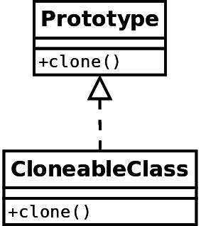

在下一节中，我们将从 Scala 的角度提供一个原型设计模式的代码示例。

# 代码示例

原型设计模式在 Scala 中实现起来非常简单。我们可以使用语言的一个特性。由于原型设计模式与生物细胞分裂的方式非常相似，让我们以细胞为例：

```java
/**
  * Represents a bio cell
  */
case class Cell(dna: String, proteins: List[String])
```

在 Scala 中，所有 case 类都有一个`copy`方法，该方法返回一个从原始对象克隆的新实例。它还可以在复制时更改一些原始属性。以下是我们细胞的某些示例用法：

```java
object PrototypeExample {
  def main(args: Array[String]): Unit = {
    val initialCell = Cell("abcd", List("protein1", "protein2"))
    val copy1 = initialCell.copy()
    val copy2 = initialCell.copy()
    val copy3 = initialCell.copy(dna = "1234")
    System.out.println(s"The prototype is: ${initialCell}")
    System.out.println(s"Cell 1: ${copy1}")
    System.out.println(s"Cell 2: ${copy2}")
    System.out.println(s"Cell 3: ${copy3}")
    System.out.println(s"1 and 2 are equal: ${copy1 == copy2}")
  }
}
```

这个示例的输出将是这样的：

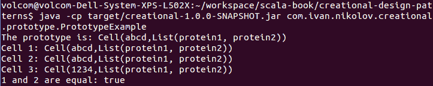

正如你所见，使用`copy`，我们获得了原型细胞的不同实例。

# 它适用于什么？

当性能很重要时，原型设计模式是有用的。使用`copy`方法，我们可以获得在其他情况下需要时间来创建的实例。这种缓慢可能是由创建过程中进行的某些计算、检索数据的数据库调用等原因造成的。

# 它不适用于什么？

使用对象的浅拷贝可能会导致错误和副作用，其中实际引用指向原始实例。避免构造函数可能会导致糟糕的代码。原型设计模式应该真正用于在没有它的情况下可能会产生巨大性能影响的情况。

# 摘要

这是本书的第一章，专注于一些特定的设计模式。我们研究了以下创建型设计模式——工厂方法、抽象工厂、延迟初始化、单例、构建器和原型。在相关的地方，我们展示了显示类关系的图表。此外，我们还给出了典型示例，并讨论了使用它们的可能陷阱和建议。

在现实生活中的软件工程中，设计模式通常是组合使用，而不是孤立地使用。一些例子包括由单例实例提供的原型，能够存储不同原型并在创建对象时提供副本的抽象工厂，能够使用构建器创建实例的工厂，等等。在某些情况下，设计模式可以根据用例进行互换。例如，延迟初始化可能足以降低性能影响，可以替代原型设计模式。

在下一章中，我们将继续我们的设计模式之旅；这次，我们将专注于*结构型设计模式*家族。
