# 结构型设计模式

我们设计模式之旅的下一站将聚焦于结构型设计模式系列。我们将从 Scala 的角度探索以下结构型设计模式：

+   适配器

+   装饰者模式

+   桥接模式

+   组合

+   门面模式

+   享元模式

+   代理

本章将更好地理解结构型设计模式是什么以及为什么它们是有用的。在熟悉了它们之后，我们将分别详细研究每一个，包括代码示例以及何时使用它们、何时避免它们以及使用它们时需要注意的事项。

# 定义结构型设计模式

结构型设计模式关注于在我们的软件中组合对象和类。它们使用不同的方法来获得新的功能以及更大和可能更复杂的结构。这些方法包括以下内容：

+   继承

+   组合

正确识别应用程序中对象之间的关系对于简化应用程序的结构至关重要。在接下来的章节中，我们将探讨不同的设计模式并提供示例，这将帮助我们更好地了解如何使用各种结构型设计模式。

# 适配器设计模式

在许多情况下，我们必须通过组合不同的组件来使应用程序工作。然而，相当常见的问题是组件接口之间不兼容。同样，在使用公共或任何库时，我们无法修改，其他人当前的设置中，他们的观点通常与我们的大相径庭。这就是适配器发挥作用的地方。它们的目的在于帮助不兼容的接口协同工作，而不需要修改它们的源代码。

在接下来的几个小节中，我们将通过类图和示例展示适配器是如何工作的。

# 示例类图

对于适配器类图，让我们假设我们想在应用程序中切换到使用一个新的日志库。我们试图使用的库有一个接受消息和日志严重性的日志方法。然而，在我们的整个应用程序中，我们期望有`info`、`debug`、`warning`和`error`方法，这些方法只接受消息并自动设置正确的严重性。当然，我们无法编辑原始库代码，因此我们必须使用适配器模式。以下图显示了代表适配器设计模式的类图：

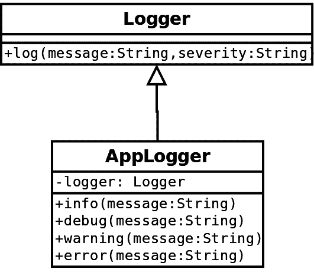

在前面的图中，我们可以看到我们的适配器（**AppLogger**）扩展了，并且也使用了一个**Logger**实例作为字段。在实现方法时，我们只需简单地调用带有不同参数的日志方法。这是通用的适配器实现，我们将在下一小节中看到它的代码。有些情况下，扩展可能不可行，我们将展示 Scala 如何处理这种情况。此外，我们还将展示一些高级语言特性的用法，以实现适配器模式。

# 代码示例

首先，让我们看看我们的`Logger`代码，我们假设我们无法更改它：

```java
class Logger {
  def log(message: String, severity: String): Unit = {
    System.out.println(s"${severity.toUpperCase}: $message")
  }
}
```

我们尽量让它尽可能简单，以免分散读者的注意力，从而影响本书的主要目的。接下来，我们既可以写一个扩展`Logger`的类，也可以提供一个接口进行抽象。让我们采取第二种方法：

```java
trait Log {
  def info(message: String)
  def debug(message: String)
  def warning(message: String)
  def error(message: String)
}
```

最后，我们可以创建我们的`AppLogger`：

```java
class AppLogger extends Logger with Log {
  override def info(message: String): Unit = log(message, "info")

  override def warning(message: String): Unit = log(message, "warning")

  override def error(message: String): Unit = log(message, "error")

  override def debug(message: String): Unit = log(message, "debug")
}
```

然后，我们可以在以下程序中使用它：

```java
object AdapterExample {
  def main(args: Array[String]): Unit = {
    val logger = new AppLogger
    logger.info("This is an info message.")
    logger.debug("Debug something here.")
    logger.error("Show an error message.")
    logger.warning("About to finish.")
    logger.info("Bye!")
  }
}
```

如预期的那样，我们的输出将如下所示：

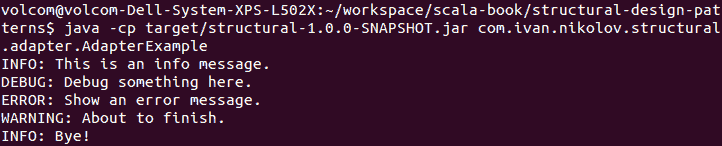

您可以看到，我们没有按照显示的完全实现类图。我们不需要将`Logger`实例作为我们类的字段，因为我们的类已经是`Logger`的一个实例，并且我们无论如何都可以访问其方法。如果我们想要扩展原始的`log`方法的行为，那么我们还需要一个`Logger`实例。

这就是我们实现和使用基本适配器设计模式的方法。然而，有些情况下，我们想要适配的类被声明为`final`，我们无法扩展它。我们将在下一小节中展示如何处理这种情况。

# 最终类适配器设计模式

如果我们将原始的日志器声明为`final`，我们将看到我们的代码将无法编译。在这种情况下，我们可以使用不同的方式来使用适配器模式。以下是代码：

```java
class FinalAppLogger extends Log {
  private val logger = new FinalLogger

  override def info(message: String): Unit = logger.log(message, "info")

  override def warning(message: String): Unit = logger.log(message,
   "warning")

  override def error(message: String): Unit = logger.log(message, "error")

  override def debug(message: String): Unit = logger.log(message, "debug")
}
```

在这种情况下，我们只需将最终的日志器封装在一个类中，然后使用它以不同的参数调用`log`方法。使用方法与之前完全相同。这可以有一个变化，即日志器作为构造函数参数传递。这在创建日志器需要一些额外的参数化时很有用。

# Scala 风格的适配器设计模式

正如我们多次提到的，Scala 是一种丰富的编程语言。正因为如此，我们可以使用隐式类来实现适配器模式的功能。我们将使用与上一个示例中相同的`FinalLogger`。

隐式类在可能的地方提供隐式转换。为了使隐式转换生效，我们需要导入隐式定义，这就是为什么它们通常定义在对象或包对象中。对于这个例子，我们将使用一个包对象。以下是代码：

```java
package object adapter {

  implicit class FinalAppLoggerImplicit(logger: FinalLogger) extends Log {

    override def info(message: String): Unit = logger.log(message, "info")

    override def warning(message: String): Unit = logger.log(message,
     "warning")

    override def error(message: String): Unit = logger.log(message,
     "error")

    override def debug(message: String): Unit = logger.log(message,
     "debug")
  }
}
```

这是一个为定义我们的记录器示例的包定义的`package object`。它将自动将`FinalLogger`实例转换为我们的隐式类。以下代码片段展示了我们记录器的示例用法：

```java
object AdapterImplicitExample {
  def main(args: Array[String]): Unit = {
    val logger: Log = new FinalLogger
    logger.info("This is an info message.")
    logger.debug("Debug something here.")
    logger.error("Show an error message.")
    logger.warning("About to finish.")
    logger.info("Bye!")
  }
}
```

最终输出将与我们的第一个例子完全相同。

# 它有什么好处

适配器设计模式在代码设计和编写之后的情况中很有用。它允许我们使本应不兼容的接口一起工作。它实现和使用也非常简单直接。

# 它有什么不好

在前面部分提到的最后一种实现中存在一个问题。那就是我们将在使用记录器时始终需要导入我们的包或普通对象。此外，隐式类和转换有时会使代码难以阅读和理解。隐式类有一些限制，如以下链接所述：[`docs.scala-lang.org/overviews/core/implicitclasses.html`](https://docs.scala-lang.org/overviews/core/implicit-classes.html)

正如我们之前提到的，适配器设计模式在我们无法更改代码时很有用。如果我们能够修复我们的源代码，那么这可能会是一个更好的决定，因为在我们整个程序中使用适配器将使维护变得困难，并且难以理解。

# 装饰器设计模式

在某些情况下，我们可能想在应用程序中的类上添加一些额外的功能。这可以通过继承来完成；然而，我们可能不想这样做，或者它可能会影响我们应用程序中的其他所有类。这就是装饰器设计模式有用的地方。

装饰器设计模式的目的是在不影响同一类其他对象行为的情况下，向对象添加功能而不扩展它们。

装饰器设计模式通过包装被装饰的对象来工作，并且可以在运行时应用。在可能需要多个类扩展并且可以以各种方式组合的情况下，装饰器非常有用。我们不需要编写所有可能的组合，可以创建装饰器并将修改堆叠在一起。接下来的几个小节将展示如何在现实世界场景中使用装饰器。

# 示例类图

正如我们之前在适配器设计模式中看到的，它的目的是将一个接口转换为另一个接口。另一方面，装饰器通过向方法添加额外功能来帮助我们增强接口。对于类图，我们将使用数据流的例子。想象一下，我们有一个基本的流。我们可能希望能够加密它、压缩它、替换其字符等等。以下是类图：

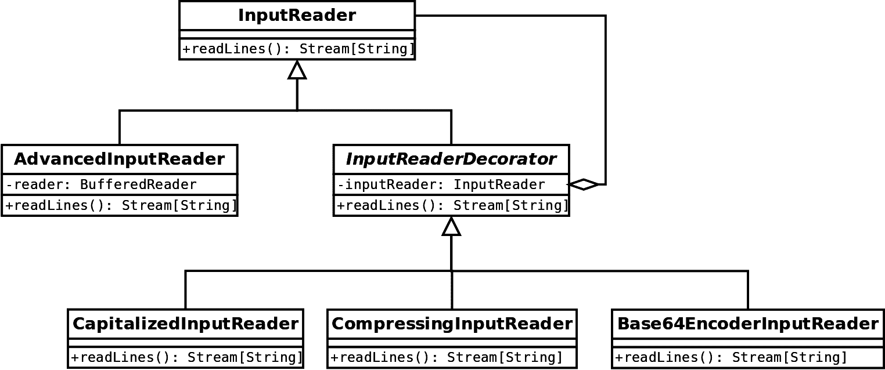

在前面的图中，`AdvancedInputReader`提供了一个`InputReader`的基本实现。它包装了一个标准的`BufferedReader`。然后，我们有一个扩展了`InputReader`的抽象`InputReaderDecorator`类，并包含了一个其实例。通过扩展基础装饰器，我们提供了有流可以大写、压缩或`Base64`编码输入的可能性。在我们的应用程序中，我们可能想要有不同的流，并且它们能够以不同的顺序执行前面提到的操作之一或多个。如果我们尝试提供所有可能性，尤其是当可能的操作数量更多时，我们的代码将很快变得难以维护和混乱。使用装饰器，它既简洁又清晰，正如我们将在下一节中看到的那样。

# 代码示例

现在，让我们看看描述前面图中装饰器设计模式的实际代码。首先，我们使用特质定义我们的`InputReader`接口：

```java
trait InputReader {
  def readLines(): Stream[String]
}
```

然后，我们在`AdvancedInputReader`类中提供接口的基本实现：

```java
class AdvancedInputReader(reader: BufferedReader) extends InputReader {
  override def readLines(): Stream[String] =
    reader.lines().iterator().asScala.toStream
}
```

为了应用装饰器设计模式，我们必须创建不同的装饰器。我们有一个如下所示的基础装饰器：

```java
abstract class InputReaderDecorator(inputReader: InputReader) extends InputReader {
  override def readLines(): Stream[String] =
    inputReader.readLines()
}
```

然后，我们有我们装饰器的不同实现。首先，我们实现了一个将所有文本转换为大写的装饰器：

```java
class CapitalizedInputReader(inputReader: InputReader) extends InputReaderDecorator(inputReader) {
  override def readLines(): Stream[String] =
    super.readLines().map(_.toUpperCase)
}
```

接下来，我们实现了一个使用`gzip`压缩输入每一行的装饰器：

```java
class CompressingInputReader(inputReader: InputReader) extends InputReaderDecorator(inputReader) with LazyLogging {
  override def readLines(): Stream[String] = super.readLines().map {
    case line =>
      val text = line.getBytes(Charset.forName("UTF-8"))
      logger.info("Length before compression: {}", text.length.toString)
      val output = new ByteArrayOutputStream()
      val compressor = new GZIPOutputStream(output)
      try {
        compressor.write(text, 0, text.length)
        val outputByteArray = output.toByteArray
        logger.info("Length after compression: {}",
         outputByteArray.length.toString)
        new String(outputByteArray, Charset.forName("UTF-8"))
      } finally {
        compressor.close()
        output.close()
      }
  }
}
```

最后，一个将每一行编码为`Base64`的装饰器：

```java
class Base64EncoderInputReader(inputReader: InputReader) extends InputReaderDecorator(inputReader) {
  override def readLines(): Stream[String] = super.readLines().map {
    case line => Base64.getEncoder.encodeToString(line.getBytes(Charset.forName("UTF-8")))
  }
}
```

我们使用一个中间的抽象类来演示装饰器设计模式，这个抽象类被所有装饰器扩展。我们本可以直接扩展并包装`InputReader`来实现这个设计模式。然而，这种实现给我们的代码增加了一些结构。

现在，我们可以在我们的应用程序中使用这些装饰器，根据需要为我们的输入流添加额外的功能。使用方法很简单。以下是一个示例：

```java
object DecoratorExample {
  def main(args: Array[String]): Unit = {
    val stream = new BufferedReader(
      new InputStreamReader(
        new BufferedInputStream(this.getClass.getResourceAsStream("data.txt"))
      )
    )
    try {
      val reader = new CapitalizedInputReader(new AdvancedInputReader(stream))
      reader.readLines().foreach(println)
    } finally {
      stream.close()
    }
  }
}
```

在前面的例子中，我们使用了类路径中的文本文件部分，其内容如下：

```java
this is a data file
which contains lines
and those lines will be
manipulated by our stream reader.
```

如预期的那样，我们应用装饰器的顺序将定义它们增强的顺序。前面示例的输出将是以下内容：

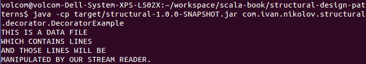

让我们看看另一个示例，但这次我们将应用我们所有的装饰器：

```java
object DecoratorExampleBig {
  def main(args: Array[String]): Unit = {
    val stream = new BufferedReader(
      new InputStreamReader(
        new BufferedInputStream(this.getClass.getResourceAsStream("data.txt"))
      )
    )
    try {
      val reader = new CompressingInputReader(
        new Base64EncoderInputReader(
          new CapitalizedInputReader(
            new AdvancedInputReader(stream)
          )
        )
      )
      reader.readLines().foreach(println)
    } finally {
      stream.close()
    }
  }
}
```

这个例子将读取文本，将其转换为大写，`Base64`编码，并最终使用`gzip`压缩。以下截图显示了输出：

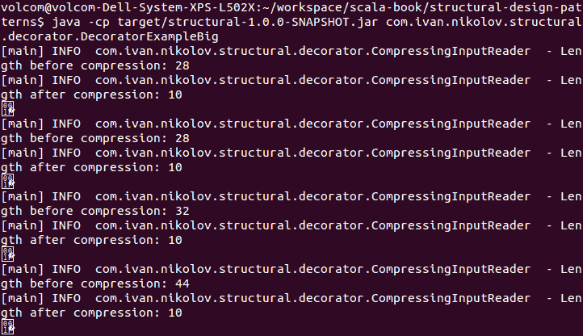

如您从前面的截图中所见，在压缩装饰器代码中，我们正在记录行的字节数。输出被 gzip 压缩，这也是文本显示为不可读字符的原因。您可以尝试更改装饰器应用的顺序或添加新的装饰器，以查看事物如何不同。

# Scala 风格的装饰器设计模式

就像其他设计模式一样，这个实现利用了 Scala 的丰富性，并使用了一些我们在本书初始章节中探讨的概念。Scala 中的装饰器设计模式也称为**可堆叠特性**。让我们看看它的样子以及如何使用它。`InputReader` 和 `AdvancedInputReader` 代码将与上一节中展示的完全相同。我们实际上在两个示例中都重用了它。

接下来，我们不再定义一个 `abstract` 装饰器类，而是将不同的读取修改定义在新特性中，如下所示：

```java
trait CapitalizedInputReaderTrait extends InputReader {
  abstract override def readLines(): Stream[String] =
    super.readLines().map(_.toUpperCase)
}
```

然后，我们定义压缩输入读取器：

```java
trait CompressingInputReaderTrait extends InputReader with LazyLogging {
  abstract override def readLines(): Stream[String] =
    super.readLines().map {
      case line =>
        val text = line.getBytes(Charset.forName("UTF-8"))
        logger.info("Length before compression: {}", text.length.toString)
        val output = new ByteArrayOutputStream()
        val compressor = new GZIPOutputStream(output)
        try {
          compressor.write(text, 0, text.length)
          val outputByteArray = output.toByteArray
          logger.info("Length after compression: {}",
           outputByteArray.length.toString)
          new String(outputByteArray, Charset.forName("UTF-8"))
        } finally {
          compressor.close()
          output.close()
        }
    }
}
```

最后，`Base64` 编码读取器如下所示：

```java
trait Base64EncoderInputReaderTrait extends InputReader {
  abstract override def readLines(): Stream[String] =
    super.readLines().map {
      case line =>
        Base64.getEncoder.encodeToString(line.getBytes(Charset.forName("UTF-8")))
    }
}
```

如您所见，这里的实现并没有太大的不同。在这里，我们使用了特性（traits）而不是类，扩展了基类 `InputReader` 特性，并使用了 `abstract override`。

抽象覆盖（abstract override）允许我们在声明为抽象的特性中调用 `super` 方法。只要特性在另一个特性或实现先前方法的类之后混合，特性就是允许的。抽象覆盖告诉编译器我们故意这样做，它不会使我们的编译失败——它将在我们使用特性时检查是否满足使用它的要求。

之前，我们展示了两个示例。现在，我们将向您展示它们使用可堆叠特性（stackable traits）时的样子。第一个仅将字母大写的示例如下：

```java
object StackableTraitsExample {
  def main(args: Array[String]): Unit = {
    val stream = new BufferedReader(
      new InputStreamReader(
        new BufferedInputStream(this.getClass.getResourceAsStream("data.txt"))
      )
    )
    try {
      val reader = new AdvancedInputReader(stream) with CapitalizedInputReaderTrait
      reader.readLines().foreach(println)
    } finally {
      stream.close()
    }
  }
}
```

第二个示例，将文本大写、`Base64` 编码和压缩流，如下所示：

```java
object StackableTraitsBigExample {
  def main(args: Array[String]): Unit = {
    val stream = new BufferedReader(
      new InputStreamReader(
        new BufferedInputStream(this.getClass.getResourceAsStream("data.txt"))
      )
    )
    try {
      val reader = new AdvancedInputReader(stream) with CapitalizedInputReaderTrait 
        with Base64EncoderInputReaderTrait 
        with CompressingInputReaderTrait
      reader.readLines().foreach(println)
    } finally {
      stream.close()
    }
  }
}
```

这两个示例的输出将与原始示例完全相同。然而，在这里，我们使用了混合组合（mixin composition），看起来要干净一些。我们还有一个类更少，因为我们不需要抽象装饰器类。理解修改是如何应用的是很容易的——我们只需遵循可堆叠特性混合的顺序即可。

可堆叠特性遵循线性化规则。在我们当前的示例中，修改从左到右应用的事实是具有欺骗性的。这种情况发生的原因是因为我们在堆栈上推送调用，直到我们达到 `readLines` 的基本实现，然后以相反的顺序应用修改。我们将在本书接下来的章节中看到更深入的可堆叠特性示例，这些示例将展示它们的所有具体细节。

# 它的优点是什么

装饰器（decorators）为我们的应用程序增加了许多灵活性。它们不会改变原始类，因此不会在旧代码中引入错误，并且可以节省大量的代码编写和维护工作。此外，它们还可以防止我们忘记或未能预见我们创建的类的一些用例。

在之前的示例中，我们展示了某些静态行为修改。然而，也有可能在运行时动态地装饰实例。

# 它的缺点是什么

我们已经讨论了使用装饰器的积极方面；然而，我们应该指出，过度使用装饰器也可能导致问题。我们可能会拥有大量的小类，这可能会使我们的库更难以使用，并且需要更多的领域知识。它们还使实例化过程复杂化，这需要其他（创建型）设计模式，例如工厂或构建者。

# 桥接设计模式

一些应用程序可以具有特定功能的不同实现。这些实现可能是不同的算法或与多个平台有关的东西。实现往往经常变化，它们也可能在整个程序的生命周期中具有新的实现。此外，实现可能以不同的方式用于不同的抽象。在这些情况下，在我们的代码中解耦事物是很好的，否则我们面临类爆炸的风险。

桥接设计模式的目的在于将抽象与其实现解耦，以便它们可以独立变化。

桥接设计模式在抽象或实现可能经常且独立变化的情况下非常有用。如果我们直接实现抽象，对抽象或实现的任何变化都会影响层次结构中的所有其他类。这使得扩展、修改和独立重用类变得困难。

桥接设计模式通过直接实现抽象来消除问题，从而使得抽象和实现可重用且更容易更改。

桥接设计模式与适配器设计模式非常相似。它们之间的区别在于，前者在我们设计应用程序时应用，而后者用于遗留或第三方代码。

# 示例类图

对于类图和代码示例，让我们假设我们正在编写一个哈希密码的库。在实践中，以纯文本形式存储密码是应该避免的。这正是我们的库将帮助用户做到的。有许多不同的哈希算法可以使用。一些是**SHA-1**、**MD5**和**SHA-256**。我们希望能够支持至少这些，并且能够轻松地添加新的算法。存在不同的哈希策略——你可以多次哈希，组合不同的哈希，向密码中添加盐，等等。这些策略使得我们的密码更难以使用彩虹表猜测。对于这个例子，我们将展示使用盐的哈希和简单使用我们拥有的任何算法的哈希。

这里是我们的类图：

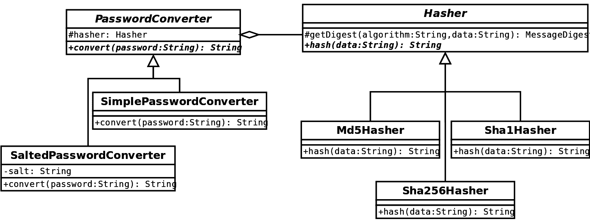

如您从前面的图中可以看到，我们将实现（**Hasher** 及其实现）与抽象（**PasswordConverter**）分离开来。这允许我们轻松地添加一个新的哈希实现，然后在创建 **PasswordConverter** 时只需提供一个实例即可立即使用它。如果我们没有使用前面的构建器模式，我们可能需要为每个哈希算法分别创建一个密码转换器——这可能会使我们的代码规模爆炸或变得难以使用。

# 代码示例

现在，让我们从 Scala 代码的角度来看一下之前的类图。首先，我们将关注 `Hasher` 特质的实现方面：

```java
trait Hasher {
  def hash(data: String): String

  protected def getDigest(algorithm: String, data: String) = {
    val crypt = MessageDigest.getInstance(algorithm)
    crypt.reset()
    crypt.update(data.getBytes("UTF-8"))
    crypt
  }
}
```

然后，我们有三个类实现了它——`Md5Hasher`、`Sha1Hasher` 和 `Sha256Hasher`。它们的代码相当简单且相似，但会产生不同的结果：

```java
class Sha1Hasher extends Hasher {
  override def hash(data: String): String = 
    new String(Hex.encodeHex(getDigest("SHA-1", data).digest()))
}

class Sha256Hasher extends Hasher {
  override def hash(data: String): String = 
    new String(Hex.encodeHex(getDigest("SHA-256", data).digest()))
}

class Md5Hasher extends Hasher {
  override def hash(data: String): String = 
    new String(Hex.encodeHex(getDigest("MD5", data).digest()))
}
```

现在，让我们看看抽象方面的事情。这是我们客户将要使用的内容。以下列表显示了 `PasswordConverter`：

```java
abstract class PasswordConverter(hasher: Hasher) {
  def convert(password: String): String
}
```

我们在这里选择了提供两种不同的实现方式——`SimplePasswordConverter` 和 `SaltedPasswordConverter`。它们的代码如下：

```java
class SimplePasswordConverter(hasher: Hasher) extends PasswordConverter(hasher) {
  override def convert(password: String): String =
    hasher.hash(password)
}

class SaltedPasswordConverter(salt: String, hasher: Hasher) extends PasswordConverter(hasher) {
  override def convert(password: String): String =
    hasher.hash(s"${salt}:${password}")
}
```

现在，如果客户想要使用我们的库，他们可以编写一个类似于以下程序：

```java
object BridgeExample {
  def main(args: Array[String]): Unit = {
    val p1 = new SimplePasswordConverter(new Sha256Hasher)
    val p2 = new SimplePasswordConverter(new Md5Hasher)
    val p3 = new SaltedPasswordConverter("8jsdf32T^$%", new Sha1Hasher)
    val p4 = new SaltedPasswordConverter("8jsdf32T^$%", new Sha256Hasher)
    System.out.println(s"'password' in SHA-256 is:
     ${p1.convert ("password")}")
    System.out.println(s"'1234567890' in MD5 is:
     ${p2.convert ("1234567890")}")
    System.out.println(s"'password' in salted SHA-1 is:
     ${p3.convert ("password")}")
    System.out.println(s"'password' in salted SHA-256 is:
     ${p4.convert ("password")}")
  }
}
```

这个示例应用程序的输出将类似于以下截图：

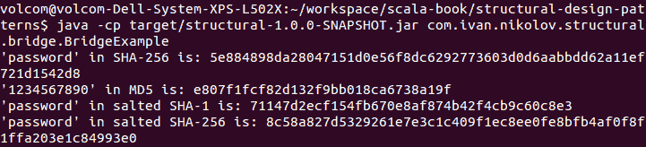

我们现在的库允许我们轻松地添加新的策略或新的哈希算法，并立即使用它们。我们不需要更改任何现有的类。

# Scala 方式的桥梁设计模式

桥接设计模式是 Scala 强大功能实现的另一个例子。在这里，我们将使用自类型。初始的 `Hasher` 特质保持不变。然后，实际的实现变成了特质而不是类，如下所示：

```java
trait Sha1Hasher extends Hasher {
  override def hash(data: String): String = 
    new String(Hex.encodeHex(getDigest("SHA-1", data).digest()))
}

trait Sha256Hasher extends Hasher {
  override def hash(data: String): String = 
    new String(Hex.encodeHex(getDigest("SHA-256", data).digest()))
}

trait Md5Hasher extends Hasher {
  override def hash(data: String): String = 
    new String(Hex.encodeHex(getDigest("MD5", data).digest()))
}
```

拥有特质将允许我们在需要时将它们混合使用。

我们只是更改了示例版本中的一些名称，以避免混淆。`PasswordConverter`（在这种情况下为 `PasswordConverterBase`）抽象现在看起来如下：

```java
abstract class PasswordConverterBase {
  self: Hasher =>
  def convert(password: String): String
}
```

这告诉编译器，当我们使用 `PasswordConverterBase` 时，我们还需要混合使用一个 `Hasher`。然后，我们将转换器实现更改为以下内容：

```java
class SimplePasswordConverterScala extends PasswordConverterBase {
  self: Hasher =>
  override def convert(password: String): String = hash(password)
}

class SaltedPasswordConverterScala(salt: String) extends PasswordConverterBase {
  self: Hasher =>
  override def convert(password: String): String =
    hash(s"${salt}:${password}")
}
```

最后，我们可以使用我们的新实现，如下所示：

```java
object ScalaBridgeExample {
  def main(args: Array[String]): Unit = {
    val p1 = new SimplePasswordConverterScala with Sha256Hasher
    val p2 = new SimplePasswordConverterScala with Md5Hasher
    val p3 = new SaltedPasswordConverterScala("8jsdf32T^$%") with
     Sha1Hasher
    val p4 = new SaltedPasswordConverterScala("8jsdf32T^$%") with
     Sha256Hasher
    System.out.println(s"'password' in SHA-256 is:
     ${p1.convert("password")}")
    System.out.println(s"'1234567890' in MD5 is:
     ${p2.convert("1234567890")}")
    System.out.println(s"'password' in salted SHA-1 is:
     ${p3.convert("password")}")
    System.out.println(s"'password' in salted SHA-256 is:
     ${p4.convert("password")}")
  }
}
```

这个程序的输出将与原始程序相同。然而，当我们使用我们的抽象时，我们可以混合使用我们想要的哈希算法。在可能需要将更多实现组合在一起进行哈希的情况下，这种好处将变得更加明显。使用混入（mixins）看起来也更自然，更容易理解。

# 它有什么好处

正如我们之前所说的，桥接设计模式类似于适配器。然而，在这里，我们是在设计应用程序时应用它。使用它的一个明显好处是，我们不会在我们的应用程序中结束于指数级数量的类，这可能会使模式的使用和维护变得相当复杂。层次结构的分离使我们能够独立扩展它们，而不会影响另一个。

# 它不适用于什么

桥接设计模式要求我们编写一些样板代码。它可能会在库的使用方面使选择确切实现变得复杂，因此可能是一个好主意将桥接设计模式与一些创建型设计模式一起使用。总的来说，它没有任何重大缺点，但开发者应该根据当前情况明智地决定是否使用它。

# 组合设计模式

组合设计模式用于描述应该像单个对象一样对待的一组对象。

组合设计模式的目的在于将对象组合成树结构以表示整体-部分层次结构。

组合设计模式对于移除代码重复和在通常以相同方式对待对象组的情况下避免错误是有用的。一个流行的例子可能是在文件系统中，我们有目录，这些目录可以有其他目录或文件。通常，与目录和文件交互的接口是相同的，因此它们是组合设计模式的好候选者。

# 示例类图

正如我们之前提到的，文件系统是组合设计模式的良好候选者。本质上，它们只是树结构，因此在我们的例子中，我们将向您展示如何使用组合设计模式构建树。

考虑以下类图：

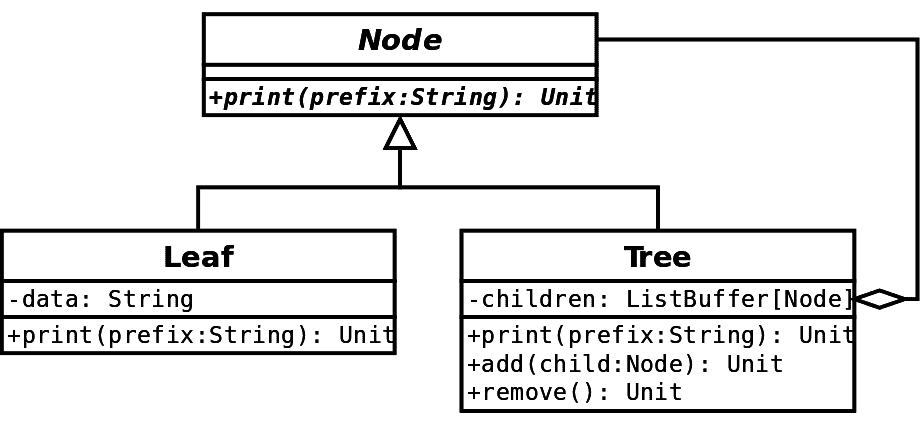

如您从前面的图中可以看到，**Tree** 是我们的组合对象。它包含子节点，这些子节点可以是具有更多嵌套子节点的其他 **Tree** 对象，或者只是 **Leaf** 节点。

# 代码示例

让我们看看之前图中代码的表示。首先，我们必须通过特质定义 `Node` 接口：

```java
trait Node {
  def print(prefix: String): Unit
}
```

`print` 方法中的 `prefix` 参数用于在控制台打印树时辅助可视化。

在我们有了接口之后，我们现在可以定义实现：

```java
class Leaf(data: String) extends Node {
  override def print(prefix: String): Unit =
    System.out.println(s"${prefix}${data}")
}

class Tree extends Node {
  private val children = ListBuffer.empty[Node]

  override def print(prefix: String): Unit = {
    System.out.println(s"${prefix}(")
    children.foreach(_.print(s"${prefix}${prefix}"))
    System.out.println(s"${prefix})")
  }

  def add(child: Node): Unit = {
    children += child
  }

  def remove(): Unit = {
    if (children.nonEmpty) {
      children.remove(0)
    }
  }
}
```

在此之后，使用我们的代码变得相当简单。在打印时，我们不需要关心是在叶节点还是树上进行操作。我们的代码将自动处理这一点：

```java
object CompositeExample {
  def main(args: Array[String]): Unit = {
    val tree = new Tree
    tree.add(new Leaf("leaf 1"))
    val subtree1 = new Tree
    subtree1.add(new Leaf("leaf 2"))
    val subtree2 = new Tree
    subtree2.add(new Leaf("leaf 3"))
    subtree2.add(new Leaf("leaf 4"))
    subtree1.add(subtree2)
    tree.add(subtree1)
    val subtree3 = new Tree
    val subtree4 = new Tree
    subtree4.add(new Leaf("leaf 5"))
    subtree4.add(new Leaf("leaf 6"))
    subtree3.add(subtree4)
    tree.add(subtree3)
    tree.print("-")
  }
}
```

这段代码实际上执行的是我们数据结构的深度优先遍历。我们实际拥有的示例数据结构如下所示：

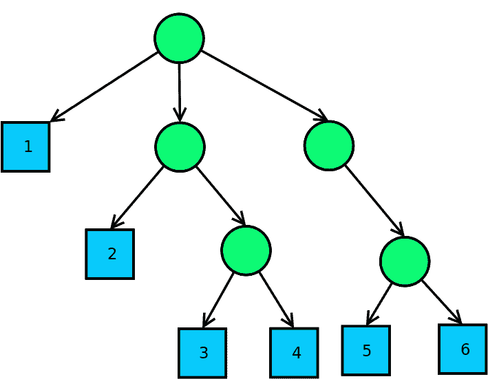

下面的截图显示了我们的程序输出：

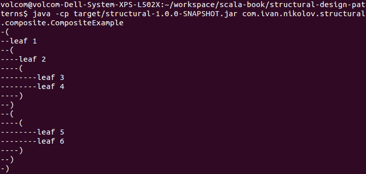

如您所见，使用组合，我们可以组合具有相似用途的对象层次结构。

# 它适用的场合

组合设计模式在创建层次结构时有助于减少代码重复和简化。简化部分来自于客户端不需要知道他们正在处理哪种类型的对象。添加新的节点类型也很容易，而且不会让我们改变其他任何东西。

# 它不适用的情况

组合设计模式没有明显的缺点。它确实适用于特定情况。开发者应该注意的一点是，当处理大量层次结构时。原因是，在这种情况下，我们可能会有非常深层次的嵌套项，这可能会导致栈溢出问题。

# 外观设计模式

无论我们是在构建库或大型系统时，我们常常依赖于其他库和功能。实现方法有时需要同时使用多个类。这需要知识。当我们为某人构建库时，我们通常会尝试通过假设他们没有（也不需要）像我们这样广泛的知识来简化用户的使用。此外，开发者确保组件在其应用程序中易于使用。这就是外观设计模式可以变得有用的地方。

外观设计模式的目的在于用更简单的接口封装复杂的系统，以隐藏使用复杂性并简化客户端交互。

我们已经研究了基于封装的其他设计模式。虽然适配器设计模式将一个接口转换为另一个接口，装饰者添加额外的功能，但外观使事情变得更简单。

# 示例类图

对于类图，让我们设想以下场景——我们希望我们的用户能够从服务器下载一些数据，并以对象的形式对其进行反序列化。服务器以编码形式返回我们的数据，因此我们应该首先对其进行解码，然后解析它，最后返回正确的对象。这涉及到许多操作，使事情变得复杂。这就是为什么我们使用外观设计模式：

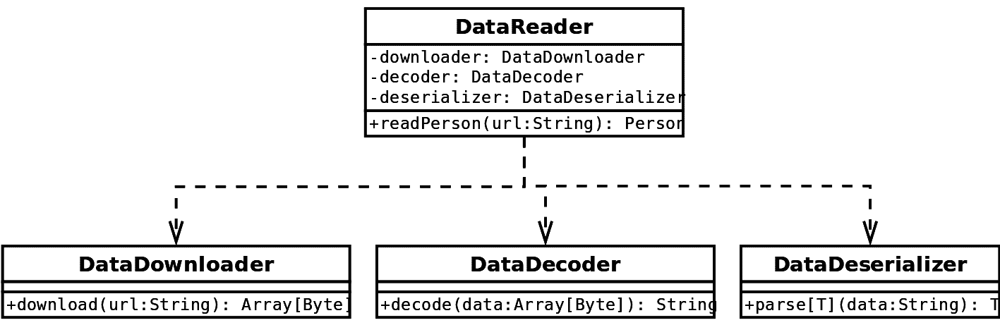

当客户端使用前面的应用程序时，他们只需与**DataReader**交互。内部，它将负责下载、解码和反序列化数据。

# 代码示例

前面的图示显示了`DataDownloader`、`DataDecoder`和`DataDeserializer`作为`DataReader`内部的组成对象。这是直接且清晰的——它们可以通过默认构造函数创建，或者作为参数传递。然而，对于我们的示例代码表示，我们选择使用特性（traits）而不是类，并将它们与`DataReader`类混合使用。

让我们先看看`DataDownloader`、`DataDecoder`和`DataDeserializer`特性：

```java
trait DataDownloader extends LazyLogging {
  def download(url: String): Array[Byte] = {
    logger.info("Downloading from: {}", url)
    Thread.sleep(5000)
    // {
    // "name": "Ivan",
    // "age": 26
    // }
    // the string below is the Base64 encoded Json above.
    "ew0KICAgICJuYW1lIjogIkl2YW4iLA0KICAgICJhZ2UiOiAyNg0KfQ==".getBytes
  }
}
```

`DataDecoder`特性如下：

```java
trait DataDecoder {
  def decode(data: Array[Byte]): String = new String(Base64.getDecoder.decode(data), "UTF-8")
}
```

以下代码片段是`DataDeserializer`特质的示例：

```java
trait DataDeserializer {
  implicit val formats = DefaultFormats

  def parseT(implicit m: Manifest[T]): T =
    JsonMethods.parse(StringInput(data)).extract[T]
}
```

之前的实现相当直接，并且它们是分开的，因为它们处理不同的任务。任何人都可以使用它们；然而，这需要一些知识，使事情更加复杂。这就是为什么我们有一个名为`DataReader`的外观类：

```java
class DataReader extends DataDownloader with DataDecoder with DataDeserializer {
  def readPerson(url: String): Person = {
    val data = download(url)
    val json = decode(data)
    parsePerson
  }
}
```

这个例子清楚地表明，我们不再需要使用三个不同的接口，现在有一个简单的方法可以调用。所有复杂性都隐藏在这个方法中。以下列表显示了我们的类的一个示例用法：

```java
object FacadeExample {
  def main(args: Array[String]): Unit = {
    val reader = new DataReader
    System.out.println(s"We just read the following person:
     ${reader.readPerson("https://www.ivan-nikolov.com/")}")
  }
}
```

之前的代码利用了我们的库，这些库对客户端来说是隐藏的，使用起来非常简单。以下是一个示例输出：

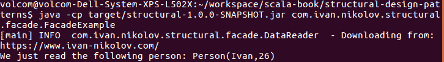

当然，在先前的例子中，我们可以在`DataReader`内部使用类，而不是混合特质。这完全取决于需求，无论如何都应该产生相同的结果。

# 它的优点是什么

外观设计模式在需要隐藏许多库的实现细节、使接口更容易使用以及与复杂系统交互时非常有用。

# 它的缺点是什么

一些人们可能会犯的一个常见错误是试图将一切放入外观中。这通常不会有所帮助，开发者仍然会保留一个复杂系统，甚至可能比之前更复杂。此外，外观可能会对那些有足够领域知识来使用原始功能的人来说具有约束性。这尤其适用于外观是唯一与底层系统交互的方式时。

# 享元设计模式

通常当编写软件时，开发者会尝试使其快速高效。通常这意味着更少的处理周期和更小的内存占用。实现这两个方面有不同的方法。大多数时候，一个好的算法会处理第一个方面。使用的内存量可能有多种原因和解决方案，而享元设计模式就是为了帮助并减少内存使用。

享元设计模式的目的是通过尽可能多地与其他相似对象共享数据来最小化内存使用。

有许多情况是许多对象共享相同的信息。当谈到享元时，一个常见的例子是文字处理。我们不需要用所有关于字体、大小、颜色、图像等信息来表示每个字符，我们只需存储相似字符的位置，并有一个指向包含公共信息的对象的引用。这使得内存使用显著减少。否则，这样的应用程序将变得无法使用。

# 示例类图

对于类图，首先让我们想象我们正在尝试表示一个类似以下颜色盲测试的绘图：


如我们所见，它由不同大小和颜色的圆组成。理论上，这可以是一个无限大的图片，并且可以有任意数量的圆。为了简化问题，让我们只设定一个限制，即我们只能有五种不同的圆颜色——红色、绿色、蓝色、黄色和洋红色。以下是我们类图的样子，以便使用享元设计模式来表示前面提到的图像：

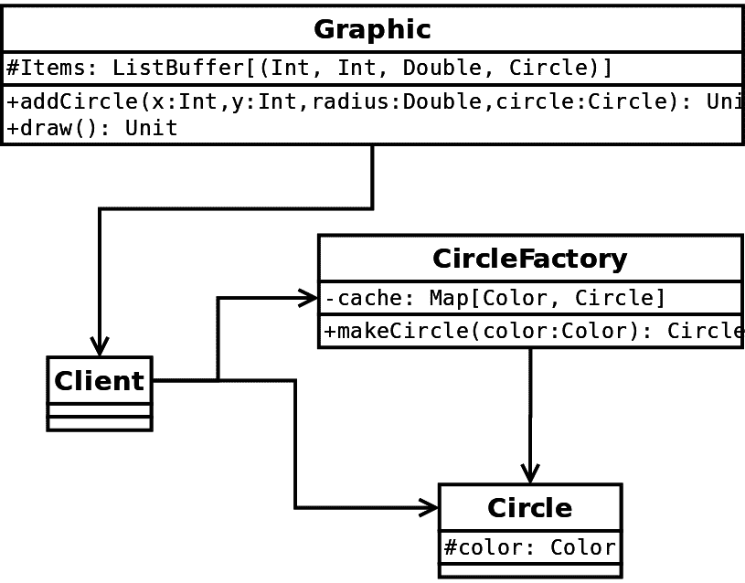

实际的享元设计模式是通过**CircleFactory**、**Circle**和**Client**类实现的。客户端请求工厂，它返回**Circle**的新实例，或者如果存在具有所需参数的实例，则从缓存中返回它。对于这个例子，共享数据将是具有其颜色的**Circle**对象，然后每个特定的圆将有自己的位置和半径。**Graphic**将包含所有这些信息的实际圆。通过我们的代码示例，事情将会变得更加清晰，前一个图就是基于这个示例的。

# 代码示例

是时候看看享元设计模式在 Scala 代码中的样子了。我们将使用之前显示的相同示例。值得注意的是，在代码版本中，一些类的名称与图中的不同。这样做的原因是 Scala 的命名约定。我们将在查看代码时明确指出这些情况。

关于享元设计模式和我们的例子，一个有趣的事情是它实际上使用了我们之前已经讨论过的其他设计模式和技巧。我们也会在查看代码时指出它们。

我们首先做的事情是表示颜色。这与实际的享元设计模式无关，但我们决定使用 ADTs：

```java
sealed abstract class Color
case object Red extends Color
case object Green extends Color
case object Blue extends Color
case object Yellow extends Color
case object Magenta extends Color
```

在我们定义了颜色之后，我们可以实现我们的`Circle`类：

```java
class Circle(color: Color) {
  System.out.println(s"Creating a circle with $color color.")

  override def toString(): String = s"Circle($color)"
}
```

圆将是享元对象，因此模型只包含将与其他圆实例共享的数据。现在我们有了圆的模型，我们可以创建我们的`CircleFactory`。正如其名所示，它使用工厂设计模式。以下是它的代码：

```java
import scala.collection.mutable.Map

object Circle {
  val cache = Map.empty[Color, Circle]

  def apply(color: Color): Circle = cache.getOrElseUpdate(color,
   new Circle(color))

  def circlesCreated(): Int = cache.size
}
```

我们有一个伴随对象，用于在 Scala 中实现工厂设计模式。这就是为什么这里的名字与之前显示的图中的名字不同的原因。这种表示方式允许我们使用以下语法获取一个旧的圆实例或创建一个新的实例：

```java
Circle(Green)
```

现在我们有了我们的圆和工厂，我们可以实现`Graphic`类：

```java
import scala.collection.mutable.ListBuffer

class Graphic {
  val items = ListBuffer.empty[(Int, Int, Double, Circle)]

  def addCircle(x: Int, y: Int, radius: Double, circle: Circle): Unit = {
    items += ((x, y, radius, circle))
  }

  def draw(): Unit = {
    items.foreach {
      case (x, y, radius, circle) =>
        System.out.println(s"Drawing a circle at ($x, $y) with radius
         $radius: $circle")
    }
  }
}
```

`Graphic`类实际上将持有我们的圆以及与它们相关的所有其他数据。前一个图中的`Client`在我们的代码中没有特定的表示——它将只是使用工厂获取圆的代码。同样，`Graphic`对象将通过程序检索圆对象，而不是通过客户端的显式访问。以下是我们如何在我们的例子中实现所有这些：

```java
object FlyweightExample {
  def main(args: Array[String]): Unit = {
    val graphic = new Graphic
    graphic.addCircle(1, 1, 1.0, Circle(Green))
    graphic.addCircle(1, 2, 1.0, Circle(Red))
    graphic.addCircle(2, 1, 1.0, Circle(Blue))
    graphic.addCircle(2, 2, 1.0, Circle(Green))
    graphic.addCircle(2, 3, 1.0, Circle(Yellow))
    graphic.addCircle(3, 2, 1.0, Circle(Magenta))
    graphic.addCircle(3, 3, 1.0, Circle(Blue))
    graphic.addCircle(4, 3, 1.0, Circle(Blue))
    graphic.addCircle(3, 4, 1.0, Circle(Yellow))
    graphic.addCircle(4, 4, 1.0, Circle(Red))
    graphic.draw()
    System.out.println(s"Total number of circle objects created:
     ${Circle.circlesCreated()}")
  }
}
```

如果我们运行这段代码，我们将得到以下输出：

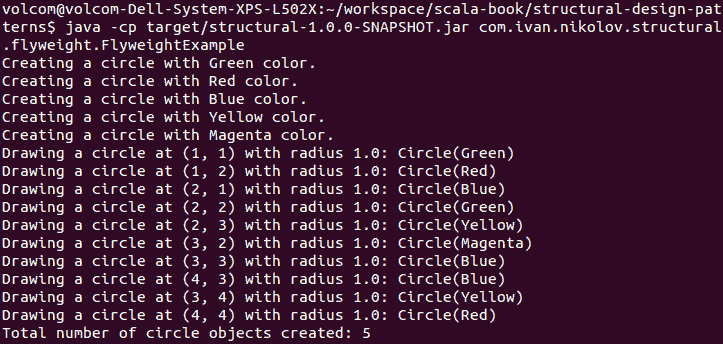

在之前定义`Circle`类时，我们在构造函数中添加了一条打印消息。从前面的图中，我们可以看到每个圆只使用特定的颜色创建了一次，即使我们多次请求它来构建我们的图形。最后一行显示，我们恰好有五个不同的圆对象，尽管我们的图形包含 10 个不同的圆。

这只是一个示例，用来说明飞 weight 是如何工作的。在现实生活中，飞 weight 对象将共享更多属性，从而降低整个应用程序的整体内存占用。

# 它适用于什么

正如我们之前提到的，当试图降低应用程序使用的内存时，飞 weight 设计模式非常有用。使用共享对象，我们的应用程序将需要更少的对象构建和销毁，这可能会进一步提高性能。

# 它不适用于什么

根据共享数据量的大小，有时不同共享对象的数量可能会大幅增加，但这并不会带来太多好处。此外，它可能会使工厂及其使用变得更加复杂。在处理工厂时，多线程应用程序需要格外小心。最后但同样重要的是，开发者在使用共享对象时需要格外小心，因为它们中的任何变化都可能影响整个应用程序。幸运的是，在 Scala 中，由于不可变性，这并不是一个很大的问题。

# 代理设计模式

在某些应用程序中，开发者可能需要提供对对象的访问控制。这可能由许多原因引起。其中一些包括隐藏实现细节、提高与昂贵资源的交互、与远程资源接口、缓存、提供懒加载或预加载初始化等。代理设计模式有助于实现这些。

代理设计模式的目的在于提供一个接口，然后在该接口背后为用户提供服务。

代理设计模式是包装器的一个例子。它与装饰器设计模式非常相似，但感觉更基础和有限。这是因为代理与包装对象之间的关系是在编译时建立的，而装饰器可以在运行时应用。最终，它的目的也不同。

# 示例类图

对于类图，让我们假设我们有一个将文件中的文本可视化的应用程序。它可能需要根据用户操作来可视化文本，或者可能不需要。这些文件可能非常大，或者可能位于远程位置。以下是代理设计模式如何帮助我们实现这一目标的示例：

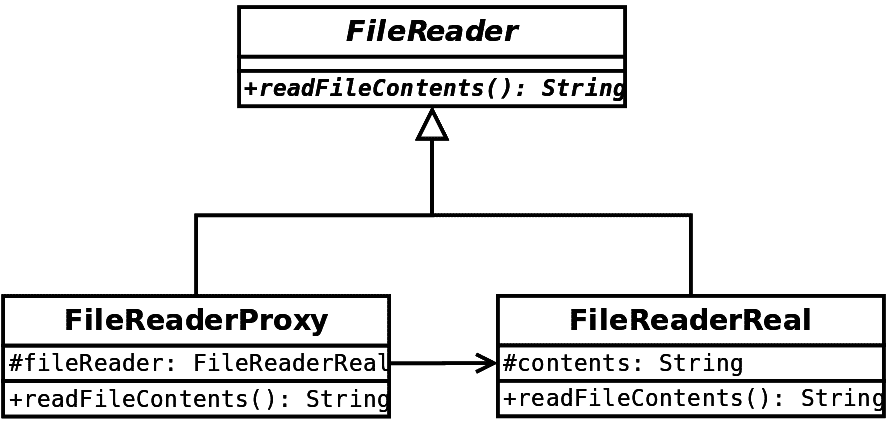

根据前面的图示，我们可以使用**FileReaderProxy**对象，并且只有在有人需要访问文件内容时，我们才会将功能委托给**FileReaderReal**。这种设计既好又方便，因为我们实际上可以使用**FileReader**对象；然而，我们可以通过不需要一次性加载所有内容，而只是在需要时加载一次来保持应用程序的效率。

# 代码示例

现在，让我们更仔细地看看实现前面类图所需的代码。首先，我们需要定义一个接口（使用 Scala 特质）：

```java
trait FileReader {
  def readFileContents(): String
}
```

然后，我们创建了两个实现它的类——`FileReaderReal`和`FileReaderProxy`。首先，让我们看看前者是如何实现文件读取的，因为它并没有什么真正的意义：

```java
class FileReaderReal(filename: String) extends FileReader {
  val contents = {
    val stream = this.getClass.getResourceAsStream(filename)
    val reader = new BufferedReader(
      new InputStreamReader(
        stream
      )
    )
    try {
      reader.lines().iterator().asScala.mkString
      (System.getProperty("line.separator"))
    } finally {
      reader.close()
      stream.close()
    }
  }
  System.out.println(s"Finished reading the actual file: $filename")

  override def readFileContents(): String = contents
}
```

在对象的构建过程中，它将获取文件，读取它，并将其存储在`contents`变量中。然后，每次调用`readFileContents`时，该类将返回它已缓冲的内容。现在，让我们看看`FileReaderProxy`的实现：

```java
class FileReaderProxy(filename: String) extends FileReader {
  private var fileReader: FileReaderReal = null

  override def readFileContents(): String = {
    if (fileReader == null) {
      fileReader = new FileReaderReal(filename)
    }
    fileReader.readFileContents()
  }
}
```

实现中包含一个`FileReaderReal`的实例，它在第一次调用`readFileContents`时创建。实际的文件读取操作随后委托给`FileReaderReal`类。

`FileReaderProxy`的一个更优雅的实现将使用`lazy val`而不是可变变量。在这种情况下，`if`语句将不再需要。

现在，让我们看看我们的代理如何在应用程序中使用：

```java
object ProxyExample {
  def main(args: Array[String]): Unit = {
    val fileMap = Map(
      "file1.txt" -> new FileReaderProxy("file1.txt"),
      "file2.txt" -> new FileReaderProxy("file2.txt"),
      "file3.txt" -> new FileReaderProxy("file3.txt"),
      "file4.txt" -> new FileReaderReal("file1.txt")
    )
    System.out.println("Created the map. You should have seen
     file1.txt read because it wasn't used in a proxy.")
    System.out.println(s"Reading file1.txt from the proxy:
     ${fileMap("file1.txt").readFileContents()}")
    System.out.println(s"Reading file3.txt from the proxy:
     ${fileMap("file3.txt").readFileContents()}")
  }
}
```

值得注意的是，每个文件实际上都是应用程序中的一个资源，并包含一行文本，形式为`I am file x`。在运行前面的示例之后，我们将得到以下输出：

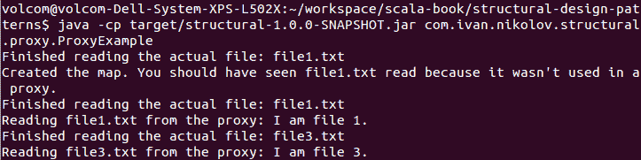

如您从前面的屏幕截图中所见，实际对象是延迟创建的，因此实际的文件读取是在需要时进行的。这导致我们的应用程序跳过了`file2.txt`的读取，因为我们甚至没有请求它。有人可能会提出不同的解决方案来达到相同的目的，但它可能是一个不同的设计模式或类似代理的东西。

# 它的优点是什么

当我们想要将一些昂贵的操作委托给其他类，进行延迟操作，从而使我们的应用程序更高效时，代理设计模式是好的。

# 它的不足之处是什么

代理设计模式相当简单，实际上，没有可以提到的缺点。与其他任何设计模式一样，它们应该谨慎使用，并且只有在实际需要时才使用。

# 摘要

在本章中，我们学习了结构设计模式，特别是以下内容——适配器、装饰器、桥接、组合、外观、享元和代理。我们详细介绍了每一个，并为每一个展示了类图以及代码示例。由于 Scala 的丰富性，有时可以使用 Scala 的一些优秀特性来实现更好的实现，但有时设计模式在 Java 等语言中看起来可能是一样的。

在许多情况下，结构设计模式看起来相当相似。然而，这不应该让你感到困惑，因为它们仍然有不同的目的。一些例子包括：

+   **适配器与桥接的比较**：适配器用于在没有访问代码的情况下将一个接口转换为另一个接口。桥接用于软件设计时，它将抽象与实现解耦，以便于未来的扩展。

+   **代理与装饰器的比较**：装饰器通常增强一个接口。代理提供相同的接口，但有助于提高应用程序的效率。

现在，你应该对结构设计模式有了很好的理解，并且拥有足够的知识来在实际项目中应用它们。

在下一章中，你将学习关于*行为设计模式*的内容。
