# 行为设计模式 – 第一部分

我们对 Scala 设计模式的探索已经到达了**行为设计模式**这一组。这个组比我们之前经历的其他组成员更多，所以我们将将其分为两个独立的部分。在本章中，我们将重点关注以下行为设计模式：

+   值对象

+   空对象

+   策略

+   命令

+   责任链模式

+   解释器

本章和下一章将阐明行为设计模式是什么，它们在哪里有用，以及如何在 Scala 中实现它们。我们将遵循与之前章节类似的道路，其中我们展示了模式、类图和代码示例，并最终给出了一些需要注意的事项和某些模式更倾向于在哪里使用的一些提示。希望你能对它们有一个感觉，并能够自信地识别出它们适用的场景。

# 定义行为设计模式

如其名所示，行为设计模式与行为有关。它们的目的在于识别和实现应用程序中对象之间的常见通信模式。它们以定义对象交互的方式，使得对象之间的通信变得容易，并且耦合仍然保持在较低水平。

行为设计模式描述了对象和类如何通过消息相互交互。与创建型和结构型设计模式相反，行为设计模式描述了一个**流程**或**过程**。这意味着开发者应该非常熟悉他们试图实现的实际过程。与其他类型的设计模式一样，行为设计模式的存在是为了提高产生的代码的可测试性、可维护性和灵活性。

# 值对象设计模式

在编程中，比较数据的方式有很多种。我们可以比较对象的标识或它们的值。这些在不同的场景中很有用，在这里，我们将看到值对象是什么以及它们何时可以使用。

值对象是小而简单的不可变对象。它们的等价性不是基于身份，而是基于值等价性。

值对象用于表示数字、货币、日期等。它们应该是小而不可变的；否则，改变值可能会引起错误和意外行为。由于它们的不可变性，它们在多线程应用程序中非常有用。它们也常在企业应用程序中用作数据传输对象。

# 一个示例类图

在诸如 Java 这样的语言中，没有直接对值对象的支持。开发者最终会做的是将字段声明为 final 并实现`hashCode`和`equals`方法。

然而，不可变性是一个在 Scala 中几乎强制执行的概念。我们之前已经看到了**代数数据类型**（**ADTs**）——它们也属于值对象类别。案例类和元组也是不可变的，它们用于实现值对象设计模式。以下类图显示了 Scala 中值对象设计模式的一个示例：

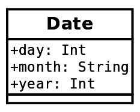

这个图表实际上并没有做什么特别的事情。它是一个名为**Date**的案例类的表示。这就是我们为了实现不可变性和能够实现值对象设计模式所需要做的所有事情。

# 一个代码示例

在我们的代码示例中，我们将使用我们的`Date`类。日期在软件产品中相当常用。当然，有一些库提供了关于日期操作的完整功能，但这对于示例来说已经足够了。首先，这是`Date`类的表示：

```java
case class Date(
  day: Int,
  month: String,
  year: Int
)
```

这是我们需要的一切，以便获得值对象。Scala 在后台为我们创建默认实现，用于`hashCode`、`equals`和`toString`方法。案例类给我们带来了额外的功能，但这超出了本节的范围。

现在，让我们使用我们的`Date`类：

```java
object DateExample {
  def main(args: Array[String]): Unit = {
    val thirdOfMarch = Date(3, "MARCH", 2016)
    val fourthOfJuly = Date(4, "JULY", 2016)
    val newYear1 = Date(31, "DECEMBER", 2015)
    val newYear2 = Date(31, "DECEMBER", 2015)
    System.out.println(s"The 3rd of March 2016 is the same as
     the 4th of July 2016: ${thirdOfMarch == fourthOfJuly}")
    System.out.println(s"The new year of 2015 is here twice:
     ${newYear1 == newYear2}")
  }
}
```

如您所见，我们使用了我们的对象作为值。我们应该注意，在这里，我们对参数没有任何验证；然而，这很容易添加，但与当前示例无关。如果我们现在运行我们的代码，我们将看到以下输出：

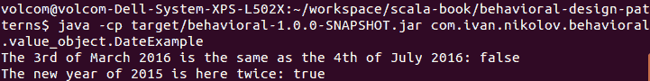

为了证明案例类使我们能够轻松实现值对象设计模式，而普通类则不能，让我们尝试将我们的`Date`类改为普通类，然后在相同的示例中使用它。我们的类将变为以下内容：

```java
class BadDate(
  day: Int,
  month: String,
  year: Int
)
```

然后，我们将使用相同的示例；然而，这次我们将使用`BadDate`，由于它不是一个案例类，我们将使用`new`关键字创建它：

```java
object BadDateExample {
  def main(args: Array[String]): Unit = {
    val thirdOfMarch = new BadDate(3, "MARCH", 2016)
    val fourthOfJuly = new BadDate(4, "JULY", 2016)
    val newYear1 = new BadDate(31, "DECEMBER", 2015)
    val newYear2 = new BadDate(31, "DECEMBER", 2015)
    System.out.println(s"The 3rd of March 2016 is the same as the
     4th of July 2016: ${thirdOfMarch == fourthOfJuly}")
    System.out.println(s"The new year of 2015 is here twice:
     ${newYear1 == newYear2}")
  }
}
```

这个示例的输出将是：

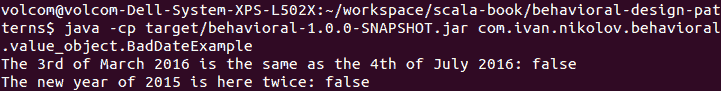

如您从前面的输出中看到的那样，普通类与案例类的工作方式不同，需要做一些额外的工作才能使用它们实现值对象设计模式。前面结果的原因是，类默认情况下是通过它们的引用标识来相互比较的，而不是通过它们携带的值。为了改变这一点，应该实现`hashCode`和`equals`。Scala 还允许我们为类重写`==`运算符。

# 不同的实现

在 Scala 中，也可以使用预定义的元组类来实现值对象设计模式。在这种情况下，我们甚至不需要创建我们的类，可以写一些像`(3, "March", 2016)`的东西。这将自动具有与值对象相同的特性。有最多 22 个元素的元组实现，但在实际应用中使用它们并不推荐，因为可读性和质量可能会大幅下降。此外，两个*n*个元素的元组可以被认为是相等的，即使从语义上讲，它们在我们应用中是不同类型的对象。最后但同样重要的是，使用案例类访问元素比编写像`tuple._3`这样的东西更容易、更易于阅读。

# 它适用于什么

正如我们之前提到的，值对象设计模式适用于多线程和创建**数据传输对象**（**DTOs**）。在 Scala 中，这非常容易实现，许多人每天都在使用它，甚至没有意识到它实际上是一种设计模式。值对象是 Scala 真正强大语言的一个例子。

# 它不适用于什么

除了在 Scala 中使用元组来表示值对象之外，使用这种模式没有其他主要缺点。

# 空对象设计模式

大多数面向对象的语言都有一种指定某些值不存在的方式。例如，在 Scala 和 Java 中，这可能是可以分配给对象的`null`值。对一个`null`对象调用任何方法都会导致`NullPointerException`，因此开发者应该小心并检查是否存在这种可能性。然而，这些检查可能会使源代码难以理解和扩展，因为开发者应该始终保持警觉。这就是空对象设计模式发挥作用的地方。

空对象设计模式的目的在于定义一个实际的对象，它代表`null`值并具有中性行为。

使用空对象可以消除检查某个值是否设置为`null`的需求。代码变得更加易于阅读和理解，并使得错误发生的可能性降低。

# 一个示例类图

对于类图，让我们想象我们有一个系统必须轮询队列以获取消息。当然，这个队列可能不会总是有东西提供，所以它会返回`null`。而不是检查`null`，我们可以简单地返回具有空行为的特殊空对象。让我们在图中展示这些消息类：

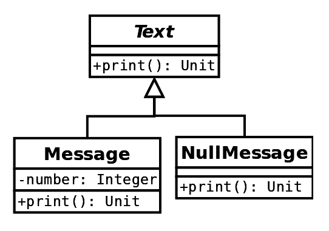

使用前面图中的类，每当没有数字要打印时，我们将返回一个具有空行为的**NullMessage**对象。在某些情况下，为了优化目的，人们可能会将**NullMessage**作为一个单例实例。

# 代码示例

在我们真正查看代码之前，我们将注意一些关于前面图表的观察。它代表了一个使用空对象设计模式的经典案例。然而，如今，在 Java 或 Scala 中实际上并没有这样使用。例如，Java 现在支持`Optional`，这被用作替代（假设人们使用语言的新版本）。在 Scala 中，情况类似——我们可以使用`Option[Message]`而不是空对象。此外，我们还获得了`Option`的所有其他良好特性，例如在模式匹配中使用它们的能力。

因此，如前所述，我们的代码实际上不会使用前面类图中的层次结构。它根本不需要它，并且将会更简单。相反，我们将使用`Option[Message]`。首先，让我们看看`Message`类的定义：

```java
case class Message(number: Int) {
  def print(): String = s"This is a message with number: $number."
}
```

我们提到我们将轮询队列以获取消息，然后显示它们。我们在应用程序中使用不同的线程模拟了一个随机填充的队列：

```java
import java.util.concurrent.ConcurrentLinkedQueue
import scala.util.Random

class DataGenerator extends Runnable {
  val MAX_VAL = 10
  val MAX_TIME = 10000
  private var isStop = false
  private val queue: ConcurrentLinkedQueue[Int] = new ConcurrentLinkedQueue[Int]()

  override def run(): Unit = {
    val random = new Random()
    while (!isStop) {
      Thread.sleep(random.nextInt(MAX_TIME))
      queue.add(random.nextInt(MAX_VAL))
    }
  }

  def getMessage(): Option[Message] =
    Option(queue.poll()).map {
    case number => Message(number)
  }

  def requestStop(): Unit = this.synchronized {
    isStop = true
  }
}
```

上述代码展示了将在不同线程中运行的代码。队列将在随机间隔内填充 0（包含）到 10（不包含）之间的随机值。然后，可以调用`getMessage`，并读取队列中的任何内容。由于队列可能为空，我们向调用者返回一个`Message`的`Option`。可能值得提一下，在 Scala 中，`Option(null)`返回`None`。这正是我们在前面的代码中所利用的。

让我们看看在我们的示例中所有这些是如何结合在一起的：

```java
object MessageExample {
  val TIMES_TO_TRY = 10
  val MAX_TIME = 5000

  def main(args: Array[String]): Unit = {
    val generator = new DataGenerator
    // start the generator in another thread
    new Thread(generator).start()
    val random = new Random()
    (0 to TIMES_TO_TRY).foreach {
      case time =>
        Thread.sleep(random.nextInt(MAX_TIME))
        System.out.println("Getting next message...")
        generator.getMessage().foreach(m =>
          System.out.println(m.print()))
    }
    generator.requestStop()
  }
}
```

上述程序创建了一个生成器，并在不同的线程上运行它。然后，它随机请求生成器中的项目，并在有返回值时打印它们。由于使用了随机生成器，程序每次打印的内容都不同。以下是一个示例运行：

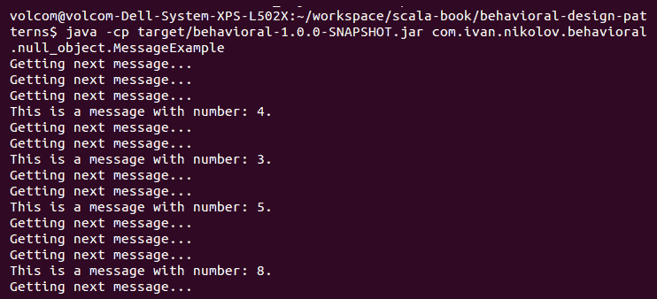

如您从我们的示例和前面的输出中看到的，我们实际上从未检查过`null`，并且当队列返回`null`时，我们的代码根本不做任何事情。这在大型项目中工作得很好，并且使源代码看起来非常优雅且易于理解。

在实际应用中，像前面示例中的代码可能不是一个好主意。首先，我们可以在线程上使用定时器而不是调用`sleep`。其次，如果我们想创建生产者-消费者应用程序，我们可以使用如**Akka**（[`akka.io/`](https://akka.io/））之类的库，这些库允许我们进行响应式编程，并拥有非常优化的代码。

# 它适用于什么

正如您已经看到的，空对象设计模式已经通过使用`Option`（Java 中的`Optional`）在 Scala（以及 Java 的新版本）中实现。这使得它非常容易使用，并再次展示了语言的力量。使用空对象使我们的代码看起来更加易读，并消除了在值是`null`时需要额外小心的需求。它还降低了出错的风险。

# 它不适用于什么

我们想不出这个设计模式有什么缺点。可能值得提一下的是——只有在真正需要的时候才使用它，而不是到处都使用。

# 策略设计模式

在企业应用程序中，有不同算法的实现，并在应用程序运行时选择一个使用，这是相当常见的事情。一些例子可能包括对不同大小或类型数据的排序算法，对不同数据可能表示的解析器，等等。

策略设计模式使我们能够在运行时定义一组算法并选择一个特定的算法。

策略设计模式有助于封装，因为每个算法都可以单独定义，然后注入到使用它的类中。不同的实现也是可互换的。

# 一个示例类图

对于类图，让我们想象我们正在编写一个需要从文件加载数据并使用这些数据的程序。当然，数据可以以不同的格式表示（在这种情况下是 CSV 或 JSON），并且根据文件类型，我们将使用不同的解析策略。表示我们的解析器的类图如下所示：

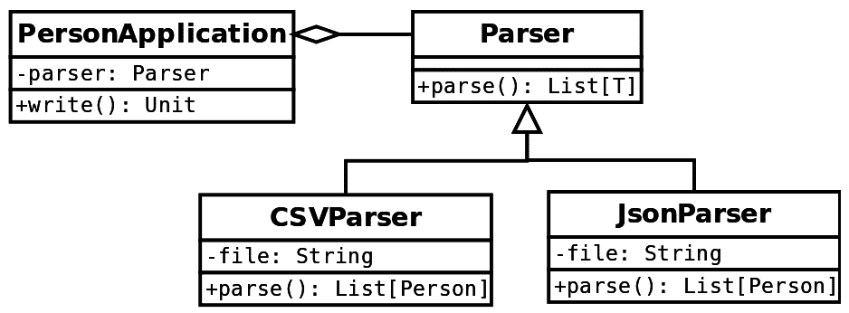

我们基本上有一个接口，不同的类实现它，然后根据需要，**PersonApplication** 被注入正确的实现。

上述类图与我们在书中看到的桥接设计模式的类图非常相似。尽管如此，这两种模式有不同的目的——构建者关注结构，而这里完全是关于行为。此外，策略设计模式看起来耦合度更高。

# 一个代码示例

在上一节中，我们展示了这里将要展示的示例的类图。正如你所见，我们使用了一个名为 `Person` 的模型类。它只是一个具有以下定义的案例类：

```java
case class Person(name: String, age: Int, address: String)
```

由于我们的应用程序中可能会有不同的格式，我们定义了一个公共接口，所有解析器都将实现：

```java
trait Parser[T] {
  def parse(file: String): List[T]
}
```

现在，让我们看看实现。首先是 `CSVParser`：

```java
import com.github.tototoshi.csv.CSVReader

class CSVParser extends Parser[Person] {
  override def parse(file: String): List[Person] =
    CSVReader.open(new
        InputStreamReader(this.getClass.getResourceAsStream(file))).all().map {
          case List(name, age, address) =>
            Person(name, age.toInt, address)
    }
}
```

它依赖于一个名为 `scala-csv` 的库（详细信息见 `pom.xml/build.sbt` 文件），该库将每一行读取为字符串列表。然后，它们被映射到 `Person` 对象。

接下来是 `JsonParser` 类的代码：

```java
import org.json4s._
import org.json4s.jackson.JsonMethods

class JsonParser extends Parser[Person] {
  implicit val formats = DefaultFormats
  override def parse(file: String): List[Person] =
    JsonMethods.parse(StreamInput(this.getClass.getResourceAsStream(file))).extract[List[Person]]
}
```

它读取一个 JSON 文件并使用 `json4s` 库进行解析。正如你所见，尽管两种实现做的是同一件事，但它们相当不同。当我们有一个 JSON 文件时，我们不能应用 CSV 实现，反之亦然。文件看起来也非常不同。以下是我们在示例中使用的 CSV 文件：

```java
Ivan,26,London
Maria,23,Edinburgh
John,36,New York
Anna,24,Moscow
```

这是 JSON 文件：

```java
[
  {
    "name": "Ivan",
    "age": 26,
    "address": "London"
  },
  {
    "name": "Maria",
    "age": 23,
    "address": "Edinburgh"
  },
  {
    "name": "John",
    "age": 36,
    "address": "New York"
  },
  {
    "name": "Anna",
    "age": 24,
    "address": "Moscow"
  }
]
```

前面的数据集包含完全相同的数据，但格式使它们看起来完全不同，并且需要不同的解析方法。

在我们的例子中，我们做了一件事。我们使用工厂设计模式来在运行时根据文件类型选择正确的实现：

```java
object Parser {
  def apply(filename: String): Parser[Person] =
    filename match {
      case f if f.endsWith(".json") => new JsonParser
      case f if f.endsWith(".csv") => new CSVParser
      case f => throw new RuntimeException(s"Unknown format: $f")
    }
}
```

之前的工厂只是一个例子。它只检查文件扩展名，当然，可以做得更加健壮。使用这个工厂，我们可以为应用程序类选择正确的解析器实现，其代码如下所示：

```java
class PersonApplicationT {
  def write(file: String): Unit = {
    System.out.println(s"Got the following data ${parser.parse(file)}")
  }
}
```

不论实现方式如何，应用程序类看起来都是一样的。不同的实现可以被插入，只要没有错误，一切都应该运行。

现在，让我们看看我们如何在示例中使用我们的策略设计模式：

```java
object ParserExample {
  def main(args: Array[String]): Unit = {
    val csvPeople = Parser("people.csv")
    val jsonPeople = Parser("people.json")
    val applicationCsv = new PersonApplication(csvPeople)
    val applicationJson = new PersonApplication(jsonPeople)
    System.out.println("Using the csv: ")
    applicationCsv.write("people.csv")
    System.out.println("Using the json: ")
    applicationJson.write("people.json")
  }
}
```

如您所见，这相当简单。上一应用程序的输出如下所示：

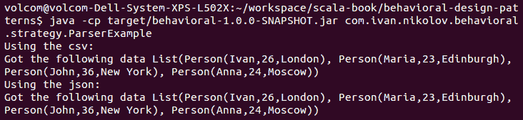

在两种情况下，我们的应用程序都能够很好地处理不同的格式。为新的格式添加新的实现也很简单——只需实现 `Parser` 接口并确保工厂知道它们。

# Scala 方式的策略设计模式

在上一节中，我们展示了使用类和特性来设计策略模式。这就是在纯面向对象语言中的样子。然而，Scala 既是函数式语言，又提供了通过编写更少的代码来实现它的更多方法。在本小节中，我们将利用 Scala 中函数是一等对象的事实来展示策略模式。

首先会改变的是，我们不需要有一个接口及其实现它的类。相反，我们的 `Application` 类将如下所示：

```java
class ApplicationT => List[T]) {
  def write(file: String): Unit = {
    System.out.println(s"Got the following data ${strategy(file)}")
  }
}
```

这里需要注意的最重要的事情是，策略参数是一个函数而不是一个普通对象。这立即允许我们传递任何我们想要的函数，而无需实现特定的类，只要它满足这些要求——一个 `String` 参数并返回一个 `List[T]`。如果我们策略中有多个方法，我们可以使用一个 case 类或元组来分组它们。

对于当前示例，我们决定将函数实现放在某个地方，以便它们与工厂一起分组，工厂将选择使用哪一个：

```java
import com.github.tototoshi.csv.CSVReader
import org.json4s.{StreamInput, DefaultFormat}
import org.json4s.jackson.JsonMethods

object StrategyFactory {
  implicit val formats = DefaultFormats

  def apply(filename: String): (String) => List[Person] =
    filename match {
      case f if f.endsWith(".json") => parseJson
      case f if f.endsWith(".csv") => parseCsv
      case f => throw new RuntimeException(s"Unknown format: $f")
    }

  def parseJson(file: String): List[Person] =
    JsonMethods.parse(StreamInput(this.getClass.getResourceAsStream(file))).extract[List[Person]]

  def parseCsv(file: String): List[Person] = CSVReader.open(new
      InputStreamReader(this.getClass.getResourceAsStream(file))).all().map {
        case List(name, age, address) => Person(name, age.toInt, address)
  }
}
```

之前的代码与之前的工厂相同，但这次它返回方法，然后可以调用这些方法。

最后，这是如何使用应用程序的：

```java
object StrategyExample {
  def main(args: Array[String]): Unit = {
    val applicationCsv = new ApplicationPerson)
    val applicationJson = new ApplicationPerson)
    System.out.println("Using the csv: ")
    applicationCsv.write("people.csv")
    System.out.println("Using the json: ")
    applicationJson.write("people.json")
  }
}
```

上一例子的输出将绝对与之前相同。

# 它适用于什么

策略设计模式帮助我们能够在运行时更改实现。此外，如您所见，实现与使用它们的代码是分开的，因此很容易添加新的实现，而不会在其他系统部分引入错误。

# 它不适用于什么

尽管从长远来看，使用函数实现的 Scala 策略模式可能会节省大量代码，但有时它会影响可读性和可维护性。方法可以存储在对象、类、case 类、特质中等，这表明不同的人可能更喜欢不同的方法，而在大型团队中工作时不总是好的。除此之外，只要正确使用和放置，策略设计模式没有任何重大缺陷。

# 命令设计模式

在我们的应用程序中，有时我们可能需要将有关如何执行某些操作的信息传递给其他对象。通常，这个操作将在某种事件的基础上稍后执行。将执行我们命令的对象称为**调用者**，它甚至可能不知道它实际运行的命令。它只知道关于接口的信息，这意味着它知道如何触发命令。命令设计模式帮助我们实现这一点。

命令设计模式的目的是在稍后阶段执行操作所需的信息进行封装，并将这些信息传递给将运行实际代码的对象。

通常，命令信息将包含拥有方法的对象、方法名称以及调用方法时应传递的参数。命令设计模式在许多方面都很有用，其中包括支持撤销操作、实现并行处理，或者通过延迟和可能避免代码执行来优化代码。

# 一个示例类图

当谈论命令设计模式时，通常有几个对象，每个对象都有其特定的角色：

+   **命令**: 我们可以将其视为调用者调用的接口及其实现。

+   **接收者**: 这是实际知道如何执行命令的对象。可以将其想象为一个被传递给命令并在接口方法中使用的对象。

+   **调用者**: 它通过调用它们的接口方法来调用命令。正如我们之前提到的，它甚至可能不知道正在调用哪些命令。

+   **客户端**: 它通过调用调用者来大致指导执行哪些命令。

现在我们已经了解了最重要的对象及其在命令设计模式中的角色，我们可以看看一个例子。对于类图，让我们想象我们有一个机器人，它可以烹饪。我们通过控制器连接到它并向我们的机器人发送命令。事情相当简化，但应该足以理解这个模式是如何工作的。以下是类图：

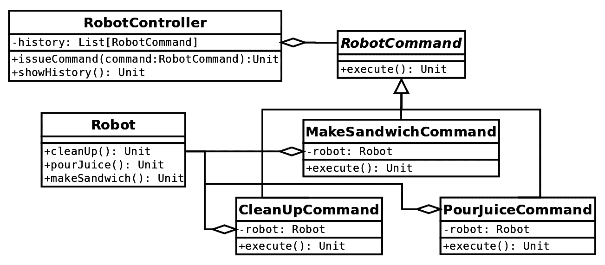

我们可以快速识别出，在这里，**RobotCommand** 接口及其实现是命令。接收者是 **Robot** 类，因为它知道如何运行所有发送给它的命令。**RobotController** 类是调用者。它不知道它执行的是哪种类型的命令，只是在需要时运行它们。我们还没有在先前的图中展示我们的客户端类，因为它只是通过运行代码的示例应用程序来表示，该应用程序实现了之前显示的类图。

你可以很容易地看到，如果代表先前图示的代码发生变化，它可以很容易地添加多线程支持和撤销功能。

# 代码示例

现在，是时候看看代表先前图示的有趣部分——代码了。一如既往，我们将逐个查看各个类，并在必要时给出简要说明。

我们将要查看的第一段代码是 `Robot` 类。我们之前提到过，它充当接收者并知道如何执行一些特定的功能：

```java
case class Robot() {
  def cleanUp(): Unit = System.out.println("Cleaning up.")
  def pourJuice(): Unit = System.out.println("Pouring juice.")
  def makeSandwich(): Unit = System.out.println("Making a sandwich.")
}
```

我们保持了代码的简单性，方法只是将不同的内容打印到命令行。接下来是带有其不同实现的机器人命令：

```java
trait RobotCommand {
  def execute(): Unit
}

case class MakeSandwichCommand(robot: Robot) extends RobotCommand {
  override def execute(): Unit = robot.makeSandwich()
}

case class PourJuiceCommand(robot: Robot) extends RobotCommand {
  override def execute(): Unit = robot.pourJuice()
}

case class CleanUpCommand(robot: Robot) extends RobotCommand {
  override def execute(): Unit = robot.cleanUp()
}
```

上述代码绝对没有特殊之处。它是一个简单的特质，由不同的类实现。它依赖于 `Robot` 接收者，它知道如何执行方法。

`RobotController` 类是我们的调用者，根据 `RobotCommand` 接口发出命令。它不需要了解它发出的命令的任何信息，只要遵循接口即可。我们决定添加一些命令的历史记录，这些记录可以在以后进行回滚。调用者的代码如下所示：

```java
class RobotController {
  val history = ListBuffer[RobotCommand]()

  def issueCommand(command: RobotCommand): Unit = {
    command +=: history
    command.execute()
  }

  def showHistory(): Unit = {
    history.foreach(println)
  }
}
```

现在，让我们看看使用所有先前类的示例。正如我们之前提到的，它实际上将充当客户端。以下是源代码：

```java
object RobotExample {
  def main(args: Array[String]): Unit = {
    val robot = Robot()
    val robotController = new RobotController
    robotController.issueCommand(MakeSandwichCommand(robot))
    robotController.issueCommand(PourJuiceCommand(robot))
    System.out.println("I'm eating and having some juice.")
    robotController.issueCommand(CleanUpCommand(robot))
    System.out.println("Here is what I asked my robot to do:")
    robotController.showHistory()
  }
}
```

本应用程序的输出将与以下截图中的相同：

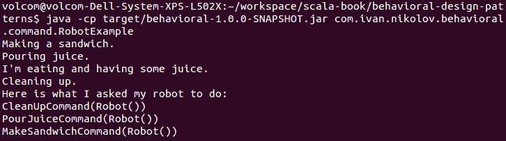

我们可以看到，我们的调用者成功保存了事件的记录。这意味着只要我们的命令和接收者（`Robot`）有撤销方法，我们就可以实现这些方法并具有额外的功能。

# Scala 方式的命令设计模式

命令设计模式是另一种设计模式，在 Scala 中与其他语言相比可以以不同的方式实现。我们将展示先前的示例的另一种实现。这次，我们将使用语言的 **按名参数** 功能。它可以替换为传递函数作为参数（我们之前已经为策略设计模式看到过），但更冗长。让我们看看它将是什么样子。

实际上，应用程序不需要做太多改变。我们只重构并重命名了 `RobotController` 和 `RobotExample` 类。以下是之前的类，现在称为 `RobotByNameController`：

```java
class RobotByNameController {
  val history = ListBuffer[() => Unit]()

  def issueCommand(command: => Unit): Unit = {
    command _ +=: history
    command
  }

  def showHistory(): Unit = {
    history.foreach(println)
  }
}
```

正如你所见，我们并没有传递一个实际的命令对象，而是仅仅将一个按名传递的参数传递给`issueCommand`方法。这个方法所做的就是延迟对获取传递值的调用，直到实际需要时。为了使前面的代码能够工作，我们不得不对我们的示例代码进行重构：

```java
object RobotByNameExample {
  def main(args: Array[String]): Unit = {
    val robot = Robot()
    val robotController = new RobotByNameController
    robotController.issueCommand(MakeSandwichCommand(robot).execute())
    robotController.issueCommand(PourJuiceCommand(robot).execute())
    System.out.println("I'm eating and having some juice.")
    robotController.issueCommand(CleanUpCommand(robot).execute())
    System.out.println("Here is what I asked my robot to do:")
    robotController.showHistory()
  }
}
```

当我们不希望为命令接口及其实现编写额外代码时，按名参数方法很有用。我们只需传递任何函数调用（在这种情况下，直接从接收者传递）即可，它将被延迟到数据需要时，或者根本不调用。输出将与之前相同，但现在的区别是我们有了函数，历史打印输出将略有不同。

# 它的优点是什么

命令设计模式适用于我们想要延迟、记录或按某种原因对方法调用进行排序的情况。另一个优点是它将调用者与实际执行特定操作的对象解耦。这使我们能够轻松地进行修改和添加新功能。

# 它的缺点是什么

尽管按名传递参数的方法看起来很优雅，并且可以使我们的写作更简洁，但在这里可能并不是一个好主意。与我们的前一个例子相比，一个很大的缺点是我们实际上可以插入任何`Unit`数据，这可能与接收者应该执行的操作不相关。然而，在其他情况下，按名传递参数技术非常有用，并且可以显著提高我们的应用程序性能。

# 责任链设计模式

现在，随着数据规模的增长和大数据的热潮，流处理是许多应用程序必须能够执行的操作。流处理的特点是数据流的无尽流动，这些数据从一个对象传递到另一个对象，而每个对象都可以进行一些处理，然后将它传递给下一个对象。在其他情况下，数据可以在链中移动，直到到达一个知道如何处理特定命令的对象。

前面的行为非常适合责任链设计模式。

责任链设计模式的目的是通过让多个对象有机会处理请求，从而将请求的发送者与其接收者解耦。

责任链设计模式可能会有一些变化。原始模式是，每当一个请求到达一个可以处理它的对象时，它就不会再进一步。然而，在某些情况下，我们可能需要进一步推动请求，甚至将其乘以并广播给其他接收者。

值得注意的是，责任链模式根本不是数据特定的，它可以在任何出现上述特性的场景中使用。

# 一个示例类图

常用来说明责任链设计模式的一个例子是关于应用程序中的事件处理，这取决于事件是来自鼠标还是键盘操作。对于我们的类图和代码示例，让我们看看我们每天都会用到的东西——ATM。它们如何以不同的纸币组合返回正确的金额？答案是，当然，责任链。

我们在这里将展示两个图——一个显示允许我们实现责任链模式的类，另一个将展示这些类如何一起使用来构建我们的 ATM。

首先，让我们单独看一下我们的类：

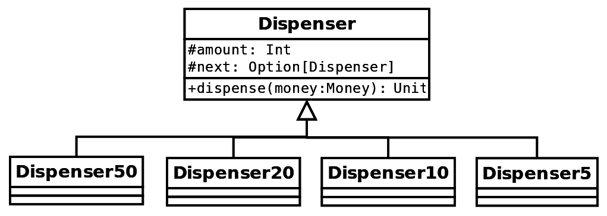

在前面的图中，我们有一个基类（在 Scala 中用特质表示），然后由不同的具体分配器扩展。每个分配器都有一个相同类的可选实例，这样我们就可以构建一个链。对于所有分配器，`dispense`方法都是相同的，然后每个分配器都有一个不同的金额和链中的不同下一个元素。

当我们展示我们的 ATM 实现时，一切将会变得更加清晰。这可以在以下图中看到：

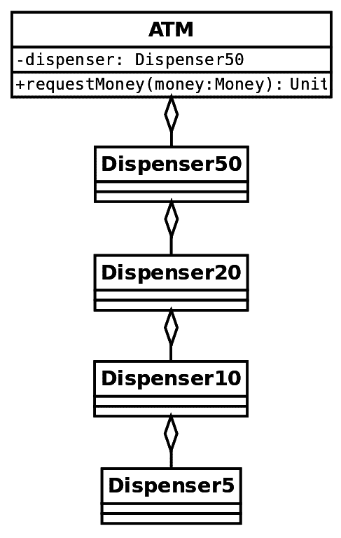

前面的图显示了我们在 ATM 中实际拥有的链。每当有人请求现金时，ATM 将前往 50 英镑纸币的分配器，然后是下一个分配器，依此类推，直到满足用户的请求。在接下来的小节中，我们将逐步展示我们的代码。

# 代码示例

让我们逐行查看前一个示例的代码。首先，我们定义了一个`Money`类，它代表了用户请求的金额。其定义如下：

```java
case class Money(amount: Int)
```

现在，让我们看看`Dispenser`特质。这是具体分配器扩展的特质，如下所示：

```java
trait Dispenser {
  val amount: Int
  val next: Option[Dispenser]

  def dispense(money: Money): Unit = {
    if (money.amount >= amount) {
      val notes = money.amount / amount
      val left = money.amount % amount
      System.out.println(s"Dispensing $notes note/s of $amount.")
      if (left > 0) next.map(_.dispense(Money(left)))
    } else {
      next.foreach(_.dispense(money))
    }
  }
}
```

如前所述，对于扩展我们的`Dispenser`的每个人，分配方法都是相同的，但金额和链中的下一个元素需要由扩展它的人定义。`dispense`方法尝试返回尽可能多的指定面额的纸币；在此之后，如果还有钱要分配，它将责任传递给下一个分配器。

下面的代码块展示了我们对不同分配器的实现——包括`50`、`20`、`10`和`5`英镑纸币的分配器：

```java
class Dispenser50(val next: Option[Dispenser]) extends Dispenser {
  override val amount = 50
}

class Dispenser20(val next: Option[Dispenser]) extends Dispenser {
  override val amount: Int = 20
}

class Dispenser10(val next: Option[Dispenser]) extends Dispenser {
  override val amount: Int = 10
}

class Dispenser5(val next: Option[Dispenser]) extends Dispenser {
  override val amount: Int = 5
}
```

我们到目前为止所展示的是责任链设计模式的精髓。使用定义的类，我们现在将构建一个易于使用的链。

下面是我们`ATM`类的代码：

```java
class ATM {
  val dispenser: Dispenser = {
    val d1 = new Dispenser5(None)
    val d2 = new Dispenser10(Some(d1))
    val d3 = new Dispenser20(Some(d2))
    new Dispenser50(Some(d3))
  }

  def requestMoney(money: Money): Unit = {
    if (money.amount % 5 != 0) {
      System.err.println("The smallest nominal is 5 and we cannot
       satisfy your request.")
    } else {
      dispenser.dispense(money)
    }
  }
}
```

在前面的代码中，我们构建了将由我们的`ATM`类使用的分配器链。这里的顺序对于系统的正确运行至关重要。我们还进行了一些合理性检查。然后，使用我们的`ATM`类就相当直接，如下所示的应用程序：

```java
object ATMExample {
  def main(args: Array[String]): Unit = {
    val atm = new ATM
    printHelp()
    Source.stdin.getLines().foreach {
      case line =>
        processLine(line, atm)
    }
  }

  def printHelp(): Unit = {
    System.out.println("Usage: ")
    System.out.println("1\. Write an amount to withdraw...")
    System.out.println("2\. Write EXIT to quit the application.")
  }

  def processLine(line: String, atm: ATM): Unit = {
    line match {
      case "EXIT" =>
        System.out.println("Bye!")
        System.exit(0)
      case l =>
        try {
          atm.requestMoney(Money(l.toInt))
          System.out.println("Thanks!")
        } catch {
          case _: Throwable =>
            System.err.println(s"Invalid input: $l.")
            printHelp()
        }
    }
  }
}
```

这是一个交互式应用程序，它等待用户输入，然后使用 ATM。让我们看看以下截图中的这个示例运行将如何显示：

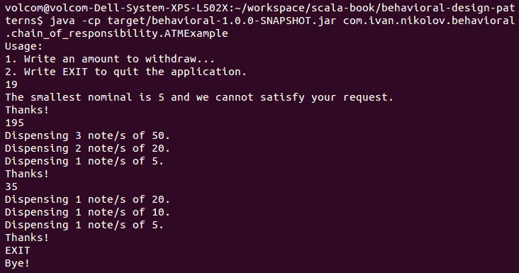

如您在代码中所见，我们的 ATM 没有其他 ATM 具有的额外功能——检查钞票可用性。然而，这是一个可以进一步扩展的功能。

# Scala 风格的链式责任设计模式

仔细查看代码和类图，您可以看到一些与装饰器设计模式的相似之处。这意味着在这里，我们可以使用相同的可堆叠特质，它们使用`abstract override`构造。我们已经看到了一个例子，这不会为您提供任何新的信息。然而，Scala 编程语言中还有另一个功能，我们可以用来实现链式责任设计模式——部分函数。

使用部分函数，我们不需要分别定义特定的分发器类。我们的分发器将变为以下：

```java
trait PartialFunctionDispenser {
  def dispense(dispenserAmount: Int): PartialFunction[Money, Money] = {
    case Money(amount) if amount >= dispenserAmount =>
      val notes = amount / dispenserAmount
      val left = amount % dispenserAmount
      System.out.println(s"Dispensing $notes note/s of $dispenserAmount.")
      Money(left)
    case m @ Money(amount) => m
  }
}
```

当然，有不同的方式来完成这件事——我们可以有一个抽象特质，然后实现部分函数（类似于原始示例），并且不指定`dispenserAmount`参数，或者我们可以有一个具有该函数不同实现的特质，而不是传递`dispenserAmount`参数，等等。然而，这样做允许我们后来模拟无限数量的不同钞票的存在。

在我们有了新的分发器，它返回一个`PartialFunction`而不是什么也没有（`Unit`）之后，我们可以定义我们的`ATM`类：

```java
class PartialFunctionATM extends PartialFunctionDispenser {
  val dispenser =
    dispense(50)
      .andThen(dispense(20))
      .andThen(dispense(10))
      .andThen(dispense(5))

  def requestMoney(money: Money): Unit = {
    if (money.amount % 5 != 0) {
      System.err.println("The smallest nominal is 5 and we cannot
       satisfy your request.")
    } else {
      dispenser(money)
    }
  }
}
```

这里有趣的部分是`dispenser`字段以及我们使用它的方式。在前面的代码中，我们使用`andThen`方法链式连接多个部分函数，最后，我们将它们的输出作为方法使用。

根据开发者想要创建的链，他们可以使用部分函数的`orElse`或`andThen`方法。前者对单个处理器很有用，后者用于链式操作。

运行原始示例，但用 ATM 实现替换，将产生绝对相同的结果。

正如您在本小节中看到的那样，使用部分函数可以使我们的应用程序更加灵活，并且将需要我们编写更少的代码。然而，在理解高级 Scala 语言概念方面可能会更加要求严格。

为了完整性，值得一提的是，我们还可以使用 Akka 库实现责任链设计模式。我们将在本书的后续章节中探讨这个库，你可能会看到这个设计模式如何用 Scala 转换为响应式编程。

# 它的优点是什么

当我们想要解耦请求的发送者与接收者，并将这些接收者分离成它们自己的实体时，应该使用链式责任设计模式。这对于创建管道和处理事件很有用。

# 它不擅长的地方

作为责任链设计模式的负面和可能的陷阱，我们将讨论涉及部分函数的实现。这是因为它可能无法总是实现开发者的期望，这可能会进一步复杂化代码并影响可读性。

# 解释器设计模式

在现代编程中，我们有时必须处理来自理解良好和定义明确的领域的难题。在某些情况下，用语言表示领域是有意义的，这可以使得使用解释器解决问题变得容易。

解释器设计模式通过使用类来表示语言并构建语法树以评估语言表达式，用于指定如何评估语言中的句子。

解释器设计模式利用了组合设计模式。解释器的常见用途包括语言解析、协议等。

# 一个示例类图

创建语言和语法是一项复杂的工作，在深入之前，开发者应该确信这确实值得付出努力。它需要对正在建模的领域有很好的理解，通常需要一些时间。在本节中，我们将展示一个程序的解释器部分的类图，该程序以逆波兰表示法解析和评估表达式。这是计算机科学中的一个重要概念，它展示了计算机在执行不同操作时是如何实际工作的。截图如下所示：

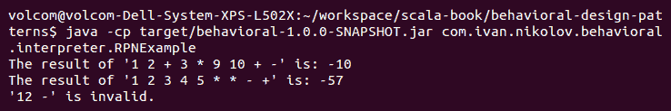

我们语言的主要概念是`表达式`。一切都是一个表达式，正在被解释。

在我们的图中，我们可以区分两种主要的表达式类型：

+   **终端表达式**：这是`Number`类。在构建表达式语法树时，它没有其他子节点（叶节点）。

+   **非终端表达式**：这些是`Add`、`Subtract`和`Multiply`类。它们有子表达式，这就是整个语法树是如何构建的。

上一张截图只显示了解释器将转换成我们语言的那些表达式。在下一小节中，我们还将展示所有其他可以使此类应用程序工作的类。

# 代码示例

在这里，我们将逐步展示我们的解释器应用程序的代码。我们目前有一些限制，例如只支持整数，没有良好的错误报告机制，并且只有三种操作，但很容易添加新的操作。你可以尝试在我们已有的基础上进行构建。

首先，让我们看看基本的`Expression`特质：

```java
trait Expression {
  def interpret(): Int
}
```

它非常简单，包含一个其他表达式必须实现的方法。终端表达式，即我们的`Number`类，如下所示：

```java
class Number(n: Int) extends Expression {
  override def interpret(): Int = n
}
```

它没有做任何特别的事情——只是在`interpret`被调用时返回它携带的数字。非终端表达式有更多的代码，但它们都非常简单：

```java
class Add(right: Expression, left: Expression) extends Expression {
  override def interpret(): Int = left.interpret() + right.interpret()
}

class Subtract(right: Expression, left: Expression) extends Expression {
  override def interpret(): Int = left.interpret() - right.interpret()
}

class Multiply(right: Expression, left: Expression) extends Expression {
  override def interpret(): Int = left.interpret() * right.interpret()
}
```

到目前为止，这是我们展示在图中的所有内容，它是解释器设计模式的基本部分。有些人可能会注意到，在所有构造函数中，我们首先有右边的表达式，然后是左边的表达式。这是故意为之，因为它会在我们实际实现解析器时使代码更加清晰。

从现在开始，我们将展示如何在实际应用程序中解析和使用设计模式。首先，我们需要创建一个基于标记的工厂，该标记决定它应该返回哪个表达式：

```java
object Expression {
  def apply(operator: String, left: => Expression, right: => Expression): Option[Expression] =
    operator match {
      case "+" => Some(new Add(right, left))
      case "-" => Some(new Subtract(right, left))
      case "*" => Some(new Multiply(right, left))
      case i if i.matches("\\d+") => Some(new Number(i.toInt))
      case _ => None
    }
}
```

在前面的代码中，我们应用了一些我们已经讨论过的技术和设计模式——工厂模式和按名称传递参数。后者非常重要，因为根据我们的代码触发的哪个情况，它们将决定是否会被评估。

我们有一个看起来像下面的解析器类：

```java
class RPNParser {
  def parse(expression: String): Expression = {
    val tokenizer = new StringTokenizer(expression)
    tokenizer.asScala.foldLeft(mutable.Stack[Expression]()) {
      case (result, token) => 
        val item = Expression(token.toString, result.pop(), result.pop())
        item.foreach(result.push)
        result
    }.pop()
  }
}
```

在这里，我们依赖于`StringTokenizer`和栈。我们使用了之前定义的工厂方法，这是有趣的部分——只有在我们遇到运算符情况时，才会调用`pop`。它将按照我们在工厂内部使用参数的顺序被调用。

从栈中弹出元素

如前所述的代码所示，在工厂中，我们使用了按名称传递的参数，并且在我们访问参数的地方，我们首先访问右边的参数，然后是左边的参数。这，以及我们的表达式类首先指定右参数的事实，使我们的代码更加清晰，并确保一切按预期工作。这样做的原因是因为我们依赖于栈，并且它反转了运算符的顺序。

在我们处理完一个表达式后，如果一切顺利，我们应该只在栈中有一个元素，它将包含完整的树。然后，我们将有一个只获取表达式并在其上调用`interpret`方法的解释器类：

```java
class RPNInterpreter {
  def interpret(expression: Expression): Int = expression.interpret()
}
```

最后，让我们看看一个使用我们的语言和解释器设计模式的应用程序：

```java
object RPNExample {
  def main(args: Array[String]): Unit = {
    val expr1 = "1 2 + 3 * 9 10 + -" // (1 + 2) * 3 - (9 + 10) = -10
    val expr2 = "1 2 3 4 5 * * - +" // 1 + 2 - 3 * 4 * 5 = -57
    val expr3 = "12 -" // invalid
    val parser = new RPNParser
    val interpreter = new RPNInterpreter
    System.out.println(s"The result of '${expr1}' is:
     ${interpreter.interpret(parser.parse(expr1))}")
    System.out.println(s"The result of '${expr2}' is:
     ${interpreter.interpret(parser.parse(expr2))}")
    try {
      System.out.println(s"The result is:
       ${interpreter.interpret(parser.parse(expr3))}")
    } catch {
      case _: Throwable => System.out.println(s"'$expr3' is invalid.")
    }
  }
}
```

这个应用程序的输出将是以下内容：

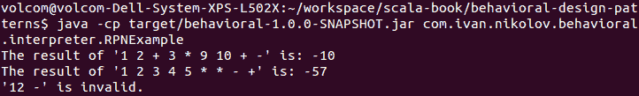

如你所见，我们的代码正确地评估了表达式。当然，有一些改进可以做出，它们主要与错误处理和解析有关，但这超出了本小节的范围。在本小节中，我们看到了如何使用解释器设计模式。

# 它的优点

解释器设计模式适用于处理定义明确且理解良好的领域的应用程序。它可以极大地简化应用程序代码。你不应该将解释器设计模式与解析混淆，尽管我们为了构建表达式需要解析。

# 它的缺点

创建语言和语法不是一项容易的工作。开发者应该在决定使用这种设计模式之前，彻底评估他们试图解决的问题。

# 摘要

在本章中，我们回顾了第一组行为设计模式。我们研究了值对象、空对象、策略、命令、责任链和解释器。正如前几章所看到的，其中一些模式有更好的替代方案，它们使用了 Scala 更强大和灵活的特性。在许多情况下，实现相同的设计模式有多种不同的方法。我们试图展示一些好的方法，并且在更多设计模式可以使用 Scala 编程语言的相同功能的情况下，我们也试图避免重复。到目前为止，你应该已经拥有了足够的知识，以便在被告知使用哪种方法时，能够根据我们已经展示的内容自行使用替代实现。

我们提供了一些指导，这些指导应该有助于在编写软件时确定要寻找的内容，以及识别潜在的应用行为设计模式的位置。

在接下来的章节中，我们将探讨下一组行为设计模式，这也标志着我们一直关注的前四个设计模式的结束。
