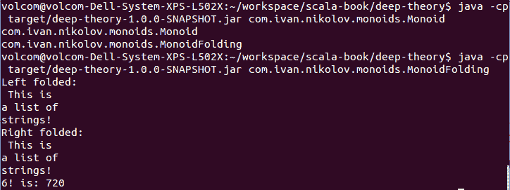
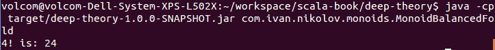
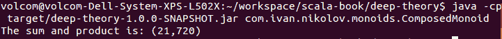
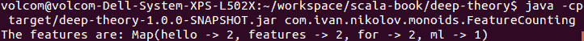
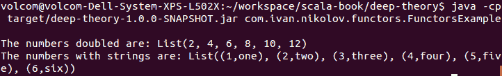
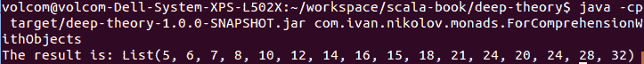
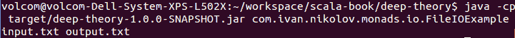

# 第十章：函数式设计模式 – 深入理论

Scala 编程语言是函数式和面向对象语言的混合体。大多数面向对象的设计模式仍然适用。然而，为了充分发挥 Scala 的威力，你还需要了解其纯函数式方面。当使用该语言和阅读教程或最佳实践时，开发者很可能会注意到，随着问题的复杂度增加或需要更优雅的解决方案时，**单例**、**单子**和**函子**等术语出现的频率更高。在本章中，我们将重点关注以下函数式设计模式：

+   单例

+   函子

+   单子

互联网上关于前面主题的资源很多。问题是许多内容都非常理论化，对于不熟悉数学，尤其是范畴论的人来说很难理解。实际上，许多开发者缺乏掌握这些主题所需的深厚数学背景，完全避免这些概念在代码中并不罕见。

根据我的经验，我所认识的绝大多数 Scala 开发者都尝试阅读本章涵盖主题的教程，并且他们发现这些主题很难理解，并最终放弃了。专家数学家似乎觉得这些概念更容易理解。然而，尽管反复尝试理解，大多数人承认他们对深入函数式编程理论并不完全适应。在本章中，我们将尝试以一种易于理解的方式呈现这一理论，并给出如何以及何时应用这一理论的想法。

# 抽象和词汇

编程的一大部分是抽象。我们找到常见的功能、法则和行为，并将它们封装到类、接口、函数中等，这些是抽象的，允许代码重用。然后，我们引用并重用它们以最小化代码重复和错误的可能性。其中一些抽象比其他更常见，并在不同的项目中观察到，被更多的人使用。这些抽象导致了一个共同词汇表的形成，这还额外有助于沟通和理解。每个人都知道某些数据结构，如树和哈希表，因此没有必要深入了解它们，因为它们的行为和需求是众所周知的。同样，当某人在设计模式方面有足够的经验时，他们可以很容易地看到它们，并将这些模式应用到他们试图解决的问题上。

在本章中，我们将尝试从一种将教会我们如何识别它们以及何时使用它们的角度来看待单例、单子（monads）和函子（functors）。

# 单例

所有幺半群、单子（monads）和函子（functors）都源自数学。关于这个主题的一个特点是，与编程类似，它试图寻找抽象。如果我们试图将数学映射到编程，我们可以考虑我们拥有的不同数据类型——`Int`、`Double`、`Long`或自定义数据类型。每个类型都可以通过它支持的运算和这些运算的法则来表征，这被称为类型的**代数**。

现在，如果我们仔细思考，我们可以识别出多个类型共有的运算，例如，加法、乘法、减法等等。不同的类型可以共享相同的运算，并且它们可以完全遵循相同的法则。我们可以利用这一点，因为这允许我们编写适用于遵循某些特定规则的不同类型的通用程序。

# 什么是幺半群？

在对幺半群进行前面的简要介绍之后，让我们直接进入正题，看看*幺半群*的正式定义：

幺半群是一个纯代数结构，这意味着它仅由其代数来定义。所有幺半群都必须遵循所谓的**幺半群公理**。

前面的定义绝对不足以对幺半群有一个好的理解，所以让我们在本节中将它分解成几个部分，并尝试给出一个更好的定义。

首先，让我们明确一下术语**代数结构**：

**代数性**：它仅由其代数来定义，例如，它支持的运算和它遵循的法则。

现在我们知道，幺半群仅由它们支持的运算来定义，那么让我们来看看幺半群公理：

+   幺半群包含一个 `T` 类型。

+   幺半群包含一个结合二元运算。这意味着对于 `T` 类型的任何 `x`、`y` 和 `z`，以下都是正确的：

    `op(op(x, y), z) == op(x, op(y, z))`。

+   一个结构必须有一个**单位元**——`零`。这个元素的特点是前一个运算总是返回另一个元素——`op(x, zero) == x` 和 `op(zero, x) == x`。

除了前面的法则之外，不同的幺半群可能根本没有任何关系——它们可以是任何类型。现在让我们看看一个更好的幺半群的定义，这个定义对你作为开发者来说实际上更有意义：

幺半群是一个具有结合二元运算的类型，它还有一个单位元。

幺半群规则非常简单，但它们给了我们极大的能力，仅基于幺半群总是遵循相同的规则这一事实来编写多态函数。使用幺半群，我们可以轻松地促进并行计算，并从小块构建复杂的计算。

# 生活中的幺半群

我们经常使用幺半群而没意识到——字符串连接、整数求和、乘积、布尔运算、列表等等，它们都是幺半群的例子。让我们看看整数加法：

+   **我们的类型**：`Int`。

+   **我们的结合运算**：`add`。它确实是结合的，因为 `((1 + 2) + 3) == (1 + (2 + 3))`。

+   **我们的单位元素**：`0`。当它被添加到另一个整数时，什么也不做。

我们可以轻松地找到类似的例子，例如字符串连接，其中单位元素将是一个空字符串，或者列表连接，其中单位元素将是一个空列表，以及其他许多例子。类似的例子可以在任何地方找到。

我们之前提到的所有内容都引出了以下 Scala 单例表示：

```java
trait Monoid[T] {
  def op(l: T, r: T): T
  def zero: T
}
```

从这个基础特质开始，我们可以定义我们想要的任何单例。以下是一些整数加法单例、整数乘法单例和字符串连接单例的实现：

```java
package object monoids {
  val intAddition: Monoid[Int] = new Monoid[Int] {
    val zero: Int = 0

    override def op(l: Int, r: Int): Int = l + r
  }

  val intMultiplication: Monoid[Int] = new Monoid[Int] {
    val zero: Int = 1

    override def op(l: Int, r: Int): Int = l * r
  }

  val stringConcatenation: Monoid[String] = new Monoid[String] {
    val zero: String = ""

    override def op(l: String, r: String): String = l + r
  }
}
```

使用之前展示的相同框架，我们可以为尽可能多的不同类型定义单例，只要它们始终满足规则。然而，你应该注意，并非每个操作都遵循单例规则。例如，整数除法—`(6/3)/2 != 6/(3/2)`。

我们看到了如何编写单例。但我们是怎样使用它们的？它们有什么用，我们能否仅基于我们知道的规则编写通用函数？当然可以，我们将在以下小节中看到这一点。

# 使用单例

在前面的章节中，我们已经提到单例可以用于并行计算，以及使用小块和简单的计算构建复杂计算。单例也可以与列表和集合自然地结合使用。

在本小节中，我们将通过示例查看单例的不同用例。

# 单例和可折叠集合

为了展示单例与支持`foldLeft`和`foldRight`函数的集合的有用性，让我们看看标准的 Scala 列表和这两个函数的声明：

```java
def foldLeftB(f: (B, A) => B): B

def foldRightB(f: (A, B) => B): B
```

通常，这两个函数中的`z`参数被称为`zero`值，所以如果`A`和`B`是同一类型，我们最终会得到以下结果：

```java
def foldLeftA(f: (A, A) => A): A

def foldRightA(f: (A, A) => A): A
```

现在看看这些函数，我们可以看到这些正是单例规则。这意味着我们可以编写一个示例，如下面的代码所示，该代码使用了我们之前创建的单例：

```java
object MonoidFolding {
  def main(args: Array[String]): Unit = {
    val strings = List("This is\n", "a list of\n", "strings!")
    val numbers = List(1, 2, 3, 4, 5, 6)
    System.out.println(s"Left folded:\n${strings.foldLeft(stringConcatenation.zero)(stringConcatenation.op)}")
    System.out.println(s"Right folded:\n${strings.foldRight(stringConcatenation.zero)(stringConcatenation.op)}")
    System.out.println(s"6! is: ${numbers.foldLeft(intMultiplication.zero)(intMultiplication.op)}")
  }
}
```

在前面的代码中，还有一点需要注意，即对于最终结果来说，我们使用`foldLeft`还是`foldRight`并不重要，因为我们的单例具有结合操作。然而，在性能方面，这确实很重要。

前面示例的输出如下所示：



看看前面的例子，你可以看到我们可以编写一个通用函数，该函数将使用单例折叠列表，并根据单例操作执行不同的操作。以下是该函数的代码：

```java
object MonoidOperations {
  def foldT: T = list.foldLeft(m.zero)(m.op)
}
```

现在，我们可以重写我们的示例并使用我们的通用函数如下：

```java
object MonoidFoldingGeneric {
  def main(args: Array[String]): Unit = {
    val strings = List("This is\n", "a list of\n", "strings!")
    val numbers = List(1, 2, 3, 4, 5, 6)
    System.out.println(s"Left folded:\n${MonoidOperations.fold(strings,
     stringConcatenation)}")
    System.out.println(s"Right folded:\n${MonoidOperations.fold(strings,
     stringConcatenation)}")
    System.out.println(s"6! is: ${MonoidOperations.fold(numbers,
     intMultiplication)}")
  }
}
```

当然，输出将完全相同。然而，现在事情要整洁得多，这就是当与列表一起使用时，单例可以变得有用的原因。

在前面的例子中，我们在`foldLeft`和`foldRight`函数中将`A`和`B`类型设为相同。然而，我们可能使用不同的类型构建不同的数据结构，或者我们的算法可能依赖于具有不同单例的类型，而不是我们拥有的列表类型。为了支持这种场景，我们必须添加将原始列表类型映射到不同类型的可能性：

```java
object MonoidOperations {
  def foldT: T = foldMap(list, m)(identity)

  def foldMapT, Y(f: T => Y): Y =
    list.foldLeft(m.zero) {
      case (t, y) => m.op(t, f(y))
    }
}
```

上述代码展示了我们的折叠函数将如何改变。这将给我们提供在列表上使用不同类型的单例实现更复杂操作的可能性。

# 单例和并行计算

单例操作的结合性意味着如果我们必须链式多个操作，我们可能可以在并行中进行。例如，如果我们有数字`1`、`2`、`3`和`4`，并且想要找到`4!`，我们可以使用之前使用的方法，这将最终被评估为以下内容：

```java
op(op(op(1, 2), 3), 4)
```

然而，结合性将允许我们做以下事情：

```java
op(op(1, 2), op(3, 4))
```

在这里，嵌套操作可以独立且并行地进行。这也被称为**平衡折叠**。一个平衡折叠的实现可能如下所示：

```java
def balancedFoldT, Y(f: T => Y): Y =
  if (list.length == 0) {
    m.zero
  } else if (list.length == 1) {
    f(list(0))
  } else {
    val (left, right) = list.splitAt(list.length / 2)
    m.op(balancedFold(left, m)(f), balancedFold(right, m)(f))
  }
```

值得注意的是，在这里我们使用了`IndexedSeq`，因为它将保证通过索引获取元素将是高效的。此外，这段代码不是并行的，但我们已经按照之前提到的顺序改变了操作顺序。对于整数来说，这可能不会有太大的区别，但对于其他类型，如字符串，这将提高性能。原因是字符串是不可变的，每次连接都会通过分配新的空间来创建一个新的字符串。因此，如果我们只是从左侧到右侧进行操作，我们将不断分配更多的空间，并且总是丢弃中间结果。

下面的代码示例展示了如何使用我们的`balancedFold`函数：

```java
object MonoidBalancedFold {
  def main(args: Array[String]): Unit = {
    val numbers = Array(1, 2, 3, 4)
    System.out.println(s"4! is: ${MonoidOperations.balancedFold(numbers, intMultiplication)(identity)}")
  }
}
```

结果将如下所示：



使此代码并行化有几种方法。困难的方法将涉及编写大量的额外代码来管理线程，这非常高级。这可能值得一个章节（如果不是整本书），我们只是为更好奇的读者提及——*纯函数式并行性*。GitHub 上（[`github.com/fpinscala/fpinscala/wiki/Chapter-7:-Purely-functional-parallelism`](https://github.com/fpinscala/fpinscala/wiki/Chapter-7:-Purely-functional-parallelism)）有一些材料，通过示例很好地介绍了这个概念。

我们还可以使用大多数 Scala 集合都有的`par`方法。由于单例遵守的定律，我们可以保证无论底层集合如何并行化，我们总能得到正确的结果。下面的列表展示了我们折叠方法的示例实现：

```java
def foldParT: T =
  foldMapPar(list, m)(identity)

def foldMapParT, Y(f: T => Y): Y =
  list.par.foldLeft(m.zero) {
    case (t, y) => m.op(t, f(y))
  }
```

与我们之前的方法相比，这两种方法的唯一区别是在使用`foldLeft`之前调用了`par`。使用这些方法与之前的方法完全相同：

```java
object MonoidFoldingGenericPar {
  def main(args: Array[String]): Unit = {
    val strings = List("This is\n", "a list of\n", "strings!")
    val numbers = List(1, 2, 3, 4, 5, 6)
    System.out.println(s"Left folded:\n${MonoidOperations.foldPar(strings,
     stringConcatenation)}")
    System.out.println(s"Right folded:\n${MonoidOperations.foldPar(strings,
     stringConcatenation)}")
    System.out.println(s"6! is: ${MonoidOperations.foldPar(numbers,
     intMultiplication)}")
  }
}
```

如你所预期，这里的输出将与顺序示例中的输出完全相同。

# 幺半群和组合

到目前为止，我们已经看到了一些例子，其中幺半群被用来提高效率并编写通用函数。然而，它们的功能更强大。原因在于它们遵循另一个有用的规则：

幺半群支持*组合*；如果`A`和`B`是幺半群，那么它们的乘积`(A, B)`也是一个幺半群。

这究竟意味着什么？我们如何利用这一点？让我们看看以下函数：

```java
def composeT, Y: Monoid[(T, Y)] =
  new Monoid[(T, Y)] {
    val zero: (T, Y) = (a.zero, b.zero)

    override def op(l: (T, Y), r: (T, Y)): (T, Y) =
      (a.op(l._1, r._1), b.op(l._2, r._2))
  }
```

在前面的代码中，我们展示了如何按照我们的定义应用组合函数。这将现在允许我们同时使用幺半群应用多个操作，我们可以组合更多，并应用更多操作。让我们看看以下示例，它将计算给定数字的和与阶乘：

```java
object ComposedMonoid {
  def main(args: Array[String]): Unit = {
    val numbers = Array(1, 2, 3, 4, 5, 6)
    val sumAndProduct = compose(intAddition, intMultiplication)
    System.out.println(s"The sum and product is: ${MonoidOperations.balancedFold(numbers, sumAndProduct)(i => (i, i))}")
  }
}
```

在前面的例子中，我们利用了`map`函数，因为我们的新幺半群期望一个整数元组，而不是我们数组中只有一个整数。运行这个例子将产生以下结果：



前面的`compose`函数功能非常强大，我们可以用它做很多事情。我们还可以高效地计算列表中所有项的平均值——我们只需要使用`intAddition`幺半群两次，并将数字映射到`(number, 1)`，以便将计数和总和一起考虑。

到目前为止，我们已经看到了如何通过操作来组合幺半群。然而，幺半群在构建数据结构方面也非常有用。只要它们的值也形成幺半群，数据结构也可以形成幺半群。

让我们通过一个例子来讲解。在机器学习中，我们可能需要从某些文本中提取特征。然后，每个特征将使用一个系数和出现次数的数值进行加权。让我们尝试找到一个可以折叠集合并给出所需结果的幺半群——即每个特征的计数。

首先，很明显我们将计算每个特征出现的次数。构建一个要计数的特征的映射听起来是个好主意！每次我们看到一个特征时，我们都会增加其计数。所以，如果我们想象我们的特征列表中的每个元素都变成一个包含一个元素的映射，我们就必须折叠这些映射，并使用我们的整数求和幺半群来对相同键的值进行求和。

让我们构建一个函数，它可以返回一个幺半群，该幺半群可以用于将项目折叠到映射中，并将任何幺半群应用于映射中相同键的值：

```java
def mapMergeK, V: Monoid[Map[K, V]] =
  new Monoid[Map[K, V]] {
    override def zero: Map[K, V] = Map()

    override def op(l: Map[K, V], r: Map[K, V]): Map[K, V] =
      (l.keySet ++ r.keySet).foldLeft(zero) {
        case (res, key) => res.updated(key, a.op(l.getOrElse(key,
         a.zero), r.getOrElse(key, a.zero)))
      }
  }
```

现在我们可以使用这个幺半群来进行不同的聚合操作——求和、乘法、连接等。对于我们的特征计数，我们将不得不使用求和，以下是我们的实现方法：

```java
object FeatureCounting {
  def main(args: Array[String]): Unit = {
    val features = Array("hello", "features", "for", "ml", "hello",
     "for", "features")
    val counterMonoid: Monoid[Map[String, Int]] = mapMerge(intAddition)
    System.out.println(s"The features are: ${MonoidOperations.balancedFold(features, counterMonoid)(i => Map(i -> 1))}")
  }
}
```

前面程序的输出将如下所示：



我们之前定义的`mapMerge`函数现在可以接受任何单子，我们甚至可以轻松地创建映射的映射等，而无需额外的代码编写。

# 何时使用单子

在前面的例子中，我们展示了如何使用单子来实现某些功能。然而，如果我们看看前面的例子，我们可以以以下方式简化它：

```java
object FeatureCountingOneOff {
  def main(args: Array[String]): Unit = {
    val features = Array("hello", "features", "for", "ml", "hello",
     "for", "features")
    System.out.println(s"The features are: ${
      features.foldLeft(Map[String, Int]()) {
        case (res, feature) => res.updated(feature,
         res.getOrElse(feature, 0) + 1)
      }
    }")
  }
}
```

实际上，每个例子都可以重写为类似于前面代码的表示形式。

虽然有人可能会倾向于这样做，但这可能并不总是可扩展的。正如我们之前提到的，单子的目的是实际上允许我们编写通用和可重用的代码。借助单子，我们可以专注于简单的操作，然后只需将它们组合在一起，而不是为所有我们想要的每一件事都构建具体的实现。对于一次性函数来说，这可能不值得，但使用单子肯定会在我们重用功能时产生积极的影响。此外，正如你之前看到的，这里的组合非常简单，随着时间的推移，它将帮助我们避免编写大量的代码（减少代码重复和引入错误的可能性）。

# 函子

**函子**是那些来自数学范畴论术语之一，对于数学背景较少的开发者在接触函数式编程时可能会造成很多困扰。它是单子的一个要求，在这里我们将尝试以一种易于理解的方式解释它。

什么是函子？在前一节中，我们研究了单子作为抽象某些计算的方法，然后以不同的方式使用它们进行优化或创建更复杂的计算。尽管有些人可能不同意这种方法的正确性，但让我们从相同的角度来看待函子——它将抽象某些特定的计算。

在 Scala 中，一个函子是一个具有`map`方法并符合几条公理的类。我们可以称它们为**函子公理**。

`F[T]`类型的函子的`map`方法接受一个从`T`到`Y`的函数作为参数，并返回一个`F[Y]`作为结果。这将在下一小节中变得更加清晰，我们将展示一些实际的代码。

函子也遵循一些函子公理：

+   **恒等性**：当`identity`函数映射到某些数据上时，它不会改变它，换句话说，`map(x)(i => i) == x`。

+   **组合性**：多个映射必须组合在一起。如果我们这样做操作：`map(map(x)(i => y(i)))(i => z(i))`或`map(x)(i => z(y(i)))`，结果应该没有区别。

+   `map`函数保留数据的结构，例如，它不会添加或删除元素，改变它们的顺序等。它只是改变表示形式。

前面的法则为开发者提供了在进行不同计算时假设某些事情的基础。例如，我们现在可以安全地推迟对数据的不同映射，或者一次性完成它们，并确信最终的结果将是相同的。

从我们之前提到的内容中，我们可以得出结论，函子为其操作（在这种情况下是`map`）设定了一组特定的法则，这些法则必须就位，并允许我们自动推理其结果和效果。

现在我们已经为函子定义了一个概念，并展示了它们应遵循的法则，在下一小节中，我们可以创建一个所有函子都可以扩展的基本特质。

# 生活中的函子

在我们展示基于前一小节中展示的法则的示例函子特质之前，您可以得出结论，标准 Scala 类型如`List`、`Option`等定义了`map`方法的类型都是函子。

内置 Scala 类型如`List`中的`map`方法与我们这里展示的示例有不同的签名。在我们的示例中，第一个参数是函子，第二个参数是我们应用到的转换函数。在标准 Scala 类型中，第一个参数不需要传递，因为它是我们实际调用的对象（`this`）。

如果我们想要创建遵循函子法则的自定义类型，我们可以创建一个基本特质并确保实现它：

```java
trait Functor[F[_]] {
  def mapT, Y(f: T => Y): F[Y]
}
```

现在，让我们创建一个简单的列表函子，它将简单地调用 Scala `List`的`map`函数：

```java
package object functors {
  val listFunctor = new Functor[List] {
    override def mapT, Y(f: (T) => Y): List[Y] = l.map(f)
  }
}
```

在前面的代码中，一个对象是函子的这一事实仅仅允许我们假设某些法则已经就位。

# 使用我们的函子

使用我们之前定义的`listFunctor`的一个简单例子如下：

```java
object FunctorsExample {
  def main(args: Array[String]): Unit = {
    val numbers = List(1, 2, 3, 4, 5, 6)
    val mapping = Map(
      1 -> "one",
      2 -> "two",
      3 -> "three",
      4 -> "four",
      5 -> "five",
      6 -> "six"
    )
    System.out.println(s"The numbers doubled are:
     ${listFunctor.map(numbers)(_ * 2)}")
    System.out.println(s"The numbers with strings are:
     ${listFunctor.map(numbers)(i => (i, mapping(i)))}")
  }
}
```

前一个示例的输出显示在下述屏幕截图：



如您所见，函子本身并不真正做很多事情。它们一点也不令人兴奋。然而，它们设定了一些特定的规则，帮助我们理解特定操作的结果。这意味着我们可以在`Functor`特质内部的抽象`map`方法上定义方法，这些方法依赖于我们之前声明的规则。

函子是一个重要的概念，对于单子（monads）来说是必需的，我们将在下一小节中探讨。

# 单子

在前一小节中，我们定义了函子。通过它们的`map`方法，标准的 Scala 集合似乎是函子的好例子。然而，我们再次强调，函子并不意味着集合——它可以是容器和任何自定义类。基于一个抽象的`map`方法和它遵循的规则，我们可以定义其他函数，这些函数将帮助我们减少代码重复。然而，基于映射本身，我们并不能做很多令人兴奋的事情。在我们的程序中，我们将有不同的操作，其中一些不仅会转换集合或对象，还会以某种方式修改它们。

单子是来自范畴论的那些令人畏惧的术语之一，我们将尝试以一种你能够轻松理解、识别并在作为开发者的日常工作中使用的方式解释它。

# 什么是单子？

我们在本章前面已经讨论过法律了。单子是基于它遵循的一些法律来定义的，这些法律允许我们以确定性实现通用功能，仅仅因为我们期望某些条件成立。如果法律被违反，我们就无法确定地知道在某种行为方面可以期待什么。在这种情况下，事情很可能会以错误的结果结束。

与本章中我们已经看到的其他概念类似，单子是在它们遵循的法律的术语中定义的。为了使一个结构被认为是单子，它必须满足所有规则。让我们从一个简短的定义开始，我们稍后会对其进行扩展：

单子是具有 `unit` 和 `flatMap` 方法并遵循 **单子规则** 的函子。

那么，前面的定义意味着什么呢？首先，这意味着单子遵循我们之前定义的所有关于函子的规则。此外，它们更进一步，并添加了对两个更多方法的支持。

# flatMap 方法

在我们正式定义规则之前，让我们先简要讨论一下 `flatMap`。我们假设你已经熟悉 Scala 集合，并且知道存在 `flatten` 方法。所以，`flatMap` 的名字本身告诉我们它会先映射然后扁平化，如下所示：

```java
def flatMapT : Monad[T] = flatten(map(f))
```

我们还没有在前面代码中提到的单子定义，但那没关系。我们很快就会到达那里。现在，让我们把它看作另一个通用参数。你还应该知道 `flatten` 有以下声明：

```java
def flattenT: M[T]
```

例如，如果 `F` 实际上是一个 `List`，`flatten` 将将列表的列表转换成一个简单的列表，其类型与内部列表的类型相同。如果 `F` 是一个 `Option`，那么嵌套选项中的 `None` 值将消失，其余的将保留。这两个例子表明，`flatten` 的结果实际上取决于被扁平化的类型的特定情况，但在任何情况下，它如何转换我们的数据都是清晰的。

# 单子的 unit 方法

我们之前提到的另一个方法是 `unit`。实际上，这个方法叫什么并不重要，它可能根据不同语言的标准而不同。重要的是它的功能。`unit` 的签名可以写成以下方式：

```java
def unitT: Monad[T]
```

前面的行是什么意思？这很简单——它将`T`类型的值转换为`T`类型的单子。这不过是一个单参数构造函数或只是一个工厂方法。在 Scala 中，这可以通过具有`apply`方法的伴随对象来表示。只要它做正确的事情，实现并不真正重要。在 Scala 中，我们有许多集合类型作为例子——`List`、`Array`、`Seq`——它们都有支持以下内容的`apply`方法：

```java
List(x)
Array(x)
Seq(x)
```

# map、flatMap 和 unit 之间的联系

在前面的章节中，我们展示了如何使用`map`和`flatten`来定义`flatMap`。然而，我们可以采取不同的方法，并使用`flatMap`来定义`map`。以下是我们伪代码中的定义：

```java
def mapT: Monad[T] = flatMap { x => unit(f(x)) }
```

前面的定义很重要，因为它描绘了所有`map`、`flatMap`和`unit`方法之间的关系。

根据我们实现哪种类型的单子，有时先实现`map`可能更容易（通常如果我们构建类似集合的单子），然后基于它和`flatten`实现`flatMap`，而有时先实现

`flatMap`。只要满足单子法则，我们采取的方法就不重要。

# 方法的名称

在前面的章节中，我们提到实际上调用`unit`方法的方式并不重要。虽然这对于`unit`来说是正确的，并且这可以传播到任何其他方法，但建议`map`和`flatMap`实际上保持这种方式。这并不意味着不可能让事情工作，但遵循通用约定会使事情变得简单得多。此外，`map`和`flatMap`给我们带来了额外的功能——使用我们的类在*for 推导式*中的可能性。考虑以下示例，它只是为了说明具有此类名称的方法如何帮助：

```java
case class ListWrapper(list: List[Int]) {
  // just wrap
  def mapB: List[B] = list.map(f)

  // just wrap
  def flatMapB: List[B] =
    list.flatMap(f)
}
```

在前面的例子中，我们只是在一个对象中包装了一个列表，并定义了`map`和`flatMap`方法。如果我们没有前面的对象，我们可以写点像这样的事情：

```java
object ForComprehensionWithLists {
  def main(args: Array[String]): Unit = {
    val l1 = List(1, 2, 3, 4)
    val l2 = List(5, 6, 7, 8)
    val result = for {
      x <- l1
      y <- l2
    } yield x * y
    // same as
    // val result = l1.flatMap(i => l2.map(_ * i))
    System.out.println(s"The result is: ${result}")
  }
}
```

使用我们的包装对象，我们可以这样做：

```java
object ForComprehensionWithObjects {
  def main(args: Array[String]): Unit = {
    val wrapper1 = ListWrapper(List(1, 2, 3, 4))
    val wrapper2 = ListWrapper(List(5, 6, 7, 8))
    val result = for {
      x <- wrapper1
      y <- wrapper2
    } yield x * y
    System.out.println(s"The result is: ${result}")
  }
}
```

两次应用都做同样的事情，并将产生完全相同的输出：



然而，第二次应用使用的是我们的包装类包含具有`map`和`flatMap`等名称的特定方法的事实。如果我们重命名任何一个，我们就会得到一个编译错误——我们仍然可以写出相同的代码，但将无法在 Scala 中使用语法糖。另一个要点是，*for 推导式*将正确地在两个方法实际上遵循`map`和`flatMap`规则的情况下工作。

# 单子法则

在对一元组应该支持的方法进行了一些了解之后，现在我们可以正式定义一元组的定律。你已经看到一元组是函子，并且遵循函子定律。明确总是更好的，所以在这里我们将混合这些定律：

+   **恒等定律**：对恒等函数进行`map`操作不会改变数据——`map(x)(i => i) == x`。对`unit`函数进行扁平映射也会保持数据不变——`x.flatMap(i => unit(i)) == x`。后者基本上说`flatMap`是`unit`的逆操作。使用我们之前定义的`map`、`flatMap`和`unit`之间的联系，我们可以从其中一个规则推导出另一个规则，反之亦然。`unit`方法可以被认为是幺半群中的零元素。

+   **单位定律**：从`unit`的定义中，我们也可以说：`unit(x).flatMap { y => f(y) } == f(x)`。从这个定义中，我们将得到`unit(x).map { y => f(x) } == unit(f(x))`。这给我们提供了一些有趣的方法之间的联系。

+   **组合**：多个映射必须组合在一起。如果我们做`x.map(i => y(i)).map(i => z(i))`或`x.map(i => z(y(i)))`，应该没有区别。此外，多个`flatMap`调用也必须组合，使得以下成立：

    `x.flatMap(i => y(i)).flatMap(i => z(i)) == x.flatMap(i => y(i).flatMap(j => z(j)))`。

类似于幺半群，一元组也有一个零元素。一些实际的零一元组例子有 Scala 列表中的`Nil`和`None`选项。然而，我们也可以有多个零元素，这些元素由一个代数数据类型表示，该类型有一个构造函数参数，我们可以向它传递不同的值。为了完整，如果我们所建模的一元组没有这样的概念，我们可能根本不会有零元素。无论如何，零一元组代表某种空缺，并遵循一些额外的定律：

+   **零恒等律**：这一点相当直接。它说无论我们应用什么函数到零一元组，它仍然将是零——`zero.flatMap(i => f(i)) == zero`和`zero.map(i => f(i)) == zero`。`Zero`不应该与`unit`混淆，因为它们是不同的，后者不表示空缺。

+   **逆零**：这一点也很直接。基本上，如果我们用零替换一切，我们的最终结果也将是零——`x.flatMap(i => zero) == zero`。

+   **交换律**：一元组可以有一个加法概念，无论是连接还是其他什么。无论如何，这种操作与零一元组一起进行时将是交换的，例如，`x plus zero == zero plus x == x`。

一元组和副作用

当展示组合定律时，我们假设操作没有副作用。我们说了以下内容：

`x.map(i => y(i)).map(i => z(i)) == x.map(i => z(y(i)))`。

然而，现在让我们思考一下，如果 `y` 或 `z` 导致了一些副作用会发生什么。在左侧，我们首先运行所有的 `y`，然后运行所有的 `z`。然而，在右侧，我们却是交错进行，一直进行 `y` 和 `z`。现在，如果一个操作导致了副作用，这意味着两者最终可能会产生不同的结果。这就是为什么开发者应该更喜欢使用左侧版本，尤其是在可能存在诸如 IO 之类的副作用的情况下。

我们已经讨论了单子的定律。对于那些有更多 Scala 经验的人来说，单子可能看起来非常接近集合类，我们之前定义的规则可能看起来很合理。然而，我们再次指出，单子不一定是集合，遵循这些规则对于能够将代数数据结构称为单子来说非常重要。

# 生活中的单子

在学习了许多关于单子（monads）的理论之后，现在去了解一些代码示例，这些示例展示了如何实现和使用这些理论概念，以及它们在现实世界中的应用情况，将会非常有用。

现在我们来做类似的事情，展示在 Scala 中单子特质的样子。然而，在这样做之前，让我们稍微改变一下我们的函子定义：

```java
trait Functor[T] {
  def mapY: Functor[Y]
}
```

在前面的代码中，我们不是传递将要映射的元素，而是假设混合了 `Functor` 的类型将有一种方法可以将它传递给 `map` 实现。我们还改变了返回类型，以便我们可以使用 `map` 连接多个函子。完成这些后，我们可以展示我们的 `Monad` 特质：

```java
trait Monad[T] extends Functor[T] {
  def unitY: Monad[Y]

  def flatMapY: Monad[Y]

  override def mapY: Monad[Y] =
    flatMap(i => unit(f(i)))
}
```

上述代码遵循了与我们用于单子的约定相似的惯例。单子拥有的方法与我们已经在本章的理论部分提到的方法完全相同。签名可能略有不同，但将它们映射到易于理解的代码上，不应该引起任何问题。

如你所见，单子扩展了函子。现在，每当我们想要编写单子时，我们只需要扩展前面的特质并实现方法。

# 使用单子

简单地拥有一个单子特质就使我们处于一个可以遵循的框架中。我们已经了解了单子的理论和它们遵循的定律。然而，为了理解单子是如何工作的以及它们有什么用，查看一个实际的例子是无价的。

然而，如果我们不知道单子的用途是什么，我们该如何使用它们呢？让我们称它们为计算构建器，因为这正是它们被用于的地方。这使普通开发者对何时何地以某种方式使用单子的计算构建器链操作有了更深入的理解，这些操作随后被执行。

# 选项单子

我们已经多次提到，标准的 Scala `Option` 是一个单子。在本小节中，我们将提供我们自己的单子实现，并展示单子的多种可能用途之一。

为了展示选项的有用性，我们将看到如果没有它会发生什么。让我们想象我们有以下类：

```java
case class Doer() {
  def getAlgorithm(isFail: Boolean) =
    if (isFail) {
      null
    } else {
      Algorithm()
    }
}

case class Algorithm() {
  def getImplementation(isFail: Boolean, left: Int, right: Int): Implementation =
    if (isFail) {
      null
    } else {
      Implementation(left, right)
    }
}

case class Implementation(left: Int, right: Int) {
  def compute: Int = left + right
}
```

为了测试，我们添加了一个`Boolean`标志，它将成功或失败地获取所需的对象。实际上，这可能是一个复杂的函数，它可能根据参数或其他因素在某些特定情况下返回`null`。以下代码片段展示了如何使用前面的类来完全避免失败：

```java
object NoMonadExample {
  def main(args: Array[String]): Unit = {
    System.out.println(s"The result is: ${compute(Doer(), 10, 16)}")
  }

  def compute(doer: Doer, left: Int, right: Int): Int =
    if (doer != null) {
      val algorithm = doer.getAlgorithm(false)
      if (algorithm != null) {
        val implementation = algorithm.getImplementation(false,
          left, right)
        if (implementation != null) {
          implementation.compute
        } else {
          -1
        }
      } else {
        -1
      }
    } else {
      -1
    }
}
```

`NoMonadExample`对象中的`compute`方法看起来真的很糟糕，难以阅读。我们不应该编写这样的代码。

观察前面的代码，我们可以看到我们实际上正在尝试构建一个操作链，这些操作可以单独失败。单子可以帮助我们并抽象这种保护逻辑。现在，让我们展示一个更好的解决方案。

首先，让我们定义我们自己的`Option`单子：

```java
sealed trait Option[A] extends Monad[A]

case class SomeA extends Option[A] {
  override def unitY: Monad[Y] = Some(value)

  override def flatMapY => Monad[Y]): Monad[Y] = f(a)
}

case class None[A]() extends Option[A] {
  override def unitY: Monad[Y] = None()

  override def flatMapY => Monad[Y]): Monad[Y] = None()
}
```

在前面的代码中，我们有两个具体的例子——一个是可以获取值的情况，另一个是结果将为空的情况。现在，让我们重新编写我们的计算类，以便它们使用我们刚刚创建的新单子：

```java
case class Doer_v2() {
  def getAlgorithm(isFail: Boolean): Option[Algorithm_v2] =
    if (isFail) {
      None()
    } else {
      Some(Algorithm_v2())
    }
}

case class Algorithm_v2() {
  def getImplementation(isFail: Boolean, left: Int, right: Int): Option[Implementation] =
    if (isFail) {
      None()
    } else {
      Some(Implementation(left, right))
    }
}
```

最后，我们可以用以下方式使用它们：

```java
object MonadExample {
  def main(args: Array[String]): Unit = {
    System.out.println(s"The result is: ${compute(Some(Doer_v2()), 10, 16)}")
  }

  def compute(doer: Option[Doer_v2], left: Int, right: Int) =
    for {
      d <- doer
      a <- d.getAlgorithm(false)
      i <- a.getImplementation(false, left, right)
    } yield i.compute

  // OR THIS WAY:
  //  doer.flatMap {
  //    d =>
  //      d.getAlgorithm(false).flatMap {
  //        a =>
  //          a.getImplementation(false, left, right).map {
  //            i => i.compute
  //          }
  //      }
  //  }
}
```

在前面的代码中，我们展示了我们的单子的`for`推导用法，但注释掉的部分也是有效的。第一个更受欢迎，因为它使事情看起来非常简单，一些完全不同的计算最终看起来相同，这对理解和修改代码是有益的。

当然，我们示例中展示的所有内容都可以使用标准的 Scala `Option`来实现。几乎可以肯定，您之前已经见过并使用过这个类，这意味着您实际上已经使用过单子，可能没有意识到这一点。

# 更高级的单子示例

之前的例子相当简单，展示了单子的强大用途。我们使代码更加直接，并在单子内部抽象了一些逻辑。此外，我们的代码比之前更容易阅读。

在本小节中，我们将探讨 monads 的另一种更高级的使用方法。每当我们在软件中添加 I/O 操作时，所有我们编写的软件都会变得更加具有挑战性和趣味性。这包括读取和写入文件、与用户通信、发起网络请求等等。Monads 可以被用来以纯函数式的方式编写 I/O 应用程序。这里有一个非常重要的特性：I/O 必须处理副作用，操作通常按顺序执行，结果取决于状态。这个状态可以是任何东西——如果我们询问用户他们喜欢什么车，他们的回答会因用户而异；如果我们询问他们早餐吃了什么，或者天气如何，对这些问题的回答也会因用户而异。即使我们尝试两次读取同一个文件，也可能会有差异——我们可能会失败，文件可能会被更改等等。我们迄今为止所描述的一切都是状态。Monads 帮助我们隐藏这个状态，只向用户展示重要的部分，以及抽象我们处理错误的方式等等。

关于我们将要使用的状态有几个重要的方面：

+   状态在不同 I/O 操作之间发生变化

+   状态只有一个，我们不能随意创建一个新的

+   在任何时刻，只能有一个状态

所有的前述陈述都非常合理，但它们实际上将指导我们实现状态和 monads 的方式。

我们将编写一个示例，它将读取文件中的行，然后遍历它们，并将它们写入一个新文件，所有字母都大写。这可以用 Scala 非常简单直接地完成，但一旦某些操作变得更为复杂，或者我们试图正确处理错误，这可能会变得相当困难。

在整个示例中，我们将尝试展示我们为确保关于我们状态的前述陈述正确所采取的步骤。

我们将要展示的以下示例实际上并不需要使用状态。它只是以 monadic 方式执行文件读取和写入。读者现在应该有足够的知识，如果需要，可以从代码中移除状态。

我们决定展示一个非常简单的状态使用示例，我们只是增加一个数字。这可以让读者了解状态如何在可能需要它的应用程序中使用和连接。此外，状态的使用实际上可以修改我们程序的行为，并触发不同的动作，例如，自动售货机和用户尝试请求缺货的商品。

让我们从状态开始。对于当前示例，我们实际上并不需要一个特殊的状态，但我们仍然使用了它。只是为了展示在确实需要时如何处理这种情况：

```java
sealed trait State {
  def next: State
}
```

上述特质有一个 `next` 方法，当我们在不同操作之间移动时，它将返回下一个状态。只需在传递状态时调用它，我们就可以确保不同的操作会导致状态的变化。

我们需要确保我们的应用程序只有一个状态，并且没有人可以在任何时候创建状态。事实是，特质的密封性帮助我们确保没有人可以在我们定义它的文件之外扩展我们的状态。尽管密封是必要的，但我们还需要确保所有状态实现都是隐藏的：

```java
abstract class FileIO {

  // this makes sure nobody can create a state
  private class FileIOState(id: Int) extends State {
    override def next: State = new FileIOState(id + 1)
  }

  def run(args: Array[String]): Unit = {
    val action = runIO(args(0), args(1))
    action(new FileIOState(0))
  }

  def runIO(readPath: String, writePath: String): IOAction[_]
}
```

上述代码将状态定义为私有类，这意味着没有人能够创建它。现在我们先忽略其他方法，因为我们稍后会回到它们。

我们之前为状态定义的第三条规则要复杂得多。我们采取了多个步骤以确保状态的行为正确。首先，正如前一个列表所示，用户无法获取任何关于状态的信息，除了一个无人能实例化的私有类。我们不是让用户承担执行任务和传递状态的负担，而是只向他们暴露一个 `IOAction`，其定义如下：

```java
sealed abstract class IOAction[T] extends ((State) => (State, T)) {
  // START: we don't have to extend. We could also do this...
  def unitY: IOAction[Y] = IOAction(value)

  def flatMapY => IOAction[Y]): IOAction[Y] = {
    val self = this
    new IOAction[Y] {
      override def apply(state: State): (State, Y) = {
        val (state2, res) = self(state)
        val action2 = f(res)
        action2(state2)
      }

    }
  }

  def mapY: IOAction[Y] =
    flatMap(i => unit(f(i)))

  // END: we don't have to extend. We could also do this...
}
```

首先，让我们只关注 `IOAction` 的签名。它将一个函数从一个旧状态扩展到新状态和操作结果的元组。因此，结果是我们在某种方式上仍然以类形式向用户暴露了状态。然而，我们已经看到，通过创建一个无人能实例化的私有类，隐藏状态是非常直接的。我们的用户将使用 `IOAction` 类，因此我们需要确保他们不必自己处理状态。我们已经定义了 `IOAction` 为密封的。此外，我们可以创建一个工厂对象，这将帮助我们创建新的实例：

```java
object IOAction {
  def applyT: IOAction[T] =
    new SimpleActionT

  private class SimpleActionT extends IOAction[T] {
    override def apply(state: State): (State, T) =
      (state.next, result)
  }

}
```

上述代码在后续的连接中非常重要。首先，我们有一个 `IOAction` 的私有实现。它只接受一个按名称传递的参数，这意味着它只会在调用 `apply` 方法时被评估——这非常重要。此外，在上述代码中，我们有一个 `apply` 方法用于 `IOAction` 对象，它允许用户实例化操作。在这里，值也是按名称传递的。

上述代码基本上使我们能够定义操作，并且只有在有状态可用时才执行它们。

如果我们现在思考一下，你可以看到我们已经满足了我们对状态的所有三个要求。的确，通过将状态隐藏在我们控制的类后面，我们成功地保护了状态，以确保我们不会同时拥有多个状态。

现在我们已经一切就绪，我们可以确保我们的 `IOAction` 是一个单子。它需要满足单子法则并定义所需的方法。我们已经展示了它们，但让我们再次仔细看看这些方法：

```java
// START: we don't have to extend. We could also do this...
def unitY: IOAction[Y] = IOAction(value)

def flatMapY => IOAction[Y]): IOAction[Y] = {
  val self = this
  new IOAction[Y] {
    override def apply(state: State): (State, Y) = {
      val (state2, res) = self(state)
      val action2 = f(res)
      action2(state2)
    }

  }
}

def mapY: IOAction[Y] =
  flatMap(i => unit(f(i)))

// END: we don't have to extend. We could also do this...
```

我们没有具体扩展我们的`Monad`特质，而是在这里定义了方法。我们已经知道`map`可以使用`flatMap`和`unit`来定义。对于后者，我们使用了`SimpleAction`的工厂方法。我们前者的实现相当有趣——它首先执行当前操作，然后根据结果状态，顺序执行第二个操作。这允许我们将多个 I/O 操作链接在一起。

让我们再次看看我们的`IOAction`类。它是否满足单子规则？答案是：不，但有一个非常简单的修复方法。问题在于，如果我们深入研究，我们的`unit`方法会改变状态，因为它使用了`SimpleAction`。但是它不应该这样做。我们必须做的是创建另一个不改变状态的`IOAction`实现，并用于`unit`：

```java
private class EmptyActionT extends IOAction[T] {
  override def apply(state: State): (State, T) =
    (state, value)
}
```

然后，我们的`IOAction`对象将获得一个额外的函数：

```java
def unitT: IOAction[T] = new EmptyActionT
```

我们还必须更改`IOAction`抽象类中的`unit`方法：

```java
def unitY: IOAction[Y] = IOAction.unit(value)
```

到目前为止，我们已经定义了我们的单子，确保状态得到适当的处理，并且用户可以以受控的方式创建操作。我们现在需要做的就是添加一些有用的方法并尝试它们：

```java
package object io {
  def readFile(path: String) =
    IOAction(Source.fromFile(path).getLines())

  def writeFile(path: String, lines: Iterator[String]) =
    IOAction({
      val file = new File(path)
      printToFile(file) { p => lines.foreach(p.println) }
    })

  private def printToFile(file: File)(writeOp: PrintWriter => Unit): Unit = {
    val writer = new PrintWriter(file)
    try {
      writeOp(writer)
    } finally {
      writer.close()
    }
  }
}
```

上述是读取和写入文件并返回`IOAction`实例（在当前情况下，使用`IOAction`的`apply`方法创建`SimpleAction`）的包对象的代码。现在我们有了这些方法和我们的单子，我们可以使用我们定义的框架，并将一切连接起来：

```java
abstract class FileIO {

  // this makes sure nobody can create a state
  private class FileIOState(id: Int) extends State {
    override def next: State = new FileIOState(id + 1)
  }

  def run(args: Array[String]): Unit = {
    val action = runIO(args(0), args(1))
    action(new FileIOState(0))
  }

  def runIO(readPath: String, writePath: String): IOAction[_]
}
```

上述代码定义了一个框架，我们的库的用户将遵循；他们必须扩展`FileIO`，实现`runIO`，并在他们准备好使用我们的应用程序时调用`run`方法。到目前为止，你应该足够熟悉单子，看到高亮代码唯一要做的事情是*构建计算*。它可以被认为是一个必须执行的操作的图。它不会执行任何操作，直到下一行，在那里它实际上接收传递给它的状态：

```java
object FileIOExample extends FileIO {
  def main(args: Array[String]): Unit = {
    run(args)
  }

  override def runIO(readPath: String, writePath: String): IOAction[_] =
    for {
      lines <- readFile(readPath)
      _ <- writeFile(writePath, lines.map(_.toUpperCase))
    } yield ()
}
```

上述代码展示了我们创建的`FileIO`库的一个示例用法。现在我们可以用以下输入文件运行它：

```java
this is a file, which
will be completely capitalized
in a monadic way.

Enjoy!
```

我们需要使用的命令如下所示：



如预期的那样，输出文件将包含所有大写字母的相同文本。当然，你可以尝试不同的输入，看看代码的表现如何。

# 单子直觉

在本节中，我们讨论了一些关于单子的理论和实际例子。希望我们已经成功地给出了易于理解的解释，说明了什么是什么是，以及它是如何和为什么工作的。单子并不像它们最初看起来那么可怕，花一些时间与它们相处将更好地理解为什么事情以某种方式工作。

最后的例子可能看起来相当复杂，但花一些额外的时间在 IDE 中使用它，会使它变得清晰易懂，让你能够清楚地意识到一切是如何连接起来的。然后，你将能够轻松地发现并在自己的代码中使用单子。

当然，开发者可能可以不使用单子（monads）而逃脱，但使用它们可以帮助隐藏关于异常处理、特定操作等方面的细节。单子之所以好，实际上是因为它们内部发生的额外工作，并且它们可以用来实现我们在本书前面看到的一些设计模式。我们可以实现更好的状态、回滚以及许多其他功能。还值得一提的是，我们可能很多次在使用单子时甚至都没有意识到。

# 摘要

本章专门介绍了一些似乎让很多人对纯函数式编程望而却步的函数式编程理论。因为大多数解释都需要强大的数学背景，所以我们看到人们避免本章中涵盖的概念。

我们讨论了单子、单子和函子，并展示了如何使用它们的示例以及有它们和无它们之间的区别。结果证明，我们比我们想象的更经常使用这些概念，但我们只是没有意识到。

我们看到单子、函子和单子可以用作各种目的——性能优化、抽象和代码重复的移除。正确理解这些概念并感到舒适可能最初需要一些时间，但经过一些实践，开发者往往会获得更好的理解，并且比以前更频繁地使用它们。希望这一章使单子、单子和函子看起来比你可能想象的要简单得多，你将更频繁地将它们作为生产代码的一部分。

在下一章中，我们将介绍一些特定于 Scala 的函数式编程设计模式，这得益于其表达性。其中一些将是新的且之前未见过的，而其他一些我们已经遇到过，但我们将从不同的角度来审视它们。
