# 应用所学知识

在 Scala 和关于该语言的各种设计模式的学习中，我们已经走了很长的路。现在，你应该已经到了一个可以自信地使用特定设计模式并避免它们的时候了。你看到了 Scala 的一些具体和优秀的特性，这些特性导致了它的表现力。我们探讨了*四人帮*设计模式以及一些重要的函数式编程概念，如单子。在整个书中，我们尽量将数学理论保持在最基本水平，并尽量避免在公式中使用一些难以理解的希腊字母，这些公式对于非数学家来说很难理解，他们可能也希望充分发挥函数式编程语言的最大潜力。

本章和下一章的目的是从更实际的角度来看 Scala。了解一种语言和一些设计模式并不总是足以让开发者看到整个画面和语言可能性的潜力。在本章中，我们将展示我们之前提出的一些概念如何结合在一起，以编写更强大、更干净的程序。我们将探讨以下主题：

+   镜头设计模式

+   蛋糕设计模式

+   优化我的图书馆设计模式

+   可堆叠特质设计模式

+   类型类设计模式

+   惰性评估

+   部分函数

+   隐式注入

+   鸭式类型

+   缓存

本章的一些部分将展示我们之前没有见过的概念。其他部分将结合 Scala 的一些特性和我们迄今为止学到的设计模式，以实现其他目的。然而，在所有情况下，这些概念都将涉及特定的语言特性或我们已经看到的限制，或者有助于在实际的软件工程项目中实现常见的事情。

# 镜头设计模式

我们已经提到，在 Scala 中，对象是不可变的。当然，你可以确保一个特定的类的字段被声明为`vars`，但这是不被推荐的，并被认为是坏做法。毕竟，不可变性是好的，我们应该努力追求它。

镜头设计模式是为了这个目的而创建的，它使我们能够克服不可变性的限制，同时保持代码的可读性。在接下来的小节中，我们将从一些没有使用镜头设计模式的代码开始，一步一步地展示如何使用它以及它是如何改进我们的应用的。

# 镜头示例

为了在实践中展示镜头设计模式，我们将创建一个通常在企业应用程序中看到的类层次结构。让我们想象我们正在为一家图书馆构建一个系统，该系统可以被不同公司的员工使用。我们可能会得到以下类：

```java
case class Country(name: String, code: String)
case class City(name: String, country: Country)
case class Address(number: Int, street: String, city: City)
case class Company(name: String, address: Address)
case class User(name: String, company: Company, address: Address)
```

这些类的表示作为类图将看起来如下所示：

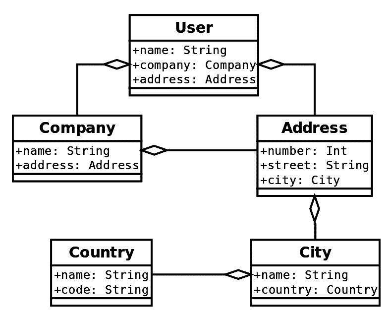

该图非常清晰，不需要太多解释。我们基本上有一个`User`类，其中包含有关用户的其他信息。其他类包含其他类，依此类推。如果我们不想修改任何内容，使用我们的类绝对没有任何挑战。然而，一旦我们开始修改某些内容，事情就会变得复杂。

# 没有透镜设计模式

在本节中，我们将看到如果我们要修改它们的某些属性，如何使用我们的类。

# 不可变和冗长

不深入细节，让我们看看一个示例应用程序将是什么样子：

```java
object UserVerboseExample {
  def main(args: Array[String]): Unit = {
    val uk = Country("United Kingdom", "uk")
    val london = City("London", uk)
    val buckinghamPalace = Address(1, "Buckingham Palace Road", london)
    val castleBuilders = Company("Castle Builders", buckinghamPalace)
    val switzerland = Country("Switzerland", "CH")
    val geneva = City("geneva", switzerland)
    val genevaAddress = Address(1, "Geneva Lake", geneva)
    val ivan = User("Ivan", castleBuilders, genevaAddress)
    System.out.println(ivan)
    System.out.println("Capitalize UK code...")
    val ivanFixed = ivan.copy(
 company = ivan.company.copy(
 address = ivan.company.address.copy(
 city = ivan.company.address.city.copy(
 country = ivan.company.address.city.country.copy(
 code = ivan.company.address.city.country.code.toUpperCase
 )
 )
 )
 )
 )
    System.out.println(ivanFixed)
  }
}
```

之前的应用程序为我们的库创建了一个用户，然后决定更改公司国家代码，就像我们最初用小写字母创建的那样。应用程序的输出如下：

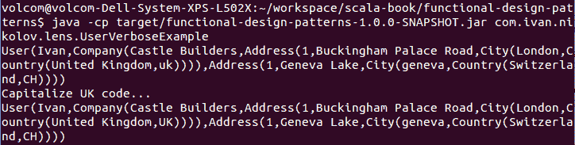

我们的应用程序运行正确，但正如你在高亮代码中所看到的，它非常冗长且容易出错。我们不希望编写这样的代码，因为这将是难以维护和未来更改的。

# 使用可变属性

可能首先出现在你脑海中的想法是更改类并使属性可变。以下是我们的案例类将如何改变：

```java
case class Country(var name: String, var code: String)
case class City(var name: String, var country: Country)
case class Address(var number: Int, var street: String, var city: City)
case class Company(var name: String, var address: Address)
case class User(var name: String, var company: Company, var address: Address)
```

在此之后，使用这些类将像这样简单：

```java
object UserBadExample {
  def main(args: Array[String]): Unit = {
    val uk = Country("United Kingdom", "uk")
    val london = City("London", uk)
    val buckinghamPalace = Address(1, "Buckingham Palace Road", london)
    val castleBuilders = Company("Castle Builders", buckinghamPalace)
    val switzerland = Country("Switzerland", "CH")
    val geneva = City("geneva", switzerland)
    val genevaAddress = Address(1, "Geneva Lake", geneva)
    val ivan = User("Ivan", castleBuilders, genevaAddress)
    System.out.println(ivan)
    System.out.println("Capitalize UK code...")
    ivan.company.address.city.country.code = ivan.company.address.city.country.code.toUpperCase
    System.out.println(ivan)
  }
}
```

在前面的代码示例中，我们也可以使用这种方式更改国家代码——`uk.code = uk.code.toUpperCase`。这将有效，因为我们使用`User`对象中的国家引用。

之前的示例将产生完全相同的输出。然而，在这里我们打破了 Scala 中一切都是不可变的规则。在当前示例中，这可能看起来不是什么大问题，但事实上，这与 Scala 的原则相悖。这被认为是糟糕的代码，我们应该尽量避免。

# 使用透镜设计模式

在前面的子节中，我们看到了改变嵌套类的一个属性会变得多么复杂。我们追求的是漂亮、干净和正确的代码，而且我们也不想违反 Scala 的原则。

幸运的是，我们之前提到的那些情况正是透镜设计模式被创造出来的原因。在本章中，我们将第一次在本书中介绍 Scalaz 库。它为我们定义了许多函数式编程抽象，我们可以轻松地直接使用它们，而不用担心它们是否遵循某些特定的规则。

那么，透镜究竟是什么呢？在这里，我们不会深入探讨理论方面，因为这超出了本书的范围。我们只需要知道它们是用来做什么的，如果你想要了解更多，网上有大量关于透镜、存储和单子的材料，这些材料可以使这些概念更加清晰。表示透镜的一个简单方法是以下内容：

```java
case class LensX, Y => X)
```

这基本上让我们能够获取和设置 `X` 类型对象的不同的属性。这意味着在我们的情况下，我们将不得不为想要设置的每个属性定义不同的镜头：

```java
import scalaz.Lens

object User {
  val userCompany = Lens.lensuUser, Company => u.copy(company = company), _.company
  )
  val userAddress = Lens.lensuUser, Address => u.copy(address = address), _.address
  )
  val companyAddress = Lens.lensuCompany, Address => c.copy(address = address), _.address
  )
  val addressCity = Lens.lensuAddress, City => a.copy(city = city), _.city
  )

  val cityCountry = Lens.lensuCity, Country => c.copy(country = country), _.country
  )
  val countryCode = Lens.lensuCountry, String => c.copy(code = code), _.code
  )
  val userCompanyCountryCode = userCompany >=> companyAddress >=> addressCity >=> cityCountry >=> countryCode
}
```

前面的代码是我们 `User` 类的伴随对象。这里有很多事情在进行中，所以我们将解释这一点。你可以看到对 `Lens.lensu[A, B]` 的调用。它们创建实际的镜头，以便对于 `A` 类型的对象，调用获取和设置 `B` 类型的值。实际上它们并没有什么特别之处，看起来就像模板代码。这里有趣的部分是高亮显示的代码——它使用了 `>=>` 操作符，这是 `andThen` 的别名。这允许我们组合镜头，这正是我们将要做的。我们将定义一个组合，允许我们从 `User` 对象通过链路设置 `Company` 的国家代码。我们也可以使用 `compose`，它的别名为 `<=<`，因为 `andThen` 内部调用 `compose`，它看起来如下：

```java
val userCompanyCountryCodeCompose = countryCode <=< cityCountry <=< addressCity <=< companyAddress <=< userCompany
```

然而，后者并不像前者那样直观。

现在使用我们的镜头非常简单。我们需要确保导入我们的伴随对象，然后我们可以简单地使用以下代码来将国家代码转换为大写：

```java
val ivanFixed = userCompanyCountryCode.mod(_.toUpperCase, ivan)
```

你看到了如何通过镜头设计模式，我们可以干净地设置我们的案例类的属性，而不违反不可变性规则。我们只需要定义正确的镜头，然后使用它们。

# 最小化模板代码

前面的例子显示了大量的模板代码。它并不复杂，但需要我们编写相当多的额外内容，并且任何重构都可能影响这些手动定义的镜头。已经有人努力创建库来自动为所有用户定义的类生成镜头，这样就可以轻松使用。一个似乎维护得很好的库示例是 Monocle：[`github.com/julien-truffaut/Monocle`](http://julien-truffaut.github.io/Monocle/)。它有很好的文档，可以用来确保我们不需要编写任何模板代码。尽管如此，它也有其局限性，用户应该确保他们接受库提供的内容。它还提供了其他可能有用的光学概念。

# 蛋糕设计模式

实际的软件项目通常会结合多个组件，这些组件必须一起使用。大多数时候，这些组件将依赖于其他组件，而这些组件又依赖于其他组件，依此类推。这使得在应用程序中创建对象变得困难，因为我们还需要创建它们依赖的对象，依此类推。这就是依赖注入派上用场的地方。

# 依赖注入

那么，依赖注入到底是什么呢？实际上它非常简单——任何在其构造函数中有一个对象作为参数的类实际上都是依赖注入的一个例子。原因是依赖被注入到类中，而不是在类内部实例化。开发者实际上应该尝试使用这种类型的做法，而不是在构造函数中创建对象。这样做有很多原因，但其中最重要的一个原因是组件可能会变得紧密耦合，实际上难以测试。

然而，如果使用构造函数参数来实现依赖注入，可能会降低代码质量。这将使构造函数包含大量的参数，因此使用构造函数将变得非常困难。当然，使用工厂设计模式可能会有所帮助，但还有其他在企业应用程序中更为常见的方法。在接下来的小节中，我们将简要介绍这些替代方案，并展示如何仅使用 Scala 的特性轻松实现依赖注入。

# 依赖注入库和 Scala

许多拥有 Java 背景的开发者可能已经熟悉一些著名的依赖注入库。一些流行的例子包括 Spring ([`spring.io/`](https://spring.io/)) 和 Guice ([`github.com/google/guice`](https://github.com/google/guice))。在 Spring 中，依赖通常在 XML 文件中管理，其中描述了依赖项，并且文件告诉框架如何创建实例以及将对象注入到类中。其中使用的术语之一是 bean。

另一方面，Guice 使用注解，然后这些注解会被评估并替换为正确的对象。这些框架相当流行，并且它们也可以很容易地在 Scala 中使用。那些熟悉 Play Framework 的人会知道，它正是使用 Guice 来连接事物的。

然而，使用外部库会增加项目的依赖项，增加 jar 文件的大小等等。如今，这并不是真正的问题。然而，正如我们已经看到的，Scala 是一种相当表达性的语言，我们可以不使用任何额外的库本地实现依赖注入。我们将在接下来的小节中看到如何实现这一点。

# Scala 中的依赖注入

为了在 Scala 中实现依赖注入，我们可以使用一种特殊的设计模式。它被称为蛋糕设计模式。不深入细节，让我们创建一个应用程序。我们创建的应用程序将需要有一系列相互依赖的类，这样我们就可以展示注入是如何工作的。

# 编写我们的代码

我们将创建一个应用程序，可以从数据库中读取有关人员、班级以及谁报名了哪些班级的数据。我们将有一个用户服务，它将使用数据实现一些简单的业务逻辑，并且还有一个将访问数据的服 务。这将会是一个小型应用程序，但它将清楚地展示依赖注入是如何工作的。

让我们从简单的事情开始。我们需要有一个模型来表示我们将要表示的对象：

```java
case class Class(id: Int, name: String)
case class Person(id: Int, name: String, age: Int)
```

在前面的代码中，我们有两个将在我们的应用程序中使用的类。它们没有什么特别之处，所以让我们继续前进。

我们说过，我们希望我们的应用程序能够从数据库中读取数据。有不同类型的数据库——MySQL、PostgreSQL、Oracle 等。如果我们想使用这些数据库中的任何一个，那么你需要安装一些额外的软件，这将需要额外的知识，并且可能会很棘手。幸运的是，有一个内存数据库引擎叫做 H2 ([`www.h2database.com/html/main.html`](https://www.h2database.com/html/main.html))，我们可以用它来代替。使用这个引擎就像在我们的 `pom.xml` 或 `build.sbt` 文件中添加一个依赖项，然后使用数据库一样。我们很快就会看到这一切是如何工作的。

此外，让我们让事情更有趣，并确保可以轻松地插入不同的数据库引擎。为了实现这一点，我们需要某种类型的接口，该接口将由不同的数据库服务实现：

```java
trait DatabaseService {
  val dbDriver: String
  val connectionString: String
  val username: String
  val password: String
  val ds = {
    JdbcConnectionPool.create(connectionString, username, password)
  }

  def getConnection: Connection = ds.getConnection
}
```

在前面的代码中，我们使用了一个特质，并且每当我们要创建一个 H2 数据库服务、Oracle 数据库服务等时，都会扩展这个特质。前面的代码中的所有内容似乎都很直接，不需要额外的解释。

vals 的顺序

在前面的代码中，变量定义的顺序很重要。这意味着如果我们首先声明了 `ds`，然后是其他所有内容，我们就会遇到一个 `NullPointerException`。这可以通过使用 `lazy val` 来轻松克服。

在我们的例子中，我们将实现一个针对 H2 数据库引擎的服务，如下所示：

```java
trait DatabaseComponent {
  val databaseService: DatabaseService

  class H2DatabaseService(val connectionString: String, val username: String, val password: String) extends DatabaseService {
    val dbDriver = "org.h2.Driver"
  }
}
```

数据库服务的实际实现是在嵌套的 `H2DatabaseService` 类中。它没有什么特别之处。但是，关于 `DatabaseComponent` 特质呢？很简单——我们希望有一个数据库组件，我们可以将其混合到我们的类中，并提供连接到数据库的功能。`databaseService` 变量被留为抽象的，并且当组件被混合时必须实现。

仅有一个数据库组件本身并没有什么用处。我们需要以某种方式使用它。让我们创建另一个组件，它将创建我们的数据库及其表，并用数据填充它们。显然，它将依赖于前面提到的数据库组件：

```java
trait MigrationComponent {
 this: DatabaseComponent =>

  val migrationService: MigrationService

  class MigrationService() {
    def runMigrations(): Unit = {
      val connection = databaseService.getConnection
      try {
        // create the database
        createPeopleTable(connection)
        createClassesTable(connection)
        createPeopleToClassesTable(connection)
        // populate
        insertPeople(
          connection,
          List(Person(1, "Ivan", 26), Person(2, "Maria", 25),
           Person(3, "John", 27))
        )
        insertClasses(
          connection,
          List(Class(1, "Scala Design Patterns"), Class(2,
           "JavaProgramming"), Class(3, "Mountain Biking"))
        )
        signPeopleToClasses(
          connection,
          List((1, 1), (1, 2), (1, 3), (2, 1), (3, 1), (3, 3))
        )
      } finally {
        connection.close()
      }
    }

    private def createPeopleTable(connection: Connection): Unit = {
      // implementation
    }

    private def createClassesTable(connection: Connection): Unit = {
      // implementation
    }

    private def createPeopleToClassesTable(connection: Connection):
    Unit = {
      // implementation
    }

    private def insertPeople(connection: Connection, people: List[Person]): Unit = {
      // implementation
    }

    // Other methods
  }

}
```

现在代码确实很多！但这并不令人害怕。让我们逐行分析，并尝试理解它。首先，我们遵循了之前的模式——创建了一个具有抽象变量的组件特质，在这个例子中，它被称为`migrationService`。我们不需要有多个不同的迁移，所以我们只需在组件特质内部创建一个类。

这里有趣的部分是我们突出显示的第一行——`this: DatabaseComponent =>`。这是什么意思？幸运的是，我们在书中已经见过这种语法了——它不过是一个**self 类型注解**。然而，它所做的确实很有趣——它告诉编译器，每次我们将`MigrationComponent`混入时，我们还需要将`DatabaseComponent`混入。这正是 Scala 知道迁移组件将依赖于数据库组件的拼图的一部分。因此，我们现在能够在第二行突出显示的代码中运行。如果我们仔细观察，它实际上访问了`databaseService`，这是`DatabaseComponent`的一部分。

在上一段代码中，我们跳过了大多数其他实现，但它们都很直接，与蛋糕设计模式无关。让我们看看其中的两个：

```java
private def createPeopleTable(connection: Connection): Unit = {
  val statement = connection.prepareStatement(
    """
      |CREATE TABLE people(
      | id INT PRIMARY KEY,
      | name VARCHAR(255) NOT NULL,
      | age INT NOT NULL
      |)
    """.stripMargin
  )
  try {
    statement.executeUpdate()
  } finally {
    statement.close()
  }
}

private def insertPeople(connection: Connection, people: List[Person]): Unit = {
  val statement = connection.prepareStatement(
    "INSERT INTO people(id, name, age) VALUES (?, ?, ?)"
  )
  try {
    people.foreach {
      case person =>
        statement.setInt(1, person.id)
        statement.setString(2, person.name)
        statement.setInt(3, person.age)
        statement.addBatch()
    }
    statement.executeBatch()
  } finally {
    statement.close()
  }
}
```

上一段代码只是创建表并将数据插入到表中的数据库代码。类中的其余方法类似，但它们在表定义和插入内容上有所不同。完整的代码可以在本书提供的示例中看到。在这里，我们只提取创建数据库模型的语句，以便您了解数据库的结构以及我们可以用它做什么：

```java
CREATE TABLE people(
  id INT PRIMARY KEY,
  name VARCHAR(255) NOT NULL,
  age INT NOT NULL
)

CREATE TABLE classes(
  id INT PRIMARY KEY,
  name VARCHAR(255) NOT NULL,
)

CREATE TABLE people_classes(
  person_id INT NOT NULL,
  class_id INT NOT NULL,

  PRIMARY KEY(person_id, class_id),
  FOREIGN KEY(person_id) REFERENCES people(id) ON DELETE CASCADE ON UPDATE CASCADE,
  FOREIGN KEY(class_id) REFERENCES classes(id) ON DELETE CASCADE ON UPDATE CASCADE
)
```

上一段代码中的迁移服务简单地创建数据库中的表，并将一些信息插入到这些表中，以便我们随后可以使用该服务。我们看到了这个迁移服务依赖于数据库服务，同时也看到了这种依赖是如何实现的。

仅通过这些课程，我们的应用程序将不会那么有用。我们需要能够与数据交互并对它进行一些有趣的操作。我们可以这样说，迁移组件只是确保我们拥有数据。在现实世界的场景中，我们可能已经有一个预先填充的数据库，我们需要与数据库中的内容进行工作。无论哪种情况，我们都需要有一个数据访问层来检索所需的数据。我们已经创建了以下组件：

```java
trait DaoComponent {
  this: DatabaseComponent =>
  val dao: Dao

  class Dao() {
    def getPeople: List[Person] = {
      // skipped
    }

    def getClasses: List[Class] = {
      // skipped
    }

    def getPeopleInClass(className: String): List[Person] = {
      val connection = databaseService.getConnection
      try {
        val statement = connection.prepareStatement(
          """
            |SELECT p.id, p.name, p.age
            |FROM people p
            | JOIN people_classes pc ON p.id = pc.person_id
            | JOIN classes c ON c.id = pc.class_id
            |WHERE c.name = ?
          """.stripMargin
        )
        statement.setString(1, className)
        executeSelect(statement) {
          rs =>
            readResultSet(rs) {
              row =>
                Person(row.getInt(1), row.getString(2), row.getInt(3))
            }
        }
      } finally {
        connection.close()
      }
    }

    private def executeSelectT(f: (ResultSet) => List[T]): List[T] =
      try {
        f(preparedStatement.executeQuery())
      } finally {
        preparedStatement.close()
      }

    private def readResultSetT(f: ResultSet => T): List[T] =
      Iterator.continually((rs.next(), rs)).takeWhile(_._1).map {
        case (_, row) => f(rs)
      }.toList
  }
}
```

这个`DaoComponent`在依赖方面与`DatabaseComponent`类似。它只是定义了用于检索数据的查询。我们跳过了简单的`select`语句。当然，它也可以定义更多用于插入、更新和删除的方法。它很好地隐藏了处理数据库数据的复杂性，现在我们实际上可以在我们的应用程序中创建一些有用的东西。

在企业应用程序中常见的是不同的服务可以访问数据库中的数据，对它执行一些业务逻辑，返回结果，并将其写回数据库。我们创建了一个简单的处理用户的服务：

```java
trait UserComponent {
  this: DaoComponent =>
  val userService: UserService

  class UserService {
    def getAverageAgeOfUsersInClass(className: String): Double = {
      val (ageSum, peopleCount) = dao.getPeopleInClass(className).foldLeft((0, 0)) {
          case ((sum, count), person) =>
            (sum + person.age, count + 1)
        }
      if (peopleCount != 0) {
        ageSum.toDouble / peopleCount.toDouble
      } else {
        0.0
      }
    }
  }
}
```

在我们的`UserComponent`中，我们遵循我们已知的相同模式，但这次我们的依赖是`DaoComponent`。然后我们可以有其他依赖此组件和其他组件的组件。我们没有在这里展示任何组件同时依赖多个组件的例子，但这并不难做到。我们只需使用以下方法：

```java
this: Component1 with Component2 with Component3 … =>
```

我们可以依赖尽可能多的组件，这就是蛋糕设计模式开始发光并显示其优势的地方。

# 连接所有组件

在前面的代码中，我们看到了一些组件及其实现，它们声明了对其他组件的依赖。我们还没有看到所有这些组件是如何一起使用的。通过将我们的组件定义为特质，我们只需将它们混合在一起，它们就会对我们可用。这就是我们这样做的方式：

```java
object ApplicationComponentRegistry
  extends UserComponent
    with DaoComponent
    with DatabaseComponent
    with MigrationComponent {
  override val dao: ApplicationComponentRegistry.Dao = new Dao
  override val databaseService: DatabaseService = new H2DatabaseService("jdbc:h2:mem:test;DB_CLOSE_DELAY=-1", "", "")
  override val migrationService: ApplicationComponentRegistry.MigrationService = new MigrationService
  override val userService: ApplicationComponentRegistry.UserService = new UserService
}
```

在前面的代码中，`ApplicationComponentRegistry`也可以是一个类，而不是 Scala 对象。它将组件混合在一起，由于每个组件都有一个抽象变量，它迫使我们为它们分配实际值。最棒的部分是，如果我们知道我们的应用程序需要`UserComponent`，编译器会告诉我们还需要`DaoComponent`，依此类推，直到链的末端。编译器基本上会确保我们在编译期间有完整的依赖链可用，并且它不会让我们运行应用程序，直到我们正确地完成了这些事情。这非常实用。在其他库中，情况并非如此，我们经常发现我们的依赖图在运行时没有正确构建。此外，这种方式连接组件确保我们只有一个实例。

如果我们用类而不是对象来表示`ApplicationComponentRegistry`，关于每个组件只有一个实例的声明不会自动成立。我们需要格外小心，否则注册表的每个实例可能会有不同的组件实例。

在我们创建组件注册表之后，我们可以轻松地在我们的应用程序中使用所有内容：

```java
object Application {

  import ApplicationComponentRegistry._

  def main(args: Array[String]): Unit = {
    migrationService.runMigrations()
    System.out.println(dao.getPeople)
    System.out.println(dao.getClasses)
    System.out.println(dao.getPeopleInClass("Scala Design Patterns"))
    System.out.println(dao.getPeopleInClass("Mountain Biking"))
    System.out.println(s"Average age of everyone in Scala Design Patterns: ${userService.getAverageAgeOfUsersInClass("Scala Design Patterns")}")
  }
}
```

在前面的代码中，我们简单地从注册表中导入了所有内容，然后使用了它。该应用程序的输出如下截图所示：

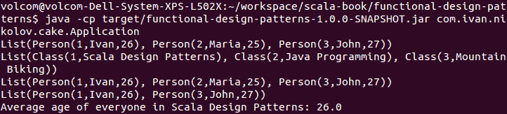

这就是使用 Scala 中的蛋糕设计模式有多简单。

# 对我们的应用程序进行单元测试

测试是每个应用程序的重要部分。我们需要确保我们添加的更改不会对我们的系统其他部分产生负面影响，并且每个单元都表现正确。使用蛋糕设计模式进行测试也非常简单。

蛋糕设计模式允许我们轻松地创建不同的环境。这就是为什么我们可以创建以下测试环境：

```java
trait TestEnvironment
  extends UserComponent
    with DaoComponent
    with DatabaseComponent
    with MigrationComponent
    with MockitoSugar {
  override val dao: Dao = mock[Dao]
  override val databaseService: DatabaseService = mock[DatabaseService]
  override val migrationService: MigrationService = mock[MigrationService]
  override val userService: UserService = mock[UserService]
}
```

上述代码简单地包含了每个组件，并使用 Mockito 模拟了每个服务。让我们使用我们的新测试环境为我们的`UserComponent`编写一个测试类：

```java
class UserComponentTest extends FlatSpec with Matchers with MockitoSugar with TestEnvironment {
  val className = "A"
  val emptyClassName = "B"
  val people = List(
    Person(1, "a", 10),
    Person(2, "b", 15),
    Person(3, "c", 20)
  )
  override val userService = new UserService

  when(dao.getPeopleInClass(className)).thenReturn(people)
  when(dao.getPeopleInClass(emptyClassName)).thenReturn(List())

  "getAverageAgeOfUsersInClass" should "properly calculate the average of all ages." in {
    userService.getAverageAgeOfUsersInClass(className) should equal(15.0)
  }

  it should "properly handle an empty result." in {
    userService.getAverageAgeOfUsersInClass(emptyClassName) should equal(0.0)
  }
}
```

在上述代码中，我们覆盖了`userService`以使用实际实现，然后我们使用它进行测试。我们使用 Mockito 来模拟我们的数据库访问，然后我们简单地编写一个测试来检查一切是否正常工作。我们已经决定模拟我们的数据库访问。然而，在某些情况下，人们有测试数据库或使用 H2 进行测试。使用我们的测试环境，我们有灵活性去做我们决定的事情。

运行我们之前编写的测试可以通过`mvn clean test`或`sbt test`命令实现。

我们的测试环境允许我们在测试中启用我们想要的任何组件。我们可以在我们的测试类中简单地覆盖多个这样的组件。

# 其他依赖注入替代方案

关于我们之前提出的蛋糕设计模式的一个问题是我们需要编写的样板代码量，以便正确地连接一切。在大型应用程序中，这可能会成为一个问题，因此有其他替代方案可以用来处理这个问题。我们在这里简要讨论一下。

# 依赖注入的隐式参数

使用隐式参数是消除蛋糕设计模式中组件特性和 self 类型注解要求的一种方法。然而，隐式参数会迅速使方法定义复杂化，因为每个方法都必须声明它所依赖的任何组件的隐式参数。

# 依赖注入的 Reader monad

`Reader` monad 在 Scalaz 库中可用。依赖注入与它的结合方式是，我们让每个方法返回一个被`Reader` monad 包装的函数，例如：

```java
def getAverageAgeOfUsersInClass(className: String) =
  Reader((userService: UserService) => userService.getAverageAgeOfUsersInClass(className))
```

在上述代码中，我们只向用户公开了`getAverageAgeOfUsersInClass(className: String)`。通常，对于 monads，计算在这里构建，但直到最后一刻才执行。我们可以构建复杂的操作，使用`map`、`flatMap`和 for comprehensions。我们推迟注入依赖，直到最后一刻，那时我们可以在需要实际组件或组件的 reader 上简单地调用`apply`。前面的解释可能听起来有点抽象，但事情实际上非常简单，可以在网上许多地方看到。

在某些情况下，这种方法与蛋糕设计模式一起使用。

# 修改我的库设计模式

在我们作为开发者的日常工作中，我们经常使用不同的库。然而，它们通常被设计成通用的，允许许多人使用它们，因此有时我们需要做一些额外的工作，以适应我们的特定用例，以便使事情能够正常工作。我们无法真正修改原始库代码的事实意味着我们必须采取不同的方法。我们已经探讨了装饰器和适配器设计模式。好吧，改进我的库模式实现了类似的功能，但它以 Scala 的方式实现，并且一些额外的工作交由编译器处理。

改进我的库设计模式在 C#中的扩展方法非常相似。我们将在以下小节中看到一些示例。

# 使用改进我的库

改进我的库设计模式非常容易使用。让我们看看一个例子，我们想在标准`String`类中添加一些有用的方法。当然，我们无法修改其代码，因此我们需要做些其他事情：

```java
package object pimp {
  implicit class StringExtensions(val s: String) extends AnyVal {
    def isAllUpperCase: Boolean =
      !(0 until s.length).exists {
        case index =>
          s.charAt(index).isLower
      }
  }
}
```

在上述代码中，我们有一个包对象。它为我们提供了便利，使我们能够不进行任何额外操作就能从同一包中的类访问其成员。它可以是简单的对象，但那时我们将不得不`import ObjectName._`以获得对成员的访问。

上述对象只是一个细节，与设计模式无关。改进我的库代码是内部类。关于这一点有几个重要的事项：

+   它是隐式的

+   它扩展了`AnyVal`

这些特性使我们能够编写以下应用程序：

```java
object PimpExample {
  def main(args: Array[String]): Unit = {
    System.out.println(s"Is 'test' all upper case:
     ${"test".isAllUpperCase}")
    System.out.println(s"Is 'Tes' all upper case:
     ${"Test".isAllUpperCase}")
    System.out.println(s"Is 'TESt' all upper case:
     ${"TESt".isAllUpperCase}")
    System.out.println(s"Is 'TEST' all upper case:
     ${"TEST".isAllUpperCase}")
  }
}
```

我们基本上向标准字符串添加了一个扩展方法，用于检查整个字符串是否为大写。我们唯一需要做的是确保隐式类在我们想要使用其定义的方法的作用域内可用。

上述应用程序的输出如下所示：

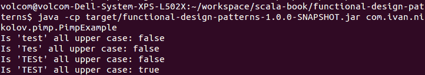

在我们的例子中，我们不需要编写在扩展类中包装字符串的代码。我们的代码将类型显示为普通字符串；然而，我们可以对其进行额外的操作。此外，装饰器设计模式在尝试装饰的类是 final 的情况下会受到影响。在这里，没有问题。再次强调，所有魔法都发生因为我们有一个隐式类，Scala 编译器会自动确定它可以根据我们调用的方法来包装和展开字符串。

我们当然可以向`StringExtensions`类添加更多方法，并且它们将对所有可用的隐式类中的字符串可用。我们还可以添加其他类：

```java
implicit class PersonSeqExtensions(val seq: Iterable[Person]) extends AnyVal {
  def saveToDatabase(): Unit = {
    seq.foreach {
      case person =>
        System.out.println(s"Saved: ${person} to the database.")
    }
  }
}
```

上述代码能够将整个`Person`类型的集合保存到数据库中（尽管在示例中我们只是将集合打印到标准输出）。为了完整性，我们的`Person`模型类定义如下：

```java
case class Person(name: String, age: Int)
```

使用新的扩展方法与早期的扩展方法类似：

```java
object PimpExample2 {
  def main(args: Array[String]): Unit = {
    val people = List(
      Person("Ivan", 26),
      Person("Maria", 26),
      Person("John", 25)
    )
    people.saveToDatabase()
  }
}
```

上述示例将产生预期的结果，如下所示：

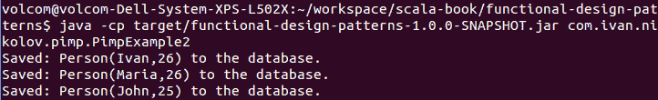

如果需要并且合理，我们也可以将改进我的库设计模式应用于我们的自定义类。

# 真实生活中的改进我的库

如前所述，改进我的库设计模式极其容易使用。这很常见，尤其是在需要装饰器或适配器设计模式时。我们当然可以找出处理问题的方法，但事实上，它帮助我们避免样板代码。它也真正有助于使我们的代码更易于阅读。最后但同样重要的是，它可以用来简化特定库的使用。

# 可堆叠特性设计模式

有时候，我们希望能够为类的某个方法提供不同的实现。我们甚至可能不知道在编写时所有可能存在的可能性，但我们可以在以后添加它们，并将它们组合起来，或者我们可以允许其他人来做这件事。这是装饰器设计模式的一个用例，为了这个目的，它可以与可堆叠特性设计模式一起实现。我们在这本书的第七章中已经看到了这个模式，*结构型设计模式*，但我们用它来读取数据，这在那里增加了一个非常重要的限制。在这里，我们将看到另一个例子，以确保一切完全清楚。

# 使用可堆叠特性

可堆叠特性设计模式基于混入组合——这是我们在这本书的前几章中熟悉的。我们通常有一个定义接口、基本实现和扩展抽象类以在其上堆叠修改的抽象类或特性。

对于我们的例子，让我们实现以下图示：

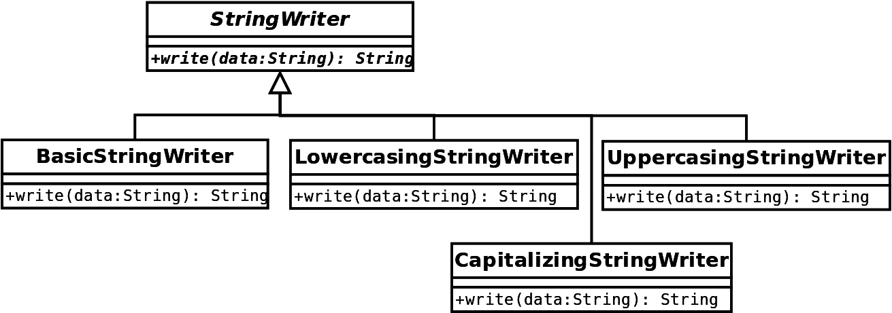

上述图示是一个非常简单的应用程序。我们有一个基本的`StringWriter`类，它有一个基本实现（`BasicStringWriter`），它只是返回一个包含字符串的消息。在右侧，我们有可以添加可堆叠修改的`StringWriter`特性的特性。

让我们看看以下代码：

```java
abstract class StringWriter {
  def write(data: String): String
}

class BasicStringWriter extends StringWriter {
  override def write(data: String): String =
    s"Writing the following data: ${data}"
}
```

上述代码是抽象类和基本实现。这些没有什么特别之处。现在，让我们看看可堆叠特性：

```java
trait CapitalizingStringWriter extends StringWriter {
  abstract override def write(data: String): String = {
    super.write(data.split("\\s+").map(_.capitalize).mkString(""))
  }
}

trait UppercasingStringWriter extends StringWriter {
  abstract override def write(data: String): String = {
    super.write(data.toUpperCase)
  }
}

trait LowercasingStringWriter extends StringWriter {
  abstract override def write(data: String): String = {
    super.write(data.toLowerCase)
  }
}
```

上述代码中的全部魔法都是因为方法上的`abstract override`修饰符。它允许我们在`super`类的抽象方法上调用`super`。否则这将失败，但在这里，它只需要我们将特性与一个实现了`write`的类或特性混合。如果我们不这样做，我们就无法编译我们的代码。

让我们看看我们特性的一个示例用法：

```java
object Example {
  def main(args: Array[String]): Unit = {
    val writer1 = new BasicStringWriter
      with UppercasingStringWriter
      with CapitalizingStringWriter
    val writer2 = new BasicStringWriter
      with CapitalizingStringWriter
      with LowercasingStringWriter
    val writer3 = new BasicStringWriter
      with CapitalizingStringWriter
      with UppercasingStringWriter
      with LowercasingStringWriter
    val writer4 = new BasicStringWriter
      with CapitalizingStringWriter
      with LowercasingStringWriter
      with UppercasingStringWriter
    System.out.println(s"Writer 1: '${writer1.write("we like learning
     scala!")}'")
    System.out.println(s"Writer 2: '${writer2.write("we like learning
     scala!")}'")
    System.out.println(s"Writer 3: '${writer3.write("we like learning
     scala!")}'")
    System.out.println(s"Writer 4: '${writer4.write("we like learning
     scala!")}'")
  }
}
```

在前面的代码中，我们只是通过混入组合将修改堆叠在一起。在当前示例中，它们只是说明性的，并没有做任何智能的事情，但现实中我们可以有提供强大修改的变体。以下图显示了我们的示例输出：

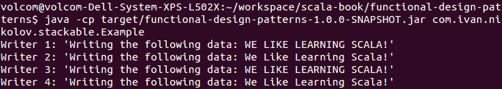

我们代码中的修改将取决于它们应用的顺序。例如，如果我们首先将所有内容转换为大写，那么大写化将没有任何效果。让我们看看代码和相关的输出，并尝试找出修改是如何应用的。如果你查看所有示例和输出，你会发现修改是按照我们混合特性的顺序从右到左应用的。

如果我们回顾第七章中的示例，*结构设计模式*，然而，我们会看到实际的修改是相反的。原因是每个特性都会调用`super.readLines`然后映射。嗯，这实际上意味着我们将调用堆栈上的调用，直到我们到达基本实现，然后我们将返回去做所有的映射。所以，在第七章中，*结构设计模式*，修改也是从右到左应用的，但由于我们只是获取输出而不传递任何东西，所以事情是按照从左到右的顺序应用的。

可堆叠特性执行顺序

可堆叠特性总是从右边的混入到左边执行。然而，有时如果我们只获取输出并且它不依赖于传递给方法的内容，我们最终会在堆栈上得到方法调用，然后这些调用将被评估，看起来就像是从左到右应用的一样。

理解前面的解释对于使用可堆叠特性非常重要。它实际上完美地匹配我们在第二章中关于线性化的观察，*特性和混入组合*。

# 类型类设计模式

在我们编写软件的许多时候，我们会遇到不同实现之间的相似性。良好的代码设计的一个重要原则是避免重复，这被称为**不要重复自己**（**DRY**）。有多种方法可以帮助我们避免重复——继承、泛型等等。

确保我们不重复自己的一个方法是通过类型类。

类型类的目的是通过类型必须支持的操作来定义一些行为，以便被认为是类型类的成员。

一个具体的例子是`Numeric`。我们可以这样说，它是一个类型类，并为`Int`、`Double`以及其他类似类定义了操作——加法、减法、乘法等等。实际上，我们已经在本书的第四章中遇到过类型类，*抽象和自类型*。类型类是允许我们实现特定多态的。

# 类型类示例

让我们看看一个实际例子，这个例子对开发者来说也有些有用。在机器学习中，开发者往往在他们的工作中经常使用一些统计函数。有统计库，如果我们尝试它们，我们会看到这些函数对不同数值类型——`Int`、`Double`等等——都是存在的。现在，我们可以想出一个简单的方法，为所有我们认为的数值类型实现这些函数。然而，这是不可行的，并使得我们的库无法扩展。此外，统计函数的定义对于任何类型都是相同的，所以我们不希望像数值类型那么多地重复我们的代码。

所以让我们首先定义我们的类型类：

```java
trait Number[T] {
  def plus(x: T, y: T): T
  def minus(x: T, y: T): T
  def divide(x: T, y: Int): T
  def multiply(x: T, y: T): T
  def sqrt(x: T): T
}
```

前面只是一个定义了一些需要数字支持的操作的特质的例子。

Scala 中的 Numeric

Scala 编程语言有一个`Numeric`特质，它定义了许多前面提到的操作。

如果我们在前面的代码中使用了`Numeric`特质，我们可以节省一些代码编写，但为了这个例子，让我们使用我们的自定义类型。

在我们定义了一个数字的特质之后，我们现在可以按照以下方式编写我们的库：

```java
object Stats {
  // same as
  // def meanT(implicit ev: Number[T]): T =
  // ev.divide(xs.reduce(ev.plus(_, _)), xs.size)
  def meanT: Number: T =
    implicitly[Number[T]].divide(
      xs.reduce(implicitly[Number[T]].plus(_, _)),
      xs.size
    )

  // assumes the vector is sorted
  def medianT: Number: T =
    xs(xs.size / 2)

  def varianceT: Number: T = {
    val simpleMean = mean(xs)
    val sqDiff = xs.map {
      case x =>
        val diff = implicitly[Number[T]].minus(x, simpleMean)
        implicitly[Number[T]].multiply(diff, diff)
    }
    mean(sqDiff)
  }

  def stddevT: Number: T =
    implicitly[Number[T]].sqrt(variance(xs))
}
```

在前面的例子中有很多代码。定义函数相当直接。然而，让我们解释一下`implicitly`关键字的作用。它使用 Scala 中的所谓**上下文界限**，这是允许我们实现类型类设计模式的关键部分。为了使用前面的方法，它需要一个类型类成员`Number`对于`T`类型是隐式可用的。正如你在`mean`上面的注释中可以看到的，我们还可以为方法提供一个隐式参数。

现在，让我们编写一些示例代码，这些代码将使用前面提到的方法：

```java
import Stats._

object StatsExample {
  def main(args: Array[String]): Unit = {
    val intVector = Vector(1, 3, 5, 6, 10, 12, 17, 18, 19, 30, 36, 40, 42, 66)
    val doubleVector = Vector(1.5, 3.6, 5.0, 6.6, 10.9, 12.1, 17.3, 18.4, 19.2, 30.9, 36.6, 40.2, 42.3, 66.0)
    System.out.println(s"Mean (int): ${mean(intVector)}")
    System.out.println(s"Median (int): ${median(intVector)}")
    System.out.println(s"Std dev (int): ${stddev(intVector)}")
    System.out.println(s"Mean (double): ${mean(doubleVector)}")
    System.out.println(s"Median (double): ${median(doubleVector)}")
    System.out.println(s"Std dev (double): ${stddev(doubleVector)}")
  }
}
```

编译前面的代码现在将不会成功，我们会看到类似于以下错误的错误：

```java
Error:(9, 44) could not find implicit value for evidence parameter of type com.ivan.nikolov.type_classes.Number[Int]
    System.out.println(s"Mean (int): ${mean(intVector)}")
                                            ^
```

原因是我们还没有为`Int`和`Double`定义任何隐式可用的`Number`成员。让我们在`Number`特质的伴随对象中定义它们：

```java
import Math.round

object Number {
  implicit object DoubleNumber extends Number[Double] {
    override def plus(x: Double, y: Double): Double = x + y
    override def divide(x: Double, y: Int): Double = x / y
    override def multiply(x: Double, y: Double): Double = x * y
    override def minus(x: Double, y: Double): Double = x - y
    override def sqrt(x: Double): Double = Math.sqrt(x)
  }

  implicit object IntNumber extends Number[Int] {
    override def plus(x: Int, y: Int): Int = x + y
    override def divide(x: Int, y: Int): Int = round(x.toDouble / y.toDouble).toInt
    override def multiply(x: Int, y: Int): Int = x * y
    override def minus(x: Int, y: Int): Int = x - y
    override def sqrt(x: Int): Int = round(Math.sqrt(x)).toInt
  }
}
```

现在，我们的代码将成功编译。但是当我们刚刚在一个完全不同的文件中的伴随对象中定义了这些隐式值时，整个事情是如何工作的呢？首先，我们的嵌套对象是隐式的，其次，它们在伴随对象中是可用的。

在伴随对象中定义你的默认类型类成员

隐式类型类参数的伴随对象是编译器最后查找隐式值的地方。这意味着不需要做任何额外的事情，用户可以轻松地覆盖我们的实现。

我们现在可以轻松地运行我们的代码：

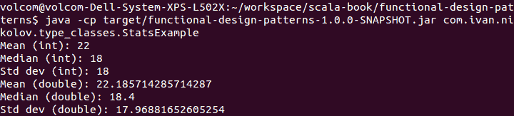

当然，我们可以将我们的隐式值放在我们想要的地方。然而，如果它们不在伴随对象中，我们就必须进行额外的导入，以便使它们可用。

# 类型类设计模式替代方案

当然，类型类设计模式有替代方案。我们可以使用适配器设计模式。然而，这将使我们的代码难以阅读，因为事物将始终被包装，并且将更加冗长。类型类设计模式利用了 Scala 类型系统的良好特性。

看看我们前面的代码，我们还可以看到有很多样板代码。在更大的项目或尝试定义更复杂的类型类时，这可能会成为问题。一个专门编写来处理这些问题的库可以在[`github.com/mpilquist/simulacrum/`](https://github.com/mpilquist/simulacrum/)找到。

# 懒加载

编写高效的代码是软件工程的重要组成部分。很多时候，我们会看到由于不同的可能原因，表达式评估成本高昂的情况——数据库访问、复杂计算等等。在某些情况下，我们甚至可以在不评估这些昂贵表达式的情况下退出应用程序。这就是懒加载变得有帮助的地方。

懒加载确保表达式仅在真正需要时才被评估一次。

Scala 支持几种懒加载方式——懒变量和按名参数。在这本书中，我们已经看到了这两种方式：前者是在我们查看第六章的创建型设计模式时看到的，即*创建型设计模式*，特别是懒初始化。后者我们在几个地方都看到了，但第一次是在第八章*行为设计模式 - 第一部分*中遇到的，我们向您展示了如何以更接近 Scala 的方式实现命令设计模式。

懒变量和按名参数之间存在一个重要的区别。懒变量只计算一次，而按名参数每次在方法中引用时都会计算。这里有一个非常简单的技巧我们将展示，这将解决这个问题。

# 只计算一次按名参数

让我们设想我们有一个从数据库中获取人员数据的程序。读取操作是一种昂贵的操作，是懒加载的良好候选者。在这个例子中，我们将简单地模拟从数据库中读取。首先，我们的模型将尽可能简单，如下所示：

```java
case class Person(name: String, age: Int)
```

现在，让我们创建一个伴随对象，它将有一个模拟从数据库获取人员数据的方法：

```java
object Person {
  def getFromDatabase(): List[Person] = {
    // simulate we're getting people from database by sleeping
    System.out.println("Retrieving people...")
    Thread.sleep(3000)
    List(
      Person("Ivan", 26),
      Person("Maria", 26),
      Person("John", 25)
    )
  }
}
```

之前的代码只是让当前线程休眠三秒钟并返回一个静态结果。多次调用`getFromDatabase`方法会使我们的应用程序变慢，因此我们应该考虑惰性评估。现在，让我们向我们的伴随对象添加以下方法：

```java
def printPeopleBad(people: => List[Person]): Unit = {
  System.out.println(s"Print first time: ${people}")
  System.out.println(s"Print second time: ${people}")
}
```

如您所见，我们简单地打印了两次关于人员的数据列表，并且两次访问了按名称参数。这是不好的，因为它将评估函数两次，我们不得不等待两倍的时间。让我们写另一个版本来解决这个问题：

```java
def printPeopleGood(people: => List[Person]): Unit = {
  lazy val peopleCopy = people
  System.out.println(s"Print first time: ${peopleCopy}")
  System.out.println(s"Print second time: ${peopleCopy}")
}
```

这次，我们将按名称参数分配给`lazy val`，然后使用它。这将只评估一次按名称参数，而且，如果我们最终没有使用它，它将根本不会评估。

让我们看看一个例子：

```java
object Example {

  import Person._

  def main(args: Array[String]): Unit = {
    System.out.println("Now printing bad.")
    printPeopleBad(getFromDatabase())
    System.out.println("Now printing good.")
    printPeopleGood(getFromDatabase())
  }
}
```

如果我们运行这个应用程序，我们将看到以下输出：

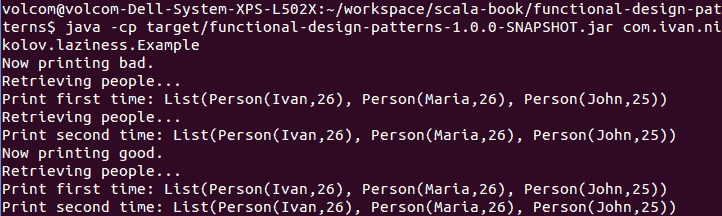

如您从程序输出中可以看到，我们方法的第一个版本检索了按名称参数值两次，而第二个版本只检索了一次。在第二个方法中使用`lazy val`的事实也意味着如果我们实际上没有使用它，我们可能根本不会评估我们的昂贵表达式。

# 替代惰性评估

在 Scala 中实现惰性求值还有另一种方法。这是通过使用匿名函数并利用函数是 Scala 中统一的一部分以及我们可以轻松地将它们作为参数传递的事实来实现的。这样做的方式如下——一个值被表示为`() => value`而不是仅仅是值本身。然而，这有点没有意义，尤其是因为我们已经有了两种可以做到很多事情的机制。使用匿名函数进行惰性求值是不推荐的。

将一个函数传递给一个方法也可以被认为是一种惰性评估一些数据的方式。然而，这可能是有用的，不应该与我们在匿名函数中提到的内容混淆。

# 部分函数

在数学中，以及作为结果在编程中，有一些函数并不是对所有可能的输入都定义的。一个简单的例子是平方根函数——它只对非负实数有效。在本节中，我们将探讨部分函数以及我们如何使用它们。

# 部分函数不是部分应用函数

关于部分函数是什么以及不是什么似乎存在一些混淆。重要的是你要明白，这些函数不是部分应用函数。部分应用函数只是可能接受多个参数的函数，我们指定了一些参数，然后它们返回具有较少参数的函数，我们可以指定这些参数。还有一个与部分应用函数相关的术语——**柯里化函数**。在功能方面，它们提供相同的功能。让我们快速看一个例子：

```java
/**
  * Note that these are not partially defined functions!
  */
object PartiallyAppliedFunctions {
  val greaterOrEqual = (a: Int, b: Int) => a >= b
  val lessOrEqual = (a: Int, b: Int) => a <= b

  def greaterOrEqualCurried(b: Int)(a: Int) = a >= b

  def lessOrEqualCurried(b: Int)(a: Int) = a <= b

  val greaterOrEqualCurriedVal: (Int) => (Int) => Boolean = b => a => a >= b
  val lessOrEqualCurriedVal: (Int) => (Int) => Boolean = b => a => a <= b
}
```

在前面的代码中，我们对大于和小于或等于函数有不同的定义。首先，我们将它们作为普通函数。第二种版本是带有多个参数列表的，最后一个是实际的柯里化函数。以下是它们的用法：

```java
object PartiallyAppliedExample {

  import PartiallyAppliedFunctions._

  val MAX = 20
  val MIN = 5

  def main(args: Array[String]): Unit = {
    val numbers = List(1, 5, 6, 11, 18, 19, 20, 21, 25, 30)
    // partially applied
    val ge = greaterOrEqual(_: Int, MIN)
    val le = lessOrEqual(_: Int, MAX)
    // curried
    val geCurried = greaterOrEqualCurried(MIN) _
    val leCurried = lessOrEqualCurried(MAX) _
    // won't work because of the argument order
    // val geCurried = greaterOrEqual.curried(MIN)
    // val leCurried = lessOrEqual.curried(MAX)
    // will work normally
    // val geCurried = greaterOrEqualCurriedVal(MIN)
    // val leCurried = lessOrEqualCurriedVal(MAX)
    System.out.println(s"Filtered list: ${numbers.filter(i => ge(i) && le(i))}")
    System.out.println(s"Filtered list: ${numbers.filter(i => geCurried(i) && leCurried(i))}")
  }
}
```

我们使用部分应用函数的方式如下：

```java
greaterOrEqual(_: Int, MIN)
```

这将返回一个从 `Int` 到 `Boolean` 的函数，我们可以用它来检查参数是否大于或等于 `MIN` 值。这是一个部分应用函数。

对于这些函数的柯里化版本，正如你所见，我们已经交换了参数。原因是柯里化函数只是一系列的单参数函数，参数按照我们看到的顺序应用。`greaterOrEqualCurried(MIN)` 这行代码部分应用了函数，并返回了一个我们可以像上面一样使用的柯里化函数。正如代码注释中所示，我们可以将任何多参数函数转换为柯里化函数。`greaterOrEqual` 和 `lessOrEqual` 在我们的例子中不工作是因为参数是按照它们出现的顺序应用的。最后，我们在 `greaterOrEqualCurriedVal` 和 `lessOrEqualCurriedVal` 中有一个纯柯里化版本。当我们部分应用具有多个参数列表的函数时，返回这种类型的函数。

如果我们运行前面的例子，我们将看到以下输出：

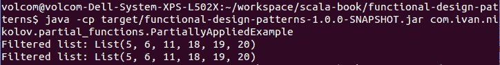

选择是否使用部分应用函数或柯里化函数取决于许多因素，包括个人偏好。在两种情况下，我们可以用稍微不同的语法达到相同的目标。正如你所见，我们可以使用 `.curried` 从普通函数到柯里化函数转换。我们也可以使用 `Function.uncurried` 调用并传递函数来实现相反的操作。当柯里化函数链中包含多个函数时，这个调用是有意义的。

使用部分应用函数进行依赖注入

由于部分应用函数和柯里化函数的工作方式，我们可以将它们用于依赖注入。我们基本上可以将依赖项应用到函数上，然后得到另一个函数，我们可以在之后使用它。

# 部分定义的函数

我们已经说过，部分函数只为函数可能得到的所有可能值的一个特定子集定义。这非常有用，因为我们基本上可以同时执行`filter`和`map`。这意味着更少的 CPU 周期和更易读的代码。让我们看看一个例子：

```java
object PartiallyDefinedFunctions {
  val squareRoot: PartialFunction[Int, Double] = {
    case a if a >= 0 => Math.sqrt(a)
  }
}
```

我们定义了一个从`Int`到`Double`的部分函数。它检查一个数字是否为非负数，并返回该数字的平方根。这个部分函数可以这样使用：

```java
object PartiallyDefinedExample {

  import PartiallyDefinedFunctions._

  def main(args: Array[String]): Unit = {
    val items = List(-1, 10, 11, -36, 36, -49, 49, 81)
    System.out.println(s"Can we calculate a root for -10:
     ${squareRoot.isDefinedAt(-10)}")
    System.out.println(s"Square roots: ${items.collect(squareRoot)}")
  }
}
```

我们使用了接受部分函数的`collect`方法。我们还展示了部分函数的一个方法——`isDefinedAt`，其名称确切地告诉我们它做什么。我们程序的输出将是这样的：

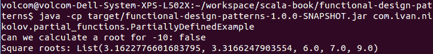

我们的部分函数过滤掉了负数，并返回了其余数的平方根。

部分函数也可以用来链式操作，或者在某个操作不可行时执行不同的操作。它们有`orElse`、`andThen`、`runWith`等这样的方法。从它们的名字就可以清楚地知道前两种方法的作用。第三种方法使用部分应用函数的结果并执行可能产生副作用的行为。让我们看看`orElse`的一个例子：

```java
val square: PartialFunction[Int, Double] = {
  case a if a < 0 => Math.pow(a, 2)
}
```

首先，我们定义另一个部分函数，它对负数进行平方。然后，我们可以在我们的例子中添加一些额外的代码：

```java
object PartiallyDefinedExample {

  import PartiallyDefinedFunctions._

  def main(args: Array[String]): Unit = {
    val items = List(-1, 10, 11, -36, 36, -49, 49, 81)
    System.out.println(s"Can we calculate a root for -10:
     ${squareRoot.isDefinedAt(-10)}")
    System.out.println(s"Square roots: ${items.collect(squareRoot)}")
    System.out.println(s"Square roots or squares:
     ${items.collect(squareRoot.orElse(square))}")
  }
}
```

这将产生以下输出：

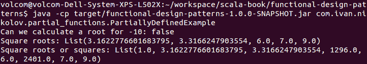

我们基本上会对负数进行平方，对正数进行平方根。从我们在本例中进行的操作的角度来看，这可能没有太多意义，但它展示了我们如何链式使用部分函数。如果我们结合不同的部分函数后，最终覆盖了整个可能的输入空间，那么使用模式匹配和普通函数可能更有意义。然而，如果我们没有匹配所有可能的值，我们可能会得到运行时异常。

# 隐式注入

我们已经在本书的几个地方看到了隐式转换。我们在类型类设计模式和“改进我的库”设计模式中使用了它们，我们还提到它们可以用于依赖注入。隐式转换也用于从一种类型到另一种类型的无声转换。

它们只是编译器所知的某些对象、值或方法，编译器会为我们将它们注入到需要它们的方法或位置。我们需要确保的是，使这些隐式转换对将使用它们的方法的作用域可用。

# 隐式转换

我们已经提到，隐式转换可以用于无声转换。有时，可能有用能够将`Double`赋值给`Int`而不出错。在其他时候，我们可能想要将一个类型的对象包装到另一个类型中，并利用新类型提供的方法：

```java
package object implicits {
  implicit def doubleToInt(a: Double): Int = Math.round(a).toInt
}
```

在前面的代码列表中，我们有一个包对象定义了一个方法，该方法将`Double`转换为`Int`。这将允许我们编写并成功编译以下代码：

```java
object ImplicitExamples {
  def main(args: Array[String]): Unit = {
    val number: Int = 7.6
    System.out.println(s"The integer value for 7.6 is ${number}")
  }
}
```

只要`ImplicitExamples`对象与我们的包对象在同一个包中，我们就不需要做任何额外的事情。另一种选择是在对象内部定义我们的隐式转换，并在我们需要它的作用域中导入该对象。

我们甚至可以将类型包裹在新的对象中。Scala 中的`LowPriorityImplicits`类中有一些示例，可以将字符串转换为序列等。现在，让我们添加一个将`Int`列表转换为`String`的隐式转换：

```java
implicit def intsToString(ints: List[Int]): String = ints.map(_.toChar).mkString
```

现在，我们可以使用我们的隐式转换来打印一个 ASCII 字符码列表作为`String`：

```java
object ImplicitExamples {
  def main(args: Array[String]): Unit = {
    val number: Int = 7.6
    System.out.println(s"The integer value for 7.6 is ${number}")
    // prints HELLO!
    printAsciiString(List(72, 69, 76, 76, 79, 33))
  }

  def printAsciiString(s: String): Unit = {
    System.out.println(s)
  }
}
```

运行这个示例将产生以下输出：

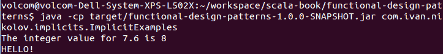

我们可能需要隐式转换的有很多有用的东西。它们可以帮助我们很好地分离代码，但我们应该小心不要过度使用它们，因为调试可能会变得困难，代码的可读性可能会受到影响。

# 使用隐式转换进行依赖注入

当我们展示了使用蛋糕设计模式的依赖注入时，我们还提到可以使用隐式转换来实现它。想法是服务在一个地方创建，然后我们可以编写需要服务的隐式方法。到现在为止，你应该已经获得了足够的知识，能够独立找到正确的解决方案，所以这里我们只展示之前的大例子的一部分：

```java
case class Person(name: String, age: Int)
```

在我们定义了一个模型之后，我们可以创建一个`DatabaseService`，如下所示：

```java
trait DatabaseService {
  def getPeople(): List[Person]
}

class DatabaseServiceImpl extends DatabaseService {
  override def getPeople(): List[Person] = List(
    Person("Ivan", 26),
    Person("Maria", 26),
    Person("John", 25)
  )
}
```

我们的数据库服务不依赖于任何东西。它只是模拟从数据库中读取某些内容。现在，让我们创建一个`UserService`，它将依赖于`DatabaseService`：

```java
trait UserService {
  def getAverageAgeOfPeople()(implicit ds: DatabaseService): Double
}

class UserServiceImpl extends UserService {
  override def getAverageAgeOfPeople()(implicit ds: DatabaseService): Double = {
    val (s, c) = ds.getPeople().foldLeft((0, 0)) {
      case ((sum, count), person) =>
        (sum + person.age, count + 1)
    }
    s.toDouble / c.toDouble
  }
}
```

如您从用户服务提供的唯一方法签名中看到的那样，它需要一个`DatabaseService`实例隐式可用。我们也可以显式传递一个，并覆盖我们用于测试的目的的现有实例。现在我们有了这些服务，我们可以将它们连接起来：

```java
package object di {
  implicit val databaseService = new DatabaseServiceImpl
  implicit val userService = new UserServiceImpl
}
```

我们选择使用包对象，但任何对象或类都可以，只要我们可以在需要对象的地方导入它。现在，我们应用程序的使用很简单：

```java
object ImplicitDIExample {
  def main(args: Array[String]): Unit = {
    System.out.println(s"The average age of the people is:
     ${userService.getAverageAgeOfPeople()}")
  }
}
```

输出将是以下内容：

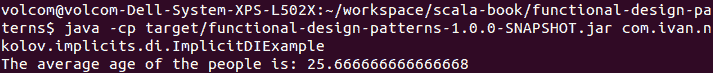

如您所见，现在我们使用的样板代码比蛋糕设计模式少。这种方法的缺点是方法签名，当有更多依赖项时可能会变得更加复杂。在现实世界的应用中，可能会有大量的依赖项，而且由于隐式变量，代码可读性也会受到影响。可能的解决方案是将依赖项包装在对象中，并隐式传递它们。最后，关于使用哪种依赖注入策略，这主要是一个个人偏好的问题，因为两者都可以实现相同的事情。

# 使用隐式依赖注入进行测试

使用隐式依赖注入进行测试与使用蛋糕设计模式进行测试相似。我们可以有一个新对象，它创建服务的模拟并使它们对测试类可用。当我们想要使用服务的具体实现时，我们只需覆盖它。我们也可以在这里显式传递一个依赖项。

# Duck typing

开发者的工作很大一部分是尽量减少代码重复。有多种不同的方法可以做到这一点，包括继承、抽象、泛型、类型类等等。然而，在某些情况下，强类型语言将需要一些额外的工作来最小化一些重复。让我们想象我们有一个可以读取并打印文件内容的方法。如果我们有两个不同的库允许我们读取文件，为了使用我们的方法，我们必须确保读取文件的方法以某种方式变得相同。一种方法是通过将它们包装在实现特定接口的类中来实现。假设在两个库中读取方法都有相同的签名，这很容易发生，Scala 可以使用鸭子类型，这样就可以最小化我们不得不做的额外工作。

Duck typing 是一个来自动态语言的术语，它允许我们根据它们共有的一个方法以相似的方式处理不同类型的对象。

Duck typing 的另一个名称是**结构化类型**。

# Duck typing 示例

通过一个例子，一切都会变得清晰。让我们想象我们想要一个可以接受一个解析器并打印出解析器检测到的每个单词的方法。我们的解析器将有一个以下签名的方法：

```java
def parse(sentence: String): Array[String]
```

做这件事的一个好方法是拥有一个公共接口，并让所有解析器实现它。然而，让我们设定一个条件，我们不能这样做。解析器可能来自两个不同的库，我们无法以任何方式修改或连接。

我们为这个例子定义了两种不同的解析器实现。第一个如下所示：

```java
import java.util.StringTokenizer

class SentenceParserTokenize {
  def parse(sentence: String): Array[String] = {
    val tokenizer = new StringTokenizer(sentence)
    Iterator.continually({
      val hasMore = tokenizer.hasMoreTokens
      if (hasMore) {
        (hasMore, tokenizer.nextToken())
      } else {
        (hasMore, null)
      }
    }).takeWhile(_._1).map(_._2).toArray
  }
}
```

这个解析器使用了`StringTokenizer`类，并返回一个由空格分隔的所有单词组成的数组。另一个实现方式如下所示：

```java
class SentenceParserSplit {
  def parse(sentence: String): Array[String] = sentence.split("\\s")
}
```

在这里，我们只是使用正则表达式按空格分割句子。

如您所见，这两个类都有一个具有相同签名的解析方法，但它们之间没有关联。然而，我们希望能够在方法中使用它们并避免代码重复。以下是我们可以这样做的方法：

```java
object DuckTypingExample {
  def printSentenceParts(sentence: String, parser: {
 def parse(sentence: String): Array[String]
 }) = parser.parse(sentence).foreach(println)

  def main(args: Array[String]): Unit = {
    val tokenizerParser = new SentenceParserTokenize
    val splitParser = new SentenceParserSplit
    val sentence = "This is the sentence we will be splitting."
    System.out.println("Using the tokenize parser: ")
    printSentenceParts(sentence, tokenizerParser)
    System.out.println("Using the split parser: ")
    printSentenceParts(sentence, splitParser)
  }
}
```

在前面的代码中，我们将两个解析器都传递给了`printSentenceParts`方法，并且一切编译和运行正常。事情之所以能正常工作，是因为鸭子类型，这可以在我们示例的高亮部分中看到。我们应用程序的输出如下：

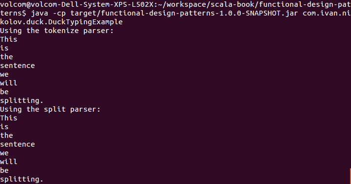

我们可以通过扩展参数签名来使用鸭子类型（duck typing）来要求对象有更多的方法可用。

# 鸭子类型的替代方案

如您从前面的代码中看到的那样，鸭子类型使我们免去了编写额外代码和定义通用接口的需要。实现相同目的的其他方法可能包括创建实现通用接口的包装器。

# 何时使用鸭子类型

过度使用鸭子类型可能会对代码质量和应用程序性能产生负面影响。你不应该为了避免创建通用接口而使用鸭子类型。它应该真正只在无法在不同类型之间实现通用接口的情况下使用。关于限制鸭子类型使用的论点，还得到了这样一个事实的进一步强化，即它们在底层使用反射，这较慢且对性能产生负面影响。

# 记忆化

编写高性能程序通常是将良好的算法与计算机处理能力的智能使用相结合。缓存是我们可以帮助的一种机制，尤其是在方法需要花费时间计算或在我们的应用程序中被频繁调用时。

记忆化是一种基于函数的参数记录其结果以减少连续调用中计算的方法。

除了节省 CPU 周期外，记忆化还可以通过只保留每个结果的单个实例来最小化应用程序的内存占用。当然，为了使整个机制正常工作，我们需要一个函数，当传递相同的参数时，它总是返回相同的结果。

# 记忆化示例

实现记忆化（memoization）的方式有很多。其中一些使用命令式编程风格，并且获取它们相对直接。在这里，我们将展示一个更适合 Scala 的方法。

让我们想象一下，我们将需要多次对字符串进行哈希处理。每次哈希处理都需要一些时间，这取决于底层算法，但如果我们存储一些结果并重复使用它们来处理重复的字符串，我们就可以在牺牲结果表的情况下节省一些计算。

我们将从以下简单内容开始：

```java
import org.apache.commons.codec.binary.Hex

class Hasher extends Memoizer {
  def md5(input: String) = {
    System.out.println(s"Calling md5 for $input.")
    new String(Hex.encodeHex(MessageDigest.getInstance("MD5").digest(input.getBytes)))
  }
}
```

前面的代码是一个具有名为`md5`的方法的类，该方法返回我们传递给它的字符串的哈希值。我们混合了一个名为`Memoizer`的特质，其表示如下：

```java
import scala.collection.mutable.Map

trait Memoizer {
  def memoX, Y: (X => Y) = {
    val cache = Map[X, Y]()
    (x: X) => cache.getOrElseUpdate(x, f(x))
  }
}
```

之前的特质有一个名为 `memo` 的方法，该方法使用可变映射根据其输入参数检索函数的结果，或者如果结果不在映射中，则调用传递给它的实际函数。此方法返回一个新的函数，实际上使用上述映射并对其结果进行记忆化。

之前提到的记忆化示例可能不是线程安全的。多个线程可能并行访问映射并导致函数被执行两次。如果需要，确保线程安全是开发者的责任。

我们使用了泛型的事实意味着我们可以实际上使用这种方法来创建任何单参数函数的记忆化版本。现在，我们可以回到我们的 `Hasher` 类并添加以下行：

```java
val memoMd5 = memo(md5)
```

这使得 `memoMd5` 函数确实与 `md5` 函数做相同的事情，但内部使用映射尝试检索我们已计算的结果。现在，我们可以用以下方式使用我们的 `Hasher`：

```java
object MemoizationExample {
  def main(args: Array[String]): Unit = {
    val hasher = new Hasher
    System.out.println(s"MD5 for 'hello' is '${hasher.memoMd5("hello")}'.")
    System.out.println(s"MD5 for 'bye' is '${hasher.memoMd5("bye")}'.")
    System.out.println(s"MD5 for 'hello' is '${hasher.memoMd5("hello")}'.")
    System.out.println(s"MD5 for 'bye1' is '${hasher.memoMd5("bye1")}'.")
    System.out.println(s"MD5 for 'bye' is '${hasher.memoMd5("bye")}'.")
  }
}
```

此示例的输出将如下所示：

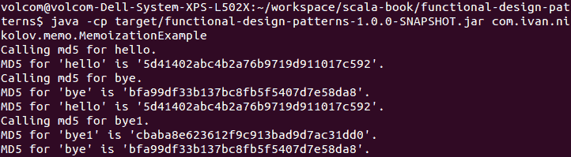

之前的输出证明，对于相同的输入调用我们的记忆化函数实际上是从映射中检索结果，而不是再次调用处理结果的代码部分。

# 记忆化替代方案

我们之前展示的 `memo` 方法相当简洁且易于使用，但它有限制。我们只能获取具有一个参数的函数的记忆化版本（或者我们必须将多个参数表示为元组）。然而，Scalaz 库已经通过 `Memo` 对象支持记忆化。我们可以简单地做以下操作：

```java
val memoMd5Scalaz: String => String = Memo.immutableHashMapMemo {
  md5
}
```

之前的代码可以放入我们的 `Hasher` 类中，然后我们可以在示例中调用 `memoMd5Scalaz` 而不是编写额外的 `Memoizer` 特质。这将不需要我们编写额外的 `Memoizer` 特质，并且会产生与之前展示完全相同的结果。此外，Scalaz 版本在缓存方式等方面给我们提供了更多的灵活性。

# 摘要

在本章中，我们了解了如何将 Scala 编程语言的某些高级概念应用于解决实际软件项目中常见的问题。我们探讨了透镜设计模式，在那里我们也首次接触到了卓越的 Scalaz 库。我们看到了如何在 Scala 中实现依赖注入而无需任何额外库，以及它的用途。我们还学习了如何为我们没有修改权限的库编写扩展。最后但同样重要的是，我们研究了类型类设计模式、Scala 中的懒加载、部分函数（也称为函数柯里化）、鸭子类型、记忆化和隐式注入。到目前为止，你应该对 Scala 的语言可能性以及设计模式有了相当广泛的知识，这些可以一起用来编写出色的软件。

在本书的下一章和最后一章中，我们将更加关注 Scalaz 库，并展示其对我们已经看到的一些概念的支持。我们还将完成一个最终项目，将我们的知识整合成可以用于生产代码的东西。最后，我们将简要总结本书涵盖的内容，并提供有用的指导。
