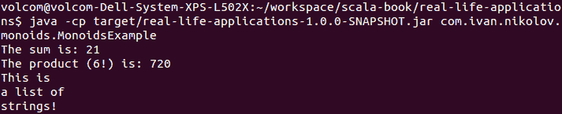
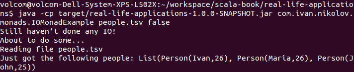
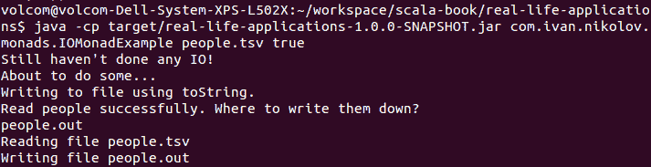
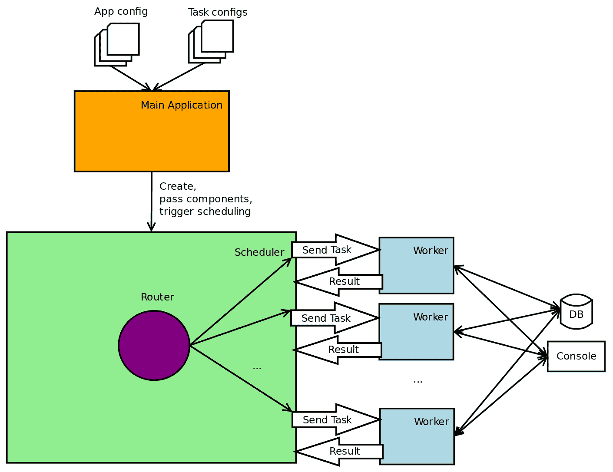
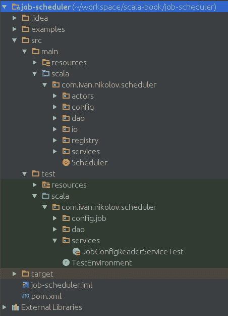
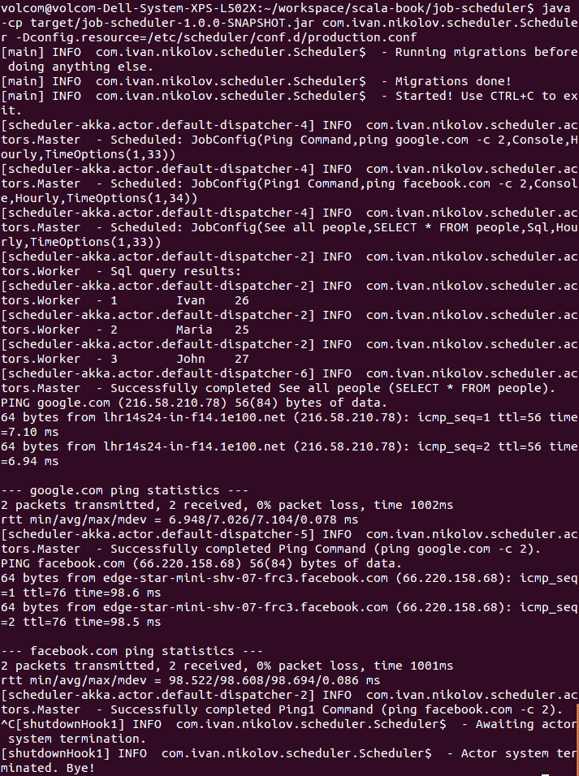

# 真实世界的应用

在 Scala 的设计模式世界中，我们已经走了很长的路。我们从 Scala 的角度看到了一些经典的*四人帮*设计模式，以及适用于这种编程语言的具体特性。到现在为止，你应该已经拥有了足够的知识来构建高质量、可扩展、高效和优雅的应用程序。到目前为止我们所涵盖的一切，如果综合考虑，应该会对你创建的任何应用程序产生真正积极的影响。

在这本书中，我们看到的大部分内容都是从头开始编写的。这有助于理解给定的概念，但需要时间，而在现实世界的应用程序中，使用提供某些功能的库通常更受欢迎。通过简单的谷歌搜索就可以找到许多不同的库，它们几乎可以解决你所能想到的任何问题。除了可以节省大量时间之外，这也意味着我们将彻底测试过的、被许多人信任的组件整合到我们的代码中。当然，这取决于我们试图整合的库，但只要它为社区带来有用的东西，它很可能就是可靠的。话虽如此，我们本章的主要焦点将包括以下内容：

+   Scalaz 库

+   编写完整的应用程序

+   总结到目前为止我们所学的

有很多 Scala 库，有些人可能认为其他库比 Scalaz 对语言更重要。由于各种原因，也有一些替代品被创造出来。然而，我们将在这里关注 Scalaz，因为它通常被用来在应用程序中实现诸如单子、函子、和单子等概念。正如我们之前所看到的，这些概念在函数式编程中非常重要。我们还将编写一个完整的应用程序，使用我们在前几章中熟悉的一些技术和设计模式。这一章将提供一些关于应用程序应该如何构建、如何理解我们的需求以及如何正确构建解决方案的见解。最后，我们将总结在这里所学的所有内容。

# 使用库的原因

编写完整的软件应用程序不可避免地会将开发者带到需要实现已经存在的东西的地步。除非我们有极其具体和严格的要求，世界上没有任何库能满足这些要求，或者有很好的理由不将特定的依赖项包含在我们的项目中，否则重新发明轮子通常是一个坏主意。

人们编写库来处理软件中的各种问题。在一个像开源社区这样的社区中，库是共享的，每个人都可以使用或为其做出贡献。这带来了很多好处，主要的好处是代码变得更加成熟、经过更好的测试和更可靠。然而，有时这也使得事情变得更难——许多人会创建相同的库，这使得理解哪个是最合适的变得困难。

尽管可能存在多个相同库的实现，但在编写企业应用程序时，使用一个库是最佳选择。现在从好的库中筛选出不好的库变得容易——如果一个库是好的，许多人会使用它。如果它不好，人们会避免它。如果有多个好的库，开发者将不得不花一些时间调查哪个最适合他们的用例。

# Scalaz 库

Scala 是一种函数式编程语言，因此它支持基于诸如幺半群、单子等概念的编程模式。我们已经在第十章 功能设计模式 - 深度理论中看到了这些模式，并且我们知道它们遵循的规则和结构。我们都是自己编写的，但已经存在一个库可以为我们完成这项工作——Scalaz ([`github.com/scalaz/scalaz`](https://github.com/scalaz/scalaz))。当我们需要纯函数式数据结构时，我们会使用这个库。

在社区中与 Scalaz 具有相似知名度的另一个库是 Cats ([`github.com/typelevel/cats`](https://github.com/typelevel/cats))。它们都应该能够帮助开发者实现相同的函数式编程概念。在大多数情况下，两者之间的选择基于个人偏好、本地社区文化或公司政策。

在上一章我们讨论透镜时，我们已经遇到了 Scalaz。在接下来的小节中，我们将从幺半群、函子、单子的角度来审视这个库。

# Scalaz 中的幺半群

我们在第十章 功能设计模式 - 深度理论中探讨的一个概念是幺半群。我们为它们定义了一个特质和一些规则，然后展示了如何使用它们以及它们的好处。在这些示例中，我们为整数加法和乘法以及字符串连接定义了幺半群。Scalaz 已经有一个 `Monoid` 特质，我们可以用它来编写自己的幺半群。此外，这个特质已经实现了我们之前定义的一些幺半群：

```java
import scalaz.Monoid

package object monoids {

  // Int addition and int multiplication exist already,
  // so we will show them in an example.
  val stringConcatenation = new Monoid[String] {
    override def zero: String = ""

    override def append(f1: String, f2: => String): String = f1 + f2
  }
}
```

在前面的代码中，我们展示了如何实现一个自定义的幺半群。

`stringConcatenation` 幺半群是在一个包对象中定义的。这意味着它将无需导入任何内容即可在同一个包中的任何代码中使用。我们在以下一些示例中利用了这一点。

同时也存在一个字符串连接单子，但在这里我们只是展示了如果不存在，你可以选择实现自定义单子的方法。它与之前的方法非常相似。区别仅在于操作方法（`append`）及其签名。然而，这只是微小的差异。

# 使用单子

使用 Scalaz 单子非常直接。以下是一个示例程序：

```java
import scalaz._
import Scalaz._

object MonoidsExample {

  def main(args: Array[String]): Unit = {
    val numbers = List(1, 2, 3, 4, 5, 6)
    System.out.println(s"The sum is: ${numbers.foldMap(identity)}")
    System.out.println(s"The product (6!) is:
     ${numbers.foldMap(Tags.Multiplication.apply)}")
    val strings = List("This is\n", "a list of\n", "strings!")
    System.out.println(strings.foldMap(identity)(stringConcatenation))
  }
}
```

我们代码中的导入确保我们可以对我们的数字列表调用 `foldMap`。如果我们运行这个示例，我们将得到以下输出：



通过查看输出和代码，你可以看到对于整数加法和乘法，我们使用了 Scalaz 的内置单子。`sum` 单子具有优先级，并且实际上是以隐式方式传递给 `foldMap` 的。为了使乘法正常工作，我们必须传递 `Tags.Multiplication.apply` 以使事情按预期工作。我们显式地传递了我们的字符串连接单子，以便使最后一个语句正确工作。

# 测试单子

我们知道单子必须满足一些特定的定律。我们的示例足够简单，可以清楚地看到定律实际上已经到位，但有时可能并不那么明显。在 Scalaz 中，你可以实际测试你的单子：

```java
import org.scalacheck.Arbitrary
import org.scalatest.prop.Checkers
import org.scalatest.{FlatSpec, Matchers}

import scalaz._

import scalaz.scalacheck.ScalazProperties._

class MonoidsTest extends FlatSpec with Matchers with Checkers {

  implicit def arbString(implicit ev: Arbitrary[String]):
   Arbitrary[String] =
    Arbitrary { ev.arbitrary.map(identity) }

  "stringConcatenation monoid" should "satisfy the identity rule." in {
    monoid.lawsString.check()
  }
}
```

为了能够编译和运行前面的示例，我们需要将以下依赖项添加到我们的 `pom.xml` 文件中：

```java
<dependency>
    <groupId>org.scalcheck</groupId>
    <artifactId>scalacheck_2.12</artifactId>
    <version>${scalacheck.version}</version>
    <scope>test</scope>
</dependency>
<dependency>
    <groupId>org.scalaz</groupId>
    <artifactId>scalaz-scalacheck-binding_2.12</artifactId>
    <version>${scalaz.version}</version>
    <scope>test</scope>
</dependency>
```

相应的 `build.sbt` 文件需要添加以下依赖项：

```java
"org.scalacheck" %% "scalacheck" % scalacheckVersion % "test",
"org.scalaz" %% "scalaz-scalacheck-binding" % scalazVersion % "test",
```

前面的代码部分只是本书附带代码示例的片段。这些依赖项将 ScalaCheck ([`www.scalacheck.org/`](https://www.scalacheck.org/))—一个基于属性的测试框架的绑定添加到我们的代码中。前面的代码将测试我们的自定义单子是否满足所有定律，如果不满足则失败。为我们的自定义类编写测试需要我们有一个 `Arbitrary` 实现以及在我们的测试作用域中隐式提供我们的单子。

# Scalaz 中的单子

在 第十章，*函数式设计模式 - 深入理论*中，我们也探讨了单子。如果你还记得，我们首先必须定义一个函子特质，然后在单子特质中扩展它。与单子类似，单子也遵循一些特定的规则，这些规则必须到位。

# 使用单子

Scalaz 定义了相当多的不同方法，可以直接应用于我们拥有的任何单子。有多个示例展示了列表和选项。该库还有一个可以扩展的 `Monad` 特质，它与 `Monoid` 特质类似。

我们不想深入探讨展示如何使用单子的列表示例。为了使事情更有趣，让我们看看 Scalaz 中的 `IO` 单子，它可以以单子的方式执行 I/O。这基本上意味着我们可以描述和组合这些动作，而不必实际执行它们。这将导致更好的代码重用。让我们看一个示例：

```java
import java.io.{PrintWriter, File}

import scala.io.Source

package object monads {
  def readFile(path: String) = {
    System.out.println(s"Reading file ${path}")
    Source.fromFile(path).getLines()
  }

  def writeFile(path: String, lines: Iterator[String]) = {
      System.out.println(s"Writing file ${path}")
      val file = new File(path)
      printToFile(file) { p => lines.foreach(p.println) }
    }

  private def printToFile(file: File)(writeOp: PrintWriter => Unit): Unit = {
    val writer = new PrintWriter(file)
    try {
      writeOp(writer)
    } finally {
      writer.close()
    }
  }
}
```

首先，我们在一个包对象中定义了一些可以操作文件的方法。它们绝对没有什么特别之处。它们看起来和我们在第十章中做的很相似，*功能设计模式 - 深入理论*，当我们展示了我们的自定义`IO`单调子。在`readFile`和`writeFile`中，我们添加了打印语句以帮助调试并显示正在发生的事情。这将会非常有用。

我们将使我们的应用程序读取一个包含人员数据的制表符分隔文件，解析它，并将其写入文件或控制台。示例文件将包含以下内容：

```java
Ivan   26
Maria   26
John   25
```

当然，我们有一个模型可以反映这个文件，它将和这样一样简单：

```java
case class Person(name: String, age: Int)

object Person {
  def fromArray(arr: Array[String]): Option[Person] =
    arr match {
      case Array(name, age) => Some(Person(name, age.toInt))
      case _ => None
    }
}
```

与模型一起，我们还展示了它的伴生对象。它有一个方法，根据一个字符串数组返回一个可选的`Person`对象。

现在是时候看看我们的应用程序并解释正在发生的事情了：

```java
import com.ivan.nikolov.monads.model.Person

import scalaz._
import effect._
import Scalaz._
import IO._

object IOMonadExample {

  def main(args: Array[String]): Unit = {
    args match {
      case Array(inputFile, isWriteToFile) =>
        val people = {
          for {
            line <- readFile(inputFile)
            person <- Person.fromArray(line.split("\t"))
          } yield person
        }.pure[IO]

        System.out.println("Still haven't done any IO!")
        System.out.println("About to do some...")
        if (isWriteToFile.toBoolean) {
          val writePeople = for {
            _ <- putStrLn("Read people successfully.
             Where to write them down?")
            outputFile <- readLn
            p <- people
            _ <- writeFile(outputFile, p.map(_.toString)).pure[IO]
          } yield ()
          System.out.println("Writing to file using toString.")
          writePeople.unsafePerformIO 
        } else {
          System.out.println(s"Just got the following people:
           ${people.unsafePerformIO.toList}")
        }
      case _ =>
        System.err.println("Please provide input file and true/false
         whether to write to file.")
        System.exit(-1)
    }
  }
}
```

让我们现在看看前面的列表中到底发生了什么。实际的代码在第一个模式匹配情况中。其余的是一些用于运行控制台应用程序及其参数的验证。

首先要注意的是对`.pure[IO]`的调用，这是针对`people`变量以及我们写入文件时的。这个方法接受它给出的值并将其提升到单调子中。另一件重要的事情是传递给方法的值是惰性评估的。在我们的例子中，单调子是`IO`单调子。

其次，我们可以看到一些对`putStrLn`和`readLn`方法的引用。它们的名字应该足以解释它们的功能。它们来自我们导入到应用程序中的`scalaz.effect.IO`对象。这个导入需要在我们的`pom.xml`文件中添加另一个依赖项：

```java
<dependency>
    <groupId>org.scalaz</groupId>
    <artifactId>scalaz-effect_2.12</artifactId>
    <version>${scalaz.version}</version>
</dependency>
```

`build.sbt`文件中的等效依赖项将是以下内容：

```java
"org.scalaz" %% "scalaz-effect" % scalazVersion
```

`putStrLn`和`readLn`方法也返回`IO`单调子实例，它们只是辅助工具。

现在，因为我们的应用程序是单调的，我们使用了`IO`单调子，除非我们采取行动，否则什么都不会发生。要触发实际的操作，我们必须在`IO`实例上调用`unsafePerformIO`。我们已经添加了一些`print`语句，以证明代码按预期工作。

由于我们的应用程序有两个分支，我们在这里将进行两次运行。一个是打印，另一个是写入文件。示例输出在以下屏幕截图中：



前面的截图显示了打印到控制台的运行。我们可以看到，尽管我们较早调用了该方法，但文件日志的读取发生在我们应用程序的初始日志之后。这证明了`.pure[IO]`调用确实提升了我们的函数而没有评估它。

类似于前面的输出，下面的输出显示，直到我们写入输出文件名并按*Enter*键，什么都不会发生：



我们的示例表明，`IO`单子帮助我们构建计算并在最后一刻执行它。在这里，我们决定用 for 推导包围它，并在其上调用`pure[IO]`，这样我们就可以在不使用单子的情况下实际使用读取和写入方法。在其他情况下，你可以确保从读取和写入方法返回一个`IO`单子，然后定义映射方法，这些方法也返回`IO`单子，并在 for 推导中使用它们。这看起来可能像这样：

```java
val people = for {
  lines <- readFile(inputFile).pure[IO]
  p <- lines.map(i => Person("a", 1)).pure[IO]
} yield p
```

这个版本实际上看起来更像是单子。我们用`IO`单子封装了较小的实体，并将它们组合起来，可能在网上会有更多遵循这种方法的示例。这个版本实际上也保留了`read`方法不变。在这种情况下，唯一不同的是 for 推导的行为与通常不同。

采用哪种方法可能取决于个人偏好以及某人想要实现的目标。

之前的例子类似于我们在第十章中做的，即我们的自定义 I/O 单子，*功能设计模式 - 深度理论*。然而，在这里，我们可以看到比以前少得多的额外代码。

# 测试单子

Scalaz 还提供了测试单子的设施。测试看起来和我们所看到的单子测试没有太大区别，但在这里我们只需要使用`monad.laws`即可。

# Scalaz 的可能性

我们只看了 Scalaz 库涵盖的一些概念。它包含的远不止这些。你可以把 Scalaz 看作是 Scala 的一个补充，使其更加函数式。它提供了各种类型类、数据类型、为标准集合的库实例添加功能、为各种标准类型提供开箱即用的功能等等。目的也各不相同——从编写纯函数式应用程序到使代码更易读。Scalaz 如此庞大，以至于我们可以为它写一本书。

似乎人们一开始觉得 Scalaz 很难用，只有后来才了解到它提供的可能性。我们鼓励你熟悉文档和库提供的所有内容。还有各种不同难度的博客文章，对于 Scalaz 的新用户来说，这些文章可能是一扇真正的启蒙之门。

# 编写完整的应用程序

到目前为止，在书中我们已经看到了很多例子。其中一些相当完整，而另一些只是用来展示我们所观察到的特定部分。在实际应用中，你很可能会需要结合我们所学过的多个设计模式。为了正确地做到这一点，理解需求是非常重要的。在接下来的子节中，我们将提供应用程序规范，然后我们将一步一步地通过实际编写应用程序。我们将编写的代码量会很多，所以我们将关注我们应用程序中更重要的部分，我们可能会跳过其他部分。

# 应用程序规范

在做任何事情之前，我们必须始终有一些规范。有时，这些规范并不完全清楚，我们的责任是确保一切足够详细，以便我们理解和实现它们。然而，在实际的软件开发过程中，我们可能会在需求不是 100%明确的情况下开始做某件事，而且事情会在项目进行中发生变化。有时可能会很沮丧，但这就是生活，我们必须应对。这也使得事情变得有趣和动态，并促使开发者思考在使用给定应用程序时可能出现的更多可能性和问题。一些开发者甚至可能拒绝开始开发一个定义不完整的应用程序。他们可能有一个合理的观点，这取决于任务的紧急程度，但通常，这种态度并不能使项目走得很远。

幸运的是，在这里我们可以提出自己的任务，所以一切都将被明确定义，我们不会在过程中改变要求。所以让我们动手做吧。

创建一个调度应用程序，可以运行针对数据库的控制台命令或 SQL 查询。用户应该能够使用配置文件调度任何命令或查询，并且他们应该能够选择粒度——每小时或每天，在特定时间。

到目前为止，我们只给出了我们想要实现的高级解释。正如我们之前所说的，有些人甚至可能拒绝进一步深入，直到他们有一个包含每个细节的完整定义。这是一个合理的观点；然而，了解不同的用例、边缘情况和可能的改进是很有趣的。产品经理的职责实际上是提出所有这些规范；但在这里，我们不是在学习如何成为一个产品经理。我们是在学习如何编写优秀的代码。所以让我们利用我们所拥有的，尝试提出一些可用、高效、可测试和可扩展的东西。

# 实现

让我们开始编写一些代码。不！这是错误的。在我们开始编写之前，我们应该回答所有问题，并清楚我们的目标在哪里。有些人喜欢画图，有些人喜欢写下东西，等等。每个人都有自己的技巧。让我们先尝试画出一个图。它将展示我们将使用的顶级组件，以及它们如何相互通信等等。我们的应用程序的视觉表示将非常有助于早期发现问题，并有助于我们轻松实现应用程序：



前面的图从非常高的层面展示了我们的未来应用程序。然而，它足以识别几个核心组件：

+   主应用程序

+   调度器

+   路由器

+   工作者

通过观察组件之间的连接，我们还可以看到它们将有什么依赖关系以及它们将支持哪些功能。

现在我们有了这张图，以及我们最终应该达到的视图，我们可以开始思考如何构建应用程序的结构。

# 要使用的库

你总是可以采取从头开始自己实现一切的方法。然而，这会减慢你的速度，并且需要大量其他并行学科的深入领域知识。我们一直在本书的示例中鼓励使用库，这里也是如此。

观察前面的图，我们可以看到我们需要执行以下操作：

+   读取应用程序配置

+   读取调度器配置文件

+   调度任务

+   交换消息

+   访问数据库

+   执行控制台命令

有时候，在确定要使用哪些库时，需要测试不同的替代方案，并查看哪一个对我们来说是有用的。我们在这里不会这样做，我们只会使用我们已经看到或了解的库。

# 读取应用程序配置

为了读取应用程序配置文件，我们决定使用 Typesafe config: [`github.com/typesafehub/config`](https://github.com/typesafehub/config)。这是一个成熟且维护良好的库，支持各种配置格式，并且相当容易使用。我们已经在 `pom.xml` 文件中使用了以下语句：

```java
<dependency>
    <groupId>com.typesafe</groupId>
    <artifactId>config</artifactId>
    <version>${typesafe.config.version}</version>
</dependency>
```

同样的依赖关系通过以下行添加到 `build.sbt` 中：

```java
"com.typesafe" % "config" % typesafeConfigVersion
```

# 读取调度器配置

我们的应用程序将读取调度器的配置文件。我们可以强制用户使用不同的格式。我们决定选择的格式是 JSON。基于它编写我们的模型很容易，我们已经在本书的前几章中使用了解析 JSON 格式的库。我们将使用 json4s: [`github.com/json4s/json4s`](https://github.com/json4s/json4s)。我们已经在 `pom.xml` 文件中包含了以下行：

```java
<dependency>
    <groupId>org.json4s</groupId>
    <artifactId>json4s-native_2.12</artifactId>
    <version>${json4s.version}</version>
</dependency>
<dependency>
    <groupId>org.json4s</groupId>
    <artifactId>json4s-jackson_2.12</artifactId>
    <version>${json4s.version}</version>
</dependency>
```

如果你决定使用 `build.sbt`，相同的依赖关系将按以下方式添加：

```java
"org.json4s" %% "json4s-native" % json4sVersion,
"org.json4s" %% "json4s-jackson" % json4sVersion,
```

# 调度任务

有各种调度库和程序。有些更成熟，有些则不那么成熟。在这个应用程序中，我们决定使用 Akka：[`akka.io/`](https://akka.io/)。首先，它是一个值得熟悉的良好库。其次，我们已经在本书的早期章节中讨论过它。使用 Akka 可以帮助你了解如何使用响应式编程编写应用程序。我们可以通过将以下行添加到我们的 `pom.xml` 文件中来将 Akka 包含到我们的项目中：

```java
<dependency>
    <groupId>com.typesafe.akka</groupId>
    <artifactId>akka-actor_2.12</artifactId>
    <version>${akka.version}</version>
</dependency>
```

同样的依赖项，但在你的 `build.sbt` 文件中，将看起来像这样：

```java
"com.typesafe.akka" %% "akka-actor" % akkaVersion
```

Akka 使用消息将任务发送给工作者，我们将看到整个流程是如何优雅地处理的。

# 访问数据库

在上一章中，我们已经看到了如何编写代码来访问数据库。在这里，我们将再次使用 H2 数据库引擎，因为它不需要你执行任何额外的操作来运行示例。相关的 `pom.xml` 条目如下：

```java
<dependency>
    <groupId>com.h2database</groupId>
    <artifactId>h2</artifactId>
    <version>1.4.197</version>
</dependency>
```

对于 `sbt`，`build.sbt` 文件需要包含以下内容：

```java
"com.h2database" % "h2" % "1.4.197"
```

# 执行控制台命令

为了执行控制台命令，我们将使用 Scala 的内置功能。我们还将使用在其他项目中已经使用过的额外依赖项——一个日志库（slf4j）和测试依赖项——ScalaTest 和 Mockito。

# 编写一些代码

现在我们已经知道了我们将要做什么以及我们将依赖哪些库，是时候编写一些代码了。从没有其他内部依赖项的事情开始是合理的。

其中之一是应用程序配置。这是不依赖于任何东西的东西，但许多东西都依赖于它。我们决定使用 `.conf` 文件，因为它们简单、分层，类似于 JSON。一个示例配置文件如下所示：

```java

job-scheduler {
  config-path="/etc/scheduler/conf.d"
  config-extension="json"
  workers=4
  db {
    connection-string="jdbc:h2:mem:test;DB_CLOSE_DELAY=-1"
    username=""
    password=""
  }
}
```

选项清晰，任何人都可以轻松提供适合他们需求的新的配置。

提出我们的配置选项

当然，我们并没有一开始就想到这个文件。它是随着我们不断向应用程序添加功能而演变的。从小处着手，不要试图一次性考虑所有事情。

使用这种预期的格式，我们现在可以编写一个组件：

```java
package com.ivan.nikolov.scheduler.config.app

import com.typesafe.config.ConfigFactory

trait AppConfigComponent {
  val appConfigService: AppConfigService

  class AppConfigService() {
    //-Dconfig.resource=production.conf for overriding
 private val conf = ConfigFactory.load()
    private val appConf = conf.getConfig("job-scheduler")
    private val db = appConf.getConfig("db")
    val configPath = appConf.getString("config-path")
    val configExtension = appConf.getString("config-extension")
    val workers = appConf.getInt("workers")
    val dbConnectionString = db.getString("connection-string")
    val dbUsername = db.getString("username")
    val dbPassword = db.getString("password")
  }
}
```

上一段代码中高亮显示的行显示了读取我们的配置文件是多么简单。它从我们的 `resources` 文件夹中获取 `application.conf`。用户可以通过在启动我们的应用程序时传递 `-Dconfig.resource=path.conf` 来轻松地覆盖它。

我们的配置文件指定了多个属性。其中两个是 `config-path` 和 `config-extension`。我们基本上已经决定提供一个文件夹和一个扩展名，我们的程序将读取所有给定扩展名的文件，并将它们用作作业配置文件。我们已经编写了一个支持从文件夹中读取并返回所有给定扩展名文件的组件：

```java
package com.ivan.nikolov.scheduler.io

import java.io.File

trait IOServiceComponent {
  val ioService: IOService

  class IOService {
    def getAllFilesWithExtension(basePath: String, extension: String):
    List[String] = {
      val dir = new File(basePath)
      if (dir.exists() && dir.isDirectory) {
        dir.listFiles()
          .filter(f => f.isFile &&
           f.getPath.toLowerCase.endsWith(s".${extension}"))
          .map {
            case f => f.getAbsolutePath
          }.toList
      } else {
        List.empty
      }
    }
  }

}
```

这个组件没有做任何特别的事情。我们没有在这里使用 monads 或其他花哨的 I/O，因为我们实际上希望在这种情况下积极评估事物。

现在我们知道了如何找到所有的作业配置文件，我们需要读取它们并解析它们。我们说过它们将是 JSON 文件，这意味着我们必须定义一个模型。让我们先看看一个作业配置的例子，然后定义模型：

```java
{
  "name": "Ping Command",
  "command": "ping google.com -c 10",
  "frequency": "Hourly",
  "type": "Console",
  "time_options": {
    "hours": 21,
    "minutes": 10
  }
}
```

从一个包含我们所需一切内容的文件开始，然后定义模型，而不是反过来，这相当容易。根据前面的代码，我们可以为我们的作业配置定义以下模型：

```java
case class JobConfig(name: String, command: String, jobType: JobType, frequency: JobFrequency, timeOptions: TimeOptions)
```

`JobType`和`JobFrequency`将被定义为 ADT。当我们使用 json4s 时，在序列化和反序列化这些类型时需要特别注意，所以我们定义了一些额外的`CustomSerializer`实现：

```java
import org.json4s.CustomSerializer
import org.json4s.JsonAST.{JNull, JString}

sealed trait JobType
case object Console extends JobType
case object Sql extends JobType

object JobTypeSerializer extends CustomSerializerJobType => jobType match {
      case "Console" => Console
      case "Sql" => Sql
    }
    case JNull => null
  },
  {
    case jobType: JobType => 
     JString(jobType.getClass.getSimpleName.replace("$", ""))
  }
))
```

`JobFrequency`与前面的代码相当相似：

```java
import org.json4s.CustomSerializer
import org.json4s.JsonAST.{JNull, JString}

sealed trait JobFrequency
case object Daily extends JobFrequency
case object Hourly extends JobFrequency

case object JobFrequencySerializer extends CustomSerializerJobFrequency => frequency match {
      case "Daily" => Daily
      case "Hourly" => Hourly
    }
    case JNull => null
  },
  {
    case frequency: JobFrequency =>
     JString(frequency.getClass.getSimpleName.replace("$", ""))
  }
))
```

我们的`JobConfig`类还需要定义一个模型，如下所示：

```java
import java.time.LocalDateTime
import java.time.temporal.ChronoUnit
import java.util.concurrent.TimeUnit

import scala.concurrent.duration.{Duration, FiniteDuration}

case class TimeOptions(hours: Int, minutes: Int) {
  if (hours < 0 || hours > 23) {
    throw new IllegalArgumentException("Hours must be between 0 and 23:
     " + hours)
  } else if (minutes < 0 || minutes > 59) {
    throw new IllegalArgumentException("Minutes must be between 0 and
     59: " + minutes)
  }

  def getInitialDelay(now: LocalDateTime, frequency: JobFrequency):
  FiniteDuration = {
    val firstRun = now.withHour(hours).withMinute(minutes)
    val isBefore = firstRun.isBefore(now)
    val actualFirstRun = frequency match {
      case Hourly =>
        var tmp = firstRun
        Iterator.continually({
          tmp = tmp.plusHours(1); tmp
        })
          .takeWhile(d => d.isBefore(now))
          .toList.lastOption.getOrElse(
          if (isBefore)
            firstRun
          else
            firstRun.minusHours(1)
        ).plusHours(1)
      case Daily =>
        var tmp = firstRun
        Iterator.continually({
          tmp = tmp.plusDays(1); tmp
        })
          .takeWhile(d => d.isBefore(now))
          .toList.lastOption
          .getOrElse(
            if (isBefore)
              firstRun
            else
              firstRun.minusDays(1)
          ).plusDays(1)
    }
    val secondsUntilRun = now.until(actualFirstRun, ChronoUnit.SECONDS)
    Duration.create(secondsUntilRun, TimeUnit.SECONDS)
  }
}
```

`TimeOptions`类在创建时有一些验证，以及一个`getInitialDelay`方法。这个方法的目的是在安排任务时获取初始延迟，这取决于它的选项。

在我们为作业配置定义了模型之后，我们可以编写一个服务来读取和解析配置：

```java
import java.io.File
import com.ivan.nikolov.scheduler.config.app.AppConfigComponent
import com.ivan.nikolov.scheduler.config.job.{JobTypeSerializer, JobFrequencySerializer, JobConfig}
import com.ivan.nikolov.scheduler.io.IOServiceComponent
import com.typesafe.scalalogging.LazyLogging
import org.json4s._
import org.json4s.jackson.JsonMethods._

trait JobConfigReaderServiceComponent {
  this: AppConfigComponent with IOServiceComponent =>

  val jobConfigReaderService: JobConfigReaderService

  class JobConfigReaderService() extends LazyLogging {

    private val customSerializers = List(
 JobFrequencySerializer,
      JobTypeSerializer
 )

 implicit val formats = DefaultFormats ++ customSerializers +
     JobConfig.jobConfigFieldSerializer

    def readJobConfigs(): List[JobConfig] =
      ioService.getAllFilesWithExtension(
        appConfigService.configPath,
        appConfigService.configExtension
      ).flatMap {
        case path => try {
          val config = parse(FileInput(new File(path))).extract[JobConfig]
          Some(config)
        } catch {
          case ex: Throwable =>
            logger.error("Error reading config: {}", path, ex)
            None
        }
      }
  }
}
```

这取决于我们在前面的代码中已经展示的两个组件。这个组件没有什么特别之处，除了高亮显示的部分。第一条语句取了我们为频率和职位类型定义的自定义序列化器。第二条语句将它们添加到默认格式中，这样 json4s 就知道如何处理它们。如果你仔细观察，你会注意到`JobConfig.jobConfigFieldSerializer`的调用。让我们看看它是什么样子：

```java
import org.json4s.FieldSerializer
import org.json4s.JsonAST.JField

case class JobConfig(name: String, command: String, jobType: JobType, frequency: JobFrequency, timeOptions: TimeOptions)

object JobConfig {
  val jobConfigFieldSerializer = FieldSerializerJobConfig => Some("time_options", x)
      case ("jobType", x) => Some("type", x)
    },
    {
      case JField("time_options", x) => JField("timeOptions", x)
      case JField("type", x) => JField("jobType", x)
    }
  )

}
```

我们需要它，因为我们使用的 Scala 字段名与我们的 JSON 文件中的不同，json4s 需要知道如何翻译它们。

现在我们已经拥有了读取作业配置所需的所有机制，我们可以更深入地了解它们将如何用于执行我们的作业。我们之前说过，我们将使用 Akka 来实现我们的调度器和工作者。关于 Akka 有一件事是它通过消息进行通信。我们必须想出一些我们的应用程序将需要的消息：

```java
sealed trait SchedulerMessage
case class Work(name: String, command: String, jobType: JobType)
case class Done(name: String, command: String, jobType: JobType, success: Boolean)
case class Schedule(configs: List[JobConfig])
```

这些消息相当详细，所以我们不要在这些上面浪费时间。让我们直接进入正题，看看我们的调度器会是什么样子：

```java
class Master(numWorkers: Int, actorFactory: ActorFactory) extends Actor with LazyLogging {
  val cancelables = ListBuffer[Cancellable]()

  val router = context.actorOf(
 Props(actorFactory.createWorkerActor()).withRouter(
    RoundRobinPool(numWorkers)), "scheduler-master-worker-router"
  )

  override def receive: Receive = {
    case Done(name, command, jobType, success) =>
      if (success) {
        logger.info("Successfully completed {} ({}).", name, command)
      } else {
        logger.error("Failure! Command {} ({}) returned a non-zero
         result code.", name, command)
      }
    case Schedule(configs) => 
      configs.foreach {
        case config =>
          val cancellable = this.context.system.scheduler.schedule(
            config.timeOptions.getInitialDelay(LocalDateTime.now(),
             config.frequency),
            config.frequency match {
              case Hourly => Duration.create(1, TimeUnit.HOURS)
              case Daily => Duration.create(1, TimeUnit.DAYS)
            },
            router,
            Work(config.name, config.command, config.jobType)
          )
          cancellable +: cancelables
          logger.info("Scheduled: {}", config)
      }
  }

  override def postStop(): Unit = {
    cancelables.foreach(_.cancel())
  }
}
```

我们将我们的调度器命名为`Master`，因为它是我们将要实现的演员系统中的主演员。我们跳过了导入以节省一些空间。在这个演员中有两个地方值得更多关注——`receive`方法和`router`。前者基本上是演员的工作方式——开发者实现这个方法，它只是一个部分定义的函数，如果我们收到了我们知道的任何消息，它就会被处理。我们的主演员可以通过创建工作项并将它们发送到路由器来安排一系列作业。另一方面，路由器只是一个轮询的工人池，所以我们将安排的每个任务都会分配给不同的工人。

所有工作进程都将运行相同的代码，如下所示：

```java
import sys.process._

class Worker(daoService: DaoService) extends Actor with LazyLogging {

  private def doWork(work: Work): Unit = {
    work.jobType match {
      case Console =>
        val result = work.command.! // note - the ! are different methods
        sender ! Done(work.name, work.command, work.jobType, result == 0)
      case Sql =>
        val connection = daoService.getConnection()
        try {
          val statement = connection.prepareStatement(work.command)
          val result: List[String] = daoService.executeSelect(statement) {
            case rs =>
              val metadata = rs.getMetaData
              val numColumns = metadata.getColumnCount
              daoService.readResultSet(rs) {
                case row =>
                  (1 to numColumns).map {
                    case i =>
                      row.getObject(i)
                  }.mkString("\t")
              }
          }
          logger.info("Sql query results: ")
          result.foreach(r => logger.info(r))
          sender ! Done(work.name, work.command, work.jobType, true)
        } finally {
          connection.close()
        }
    }
  }

  override def receive: Receive = {
    case w @ Work(name, command, jobType) => doWork(w)
  }
}
```

它们只能接受一种消息类型（`Work`）并相应地处理它。例如，为了运行控制台任务，我们使用了内置的 Scala 功能。然后高亮行确保将消息发送回发送者（在我们的例子中是`Master`），如您所见，它将处理它。

我们已经看到了一些组件，它们看起来就像您使用 Scala 实现依赖注入的方式——蛋糕设计模式。然而，我们演员遵循的一般模式并不是蛋糕设计模式所设定的方式。这就是为什么我们创建了一个工厂——`ActorFactory`，它可以向我们的演员注入对象：

```java
package com.ivan.nikolov.scheduler.actors

import com.ivan.nikolov.scheduler.config.app.AppConfigComponent
import com.ivan.nikolov.scheduler.dao.DaoServiceComponent

trait ActorFactory {
  def createMasterActor(): Master
  def createWorkerActor(): Worker
}

trait ActorFactoryComponent {
  this: AppConfigComponent
    with DaoServiceComponent =>

  val actorFactory: ActorFactory

  class ActorFactoryImpl extends ActorFactory {
    override def createMasterActor(): Master =
     new Master(appConfigService.workers, this)

    override def createWorkerActor(): Worker = new Worker(daoService)
  } 
}
```

您可以看到前面的工厂是如何通过`this`引用传递并用于`Master`演员来创建`Worker`实例的。

我们已经看到了运行控制台作业所需的全部内容。现在我们必须实现支持数据库访问的功能。在这里我们将跳过数据库代码，因为它基本上与我们在第十一章，“应用所学”，所看到的相同，它基于蛋糕设计模式。我们只是跳过了一些在这里不需要的便利方法。然而，我们的调度器可以查询的数据库仍然具有相同的模式：

```java
CREATE TABLE people(
  id INT PRIMARY KEY,
  name VARCHAR(255) NOT NULL,
  age INT NOT NULL
);

CREATE TABLE classes(
  id INT PRIMARY KEY,
  name VARCHAR(255) NOT NULL,
);

CREATE TABLE people_classes(
  person_id INT NOT NULL,
  class_id INT NOT NULL,
  PRIMARY KEY(person_id, class_id),
  FOREIGN KEY(person_id) REFERENCES people(id) ON DELETE CASCADE ON UPDATE CASCADE,
  FOREIGN KEY(class_id) REFERENCES classes(id) ON DELETE CASCADE ON UPDATE CASCADE
);
```

我们还添加了一些额外的数据库语句来帮助我们进行单元测试，但它们是微不足道的，不在这里列出不会影响任何事情。

# 将所有组件连接起来

看起来我们已经有我们应用程序将使用到的所有组件了。现在我们只需要将它们连接起来并启动。我们正在使用蛋糕设计模式进行依赖注入；所以，正如您已经看到的，我们可以创建一个包含所有需要的组件的一个组件注册表：

```java
package com.ivan.nikolov.scheduler.registry

import com.ivan.nikolov.scheduler.actors.{ActorFactory, ActorFactoryComponent}
import com.ivan.nikolov.scheduler.config.app.AppConfigComponent
import com.ivan.nikolov.scheduler.dao._
import com.ivan.nikolov.scheduler.io.IOServiceComponent
import com.ivan.nikolov.scheduler.services.JobConfigReaderServiceComponent

object ComponentRegistry extends AppConfigComponent 
  with IOServiceComponent 
  with JobConfigReaderServiceComponent
  with DatabaseServiceComponent
  with MigrationComponent
  with DaoServiceComponent
  with ActorFactoryComponent {

  override val appConfigService: ComponentRegistry.AppConfigService = new AppConfigService
  override val ioService: ComponentRegistry.IOService = new IOService
  override val jobConfigReaderService: ComponentRegistry.JobConfigReaderService = new JobConfigReaderService
  override val databaseService: DatabaseService = new H2DatabaseService
  override val migrationService: ComponentRegistry.MigrationService = new MigrationService
  override val daoService: DaoService = new DaoServiceImpl
  override val actorFactory: ActorFactory = new ActorFactoryImpl
}
```

现在我们有了组件注册表，我们可以使用它并编写主应用程序类：

```java
package com.ivan.nikolov.scheduler

import akka.actor.{Props, ActorSystem}
import com.ivan.nikolov.scheduler.actors.messages.Schedule
import com.typesafe.scalalogging.LazyLogging

import scala.concurrent.Await
import scala.concurrent.duration.Duration

object Scheduler extends LazyLogging {
  import com.ivan.nikolov.scheduler.registry.ComponentRegistry._
  def main(args: Array[String]): Unit = {
    logger.info("Running migrations before doing anything else.")
    migrationService.runMigrations()
    logger.info("Migrations done!")

    val system = ActorSystem("scheduler")

    val master = system.actorOf(
      Props(actorFactory.createMasterActor()),
      "scheduler-master"
    )

    sys.addShutdownHook({
      logger.info("Awaiting actor system termination.")
      // not great...
      Await.result(system.terminate(), Duration.Inf)
      logger.info("Actor system terminated. Bye!")
    })

    master ! Schedule(jobConfigReaderService.readJobConfigs())
    logger.info("Started! Use CTRL+C to exit.")
  }
}
```

我们的应用程序有一些非常简单的 Akka 连接，然后当执行高亮行时，一切都会被触发。我们向主节点发送一个包含所有作业配置的`Schedule`消息，然后它将根据它们的定义定期调度它们运行。

# 最终结果

在编写所有这些代码之后，我们将在我们的 IDE 中得到以下树状结构：



您可以看到我们的代码中也包含单元测试。我们将在下一个子节中花一些时间来讨论它们。

# 测试我们的应用程序

测试是每个应用程序的重要部分。使用 TDD（测试驱动开发）非常好，因为我们可以在编写和测试应用程序的同时进行，而不是回到已经完成的事情上。我们在编写应用程序时使用了这种方法，但为了更好地解释事情，我们将代码和测试分开。

# 单元测试

正如您之前所见，依赖于蛋糕设计模式的应用程序测试是简单的。我们定义了以下测试环境：

```java
package com.ivan.nikolov.scheduler

import com.ivan.nikolov.scheduler.actors.{ActorFactory, ActorFactoryComponent}
import com.ivan.nikolov.scheduler.config.app.AppConfigComponent
import com.ivan.nikolov.scheduler.dao._
import com.ivan.nikolov.scheduler.io.IOServiceComponent
import com.ivan.nikolov.scheduler.services.JobConfigReaderServiceComponent
import org.mockito.Mockito._
import org.scalatest.mockito.MockitoSugar

trait TestEnvironment 
  extends AppConfigComponent
  with IOServiceComponent
  with JobConfigReaderServiceComponent
  with DatabaseServiceComponent
  with MigrationComponent
  with DaoServiceComponent
  with ActorFactoryComponent
  with MockitoSugar {

  // use the test configuration file.
  override val appConfigService: AppConfigService = spy(new AppConfigService)
  // override the path here to use the test resources.
  when(appConfigService.configPath).thenReturn(this.getClass.getResource("/").getPath)

  override val ioService: IOService = mock[IOService]
  override val jobConfigReaderService: JobConfigReaderService = mock[JobConfigReaderService]
  override val databaseService: DatabaseService = mock[DatabaseService]
  override val migrationService: MigrationService = mock[MigrationService]
  override val daoService: DaoService = mock[DaoService]
  override val actorFactory: ActorFactory = mock[ActorFactory]
}
```

在进行测试时，我们使用实际的应用程序配置文件，而不是使用模拟，并且可以使用测试资源文件夹中的任何文件。我们已经为`TimeOptions`类编写了相当广泛的测试，特别是计算初始延迟的部分。还有读取作业配置文件的测试以及数据库访问测试。所有这些都可以在本书提供的项目中看到。

# 应用程序测试

毫无疑问，大家最想看到的部分是我们真正启动应用程序的地方。然而，因为它是一个调度器，我们首先需要准备一些配置。我们将使用以下应用程序配置文件：

```java
job-scheduler {
  config-path="/etc/scheduler/conf.d"
  config-extension="json"
  workers=4
  db {
    connection-string="jdbc:h2:mem:test;DB_CLOSE_DELAY=-1"
    username=""
    password=""
  }
}
```

我们将命名我们的文件为`production.conf`，并将其放置在`/etc/scheduler/conf.d`目录下。现在我们需要创建一些实际的作业配置。我们必须将它们放在`config-path`属性指向的位置：

```java
// ping.json
{
  "name": "Ping Command",
  "command": "ping google.com -c 10",
  "frequency": "Hourly",
  "type": "Console",
  "time_options": {
    "hours": 21,
    "minutes": 10
  }
}
// ping1.json
{
  "name": "Ping1 Command",
  "command": "ping facebook.com -c 10",
  "frequency": "Hourly",
  "type": "Console",
  "time_options": {
    "hours": 21,
    "minutes": 15
  }
}
// query.json
{
  "name": "See all people",
  "command": "SELECT * FROM people",
  "frequency": "Hourly",
  "type": "Sql",
  "time_options": {
    "hours": 21,
    "minutes": 5
  }
}
```

最后一个作业应该没有问题在任何操作系统上运行。例如，如果你使用 Windows，可能需要更改前两个作业中的命令。此外，时间选项可能需要根据应用程序运行的时间和是否希望立即看到实际工作的证据而进行更改。

如果我们现在用这些配置运行应用程序，我们将得到以下输出：



我们可以离开应用程序，它将根据任务的调度方式，每小时或每天持续执行我们设定的任务。当然，我们还可以添加更多有意义的作业，分配更多工作者，更改其他配置等等。

# 我们应用程序的未来

我们在这本书中学到了许多技术和概念——依赖注入、工厂设计模式、ADTs 以及 Akka 库，这些都可以用来实现观察者设计模式。这是一个完全设计的应用程序，旨在可测试和可扩展。

我们可以轻松地为作业的执行计划添加更多粒度，包括不同类型的任务，还可以让任务相互触发，不同的路由机制等等。我们展示了在这本书中我们学到了许多有用的概念，现在我们可以将这些知识应用到实践中，以创建出优秀的程序。

# 摘要

在这里，我们已经完成了 Scala 设计模式的旅程。正如你所知，设计模式的存在是为了应对语言的某些限制。它们还帮助我们以易于更改、使用、测试和维护的方式组织代码。Scala 是一种极其丰富的语言，我们关注了一些使其能够实现其他语言可能需要额外努力和知识才能完成的事情的功能。

我们从 Scala 的角度审视了不同的“四人帮”（Gang of Four）设计模式——创建型、结构型和行为型设计模式。我们看到了其中一些在函数式语言中甚至不适用，而另一些则可以有不同的处理方式。我们还看到，一些设计模式仍然有效，并且了解它们对于任何开发者来说都至关重要。

我们在谈论 Scala 时，不可避免地要处理诸如单子（monoids）和单态（monads）这样的概念。起初，它们可能显得相当可怕和抽象，以至于让人望而却步。因此，我们花了一些时间来了解它们，并展示了它们的价值。它们可以用来以纯函数式方式编写强大的应用程序。它们可以用来抽象和重用功能。通过最小化枯燥的理论，并专注于可理解的例子，我们希望使它们对那些没有深厚数学背景的你们来说更加易于接近和使用。

利用 Scala 的丰富特性，打开了另一组大量设计模式的大门。我们花了一些时间研究那些仅仅因为 Scala 的工作方式和它提供的不同特性才可能实现的设计模式。

在整本书中，我们试图提供有意义的例子，这些例子可以作为参考，以找到我们在这里学到的技术的特定模式和应用程序。在本章的最后，我们甚至实现了一个完整的应用程序。在许多场合，我们试图展示不同的设计模式如何结合使用。当然，在某些情况下，概念本身可能相当复杂，因此我们简化了例子。

我们提供了一些关于何时使用某些设计模式以及何时避免它们的建议。这些观点在关注哪些细节方面应该对你非常有帮助。

在整本书中，我们鼓励使用库。特别是在最后几章，你们已经接触到了相当多的有趣库，这些库可以轻松地添加到你们的工具箱中。我们也希望激发了对在尝试新事物之前总是进行检查的兴趣和习惯。

最后，本书中找到的所有示例也可以在[`github.com/nikolovivan/scala-design-patterns`](https://github.com/nikolovivan/scala-design-patterns-v2)上找到。
