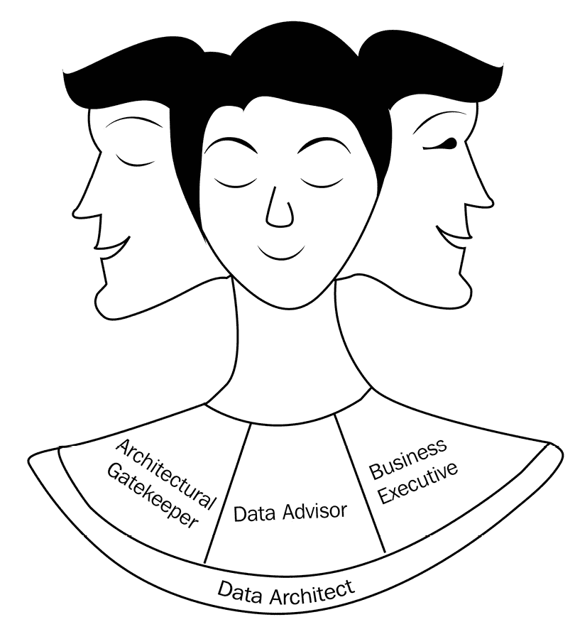

# 1

# 现代数据架构基础

随着 21 世纪的到来，由于互联网使用越来越多，以及越来越强大的数据洞察工具和技术不断涌现，数据爆炸现象已经出现，数据已成为新的黄金。这暗示了对有用和可操作数据的需求增加，以及对高质量数据工程解决方案的需求。然而，构建可扩展、可靠和安全的数据工程解决方案通常很复杂且具有挑战性。

一个设计不佳的解决方案往往无法满足业务需求。要么数据质量差，无法满足服务水平协议（SLAs），要么随着生产中数据的增长，它无法持续或扩展。为了帮助数据工程师和架构师构建更好的解决方案，每年都会有数十个开源和预操作工具发布。即使是一个设计良好的解决方案，有时也会因为工具选择或实施不当而失败。

本书讨论了各种架构模式、工具和技术，通过逐步的动手实践解释，帮助架构师选择最合适的解决方案和技术堆栈来解决数据工程问题。特别是，它专注于使架构决策更容易的技巧和窍门。它还涵盖了数据架构师所需的其他基本技能，例如数据治理、数据安全、性能工程以及向客户或高级管理层进行有效的架构展示。

在本章中，我们将探讨数据工程的领域以及现代商业生态系统中数据的基本特征。我们将涵盖数据架构师试图解决的现代数据工程问题的各种类别。然后，我们将了解 Java 数据架构师的角色和职责。我们还将讨论数据架构师在设计数据工程解决方案时面临的挑战。最后，我们将概述本书中将要讨论的技术和工具，以及它们如何帮助有抱负的数据架构师更高效地工作并提高生产力。

在本章中，我们将涵盖以下主要主题：

+   探索数据工程领域

+   Java 数据架构师的责任和挑战

+   缓解这些挑战的技术

# 探索数据工程领域

在本节中，你将了解数据工程是什么以及为什么需要它。你还将了解数据工程问题的各种类别以及它们在现实世界中的应用场景。在学习如何为这类现实世界问题构建解决方案之前，了解数据工程问题的多样性是很重要的。

## 什么是数据工程？

根据定义，**数据工程**是软件工程的一个分支，专注于以可用和可操作的形式收集、分析、转换和存储数据。

随着社交平台、搜索引擎和在线市场的增长，数据生成的速度呈指数级增长。仅 2020 年，人类每天就产生了约 2500 个 PB 的数据。预计到 2025 年，这一数字将增加到每天 468 个 EB。数据的高体积和可用性已经使人工智能和数据分析领域的技术发展迅速。这导致企业、公司和政府能够以前所未有的方式收集洞察力，为客户提供更好的服务体验。

然而，原始数据通常很少被使用。因此，对创建可用的、安全可靠的数据的需求增加了。数据工程围绕创建可扩展的解决方案来收集原始数据，然后分析、验证、转换，并以可用的和可操作的形式存储它。在特定场景和组织中，现代数据工程中，企业期望可用的和可操作的数据作为一项服务发布。

在我们深入探讨之前，让我们探索一些数据工程的实际应用案例：

+   **用例 1**：**美国运通**（**Amex**）是一家领先的信用卡提供商，但它需要将具有相似消费行为的客户分组在一起。这确保了 Amex 可以为目标客户提供个性化的优惠和折扣。为此，Amex 需要在数据上运行聚类算法。然而，数据来自不同的来源。一些数据来自 MobileApp，一些来自不同的 Salesforce 组织，如销售和营销，还有一些数据来自日志和 JSON 事件。这些数据被称为原始数据，可能包含垃圾字符、缺失字段、特殊字符，有时还包含如日志文件这样的非结构化数据。在这里，数据工程团队从不同的来源摄取这些数据，对其进行清理、转换，并以可用的结构化格式存储。这确保了执行聚类的应用程序可以在清洁和排序后的数据上运行。

+   **用例 2**：一家健康保险公司从多个来源接收数据。这些数据来自各种面向消费者的应用程序、第三方供应商、Google Analytics、其他营销平台和主机批量作业。然而，公司希望创建一个单一的数据存储库，可以为不同的团队提供清洁和排序后的数据来源。这样的需求可以通过数据工程来实现。

现在我们已经了解了数据工程，让我们来看看它的几个基本概念。我们将从数据的维度开始。

## 数据维度

任何关于数据工程的讨论如果没有谈到数据的维度都是不完整的。数据的维度是一些基本特征，通过这些特征可以分析数据的性质。数据工程的起点是分析和理解数据。

要成功分析和构建面向数据解决方案，现代数据分析的四个 *V* 非常重要。这些可以在以下图表中看到：

图 1.1 – 数据维度

让我们详细看看这些 *V* 的每个方面：

+   **体积**：这指的是数据的大小。数据的大小可以从几字节到几百拍字节不等。体积分析通常涉及理解整个数据集的大小或单个数据记录或事件的大小。了解大小对于选择处理和存储数据的技术和基础设施规模决策至关重要。

+   **速度**：这指的是数据生成的速度。高速数据需要分布式处理。分析数据生成的速度对于企业需要实时或近实时提供可用数据的情况尤为重要。

+   **多样性**：这指的是数据源可以生成数据的各种格式变化。通常，它们可以是以下三种类型之一：

    +   **结构化**：结构化数据是指列数、数据类型及其位置固定。所有能够完美适应关系数据模型的传统数据集都是结构化数据的完美例子。

    +   **非结构化**：这些数据集不符合特定的结构。此类数据集中的每条记录可以具有任意数量的列，格式任意。例如，音频和视频文件。

    +   `.json` 或 `.xml` 文件。

+   **真实性**：这指的是数据的可信度。简单来说，它与数据的质量相关。分析数据的噪声与分析数据的任何其他方面一样重要。这是因为这种分析有助于创建一个稳健的处理规则，最终决定数据工程解决方案的成功程度。许多精心设计和构建的数据工程解决方案在生产中失败，原因是对源数据的质量和噪声缺乏了解。

现在我们对分析数据性质的特征有了相当的了解，让我们了解它们在不同类型的数据工程问题中扮演着至关重要的角色。

## 数据工程问题的类型

从广义上讲，数据工程师解决的问题可以分为两种基本类型：

+   **处理问题**

+   **发布问题**

让我们更详细地看看这些问题。

### 处理问题

与收集原始数据或事件、处理它们并将它们存储在可用或可操作的数据格式中相关的问题，可以广泛地归类为处理问题。典型用例可以是数据摄取问题，如**提取、转换、加载**（**ETL**）或数据分析问题，如生成年度报告。

再次，处理问题可以分为三个主要类别，如下：

+   批处理

+   实时处理

+   近实时处理

这可以在以下图中看到：

图 1.2 – 处理问题的类别

让我们详细看看这些类别中的每一个。

#### 批处理

如果处理的 SLA 超过 1 小时（例如，如果处理需要每 2 小时、每天、每周或每两周进行一次），那么这种问题被称为批处理问题。这是因为，当系统以较长的时间间隔处理数据时，它通常处理的是一批数据记录而不是单个记录/事件。因此，这种处理被称为**批处理**：

图 1.3 – 批处理问题

通常，批处理解决方案取决于数据量。如果数据量超过数十个太字节，通常需要将其作为大数据处理。此外，由于大数据处理是调度驱动的，需要一个工作流程管理器或调度器来运行其作业。我们将在本书的后面更详细地讨论批处理。

#### 实时处理

**实时处理**问题是一个用例，其中原始数据/事件需要即时处理，响应或处理结果应在几秒内或最多在 2 到 5 分钟内可用。

如以下图所示，实时过程以事件流的形式接收数据，并立即处理它。然后，它要么将处理后的事件发送到接收器，要么发送到另一个事件流以进一步处理。由于这种处理发生在事件流上，因此这种处理被称为实时流处理：

图 1.4 – 实时流处理

如*图 1.4*所示，事件 E0 被流应用程序处理并发送出去，而事件 E1、E2 和 E3 则在队列中等待处理。在 t1 时，事件 E1 也被处理，显示了流应用程序对事件的连续处理

事件可以在任何时间生成（24/7），这创造了一种新的问题。如果事件的产生者应用程序直接将事件发送给消费者，就有可能发生事件丢失，除非消费者应用程序 24/7 都在运行。即使将消费者应用程序关闭进行维护或升级也是不可能的，这意味着消费者应用程序应该没有停机时间。然而，任何没有停机时间的应用程序都是不现实的。这种应用程序之间的通信模型被称为**点对点**通信。

在实时问题中的点对点通信面临的另一个挑战是处理速度，因为这应该始终等于或大于生产者的速度。否则，将会有事件丢失或消费者可能发生内存溢出。因此，他们不是直接将事件发送到消费者应用程序，而是异步发送到**事件总线**或**消息总线**。事件总线是一个高可用性容器，可以存储诸如队列或主题的事件。通过在中间引入高可用性事件总线来异步发送和接收数据，这种模式被称为**发布-订阅框架**。

以下是与实时处理问题相关的一些重要术语：

+   **事件**：这可以定义为由于动作、触发器或发生而产生的数据包。它们在发布-订阅框架中也普遍被称为**消息**。

+   **生产者**：生产和向消息总线发送事件的是**发布者**或**生产者**。

+   **消费者**：从消息总线中消费事件以进行处理的是**消费者**或**订阅者**。

+   **队列**：它有一个单一的生产者和一个单一的消费者。一旦消费者消费了消息/事件，该事件就从队列中删除。作为一个类比，它就像你朋友发送给你的短信或电子邮件。

+   **主题**：与队列不同，主题可以有多个消费者和生产者。它是一个广播频道。作为一个类比，它就像 HBO 这样的电视频道，多个生产者都在主持他们的节目，如果你订阅了这个频道，你将能够观看任何这些节目。

一个现实世界中的实时问题示例是信用卡欺诈检测，你可能经历过银行对你的交易进行自动确认电话，如果在执行过程中有任何交易看起来可疑。

#### 近实时处理

**近实时处理**，正如其名称所暗示的，是一个响应或处理时间不需要像实时那样快，但应该小于 1 小时的问题。近实时处理的一个特点是它以微批次处理事件。例如，一个近实时过程可能每 5 分钟处理一次批次，每 100 条记录一个批次大小，或者两者的组合（满足条件优先）。

在时间 tx 时，所有在 t0 和 tx 之间生成的事件（E1、E2 和 E3）都由近实时处理作业一起处理。同样，所有在时间 tx 和 tn 之间的事件（E4、E5 和 E6）也一起处理。

图 1.5 – 近实时处理

典型的近实时用例包括推荐问题，如亚马逊的产品推荐或 YouTube 和 Netflix 的视频推荐。

### **发布问题**

发布问题涉及将处理后的数据发布到不同的企业和团队，以便数据可以轻松获取，同时具备适当的安全性和数据治理。由于发布问题的主要目标是向下游系统或外部应用程序暴露数据，因此拥有极其强大的数据安全和治理至关重要。

通常，在现代数据架构中，数据以以下三种方式之一发布：

+   排序后的数据存储库

+   网络服务

+   可视化

让我们更详细地看看每个部分。

#### 排序后的数据存储库

排序后的数据存储库是一个常用的术语，用于指代各种用于存储处理数据的存储库。这些数据是可用和可操作的，可以直接由企业、分析团队和其他下游应用程序根据其用例进行查询。它们大致分为三种类型：

+   数据仓库

+   数据湖

+   数据枢纽

**数据仓库**是一个集成的结构化数据集中存储库，主要用于报告、数据分析和企业智能（**BI**）。**数据湖**由结构化和非结构化数据组成，主要用于数据准备、报告、高级分析、数据科学和**机器学习**（**ML**）。**数据枢纽**是受信任、受管理和共享数据的集中存储库，它使不同端点之间的数据共享无缝，并将业务应用程序连接到数据仓库和数据湖等分析结构。

#### 网络服务

另一种发布模式是将数据作为服务发布，通常称为**数据即服务**。这种数据发布模式具有许多优点，因为它通过设计实现了安全性、不可变性和治理。如今，随着云计算技术和 GraphQL 的普及，数据即服务在行业中获得了很大的关注。

发布数据作为服务的两种流行机制如下：

+   REST

+   GraphQL

我们将在本书的后面详细讨论这些技术。

#### 可视化

有句流行的话：*一图胜千言*。可视化是一种技术，通过图表和图形等视觉方式捕捉关于数据的报告、分析和统计信息。

可视化有助于企业和领导层理解、分析和了解其业务中流动的数据概览。这在决策和业务规划中非常有帮助。

一些最常见和流行的可视化工具如下：

+   **Tableau** 是一款专有的数据可视化工具。该工具包含多个源连接器，可以将其导入并使用拖放可视化组件（如图表和图形）创建快速直观的可视化。您可以在[`www.tableau.com/`](https://www.tableau.com/)了解更多关于此产品信息。

+   **Microsoft Power BI**是微软的一个专有工具，允许您从各种数据源收集数据，连接并创建用于商业智能的强大仪表板和可视化。虽然 Tableau 和 Power BI 都提供数据可视化和商业智能，但 Tableau 更适合经验丰富的数据分析师，而 Power BI 对非技术或经验不足的用户更有用。此外，与 Power BI 相比，Tableau 更适合处理大量数据。您可以在[`powerbi.microsoft.com/`](https://powerbi.microsoft.com/)了解更多关于此产品的信息。

+   **Elasticsearch-Kibana**是一个开源工具，其源代码是开源的，并且提供免费版本用于本地安装，以及付费订阅的云安装。这个工具可以帮助您从任何数据源将数据导入 Elasticsearch，并使用 Kibana 创建可视化和仪表板。Elasticsearch 是一个强大的基于文本的**Lucene**搜索引擎，不仅存储数据，还支持各种类型的数据聚合和分析（包括机器学习分析）。Kibana 是一个仪表板工具，与 Elasticsearch 协同工作，创建非常强大和有用的可视化。您可以在[`www.elastic.co/elastic-stack/`](https://www.elastic.co/elastic-stack/)了解更多关于这些产品的信息。

重要提示

Lucene 索引是一个全文反向索引。这个索引在基于文本的搜索中非常强大且快速，是大多数搜索引擎背后的核心索引技术。Lucene 索引会将所有文档拆分成单词或标记，然后为每个单词创建索引。

+   **Apache Superset**是一个完全开源的数据可视化工具（由 Airbnb 开发）。它是一个强大的仪表板工具，并且完全免费，但其数据源连接器支持有限，主要限于 SQL 数据库。一些有趣的功能包括其内置的角色基础数据访问、用于定制的 API 以及可扩展性以支持新的可视化插件。您可以在[`superset.apache.org/`](https://superset.apache.org/)了解更多关于此产品的信息。

尽管我们简要讨论了市场上的一些可视化工具，但还有许多可视化工具和竞争性替代品。更深入地讨论数据可视化超出了本书的范围。

到目前为止，我们已经概述了数据工程及其各种类型的数据工程问题。在下一节中，我们将探讨 Java 数据架构师在数据工程领域扮演的角色。

# Java 数据架构师的责任和挑战

数据架构师是高级技术领导者，他们负责将业务需求映射到技术需求，构想解决业务问题的技术解决方案，并建立数据标准和原则。数据架构师扮演着独特的角色，他们既了解业务也了解技术。他们就像是商业和技术领域的**雅努斯**，一方面他们可以观察、理解和与业务沟通，另一方面，他们也以同样的方式与技术沟通。数据架构师创建用于规划、指定、启用、创建、获取、维护、使用、归档、检索、控制和清除数据的流程。根据 DAMMA 的数据管理知识体系，**数据架构师提供标准化的通用业务词汇，表达战略需求，概述满足这些需求的高级集成设计，并与企业战略和相关的业务架构保持一致**。

下面的图显示了数据架构师处理的多重关注点：

图 1.6 – 数据架构师的多重关注点

Java 数据架构师的典型职责如下：

+   将业务需求解释为技术规范，包括数据存储和集成模式、数据库、平台、流、转换和技术栈

+   建立架构框架、标准和原则

+   开发和设计用作模式、供他人遵循以创建和改进数据系统的参考架构

+   定义数据流及其治理原则

+   在考虑可扩展性、性能、资源可用性和成本的同时，推荐最合适的解决方案及其技术栈

+   协调和与多个部门、利益相关者、合作伙伴和外部供应商合作

在现实世界中，数据架构师应该扮演三种不同的角色，如下面的图所示：

图 1.7 – 数据架构师的多面角色

让我们更详细地看看这三个架构角色：

+   **数据架构守护者**：架构守护者是一个人或一个角色，确保数据模型遵循必要的标准，架构遵循适当的架构原则。他们寻找解决方案或业务期望方面的任何差距。在这里，数据架构师在产品或解决方案设计及交付（包括数据模型、架构、实施技术、测试程序、**持续集成/持续交付**（**CI/CD**）努力或业务期望中的任何缺乏或差距）中扮演着负面角色，寻找错误或差距。

+   **数据顾问**：数据顾问是一个更专注于寻找解决方案而不是寻找问题的数据架构师。数据顾问强调问题，但更重要的是，他们展示了机会或提出了解决方案。数据顾问应该理解问题的技术以及业务方面和解决方案，并且应该能够就改进解决方案提供建议。

+   **业务高管**：除了数据架构师扮演的技术角色外，数据架构师还需要扮演一个高管角色。正如之前所述，数据架构师就像是商业和技术之间的雅努斯，因此他们被期望成为一个优秀的沟通者和销售高管，能够向非技术人员推销他们的想法或解决方案（即技术性的）。通常，数据架构师需要向高层领导进行电梯演讲，展示机会并说服他们接受针对商业问题的解决方案。要在这个角色中取得成功，数据架构师必须像业务高管一样思考——*ROI 是什么？或者我能从中得到什么？我们通过这个解决方案或机会能节省多少时间和金钱？* 此外，数据架构师在表达他们的想法时应该简洁明了，以便在听众中（主要是业务高管、客户或投资者）产生立即的兴趣。

让我们了解数据架构师和数据工程师之间的区别。

## 数据架构师与数据工程师的比较

数据架构师和数据工程师是相关联的角色。数据架构师负责可视化、概念化和创建数据工程解决方案和框架的蓝图，而数据工程师则根据蓝图实施解决方案。

数据架构师负责整理由大量业务数据产生的数据混乱。每个数据分析或数据科学团队都需要一个数据架构师，他们能够可视化和设计数据框架，以创建干净、分析、管理、格式化和安全的数据。这个框架可以进一步被数据工程师、数据分析师和数据科学家用于他们的工作。

## 数据架构师面临的挑战

数据架构师在日常工作中面临许多挑战。我们将重点关注数据架构师在日常工作中面临的主要挑战：

+   选择正确的架构模式

+   选择最佳的技术堆栈

+   缺乏可操作的数据治理

+   向领导层推荐和有效沟通

让我们更深入地了解一下。

### 选择正确的架构模式

一个单一的数据工程问题可以通过许多方式解决。然而，随着客户不断变化的期望和新技术的演变，选择正确的架构模式变得更加具有挑战性。更有趣的是，随着技术环境的改变，架构的灵活性和可扩展性需求增加了许多倍，以避免不必要的成本和确保架构随时间的可持续性。

### 选择最适合的技术栈

数据架构师需要解决的问题之一是技术栈。即使你已经创建了一个非常完善解决方案，你的解决方案能否成功或失败，将取决于你选择的技术栈以及你计划如何使用它。随着越来越多的工具、技术、数据库和框架的开发，数据架构师面临的一个大挑战是选择一个最佳的技术栈，以帮助创建可扩展、可靠和健壮的解决方案。通常，数据架构师还需要考虑其他非技术因素，例如工具的未来增长预测、这些工具在市场上的熟练资源可用性、供应商锁定、成本和社区支持选项。

### 缺乏可操作的数据治理

数据治理在数据业务中是一个热门词汇，但它究竟意味着什么？治理是一个广泛的领域，包括治理数据的工作流程和工具集。如果工具或工作流程过程存在限制或不存在，那么数据治理就不完整。当我们谈论可操作治理时，我们指的是以下要素：

+   将数据治理与所有数据工程系统整合，以维护标准元数据，包括事件和日志的跟踪和标准时间线

+   整合涉及所有安全政策和标准的治理数据

+   基于角色和用户的对所有数据元素和系统的访问管理策略

+   遵守持续跟踪的既定指标

+   整合数据治理和数据架构

数据治理应始终与战略和组织目标保持一致。

### 向领导层推荐和有效沟通

创建最佳架构和正确的一组工具是一项具有挑战性的任务，但除非它们被付诸实践，否则永远不够。数据架构师经常需要戴上的一个帽子是销售执行者，他们需要向业务执行者或高层领导销售他们的解决方案。这些人通常不是技术人员，他们也没有太多时间。大多数数据架构师都有强大的技术背景，他们面临着向这些人沟通和销售他们想法的艰巨任务。为了说服他们关于机会和想法，数据架构师需要提供适当的决策指标和信息，以便将这个机会与组织的更广泛业务目标对齐。

到目前为止，我们已经看到了数据架构师的角色和他们面临的常见问题。在下一节中，我们将概述数据架构师如何在日常基础上缓解这些挑战。

# 缓解这些挑战的技术

在本节中，我们将讨论数据架构师如何减轻上述挑战。为了理解缓解计划，了解数据架构的生命周期以及数据架构师如何贡献于它是很重要的。以下图表显示了数据架构的生命周期：

图 1.8 – 数据架构的生命周期

数据架构从定义业务面临的问题开始。在这里，这主要是由业务团队或客户识别或报告的。然后，数据架构师与业务紧密合作，定义业务需求。然而，在数据工程领域，这还不够。在很多情况下，存在隐藏的需求或异常。为了减轻这些问题，业务分析师与数据架构师团队合作分析数据以及系统的当前状态，包括任何现有解决方案、当前成本或由于问题导致的收入损失以及数据所在的基础设施。这有助于细化业务需求。一旦业务需求大致确定，数据架构师将业务需求映射到技术需求。

然后，数据架构师定义架构的标准和原则，并根据业务需求和预算确定架构的优先级。之后，数据架构师创建最合适的架构，以及它们所提出的科技栈。在这个阶段，数据架构师与数据工程师紧密合作，实施**概念验证**（**POCs**），并从可行性、可扩展性和性能等方面评估所提出的解决方案。

最后，架构师根据之前定义的评估结果和架构优先级推荐解决方案。数据架构师向业务展示所提出的解决方案。根据成本、时间表、运营成本和资源可用性等优先级，从业务和客户那里获得反馈。需要几次迭代才能巩固并就架构达成一致。

一旦达成一致，解决方案将被实施。根据实施挑战和特定用例，架构可能会或可能不会进行修订或稍作调整。一旦架构实施并投入生产，它就进入了维护和运营阶段。在维护和运营期间，有时会提供反馈，这可能会导致一些架构的改进和变化，但如果解决方案最初就设计得很好，这些变化通常很少。

在前面的图中，蓝色框表示客户有主要参与，绿色框表示数据架构师有主要参与，黄色框表示数据架构师与其他利益相关者平等分担参与，灰色框表示数据架构师在该场景中参与最少

现在我们已经了解了数据架构的生命周期和数据架构师在各个阶段的角色，我们将关注如何减轻数据架构师面临的一些挑战。本书将以下方式介绍如何减轻这些挑战：

+   理解业务数据、其特征和存储选项：

    +   数据及其特征在本章前面已讨论；它也将部分在*第二章*，*数据存储和数据库*）中讨论

    +   存储选项将在*第二章*，*数据存储和数据库*）中讨论

+   分析和定义业务问题：

    +   理解各种数据工程问题（本章涵盖）

    +   我们在第四章*ETL 数据加载 - 数据仓库中数据摄取的基于批处理解决方案*，第五章*构建批处理管道*，以及第六章*构建实时处理管道*中提供了如何分析业务问题、分类和定义的逐步分析

+   选择正确架构的挑战。为了选择正确的架构模式，我们应该了解以下内容：

    +   数据工程问题的类型和数据维度（本章已讨论）

    +   不同类型的数据和各种可用的数据存储（*第二章*，*数据存储和数据库*）

    +   如何在数据库中存储和建模不同类型的数据（*第二章*，*数据存储和数据库*）

    +   理解各种数据处理问题的架构模式（*第七章*，*核心架构设计模式*）

    +   理解发布数据的架构模式（*第三部分*，*使数据成为服务*）

+   选择最佳匹配的技术堆栈和数据平台的挑战。为了选择正确的工具集，我们需要知道如何使用工具以及何时使用我们拥有的工具：

    +   如何选择正确的数据库将在*第二章*，*数据存储和数据库*）中讨论

    +   如何选择正确的平台将在*第三章*，*识别正确的数据平台*）中讨论

    +   在*第四章*《批处理中不同工具的使用步骤指南 - 数据仓库中数据摄取的基于批处理解决方案》和*第五章*《构建批处理管道》中，我们将涵盖使用不同工具在批处理中进行操作的步骤指南。

    +   在*第六章*《构建实时处理管道》中，我们将详细介绍如何逐步构建实时流处理和选择正确的工具。

    +   在*第九章*《将 MongoDB 数据作为服务公开》和*第十章*《使用 GraphQL 的联邦和可扩展 DaaS》中，我们将讨论在数据发布中使用的不同工具和技术。

+   在*第十一章*《衡量性能和基准测试您的应用程序》中，我们将讨论构建可扩展性和性能的设计挑战。在这里，我们将讨论以下内容：

    +   性能工程基础

    +   发布性能基准

    +   性能优化和调整

+   数据治理不足的挑战。在*第八章*《启用数据安全和治理》中，我们将讨论各种数据治理和安全原则以及工具。

+   评估架构解决方案并向领导层推荐的挑战。在本书的最后一章*第十二章*《评估、推荐和展示您的解决方案》中，我们将利用本书学到的各种概念来创建可操作的数据指标，并确定最优化解决方案。最后，我们将讨论建筑师可以应用的技术，以有效地与业务利益相关者、高管领导和投资者进行沟通。

在本节中，我们讨论了这本书如何帮助建筑师克服他们将要面临的种种挑战，并使他们在其角色中更加高效。现在，让我们总结本章内容。

# 摘要

在本章中，我们学习了数据工程是什么，并查看了一些数据工程的实际示例。然后，我们涵盖了数据工程的基础，包括数据的维度和数据工程师解决的问题类型。我们还提供了对数据工程领域中各种处理问题和发布问题的概述。然后，我们讨论了数据架构师的角色和责任以及他们面临的挑战。我们还简要介绍了本书将如何指导你克服数据架构师面临的挑战和困境，帮助你成为一名更好的 Java 数据架构师。

现在你已经了解了数据工程的基本格局以及本书将重点关注的内容，在下一章中，我们将逐一介绍各种数据格式、数据存储选项以及数据库，并学习如何为当前的问题选择合适的方案。
