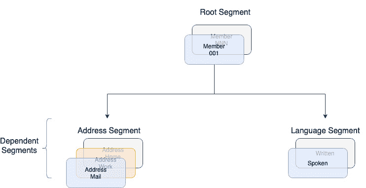

# 2

# 数据存储和数据库

在上一章中，我们了解了现代数据工程的基础以及架构师应该做什么。我们还介绍了数据是如何以指数速度增长的。然而，为了利用这些数据，我们需要了解如何高效有效地存储它们。

在本章中，我们将专注于学习如何存储数据。我们将从了解各种数据类型和可用数据的各种格式开始。我们将简要讨论编码和压缩以及它们与各种数据类型的配合程度。然后，我们将学习关于文件和对象存储的知识，并比较这些数据存储技术。之后，我们将介绍现代数据工程中可用的各种数据库。我们将简要讨论选择特定用例的正确数据库的技术和技巧。然而，选择正确的数据库并不能保证构建出良好的解决方案。作为一名数据架构师，了解如何围绕数据库最佳设计解决方案非常重要，这样我们才能充分利用我们所选择的技术，并实施一个有效、健壮和可扩展的数据工程解决方案。

我们将本章的结尾讨论如何为不同类型的数据库设计数据模型。为了帮助您理解这些关键概念，我们将尽可能提供实际场景。

在本章中，我们将涵盖以下主要主题：

+   理解数据类型、格式和编码

+   理解文件、块和对象存储

+   数据湖、数据仓库和数据集市

+   数据库及其类型

+   数据模型设计考虑因素

# 理解数据类型、格式和编码

在本节中，您将了解各种数据类型和数据格式。我们还将介绍压缩以及压缩和格式如何结合在一起。之后，我们将简要讨论数据编码。本节将为您理解这些数据的基本特征做好准备，这些特征将在我们讨论即将到来的数据存储和数据库部分时有用。

## 数据类型

所有在现代数据工程中使用的数据集可以大致分为以下三个类别：

+   **结构化数据**：这是一种可以轻松映射到预定义结构或模式的类型的数据集。它通常指的是关系数据模型，其中每个数据元素都可以映射到预定义的字段。在结构化数据集中，通常字段的数量、数据类型以及字段的顺序都是明确定义的。最常见的例子是关系数据结构，我们用实体和关系来描述数据结构。这种关系数据结构可以用脚注形符号表示。如果您想了解脚注形符号的基础知识，请参阅[`vertabelo.com/blog/crow-s-foot-notation`](https://vertabelo.com/blog/crow-s-foot-notation)。以下图表展示了结构化数据在脚注形符号中的示例：


图 2.1 – 结构化数据表示

在前面的图表中，我们可以看到一个由三个结构化数据集组成的系统，称为“客户”、“订单”和“产品”。这些数据集每个都有固定数量的字段和相应的数据类型。我们还可以看到数据集之间的关系。例如，在这里，“订单”通过`customer_id`与“客户”相关联，“订单”通过`product_id`与“产品”相关联。由于结构化数据集之间存在关系，它们也被称为关系数据模型。

+   **不结构化数据**：这是一种不符合任何预定义数据模型的数据或数据集。由于缺乏任何内部结构，它们不能被任何关系数据存储，如**关系数据库管理系统**（**RDBMSs**）存储。此外，由于没有与之关联的模式，查询和搜索不像在结构化数据模型中那样容易。

大约 70%的系统生成数据是不结构化的。它们可以由人类或机器生成：

+   **人类生成的不结构化数据**：一些人类生成的不结构化数据集的例子包括媒体文件，如音频和视频文件、聊天、即时消息、电话录音和短信

+   **机器生成的不结构化数据**：一些机器生成的不结构化数据的例子包括科学数据，如地震图像、数字监控和卫星图像

+   **半结构化数据**：这是一种类型的数据集，与关系数据模型不同，它不包含表格结构，但仍然包含标记或标签来定义数据模型的层次结构和字段名称。半结构化数据是分层的。半结构化数据对于不同系统之间的平台和编程语言无关的通信特别有用。在我们讨论几种半结构化数据类型之前，让我们看看一个现实世界的例子。

万事达卡、维萨和 **美国运通**（**Amex**）是连接支付处理器和发行人的卡网络。通常，在卡网络上有很多 **商业对商业**（**B2B**）的销售，其中商家购买订阅计划以接受卡网络，从而增加卡网络的收入流。例如，我的牙医只接受万事达卡和美国运通，而美国仓储式会员商店现在在美国各地只接受维萨卡。每个这些庞大的卡网络都有许多 Salesforce org 或业务单元，如会计、销售和营销。

假设维萨想要生成一个销售评分和最佳接触 B2B 客户的时间。通过 Salesforce 从营销和会计收集的信息将被一个基于实时 **机器学习**（**ML**）的应用程序使用，该应用程序将生成并附加销售评分和最佳接触客户的时间。这个增强的记录，连同这些额外信息，必须流向 Salesforce org 以进行销售。Salesforce 通常在 Salesforce 云上使用 APEX 作为语言（该云可能托管在不同的操作系统上），而生成评分和最佳通话时间的 AI 应用程序是用 Java 和 Python 编写的，并位于本地 Kubernetes 集群之上。为了使这些异构系统（具有不同的操作系统和不同的语言）之间的消息能够轻松通信，我们将使用一种半结构化数据（JSON）的形式，这种数据与操作系统或涉及此用例的不同应用程序的语言无关。

现在，让我们看看几种最流行的半结构化数据类型：

+   **JSON** 是 **JavaScript 对象表示法**的缩写。根据维基百科，它是一种“*使用人类可读的文本来传输由属性-值对组成的数据对象的开放标准格式*。”以下示例由键值对组成，其中值可以是另一个 JSON。这个 JSON 至少有一个键值对，是一个值；这被称为嵌套 JSON。JSON 对象的数组称为 **JSON 数组**。

以下是一个 JSON 的示例：

```java
{
  "customerId": 47,
  "firstname": "Lilith",
  "lastname": "Wolfgram",
  "address": "324 Spring Ln",
  "city": "Hanover",
  "country": "Micronesia, Federated States of",
  "countryCode": "FO",
  "email": "Lilith.Wolfgram@gmail.com",
  "bills": [
    {
      "billId": 0,
      "billAmount": 4801.98,
      "paymentStatus": false,
      "dueDt": "2020-12-20"
    },
    {
      "billId": 1,
      "billAmount": 668.71,
      "paymentStatus": false,
      "dueDt": "2020-12-27"
    },
    {
      "billId": 2,
      "billAmount": 977.94,
      "paymentStatus": true,
      "dueDt": "2020-11-24"
    }
  ]
}
```

如您所见，有一些表示字段名称的标签，例如 `‘customerId’`。`‘bills’` 标签的值是一个 JSON 对象的数组，因此其值是一个 JSON 数组。此外，由于 `‘bills’` 不是一个基本数据类型，而是另一个 JSON，因此前面的 JSON 是一个嵌套的 JSON 对象，显示了 JSON 的层次结构。

+   **XML** 表示 **可扩展标记语言**。从其名称可以看出，它是一种开放的数据格式，既适合人类阅读也适合机器阅读，其中每个数据值都通过一个标签进行标记或标记，该标签表示字段的名称。XML 在以平台和语言无关的方式在异构系统之间传递信息方面与 JSON 非常相似。像 JSON 一样，XML 也是一种层次化的数据结构。XML 是 wsdl SOAP API 的既定标准。以下是为之前描述的 JSON 描述的 XML 结构：

    ```java
    <?xml version="1.0" encoding="UTF-8" ?>
    <root>
        <customerId>47</customerId>
        <firstname>Lilith</firstname>
        <lastname>Wolfgram</lastname>
        <address>324 Spring Ln</address>
        <city>Hanover</city>
        <country>Micronesia, Federated States of</country>
        <countryCode>FO</countryCode>
        <email>Lilith.Wolfgram@gmail.com</email>
        <bills>
            <bill>
                <billId>0</billId>
                <billAmount>4801.98</billAmount>
                <paymentStatus>false</paymentStatus>
                <dueDt>2020-12-20</dueDt>
            </bill>
            ...
        </bills>
    </root>
    ```

前一个代码片段的完整源代码可在 GitHub 上找到：[`github.com/PacktPublishing/Scalable-Data-Architecture-with-Java/blob/main/Chapter02/sample.xml`](https://github.com/PacktPublishing/Scalable-Data-Architecture-with-Java/blob/main/Chapter02/sample.xml)。

如您所见，每个 XML 都以一个`root`标签开始，每个值都被标签名称封装。在本节中，我们探讨了各种数据类型，但我们需要了解这些类型的数据是如何格式化的。因此，在下一节中，我们将讨论各种数据格式。

## 数据格式

在数据工程中，数据集可以存储在不同的文件格式中。每种格式都有其优缺点。然而，了解哪种数据格式比其他数据格式更适合某些类型的用例是很重要的。在本节中，我们将讨论数据格式的各种特点、一些流行的数据格式以及它们适用的用例。

### 数据格式的特点

首先，让我们回顾一下数据格式的各种特点，这些特点使它们彼此不同。这些特点还决定了在解决业务问题时，何时应该选择特定数据类型而不是其他数据类型。数据格式的主要特点如下：

+   `.jpg`文件只能由 Photos 等应用程序打开。另一方面，文本文件只能包含字符，可以在任何文本编辑器中打开，并且是可读的。例如，任何可以通过记事本等文本编辑器打开的`.txt`文件都是文本文件。

+   **模式支持**：模式是一个大纲、图表或模型，它定义了各种类型数据的结构。模式存储字段级别的信息，如*数据类型*、*最大大小*或*默认值*。模式可以与数据相关联，这有助于以下方面：

    +   数据验证

    +   数据序列化和压缩

    +   一种将数据传达给所有消费者以便轻松理解和解释的方法

数据格式可能支持或不支持模式强制。此外，模式可以与数据一起包含，或者可以与模式注册表分开共享。模式注册表是一个集中注册模式的地方，以便不同的应用程序可以独立地添加或删除字段，从而实现更好的解耦。这使得它适合模式演变和验证。

+   **模式演变**：随着业务的增长，更多的列被添加或列数据类型发生变化，这导致模式随时间而变化。即使模式在演变，保持旧数据的向后兼容性也很重要。模式演变提供了一种在保持向后兼容性的同时更新模式的方法。一些数据格式，如**Avro**，支持模式演变，这在敏捷业务中很有帮助；因为数据集的模式可能会随时间变化。

+   **行与列存储**：为了理解行与列存储的区别，让我们看一下以下图表：


图 2.2 – 行与列式存储

前面的图表显示了相同的数据在基于行存储和基于列存储中的存储方式。这个例子显示了销售数据以列式格式存储与基于行的数据存储格式相比的情况。在基于行的格式中，所有数据都是按行存储的——也就是说，特定行的列是相邻存储的。由于数据是按行存储的，因此它非常适合那些更倾向于按行读取或写入数据的场景，例如在**在线事务处理**（**OLTP**）中。

另一方面，正如前一个图表所示，列式存储将同一列的值存储在相邻的内存块中。因此，列是存储在一起的。由于它以列式存储数据，可以通过一次存储重复的列值和每行的指针来优化存储空间（这在前一个图表的“列式存储”部分通过重复的`Clothes`值表示）。这种存储方式对于只重复读取部分列且不期望进行事务性写入的场景非常有用。两个典型的用例是**在线分析处理**（**OLAP**）和大数据处理。两者主要用于对大型数据集进行查询分析。在大数据中，列式格式提供了可分割的优势，并允许创建分区，这有助于加快数据处理速度。

+   **可分割性**：另一个重要因素是文件是否可以被分割或拆分为多个文件。当数据量巨大或速度过高时，例如在大数据中，这个因素就会发挥作用。如果底层数据格式是可分割的，大数据文件可以存储在分布式文件系统如**HDFS**中。这样做，处理这种分割的大数据会变得更快。

+   **压缩**：数据处理性能通常取决于数据的大小。压缩可以减小磁盘上的数据大小，从而提高网络 I/O 性能（然而，在处理时可能需要更多时间来解压）。它还可以在数据通过网络流动时减小数据包的大小，从而降低数据传输速率。下表显示了几个流行的数据压缩算法及其特性：

| **名称** | **无损压缩** | **压缩比率** | **可分割** | **压缩速度** | **解压速度** |
| --- | --- | --- | --- | --- | --- |
| **Gzip** | 是 | 2.7x—3x | 否 | 100 MBps | 440 MBps |
| **Snappy** | 是 | 2x | 否 | 580 MBps | 2020 MBps |
| **LZ4** | 是 | 2.5x | 否 | 800 MBps | 4220 MBps |
| **Zstd** | 是 | 2.8x | 是 | 530 MBps | 1360 MBps |

表 2.1 – 不同的压缩技术

+   **配套技术**：有时，数据格式的选择取决于配套技术。例如，在一个 Hadoop 环境中，如果我们计划使用 Hive MapReduce 作业处理数据，那么使用 ORC 格式而不是 Parquet 格式可能是一个好主意。但另一方面，如果我们所有的转换都是使用 Apache Spark 完成的，那么 Parquet 可能是一个更好的选择。

在本节中，我们学习了各种数据格式的特性和特点，以及它们如何影响数据元素的存储和处理。然而，对于一个架构师来说，了解流行的数据格式以及如何明智地使用它们是非常重要的。

### 流行数据格式

在本节中，我们将讨论一些值得了解的流行数据格式。当你尝试开发数据工程解决方案时，你将遇到这些格式。它们如下（我们在“半结构化数据”部分和“数据类型”子部分中介绍了两种流行的数据格式，JSON 和 XML）：

+   **分隔符分隔格式**：这是一种文本数据格式，其中换行符用作记录分隔符，并且可以根据我们处理的是哪种类型的分隔符分隔文件来使用特定的字段分隔符。两种最流行的分隔符分隔格式是**逗号分隔值**（**CSV**）和**制表符分隔值**（**TSV**）。在 CSV 中，字段分隔符是逗号，而对于 TSV，它是制表符。它们可以可选地包含一个标题记录。尽管它不支持拆分，但它提供了非常好的压缩率。此格式不支持空值或模式演变。

由于格式的简单性，它在批量处理场景以及实时流处理中也非常受欢迎。然而，缺乏模式演变、分区能力和非标准化格式使得其使用有限，并且不推荐用于许多用例。

+   `avro-tools-<version>.jar`。将 Avro 转换为人类可读的 JSON 格式的命令如下：

    ```java
    java -jar ~/avro-tools-1.7.4.jar tojson filename.avro
    ```

`avro`数据总是伴随着其模式，可以使用`avro-tools-<version>.jar`读取，如下所示：

```java
java -jar ~/avro-tools-1.7.4.jar getschema filename.avro
```

如果我们有一个与在“数据类型”部分解释半结构化数据时描述的 JSON 等效的二进制 Avro 文件，那么`avro`模式将如下所示：

```java
{
  "name": "MyClass",
  "type": "record",
  "namespace": "com.sample.avro",
  "fields": [
    {
      "name": "customerId",
      "type": "int"
    },
    {
      "name": "firstname",
      "type": "string"
    },
    {
      "name": "lastname",
      "type": "string"
    }
   ...  ]
}
```

上一段代码片段的完整源代码可在 GitHub 上找到，链接为[`github.com/PacktPublishing/Scalable-Data-Architecture-with-Java/blob/main/Chapter02/avroschema.json`](https://github.com/PacktPublishing/Scalable-Data-Architecture-with-Java/blob/main/Chapter02/avroschema.json)。

+   **Parquet** 是一种开源的基于列的数据存储，非常适合分析负载。它是由 Cloudera 与 Twitter 合作创建的。Parquet 在 *大数据工程* 中非常受欢迎，因为它提供了许多存储优化选项，以及提供了出色的列式压缩和优化。与 Avro 一样，它也支持可分割文件和模式演变。它非常灵活，并且对嵌套数据结构有很好的支持。Parquet 提供了出色的读取性能；它与 Apache Spark 工作得非常好

+   让我们尝试理解 Parquet 文件的结构。以下图表显示了 Parquet 文件的结构：

图 2.3 – Parquet 文件格式

Parquet 文件包含一个头部和一个尾部。头部仅由一个名为 **PAR1** 的标记组成，表示它是一个 Parquet 文件。然后，文件被分为行组，其中每个行组表示包含在数据块中的一组行。每个数据块的大小等于 Parquet 文件的块大小（默认为 128 MB）。每个行组包含每个列的一个数据块。同样，每个列数据块由一个或多个页面组成。列中的每个页面包含 *n* 行，其大小小于或等于配置的页面大小。每个列数据块还存储元数据（最小/最大值、空值数量等）。尾部包含所有行组的元数据以及数据的模式。

+   **优化行列存储**（**ORC**）：这是由 Hortonworks 在与 Facebook 合作下，在 Hadoop 生态系统内开发的另一种开源文件格式。ORC 是一种支持出色压缩和列优化的列式数据存储形式。让我们看看 ORC 文件结构，以了解它与 Parquet 格式的不同之处。以下图表显示了 ORC 文件格式的结构：


图 2.4 – ORC 文件结构

在 ORC 格式中，每个文件由多个条带组成。默认条带大小为 250 MB。每个条带被细分为索引数据、行数据和条带尾部。索引数据包含索引，行数据由实际数据组成，但它们都以列式格式存储。条带尾部包含列编码及其位置。文件尾部包含有关条带列表、每个条带的行数以及每列的数据类型的信息。除此之外，它还包含条带级别的统计信息，如最小值、最大值和总和。最后，后缀包含有关文件尾部长度、元数据部分和压缩相关信息的说明。

现在我们来了解如何从不同的数据格式中进行选择。

#### 如何在 Avro、Parquet 和 ORC 之间进行选择

要选择正确的数据格式，我们必须考虑以下因素：

+   **读写密集型查询模式**：对于读写密集型用例，基于行的格式工作得更好，因为追加新记录变得更容易。因此，对于读写密集型用例，Avro 会是一个更好的选择。另一方面，如果读写密集型用例需要更频繁地读取列的子集，那么像 Parquet 或 ORC 这样的列式数据格式是一个合适的选择。

+   **压缩**：在选择数据格式时，这是一个非常重要的方面，因为压缩可以减少存储或传输数据所需的时间和存储空间。对于大数据用例，压缩起着巨大的作用。基于行的存储不适合这种场景。因此，对于大数据分析用例，像 Parquet 或 ORC 这样的列式存储更受欢迎。此外，如果转换/处理大数据产生了大量的中间读取和写入，则需要更多的压缩。在这种情况下，ORC 是首选的，因为它比 Parquet 提供了更好的压缩比率。例如，如果您在 Hive 上使用 MapReduce 引擎运行 MapReduce 作业或**Hive 查询语言**（**HQL**）查询，ORC 的表现将优于 Parquet。

+   **模式演进**：在许多数据工程用例中，随着新列的添加或删除以及业务需求的变化，模式会随着时间的推移而频繁变化。如果数据模式经常发生变化，并且您需要向后兼容性，那么 Avro 是最佳选择。Avro 支持非常先进的模式演进、兼容性和版本控制，同时保持模式定义在 JSON 格式中的简单性。

+   **嵌套列**：如果您的用例适合基于行的格式，Avro 与嵌套列结构配合得很好。否则，如果用例适合列式数据格式，并且您有很多嵌套的复杂列，那么 Parquet 是这种用例的理想数据格式。

+   **平台支持**：最后，平台或框架起着非常重要的作用。Hive 与 ORC 配合得最好，而 Apache Spark 和 Delta Lake 对 Parquet 有很好的支持。对于 Kafka，Avro 或 JSON 通常是一个不错的选择。

在本节中，我们学习了各种数据格式，如文本、Parquet、Avro 等。在下一节中，我们将学习如何使用不同的数据存储格式来存储数据（这些数据可以是文本、Parquet 或任何其他格式）。

# 理解文件、块和对象存储

在本节中，我们将介绍对计划存储数据的架构师至关重要的各种数据存储格式。数据存储格式以不同的方式组织、保存和展示数据，每种格式都有其优缺点。可用的数据存储格式有文件、块和对象。

文件存储将数据组织并暴露为文件和文件夹的层次结构，而块存储将数据划分为块，并将它们存储在组织良好、大小均匀的卷中。最后，对象存储以空间优化的方式管理数据，并将其与其关联的元数据链接起来。

现在，让我们深入探讨它们的基本概念、优缺点以及它们被应用的使用场景。让我们从最简单、最古老的一种：文件存储开始讨论。

## 文件存储

在文件级存储中，数据以单个信息块的形式存储在文件中。这个文件被赋予一个名称，可以包含元数据，并位于目录或子目录中。当你需要查找文件时，计算机需要知道文件的绝对路径以进行搜索和读取文件。

文件存储的优缺点如下：

+   **优点**：简单、功能广泛，可以存储任何东西

+   **缺点**：不适合存储大量数据，因为没有扩展上规模的选择，只有扩展到规模的选择

一些典型的用例如下：

+   文件存储因其简单性非常适合办公室和其他环境中的文件共享；例如，NAS。

+   本地归档。NAS 为存储归档数据提供了出色的支持。

+   数据保护和安全。文件级存储是一种老技术，但由于时间的考验和广泛的应用，其策略、标准和保护能力都很先进。这使得它成为数据保护用例的理想选择。

让我们现在来看看块级存储。

## 块级存储

在块级存储中，数据被分成小块数据，并分配唯一的块标识符。由于数据块小且具有唯一标识符，它可以存储在任何地方。此外，一组数据块组成一个逻辑单元，称为卷。在块级存储中，你可以通过添加块轻松地添加数据卷以扩展基础设施。

其中一个有趣的地方在于它如何处理元数据。与基于文件的架构不同，除了地址之外，块存储没有其他附加细节。在这里，操作系统控制存储管理，这使得它成为高性能用例的理想存储。

块级存储的优缺点如下：

+   **优点**：通过控制操作系统或数据库来处理元数据，使其性能极高。你也可以轻松地扩展和缩减存储。

+   **缺点**：可能很昂贵。此外，在应用层外部化元数据处理意味着在管理元数据时会有更多麻烦。

一些典型的用例如下：

+   **数据库**：数据库通常使用块存储。例如，AWS 关系数据服务使用 AWS Elastic Block Storage 卷作为其存储来存储数据。

+   **虚拟化**：如**VMware**、**Hyper-V**和**Oracle VirtualBox**等虚拟化软件使用块存储作为虚拟操作系统的文件系统。

+   **基于云的实例**：如 AWS EC2 等基于云的实例使用块存储（AWS Elastic Block Storage）作为其硬盘存储。

+   **电子邮件服务器**：微软的电子邮件服务器 Exchange 使用块存储作为其标准存储系统。

让我们接下来看看对象级存储。

## 对象存储

对象级存储将数据存储在称为对象的独立容器中，这些对象具有唯一的标识符和平坦的结构。这使得数据检索变得非常容易，因为你可以通过使用唯一的标识符来检索对象，而不管它存储的位置在哪里。

对象级存储的优缺点如下：

+   **优点**：对象存储提供了极大的*元数据灵活性*。例如，你可以自定义元数据，以便应用程序与对象相关联，或者你可以将应用程序的优先级设置为对象。你几乎可以做任何自定义。这种灵活性使得对象存储强大且易于管理。

除了元数据灵活性外，对象存储因其*可访问性*而闻名，因为它有一个 REST API 来访问，这使得它可以从任何平台或语言访问。

对象存储具有极高的*可扩展性*。扩展对象架构就像向现有的存储集群添加节点一样简单。随着数据的快速增长和云计算的按需付费模式，这一特性帮助对象存储成为当前和未来数据工程需求中最受欢迎的存储方式。

+   **缺点**：尽管有这么多优点，对象存储也存在一些缺点。最明显和最突出的一点是对象无法修改。然而，你可以创建一个新版本的对象。在某些用例中，如大数据处理，这反而是一个福音而不是头痛。

一些典型的用例如下：

+   **大数据**：由于可扩展性和元数据灵活性，大量数据以及非结构化数据可以轻松存储和从对象存储中读取。这使得它非常适合大数据存储。

+   **云**：再次，由于可扩展性，对象存储是云系统的理想候选者。Amazon S3 是亚马逊的对象存储解决方案，并且非常受欢迎。此外，可定制的元数据有助于通过 AWS 控制台或其 SDKs 定义 Amazon S3 对象的生存周期。

+   **Web 应用**：对象存储通过 REST API 轻松访问，使其成为用作 Web 应用后端的理想候选者。例如，AWS S3 单独就被用作静态网站的廉价且快速的备份。

有了这些，我们已经涵盖了各种数据存储方式。在下一节中，我们将学习企业数据（存储在任何上述存储格式中）是如何组织成不同类型的数据仓库的，这使得其他应用程序能够检索、分析和查询这些数据。

# 数据湖、数据仓库和数据集市

要构建数据架构，架构师需要了解数据湖、数据仓库和数据集市之间的基本概念和区别。在本节中，我们将介绍现代数据架构生态系统，以及数据湖、数据仓库和数据集市在该景观中的位置。

以下图表展示了现代数据架构的概览：


图 2.5 – 现代数据架构景观

如我们所见，各种类型的数据被摄入到数据湖中，并在原始区域着陆。数据湖由直接从数据源摄入的结构化、半结构化和非结构化数据组成。数据湖有一个区域，包含清洗、转换和排序后的数据集，为各种下游数据处理活动提供服务，如数据分析、高级分析、作为数据即服务的发布、人工智能、机器学习等。这被称为**精选区域**。数据湖作为创建数据仓库的来源，而数据仓库是一个为特定业务线构建的结构化数据存储库。

## 数据湖

在现代数据架构中，来自各种来源的数据被摄入到数据湖中。数据湖是一个包含结构化、半结构化和非结构化数据的数据存储库。在大多数情况下，数据湖中数据的用途不是预先定义的。通常，一旦数据被摄入并存储在数据湖中，各个团队就会使用这些数据进行分析、报告、商业智能和其他用途。

然而，在内部，数据湖包含不同的数据区域。以下是在数据湖中可用的不同数据区域：

+   **原始数据区域**：来自各种数据源的原生数据被加载到这个区域。在这里，加载的数据是原始形式的。这些数据可能是非结构化的、未清洗的、未格式化的。这也被称为着陆区。

+   **主数据区域**：这个数据区域通常包含参考数据，它增强了原始区域或精选区域中数据的分析或转换活动。

+   **用户数据区域**：在某些数据湖中，用户可以手动删除某些数据。它们通常是静态的。这个数据湖的部分被称为用户数据区域。

+   **精选数据区域**：这是数据湖的数据发布层。它包含清洗、转换和排序后的数据。这个层中的数据通常是结构化的。数据可能存储在大平面文件中、作为键值存储、作为数据文档、在星型模式中或以非规范化格式。所有数据治理、数据管理和安全策略都适用于这一层，因为这是数据湖的主要消费层。

+   **存档数据区域**：存档区域由其他系统（如数据仓库或精选区域）因老化而卸载的数据组成。这个区域中的数据通常不能修改，但可以追加。这类数据用于历史分析或审计目的。通常，使用更便宜的数据存储技术来存储存档数据。例如，Amazon S3 等技术提供更高级的能力，可以自动使用 S3 存储桶的生命周期策略随着时间的推移将数据逐步迁移到更便宜解决方案。

让我们继续讨论数据仓库。

## 数据仓库

数据仓库是一个经过排序的中心存储库，它以结构化且用户友好的方式收集了来自多个数据源的信息，用于数据分析。在将数据导入数据仓库之前，需要进行大量的发现、分析、规划和数据建模工作。数据仓库中的数据经过高度清洗、转换和结构化。正如*图 2.6*所示，数据仓库在现代数据工程管道中是从数据湖构建的。虽然数据湖通常是企业或组织的集中式原始数据区域，但数据仓库通常是按业务单元或部门构建的。每个数据仓库的结构都是针对特定部门的需求而设计的。关于数据仓库及其模式类型将详细讨论于*第四章*，*ETL 数据加载 – 数据仓库中的批量数据导入解决方案*。

## 数据集市

数据集市通常是数据仓库的一个子集，专注于单一业务线。虽然数据仓库的大小通常是几个 100GB 到 TB，但数据集市的大小通常小于 100GB。数据集市提供了出色的读取性能，因为它包含针对特定业务线分析、设计和存储的数据。例如，从集中的公司数据仓库中，可以为人力资源部门、财务部门和销售部门分别有一个特定的数据集市。

下表捕捉了数据湖与数据仓库之间的差异：

| **特征** | **数据湖** | **数据仓库** |
| --- | --- | --- |
| **加载模式** | ETL（提取、加载和转换） | ETL（提取、转换和加载） |
| **存储的数据类型** | 结构化、半结构化和非结构化 | 结构化 |
| **分析模式** | 获取、分析，然后确定整理数据的结构 | 首先创建结构，然后获取数据以获取洞察 |
| **数据摄入模式** | 批处理、实时、接近实时的批处理 | 批处理 |
| **模式应用时间** | 读取时应用模式，即模式在读取数据时应用 | 写入时确定模式，即模式在数据写入时确定并可用 |

表 2.2 – 数据湖与数据仓库的比较

到目前为止，我们已经学习了各种数据存储库的使用方法以及它们如何使企业数据平台成为可能。这些存储库中的数据可以存储为文件或对象，但它们也可以存储在称为数据库的有序数据集中，这样就可以轻松检索、管理和搜索数据。在下一节中，我们将详细讨论数据库。

# 数据库及其类型

在本节中，我们将介绍各种常用的数据库类型，用于创建现代数据工程解决方案。我们还将尝试探索在特定情况下使用特定类型数据库的可能场景。

数据库是一个系统化的数据或信息集合，以易于访问、检索和管理的方式存储。在现代数据工程中，数据库可以大致分为两大类，如下所示：

+   **关系型数据库**：这是一种以存储结构化数据集而闻名的数据库。每种数据集都与另一种数据集相关联，关系型数据库提供了一种简单的方法来建立不同类型数据集之间的关系。我们将在本章后面详细讨论关系型数据库。

+   **NoSQL 数据库**或**非关系型数据库**：NoSQL 数据库是非关系型数据库，数据可以以表格格式以外的某种形式存储。NoSQL 支持非结构化、半结构化和结构化数据。难怪 NoSQL 代表的是*不仅限于 SQL*！

以下图展示了在现代数据工程环境中使用的数据库类型：


图 2.6 – 数据库类型

现在，让我们详细讨论各种数据库类型。

## 关系型数据库

如前所述，关系型数据库存储结构化数据。关系型数据库中的每种数据类型都存储在一个称为数据库表或简称为表的容器中。在数据加载到表中之前，必须首先定义每个表。表定义包含列名或字段名、它们的数据类型以及它们的大小（可选）。关系型数据库进一步细分为两种类型：层次数据库和关系数据库管理系统（RDBMS）。

### 层次数据库

这些是数据以树状结构存储的数据库。数据库由一系列数据记录组成。每个记录包含一组字段，这些字段由记录类型确定（这也可以称为段）。每个段可以通过称为*链接*的关系与另一个段相关联。这类数据库以*父子关系*而闻名。模型简单，但只能支持一对一和多对一的关系。以下图展示了层次数据库模型的一个示例：



图 2.7 – 层次数据模型的示例

如前图所示，`Member`是根段。`Member`段的记录包含 ID `001`。根段有两个子段，称为`Address`和`Language`。在`Address Segment`部分，我们可以看到三个记录实例——即`Address Mail`、`Address Home`和`Address Work`。`Language Segment`部分也有例如`Spoken`和`Written`这样的实例。

层次数据库的例子包括 IBM **信息管理系统**（**IMS**）和 RDM Mobile。

### RDBMS

RDBMS 是一种使用 SQL 作为其编程和查询接口的关系型数据库管理系统。它是整个行业中最为流行和成熟的数据库类型。数据存储在表中，表代表特定的实体。表有一组明确定义的列，以及它们的数据类型。表中的每一行称为一条记录。每个表可以包含唯一标识记录的主键。每个表支持多种索引。一个表可以通过外键索引与另一个表相连接。RDBMS 可以支持一对一和多对多关系。它们非常强大，并且已经成为了过去几十年大多数现代应用背后的动力源泉。

RDBMS 的例子包括 MySQL、Oracle、PostgreSQL、Amazon RDS 和 Azure SQL。

*何时使用*：RDBMS 几乎在需要多行 ACID 事务和需要复杂连接的任何地方都会被使用。Web 应用、员工管理系统和金融机构的在线交易是一些 RDBMS 被使用的例子。

## NoSQL 数据库

如本节前面所述，NoSQL 支持非结构化数据以及半结构化数据。这是因为它支持灵活的模式。此外，NoSQL 数据库以分布式方式存储和处理数据，因此可以无限扩展。NoSQL 数据库架构中分布式计算的使用有助于它们支持巨大的数据量，使它们成为大数据处理的一个很好的选择。以下图表展示了关系型数据库和 NoSQL 数据库处理扩展的不同方式：


图 2.8 – 升级与扩展对比

如我们所见，关系型数据库扩展的是相同的实例。然而，这创造了一个扩展的限制。此外，升级是一个成本较高的操作。另一方面，NoSQL 使用的是廉价的通用硬件，其架构是这样的，为了扩展，它需要向外扩展。这意味着 NoSQL 可以无限扩展，并且扩展成本更低。

NoSQL 数据库可以进一步细分为特定类型的数据库。我们将简要讨论每个类型，并提供示例和用法。

### 键值存储

键值存储是最简单的 NoSQL 数据库类型。存储的数据以键值格式存在。属性名称存储在*键*中，而属性值存储在*值*中。在这里，键需要是一个字符串，但值可以是任何类型的对象。这意味着值可以是 JSON、XML 或某些自定义序列化对象。

一些键值存储的例子包括 Redis、Memcached 和 RocksDB。

*何时使用*：

+   在一个微服务或应用程序中。如果你需要一个需要快速读取的查找表，那么内存中的键值存储，如 Redis 和 Memcached，是一个不错的选择。同样，虽然 Memcached 支持并发读取，但它不支持像 Redis 那样复杂的值。云服务如 AWS ElastiCache 支持这两种数据库。如果你感兴趣，你可以在[`aws.amazon.com/elasticache/redis-vs-memcached/`](https://aws.amazon.com/elasticache/redis-vs-memcached/)找到 Redis 和 Memcached 之间更详细的比较。

+   在实时事件流处理中，如果当前事件处理依赖于较旧事件的状态，则需要维护状态。这种实时处理称为有状态流处理。在有状态流处理中，RocksDB 是一个很好的选择，可以将状态作为键值对来维护。Kafka Streams 内部使用 RocksDB 来维护有状态流处理的状态。

接下来，让我们来看看基于文档的数据库。

### 基于文档的数据库

文档数据库是 NoSQL 数据库，它为你提供了一种简单的方式来存储和查询文档数据。文档被定义为一种半结构化数据格式，如 JSON 或 XML。文档数据库还支持嵌套元素，如嵌套 JSON 和 JSON 数组。文档数据库中的每个文档都存储在一个键值对中，其中键是文档的唯一 ID，值是存储的文档。文档数据库支持对文档的任何字段进行索引，即使它是嵌套字段。

一些基于文档的数据库的例子包括 MongoDB、Apache CouchDB、Azure Cosmos DB、AWS DocumentDB 和 ElasticSearch。

*何时使用*：

+   当你想要通过微服务或 REST API 将数据湖或数据集市中的精选数据发布到 Web 应用程序时。由于 Web 应用程序运行在 JavaScript 上，它们可以轻松解析 JSON 文档。在 MongoDB 或 AWS DocumentDB 等文档数据库中存储精心设计的 JSON 文档，可以为 Web 应用程序提供惊人的性能。

+   如果你正在接收来自多个动态数据源的数据，例如来自 Twitter、LinkedIn 和 Facebook 的社交媒体源，并且这些源的模式正在演变，你必须通过提取某些数据点或对它们进行某种聚合来一起处理和发布这些数据，那么 Apache CouchDB 可能是一个极好的选择。简单来说，如果你正在消费文档数据并且无法控制传入的模式，基于文档的数据存储是一个很好的选择。

+   如果你的查找需求无法由键值存储来满足。如果值是一个具有非常复杂模式或由于数据量过大而导致键值存储中的存储成本变得过高的文档，那么基于文档的数据库是下一个最明显的选择。

+   如果你正在为业务创建一个搜索存储库，那么你可能希望将数据存储在搜索引擎存储中，如基于文档的数据库 Elasticsearch。它在存储数据时创建反向文本索引（称为 Lucene 索引）。这是一个特殊的基于文档的数据库，其中每个记录都存储为文档，并附带一个唯一的键。Elasticsearch 提供了惊人的搜索性能。然而，只有当你想要在数据上执行高性能的基于文本的搜索或从数据中创建一些可视化时，才应该将数据存储在 Elasticsearch 中。

现在我们来探讨列式数据库。

### 列式数据库

列式数据库以列式格式存储数据。列式数据库是使用 Bigtable 创建的。根据谷歌发布的一篇介绍 Bigtable 的论文，它是一个*稀疏的、分布式的、持久的、多维排序映射*。在其核心，每个列式数据库都是一个映射。在这里，每个数据记录都与一个称为行键的键相关联。这些键是唯一的，并且按字典顺序排序。存储在列式数据库中的数据持久化在提供高数据可用性的分布式文件系统中。在列式数据库中，我们定义列族而不是列。每个列族可以包含任意数量的列。列族内部的列对于所有记录不是固定的，并且可以动态添加。这意味着在大多数数据记录中，一个或多个列可能是空的或不存在，因此这种数据结构是稀疏的。这允许你动态地向记录添加列。这使得列式数据库成为存储非结构化数据的一个很好的选择。以下图表试图捕捉列式数据库的精髓：


图 2.9 – 列式数据库结构

如前图所示，记录被划分为区域。一个或多个区域位于分布式文件系统（如 HDFS 或 GFS）的节点上。区域内部的每个列族都存储为单独的文件。同样，列族内部的每个列都可以支持版本控制，这使得列式存储真正是多维的。

例如，包括 Apache HBase、Cassandra 和 Apache Kudu。

*何时使用*:

+   在广告公司和营销活动中，列式数据存储用于实时存储用户点击和用户选择的事件。这些实时事件被即时用于优化向用户展示的广告或发送给客户的优惠。

+   另一个例子是从 Kafka 接收的事件流数据，这些事件数据量小。这些数据需要存储在 HDFS 中，以便可以定期使用某种形式的批量应用程序进行分析或处理。在这里，列式数据库是首选，因为直接在 HDFS 或类似 Hive 的仓库中存储数据将创建太多小文件，这反过来又会创建太多元数据，从而降低 Hadoop 集群的整体性能。当达到区域大小时，列式存储被写入磁盘，并且通常放置在顺序文件中，因此它们非常适合这种存储。

+   它们是处理大量动态数据波动的优秀数据库。例如，在假日季节销售活动期间，它们非常适合处理大量数据激增。

接下来，让我们看看图数据库。

### 图数据库

图数据库是一种将数据存储在图结构中的数据库。本质上，这意味着图数据库不仅存储数据，还存储数据之间的关系。随着社交网络的出现以及每个领域的数据都变得更加相互连接，不仅需要查询数据，还需要查询数据之间的连接。在社交网络中，探索邻近数据点（例如，LinkedIn 需要探索数据邻近度以显示一个人是否作为一级、二级或三级连接与您的个人资料相连）是必要的。尽管可以使用连接来获取关系，但只有数据库原生支持关系时，才能有效地存储、处理和查询连接。

大多数图数据库使用一种流行的建模方法，称为**属性图模型**。在这里，数据被组织成节点、关系和属性。以下图显示了使用属性图模型存储数据的示例：


图 2.10 – 属性图模型的示例

在属性图模型中，有节点和关系。例如，`name`、`data_of_birth`和`employee_ID`。

关系是有向的，并使用命名连接在两个命名实体或节点之间。例如，如前图所示，`HAS_CEO`是`HAS_CEO`关系，它有一个名为`start_date`的属性。

就像 SQL 标准用于查询 RDBMS 一样，图数据库可以使用 GQL 进行查询。GQL 是一个新宣布的 ISO 标准，有助于查询图数据库。更受欢迎的开源 GQL 之一是 openCypher。（您可以在[`opencypher.org/`](https://opencypher.org/)了解更多关于 openCypher 的信息。）其他流行的图数据库查询语言包括 Cypher、TinkerPop3 和 SPARQL。

一些图数据库的例子包括 Neo4J、ArangoDB、RedisGraph、Amazon Neptune 和 GraphDB。

*何时使用*：

+   欺诈电话检测。

+   推荐引擎。

+   旅行网站上的客户参与度。

+   引用关系。例如，使用图数据库，医疗保健提供者可以识别他们可以从中获得推荐的各种其他提供者。这有助于针对特定客户并建立对双方都有益的关系。

+   在营销活动中帮助识别连接网络中的影响者，通过查询特定节点的传入连接数。

在本节中，我们讨论了各种类型的数据库及其适用场景。我们涵盖了一些示例和样本用例，说明了为什么应该选择特定的数据库。在下一节中，我们将探讨数据架构师在设计各种数据库的数据模型时应考虑的一些因素。

# 数据模型设计考虑因素

在本节中，我们将简要讨论在设计前节所述的各种数据库的数据模型时应考虑的各种设计因素。在设计数据模型时需要考虑以下方面：

+   **规范化与反规范化**：规范化是一种数据组织技术。它用于减少关系或关系集中的冗余。这在 RDBMS 中高度使用，并且在 RDBMS 中创建规范化的数据模型始终是最佳实践。在规范化的数据模型中，你将一个列存储在一个表中的一个（最合适的一个），而不是在多个表中存储相同的列。在获取数据时，如果你需要该列的数据，你可以连接表来获取该列。以下图表显示了使用鸟嘴图符号的规范化数据建模的示例：


图 2.11 – 规范化数据建模

在前面的图表中，没有任何列是重复或冗余的。现在，假设我们需要显示一个应该显示“客户名称”、“客户 ID”、“订单 ID”、“项目名称”和“订单日期”的订单。为了获取这些信息，我们可以编写一个连接查询，如下所示：

```java
SELECT cust.CustomerID, orders.OrderID, items.ItemName,orders.OrderDate FROM Orders orders JOIN Customers cust ON orders.CustomerID=cust.CustomerID JOIN Order_items orderitem on orderitem.OrderID = orders.OrderID JOIN Items items ON items.ItemID = orderitem.ItemID
```

另一方面，如果我们为 NoSQL 数据库设计相同的内容，重点不应放在减少冗余或规范化数据上。相反，我们应该关注读取速度。这种设计思维方式的改变是由两个重要因素触发的。首先，NoSQL 与大量数据一起工作，并将数据存储在分布式商用硬件上。因此，数据存储成本不高，如果数据量在数百 TB 或 PB 级别，连接可能不会高效。其次，NoSQL 没有`JOIN`类型的查询，因为 NoSQL 数据库是非关系型的。以下是一个示例文档数据模型，用于存储需要获取的相同信息：

```java
{
  OrderId: Int, //documentKey
  CustomerID: Int,
  OrderDes: String
  Items: [{
    itemId: Int,
    itemName: String,
    OrderDate: Date 
    }]
}
```

如我们所见，一个单独的文档包含了所有必要的信息，这意味着有很多冗余数据。然而，在大数据场景下，NoSQL 表现得非常出色，并且提供了优异的性能。

+   **查询优先与模式优先模式**：在设计 NoSQL 数据模型时，你必须问自己将要在这个数据模型上运行哪些查询。NoSQL 中的数据模型设计通常从将在模型上运行的类型分析查询开始。这有助于为 NoSQL 数据库中的文档或记录设计正确的键。此外，在列式数据库的情况下，它有助于根据将要运行在数据上的查询来对列族中的列进行分组。这种优化有助于 NoSQL 数据库在大数据或非结构化数据上以惊人的性能运行查询。

另一方面，RDBMS 是设计用来存储在预定义的、经过规范化的模式中，其中关系定义得非常明确。由于 SQL 是一种声明性语言，并且可以在运行时查询任何相关表，因此在设计 RDBMS 数据模型时不会考虑查询。

+   **成本与速度优化**：随着云数据库和基于云的解决方案的出现，理解成本考虑因素对于现代数据架构师来说是一个非常重要的因素。例如，当涉及到存储与每秒输入/输出操作数（**IOPS**）相比时，在基于云的模型中，IOPS 总是比存储更昂贵。然而，了解 RDBMS 或文档存储中 IOPS 的计算差异可以帮助你在长期内节省成本和精力。RDBMS 的 IOPS 基于页面或块大小。因此，RDBMS 的 IOPS 由它访问的页面数量决定。然而，在文档数据库中，IOPS 基于该数据库中发生的 DB 读取/写入次数。

另一个例子是，如果在 AWS DocumentDB 中，你提供了更多的索引，你可能会获得更好的速度，但过多的索引会显著增加 IOPS，因此可能会花费你更多。每个集合的索引安全限制是五个。

+   **索引**：如果你有一个数据库，其中你有很多读取操作并且需要拥有出色的读取性能，那么你应该考虑在你的数据库中拥有索引。索引有助于提高你在数据库中的读取和更新性能。另一方面，如果你有一个写入密集型的应用程序，索引可能会减慢你的插入性能。

+   **数据分布**：NoSQL 数据库基于横向扩展架构，数据存储和分布在商品节点上。NoSQL 数据库对大量数据具有出色性能的一个原因是它们可以在分布式节点上并行读取或写入数据。然而，如果设计不当，数据可能会存储不均匀，这可能导致大量数据存在于一个节点上。这种在分布式数据库中的数据不均匀分布称为**数据倾斜**。

通常，一个节点包含异常大量数据的问题，这可能导致数据库的读写瓶颈，被称为**热点问题**。这种情况通常是由于对 NoSQL 数据库的设计原则缺乏理解以及关键设计不当造成的。在列式数据库中，选择增量序列号作为键通常会导致热点问题。相反，在文档和列式数据库中，应选择唯一键，并将几个键列值的组合以特定顺序连接起来，最好至少有一个是文本值。在设计键时使用如盐值和 MD5 加密等技术，有助于避免热点问题。

在本节中，我们介绍了在选择数据库后你应该考虑的最明显的设计考虑因素。虽然这些考虑因素对任何数据模型设计都是基本的，但还有其他更精细的数据模型设计技术，这些技术是特定于你所选择的数据库的。我们强烈建议你在设计数据模型之前，仔细阅读你所选择数据库的官方文档。

# 摘要

在本章中，我们介绍了各种可用的数据类型和数据格式。我们还讨论了在现代数据工程中使用的各种流行数据格式以及与每种格式兼容的压缩技术。一旦我们了解了数据类型和格式，我们就探索了各种数据存储格式——文件、块和对象存储——我们可以用来存储数据。然后，我们详细讨论了各种企业数据存储库——数据湖、数据仓库和数据集市。一旦我们涵盖了数据的基础知识，包括不同类型及其存储，我们简要地讨论了数据库及其类型。我们讨论了各种数据库的例子，每种数据库的独特卖点，以及在何时应该选择一种数据库而不是另一种。我们还探讨了何时应该使用数据库的可能用例。

最后，我们简要地概述了数据架构师在设计数据模型时应考虑的基本设计考虑因素。

现在你已经了解了数据类型、格式、数据库以及何时使用什么，在下一章中，我们将探讨数据工程解决方案可以部署和运行的各种平台。
