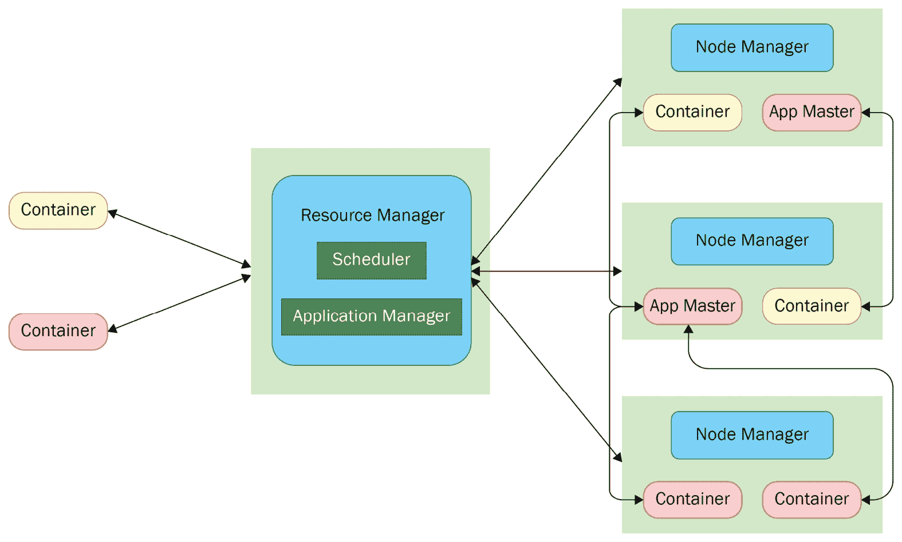

# 第三章：确定合适的数据平台

在上一章中，我们讨论了各种数据类型、它们的格式和存储。我们还介绍了不同的数据库，并提供了它们的概述。然后，我们了解了在选择数据格式、存储类型或数据库时，我们应该比较的因素和特性，以有效地解决数据工程问题。

在本章中，我们将探讨各种流行的平台，这些平台可用于运行数据工程解决方案。你还将了解作为架构师在选择其中之一时应考虑的因素。为此，我们将讨论每个平台的详细信息和这些平台提供的替代方案。最后，你将学习如何充分利用这些平台，为业务问题构建一个高效、健壮且成本效益高的解决方案。

本章中，我们将涵盖以下主要主题：

+   虚拟化和容器化平台

+   Hadoop 平台

+   云平台

+   选择正确的平台

# 技术要求

完成本章内容，你需要以下内容：

+   JDK 1.8 或更高版本

+   Apache Maven 3.3 或更高版本

本章的代码可以在本书的 GitHub 仓库中找到：[`github.com/PacktPublishing/Scalable-Data-Architecture-with-Java/tree/main/Chapter03`](https://github.com/PacktPublishing/Scalable-Data-Architecture-with-Java/tree/main/Chapter03)

# 虚拟化和容器化平台

随着信息技术（**IT**）在生活各个领域的普及，对 IT 基础设施的依赖性和可靠性成倍增加。现在，IT 运行着许多关键和实时的业务。这意味着维护或故障期间可以零或极小的停机时间。此外，快速实时需求也在增长。例如，在假日季节，在线购物网站上的流量巨大。因此，现在 IT 需要高度可用、弹性、灵活和快速。这些正是推动虚拟平台如虚拟化和容器化创建的原因。例如，总部位于英国的跨国金融公司巴克莱斯，由于创新和项目交付速度缓慢，正面临来自竞争对手的困难。其主要障碍之一是新服务器配置所需的时间。因此，他们决定使用 Red Hat OpenShift 来容器化他们的应用程序。这显著减少了从周级到小时级的配置时间。结果，上市时间变得超级快，这帮助巴克莱斯在竞争中保持领先。

**虚拟化**抽象化了硬件，并允许您在单个服务器或硬件上运行多个操作系统。它使用软件在硬件资源上创建一个虚拟抽象，这样多个**虚拟机（VM**）就可以在物理硬件上运行，它们拥有自己的*虚拟操作系统（virtual OS*）、**虚拟 CPU（vCPU**）、虚拟存储和虚拟网络。以下图表显示了虚拟化是如何工作的：


图 3.1 – 虚拟化

如前图所示，虚拟机在宿主机的帮助下运行。虚拟机可以在物理硬件（如服务器或计算机）上运行的软件或固件称为虚拟机管理程序。虚拟机管理程序创建虚拟机的物理机器称为宿主机，而虚拟机称为客户机。宿主机中的操作系统称为宿主操作系统，而虚拟机中的操作系统称为客户操作系统。

## 虚拟化的好处

以下是虚拟化的好处：

+   **更好的资源利用率**：由于多个虚拟机在同一硬件上运行，存储/内存和网络等硬件资源可以更有效地用于服务可能在不同时间具有高负载的更多应用程序。由于创建虚拟机比创建新服务器快得多，因此可以在高需求负载周期中创建虚拟机，并在应用程序负载下降时关闭它们。

+   **更少的停机时间/更高的可用性**：当物理服务器出现问题时，需要例行维护或需要升级，这会导致昂贵的停机时间。使用虚拟服务器时，应用程序可以轻松地在客户主机之间移动，以确保停机时间最小，仅为几分钟，而不是数小时或数天。

+   **更快上市和可扩展性**：由于配置虚拟机只需几分钟而不是数周或数月，整体软件交付周期大大缩短。这使得测试更快，因为您可以使用虚拟机模拟生产环境。

+   **更快的灾难恢复（DR）**：与需要数小时或数天的物理服务器相比，虚拟机可以在几分钟内恢复。因此，虚拟机使我们能够实现更快的灾难恢复。

以下是一些流行的虚拟机示例：

+   微软的 Hyper-V

+   VMware 的 vSphere

+   Oracle 的 VirtualBox

让我们看看虚拟机是如何工作的。我们将通过下载和安装 Oracle VirtualBox 来开始这个练习：

1.  根据您的宿主操作系统，您可以从[`www.virtualbox.org/`](https://www.virtualbox.org/)下载 Oracle VirtualBox 的相应安装程序。

然后，按照[`www.virtualbox.org/manual/ch02.xhtml`](https://www.virtualbox.org/manual/ch02.xhtml)中的安装说明安装 VirtualBox。这些说明可能因操作系统而异。

1.  安装完成后，打开 Oracle VirtualBox。您将看到**Oracle VM VirtualBox 管理器**主页，如下所示：


图 3.2 – Oracle VirtualBox 管理器主页

1.  然后，点击**新建**按钮在你的机器上创建一个新的虚拟机（在此，这作为客户操作系统）。以下截图显示了**创建虚拟机**对话框弹出窗口（在点击**新建**按钮时出现）：


图 3.3 – 使用 Oracle VirtualBox 配置虚拟机

在前面的截图中，你可以看到你需要为虚拟机提供一个唯一的名称。你还可以选择操作系统类型及其版本，以及配置内存（RAM）大小。最后，你可以选择配置或添加一个新的虚拟硬盘。如果你选择添加一个新的硬盘，那么将出现一个类似于以下弹出的窗口：


图 3.4 – 使用 Oracle VirtualBox 创建虚拟硬盘

如前一个截图所示，在配置虚拟硬盘时，你可以从各种可用的虚拟硬盘驱动器中选择。主要的流行虚拟硬盘如下：

+   **VirtualBox 磁盘镜像**（**VDI**）

+   **虚拟硬盘**（**VHD**）

+   **虚拟机磁盘**（**VMDK**）

一旦你配置了所需的虚拟硬盘配置，你可以通过点击**创建**按钮来创建虚拟机。

1.  一旦创建了一个虚拟机，它将列在**Oracle VM VirtualBox 管理器**屏幕上，如下面的截图所示。你可以通过选择适当的虚拟机并点击**启动**按钮来启动虚拟机：


图 3.5 – 在 Oracle VirtualBox 中创建并列出的虚拟机

尽管虚拟机简化了我们的交付，使平台比传统服务器更可用且更快，但它们有一些局限性：

+   **虚拟机是重量级组件**：这意味着每次进行灾难恢复时，你都需要获取所有资源并启动客户操作系统，以便运行你的应用程序。重启需要几分钟时间。此外，启动一个新的客户操作系统资源密集。

+   **它们会降低操作系统的性能**：由于虚拟机中资源有限，并且它们只能进行厚配置，这会降低宿主操作系统的性能，进而影响客户操作系统的性能。

+   **有限的便携性**：由于在虚拟机上运行的应用程序与客户操作系统紧密耦合，当迁移到具有不同类型或配置的不同客户操作系统时，总会存在便携性问题。

容器化可以帮助我们克服这些缺点。我们将在下一节中查看容器化。

## 容器化

容器化是一种技术，它抽象了操作系统（而不是硬件）并允许应用程序直接在其上运行。与虚拟化相比，容器化更高效，因为应用程序不需要客户操作系统来运行。应用程序使用宿主操作系统的相同内核来运行针对不同类型操作系统的多个应用程序。以下图表显示了容器化是如何工作的：


图 3.6 – 容器化

在容器化中，一个名为容器引擎的软件在宿主操作系统上运行。这允许应用程序在容器引擎上运行，而无需创建单独的客户操作系统。每个应用程序的运行实例及其依赖项被称为容器。在这里，应用程序及其依赖项可以被打包成一个可移植的包，称为镜像。

## 容器化的好处

以下是与虚拟化相比容器化的优势：

+   **轻量级**: 容器使用依赖和二进制文件直接在容器引擎上运行应用程序。容器不需要创建虚拟机，因此不需要初始化专用的虚拟内存/硬盘来运行应用程序。容器的启动速度比虚拟机快得多。虽然虚拟机需要几分钟才能启动，但容器可以在几秒钟内启动。

+   **便携性**: 应用程序及其依赖和基础容器可以打包成一个名为镜像的包，可以轻松地跨任何在任意主机上运行的容器引擎进行移植。

+   **减少单点故障**: 由于容器易于移植和轻量级特性，测试、部署和扩展应用程序变得更加容易。这导致了微服务的开发，从而确保了单点故障的减少。

+   **提高开发速度**: 在容器化中，容器可以无缝地从一种环境迁移到另一种环境，从而实现无缝的持续部署。它还允许在构建和打包的同时进行即时测试，从而提高持续集成工作流程。如果应用程序在容器上运行，应用程序扩展变得超级快。这些特性使得开发更加容易和快速，使企业能够快速将解决方案推向市场。

Docker 是最受欢迎的容器引擎。让我们看看与 Docker 相关的一些最重要和常见的术语：

+   **Docker 镜像**: Docker 镜像是一个蓝图或模板，包含创建 Docker 容器的指令。我们可以通过将现有镜像与应用程序及其依赖项打包来创建 Docker 镜像。

+   **Docker 容器**: Docker 容器是 Docker 镜像的运行实例。Docker 容器包含一个或多个只读层之上的写层。可写层允许我们在容器上写入任何内容，以及执行命令。

+   **Docker 仓库**：这是一个存储由开发者开发和上传的 Docker 镜像的仓库，以便其他开发者可以利用它们。容器仓库是存储您的 Docker 镜像的物理位置。具有相同名称的相关镜像也可以存储，但每个镜像都将通过一个标签唯一标识。Maven 仓库对 Java 艺术品的作用类似于 Docker 仓库对 Docker 镜像的作用。就像 Maven 仓库支持具有相同名称的相关 JAR 文件的多版本一样，Docker 仓库支持具有相同名称的镜像的多标签。Docker Hub 是官方基于云的公共 Docker 仓库。

+   **Docker 网络**：Docker 网络负责 Docker 主机和 Docker 应用程序之间的通信。它还负责基本的容器间通信。外部应用程序和开发者可以通过暴露给外部世界的端口访问在 Docker 容器中运行的应用程序。

+   **Docker 存储**：Docker 有多个存储驱动程序，允许您与底层存储设备（如 Device Mapper、AUFS 和 Overlay）一起工作。数据卷可以在多个 Docker 容器之间共享。这使得共享资源可以存储在这样的数据卷中。然而，Docker 容器之间无法共享内存。

现在我们已经了解了与 Docker 相关的重要术语，让我们学习如何在本地机器上使用 Docker Desktop 设置 Docker。我们还将向您展示如何部署镜像并启动 Docker 容器：

1.  首先，您必须在本地机器上安装 Docker Desktop。您可以根据操作系统类型和版本，从以下链接下载合适的 Docker Desktop 版本：[`www.docker.com/products/docker-desktop`](https://www.docker.com/products/docker-desktop)。

根据您的操作系统，您可以在以下链接中找到安装说明：[`docs.docker.com/desktop/mac/install/`](https://docs.docker.com/desktop/mac/install/)（适用于 Mac）或 [`docs.docker.com/desktop/windows/install/`](https://docs.docker.com/desktop/windows/install/)（适用于 Windows）。

如果您的系统中没有安装 Maven，请下载并安装它（安装 Maven 的说明可以在 [`maven.apache.org/install.xhtml`](https://maven.apache.org/install.xhtml) 找到）。

1.  安装 Docker Desktop 后，打开它。您将需要接受一个协议。请阅读并接受它。完成此操作并打开应用程序后，您将看到以下主页：


图 3.7 – Docker Desktop 主页

1.  接下来，您必须创建一个 Docker Hub 个人账户，以便有效地使用 Docker Desktop。请在 [`hub.docker.com/signup`](https://hub.docker.com/signup) 上注册以创建个人 Docker 账户。

一旦您成功创建了账户，点击**登录**按钮，并输入您的 Docker ID 和密码进行登录，如下所示：


图 3.8 – 登录 Docker Desktop

1.  现在，让我们构建自己的 Dockerfile。要构建 Dockerfile，我们需要了解基本的 Docker `build` 命令。以下表格列出了几个重要的 Docker `build` 命令：


图 3.9 – Docker 构建命令

要构建 Dockerfile，首先，从 [`github.com/PacktPublishing/Scalable-Data-Architecture-with-Java/blob/main/Chapter03/sourcecode/DockerExample`](https://github.com/PacktPublishing/Scalable-Data-Architecture-with-Java/blob/main/Chapter03/sourcecode/DockerExample) 下载代码。在这个项目中，我们将使用 Spring Boot 创建一个简单的 REST API，并使用我们的本地 Docker 环境部署和运行此应用程序。当我们构建此项目时将生成的工件是 `DockerExample-1.0-SNAPSHOT.jar`。Dockerfile 将如下所示：

```java
# Each step creates a read-only layer of the image.
# For Java 8
FROM openjdk:8-jdk-alpine
# cd /opt/app
WORKDIR /opt/app
# cp target/DockerExample-1.0-SNAPSHOT.jar /opt/app/app.jar
COPY target/DockerExample-1.0-SNAPSHOT.jar app.jar
# exposing the port on which application runs
EXPOSE 8080
# java -jar /opt/app/app.jar
ENTRYPOINT ["java","-jar","/app.jar"]
```

在 Dockerfile 源代码的 *步骤 1* 中，我们从 Docker Hub 导入一个基础镜像。在 *步骤 2* 中，我们将 Docker 容器内的工作目录设置为 `/opt/app`。在下一步中，我们将我们的工件复制到 Docker 的工作目录。之后，我们从 Docker 暴露端口 `8080`。最后，我们使用 `java -jar` 命令执行 Java 应用程序。

1.  接下来，我们将使用 Maven 构建 JAR 文件。首先，使用命令行（Windows）或终端（Mac），转到 `DockerExample` 项目的根目录。从项目根目录运行以下命令以构建 JAR 文件：

    ```java
    > mvn clean install
    ```

1.  然后，运行以下命令从我们刚刚创建的 Dockerfile 创建一个名为 `hello-docker` 的自定义 Docker 镜像：

    ```java
    > docker build --tag=hello-docker:latest .
    ```

一旦您运行此命令，您将能够在 Docker Desktop 的**镜像**标签页中看到 Docker 镜像，如下所示：


图 3.10 – 成功创建 Docker 容器并列入列表

1.  现在，您可以通过点击**运行**按钮来启动容器，如下所示：


图 3.11 – 运行 Docker 容器

提供一个容器名称和主机端口值，然后在弹出对话框中点击**运行**以启动容器，如下所示：


图 3.12 – 设置 Docker 运行配置

一旦您点击**运行**，容器将被实例化，您将能够在 Docker Desktop 的**容器/应用**标签页中看到容器列表（其状态设置为**运行中**），如下所示：


图 3.13 – 在 Docker Desktop 上运行实例

1.  现在，您可以通过在浏览器中测试应用程序来验证应用程序。请确保在验证应用程序时使用主机端口（在容器创建期间配置），在 HTTP 地址中使用。对于我们的示例，您可以使用端口 `8887`（您之前已映射）来验证应用程序，如下所示：


图 3.14 – 测试在 Docker 上部署的应用

您可以使用 Docker Desktop 中的 **CLI** 按钮登录 Docker CLI，如下所示：


图 3.15 – 从 Docker Desktop 打开 Docker CLI

在本节中，我们学习了 Docker。虽然 Docker 让我们的生活变得更简单，并且使开发和部署变得相当快，但它也带来了一系列挑战：

+   容器间通信通常不可能或非常复杂

+   没有入站流量分发机制，这可能会导致入站流量在一系列容器中的分布不均

+   手动管理集群的容器管理是开销

+   自动扩展不可行

在生产环境中，如果我们想要运行一个健壮、高效、可扩展且成本效益高的解决方案，我们需要解决这些不足。在这里，容器调度器就派上用场了。市场上有很多容器调度器。然而，由 Google 开发并开源的 Kubernetes 是最受欢迎和最广泛使用的容器调度器之一。在下一节中，我们将更详细地讨论 Kubernetes。

## Kubernetes

Kubernetes 是一个开源容器调度器，它有效地管理容器化应用程序及其容器间通信。它还自动化了容器的部署和扩展。每个 Kubernetes 集群都有多个组件：

+   主节点

+   节点

+   Kubernetes 对象（命名空间、pod、容器、卷、部署和服务）

下面的图显示了 Kubernetes 集群的各个组件：


图 3.16 – Kubernetes 集群及其组件

现在，让我们简要描述一下前面图中显示的每个组件：

+   `configMap`。除此之外，还有一个默认命名空间。

+   **用户命名空间**：用户/团队可以在默认命名空间内创建命名空间。

+   **主节点**：主节点是集群的调度器。每当 Kubernetes 集群收到新的部署请求时，它会扩展和分配应用容器。

+   **工作节点**：这些是部署 pod 和运行应用程序的节点。

+   **Pod**：Pod 是在容器之上的一个抽象，它帮助容器在不同运行时之间轻松便携，自动检测集群中可用的端口，并为其分配一个唯一的 IP 地址。Pod 可以包含多个容器，其中多个辅助容器可以无缝通信并协助主要应用程序。这些单个 Pod 中的多个容器不仅共享卷，还共享内存空间，例如 **可移植操作系统接口**（**POSIX**）共享内存。

+   **代理**：有两种类型的代理，如下所示：

    +   **Kubelet 代理**：这是一个在每个节点上运行的服务。它确保该节点内的所有容器都处于运行状态。

    +   **Docker 代理**：这是一个用于运行容器的服务。

现在我们已经简要地了解了 Kubernetes 的组件及其在容器化中的作用，让我们尝试在本节中创建的 Docker 镜像在本地 Kubernetes 集群中部署。为此，我们必须安装 **minikube**（一个在本地机器上运行 Kubernetes 的 Kubernetes 集群）：

1.  您可以通过遵循 [`minikube.sigs.k8s.io/docs/start/`](https://minikube.sigs.k8s.io/docs/start/) 中的说明来安装合适的 `minikube` 版本。

1.  一旦安装了 `minikube`，您可以使用以下命令启动 `minikube`：

    ```java
    > minikube start
    ```

成功的 `minikube start` 看起来如下：


图 3.17 – 启动 minikube

1.  现在，就像我们必须创建 Dockerfile 来创建 Docker 镜像一样，我们必须创建一个 `YAML` 文件来向 Kubernetes 集群提供部署指令。在我们的项目中，我们将此 `YAML` 文件命名为 `deployment.yaml`。以下是在 `deployment.yaml` 文件中的代码：

    ```java
    apiVersion: v1
    kind: Service
    metadata:
      name: hello-docker-service
    spec:
      selector:
        app: hello-docker-app
      ports:
        - protocol: "TCP"
          port: 8080
          targetPort: 8080
          nodePort: 30036
      type: LoadBalancer
    ---
    apiVersion: apps/v1
    kind: Deployment
    metadata:
      name: hello-docker-app
    spec:
      selector:
        matchLabels:
          app: hello-docker-app
      replicas: 5
      template:
        metadata:
          labels:
            app: hello-docker-app
    spec:
          containers:
            - name: hello-docker-app
              image: hello-docker-app
              imagePullPolicy: Never
              ports:
                - containerPort: 8080
    ```

`deployment.yaml` 文件包含两种类型的配置：一种用于 `Service`，另一种用于 `Deployment`。每个 Kubernetes 组件配置主要由以下三个部分组成：

+   `metadata` 包含名称和任何其他元信息。

+   `spec` 包含规范。这直接取决于正在配置的组件类型。

+   `status` 不是我们必须配置的内容。Kubernetes 集群会添加这部分并在部署完成后持续更新它。

1.  首先，您必须构建 `hello-docker-app` 镜像并将其暴露给 `minikube` Docker 环境。您可以通过执行以下命令来完成此操作：

    ```java
    > eval $(minikube docker-env)
    > docker build --tag hello-docker-app:latest .
    ```

1.  现在，您可以使用以下命令从项目根目录部署此应用程序：

    ```java
    > kubectl apply -f deployment.yaml
    ```

执行此命令后，您应该能够看到 `hello-docker-service` 和 `hello-docker-app` 已成功创建，如下面的截图所示：


图 3.18 – Kubernetes 集群中创建的应用程序

1.  您还可以通过执行以下命令在 minikube 仪表板中检查部署及其状态：

    ```java
    > minikube dashboard
    ```

执行后，您应该在默认浏览器中看到仪表板出现。在这里，您将能够看到您的部署状态以及其他监控信息：


图 3.19 – minikube 仪表板

1.  现在，您可以使用以下命令访问已部署的应用程序并启动其服务：

    ```java
    > minikube start service: hello-docker-service
    ```

一旦启动了服务，您可以通过执行以下命令来检查由与您的应用程序关联的 Docker 服务暴露的基本 URL：

```java
> minikube service --url hello-docker-service
```

此命令将显示类似于以下内容的输出：


图 3.20 – 检查基本 URL

1.  您可以通过使用此示例的`http://127.0.0.1:63883/hello` URL 来通过浏览器验证运行中的应用程序，如下所示：


图 3.21 – 使用 Kubernetes 部署的应用程序测试

在本节中，我们讨论了虚拟化和容器化如何帮助您以更有效、更快、成本优化的方式管理、部署和开发应用程序。通用 Web 应用程序、后端应用程序和其他处理应用程序在可扩展的虚拟平台（如容器和虚拟机）上运行得非常好。然而，大数据，其数据量达到千兆或太字节，需要一个具有不同架构的平台才能良好运行。从下一节开始，我们将讨论适合大数据处理的平台。

# Hadoop 平台

随着搜索引擎、社交网络和在线市场的出现，数据量呈指数级增长。搜索和处理如此大的数据量需要不同的方法来满足**服务级别协议**（**SLAs**）和客户期望。谷歌和 Nutch 都使用了一种新的技术范式来解决这个问题，因此自动以分布式方式存储和处理数据。由于这种方法，Hadoop 于 2008 年出生，并已被证明是存储和处理大量数据（以千兆或更多）的有效和快速的生命线。

Apache Hadoop 是一个开源框架，它使计算机集群中的大数据集的分布式存储和处理成为可能。它设计得可以从单台服务器轻松扩展到数千台机器。它通过强大的节点故障转移和恢复功能提供高可用性，这使得 Hadoop 集群能够在廉价的通用硬件上运行。

## Hadoop 架构

在本节中，我们将讨论 Hadoop 集群的架构和各种组件。以下图表提供了 Hadoop 生态系统的顶层概述：


图 3.22 – Hadoop 生态系统概述

如前图所示，Hadoop 生态系统由三个独立的层组成，如下所述：

+   **存储层**：Hadoop 中的存储层被称为**Hadoop 分布式文件系统**（**HDFS**）。HDFS 支持大型数据集的分布式和复制存储，这为数据提供了高可用性和高性能访问。以下图表提供了 HDFS 架构的概述：


图 3.23 – HDFS 架构

HDFS 采用主从架构，其中**NameNode**是主节点，所有的**DataNode**都是从节点。**NameNode**负责存储 HDFS 中所有文件和目录的元数据。它还负责存储哪些块存储在哪个**DataNode**的映射。存在一个二级**NameNode**，负责**NameNode**的维护工作，如压缩等。在 HDFS 系统中，DataNode 是真正的动力所在。它们负责存储块级数据，并对其执行所有必要的块级操作。**DataNode**会定期向**NameNode**发送心跳信号，以表明它们正在运行。它还会在每个第十次心跳时向**NameNode**发送一个块报告。

当客户端发起读取请求时，它会从**NameNode**获取关于文件和块元数据信息。然后，它使用这些元数据从正确的**DataNode**(s)获取所需的块。当客户端发起写入调用时，数据会被写入到分布在不同 DataNode 上的分布式块中。这些块随后会在不同的节点（位于不同的机架上）进行复制，以确保在当前机架出现故障时仍能保持高可用性。

+   **资源管理器层**：资源管理器是一个管理集群资源的框架，同时也负责调度 Hadoop 作业。以下图表展示了资源管理器的工作方式：



图 3.24 – 资源管理器的工作原理

如我们所见，当客户端在 Hadoop 中提交处理作业时，他们会向**资源管理器**发送请求。**资源管理器**由一个**调度器**和一个**应用程序管理器**组成。在这里，**应用程序管理器**通过与应用程序的主容器进行通信，与不同数据节点中的节点管理器协商。每个应用程序主节点负责执行单个应用程序。然后，**资源管理器**中的**调度器**通过根据应用程序主节点的资源请求与节点管理器交互，协商其他容器资源。Hadoop 中最受欢迎的两个资源管理器是**Apache YARN**和**Apache Mesos**。

+   **处理层**：处理层负责在 Hadoop 生态系统中并行处理分布式数据集。Hadoop 中最受欢迎的两个处理引擎是**MapReduce**和**Apache Spark**。MapReduce 程序与 Hadoop 环境紧密耦合。它主要使用两个强制阶段——映射阶段和减少阶段——以及几个可选的数据处理阶段来处理数据。它在这些阶段之间将中间数据写回 HDFS。另一方面，Spark 读取逻辑上分布的分布式数据集，称为**弹性分布式数据集**（**RDD**），并创建一个由阶段和任务组成的**有向无环图**（**DAG**）来处理数据。由于它通常不需要将中间数据写入磁盘（除非需要显式地进行洗牌），它通常比 MapReduce 快 10 倍。

虽然这三个层次相互依赖，但设计是这样的，即层次之间是解耦的。这种解耦层架构使 Hadoop 更加灵活、强大和可扩展。这就是为什么尽管数据集的大小以惊人的速度增长，并且处理数据的预期 SLA 随着时间的推移而降低，Hadoop 处理仍然得到了改进和演变。

尽管 Hadoop 是一个开源框架，但所有生产 Hadoop 集群都运行在以下分发之一中：

+   **Hortonworks 数据平台**或**HDP**（已停售）

+   **Cloudera Hadoop 分发**或**CDH**（已停售）

+   **Cloudera 数据平台**（HDP 和 CDH 在 Hortonworks 和 Cloudera 合并后均可迁移到该平台）

+   **MapR 分发**

除了这些针对本地 Hadoop 部署的分发之外，还有一些流行的 Hadoop 云分发可供选择：

+   Cloudera 的**CDP 公共云**

+   **弹性映射减少**（**EMR**）来自**亚马逊网络服务**（**AWS**）

+   **Microsoft Azure**的**HDInsight**

+   **Google Cloud Platform**（**GCP**）的**Cloud Dataproc**

在本节中，我们简要讨论了 Hadoop 分发及其工作方式。我们还介绍了来自不同供应商的各种 Hadoop 分发，这些分发可以在生产环境中运行 Hadoop。

随着数据的不断增长，需要扩展本地基础设施。这种基础设施容量需要规划以支持最大负载。如果发生意外负载，这可能会导致资源利用率不足或资源过度利用。解决这个问题的答案是云计算。在下一节中，我们将讨论各种云平台以及它们为数据工程解决方案带来的好处。

# 云平台

云计算涉及通过互联网提供计算服务，如存储、计算、网络和智能。它提供按使用付费的模式，这意味着你只为使用的服务付费。这有助于降低你的运营成本以及**资本支出**（**CapEx**）成本。云使资源利用最优化，实现即时可扩展性、敏捷性和易于维护，从而促进更快的技术创新和规模经济。例如，Canva 是一个任何人都可以通过其简单的用户界面访问的设计工具。到 2019 年，它有 5500 万用户。在撰写本文时，它在全球有 8500 万用户，每秒创建 100 多个设计。为了无缝地适应这种指数级的客户和数据量增长，同时保持相似或更好的性能，Canva 使用了 AWS 平台。

以下云计算分布是云计算市场的领导者，通常被称为云计算的“三大巨头”：

+   AWS，由亚马逊提供

+   微软 Azure，由微软提供

+   GCP，由谷歌提供

除了“三大巨头”之外，还有其他较小或不太知名的云分布，如 Red Hat OpenShift、HPE GreenLake 和 IBM Cloud。

## 云计算的好处

以下列出的是云计算的好处：

+   **经济高效**: 云计算通过消除基础设施设置中的巨大成本来降低资本支出（CapEx）成本。它还通过应用按使用付费的模式来降低成本。

+   **可扩展性**: 由于云服务都是虚拟化的，它们可以在几分钟或几秒钟内启动，从而实现极快的可扩展性。

+   **弹性**: 云服务可以根据资源和计算需求轻松地进行扩展或缩减。

+   **可靠**: 由于每个服务都在可用区域以及地区内进行了复制，因此服务非常可靠，并保证最小化停机时间。

+   **全球性**: 由于云服务在互联网上，计算能力可以从全球的任何地理位置提供。

+   **提高生产力**: 由于资源和服务配置、管理和部署不再是开发者的头疼问题，他们可以专注于业务功能，并更快、更有效地交付解决方案。

+   **安全性**: 除了其他好处之外，云拥有许多安全层和服务，使云成为一个安全的基础设施。

云计算有三种类型，如下所示：

+   **公有云**: 公有云由第三方供应商拥有和运营，通过互联网提供计算资源和服务。在这里，作为公有云的用户，你必须为所使用的服务付费。

+   **私有云**：私有云是一种云计算形式，其中计算资源由客户拥有，通常是在私有本地数据中心。云服务提供商仅提供云软件及其支持。通常，这种云被大型企业使用，因为安全和合规性是向公共云迁移的约束。在这里，客户负责管理和监控云资源。

+   **混合云**：混合云结合了公共云和私有云，通过技术将数据和应用连接在一起，可以在私有云和公共云之间无缝通信和迁移。这为安全、合规性和敏捷性提供了更高的灵活性。

既然我们已经讨论了不同类型的云计算，让我们尝试了解在公共云分布中可用的各种云服务类型。以下是一些云服务的类型：

+   **基础设施即服务**（**IaaS**）

+   **平台即服务**（**PaaS**）

+   **软件即服务**（**SaaS**）

在云中，应用开发中拥有各种堆栈的责任在云服务提供商和客户之间共享。以下图表显示了这类云计算服务的共享责任模型：


图 3.25 – 共享责任模型

如我们所见，如果客户正在运行私有云，所有资源、服务、应用和数据都是客户的责任。然而，如果您选择公共云，则可以选择 IaaS、PaaS 和 SaaS。云服务提供商承诺在 IaaS 模型中管理和拥有计算、存储和网络等基础设施服务。如果您选择 PaaS 模型，除了 IaaS 中提供的内容外，云提供商还会管理操作系统、虚拟机和运行时，以便您可以拥有、开发和管理工作负载、数据和访问。在 SaaS 中，除了数据和访问之外的所有内容都由您的云服务提供商管理。即使与另外两种模型相比，单个单元的成本可能更高，但根据您的业务，它可能更便宜且更省事。

通过讨论，我们已经讨论了数据工程应用可能部署的各种平台。现在，让我们讨论架构师需要了解的各种设计选择，以便为他们选择正确的平台。

# 选择正确的平台

在本节中，我们将探讨架构师必须做出的最重要的决策之一——*如何选择最适合用例的平台*。在这里，我们将了解在考虑各种云数据平台时，何时选择虚拟化与容器化，以及本地与云之间的选择。

## 何时选择虚拟化与容器化

虽然这两种技术都确保我们可以通过配置虚拟资源来最大限度地利用资源，但每种技术基于应用程序的类型都有其优势。

微服务是面向服务架构的一种变体，其中应用程序被视为松散耦合的服务集合。每个服务都是细粒度和轻量级的。微服务最适合基于容器的平台。例如，可以使用容器轻松部署 REST 服务。由于微服务由松散耦合的服务组成，它们应该易于部署和扩展。由于每个服务都可以由其他服务和堆栈独立消费和重用，因此它们需要是可移植的，以便可以快速迁移到任何容器化平台。

另一方面，单体应用程序旨在执行多个相关任务，但它被构建为一个紧密耦合的单个应用程序。这类应用程序更适合小型团队或**概念验证**（**POC**）目的。这种单体架构被用于遗留应用程序的另一个用例。这类单体应用程序最适合虚拟化。在依赖操作系统或直接与特定操作系统通信的应用程序中，虚拟化平台比容器化更受欢迎。

然而，在云中，所有配置的服务器都是虚拟机。例如，亚马逊**弹性容器服务**（**ECS**）和亚马逊**弹性 Kubernetes 服务**（**EKS**）都是在虚拟服务器，如亚马逊**弹性计算云**（**EC2**）之上运行的。因此，在现代架构中，特别是在云中，问题不是在容器化和虚拟化之间选择——而是在容器化加虚拟化与虚拟化之间选择。

## 何时使用大数据

如果我们处理的数据大小为太字节或拍字节，大数据是一个不错的选择。随着**人工智能**（**AI**）和**机器学习**（**ML**）应用的日益流行，我们需要处理大量数据——数据量越大，AI 模型越准确。这些数据量达到太字节级别。通过大数据应用以可扩展的方式处理这些数据是可行的。在某些情况下，由于处理复杂性，处理数百吉字节的数据需要不必要的时间。在这种情况下，大数据可能是一个好的解决方案。大多数大数据用例是用于分析、**在线分析处理**（**OLAP**）、AI 和 ML。

## 在本地部署与基于云的解决方案之间选择

这是架构师今天面临的一个明显问题。在本节中，我们将尝试了解影响这一决策的因素，并推荐一些一般标准以帮助您决定选择哪一个。以下因素将帮助您决定本地部署与云解决方案：

+   **成本**：企业负责所有基础设施和维护成本，包括本地环境的人力资源。成本还包括从本地到云的迁移成本。另一个重要的成本指标是关于资本支出（CapEx）与**运营支出**（OpEx）的比较，以及 OpEx 相对于 CapEx 对企业的成本效益。所有这些因素决定了总拥有成本，这最终决定了什么最适合您的业务。

+   **控制**：企业完全控制数据、其存储以及所有与本地基础设施相关的硬件。然而，尽管企业拥有数据，但存储及其硬件由云服务提供商管理。

+   **资源需求模式**：如果资源需求是弹性的，基础设施需求是季节性的，那么云可能是正确的选择。另一方面，如果资源需求是静态的，那么选择本地化可能是正确的选项。

+   **敏捷性和可扩展性**：如果您的公司是一家初创公司且呈指数级增长，这意味着您的需求根据您收到的反馈和波动性客户群上下波动，那么云服务将是您的更好选择。

+   **安全性**：对于一些行业，如金融和医疗保健，安全性是一个大问题。尽管云计算的安全性已经取得了许多进步，并且它们有一个强大的稳健安全模型，但由于数据存储在由公共云服务提供商管理的硬件中，许多拥有非常敏感数据的此类企业出于安全原因选择本地化而非云服务。

+   **合规性**：一些行业有非常严格的监管控制和政策，如联邦机构和医疗保健。在这些企业中，对数据和其存储的完全控制更有意义。因此，本地化选项更为合适。

根据这些因素，以下是一些广泛指南，您可以使用这些指南来做出这个决定。然而，请注意，这些只是建议——实际的选择将取决于您的具体业务需求和背景。

在以下情况下，您应该选择本地化架构：

+   安全性是一个主要关注点，您不希望冒任何数据风险发生的风险

+   监管政策和控制非常严格，规定数据及其存储的控制应保持在组织内部

+   旧系统难以移动或复制

+   迁移数据和处理从本地到云所需的时间、努力和成本是不合理的

在以下情况下，您应该选择云架构：

+   需要灵活性和敏捷性以进行扩展和增长

+   您是一家初创公司，您有有限的客户群和有限的资本支出，但您有很高的增长潜力

+   您希望环境具有动态配置，可以轻松按需修改

+   您不希望对基础设施进行资本支出投资，而更倾向于按需付费模式

+   你对业务需求不确定，需要频繁地调整资源的大小

+   你不希望花费资源和时间来维护你的基础设施及其相关成本

+   你需要一个敏捷的设置，更快的交付，以及更快的运营周转时间

最后，让我们比较大三大云供应商，以决定哪个供应商最适合你的业务。

## 在各种云供应商之间进行选择

在本节中，我们将比较大三大公有云供应商，并探讨它们在各个类别中的表现，尽管对于“哪个云供应商最适合我的业务？”这个问题没有明确的答案。以下表格提供了大三大云供应商的比较，并揭示了它们的优点和缺点：

|  | **AWS** | **Azure** | **GCP** |
| --- | --- | --- | --- |
| 服务 | 服务种类繁多 | 可用的服务范围良好。在 AI/ML 方面有卓越的服务。 | 可用的服务有限。 |
| 成熟度 | 最成熟 | 追赶 AWS。 | 相对来说不如其他两个成熟。 |
| 市场 place | 所有供应商都提供他们的产品 | 良好的供应商支持，但不如 AWS。 |  |
| 可靠性 | 极佳 | 极佳。 | 极佳。 |
| 安全性 | 极佳 | 极佳。 | 比 AWS 和 Azure 少一些等级。 |
| 成本 | 各不相同 | 最具成本效益。 | 各不相同。 |
|  | **AWS** | **Azure** | **GCP** |
| 支持 | 支付开发者/企业支持 | 支付开发者/企业支持。比 AWS 有更多支持选项。 | 支付开发者/高级支持。比其他两个更昂贵。 |
| 混合云支持 | 有限 | 极佳。 | 良好。 |
| 特别说明 | 与 Azure 和 GCP 相比，计算能力更强 | 现有 Microsoft 服务的集成和迁移简单。 | 对容器化工作负载有出色的支持。全球光纤网络。 |

图 3.26 – 大三大云供应商的比较

简而言之，AWS 是市场领导者，但 Azure 和 GCP 都在迎头赶上。如果你在寻找全球可用的服务数量最多，AWS 将是你的明显选择，但它有一个更高的学习曲线。

如果你的用例仅围绕 AI/ML，并且你有 Microsoft 本地基础设施，Azure 可能是正确的选择。他们有出色的企业支持和混合云支持。如果你需要一个强大的混合云基础设施，Microsoft Azure 是你的首选选项。

GCP 进入比赛较晚，但他们有出色的开源和第三方服务的集成和支持。

但最终，这取决于你的具体用例。随着市场的增长，大多数企业都在寻找多云策略，以利用每个供应商的最佳功能。

现在，让我们总结本章内容。

# 摘要

在本章中，我们讨论了各种虚拟化平台。首先，我们简要介绍了虚拟化、容器化和容器编排框架的架构。然后，我们部署了虚拟机（VMs）、Docker 容器和 Kubernetes 容器，并在其上运行应用程序。在这个过程中，我们学习了如何配置 Dockerfile 和 Kubernetes 部署脚本。之后，我们讨论了 Hadoop 架构和市场上可用的各种 Hadoop 发行版。接着，我们简要介绍了云计算及其基本概念。最后，我们讨论了每位数据架构师必须做出的决策：*容器还是虚拟机？* *我需要大数据处理吗？* *云还是本地？* *如果是云，哪个云？*

因此，我们对数据架构的一些基本概念和细微差别有了良好的理解，包括基本概念、数据库、数据存储以及这些解决方案在生产环境中运行的各种平台。在下一章中，我们将更深入地探讨如何架构各种数据处理和数据摄取管道。

# 第二部分 – 构建数据处理管道

本节重点指导您学习如何使用 Java 堆栈中的各种技术来架构和开发批处理和流处理解决方案。最后，它还将帮助您实际理解和应用数据治理和安全。

本节包括以下章节：

+   *第四章**，ETL 数据加载 – 数据仓库中数据摄取的基于批处理解决方案*

+   *第五章**，架构批处理管道*

+   *第六章**，架构实时处理管道*

+   *第七章**，核心架构设计模式*

+   *第八章**，启用数据安全和治理*
