# 第四章：ETL 数据加载 - 在数据仓库中摄入数据的基于批次的解决方案

在前面的章节中，我们讨论了围绕数据工程的各种基础概念，从不同类型的数据工程问题开始。然后，我们讨论了各种数据类型、数据格式、数据存储和数据库。我们还讨论了可用于在生产环境中部署和运行数据工程解决方案的各种平台。

在本章中，我们将学习如何架构和设计一个从数据源到**数据仓库**的低到中等数据摄入的基于批次的解决方案。在这里，我们将讨论一个实时用例，讨论、建模和设计一个适用于此类场景的数据仓库。我们还将学习如何使用基于 Java 的技术栈开发此解决方案，并运行和测试我们的解决方案。到本章结束时，您应该能够使用 Java 及其相关堆栈设计并开发一个**提取、转换、加载**（**ETL**）基于批次的管道。

在本章中，我们将涵盖以下主要主题：

+   理解问题和源数据

+   构建有效的数据模型

+   设计解决方案

+   实施和单元测试解决方案

# 技术要求

您可以在本书的 GitHub 仓库中找到本章的所有代码文件：[`github.com/PacktPublishing/Scalable-Data-Architecture-with-Java/tree/main/Chapter04/SpringBatchApp/EtlDatawarehouse`](https://github.com/PacktPublishing/Scalable-Data-Architecture-with-Java/tree/main/Chapter04/SpringBatchApp/EtlDatawarehouse).

# 理解问题和源数据

数据工程通常涉及收集、存储和分析数据。但几乎所有数据工程领域都是从将原始数据摄入数据湖或数据仓库开始的。在本章中，我们将讨论这样一个典型用例，并构建一个针对以下章节讨论的问题的端到端解决方案。

## 问题陈述

公司 XYZ 是一家提供数据中心建设和维护服务的第三方供应商。现在，公司 XYZ 计划为其客户开发一个数据中心监控工具。客户希望看到各种有用的指标，例如任何设备在每小时、每月或每季度报告的事件数量。他们还希望看到关于关闭比率和平均关闭时间的报告。他们还希望根据设备类型或事件类型搜索事件。他们还希望找到基于时间的故障模式，以预测任何一组资源的季节性或每小时使用激增。这些报告需要每 12 小时生成一次。为了生成此类报告，需要构建一个数据仓库，并且必须每天将数据摄入并存储在该数据仓库中，以便可以轻松生成此类报告。

为了为这个数据工程问题创建解决方案，我们必须分析数据在这个用例中的四个维度（参考*第一章*，*现代数据架构基础*中的*数据维度*部分）。我们的第一个问题将是，*数据的速度是多少？* 这个问题的答案帮助我们确定它是一个实时还是批量处理问题。尽管根据问题描述，关于数据输入频率的信息不多，但明确指出报告需要在每 12 小时或每天两次后生成。无论数据到达的速度如何，如果下游系统需要数据的时间频率超过一小时，我们可以安全地决定我们正在处理一个基于批量的数据工程问题（请参考*第一章*，*现代数据架构基础*中的*数据工程问题类型*部分）。

我们的第二个问题将是，*数据量是多少？它是否巨大？未来有可能增长到数百个太字节吗？* 这些问题通常帮助我们选择我们应该使用的科技。如果数据量巨大（以太字节或数百个太字节计），那么我们才应该选择**大数据**技术来解决我们的问题。很多时候，架构师倾向于在非大数据用例中使用大数据，这使得解决方案在成本、维护和时间上都不可持续且昂贵。在我们的案例中，需要摄取的数据是事件日志数据。这类数据通常并不巨大。然而，架构师应该确认将要发送进行摄取的数据。在这种情况下，让我们假设客户已经回应并表示数据将以每两小时为一个平面文件的形式发送，包含已新记录或更新的事件的 Delta。这意味着我们的数据集将要么是小型文件，要么是中等大小的文件。这意味着作为一个架构师，我们应该选择一个非大数据基础的解决方案。

## 理解源数据

架构师必须提出的第三个重要问题是，*数据的多样性是什么？它是结构化、非结构化还是半结构化？* 这个问题通常有助于确定如何处理和存储此类数据。如果数据是非结构化的，那么我们需要将其存储在 NoSQL 数据库中，但结构化数据可以存储在 RDBMS 数据库中。还有一个与**数据多样性**相关的问题——即，*数据的格式是什么？是 CSV 格式、JSON 格式、Avro 格式还是 Parquet 格式？接收到的数据是否被压缩？* 通常，这些问题有助于确定处理和摄取数据所需的技巧、技术、处理规则和管道设计。在我们的案例中，由于初始要求中没有提到，我们需要向客户提出这些问题。假设我们的客户同意以 CSV 文件的形式发送数据。因此，在这种情况下，我们正在处理结构化数据，数据以 CSV 文件的形式到来，没有任何压缩。由于它是结构化数据，我们非常适合使用关系数据模型或 RDBMS 数据库来存储我们的数据。

这引出了关于数据维度的最后一个问题：*数据的真实性如何？* 或者，用更简单的话说，*我们接收到的数据质量如何？数据中是否有太多的噪声？* 在所有未能解决客户问题的数据工程解决方案中，大多数失败是因为在分析源数据时投入的时间不足。理解即将到来的数据的性质非常重要。我们必须在分析结束时提出并能够回答以下类型的问题：

+   源数据是否包含需要删除的垃圾字符？

+   它是否包含任何特殊字符？

+   源数据是否包含非英语字符（如法语或德语）？

+   是否有任何数值列包含空值？哪些列可以是或不可以是可空列？

+   是否有什么独特之处可以用来确定每条记录？

列表还在继续。

为了分析源数据，我们应该运行数据概要分析工具，例如 Talend Open Studio、DataCleaner 或 AWS Glue DataBrew，以分析和可视化数据的各种指标。这项活动有助于我们更好地理解数据。

在这里，我们将使用 DataCleaner 工具分析我们需要用于用例的 CSV 数据文件。请按照以下步骤操作：

1.  首先，您可以通过访问[`datacleaner.github.io/downloads`](https://datacleaner.github.io/downloads)下载 DataCleaner 社区版。

1.  然后，在所需的安装文件夹中解压缩下载的 ZIP 文件。根据您的操作系统，您可以使用根安装文件夹下的`datacleaner.sh`命令或`datacleaner.cmd`文件启动 DataCleaner。您将看到一个主屏幕，如下面的截图所示。在这里，您可以点击**构建新作业**按钮开始一个新的数据概要分析作业：

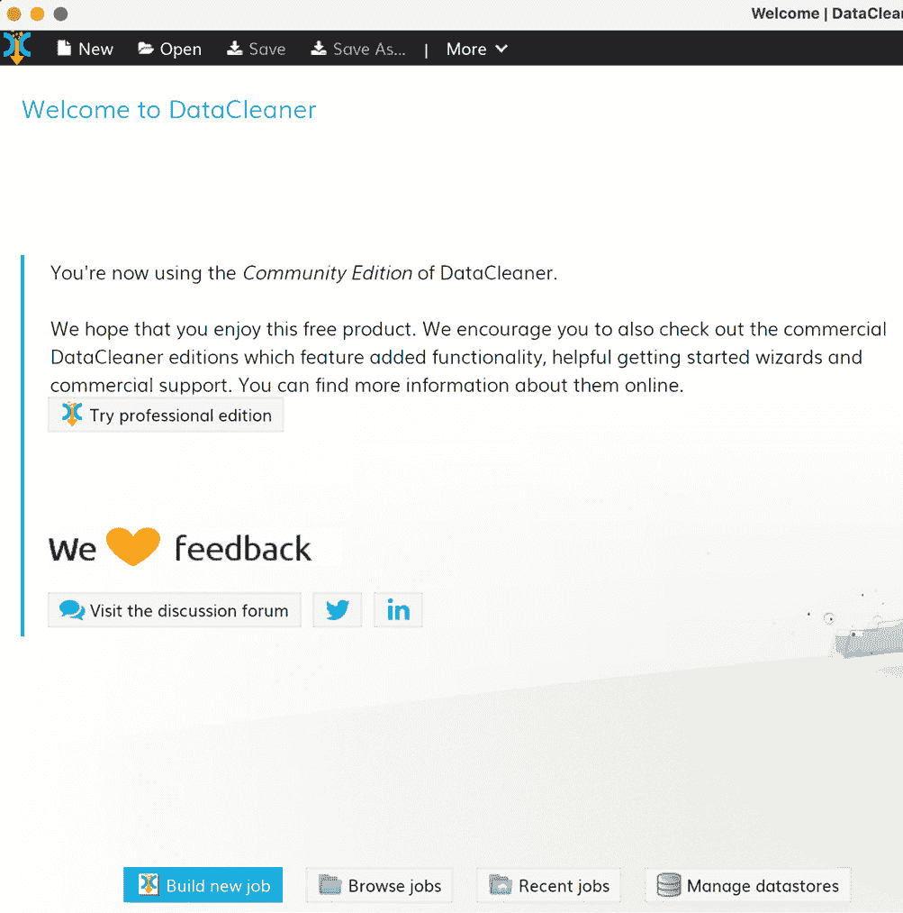

图 4.1 – DataCleaner 欢迎屏幕

1.  然后，将弹出一个对话框，您可以在其中选择数据存储库，如图下所示。在这里，我们将浏览并选择名为`inputData.csv`的输入文件：

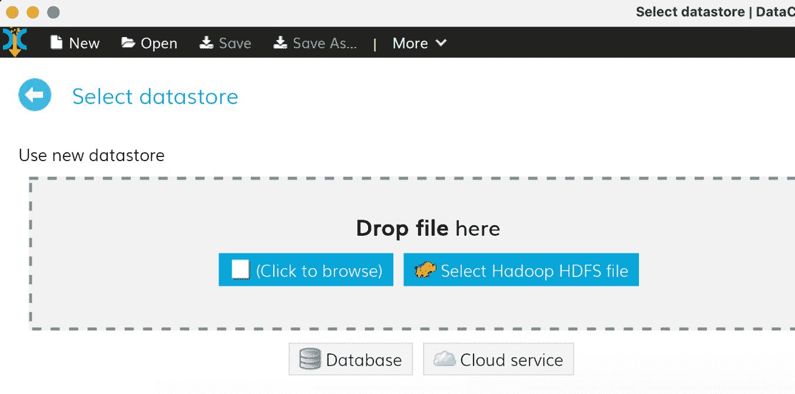

图 4.2 – DataCleaner – 选择数据存储库弹出窗口

一旦选择了数据存储库，我们将在左侧面板的顶部看到我们的数据源。我们应该能够看到我们 CSV 文件的列名。

1.  现在，我们将把我们的数据源`inputData.csv`文件拖放到右侧面板，即管道构建画布。为了分析数据，DataCleaner 在左侧面板的**分析**菜单下提供了各种分析工具，如图所示。对于我们的用例，我们将使用**字符串分析器**：

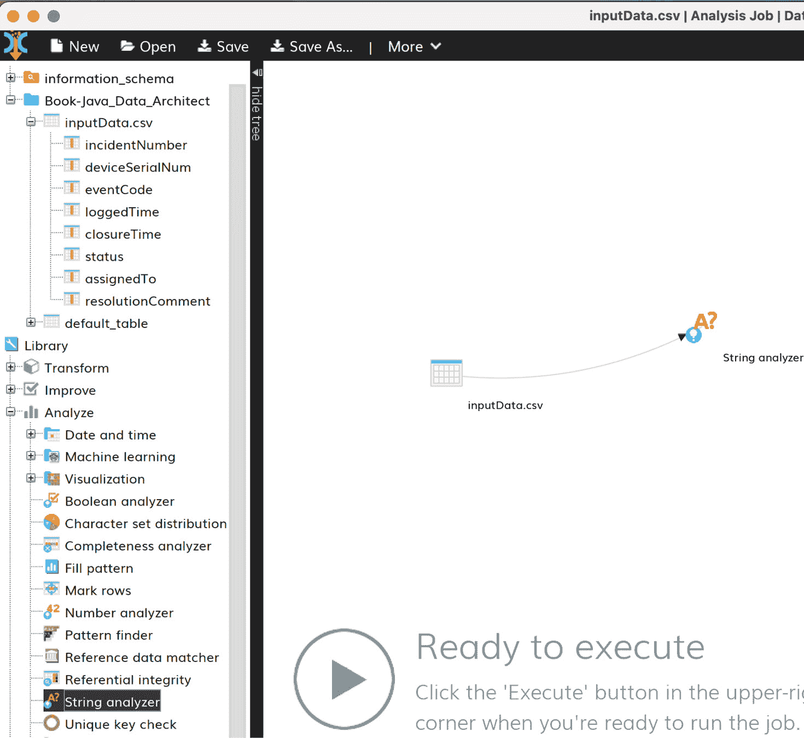

图 4.3 – 创建分析管道

**字符串分析器**分析各种与字符串相关的指标，如 NULL 计数、空白计数、空白字符、字符大小写等。以下截图显示了**字符串分析器**的各种配置选项：

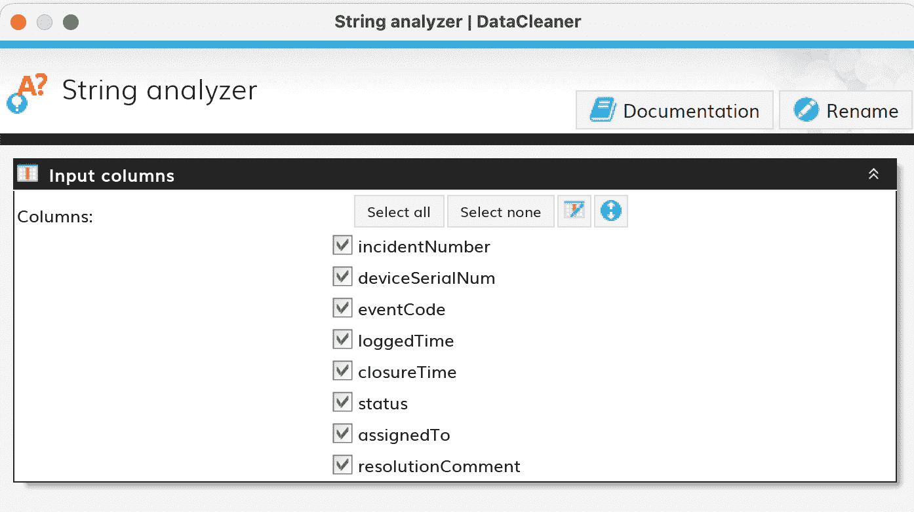

图 4.4 – 添加字符串分析器

1.  我们将添加另一个名为`incidentNumber`、`deviceSerialNum`、`eventCode`和`loggedTime`的分析器，使其成为我们数据仓库的合格条目。

如果缺少任何此类信息，此类记录将不会为我们要解决的问题增加价值。在这里，**完整性分析器**将帮助我们确定我们是否需要特殊检查来处理这些约束，并在这些字段为空时删除记录。以下截图显示了**完整性分析器**的各种配置选项：

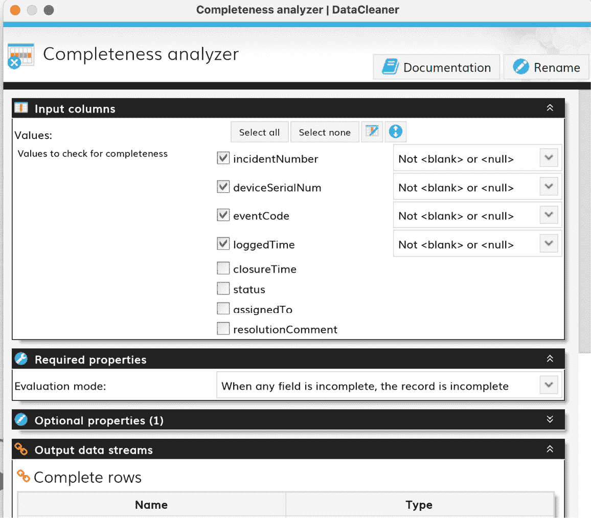

图 4.5 – 添加完整性分析器

我们用例的最终概要分析管道如图下所示：

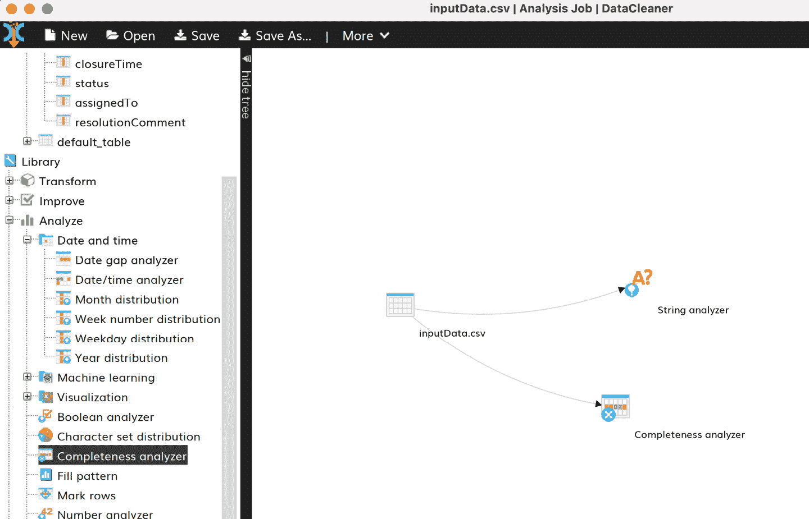

图 4.6 – 最终分析管道

1.  一旦我们执行此管道，**分析结果**将生成，如图下所示：

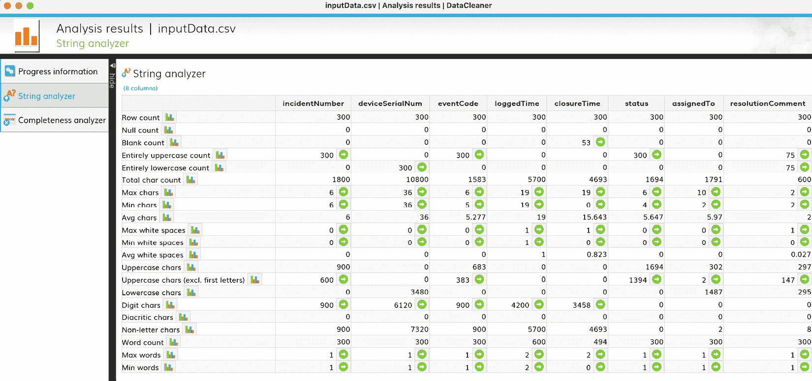

图 4.7 – 分析结果

这种数据概要分析可以为我们提供有关数据的各种信息，这有助于我们调整我们的工具、技术和转换，以创建一个有效且成功的数据工程解决方案。如图所示，我们可以推断出总数据量是 300 行。其中，53 行是开放事件。解决评论中可以有空白，所有`deviceSerialNum`值都是小写，而`status`值都是大写。此类信息有助于我们在设计解决方案时做出有效的决策。

为了讨论的简洁性，我们只展示了一种源数据文件的数据概要分析形式。然而，我们也可以对其他类型的数据集进行同样的分析。在这个用例中，你可以对`device_dm.csv`和`event_dm.csv`文件中的数据进行类似的数据概要分析。

现在我们已经了解了需求，并对源数据有了相当的了解，在下一节中，我们将讨论如何设计模型，以便它可以存储导入的数据。

# 构建有效的数据模型

从我们之前的讨论和数据分析中，我们得出结论，我们的数据是有结构的，因此适合存储在关系型数据模型中。根据需求，我们收集到我们的最终数据存储应该是一个数据仓库。考虑到这两个基本因素，让我们了解关系型数据仓库方案。

## 关系型数据仓库方案

让我们探索在创建我们的数据模型时可以考虑的流行关系型数据仓库方案：

+   **星型模式**：这是最流行的数据仓库方案类型。如图所示，中间有一个**事实表**，每个记录代表一个随时间发生的事实或事件：


图 4.8 – 星型模式

这个**事实表**包含各种维度，其详细信息需要从相关的查找表中查找，这些查找表被称为**维度表**。这个**事实表**通过外键与每个维度表相关联。前面的图示显示了星型模式的外观。由于中间有一个**事实表**被多个侧面的维度表包围，其结构看起来像一颗星，因此得名。

+   **雪花模式**：这是星型模式的一个扩展。就像星型模式一样，在这里，中间有一个**事实表**，周围有多个维度表。然而，在雪花模式中，每个维度表进一步引用其他子维度表，使得结构看起来像雪花：

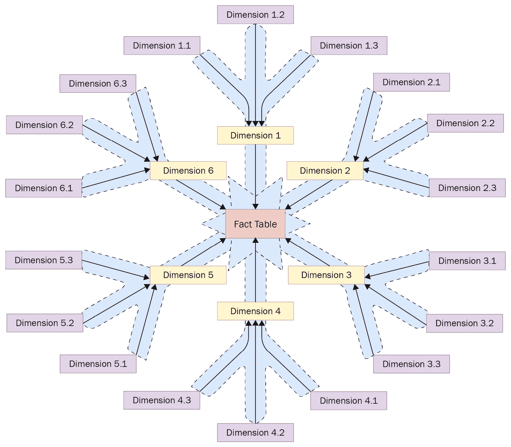

图 4.9 – 雪花模式

在这里，我们可以看到每个维度表是如何通过外键关系与子维度表连接的，这使得结构看起来像雪花，因此得名。

+   **银河模式**：银河模式是一种包含多个事实表的方案。在这里，一个或多个维度表被多个事实表共享。这种方案可以看作是两个或更多星型模式的集合，因此得名。

## 方案设计的评估

对于我们的用例，我们需要评估哪种方案设计最适合我们的用例。

我们应该问的第一个问题是，*在我们的用例中，我们需要多个事实表吗？* 由于我们的事实表只包含设备事件或事故，我们只能有一个事实表。这消除了我们拥有银河模式作为候选数据模型的可能性。现在，我们必须确定星型模式或雪花模式是否适合我们的用例。

要在这两种选择之间做出选择，让我们看看我们的 `inputData.csv` 文件中的以下列：

+   `incidentNumber`

+   `deviceSerialNo`

+   `eventCode`

+   `loggedTime`

+   `closureTime`

+   `status`

+   `assignedTo`

+   `resolutionComments`

通过查看此文件的列名，我们可以断定这是一个设备事件日志文件。这意味着来自 `inputData.csv` 文件的数据需要被摄入到我们的中心事实表中。但是首先，我们需要确定我们是否只需要引用完整的维度表，或者我们的维度表是否需要在另一组维度表中进行进一步的查找。

让我们先从确定 `inputData.csv` 中存在的数据集的候选维度开始。重要的是要记住，候选维度是由构建数据仓库的目的或目标决定的。我们正在构建的数据仓库的目的是获取 `eventType`、设备在不同时间间隔（如小时、月和季度）上的指标以及关闭持续时间指标。

在我们的情况下，`deviceSerialNo` 和 `eventCode` 可以对应于两个称为 `incidentNumber` 的维度，这个维度在每条事实记录中都会变化，因此它不是一个维度的候选者。`status`、`loggedTime` 和 `closureTime` 会从一条记录变化到另一条记录，因此它们最适合作为事实而不是维度。由于我们不对 `assignedTo` 和 `resolutionComment` 字段进行任何分析，我们可以在我们的数据模型中忽略这些列。在现实世界的场景中，通常，传入的源数据文件包含数百列。然而，其中只有一小部分列对于解决问题是有用的。

总是建议只摄入你需要的列。这可以节省空间、复杂性和金钱（记住，如今许多解决方案都是部署在云平台上，或者未来有迁移到云平台的可能，云平台遵循按使用付费的原则，因此你应该只摄入你打算使用的数据）。除此之外，我们的需求要求我们按小时、月和季度对每个事件进行标记，以便可以轻松地对这些间隔进行聚合，并分析小时、月和季度的模式。这种间隔标记可以在保存记录时从 `loggedTime` 中提取，然而，`hour`、`month` 和 `quarter` 可以作为与我们的中心事实表关联的派生维度存储。

因此，从我们的分析来看，很明显我们的事实表只引用那些自身完整的事实表。所以，我们可以得出结论，我们将使用以下一系列表来构建我们的星型模式数据模型：

+   `DEVICE_EVENT_LOG_FACT`：这是一个集中式的事实表，它由每个事件条目组成

+   `DEVICE_DIMENSION`：这是一个维度表，它包含设备查找数据

+   `EVENT_DIMENSION`：这是一个维度表，它包含事件查找数据

+   `HOUR_DIMENSION`：这是一个维度表，它包含静态小时查找数据

+   `MONTH_DIMENSION`：这是一个维度表，它包含静态月份查找数据

+   `QUARTER_DIMENSION`：这是一个维度表，它包含静态季度查找数据

以下图表展示了我们正在构建的数据仓库的详细星型模式数据模型：

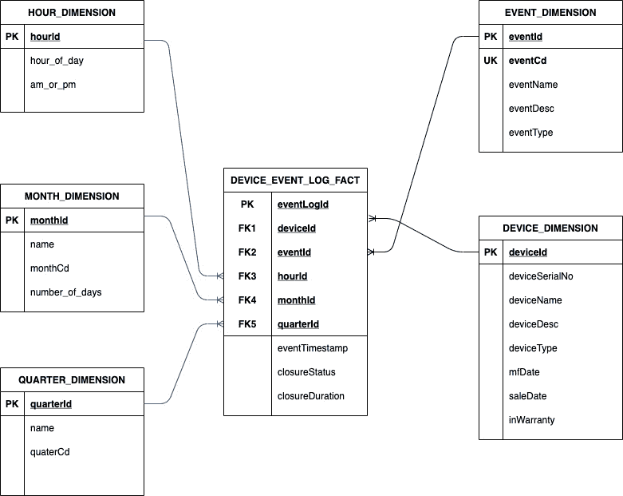

图 4.10 – 我们数据仓库的数据模型

现在，让我们了解前面图表中显示的表及其列：

+   在`DEVICE_EVENT_LOG_FACT`表中，以下情况正在发生：

    1.  我们使用`eventLogId`作为主键，它映射到文件中的`incidentNumber`。

    1.  我们为`DEVICE_DIMENSION`、`EVENT_DIMENSION`、`HOUR_DIMENSION`、`MONTH_DIMENSION`和`QUARTER_DIMENSION`表设置了外键字段

    1.  `eventTimestamp`、`closurestatus`和`closureDuration`都是事实表中每一行的事实

+   `DEVICE_DIMENSION`和`EVENT_DIMENSION`的列由需求以及输入文件（即`device_dm.csv`和`event_dm.csv`）中设备和事件的数据/属性决定。也就是说，这两个表的主键（`deviceId`和`eventId`）应该是系统生成的序列号，分配给记录。这两个表的主键是事实表外键关系中的参考列。

+   除了设备和事件之外，我们还设计了三个其他维度表，表示一天中的小时（`HOUR_DIMENSION`）、月份（`MONTH_DIMENSION`）和季度（`QUARTER_DIMENSION`）。这些是静态查找表，其数据将随着时间的推移始终保持不变。

在数据模型方面，接下来需要做出的设计决策是选择数据库。各种**关系数据库管理系统（RDBMS**）非常适合数据仓库，例如 Snowflake、AWS Redshift、PostgreSQL 和 Oracle。虽然前两种选项是基于云的数据仓库，但其他两种选项可以在本地和云中运行。对于我们的用例，我们应该选择既经济高效又兼容未来的数据库。

在这些选择中，我们将选择 PostgreSQL，因为它是一个功能强大且丰富的免费数据库，适合托管数据仓库。此外，我们的应用程序未来可能迁移到云端。在这种情况下，它可以轻松迁移到 AWS Redshift，因为 AWS Redshift 基于行业标准的 PostgreSQL。

现在我们已经设计好了数据模型并选择了数据库，让我们继续设计解决方案。

# 设计解决方案

为了设计当前问题声明的解决方案，让我们分析我们现在可用的数据点或事实：

+   当前问题是基于批处理的数据工程问题

+   当前的问题是数据摄取问题

+   我们的源是包含结构化数据的 CSV 文件

+   我们的目标是 PostgreSQL 数据仓库

+   我们的数据仓库遵循星型模式，包含一个事实表，两个动态维度表和三个静态维度表

+   考虑到我们的解决方案未来可能迁移到云端，我们应该选择一个与部署平台无关的技术

+   对于本书的背景和范围，我们将基于 Java 技术探索最佳解决方案

基于上述事实，我们可以得出结论，我们必须构建三个类似的数据摄取管道 – 一个用于事实表，另外两个用于动态维度表。在这个时候，我们必须问自己，*如果文件摄取成功或失败，文件会发生什么？我们如何避免再次读取文件？*

我们将从`input`文件夹中读取文件并将其摄取到数据仓库中。如果失败，我们将文件移动到`error`文件夹；否则，我们将文件移动到`archive`文件夹。以下图表展示了我们的发现，并提供了我们提出的解决方案的概述：

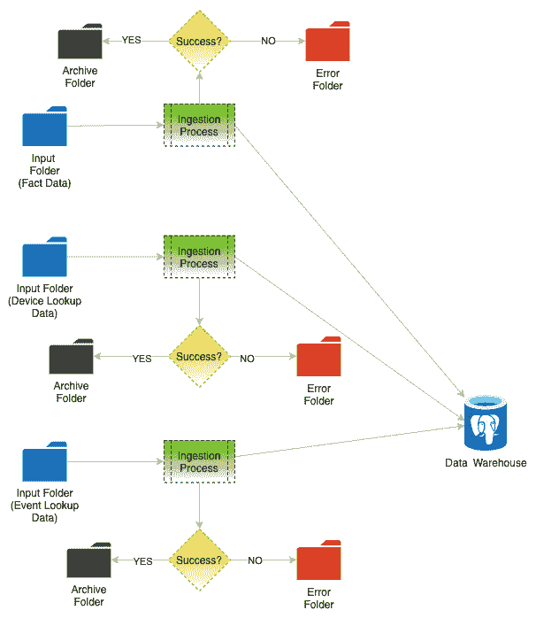

图 – 4.11 – 解决方案概述

然而，这个提出的解决方案只是一个高层次的概述。在这个解决方案中，仍有许多问题尚未得到解答。例如，关于摄取过程或我们应该使用什么技术来解决这个问题，没有详细的说明。

首先，让我们根据我们手头的事实尝试决定一个技术。我们需要找到一个支持批处理摄取的基于 Java 的 ETL 技术。它还应该具有易于使用的 JDBC 支持，以便从 PostgreSQL 写入和读取数据。我们还需要一个调度器来安排批处理摄取作业，并应该有一个重试机制。此外，我们的数据量不大，所以我们想避免基于大数据的 ETL 工具。

Spring Batch 符合所有这些要求。Spring Batch 是一个基于 Java 的优秀的 ETL 工具，用于构建批处理作业。它包含一个作业调度器和作业存储库。此外，由于它是 Spring 框架的一部分，它可以轻松地与 Spring Boot 和 Spring 集成等工具和技术集成。以下图表显示了 Spring Batch 架构的高级组件：


图 4.12 – Spring Batch 架构

以下图表表示 Spring Batch 作业的工作方式。让我们看看 Spring Batch 作业在执行过程中经历的各个步骤：

1.  Spring Batch 作业使用 Spring 的作业调度器来安排作业。

1.  **Spring 作业调度器**运行**作业启动器**，它反过来执行**Spring Batch 作业**。它还在此处创建一个作业实例，并将此信息持久化到作业仓库数据库中。

1.  `batch_job_instance`

1.  `batch_job_execution`

1.  `batch_job_execution_params`

1.  `batch_step_execution`

1.  `batch_job_execution_context`

1.  `batch_step_execution_context`

1.  由**作业启动器**执行的**Spring Batch 作业**启动单个步骤以执行作业。每个步骤执行特定任务以实现作业的整体目标。

1.  虽然在作业实例的所有步骤中都有一个**作业执行上下文**，但在每个执行步骤中都有一个**步骤执行上下文**。

1.  通常，Spring Batch 配置有助于将每个步骤按所需顺序连接起来，以创建 Spring Batch 管道。

1.  每一步，依次使用`Reader`或`ItemReader`读取数据，使用`Processor`或`ItemProcessor`处理数据，并使用`Writer`或`ItemWriter`写入处理后的数据。

现在我们对 Spring Batch 架构有了相当的了解，我们将使用 Spring Batch 作业框架来设计我们的数据摄取管道。以下图表显示了我们的数据摄取管道的架构：

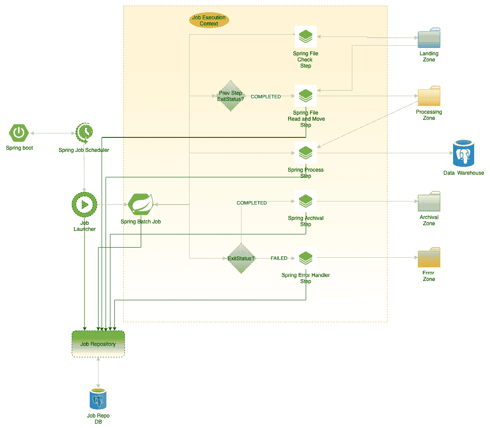

图 4.13 – 解决方案架构

让我们更详细地看看这个解决方案：

1.  像所有**Spring Batch 作业**一样，**Spring 作业调度器**安排一个**作业启动器**，该启动器实例化 Spring 作业。

1.  在我们的用例中，我们将使用总共三个顺序步骤和两个条件步骤来完成作业。

1.  在第一步中，应用程序检查输入文件夹中是否有新文件或`JobExecutionContext`，并将**退出状态**标记为**完成**。

1.  如果`JobExecutionContext`从**着陆区**到**处理区**。

1.  完成第二步后，第三步（**Spring 处理步骤**）被启动。第三步将数据转换并加载到数据仓库中。

1.  完成第三步后，启动**Spring 存档步骤**，该步骤将处理后的文件从处理文件夹移动到存档文件夹。

1.  然而，如果**字符串处理步骤**失败，将启动**Spring 错误处理步骤**，其中将文件从**处理区域**文件夹移动到**错误区域**文件夹。

在本节中，我们学习了如何使用可用的事实和数据点逻辑上划分解决方案，并为问题提出一个最佳架构。我们还学习了每个解决方案的有效性取决于我们选择的技术堆栈。

在下一节中，我们将学习如何使用 Spring Batch 和相关技术实现和测试我们的解决方案。

# 实现和单元测试解决方案

在本节中，我们将构建 Spring Batch 应用程序来实现我们在上一节中设计的解决方案。我们还将运行和测试该解决方案。

首先，我们必须理解不同的作业将有自己的计划。然而，维度表需要在事实表之前加载，因为维度表是查找表。

为了讨论的简洁性，我们将只实现事实表的 Spring Batch 应用程序。在这个实现中，我们将手动将设备数据和事件数据从 CSV 文件加载到表中。然而，您可以通过实现解决方案并开发两个不同的 Spring Batch 应用程序来跟踪设备和事件维度表来跟随讨论的引导。在这个实现中，我们假设设备数据和事件数据已经加载到数据仓库中。

您可以通过执行以下 GitHub 链接中提供的 DML 来手动完成此操作：[`github.com/PacktPublishing/Scalable-Data-Architecture-with-Java/blob/main/Chapter04/SQL/chapter4_ddl_dml.sql`](https://github.com/PacktPublishing/Scalable-Data-Architecture-with-Java/blob/main/Chapter04/SQL/chapter4_ddl_dml.sql).

我们需要首先创建一个 Spring Boot Maven 项目并添加所需的 Maven 依赖项。以下 Maven 依赖项应添加到`pom.xml`文件中，如下所示：

```java
<dependencies>
    <dependency>
        <groupId>org.springframework.boot</groupId>
        <artifactId>spring-boot-starter-batch</artifactId>
        <version>2.4.0</version>
    </dependency>
    <dependency>
        <groupId>org.springframework.boot</groupId>
        <artifactId>spring-boot-starter-jdbc</artifactId>
        <version>2.4.0</version>
    </dependency>
    <!-- https://mvnrepository.com/artifact/org.postgresql/postgresql -->
    <dependency>
        <groupId>org.postgresql</groupId>
        <artifactId>postgresql</artifactId>
        <version>42.3.1</version>
    </dependency>
    <dependency>
        <groupId>org.slf4j</groupId>
        <artifactId>slf4j-api</artifactId>
        <version>2.0.0-alpha0</version>
    </dependency>
    <dependency>
        <groupId>org.slf4j</groupId>
        <artifactId>slf4j-log4j12</artifactId>
        <version>2.0.0-alpha0</version>
        <scope>runtime</scope>
    </dependency>
</dependencies>
```

在这里添加了两个 Spring 依赖项：`spring-boot-starter-batch`用于 Spring Batch，`spring-boot-starter-jdbc`用于与`postgreSQL`数据库（用作数据仓库和 Spring Batch 存储库数据库）通信。除此之外，还添加了 PostgreSQL 的 JDBC 驱动程序和日志依赖项。

根据我们的架构，让我们首先创建 Spring Boot 应用程序的入口点，即`Main`类，并初始化作业调度器。以下代码表示我们的`Main`类：

```java
@EnableConfigurationProperties
@EnableScheduling
@ComponentScan ({"com.scalabledataarchitecture.etl.*", "com.scalabledataarchitecture.etl.config.*"})
@SpringBootApplication
public class EtlDatawarehouseApplication {
    private static Logger LOGGER = LoggerFactory.getLogger(EtlDatawarehouseApplication.class);

    @Autowired
    JobLauncher jobLauncher;
    @Autowired
    Job etlJob;
    public static void main(String[] args) {
        try {
            SpringApplication.run(EtlDatawarehouseApplication.class, args);
        }catch (Throwable ex){
            LOGGER.error("Failed to start Spring Boot application: ",ex);
        }
    }
    @Scheduled(cron = "0 */1 * * * ?")
    public void perform() throws Exception
    {
        JobParameters params = new JobParametersBuilder().addString("JobID", String.valueOf(System.currentTimeMillis())).toJobParameters();
        jobLauncher.run(etlJob, params);
    }
}
```

`@SpringBootApplication`注解表示这个类是 Spring Boot 应用程序的入口点。此外，请注意，`@EnableScheduling`注解表示这个应用程序支持 Spring 作业调度。带有`@Scheduled`注解的方法有助于在配置的计划时间间隔内执行计划功能。

Spring Batch 作业调度器支持以下代码块中显示的所有三种格式：

```java
@Scheduled(fixedDelayString = "${fixedDelay.in.milliseconds}")
@Scheduled(fixedRateString = "${fixedRate.in.milliseconds}")
@Scheduled(cron = "${cron.expression}")
```

在这里，`fixedDelayString`确保在作业结束和另一个作业开始之间有*n*毫秒的延迟。`fixedRateString`每*n*毫秒运行计划中的作业，而`cron`使用某些 cron 表达式来安排作业。在我们的情况下，我们使用 cron 表达式来安排`perform()`方法。

`perform()` 方法添加了一个名为 `JobID` 的作业参数，并使用 `jobLauncher` 触发名为 `etlJob` 的 Spring Batch 作业。`jobLauncher` 是 `JobLauncher` 类型的自动装配实例。

如前所述，`EtlDatawarehouseApplication` 类中的 `etlJob` 字段也是自动装配的，因此它是一个 Spring 实例。

接下来，我们将探讨创建 `etlJob` 实例的 Spring Batch 配置文件：

```java
@Configuration
@EnableBatchProcessing
public class BatchJobConfiguration {
    @Bean
    public Job etlJob(JobBuilderFactory jobs,
                      Step fileCheck, Step fileMoveToProcess, Step processFile,Step fileMoveToArchive, Step fileMoveToError) {
        return jobs.get("etlJob")
                .start(fileCheck).on(ExitStatus.STOPPED.getExitCode()).end()
                .next(fileMoveToProcess)
                .next(processFile).on(ExitStatus.COMPLETED.getExitCode()).to(fileMoveToArchive)
                .from(processFile).on(ExitStatus.FAILED.getExitCode()).to(fileMoveToError)
                .end()
                .build();
    }
}
```

如您所见，该类被注解为 `@Configuration` 和 `@EnableBatchProcessing`。这确保了 `BatchJobConfiguration` 类被注册为 Spring 中的一个配置实例，以及一些其他与批量相关的实例组件，例如 `JobLauncher`、`JobBuilderFactory`、`JobRepository` 和 `JobExplorer`。

`etlJob()` 函数使用 `JobBuilderFactory` 创建步骤管道，正如设计阶段所描述的。`etlJob` 管道从 `fileCheck` 步骤开始。如果 `fileCheck` 步骤的退出状态是 `STOPPED`，则批量作业结束；否则，它将移动到下一个步骤——即 `fileMoveToProcess`。下一个步骤是 `processFile`。从 `processFile` 步骤返回 `COMPLETED` 后，将调用 `moveToArchive` 步骤。然而，如果返回 `ExitStatus` 为 `FAILED`，则调用 `moveToError` 步骤。

然而，我们可以创建一个 `etlJob` 实例。为此，我们需要创建所有拼接在一起形成批量作业管道的步骤实例。让我们首先看看如何创建 `fileCheck` 实例。

要创建 `fileCheck` 实例，我们编写了以下两个类：

+   `FileCheckConfiguration`：一个配置类，其中初始化了 `fileCheck` 实例。

+   `FileCheckingTasklet`：用于 `fileCheck` 步骤的 `Tasklet` 类。`Tasklet` 的目的是在步骤内执行单个任务。

`FileCheckingTasklet` 是一个 `Tasklet`，因此它将实现 `Tasklet` 接口。代码将类似于以下内容：

```java
public class FileCheckingTasklet implements Tasklet{
//...
}
```

`Tasklet` 只包含一个必须实现的方法——`execute()`，它具有以下类型签名：

```java
public RepeatStatus execute(StepContribution stepContribution, ChunkContext chunkContext) throws Exception
```

在 `FileCheckingTasklet` 中，我们希望检查是否在目标区域中存在任何文件。我们使用此 `Tasklet` 的主要目的是根据文件是否存在来更改任务的 `EXITSTATUS` 属性。Spring Batch 提供了一个名为 `StepExecutionListener` 的接口，使我们能够根据我们的需求修改 `EXITSTATUS`。这可以通过实现 `StepExecutionListener` 的 `afterStep()` 方法来完成。`StepExecutionListener` 的接口定义如下：

```java
public interface StepExecutionListener extends StepListener {
    void beforeStep(StepExecution var1);
    @Nullable
    ExitStatus afterStep(StepExecution var1);
}
```

因此，我们的 `FileCheckingTasklet` 将类似于以下内容：

```java
public class FileCheckingTasklet implements Tasklet, StepExecutionListener {
//...
@Override
public RepeatStatus execute(StepContribution stepContribution, ChunkContext chunkContext) throws Exception {
//...
}
@Override
public ExitStatus afterStep(StepExecution stepExecution) {
//...
}
}
```

现在，让我们理解我们想要在这个`Tasklet`中执行的逻辑。我们想要列出着陆区目录中的所有文件。如果没有文件存在，我们想要将`EXITSTATUS`设置为`STOPPED`。如果我们找到一个或多个文件，我们想要将`EXITSTATUS`设置为`COMPLETED`。如果在列出目录时发生错误，我们将设置`EXITSTATUS`为`FAILED`。由于我们可以在`afterStep()`方法中修改`EXITSTATUS`，因此我们将在这个方法中编写我们的逻辑。然而，我们想要在我们的应用程序中配置我们的着陆区文件夹。我们可以通过使用一个名为`EnvFolderProperty`的配置 POJO 来实现这一点（我们将在本章后面讨论这个类的代码）。以下是`afterstep()`方法的逻辑：

```java
@Override
public ExitStatus afterStep(StepExecution stepExecution) {
    Path dir = Paths.get(envFolderProperty.getRead());
    LOGGER.debug("Checking if read directory {} contains some files...", dir);
    try {
        List<Path> files = Files.list(dir).filter(p -> !Files.isDirectory(p)).collect(Collectors.toList());
        if(files.isEmpty()) {
            LOGGER.info("Read directory {} does not contain any file. The job is stopped.", dir);
            return ExitStatus.STOPPED;
        }
        LOGGER.info("Read directory {} is not empty. We continue the job.", dir);
        return ExitStatus.COMPLETED;
    } catch (IOException e) {
        LOGGER.error("An error occured while checking if read directory contains files.", e);
        return ExitStatus.FAILED;
    }
}
```

由于我们不想在这个`Tasklet`中执行任何其他处理，我们将让`execute()`方法通过一个`RepeatStatus`为`FINISHED`的状态通过。因此，`FileCheckingTasklet`的完整代码如下：

```java
public class FileCheckingTasklet implements Tasklet, StepExecutionListener {
    private final static Logger LOGGER = LoggerFactory.getLogger(FileCheckingTasklet.class);
    private final EnvFolderProperty envFolderProperty;
    public FileCheckingTasklet(EnvFolderProperty envFolderProperty) {
        this.envFolderProperty = envFolderProperty;
    }
    @Override
    public void beforeStep(StepExecution stepExecution) {
    }
    @Override
    public RepeatStatus execute(StepContribution stepContribution, ChunkContext chunkContext) throws Exception {
        return RepeatStatus.FINISHED;
    }
    @Override
    public ExitStatus afterStep(StepExecution stepExecution) {
        // Source code as shown in previous discussion ...
    }
}
```

现在，让我们看看我们如何使用`FileCheckingTasklet`来创建`fileCheck`步骤。在`FileCheckConfiguration`配置类中，首先，我们为`FileCheckingTasklet`创建一个 bean，如下所示：

```java
@Bean
public Tasklet fileCheckingTasklet(EnvFolderProperty envFolderProperty) {
    return new FileCheckingTasklet(envFolderProperty);
}
```

然后，我们使用这个 bean 创建`fileCheck`步骤 bean，如下所示：

```java
@Bean
public Step fileCheck(StepBuilderFactory stepBuilderFactory, Tasklet fileCheckingTasklet) {
    return stepBuilderFactory.get("fileCheck")
            .tasklet(fileCheckingTasklet)
            .build();
}
```

最后，`FileCheckConfiguration`配置类的完整代码如下：

```java
@Configuration
public class FileCheckConfiguration {
    @Bean
    public Tasklet fileCheckingTasklet(EnvFolderProperty envFolderProperty) {
        return new FileCheckingTasklet(envFolderProperty);
    }
    @Bean
    public Step fileCheck(StepBuilderFactory stepBuilderFactory, Tasklet fileCheckingTasklet) {
        return stepBuilderFactory.get("fileCheck")
                .tasklet(fileCheckingTasklet)
                .build();
    }
}
```

在前面的步骤中，我们学习了如何使用`Tasklet`和`StepExecutionListener`接口创建步骤，并使用 Spring 的强大注解（如`@Bean`、`@Configuration`和`@AutoWired`）实例化和利用它们。

重要提示

Spring Batch 提供了各种监听器（监听器接口），可以在不同的级别拦截、监听并对 Spring Batch 作业流程做出反应。如果您感兴趣，您可以在[`howtodoinjava.com/spring-batch/spring-batch-event-listeners/`](https://howtodoinjava.com/spring-batch/spring-batch-event-listeners/)了解更多关于 Spring Batch 监听器的信息。

现在，我们将继续到下一个步骤，称为`moveFileToProcess`，并看看我们如何实现其设计。同样，为了实现`moveFileToProcess`步骤，我们将编写一个名为`FileMoveToProcessConfiguration`的配置文件和一个名为`FileMoveToProcessTasklet`的任务文件。

首先，让我们构建我们的`FileMoveToProcessTasklet`任务。为了构建我们的任务，我们将定义在使用它时想要完成的任务。以下是我们要使用此任务完成的任务：

+   列出着陆区中存在的文件

+   一次移动一个文件到处理区

+   将目标完整文件路径（处理区的文件路径）作为键值条目添加到`JobExecutionContext`

就像我们之前开发的那个任务`FileMoveToProcessTasklet`一样，它也将实现`Tasklet`和`StepExecutionListener`接口。

以下代码显示了我们对`Tasklet`接口的`execute()`函数的实现：

```java
@Override
public RepeatStatus execute(StepContribution stepContribution, ChunkContext chunkContext) throws Exception {
    Path dir = Paths.get(envFolderProperty.getRead());
    assert Files.isDirectory(dir);
    List<Path> files = Files.list(dir).filter(p -> !Files.isDirectory(p)).collect(Collectors.toList());
    if(!files.isEmpty()) {
        Path file = files.get(0);
        Path dest = Paths.get(envFolderProperty.getProcess() + File.separator + file.getFileName());
        LOGGER.info("Moving {} to {}", file, dest);
        Files.move(file, dest);
        filepath = dest;
    }
    return RepeatStatus.FINISHED;
}
```

首先，我们从着陆区（读取目录路径）列出文件，如果文件列表不为空，我们就获取第一个文件并将其移动到目标路径。在这里，我们通过将文件名和文件分隔符附加到处理目录来创建目标路径。

一旦文件成功移动到目标位置，我们将`filepath`实例变量的值设置为文件已移动到的目标路径。我们将在我们的`afterStep()`方法实现中使用它。现在，让我们看看`afterStep()`方法的实现，如下所示：

```java
@Override
public ExitStatus afterStep(StepExecution stepExecution) {
    if(filepath != null) {
        stepExecution.getJobExecution().getExecutionContext().put("filepath", filepath);
        stepExecution.getJobExecution().getExecutionContext().put("filepathName", filepath.toString());
    }
    return ExitStatus.COMPLETED;
}
```

在`afterStep()`方法实现中，如果`filePath`不为空（这意味着在任务执行期间至少有一个文件存在于着陆区，并且已被任务成功移动到处理区），我们在`JobExecutionContext`中存储两个键值条目（`filePath`和`filePathName`）。

现在，让我们看看`FileMoveToProcessTasklet`类的完整代码：

```java
public class FileMoveToProcessTasklet implements Tasklet, StepExecutionListener {
    private final static Logger LOGGER = LoggerFactory.getLogger(FileMoveToProcessTasklet.class);
    private final EnvFolderProperty envFolderProperty;
    private Path filepath;
    public FileMoveToProcessTasklet(EnvFolderProperty envFolderProperty) {
        this.envFolderProperty = envFolderProperty;
    }
    @Override
    public void beforeStep(StepExecution stepExecution) {
    }
    @Override
    public RepeatStatus execute(StepContribution stepContribution, ChunkContext chunkContext) throws Exception {
   // Source code as shown in previous discussion ...
 }
    @Override
    public ExitStatus afterStep(StepExecution stepExecution) {
     // Source code as shown in previous discussion ...            
    }
}
```

`FileMoveToProcessConfiguration`的源代码将与之前讨论的`FileCheckConfiguration`非常相似。

`FileMoveToProcessConfiguration`的源代码如下：

```java
@Configuration
public class FileMoveToProcessConfiguration {
    @Bean
    public Tasklet fileMoveToProcessTasklet(EnvFolderProperty envFolderProperty) {
        return new FileMoveToProcessTasklet(envFolderProperty);
    }
    @Bean
    public Step fileMoveToProcess(StepBuilderFactory stepBuilderFactory, Tasklet fileMoveToProcessTasklet) {
        return stepBuilderFactory.get("fileMoveToProcess")
                .tasklet(fileMoveToProcessTasklet)
                .build();
    }
}
```

现在，我们将学习如何开发`processFile`步骤。这是一个重要的步骤，因为所有的转换和摄取都发生在这里。这个步骤遵循典型的`SpringBatch`步骤模板，其中有一个`ItemReader`、`ItemProcessor`和`ItemWriter`。它们被缝合在一起形成步骤管道。

首先，让我们看看`ProcessFileConfiguration`配置类中`processFile()`方法构建步骤管道的源代码：

```java
@Bean
public Step processFile(StepBuilderFactory stepBuilderFactory, ItemReader<EventLogODL> csvRecordReader, JdbcBatchItemWriter<DeviceEventLogFact> jdbcWriter) {
    return stepBuilderFactory.get("processFile")
            .<EventLogODL, DeviceEventLogFact>chunk(chunkSize)
            .reader(csvRecordReader)
            .processor(deviceEventProcessor)
            .writer(jdbcWriter)
            .build();
}
```

在这里，我们正在从名为`csvRecordReader`的`ItemReader` Bean 构建步骤，该 Bean 从 CSV 文件中读取记录并返回一组`EventLogODL` POJO 对象。一个名为`deviceEventProcessor`的`ItemProcessor` Bean，它读取每个`EventLogODL` POJO 并将它们转换成`DeviceEventLogFact` POJOs，以及一个名为`jdbcWriter`的`ItemWriter` Bean，它读取每个记录作为`DeviceEventLogFact` POJO 并将它们持久化到 PostgreSQL 数据仓库。我们在构建管道时也提到了`chunk`，同时使用`chunkSize`作为可配置参数（为了学习目的，我们将使用`chunkSize`为`1`进行测试）。

在解释如何开发`ItemReader` Bean 之前，让我们看看`EventLogODL` POJO 类的源代码：

```java
public class EventLogODL {
    private String incidentNumber;
    private String deviceSerialNum;
    private String eventCode;
    private String loggedTime;
    private String closureTime;
    private String status;
    private String assignedTo;
    private String resolutionComment;
  // Getters and Setter of the instance fields
 } 
```

现在，让我们看看创建`ItemReader` Bean 的方法：

```java
@Bean
@StepScope
public FlatFileItemReader<EventLogODL> csvRecordReader(@Value("#{jobExecutionContext['filepathName']}")  String filePathName)
        throws UnexpectedInputException, ParseException {
    FlatFileItemReader<EventLogODL> reader = new FlatFileItemReader<EventLogODL>();
    DelimitedLineTokenizer tokenizer = new DelimitedLineTokenizer();
    String[] tokens = { "incidentNumber","deviceSerialNum","eventCode","loggedTime","closureTime","status","assignedTo","resolutionComment" };
    tokenizer.setNames(tokens);
    reader.setResource(new FileSystemResource(filePathName));
    reader.setLinesToSkip(1);
    DefaultLineMapper<EventLogODL> lineMapper =
            new DefaultLineMapper<EventLogODL>();
    lineMapper.setLineTokenizer(tokenizer);
    lineMapper.setFieldSetMapper(new BeanWrapperFieldSetMapper<EventLogODL>(){
        {
            setTargetType(EventLogODL.class);
        }
    });
    reader.setLineMapper(lineMapper);
    return reader;
}
```

在这里，我们使用 Spring Batch 内置的`FlatFileItemReader`来读取 CSV 源文件。由于我们需要从`jobExecutionContext`中动态读取`filePathName`，这是我们之前设置的，所以我们使用了`@SetScope`注解，它将默认的 bean 作用域从单例改为步骤特定的对象。这个注解在需要从`JobExecutionContext`或`StepExecutionContext`动态读取某些参数的后期绑定中特别有用。此外，我们创建了一个带有`fieldNames`的分隔符标记化器，以及一个`BeanWrapperFieldSetMapper`来将每条记录映射到`EventLogODL` POJO，并设置`FlatfileItemReader`实例的相应属性。

故障排除技巧

在一个理想的世界里，所有数据都是完美的，我们的作业应该每次都能正常运行。但现实并非如此。如果数据损坏会怎样？如果文件中的几个记录没有遵循正确的模式会怎样？我们如何处理这种情况？

没有简单的答案。然而，Spring Batch 为你提供了一些处理失败的能力。如果文件本身损坏且不可读，或者文件没有适当的读写权限，那么在构建步骤时将进入`faultTolerance`状态。这可以通过使用`skipLimit()`、`skip()`和`noSkip()`方法或使用自定义的`SkipPolicy`来实现。在我们的例子中，我们可以在`ProcessFileConfiguration`类的`processFile`方法中添加容错性，并跳过某些类型的异常，同时确保其他类型的异常导致步骤失败。以下代码展示了示例：

`return stepBuilderFactory.get("processFile")`

`        .<EventLogODL, DeviceEventLogFact>chunk(chunkSize)`

`        .reader(csvRecordReader)`

`.faultTolerant().skipLimit(20).skip(SAXException.class).noSkip(AccessDeniedException.class)`

`        .processor(deviceEventProcessor)`

`        .writer(jdbcWriter)`

`        .build();`

正如我们所见，我们可以在`stepBuilderFactory.build()`中通过链式调用`faultTolerant()`方法来增加容错性。然后，我们可以链式调用`skip()`方法，使其跳过 20 个`SAXException`类型的错误，并使用`noSkip()`方法确保`AccessDeniedException`总会导致**步骤失败**。

现在，让我们看看如何开发我们的自定义`ItemProcessor`。名为`DeviceEventProcessor`的自定义`ItemProcessor`的源代码如下所示：

```java
@Component
public class DeviceEventProcessor implements ItemProcessor<EventLogODL, DeviceEventLogFact> {
    @Autowired
    DeviceEventLogMapper deviceEventLogMapper;
    @Override
    public DeviceEventLogFact process(EventLogODL eventLogODL) throws Exception {
        return deviceEventLogMapper.map(eventLogODL);
    }
}
```

正如你所见，我们已经实现了`ItemProcessor`接口，其中我们需要实现`process()`方法。为了将`EventLogODL` POJO 转换为`DeviceEventLogFact` POJO，我们创建了一个名为`DeviceEventLogMapper`的代理组件。`DeviceEventLogMapper`的源代码如下：

```java
@Component
public class DeviceEventLogMapper {
    @Autowired
    JdbcTemplate jdbcTemplate;
    public DeviceEventLogFact map(EventLogODL eventLogODL){
        String sqlForMapper = createQuery(eventLogODL);
        return jdbcTemplate.queryForObject(sqlForMapper,new BeanPropertyRowMapper<>(DeviceEventLogFact.class));
    }
    private String createQuery(EventLogODL eventLogODL){
        return String.format("WITH DEVICE_DM AS\n" +
                "\t(SELECT '%s' AS eventLogId "+ ...,eventLogODL.getIncidentNumber(),eventLogODL.getDeviceSerialNum(),...);
    }
```

由于我们正在为事实表编写代码，我们需要从不同的维度表中获取各种主键来填充我们的 `DeviceEventLogFact` POJO。在这里，我们通过使用 `jdbcTemplate` 动态创建查询来从数据仓库中获取维度主键，并从其 `resultset` 中填充 `DeviceEventLogFact` POJO。`DeviceEventLogMapper` 的完整源代码可在 GitHub 上找到，链接为 [`github.com/PacktPublishing/Scalable-Data-Architecture-with-Java/blob/main/Chapter04/SpringBatchApp/EtlDatawarehouse/src/main/java/com/scalabledataarchitecture/etl/steps/DeviceEventLogMapper.java`](https://github.com/PacktPublishing/Scalable-Data-Architecture-with-Java/blob/main/Chapter04/SpringBatchApp/EtlDatawarehouse/src/main/java/com/scalabledataarchitecture/etl/steps/DeviceEventLogMapper.java)。

最后，我们将在 `ProcessFileConfiguration` 类中创建一个名为 `jdbcwriter` 的 `ItemWriter`，如下所示：

```java
@Bean
public JdbcBatchItemWriter<DeviceEventLogFact> jdbcWriter() {
    JdbcBatchItemWriter<DeviceEventLogFact> writer = new JdbcBatchItemWriter<>();
    writer.setItemSqlParameterSourceProvider(new BeanPropertyItemSqlParameterSourceProvider<>());
    writer.setSql("INSERT INTO chapter4.device_event_log_fact(eventlogid,deviceid,eventid,hourid,monthid,quarterid,eventtimestamp,closurestatus,closureduration) VALUES (:eventLogId, :deviceId, :eventId, :hourId, :monthId, :quarterId, :eventTimestamp, :closureStatus, :closureDuration)");
    writer.setDataSource(this.dataSource);
    return writer;
}
```

最后，我们的 `ProcessFileConfiguration` 类的源代码如下所示：

```java
@Configuration
@SuppressWarnings("SpringJavaAutowiringInspection")
public class ProcessFileConfiguration {
    private final static Logger LOGGER = LoggerFactory.getLogger(ProcessFileConfiguration.class);

    @Value("${process.chunk_size:1}")
    int chunkSize;
    @Autowired
    DataSource dataSource;
    @Autowired
    DeviceEventProcessor deviceEventProcessor;

    @Bean
    @StepScope
    public FlatFileItemReader<EventLogODL> csvRecordReader(@Value("#{jobExecutionContext['filepathName']}")  String filePathName)
            throws UnexpectedInputException, ParseException {
        // Source code as shown in previous discussion ...
    }
    @Bean
    public JdbcBatchItemWriter<DeviceEventLogFact> jdbcWriter() {
// Source code as shown in previous discussion ...

 }
    @Bean
    public Step processFile(StepBuilderFactory stepBuilderFactory, ItemReader<EventLogODL> csvRecordReader, JdbcBatchItemWriter<DeviceEventLogFact> jdbcWriter) {

    // Source code as shown in previous discussion ...
    }
}
```

现在我们已经构建了代码，我们将在 `resource` 文件夹中存在的 `application.yaml` 文件中配置我们的属性，如下所示：

```java
spring:
  datasource:
    url: jdbc:postgresql://localhost:5432/sinchan
    username: postgres
    driverClassName: org.postgresql.Driver
  batch:
    initialize-schema: always
env:
  folder:
    read: /Users/sinchan/Documents/Personal_Docs/Careers/Book-Java_Data_Architect/chapter_4_pgrm/landing
    process: /Users/sinchan/Documents/Personal_Docs/Careers/Book-Java_Data_Architect/chapter_4_pgrm/process
    archive: /Users/sinchan/Documents/Personal_Docs/Careers/Book-Java_Data_Architect/chapter_4_pgrm/archive
    error: /Users/sinchan/Documents/Personal_Docs/Careers/Book-Java_Data_Architect/chapter_4_pgrm/error
```

如 `.yaml` 文件所示，我们必须提及 `spring.datasource` 属性，以便 Spring JDBC 可以自动自动连接数据源组件。

我们最终的代码结构如下所示：

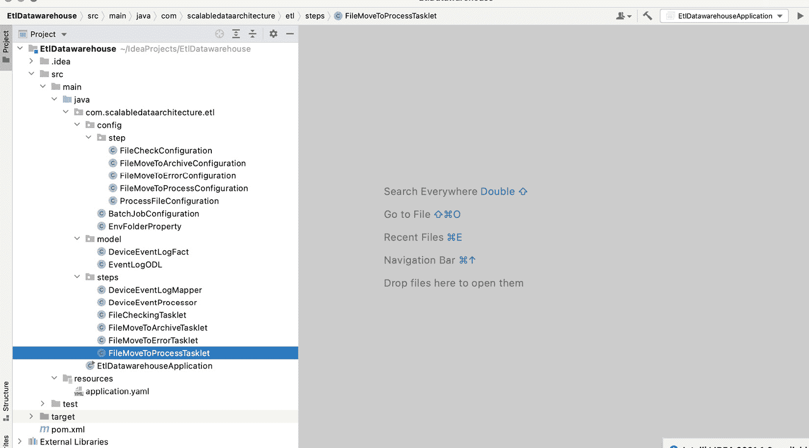

图 4.14 – 代码的项目结构

我们可以通过在最喜欢的 IDE 中运行 `Main` 类（即 `EtlDataWarehouseApplication`）来运行和测试我们的程序。在运行我们的 Spring Batch 应用程序之前，我们必须安装 Postgres，创建模式和数据表，并填充所有维度表。详细的运行说明可以在本书的 GitHub 仓库中找到。

一旦我们运行了应用程序并将数据放置在着陆区，它就会被导入我们的数据仓库事实表，CSV 文件会被移动到存档区，如下面的截图所示：

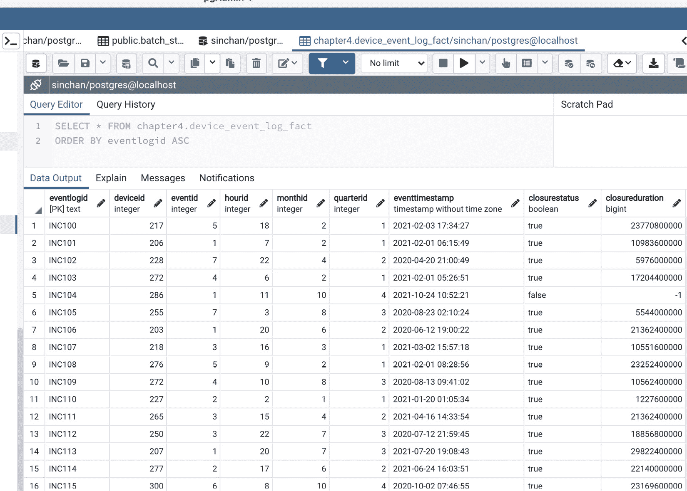

图 4.15 – Spring Batch 作业运行后事实表中的数据导入

我们还可以看到与批处理相关的表，其中包含各种运行统计信息，如下面的截图所示：


图 4.16 – 批处理作业执行日志

前面的截图显示了已运行的各个批处理作业的批执行日志。我们可以通过查看批步骤执行日志来了解更多关于特定作业的信息，如下面的截图所示：

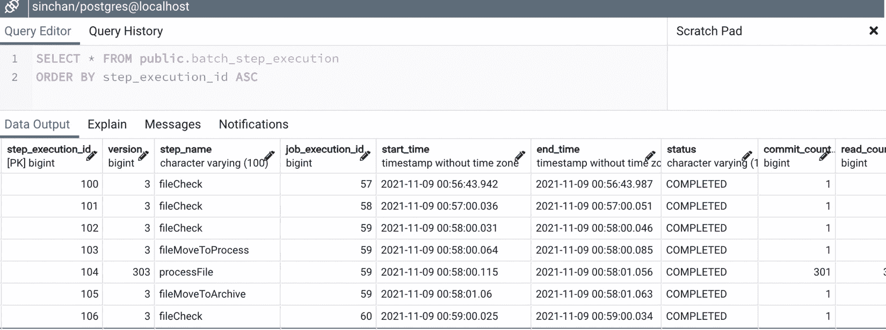

图 4.17 – 批处理作业的步骤执行日志

通过这样，我们已经成功分析了、架构设计、开发并测试了一个基于批次的 ETL 数据摄取管道。正如在*技术要求*章节中提到的，详细的源代码可以在本书的 GitHub 仓库中找到。

# 摘要

在本章中，我们学习了如何从头开始分析数据工程需求，得出明确的结论，并提取出有助于我们在架构决策过程中的事实。接下来，我们学习了如何分析源数据，以及这种分析如何帮助我们构建更好的数据工程解决方案。进一步地，我们利用事实、需求和我们的分析，为具有低或中等数据量的基于批次的 数据工程问题构建了一个稳健且有效的架构。最后，我们将设计映射到构建一个有效的使用 Spring Batch 的 ETL 批处理数据摄取管道，并对其进行测试。在这个过程中，你学习了如何从头开始分析数据工程问题，以及如何在下次遇到类似问题时有效地构建类似的管道。

现在我们已经成功架构和开发了一个针对中等和低量数据工程问题的基于批次的解决方案，在下一章中，我们将学习如何构建一个有效的数据工程解决方案来处理大量数据。在下一章中，我们将讨论构建一个有效的基于批次的大数据解决方案的有趣用例。
