# 5

# 架构批处理管道

在上一章中，我们学习了如何使用 Spring Batch 架构中等到低量的批处理解决方案。我们还学习了如何使用 DataCleaner 对此类数据进行分析。然而，随着数据增长呈指数级，大多数公司不得不处理大量数据并分析以获得优势。

在本章中，我们将讨论如何分析、分析和架构一个基于批处理的大数据解决方案。在这里，我们将学习如何选择技术栈并设计一个数据管道，以创建一个优化且成本效益高的大数据解决方案。我们还将学习如何使用 Java、Spark 以及各种 AWS 组件来实现此解决方案，并测试我们的解决方案。之后，我们将讨论如何优化解决方案以更节省时间和成本。到本章结束时，您将了解如何使用 S3、Apache Spark（Java）、AWS EMR、AWS Lambda 和 AWS Athena 在 AWS 中架构和实现数据分析管道。您还将了解如何微调代码以实现优化性能，以及如何规划和优化实施成本。 

在本章中，我们将涵盖以下主要主题：

+   架构开发和选择合适的工具

+   实现解决方案

+   使用 AWS Athena 查询 ODL

# 技术要求

为了跟随本章内容，您需要以下内容：

+   熟悉 Java

+   熟悉 Apache Spark 的基础知识

+   在您的本地机器上安装了 Java 1.8 或更高版本

+   在您的本地机器上安装了 IntelliJ Idea 社区版或终极版

+   一个 AWS 账户

本章的代码可以在本书的 GitHub 仓库中找到：[`github.com/PacktPublishing/Scalable-Data-Architecture-with-Java/tree/main/Chapter05`](https://github.com/PacktPublishing/Scalable-Data-Architecture-with-Java/tree/main/Chapter05)。

# 架构开发和选择合适的工具

在数据工程中，数据成功摄入并存储在数据湖或数据仓库后，通常需要对其进行挖掘和存储，以满足特定需求，以更有序和定制化的形式进行报告和分析。在本章中，我们将讨论这样一个问题，即需要分析并存储大量数据，以便为特定的下游受众提供更定制化的格式。

## 问题陈述

假设一家电商公司 ABC 想要分析其产品上的各种用户互动，并确定每个月每个类别的畅销产品。他们希望为每个类别的畅销产品提供激励措施。他们还希望为那些具有最高浏览到销售比率的但不是畅销产品的产品提供特别优惠和营销推广工具。此外，他们还希望向每个类别中销量最低的产品团队提供卖家工具和培训，以及营销服务。目前，ABC 将其产品交易的所有用户交易存储在其产品交易数据库中，但没有提供关于顶级卖家、最差卖家和最高浏览到销售比率的月度数据视图。他们希望创建一个**组织化数据层**（**ODL**），以便可以轻松地以最佳性能每月执行此类分析查询。

## 分析问题

让我们来分析给定的问题。首先，让我们从数据的四个维度来分析需求。

首先，我们将尝试回答这个问题：*数据速度是什么？* 从需求中可以看出，我们需要创建一个包含月度分析数据的 ODL。因此，我们的数据将在一个月后使用，所以我们没有实时数据处理需求。因此，我们可以安全地假设我们正在处理一个批处理问题。然而，了解数据到达的频率将有助于我们确定可以安排批处理作业的频率。因此，我们必须询问电商公司，*源数据将以多高的频率提供给我们？* ABC 告诉我们，源数据将以每月或双月为基础以 CSV 文件的形式提供给我们，但不会每天两次。这个信息对我们很有帮助，但也引发了一些其他问题。

现在，我们心中最明显的问题就是，*每月或每两个月共享的数据/文件有多大？* 考虑到每条记录都将是在电商市场中任何用户对任何产品进行的每次交易的单独事件，数据可能非常庞大。ABC 告诉我们，交易可以是查看、购物车或购买交易。因此，对于每个动作，例如查看产品、添加到购物车和购买产品，文件中都会有单独的条目。ABC 还告诉我们，产品和类别的数量可能会在未来增加。根据我们的估计和 ABC 的内部数据，发送给我们的每个文件的数据量可能从数百 GB 到数 TB 不等。需要处理的数据量在数百 GB 到数 TB 之间，非常适合大数据处理。我们的分析还表明，电商流量将会随着时间的推移而增加。这些观察结果表明这是一个大数据问题。因此，我们需要开发一个大数据解决方案来解决这个批处理问题。

现在，我们将探讨数据的*多样性*。从我们之前的讨论中，我们知道数据是以 CSV 格式到达的。因此，这是需要分析和处理的结构化数据。我们将暂时讨论数据的多样性，因为我们将在实施阶段进行这一讨论。

作为架构师，我们必须做出的下一个决定是选择正确的平台。我们应该在本地运行这个应用程序还是在云中？两者都有利弊。然而，有几个关键点说明了为什么在这种情况下云可能是一个更好的选择：

+   **成本节约**：运行一个包含数 TB 数据的大数据作业需要一个非常好的大数据基础设施来在本地运行。然而，这些作业每月只会运行一次或两次。如果我们选择创建本地环境，那么花费大量美元创建一个每月只使用一次或两次的集群 Hadoop 基础设施就没有意义了，但基础设施需要始终维护和运行。创建和维护此类基础设施的成本和努力并不合理地证明其利用率。在云中，你只需为作业运行期间使用的资源付费，这会便宜得多。云可以让你选择只为你使用的资源付费。

例如，在云中，你可以选择每天只让 Hadoop 环境运行 2 小时；这样，你只需为那 2 小时付费，而不是一整天。更重要的是，它支持弹性，这意味着你可以根据你的使用情况自动扩展你的节点数量到更高的或更低的数量。这给了你每次只使用所需资源的灵活性。例如，如果我们知道 11 月需要处理的数据量会很大，作业在 11 月需要更多的资源和时间，我们可以在 11 月增加资源容量，并在数据量减少到正常水平时降低它。云技术的这些能力使得整个系统的执行（尤其是**资本支出**（**CapEx**）成本）可以大幅节省。

+   **工作负载的季节性变化**：通常，在电子商务网站上，节假日或节庆期间的活跃度很高，而在其他时间，活跃度则较低。用户活动直接影响到该月的文件大小。因此，我们必须能够根据需要调整基础设施的规模。这在云中可以轻松实现。

+   **未来的弹性**：作为明确要求之一，产品类别数量很可能会增加，这意味着我们将来需要扩大处理和存储容量。虽然此类更改在本地环境中需要大量时间和资源，但在云中可以轻松实现。

+   **缺乏敏感数据**：在我们的用例中，没有特定的联邦或**受保护的健康信息**（**PHI**）数据需要加密或标记后存储在云中。因此，我们应该符合法律和数据安全要求。

尽管我们可以选择任何公共云平台，但为了方便起见，我们将在这本书中使用 AWS 作为我们的云平台。

## 构建解决方案

既然我们已经收集并分析了我们的需求，让我们尝试构建解决方案的架构。为了构建这个解决方案，我们需要回答以下问题：

+   我们应该在何处存储或放置输入数据？

+   我们应该如何处理输入数据？

+   我们应该在何处以及如何存储输出数据/ODL？

+   我们应该如何提供一个查询接口给 ODL？

+   我们应该如何以及何时安排处理作业？

让我们看看我们存储输入数据有哪些选项。我们可以将数据存储在以下服务之一：

+   **S3**：**S3**或**简单存储服务**是一个非常流行的对象存储服务。它既便宜又非常可靠。

+   **EMR/EC2 附加的 EBS 卷**：**弹性块存储**（**EBS**）是一种可以将存储卷附加到任何虚拟服务器（如 EC2 实例）的块存储解决方案。对于大数据解决方案，如果您使用**弹性 MapReduce**（**EMR**），EBS 卷可以附加到该 EMR 集群中的每个参与 EC2 节点。

+   **弹性文件系统（EFS）**：EFS 是一个共享文件系统，通常连接到 NAS 服务器。它通常用于内容存储库、媒体存储或用户主目录。

让我们讨论在选择存储之前需要考虑的不同因素。

## 影响您存储选择的因素

成本是我们在选择任何云组件时需要考虑的重要因素。然而，让我们看看除了成本之外影响我们存储选择的其他因素。以下是一些因素：

+   **性能**：从 IOPS 的角度来看，EBS 和 EFS 可以比 S3 更快地执行。尽管 S3 的性能较慢，但读取其他存储选项中的数据并不显著较慢。从性能角度来看，EFS 或 EBS 卷仍然会被优先考虑。

+   **可扩展性**：尽管所有三种存储选项都是可扩展的，但 S3 具有最无缝的可扩展性，无需任何手动努力或中断。由于可扩展性是我们随着数据随时间增长的重要需求之一，并且未来可能存在更大的文件大小（根据要求），从这个角度来看，S3 是一个明显的赢家。

+   **生命周期管理**：S3 和 EFS 都具有生命周期管理功能。假设你认为旧文件（超过一年的文件）需要存档；这些程序可以无缝地移动到另一个更便宜的存储类别，这提供了无缝的存档存储以及成本节约。

+   **无服务器架构支持**：S3 和 EFS 都提供无服务器架构支持。

+   **高可用性和鲁棒性**：再次强调，S3 和 EFS 都是高度鲁棒和可用的存储选项。在这方面，EBS 与其他两种存储选项不相上下。

+   **大数据分析工具兼容性**：从 S3 或 EBS 卷读取和写入数据对于 Spark 和 MapReduce 等大数据处理引擎来说要容易得多。如果数据存储在 S3 或 EBS 中，创建外部 Hive 或 Athena 表也要容易得多。

如我们所见，S3 和 EFS 似乎都是很有前景的选项。现在，让我们看看成本在确定云存储解决方案中的重要性。

## 基于成本确定存储

对于任何云解决方案架构师来说，最重要的工具之一是成本估算器或定价计算器。由于我们使用 AWS，我们将使用 AWS 定价计算器：[`calculator.aws/#/`](https://calculator.aws/#/)。

我们将使用这个工具来比较在 EFS 和 S3 存储中存储输入数据的成本。在我们的用例中，我们假设每月获得 2 TB 的数据，并且我们必须存储每月数据 3 个月才能存档。我们还需要存储长达 1 年的数据。让我们看看我们的成本如何根据我们的存储选择而变化。

在这里，对于任何类型的存储，我们将使用**S3 智能分层**（它支持自动生命周期管理和降低成本）来进行计算。它要求我们提供每月的平均数据存储量以及频繁访问层、不频繁访问层和存档层的存储量。

为了计算每月所需的数据存储平均量，在我们的用例中，每月会生成 2 TB 的新数据。因此，在第一个月，我们需要存储 2 TB 的数据，第二个月需要存储 4 TB 的数据，第三个月需要存储 6 TB 的数据，以此类推。所以，为了计算平均数据量，我们必须将每个月的存储需求相加，然后将结果除以 12。这个数学方程如下：

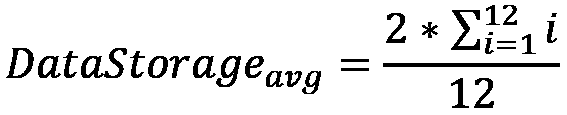

前面的公式给出了每月 13 TB 的计算结果。现在，它要求我们提供频繁访问层存储的百分比——即我们将从该层读取数据的层。频繁访问层中的数据每月只能有 2 TB（大约是 13 TB 的 15%）。使用这些值，我们可以计算出估算成本，如下面的截图所示：

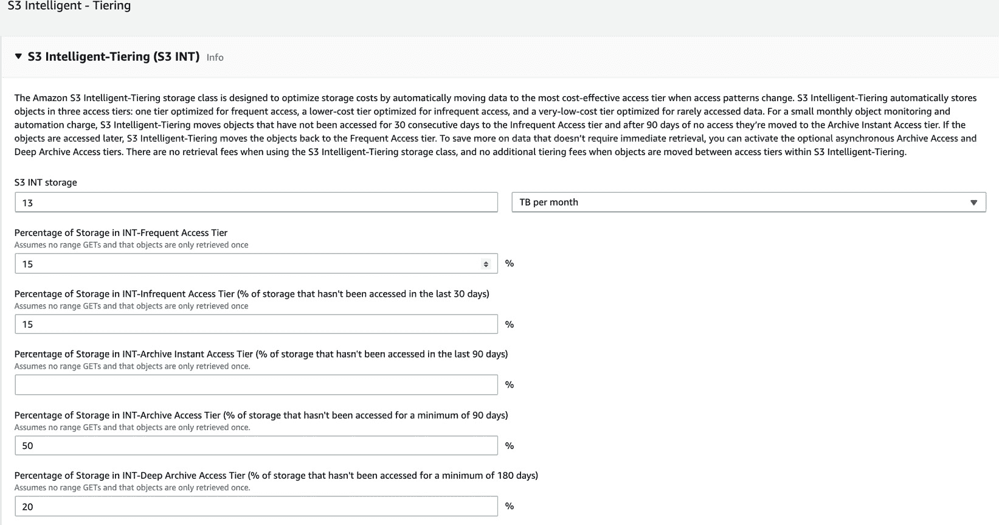

图 5.1 – AWS S3 成本估算工具

使用之前提到的计算方法，Amazon S3 的平均估算成本为每月 97.48 美元。然而，对 Amazon EFS 的类似计算将花费 881.92 美元。这表明使用 EFS 将比使用 Amazon S3 贵九倍。

因此，从成本和其他参数综合考虑，我们可以安全地决定选择 Amazon S3 作为我们的输入存储。基于类似的逻辑和计算，我们也可以将 ODL 存储在 S3 中。

然而，在未决定输出文件的架构和格式的情况下，关于输出数据存储层的讨论是不完整的。根据要求，我们可以得出结论，输出数据应包含以下列：

+   `year`

+   `month`

+   `category_id`

+   `product_id`

+   `tot_sales`

+   `tot_onlyview`

+   `sales_rev`

+   `rank_by_revenue`

+   `rank_by_sales`

由于 ODL 上的大多数查询都是按月进行的，因此建议按年度和月度对表进行分区。现在我们已经最终确定了存储层的所有细节，让我们讨论解决方案的处理层。

现在，我们必须考虑 AWS 中可用于处理大数据批处理作业的选项。主要有两个本地替代方案。一个是运行 EMR 集群上的 Spark，另一个是运行 Glue 作业（Glue 是一个完全管理的无服务器 AWS 服务）。AWS Glue 允许你用 Scala 或 Python 编写脚本，并通过 AWS 管理控制台或编程方式触发 Glue 作业。由于我们感兴趣的是用 Java 实现解决方案，因此 AWS Glue 不是我们的选择。此外，AWS Glue 脚本的可移植性较低，学习曲线较高。在这里，我们将坚持使用 EMR 上的 Spark。然而，Spark 作业可以在 EMR 集群中以两种方式运行：

+   从命令行运行`spark submit`的经典方法

+   在创建集群时添加`spark submit`步骤的云特定方法

现在，让我们看看成本矩阵如何帮助我们确定在前面提到的两种选项中，我们应该采取哪种方法来提交 Spark 作业。

## 处理层中的成本因素

第一种选择是始终保持 EMR 集群运行，并使用 cronjob 在特定时间间隔从 shell 脚本中触发`spark submit`命令（这与我们在本地 Hadoop 集群上所做的工作非常相似）。这种集群被称为*持久 EMR 集群*。

第二种选择是在创建集群时添加 EMR 步骤以运行 Spark 作业，一旦成功运行，就终止它。这种类型的 EMR 集群被称为*临时 EMR 集群*。让我们看看每种选择的成本估计如何变化。

在 EMR 集群中，有三种类型的节点：*主节点*、*核心节点*和*任务节点*。主节点管理集群，充当 NameNode 和 Jobtracker。核心节点充当 DataNode，同时也是工作节点，负责处理数据。任务节点是可选的，但它们对于单独的任务跟踪活动是必需的。

由于它们的工作性质，通常选择计算优化实例对主节点工作很好，而对于核心节点，混合实例效果最佳。在我们的计算中，我们将使用 c4.2xlarge 实例类型作为主节点，m4.4xlarge 实例类型作为核心节点。如果我们需要四个核心节点，一个持久 EMR 集群将每月花费我们大约 780 美元。在临时 EMR 集群上的类似配置每月只需花费大约 7 美元，考虑到作业每月运行两到三次，每次作业运行时间不超过 2 小时。正如我们所见，第二种选择几乎提高了 100 倍的成本效益。因此，我们将选择临时 EMR 集群。

现在，让我们弄清楚如何创建和调度临时的 EMR 集群。在我们的用例中，数据到达 S3 桶。S3 桶中的每个成功创建事件都会生成一个事件，可以触发 AWS Lambda 函数。我们可以使用这样的 Lambda 函数在 S3 桶的着陆区每次有新文件到达时创建临时集群。

根据前面的讨论，以下图展示了所提出解决方案的架构：

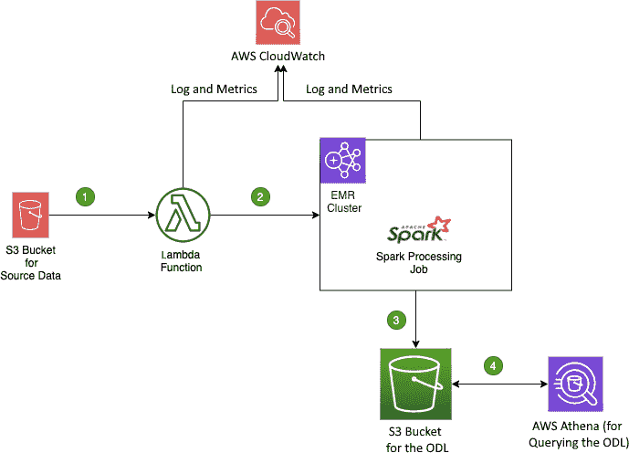

图 5.2 – 解决方案架构

如前图所示，输入数据作为源数据进入 S3 桶（也称为着陆区）。在这里，一个源数据文件每月到达两次。架构图描述了四个步骤，用数字表示。让我们更详细地看看这些步骤：

1.  当传入的源文件在 S3 桶中完全写入时，将生成一个 CloudWatch 事件。这会生成一个 Lambda 触发器，反过来，它会调用一个 Lambda 函数。

1.  Lambda 函数接收创建事件记录并创建一个临时 EMR 集群，其中配置了一个步骤来运行 Spark 作业以读取和处理新的输入文件。

1.  EMR 步骤中的 Spark 作业读取并处理数据。然后，它将转换后的输出数据写入 ODL 层的 S3 桶。在 Spark 步骤成功终止后，临时集群将被终止。

1.  ODL 层中驻留的所有数据都将作为 Athena 表公开，可以用于任何分析目的。

这为我们提供了一个非常简单但强大的架构来解决这样的大数据批处理问题。所有处理和存储组件中的日志和指标都将由 AWS CloudWatch 日志捕获。我们可以通过添加审计和警报功能来进一步改进此架构，这些功能使用 CloudWatch 日志和指标。

重要注意事项

由于以下因素，建议使用 Parquet 格式作为输出存储格式：

**成本节省和性能**：由于多个输出列可能具有低基数，ODL 数据存储格式应该是一个列式格式，这不仅可以节省成本，还可以提高性能。

**技术兼容性**：由于我们处理的是大数据处理，并且我们的处理层基于 Spark，Parquet 将是 ODL 层使用最合适的数据格式。

现在我们已经分析了问题并开发了一个稳健、可靠且成本效益高的架构，让我们来实施解决方案。

# 实施解决方案

任何实施的第一步始终是理解源数据。这是因为我们所有低级转换和清洗都将依赖于数据的多样性。在前一章中，我们使用了 DataCleaner 来概览数据。然而，这次我们处理的是大数据和云。如果数据量达到千兆字节，DataCleaner 可能不是进行数据概览的一个非常有效的工具。对于我们的场景，我们将使用一个名为 AWS Glue DataBrew 的基于 AWS 云的数据概览工具。

## 源数据概览

在本节中，我们将学习如何进行数据概览和分析，以了解传入的数据（您可以在 GitHub 上找到此示例文件：[`github.com/PacktPublishing/Scalable-Data-Architecture-with-Java/tree/main/Chapter05`](https://github.com/PacktPublishing/Scalable-Data-Architecture-with-Java/tree/main/Chapter05)。按照以下步骤操作：

1.  使用 AWS 管理控制台创建一个名为 `scalabledataarch` 的 S3 存储桶，并将示例输入数据上传到 S3 存储桶：

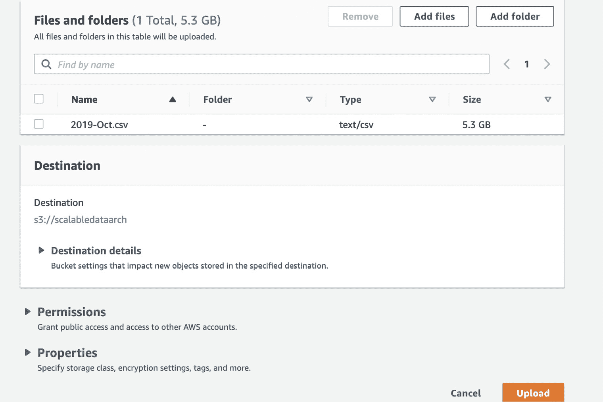

图 5.3 – 创建 S3 存储桶并上传输入文件

1.  从 AWS 管理控制台进入 AWS Glue DataBrew 服务。点击 **DATASET** 侧边栏。然后，点击 **连接新数据集** 按钮。将出现一个类似于以下截图的对话框。选择 **Amazon S3** 并输入 S3 存储桶的源数据路径。最后，点击 **创建数据集** 按钮以创建新的数据集：

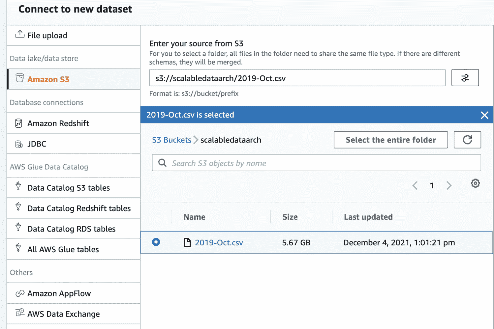

图 5.4 – 向 AWS Glue DataBrew 添加新数据集

1.  现在，让我们使用我们添加的数据集创建一个数据概览作业。首先，选择新添加的数据集并转到 **数据概览** 选项卡，如图所示：

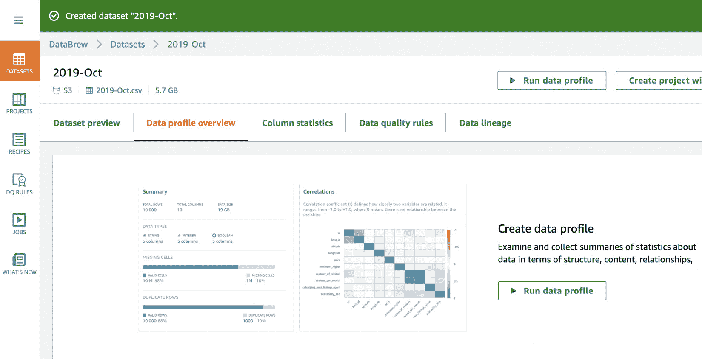

图 5.5 – 数据概览选项卡

现在，点击 **运行数据概览** 按钮，这将带您到一个 **创建作业** 弹出窗口。输入作业名称并选择使用 **全数据集** 选项运行样本，如图所示：

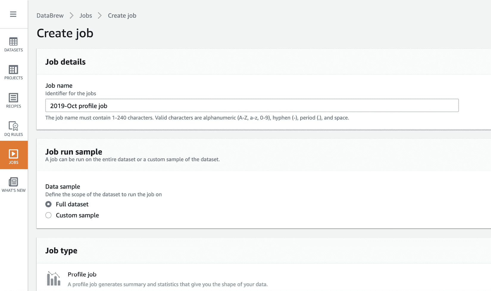

图 5.6 – 创建数据概览作业

将输出位置设置为 `scalablearch-dataprof`（我们的 S3 存储桶）。数据概览作业的输出文件将存储在此：

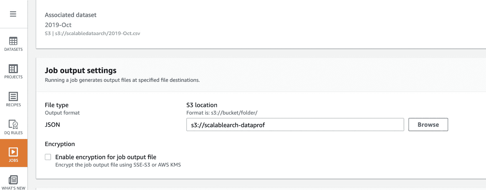

图 5.7 – 配置数据概览作业

然后，配置 `product_id`、`category_id` 和 `brand`，

我们已相应地配置了它们，如下面的屏幕截图所示：

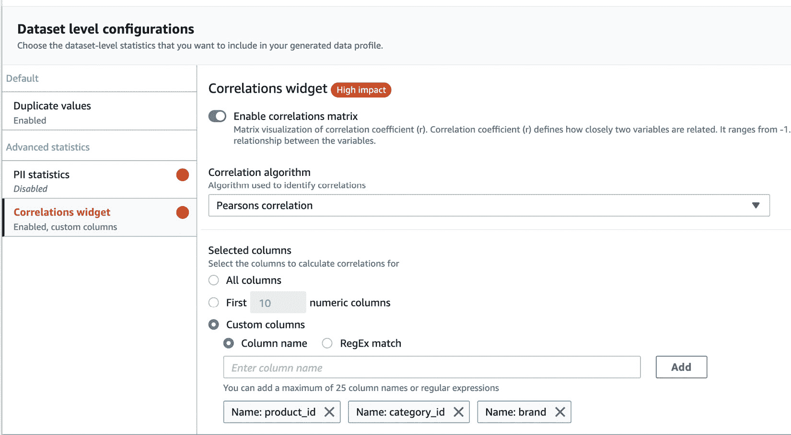

图 5.8 – 配置关联小部件

然后，我们必须设置数据概要作业的安全角色。一旦完成此操作，点击 **创建作业** 按钮来创建数据概要作业：

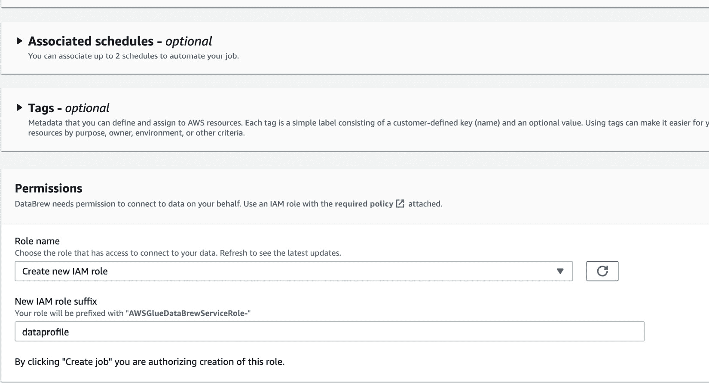

图 5.9 – 设置数据概要作业的安全权限

1.  最后，我们可以在 **概要作业** 选项卡中看到新创建的数据概要作业。我们可以通过在此屏幕上点击 **运行作业** 按钮来运行数据概要作业：

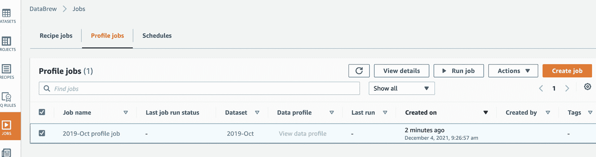

图 5.10 – 已创建并列出的数据概要作业

一旦作业成功运行，我们可以转到数据集，打开 **数据谱系** 选项卡，查看数据谱系以及最后一次成功的数据概要作业运行之前的时间间隔：

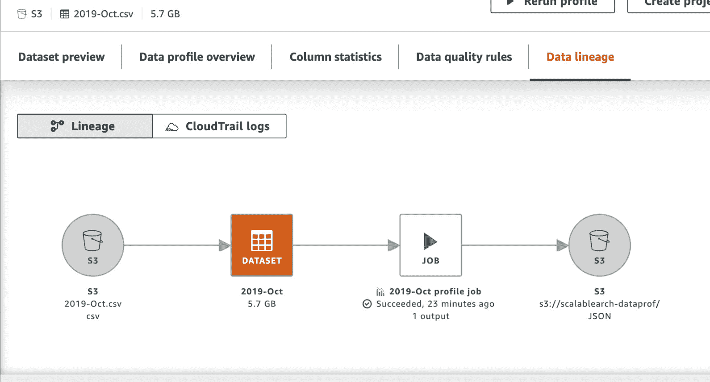

图 5.11 – 数据概要作业的谱系

1.  我们可以将报告可视化以查找缺失值、基数、列之间的相关性以及数据的分布。这些度量帮助我们确定数据中是否存在需要清理的异常值，或者是否存在缺失值以及是否需要处理。这也有助于我们了解我们正在处理的数据质量。这有助于我们进行适当的清理和转换，以免在实施过程中出现意外。以下屏幕截图显示了 AWS Glue DataBrew 显示的一些示例度量：

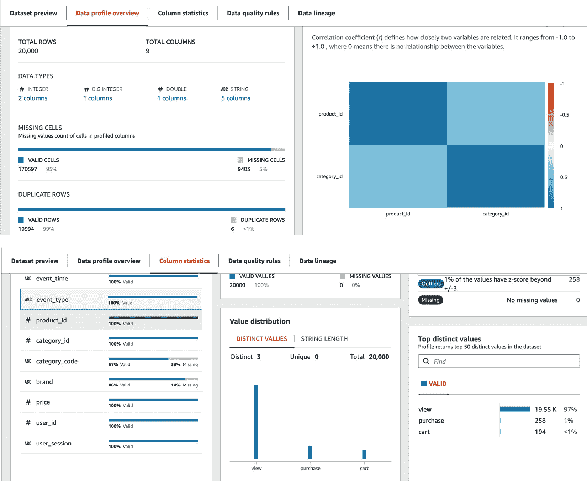

图 5.12 – 数据概要度量

在这里，我们可以看到一些有用的统计数据。例如，`event_type` 没有噪声，并且具有非常低的基数。它还显示数据不是通过此列均匀分布的。

现在我们已经分析了数据，让我们开发一个 Spark 应用程序来处理记录。

## 编写 Spark 应用程序

基于上一节的分析，我们将创建输入记录模式字符串。然后，我们将使用该模式字符串来读取输入数据，如下面的代码片段所示：

```java
private static final String EVENT_SCHEMA = "event_time TIMESTAMP,event_type STRING,product_id LONG,category_id LONG,category_code STRING,brand STRING,price DOUBLE,user_id LONG,user_session STRING";
. . .
Dataset<Row> ecommerceEventDf = spark.read().option("header","true").schema(EVENT_SCHEMA).csv(inputPath);
```

然后，我们将使用 Spark 的 `count_if` 聚合函数计算每个产品的总销售额和总浏览量，如下面的代码片段所示：

```java
Dataset<Row> countAggDf = spark.sql("select year(event_time) as year,month(event_time) as month,category_id,product_id,count_if(event_type='purchase') as tot_sales,count_if(event_type='view') as tot_onlyview from ecommerceEventDf where event_type!='cart' group by year,month,category_id,product_id ");
```

我们将创建另一个 DataFrame 来计算仅购买事件的收入总额。以下代码片段显示了如何进行此操作：

```java
Dataset<Row> revenueAggDf = spark.sql("select year(event_time) as year,month(event_time) as month,category_id,product_id,sum(price) as sales_rev from ecommerceEventDf where event_type='purchase' group by year,month,category_id,product_id");
```

现在，我们将使用 `LEFT OUTER JOIN` SparkSQL 查询将 `countAggDf` 和 `revenueAggDf` DataFrame 合并，如下面的代码片段所示。对于没有单次销售的产品，使用 Spark 的 `na.fill()` 方法将 `total_sales` 的空值设置为 `0.0`：

```java
Dataset<Row> combinedAggDf = spark.sql("select cadf.year,cadf.month,cadf.category_id,cadf.category_id,cadf.product_id,tot_sales,tot_onlyview,sales_rev from countAggDf cadf LEFT OUTER JOIN revenueAggDf radf ON cadf.year==radf.year AND cadf.month== radf.month AND cadf.category_id== radf.category_id AND cadf.product_id == radf.product_id");
Dataset<Row> combinedEnrichAggDf = combinedAggDf.na().fill(0.0,new String[]{"sales_rev"});
```

现在，我们将对结果`combinedEnrichedDf` DataFrame 应用窗口函数，以推导出列 – 即`rank_by_revenue`和`rank_by_sales`：

```java
Dataset<Row> finalTransformedDf = spark.sql("select year,month,category_id,product_id,tot_sales,tot_onlyview,sales_rev,dense_rank() over (PARTITION BY category_id ORDER BY sales_rev DESC) as rank_by_revenue,dense_rank() over (PARTITION BY category_id ORDER BY tot_sales DESC) as rank_by_sales from combinedEnrichAggDf");
```

结果已准备好，并且与输出格式相同。因此，我们必须使用 Parquet 格式将转换后的数据写入输出 S3 桶，同时确保它按年份和月份分区：

```java
finalTransformedDf.write().mode(SaveMode.Append).partitionBy("year","month").parquet(outputDirectory);
```

此应用程序的完整源代码可在 GitHub 上找到，网址为[`github.com/PacktPublishing/Scalable-Data-Architecture-with-Java/tree/main/Chapter05/sourcecode/EcommerceAnalysis`](https://github.com/PacktPublishing/Scalable-Data-Architecture-with-Java/tree/main/Chapter05/sourcecode/EcommerceAnalysis)。

在下一节中，我们将学习如何在 EMR 集群上部署和运行 Spark 应用程序。

## 部署和运行 Spark 应用程序

现在我们已经开发了 Spark 作业，让我们尝试使用临时 EMR 集群运行它。首先，我们将手动创建 EMR 集群并运行作业。要手动创建临时 EMR 集群，请按照以下步骤操作：

1.  首先，构建 Spark 应用程序 JAR 文件并将其上传到 S3 桶。

1.  前往 AWS 管理控制台中的 AWS EMR。点击**创建集群**按钮以手动创建新的临时集群。

1.  设置 EMR 配置。确保将**启动模式**设置为**步骤执行**。确保在**软件配置**部分的**版本**字段中选择**emr-6.4.0**。此外，对于**添加步骤**，选择**Spark 应用程序**作为**步骤类型**。保留所有其他字段不变。您的配置应如下所示：

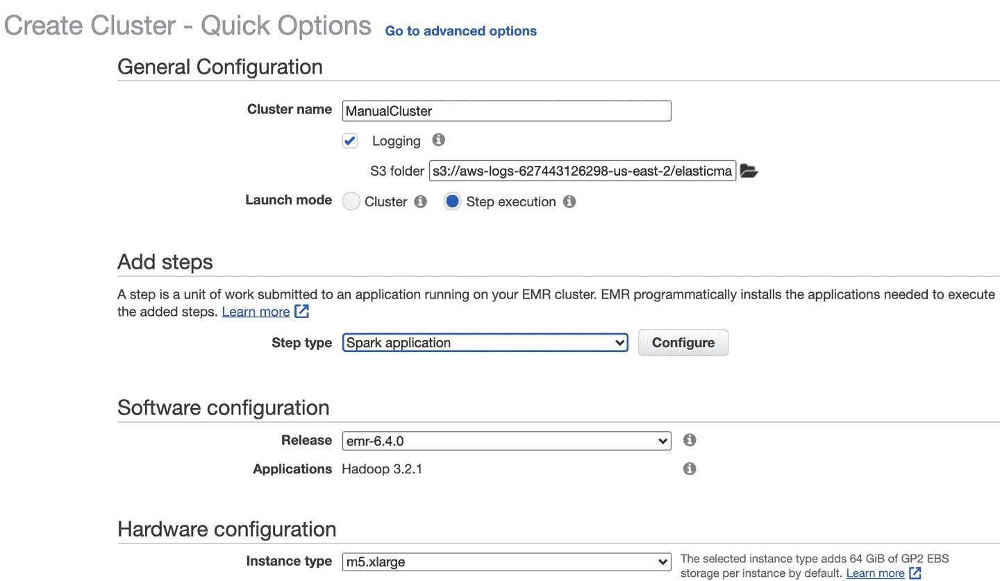

图 5.13 – 手动创建临时 EMR 集群

1.  现在，要添加 Spark 步骤，请点击**配置**按钮。这将弹出一个对话框，您可以在其中输入各种与 Spark 步骤相关的配置，如下面的屏幕截图所示：

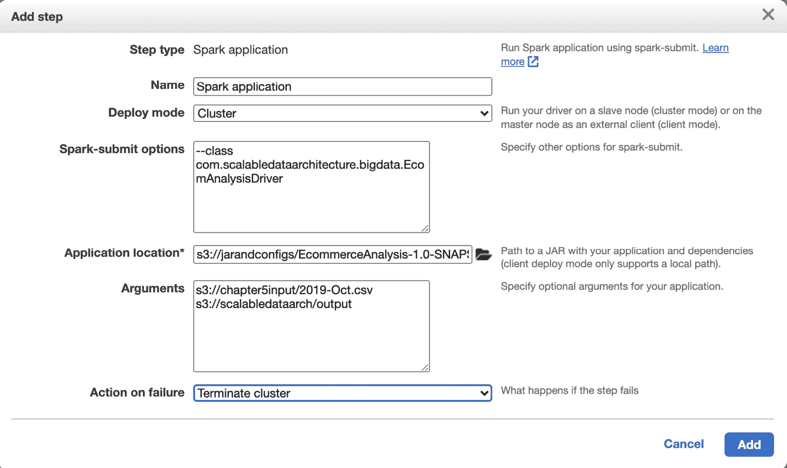

图 5.14 – 向 EMR 集群添加 Spark 步骤

请确保在**Spark-submit 选项区域**中指定驱动类名称，并在**应用程序位置**和**参数**框中提供必要的信息。

1.  点击**添加**以添加步骤。一旦添加，它将类似于以下屏幕截图所示。然后，点击**创建集群**。这将创建临时集群，运行 Spark 作业，并在 Spark 作业执行完毕后终止集群：

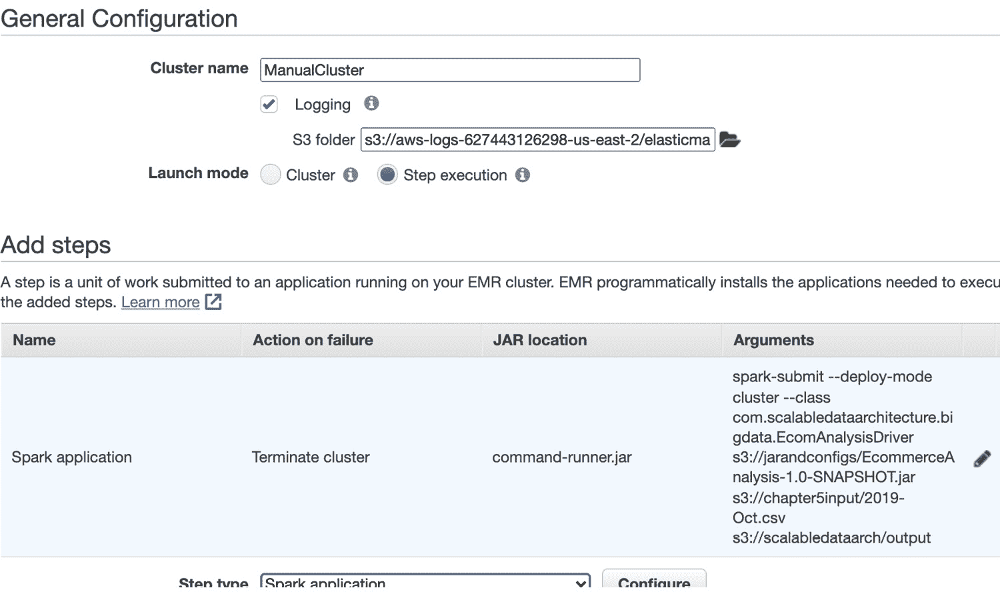

图 5.15 – 添加 Spark 步骤的 EMR 集群配置

1.  一旦成功运行，您将在集群的**步骤**标签页中看到作业已成功：

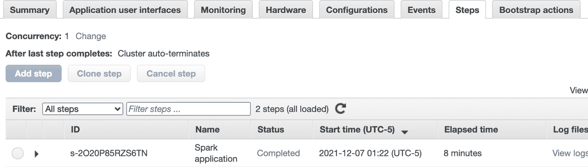

图 5.16 – EMR 集群中的作业监控

故障排除 Spark 错误

Spark 作业在大量数据上运行并可能抛出多个异常。它还可以报告多个阶段失败，例如 `OutOfMemoryException`、大帧错误、来自 AWS S3 上传的多部分文件的节流错误等等。涵盖所有这些内容超出了本书的范围。然而，您可以参考一个非常简洁的 Spark 故障排除指南 [`docs.qubole.com/en/latest/troubleshooting-guide/spark-ts/troubleshoot-spark.xhtml#troubleshooting-spark-issues`](https://docs.qubole.com/en/latest/troubleshooting-guide/spark-ts/troubleshoot-spark.xhtml#troubleshooting-spark-issues) 以获取更多信息。

现在我们已经手动部署和运行了 Spark 应用程序，让我们通过实现 Lambda 触发器来自动化 Spark 作业的创建和运行。

## 开发和测试 Lambda 触发器

AWS Lambda 函数是完全托管的无服务器服务，有助于处理信息。它们支持多种语言，如 Python、JavaScript、Java 等。尽管 Python 或 JavaScript 运行时更快，但我们将在这本书中使用 Java 运行时来实现解决方案（因为我们在这本书中专注于基于 Java 的实现）。

要编写一个对 S3 事件做出反应的 Lambda 函数，我们必须创建一个实现 `RequestHandler` 接口并接受 `S3Event` 作为其泛型 `Input` 类型的 Java 类，如下代码块所示：

```java
import com.amazonaws.services.lambda.runtime.RequestHandler;
import com.amazonaws.services.lambda.runtime.events.S3Event;
. . .
public class Handler implements RequestHandler<S3Event, Integer> {
. . .
```

在这个类中，我们必须实现 `RequestHandler` 接口的 `handleRequest` 方法。在 `handleRequest` 方法中，我们遍历每个 `S3EventNotificationRecord`，它表示一个新文件的创建或更新。我们在 `S3ObjectNames` 中收集附加到该 `S3EventNotificationRecord` 的所有 S3 对象名称。对于 `S3ObjectNames` 中存在的每个不同的 S3 对象名称，我们创建并启动一个 AWS 短暂 EMR 集群。以下代码片段显示了 `handleRequest` 方法的实现：

```java
Set<String> s3ObjectNames = new HashSet<>();
for (S3EventNotificationRecord record:
        s3Event.getRecords()) {
    String s3Key = record.getS3().getObject().getKey();
    String s3Bucket = record.getS3().getBucket().getName();
    s3ObjectNames.add("s3://"+s3Bucket+"/"+s3Key);
}
s3ObjectNames.forEach(inputS3path ->{
    createClusterAndRunJob(inputS3path,logger);
});
```

现在，让我们看看 `createClusterAndRunJob` 方法的实现。该方法接受两个参数：`inputS3path` 和 Lambda 记录器。此方法使用 AWS SDK 创建一个 `ElasticMapReduce` 对象。此方法使用 `StepConfig` API 构建一个 `spark submit` 阶段。然后，它使用所有配置细节以及 `SparkSubmitStep` 来配置 `RunJobFlowRequest` 对象。

最后，我们可以通过 `ElasticMapReduce` 对象的 `runJobFlow` 方法提交请求以创建和运行 EMR 集群，如下所示：

```java
private void createClusterAndRunJob(String inputS3path, LambdaLogger logger) {
    //Create a EMR object using AWS SDK
    AmazonElasticMapReduce emr = AmazonElasticMapReduceClientBuilder.standard()
            .withRegion("us-east-2")
            .build();

    // create a step to submit spark Job in the EMR cluster to be used by runJobflow request object
    StepFactory stepFactory = new StepFactory();
    HadoopJarStepConfig sparkStepConf = new HadoopJarStepConfig()
            .withJar("command-runner.jar")
            .withArgs("spark-submit","--deploy-mode","cluster","--class","com.scalabledataarchitecture.bigdata.EcomAnalysisDriver","s3://jarandconfigs/EcommerceAnalysis-1.0-SNAPSHOT.jar",inputS3path,"s3://scalabledataarch/output");
    StepConfig sparksubmitStep = new StepConfig()
            .withName("Spark Step")
            .withActionOnFailure("TERMINATE_CLUSTER")
            .withHadoopJarStep(sparkStepConf);
    //Create an application object to be used by runJobflow request object
    Application spark = new Application().withName("Spark");
    //Create a runjobflow request object
    RunJobFlowRequest request = new RunJobFlowRequest()
            .withName("chap5_test_auto")
            .withReleaseLabel("emr-6.4.0")
            .withSteps(sparksubmitStep)
            .withApplications(spark)
            .withLogUri(...)
            .withServiceRole("EMR_DefaultRole")
            ...            ;
    //Create and run a new cluster using runJobFlow method
    RunJobFlowResult result = emr.runJobFlow(request);
    logger.log("The cluster ID is " + result.toString());
}
```

现在我们已经开发了 Lambda 函数，让我们来部署、运行和测试它：

1.  为 Lambda 函数创建一个 IAM 安全角色以触发 EMR 集群，如下截图所示：

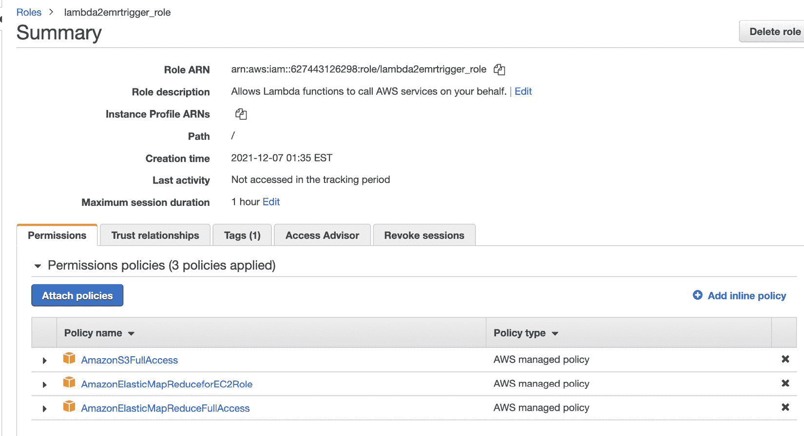

图 5.17 – 创建新的 IAM 角色

1.  使用 AWS 管理控制台创建一个 Lambda 函数。请提供函数的名称和运行时，如下截图所示：

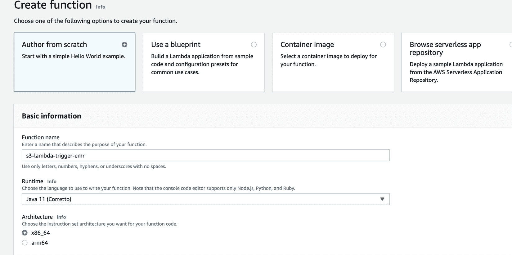

图 5.18 – 创建 AWS Lambda 函数

1.  在创建 Lambda 函数时，请确保您将默认执行角色更改为在*步骤 1*中创建的 IAM 角色：

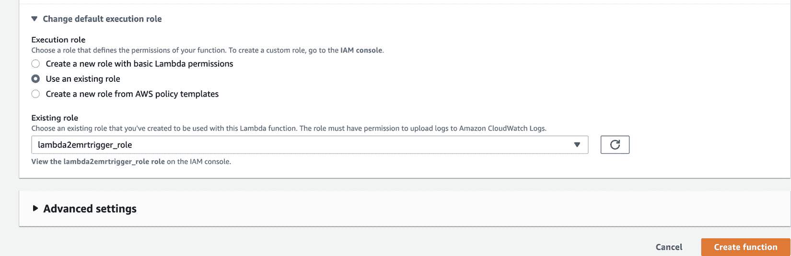

图 5.19 – 将 IAM 角色设置到 AWS Lambda 函数

1.  现在，您必须为 Lambda 函数添加一个 S3 触发器，如下面的截图所示。请确保您输入了正确的存储桶名称和前缀，您将在此处推送源文件：

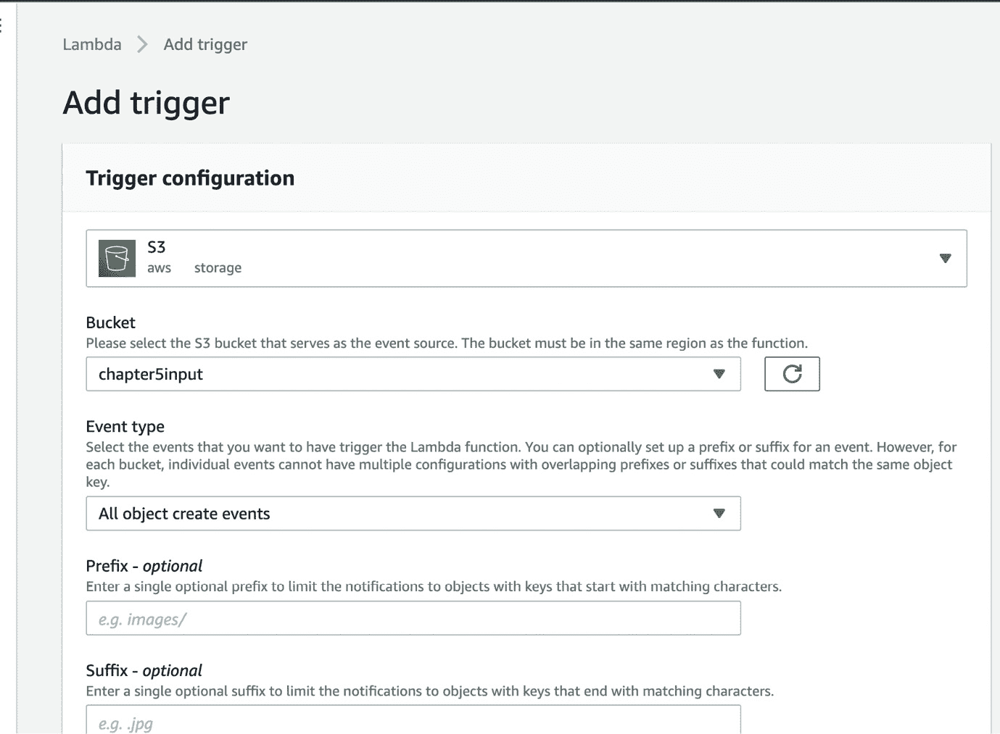

图 5.20 – 为 Lambda 函数创建 S3 事件触发器

1.  然后，您必须使用我们的 Maven Java 项目（项目的完整源代码可以在[`github.com/PacktPublishing/Scalable-Data-Architecture-with-Java/tree/main/Chapter05/sourcecode/S3lambdaTriggerEmr`](https://github.com/PacktPublishing/Scalable-Data-Architecture-with-Java/tree/main/Chapter05/sourcecode/S3lambdaTriggerEmr)找到）开发的 Lambda 函数来本地构建 JAR 文件。一旦构建了 JAR 文件，您必须使用**从** | **.zip 或 .jar 文件**选项上传它，如下面的截图所示：

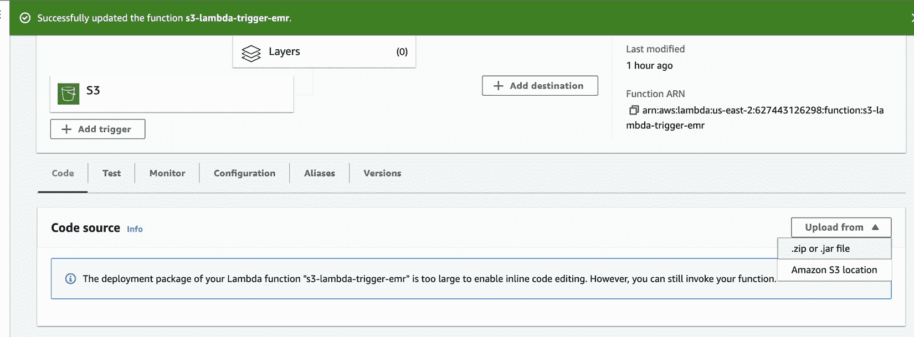

图 5.21 – 部署 AWS Lambda JAR 文件

1.  现在，您可以通过将新的数据文件放置在 S3 触发器中提到的 S3 存储桶中来测试整个工作流程。一旦 Lambda 函数执行，它将创建一个临时的 EMR 集群，其中 Spark 作业将在其中运行。您可以从 AWS 管理控制台监控 Lambda 函数的指标：

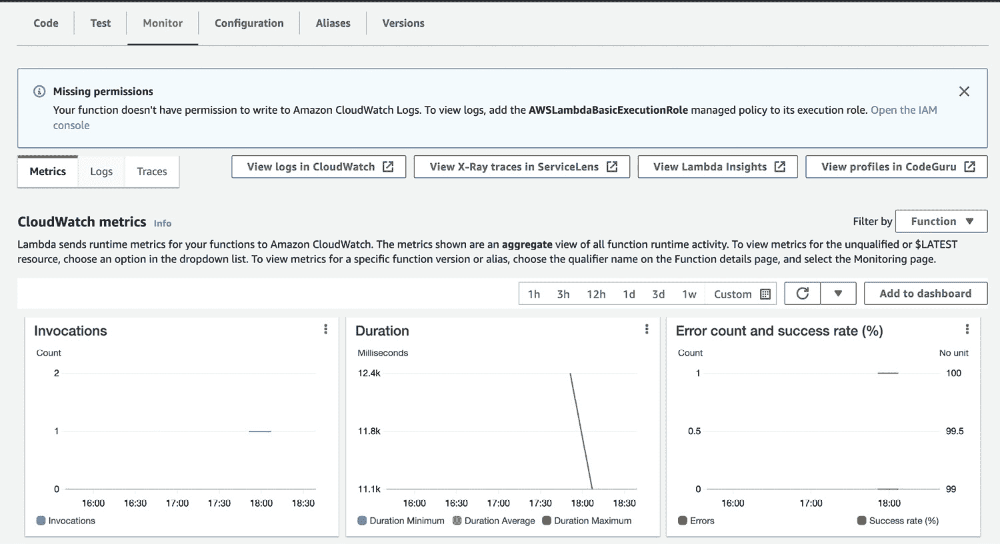

图 5.22 – 监控 AWS Lambda 函数

您可以通过查看临时集群的**摘要**选项卡中的**持久用户界面**选项来从 AWS EMR 管理控制台监控 Spark 应用程序，如下面的截图所示：

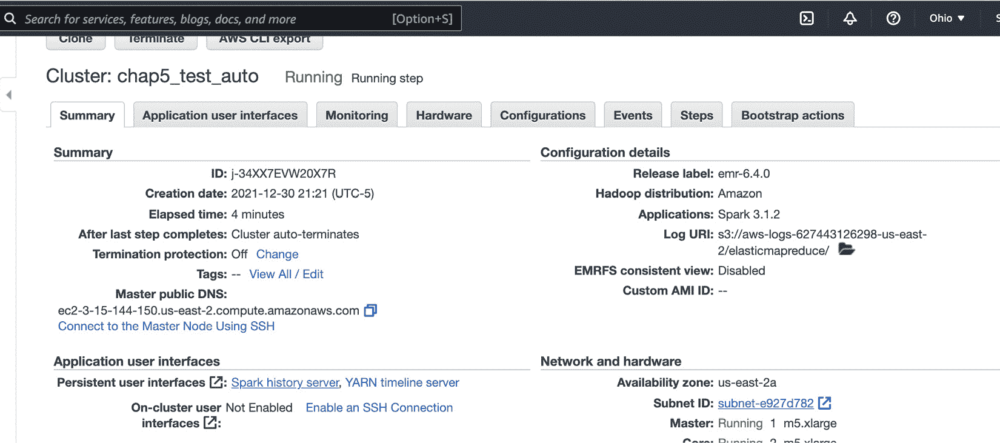

图 5.23 – EMR 集群管理控制台

Lambda 函数故障排除

在现实世界中，在调用或执行 Lambda 函数时可能会遇到麻烦。AWS 已发布了一份非常简洁的故障排除指南来解决所有这些问题。有关更多信息，请参阅[`docs.aws.amazon.com/lambda/latest/dg/lambda-troubleshooting.xhtml`](https://docs.aws.amazon.com/lambda/latest/dg/lambda-troubleshooting.xhtml)。

现在，让我们看看我们是否可以通过监控 Spark 作业来进一步优化 Spark 应用程序。

## 调优 Spark 作业

我们可以检查 Spark UI 来查看其**有向无环图**（**DAG**）。在我们的案例中，我们的 DAG 看起来是这样的：

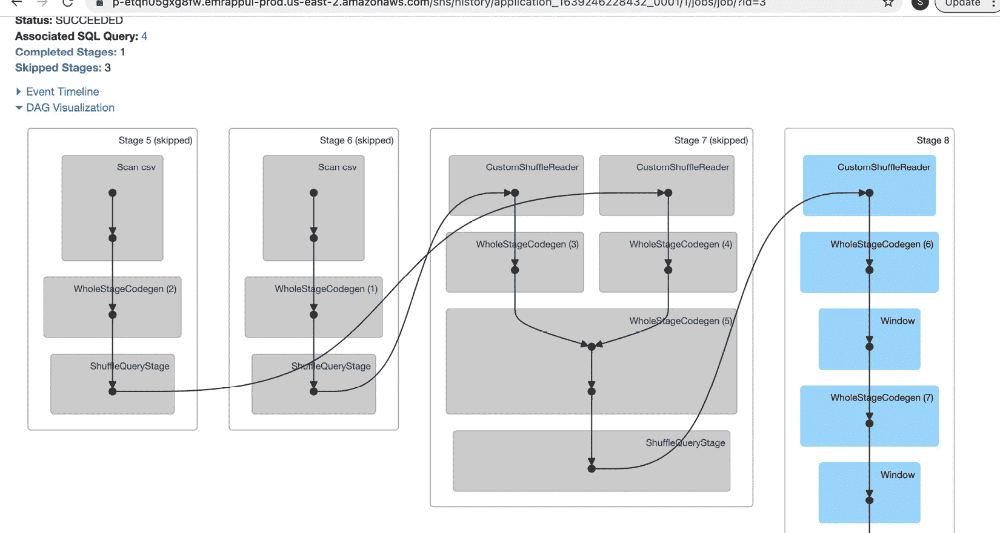

图 5.24 – Spark 作业的 DAG

如我们所见，**阶段 5** 和 **阶段 6** 都在进行相同的工作，即扫描和读取 CSV 文件到 DataFrame 中。这是因为我们有一个名为 `ecommerceEventDf` 的 DataFrame，它被用来派生出两个不同的 DataFrame。由于 Spark 的懒加载技术，这两个派生 DataFrame 分别计算 `ecommerceEventDf`，这导致性能变慢。我们可以通过持久化 `ecommerceEventDf` DataFrame 来解决这个问题，如下面的代码片段所示：

```java
ecommerceEventDf.persist(StorageLevel.MEMORY_AND_DISK());
```

在进行此更改后，新的 DAG 将如下所示：

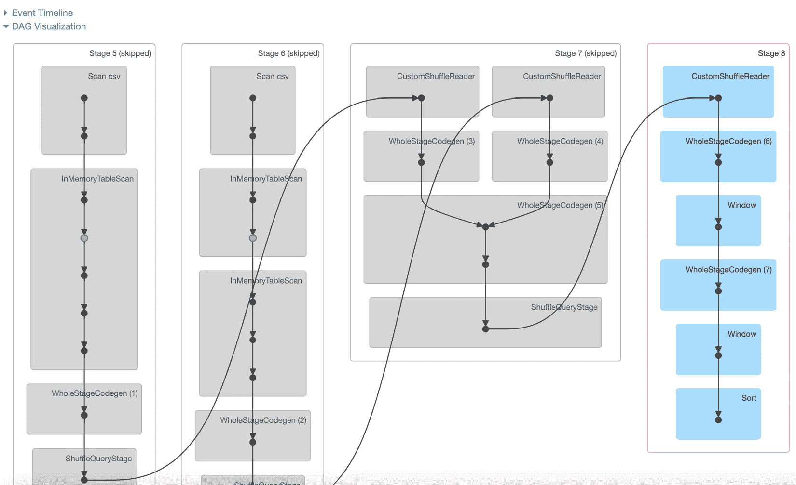

图 5.25 – Spark 作业的优化 DAG

在新的 DAG 中，`InMemoryTableScan` 任务中有一个绿色圆点。这个绿色圆点代表 Spark 通过内存持久化数据，这样它就不会两次扫描 CSV 文件，从而节省处理时间。在这个用例中，它将提高 Spark 作业的性能大约 20%。

现在我们已经实施并测试了我们的解决方案，让我们学习如何在输出文件夹上构建 Athena 表并启用结果的简单查询。

# 使用 AWS Athena 查询 ODL

在本节中，我们将学习如何使用我们的架构在创建的 ODL 上执行数据查询。我们将重点介绍如何在输出文件夹上设置 Athena 以进行简单的数据发现和查询：

1.  通过 AWS 管理控制台导航到 AWS Athena。点击 **探索查询编辑器**。首先，转到 **查询编辑器** 区域的 **管理设置** 表单，并设置一个可以存储查询结果的 S3 桶。您可以为这个目的创建一个空桶：

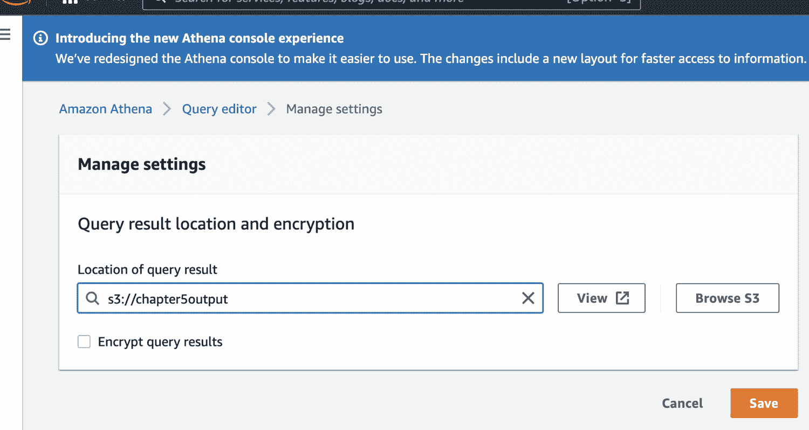

图 5.26 – 设置 AWS Athena

1.  我们将在我们的 S3 输出桶上创建一个 Athena 表。为此，我们将创建一个 DDL 来创建一个名为 `ecom_odl` 的表，这是一个基于 `year` 和 `month` 列的分区表。该表的 DDL 可以在下面的代码片段中看到：

    ```java
    CREATE EXTERNAL TABLE IF NOT EXISTS ecom_odl(
         category_id bigint,
         product_id bigint,
         tot_sales bigint,
         tot_onlyview bigint,
         sales_rev double,
         rank_by_revenue int,
         rank_by_sales int
    ) PARTITIONED BY (year int, month int) STORED AS parquet LOCATION 's3://scalabledataarch/output/';
    ```

我们将在 Athena 的 **查询编辑器** 区域的 **查询编辑器** 区域运行此 DDL 语句来创建以下屏幕截图所示的表：

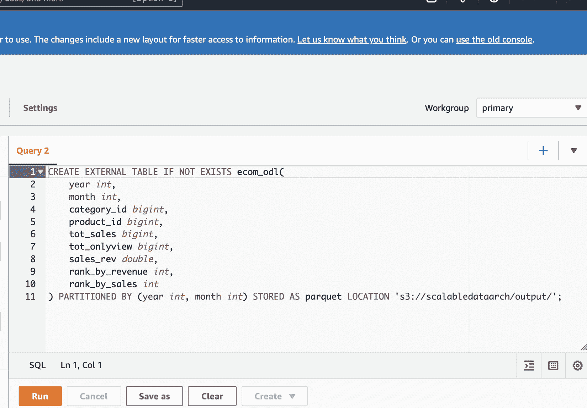

图 5.27 – 基于输出数据创建 Athena 表

1.  一旦表创建完成，我们需要添加分区。我们可以通过使用 `MSCK REPAIR` 命令（类似于 Hive）来完成此操作：

    ```java
    MSCK REPAIR TABLE ecom_odl
    ```

1.  运行前面的命令后，所有分区都将自动从 S3 桶中检测到。现在，您可以在 `ecom_odl` 表上运行任何查询并获取结果。如下面的屏幕截图所示，我们运行了一个示例查询，以找到 2019 年 10 月每个类别的收入最高的前三个产品：

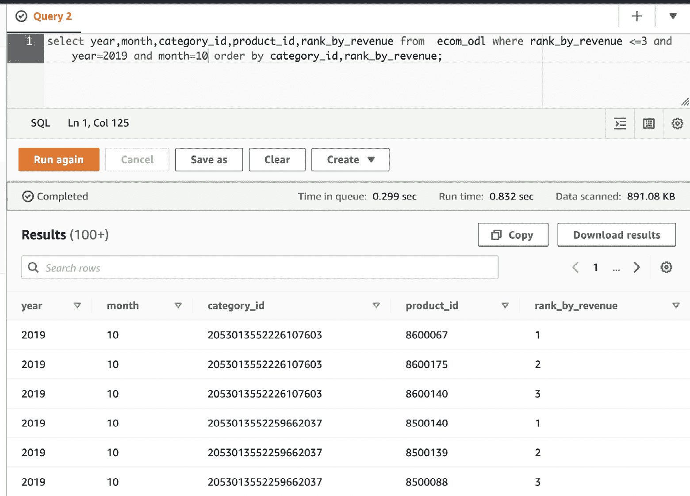

图 5.28 – 使用 Athena 表查询 ODL

通过这样，我们已经成功架构、设计和开发了一个大数据批处理解决方案，并为下游团队创建了一个使用 AWS Athena 查询我们分析数据的接口。现在，让我们总结一下本章所学的内容。

# 摘要

在本章中，我们学习了如何分析问题，并确定这是一个大数据问题。我们还学习了如何选择一个性能高效、优化且成本效益高的平台和技术。我们学习了如何明智地使用所有这些因素来在云中开发大数据批处理解决方案。然后，我们学习了如何使用 AWS Glue DataBrew 分析、分析并从大数据文件中得出推论。之后，我们学习了如何在 AWS 云中开发、部署和运行一个 Spark Java 应用程序来处理大量数据并将其存储在 ODL 中。我们还讨论了如何用 Java 编写 AWS Lambda 触发函数来自动化 Spark 作业。最后，我们学习了如何通过 AWS Athena 表暴露处理后的 ODL 数据，以便下游系统可以轻松查询和使用 ODL 数据。

现在我们已经学会了如何为不同类型的数据量和需求开发优化且成本效益高的基于批处理的数据处理解决方案，在下一章中，我们将学习如何有效地构建帮助我们实时处理和存储数据的解决方案。
