# 第七章：核心架构设计模式

在前面的章节中，我们学习了如何使用特定用例来构建批处理和实时处理的数据工程解决方案。然而，我们还没有讨论有关批处理和实时流处理引擎的架构设计模式的多种选择。

在本章中，我们将学习一些常用的数据工程架构模式，用于解决数据工程问题。我们将从学习基于批处理的常见模式和它们常用的场景开始。然后，我们将学习现代数据架构中基于流的各种处理模式以及它们如何帮助解决业务问题。我们还将讨论两个著名的混合数据架构模式。最后，我们将学习在云中常用的一些无服务器数据摄取模式。

在本章中，我们将涵盖以下主题：

+   核心批处理模式

+   核心流处理模式

+   混合数据处理模式

+   数据摄取的无服务器模式

# 核心批处理模式

在本节中，我们将探讨一些常用的数据工程模式，用于解决批处理问题。尽管实现方式可能有多种变化，但这些模式是通用的，与实现模式所使用的具体技术无关。在接下来的章节中，我们将讨论常用的批处理模式。

## 阶段性收集-处理-存储模式

**阶段性收集-处理-存储模式**是批处理中最常见的模式。它也常被称为数据工程中的**提取-转换-加载**（**ETL**）模式。这种架构模式用于摄取数据并将其存储为信息。以下图展示了这种架构模式：

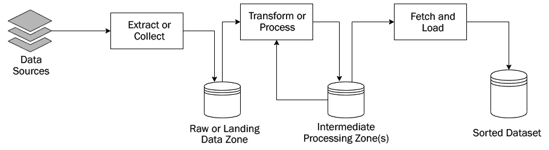

图 7.1 – 阶段性收集-处理-存储模式

我们可以将此模式分解为一系列阶段，如下所示：

1.  在这种架构模式中，一个或多个数据源被提取并保存在称为原始区域或着陆区的数据存储形式中。着陆区数据通常是原始数据，它包含诸如额外空格、垃圾字符、重要字段缺失等噪声。提取或收集作业负责从原始区域提取和存储数据。用于着陆区的数据存储可以是从文件系统、**Hadoop 分布式文件系统**（**HDFS**）、S3 存储桶或基于用例和选择的平台来解决问题的某些关系型数据库。

1.  处理作业从原始区域读取数据，并对数据进行一系列转换，例如数据清洗、数据标准化和数据验证。作业将输出存储在中间处理区域（s）。根据项目和技术的不同，可能有一个或多个转换作业，以及多个中间处理区域。有时，处理作业会从中间数据区域获取相关信息以丰富处理后的数据。在这种情况下，它从中间处理区域或任何外部参考数据库读取数据。最终的中间处理区域包含经过清洗、转换、验证和良好组织的数据。

1.  检索和加载过程检索转换后的数据并将其加载到排序数据集层。排序数据集层包含以特定格式存储的干净和可用的数据，这种格式可以轻松被下游应用程序用于数据分析、参考等。排序数据集层也通常被称为**组织数据层**（**ODL**）。关于用于排序数据层的数据库或数据存储的类型没有硬性规定。然而，根据排序数据是否将用于**在线事务处理**（**OLTP**）或**在线分析处理**（**OLAP**），选择数据库。通常，这种模式用于摄入和存储用于 OLAP 目的的数据。

此架构模式的作业通常根据预定的计划定期运行，例如每天一次或每周一次，或者每周五和周三晚上 8 点。这种模式的一个优点是它以一系列阶段摄入和处理数据。每个阶段的输出存储在中间处理区域，下一个阶段从上一个阶段的输出中检索数据。这种分阶段架构使得设计松散耦合。通常，在生产中，数据处理作业会失败。在这种情况下，我们不需要重新运行整个摄入管道；相反，我们可以从失败的作业重新启动管道。

现在，让我们看看一个现实世界的用例，这个模式将非常适合。一家健康保险公司每天都会收到大量的保险索赔。为了处理这些索赔并确定保险公司将支付的成本，需要对数据进行清洗、丰富、组织和存储。在这种情况下，可以使用这种架构模式来摄入来自不同来源的各种索赔，例如医疗、牙科和视力索赔；然后，它们可以被提取、转换并加载到 ODL。这种模式的另一个示例实现已在*第四章*中讨论，*ETL 数据加载 – 数据仓库中摄入数据的基于批处理解决方案*。

## 常见文件格式处理模式

假设存在一个场景，其中存在多个文件（例如，25 个源文件）用于数据源，并且这些源的结构彼此之间相当不同。现在的问题是，*分阶段收集-处理-存储模式能否处理此类用例？* 是的，它可以。但是它是否优化了这样做？不是的。问题是，对于所有 25 种不同的源文件，我们需要编写一组单独的转换逻辑来处理并将它们存储到排序数据集中。我们可能需要 25 个单独的数据管道来摄取数据。这不仅增加了开发工作量，也增加了分析和测试工作量。此外，我们可能需要调整所有 25 个数据管道中的所有作业。**公共文件格式处理模式**非常适合克服此类问题。以下图表描述了公共文件格式处理模式的工作原理：

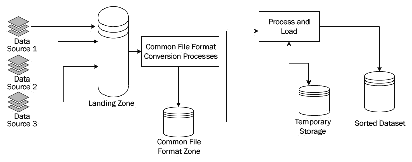

图 7.2 – 公共文件格式处理模式

此模式分为以下阶段：

1.  在这种架构模式中，具有明显不同源文件结构的多个源文件从源存储或发送到目标区域。目标区域可以是文件系统、NAS 挂载、SFTP 位置或 HDFS 位置。

1.  运行一个公共文件格式转换过程，它将不同的传入源文件转换为称为**公共文件格式**的统一结构。执行此转换的作业或管道应该是轻量级的。它不应该在这一层进行清理或业务转换。公共文件格式转换过程将其输出写入公共文件格式区域。

1.  现在所有文件都处于相同的格式或结构中，一组处理和加载作业可以在位于公共文件格式区域的文件上运行。处理和加载过程可以是一个作业或一系列作业，它们将最终组织好的和排序好的数据写入 ODL 或排序数据集层。如果需要，处理和加载作业可能会将其中间结果写入临时存储区域。

现在，让我们看看一个现实世界的场景。一家信用卡公司希望根据客户的购买和消费模式，以及一系列复杂的规则，为其客户生成和提供优惠。然而，交易数据可以从各种来源接收，包括基于网络的支付网关、实体交易网关、如 PayPal 和 Cash App 这样的支付应用、外国支付网关以及各种类似的 app。然而，从所有这些来源接收的交易文件格式各不相同。一个选择是为每个来源创建一组单独的转换映射，并分别应用规则。然而，这将导致大量的开发时间和成本，以及维护挑战。在这种情况下，可以使用常见的文件格式处理模式将来自不同源系统的所有交易文件转换为通用的文件格式。然后，一套规则引擎作业可以处理来自不同来源的交易。

## 提取-加载-转换模式

在本书之前的部分，我们学习了基于经典 ETL 的模式，其中我们首先提取数据，然后转换和处理数据，最后将其存储在最终数据存储中。然而，随着现代处理能力和云提供的可扩展性，我们已经看到许多 **大规模并行处理（MPP**）数据库，如 Snowflake、Redshift 和 Google 的 Big Query 变得越来越流行。这些 MPP 数据库使数据摄入的新模式成为可能，即我们首先提取和加载数据到这些 MPP 数据库中，然后处理数据。这种模式通常被称为 **提取-加载-转换（ELT**）模式或收集-存储-处理模式。这种模式对于构建包含大量数据的高性能数据仓库非常有用。以下图提供了 ELT 模式的概述：

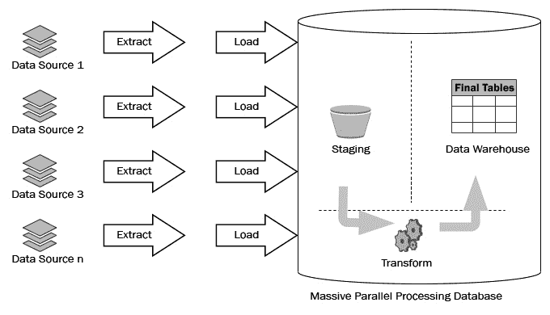

图 7.3 – 提取-加载-转换（ELT）模式

前图描述了 ELT 模式的典型流程。这可以描述如下：

1.  如前图所示，原始数据被提取并加载到 MPP 数据库中。这些数据存储在 MPP 数据库的暂存区。

1.  然后，使用 MPP 查询和转换管道，数据被转换成最终的表格集。这些最终表格作为数据仓库公开。出于安全考虑，有时会在表格之上创建视图并作为数据仓库公开。

再次，让我们看看这个模式在行业中的应用示例。随着客户体验的持续提升，企业在满足客户期望所需的数据和利用当前数据管理实践提供的能力之间面临差距。客户 360 涉及构建一个包含组织内与客户相关的所有结构化和非结构化数据的完整且准确的数据库。它是将所有客户数据聚合到单个统一位置，以便可以查询并用于分析以改善客户体验。为了构建客户 360 解决方案，我们可以利用 MPP 数据库的力量来创建一个单一的统一客户 360 数据仓库。以下是在 AWS 上使用 Snowflake 的客户 360 设计示例：

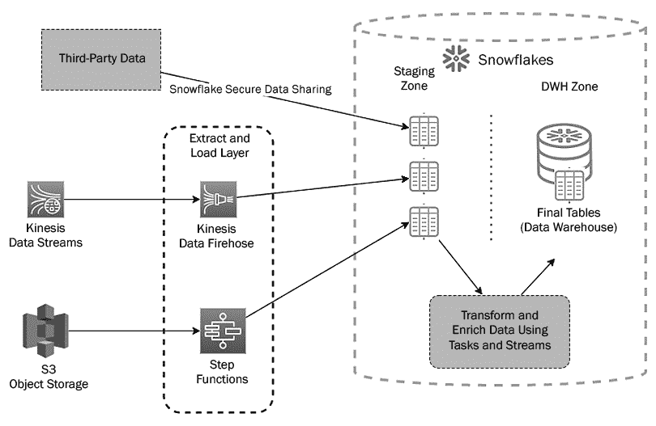

图 7.4 – AWS 上的 ELT 模式示例

在这里，来自云存储、事件流和第三方数据源的所有数据都落在 Snowflake（一个 MPP 数据库）的临时区域。然后，使用 Snowflake 管道，数据被清洗、转换和丰富，并存储在最终表中，供组织作为集中式企业数据仓库使用。

## 压缩模式

数据仓库不仅建立在 MPP 数据库之上。对于大数据需求，很多时候它们是建立在 HDFS 之上，使用 Hive 作为查询引擎。然而，在现代管道中，大量数据由 Kafka 或 Pulsar 等实时处理引擎直接倒入着陆区。尽管使用案例需要我们的处理作业每天运行几次或每天运行一次，但文件是在任何记录到达时落地的。这创造了一个不同的问题。由于前面描述的场景，创建了包含少量记录的过多小文件。HDFS 不是为处理小文件而设计的，尤其是如果它比 HDFS 块大小显著小；例如，128 MB。如果存储的是少量大文件而不是大量小文件，HDFS 的工作效果会更好。

最终，随着小文件的增多，查询性能降低，最终 Hive 无法查询这些记录。为了克服这个问题，通常使用一种模式。这被称为压缩模式。以下图表提供了压缩模式的概述：

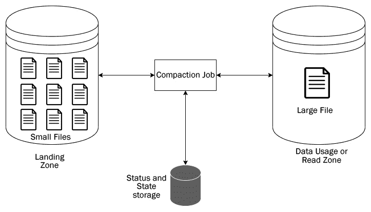

图 7.5 – 压缩模式

在这种架构模式中，小文件存储在着陆区。一个基于批次的定期作业运行并压缩这些小文件以创建一个大型文件。在此期间，它使用状态和状态存储来存储作业审计信息。它还用于存储可能由后续压缩作业使用的状态信息。

## 阶段性报告生成模式

我们已经讨论了多个模式，以展示数据是如何作为排序数据集或数据仓库中的数据被摄取和存储的。另一方面，本模式侧重于运行数据分析作业并从**ODL**或数据仓库生成报告。以下图表显示了该模式的通用架构：

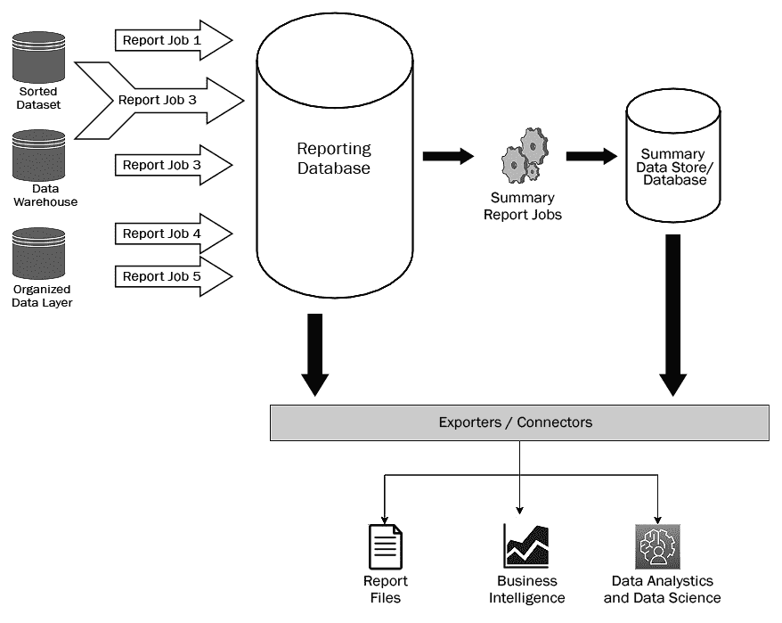

图 7.6 – 阶段性报告生成模式

阶段性报告生成模式主要由两个阶段和一个辅助步骤组成，具体如下：

1.  **报告生成阶段**：各种分析作业在排序数据或组织数据层上运行。这些作业甚至可以在数据仓库中存储的数据上运行。然后，这些作业将分析报告保存到报告数据库中。报告数据库可以是关系数据库、NoSQL 数据库或如 Elasticsearch 这样的搜索引擎。

1.  **摘要生成阶段**：摘要报告作业从报告数据库中获取数据，并在汇总数据库中报告摘要数据。汇总数据库通常是关系数据库、数据仓库或搜索引擎。

1.  使用导出器和连接器，可以可视化报告数据库或汇总数据库中存在的数据，或用于数据科学和分析目的，或者简单地用于提取包含报告的平面文件。

现在，让我们看看一个适合此模式的实际场景。假设一家公司有一个本地数据中心。每天，数据中心中所有服务器和存储、备份存储和网络设备都会生成监控和解决日志。这些数据被摄取并存储在一个包含每日、每周和每月故障和解决详情的数据仓库中。利用这个数据仓库，组织希望生成各种报告，包括各种类型事件的平均 SLA、解决前后的性能或 KPI 比率以及按团队解决事件的速度。

最后，公司希望按周、月和季度生成所有事件的摘要。这个用例非常适合使用此模式。在这个用例中，我们可以生成所有报告并将它们存储在报告数据库中，同时生成摘要报告到汇总数据库。一般报告和摘要报告都可以使用 BI 工具（如 Tableau）通过使用适当的连接器从报告数据库中提取数据来可视化。

在本节中，我们了解了一些流行的批量处理架构模式和几个可以应用的实际场景。在下一节中，我们将介绍一些用于实时流处理的常见模式。

# 核心流处理模式

在上一节中，我们了解了一些常用的批量处理模式。在本节中，我们将讨论各种流处理模式。让我们开始吧。

## 出盒模式

随着现代数据工程的进步，单体应用已被一系列协同工作的微服务应用所取代。值得注意的是，微服务通常不会与其他微服务共享数据库。数据库会话提交和跨服务通信应该是原子性和实时的，以避免不一致性和错误。在这里，出盒模式非常有用。以下图表显示了出盒模式的通用架构：

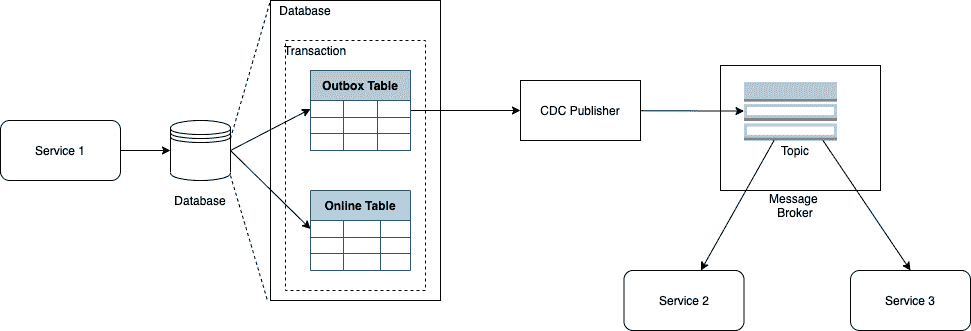

图 7.7 – 出盒模式

如我们所见，一个微服务（在此处为**服务 1**）不仅将事务写入在线读取和写入所需的表（在图中表示为**在线表**），还将写入一个**出盒表**，其结构是消息应该发布到消息代理的地方。就像办公桌上曾经存放过发出的信件和文件的物理托盘一样，出盒模式使用**出盒表**将消息发送到消息代理。一个**变更数据捕获**（**CDC**）发布者从**出盒表**区域选择 CDC 事件并将它们发布到我们的**消息代理**。需要从服务 1 获取数据的下游服务消费这些数据。

## 悲剧模式

悲剧模式是一种设计模式，用于成功管理和处理跨多个应用程序或服务的分布式事务。在现实世界的场景中，单个业务交易不可能仅通过一个应用程序或后端服务完成。通常，多个应用程序协同工作以完成一个成功的业务交易。然而，我们需要有一种异步、可靠和可扩展的方式来在这些系统之间进行通信。跨越多个服务的每个业务交易都称为悲剧。实现此类交易的模式称为悲剧模式。

为了理解悲剧模式，让我们看看一个电子商务应用程序。以下图表显示了电子商务应用程序中简化订单系统的流程：

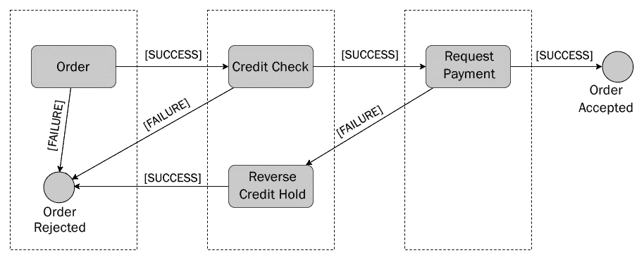

图 7.8 – 简化的电子商务订单系统

如我们所见，一个订单系统由多个服务组成，每个服务都有其执行的一套功能。本质上，有三个服务：订单服务、信用管理服务和支付服务。为了成功完成订单交易，订单服务接收订单。如果订单成功接收，它将转到信用管理服务，该服务检查信用卡余额并验证卡片。如果信用检查成功，系统将使用支付服务请求支付。如果支付成功，订单将被标记为已接受。如果在任何阶段失败，交易将被终止，订单将被拒绝。

现在，让我们看看在这个情况下如何实现叙事模式。这里通过引入一个消息代理平台来交换它们之间的消息，实现了服务间通信的解耦和异步化。以下图表显示了如何使用叙事模式来实现电子商务应用的订单系统：

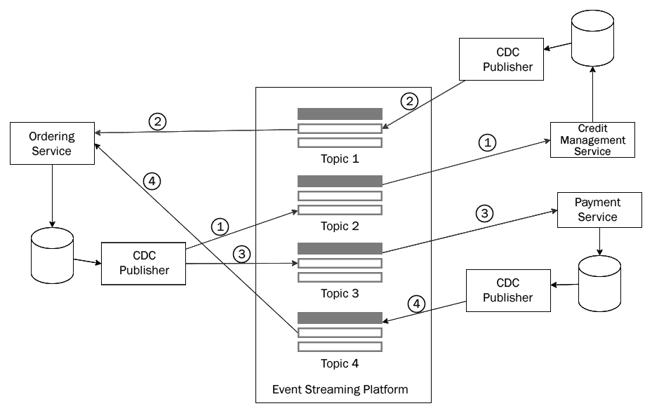

图 7.9 – 应用到实现订单系统的叙事模式

在这里，叙事模式应用于放置订单的叙事交易。在这里，订单服务将订单存储在本地数据库中。使用 CDC 发布者将包含订单的消息发布到流平台中的**主题 2**。发送到主题 2 的数据被信用管理服务消费以执行信用检查功能（在前面的图表中标记为流程*1）。信用检查功能的输出被发送到本地数据库。包含信用检查结果的消息从本地数据库发送到**主题 1**。订单服务消费并存储输出以供进一步处理。

如果信用检查报告是积极的，则使用 CDC 处理器（在前面的图表中描述为流程*3）在**主题 3**发布一个支付请求事件。在流程*3*中发布的事件被支付服务捕获并请求支付。支付请求的结果被保存在本地支付数据库中。支付数据库的 CDC 发布者将支付输出生产到**主题 4**，在前面图表中标记为流程*4**。使用在**主题 4**上共享的信息，订单服务确定订单是已放置还是被拒绝。你可以看到的一个有趣的事情是，叙事模式的每个步骤都遵循前面描述的出箱模式。我们可以说一系列出箱模式以某种方式编织在一起，以创建叙事模式。

## 编舞模式

这种模式特别适用于每个组件独立参与决策过程以完成一项业务交易的情况。所有这些独立组件都与一个集中的编排器应用程序或系统进行通信。就像在编舞中，编舞模式使得所有独立的舞者可以分别表演并创造出一个精彩同步的表演一样，编排器协调去中心化的决策组件以完成一项业务交易。这就是为什么这种模式被称为编舞模式。以下图表提供了编舞模式的概述：

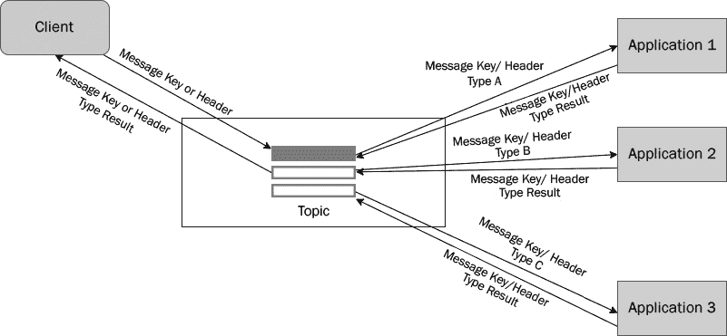

图 7.10 – 编舞模式

如我们所见，来自客户端的事件被流式传输到主题。每个事件都包含一个特定的消息头或消息键。根据消息头值或键值的类型，每个消费应用程序都可以过滤和处理该应用程序所需的消息。一旦处理了事件，它就会生成一个结果事件发送到同一个主题，但具有不同的键或头部值。客户端消费所有结果事件以创建最终输出或决策。

当你有频繁添加、删除或更新应用程序的场景，或者集中编排层存在瓶颈时，这种模式非常有用。

让我们看看一个现实世界的用例，在这个用例中，这种模式可能会派上用场。当客户进行充值时，服务提供商会接收到不同的事件。在单次充值中，客户可以购买不同的套餐，例如充值套餐、数据套餐等。每个套餐都会向事件添加一个消息头。不同的客户端应用程序为每种套餐提供定制化的优惠。这个用例适合编排模式。假设一个事件同时包含充值套餐和数据套餐；这将添加两块头部信息，因此将有两个基于套餐类型消费的应用程序；它们将根据主题生成并发送回客户端的自己的优惠套餐。在这里使用编排模式是有意义的，因为套餐类型是动态的，可以逐年和季节变化。因此，消费应用程序可能会频繁地添加或从生态系统中移除。

## 命令查询责任分离（CQRS）模式

这是一个非常著名的模式，其中读取责任和写入责任被分离出来。这意味着数据被写入不同的数据存储，并从另一个数据存储中读取。虽然写入数据存储针对快速写入进行了优化，但读取数据存储针对快速数据读取进行了优化。以下图表显示了 CQRS 模式的工作原理：

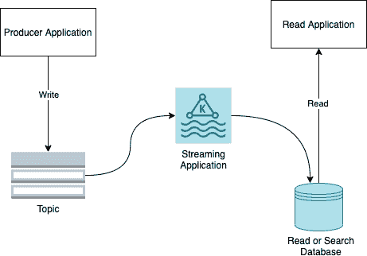

图 7.11 – CQRS 模式

上述图表描述了 CQRS 模式的工作原理。该模式的流程如下：

1.  首先，生产者或发布者将事件写入主题。

1.  使用流应用程序，此记录被流式传输到读取数据库。虽然主题针对快速数据写入进行了优化，但读取数据库针对高性能数据读取进行了优化。这种模式在需要高写入速度和高读取速度的场景中非常有用。

例如，对于像亚马逊这样的大型电子商务网站，在亚马逊促销日，流量会大幅增加。在这种情况下，可能会有大量的写入和搜索。在这种情况下，各种来源，如移动应用、网络门户等，将接受订单并更新库存。此外，卖家和亚马逊代表使用亚马逊大日促销活动管理门户每小时更改优惠和折扣。尽管会有大量的读取和写入，但客户对搜索结果期望有亚秒级的响应时间。这可以通过维护单独的写入和搜索数据库来实现。

因此，这个用例非常适合 CQRS 模式。在这里，当客户搜索时，数据从搜索数据库中检索，而当客户下单或添加到购物车时，它被写入写入数据库。写入数据库中的信息将实时流式传输到搜索数据库，如 Elasticsearch 或 AWS OpenSearch。因此，搜索产品和折扣的用户应该能在几秒钟内得到搜索结果。

## 奇异榕树模式

奇异榕树模式的名字来源于一种热带榕树，这种榕树在其宿主树周围生长，逐渐勒死宿主树，导致其死亡。这种模式最初由马丁·福勒提出。尽管基本模式可以以不同的方式实现，但流式管道为我们提供了一种本地化的方式来使用这种模式。为了理解这种模式，让我们来看一个例子。

假设有一个由三个模块组成（A、B 和 C）的单体应用。A、B 和 C 读取和写入数据库。最初，架构如下所示：

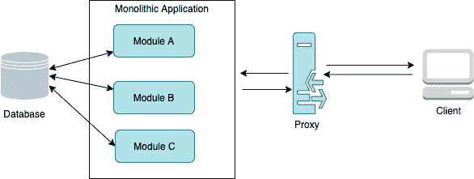

图 7.12 – 单体应用的初始状态

如我们所见，所有模块都有双向箭头，表示读取和写入都在发生。现在，使用奇异榕树模式，我们可以通过逐步迁移各个模块作为独立的微服务——一次一个——将这个单体遗留应用转换为基于微服务的应用。以下图表显示了**模块 A**正在从单体应用迁移到微服务模式：

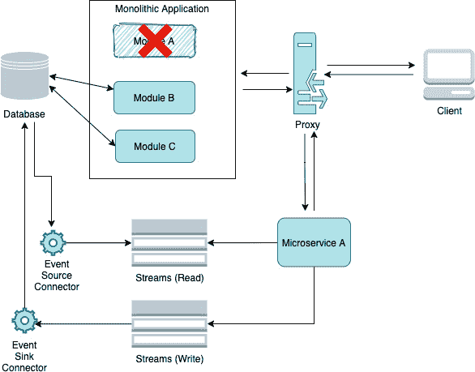

图 7.13 – 模块 A 被微服务 A 取代

如我们所见，**微服务 A**（它已成功取代了**模块 A**）读取和写入数据到事件流。这个事件流反过来又通过事件源或接收器连接器连接到数据库。慢慢地，单体应用将被勒死，最终的转换架构将如下所示：

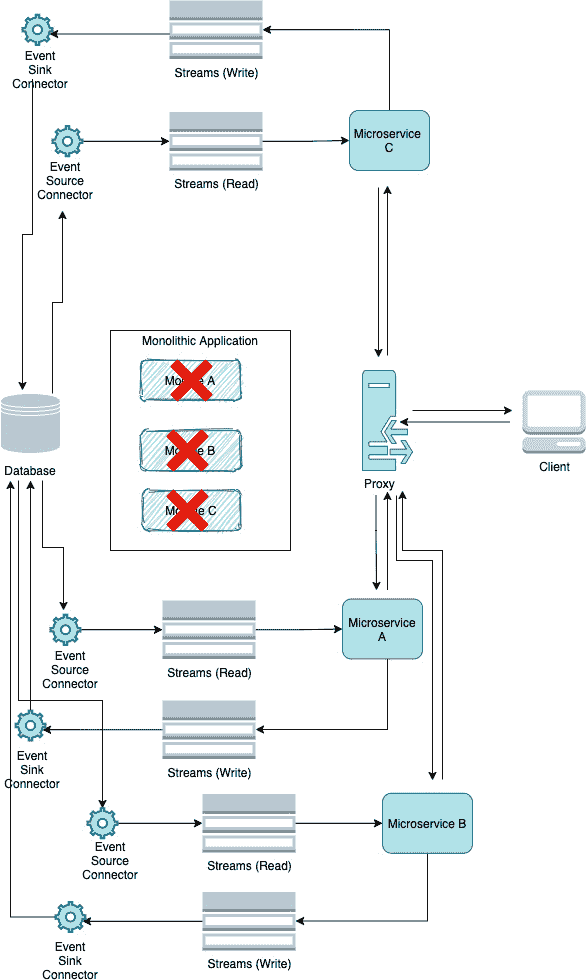

图 7.14 – 使用奇异榕树模式迁移所有模块

如我们所见，所有模块都已从单体应用迁移到联邦微服务模式，从而使单体应用得以退役。

## 日志流分析模式

在这个模式中，我们将学习如何使用来自各种应用、Web 门户、后端服务和物联网设备的日志进行分析和监控。以下图展示了用于促进日志分析和监控的典型日志流模式：

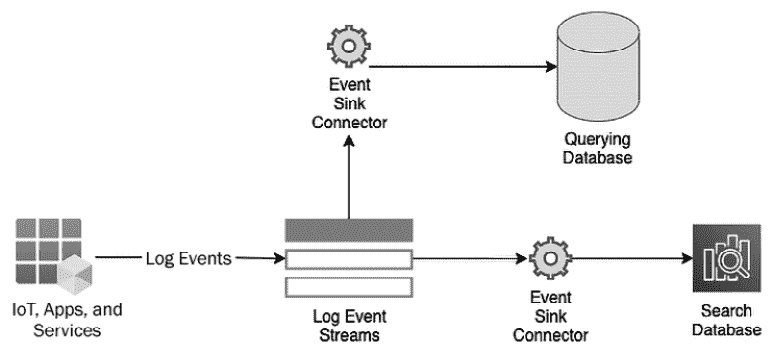

图 7.15 – 日志流分析模式

让我们学习这个模式是如何工作的：

1.  从前面的图中可以看出，来自各种物联网设备、应用、Web 门户和服务的所有日志事件都流式传输到一个事件流中。

1.  然后，使用事件接收器连接器，事件被发送到搜索数据库和查询数据库。

搜索数据库可以是搜索引擎，如 Elasticsearch、AWS OpenSearch、Splunk 或 Apache Solr。这个数据库可以支持使用复杂查询模式的快速搜索。它还利用搜索引擎的功能进行可视化和分析。查询数据库可以是 MPP 数据库，如 Redshift 或 Snowflake，或者查询引擎，如 Athena。查询引擎允许用户在 ObjectStores（如 S3 对象）上运行 SQL 查询。

以下图展示了在 AWS 中此类模式的一个示例实现：

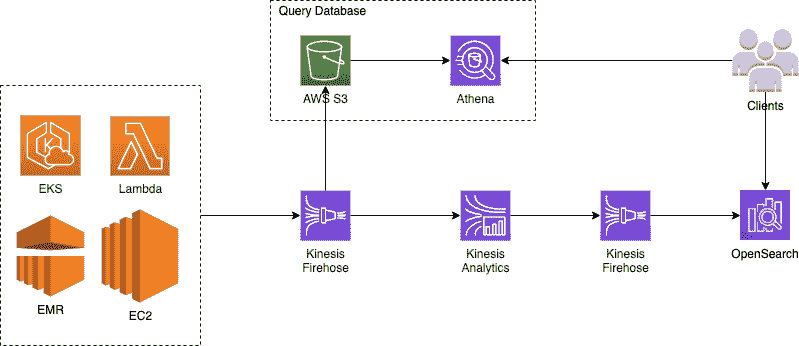

图 7.16 – AWS 中的日志分析模式示例

在这里，来自各种 AWS 服务（如 EC2、ECR、EKS 等）的日志事件通过 Kinesis Firehose 流式传输到一个 Kinesis 主题。使用 Kinesis Analytics 进行转换，并通过 Kinesis Firehose 流式传输到 AWS OpenSearch 进行搜索和分析。另一方面，数据从第一个 Kinesis Firehose 流式传输到 S3。在 S3 对象上创建了 Athena 表。然后 Athena 提供了一个易于使用的查询界面，以便对日志数据进行基于批次的查询分析。

在本节中，我们学习了各种流行的流处理模式，这些模式可以用来解决常见的数据工程问题。我们还查看了一些示例，并了解了何时应该使用这些模式。接下来，我们将研究一些流行的混合模式，这些模式结合了批处理和流处理。这些被称为混合数据处理模式。

# 混合数据处理模式

在本节中，我们将讨论两种非常著名的模式，它们支持批处理和实时处理。由于这些模式同时支持批处理和流处理，它们被归类为混合模式。让我们看看最流行的混合架构模式。

## Lambda 架构

首先，让我们了解 Lambda 架构的需求。在分布式计算中，CAP 定理表明任何分布式数据只能保证数据的三种特性中的两种——即一致性、可用性和分区容错性。然而，Nathan Marz 在 2011 年提出了一种新的模式，使得分布式数据存储中可以同时具备这三种特性。这种模式被称为 Lambda 模式。Lambda 架构由三层组成，如下所示：

+   **批量层**：这一层负责批量处理

+   **速度层**：这一层负责实时处理

+   **服务层**：这一层作为统一的查询服务层，下游应用程序可以在此进行查询

下面的图展示了 Lambda 架构的概述：

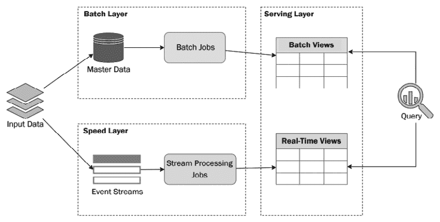

图 7.17 – Lambda 架构

在 Lambda 架构中，输入数据或源数据被写入批量层中的主数据存储，以及速度层中的事件流。主数据存储可能是一个关系型数据库或 NoSQL 数据库，或者是一个如 HDFS 的文件系统。在数据存储之上运行批量处理作业，以进行数据处理，并将数据加载到服务层中存在的批量视图中。事件流中写入的事件被流处理作业拾取、处理，并加载到实时视图中（如图 7.17 所示）。可以分别查询批量视图和实时视图，或者同时在这两个视图中查询以查看结果。批量视图主要用于历史数据，而实时视图用于 Delta 数据。

虽然它解决了最终一致性查询的问题，因为查询可以结合实时视图和基于批量的视图中的数据，但它也有一些缺点。其中一个主要的缺点是我们必须维护两个不同的工作流程——一个用于批量层，另一个用于速度层。由于在许多场景中，实现流式应用程序的技术与基于批量的应用程序的技术有很大不同，我们必须维护两个不同的源代码。此外，对批量处理和流处理系统进行调试和监控也成为一个额外的负担。我们将在下一个模式中讨论如何克服这些挑战。

## Kappa 架构

Lambda 架构被广泛接受的一个原因是它能够克服 CAP 定理的限制，并使整个行业更多地使用流处理。在 Lambda 架构之前，企业对使用流处理持怀疑态度，因为他们担心在实时处理中丢失消息。然而，这种假设在现代分布式流平台（如 Kafka 和 Pulsar）中并不成立。让我们看看 Kappa 架构如何为 Lambda 架构提供一个更简单的替代方案。以下图表描述了 Kappa 架构：

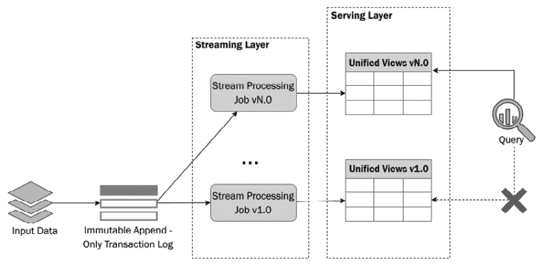

图 7.18 – Kappa 架构

在 Kappa 架构中，理念不是使用两种不同的流程——一个用于批处理，一个用于流处理。相反，它提出所有处理都应使用流处理引擎来完成。这意味着基于批处理的工作负载和基于流的工作负载都可以由单个管道处理。在这里，输入数据或源数据被写入一个特殊的事件流。这个事件流是一个不可变的追加只事务日志。由于它是一个追加日志，因此具有快速的写入能力。要读取数据，我们可以从之前读取数据停止的位置读取。除了这个最后的读取偏移量之外，它还应支持可重放性，这意味着我们可以从第一条消息开始读取。

由于我们正在讨论分布式计算，这个事务日志将被分区，这将提高读写性能。流处理作业读取事件，处理它们，并将输出写入统一视图（包含批处理和实时数据）。一个可能的问题就是，*这种类型的流程如何支持高容量的批处理负载？* 巨大的数据量也被发送到事务日志，然后由流处理作业拾取。输出存储在服务层中现有的视图中。为了处理这种高容量的事件流，我们需要通过增加事件流中的分区数量来增加更多的并行性。

此事件流日志应该具有保留功能。此外，消费者应能够使用事件时间或事件偏移量重新播放流。每个事件都有一个偏移量和事件时间戳。可重放功能允许消费者通过将事件偏移量或事件时间戳设置为较旧值来重新读取已检索的数据。

到目前为止，我们已经讨论了常用的基于批处理、实时和混合架构模式。在最后一节，我们将快速浏览一些常见的无服务器模式。

# 数据摄取的无服务器模式

我们将首先回答问题，*什么是无服务器计算？* 无服务器计算是一种云执行模型，其中云服务提供商根据需求分配资源，如存储和计算，同时代表客户管理服务器。无服务器计算消除了维护和管理服务器及其相关资源的负担。在这里，无服务器计算的客户不关心作业或应用程序如何以及在哪里运行。他们只关注业务逻辑，并让云服务提供商负责管理运行和执行该代码的资源。以下是一些无服务器计算的示例：

+   **AWS Lambda 函数或 Azure 函数**：这用于运行任何应用程序或服务

+   **AWS Glue**：用于运行基于大数据的 ETL 作业

+   **AWS Kinesis**：这是一个无服务器事件流和数据分析平台

虽然有许多有用的无服务器模式，但在此部分中，我们将讨论两个最相关的模式，这些模式可以帮助我们构建数据工程解决方案。以下是我们将讨论的无服务器模式：

+   **事件驱动触发模式**：这是一个在云架构中非常常见的模式。在此模式中，在对象存储（如 S3 存储桶）中创建或更新任何文件时，将触发无服务器函数。以下图表提供了此模式的概述：

图 7.19 – 事件驱动触发模式

在此模式中，对象存储中任何对象的变化，例如创建或删除，都可以触发无服务器函数。此无服务器函数可以直接处理数据或用于触发大数据作业。AWS Lambda 和 Azure Function 等无服务器函数可以设置触发器来触发它们。例如，可以配置 Lambda 函数以从 Bucket1 的任何新创建或更新的对象中触发 S3 触发器。触发的 Lambda 函数可以反过来触发 EMR 作业或无服务器 Glue 作业，这些作业转换并处理必要的数据，并将最终输出写入数据存储。或者，Lambda 函数可以进行一些数据处理并将输出结果存储在最终数据存储中。最终数据存储可以是 SQL 数据库、NoSQL 数据库、MPP 数据库或对象存储，如 AWS S3。

在*第五章*“构建批处理管道”中详细解释了使用此模式及其解决方案的实际场景。

+   **无服务器实时模式**：这是一个非常流行的无服务器模式，用于云中的数据摄取。以下图表中可以看到此模式的概述：

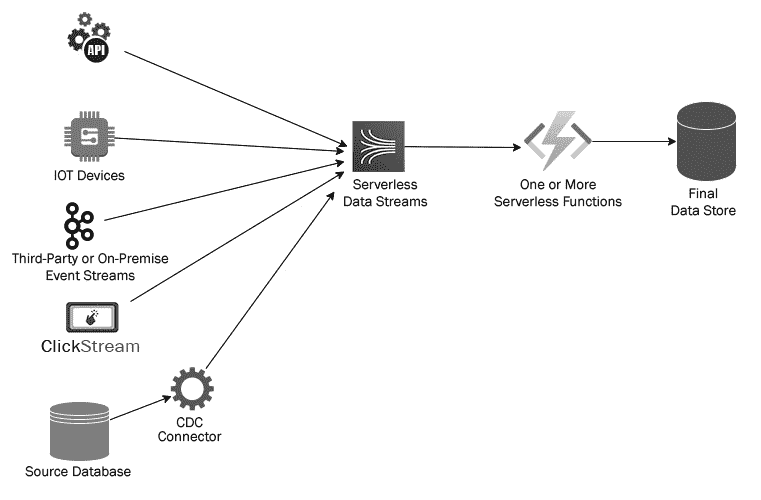

图 7.20 – 无服务器实时模式

在无服务器实时模式中，事件或数据流以及数据处理都是通过云中的无服务器服务来完成的。来自不同源系统的事件、日志和消息将事件发布到无服务器数据流平台，如 AWS Kinesis。数据流触发一个或一系列无服务器函数，这些函数一个接一个地执行数据处理。一旦数据处理完成，它就被写回到最终数据存储中。最终数据存储可以是 SQL、NoSQL、MPP 数据库、对象存储或搜索引擎。

一个可能使用此模式的实际示例是在信用卡使用的实时欺诈检测系统中。以下图展示了使用此模式在 AWS 中进行欺诈检测的示例解决方案：

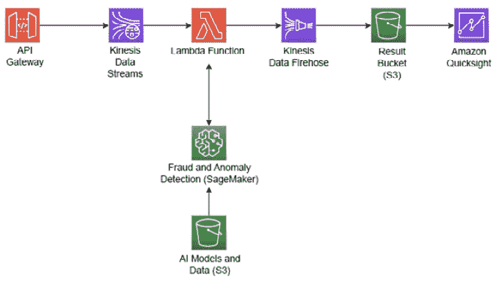

图 7.21 – AWS 中无服务器实时模式的示例实现

在这里，API 网关将实时信用卡交易直接流式传输到 Kinesis 数据流（一个无服务器数据流平台）。在 Kinesis 数据流中写入的交易事件触发 Lambda 函数对事件进行欺诈和异常检测。Lambda 函数利用 AWS SageMaker，它反过来使用存储在 S3 中的已存储数据科学模型来确定交易中的欺诈和异常。然后，输出传递给 Kinesis 数据火 hose，它捕获 Lambda 函数的结果并将其存储在一个 S3 桶中。这个 S3 桶包含实时结果。我们可以使用像 Amazon QuickSight 这样的服务来可视化结果，并在需要时采取任何行动。

通过这样，我们已经讨论了什么是无服务器计算，并讨论了两种高度使用的无服务器计算数据摄取模式。现在，让我们总结一下本章所学的内容。

# 摘要

在本章中，我们首先讨论了各种流行的批处理模式。我们涵盖了五种常用的模式来解决批处理问题。我们还研究了这些模式的示例以及在实际场景中使用这些模式的情况。然后，我们探讨了可用于构建流处理管道的五种流行模式以及它们如何用于解决数据工程中的实际问题。接下来，我们学习了 Lambda 和 Kappa 架构以及它们在批处理和流处理中的有用性。最后，我们学习了无服务器架构是什么，并探讨了两种流行的无服务器架构，这些架构用于解决云中许多数据工程问题。

到目前为止，我们已经知道如何实现批处理和流式处理解决方案，并对行业内常用的不同数据工程模式有一个相当的了解。现在，是时候在我们的解决方案中加入一些安全性和数据治理措施了。在下一章中，我们将讨论各种数据治理技术和工具。我们还将涵盖为什么以及如何将数据安全应用于数据工程解决方案。
