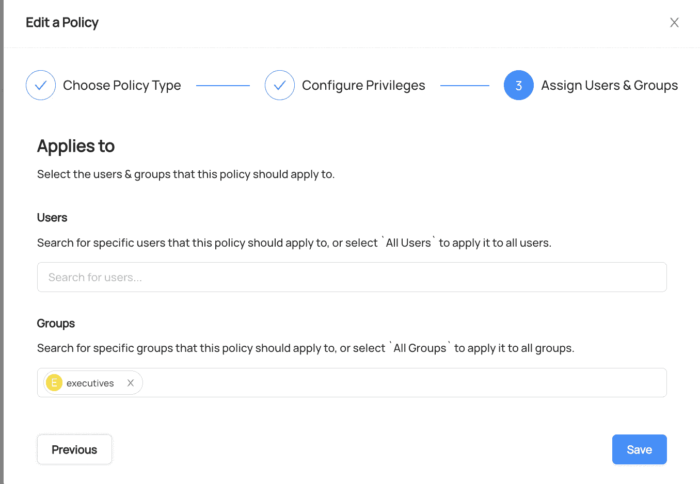

# 8

# 启用数据安全和治理

在前面的章节中，我们学习了如何评估需求，以及如何分析和应用各种架构模式来解决实时和基于批处理的问题。我们学习了如何选择最佳的技术栈，并开发、部署和执行所提出的解决方案。我们还讨论了数据摄取的各种流行架构模式。然而，任何关于数据架构的讨论如果没有提及数据治理和数据安全都是不完整的。在本章中，我们将重点关注理解和应用数据层中的数据治理和安全。

在本章中，我们首先将讨论数据治理是什么，以及为什么它如此重要。我们还将简要讨论市场上可用的几个开源数据治理工具。然后，我们将通过向数据摄取管道添加数据治理层来实际演示数据治理的实施。数据摄取管道的 ID 将使用 Apache NiFi 开发，数据治理将通过 DataHub 实现。然后，我们将讨论数据安全的需求以及有助于实现它的解决方案类型。最后，我们将讨论可用于启用数据安全的开源工具。

到本章结束时，您将了解数据治理框架的定义和需求。您还将了解何时需要数据治理，以及关于数据治理框架的所有内容，包括**数据治理研究所**（**DGI**）的内容。此外，您将了解如何使用 DataHub 实施实际的数据治理。最后，您将了解可用于启用数据安全的各种解决方案和工具。

在本章中，我们将涵盖以下主要主题：

+   介绍数据治理——是什么以及为什么

+   使用 DataHub 和 NiFi 的实际数据治理

+   理解数据安全的需求

+   可用于数据安全性的解决方案和工具

# 技术要求

对于本章，您将需要以下内容：

+   在您本地机器上安装的 OpenJDK 1.11

+   在您本地机器上安装的 Docker

+   一个 AWS 账户

+   在您本地机器上安装的 NiFi 1.12.0

+   在您本地机器上安装的 DataHub

+   建议您具备 YAML 的相关知识

本章的代码可以从本书的 GitHub 仓库下载：[`github.com/PacktPublishing/Scalable-Data-Architecture-with-Java/tree/main/Chapter08`](https://github.com/PacktPublishing/Scalable-Data-Architecture-with-Java/tree/main/Chapter08)。

# 介绍数据治理——是什么以及为什么

首先，让我们尝试了解数据治理是什么以及它做什么。用通俗易懂的话说，**数据治理**是分配适当的权限并就数据相关事务做出决策的过程。根据 DGI 的定义，数据治理被定义为“*一个关于信息相关流程的决策权和问责制系统，根据已同意的模型执行，这些模型描述了谁可以在什么情况下使用什么信息采取什么行动，以及何时、在何种情况下、使用什么方法。*”

如定义所示，它是一种创建明确的策略、政策和规则的做法，这些规则定义了谁可以做出什么决定或执行与数据相关的行动。它还规定了如何做出与数据相关的决策的指南。

数据治理考虑以下方面：

+   规则

+   企业级组织

+   决策权和程序

+   责任制

+   监控和控制数据

现在我们已经对数据治理有了基本的了解，让我们来探讨在哪些情况下推荐采用数据治理。

## 考虑数据治理的时机

在以下任何情况下，都应考虑采用正式的数据治理框架：

+   组织中的数据量增长如此之大，变得如此复杂，以至于传统的数据管理工具无法解决跨职能的数据需求。

+   水平聚焦的业务单元和团队需要由其他聚焦团队生成或维护的跨职能数据。在这种情况下，需要企业级的数据可用性和管理解决方案（而不是孤岛式），例如，对于维萨（Visa）的 B2B 销售，市场营销和会计部门在孤岛中维护数据。然而，销售部门需要这两个孤岛的数据来创建准确的销售预测。因此，这些不同部门之间的数据应存储在企业级的中央存储库中，而不是孤岛中。因此，这个企业级的数据需要数据治理以确保适当的访问、使用和管理。

+   合规性、法律和合同义务也可能要求正式的数据治理。例如，**健康保险可携带性和问责法案**（HIPAA）强制要求所有**受保护的健康信息**（PHI）数据应得到良好的治理并受到盗窃或未经授权访问的保护。

到目前为止，我们已经讨论了数据治理是什么以及何时应该有一个正式的数据治理框架。现在我们将学习关于 DGI 数据治理框架的内容。

## DGI 数据治理框架

DGI 数据治理框架是在组织内实施适当数据治理的逻辑结构，以使做出更好的数据相关决策成为可能。以下图表展示了这个数据治理框架：


图 8.1 – 数据治理框架

在本节中，我们将讨论 DGI 数据治理框架的各个组成部分。让我们看看前面图表中突出显示的每个组件：

1.  **使命**：DGI 框架的使命可以归因于三个主要责任：

    1.  定义规则

    1.  通过为数据利益相关者提供持续的保护和服务来执行和实施规则

    1.  处理因不遵守规则而出现的场景

这种使命形式与政治治理非常相似。在政治治理模型中，政府制定规则，行政部门执行规则，司法部门处理不遵守规则或违反规则的人。就像政治治理一样，在这里，一组数据利益相关者定义规则。另一组利益相关者确保规则得到遵守。最后，第三组利益相关者做出与不遵守规则相关的决策。组织可以选择在使命周围制定一个愿景声明，这可能被用来激发数据利益相关者展望可能性并设定数据相关目标。

1.  **重点领域**：使命和愿景引导我们到主要关注领域。我们有两个主要关注领域。具体如下：

    +   目标应该是**SMART** – 即**具体、可衡量、可操作、相关和及时**。在决定我们想要追求的目标时，我们应该记住四个 P 的原则 – 即项目、项目、专业学科和人员。我们必须问这些努力如何从收入、成本、复杂性和确保生存（即安全、合规性和隐私）的角度帮助我们的组织。

    +   指标也应该 SMART。数据治理中的每个人都应该知道如何量化并衡量成功。

这次讨论引出了一个问题：我们可以在哪里为我们的数据治理计划提供资金。为了做到这一点，我们必须提出以下问题：

+   我们如何为数据治理办公室提供资金？

+   我们如何为数据架构师/分析师提供资金以定义规则和数据？

+   我们如何为数据治理活动提供资金？

在规划正式数据治理时，重点领域非常重要。

1.  **数据规则和定义**：在这个组件中，围绕数据设定了规则、政策、标准和合规性。典型活动可能包括创建新规则、探索现有规则以及解决差距和重叠。

1.  **决策权**：这个组件提出了问题，*谁可以在何时以及使用什么流程做出与数据相关的决策？* 数据治理计划允许我们将决策权作为与数据相关的决策的元数据存储。

1.  **问责制**：这个组件在做出决策后，为规则的执行或决策创造了问责制。数据治理计划可能需要将问责制整合到日常的**软件开发生命周期**（**SDLC**）中。

1.  **控制措施**：数据是新的黄金，如果发生敏感数据泄露，将涉及巨大的安全风险。我们如何确保这些风险得到缓解和处理？它们可以通过控制措施来处理。控制措施可以是预防性的或反应性的。数据治理团队通常负责在不同控制层（网络/操作系统/数据库/应用程序）上制定创建这些控制措施的建议。有时，数据治理团队还被要求修改现有的控制措施，以确保更好的数据治理。

1.  **数据利益相关者**：数据利益相关者是那些可能影响或受数据影响的人或团体。由于他们与数据有直接关联，因此在做出数据决策时会咨询他们。同样，根据情景，他们可能希望参与某些与数据相关的决策，在决策最终确定之前应进行咨询，或者在决策做出后应被告知。

1.  **数据治理办公室**：它促进、支持和运行数据治理计划以及数据管理员活动。它是中央治理机构，通常由数据架构师、数据分析师以及那些从事元数据创建工作的人组成。它收集并协调来自组织不同利益相关者的政策、规则和标准，并提出组织层面的规则和标准。它负责提供中央数据治理相关的沟通。它还负责收集数据治理指标，并向所有数据利益相关者发布报告和成功措施。

1.  **数据管理员**：他们是数据治理委员会的一部分，负责做出与数据相关的决策，例如制定政策、指定标准或向 DGO 提供建议。根据组织的规模和复杂性，数据治理委员会（们）可能有一个等级结构。在以数据质量为重点的治理项目中，可能有一个可选的数据质量管理员。

1.  **数据处理**：这些是用于管理数据的手段。这些过程应该被记录、标准化和可重复。它们旨在遵循数据管理、隐私和安全方面的监管和合规要求。

所有这些组件协同工作，形成一个反馈循环，确保数据治理持续改进并保持最新。

在本节中，我们了解了数据治理是什么，何时应该实施，以及 DGI 框架。在下一节中，我们将提供实施数据治理的逐步指南。

# 使用 DataHub 和 NiFi 进行实际数据治理

在本节中，我们将讨论一个名为 DataHub 的工具，以及不同的数据利益相关者和管理员如何利用它来实现更好的数据治理。但首先，我们将了解用例以及我们试图实现的目标。

在本节中，我们将围绕数据摄取管道构建数据治理能力。此数据摄取管道将从 S3 位置获取任何新对象，对其进行丰富，并将数据存储在 MySQL 表中。在这个特定的用例中，我们从移动或网络等不同来源的 S3 桶中获取电话充值或充值（套餐）事件。我们使用 Apache NiFi 管道丰富这些数据并将其存储在 MySQL 数据库中。

Apache NiFi 是一个强大且可靠的拖放式可视化工具，它允许您轻松处理和分发数据。它创建有向图以创建工作流程或数据管道。它由以下高级组件组成，以便您创建可靠的数据路由和转换能力：

+   **FlowFile**: 在 NiFi 管道中，每个数据记录都被序列化并作为 FlowFile 对象进行处理。FlowFile 对象由表示数据内容和元数据的 flowfile 内容和属性组成。

+   **处理器**: 这是 NiFi 的基本单元之一。该组件主要负责处理数据。它以 FlowFile 作为输入，对其进行处理，并生成一个新的 FlowFile。大约有 300 个内置处理器。NiFi 允许您使用 Java 开发和部署额外的自定义处理器。

+   **队列**: NiFi 遵循分阶段事件驱动架构。这意味着处理器之间的通信是异步的。因此，需要一个消息总线来保存一个处理器生成的 FlowFile，直到它被下一个处理器取走。这个消息总线被称为 NiFi 队列。此外，它支持设置背压阈值、负载均衡和优先级策略。

+   **控制器服务**: 这允许您在 JVM 中干净且一致地共享功能状态。它负责创建和维护数据库连接池或分布式缓存等任务。

+   **处理器组**: 当数据流变得复杂时，将一组组件（如处理器和队列）组合成一个称为处理器组的封装更有意义。一个复杂的管道可能连接多个处理器组。每个处理器组内部都有一个数据流。

+   **端口**: 可以使用端口连接处理器组。要从外部处理器组获取输入，使用输入端口。要将处理后的 FlowFile 从处理器组发送出去，使用输出端口。

现在，让我们为我们的用例构建 NiFi 管道。我们的源是一个名为`chapter8input`的 S3 桶，而我们的输出是一个 MySQL 集群。我们将从不同的来源接收`chapter8input`文件夹中的 S3 对象。每个 S3 对象将以 JSON 格式存在，并包含一个电话充值或充值（套餐）事件。我们的数据汇是一个名为`bundle_events`的 MySQL 表。该表的**数据定义语言**（**DDL**）如下：

```java
CREATE TABLE `dbmaster`.`bundle_events` (
  `customerid` INT NOT NULL,
  `bundleid` INT NOT NULL,
  `timestamp` VARCHAR(45) NOT NULL,
  `source` VARCHAR(45) NULL,
  PRIMARY KEY (`customerid`, `bundleid`, `timestamp`));
```

现在，NiFi 管道会轮询 S3 存储桶并检查任何更改事件，例如创建或更新 JSON 文件。一旦文件上传到 S3 存储桶，NiFi 应该获取该文件，使用 S3 对象名称丰富其源类型，然后将丰富后的数据写入 MySQL 的`bundle_events`表。

如果您系统中没有安装 Apache NiFi，请下载并安装 Apache NiFi-1.12.0。您可以在[`github.com/apache/nifi/blob/rel/nifi-1.12.0/nifi-docs/src/main/asciidoc/getting-started.adoc#downloading-and-installing-nifi`](https://github.com/apache/nifi/blob/rel/nifi-1.12.0/nifi-docs/src/main/asciidoc/getting-started.adoc#downloading-and-installing-nifi)下载、安装并遵循启动说明进行安装。或者，您可以在 AWS EC2 实例上启动一个 NiFi 集群/节点。

## 创建 NiFi 管道

接下来，我们将讨论如何构建 NiFi 管道。我们将构建的 NiFi 管道如下截图所示：


图 8.2 – 从 S3 读取数据并写入 MySQL 的 NiFi 管道

让我们尝试理解整个 NiFi 管道以及我们是如何构建它的：

1.  首先，我们使用**ListS3**处理器来捕获配置的 S3 存储桶中是否有任何 S3 对象被插入或更新。它列出了所有更改事件。

1.  然后，使用**SplitRecord**处理器将记录拆分为单个事件。

1.  使用 FlowFile 的`sourceKey`属性。

1.  然后，我们使用**FetchS3Object**来获取 S3 对象。**FetchS3Object**处理器负责读取实际的 S3 对象。如果**FetchS3Object**成功读取文件，它将 S3 对象内容作为 FlowFile 发送到**JoltTransformRecord**处理器。

1.  **JoltTransformRecord**用于在丰富数据被**PutDatabaseRecord**处理器写入 MySQL 之前丰富数据。

1.  **PutDatabaseRecord**处理器的成功状态被发送到**LogSuccessMessage**处理器。如图中所示，所有在失败场景中的 FlowFiles 都被发送到**LogErrorMessage**处理器。

现在，让我们配置 NiFi 管道中存在的每个 NiFi 处理器（如图 8.2 所示）：

+   **ListS3 处理器**：以下截图显示了**ListS3**处理器的配置：


图 8.3 – 配置 ListS3 处理器

如我们所见，**ListS3**处理器被配置为轮询并监听**chapter8input** S3 存储桶中的更改。除了存储桶名称外，我们还必须为 NiFi 实例配置**区域**、**访问密钥 ID**和**秘密访问密钥**详细信息，以便连接到 AWS S3 存储桶。最后，我们已配置记录编写器属性，将其设置为**JsonRecordSetWriter**类型的控制器服务。

+   **SplitRecord 处理器**：接下来，我们将配置**SplitRecord**处理器，如下截图所示：


图 8.4 – 配置 SplitRecord 处理器

**SplitRecord**负责将包含多个写入事件的单个 FlowFile 在 S3 中分割成单独的事件。现在，每个事件都是单个**S3Object**的元数据。

+   **EvaluateJsonPath 处理器**：我们使用**EvaluateJsonPath**处理器从 FlowFile 内容中提取**key**列的值，并将其作为属性添加到 FlowFile 属性中。**EvaluateJsonPath**处理器的配置如下截图所示：


图 8.5 – 配置 EvaluateJsonPath 处理器

在这里，我们已配置了`flowfile-attribute`值。这表示将向 FlowFile 属性中添加一个新的键值对。要添加的属性应提供为动态属性，其中属性名称将是属性键，属性值将是属性值。在这里，我们添加了一个名为`$.key`的属性。此表达式从 FlowFile 内容（这是一个 JSON）中获取`key`字段的值。

+   **FetchS3Object 处理器**：以下截图显示了**FetchS3Object**处理器的配置：


图 8.6 – 配置 FetchS3Object 处理器

如我们所见，`${sourcekey}`是一个 NiFi 表达式，用于获取**sourcekey**属性值。除此之外，还需要在此处理器中设置与 S3 相关的属性，如**Bucket**、**Access Key ID**和**Secret Access Key**。此处理器的输出是我们**S3Object**的内容（以 JSON 格式）。

+   **JoltTransformRecord 处理器**：**JoltTransform**处理器用于向 JSON 中添加新的键值对。**JoltTransformRecord**处理器的配置如下：


图 8.7 – 配置 JoltTransformRecord 处理器

`shift`、`chain`和`default`。有关 Apache Jolt 的更多信息，请访问[`github.com/bazaarvoice/jolt#jolt`](https://github.com/bazaarvoice/jolt#jolt)。

在这里，我们将讨论我们用于向 JSON FlowFile 内容添加键值对的 Jolt 转换。我们使用**Jolt 规范**属性添加`source`键，如下所示：


图 8.8 – 使用 Jolt 规范属性添加源键

如您所见，通过在 `source` 键中将 `operation` 设置为 `default` 并使用 NiFi 表达式语言计算出的动态值。`${sourcekey:substringBefore('_')}` 是一个 NiFi 表达式。此表达式返回 `FlowFile` 属性 `'_'` 的子字符串）。

+   **PutDatabaseRecord 处理器**：一旦此 JSON 被添加的新键值对丰富，记录就会使用 **PutDatabaseRecord** 处理器写入 MySQL 数据库。以下屏幕截图显示了 **PutDatabaseRecord** 处理器的配置：


图 8.9 – 配置 PutDatabaseRecord 处理器

如此配置所示，我们需要配置两个控制器服务 – `MySQL`、`INSERT` 和 `bundle_events`。现在，让我们看看名为 **DBCPConnectionPool** 的服务（称为 **MysqlDBCPConnectionPool**）是如何配置的。以下屏幕截图显示了 **MysqlDBCPConnectionPool** 服务的配置：


图 8.10 – 配置 DBCPConnectionPool 服务

**MysqlDBCPConnectionPool** 控制器服务用于创建 JDBC 连接池。为此，您必须配置 **数据库连接 URL**（JDBC URL）、**数据库驱动类名称** 和 **数据库驱动位置** 属性，如前一个屏幕截图所示。

通过这样，我们已经构建了整个 NiFi 管道，用于从 S3 提取数据，对其进行丰富，并将其写入 MySQL 表。您可以通过访问 [`github.com/PacktPublishing/Scalable-Data-Architecture-with-Java/blob/main/Chapter08/sourcecode/nifi_s3ToMysql.xml`](https://github.com/PacktPublishing/Scalable-Data-Architecture-with-Java/blob/main/Chapter08/sourcecode/nifi_s3ToMysql.xml) 来查看整个 NiFi 管道。

## 设置 DataHub

现在，我们将向我们的解决方案添加一个数据治理层。尽管有许多数据治理工具可用，但其中大多数是付费工具。云中有几种按需付费的数据治理工具，例如 AWS Glue 目录。然而，由于我们的解决方案将在本地运行，我们将选择一个平台无关的开源工具。LinkedIn 开发的 DataHub 就是这样的开源工具之一，它附带了一套相当不错的功能。我们将在此章中使用它来实际解释数据治理。在本节中，我们将学习如何配置 DataHub。在此管道中，S3 是源，MySQL 是目标，NiFi 是处理引擎。要创建数据治理，我们需要连接到所有这些系统并从中提取元数据。DataHub 为我们完成这项工作。

在我们将这些组件（数据管道的组件）连接到 DataHub 之前，我们需要在我们的本地 Docker 环境中下载并安装 DataHub。详细的安装说明可以在 [`datahubproject.io/docs/quickstart`](https://datahubproject.io/docs/quickstart) 找到。

在下一节中，我们将学习如何将不同的数据源连接到 DataHub。

### 向 DataHub 添加摄取源

要将数据源或管道组件连接到 DataHub，我们必须从右上角的菜单栏转到**摄取**标签，如图所示：


图 8.11 – 在 DataHub 中连接新的元数据源

然后，我们必须点击**创建新源**按钮来创建到数据源的新连接。点击此按钮后，我们会得到以下弹出窗口：


图 8.12 – 选择要创建新连接的数据源类型

此弹出窗口是一个多页向导，您可以在其中创建新的数据源连接。首先，如图所示，您被要求选择数据源类型。例如，如果数据存储在 MySQL 数据库中，那么我们会从向导中提供的各种缩略图中选择 MySQL。对于未列出的源，例如 NiFi 和 S3，我们可以选择**自定义**缩略图。一旦选择了类型，点击**下一步**；您将被带到第二个步骤，称为**配置食谱**，如图所示：


图 8.13 – 配置数据源的食谱

在提供的空间中的`YAML`代码中。无论数据源如何，YAML 都有两个顶级元素——`source`和`sink`。同样，`source`和`sink`都包含两个元素——`type`和`config`。在这里，`type`表示源或目的地的类型。例如，在上面的截图中，我们正在配置 NiFi，因此源类型是`nifi`。如果我们上一步选择了 MySQL 作为连接类型，那么在此步骤中源的类型将是`mysql`。

目前在 DataHub 中主要有三种类型的目的地，如下所示：

+   `stdout`

+   **DataHub**：元数据通过 GMS REST API 发送到 DataHub

+   **文件**：元数据被发送到配置的文件

在这里，我们将使用 DataHub 作为目的地，因为这允许我们利用 DataHub 的功能进行治理和监控。在这种情况下，我们的目的地类型将是`datahub-rest`。我们还需要指定 GMS REST API 的 HTTP 地址作为基本路径。由于我们的 DataHub 安装使用 Docker，我们将使用`localhost:9002`作为服务器 IP 地址（如图*8.13*所示）。

一切添加完毕后，点击**下一步**进入**执行计划**步骤，如图所示：


图 8.14 – 创建执行计划

在此步骤中，我们为 DataHub 设置执行计划以从源获取元数据。在此情况下，我们配置了一个 CRON 表达式，`0,30 * * * *`，这意味着它将每 30 分钟运行一次。

点击**下一步**进入最后一步，如图下所示截图：


图 8.15 – 新建数据源向导的最后一步

在向导的最后一步，我们需要输入数据源名称。这个名称可以是任何有助于唯一识别该源的任意名称。最后，我们必须点击**完成**来添加新的数据源。以下截图显示了添加的源：


图 8.16 – 快速查看添加的源

如前述截图所示，我们可以监控作业运行次数以从每个源获取元数据，以及最后一次运行是否成功。我们用于用例的所有 YAML 文件都可以在 GitHub 上找到，网址为[`github.com/PacktPublishing/Scalable-Data-Architecture-with-Java/tree/main/Chapter08`](https://github.com/PacktPublishing/Scalable-Data-Architecture-with-Java/tree/main/Chapter08)。

在下一节中，我们将讨论如何使用此工具执行不同的数据治理任务。

## 治理活动

如前所述章节讨论，一旦数据源或管道与 DataHub 连接，它将提供许多工具来支持围绕这些源的数据治理模型。以下是我们将在本章中探讨的一些功能：

+   **添加域**：在 DataHub 中，域可以是任何逻辑分组；它可能是特定于组织的。这有助于我们分析按域的资源利用和其他统计数据。例如，组织可以使用业务单元名称作为域。在我们的特定场景中，**DataServices**是组织中的一个业务单元，我们创建了一个以业务单元命名的域。要创建新域，我们可以导航到**管理** | **域**并点击**新建域**按钮。一旦点击此按钮，将打开一个弹出对话框，如图下所示：


图 8.17 – 创建新域

如我们所见，我们必须为域提供一个名称和描述。不能创建两个具有相同名称的域。

+   **添加用户组**：我们可以通过进入**设置**并选择**组**选项卡来管理用户和组。点击**创建组**按钮后，将出现一个类似于以下对话框：


图 8.18 – 添加新的用户组

如我们所见，我们必须提供一个组名和可选的描述。用户组有助于使任何用户成为组的一部分，并将责任、所有权、访问策略和规则分配给组。

+   **探索元数据**：在数据治理中，这项活动属于数据定义。大多数数据治理工具支持元数据管理。在此，如图下所示，DataHub 仪表板提供了元数据的摘要：


图 8.19 – 平台和域资源概览

前面的截图显示了每个平台上存在的各种平台和对象。它还显示了每个域中有多少资源。对于企业数据治理，监控和理解不同业务单元用于审计、跟踪和财务目的的资源数量非常重要。下面的截图显示了一个 MySQL 表资源和相应的数据定义：


图 8.20 – 向元数据添加描述

如我们所见，我们可以向元数据添加描述。另一方面，下面的截图显示了如何在 DataHub 中加载和查看表的架构：


图 8.21 – 表的架构

如我们所见，描述、术语和标签可以添加并维护在模式的每一列中。这为数据治理的数据定义活动提供了可能。

+   **探索血缘**：DataHub 允许我们探索数据血缘。在数据治理的数据定义中，除了维护元数据和描述外，适当的治理还必须了解数据的来源以及它的使用方式。这一方面由**血缘**所涵盖，如下面的截图所示：


图 8.22 – 数据血缘

在这里，我们可以看到**1 个下游**和**chapter8input** S3 存储桶没有上游事件。我们可以点击**可视化血缘**按钮来以图表的形式查看血缘，如下面的截图所示：


图 8.23 – 将数据血缘可视化成工作流

除了可视化血缘之外，您还可以探索此资源的影響分析。这种影响分析有助于在发生更改或维护事件时与受影响的群体进行沟通。

+   **通过添加域和所有者到资源来建立问责制**：我们可以从资源的着陆页开始，通过将域和一个或多个所有者附加到资源上来创建资源的问责制，如下面的截图所示：


图 8.24 – 分配域和所有者

所有者可以是组或用户。然而，建议将所有权分配给组，并将用户添加到该组中。在添加所有者时，您可以选择所有权的类型，如下面的截图所示：


图 8.25 – 添加所有者

在这里，当我们添加**offer_analytics**所有者时，我们将所有者类型设置为**技术所有者**。所有者可以是三种类型之一 – **技术所有者**、**业务所有者**或**数据管理员**。**技术所有者**负责生成、维护和分发资产。**业务所有者**是与资产相关的领域专家。最后，**数据管理员**负责资产的管理。

+   **设置策略**：DataHub 允许我们设置策略。策略是一组规则，用于定义对资产或 DataHub 平台的权限。策略分为两类 – **平台** 和 **元数据**。**平台**策略允许我们将 DataHub 平台级别的权限分配给用户或组，而**元数据**策略允许我们将元数据权限分配给用户或组。要创建新策略，请转到 **设置** | **权限**。点击 **创建新策略**按钮后，将出现一个向导，如下截图所示：


图 8.26 – 创建 View_Analytics 策略

在这里，我们正在创建一个名为 **View_Analytics** 的新策略。我们已选择 **平台** 作为策略类型。可选地，我们可以添加策略的描述。在这里，我们添加了一个描述，说明 **此策略仅用于查看分析**。

点击**下一步**进入**配置权限**部分，如下截图所示：


图 8.27 – 配置策略权限

在这里，我们正在配置我们定义的策略的平台权限。最后，我们必须选择/指定此策略将应用到的用户或组。以下截图显示了如何将用户或组分配给策略：



图 8.28 – 将用户/组分配给策略

如我们所见，**View_Analytics**策略已分配给**executives**组。

+   **可视化分析**：DataHub 还允许用户创建和保存用于组织数据治理所需分析的仪表板。以下截图显示了各种指标，例如最常查看的数据集和数据治理完整性（文档/血缘/模式的定义程度）：


图 8.29 – 各种可视化分析指标

以下截图显示了其他仪表板图表，其中我们可以找到按领域使用的平台及其计数。我们还可以看到每个平台上的实体数量（数据集或管道组件）：


图 8.30 – 数据景观摘要

现在我们已经讨论并学习了数据治理的概念，并在一个用例中实际实施了数据治理，让我们来了解数据安全。

# 理解数据安全的需求

在我们理解数据安全的需求之前，让我们尝试定义一下什么是数据安全。**数据安全**是保护企业数据并防止数据因恶意或未经授权的访问而丢失的过程。数据安全包括以下任务：

+   保护敏感数据免受攻击。

+   保护数据和应用程序免受任何勒索软件攻击。

+   防御任何可能删除、修改或破坏企业数据的攻击。

+   在组织内部允许必要的用户访问和控制数据。再次强调，根据角色及其用途，数据提供只读、写入和删除访问权限。

一些行业可能对数据安全有严格的要求。例如，一家美国健康保险公司需要确保根据 HIPAA 标准，PHI 数据得到极好的保护。另一个例子是，像美国银行这样的金融机构必须确保卡和账户数据极其安全，因为这可能导致直接的货币损失。但即使在没有严格的数据安全要求的情况下，数据安全对于防止数据丢失和防止组织客户对组织的信任损失也是至关重要的。

尽管数据隐私和数据安全是重叠的术语，但了解两者之间的细微差别是有帮助的。数据隐私确保只有经过身份验证的用户才能访问数据，即使数据被某种方式访问，它也应该被加密或标记化，以便未经授权的用户无法使用数据。数据安全包括数据隐私问题，但除此之外，它还专注于解决与数据相关的任何恶意活动。一个简单的例子是，为了保护 PHI 数据，Cigna 健康保险公司已对其所有敏感数据进行加密。这确保了数据隐私，但并未确保数据安全。尽管黑客可能无法解密加密数据，但他们仍然可以删除数据或对数据进行双重加密，使数据变得无法使用。

现在，让我们讨论一下为什么数据安全是必要的。

每年，仅在美国，数据泄露造成的损失就约为 80 亿美元，平均每次事件导致大约 25,000 个账户受到损害。让我们探讨一下过去几年发生的几起最大的数据泄露事件：

+   2013 年 6 月，Capital One 报告了一起数据泄露事件，影响了其 1.06 亿个账户。个人信息，如信用记录、社会保障号码和银行账户信息遭到泄露。

+   2021 年 6 月，LinkedIn 发生了一起大规模数据泄露事件，当时有 7 亿个账户（当时总账户数的 92%）受到影响。用户数据被发布在暗网上出售。

+   2019 年 4 月，Facebook 报告了一起攻击事件，影响了 5.33 亿个账户。

如我们所见，这些泄露不仅对受损害的数据构成安全风险，还损害了公司的声誉和信任。现在，让我们讨论一些常见的数据安全威胁，如下所示：

+   **钓鱼和其他社会工程学攻击**：社会工程学是欺骗或操纵个人以获取对公司数据未授权访问或收集机密信息的常用方法。钓鱼是社会工程学攻击的一种常见形式。在这里，看似来自可信来源的消息或电子邮件被发送给个人。它们包含恶意链接，当点击时，可以未授权访问公司网络和数据。

+   **内部威胁**：内部威胁是由无意或有意威胁公司数据安全的员工引起的。它们可以是以下类型：

    +   恶意行为者，他们出于个人利益故意窃取数据或对组织造成损害。

    +   非恶意行为者，他们意外地造成威胁或因为他们不了解安全标准。

    +   被入侵的用户，他们的系统在没有他们意识的情况下被外部攻击者入侵。然后，攻击者假装成合法用户执行恶意活动。

+   **勒索软件**：这是一种感染企业系统并加密数据的恶意软件，使其在没有解密密钥的情况下变得无用。然后，攻击者显示勒索信息以支付解密密钥。

+   **SQL 注入**：在这里，攻击者获取对数据库及其数据的访问权限。然后，他们向看似无害的 SQL 查询中注入不需要的代码以执行不需要的操作，从而删除或损坏数据。

+   **分布式拒绝服务（DDoS）攻击**：DDoS 攻击是一种恶意尝试破坏网络资源，如网络服务的攻击。它通过向网络服务器发送大量虚假调用来实现。由于在极短的时间内服务调用量极大，网络服务器崩溃或变得无响应，导致网络资源停机。

+   **云中的数据泄露**：确保云中的安全是一个巨大的挑战。在通过网络发送数据以及在云中静止的数据都需要安全措施。

在本节中，我们通过一些现实世界的例子讨论了数据安全是什么以及缺乏数据安全可能发生的威胁。现在，让我们讨论可用于数据安全性的解决方案和工具。

# 可用于数据安全性的解决方案和工具

在前一节中，我们简要讨论了数据安全是什么以及为什么需要它。我们还查看了一些常见的数据安全威胁。这里描述的解决方案和工具有助于减轻或最小化前一节中讨论的威胁的风险：

+   **数据发现和分类**：为确保数据安全，发现敏感信息非常重要。这项技术使用数据发现将数据分类到各种安全标签（如机密、公开等）。一旦完成分类，就可以根据组织的需要将安全策略应用于各种数据分类。

+   **防火墙**：这是任何网络入侵的第一道防线。它们阻止任何不受欢迎的流量进入网络。它们还帮助打开到外部网络的特定端口，这给黑客进入网络的机会更少。

+   **备份和恢复**：这有助于组织在数据被删除或损坏的情况下保护自己。

+   **杀毒软件**：这用于检测可能窃取、修改或损坏您数据的任何病毒、特洛伊木马和后门程序。它们被广泛用于个人和企业数据安全。

+   **入侵检测和预防系统**（**IDS/IPS**）：IDS/IPS 对网络流量中的数据包进行深度检查，并记录任何恶意活动。这些工具有助于阻止 DDoS 攻击。

+   **安全信息和事件管理**（**SIEM**）：这分析来自各种设备（如网络设备、服务器和应用程序）的记录日志，并根据特定标准和阈值生成安全警报事件。

+   **数据丢失预防**（**DLP**）：此机制监控不同设备，以确保敏感数据未经适当授权不会被复制、移动或删除。它还监控并记录谁在使用数据。

+   **访问控制**：这项技术允许或拒绝对单个数据资源的读取、写入或删除访问。访问控制可以通过使用**访问控制列表**（**ACL**）或**基于角色的访问控制**（**RBAC**）来实现。云安全系统，如 IAM，用于在云上强制执行访问控制。

+   **安全即服务**：这是基于软件即服务的模式。在这里，服务提供商基于订阅模式提供企业基础设施的安全服务。它使用按使用付费的模式。

+   **数据加密**：如 PHI 这样的数据可能非常敏感。如果丢失或泄露，这可能导致监管问题和严重的经济损失。为了保护此类数据，我们可以加密数据（其中被屏蔽的数据失去了所有原始数据属性，如大小）或对其进行标记（其中被屏蔽的数据保留了原始数据的属性）。

+   **物理安全**：最后，物理安全对于阻止对数据的未授权访问至关重要。可以通过创建强大的安全策略并实施它们来启用物理安全。例如，每次离开时锁定系统、不允许尾随他人等策略可以帮助防止社会工程攻击和对数据的未授权访问。

在本节中，我们了解了行业中所提供的各种数据安全解决方案和工具。现在，让我们总结一下本章所学的内容。

# 摘要

在本章中，我们学习了数据治理是什么以及为什么需要它。然后，我们简要讨论了数据治理框架。之后，我们讨论了如何使用 DataHub 开发一个实用的数据治理解决方案。接下来，我们学习了数据安全是什么以及为什么需要它。最后，我们简要讨论了确保数据安全所提供的各种解决方案和工具。

通过这些，我们已经学习了如何使用实时和基于批次的管道来摄取数据，以及数据摄取的流行架构模式，以及数据治理和数据安全。在下一章中，我们将讨论如何将数据作为服务发布给下游系统。

# 第三部分 – 启用数据即服务

本书本节主要关注构建数据即服务（Data as a Service，**DaaS**）解决方案的架构。在本部分，你将学习如何构建各种类型的企业级**数据即服务**（**DaaS**）解决方案，并正确地管理和保护它们。

本节包括以下章节：

+   *第九章**，将 MongoDB 数据作为服务暴露*

+   *第十章**，使用 GraphQL 的联邦和可扩展 DaaS*
