# 第九章：将 MongoDB 数据作为服务暴露

在前面的章节中，我们学习了如何分析和设计针对各种数据导入和存储问题的解决方案。我们还学习了如何分析和分类这些问题。之后，我们学习了如何应用可扩展的设计原则，并选择最佳技术来实现这些解决方案。最后，我们学习了如何开发、部署、执行和验证这些解决方案。然而，在现实世界的场景中，将整个数据库暴露给下游系统并不总是好主意。如果我们计划这样做，我们必须确保数据库上实施了适当的授权和访问规则（请参阅*第一章*，*现代数据架构基础*中的*发布问题*部分，了解各种发布数据的方式）。提供选择性授权访问数据的一种方法是通过**数据即服务**（**DaaS**）进行发布。

DaaS 使数据可以通过一个平台和语言无关的 Web 服务（如 SOAP、REST 或 GraphQL）进行发布。在本章中，我们将分析和实现一个使用 REST API 发布从 MongoDB 数据库中已导入和排序数据的 DaaS 解决方案。在这里，我们将学习如何设计、开发和单元测试用于发布数据的 REST 应用程序。我们还将学习如何将我们的应用程序部署到 Docker 中。此外，我们将简要了解如何使用 API 管理工具，以及它们如何提供帮助。尽管 Apigee 是最受欢迎的 API 管理工具，但我们将使用 AWS API Gateway，因为我们将在 AWS 集群上部署和运行我们的应用程序。到本章结束时，您将了解 DaaS 是什么以及何时应该使用它。您还将了解如何设计和开发 DaaS API，以及如何使用 API 管理工具启用 DaaS API 的安全性并监控/控制流量。

在本章中，我们将涵盖以下主要主题：

+   介绍 DaaS – 什么和为什么

+   使用 Spring Boot 创建一个 DaaS 以暴露数据

+   API 管理

+   使用 AWS API Gateway 在 DaaS API 上启用 API 管理

# 技术要求

为了完成本章，您需要以下内容：

+   具备 Java 的先验知识

+   在您的本地系统上安装了 OpenJDK 1.11

+   在您的本地系统上安装了 Maven、Docker 和 Postman

+   AWS 账户

+   在您的本地系统上安装了 AWS CLI

+   在您的本地系统上安装了 IntelliJ Idea Community 或 Ultimate Edition

本章的代码可以在本书的 GitHub 仓库中找到：[`github.com/PacktPublishing/Scalable-Data-Architecture-with-Java/tree/main/Chapter09`](https://github.com/PacktPublishing/Scalable-Data-Architecture-with-Java/tree/main/Chapter09).

# 介绍 DaaS – 什么和为什么

在介绍中，我们简要讨论并确定 DaaS 对于安全发布已导入和分析了的数据是有用的。

但*什么是* DaaS？它是一种数据管理策略，使数据成为业务资产，这使得有价值和业务关键数据能够按需提供给各种内部和外部系统。**软件即服务**（**SaaS**）在 90 年代末开始流行，当时软件是按需提供给消费者的。同样，DaaS 使数据按需访问成为可能。借助**面向服务的架构**（**SOAs**）和 API，它实现了安全且平台无关的数据访问。以下图表提供了一个 DaaS 堆栈的概述：

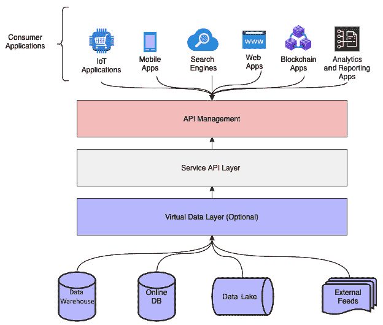

图 9.1 – DaaS 堆栈概述

如我们所见，来自不同类型的数据存储，如数据仓库、数据湖或在线数据库的数据可以通过虚拟数据层进行统一，该层可用于构建服务或 API 层。API 管理层位于数据用户和 API 层之间。API 管理层负责注册、保护、记录和编排底层服务 API。所有消费者应用程序都与 API 管理层交互，以从服务 API 中消费数据。

现在我们已经知道了什么是 DaaS，让我们来探讨一下*为什么*它很重要。

数据是新的黄金。每个组织都收集了大量的数据，但成功的组织知道如何最优地使用这些数据来推动其利润。数据收集和存储在组织内使用不同的介质进行。但为了充分利用这些数据的潜力，组织内的团队应该能够轻松且安全地访问它们。由团队维护的孤岛数据可能在整个组织中产生价值。

另一方面，将数据库暴露给组织内的各个团队可能会成为治理或安全上的头疼问题。这正是 DaaS 发挥关键作用的地方。通过使用 API 公开有价值和业务关键数据，DaaS 使团队能够在数据集上实施必要的访问和安全检查的同时与内部团队共享数据。这有助于团队轻松注册和订阅所需的数据，而不是不得不进行不必要的繁琐工作，如分析、摄取和维护由组织中的其他团队已经摄取和维护的数据集。这有助于组织内快速开发和节省在开发和维护冗余数据集上的成本。此外，DaaS 还使许多企业能够有选择地向外部世界提供数据以获取利润或实用性。

根据 Gartner 的炒作周期，DaaS 距离达到其生产力的顶峰还有很长的路要走，这意味着它有潜力成为未来十年数据工程中最具影响力的进步之一。

## 使用 DaaS 的好处

以下是使用 DaaS 的一些主要好处：

+   **敏捷性**：DaaS 使用户能够访问数据，而无需全面了解数据存储的位置或其索引方式。它还使团队能够专注于其业务功能，而不必不必要地花费时间存储和管理数据。这有助于显著缩短上市时间。

+   **易于维护**：使用 DaaS 获取数据的团队在维护方面遇到的麻烦较少，因为他们不必担心管理和维护它，也不必担心其存储和数据管道。

+   **数据质量**：由于数据是通过 API 提供的，数据更加非冗余，因此关注数据质量变得更加容易和稳健。

+   **灵活性**：DaaS 为公司提供了在初始投资与运营成本之间进行权衡的灵活性。它有助于组织在存储数据的初始设置以及持续维护成本上节省成本。它还使团队能够按需获取数据，这意味着团队不需要对这项服务做出长期承诺。这使得团队能够更快地开始使用 DaaS 提供的数据。另一方面，如果在一段时间后不再需要这些数据或用户希望迁移到更新的技术堆栈，迁移过程将变得更快、更无烦恼。DaaS 还使用户能够轻松地在本地环境或云端进行集成。

现在我们已经了解了使用 DaaS 发布数据的概念和好处，在下一节中，我们将学习如何使用 REST API 实现 DaaS 解决方案。

# 使用 Spring Boot 创建 DaaS 以公开数据

在本节中，我们将学习如何使用 Java 和 Spring Boot 公开基于 REST 的 DaaS API。但在我们尝试创建解决方案之前，我们必须了解我们将要解决的问题。

重要提示

**REST**代表**表征状态转移**。它不是一个协议或标准；相反，它提供了一些架构约束来暴露数据层。REST API 允许您将数据资源的表征状态传输到 REST 端点。这些表征可以是 JSON、XML、HTML、XLT 或纯文本格式，以便可以通过 HTTP/(S)协议进行传输。

## 问题陈述

在*第六章*“构建实时处理管道”中描述的解决方案中，我们分析了 MongoDB 基础集合中的分析数据。现在，我们希望通过一个可以按`ApplicationId`或`CustomerId`进行搜索的 DaaS 服务来公开集合中的文档。在下一节中，我们将分析、设计和实现该解决方案。

## 分析和设计解决方案

让我们分析解决给定问题的需求。首先，我们将记录所有可用的事实和信息。以下是我们所知道的事实：

+   要发布的数据存储在云中托管的 MongoDB 集合中

+   我们需要以安全和 API 管理的方式发布 DaaS

+   我们需要创建端点，以便可以通过 `ApplicationId` 或 `CustomerId` 获取数据

+   为此数据构建的 DaaS 应该是平台或语言无关的

基于这些事实，我们可以得出结论，我们不一定需要一个虚拟数据层。然而，我们需要应用程序发布两个端点——一个基于 `ApplicationId` 暴露数据，另一个基于 `CustomerId` 暴露数据。另外，由于 MongoDB 实例在云端，并且大多数使用此 DaaS 的前端应用程序也在云端，因此将此应用程序部署在 EC2 或 **弹性容器仓库**（**ECR**）实例中是有意义的。然而，由于我们没有关于将使用此 DaaS 的流量的信息，因此将应用程序容器化更有意义，这样在未来，我们可以通过添加更多容器轻松扩展应用程序。

下面的图示展示了我们问题的提出的解决方案架构：

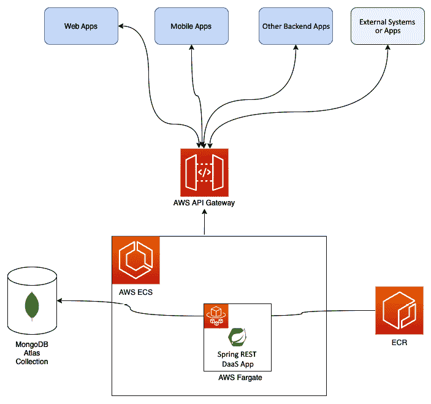

图 9.2 – DaaS 提出的解决方案架构

如我们所见，我们使用我们的 REST 应用程序从 MongoDB 读取数据并为 REST 端点检索结果。我们使用 Spring Boot 作为技术栈来构建 REST API，因为它模块化、灵活、可扩展，并提供了一个惊人的 I/O 集成范围和社区支持。我们将为该应用程序创建 Docker 容器，并使用 AWS Fargate 服务在 AWS 弹性容器服务集群中部署它们。这使我们能够在未来流量增加时快速扩展或缩减。最后，我们在部署的应用程序之上应用 API 管理层。市场上有很多 API 管理工具，包括谷歌的 APIJEE、微软的 Azure API 管理、AWS API Gateway 和 IBM 的 API Connect。然而，由于我们的堆栈部署在 AWS 上，我们将使用 AWS 的原生 API 管理工具：AWS API Gateway。

既然我们已经讨论了解决方案的整体架构，让我们更多地了解 Spring Boot 应用程序的设计。下面的图示展示了 Spring Boot 应用的底层设计：

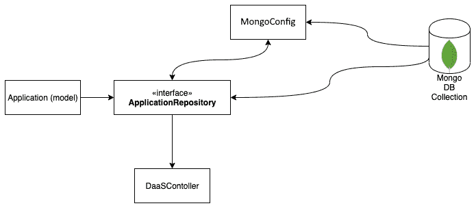

图 9.3 – Spring Boot REST 应用程序的底层设计

我们的 Spring 应用程序有一个名为 `DaaSController` 的控制器类，它公开了两个 `GET` 端点，如下所示：

+   `GET /rdaas/application/{applicationId}`

+   `GET /rdaas/customer/{id}/application`

第一个 REST 端点根据 `applicationId` 返回应用程序文档，而第二个 REST 端点使用 `customerId` 作为搜索条件返回给定客户的全部应用程序。

`MongoConfig` 类用于配置和初始化 `mongoTemplate` 和 `MongoRepository`。我们创建了一个名为 `ApplicationRepository` 的自定义 `MongoRepository`，它使用 `QueryDSL` 在运行时动态生成自定义 MongoDB 查询。控制器类使用 `ApplicationRepository` 类连接到 MongoDB，并根据请求从集合中获取文档。

因此，我们已经分析了问题并创建了解决方案设计。现在，让我们讨论如何实施这个解决方案。首先，我们将开发 Spring Boot REST 应用程序。

## 实现 Spring Boot REST 应用程序

在本节中，我们将学习如何构建 Spring Boot 应用程序以实现上一节中设计的解决方案。

首先，我们必须使用我们的 IDE 创建一个 Maven 项目，并添加以下 Spring 依赖项：

```java
<dependency>
    <groupId>org.springframework.boot</groupId>
    <artifactId>spring-boot-starter-web</artifactId>
</dependency>
<dependency>
    <groupId>org.springframework.boot</groupId>
    <artifactId>spring-boot-starter-test</artifactId>
    <scope>test</scope>
</dependency>
<dependency>
    <groupId>org.springframework.boot</groupId>
    <artifactId>spring-boot-autoconfigure</artifactId>
</dependency>
```

这些依赖项确保了所有 Spring Boot 基础依赖项以及基于 REST 的依赖项都得到满足。然而，我们必须添加与 MongoDB 相关的依赖项。以下是与 Spring 的 MongoDB 集成相关的依赖项，以及编写自定义 MongoDB 查询所需的必要 QueryDSL 依赖项：

```java
<!-- mongoDB dependencies -->
<dependency>
    <groupId>org.springframework.boot</groupId>
    <artifactId>spring-boot-starter-data-mongodb</artifactId>
</dependency>
<!-- Add support for Mongo Query DSL -->
<dependency>
    <groupId>com.querydsl</groupId>
    <artifactId>querydsl-mongodb</artifactId>
    <version>5.0.0</version>
    <exclusions>
        <exclusion>
            <groupId>org.mongodb</groupId>
            <artifactId>mongo-java-driver</artifactId>
        </exclusion>
    </exclusions>
</dependency>
<dependency>
    <groupId>com.querydsl</groupId>
    <artifactId>querydsl-apt</artifactId>
    <version>5.0.0</version>
</dependency>
<!-- https://mvnrepository.com/artifact/javax.annotation/javax.annotation-api -->
<dependency>
    <groupId>javax.annotation</groupId>
    <artifactId>javax.annotation-api</artifactId>
    <version>1.3.2</version>
</dependency>
```

除了这些依赖项之外，我们还需要将构建插件添加到 `pom.xml` 文件中。这些插件有助于动态生成 Q 类，这对于 QueryDSL 正常工作至关重要。以下是需要添加的插件：

```java
<plugins>
    <plugin>
        <groupId>org.springframework.boot</groupId>
        <artifactId>spring-boot-maven-plugin</artifactId>
    </plugin>
    <!-- Add plugin for Mongo Query DSL -->
    <plugin>
        <groupId>com.mysema.maven</groupId>
        <artifactId>apt-maven-plugin</artifactId>
        <version>1.1.3</version>
        <dependencies>
            <dependency>
                <groupId>com.querydsl</groupId>
                <artifactId>querydsl-apt</artifactId>
                <version>5.0.0</version>
            </dependency>
        </dependencies>
        <executions>
            <execution>
                <phase>generate-sources</phase>
                <goals>
                    <goal>process</goal>
                </goals>
                <configuration>
                    <outputDirectory>target/generated-sources/apt</outputDirectory>
                    <processor>org.springframework.data.mongodb.repository.support.MongoAnnotationProcessor</processor>
                    <logOnlyOnError>false</logOnlyOnError>
                </configuration>
            </execution>
        </executions>
    </plugin>
</plugins>
```

现在我们已经添加了所有必要的依赖项，我们将创建 Spring Boot 应用的入口点，即 `main` 类，如下所示：

```java
@SpringBootApplication(scanBasePackages = "com.scalabledataarch.rest")
public class RestDaaSApp {
    public static void main(String[] args) {
        SpringApplication.run(RestDaaSApp.class);
    }
}
```

根据前面的代码，`com.scalabledataarch.rest` 包中的所有 Bean 组件将在 Spring Boot 应用程序启动时递归扫描并实例化。现在，让我们使用名为 `MongoConfig` 的 `Configuration` 类创建 Mongo 配置 Bean。相应的源代码如下：

```java
@Configuration
@EnableMongoRepositories(basePackages = "com.scalabledataarch.rest.repository")
public class MongoConfig {
    @Value(value = "${restdaas.mongoUrl}")
    private String mongoUrl;
    @Value(value = "${restdaas.mongoDb}")
    private String mongoDb;
    @Bean
    public MongoClient mongo() throws Exception {
        final ConnectionString connectionString = new ConnectionString(mongoUrl);
        final MongoClientSettings mongoClientSettings = MongoClientSettings.builder().applyConnectionString(connectionString).serverApi(ServerApi.builder()
                .version(ServerApiVersion.V1)
                .build()).build();
        return MongoClients.create(mongoClientSettings);
    }
    @Bean
    public MongoTemplate mongoTemplate() throws Exception {
        return new MongoTemplate(mongo(), mongoDb);
    }
}
```

如我们所见，`MongoConfig` 类使用了 `@EnableMongoRepositories` 注解，其中配置了仓库的基本包。在基本包下扩展 `MongoRepository` 接口的所有类都将被扫描，并将创建 Spring Bean。除此之外，我们还创建了 `MongoClient` 和 `MongoTemplate` Bean。在这里，我们使用了 `com.mongodb.client.MongoClients` API 来创建 `MongoClient` Bean。

接下来，我们将创建一个模型类，它可以存储从 MongoDB 文档反序列化出来的数据。我们可以创建名为 `Application` 的模型类，如下所示：

```java
import com.querydsl.core.annotations.QueryEntity;
import org.springframework.data.annotation.Id;
import org.springframework.data.mongodb.core.mapping.Document;
@QueryEntity
@Document(collection = "newloanrequest")
public class Application  {
    @Id
    private String _id;
    private String applicationId;
```

在类上使用 `@Document` 注解并给出集合名称的值作为其参数，对于 `spring-data-mongo` 来说是重要的，以便理解这个 POJO 代表了指定集合的 MongoDB 文档结构。此外，使用 `@QueryEntity` 注解对于 QueryDSL 使用 `apt-maven-plugin` 动态生成 Q 类是必不可少的。

现在，我们将使用这个 `Application` POJO 来编写我们的自定义 Mongo 仓库，如下面的代码所示：

```java
public interface ApplicationRepository extends MongoRepository<Application, String>, QuerydslPredicateExecutor<Application> {
    @Query("{ 'applicationId' : ?0 }")
    Application findApplicationsById(String applicationId);
    @Query("{ 'id' : ?0 }")
    List<Application> findApplicationsByCustomerId(String id);
}
```

要实现自定义仓库，它必须实现或扩展`MongoRepository`接口。由于我们的`ApplicationRepository`使用 QueryDSL，它必须扩展`QuerydslPredicateExecutor`。我们可以使用`@Query`注解指定 Mongo 查询，如前面的代码所示，这将当调用相应的方法时执行。

现在，我们将创建一个名为`DaasController`的控制器类。`DaasController`类应该被注解为`@RestController`，以表明它是一个发布 REST 端点的 Spring 组件。可以使用`@RequestMapping`注解在`DaaSController`中创建端点的基路径，如下面的代码片段所示：

```java
@RestController
@RequestMapping(path = "/rdaas")
public class DaasController {
...
}
```

现在，我们将添加我们的方法，每个方法对应一个 REST 端点。下面的代码显示了其中一个方法的源代码：

```java
...
@Autowired
ApplicationRepository applicationRepository;
@GetMapping(path= "/application/{applicationId}", produces = "application/json")
public ResponseEntity<Application> getApplicationById(@PathVariable String applicationId){
  Application application = applicationRepository.findById(applicationId).orElseGet(null);
  return ResponseEntity.ok(application);
}
...
```

如我们所见，当调用 REST 端点时将被触发的那个方法被注解为`@GetMapping`或`@PostMapping`，这取决于 HTTP 方法类型。在我们的情况下，我们需要一个`GET`请求。每个映射都应该由 URL 路径和其他必要的属性作为这些注解的参数来伴随。在这个方法中，使用了自动装配的`applicationRepository`豆来使用`applicationId`字段获取 Mongo 文档。

最后，我们将创建`application.yml`文件来设置运行 Spring Boot 应用程序的配置参数。在我们的情况下，`application.yml`文件将如下所示：

```java
restdaas:
  mongoUrl: <mongo url>
  mongoDb: newloanrequest
```

如前所述的`application.yml`文件的源代码所示，我们在`application.yml`文件中配置了各种 Mongo 连接细节。

现在，我们可以通过运行`main`类在我们的本地机器上运行应用程序，并使用 Postman 进行测试，如下所示：

1.  首先，点击`ApplicationDaaS`：

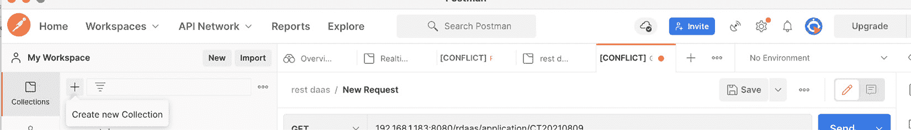

图 9.4 – 创建新的 Postman 集合

1.  使用**添加请求**选项向集合添加请求，如下面的屏幕截图所示：

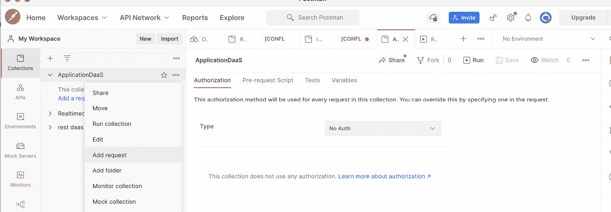

图 9.5 – 向 Postman 集合添加请求

1.  接下来，填写 HTTP 方法、REST URL 和头部的配置。现在，您可以使用**发送**按钮执行请求，如下面的屏幕截图所示：

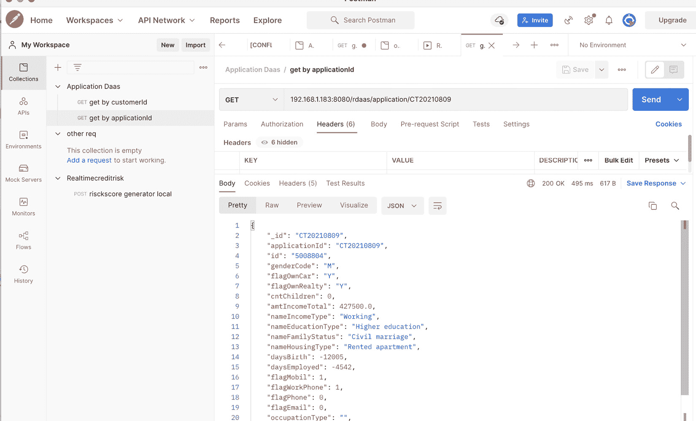

图 9.6 – 通过 Postman 测试 REST API

现在我们已经在本地测试了应用程序，让我们看看如何将其部署到 ECR。按照以下步骤在 ECR 中部署：

1.  首先，我们需要将这个应用程序容器化。为此，我们必须创建我们的 Docker 文件。这个`DockerFile`的源代码如下：

    ```java
    FROM openjdk:11.0-jdk
    VOLUME /tmp
    RUN useradd -d /home/appuser -m -s /bin/bash appuser
    USER appuser
    ARG JAR_FILE
    COPY ${JAR_FILE} app.jar
    EXPOSE 8080
    ENTRYPOINT ["java","-jar","/app.jar"]
    ```

在这里，第一行导入了一个包含预配置 OpenJDK 11 软件的基图像。在那里，我们创建了一个名为 `/tmp` 的卷。然后，我们使用 `RUN useradd` 命令向这个 Docker 容器中添加一个名为 `appuser` 的新用户。使用 `USER` 命令，我们以 `appuser` 身份登录。然后，我们将 JAR 文件复制到 `app.jar`。JAR 文件路径作为参数传递给此 `DockerFile`。将 JAR 文件路径作为参数传递将有助于我们在将来如果想要构建一个 `8080` 端口从容器中暴露出来。最后，我们使用 `ENTRYPOINT` 命令运行 `java -jar` 命令。

1.  现在，我们可以通过在命令行或终端中运行以下命令来构建 Docker 图像：

    ```java
    docker build -t apprestdaas:v1.0 .
    ```

1.  这将在本地 Docker 图像仓库中创建一个名为 `apprestdaas` 并带有 `v1.0` 标签的 Docker 图像。您可以通过以下命令在 Docker Desktop 或终端中查看图像列表：

    ```java
    docker images
    ```

现在我们已经创建了 Docker 图像，让我们讨论如何在 ECS 集群中部署此图像。

## 在 ECS 集群中部署应用程序

在本节中，我们将讨论如何在 AWS ECS 集群中部署我们的 REST 应用程序。请按照以下步骤操作：

1.  首先，我们将在 AWS ECR 中创建一个存储我们的 Docker 图像的仓库。我们需要这个仓库的 **Amazon Resource Name**（**ARN**）来标记和上传图像。首先，我们将导航到 AWS 管理控制台中的 ECR 并点击 **创建仓库**。您将看到一个 **创建仓库** 页面，如下面的截图所示：

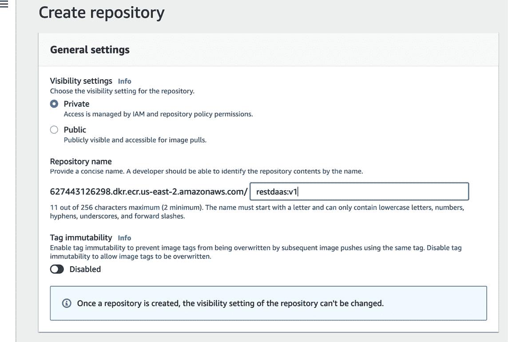

图 9.7 – 创建仓库页面

在这里，填写仓库的名称，其余字段保持不变，并提交请求。一旦创建，您将能够在 ECR 的 **私有仓库** 页面上看到仓库列表，如下所示：

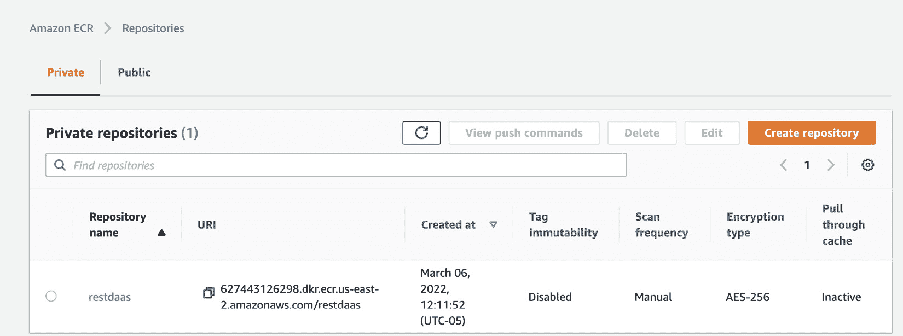

图 9.8 – ECR 仓库已创建

1.  下载最新的 AWS CLI 并安装它。然后，使用以下命令配置 AWS CLI：

    ```java
    aws configure
    ```

在配置 AWS CLI 时，您需要提供访问密钥 ID 和秘密访问密钥。您可以通过遵循 [`docs.aws.amazon.com/IAM/latest/UserGuide/id_credentials_access-keys.xhtml#Using_CreateAccessKey`](https://docs.aws.amazon.com/IAM/latest/UserGuide/id_credentials_access-keys.xhtml#Using_CreateAccessKey) 中的说明来生成这些变量。

1.  接下来，我们需要使用以下命令为 Docker 生成一个 ECR 登录令牌：

    ```java
    aws ecr get-login-password --region <region>
    ```

当您运行此命令时，将生成一个由 Docker 用于将图像推送到 ECR 所需的认证令牌。我们可以使用以下命令将前面的命令与以下命令连接起来，其中我们直接将令牌传递给 `docker login` 命令。最终的命令如下所示：

```java
aws ecr get-login-password --region <region> | docker login --username AWS --password-stdin <accountid>.dkr.ecr.<region>.amazonaws.com
```

在前面的命令中，请将 `region` 替换为正确的 AWS 区域，例如 `us-east-2` 或 `us-east-1`，并将 `accountid` 替换为正确的 AWS 账户 ID。

1.  接下来，我们将使用 ECR 仓库 URI 对本地 Docker 镜像进行标记。这对于 ECR 将正确的仓库与我们要推送的镜像进行映射是必需的。此操作的命令如下：

    ```java
    docker tag apprestdaas:v10 <accountid>.dkr.ecr.<region>.amazonaws.com/restdaas:v1
    ```

1.  现在，我们将使用以下命令将 Docker 镜像推送到 ECR 仓库：

    ```java
    docker push <accountid>.dkr.ecr.us-east-2.amazonaws.com/restdaas:v1
    ```

运行此命令后，本地 Docker 镜像将带有 `restdaas:v1` 标签推送到 ECR 仓库。

1.  现在，让我们创建一个 AWS Fargate 集群。为此，我们必须再次登录 AWS 管理控制台。在这里，搜索 `弹性容器服务` 并选择它。从 **弹性容器服务** 仪表板，在左侧面板中导航到 **集群** 并选择 **创建集群**：

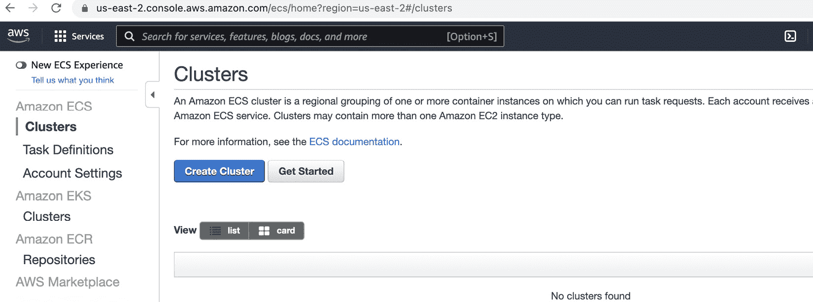

图 9.9 – 创建 ECS 集群

1.  接下来，将集群模板设置为 **仅网络** 并点击 **下一步**：

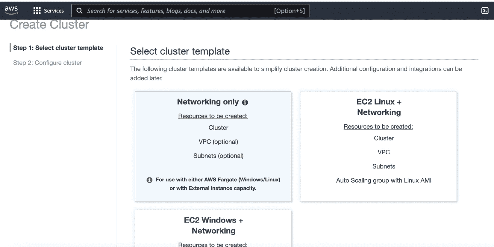

图 9.10 – 选择 ECS 集群模板

1.  然后，输入集群的名称。在这里，我们将命名为 `daas-cluster`。保留其他字段不变。现在，点击 **创建** 按钮以创建新的 ECS 集群：

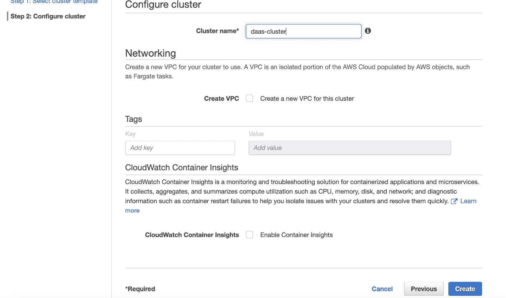

图 9.11 – 命名并创建 ECS 集群

1.  现在，我们将创建一个 ECS 任务。从 AWS ECS 控制台仪表板，从左侧菜单中选择 **任务定义**，然后点击 **创建新任务定义**，如图所示：

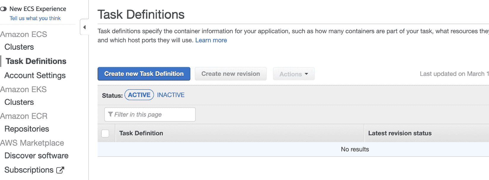

图 9.12 – 创建新的任务定义

1.  然后，在 **选择启动类型兼容性** 下，选择 **FARGATE** 并点击 **下一步**，如图所示：

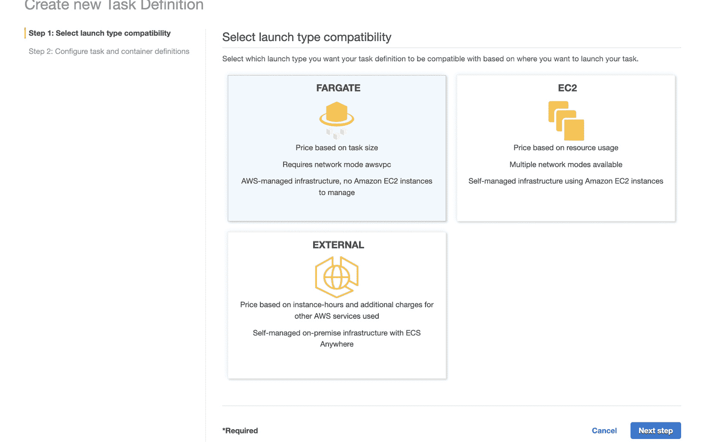

图 9.13 – 选择 ECS 任务的启动类型

1.  接下来，我们必须设置 `restdaas`。将 **任务角色** 设置为 **无** 并将 **操作系统家族** 设置为 **Linux**，如图所示：

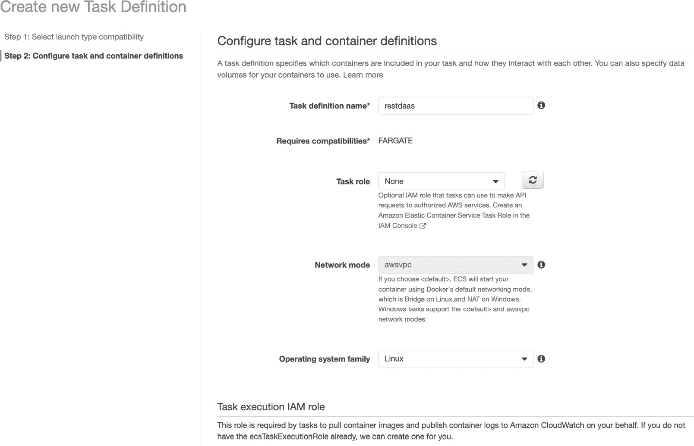

图 9.14 – 设置任务定义

保持 **任务执行角色** 不变，将 **任务内存（GB）** 设置为 **1GB**，并将 **任务 CPU（vCPU）** 设置为 **0.5 vCPU**，如图所示：

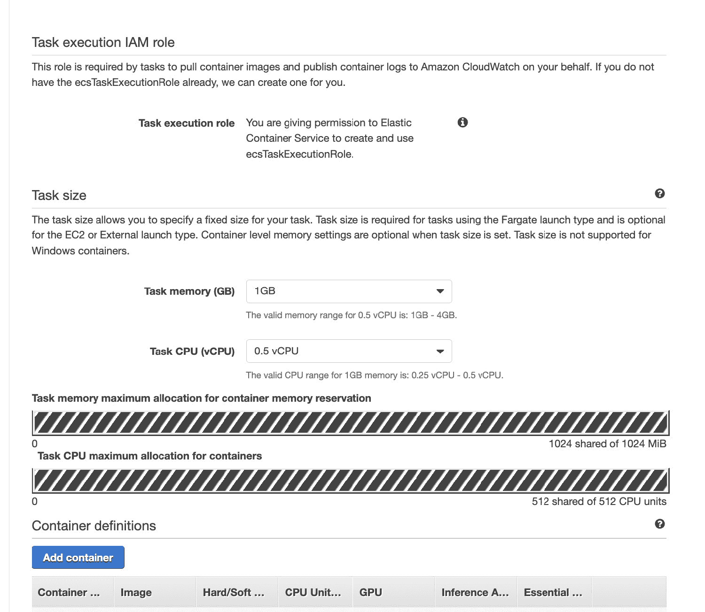

图 9.15 – 选择任务内存和任务 CPU（vCPU）值

1.  现在，我们将向 ECS 任务添加容器。我们可以通过点击 `restdaas` 作为容器名称并填写我们镜像的 ECR ARN 来添加容器，如图所示：

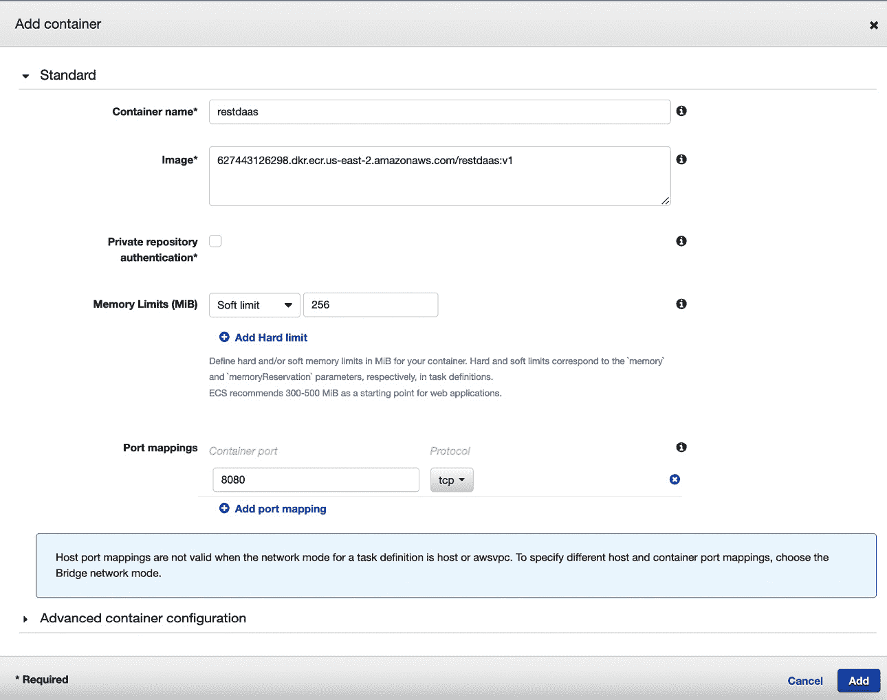

图 9.16 – 向 ECS 任务添加容器

1.  点击 **添加** 按钮以添加容器。然后，在 **创建新任务定义** 页面上点击 **创建** 按钮。这将创建新的任务，如图所示：

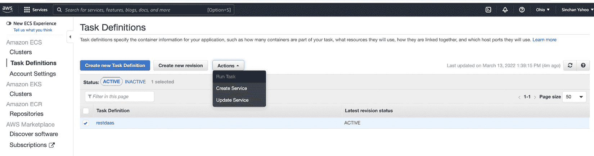

图 9.17 – 创建的 ECS 任务

如前述截图所示，我们创建的任务**restdaas**处于**活动**状态，但它尚未运行。

1.  现在，让我们运行任务。点击**操作**下拉按钮，选择**运行任务**。这将提交任务，使其处于可运行状态。点击**运行任务**后，将出现一个屏幕，我们必须填写运行任务的各种配置，如下截图所示：

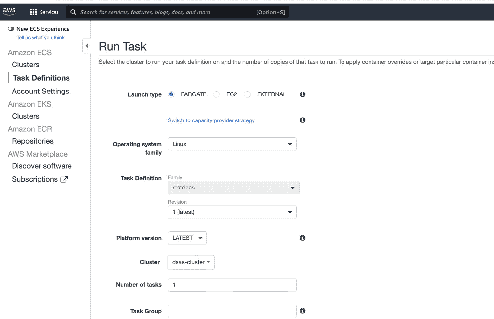

图 9.18 – 运行任务

将**启动类型**设置为**FARGATE**，并将**操作系统家族**设置为**Linux**。同时，选择任何可用的 VPC 和子网组，如下截图所示：

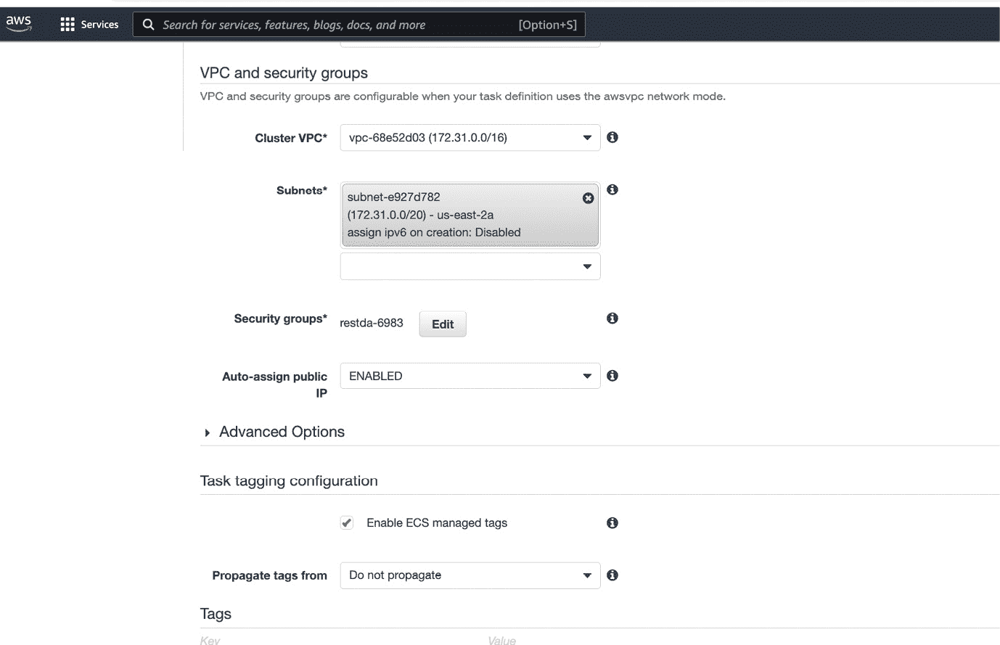

图 9.19 – 设置 VPC 和安全组

1.  如前述截图所示，请确保端口为`8080`，因为我们的 Spring Boot 应用程序将在端口`8080`上运行，如下截图所示：

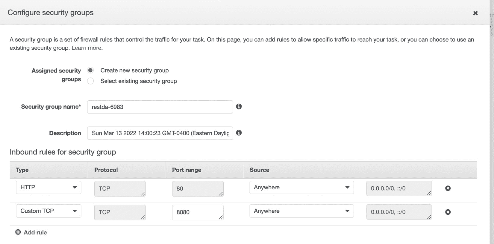

图 9.20 – 允许端口 8080

1.  保持其他字段不变，然后点击**运行任务**。通过刷新**任务**选项卡，我们可以看到任务状态从**配置中**变为**运行中**。以下截图显示了一个**运行中**的任务：

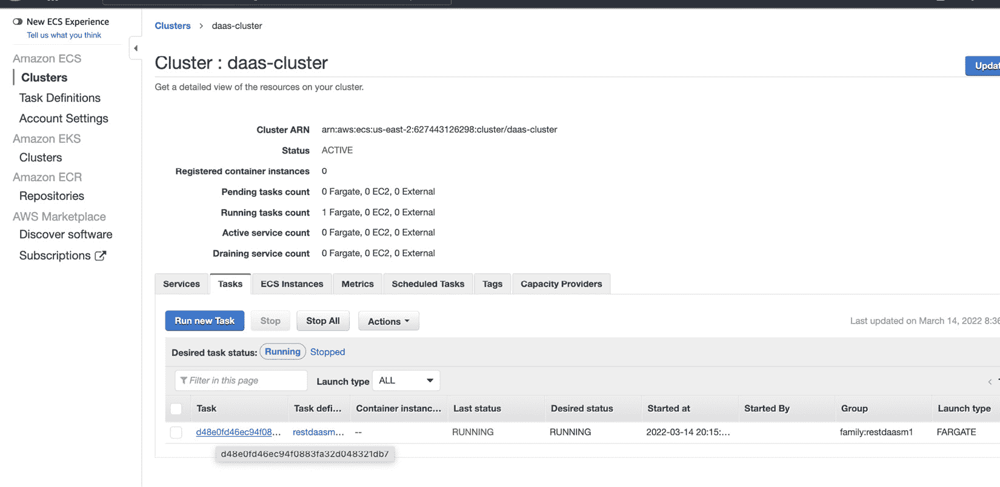

图 9.21 – 运行状态的任务

1.  现在，我们将测试我们在 ECS 中部署的 DaaS。为此，点击前述截图中**任务**列下的文本。这会带我们到**运行任务**屏幕，如下截图所示：

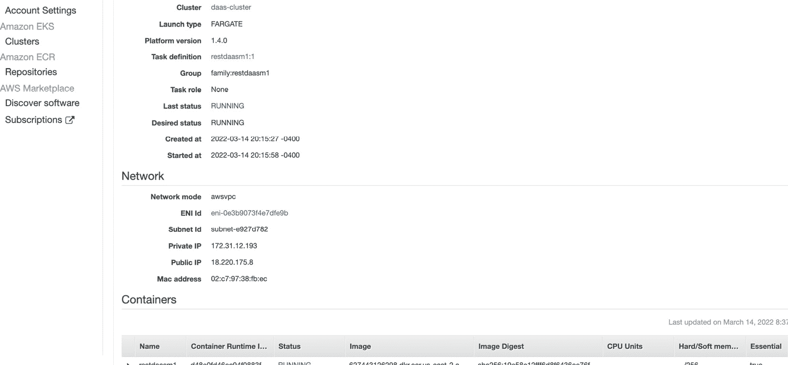

图 9.22 – 运行任务详情

如前述截图所示，我们将获取公网 IP。我们将使用此 IP 进行测试。现在，从 Postman，我们可以使用此 IP 地址和端口`8080`测试我们的 REST 端点，如下截图所示：

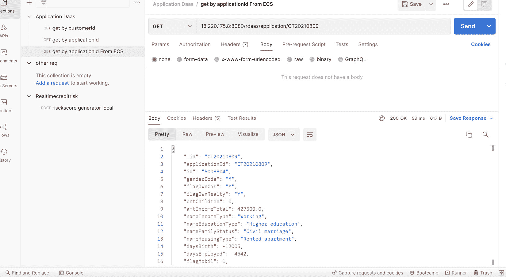

图 9.23 – 测试在 AWS ECS 中部署的 REST 端点

在本节中，我们学习了如何开发一个 REST 应用程序以发布 DaaS，将应用程序容器化，并在 AWS ECS 集群中部署它，并测试端点。在下一节中，我们将了解 API 管理的必要性，并提供一个逐步指南，将 API 管理层附加到本节中开发和部署的 REST 端点。

# API 管理

API 管理是一套工具和技术，使我们能够分发、分析和控制组织内部暴露数据和服务的 API。它可以在 API 之上充当包装器，无论这些 API 是在本地部署还是云中部署。在我们架构解决方案以通过 API 发布数据时，使用 API 管理总是一个好主意。首先，让我们了解 API 管理是什么以及它如何帮助。以下图表显示了 API 管理层在哪里以及如何提供帮助：

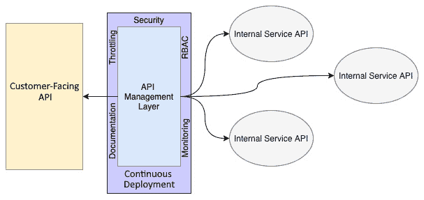

图 9.24 – API 管理如何提供帮助

如我们所见，API 管理是一个介于面向客户的 API 和内部服务 API 之间的包装层。我们可以在 API 管理层中定义资源和方法，这些资源和方法会被暴露给客户。主要来说，使用 API 管理层，架构可以得到以下好处：

+   **灵活性**：API 管理通过启用持续部署和测试，使在不同环境中轻松部署成为可能。它还提供了一个统一的接口，其中单个面向客户的 API 可以从多个复杂的内部服务 API 中获取。这使集成变得容易，并允许你发布资源，而无需创建额外的 API 来集成和管理多个 API。另一方面，在非常动态的技术环境中，内部服务 API 可能会频繁更新或其结构可能会改变。API 管理层使我们能够轻松地从旧的内部服务 API 迁移到新的 API，而无需更改或影响面向客户的 API。这为我们提供了巨大的设计灵活性，并帮助我们轻松克服内部服务 API 层中的技术债务。

+   **安全性**：API 管理以不同的方式提供安全性。首先，它使 API 能够拥有自定义授权器，如 OAuth。其次，它使客户特定的使用计划和 API 密钥成为可能。这确保只有注册了使用计划和 API 密钥的消费者才能访问应用程序。此外，它还限制了消费者每秒可以进行的交易数量。这一点加上节流功能，有助于我们避免对服务 API 的任何**分布式拒绝服务**（**DDoS**）攻击。除此之外，还可以通过 API 的 RBAC 功能启用基于角色的访问。所有这些安全特性使 API 管理成为设计 DaaS 架构的必要组件。

+   **文档**：这允许你轻松创建、发布和维护 API 的文档。发布的文档可以很容易地被 API 的消费者访问，使他们的生活变得简单。除此之外，甚至*Swagger*和*OpenAPI*规范也可以通过 API 管理进行发布和维护。

+   **分析**：使用 API 管理的主要优势之一是能够在 API 部署并用于生产时监控和分析流量、延迟和其他参数。

在本节中，我们了解了 API 管理是什么以及它如何帮助我们为 DaaS 解决方案创建一个强大的架构。在下一节中，我们将为我们之前开发的 ECS REST Service API 附加一个 API 管理层。

# 使用 AWS API 网关在 DaaS API 上启用 API 管理

在本节中，我们将讨论如何使用 AWS API 网关设置 API 管理。我们将使用本章前面在 ECS 中开发和部署的 REST DaaS API。按照以下步骤为我们的 REST DaaS API 设置 API 管理层：

1.  在 AWS 管理控制台中，搜索`AWS API Gateway`并导航到**AWS API Gateway**服务仪表板。从这里，选择**REST API**并点击**构建**，如图下所示截图：

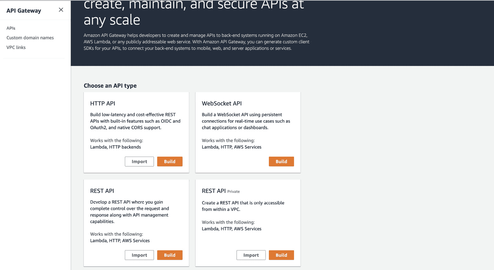

图 9.25 – AWS API 网关仪表板

1.  将打开一个新窗口，如图下所示截图。选择**REST**作为协议，然后在**创建新 API**下选择**新建 API**。填写 API 的名称和描述，然后点击**创建 API**：

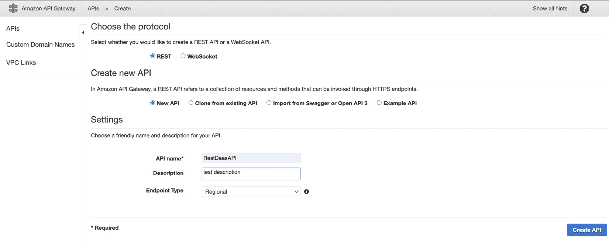

图 9.26 – 创建 REST API

1.  资源创建完成后，我们将进入 API 的详细信息。我们可以通过此界面中的**操作**下拉菜单添加资源或方法，如图下所示截图：

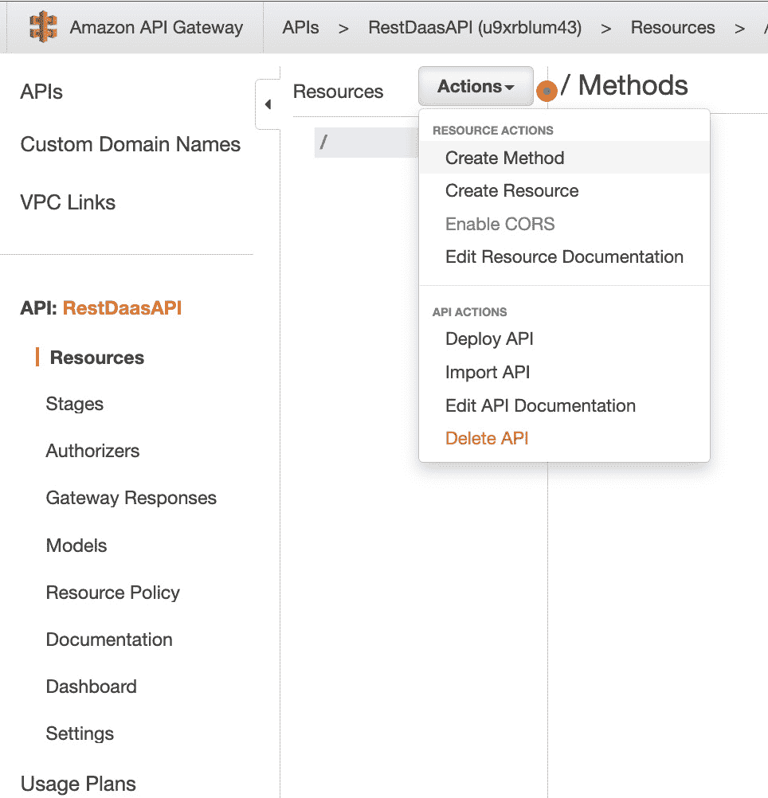

图 9.27 – 向 API 添加资源

在这里，我们将点击`/loanapplications`。然后，在`loanapplications`下添加另一个名为`appId`、路径为`/{appId}`的资源。请注意，`{}`表示`appId`是一个路径变量。最后，在`appId`资源中，我们将通过选择**创建方法**添加一个方法，如图下所示截图：

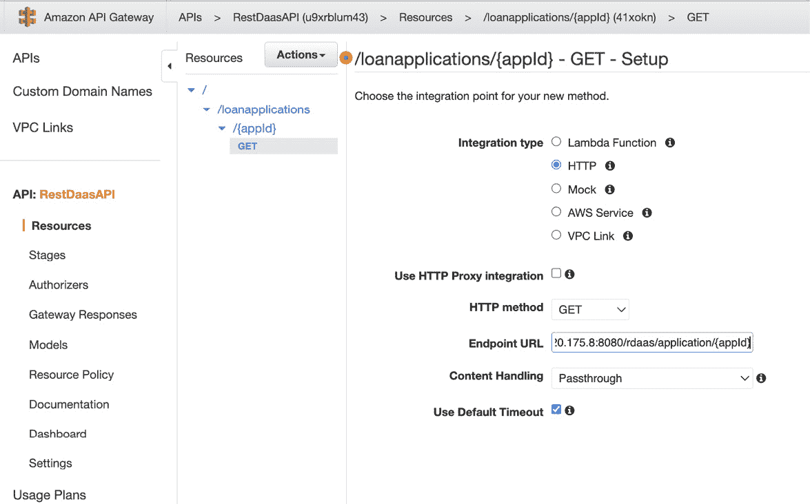

图 9.28 – 配置 GET 方法

将`/loanapplications/{appId}` API 资源设置为`/rdaas/application/{appId}` DaaS API 资源。

1.  通过从**操作**下拉菜单中选择**部署 API**选项来部署 API，如图下所示截图：

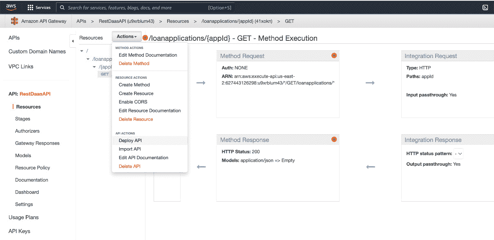

图 9.29 – 部署 API

执行此操作后，将出现一个窗口，如图下所示截图。将**部署阶段**设置为**[新阶段**]，填写阶段的名称和描述。最后，点击**部署**：

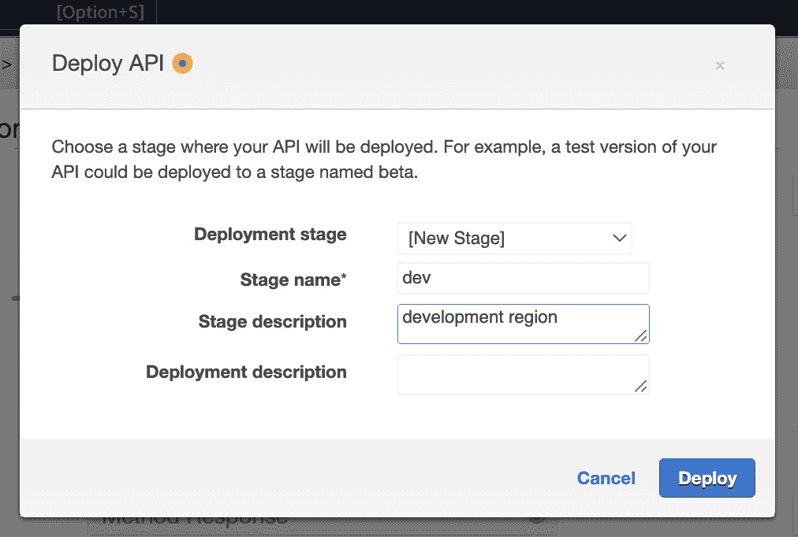

图 9.30 – 部署 API 配置

1.  现在，我们将通过 Postman 测试新的面向客户的 API。但在那之前，我们必须找出 API 的基础 URL。要做到这一点，导航到左侧面板中的**阶段**并选择**dev**。将出现**dev 阶段编辑器**页面，如下截图所示：

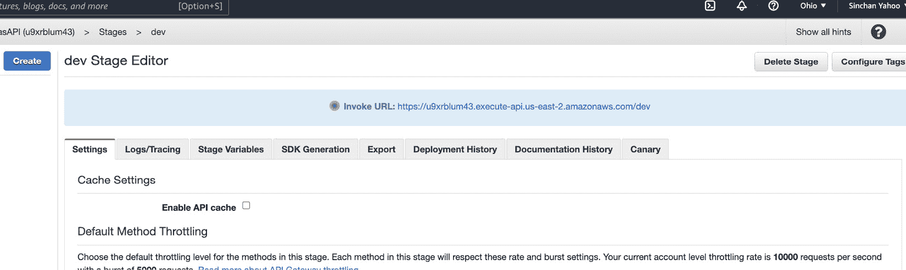

图 9.31 – 使用开发阶段编辑器获取 API 的基础 URL

如前一个屏幕截图所示，我们可以获取基础 URL。

现在，我们可以通过将消费者 API 的 URI 添加到基础路径来形成客户 API；例如，`http://<baseurl>/loanapplications/<some_app_id>`。我们可以使用这个 API 并在 Postman 中测试它，如下所示：

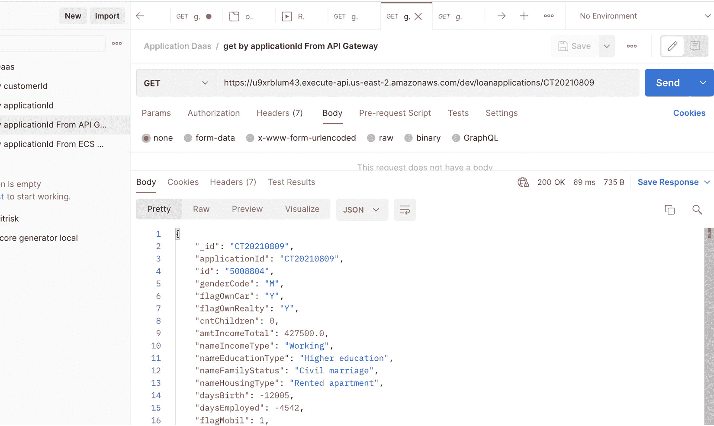

图 9.32 – 测试 AWS API Gateway 公开的外部 API（无安全措施）

我们还可以看到用于监控 API 的仪表板，如下截图所示：

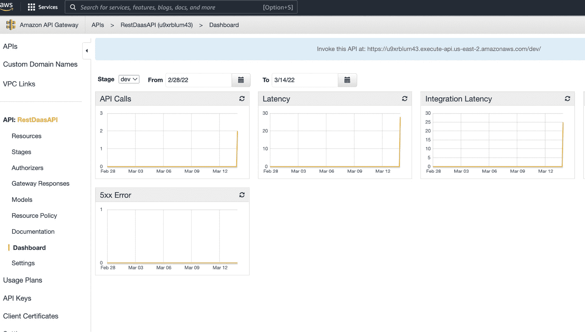

图 9.33 – RESTDaasAPI 的 AWS API Gateway 仪表板

从这个仪表板中，我们可以收集有关每天 API 调用次数的有用信息。我们还可以监控响应的延迟或随着时间的推移注意到的任何内部服务器错误。

现在我们已经添加了 API 管理层，我们将尝试向面向消费者的 API 添加基于 API 密钥的安全措施。

1.  导航到**RestDaasAPI**的**资源**面板，并在**{appId}**资源下选择**GET**方法。在配置中，将必需 API 密钥的值从**false**更改为**true**：

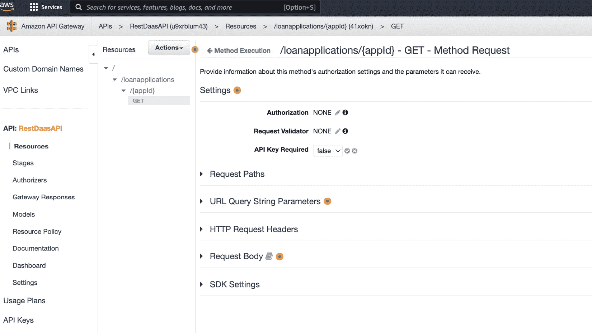

图 9.34 – 将 API 密钥的必需值更改为 true

然后，导航到**使用计划**并创建一个使用计划。设置 API 级别的节流参数和月度配额，如下截图所示：

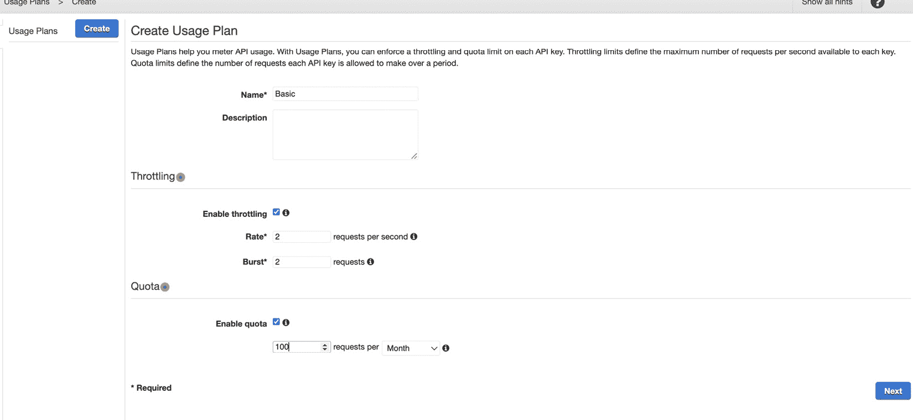

图 9.35 – 创建使用计划

点击**下一步**并设置方法级别的节流参数，如下所示：

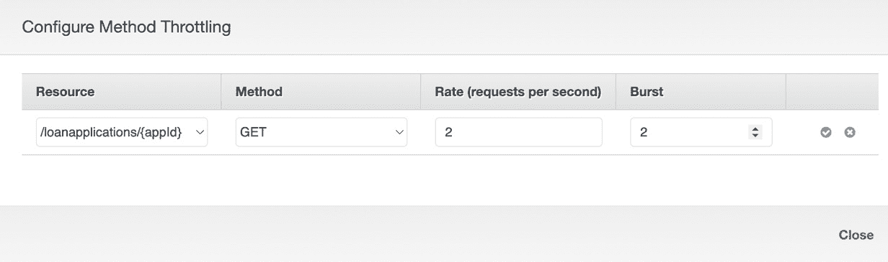

图 9.36 – 配置方法级别的节流参数

1.  点击**下一步**，通过点击**创建 API 密钥并添加到使用计划**按钮来为这个使用计划设置一个新的 API 密钥：

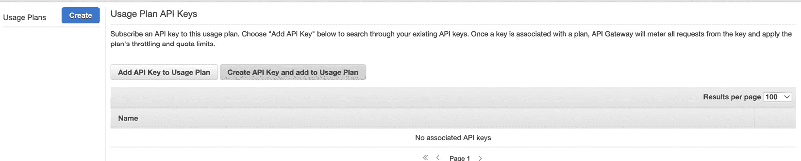

图 9.37 – 生成新的 API 密钥以附加到使用计划

1.  点击此按钮后，将出现**API 密钥**窗口。提供名称和描述。同时，将**API 密钥**设置为**自动生成**：

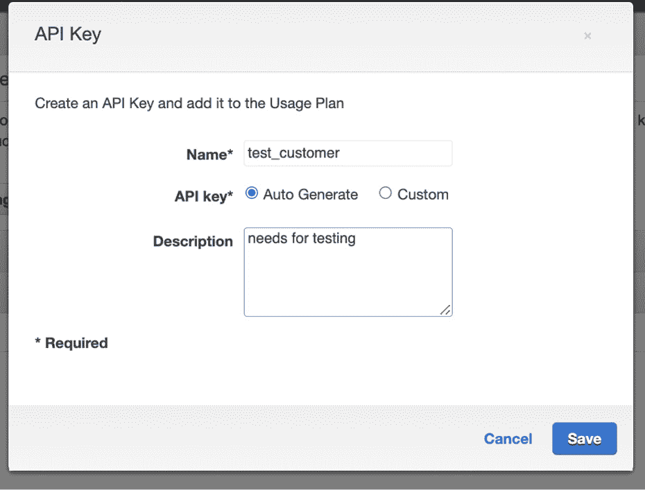

图 9.38 – API 密钥窗口

1.  保存新生成的 API 密钥并创建使用计划后，我们可以通过导航到**API 密钥**并点击**显示**选项来获取 API 密钥的值。这样做，我们可以查看生成的 API 密钥：


图 9.39 – 通过点击“显示”来展示生成的 API 密钥（突出显示）

1.  一旦你在 API 中按要求设置了 API 密钥，并且在调用 REST 端点时不在头部提供`apikey`，你将在响应体中收到一个错误消息，类似于`{"message":"Forbidden"}`。现在，你必须添加一个名为`x-api-key`的头部，其值应该是你在*步骤 9*中生成的 API 密钥。然后，你可以通过 Postman 测试安全的 API，并附带 API 密钥，如下面的截图所示：

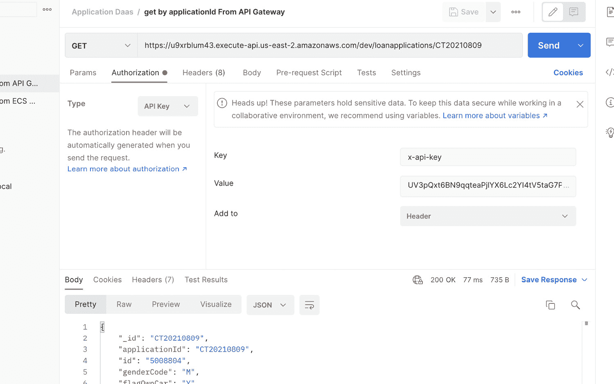

图 9.40 – 测试 AWS API Gateway 暴露的外部 API（带有安全功能）

在本节中，我们学习了如何在我们的 REST DaaS API 之上创建一个 API 管理层。我们还讨论了 AWS API Gateway 如何帮助监控和保障 API。

现在，让我们总结一下本章所学的内容。

# 摘要

在本章中，我们学习了 DaaS 的基础知识。首先，我们讨论了如何使用 Spring Boot 开发和测试基于 REST 的 DaaS API。然后，我们学习了如何将应用程序容器化并将容器发布到 AWS ECR 仓库。我们还学习了如何将发布在 AWS ECR 仓库中的容器部署到 AWS ECS 集群。之后，我们学习了如何使用云管理的 Fargate 服务运行此应用程序。然后，我们学习了 API 管理和其优势。最后，我们使用 AWS API Gateway 实现了一个 API 管理层，以在 REST DaaS API 之上提供安全和监控。

现在，我们已经学会了如何构建、部署、发布和管理基于 REST 的 DaaS API，在下一章中，我们将学习何时以及如何选择基于 GraphQL 的 DaaS 作为良好的设计选项。我们还将学习如何设计和开发 GraphQL DaaS API。
