# 10

# 联邦和可扩展的 GraphQL 数据即服务（DaaS）

在上一章中，我们讨论了如何使用 REST API 以平台和语言无关的格式发布摄取的数据。我们还学习了如何使用 REST API 设计和开发 **数据即服务（DaaS**）层，以及如何将应用程序容器化并在 AWS ECS 上部署。然后，我们学习了什么是 API 管理系统以及它如何帮助更有效地监控和管理 API。最后，我们学习了如何在我们基于 REST 的 DaaS 应用程序之上创建一个 API 管理层，使用 Amazon API Gateway。

在本章中，我们将学习如何使用 GraphQL 而不是 REST 来实现 DaaS。为此，我们将学习 GraphQL 是什么，以及为什么和何时应该使用它。我们将探讨 GraphQL 相对于 REST 的优点和缺点，同时讨论适用于基于 GraphQL 解决方案的各种架构模式。最后，我们将了解 GraphQL 层中联邦的力量。到本章结束时，你应该了解围绕 GraphQL 的基本概念以及何时在数据工程解决方案中使用此工具。你还将了解如何设计、实现和测试一个 GraphQL 解决方案。

在本章中，我们将涵盖以下主要主题：

+   介绍 GraphQL - 什么是 GraphQL，何时使用，为什么使用

+   GraphQL 的核心架构模式

+   一个实际用例 - 使用 GraphQL 暴露联邦数据模型

# 技术要求

对于本章，你需要以下内容：

+   需要具备 Java 的先验知识

+   OpenJDK-1.11 已安装在本地的系统上

+   Maven 已安装在本地的系统上

+   GraphQL Playground 已安装在本地的系统上

+   IntelliJ Idea 社区版或终极版已安装在本地的系统上

本章的代码可以从本书的 GitHub 仓库下载：[`github.com/PacktPublishing/Scalable-Data-Architecture-with-Java/tree/main/Chapter10`](https://github.com/PacktPublishing/Scalable-Data-Architecture-with-Java/tree/main/Chapter10)。

# 介绍 GraphQL - 什么是 GraphQL，何时使用，为什么使用

在本节中，我们将探讨 GraphQL 是什么。根据 [graphql.org](http://graphql.org)，GraphQL 的官方定义是：“*GraphQL 是一种用于 API 的查询语言，以及用于使用现有数据满足这些查询的运行时。*”让我们深入一点，了解 GraphQL。

**表示状态转移（REST**）一直是跨系统发布数据的标准方式，它是平台、设备和工具/语言无关的。然而，REST 存在两个主要瓶颈：

+   为了获取不同的相关实体，我们需要多个 REST 请求。我们还必须注意 API 的不同版本。为每个实体或功能的不同端点和版本维护是一个头疼的问题。

+   在 REST 中，请求和响应参数始终是固定的。例如，有一个 REST API 返回 100 个字段。假设有一个消费者只需要 10 个字段。然而，由于响应是固定的，REST 请求将始终计算并发送所有 100 个字段。这反过来会影响性能，因为形成响应需要更多时间，以及传输更大的负载需要更多的带宽。

GraphQL 是克服这些挑战的答案。GraphQL 是由 Facebook 创建的一个开放标准或规范。它是一种用于 API 的查询语言，客户端可以在发送 GraphQL 请求时查询多个实体及其所需的字段。以下图表描述了 GraphQL 的工作方式：

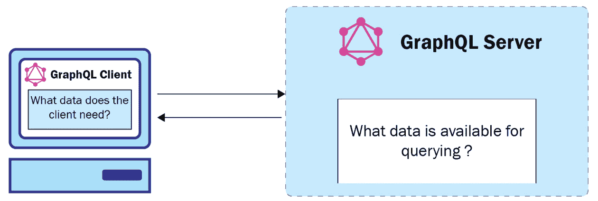

图 10.1 – GraphQL 的工作方式

如前图所示，在 GraphQL 中，是 GraphQL 客户端定义它需要什么数据，而 GraphQL 服务器发布可用的数据。因此，本质上，GraphQL 是一种通过 API 获取和更新数据的声明式方法。

让我们通过一个例子来尝试理解这一点。由于 GraphQL 是由 Facebook 创建的，我们将从一个社交网络用例中取一个例子。假设我们想要获取用户、他们的帖子以及与该帖子相关的评论。以下图表显示了如何使用 REST 来设计这一点：

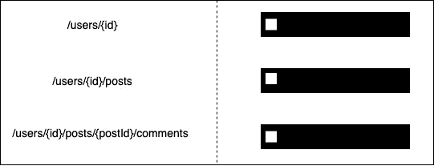

图 10.2 – 基于 REST 的设计需要三个单独的端点

如我们所见，REST 将有三个端点 – 一个用于用户，一个用于帖子，一个用于评论。要获取用户的帖子及其评论，REST 将需要一次用户调用，一次帖子调用，以及每个帖子一次评论调用。以下图表显示了这一点：

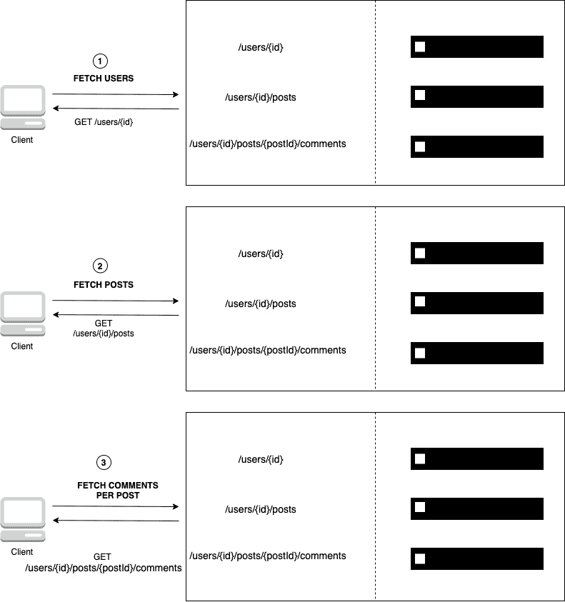

图 10.3 – 使用 REST 时需要三个单独的调用

如我们所见，在这个用例中，至少需要三个 REST 调用来获取数据（假设用户只有一个帖子）。想想一个真实社交平台上的用户需要多少次调用。如果用户发布了 *n* 个帖子，那么获取这些信息的调用次数将是 *n+2*。这会严重影响用户体验和网站性能。然而，在 GraphQL 中，只需要一次调用就可以获取这些信息。以下图表显示了 GraphQL 请求的外观：

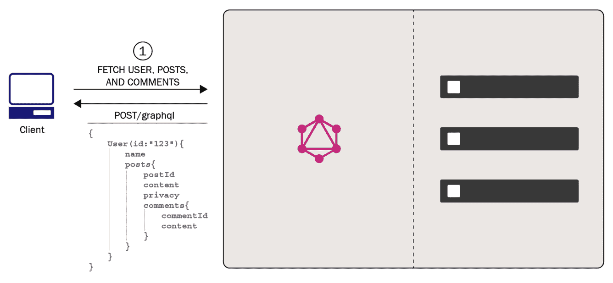

图 10.4 – 单个 GraphQL 调用可以获取所有所需数据

如您所见，GraphQL 的请求负载声明了它需要获取的实体和字段。因此，GraphQL 客户端确定它需要什么数据。

## 操作类型

现在我们已经了解了什么是 GraphQL，让我们尝试了解 GraphQL 支持的各种操作类型，如下所示：

+   **查询**：这些有助于查询 API，并且仅支持数据读取操作。以下是一个示例查询：

    ```java
    query myquery{
      byApplicationId(applicationId:"CT20210809"){
        applicationId
        id
        riskScore
      }
    }
    ```

如前一个有效载荷所示，你可以选择性地使用一个关键字查询，后跟你想分配给查询的名称（在这里，它是`myquery`）。`byApplicationId`是 GraphQL 中的一个查询（类似于 REST 中的端点），它将请求参数作为参数。在这里，`byApplicationId`查询接受一个名为`applicationId`的参数。此外，正如你所看到的，请求包含了它希望返回的字段名称，例如`applicationId`、`id`和`riskscore`。

+   **突变**：突变支持读取和写入操作。以下是一个示例查询：

    ```java
      mutation updateApplicationMutation { updateApplication(status:"closed") { 
    applicationId
    custId
    status
    } 
    } 
    ```

如前述代码所示，可以使用`mutation`关键字对突变进行标记。这里，它更新数据库中的应用程序状态。因此，它用于写入数据。

+   **订阅**：除了查询和突变之外，GraphQL 还支持订阅。与查询类似，它们用于获取数据，但它们使用长期连接，其结果会随时间变化。这允许通过服务器向客户端推送更改的事件通知模式。以下代码展示了订阅查询的示例：

    ```java
     type subscription{
       commentsforPost(postId: "123ty4567"){
       commentId
       text
      ...
      }
    }
    ```

在这里，我们通过`postId`订阅了帖子的评论。因此，客户端和 GraphQL 服务器之间建立了一个长期连接。GraphQL 服务器会自动将评论上的任何更改推送到客户端。

现在，让我们讨论 GraphQL 模式。GraphQL 模式是客户端和服务器之间的一个合约。它声明了在 GraphQL 中可用的操作和字段。它是强类型的，并使用标准的**模式定义语言**（**SDL**）编写。以下代码块展示了 GraphQL 模式的一个示例：

```java
type Application {
  applicationId: ID!
  id: String!
  genderCode: String
  cars: [String]
 ...
}
```

在前面的代码块中，`applicationId`字段是`ID`数据类型，`genderCode`是`String`数据类型，等等。在 SDL 中，GraphQL 模式的数据类型也称为标量；内置的数据类型表示为内置标量，自定义数据类型称为自定义标量。在定义`applicationId`时`ID`后面的感叹号表示它是一个必填字段。同样，由于其数据类型被`[]`（方括号）包裹，`cars`被定义为列表。

既然我们已经内化了 GraphQL 的基本概念，我们将探讨为什么以及何时使用 GraphQL。

## 为什么使用 GraphQL？

在本节中，我们将探讨 GraphQL 的各种优势，这些优势使其成为一个优秀的解决方案。GraphQL 的优势如下：

+   **为平台无关的 API 创建强类型模式**：通常，在 SOAP 和 REST API 中，我们的响应是一个平台无关的结构，如 XML 或 JSON。然而，这些格式都不是强类型的。在 GraphQL 中，模式中的每个字段都必须有一个标量类型（它可以是内置的标量类型或自定义的）。这确保了 GraphQL 更少出错，更经过验证，并为像 GraphQL Playground 这样的编辑器提供了易于自动补全的功能。以下截图显示了 GraphQL Playground 提供的自动补全建议：

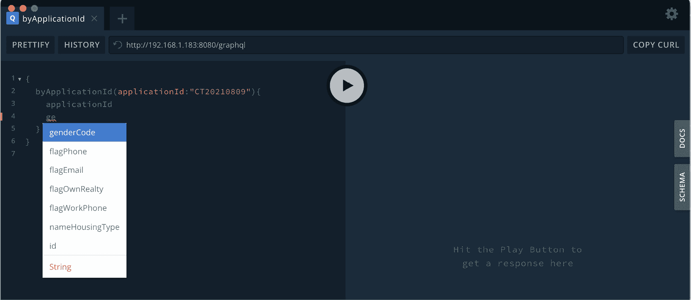

图 10.5 – GraphQL Playground 中的自动补全功能

+   **无过度获取或未充分获取**：在 GraphQL 中，客户端只能获取它需要的数据。例如，如果一个 GraphQL API 在其 API 响应中支持数百个字段，客户端不需要获取所有这些字段。如果客户端只需要 10 个字段，客户端可以请求 GraphQL API 仅发送这些字段。然而，如果相同的 API 用 REST 编写，即使客户端只需要 10 个字段，响应也会返回所有字段。

在 REST 中，过度获取是一个常见问题，无论客户端需要多少字段，它总是获取响应体中定义的所有字段。例如，对于像 LinkedIn 这样的社交网络网站，一个人的个人资料包含大量列，包括人口统计列、技能集列、奖项和认证列等。可以设计两种基于 REST 的解决方案来解决这个问题：

+   **创建包含所有列的单个 API**：如果我们使用这种方法，只需要人口统计信息的客户端会遇到过度获取的问题。

+   **为人口统计、技能集、奖项和认证等创建单独的 API**：让我们看看一个客户端需要所有可用信息的场景。如果我们使用这种方法，需要多次调用才能获取数据。这会导致数据未充分获取。

因此，我们需要一个单一解决方案来解决这两种类型客户端请求的问题。GraphQL 通过允许客户端选择它想要获取的字段来解决此问题。

+   **节省时间和带宽**：GraphQL 允许你在单个 GraphQL 调用中发出多个资源请求，通过减少到 GraphQL 服务器的网络往返次数，节省了大量时间和带宽。这对于提高客户端应用程序的数据获取体验和速度特别有用。

+   **无需版本控制**：在 REST 中，当添加新字段或删除旧字段时，需要发布为新版本以支持消费者兼容性。在 GraphQL 中，版本控制不再需要——一方面，因为 GraphQL 支持从响应结构中获取部分数据，另一方面，它支持向 GraphQL 客户端发布关于已弃用字段的降级警告。

+   **模式拼接或组合多个 GraphQL 模式**：GraphQL 提供了多种方法将不同的 GraphQL 模式和 API 组合到单个端点，而无需大量编码或实现上的麻烦。此功能有助于开发一个单一、集中的 GraphQL 网关。一个 GraphQL 网关允许从单个端点消费多个 GraphQL API。它还允许未来无缝地动态添加新的 GraphQL API。这使得 GraphQL 兼容和可扩展。通过 Apollo GraphQL Federation 和 Atlassian GraphQL Braids 等技术可以实现模式组合。

现在，让我们看看何时应该使用 GraphQL。

## 何时使用 GraphQL

以下是一些 GraphQL API 比 REST API 更好的场景：

+   带宽使用量重要的应用程序，例如移动应用程序或物联网设备应用程序。

+   需要获取嵌套数据的应用程序。GraphQL 可以节省大量时间和带宽，从而提高 GraphQL 客户端的性能。

+   发布 DaaS 的应用程序。在这里，这个 DaaS 被多个下游团队消费，他们有不同的数据获取需求。

+   当启用 GraphQL 功能，如响应的部分数据获取，通过组合多个 API 来暴露单个端点，以改善基于遗留 REST 的应用程序的消费者体验时。

在本节中，我们学习了 GraphQL 是什么，并探讨了 GraphQL 常用的典型用例。在下一节中，我们将讨论在行业中广泛使用的最流行的 GraphQL 模式。

# GraphQL 的核心架构模式

在本节中，我们将讨论用于 GraphQL 的各种架构模式。这些模式与实现它的技术或部署和执行的平台无关。以下是五种不同的 GraphQL 模式：

+   **DaaS 模式**：在这里，GraphQL 服务器用于暴露数据库层。它可以暴露三种操作——查询、突变和订阅（请参阅本章的 *操作类型* 部分）。使用这些操作，它可以实现 **创建、读取、更新和删除**（**CRUD**）操作，就像 REST 一样，但还支持在其之上进行订阅。以下图表展示了此模式：

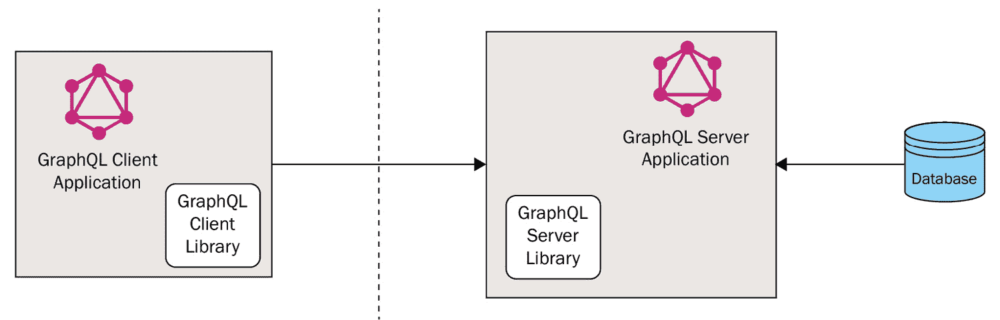

图 10.6 – DaaS 模式

如我们所见，GraphQL 使用 HTTP 协议公开其查询和操作。GraphQL 在多种语言中提供服务器库，使用这些库，团队可以构建和运行 GraphQL 服务器应用程序。此外，GraphQL 还支持多种不同语言的 GraphQL 客户端库。支持的语言列表可在 [`graphql.org/code/`](https://graphql.org/code/) 查找。

+   **集成层模式**：在这里，GraphQL 服务器提供数据，一次提供对多个数据源的访问。这使得 GraphQL 能够像一个数据集成中心。以下图表描述了集成层模式的工作原理：

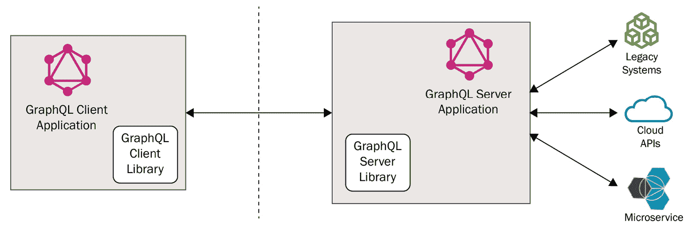

图 10.7 – 集成层模式

如我们所见，GraphQL 服务器正在充当集成中心。它使客户端能够进行单个调用，但 GraphQL 服务器从不同的生态系统（如微服务、遗留应用程序和云 API）中获取数据，并向客户端发送统一的响应。这自动减少了 GraphQL 客户端必须进行的复杂性和调用次数。

+   **混合模式**：第三个 GraphQL 模式被称为混合模式，因为它探索了前两种模式的混合方法。在这里，GraphQL 服务器不仅需要连接到微服务和遗留系统，还需要连接到数据库。以下图显示了此模式：

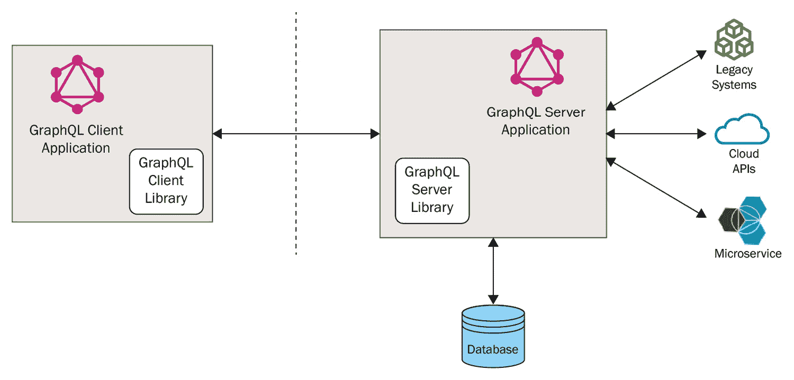

图 10.8 – 混合模式

如我们所见，GraphQL 服务器除了连接到不同的应用程序（如微服务和遗留系统）之外，还有自己的数据库。因此，当使用此模式时，GraphQL 为其客户端提供了对不同数据源的统一访问。

+   **带有管理 API 的 GraphQL**：为了在企业中公开 GraphQL API，必须启用安全和监控。在此模式中，API 网关为 GraphQL 服务器提供监控、安全和节流。以下图显示了此模式：

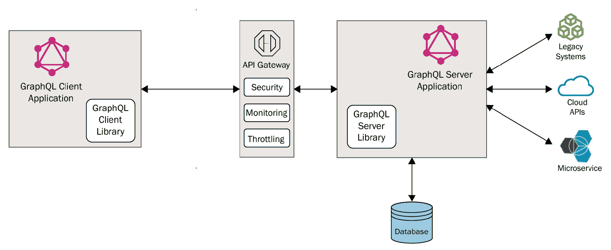

图 10.9 – 带有管理 API 的 GraphQL

+   **联邦 GraphQL 模式**：在这里，创建了一个集中的 GraphQL 编织或联邦 GraphQL 服务器。其他 GraphQL 节点连接到这个 GraphQL 编织。这些节点中的每一个，反过来，从数据库、微服务或遗留应用程序中获取数据。以下图显示了联邦 GraphQL 模式：

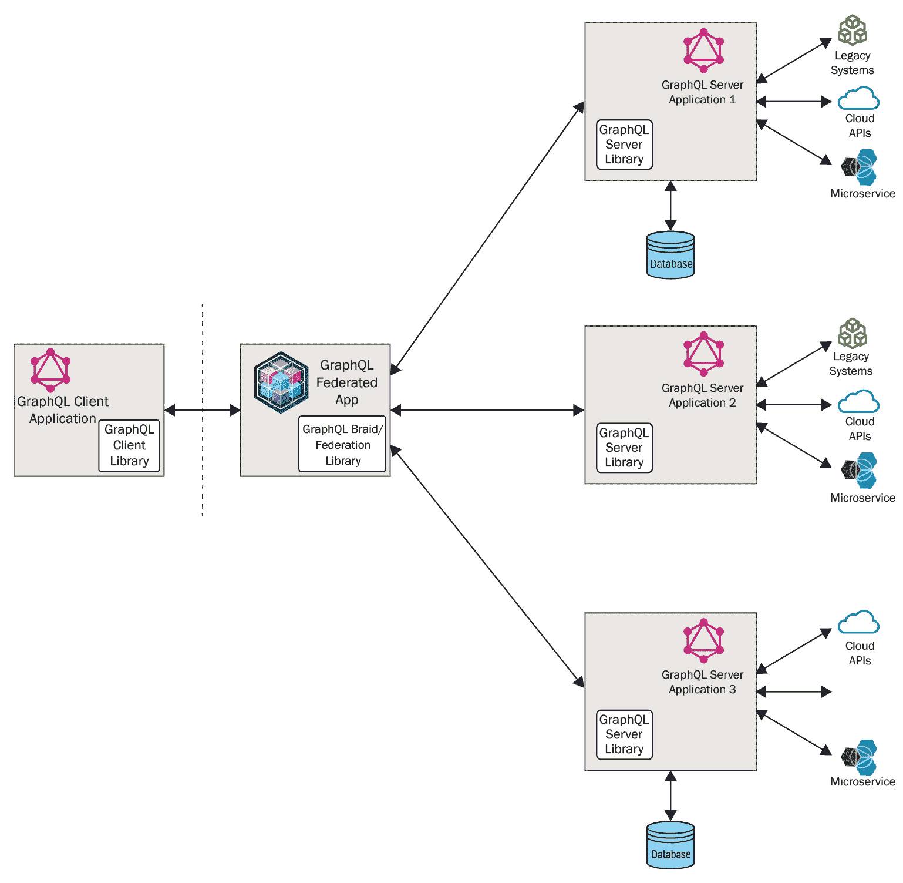

图 10.10 – 联邦 GraphQL 模式

这种模式的真正力量在于其惊人的可扩展性和数据联邦。可以在任何时间无缝地将新节点添加到 GraphQL 编织中，而无需任何应用程序停机时间。

在本节中，我们了解了各种核心 GraphQL 模式，它们的操作方式以及何时使用它们。在下一节中，我们将学习如何开发 GraphQL 服务器应用程序。

# 一个实际用例 – 使用 GraphQL 暴露联邦数据模型

在本节中，我们将学习如何使用 Java 开发 DaaS（数据即服务）使用 GraphQL。为了实现解决方案，我们将发布与之前使用 REST 发布的相同的一组 API，但这次我们将使用 GraphQL 来实现解决方案。

在我们开始实现 GraphQL 之前，设计适合我们用例的 GraphQL 模式非常重要。在我们的用例中，我们需要使用应用程序 ID 或消费者 ID 从 MongoDB 读取信用卡申请。这就是为什么在基于 REST 的解决方案中需要两个单独的端点（请参阅 *第九章*，*将 MongoDB 数据作为服务公开*，有关基于 REST 的 DaaS 解决方案）。

让我们从不同的角度分析需求 – 即，在考虑基于 GraphQL 的解决方案的同时。GraphQL 带来的最大不同之处在于它减少了端点数量以及调用次数。因此，对于我们的用例，我们将只有一个端点。此外，根据我们的用例，我们只对获取数据感兴趣。因此，我们只会使用 `Query` 类型的操作。为了支持 GraphQL 中的多个功能，我们必须在查询中有多个这样的字段，这些字段可以接受如下参数：

```java
type Query{
    customerById(id: String):Customer
    customerByName(firstname: String, lastName: String): [Customers]
}
```

在我们的情况下，我们需要两个这样的字段 – `byApplicationId` 和 `byCustomerId`，它们都应该返回一个名为 `Application` 的自定义类型。以下代码片段显示了我们的 GraphQL 模式的一部分：

```java
type Query{
    byApplicationId(applicationId: ID):Application
    byCustomerId(custId: String):[Application]
}
```

如前述代码块所示，`byApplicationId` 总是只返回一个 `Application`，因为 `applicationId` 是主键。因此，`byApplicationId` 是 `Application` 类型。然而，由于同一个客户可能有多个应用程序，`byCustomerId` 是 `[Application]` 类型，表示 `Application` 的列表。现在，让我们在 GraphQL 模式中定义类型 – `Application`。以下代码块显示了 `Application` 类型的 SDL：

```java
type Application {
    applicationId: ID!
    id: String!
    genderCode: String
    flagOwnCar: String
    flagOwnRealty: String
    cntChildren: Int
    amtIncomeTotal: Float
    nameIncomeType: String
    nameEducationType: String
    nameFamilyStatus: String
    nameHousingType: String
...
}
```

在此，在 `Application` 类型的 SDL 中，`applicationId` 是 `ID` 类型，表示它是 `Application` 类型的唯一键。此外，在 `applicationId` 和 `id` 字段中看到的感叹号（`!`）表示这些字段是非可空的。完整的模式可在 [`github.com/PacktPublishing/Scalable-Data-Architecture-with-Java/blob/main/Chapter10/sourcecode/GraphQLDaas/src/main/resources/schema.graphqls`](https://github.com/PacktPublishing/Scalable-Data-Architecture-with-Java/blob/main/Chapter10/sourcecode/GraphQLDaas/src/main/resources/schema.graphqls) 找到。

要创建 Spring Boot Maven 项目并添加所需的 Maven 依赖项，应在 `pom.xml` 文件中添加以下 Maven 依赖项：

```java
<dependency>
    <groupId>org.springframework.boot</groupId>
    <artifactId>spring-boot-starter-web</artifactId>
</dependency>
<dependency>
    <groupId>org.springframework.boot</groupId>
    <artifactId>spring-boot-starter-test</artifactId>
    <scope>test</scope>
</dependency>
<dependency>
    <groupId>org.springframework.boot</groupId>
    <artifactId>spring-boot-autoconfigure</artifactId>
</dependency>
```

除了这个之外，还应该在 Spring Boot 应用程序中添加以下依赖项以支持 MongoDB 相关依赖项以及 QueryDSL 相关依赖项：

```java
<!-- mongoDB dependencies -->
<dependency>
    <groupId>org.springframework.boot</groupId>
    <artifactId>spring-boot-starter-data-mongodb</artifactId>
</dependency>
<!-- Add support for Mongo Query DSL -->
<dependency>
    <groupId>com.querydsl</groupId>
    <artifactId>querydsl-mongodb</artifactId>
    <version>5.0.0</version>
    <exclusions>
        <exclusion>
            <groupId>org.mongodb</groupId>
            <artifactId>mongo-java-driver</artifactId>
        </exclusion>
    </exclusions>
</dependency>
<dependency>
    <groupId>com.querydsl</groupId>
    <artifactId>querydsl-apt</artifactId>
    <version>5.0.0</version>
</dependency>
```

除了这些依赖项之外，我们还需要在 `pom.xml` 文件中添加构建插件。这些插件有助于动态生成 Q 类，这对于 QueryDSL 正常工作来说是必需的。以下插件需要添加：

```java
<plugin>
    <groupId>com.mysema.maven</groupId>
    <artifactId>apt-maven-plugin</artifactId>
    <version>1.1.3</version>
    <dependencies>
        <dependency>
            <groupId>com.querydsl</groupId>
            <artifactId>querydsl-apt</artifactId>
            <version>5.0.0</version>
        </dependency>
    </dependencies>
    <executions>
        <execution>
            <phase>generate-sources</phase>
            <goals>
                <goal>process</goal>
            </goals>
            <configuration>
                <outputDirectory>target/generated-sources/apt</outputDirectory>
                <processor>org.springframework.data.mongodb.repository.support.MongoAnnotationProcessor</processor>
                <logOnlyOnError>false</logOnlyOnError>
            </configuration>
        </execution>
    </executions>
</plugin>
```

还需要在项目的 POM 文件中添加 GraphQL 相关依赖项。以下 GraphQL 依赖项需要添加：

```java
<!-- GraphQL dependencies -->
<dependency>
    <groupId>com.graphql-java</groupId>
    <artifactId>graphql-java</artifactId>
    <version>11.0</version>
</dependency>
<dependency>
    <groupId>com.graphql-java</groupId>
    <artifactId>graphql-java-spring-boot-starter-webmvc</artifactId>
    <version>1.0</version>
</dependency>
```

如前述代码块所示，要在 Java 中实现 GraphQL 服务器，我们需要导入 `graphql-java` 依赖项和名为 `graphql-java-spring-boot-starter-webmvc` 的 GraphQL Spring Boot Starter JAR 文件。

现在我们已经添加了所有必要的依赖项，我们将创建 Spring Boot 应用程序的入口点，即 `Main` 类，如下所示：

```java
@SpringBootApplication
public class GraphqlDaaSApp {
    public static void main(String[] args) {
        SpringApplication.run(GraphqlDaaSApp.class,args);
    }
}
```

首先，我们将创建 `MongoConfig` 类，它创建两个 `MongoClient` 和 `MongoTemplate` 类型的 Mongo Spring Bean，如下面的代码块所示：

```java
@Bean
public MongoClient mongo() throws Exception {
    final ConnectionString connectionString = new ConnectionString(mongoUrl);
    final MongoClientSettings mongoClientSettings = MongoClientSettings.builder().applyConnectionString(connectionString).serverApi(ServerApi.builder()
            .version(ServerApiVersion.V1)
            .build()).build();
    return MongoClients.create(mongoClientSettings);
}
@Bean
public MongoTemplate mongoTemplate() throws Exception {
    return new MongoTemplate(mongo(), mongoDb);
}
```

现在，我们将创建一个名为 `Application` 的 POJO 类，它代表数据模型。它应该由 `org.springframework.data.mongodb.core.mapping.Document` 注解和 `com.querydsl.core.annotations.QueryEntity` 注解标注。以下代码表示 `Application` 实例：

```java
@QueryEntity
@Document(collection = "newloanrequest")
public class Application {
    @Id
    private String _id;
    private String applicationId;
```

在这里，`@Document` 表示 POJO 是一个映射到 MongoDB 文档的 Bean，而 `@QueryEntity` 是必需的，以启用 QueryDSL 在 `Application` Bean 上的查询功能。

现在，就像在*第九章*中讨论的基于 REST 的解决方案一样，*将 MongoDB 数据作为服务公开*，我们必须创建一个 `ApplicationRepository` 接口，它扩展了 `MongoRepository` 和 `QuerydslPredicateExecutor` 接口。使用这个类，我们将定义两个方法，使用 QueryDSL 从 MongoDB 获取应用程序数据。以下代码片段是 `ApplicationRepository` 类的：

```java
public interface ApplicationRepository extends MongoRepository<Application, String>, QuerydslPredicateExecutor<Application> {
    @Query(value = "{ 'applicationId' : ?0 }")
    Application findApplicationsById(String applicationId);
    @Query(value = "{ 'id' : ?0 }")
    List<Application> findApplicationsByCustomerId(String id);
}
```

我们将跳过解释这个仓库接口，因为它与我们之前在第十章创建的接口相同。

现在我们已经完成了 DAO 层的开发，让我们创建一个名为 `helper` 的包。在 GraphQL Java 应用程序中，我们需要两种类型的类——一个是 GraphQL 提供者，另一个是 GraphQL 数据获取器。在这里，我们将从 `helper` 包开始编写提供者类。在 `GraphQLProvider` 类中，首先，我们将定义一个 `graphql.GraphQL` 类型的属性，并在 `GraphQLProvider` Bean 由 Spring Boot 初始化时立即初始化它。以下是这个的代码片段：

```java
...
import graphql.GraphQL;
...
@Component
public class GraphQLProvider {
...
private GraphQL graphQL;
@PostConstruct
public void init() throws IOException {
    URL url = Resources.getResource("schema.graphqls");
    String sdl = Resources.toString(url, Charsets.UTF_8);
    GraphQLSchema graphQLSchema = buildSchema(sdl);
    this.graphQL = GraphQL.newGraphQL(graphQLSchema).build();
}
private GraphQLSchema buildSchema(String sdl) {
    TypeDefinitionRegistry typeRegistry = new SchemaParser().parse(sdl);
    RuntimeWiring runtimeWiring = buildWiring();
    SchemaGenerator schemaGenerator = new SchemaGenerator();
    return schemaGenerator.makeExecutableSchema(typeRegistry, runtimeWiring);
}
private RuntimeWiring buildWiring() {
    return RuntimeWiring.newRuntimeWiring()
            .type(newTypeWiring("Query")
                    .dataFetcher("byApplicationId", graphQLDataFetchers.getApplicationbyApplicationIdDataFetcher())
                    .dataFetcher("byCustomerId",graphQLDataFetchers.getApplicationsbyCustomerIdDataFetcher()))
            .build();
}
```

一个 GraphQL 服务器应该有一个强类型、定义良好的模式（请参阅关于 GraphQL 模式的早期讨论）。在这里，在 `init` 方法中，我们从资源中加载 GraphQL 模式。使用 `com.google.common.io.Resources` 的实用方法读取并存储 GraphQL 模式定义在名为 `sdl` 的字符串中。然后，从 `sdl` 对象中派生出 `GraphQLSchema` 对象，该对象使用 `buildSchema` 方法构建。

在 `buildSchema` 方法中，使用 `SchemaParser` 解析 `sdl` 对象并将其转换为 `TypeDefinitionRegistry` 对象。运行时连接是将数据获取器、类型解析器和自定义标量连接起来的过程。首先，我们使用 `buildWiring` 方法构建完成 GraphQL 模式所需的连接。然后，使用 `SchemaGenerator.makeExecutableSchema`，我们创建一个具有所需 `runtimeWiring` 的 `GraphQLSchema` 对象。

必要的参考资料

通常，为了完全创建一个可执行的 GraphQL 模式，可能需要三种类型的绑定。它们如下所示：

- **数据获取器**，是帮助为 GraphQL 模式获取数据的接口。

- 类型解析器，是自定义方法，用于解析 GraphQL 字段的值。

- 自定义标量，指的是任何自定义的数据类型。在 GraphQL 中，数据类型被称为 **标量**。

现在，让我们讨论 `buildWiring` 方法的实现。此方法通过将 GraphQL 数据获取器附加到 GraphQL 模式中的两个不同字段（`byApplicationId` 和 `byCustomerId`）来创建一个新的 `Runtimewiring`（在本章中之前讨论了此用例的 GraphQL 模式）。

最后，使用此 `GraphQLSchema`，我们构建并实例化 GraphQL 属性。现在，我们可以通过返回此 GraphQL 对象来公开一个名为 `GraphQL` 的 Bean，如下所示：

```java
@Bean
public GraphQL graphQL() {
    return graphQL;
}
```

在实现 `buildWiring` 方法时，调用了 `GraphQLDataFetcher` 类中的两个方法 `getApplicationbyApplicationIdDataFetcher` 和 `getApplicationsbyCustomerIdDataFetcher`。因此，让我们讨论一下 `GraphQLDatafetcher` 类是如何实现的。所有数据获取器方法都必须返回一个 `graphql.schema.DataFetcher` 类型的对象。`DataFetcher` 接口的定义如下：

```java
@PublicSpi
public interface DataFetcher<T> {
    T get(DataFetchingEnvironment var1) throws Exception;
}
```

如前述代码块所示，`DataFetcher` 接口只有一个方法，该方法接受一个 `graphql.schema.DataFetchingEnvironment` 类型的参数。因此，我们可以在 Java 中将其实现为一个 Lambda 函数。在我们的案例中，我们调用 `applicationRepository` 类来获取用于填充我们发布的 `Application` 对象所需的数据。以下代码展示了 `getApplicationbyApplicationIdDataFetcher` 的实现：

```java
public DataFetcher getApplicationbyApplicationIdDataFetcher() {
    return dataFetchingEnvironment -> {
        String applicationId = dataFetchingEnvironment.getArgument("applicationId");
        return applicationRepository.findApplicationsById(applicationId);
    };
}
```

在实现 `getApplicationbyApplicationIdDataFetcher` 方法时，我们返回一个 Lambda 函数，该函数接受 `dataFetchingEnvironment` 参数。数据获取器为字段编写的所有参数都可以通过 `DataFetchingEnvironment` 类的 `getArgument` 方法访问。在这种情况下，它正在获取 `applicationId` 参数。最后，如代码片段所示，我们使用 `applicationRepository` 从 MongoDB 获取数据。类似的逻辑用于编写 `getApplicationsbyCustomerIdDataFetcher` 方法。

现在，我们需要将包含 GraphQL 模式的 `schema.graphqls` 文件保存在 `resource` 文件夹中。

最后，我们需要定义 `application.yaml` 文件来运行 Spring Boot 应用程序。`application.yaml` 文件如下所示：

```java
grahqldaas:
  mongoUrl: mongodb+srv://<mongodburl>/CRRD?retryWrites=true&w=majority
  mongoDb: CRRD
```

现在我们已经开发出了 GraphQL 服务器应用程序，让我们探索如何测试它。

首先，通过运行 `Main` 类来启动应用程序，如下截图所示：

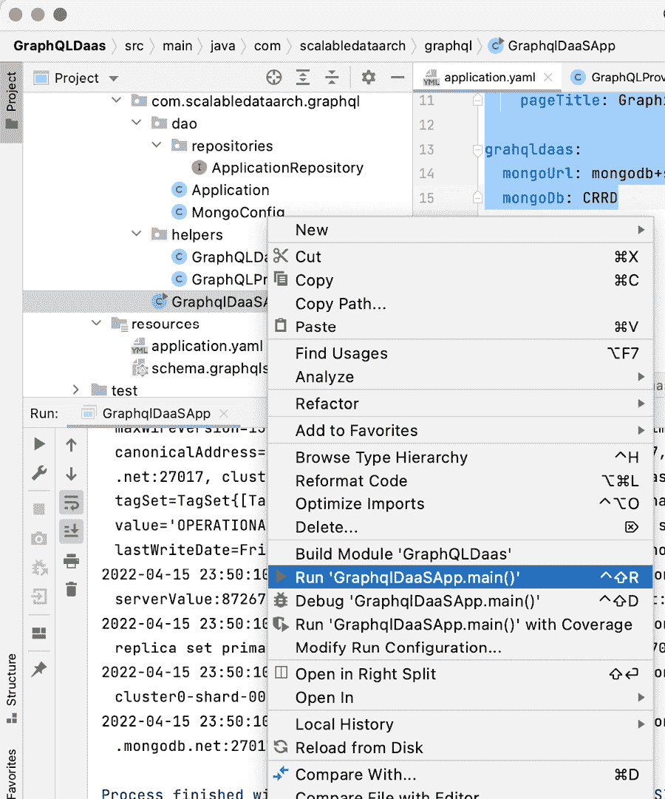

图 10.11 – 运行 GraphQL 服务器应用程序

现在，为了测试应用程序，请打开 GraphQL Playground 并输入 DaaS 端点。DaaS 端点应如下所示：

```java
http://<host_name>:8080/graphql
```

一旦你在 GraphQL Playground 上点击此 URL 并输入适当的 `graphql` 请求有效负载，你将在 GraphQL Playground 中获得结果，如下截图所示：

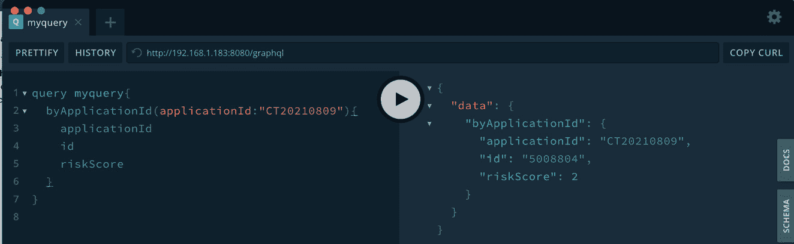

图 10.12 – 使用 GraphQL Playground 测试 GraphQL DaaS

如我们所见，在调用 GraphQL 服务应用程序时，客户端发送它想要获取的字段列表。正如请求有效负载所示，尽管 GraphQL 服务器应用程序支持更多的字段，但在本例中，客户端只请求了四个字段 – 即 `applicationId`、`genderCode`、`id` 和 `riskScore`。因此，GraphQL 仅解析并发送这四个字段回消费者。GraphQL 的这一特性有助于克服过度获取或不足获取的问题（通常在基于 REST 的 DaaS 中看到）。

此外，GraphQL 支持在单个调用中执行多个功能。在我们的用例中，我们有两个功能 – 通过 `applicationId` 获取应用程序和通过 `customerid` 获取客户的全部应用程序。这两个功能都可以使用 GraphQL 在单个调用中实现。以下截图展示了这一示例：

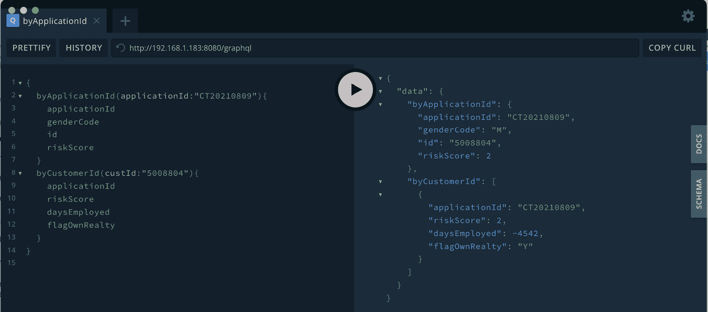

图 10.13 – 在单个 GraphQL 调用中支持多个业务操作

如我们所见，两个字段 – `byApplicationId` 和 `byCustomerId` – 都可以在单个 GraphQL 调用中请求，该调用在单个 GraphQL 响应中获取这两个字段的数据。这减少了 GraphQL 服务的调用次数，客户端可以通过减少对 GraphQL 服务器应用程序的调用来提高其应用程序的性能。

除了这两个优点之外，GraphQL 还使得架构和文档的共享变得容易。如图所示，在最右侧有两个侧边标签，分别称为 **DOCS** 和 **SCHEMA**。**SCHEMA** 可以显示服务器支持的 GraphQL 架构。它告诉我们哪些数据点可以作为此 GraphQL API 的一部分。以下截图显示了客户端如何查看 GraphQL 服务的架构：

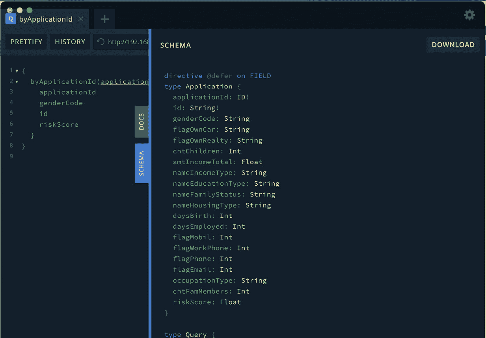

图 10.14 – 从 GraphQL Playground 检查 GraphQL 架构

除了这个之外，文档是 GraphQL 提供的另一个酷炫功能。在 REST 世界中，仅与客户端共享 API 是不够的。因此，我们需要单独构建和维护文档（无论是使用 Swagger 还是其他方式）并共享它。然而，GraphQL 允许你轻松维护和发布文档，如下面的截图所示：

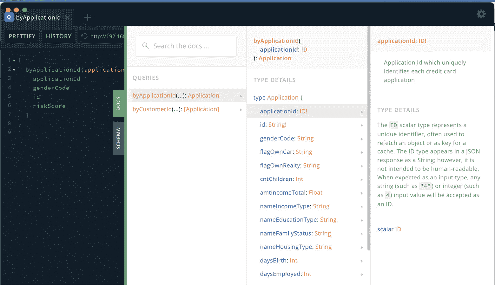

图 10.15 – 简单分享 GraphQL 文档

更有趣的是，GraphQL 文档的配置和维护非常简单。我们只需在每个字段上方添加一个文档注释，并查询它以支持文档。例如，`applicationId` 字段的文档可以轻松地集成到 GraphQL Schema SDL 中，如下面的代码块所示：

```java
...
"""
Type Application represents the entity/schema of the response payload for both byApplicationId and byCustomerId fields
"""
type Application {
    """
    Application Id which uniquely identifies each credit card application
    """
    applicationId: ID!
...
```

如我们所见，所有文档都写在文档注释中，注释以三个双引号（`""`）开始，以三个双引号（`""`）结束。GraphQL 自动使用 schema SDL 发布文档，因此维护和发布文档变得超级简单和容易。

在本节中，我们学习了如何使用 Java 开发 GraphQL 服务器应用程序。我们还了解了用于开发 GraphQL 模式的 GraphQL DSL。最后，我们学习了如何有效地使用 GraphQL Playground 测试和验证 GraphQL DaaS API。现在，让我们总结一下本章所学的内容。

# 摘要

在本章中，我们学习了 GraphQL 的基本概念。首先，我们了解了 GraphQL 如何克服基于 REST 的 DaaS 的陷阱以及它提供的优势。然后，我们讨论了何时选择 GraphQL 作为首选解决方案。最后，我们学习了如何使用 Java 开发 GraphQL 服务器应用程序以及如何使用 GraphQL Playground 测试该应用程序。

现在我们已经学习了如何为数据摄取场景和数据发布场景设计和发展数据工程解决方案，在下一章中，我们将讨论性能工程并学习如何使用数据驱动的方法来做出架构决策。

# 第四部分 – 选择合适的数据架构

在本书的最后一节，你将学习如何衡量解决方案并确定解决方案的效率。你还将学习如何向可能不太懂技术的领导/客户沟通和展示他们的解决方案。

本节包括以下章节：

+   *第十一章**，衡量性能和基准测试你的应用程序*

+   *第十二章**，评估、推荐和展示你的解决方案*
